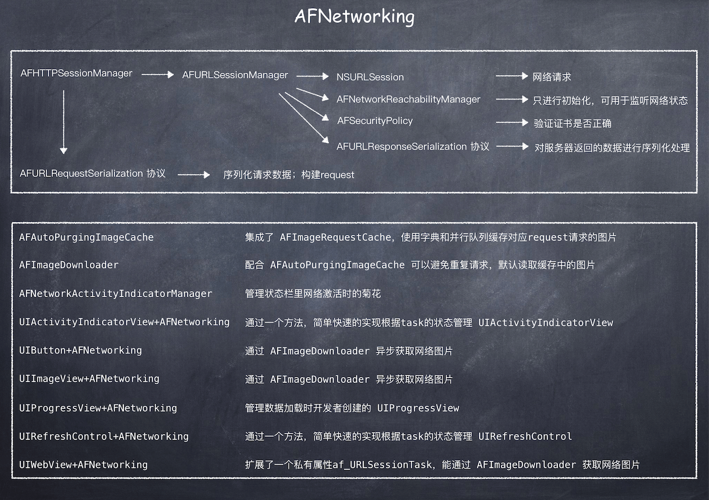

# 概述
AFHTTPSessionManager 继承自 AFURLSessionManager，它是对 AFURLSessionManager 里的方法进行了二次封装，使用时更加便捷，是网络请求最常用的类。

<!-- more -->



# AFHTTPSessionManager
下面是 AFHTTPSessionManager 引用的类：

.h 文件  

```
#import <Foundation/Foundation.h>
#if !TARGET_OS_WATCH
//提供和联网相关的function, 可用来检查网络连接状态
#import <SystemConfiguration/SystemConfiguration.h>
#endif
#import <TargetConditionals.h>

#if TARGET_OS_IOS || TARGET_OS_WATCH || TARGET_OS_TV
#import <MobileCoreServices/MobileCoreServices.h>
#else
#import <CoreServices/CoreServices.h>
#endif

#import "AFURLSessionManager.h"
```
.m 文件

```
#import "AFHTTPSessionManager.h"

#import "AFURLRequestSerialization.h"
#import "AFURLResponseSerialization.h"

#import <Availability.h>
#import <TargetConditionals.h>
#import <Security/Security.h>

#import <netinet/in.h>
#import <netinet6/in6.h>
#import <arpa/inet.h>
#import <ifaddrs.h>
#import <netdb.h>

#if TARGET_OS_IOS || TARGET_OS_TV
#import <UIKit/UIKit.h>
#elif TARGET_OS_WATCH
#import <WatchKit/WatchKit.h>
#endif
```
## 类库介绍
### SystemConfiguration

### [TargetConditionals](https://www.cocoanetics.com/2012/09/target-conditionals-and-availability/)

“Target Conditionals” 目标条件，是由 Apple 提供的，内部定义了多种方便的宏代码。如果要使用内部的一些宏，就需要导入 \<TargetConditionals.h> ，否则在用到时会提示未定义。作为判断条件这里用到的宏是：  

* TARGET_OS\_IOS
* TARGET_OS\_WATCH
* TARGET_OS\_TV    

还有几个有趣的宏：

* TARGET_IPHONE\_SIMULATOR
* TARGET_OS\_MAC
* TARGET_OS\_IPHONE

这里需要注意的是 iPhone OS 是 Mac OS 演变过来的子系统，所以当运行在手机系统上时，TARGET\_OS\_MAC 也会被定义。这个时候，如果想限制代码只包含在手机系统上时，可以使用 TARGET\_OS\_IPHONE，相应的只包含在 Mac 系统上使用 #if !TARGET\_OS\_IPHONE。


### Availability  

### Security  

### netinet/in.h

### netinet6/in6.h  

### arpa/inet.h  

### ifaddrs.h  

### netdb.h  


1. [AFURLSessionManager](http://kevinyanggit.github.io/2017/08/10/AFURLSessionManager/#more) 是网络请求类。主要做了两件事，一是创建 NSURLSession 对象并实现相应的代理方法；二是创建 NSURLSessionDataTask 对象并管理；

2. [AFURLRequestSerialization]() 是序列化请求数据类。它会将请求数据进行序列化后生成一个 NSMutableURLRequest 对象，用于创建 NSURLSessionDataTask 对象；
3. [AFURLResponseSerialization]() 是序列化返回结果类。它会将服务器返回的数据进行序列化后，返回给开发者。

AFHTTPSessionManager 中实现的 GET、HEAD、POST、PUT、PATCH、DELETE 等方法，都是基于下面的这个私有方法。下面的这个方法会根据传入的 method 来区分具体实现的方法。

```
- (NSURLSessionDataTask *)dataTaskWithHTTPMethod:(NSString *)method
                                       URLString:(NSString *)URLString
                                      parameters:(id)parameters
                                  uploadProgress:(nullable void (^)(NSProgress *uploadProgress)) uploadProgress
                                downloadProgress:(nullable void (^)(NSProgress *downloadProgress)) downloadProgress
                                         success:(void (^)(NSURLSessionDataTask *, id))success
                                         failure:(void (^)(NSURLSessionDataTask *, NSError *))failure
{
    NSError *serializationError = nil;
//1.创建 request
    NSMutableURLRequest *request = [self.requestSerializer requestWithMethod:method URLString:[[NSURL URLWithString:URLString relativeToURL:self.baseURL] absoluteString] parameters:parameters error:&serializationError];
    if (serializationError) {
        if (failure) {
#pragma clang diagnostic push
#pragma clang diagnostic ignored "-Wgnu"
            dispatch_async(self.completionQueue ?: dispatch_get_main_queue(), ^{
                failure(nil, serializationError);
            });
#pragma clang diagnostic pop
        }

        return nil;
    }
//2.创建 dataTask
    __block NSURLSessionDataTask *dataTask = nil;
    dataTask = [self dataTaskWithRequest:request
                          uploadProgress:uploadProgress
                        downloadProgress:downloadProgress
                       completionHandler:^(NSURLResponse * __unused response, id responseObject, NSError *error) {
        if (error) {
            if (failure) {
                failure(dataTask, error);
            }
        } else {
            if (success) {
                success(dataTask, responseObject);
            }
        }
    }];

    return dataTask;
}
```
以上描述也可以简单的概括为：  

* AFHTTPSessionManager 通过 AFURLRequestSerialization —> request  
* AFHTTPSessionManager 通过 AFURLSessionManager + request —> dataTask  
* AFHTTPSessionManager 通过 AFURLResponseSerialization —> 序列化后的请求结果  

# 知识点梳理

## \#pragma
[#pragma](http://nshipster.cn/pragma/) 声明主要由 Xcode 用来完成两个主要任务：整理代码和防止编译器警告。通过使用#pragma clang diagnostic push/pop，你可以告诉编译器仅仅为某一特定部分的代码（最初的诊断设置在最后的pop被恢复）来忽视特定警告。
这里的 [#pragma clang diagnostic ignored "-Wgnu"](http://fuckingclangwarnings.com) 就是用来忽略警告的。

```
#pragma clang diagnostic push
#pragma clang diagnostic ignored "-Wgnu"
            dispatch_async(self.completionQueue ?: dispatch_get_main_queue(), ^{
                failure(nil, serializationError);
            });
#pragma clang diagnostic pop
```

## block
对象 dataTask 在被 [__block](http://www.jianshu.com/p/710026d5bcfb) 修饰后，会生成一个结构体，里面记录了 dataTask 对象的地址。当 block 的函数体内部调用 dataTask 时，该结构体会作为 block 实例内的一个变量被 block 函数体记录。由于记录的是 dataTask 对象的地址，所以在函数体内部可以对其进行修改，同样的，在外部被修改时，函数体内部的 dataTask 也会被修改，毕竟它们访问的是同一个地址。

```
__block NSURLSessionDataTask *dataTask = nil;
dataTask = [self dataTaskWithRequest:request
                      uploadProgress:uploadProgress
                    downloadProgress:downloadProgress
                   completionHandler:^(NSURLResponse * __unused response, id responseObject, NSError *error) {
    if (error) 
        if (failure) {
            failure(dataTask, error);
        }
    } else {
        if (success) {
            success(dataTask, responseObject);
        }
    }
}];
```
可以用 clang -rewrite-objc 命令查看它的 c++ 实现：


```
//__block NSURLSessionDataTask *dataTask = nil;
//============= 对应代码 =============
struct __Block_byref_dataTask_0 {
 void *__isa;
 __Block_byref_dataTask_0 *__forwarding;
 int __flags;
 int __size;
 void (*__Block_byref_id_object_copy)(void*, void*);
 void (*__Block_byref_id_object_dispose)(void*);
 NSURLSessionDataTask *dataTask;
};

//============= block 变量 =============
struct __AFHTTPSessionManager__dataTaskWithHTTPMethod_URLString_parameters_uploadProgress_downloadProgress_success_failure__block_impl_0 {
  struct __block_impl impl;
  struct __AFHTTPSessionManager__dataTaskWithHTTPMethod_URLString_parameters_uploadProgress_downloadProgress_success_failure__block_desc_0* Desc;
  struct __block_impl *failure;
  struct __block_impl *success;
  __Block_byref_dataTask_0 *dataTask; // by ref
  __AFHTTPSessionManager__dataTaskWithHTTPMethod_URLString_parameters_uploadProgress_downloadProgress_success_failure__block_impl_0(void *fp, struct __AFHTTPSessionManager__dataTaskWithHTTPMethod_URLString_parameters_uploadProgress_downloadProgress_success_failure__block_desc_0 *desc, void *_failure, void *_success, __Block_byref_dataTask_0 *_dataTask, int flags=0) : failure((struct __block_impl *)_failure), success((struct __block_impl *)_success), dataTask(_dataTask->__forwarding) {
    impl.isa = &_NSConcreteStackBlock;
    impl.Flags = flags;
    impl.FuncPtr = fp;
    Desc = desc;
  }
};

//============= block 函数体 =============
static void __AFHTTPSessionManager__dataTaskWithHTTPMethod_URLString_parameters_uploadProgress_downloadProgress_success_failure__block_func_0(struct __AFHTTPSessionManager__dataTaskWithHTTPMethod_URLString_parameters_uploadProgress_downloadProgress_success_failure__block_impl_0 *__cself, NSURLResponse *response, id responseObject, NSError *error) {
  __Block_byref_dataTask_0 *dataTask = __cself->dataTask; // bound by ref
  void (*failure)(NSURLSessionDataTask *, NSError *) = (void (*)(NSURLSessionDataTask *, NSError *))__cself->failure; // bound by copy
  void (*success)(NSURLSessionDataTask *, id) = (void (*)(NSURLSessionDataTask *, id))__cself->success; // bound by copy

        if (error) {
            if (failure) {
                ((void (*)(__block_impl *, NSURLSessionDataTask *, NSError *))((__block_impl *)failure)->FuncPtr)((__block_impl *)failure, (dataTask->__forwarding->dataTask), error);
            }
        } else {
            if (success) {
                ((void (*)(__block_impl *, NSURLSessionDataTask *, id))((__block_impl *)success)->FuncPtr)((__block_impl *)success, (dataTask->__forwarding->dataTask), responseObject);
            }
        }
    }
    
//============= copy =============
static void __AFHTTPSessionManager__dataTaskWithHTTPMethod_URLString_parameters_uploadProgress_downloadProgress_success_failure__block_copy_0(struct __AFHTTPSessionManager__dataTaskWithHTTPMethod_URLString_parameters_uploadProgress_downloadProgress_success_failure__block_impl_0*dst,   
struct __AFHTTPSessionManager__dataTaskWithHTTPMethod_URLString_parameters_uploadProgress_downloadProgress_success_failure__block_impl_0*src) {  
_Block_object_assign((void*)&dst->failure, (void*)src->failure, 7/*BLOCK_FIELD_IS_BLOCK*/);  
_Block_object_assign((void*)&dst->dataTask, (void*)src->dataTask, 8/*BLOCK_FIELD_IS_BYREF*/);  
_Block_object_assign((void*)&dst->success, (void*)src->success, 7/*BLOCK_FIELD_IS_BLOCK*/);  
}

//============= release =============
static void __AFHTTPSessionManager__dataTaskWithHTTPMethod_URLString_parameters_uploadProgress_downloadProgress_success_failure__block_dispose_0(struct __AFHTTPSessionManager__dataTaskWithHTTPMethod_URLString_parameters_uploadProgress_downloadProgress_success_failure__block_impl_0*src) {  
_Block_object_dispose((void*)src->failure, 7/*BLOCK_FIELD_IS_BLOCK*/);  
_Block_object_dispose((void*)src->dataTask, 8/*BLOCK_FIELD_IS_BYREF*/);  
_Block_object_dispose((void*)src->success, 7/*BLOCK_FIELD_IS_BLOCK*/);}  

//============= block的内存管理 =============
static struct __AFHTTPSessionManager__dataTaskWithHTTPMethod_URLString_parameters_uploadProgress_downloadProgress_success_failure__block_desc_0 {
  size_t reserved;  
  size_t Block_size;  
  void (*copy)(struct __AFHTTPSessionManager__dataTaskWithHTTPMethod_URLString_parameters_uploadProgress_downloadProgress_success_failure__block_impl_0*,  
  struct __AFHTTPSessionManager__dataTaskWithHTTPMethod_URLString_parameters_uploadProgress_downloadProgress_success_failure__block_impl_0*);    
  void (*dispose)(struct __AFHTTPSessionManager__dataTaskWithHTTPMethod_URLString_parameters_uploadProgress_downloadProgress_success_failure__block_impl_0*);  
} __AFHTTPSessionManager__dataTaskWithHTTPMethod_URLString_parameters_uploadProgress_downloadProgress_success_failure__block_desc_0_DATA = { 0,   
sizeof(struct __AFHTTPSessionManager__dataTaskWithHTTPMethod_URLString_parameters_uploadProgress_downloadProgress_success_failure__block_impl_0),  
__AFHTTPSessionManager__dataTaskWithHTTPMethod_URLString_parameters_uploadProgress_downloadProgress_success_failure__block_copy_0,  
__AFHTTPSessionManager__dataTaskWithHTTPMethod_URLString_parameters_uploadProgress_downloadProgress_success_failure__block_dispose_0};  
```
在 block 变量结构体内部有这样一句代码，它表示了该 block 的类型：

```
impl.isa = &_NSConcreteStackBlock;
```

* _NSConcreteStackBlock：(栈区)  
	只用到外部局部变量、成员属性变量，且没有强指针引用的block都是StackBlock。
	StackBlock的生命周期由系统控制的，一旦返回之后，就被系统销毁了。

* _NSConcreteMallocBlock：(堆区)  
	有强指针引用或copy修饰的成员属性引用的block会被复制一份到堆中成为MallocBlock，没有强指针引用即销毁，生命周期由程序员控制

* _NSConcreteGlobalBlock：(全局)  
   没有用到外界变量或只用到全局变量、静态变量的block为\_NSConcreteGlobalBlock，生命周期从创建到应用程序结束。

## NSSecure​Coding
[NSSecureCoding](http://nshipster.cn/nssecurecoding/) 是在 iOS 6 / OS X Mountain Lion SDKs 里推出的协议。如果一个类符合 NSSecureCoding 协议并在 supportsSecureCoding 返回 YES，就声明了它可以处理本身实例的编码解码方式，以防止替换攻击。  

NSSecureCoding 和 NSCoding 的区别在于解数据时要指定 Class，用 decodeObjectOfClass:forKey: 方法代替了 decodeObjectForKey:。这样做更安全，因为序列化后的数据有可能被篡改，若不指定 Class，decode 出来的对象可能不是原来的对象，有潜在风险。

## NSParameterAssert

基础类库中定义了两套断言宏：

* [NSAssert / NSCAssert](http://nshipster.cn/nsassertionhandler/)
* [NSParameterAssert / NSCParameterAssert](http://nshipster.cn/nsassertionhandler/)

基础类库从语义学上和功能性上使断言处理器的 API 在两个方面区别开来。  
第一个区别在于一般断言（NSAssert）和参数化断言（NSParameterAssert）。  
第二个区别在于 C 和 Objective-C 的断言：NSAssert 应当只用于 Objective-C 环境中（即方法实现中），而 NSCAssert 应当只用于 C 环境中（即函数中）。  

NSAssertionHandler:自定义处理方法,程序不会直接崩溃。  

* 当 NSAssert 或 NSParameterAssert 的条件不满足时，断言处理器会调用   
  -handleFailureInMethod:object:file:lineNumber:description: 方法。  
* 当 NSCAssert 或 NSCParameterAssert 的条件不满足时，断言处理器会调用  
  -handleFailureInFunction:file:lineNumber:description: 方法。
  
NSAssert/NSParameterAssert 两者的区别是前者是所有断言, 后者只是针对参数是否存在的断言。  
PS : Xcode 已经默认将 release 环境下的断言取消了, 避免了忘记关闭断言造成的程序不稳定。


