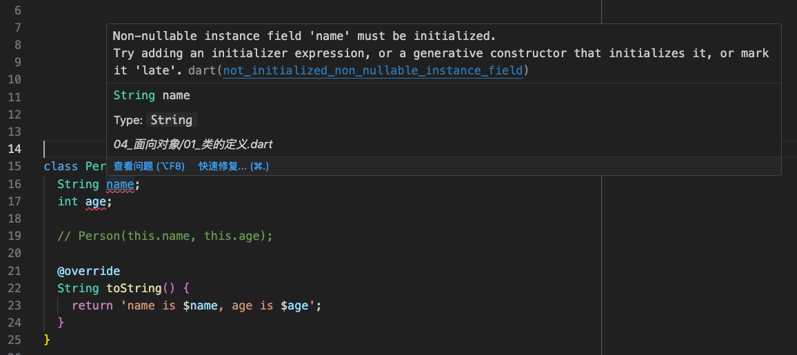
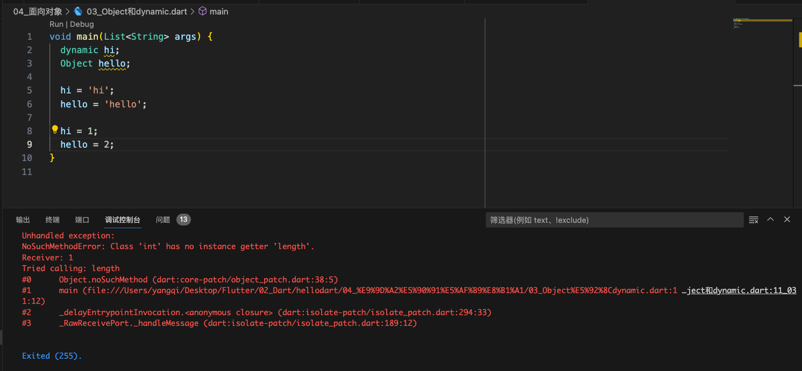

1. Dart 语言的入口是 `main` 函数，并且必须显式定义。Dart 语言的 `main` 函数没有返回值。传递给 `main` 函数的命令行参数，是通过 `List<String>` 完成的。`List` 是集合类型，每一个 `String` 都表示一个参数。
2. Dart 语言中打印信息使用 `print` 函数。
3. Dart 语言中定义字符串可以使用单引号或双引号。
4. Dart 语言中每行代码必须使用分号结尾。
5. 编写 Dart 语言创建的文件是 `.dart` 文件。

<!-- more -->

## 环境搭建


## 基本语法

1. `main` 函数是 Dart 入口；
2. Dart 中打印使用 `print`；

`main` 函数的返回值是空 `void`，在 Dart 中返回值可以省略，由系统自动进行类型判断。

```dart
void main(List<String> args) {
  print("hello dart");
}
```

### 声明变量

1、明确的声明

* 变量类型 变量名 = 赋值;

```dart
String name = "Tom";
```

2、类型推导

`var` 用于定义变量，`final`、`const` 用于定义常量。使用他们定义变量或常量时，虽然没有明确指定变量的类型，但是在编译时变量可以明确自己的类型。

使用 `var` 定义变量：

```dart
var age = 20;
age = 30
// age = "Tom" ❌
```

使用 `final` 定义常量：

```dart
final height = 180;
```

使用 `const` 定义常量：

```dart
const address = "beijing"
```

`final` 和 `const` 的区别：

1. `const` 在赋值时，赋值的内容必须在**编译期间**就确定下来。
2. `final` 在赋值时，可以动态获取，如通过计算、函数返回等方式获取一个值，在**运行期间**来确定一个值。

可以通过函数给 final 赋值：

```dart
final date1 = DateTime.now();
// const date2 = DateTime.now(); ❌
```

`final` 可以定义两个相同类型的常量。

```dart
void main(List<String> args) {
  final p1 = Person("Tom");
  final p2 = Person("Tom");
  print(identical(p1, p2));
  // Prints "false"
}

class Person {
  final String name;
  Person(this.name);
}
```

`const` 可以让一个类型只创建一个常量。

```dart
void main(List<String> args) {
  const p1 = const Person("Tom");
  const p2 = const Person("Tom");
  print(identical(p1, p2));
  // Prints "True"
}

class Person {
  final String name;
  const Person(this.name);
}
```

在日常开发中定义常量多使用 `final`。

可以使用 `runtimeType` 获取变量当前的类型：

```dart
var age = 20;
print(age.runtimeType);
// Prints "Int"
```

### 非零即真

Dart 中不能判断非零即真，或者非空即真。Bool 类型必须是一个确定的实体。

```dart
void main(List<String> args) {
  var flag = "abc"
  // if (flag) {
  //   print("hello dart");
  // }
  if (flag != null) {
    print("hellp dart");
  }
}
```

### 字符串类型

Dart 字符串是 UTF-16 编码单元的序列，可以使用单引号或双引号创建一个字符串：

```dart
void main(List<String> args) {
  var str1 = 'abc';
  var str2 = "abc";

  print(str1);
  // Prints "abc"
  print(str2);
  // prints "abc"
}
```

可以使用三个单引号或者双引号表示多行字符串

```dart
void main(List<String> args) {
  var str3 = """
abc
cba
nba
  """;
  var str4 = '''
  abc
  cba
  nba
  ''';

  print(str3);
  print(str4);
}
  
```

打印结果：

```js
abc
cba
nba
  
 abc
 cba
 nba
```

字符串和其他变量或表达式拼接时，使用`${expression}`表达式，如果 expression 是一个标识符，那么 `{}` 可以省略：

```dart
void main(List<String> args) {
  var name = "Tom";
  var age = 18;
  var height = 180;

  var desc1 = "name is ${name}, age is ${age}, height is ${height}。";
  var desc2 = "name is $name, age is $age, height is $height。";
  print(desc1);
  // Prints "name is Tom, age is 18, height is 180。"
  print(desc2);
  // Prints "name is Tom, age is 18, height is 180。"
}
```

如果不是一个标识符，则不可以省略 `{}`：

```dart
void main(List<String> args) {
  var name = "Tom";
  var age = 18;
  var height = 180;

  var desc3 = "name is $name.runtimeType, age is $age, height is $height。";
  var desc4 = "name is ${name.runtimeType}, age is $age, height is $height。";
  print(desc3);
  // Prints "name is Tom.runtimeType, age is 18, height is 180。"
  print(desc4);
  // Prints "name is String, age is 18, height is 180。"
}
```

### 集合

1、列表List：`[]`

```dart
void main(List<String> args) {
  var names = ["abc", "cba", "nba"];
  // 添加元素
  names.add("mba");
  print('$names ${names.runtimeType}');
  // Prints "[abc, cba, nba, mba] List<String>"

  // 指定类型
  List<String> stringNames = ["abc", "cba", "nba"];
  print('$stringNames ${stringNames.runtimeType}');
  // Prints "[abc, cba, nba] List<String>"
}
```

2、集合Set：`{}`

```dart
void main(List<String> args) {
  var numbers = {"1", "2", "3", "4", "5", "6", "1"};
  print('$numbers ${numbers.runtimeType}');
  // Prints "{1, 2, 3, 4, 5, 6} _Set<String>"

  // 指定类型
  Set<String> sixNumbers = {"1", "2", "3", "4", "5", "6", "1"};
  print('$sixNumbers ${sixNumbers.runtimeType}');
  // Prints "{1, 2, 3, 4, 5, 6} _Set<String>"
}
```

3、映射Map

```dart
void main(List<String> args) {
  var info = {"name": "Tom", "age": 18};
  print('$info ${info.runtimeType}');
  // Prints "{name: Tom, age: 18} _Map<String, Object>"

  // 指定类型
  Map<String, Object> userInfo = {"name": "Tom", "age": 18};
  print('$userInfo ${userInfo.runtimeType}');
  // Prints "{name: Tom, age: 18} _Map<String, Object>"
}
```

#### 增删改查

1、列表 List

```dart
void main(List<String> args) {
  var numbersList = [1, 2, 3, 4, 5, 6];

  numbersList.add(7);
  print(numbersList);
  // Prints "[1, 2, 3, 4, 5, 6, 7]"

  numbersList.remove(3);
  print(numbersList);
  // Prints "[1, 2, 4, 5, 6, 7]"

  print(numbersList.contains(6));
  // Prints "true"

  print(numbersList.removeAt(1));
  // Prints "2"
  print(numbersList);
  // Prints "[1, 4, 5, 6, 7]"
}
```

2、集合 Set

```dart
void main(List<String> args) {
  var numbersSet = {1, 2, 3, 4, 5, 6};

  numbersSet.add(7);
  print(numbersSet);
  // Prints "{1, 2, 3, 4, 5, 6, 7}"

  numbersSet.remove(3);
  print(numbersSet);
  // Prints "{1, 2, 4, 5, 6, 7}"

  print(numbersSet.contains(6));
  // Prints "true"
}
```

3、映射 Map

```dart
void main(List<String> args) {
  var infoMap = {"name": "Tom", "age": 18};
  print(infoMap['name']);
  // Prints "Tom"

  print('${infoMap.entries}');
  // Prints "(MapEntry(name: Tom), MapEntry(age: 18))"

  print('${infoMap.values} ${infoMap.values.runtimeType}');
  // Prints "(Tom, 18) _CompactIterable<Object>"

  print('${infoMap.keys} ${infoMap.keys.runtimeType}');
  // Prints "(name, age) _CompactIterable<String>"

  print('${infoMap.containsKey('age')}');
  // Prints "true"

  infoMap.remove('age');
  print(infoMap);
  // Prints "{name: Tom}"
}
```

## 函数

### 基本使用

```dart
void main(List<String> args) {
  print(sum(20, 30));
  // Prints "50"
}

// 参数：int，int
// 返回值：int
int sum(int num1, int num2) {
  return num1 + num2;
}
```

`sum` 函数的参数和返回值都是 `int` 类型，其中返回值类型可以省略，由 Dart 自动推断：

```dart
void main(List<String> args) {
  print(sum(20, 30));
  // Prints "50"
}

sum(int num1, int num2) {
  return num1 + num2;
}
```

* 如果函数中只有一个表达式，可以使用箭头语法（arrow syntax）`=>`

```dart
void main(List<String> args) {
  print(sum(20, 30));
  // Prints "50"
}

sum(int num1, int num2) => num1 + num2;
```

### 可选参数

在 Dart 中没有函数重载。

必须参数

```dart
void main(List<String> args) {
  sayHello("Tom");
}

void sayHello(String name) {
  print(name);
  // Prints "Tom"
}
```

可选参数有两种：

1. 位置可选参数：{param1, param2, ...}；
2. 命名可选参数：[param1, param2, ...]；

位置可选参数

```dart
void main(List<String> args) {

  sayHello3("Tom");
  // Prints "name=Tom age=0 height=0.0"
  sayHello3("Tom", age: 18);
  // Prints "name=Tom age=18 height=0.0"
  sayHello3("Tom", height: 180);
  // Prints "name=Tom age=0 height=180.0"
  sayHello3("Tom", age: 18, height: 180);
  // Prints "name=Tom age=18 height=180.0"
}

void sayHello3(String name, {int age = 0, double height = 0}) {
  print('name=$age age=$age height=$height');
}
```

命名可选参数

```dart
void main(List<String> args) {
  sayHello2("Tom");
  // Prints "name=Tom age=0 height=0.0"
  sayHello2("Tom", 18);
  // Prints "name=Tom age=18 height=0.0"
  sayHello2("Tom", 18, 180);
  // Prints "name=Tom age=18 height=180.0"
}

void sayHello2(String name, [int age = 0, double height = 0]) {
  print('name=$age age=$age height=$height');
}
```

### 参数默认值

在不传参数的情况下，使用默认值。

```dart
void main(List<String> args) {

  sayHello3("Tom");
  // Prints "name=Tom age=0 height=0.0"
}

void sayHello3(String name, {int age = 0, double height = 0}) {
  print('name=$age age=$age height=$height');
}
```

### 函数是一等公民

函数作为一等公民，即可以赋值给一个变量，也可以作为另一个函数的参数或这返回值。

1、将函数赋值给一个变量：

```dart
void main(List<String> args) {
  var hello = sayHello;
  print(hello);
  // Prints "Closure: (String) => dynamic from Function 'sayHello': static."
}

// 1、定义一个函数
sayHello(String name) {
  print("hello $name");
}
```

可以看到 `hello` 是一个 `Closure: (String) => dynamic` 的类型的函数。

2、将函数作为另一个函数的参数：

```dart
void main(List<String> args) {
  tom(sayHello);
  // Prints "hello Tom"
}

// 1、定义一个函数
sayHello(String name) {
  print("hello $name");
}

// 2、将函数作为另一个函数的参数
tom(Function func) {
  func("Tom");
}
```

3、将函数作为另一个函数的返回值：

```dart
void main(List<String> args) {
  var persion = getPersion();
  persion(sayHello);
  // Prints "hello Tom"
}

// 1、定义一个函数
sayHello(String name) {
  print("hello $name");
}

// 2、将函数作为另一个函数的参数
tom(Function func) {
  func("Tom");
}

// 3、将函数作为另一个函数的返回值
getPersion() {
  return tom;
}
```

4、自定义函数类型

```dart
typedef Calculate = void Function(int num1, int num2);

void main(List<String> args) {
  sum((num1, num2) {
    print('$num1 + $num2 = ${num1 + num2}');
  });
}

void sum(Calculate calc) {
  calc(20, 30);
}
```

### 匿名函数

匿名闭包（anonymous function），也叫作 lambda 或 闭包（closure）。定义一个没有名字的函数，作为函数的参数或返回值，提高编码效率。

```dart
void main(List<String> args) {
  say((String text) {
    print(text);
  });
  // Prints "hello"
}

void say(Function func) {
  func("hello");
}
```

`say` 函数的返回值为 `void`，参数是一个函数，该函数的参数是 `String` 类型，函数体是一个打印方法：

```dart
(String text) {
  print(text);
}
```

示例二：使用 `forEach` 遍历

```dart
void main(List<String> args) {
  var array = [1, 2, 3, 4, 5, 6];
  // 1、匿名函数
  array.forEach((element) {
    print(element);
  });
  // array.forEach((element) => print(element));

  // 2、有名字的函数
  printElement(element) {
    print(element);
  }
  array.forEach(printElement);
}
```

打印结果：

```js
1
2
3
4
5
6
1
2
3
4
5
6
```

### 词法作用域

优先使用自己作用域中的变量，如果没有找到，则一层层向外查找。

```dart
var name = 'Tom';
void main(List<String> args) {
  void say() {
    print(name);
    // Prints "Tom"
  }

  say();
}
```

```dart
var name = 'Tom';
void main(List<String> args) {
  var name = 'Tom 1';
  void say() {
    print(name);
    // Prints "Tom 1"
  }

  say();
}
```

```dart
var name = 'Tom';
void main(List<String> args) {
  var name = 'Tom 1';
  void say() {
    var name = 'Tom 2';
    print(name);
    // Prints "Tom 2"
  }

  say();
}
```

### 词法闭包

```dart
void main(List<String> args) {
  createMaker(num addBy) {
    // 返回一个闭包
    return (num i) {
      return i + addBy;
    };
  }

  var adder = createMaker(1);
  print(adder(1));
  // Prints "2"
  print(adder(2));
  // Prints "3"
}
```

创建出来的 `adder` 记住了创建时传入的 2。

### 隐式返回

所有函数都有一个返回值。如果没有指定返回值，则默认返回 `null`。

```dart
void main(List<String> args) {
  print(method());
  // Prints "null"
}

method() {
  print('function');
}
```

## 特殊运算符

* `??` 空值合并运算符

```dart
void main(List<String> args) {
  var name = null;
  name = name ?? "Tom";
  print(name);
  // Prints "Tom"
}
```

* `??=` 空值赋值运算符

```dart
void main(List<String> args) {
  var name = null;
  name ??= 'Tom';
  print(name);
  // Prints "Tom"
}
```

* `..` 级联运算符

```dart
void main(List<String> args) {
  var p = Persion()
    ..name = 'Tom'
    ..eat()
    ..run();
}

class Persion {
  String name;

  Persion({this.name = ''});

  void run() {
    print('$name is running');
  }

  void eat() {
    print('$name is eating');
  }
}
```

打印信息：

```js
Tom is eating
Tom is running
```

* `for` 循环

```dart
void main(List<String> args) {
  for (var i = 0; i < 6; i++) {
    print(i);
  }

  var numbers = [1, 2, 3, 4, 5, 6];
  for (var i = 0; i < numbers.length; i++) {
    print(numbers[i]);
  }
}
```

* `for-in` 循环

```dart
void main(List<String> args) {
  var numbers = [1, 2, 3, 4, 5, 6];
  for (var number in numbers) {
    print(number);
  }
}
```

## Dart之面向对象

### 类的定义

```dart
void main(List<String> args) {
  // var p = new Person("Tom", 18);
  var p = Person("Tom", 18);
  print(p);
  // Prints "name is Tom, age is 18"
}

class Person {
  String name;
  int age;

  Person(this.name, this.age);

  @override
  String toString() {
    return 'name is $name, age is $age';
  }
}
```

1、初始化类时，类名前的 `new` 可以省略：

```dart
// var p = new Person("Tom", 18);
var p = Person("Tom", 18);
```

2、Dart 语言要求类的成员变量，在类初始化前要有确定的值。如果没有在初始化时给成员变量赋值，就会报错：



### 类的构造函数

```dart
void main(List<String> args) {
  var p1 = Person('Tom', 18);
  var p2 = Person.custom('Jack', 18, 180);
  print(p1);
  // Prints "name is Tom, age is 18, height is 0.0"
  print(p2);
  // Prints "name is Jack, age is 18, height is 180.0"
}

class Person {
  String name;
  int age;
  double height = 0;

  Person(this.name, this.age);

  Person.custom(this.name, this.age, this.height);

  @override
  String toString() {
    return 'name is $name, age is $age, height is $height';
  }
}
```

使用 json 初始化类：

```dart
void main(List<String> args) {
  var p3 = Person.fromMap({'name': 'Tom', 'age': 18, 'height': 180.0});
  print(p3);
  // Prints "name is Tom, age is 18, height is 180.0"
}

class Person {
  late String name;
  late int age;
  double height = 0;

  Person.fromMap(Map<String, dynamic> map) {
    this.name = map['name'];
    this.age = map['age'];
    this.height = map['height'];
  }

  @override
  String toString() {
    return 'name is $name, age is $age, height is $height';
  }
}
```

### Object 和 dynamic 的区别

Dart 中所有类型都是 Object 的子类，包括 Function 和 Null。

* dynamic 与 Object 声明的变量都可以赋值任意对象，且后期可以改变赋值的类型。



* Object 对象使用的属性和方法若不存在，**编译时会报错**。

* dynamic 对象使用的属性和方法若不存在，**编译时不会报错，运行时会报错**。


### 初始化列表

* 初始化列表会在构造函数前执行，常用于设置 `final` 变量的值，使用逗号`,`分隔初始化表达式。

```dart
void main(List<String> args) {
  var p = Person('Tom', age: 18);
  print(p);
  // Prints "name is Tom, age is 18"
}

class Person {
  final String name;
  final int age;

  Person(this.name, {int age = 0}) : this.age = age {}

  @override
  String toString() {
    return 'name is $name, age is $age';
  }
}
```

不传 `age`：

```dart
void main(List<String> args) {
  var p = Person('Tom');
  print(p);
  // Prints "name is Tom, age is 0"
}
```
