* [创建一个Flutter项目](#创建一个flutter项目)
* [Android studio 简介](#android-studio-简介)
* [第一个项目 Hello world](#第一个项目-hello-world)
* [同意协议](#同意协议)
* [列表](#列表)
* [计数器](#计数器)
* [StatefulWidget](#statefulwidget)
* [StatefulWidget 声明周期](#statefulwidget-声明周期)

<!-- more -->

相关文档：

[Flutter(六)之Flutter开发初体验](https://juejin.cn/post/6844903949271564302)
[Flutter(七)之有状态的StatefulWidget](https://juejin.cn/post/6844903951058354190)
[《Flutter实战·第二版》](https://book.flutterchina.club/)

## 创建一个Flutter项目

第一步：点击`New Flutter Project`

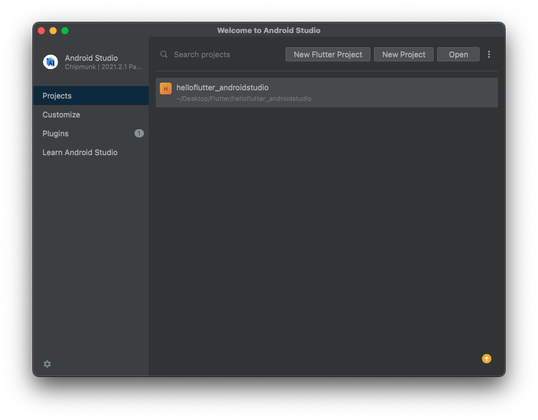

第二步：配置 Flutter SDK 的路径

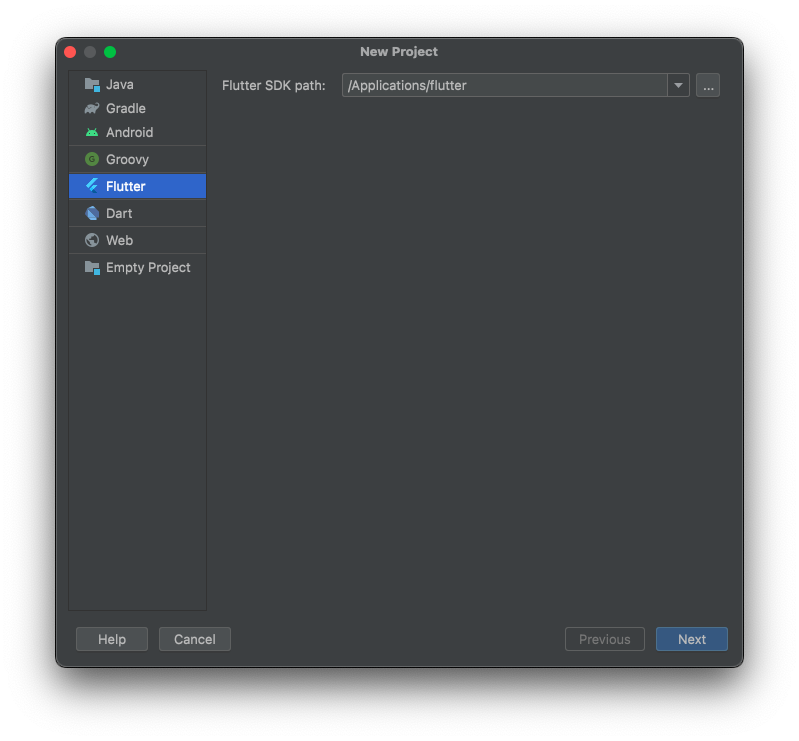

第三部：设置项目名称、项目路径

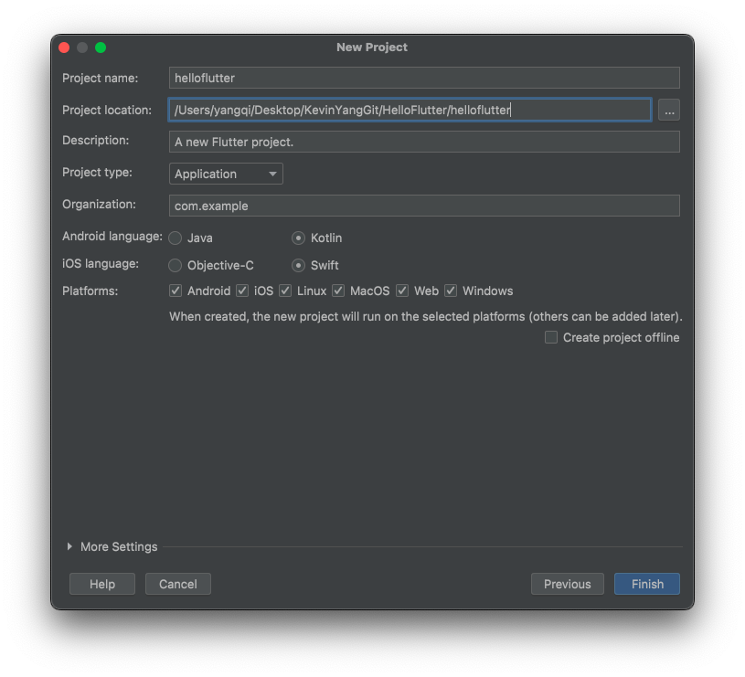

第四步：创建项目


## Android studio 简介

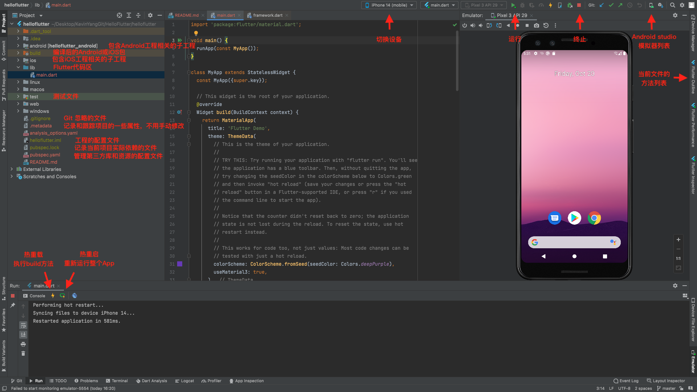

## 第一个项目 Hello world

### runApp

`/lib` 文件里是所有的 Flutter 代码，`main.dart` 是 App 的入口，添加 `main` 函数，并在函数内部调用 `material.dart` 库中的 `runApp` 方法：

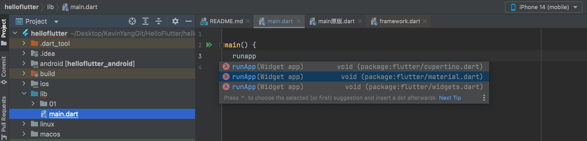

```dart
import 'package:flutter/material.dart';

main() {
  runApp(app)
}
```

`runApp` 是 Flutter 提供的 App 运行函数入口，在 `material.dart` 库中。`material.dart` 是 Google 公司推行的一套设计风格。

查看 `runApp` 的源码，可以看到需要传递一个 `Widget` 类型的参数：

```dart
void runApp(Widget app) {
  final WidgetsBinding binding = WidgetsFlutterBinding.ensureInitialized();
  assert(binding.debugCheckZone('runApp'));
  binding
    ..scheduleAttachRootWidget(binding.wrapWithDefaultView(app))
    ..scheduleWarmUpFrame();
}
```

### Widget

Flutter 中所有的内容都是 Widget，而iOS中`UIViewController`、`UIView`、`UIButton`等等都是不同的控件。

创建一个页面，页面只显示“Hello world!”，传入一个 `Text` 对象：

```dart
import 'package:flutter/material.dart';

main() {
  runApp(Text('Hello world!', textDirection: TextDirection.ltr));
}
```

因为是第一次运行项目，所以点击的是Hot Restart（热重启）。

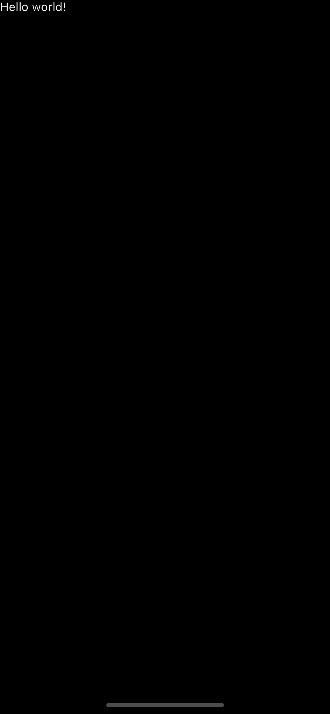

📢注意：页面在单独加载一个 `Text` 时，需要设置 `textDirection`，否则会报错：

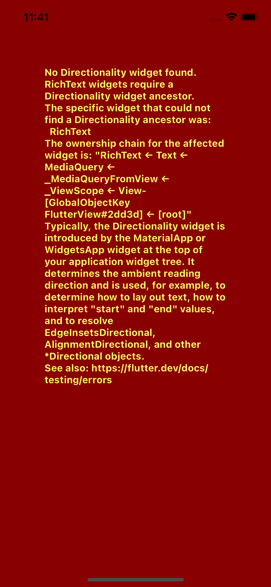

### Center

居中显示，设置字体大小、颜色

```dart
import 'package:flutter/material.dart';

main() {
  runApp(
    // 页面中心
    Center(
      child: Text(
        'Hello world!', // 内容
        textDirection: TextDirection.ltr, // 从左至右
        style: TextStyle(fontSize: 36, color: Colors.blue),), // 字体大小：36，字体颜色：蓝色
    )
  );
}
```


### Material

`Material` 库是由 Flutter 提供的特定风格的组件仓库，让创建页面更加便捷：

```dart
MaterialApp(
  title: ,
  theme: ,
  home: ,
)
```

在使用 `Material` 库创建页面时，需要传入一个`home` 参数，也就是要创建的页面，它是 `Scaffold` 类型的。

### Scaffold

`Scaffold` 称为**脚手架**，用来搭建页面的基本结构，如 `appBar`（导航栏）、`body`（内容）等。

设置背景色白色，默认导航栏：

```dart
import 'package:flutter/material.dart';

main() {
  runApp(
    // 页面
    MaterialApp(
      // 页面风格
      home: Scaffold(
        // 导航栏
        appBar: AppBar(
            title: Text("Flutter")
        ),
        // 页面中心
        body: Center(
          child: Text(
            'Hello world!', // 内容
            textDirection: TextDirection.ltr, // 从左至右
            style: TextStyle(
                fontSize: 36, // 字体大小
                color: Colors.blue), // 字体颜色
          ),
        )
      ),
    )
  );
}
```

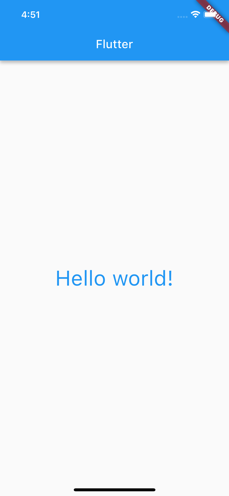

### 代码重构

上面的代码嵌套太深，可读性太差。根据功能，对代码进行封装重构。

第一步：抽取 `runApp()`。

```dart
import 'package:flutter/material.dart';

main() => runApp(MyApp());

// 程序
class MyApp extends StatelessWidget {
  @override
  Widget build(BuildContext context) {
    return MaterialApp(...);
  }
}
```

第二步：抽取 `MaterialApp()`。

```dart
import 'package:flutter/material.dart';

main() => runApp(MyApp());

// 程序
class MyApp extends StatelessWidget {
  @override
  Widget build(BuildContext context) {
    return MaterialApp(
      home: KYPage(),
    );
  }
}

// 页面
class KYPage extends StatelessWidget {
  @override
  Widget build(BuildContext context) {
    return Scaffold(...);
  }
}
```

第三步：抽取 Scaffold。

```dart

import 'package:flutter/material.dart';

main() => runApp(MyApp());

// 程序
class MyApp extends StatelessWidget {
  @override
  Widget build(BuildContext context) {
    // 页面
    return MaterialApp(
      home: KYHome(),
    );
  }
}

// 页面
class KYHome extends StatelessWidget {
  @override
  Widget build(BuildContext context) {
    return Scaffold(
        // 导航栏
        appBar: AppBar(
            title: Text("Flutter")
        ),
        // 内容
        body: KYBody()
    );
  }
}

// 页面-内容
class KYBody extends StatelessWidget {
  @override
  Widget build(BuildContext context) {
    // 页面中心
    return Center(
      child: Text(
        'Hello world!', // 内容
        textDirection: TextDirection.ltr, // 从左至右
        style: TextStyle( // 字体样式
            fontSize: 36,
            color: Colors.blue),
      ),
    );
  }
}
```

在 Flutter 中所有的控件都继承自 `Widget`，而 `Widget` 又分为 `StatelessWidget` 和 `StatefulWidget`：

* `StatelessWidget`：无状态的 `Widget`，内容在 APP 运行过程中**不会发生改变**。
* `StatefulWidget`：有状态的 `Widget`，内容在 APP 运行过程中**会发生改变**。

因为在 Hello World 代码中，没有可变的内容，所有用的是 `StatelessWidget`。

## 同意协议

```dart
import 'package:flutter/material.dart';

main() {
  runApp(
    MaterialApp(
      home: Scaffold(
        // 导航栏
        appBar: AppBar(
            title: Text('Flutter')
        ),
        // 页面中心
        body: Center(
          child: Row(
            // 水平居中
            mainAxisAlignment: MainAxisAlignment.center,
            // 包含多个控件使用 children[]
            children: [
              // 选择器
              Checkbox(
                  value: true, // 默认选中
                  onChanged: (value) { // 点击选择器
                    print(value);
                  }),
              Text(
                '同意协议', // 内容
                style: TextStyle(fontSize: 28), // 字体样式
              ),
            ],
          ),
        ),
      ),
    ),
  );
}
```

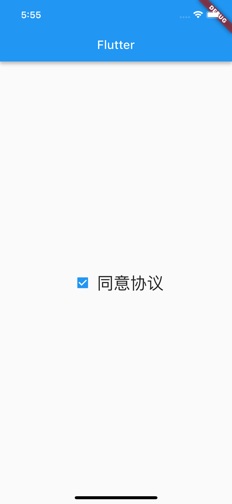

点击勾选框，可以看到打印：

```js
flutter: false
```

### Row

这里用到了一个控件 Row，即**行控件**，它在水平方向平铺的，支持创建多个控件，并对其自动布局：

```dart
Row(
  // 对齐方式-居中
  mainAxisAlignment: MainAxisAlignment.center,
  // 子控件集合
  children: [

  ],
)
```

### StatefulWidget & State

继承 `StatefulWidget` 的类，可以介绍父 `Widget` 传递的数据 `State`（状态）。`StatefulWidget` 通过创建一个单独的类来记录状态。

```dart
import 'package:flutter/material.dart';

main() => runApp(MyApp());

class MyApp extends StatelessWidget {
  @override
  Widget build(BuildContext context) {
    print('MyApp build');
    return MaterialApp(
      home: KYHome()
    );
  }
}

class KYHome extends StatelessWidget {
  @override
  Widget build(BuildContext context) {
    print('KYHome build');
    return Scaffold(
      appBar: AppBar(
          title: Text('Flutter')
      ),
      body: KYBody(),
    );
  }
}

class KYBody extends StatefulWidget {
  // 创建状态
  @override
  State<StatefulWidget> createState() {
    return KYState();
  }
}

class KYState extends State<KYBody> {
  // 记录选择器状态，默认选中
  var flag = true;

  @override
  Widget build(BuildContext context) {
    print('KYState build');
    return Center(
      child: Row(
        mainAxisAlignment: MainAxisAlignment.center,
        children: [
          Checkbox(
              value: flag,
              onChanged: (bool? value) {
                // 更新UI（1.调用闭包；2.刷新UI（即调用 KYState 的 build 方法）；）
                setState(() {
                  flag = value!; // 更新UI前，先更新选中状态
                });
              }),
          Text(
            '同意协议',
            style: TextStyle(fontSize: 28),
          ),
        ],
      ),
    );
  }
}
```

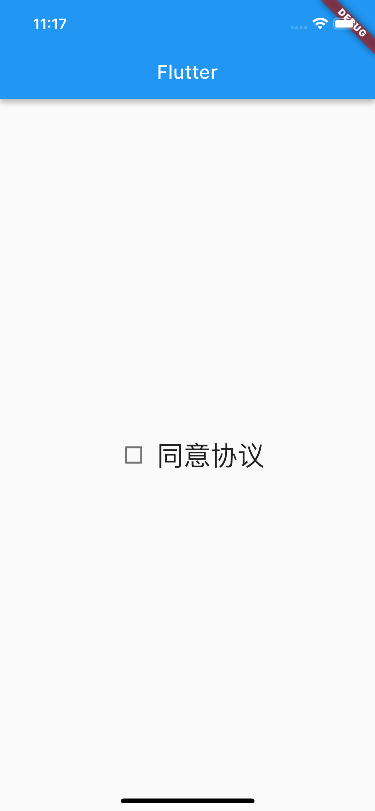

### setState

更新UI时，通过调用 `setState` 方法实现：

1. 调用闭包；
2. 刷新UI（会重新调用 `KYState` 的 `build` 方法）；

```dart
setState(() {
  // 更新UI前，先执行闭包
});
```

## 列表

### Column

```dart
class Column extends Flex {
  const Column({
    super.key,               // 唯一标识
    super.mainAxisAlignment, // 主轴对齐方式
    super.mainAxisSize,      // 轴线大小
    super.crossAxisAlignment,// 交叉轴对齐方式
    super.textDirection,     // 文本方向
    super.verticalDirection, // 垂直方向
    super.textBaseline,      // 文本基准线
    super.children,          // 子控件集合
  }) : super(
    direction: Axis.vertical,// 方向
  );
}
```

使用 Column 实现自动垂直布局，类比 Row：

```dart
Column(
  // 对其方式-居中
  mainAxisAlignment: MainAxisAlignment.center
  // 子控件集合
  children: [
    
  ],
)
```

创建多个图片信息，垂直展示：

```dart
import 'package:flutter/material.dart';
main() {
  runApp(MyApp());
}

// 程序
class MyApp extends StatelessWidget {
  @override
  Widget build(BuildContext context) {
    return MaterialApp(
      home: KYHome(),
    );
  }
}

// 页面
class KYHome extends StatelessWidget {
  @override
  Widget build(BuildContext context) {
    return Scaffold(
      appBar: AppBar(
          title: Text('列表'),
      ),
      body: KYBody(),
    );
  }
}

// 页面-内容
class KYBody extends StatelessWidget {
  @override
  Widget build(BuildContext context) {
    // 垂直排列 Widget，类比 Row
    return Column(
      children: [
        KYProductItem('title01', '图片', 'https://pic3.zhimg.com/v2-002ce6e2ee957e0f666a7bfa479f33b2_r.jpg'),
        KYProductItem('title02', '图片', 'https://pic2.zhimg.com/v2-2aebdafa0ab8ee5b55d58410f7192745_r.jpg'),
        KYProductItem('title02', '图片', 'https://pic4.zhimg.com/v2-cb75f239dfd0c1c42c23dfc9011965a3_b.jpg'),
      ],
    );
  }
}

// 产品信息
class KYProductItem extends StatelessWidget {
  final String title;
  final String desc;
  final String imageURL;

  KYProductItem(this.title, this.desc, this.imageURL);

  @override
  Widget build(BuildContext context) {
    return Container(
      // 垂直排列
      child: Column(
        children: [
          Text(title, style: TextStyle(fontSize: 30, color: Colors.blue),), // 标题
          Text(desc, style: TextStyle(fontSize: 20, color: Colors.black),), // 详情
          Image.network(imageURL), // 网络图片
        ],
      ),
    );
  }
}
```

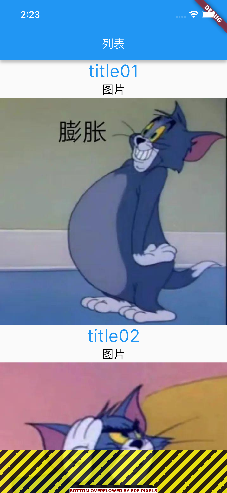

在 Flutter 布局中，内容不能超出屏幕范围，如果超出，超出的部分会出现图中的错误。可以通过将 `Column` 替换成 `ListView` 解决。

### ListView

`ListView` 可以滚动展示子控件。

```dart
import 'package:flutter/material.dart';
main() {
  runApp(MyApp());
}

// 程序
class MyApp extends StatelessWidget {
  @override
  Widget build(BuildContext context) {
    return MaterialApp(
      home: KYHome(),
    );
  }
}

// 页面
class KYHome extends StatelessWidget {
  @override
  Widget build(BuildContext context) {
    return Scaffold(
      appBar: AppBar(
        title: Text('列表'),
      ),
      body: KYBody(),
    );
  }
}

// 页面-内容
class KYBody extends StatelessWidget {
  @override
  Widget build(BuildContext context) {
    return ListView(
      children: [
        KYProductItem('title01', '图片', 'https://pic3.zhimg.com/v2-002ce6e2ee957e0f666a7bfa479f33b2_r.jpg'),
        KYProductItem('title02', '图片', 'https://pic2.zhimg.com/v2-2aebdafa0ab8ee5b55d58410f7192745_r.jpg'),
        KYProductItem('title02', '图片', 'https://pic4.zhimg.com/v2-cb75f239dfd0c1c42c23dfc9011965a3_b.jpg'),
      ],
    );
  }
}

// 产品信息
class KYProductItem extends StatelessWidget {
  final String title;
  final String desc;
  final String imageURL;

  KYProductItem(this.title, this.desc, this.imageURL);

  @override
  Widget build(BuildContext context) {
    return Container(
      // 垂直排列
      child: Column(
        children: [
          Text(title, style: TextStyle(fontSize: 30, color: Colors.blue),), // 标题
          Text(desc, style: TextStyle(fontSize: 20, color: Colors.black),), // 详情
          Image.network(imageURL), // 网络图片
        ],
      ),
    );
  }
}
```

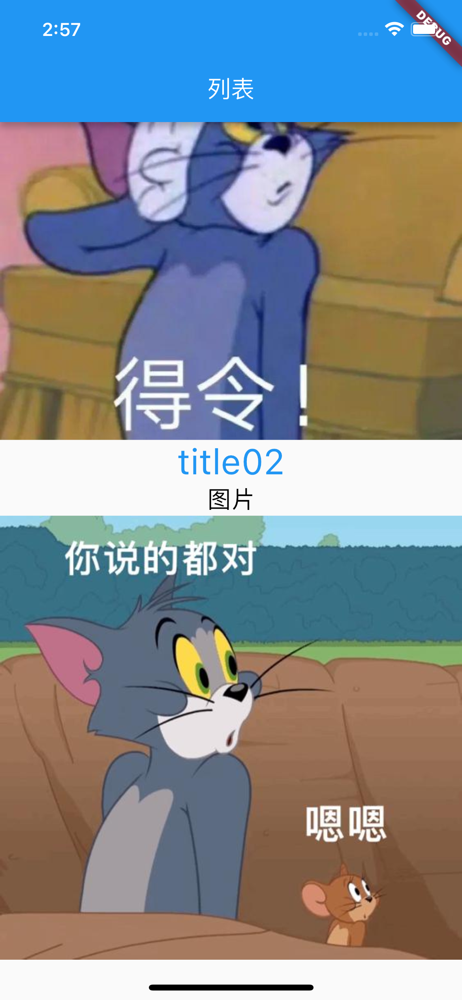

### Padding

```dart
import 'package:flutter/material.dart';
main() {
  runApp(MyApp());
}

// 程序
class MyApp extends StatelessWidget {
  @override
  Widget build(BuildContext context) {
    return MaterialApp(
      home: KYHome(),
    );
  }
}

// 页面
class KYHome extends StatelessWidget {
  @override
  Widget build(BuildContext context) {
    return Scaffold(
      appBar: AppBar(
        title: Text('列表'),
      ),
      body: KYBody(),
    );
  }
}

// 页面-内容
class KYBody extends StatelessWidget {
  @override
  Widget build(BuildContext context) {
    // 内边距
    return Padding(
      padding: const EdgeInsets.all(8),
      child: ListView(
        children: [
          KYProductItem('title01', '图片', 'https://pic3.zhimg.com/v2-002ce6e2ee957e0f666a7bfa479f33b2_r.jpg'),
          KYProductItem('title02', '图片', 'https://pic2.zhimg.com/v2-2aebdafa0ab8ee5b55d58410f7192745_r.jpg'),
          KYProductItem('title02', '图片', 'https://pic4.zhimg.com/v2-cb75f239dfd0c1c42c23dfc9011965a3_b.jpg'),
        ],
      ),
    );
  }
}

// 产品信息
class KYProductItem extends StatelessWidget {
  final String title;
  final String desc;
  final String imageURL;

  KYProductItem(this.title, this.desc, this.imageURL);

  @override
  Widget build(BuildContext context) {
    return Container(
      // 垂直排列
      child: Column(
        children: [
          Text(title, style: TextStyle(fontSize: 30, color: Colors.blue),), // 标题
          Text(desc, style: TextStyle(fontSize: 20, color: Colors.black),), // 详情
          Image.network(imageURL), // 网络图片
        ],
      ),
    );
  }
}
```

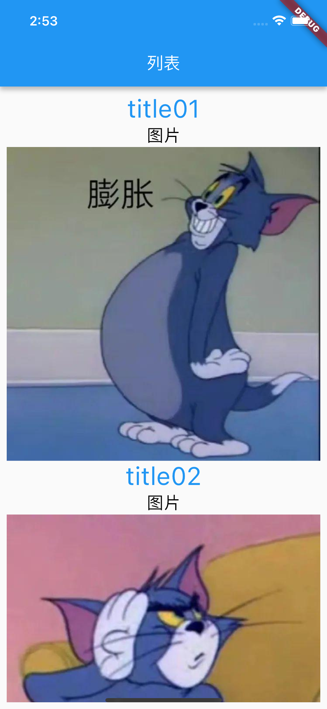

### Container-Padding

设置产品的内边距。

```dart
import 'package:flutter/material.dart';
main() {
  runApp(MyApp());
}

// 程序
class MyApp extends StatelessWidget {
  @override
  Widget build(BuildContext context) {
    return MaterialApp(
      home: KYHome(),
    );
  }
}

// 页面
class KYHome extends StatelessWidget {
  @override
  Widget build(BuildContext context) {
    return Scaffold(
      // 导航栏
      appBar: AppBar(
        title: Text('列表'),
      ),
      // 内容
      body: KYBody(),
    );
  }
}

// 页面-内容
class KYBody extends StatelessWidget {
  @override
  Widget build(BuildContext context) {
    // 边距
    return Padding(
      padding: const EdgeInsets.all(8),
      child: ListView(
        children: [
          KYProductItem('title01', '图片', 'https://pic3.zhimg.com/v2-002ce6e2ee957e0f666a7bfa479f33b2_r.jpg'),
          KYProductItem('title02', '图片', 'https://pic2.zhimg.com/v2-2aebdafa0ab8ee5b55d58410f7192745_r.jpg'),
          KYProductItem('title02', '图片', 'https://pic4.zhimg.com/v2-cb75f239dfd0c1c42c23dfc9011965a3_b.jpg'),
        ],
      ),
    );
  }
}

// 产品信息
class KYProductItem extends StatelessWidget {
  final String title;
  final String desc;
  final String imageURL;

  KYProductItem(this.title, this.desc, this.imageURL);

  @override
  Widget build(BuildContext context) {
    return Container(
      // 边距
      padding: const EdgeInsets.all(20),
      decoration: BoxDecoration(
        border: Border.all()
      ),
      // 垂直排列
      child: Column(
        children: [
          Text(title, style: TextStyle(fontSize: 30, color: Colors.blue),), // 标题
          Text(desc, style: TextStyle(fontSize: 20, color: Colors.black),), // 详情
          Image.network(imageURL), // 网络图片
        ],
      ),
    );
  }
}
```

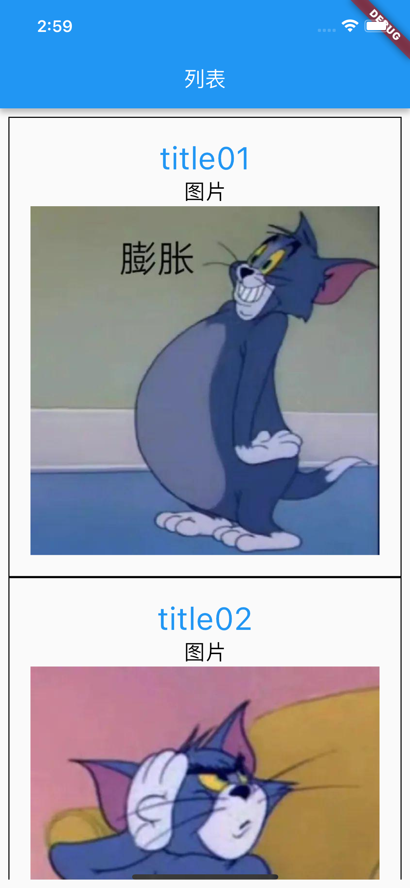

### SizedBox

使用 `SizeBox`，在文字和图片之间增加间距。

```dart
import 'package:flutter/material.dart';
main() {
  runApp(MyApp());
}

// 程序
class MyApp extends StatelessWidget {
  @override
  Widget build(BuildContext context) {
    return MaterialApp(
      home: KYHome(),
    );
  }
}

// 页面
class KYHome extends StatelessWidget {
  @override
  Widget build(BuildContext context) {
    return Scaffold(
      // 导航栏
      appBar: AppBar(
        title: Text('列表'),
      ),
      // 页面
      body: KYBody(),
    );
  }
}

// 页面-内容
class KYBody extends StatelessWidget {
  @override
  Widget build(BuildContext context) {
    // 内边距
    return Padding(
      padding: const EdgeInsets.all(8),
      child: ListView(
        children: [
          KYProductItem('title01', '图片', 'https://pic3.zhimg.com/v2-002ce6e2ee957e0f666a7bfa479f33b2_r.jpg'),
          KYProductItem('title02', '图片', 'https://pic2.zhimg.com/v2-2aebdafa0ab8ee5b55d58410f7192745_r.jpg'),
          KYProductItem('title02', '图片', 'https://pic4.zhimg.com/v2-cb75f239dfd0c1c42c23dfc9011965a3_b.jpg'),
        ],
      ),
    );
  }
}

// 产品信息
class KYProductItem extends StatelessWidget {
  final String title;
  final String desc;
  final String imageURL;

  KYProductItem(this.title, this.desc, this.imageURL);

  @override
  Widget build(BuildContext context) {
    return Container(
      // 边距
      padding: const EdgeInsets.all(20),
      // 所有边
      decoration: BoxDecoration(
        border: Border.all()
      ),
      // 垂直排列
      child: Column(
        children: [
          Text(title, style: TextStyle(fontSize: 30, color: Colors.blue),), // 标题
          Text(desc, style: TextStyle(fontSize: 20, color: Colors.black),), // 详情
          SizedBox(height: 18,), // 间距
          Image.network(imageURL), // 网络图片
        ],
      ),
    );
  }
}
```

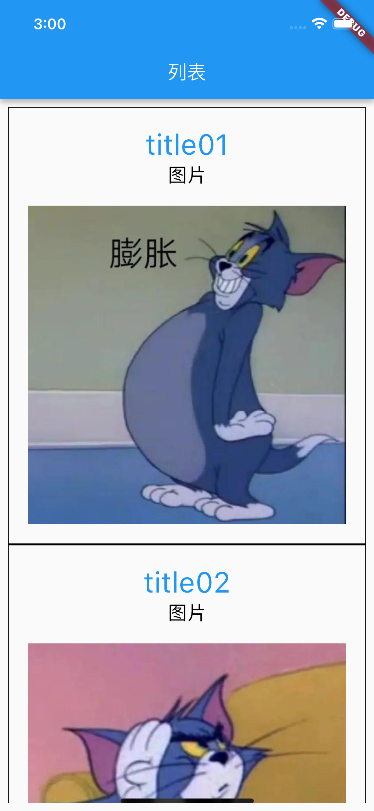

## 计数器

通过这个项目，了解有**状态**的 StatefulWidget。

### Column & Row

```dart
import 'package:flutter/material.dart';

main() => runApp(MyApp());

// 程序
class MyApp extends StatelessWidget {
  @override
  Widget build(BuildContext context) {
    // 页面
    return MaterialApp(
      home: KYHome(),
    );
  }
}

// 页面
class KYHome extends StatelessWidget {
  @override
  Widget build(BuildContext context) {
    return Scaffold(
      // 导航栏
      appBar: AppBar(
        title: const Text('计数器'),
      ),
      // 内容
      body: KYBody(),
    );
  }
}

// 页面-内容
class KYBody extends StatelessWidget {
  @override
  Widget build(BuildContext context) {
    // 中心
    return Center(
      // 垂直
      child: Column(
        // 垂直-居中
        mainAxisAlignment: MainAxisAlignment.center,
        // 子控件s
        children: [
          Row(),
          Text('当前计数：'),
        ],
      ),
    );
  }
}
```

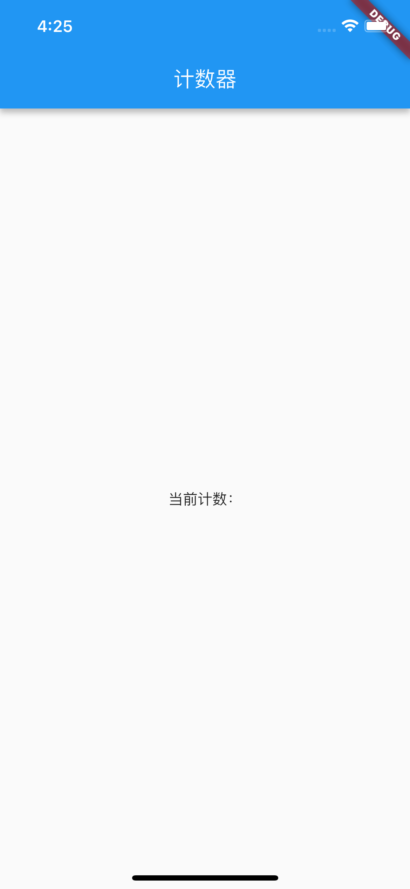

### MaterialButton

添加按钮，使用 `MaterialButton` 样式。

```dart
MaterialButton(
  // 背景色
  color: Colors.blue,
  // 文案
  child: const Text("+1", style: TextStyle(fontSize: 18, color: Colors.white),),
  // 点击事件
  onPressed: (){
    
  },
)
```

添加 `+1` 和 `-1` 按钮后的代码：

```dart
import 'package:flutter/material.dart';

main() => runApp(MyApp());

// 程序
class MyApp extends StatelessWidget {
  @override
  Widget build(BuildContext context) {
    return MaterialApp(
      home: KYHome(),
    );
  }
}

// 页面
class KYHome extends StatelessWidget {
  @override
  Widget build(BuildContext context) {
    return Scaffold(
      appBar: AppBar(
        title: const Text('计数器'),
      ),
      body: KYBody(),
    );
  }
}

// 页面-内容
class KYBody extends StatelessWidget {
  @override
  Widget build(BuildContext context) {
    return Center(
      // 垂直布局
      child: Column(
        // 垂直-居中
        mainAxisAlignment: MainAxisAlignment.center,
        children: [
          // 水平
          Row(
            // 水平-居中
            mainAxisAlignment: MainAxisAlignment.center,
            // 子控件s
            children: [
              // +1 按钮
              MaterialButton(
                // 背景色
                color: Colors.blue,
                // 文案
                child: const Text("+1", style: TextStyle(fontSize: 18, color: Colors.white),),
                // 点击事件
                onPressed: (){

                },
              ),
              // -1 按钮
              MaterialButton(
                color: Colors.red,
                child: const Text('-1', style: TextStyle(fontSize: 18, color: Colors.white),),
                onPressed: (){

                },
              ),
            ],
          ),
          Text('当前计数：'),
        ],
      ),
    );
  }
}
```

### setState()

点击按钮修改计数：

```dart
import 'package:flutter/material.dart';

main() => runApp(MyApp());

// 程序
class MyApp extends StatelessWidget {
  @override
  Widget build(BuildContext context) {
    return MaterialApp(
      home: KYHome(),
    );
  }
}

// 页面
class KYHome extends StatelessWidget {
  @override
  Widget build(BuildContext context) {
    return Scaffold(
      appBar: AppBar(
        title: const Text('计数器'),
      ),
      body: KYBody(),
    );
  }
}

// 页面-内容
class KYBody extends StatefulWidget {
  @override
  State<StatefulWidget> createState() {
    return KYState();
  }
}

// 页面-内容-状态
class KYState extends State<KYBody> {
  // 计数
  var count = 0;

  @override
  Widget build(BuildContext context) {
    return Center(
      // 垂直布局
      child: Column(
        mainAxisAlignment: MainAxisAlignment.center,
        children: [
          // 水平布局
          Row(
            // 居中
            mainAxisAlignment: MainAxisAlignment.center,
            children: [
              // +1 按钮
              MaterialButton(
                // 背景色
                color: Colors.blue,
                // 文案
                child: const Text("+1", style: TextStyle(fontSize: 18, color: Colors.white),),
                // 点击事件
                onPressed: (){
                  // 更新UI（重新调用 State 的 build 方法）
                  setState(() {
                    // 修改数据（更新UI前，先调用闭包）
                    count++;
                  });
                },
              ),
              // -1 按钮
              MaterialButton(
                color: Colors.red,
                child: const Text('-1', style: TextStyle(fontSize: 18, color: Colors.white),),
                onPressed: (){
                  setState(() {
                    count--;
                  });
                },
              ),
            ],
          ),
          Text('当前计数：$count'),
        ],
      ),
    );
  }
}
```

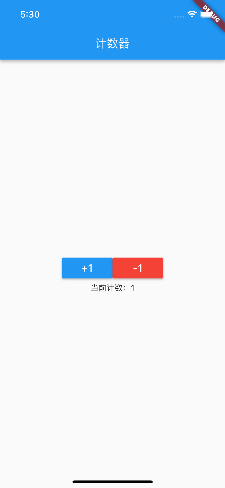

## StatefulWidget

在“列表”和“计数器”中，都用到了 `StatefulWidget` 和 `State` 的组合拳，在编译器中输入 `stful` 可以快速敲出：

```dart
class _ extends StatefulWidget {
  const ({Key? key}) : super(key: key);

  @override
  State<> createState() => _State();
}

class _State extends State<> {
  @override
  Widget build(BuildContext context) {
    return const Placeholder();
  }
}
```

Flutter 将 `StatefulWidget` 设计成了两个类的组合方式：

1. `StatefulWidget` 作为 `Widget` 树的一部分；
2. `State` 记录对应 `StatefulWidget` 的状态。

查看 `StatefulWidget` 源码：

```dart
abstract class StatefulWidget extends Widget {
  const StatefulWidget({ super.key });
  
  @override
  StatefulElement createElement() => StatefulElement(this);

  @protected
  @factory
  State createState();
}
```

创建 `StatefulWidget` 的一般步骤：

1、自定义一个 `StatefulWidget` 类型的控件，并返回一个 `State` 类型的状态对象。

```dart
class KYBody extends StatefulWidget {
  @override
  State<StatefulWidget> createState() {
    return KYState();
  }
}
```

2、自定义一个 `State<KYBody>` 类型的状态对象，内部可以定义变量用于记录特定的状态。

```dart
class KYState extends State<KYBody> {
  // 计数
  var count = 0;

  @override
  Widget build(BuildContext context) {
    return Center(...);
  }
}
```

## StatefulWidget 声明周期

以计数器代码为例：

```dart
import 'package:flutter/material.dart';

main() => runApp(MyApp());

// 程序
class MyApp extends StatelessWidget {
  @override
  Widget build(BuildContext context) {
    return MaterialApp(
      home: KYHome(),
    );
  }
}

// 页面
class KYHome extends StatelessWidget {
  @override
  Widget build(BuildContext context) {
    return Scaffold(
      appBar: AppBar(
        title: const Text('计数器'),
      ),
      body: KYBody(),
    );
  }
}

// 页面-内容
class KYBody extends StatelessWidget {

  @override
  Widget build(BuildContext context) {
    print('KYBody build');
    return KYMutableContext();
  }
}

// 可变内容
class KYMutableContext extends StatefulWidget {

  KYMutableContext() {
    print('KYMutableContext 构造方法');
  }
  @override
  State<StatefulWidget> createState() {
    print('KYMutableContext createState');
    return KYState();
  }
}

// 可变内容-状态
class KYState extends State<KYMutableContext> {
  // 计数
  var count = 0;

  KYState() {
    print('KYState 构造方法');
  }

  // 当此对象插入到树中时调用。
  void initState() {
    super.initState();
    print('KYState init方法');
  }

  @override
  Widget build(BuildContext context) {
    print('KYState build');
    return Center(
      // 垂直布局
      child: Column(
        // 垂直-居中
        mainAxisAlignment: MainAxisAlignment.center,
        children: [
          // 水平布局
          Row(
            // 水平-居中
            mainAxisAlignment: MainAxisAlignment.center,
            children: [
              // +1 按钮
              MaterialButton(
                color: Colors.blue,
                child: const Text("+1", style: TextStyle(fontSize: 18, color: Colors.white),),
                onPressed: (){
                  setState(() {
                    count++;
                  });
                },
              ),
              // -1 按钮
              MaterialButton(
                color: Colors.red,
                child: const Text('-1', style: TextStyle(fontSize: 18, color: Colors.white),),
                onPressed: (){
                  setState(() {
                    count--;
                  });
                },
              ),
            ],
          ),
          Text('当前计数：$count'),
        ],
      ),
    );
  }

  // 每当小部件配置更改时调用。
  @override
  void didUpdateWidget(covariant KYMutableContext oldWidget) {
    super.didUpdateWidget(oldWidget);
    print('KYState didUpdateWidget');
  }

  // 从树中删除此对象时调用。
  @override
  void deactivate() {
    super.deactivate();
    print('KYState deactivate');
  }

  // 当此对象从树中永久删除时调用。
  @override
  void dispose() {
    super.dispose();
    print('KYState dispose');
  }

  // 除了调用此方法外，还可以保证在发出重新组装信号时调用[build]方法。因此，大多数窗口小部件不需要在[重新组装]方法中执行任何操作。
  @override
  void reassemble() {
    super.reassemble();
    print('KYState reassemble');
  }

  // 当此[State]对象的依赖项更改时调用。
  @override
  void didChangeDependencies() {
    super.didChangeDependencies();
    print('KYState didChangeDependencies');
  }
}
```


> (ps：图片来自[Flutter(七)之有状态的StatefulWidget](https://juejin.cn/post/6844903951058354190))

图片中灰色部分是 Flutter 的内部操作，白色部分是可监听的方法。

### 启动程序

点击 `Run 'main.dart'` 按钮运行程序，打印日志：

```js
flutter: KYBody build
flutter: KYMutableContext 构造方法
flutter: KYMutableContext createState
flutter: KYState 构造方法
flutter: KYState init方法
flutter: KYState didChangeDependencies
flutter: KYState build
```

1、首先，执行 `StatefulWidget` 的构造方法

```js
flutter: KYMutableContext 构造方法
```

2、然后，执行 `createState()` 方法

```js
flutter: KYMutableContext createState
```

3、执行 `State` 的构造方法

```js
flutter: KYState 构造方法
```

4、执行 `State` 的 `init` 方法

```js
flutter: KYState init方法
```

5、执行 `didChangeDependencies()` 方法

```js
flutter: KYState didChangeDependencies
```

6、最后，执行 `State` 的 `build` 方法，运行成功

```js
flutter: KYState build
```

### 热重启

然后点击 `Flutter Hot Restart` 热重启，打印日志：

```js
flutter: KYBody build
flutter: KYMutableContext 构造方法
flutter: KYMutableContext createState
flutter: KYState 构造方法
flutter: KYState init方法
flutter: KYState didChangeDependencies
flutter: KYState build
flutter: KYState reassemble
flutter: KYBody build
flutter: KYMutableContext 构造方法
flutter: KYState didUpdateWidget
flutter: KYState build
```

1、首先执行 body 的 build 方法

```js
flutter: KYBody build
```

2、首先，执行 StatefulWidget 的构造方法

```js
flutter: KYMutableContext 构造方法
```

3、然后，执行 `createState()` 方法

```js
flutter: KYMutableContext createState
```

4、执行 State 的构造方法

```js
flutter: KYState 构造方法
```

5、执行 State 的 `init()` 方法

```js
flutter: KYState init方法
```

6、执行 `didChangeDependencies()` 方法

```js
flutter: KYState didChangeDependencies
```

7、执行 State 的 `build()` 方法

```js
flutter: KYState build
```

8、判断是**热重启**，继续执行 State 的 `reassemble()` 方法

```js
flutter: KYState reassemble
```

8、再次执行 body 的 `build()` 方法

```js
flutter: KYBody build
```

9、因为执行了 body 的 `build()` 方法，所以自然也要再执行 StatefulWidget 的构造方法。因为 `init()` 方法是在插入到树中时调用，所有不会调用。

```js
flutter: KYMutableContext 构造方法
```

10、执行 State 的 `didUpdateWidget()` 方法（每当小部件配置更改时调用）

```js
flutter: KYState didUpdateWidget
```

11、最后，执行 Steate 的 `build()` 方法，运行成功

```js
flutter: KYState build
```

### 热重载

然后点击 `Flutter Hot Reload` 热重载，打印日志：

```js
flutter: KYState reassemble
flutter: KYBody build
flutter: KYMutableContext 构造方法
flutter: KYState didUpdateWidget
flutter: KYState build
```

1、判断是**热重载**，执行 State 的 `reassemble()` 方法

```js
flutter: KYState reassemble
```

2、执行 body 的 `build()` 方法

```js
flutter: KYBody build
```

3、因为执行了 body 的 `build()` 方法，所以自然也要再执行 StatefulWidget 的构造方法。因为 `init()` 方法是在插入到树中时调用，所有不会调用。

```js
flutter: KYMutableContext 构造方法
```

4、执行 State 的 `didUpdateWidget()` 方法（每当小部件配置更改时调用）

```js
flutter: KYState didUpdateWidget
```

5、最后，执行 Steate 的 `build()` 方法，运行成功

```js
flutter: KYState build
```

### 手动调用 setState() 方法

然后点击“+1”按钮，打印日志：

```js
flutter: KYState build
```

可以看到，点击“+1”按钮调用了 `setState()` 方法，程序重新执行了 `KYState` 的 `build` 方法。

### dirty state


图片中灰色部分是 Flutter 的内部操作，白色部分是可监听的方法。

1. Flutter 会为需要更新的 Widget 添加标记，被添加了标记的状态称为 dirty state。

2. Flutter 在执行**热重启**或**热重载**时，会刷新所有的 dirty state，调用其对应 Widget 的 build() 方法，同时将其标记为为 clean state。

3. Flutter 会忽略 clean state 标记的 Widget。

## @requested

必传参数：如果不传，**编译时会报错**。

`@requested`修饰的参数：如果不传，**编译时不会报错**，但是运行时会报错。

## 快捷键

开发工具：Android studio

`option + command + b`：查看抽象类的子类，抽象类只声明方法不实现，子类负责实现。

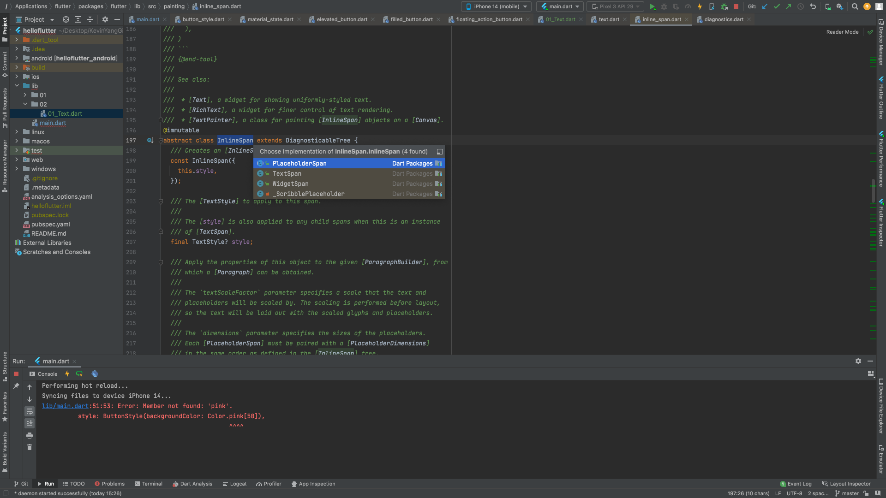

option + Enter 扩展功能

CMD + option + M 将选中代码提取到某个方法中

CMD + option + W 将选中代码提取生成一个新的Widget

command + N生成构造函数

菜单栏: Code —> Generate —> Constructorƒ

Command + Shift + F全局搜索

## 代码块
