[Text](#text)
[Button](#button)


<!-- more -->

## Text

```dart
const Text(
  String this.data, {      // 文本内容
  super.key,               // 唯一标识
  this.style,              // 文本样式
  this.strutStyle,         // 文本结构样式
  this.textAlign,          // 文本对齐方式
  this.textDirection,      // 文本方向
  this.locale,             // 语言
  this.softWrap,           // 是否自动换行
  this.overflow,           // 超出是否截断
  this.textScaleFactor,    // 文本缩放比例
  this.maxLines,           // 最大行数
  this.semanticsLabel,     // 语义标签
  this.textWidthBasis,     // 文本宽度基准
  this.textHeightBehavior, // 文本高度行为
  this.selectionColor,     // 选中颜色
}) : textSpan = null;      // 文本段落
```

### 文本展示

```dart
import 'package:flutter/material.dart';

main() => runApp(MyApp());

class MyApp extends StatelessWidget {
  @override
  Widget build(BuildContext context) {
    return MaterialApp(
      home: MyHome(),
    );
  }
}

class MyHome extends StatelessWidget {
  @override
  Widget build(BuildContext context) {
    return Scaffold(
      appBar: AppBar(
        title: Text("Text"),
      ),
      body: MyBody(),
    );
  }
}

/*
文本展示
 */
class MyBody extends StatelessWidget {
  @override
  Widget build(BuildContext context) {
    return Container(
      decoration: BoxDecoration(
        border: Border.all(width: 1, color: Colors.red),
      ),
      child: const Text(
        "《登高》唐·杜甫风急天高猿啸哀，渚清沙白鸟飞回。无边落木萧萧下，不尽长江滚滚来。万里悲秋常作客，百年多病独登台。艰难苦恨繁霜鬓，潦倒新停浊酒杯。",
        style: TextStyle(
          fontSize: 18,
          color: Colors.black,
        ),
      ),
    );
  }
}
```

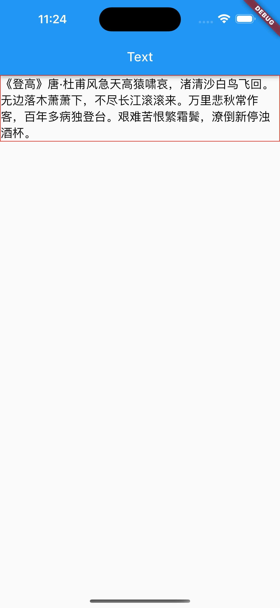

`Container` 的定义：

```dart
class Container extends StatelessWidget {
  Container({
    super.key,                     // 唯一标识
    this.alignment,                // 对其方式
    this.padding,                  // 内边距
    this.color,                    // 背景色
    this.decoration,               // 背景装饰
    this.foregroundDecoration,     // 前景装饰
    double? width,                 // 宽度
    double? height,                // 高度
    BoxConstraints? constraints,   // 约束
    this.margin,                   // 外边距
    this.transform,                // 变换
    this.transformAlignment,       // 变换对齐方式
    this.child,                    // 子组件
    this.clipBehavior = Clip.none, // 裁剪行为
  }) : assert(margin == null || margin.isNonNegative),
       assert(padding == null || padding.isNonNegative),
       assert(decoration == null || decoration.debugAssertIsValid()),
       assert(constraints == null || constraints.debugAssertIsValid()),
       assert(decoration != null || clipBehavior == Clip.none),
       assert(color == null || decoration == null,
         'Cannot provide both a color and a decoration\n'
         'To provide both, use "decoration: BoxDecoration(color: color)".',
       ),
       constraints =
        (width != null || height != null)
          ? constraints?.tighten(width: width, height: height)
            ?? BoxConstraints.tightFor(width: width, height: height)
          : constraints;
}
```

`BoxDecoration` 的定义：

```dart
class BoxDecoration extends Decoration {
  const BoxDecoration({
    this.color,                       // 颜色
    this.image,                       // 图片
    this.border,                      // 边框
    this.borderRadius,                // 圆角
    this.boxShadow,                   // 阴影
    this.gradient,                    // 渐变
    this.backgroundBlendMode,         // 混合模式
    this.shape = BoxShape.rectangle,  // 形状
  }) : assert(
         backgroundBlendMode == null || color != null || gradient != null,
         "backgroundBlendMode applies to BoxDecoration's background color or "
         'gradient, but no color or gradient was provided.',
       );
}
```

### 基本属性

```dart
/*
Text 的基本属性
 */
class MyBody extends StatelessWidget {
  @override
  Widget build(BuildContext context) {
    return Text(
      "《登高》唐·杜甫风急天高猿啸哀，渚清沙白鸟飞回。无边落木萧萧下，不尽长江滚滚来。万里悲秋常作客，百年多病独登台。艰难苦恨繁霜鬓，潦倒新停浊酒杯。",
      textAlign: TextAlign.center, // 居中对齐
      maxLines: 2, // 最大显示两行
      overflow: TextOverflow.ellipsis, // 超出部分显示 ...
      textScaleFactor: 1.25, // 文本放大 1.25 倍
      style: TextStyle(
        fontSize: 18,
        color: Colors.black,
      ),
    );
  }
}
```

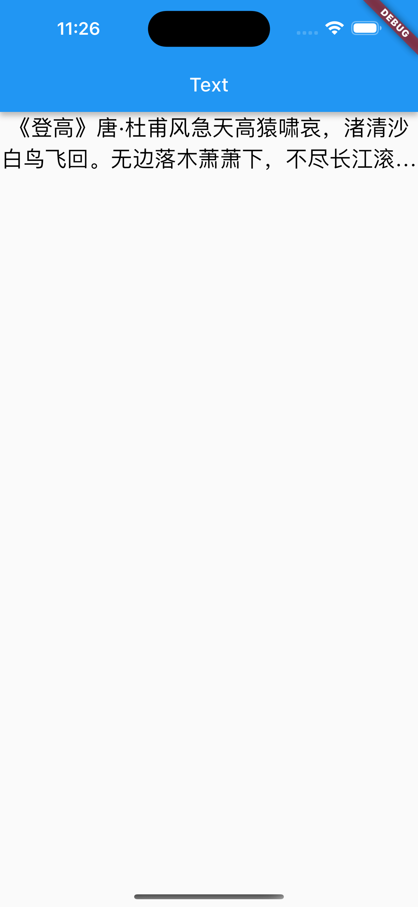

### 富文本

```dart
class MyBody extends StatelessWidget {
  @override
  Widget build(BuildContext context) {
    return Container(
      decoration: BoxDecoration(
        border: Border.all(width: 1, color: Colors.red),
      ),
      child: Text.rich(
        TextSpan(
          children: [
            TextSpan(
                text: "《登高》",
                style: TextStyle(
                    fontSize: 25,
                    fontWeight: FontWeight.bold,
                    color: Colors.red)),
            TextSpan(
                text: "唐·杜甫",
                style: TextStyle(fontSize: 18, color: Colors.blue)),
            TextSpan(
                text:
                    "\n风急天高猿啸哀，渚清沙白鸟飞回。\n无边落木萧萧下，不尽长江滚滚来。\n万里悲秋常作客，百年多病独登台。\n艰难苦恨繁霜鬓，潦倒新停浊酒杯。"),
          ],
        ),
        style: TextStyle(fontSize: 16, color: Colors.green),
        textAlign: TextAlign.center,
      ),
    );
  }
}
```

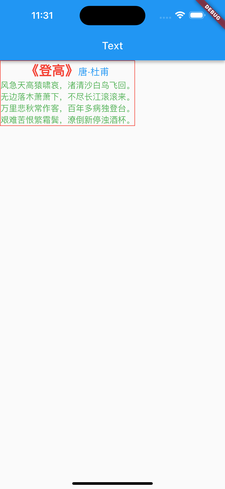

## Button

```dart
import 'package:flutter/material.dart';

main() => runApp(MyApp());

class MyApp extends StatelessWidget {
  @override
  Widget build(BuildContext context) {
    return MaterialApp(
      home: MyHome(),
    );
  }
}

class MyHome extends StatelessWidget {
  @override
  Widget build(BuildContext context) {
    return Scaffold(
      appBar: AppBar(
        title: Text("Text"),
      ),
      body: MyBody(),
    );
  }
}

/*
///  * [ElevatedButton], a filled button whose material elevates when pressed .
///  * [FilledButton], a filled button that doesn't elevate when pressed.
///  * [FilledButton.tonal], a filled button variant that uses a secondary fill color.
///  * [OutlinedButton], a button with an outlined border and no fill color.
///  * [TextButton], a button with no outline or fill color.
 */

class MyBody extends StatelessWidget {
  @override
  Widget build(BuildContext context) {
    return Center(
      child: Column(
        mainAxisAlignment: MainAxisAlignment.center,
        children: [
          /*
          1."圆形"按钮，默认带有阴影和灰色背景。按下后，阴影会变大
          */
          FloatingActionButton(
            onPressed: () {
              print("FloatingActionButton Click");
            },
            child: Text("FloatingActionButton"),
          ),

          /*
          2.“漂浮”按钮，默认带有阴影和灰色背景。按下后，阴影会变大
          */
          ElevatedButton(
            onPressed: () {
              print("ElevatedButton Click");
            },
            child: Text(
              "ElevatedButton",
              style: TextStyle(color: Colors.red),
            ),
          ),

          /*
          3.“全圆角”按钮，默认按钮两侧全圆角，不带阴影
          */
          FilledButton(
            onPressed: () {
              print("FilledButton Click");
            },
            child: Text("FilledButton"),
          ),

          /*
          4.默认有一个边框，不带阴影切背景透明。按下后，边框颜色会变亮。同时出现背景和阴影（较弱）
          */
          OutlinedButton(
            onPressed: () {
              print("OutlinedButton Click");
            },
            child: Text("OutlinedButton"),
          ),

          /*
          5.文本按钮，默认背景透明不带阴影。按下后，会有背景色
          */
          TextButton(
            onPressed: () {
              print("TextButton Click");
            },
            child: Text("TextButton"),
          ),

          /*
          6.一个可点击的icon，不包括文字，默认没有背景，点击后出背景
          */
          IconButton(
            onPressed: () {
              print("IconButton Click");
            },
            icon: Icon(Icons.thumb_up),
          ),

          /*
          7.带图标和文字的按钮
          */
          ElevatedButton.icon(
            onPressed: () {
              print("ElevatedButton Click");
            },
            icon: Icon(Icons.send),
            label: Text("发送"),
          ),

          /*
          8.带图标和文字的按钮
          */
          OutlinedButton.icon(
            onPressed: () {
              print("OutlinedButton Click");
            },
            icon: Icon(Icons.add),
            label: Text("添加"),
          ),

          /*
          9.带图标和文字的按钮
          */
          TextButton.icon(
            onPressed: () {
              print("TextButton Click");
            },
            icon: Icon(Icons.info),
            label: Text("详情"),
          )
        ],
      ),
    );
  }
}
```

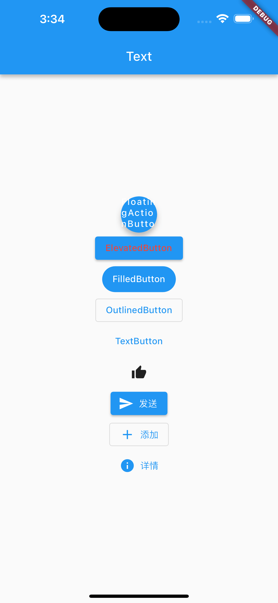

### 浮动按钮

圆形浮动按钮，默认带有阴影和灰色背景。按下后，阴影会变大

```dart
// 浮动按钮
class FloatingActionButton extends StatelessWidget {
  const FloatingActionButton({
    super.key,                              //唯一标识
    this.child,                             // 子控件（通常为Icon）         
    this.tooltip,                           // 悬浮按钮的提示文本
    this.foregroundColor,                   // 悬浮按钮的前景色
    this.backgroundColor,                   // 背景色
    this.focusColor,                        // 悬浮按钮获得焦点时的前景色
    this.hoverColor,                        // 悬浮按钮悬停时的前景色
    this.splashColor,                       // 悬浮按钮的点击效果时的前景色
    this.heroTag = const _DefaultHeroTag(), // 标记
    this.elevation,                         // 悬浮按钮的z轴高度
    this.focusElevation,                    // 悬浮按钮获得焦点时的z轴高度
    this.hoverElevation,                    // 悬浮按钮悬停时的z轴高度
    this.highlightElevation,                // 悬浮按钮的点击效果时的z轴高度
    this.disabledElevation,                 // 悬浮按钮禁用时的z轴高度
    required this.onPressed,                // 悬浮按钮的点击事件
    this.mouseCursor,                       // 悬浮按钮的鼠标光标
    this.mini = false,                      // 是否为迷你悬浮按钮
    this.shape,                             // 悬浮按钮的形状
    this.clipBehavior = Clip.none,          // 边缘裁剪方式
    this.focusNode,                         // 焦点节点
    this.autofocus = false,                 // 自动获取焦点
    this.materialTapTargetSize,             // 悬浮按钮的尺寸
    this.isExtended = false,                // 是否为扩展的悬浮按钮
    this.enableFeedback,                    // 是否为反馈悬浮按钮
  }) : assert(elevation == null || elevation >= 0.0),
        assert(focusElevation == null || focusElevation >= 0.0),
        assert(hoverElevation == null || hoverElevation >= 0.0),
        assert(highlightElevation == null || highlightElevation >= 0.0),
        assert(disabledElevation == null || disabledElevation >= 0.0),
        _floatingActionButtonType = mini ? _FloatingActionButtonType.small : _FloatingActionButtonType.regular,
        _extendedLabel = null,
        extendedIconLabelSpacing = null,
        extendedPadding = null,
        extendedTextStyle = null;
}
```

示例

```dart
class MyBody extends StatelessWidget {
  @override
  Widget build(BuildContext context) {
    return Center(
      child: Column(
        mainAxisAlignment: MainAxisAlignment.center,
        children: [
          /*
          1."圆形"按钮，默认带有阴影和灰色背景。按下后，阴影会变大
          */
          FloatingActionButton(
            onPressed: () {
              print("FloatingActionButton Click");
            },
            child: Text("01"),
          ),
          FloatingActionButton.small(
            onPressed: () {
              print("FloatingActionButton.small Click");
            },
            child: Text("02"),
          ),
          FloatingActionButton.large(
            onPressed: () {},
            child: Text("03"),
          ),
          // 全角
          FloatingActionButton.extended(
            onPressed: () {
              print("FloatingActionButton.extended Click");
            },
            label: Text("- 04 -"),
          ),
        ],
      ),
    );
  }
}
```

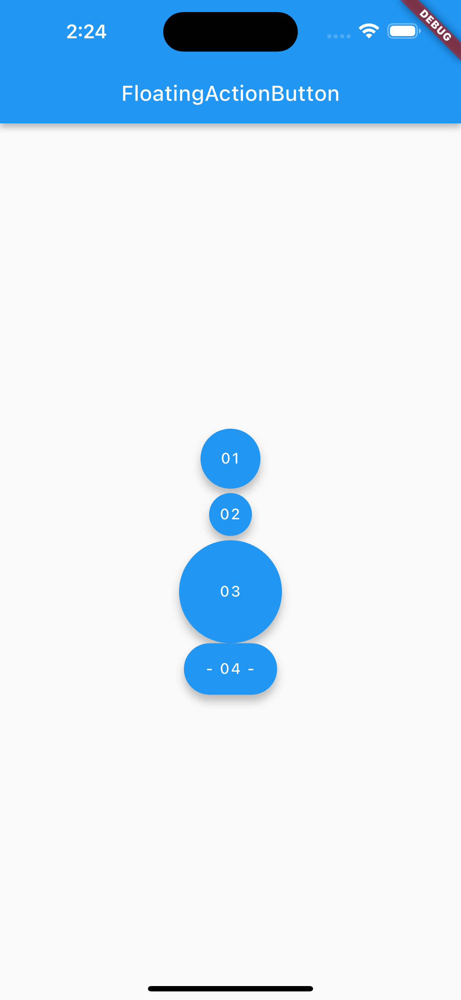

### 漂浮按钮

"漂浮"按钮，它默认带有阴影和灰色背景。按下后，阴影会变大。

```dart
class ElevatedButton extends ButtonStyleButton {
  const ElevatedButton({
    super.key,                      //唯一标识
    required super.onPressed,       // 点击事件
    super.onLongPress,              // 长按事件
    super.onHover,                  // 悬停事件
    super.onFocusChange,            // 焦点改变事件
    super.style,                    // 按钮样式
    super.focusNode,                // 焦点节点
    super.autofocus = false,        // 是否自动获取焦点
    super.clipBehavior = Clip.none, // 边缘裁剪方式
    super.statesController,         // 状态控制器
    required super.child,           
  });
}
```

实列

```dart
class MyBody extends StatelessWidget {
  @override
  Widget build(BuildContext context) {
    return Center(
      child: Column(
        mainAxisAlignment: MainAxisAlignment.center,
        children: [
          // “01” 按钮
          ElevatedButton(
            onPressed: () {
              print("ElevatedButton Click");
            },
            child: Text("01"),
          ),
          // “+ 02” 按钮
          ElevatedButton.icon(
            onPressed: () {
              print("ElevatedButton Click");
            },
            icon: Icon(Icons.add),
            label: Text("02"),
          ),
        ],
      ),
    );
  }
}
```

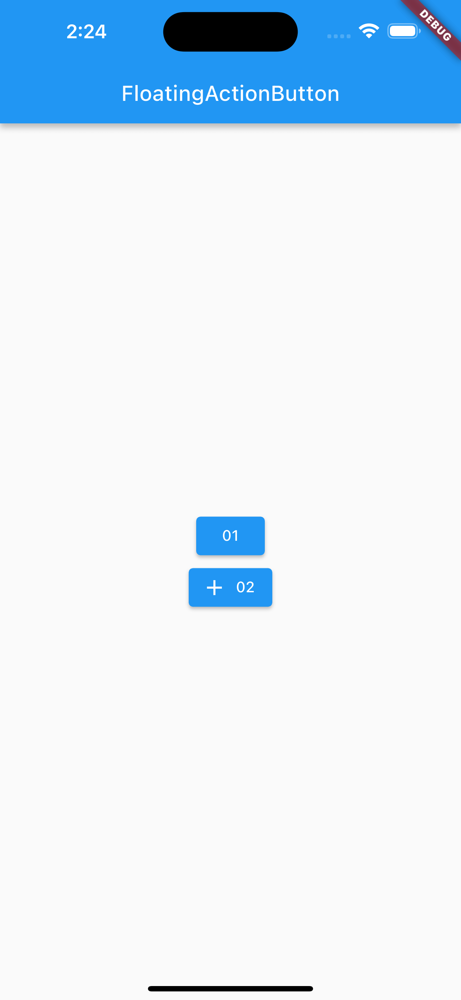

### 全角按钮

```dart
class FilledButton extends ButtonStyleButton {
  const FilledButton({
    super.key,                      // 唯一标识
    required super.onPressed,       // 点击事件
    super.onLongPress,              // 长按事件
    super.onHover,                  // 悬停事件
    super.onFocusChange,            // 焦点改变事件
    super.style,                    // 按钮样式
    super.focusNode,                // 焦点节点
    super.autofocus = false,        // 是否自动获取焦点
    super.clipBehavior = Clip.none, // 边缘裁剪方式
    super.statesController,         // 状态控制器
    required super.child,
  }) : _variant = _FilledButtonVariant.filled;
}
```

示例

```dart
class MyBody extends StatelessWidget {
  @override
  Widget build(BuildContext context) {
    return Center(
      child: Column(
        mainAxisAlignment: MainAxisAlignment.center,
        children: [
          FilledButton(
            onPressed: () {
              print("FilledButton click");
            },
            child: Text("01"),
          ),
          FilledButton.icon(
            onPressed: () {
              print("FilledButton.icon Click");
            },
            icon: Icon(Icons.add),
            label: Text("02"),
          ),
          FilledButton.tonal(
            onPressed: () {
              print("FilledButton.tonal Click");
            },
            child: Text("03"),
          ),
          FilledButton.tonalIcon(
            onPressed: () {
              print("FilledButton.tonalIcon Click");
            },
            icon: Icon(Icons.add),
            label: Text("04"),
          ),
        ],
      ),
    );
  }
}
```

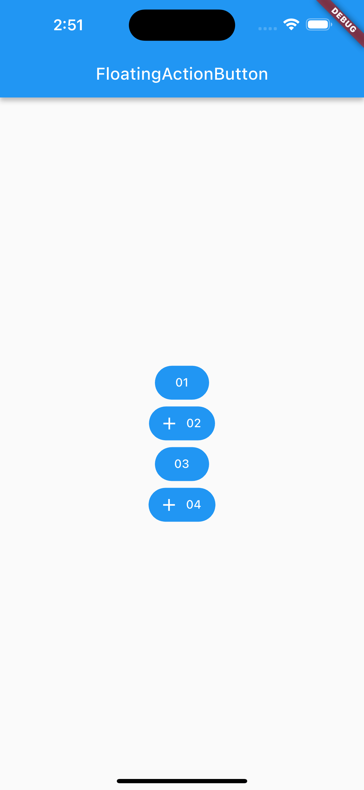

### 边框按钮

默认有一个边框，不带阴影切背景透明。按下后，边框颜色会变亮。同时出现背景和阴影（较弱）。

```dart
class OutlinedButton extends ButtonStyleButton {
    const OutlinedButton({
      super.key,                      // 唯一标识
      required super.onPressed,       // 点击事件
      super.onLongPress,              // 长按事件
      super.onHover,                  // 悬停事件
      super.onFocusChange,            // 焦点改变事件
      super.style,                    // 按钮样式
      super.focusNode,                // 焦点节点
      super.autofocus = false,        // 是否自动获取焦点
      super.clipBehavior = Clip.none, // 边缘裁剪方式
      super.statesController,         // 状态控制器
      required super.child,
    });
}
```

示例

```dart
class MyBody extends StatelessWidget {
  @override
  Widget build(BuildContext context) {
    return Center(
      child: Column(
        mainAxisAlignment: MainAxisAlignment.center,
        children: [
          OutlinedButton(
            onPressed: () {
              print("OutlinedButton click");
            },
            child: Text("01"),
          ),
          OutlinedButton.icon(
            onPressed: () {
              print("OutlinedButton.icon click");
            },
            icon: Icon(Icons.add),
            label: Text("02"),
          ),
        ],
      ),
    );
  }
}
```

`01` 按钮是点击后的样式。

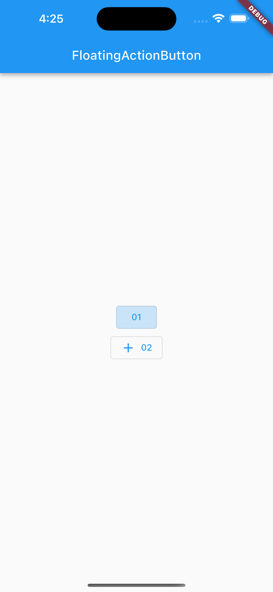

### 文本按钮

```dart
class TextButton extends ButtonStyleButton {
  const TextButton({
    super.key,
    required super.onPressed,       // 按钮点击事件
    super.onLongPress,              // 长按事件
    super.onHover,                  // 悬停事件
    super.onFocusChange,            // 焦点改变事件
    super.style,                    // 按钮样式
    super.focusNode,                // 焦点节点
    super.autofocus = false,        // 是否自动获取焦点
    super.clipBehavior = Clip.none, // 边缘裁剪方式
    super.statesController,         // 状态控制器
    super.isSemanticButton,         // 语义化按钮
    required Widget super.child,
  });
}
```

示例

```dart
class MyBody extends StatelessWidget {
  @override
  Widget build(BuildContext context) {
    return Center(
      child: Column(
        mainAxisAlignment: MainAxisAlignment.center,
        children: [
          TextButton(
            onPressed: () {
              print("TextButton click");
            },
            child: Text("01"),
          ),
          TextButton(
            onPressed: () {
              print("TextButton 02 click");
            },
            child: Text("02"),
          ),
          TextButton.icon(
            onPressed: () {
              print("TextButton.icon click");
            },
            icon: Icon(Icons.add),
            label: Text("03"),
          ),
        ],
      ),
    );
  }
}
```

`02` 按钮是点击时的样式。

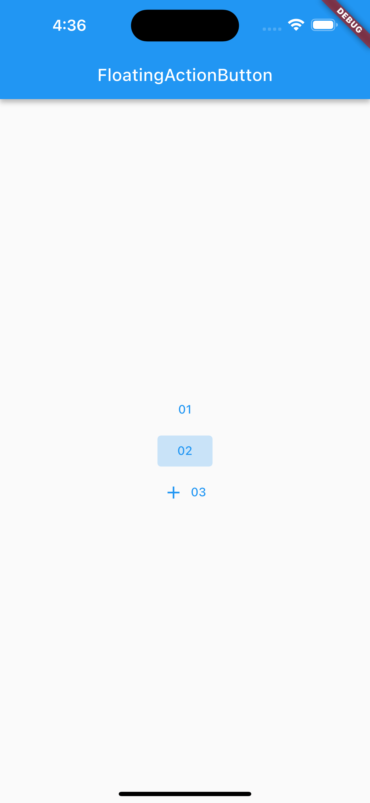

### 图标按钮

```dart
class IconButton extends StatelessWidget {
  const IconButton({
    super.key,
    this.iconSize,           // 图标大小
    this.visualDensity,      // 视觉密度
    this.padding,            // 内边距
    this.alignment,          // 对齐方式
    this.splashRadius,       // 闪动半径
    this.color,              // 颜色
    this.focusColor,         // 焦点颜色
    this.hoverColor,         // 悬停颜色
    this.highlightColor,     // 高亮颜色
    this.splashColor,        // 闪动颜色
    this.disabledColor,      // 禁用颜色
    required this.onPressed, // 按钮点击事件
    this.mouseCursor,        //
    this.focusNode,          // 焦点节点
    this.autofocus = false,  // 是否自动获取焦点
    this.tooltip,            // 提示文本
    this.enableFeedback,     // 是否为反馈按钮
    this.constraints,        //
    this.style,              // 样式
    this.isSelected,         // 是否选中
    this.selectedIcon,       // 选中图标
    required this.icon,
  }) : assert(splashRadius == null || splashRadius > 0),
        _variant = _IconButtonVariant.standard;
}
```

<!-- 示例 -->

```dart
class MyBody extends StatelessWidget {
  @override
  Widget build(BuildContext context) {
    return Center(
      child: Column(
        mainAxisAlignment: MainAxisAlignment.center,
        children: [
          IconButton(
            onPressed: () {
              print("IconButton click");
            },
            icon: Icon(Icons.add),
          ),
          IconButton.filled(
            onPressed: () {
              print("IconButton.filled click");
            },
            icon: Icon(Icons.send),
          ),
          IconButton.filledTonal(
            onPressed: () {
              print("IconButton.filledTonal click");
            },
            icon: Icon(Icons.search),
          ),
          IconButton.outlined(
            onPressed: () {
              print("IconButton.outlined click");
            },
            icon: Icon(Icons.list),
          ),
        ],
      ),
    );
  }
}
```

`+` 按钮是点击时的样式。

;
}
```

按钮样式:

```dart
class ButtonStyle with Diagnosticable {
  /// Create a [ButtonStyle].
  const ButtonStyle({
    this.textStyle,        // 文本样式
    this.backgroundColor,  // 背景颜色
    this.foregroundColor,  // 前景颜色
    this.overlayColor,     // 覆盖颜色
    this.shadowColor,      // 阴影颜色
    this.surfaceTintColor, // 表面着色颜色
    this.elevation,        // 阴影
    this.padding,          // 内边距
    this.minimumSize,      // 最小尺寸
    this.fixedSize,        // 固定尺寸
    this.maximumSize,      // 最大尺寸
    this.iconColor,        // 图标颜色
    this.iconSize,         // 图标尺寸
    this.side,             // 边框
    this.shape,            // 形状
    this.mouseCursor,      // 鼠标光标
    this.visualDensity,    // 视觉密度
    this.tapTargetSize,    // 触摸目标尺寸
    this.animationDuration,// 动画时长
    this.enableFeedback,   // 反馈
    this.alignment,        // 文本对齐方式
    this.splashFactory,    // 溅射工厂
  });
}
```

自定义按钮：

```dart
class MyBody extends StatelessWidget {
  @override
  Widget build(BuildContext context) {
    return Center(
      child: Column(
        mainAxisAlignment: MainAxisAlignment.center,
        children: [
          TextButton(
            child: Text(
              "自定义样式",
              style: TextStyle(color: Colors.red), // 字体颜色
            ),
            style: ElevatedButton.styleFrom(
              backgroundColor: Colors.lightGreen, // 背景色
              shape: RoundedRectangleBorder(
                  borderRadius: BorderRadius.circular(10)), // 设置圆角
              elevation: 2, // 通过添加阴影，设置按钮漂浮高度
            ),
            onPressed: () {
              print("FilledButton click");
            },
          ),
        ],
      ),
    );
  }
}
```

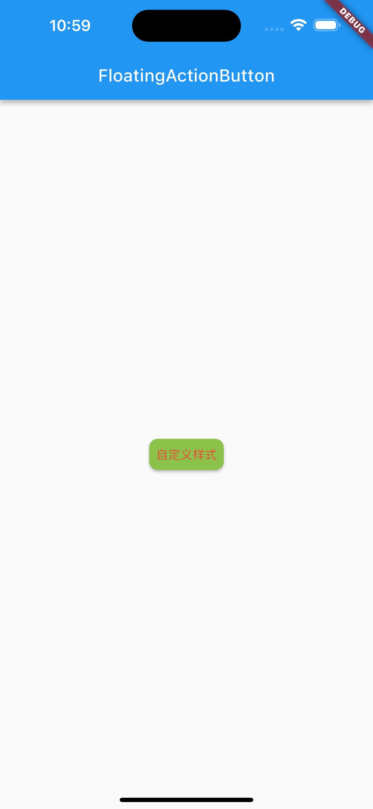

## Image

### 加载网络图片

```dart
import 'package:flutter/material.dart';

main() => runApp(MyApp());

class MyApp extends StatelessWidget {
  @override
  Widget build(BuildContext context) {
    return MaterialApp(
      home: Scaffold(
        appBar: AppBar(
          title: Text("图片"),
        ),
        body: MyBody(),
      ),
    );
  }
}

class MyBody extends StatelessWidget {
  @override
  Widget build(BuildContext context) {
    return Center(
      child: Column(
        mainAxisAlignment: MainAxisAlignment.center,
        children: [
          Container(
            width: 300,
            height: 400,
            decoration: BoxDecoration(
              border: Border.all(color: Colors.red, width: 2),
            ),
            child: Image.network(
              "https://pic4.zhimg.com/v2-cb75f239dfd0c1c42c23dfc9011965a3_b.jpg",
              alignment: Alignment.center,
            ),
          ),
        ],
      ),
    );
  }
}
```

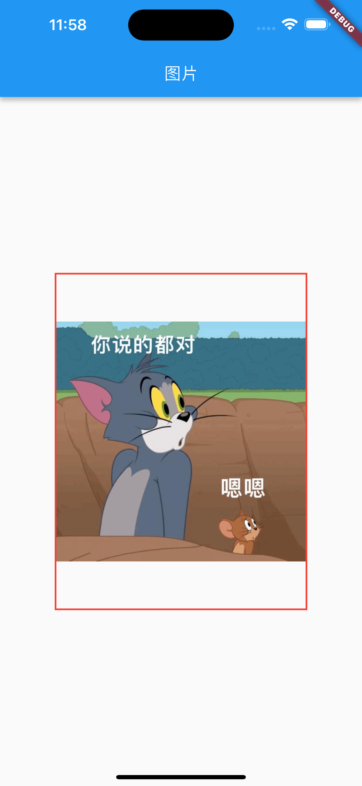

### 加载本地图片

加载本地图片，需要先将图片放到`assets`目录下，然后通过`Image.asset`加载。

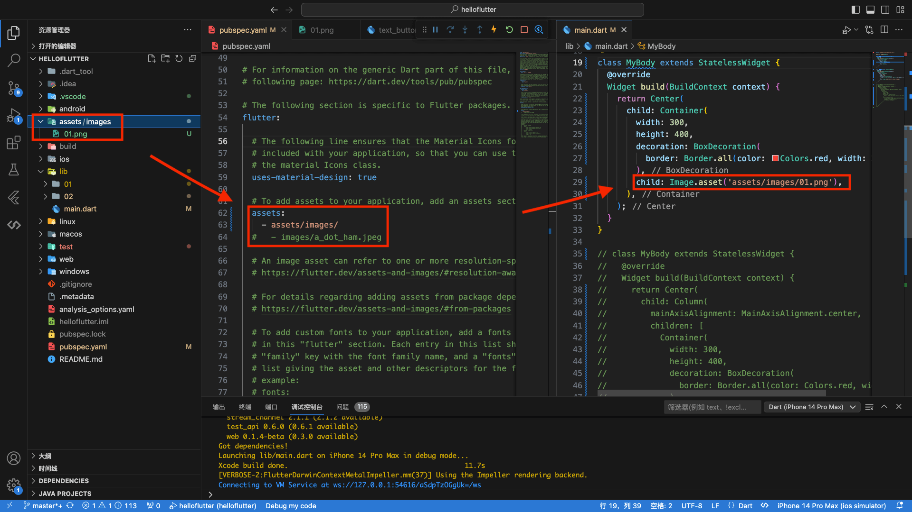

```dart
class MyBody extends StatelessWidget {
  @override
  Widget build(BuildContext context) {
    return Center(
      child: Container(
        width: 300,
        height: 400,
        decoration: BoxDecoration(
          border: Border.all(color: Colors.red, width: 2),
        ),
        child: Image.asset('assets/images/01.png'),
      ),
    );
  }
}
```


### 填充方式

- `fill`：填充，图片会根据容器的尺寸进行拉伸
- `contain`：包含，图片会保持宽高比，并缩放至完全适应容器
- `cover`：覆盖，图片会保持宽高比，并缩放至完全覆盖容器
- `fitWidth`：填充宽度，图片会保持宽高比，并缩放至容器宽度
- `fitHeight`：填充高度，图片会保持宽高比，并缩放至容器高度
- `none`：不填充，图片会保持原始大小，并居中显示

#### fill

```dart
class MyBody extends StatelessWidget {
  @override
  Widget build(BuildContext context) {
    return Center(
      child: Column(
        mainAxisAlignment: MainAxisAlignment.center,
        children: [
          Container(
            width: 300,
            height: 400,
            decoration: BoxDecoration(
              border: Border.all(color: Colors.red, width: 2),
            ),
            child: Image.network(
              "https://pic4.zhimg.com/v2-cb75f239dfd0c1c42c23dfc9011965a3_b.jpg",
              alignment: Alignment.center,
              fit: BoxFit.fill,
            ),
          ),
        ],
      ),
    );
  }
}
```

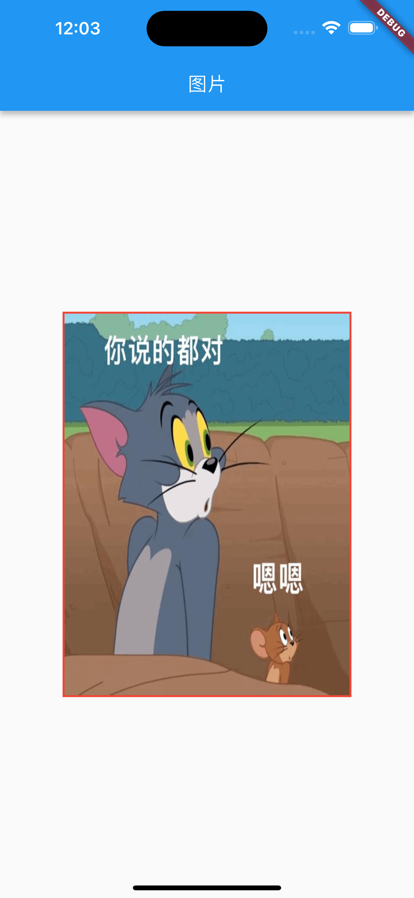

#### contain

默认填充方式

```dart
fit: BoxFit.contain,
```


#### cover

```dart
fit: BoxFit.cover,
```

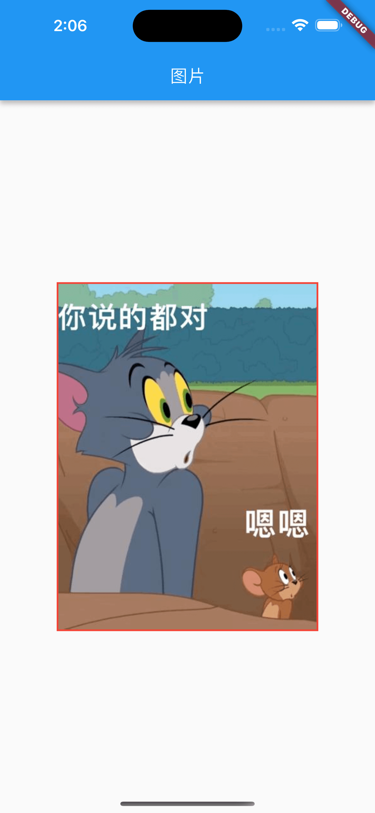

#### fitWidth

```dart
fit: BoxFit.fitWidth,
```


#### fitHeight

```dart
fit: BoxFit.fitHeight,
```


### 头像

#### 方式一：CircleAvatar

```dart
class MyBody extends StatelessWidget {
  @override
  Widget build(BuildContext context) {
    return Center(
      child: Container(
        width: 200,
        height: 200,
        decoration: BoxDecoration(
          border: Border.all(color: Colors.red, width: 2),
        ),
        child: CircleAvatar(
          radius: 100,
          backgroundImage: AssetImage('assets/images/01.png'),
        ),
      ),
    );
  }
}
```

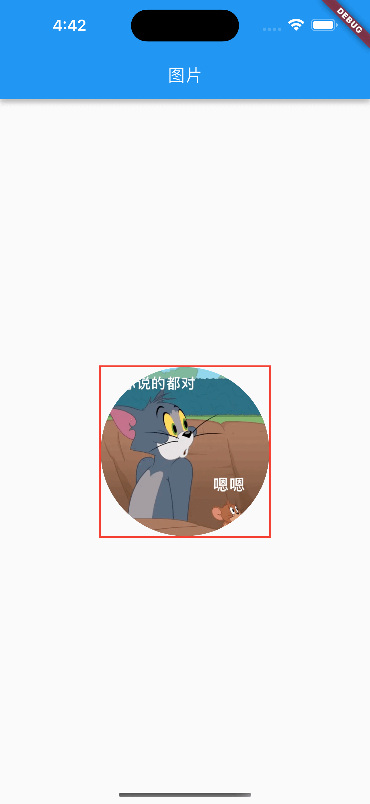

`CircleAvatar` 的定义：

```dart
class CircleAvatar extends StatelessWidget {
  const CircleAvatar({
    super.key,                   // 唯一标识
    this.child,                  // 子控件
    this.backgroundColor,        // 背景颜色
    this.backgroundImage,        // 背景图片
    this.foregroundImage,        // 前景图片
    this.onBackgroundImageError, // 背景图片错误回调
    this.onForegroundImageError, // 前景图片错误回调
    this.foregroundColor,        // 前景颜色
    this.radius,                 // 半径
    this.minRadius,              // 最小半径
    this.maxRadius,              // 最大半径
  }) : assert(radius == null || (minRadius == null && maxRadius == null)),
       assert(backgroundImage != null || onBackgroundImageError == null),
       assert(foregroundImage != null || onForegroundImageError== null);
}
```

#### 方式二：Container+BoxDecoration

```dart
class MyBody extends StatelessWidget {
  @override
  Widget build(BuildContext context) {
    return Center(
      child: Container(
        width: 200,
        height: 200,
        decoration: BoxDecoration(
          border: Border.all(color: Colors.red, width: 10),
          borderRadius: BorderRadius.all(Radius.circular(100)),
          image: DecorationImage(
            image: AssetImage("assets/images/01.png"),
            fit: BoxFit.cover,
          ),
        ),
      ),
    );
  }
}
```

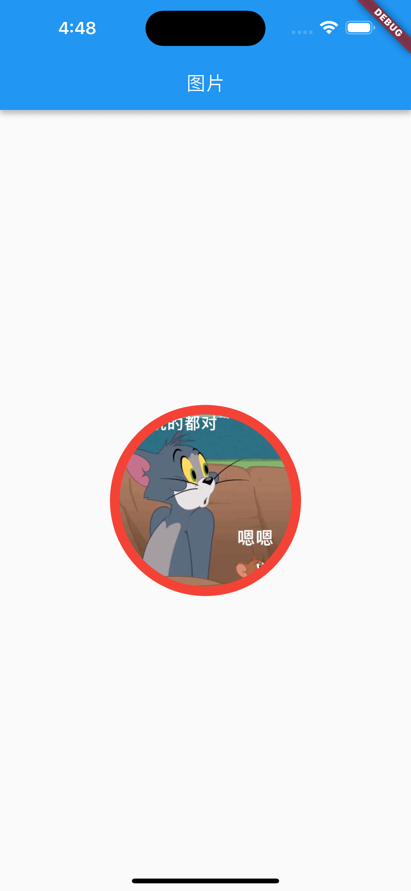

`DecorationImage` 的定义：

```dart
class DecorationImage {
  const DecorationImage({
    required this.image,                    // 图片
    this.onError,                           // 错误回调
    this.colorFilter,                       // 颜色过滤器
    this.fit,                               // 填充方式
    this.alignment = Alignment.center,      // 位置
    this.centerSlice,                       // 切片
    this.repeat = ImageRepeat.noRepeat,     // 重复方式
    this.matchTextDirection = false,        // 文本方向
    this.scale = 1.0,                       // 缩放
    this.opacity = 1.0,                     // 透明度
    this.filterQuality = FilterQuality.low, // 过滤器
    this.invertColors = false,              // 反色
    this.isAntiAlias = false,               // 抗锯齿
  });
}
```

#### 方式三：ClipOval

```dart
class MyBody extends StatelessWidget {
  @override
  Widget build(BuildContext context) {
    return Center(
      child: Container
      (
        decoration: BoxDecoration(
          border: Border.all(width: 2, color: Colors.red),
        ),
        child: ClipOval(
          child: Image.network(
            "https://pic4.zhimg.com/v2-cb75f239dfd0c1c42c23dfc9011965a3_b.jpg",
            fit: BoxFit.cover,
            width: 200,
            height: 200,
          ),
        ),
      ),
    );
  }
}
```

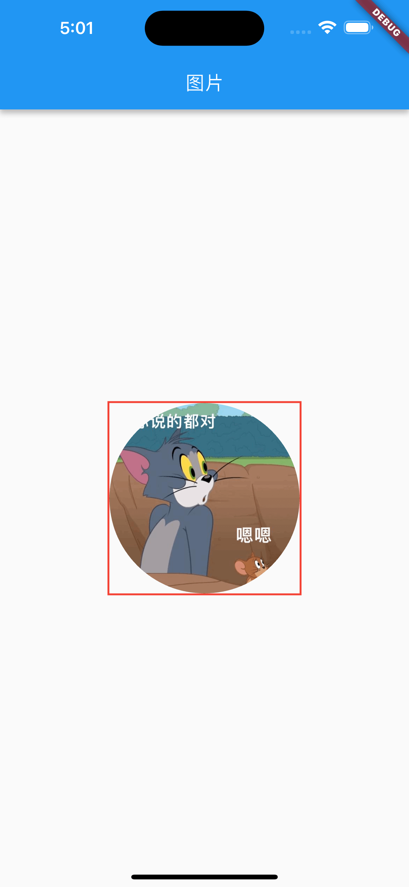

`ClipOval` 的定义：

```dart
class ClipOval extends SingleChildRenderObjectWidget {
  const ClipOval({
    super.key,
    this.clipper, // 裁剪
    this.clipBehavior = Clip.antiAlias, // 边缘裁剪方式
    super.child,
  });
}
```

### 圆角图片

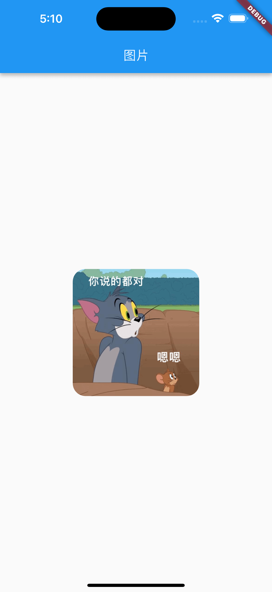

#### 方式一：Container+BoxDecoration

```dart
class MyBody extends StatelessWidget {
  @override
  Widget build(BuildContext context) {
    return Center(
      child: Container(
        width: 200,
        height: 200,
        decoration: BoxDecoration(
          border: Border.all(width: 2, color: Colors.red),
          borderRadius: BorderRadius.circular(10),
        ),
        child: ClipRRect(
          borderRadius: BorderRadius.circular(10),
          child: Image.network(
            'https://pic4.zhimg.com/v2-cb75f239dfd0c1c42c23dfc9011965a3_b.jpg',
            fit: BoxFit.cover,
          ),
        ),
      ),
    );
  }
}
```

#### 方式二：ClipRRect

```dart
class MyBody extends StatelessWidget {
  @override
  Widget build(BuildContext context) {
    return Center(
      child: Container(
        child: ClipRRect(
          borderRadius: BorderRadius.circular(20),
          child: Image.network(
            'https://pic4.zhimg.com/v2-cb75f239dfd0c1c42c23dfc9011965a3_b.jpg',
            width: 200,
            height: 200,
            fit: BoxFit.cover,
          ),
        ),
      ),
    );
  }
}
```

## TextField

定义：

```dart
class TextField extends StatefulWidget {
  const TextField({
    super.key,                                         // 唯一标识
    this.controller,                                   // 控制器（👇）
    this.focusNode,                                    // 焦点
    this.undoController,                               // 撤销控制器
    this.decoration = const InputDecoration(),         // 装饰器
    TextInputType? keyboardType,                       // 键盘类型
    this.textInputAction,                              // 文本输入动作
    this.textCapitalization = TextCapitalization.none, // 文本大写
    this.style,                                        // 样式
    this.strutStyle,                                   // 结构样式
    this.textAlign = TextAlign.start,                  // 文本对齐
    this.textAlignVertical,                            // 文本垂直对齐
    this.textDirection,                                // 文本方向
    this.readOnly = false,                             // 只读
    @Deprecated(
      'Use `contextMenuBuilder` instead. '
      'This feature was deprecated after v3.3.0-0.5.pre.',
    )
    this.toolbarOptions,              // 工具栏选项（长按或鼠标右击时出现的菜单，包括 copy、cut、paste 以及 selectAll。）
    this.showCursor,                  // 显示光标
    this.autofocus = false,           // 自动聚焦
    this.obscuringCharacter = '•',    // 隐藏字符
    this.obscureText = false,         // 隐藏文本
    this.autocorrect = true,          // 自动更正
    SmartDashesType? smartDashesType, // 智能断句
    SmartQuotesType? smartQuotesType, // 智能引号
    this.enableSuggestions = true,    // 启用建议
    this.maxLines = 1,                // 最大行数
    this.minLines,                    // 最小行数
    this.expands = false,             // 扩展
    this.maxLength,                   // 最大长度
    this.maxLengthEnforcement,        // 当输入文本长度超过maxLength时如何处理，如截断、超出等。
    this.onChanged,                   // 改变
    this.onEditingComplete,           // 完成编辑
    this.onSubmitted,                 // 提交
    this.onAppPrivateCommand,
    this.inputFormatters,             // 用于指定输入格式；当用户输入内容改变时，会根据指定的格式来校验
    this.enabled,                     // 如果为false，则输入框会被禁用，禁用状态不能响应输入和事件，同时显示禁用态样式（在其decoration中定义）
    this.cursorWidth = 2.0,           // 光标宽度
    this.cursorHeight,                // 光标高度
    this.cursorRadius,                // 光标半径
    this.cursorOpacityAnimates,
    this.cursorColor,                 // 光标颜色
    this.selectionHeightStyle = ui.BoxHeightStyle.tight,
    this.selectionWidthStyle = ui.BoxWidthStyle.tight,
    this.keyboardAppearance,
    this.scrollPadding = const EdgeInsets.all(20.0),
    this.dragStartBehavior = DragStartBehavior.start,
    bool? enableInteractiveSelection,
    this.selectionControls,
    this.onTap,
    this.onTapOutside,
    this.mouseCursor,
    this.buildCounter,
    this.scrollController,
    this.scrollPhysics,
    this.autofillHints = const <String>[],
    this.contentInsertionConfiguration,
    this.clipBehavior = Clip.hardEdge,
    this.restorationId,
    this.scribbleEnabled = true,
    this.enableIMEPersonalizedLearning = true,
    this.contextMenuBuilder = _defaultContextMenuBuilder,
    this.canRequestFocus = true,
    this.spellCheckConfiguration,
    this.magnifierConfiguration,
  }) : assert(obscuringCharacter.length == 1),
       smartDashesType = smartDashesType ?? (obscureText ? SmartDashesType.disabled : SmartDashesType.enabled),
       smartQuotesType = smartQuotesType ?? (obscureText ? SmartQuotesType.disabled : SmartQuotesType.enabled),
       assert(maxLines == null || maxLines > 0),
       assert(minLines == null || minLines > 0),
       assert(
         (maxLines == null) || (minLines == null) || (maxLines >= minLines),
         "minLines can't be greater than maxLines",
       ),
       assert(
         !expands || (maxLines == null && minLines == null),
         'minLines and maxLines must be null when expands is true.',
       ),
       assert(!obscureText || maxLines == 1, 'Obscured fields cannot be multiline.'),
       assert(maxLength == null || maxLength == TextField.noMaxLength || maxLength > 0),
       // Assert the following instead of setting it directly to avoid surprising the user by silently changing the value they set.
       assert(
         !identical(textInputAction, TextInputAction.newline) ||
         maxLines == 1 ||
         !identical(keyboardType, TextInputType.text),
         'Use keyboardType TextInputType.multiline when using TextInputAction.newline on a multiline TextField.',
       ),
       keyboardType = keyboardType ?? (maxLines == 1 ? TextInputType.text : TextInputType.multiline),
       enableInteractiveSelection = enableInteractiveSelection ?? (!readOnly || !obscureText);
}
```

### TextField 示例及监听

```dart
import 'package:flutter/material.dart';

main() => runApp(MyApp());

class MyApp extends StatelessWidget {
  @override
  Widget build(BuildContext context) {
    return MaterialApp(
      home: Scaffold(
        appBar: AppBar(
          title: Text("TextField"),
        ),
        body: MyBody(),
      ),
    );
  }
}

class MyBody extends StatelessWidget {
  @override
  Widget build(BuildContext context) {
    return Container(
      padding: EdgeInsets.all(20),
      child: Column(
        mainAxisAlignment: MainAxisAlignment.center,
        children: [
          MyTextField(),
        ],
      ),
    );
  }
}

class MyTextField extends StatefulWidget {
  @override
  _MyTextFieldState createState() => _MyTextFieldState();
}

class _MyTextFieldState extends State<MyTextField> {
  @override
  Widget build(BuildContext context) {
    return TextField(
      // 样式
      decoration: InputDecoration(
        icon: Icon(Icons.phone),  // 图标
        labelText: "手机号",       // 标签
        hintText: "请输入手机号",   // 输入框提示文字
        border: InputBorder.none, // 边框
        filled: true,             // 是否填充
        fillColor: Colors.yellow, // 填充颜色
      ),
      // 监听-输入事件
      onChanged: (value) {
        print("onChange: $value");
      },
      // 监听-提交事件（回车键）
      onSubmitted: (value) {
        print("onSubmitted: $value");
      },
      cursorWidth: 1, // 光标宽度
      cursorColor: Colors.red, // 光标颜色
    );
  }
}
```

打印信息：

```js
flutter: onChange: 1
flutter: onChange: 12
flutter: onChange: 123
flutter: onChange: 1234
flutter: onChange: 12345
flutter: onChange: 123456
flutter: onSubmitted: 123456
```

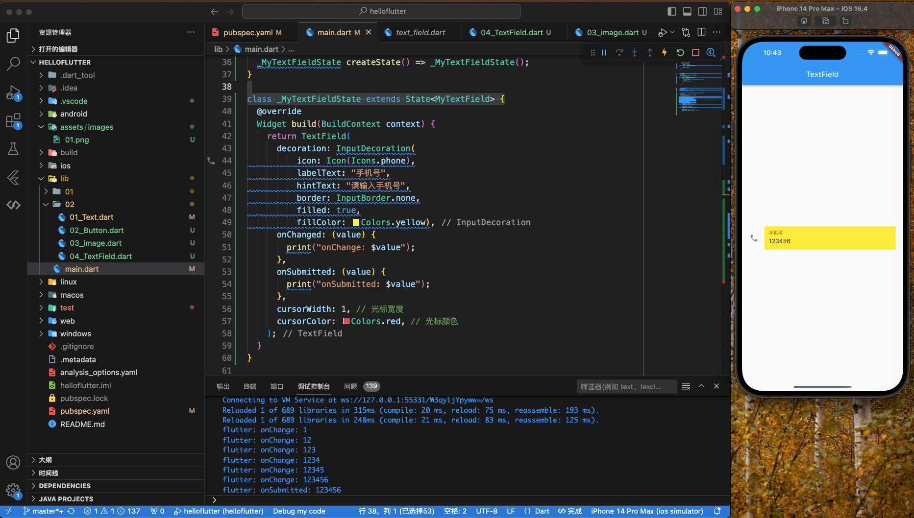

### TextField的controller

`TextField` 的 `controller` 属性，用于获取输入框的值，并控制输入框的值。包括设置/获取编辑框的内容，选择编辑内容，监听编辑文本的变化等。需要指定 `TextEditingController` 对象与文本框绑定，如果没有指定，则使用默认的 `TextEditingController`。

```dart
import 'package:flutter/material.dart';

main() => runApp(MyApp());

class MyApp extends StatelessWidget {
  @override
  Widget build(BuildContext context) {
    return MaterialApp(
      home: Scaffold(
        appBar: AppBar(
          title: Text("TextField"),
        ),
        body: MyBody(),
      ),
    );
  }
}

class MyBody extends StatelessWidget {
  @override
  Widget build(BuildContext context) {
    return Container(
      padding: EdgeInsets.all(20),
      child: Column(
        mainAxisAlignment: MainAxisAlignment.center,
        children: [
          MyTextField(),
        ],
      ),
    );
  }
}

class MyTextField extends StatefulWidget {
  @override
  _MyTextFieldState createState() => _MyTextFieldState();
}

class _MyTextFieldState extends State<MyTextField> {
  // 1.创建监听器
  final _textEditingController = TextEditingController();

  @override
  void initState() {
    super.initState();
    // 2.设置默认值
    _textEditingController.text = "Hello World";
    // 3.监听文本框
    _textEditingController.addListener(() {
      print(
          "TextEditingController.addListener: ${_textEditingController.text}");
    });
  }

  @override
  Widget build(BuildContext context) {
    return TextField(
      // 4.设置监听器
      controller: _textEditingController,
      decoration: InputDecoration(
        icon: Icon(Icons.password),
        labelText: "密码",
        hintText: "请输入密码",
        // border: InputBorder.none, // 边框
        filled: true,
        fillColor: Colors.yellow,
      ),
      onChanged: (value) {
        print(value);
      },
      onSubmitted: (value) {
        print(value);
      },
    );
  }
}
```

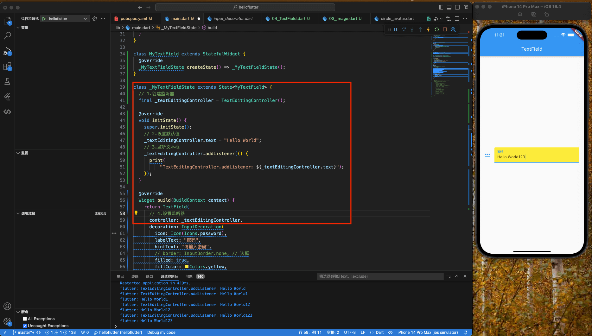

## Form表单

Form 表单用于将多个输入控件封装起来，并且提供一些辅助功能，比如验证、自动补全、错误提示等。

`TextField` 就是 `Form` 表单的一个子类，在验证过程中，`Form` 表单会自动调用 `TextField` 的 `validate()` 方法，如果 `validate()` 返回 `true`，则表示验证通过，否则表示验证失败。

`Form` 表单可以清除所有输入框的值，也可以重置所有输入框的值。

```dart
class Form extends StatefulWidget {
  const Form({
    super.key,                          // 唯一标识
    required this.child,                // 子控件
    this.onWillPop,                     // 返回键按下时触发
    this.onChanged,                     // 输入框内容改变时触发
    AutovalidateMode? autovalidateMode, // 自动验证模式
  }) : autovalidateMode = autovalidateMode ?? AutovalidateMode.disabled; // 默认关闭自动验证
}
```

### FormField

```dart
class FormField<T> extends StatefulWidget {
  const FormField({
    super.key,                         // 唯一标识
    required this.builder,             // 构建子控件
    this.onSaved,                      // 保存回调
    this.validator,                    // 验证回调
    this.initialValue,                 // 初始值
    this.enabled = true,               // 是否可用
    AutovalidateMode? autovalidateMode,// 自动验证模式
    this.restorationId,                // 恢复标识
  }) : autovalidateMode = autovalidateMode ?? AutovalidateMode.disabled;
}
```

`FormField` 是一个抽象类，它有两个子类：`TextFormField` 和 `DropdownButtonFormField`。

```dart
import 'package:flutter/material.dart';

main() => runApp(MyApp());

class MyApp extends StatelessWidget {
  @override
  Widget build(BuildContext context) {
    return MaterialApp(
      home: Scaffold(
        appBar: AppBar(
          title: Text("Form"),
        ),
        body: MyBody(),
      ),
    );
  }
}

class MyBody extends StatelessWidget {
  @override
  Widget build(BuildContext context) {
    return Container(
      padding: EdgeInsets.all(20),
      child: MyForm(),
    );
  }
}

class MyForm extends StatefulWidget {
  @override
  _MyFormState createState() => _MyFormState();
}

class _MyFormState extends State<MyForm> {
  @override
  Widget build(BuildContext context) {
    return Form(
      child: Column(
        mainAxisAlignment: MainAxisAlignment.center,
        children: [
          TextFormField(
            decoration: InputDecoration(
              icon: Icon(Icons.person),
              labelText: "用户名或手机号",
            ),
          ),
          TextFormField(
            obscureText: true,
            decoration: InputDecoration(
              icon: Icon(Icons.lock),
              labelText: "密码",
            ),
          ),
          SizedBox(height: 20), // 输入框和按钮的间距
          Container(            // 按钮
            width: double.infinity,
            height: 44,
            child: ElevatedButton(
              child: Text(
                "登 录",
                style: TextStyle(fontSize: 20, color: Colors.white),
              ),
              onPressed: () {
                print("登录");
              },
            ),
          ),
        ],
      ),
    );
  }
}
```

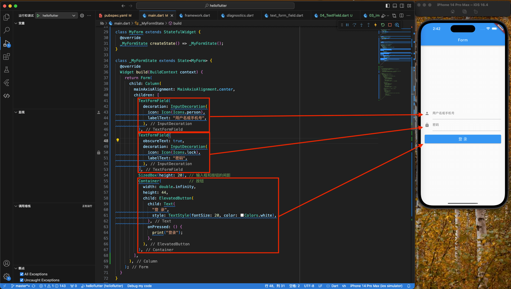

### FormState

`FormState` 是 `Form` 的内部类，它继承自 `State`，用于保存 `Form` 表单的状态。`FormState` 有一个字段 `_formKey`，它是 `GlobalKey<FormState>` 类型的，用于保存 Form 表单的标识。

1. `FormState.save()` 会调用 `Form` 子孙控件的 `save()` 方法，保存表单。

2. `FormState.reset()` 会调用 `Form` 子孙控件的 `reset()` 方法，重置表单。

3. `FormState.validate()` 会调用 `Form` 子孙控件的 `validate()` 方法，验证表单。

#### 保存表单 FormState.save()

```dart
class MyForm extends StatefulWidget {
  @override
  _MyFormState createState() => _MyFormState();
}

class _MyFormState extends State<MyForm> {
  final registerFormKey = GlobalKey<FormState>(); // 1.创建标识
  late String username, password;

  void registerForm() {
    registerFormKey.currentState?.save(); // 3.登录时，调用 save() 方法
    print("username: $username, password: $password");
  }

  @override
  Widget build(BuildContext context) {
    return Form(
      key: registerFormKey, // 2.注册标识，用于获取FormState
      child: Column(
        mainAxisAlignment: MainAxisAlignment.center,
        children: [
          TextFormField(
            decoration: InputDecoration(
              icon: Icon(Icons.person),
              labelText: "用户名或手机号",
            ),
            onSaved: (value) {
              print("username: $value");
              this.username = value ?? ""; // 5.保存用户名
            },
          ),
          TextFormField(
            obscureText: true,
            decoration: InputDecoration(
              icon: Icon(Icons.lock),
              labelText: "密码",
            ),
            onSaved: (value) {
              print("onSaved: $value");
              this.password = value ?? ""; // 6.保存密码
            },
          ),
          SizedBox(height: 20), // 输入框和按钮的间距
          Container(
            // 按钮
            width: double.infinity,
            height: 44,
            child: ElevatedButton(
              child: Text(
                "登 录",
                style: TextStyle(fontSize: 20, color: Colors.white),
              ),
              onPressed: () {
                print("登录");
                this.registerForm();
              },
            ),
          ),
        ],
      ),
    );
  }
}
```

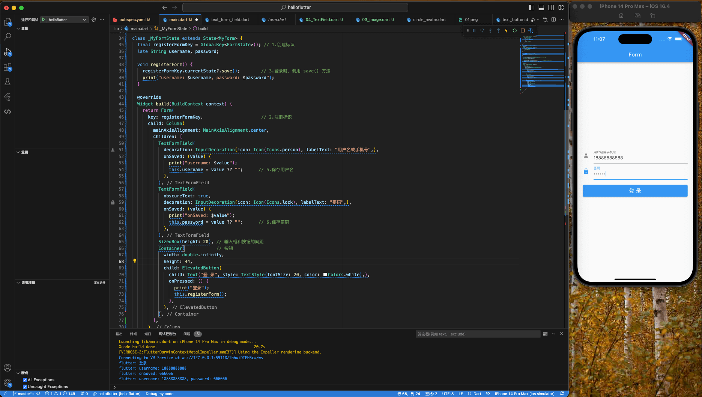

#### 验证表单 FormState.validate()

```dart
class MyForm extends StatefulWidget {
  @override
  _MyFormState createState() => _MyFormState();
}

class _MyFormState extends State<MyForm> {
  // 1.创建 GlobalKey
  final registerFormKey = GlobalKey<FormState>();

  @override
  Widget build(BuildContext context) {
    return Form(
      key: registerFormKey, // 2.设置GlobalKey，用户获取FormState
      child: Column(
        mainAxisAlignment: MainAxisAlignment.center,
        children: [
          TextFormField(
            decoration: InputDecoration(
              icon: Icon(Icons.people),
              labelText: "用户名或手机号",
            ),
            validator: (value) {
              return value?.length == 0 ? "用户名不能为空" : null; // 4.验证表单子控件
            },
          ),
          TextFormField(
            decoration: InputDecoration(
              icon: Icon(Icons.lock),
              labelText: "请输入密码",
            ),
            validator: (value) {
              return (value?.length ?? 0) < 6 ? "密码长度不能小于6位" : null; // 4.验证表单子控件
            },
          ),
          SizedBox(
            height: 20,
          ),
          Container(
            width: double.infinity,
            height: 40,
            child: ElevatedButton(
              child: Text(
                "登 录",
                style: TextStyle(fontSize: 20, color: Colors.white),
              ),
              onPressed: () {
                print("登录");
                registerFormKey.currentState?.validate(); // 3.验证表单
              },
            ),
          ),
        ],
      ),
    );
  }
}
```

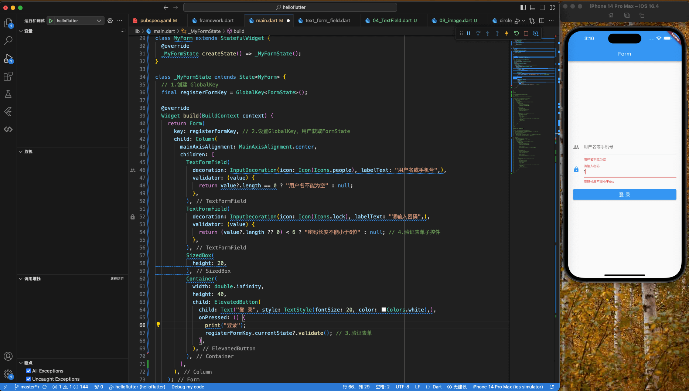

## ProgressIndicator

Material 中的进度指示器包括两种：

- LinerProgressIndicator：线性进度指示器
- CircularProgressIndicator：环形进度指示器

### LinerProgressIndicator

```dart
class LinearProgressIndicator extends ProgressIndicator {
  const LinearProgressIndicator({
    super.key,
    super.value,                           // 0.0 ~ 1.0
    super.backgroundColor,                 // 背景色
    super.color,                           // 进度条颜色
    super.valueColor,                      // 进度条颜色
    this.minHeight,                        // 最小高度
    super.semanticsLabel,                  // 语义标签
    super.semanticsValue,                  // 语义值
    this.borderRadius = BorderRadius.zero, // 圆角
  }) : assert(minHeight == null || minHeight > 0);
}
```

### CircularProgressIndicator

```dart
class CircularProgressIndicator extends ProgressIndicator {
  const CircularProgressIndicator({
    super.key,
    super.value,                          // 0.0 ~ 1.0
    super.backgroundColor,                // 背景色
    super.color,                          // 进度条颜色
    super.valueColor,                     // 进度条颜色
    this.strokeWidth = 4.0,               // 进度条宽度
    this.strokeAlign = strokeAlignCenter, // 进度条对齐方式
    super.semanticsLabel,                 // 语义标签
    super.semanticsValue,                 // 语义值
    this.strokeCap,                       // 进度条端点类型
  }) : _indicatorType = _ActivityIndicatorType.material; // 进度条类型
}
```

示例

```dart
import 'package:flutter/material.dart';

main() => runApp(MyApp());

class MyApp extends StatelessWidget {
  @override
  Widget build(BuildContext context) {
    return MaterialApp(
      home: Scaffold(
        appBar: AppBar(
          title: Text("Progress Indicator"),
        ),
        body: Container(
          padding: EdgeInsets.all(20),
          child: MyBody(),
        ),
      ),
    );
  }
}

class MyBody extends StatelessWidget {
  @override
  Widget build(BuildContext context) {
    return MyProgressIndicator();
  }
}

class MyProgressIndicator extends StatefulWidget {
  @override
  _MyProgressIndicatorState createState() => _MyProgressIndicatorState();
}

class _MyProgressIndicatorState extends State<MyProgressIndicator> {
  @override
  Widget build(BuildContext context) {
    return Center(
      child: Column(
        mainAxisAlignment: MainAxisAlignment.center,
        children: [
          // 1.条形进度条。执行一个动画，进度条在滚动
          LinearProgressIndicator(
            backgroundColor: Colors.grey[200],
            valueColor: AlwaysStoppedAnimation(Colors.blue),
          ),
          SizedBox(height: 50),
          // 2.条形进度条。进度条显示50%
          LinearProgressIndicator(
            backgroundColor: Colors.grey[200],
            valueColor: AlwaysStoppedAnimation(Colors.blue),
            value: .5,
          ),
          SizedBox(height: 50),
          // 3.圆形进度条。执行动画，进度条在转动
          CircularProgressIndicator(
            backgroundColor: Colors.grey[200],
            valueColor: AlwaysStoppedAnimation(Colors.blue),
          ),
          SizedBox(height: 50),
          // 4.圆形进度条
          CircularProgressIndicator(
            backgroundColor: Colors.grey[200],
            valueColor: AlwaysStoppedAnimation(Colors.blue),
            value: .5,
          ),
          SizedBox(height: 50),
          // 5. 自定义尺寸-条形进度条
          SizedBox(
            height: 10,
            child: LinearProgressIndicator(
              backgroundColor: Colors.grey[200],
              valueColor: AlwaysStoppedAnimation(Colors.blue),
              value: .5,
            ),
          ),
          SizedBox(height: 50),
          // 6. 自定义尺寸-圆形进度条
          SizedBox(
            height: 88,
            width: 100,
            child: CircularProgressIndicator(
                backgroundColor: Colors.grey[200],
                valueColor: AlwaysStoppedAnimation(Colors.blue),
                value: .7),
          ),
        ],
      ),
    );
  }
}
```

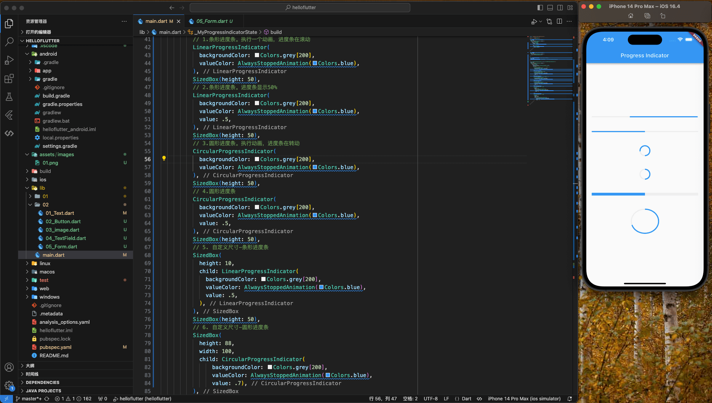
