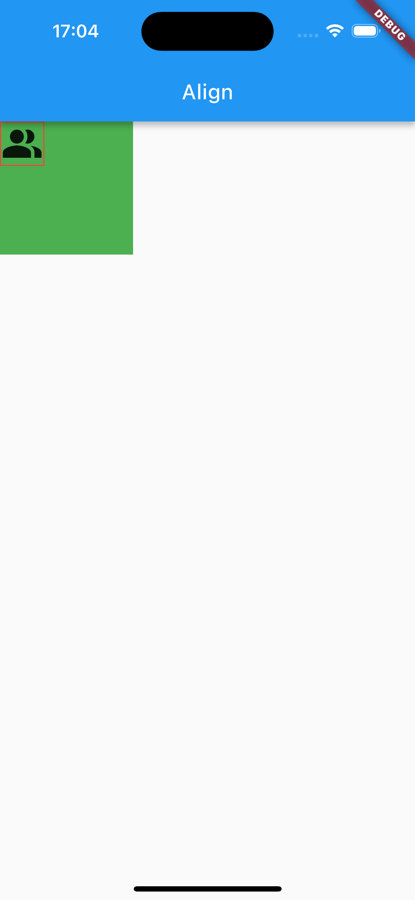
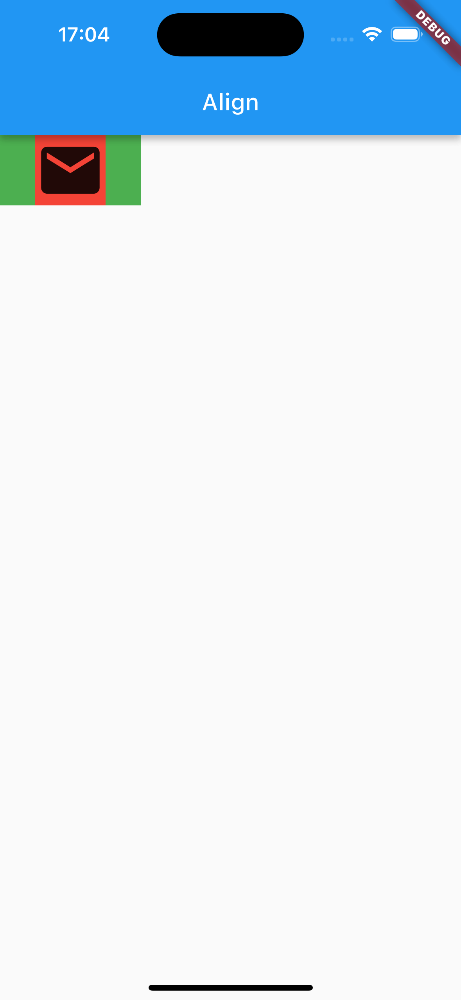
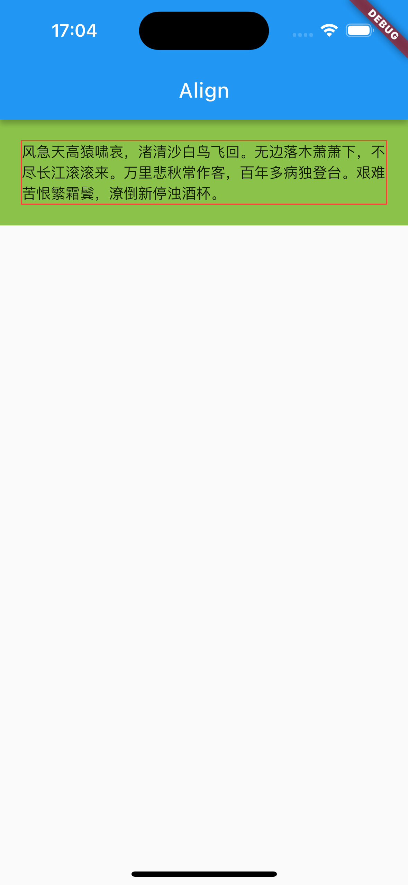
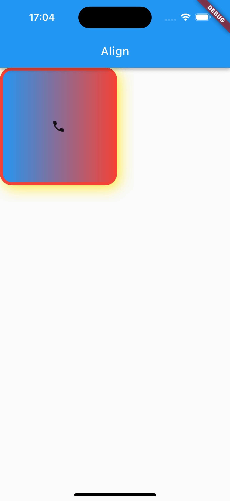
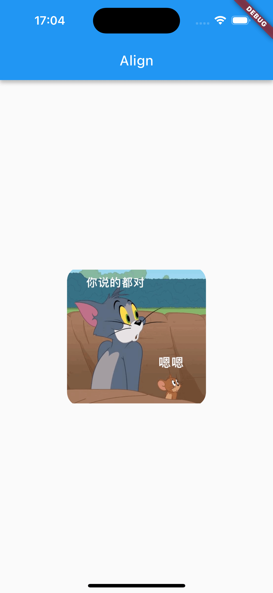
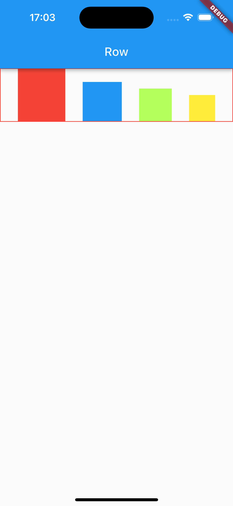
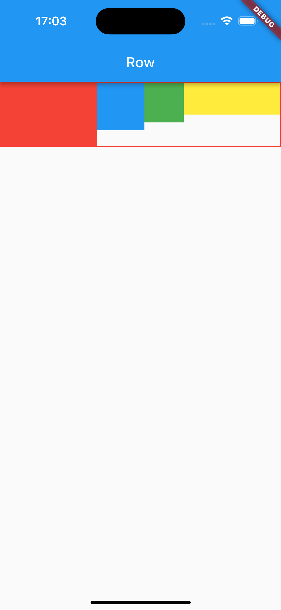
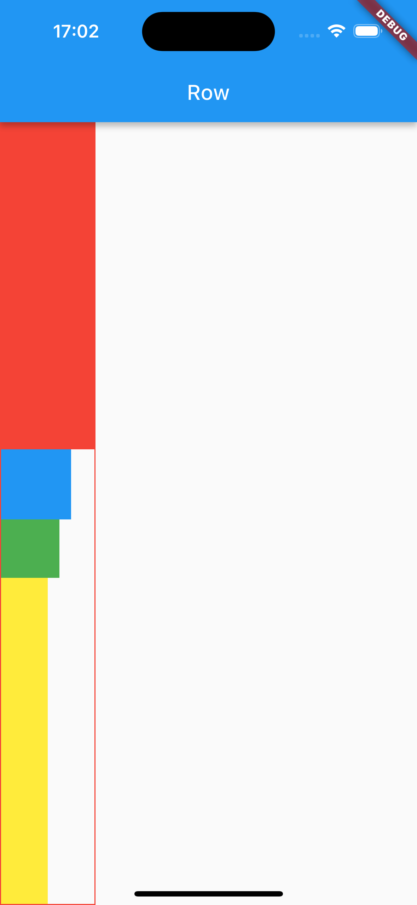
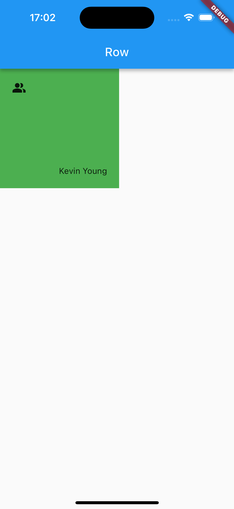

- [Align](#align)
- [Center](#center)
- [Padding](#padding)
- [Container](#container)
- [BoxDecoration](#boxdecoration)
- [Flex](#flex)
- [Row](#row)
- [Expand](#expand)
- [Column](#column)
- [Stack](#stack)

<!-- more -->

## Align

Align 的使用：

```dart
import 'package:flutter/material.dart';

main() => runApp(MyApp());

class MyApp extends StatelessWidget {
  @override
  Widget build(BuildContext context) {
    return MaterialApp(
      home: MyHome(),
    );
  }
}

class MyHome extends StatelessWidget {
  @override
  Widget build(BuildContext context) {
    return Scaffold(
      appBar: AppBar(
        title: Text("Align"),
      ),
      body: MyBody(),
    );
  }
}

/*
Align
*/

class MyBody extends StatelessWidget {
  @override
  Widget build(BuildContext context) {
    return Container(
      color: Colors.green,
      child: Align(
        alignment: Alignment.topLeft,
        widthFactor: 3,
        heightFactor: 3,
        child: Container(
          decoration: BoxDecoration(border: Border.all(color: Colors.red)),
          child: Icon(
            Icons.people_alt,
            size: 40,
          ),
        ),
      ),
    );
  }
}
```



`Align` 定义：

```dart
class Align extends SingleChildRenderObjectWidget {
  const Align({
    super.key,
    this.alignment = Alignment.center, // 对齐方式默认居中
    this.widthFactor,                  // 将宽度设置为子部件的宽度乘以 widthFactor
    this.heightFactor,                 // 将高度设置为子部件的高度乘以 heightFactor
    super.child,                       // 子部件
  }) : assert(widthFactor == null || widthFactor >= 0.0),
       assert(heightFactor == null || heightFactor >= 0.0);
}
```

继承关系 `Align` 继承自 `SingleChildRenderObjectWidget`，`SingleChildRenderObjectWidget` 继承自 `RenderObjectWidget`，`RenderObjectWidget` 继承自 `Widget`。

> RenderObjectWidgets 提供了 [RenderObjectElement] 的配置，RenderObjectElement 包装了 [RenderObject]，RenderObject 提供了实际渲染应用程序的功能。

alignment 提供多种对齐方式，包括：center、left、top、right、bottom 等等。

widthFactor 和 heightFactor：

1. 用来设置父部件的宽高，如当 widthFactor = 3，则父部件的宽度为子部件的 3 倍。

2. 因为在对部件进行布局时，需要先确定父部件的大小，然后根据父部件的大小对子部件布局，所以需要设置 widthFactor 和 heightFactor。如果不设置，则Align会尽可能的大（等于其父部件的大小）。

## Center

Center 的使用：

```dart
class MyBody extends StatelessWidget {
  @override
  Widget build(BuildContext context) {
    return Container(
      color: Colors.green,
      child: Center(
        widthFactor: 2,
        heightFactor: 1,
        child: Container(
          decoration: BoxDecoration(color: Colors.red),
          child: Icon(
            Icons.email,
            size: 60,
          ),
        ),
      ),
    );
  }
}
```



Center 的定义：

```dart
class Center extends Align {
  const Center({ super.key, super.widthFactor, super.heightFactor, super.child });
}
```

`Center` 继承自 `Align`，使用 `Align` 默认的 `alignment`（.center），不支持修改。 

## Padding

Padding 的使用：

```dart
class MyBody extends StatelessWidget {
  @override
  Widget build(BuildContext context) {
    return Container(
      color: Colors.lightGreen,
      child: Padding(
        padding: EdgeInsets.all(20),
        child: Container(
          decoration: BoxDecoration(border: Border.all(color: Colors.red)),
          child: Text(
              "风急天高猿啸哀，渚清沙白鸟飞回。无边落木萧萧下，不尽长江滚滚来。万里悲秋常作客，百年多病独登台。艰难苦恨繁霜鬓，潦倒新停浊酒杯。"),
        ),
      ),
    );
  }
}
```



Padding 的定义：

```dart
class Padding extends SingleChildRenderObjectWidget {
  const Padding({
    super.key,
    required this.padding,
    super.child,
  });
}
```

Padding 用来设置内边距（父部件），或外边距（子部件）。

## Container

Container 的定义：

```dart
class Container extends StatelessWidget {
  Container({
    super.key,
    this.alignment,                // 对齐方式
    this.padding,                  // 内边距
    this.color,                    // 背景色
    this.decoration,               // 背景装饰
    this.foregroundDecoration,     // 前景装饰
    double? width,                 // 宽度
    double? height,                // 高度
    BoxConstraints? constraints,   // 约束
    this.margin,                   // 外边距
    this.transform,                // 变换
    this.transformAlignment,       // 变换对齐方式
    this.child,                    // 子部件
    this.clipBehavior = Clip.none, // 超出部分是否裁剪
  }) : assert(margin == null || margin.isNonNegative),
       assert(padding == null || padding.isNonNegative),
       assert(decoration == null || decoration.debugAssertIsValid()),
       assert(constraints == null || constraints.debugAssertIsValid()),
       assert(decoration != null || clipBehavior == Clip.none),
       assert(color == null || decoration == null,
         'Cannot provide both a color and a decoration\n'
         'To provide both, use "decoration: BoxDecoration(color: color)".',
       ),
       constraints =
        (width != null || height != null)
          ? constraints?.tighten(width: width, height: height)
            ?? BoxConstraints.tightFor(width: width, height: height)
          : constraints;
}
```

Container 相当于 iOS 的 UIView，用来设置布局，可以设置背景色、边框、圆角等。

如果需要一个有背景色、边框、圆角、阴影、固定尺寸、图像时，可以考虑 Container。

## BoxDecoration

BoxDecoration 的使用：

```dart
class MyBody extends StatelessWidget {
  @override
  Widget build(BuildContext context) {
    return Container(
      width: 200,
      height: 200,
      child: Icon(Icons.phone),
      decoration: BoxDecoration(
        color: Colors.lightGreen,
        border: Border.all(
          color: Colors.red,
          width: 5.0,
          style: BorderStyle.solid,
        ),
        // border: Border(
        //   top: BorderSide(color: Colors.red, width: 5),
        //   right: BorderSide(color: Colors.blue, width: 10),
        // ),
        borderRadius: BorderRadius.circular(20),
        boxShadow: [
          BoxShadow(
            color: Colors.yellow,
            offset: Offset(5, 5),
            blurRadius: 20,
          ),
        ],
        gradient: LinearGradient(
          colors: [
            Colors.blue,
            Colors.red,
          ],
        ),
      ),
    );
  }
}
```



圆角图片：

```dart
class MyBody extends StatelessWidget {
  @override
  Widget build(BuildContext context) {
    return Center(
      child: Container(
        width: 200,
        height: 200,
        decoration: BoxDecoration(
          borderRadius: BorderRadius.circular(20),
          image: DecorationImage(
              image: NetworkImage(
                  "https://pic4.zhimg.com/v2-cb75f239dfd0c1c42c23dfc9011965a3_b.jpg")),
        ),
      ),
    );
  }
}
```

BoxDecoration 的定义：

```dart
class BoxDecoration extends Decoration {
  const BoxDecoration({
    this.color,                      // 背景色，跟 Container 的背景色冲突
    this.image,                      // 图片
    this.border,                     // 边框
    this.borderRadius,               // 圆角
    this.boxShadow,                  // 阴影
    this.gradient,                   // 渐变效果
    this.backgroundBlendMode,        // 背景混合
    this.shape = BoxShape.rectangle, // 形变
  }) : assert(
         backgroundBlendMode == null || color != null || gradient != null,
         "backgroundBlendMode applies to BoxDecoration's background color or "
         'gradient, but no color or gradient was provided.',
       );
}
```



## Flex

Row/Column 继承自 Flex，通常使用 Row/Column 进行布局，很少直接使用 Flex 布局。

`Axis.vertical: Column` 以**垂直方向**为主轴布局，**水平方向**为交叉轴。
`Axis.horizontal: Row` 以**水平方向**为主轴布局，**垂直方向**为交叉轴。

## Row

Row 的使用：

```dart
class MyBody extends StatelessWidget {
  @override
  Widget build(BuildContext context) {
    return Container(
      decoration: BoxDecoration(border: Border.all(color: Colors.red)),
      child: Row(
        // 所有间距平分空间
        mainAxisAlignment: MainAxisAlignment.spaceEvenly,
        // 在主轴的结束位置依次摆放元素
        crossAxisAlignment: CrossAxisAlignment.end,
        mainAxisSize: MainAxisSize.max,
        children: [
          Container(color: Colors.red, width: 80, height: 88),
          Container(color: Colors.blue, width: 66, height: 66),
          Container(color: Colors.lightGreenAccent, width: 55, height: 55),
          Container(color: Colors.yellow, width: 44, height: 44),
        ],
      ),
    );
  }
}
```



### MainAxisAlignment

```dart
/// 如何在弹性布局中沿着主轴放置子项。
enum MainAxisAlignment {
  /// 将子项放置在尽可能靠近主轴起点的位置。
  ///
  /// 如果在水平方向使用此值，则必须可使用 [TextDirection] 来确定起点是左侧还是右侧。
  ///
  /// 如果在垂直方向使用此值，则必须可使用 [VerticalDirection] 来确定起点是顶部还是底部。
  start,

  /// 将子项放置在尽可能靠近主轴末端的位置。
  ///
  /// 如果该值用于水平方向，则必须有 [TextDirection] 来确定末端是左侧还是右侧。
  ///
  /// 如果在垂直方向使用此值，则必须可使用 [VerticalDirection] 来确定末端是顶部还是底部。
  end,

  /// 将子项放置在尽可能靠近主轴线中间的位置。
  center,

  /// 在子项之间均匀地放置自由空间。
  spaceBetween,

  /// 将可用空间均匀地放置在子项之间以及第一个和最后一个子项之前和之后的一半空间。
  spaceAround,

  /// 在子项之间以及第一个和最后一个子项之前和之后均匀地放置可用空间。
  spaceEvenly,
}
```

## Expand

Expand 的使用：

```dart
class MyBody extends StatelessWidget {
  @override
  Widget build(BuildContext context) {
    return Container(
      decoration: BoxDecoration(border: Border.all(color: Colors.red)),
      child: Row(
        mainAxisAlignment: MainAxisAlignment.spaceEvenly,
        crossAxisAlignment: CrossAxisAlignment.start,
        mainAxisSize: MainAxisSize.max,
        children: [
          Expanded(
            child: Container(color: Colors.red, width: 88, height: 88),
          ),
          Container(color: Colors.blue, width: 66, height: 66),
          Container(color: Colors.green, width: 55, height: 55),
          Expanded(
            child: Container(color: Colors.yellow, width: 44, height: 44),
          ),
        ],
      ),
    );
  }
}
```



## Column

Column 的使用：

```dart
class MyBody extends StatelessWidget {
  @override
  Widget build(BuildContext context) {
    return Container(
      decoration: BoxDecoration(border: Border.all(color: Colors.red)),
      child: Column(
        mainAxisAlignment: MainAxisAlignment.spaceEvenly,
        crossAxisAlignment: CrossAxisAlignment.start,
        mainAxisSize: MainAxisSize.max,
        children: [
          Expanded(
            child: Container(color: Colors.red, width: 88, height: 88),
          ),
          Container(color: Colors.blue, width: 66, height: 66),
          Container(color: Colors.green, width: 55, height: 55),
          Expanded(
            child: Container(color: Colors.yellow, width: 44, height: 44),
          ),
        ],
      ),
    );
  }
}
```



## Stack

Stack 的使用：

```dart
class MyBody extends StatelessWidget {
  @override
  Widget build(BuildContext context) {
    return Stack(
      children: [
        Container(
          color: Colors.green,
          width: 200,
          height: 200,
        ),
        Positioned(
          top: 20,
          left: 20,
          child: Icon(Icons.people_alt),
        ),
        Positioned(
          bottom: 20,
          right: 20,
          child: Text("Kevin Young"),
        ),
      ],
    );
  }
}
```


