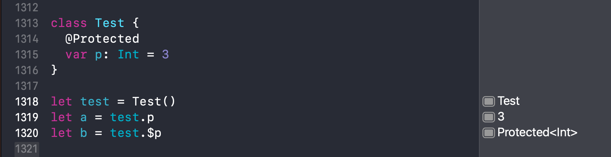
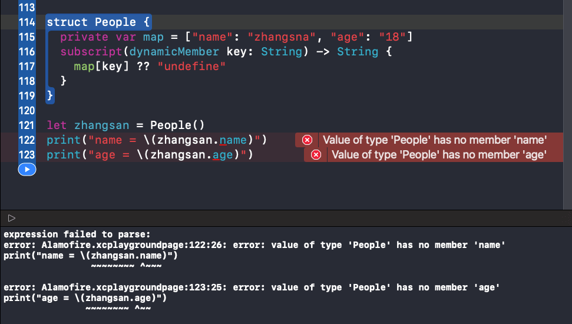
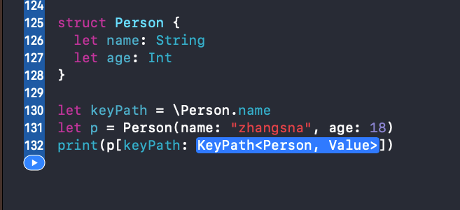
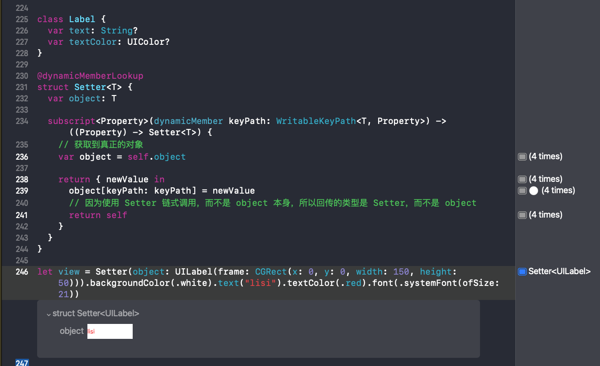
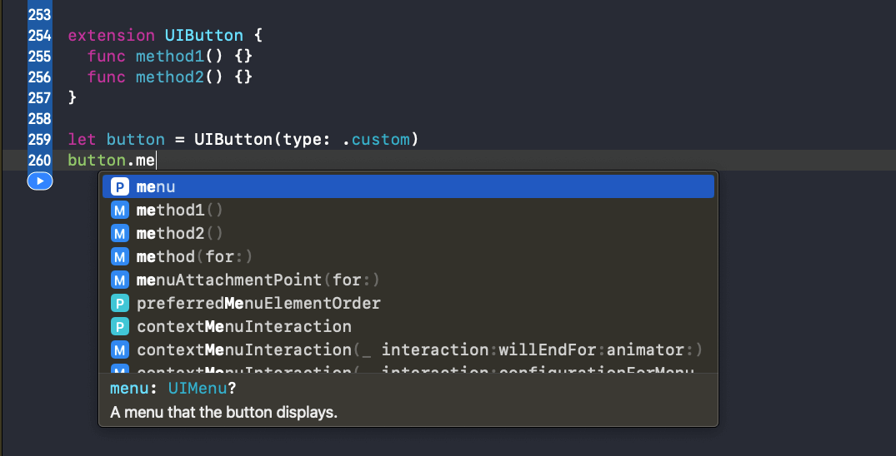
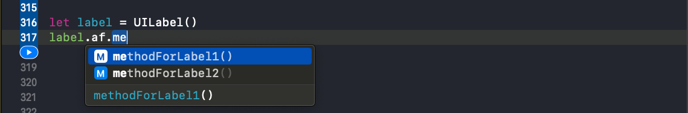
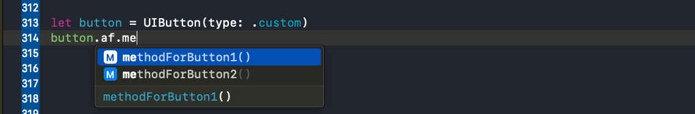
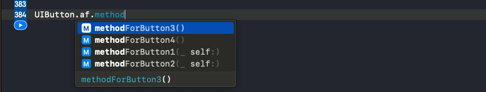

[Alamofire](https://github.com/Alamofire/Alamofire/tree/master)

[用法](https://github.com/Alamofire/Alamofire/blob/master/Documentation/Usage.md)

[高级用法](https://github.com/Alamofire/Alamofire/blob/master/Documentation/AdvancedUsage.md)

相关文档：

[apple - Property Wrappers](https://github.com/apple/swift-evolution/blob/main/proposals/0258-property-wrappers.md)

[apple - Key Path Member Lookup](https://github.com/apple/swift-evolution/blob/main/proposals/0252-keypath-dynamic-member-lookup.md)

[Alamofire源码学习目录合集](https://juejin.cn/post/6914685327172960263/)

[链式调用与@dynamicMemberLookup](https://juejin.cn/post/6844903863951032327)

[SwiftUI 和 Swift 5.1 新特性(3) Key Path Member Lookup](https://juejin.cn/post/6844903863951032327)

<!-- more -->

## Protected

定义一个协议 `Lock`，让实现该协议的类拥有`lock()`、`unlock()`、`around()`能力，其中`lock()`、`unlock()`需要遵循协议的类自定义实现。

```swift
private protocol Lock {
    func lock()
    func unlock()
}

extension Lock {
    /// 在获取锁的同时执行返回值的闭包。
    ///
    /// - Parameter closure: 要运行的闭包。
    ///
    /// - Returns:           闭包生成的值。
    func around<T>(_ closure: () throws -> T) rethrows -> T {
        lock(); defer { unlock() }
        return try closure()
    }
    
    /// 获取锁时执行闭包。
    func around(_ closure: () throws -> Void) rethrows {
        lock(); defer { unlock() }
        try closure()
    }
}
```

自定义锁 `UnfairLock` 遵循 `Lock` 协议，并自定义实现`lock()`、`unlock()`能力。

```swift
final class UnfairLock: Lock {
    private let unfairLock: os_unfair_lock_t

    init() {
        unfairLock = .allocate(capacity: 1)
        unfairLock.initialize(to: os_unfair_lock())
    }

    deinit {
        unfairLock.deinitialize(count: 1)
        unfairLock.deallocate()
    }

    fileprivate func lock() {
        os_unfair_lock_lock(unfairLock)
    }

    fileprivate func unlock() {
        os_unfair_lock_unlock(unfairLock)
    }
}
```

使用 `@propertyWrapper` 和 `@dynamicMemberLookup` 两个批注，自定义属性包裹器 `Protected`，实现属性的读写安全。

```swift
@propertyWrapper
@dynamicMemberLookup
final class Protected<T> {
    private let lock = UnfairLock()
    private var value: T

    init(_ value: T) {
        self.value = value
    }

    /// propertyWrapper修饰必须要有的属性, 用来保存包裹的值
    /// 只保证读写安全
    var wrappedValue: T {
        get { lock.around { value } }
        set { lock.around { value = newValue } }
    }

    /// projectedValue 是 Swift 的语法糖，支持 `$` 访问
    var projectedValue: Protected<T> { self }

    /// 允许为包装后的值提供初始值
    init(wrappedValue: T) {
        value = wrappedValue
    }

    /// 同步读取或转换包含的值。
    ///
    /// - Parameter closure: 要执行的闭包。
    ///
    /// - Returns:           传递的闭包的返回值。
    func read<U>(_ closure: (T) throws -> U) rethrows -> U {
        try lock.around { try closure(self.value) }
    }

    /// 同步修改受保护的值。
    @discardableResult
    func write<U>(_ closure: (inout T) throws -> U) rethrows -> U {
        try lock.around { try closure(&self.value) }
    }

    subscript<Property>(dynamicMember keyPath: WritableKeyPath<T, Property>) -> Property {
        get { lock.around { value[keyPath: keyPath] } }
        set { lock.around { value[keyPath: keyPath] = newValue } }
    }

    subscript<Property>(dynamicMember keyPath: KeyPath<T, Property>) -> Property {
        lock.around { value[keyPath: keyPath] }
    }
}
```

应用：

```swift
class Test {
  @Protected
  var p: Int = 3
}

let test = Test()
let a = test.p   // 3
let b = test.$p  // 此时 b 为 Protected<Int> 类型，可以调用 Protected 类中定义的方法
b.read {
  $0             // 3
}

print("a = \(a)")  // Prints "a = 3"
print("b = \(b)")  // Prints "b = __lldb_expr_15.Protected<Swift.Int>"
print("b = \(b.read{ $0 })")  // Prints "b = 3"
```

### @propertyWrapper

属性包装器是一种通用结构，用于封装属性的读写访问，或添加其他行为。比如限制可用的属性值、向读写访问添加额外逻辑、添加方法等。

Swift 5.1 为创建属性包装器提供了一种新的解决方案，使用`@propertyWrapper`**批注**标记属性包装器。

`wrappedValue`：使用`@propertyWrapper`的包装器，要求包装器对象必须包含一个**被包装的值的非静态属性**。

```swift
/// propertyWrapper修饰必须要有的属性, 用来保存包裹的值
/// 只保证读写安全
var wrappedValue: T {
    get { lock.around { value } }
    set { lock.around { value = newValue } }
}

/// 允许为包装后的值提供初始值
init(wrappedValue: T) {
    value = wrappedValue
}
```

`projectedValue`：`@propertyWrapper` 提供了另一种语法糖——投影值，通过在属性前加`$`前缀来访问属性值。



### @dynamicMemberLookup

`@dynamicMemberLookup` 称为**动态成员查找**，是Swift的一项功能特性，允许动态成员查找调用看起来像范文类型属性的常规调用。

```swift
let dic = ["name": "zhangsan"]
let name = dic.name
```

`name`是从字典中查找的，而不是作为 `dic` 的属性访问的。

实现支持动态查找的`People`类：

1. 使用`@dynamicMemberLookup`标注`People`的类型；
2. 实现 `subscript(dynamicMember key:)` 方法。

```swift
@dynamicMemberLookup
struct People {
  private var map = ["name": "zhangsna", "age": "18"]
  subscript(dynamicMember key: String) -> String {
    map[key] ?? "undefine"
  }
}

let zhangsan = People()
print("name = \(zhangsan.name)")  // Prints "name = zhangsna"
print("age = \(zhangsan.age)")    // Prints "age = 18"
```

没有使用 `@dynamicMemberLookup` 标注的情况会报错：



#### 1. KeyPath

`KeyPath<Root, Value>` 泛型类型，用来表示从 `Root` 类型到 `Value` 属性的访问路径。

```swift
struct Person {
  let name: String
  let age: Int
}

let keyPath = \Person.name
let p = Person(name: "zhangsna", age: 18)
print(p[keyPath: keyPath])
// Prints "zhangsna"
```

这里用到了一个语法 `\Person.name`，它的类型是 `KeyPath<Person, String>`



* 同一类型 `KeyPath<Root, Value>` 可以代表多种获取路径：`KeyPath<Person, Int>` 既可以表示`\Person.age`，也可以表示`\Person.name.count`。

* 两个 KeyPath 可以拼接成一个新的 KeyPath：`KeyPath1` 的类型是 `KeyPath<Person, String>`，`\String.count` 的类型是 `KeyPath<String, Int>`，调用 `appending` 函数后变成了 `KeyPath<Person, Int>` 类型。

```swift
let keyPath1 = \Person.name
let keyPath2 = \String.count
let keyPath3 = keyPath1.appending(path: \String.count)

print(type(of: keyPath))   // Prints "KeyPath<Person, String>"
print(type(of: keyPath2))  // Prints "KeyPath<String, Int>"
print(type(of: keyPath3))  // Prints "KeyPath<Person, Int>"
```

* `KeyPath` 是 `WriteableKeyPath` 的父类，`WriteableKeyPath` 是 `ReferenceWritableKeyPath` 的父类。

* `KeyPath` 的能力是最弱的，只能以只读的方式访问属性。

```swift
struct Person {
  let name: String
  let age: Int
}

let keyPath = \Person.name
let p = Person(name: "zhangsna", age: 18)
print(p[keyPath: keyPath])
// Prints "zhangsna"
```

* `WriteableKeyPath` 可以对可变属性进行读写操作。将 `let` 改成 `var`，则 `person.name` 的类型就变成了 `WriteableKeyPath`，可以直接修改 `p[keyPath: keyPath] = "lisi"`

```swift
struct Person {
  var name: String
  let age: Int
}

let keyPath = \Person.name
var p = Person(name: "zhangsna", age: 18)
p[keyPath: keyPath] = "lisi"
print(p[keyPath: keyPath])
// Prints "lisi"
```

* `ReferenceWritableKeyPath` 可以对**引用类型**的可变属性进行写入。将`struct`改成`class`，则 `Person.name` 的类型变成 `ReferenceWritableKeyPath`

```swift
class Person {
  var name: String = ""
  let age: Int = 0
}

let keyPath = \Person.name
var p = Person()
p[keyPath: keyPath] = "lisi"
print(p[keyPath: keyPath])
// Prints "lisi"
```

#### 2. 动态成员查找 Dynamic Member Lookup

Swift4.2 引入了**动态成员查找**特性，实现使用静态的语法做动态的查找。

```swift
@dynamicMemberLookup
struct People {
  private var map = ["name": "zhangsna", "age": "18"]
  subscript(dynamicMember key: String) -> String {
    map[key] ?? "undefine"
  }
}

let zhangsan = People()
print("name = \(zhangsan.name)")  // Prints "name = zhangsna"
print("age = \(zhangsan.age)")    // Prints "age = 18"
```

支持动态成员查找的类型首先需要用 `@dynamicMemberLookup` 来修饰，然后实现动态查找方法`subscript(dynamicMember member: String)`。

直接使用 `.property` 的语法访问属性**貌似静态实则动态**，该语法实际上调用的是`subscript(dynamicMember member: String)`方法。

#### 3. 成员查找 Key Path Member Lookup

Swift5.1 引入的成员查找。

编译器可以从 `KeyPath` 查询所有的目标，以及它们的类型：

```swift
@dynamicMemberLookup
struct Person {
  struct Info {
    var name: String
  }
  var info: Info
  subscript<Property>(dynamicMember keyPath: WritableKeyPath<Info, Property>) -> Property {
    get { info[keyPath: keyPath] }
    set { info[keyPath: keyPath] = newValue }
  }
}

var person = Person(info: Person.Info(name: "zhangsan"))
person.name = "lisi"
print(person.name)
// Prints "lisi"
```

`person.info.name` 可以直接写成 `person.name`。

`@dynamicMemberLookup` 非常适用于包装类型：

```swift
struct Person {
  var name: String
  var age: Int
}

@dynamicMemberLookup
struct Wrapper<T> {
  var value: T

  init(value: T) {
    self.value = value
  }

  subscript<Property>(dynamicMember keyPath: WritableKeyPath<T, Property>) -> Property {
    get { value[keyPath: keyPath] }
    set { value[keyPath: keyPath] = newValue }
  }
}

var teacher = Wrapper(value: Person(name: "zhangsan", age: 18))
teacher.age = 35
print(teacher.age)
// Prints "35"
```

#### 链式调用

通过回传 `self`，实现链式调用：

```swift
import UIKit

class Label {
  var text: String?
  var textColor: UIColor?
}

/// setter
extension Label {
  func text(_ text: String) -> Label {
    self.text = text
    return self
  }
  
  func textColor(_ textColor: UIColor) -> Label {
    self.textColor = textColor
    return self
  }
}

Label()
  .text("name")
  .textColor(.black)
```

这种方法被动性比较大，如果 `Label` 的属性变化，则对应的 `setter` 方法也得改变。

使用**动态成员查找**实现：

```swift
class Label {
  var text: String?
  var textColor: UIColor?
}

@dynamicMemberLookup
struct Setter<T> {
  var object: T
  
  subscript<Property>(dynamicMember keyPath: WritableKeyPath<T, Property>) -> ((Property) -> Setter<T>) {
    // 获取到真正的对象
    var object = self.object
    
    return { newValue in
      object[keyPath: keyPath] = newValue
      // 因为使用 Setter 链式调用，而不是 object 本身，所以回传的类型是 Setter，而不是 object
      return self
    }
  }
}

let s = Setter(object: Label()).text("zhangsan").textColor(.blue).object
print(s.text)
// Prints "Optional("zhangsan")"
```

创建一个 `UILabel`：



## 线程安全的属性 MutableState

在 Request.swift 文件中，Alamofire 使用 `@Protected` 标注，实现了一个线程安全的对象 `mutableState`：

```swift
/// 受保护的`MutableState`值，该值提供对状态值的线程安全访问。
@Protected
fileprivate var mutableState = MutableState()
```

`MutableState` 中定义了很多变量，这些变量可能在异步线程调用：

```swift
/// 封装可变状态的类型，他们可能在从“underlyingQueue”以外的任何位置访问。
struct MutableState {

    /// `Request`的状态
    var state: State = .initialized
    
    /// 为上传进度回调提供的`ProgressHandler`和`DispatchQueue`。
    var uploadProgressHandler: (handler: ProgressHandler, queue: DispatchQueue)?
    
    /// 为下载进度回调提供的`ProgressHandler`和`DispatchQueue`。
    var downloadProgressHandler: (handler: ProgressHandler, queue: DispatchQueue)?
    
    /// 为处理请求重定向提供的`RedirectHandler`
    var redirectHandler: RedirectHandler?
    
    /// 为处理响应缓存提供的`CachedResponseHandler`
    var cachedResponseHandler: CachedResponseHandler?
    
    /// 当`Request`能够创建其自身的cURL描述时，调用队列和闭包。
    var cURLHandler: (queue: DispatchQueue, handler: (String) -> Void)?
    
    /// 当`Request`创建`URLRequest`时调用队列和闭包。
    var urlRequestHandler: (queue: DispatchQueue, handler: (URLRequest) -> Void)?
    
    /// `Request`创建`URLSessionTask`时调用的队列和闭包。
    var urlSessionTaskHandler: (queue: DispatchQueue, handler: (URLSessionTask) -> Void)?
    
    /// 处理响应解析的响应序列化闭包。
    var responseSerializers: [() -> Void] = []
    
    /// 所有响应序列化程序完成后执行的响应序列化完成闭包。
    var responseSerializerCompletions: [() -> Void] = []
    
    /// 响应序列化程序处理是否完成。
    var responseSerializerProcessingFinished = false
    
    /// `URLCredential `用于身份验证质询。
    var credential: URLCredential?
    
    /// Alamofire代表请求创建的所有URLRequest。
    var requests: [URLRequest] = []
    
    /// Alamofire代表请求创建的所有URLSessionTask。
    var tasks: [URLSessionTask] = []
    
    /// Alamofire代表`Request`收集的所有`URLSessionTaskMetrics`值。应与创建的“任务”完全对应。
    /// 「PS：对发送请求/DNS查询/TLS握手/请求响应等各种环节时间上的统计」
    var metrics: [URLSessionTaskMetrics] = []
    
    /// 提供的任何重试器重试“请求”的次数。
    var retryCount = 0
    
    /// `Request`的最终`AFError`，无论是来自各种内部Alamofire调用还是作为“任务”的结果。
    var error: AFError?
    
    /// 实例是否已调用`finish()`并正在运行序列化程序。将来应该用状态机中的表示替换。
    var isFinishing = false
    
    /// 请求完成时要运行的操作。用于并发支持。
    var finishHandlers: [() -> Void] = []
}
```

比如：

```swift
/// 当代表实例创建了初始“URLRequest”时调用。如果“RequestAdapter”处于活跃状态，则“URLRequest”将在发出之前进行调整。
///
/// - Parameter request: 已创建“URLRequest”。
func didCreateInitialURLRequest(_ request: URLRequest) {
    dispatchPrecondition(condition: .onQueue(underlyingQueue))

    /*
    1. 通过 $mutableState.write 调用一个线程安全的闭包，`$` 保证闭包线程安全
    2. 将 request 添加到 .requets 数组中，`$` 保证 setter 方法线程安全
    */
    $mutableState.write { $0.requests.append(request) }

    eventMonitor?.request(self, didCreateInitialURLRequest: request)
}
```

或者

```swift
/// 完成此“请求”并启动响应序列化程序。
///
/// - Parameter error: 实例结束时可能出现的“错误”。
func finish(error: AFError? = nil) {
   dispatchPrecondition(condition: .onQueue(underlyingQueue))

   guard !$mutableState.isFinishing else { return }

   // `$` 保证了 setter 方法是线程安全的
   $mutableState.isFinishing = true

   if let error = error { self.error = error }

   // Start response handlers
   processNextResponseSerializer()

   eventMonitor?.requestDidFinish(self)
}
```

## AlamofireExtended

Alamofire 扩展包裹器，用来对系统类进行扩展时包裹使用，避免方法入侵。

### 第一种方式

通过添加全局方法的方式扩展两个新的方法：

```swift
extension UIButton {
  func method1() {}
  func method2() {}
}

let button = UIButton(type: .custom)
button.method1()
```

通过这种方式添加的方法，在所有能访问到该扩展的地方都可以调用。调用时，扩展的方法直接出现在 `UIButton` 提示的方法列表中。这有一个问题，一方面会给调用者造成困惑，另一方发面会存在同名的风险，造成方法污染👇：



### 第二种方式

写一个包裹器，将 UIButton 包裹起来，在包裹器中添加需要扩展的方法。

```swift
struct UIButtonWrapper {
  let button: UIButton
  
  func method1() {}
  func method2() {}
}

extension UIButton {
  var wrapper: UIButtonWrapper {
    get { UIButtonWrapper.init(button: self) }
  }
}

let button = UIButton(type: .custom)
button.wrapper.method1()
```

通过实现一个包裹器`wrapper`，扩展的方法只会出现在`wrapper`的调用提示方法列表里，`UIButton`的调用提示方法列表里只新增了一个 wrapper，从而避免了对`UIButton`的方法污染。

`UIButtonWrapper` 是针对`UIButton`设计的一个包裹器，只适用于UIButton。可以借用Swift**泛型**与**扩展约束**的力量，实现一个泛型包裹器，从而实现为需要的任何类型扩展方法。

### 第三种方式

使用泛型和扩展约束，实现一个泛型包裹器：

```swift
public struct AlamofireExtension<ExtendedType> {
  public private(set) var type: ExtendedType
  
  public init(_ type: ExtendedType) {
    self.type = type
  }
}

// MARK: —— UIButton Extension
extension AlamofireExtension where ExtendedType == UIButton {
  func methodForButton1() {}
  func methodForButton2() {}
}

extension UIButton {
  var af: AlamofireExtension<UIButton> {
    // AlamofireExtension.init(self)
    get { AlamofireExtension(self) }
  }
}

// MARK: —— UILabel Extension
extension AlamofireExtension where ExtendedType == UILabel {
  func methodForLabel1() {}
  func methodForLabel2() {}
}

extension UILabel {
  var af: AlamofireExtension<UILabel> {
    get { AlamofireExtension(self) }
  }
}

let button = UIButton(type: .custom)
button.af.methodForButton1()

let label = UILabel()
label.af.methodForLabel1()
```

通过泛型 `AlamofireExtension<ExtendedType>` 实现了对`UIButton`和`UILabel`的同时支持，扩展约束 `where ExtendedType == UIButton` 实现了对`UIButton`和`UILabel`扩展方法的区分，这种区分可以从调用提示方法列表中看出来：

`UILabel`提示方法列表：


`UIButton`提示方法列表：


通过`UIButton`和`UILabel`的扩展方式可以看出，在为类型扩展方法时，首先需要添加 `af` 计算属性来返回泛型包裹器`AlamofireExtension<ExtendedType>`。

```swift
var af: AlamofireExtension<UIButton> {
  // AlamofireExtension.init(self)
  get { AlamofireExtension(self) }
}
```

可以使用**泛型协议**和**扩展**的方式，添加默认实现，从而省略掉这一步。

### 第四种方式

使用**泛型协议**和**扩展**的，实现`af`计算属性：

```swift
// MARK: —— 通用扩展类型
public struct AlamofireExtension<ExtendedType> {
  public private(set) var type: ExtendedType

  public init(_ type: ExtendedType) {
    self.type = type
  }
}

// MARK: —— 描述“通用拓展类型”的协议
public protocol AlamofireExtended {
  
  // 正在扩展的类型
  associatedtype ExtendedType
  
  // 静态包裹器
  static var af: AlamofireExtension<ExtendedType>.Type { get set }
  
  // 实例包裹器
  var af: AlamofireExtension<ExtendedType> { get set }
}

extension AlamofireExtended {
  
  // 静态包裹器默认实现
  public static var af: AlamofireExtension<Self>.Type {
    get { AlamofireExtension<Self>.self }
    set {}
  }
  
  // 实例包裹器默认实现
  public var af: AlamofireExtension<Self> {
    get { AlamofireExtension(self) }
    set {}
  }
}
```

应用：

```swift
// 扩展方法
extension AlamofireExtension where ExtendedType == UIButton {
  func methodForButton1() {}
  func methodForButton2() {}
}

extension AlamofireExtension where ExtendedType == UILabel {
  func methodForLabel1() {}
  func methodForLabel2() {}
}

// 采纳协议
extension UIButton: AlamofireExtended {}
extension UILabel: AlamofireExtended {}

let button = UIButton()
button.af.methodForButton1()

let label = UILabel()
label.af.methodForLabel1()
```

静态包裹器扩展了类型方法：

```swift
extension AlamofireExtension where ExtendedType == UIButton {
  func methodForButton1() {}
  func methodForButton2() {}
  static func methodForButton3() {}
  static func methodForButton4() {}
}

UIButton.af.methodForButton3()
```

扩展的类型方法，也有对应的提示方法列表：



## EventMonitor

`protocol EventMonitor` 协议概述了 Alamofire 生命周期里的内部事件。EventMonitor 既包括从各种 `URLSession` 委托协议接收的事件，也包括`Request` 及其子类生命周期内的各种事件。

```swift
public protocol EventMonitor {

    /// 调度事件的调度队列，默认是主队列
    var queue: DispatchQueue { get }

    // MARK: - URLSession Events

    // MARK: URLSessionDelegate Events

    func urlSession(_ session: URLSession, didBecomeInvalidWithError error: Error?)

    // MARK: URLSessionTaskDelegate Events

    // MARK: URLSessionDataDelegate Events

    // MARK: URLSessionDownloadDelegate Events

    // MARK: - Request Events

    // MARK: DataRequest Events

    // MARK: DataStreamRequest Events

    // MARK: UploadRequest Events

    // MARK: DownloadRequest Events
}
```

实例代码中只展示了`URLSessionDelegate`协议相关方法的声明，其它协议的声明省略。

在 `EventMonitor` 协议声明完方法后，还要对这些方法提供默认实现：

```swift
extension EventMonitor {
  
    /// 调度事件的调度队列，默认是主队列
    public var queue: DispatchQueue { .main }

    // MARK: Default Implementations

    public func urlSession(_ session: URLSession, didBecomeInvalidWithError error: Error?) {}
    public func urlSession(_ session: URLSession,
                           task: URLSessionTask,
                           didReceive challenge: URLAuthenticationChallenge) {}
    public func urlSession(_ session: URLSession,
                           task: URLSessionTask,
                           didSendBodyData bytesSent: Int64,
                           totalBytesSent: Int64,
                           totalBytesExpectedToSend: Int64) {}
    public func urlSession(_ session: URLSession, taskNeedsNewBodyStream task: URLSessionTask) {}
    public func urlSession(_ session: URLSession,
                           task: URLSessionTask,
                           willPerformHTTPRedirection response: HTTPURLResponse,
                           newRequest request: URLRequest) {}
    public func urlSession(_ session: URLSession,
                           task: URLSessionTask,
                           didFinishCollecting metrics: URLSessionTaskMetrics) {}
    public func urlSession(_ session: URLSession, task: URLSessionTask, didCompleteWithError error: Error?) {}
    public func urlSession(_ session: URLSession, taskIsWaitingForConnectivity task: URLSessionTask) {}
    public func urlSession(_ session: URLSession, dataTask: URLSessionDataTask, didReceive data: Data) {}
    public func urlSession(_ session: URLSession,
                           dataTask: URLSessionDataTask,
                           willCacheResponse proposedResponse: CachedURLResponse) {}
    public func urlSession(_ session: URLSession,
                           downloadTask: URLSessionDownloadTask,
                           didResumeAtOffset fileOffset: Int64,
                           expectedTotalBytes: Int64) {}
    public func urlSession(_ session: URLSession,
                           downloadTask: URLSessionDownloadTask,
                           didWriteData bytesWritten: Int64,
                           totalBytesWritten: Int64,
                           totalBytesExpectedToWrite: Int64) {}
    public func urlSession(_ session: URLSession,
                           downloadTask: URLSessionDownloadTask,
                           didFinishDownloadingTo location: URL) {}
    public func request(_ request: Request, didCreateInitialURLRequest urlRequest: URLRequest) {}
    public func request(_ request: Request, didFailToCreateURLRequestWithError error: AFError) {}
    public func request(_ request: Request,
                        didAdaptInitialRequest initialRequest: URLRequest,
                        to adaptedRequest: URLRequest) {}
    public func request(_ request: Request,
                        didFailToAdaptURLRequest initialRequest: URLRequest,
                        withError error: AFError) {}
    public func request(_ request: Request, didCreateURLRequest urlRequest: URLRequest) {}
    public func request(_ request: Request, didCreateTask task: URLSessionTask) {}
    public func request(_ request: Request, didGatherMetrics metrics: URLSessionTaskMetrics) {}
    public func request(_ request: Request, didFailTask task: URLSessionTask, earlyWithError error: AFError) {}
    public func request(_ request: Request, didCompleteTask task: URLSessionTask, with error: AFError?) {}
    public func requestIsRetrying(_ request: Request) {}
    public func requestDidFinish(_ request: Request) {}
    public func requestDidResume(_ request: Request) {}
    public func request(_ request: Request, didResumeTask task: URLSessionTask) {}
    public func requestDidSuspend(_ request: Request) {}
    public func request(_ request: Request, didSuspendTask task: URLSessionTask) {}
    public func requestDidCancel(_ request: Request) {}
    public func request(_ request: Request, didCancelTask task: URLSessionTask) {}
    public func request(_ request: DataRequest,
                        didValidateRequest urlRequest: URLRequest?,
                        response: HTTPURLResponse,
                        data: Data?,
                        withResult result: Request.ValidationResult) {}
    public func request(_ request: DataRequest, didParseResponse response: DataResponse<Data?, AFError>) {}
    public func request<Value>(_ request: DataRequest, didParseResponse response: DataResponse<Value, AFError>) {}
    public func request(_ request: DataStreamRequest,
                        didValidateRequest urlRequest: URLRequest?,
                        response: HTTPURLResponse,
                        withResult result: Request.ValidationResult) {}
    public func request<Value>(_ request: DataStreamRequest, didParseStream result: Result<Value, AFError>) {}
    public func request(_ request: UploadRequest, didCreateUploadable uploadable: UploadRequest.Uploadable) {}
    public func request(_ request: UploadRequest, didFailToCreateUploadableWithError error: AFError) {}
    public func request(_ request: UploadRequest, didProvideInputStream stream: InputStream) {}
    public func request(_ request: DownloadRequest, didFinishDownloadingUsing task: URLSessionTask, with result: Result<URL, AFError>) {}
    public func request(_ request: DownloadRequest, didCreateDestinationURL url: URL) {}
    public func request(_ request: DownloadRequest,
                        didValidateRequest urlRequest: URLRequest?,
                        response: HTTPURLResponse,
                        fileURL: URL?,
                        withResult result: Request.ValidationResult) {}
    public func request(_ request: DownloadRequest, didParseResponse response: DownloadResponse<URL?, AFError>) {}
    public func request<Value>(_ request: DownloadRequest, didParseResponse response: DownloadResponse<Value, AFError>) {}
}
```

因为 `EventMonitor` 协议包含了 URLSession 和 Request 的各种事件，所以方法比较多。实现中什么也没做，只是提供了默认实现。

`EventMonitor` 协议就像一个显示器，完整且全面的展示了 Alamofire 内部发生的各种事件，透过它可以大概了解 Alamofire 都做了些什么。然而，`EventMonitor` 只是一个抽象类，在Alamofire的逻辑代码部分用到的并不是它，而是遵循了 `EventMonitor` 协议的类 `CompositeEventMonitor`，负责处理 Alamofire 中的各种事件。

```swift
/// `EventMonitor`包含在所有实例中。`[AlamofireNotifications（）]`默认情况下。
public let defaultEventMonitors: [EventMonitor] = [AlamofireNotifications()]

/// Session 的初始化方法
///   - eventMonitors:            实例使用的其他“EventMonitor”们（自定义）。
public init(session: URLSession,
          delegate: SessionDelegate,
          rootQueue: DispatchQueue,
          startRequestsImmediately: Bool = true,
          requestQueue: DispatchQueue? = nil,
          serializationQueue: DispatchQueue? = nil,
          interceptor: RequestInterceptor? = nil,
          serverTrustManager: ServerTrustManager? = nil,
          redirectHandler: RedirectHandler? = nil,
          cachedResponseHandler: CachedResponseHandler? = nil,
          eventMonitors: [EventMonitor] = []) {
  precondition(session.configuration.identifier == nil,
               "Alamofire does not support background URLSessionConfigurations.")
  precondition(session.delegateQueue.underlyingQueue === rootQueue,
               "Session(session:) initializer must be passed the DispatchQueue used as the delegateQueue's underlyingQueue as rootQueue.")

  self.session = session
  self.delegate = delegate
  
  // ...

  // 设置内部事件监听器们
  eventMonitor = CompositeEventMonitor(monitors: defaultEventMonitors + eventMonitors)
  delegate.eventMonitor = eventMonitor

  // ...
}
```

### CompositeEventMonitor

`CompositeEventMonitor`，负责处理 Alamofire 中的各种事件。从命名就可以看出，这是一个**批量处理事件**的“管理类”，可以称为事件监视器集合。

```swift
public final class CompositeEventMonitor: EventMonitor {
    public let queue = DispatchQueue(label: "org.alamofire.compositeEventMonitor", qos: .utility)

    let monitors: [EventMonitor]

    init(monitors: [EventMonitor]) {
        self.monitors = monitors
    }

    func performEvent(_ event: @escaping (EventMonitor) -> Void) {
        queue.async {
            for monitor in self.monitors {
                monitor.queue.async { event(monitor) }
            }
        }
    }
    
    public func urlSession(_ session: URLSession, didBecomeInvalidWithError error: Error?) {
        performEvent { $0.urlSession(session, didBecomeInvalidWithError: error) }
    }

    public func urlSession(_ session: URLSession,
                           task: URLSessionTask,
                           didReceive challenge: URLAuthenticationChallenge) {
        performEvent { $0.urlSession(session, task: task, didReceive: challenge) }
    }

    // 省略
}
```

`CompositeEventMonitor` 遵循了 `EventMonitor` 协议，并且实现了全部方法。这里也只提供两个方法，其它方法省略。

`CompositeEventMonitor` 实现这些方法为了是使用队列来调度方法的调用，所以方法实现部分都是一样的，都调用了 `performEvent` 方法:

1. 在 Session 和 Request 事件回调时，最终都会来到 `performEvent` 方法；
2. 依次取出数组里的事件监视器，放到同步队列里执行。

```swift
func performEvent(_ event: @escaping (EventMonitor) -> Void) {
  queue.async {
      for monitor in self.monitors {
          monitor.queue.async { event(monitor) }
      }
  }
}
```

`event(monitor)` 调用了闭包，闭包内部实现👇，`$0` 是参数 `monitor`：

```swift
$0.urlSession(session, didBecomeInvalidWithError: error)
```

### defaultEventMonitors

在 Session 的初始化方法里👆🏻，eventMonitors 数组里包含两个部分，一个是默认的 `defaultEventMonitors`，另一个是调用者添加的自定义事件监听器：

```swift
eventMonitor = CompositeEventMonitor(monitors: defaultEventMonitors + eventMonitors)
```

`defaultEventMonitors` 的定义：

```swift
public let defaultEventMonitors: [EventMonitor] = [AlamofireNotifications()]
```

`AlamofireNotifications` 提供Alamofire通知的事件监视器。

1. 遵循 EventMonitor 协议；
2. 实现需要监听的方法；

```swift
public final class AlamofireNotifications: EventMonitor {
    public func requestDidResume(_ request: Request) {
        NotificationCenter.default.postNotification(named: Request.didResumeNotification, with: request)
    }

    public func requestDidSuspend(_ request: Request) {
        NotificationCenter.default.postNotification(named: Request.didSuspendNotification, with: request)
    }

    public func requestDidCancel(_ request: Request) {
        NotificationCenter.default.postNotification(named: Request.didCancelNotification, with: request)
    }

    public func requestDidFinish(_ request: Request) {
        NotificationCenter.default.postNotification(named: Request.didFinishNotification, with: request)
    }

    public func request(_ request: Request, didResumeTask task: URLSessionTask) {
        NotificationCenter.default.postNotification(named: Request.didResumeTaskNotification, with: request)
    }

    public func request(_ request: Request, didSuspendTask task: URLSessionTask) {
        NotificationCenter.default.postNotification(named: Request.didSuspendTaskNotification, with: request)
    }

    public func request(_ request: Request, didCancelTask task: URLSessionTask) {
        NotificationCenter.default.postNotification(named: Request.didCancelTaskNotification, with: request)
    }

    public func request(_ request: Request, didCompleteTask task: URLSessionTask, with error: AFError?) {
        NotificationCenter.default.postNotification(named: Request.didCompleteTaskNotification, with: request)
    }
}
```

在 `CompositeEventMonitor` 的 `performEvent` 方法里，`event(monitor)` 会调用 `AlamofireNotifications`，触发对应的方法。

### ClosureEventMonitor

事件监视器——允许将可选闭包设置为接收事件。

```swift
open class ClosureEventMonitor: EventMonitor {
    /// 用于 `urlSession(_:didBecomeInvalidWithError:)` 事件调用的闭包
    open var sessionDidBecomeInvalidWithError: ((URLSession, Error?) -> Void)?

    /// 用于 `urlSession(_:task:didReceive:completionHandler:)` 事件调用的闭包.
    open var taskDidReceiveChallenge: ((URLSession, URLSessionTask, URLAuthenticationChallenge) -> Void)?

    // ...

    public let queue: DispatchQueue

    /// 用于执行事件闭包的队列
    public init(queue: DispatchQueue = .main) {
        self.queue = queue
    }

    open func urlSession(_ session: URLSession, didBecomeInvalidWithError error: Error?) {
        sessionDidBecomeInvalidWithError?(session, error)
    }

    open func urlSession(_ session: URLSession, task: URLSessionTask, didReceive challenge: URLAuthenticationChallenge) {
        taskDidReceiveChallenge?(session, task, challenge)
    }

    // ...
}
```

1、CompositeEventMonitor 的 performEvent，获取到 ClosureEventMonitor，将事件放入队列中；

```swift
func performEvent(_ event: @escaping (EventMonitor) -> Void) {
  queue.async {
      for monitor in self.monitors {
          monitor.queue.async { event(monitor) }
      }
  }
}
```

2、ClosureEventMonitor 调用实现的代理方法；

```swift
$0.urlSession(session, didBecomeInvalidWithError: error)
```

3、从而调用对应的闭包

```swift
open func urlSession(_ session: URLSession, didBecomeInvalidWithError error: Error?) {
  sessionDidBecomeInvalidWithError?(session, error)
}
```

## Concurrency

async-await

```swift
var startTime = Date.now
var count = 20
var finish = 0

// 4.280519008636475-
func work(_ action: String) {
  print("\(action)_①")
  sleep(2)
  Task {
    print("\(action)_②")
    sleep(1)
    print("\(action)_③")
  }
  print("\(action)_④")
  sleep(2)
  print("\(action)_⑤")
  finish += 1
  if finish == count {
    print("\(Date.now.timeIntervalSince1970 - startTime.timeIntervalSince1970)" + "-")
  }
}

for i in 1...count {
  Task {
    work("\(i)")
  }
}
```

打印结果：

```js
1_①
2_①
3_①
4_①
5_①
6_①
7_①
8_①
9_①
10_①
1_②
1_④
2_④
2_②
3_④
9_④
4_④
5_④
7_④
6_④
8_④
10_④
1_③
3_②
2_③
4_②
1_⑤
5_②
2_⑤
3_③
8_②
3_⑤
9_②
7_②
9_⑤
7_⑤
5_⑤
4_⑤
4_③
10_⑤
6_⑤
6_②
8_⑤
10_②
4.024436950683594-
5_③
8_③
9_③
7_③
6_③
10_③
```

增加测试数据：

```swift
var startTime = Date.now
var count = 20
var finish = 0

// 8.030163764953613-
func work(_ action: String) {
  print("\(action)_①")
  sleep(2)
  Task {
    print("\(action)_②")
    sleep(1)
    print("\(action)_③")
  }
  print("\(action)_④")
  sleep(2)
  print("\(action)_⑤")
  finish += 1
  if finish == count {
    print("\(Date.now.timeIntervalSince1970 - startTime.timeIntervalSince1970)" + "-")
  }
}

for i in 1...count {
  Task {
    work("\(i)")
  }
}
```

打印结果：

```js
1_①
2_①
3_①
4_①
5_①
6_①
7_①
8_①
9_①
10_①
11_①
12_①
3_④
8_④
1_④
10_④
11_④
6_④
5_④
12_④
7_④
9_④
4_④
2_④
7_⑤
1_⑤
11_⑤
10_⑤
9_⑤
5_⑤
3_⑤
6_⑤
12_⑤
8_⑤
4_⑤
2_⑤
13_①
15_①
18_①
14_①
16_①
19_①
4_②
17_①
20_①
10_②
1_②
6_②
10_③
4_③
1_③
3_②
8_②
6_③
11_②
5_②
11_③
5_③
16_④
14_④
3_③
18_④
15_④
20_④
19_④
17_④
9_②
12_②
13_④
8_③
7_②
2_②
9_③
12_③
2_③
14_②
7_③
15_②
19_②
18_②
16_⑤
20_⑤
17_⑤
14_⑤
19_⑤
15_⑤
18_⑤
13_②
17_②
20_②
13_⑤
16_②
8.013674974441528-
14_③
19_③
15_③
18_③
13_③
17_③
16_③
20_③
```

使用 `Task.sleep(nanoseconds:)`：

```swift
var startTime = Date.now
var count = 20
var finish = 0

// 4.280519008636475-
func work(_ action: String) async throws {
  print("\(action)_①")
  try await Task.sleep(nanoseconds: 2 * 1_000_000_000)
  Task {
    print("\(action)_②")
    try await Task.sleep(nanoseconds: 1 * 1_000_000_000)
    print("\(action)_③")
  }
  print("\(action)_④")
  try await Task.sleep(nanoseconds: 2 * 1_000_000_000)
  print("\(action)_⑤")
  finish += 1
  if finish == count {
    print("\(Date.now.timeIntervalSince1970 - startTime.timeIntervalSince1970)" + "-")
  }
}

for i in 1...count {
  Task {
    try await work("\(i)")
  }
}
```

打印结果：

```js
1_①
2_①
3_①
4_①
5_①
6_①
7_①
8_①
9_①
10_①
11_①
12_①
13_①
14_①
15_①
16_①
17_①
18_①
19_①
20_①
2_④
1_④
3_④
7_④
6_④
2_②
4_④
9_④
12_④
5_④
8_④
3_②
6_②
1_②
12_②
10_④
11_④
8_②
9_②
13_④
10_②
14_④
7_②
4_②
20_④
5_②
17_④
11_②
18_②
15_④
19_④
16_④
13_②
16_②
15_②
14_②
18_④
17_②
20_②
19_②
2_③
3_③
12_③
8_③
10_③
1_③
18_③
7_③
6_③
5_③
16_③
15_③
9_③
13_③
14_③
20_③
17_③
11_③
4_③
19_③
2_⑤
1_⑤
9_⑤
8_⑤
12_⑤
5_⑤
11_⑤
3_⑤
10_⑤
4_⑤
7_⑤
6_⑤
13_⑤
17_⑤
18_⑤
14_⑤
19_⑤
16_⑤
20_⑤
15_⑤
4.280519008636475-
```

`await Task.sleep(nanoseconds:)` 方法有可能会调用失败，所以需要加 `try`：

