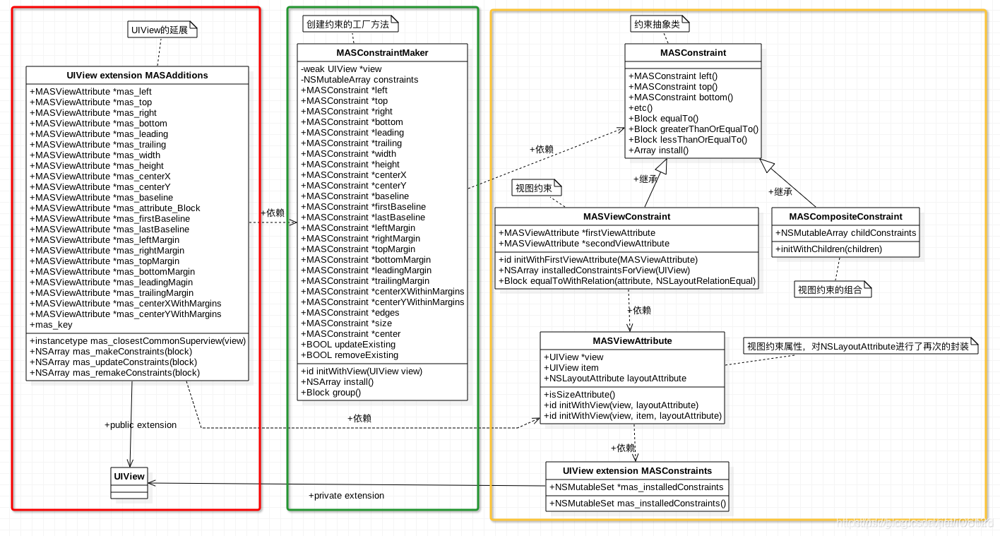
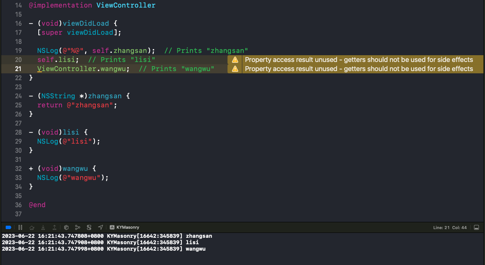
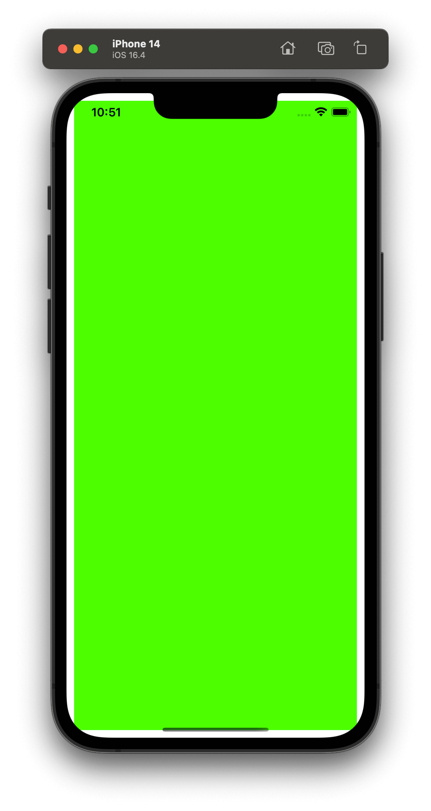
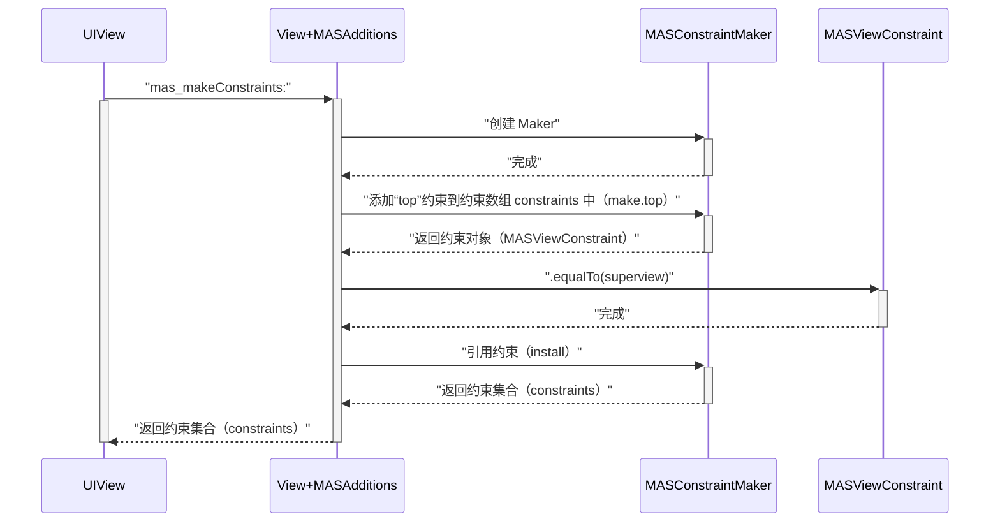
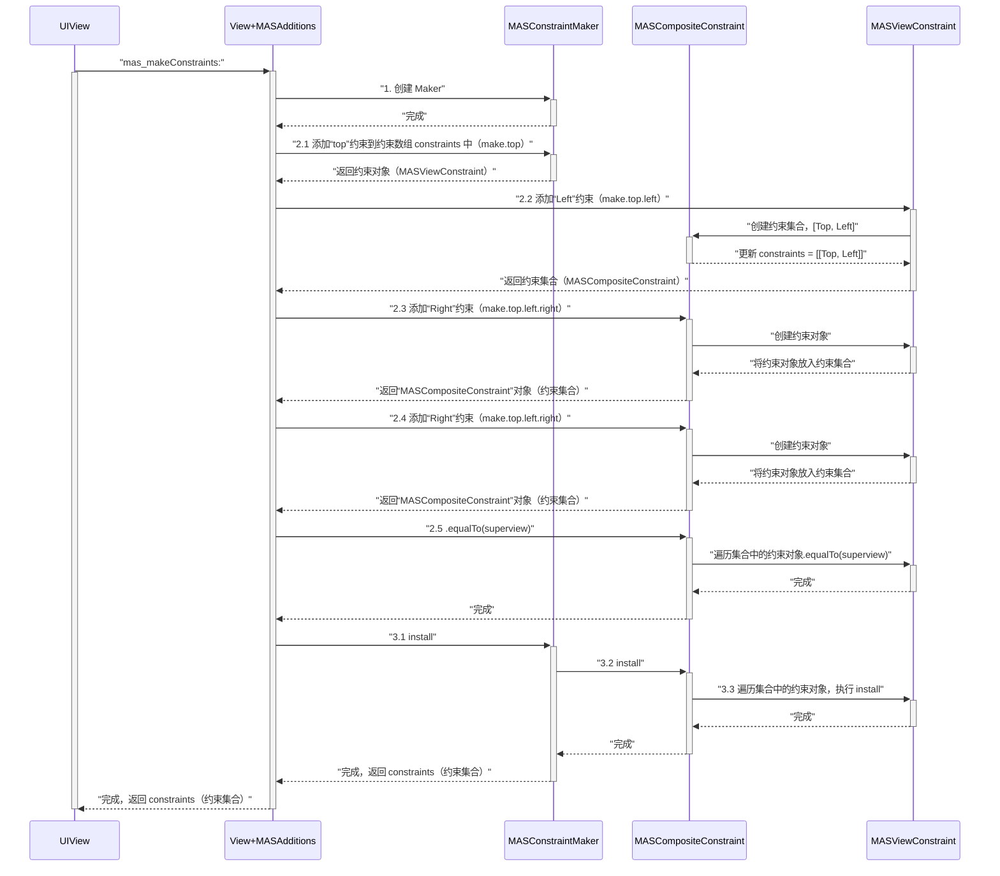
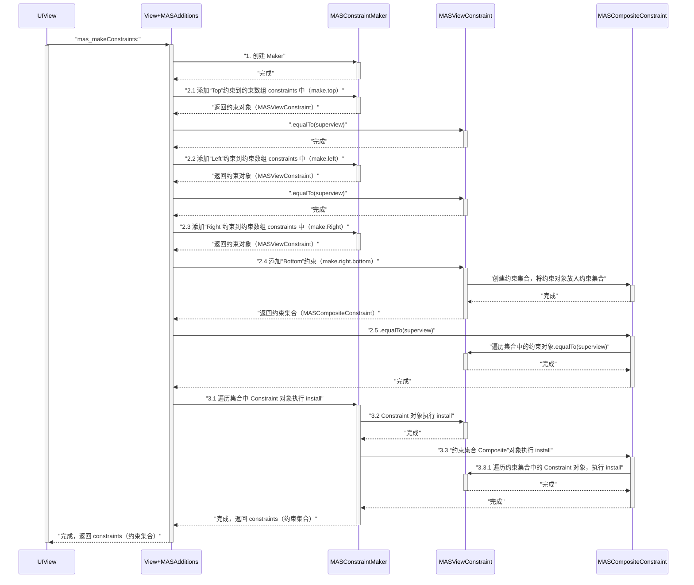

[Masonry](https://github.com/SnapKit/Masonry)

<!-- more -->

## 链式编程

### 特点一

* 链式编程可以通过点语法 `.` 调用函数。

例如 Objective-C 中的 getter 方法：

```swift
- (void)viewDidLoad {
  [super viewDidLoad];
  
  NSLog(@"%@", self.name);  // Prints "zhangsan"
}

- (NSString *)name {
  return @"zhangsan";
}
```

在 Objective-C 一般使用中括号 `[]` 的方式调用调用函数，但是也可以通过点语法 `.` 调用函数，但是编译器会提示警告：

```swift
- (void)viewDidLoad {
  [super viewDidLoad];
  
  NSLog(@"%@", self.zhangsan);  // Prints "zhangsan"
  self.lisi;  // Prints "lisi"
  ViewController.wangwu;  // Prints "wangwu"
}

- (NSString *)zhangsan {
  return @"zhangsan";
}

- (void)lisi {
  NSLog(@"lisi");
}

+ (void)wangwu {
  NSLog(@"wangwu");
}
```

警告如下：



### 特点二

* 链式编程可以通过点语法 `.` **连续**调用函数。

```swift
self.lisi.wangwu
```

要想实现上面这段代码，可以参考链式编程**每个方法都有返回值**的特点。可以让函数执行完成后返回当前对象 `return self`，实现代码如下：

```swift
@implementation ViewController

- (void)viewDidLoad {
  [super viewDidLoad];
  
  self.lisi.wangwu;  // [[self lisi] wangwu]
}

- (ViewController *)lisi {
  NSLog(@"lisi");
  return self;
}

- (ViewController *)wangwu {
  NSLog(@"wangwu");
  return self;
}

@end
```

打印结果：

```js
lisi
wangwu
```

上面这段代码，是参考 Objective-C 调用 getter 方法实现的，但是这种方式还比较局限。例如带有参数的函数调用：

```swift
@implementation ViewController

- (void)viewDidLoad {
  [super viewDidLoad];

  [self lisi:@"name1"];
}

- (void)lisi:(NSString *)name {
  NSLog(@"%@: lisi", name);
}
@end
```

打印结果：

```js
name1: lisi
```

函数往往是带有参数的，如果需要传入参数，该怎么用点语法`.`实现呢？

这个时候 block 就该登场了：

```swift
@implementation ViewController

- (void)viewDidLoad {
  [super viewDidLoad];
  self.lisi(@"name1");
}

- (void(^)(NSString *name))lisi {
  void(^block)(NSString *name) = ^(NSString *name) {
    NSLog(@"%@: lisi", name);
  };
  return block;
}

@end
```

通过 block 轻松实现了带有参数的 getter 方法，从而满足的点语法调用带参函数的要求。但是这样还不能满足**点语法连续调用**的特点，如连续调用两个或多个带参函数，该怎么实现呢？

```swift
@implementation ViewController

- (void)viewDidLoad {
  [super viewDidLoad];

  [[self lisi:@"name1"] wangwu:@"name2"];
}

- (ViewController *)lisi:(NSString *)name {
  NSLog(@"%@: lisi", name);
  return self;
}

- (ViewController *)wangwu:(NSString *)name {
  NSLog(@"%@: wangwu", name);
  return self;
}

@end
```

打印结果：

```js
name1: lisi
name2: wangwu
```

根据上面调用一个带参函数的实现，可以想到使用点语法连续调用带参函数的代码应该长这个样子：

```swift
self.lisi(@"name1").wangwu(@"name2")
```

这个时候带有**返回值**的 block 就该登场了：

```swift
@implementation ViewController

- (void)viewDidLoad {
  [super viewDidLoad];

  self.lisi(@"name1").wangwu(@"name2");
}

- (ViewController *(^)(NSString *name))lisi {
  ViewController *(^block)(NSString *name) = ^(NSString *name) {
    NSLog(@"%@: lisi", name);
    return self;
  };
  return block;
}

- (ViewController *(^)(NSString *name))wangwu {
  ViewController *(^block)(NSString *name) = ^(NSString *name) {
    NSLog(@"%@: wangwu", name);
    return self;
  };
  return block;
}
@end
```

打印结果：

```js
name1: lisi
name2: wangwu
```

实现细节：

1. `self.lisi` 返回了一个类型为 `ViewController *(^)(NSString *name)` 的 block（参数类型：`NSString*`，返回值类型：`ViewController*`）；
2. 通过括号 `()` 来实现 block 的调用，括号内是需要传递的参数，`self.lisi(@"name1")`；
3. block 调用后返回了当前对象 `self`，从而实现了点语法`.`连续调用，`self.lisi(@"name1").wangwu(@"name2")`。

### 特点三

* 链式编程可以通过点语法 `.` **无限**连续调用函数。

```swift
self.lisi(@"name1").wangwu(@"name2").lisi(@"name1").wangwu(@"name2").lisi(@"name1").wangwu(@"name2").lisi(@"name1").wangwu(@"name2").lisi(@"name1").wangwu(@"name2").lisi(@"name1").wangwu(@"name2");
```

打印结果：

```js
name1: lisi
name2: wangwu
name1: lisi
name2: wangwu
name1: lisi
name2: wangwu
name1: lisi
name2: wangwu
name1: lisi
name2: wangwu
name1: lisi
name2: wangwu
```

## Masonry简介

来自 Masonry 说明文档里的示例：创建一个 view，它的上下左右四个边和父视图的四个边相距 10 的距离。



方案一：使用 `NSLayoutConstraints` 布局的实现代码

```swift
UIView *superview = self.view;

UIView *view1 = [[UIView alloc] init];
view1.translatesAutoresizingMaskIntoConstraints = NO;
view1.backgroundColor = [UIColor greenColor];
[superview addSubview:view1];

UIEdgeInsets padding = UIEdgeInsetsMake(10, 10, 10, 10);

/**
1. 添加约束组合
2. 约束生效
*/
[superview addConstraints:@[
   // 约束对象1：view1-top，view2-top，EQUAL
   [NSLayoutConstraint constraintWithItem:view1
                                attribute:NSLayoutAttributeTop
                                relatedBy:NSLayoutRelationEqual
                                   toItem:superview
                                attribute:NSLayoutAttributeTop
                               multiplier:1.0
                                 constant:padding.top],
   // 约束对象2：view1-left，view2-left，EQUAL
   [NSLayoutConstraint constraintWithItem:view1
                                attribute:NSLayoutAttributeLeft
                                relatedBy:NSLayoutRelationEqual
                                   toItem:superview
                                attribute:NSLayoutAttributeLeft
                               multiplier:1.0
                                 constant:padding.left],
   // 约束对象3：view1-bottom，view2-bottom，EQUAL
   [NSLayoutConstraint constraintWithItem:view1
                                attribute:NSLayoutAttributeBottom
                                relatedBy:NSLayoutRelationEqual
                                   toItem:superview
                                attribute:NSLayoutAttributeBottom
                               multiplier:1.0
                                 constant:-padding.bottom],
   // 约束对象4：view1-right，view2-right，EQUAL
   [NSLayoutConstraint constraintWithItem:view1
                                attribute:NSLayoutAttributeRight
                                relatedBy:NSLayoutRelationEqual
                                   toItem:superview
                                attribute:NSLayoutAttributeRight
                               multiplier:1
                                 constant:-padding.right],

]];
```

方案二：这是使用 Masonry 布局的实现代码

```swift
UIView *superview = self.view;

UIView *view1 = [[UIView alloc] init];
view1.translatesAutoresizingMaskIntoConstraints = NO;
view1.backgroundColor = [UIColor greenColor];
[superview addSubview:view1];

UIEdgeInsets padding = UIEdgeInsetsMake(10, 10, 10, 10);

/**
1. 添加约束组合
2. 约束生效
*/
[view1 mas_makeConstraints:^(MASConstraintMaker *make) {
   make.top.equalTo(superview.mas_top).with.offset(padding.top);
   make.left.equalTo(superview.mas_left).with.offset(padding.left);
   make.bottom.equalTo(superview.mas_bottom).with.offset(-padding.bottom);
   make.right.equalTo(superview.mas_right).with.offset(-padding.right);
}];
```

可以看得出 Masonry 作者通过举出这个例子想要表达的意思，用 Masonry 布局真的太方便了。

## Autolayout

### NSLayoutConstraint

上面的例子添加了一个 view 到视图上，该 view 的四个边和 superview 的四个边设置边距为 10，而这每一个边的边距都对应着一个**约束对象**（`NSLayoutConstraint`）。

如上边的约束对象的初始化方法：

```swift
// view1-top, view2-top, EQUAL
NSLayoutConstraint *constraint = [NSLayoutConstraint constraintWithItem:view1
                                                              attribute:NSLayoutAttributeTop
                                                              relatedBy:NSLayoutRelationEqual
                                                                 toItem:superview
                                                              attribute:NSLayoutAttributeTop
                                                             multiplier:1.0
                                                               constant:padding.top],
```

从这段代码不难看出，约束是相对的，至少需要两个 view 才能创建出一个约束对象。可以总结出创建一个约束对象的条件：

1. 第一个视图；
2. 第一个视图的约束属性（约束方向：上/下/左/右等）；
3. 第二个视图；
4. 第二个视图的约束属性（约束方向：上/下/左/右等）；
5. 约束关系（等于/大于/小于）；

这五个条件是生成一个约束对象所必须的，也是一个约束对象所拥有的最基础的元素。这一点在 `NSLayoutConstraint.h` 文件中定义的属性也能看出来：

```swift
@interface NSLayoutConstraint : NSObject

/// 第一个视图
@property (nullable, readonly, assign) id firstItem;
/// 第二个视图
@property (nullable, readonly, assign) id secondItem;
/// 第一个视图的约束属性
@property (readonly) NSLayoutAttribute firstAttribute;
/// 第二个视图的约束属性
@property (readonly) NSLayoutAttribute secondAttribute;
/// 约束关系
@property (readonly) NSLayoutRelation relation;

@end
```

### NSLayoutAttribute

在 `NSLayoutConstraint.h` 文件中定义的属性中，可以看到两个约束属性 `firstAttribute` 和 `secondAttribute`，它们用来描述视图的那一个方向需要添加约束。`NSLayoutAttribute` 是一个枚举，定义了视图支持自动布局的各个位置。

```swift
typedef NS_ENUM(NSInteger, NSLayoutAttribute) {
    /*
     * 视图位置
     */
    NSLayoutAttributeLeft = 1,
    NSLayoutAttributeRight,
    NSLayoutAttributeTop,
    NSLayoutAttributeBottom,
    /*
     * 视图前后
     */
    NSLayoutAttributeLeading,
    NSLayoutAttributeTrailing,
    /*
     * 视图宽高
     */
    NSLayoutAttributeWidth,
    NSLayoutAttributeHeight,
    /*
     * 视图中心
     */
    NSLayoutAttributeCenterX,
    NSLayoutAttributeCenterY,
    /*
     * 视图基线
     */
    NSLayoutAttributeLastBaseline,
#if TARGET_OS_IPHONE
    NSLayoutAttributeBaseline NS_SWIFT_UNAVAILABLE("Use 'lastBaseline' instead") = NSLayoutAttributeLastBaseline,
#else
    NSLayoutAttributeBaseline = NSLayoutAttributeLastBaseline,
#endif
    NSLayoutAttributeFirstBaseline API_AVAILABLE(macos(10.11), ios(8.0)),

#if TARGET_OS_IPHONE
    /*
     * 视图位置（带边距）
     */
    NSLayoutAttributeLeftMargin API_AVAILABLE(ios(8.0)),
    NSLayoutAttributeRightMargin API_AVAILABLE(ios(8.0)),
    NSLayoutAttributeTopMargin API_AVAILABLE(ios(8.0)),
    NSLayoutAttributeBottomMargin API_AVAILABLE(ios(8.0)),
    /*
     * 视图前后（带边距）
     */
    NSLayoutAttributeLeadingMargin API_AVAILABLE(ios(8.0)),
    NSLayoutAttributeTrailingMargin API_AVAILABLE(ios(8.0)),
    /*
     * 视图中心（带边距）
     */
    NSLayoutAttributeCenterXWithinMargins API_AVAILABLE(ios(8.0)),
    NSLayoutAttributeCenterYWithinMargins API_AVAILABLE(ios(8.0)),
#endif
    // 占位符
    NSLayoutAttributeNotAnAttribute = 0
};
```

关于带 Margin 的枚举值：

1. `NSLayoutAttributeLeft` 表示视图的最左边；
2. `NSLayoutAttributeLeftMargin` 表示视图的左边，且与父视图的左边具有一个边距（margin），这个值通过 `layoutMargins` 进行修改。

### NSLayoutRelation

约束关系，在创建约束对象时，需要明确指出两个视图的约束关系。

```swift
typedef NS_ENUM(NSInteger, NSLayoutRelation) {
    /// <=
    NSLayoutRelationLessThanOrEqual = -1,
    /// ==
    NSLayoutRelationEqual = 0,
    /// >=
    NSLayoutRelationGreaterThanOrEqual = 1,
};
```

## Masonry的UML


图中从左至右把 Masonry 分为三块：

1. `View+MASAdditions`，`UIView` 的延展，让 `UIView` 更方便的调用 Masonry 提供的属性和方法，这也是三方框架惯用的手段，为无访问权限的源代码扩展能力（逆向建模）；
2. `MASConstraintMaker`，简称 Maker，是**创建约束**的工厂方法，即所有类都会以各种方式调用到这个类里，由它来完成创建约束的操作；
3. `MASConstraint`，简称 Constant（约束），它是一个抽象父类，关联的子类有：`MASViewConstraint`（单个约束）、`MASCompositeConstraint`（约束结合），都被 Maker 创建。

因为 Masonry 是采用链式编程的范式构建的，也是就是万物皆可点，一直点一直有（返回值），所以这三个模块包含使用点语法调用的属性或函数。

### View+MASAdditions

🤔思考：`UIView` 通过点语法会返回什么呢？

对 `UIView` 的延展，主要是为了通过拓展的方式**放大接口**，给 `UIView` 增加新的属性和方法：

1. 属性创造 `MASViewAttribute`，简称 Attribute，约束属性，它创建约束对象的条件之一；
2. 方法创造 `MASConstraintMaker`，简称 Maker。

```swift
@interface MAS_VIEW (MASAdditions)

@property (nonatomic, strong, readonly) MASViewAttribute *mas_left;
@property (nonatomic, strong, readonly) MASViewAttribute *mas_top;
@property (nonatomic, strong, readonly) MASViewAttribute *mas_right;
@property (nonatomic, strong, readonly) MASViewAttribute *mas_bottom;

- (NSArray *)mas_makeConstraints:(void(NS_NOESCAPE ^)(MASConstraintMaker *make))block;

@end
```

定义属性的目的，是想利用属性的 getter 方法，从而实现通过点语法调用函数的方式，创建约束属性。

下面是属性的 getter 方法的具体实现，内部直接返回了一个初始化好的约束属性：

```swift
@implementation MAS_VIEW (MASAdditions)

- (NSArray *)mas_makeConstraints:(void(^)(MASConstraintMaker *))block {
    // 1.设置不支持 AutoresizingMask
    self.translatesAutoresizingMaskIntoConstraints = NO;
    // 2.初始化专属约束创造者 Maker
    MASConstraintMaker *constraintMaker = [[MASConstraintMaker alloc] initWithView:self];
    // 3.收集约束
    block(constraintMaker);
    // 4.添加约束（应用约束）
    return [constraintMaker install];
}

- (MASViewAttribute *)mas_left {
    return [[MASViewAttribute alloc] initWithView:self layoutAttribute:NSLayoutAttributeLeft];
}

- (MASViewAttribute *)mas_top {
    return [[MASViewAttribute alloc] initWithView:self layoutAttribute:NSLayoutAttributeTop];
}

- (MASViewAttribute *)mas_right {
    return [[MASViewAttribute alloc] initWithView:self layoutAttribute:NSLayoutAttributeRight];
}

- (MASViewAttribute *)mas_bottom {
    return [[MASViewAttribute alloc] initWithView:self layoutAttribute:NSLayoutAttributeBottom];
}

@end
```

对 `UIView` 的延展好处是，为 `UIView` 增加了 Masonry 自定义的属性和方法，从而使调用变的更加直接，就像是 `UIView` 原本就具有这些属性和方法一样：

```swift
- (void)viewDidLoad {
  [super viewDidLoad];
  
  UIView *superview = self.view;
  [superview addSubview:view1];

  [view1 mas_makeConstraints:^(MASConstraintMaker *make) {
      make.top.equalTo(superview.mas_top);
  }];
}
```

综上所述，`UIView` 通过点语法会创建出一个约束方向对象 `MASViewAttribute`。

### MASViewAttribute

* 这一部分关心的是 **Attribute**（约束属性），也就是约束方向。

通过上面👆约束属性的初始化方法，不难看出一个 `MASViewAttribute` 类型的约束属性，至少包含两个东西：

1. View：视图；
2. Attribute：约束方向。

```swift
MASViewAttribute * attribute = [[MASViewAttribute alloc] initWithView:self layoutAttribute:NSLayoutAttributeLeft];
```

从 `MASViewAttribute.h` 文件里也能看出这一点：

```swift
@interface MASViewAttribute : NSObject
/// 约束视图
@property (nonatomic, weak, readonly) id item;
/// 约束属性
@property (nonatomic, assign, readonly) NSLayoutAttribute layoutAttribute;
@end
```

从定义可以看出 `MASViewAttribute` 将约束视图 View 和约束属性 Attribute 封装到了同一个类里，相对于 `NSLayoutAttribute` 枚举来说，`MASViewAttribute` 创建出来后是一个对象，拥有更多的信息，且更加的面向对象。这也正好弥补了 Objective-C 中枚举地位低的缺点。

### MASConstraintMaker

* 这一部分关心的是 **Constraint**（约束）的创建创建者 `MASConstraintMaker`，简称 Maker。

🤔思考：约束创建者 Maker 通过点语法会返回什么呢？

创建约束的工厂方法，负责约束对象的创建工作，即所有类都以代理的方式，调用到这个类里，由它来完成创建约束的操作。

在 UIView 的延展部分提到了 Maker 的创建，通过调用 `mas_makeConstraints` 方法创建：

```swift
@implementation MAS_VIEW (MASAdditions)

- (NSArray *)mas_makeConstraints:(void(^)(MASConstraintMaker *))block {
    // 1.设置不支持 AutoresizingMask
    self.translatesAutoresizingMaskIntoConstraints = NO;
    // 2.初始化专属约束创造者 Maker
    MASConstraintMaker *constraintMaker = [[MASConstraintMaker alloc] initWithView:self];
    // 3.收集约束
    block(constraintMaker);
    // 4.添加约束（应用约束）
    return [constraintMaker install];
}

@end
```

通过初始化代码，可以看出 Maker 首先持有了 view，成为了 view 专属的约束创造者，再通过 block 回调出去收集约束：

```swift
[view1 mas_makeConstraints:^(MASConstraintMaker *make) {
    make.top.equalTo(superview.mas_top);
}];
```

关于 Maker 和 view 是一对一的关系，也可以从 Maker 的定义里看出来：

```swift
@interface MASConstraintMaker : NSObject

@property (nonatomic, strong, readonly) MASConstraint *left;
@property (nonatomic, strong, readonly) MASConstraint *top;
@property (nonatomic, strong, readonly) MASConstraint *right;
@property (nonatomic, strong, readonly) MASConstraint *bottom;

- (id)initWithView:(MAS_VIEW *)view;

@end
```

Maker 将约束定义为属性，是想利用属性的 getter 方法，通过点语法的方式创建约束，如 `left` 属性的 getter 方法：

```swift
@implementation MASConstraintMaker

- (id)initWithView:(MAS_VIEW *)view {
    self = [super init];
    if (!self) return nil;
    
    self.view = view;
    self.constraints = NSMutableArray.new;
    
    return self;
}

- (MASConstraint *)left {
    return [self addConstraintWithLayoutAttribute:NSLayoutAttributeLeft];
}

- (MASConstraint *)top {
    return [self addConstraintWithLayoutAttribute:NSLayoutAttributeTop];
}

- (MASConstraint *)right {
    return [self addConstraintWithLayoutAttribute:NSLayoutAttributeRight];
}

- (MASConstraint *)bottom {
    return [self addConstraintWithLayoutAttribute:NSLayoutAttributeBottom];
}

@end
```

综上所述，约束创建者 Maker 通过点语法会创建出一个约束对象 `MASConstraint`。

关于 Maker 的核心方法 `constraint:addConstraintWithLayoutAttribute:`，主要用来创建约束对象，下面以序号的方式演示代码的执行过程：

1. 创建单个约束对象 `MASViewConstraint`；
2. 创建约束集合 `MASCompositeConstraint`。

```swift
@implementation MASConstraintMaker

- (void)constraint:(MASConstraint *)constraint shouldBeReplacedWithConstraint:(MASConstraint *)replacementConstraint {
    NSUInteger index = [self.constraints indexOfObject:constraint];
    NSAssert(index != NSNotFound, @"Could not find constraint %@", constraint);
    [self.constraints replaceObjectAtIndex:index withObject:replacementConstraint];
}

/*
 创建约束对象的入口，子类会通过代理调用该方法，创建新的约束对象
*/
- (MASConstraint *)constraint:(MASConstraint *)constraint addConstraintWithLayoutAttribute:(NSLayoutAttribute)layoutAttribute {
    /*
    创建约束属性 和 新的约束对象
    */
    MASViewAttribute *viewAttribute = [[MASViewAttribute alloc] initWithView:self.view layoutAttribute:layoutAttribute];
    MASViewConstraint *newConstraint = [[MASViewConstraint alloc] initWithFirstViewAttribute:viewAttribute];
    /*
     constraint 是 MASViewConstraint 类型会说明两件事：
     1、constraint 不为空：newConstraint 不是视图的第一个约束对象；
     2、constraint 不是 MASCompositeConstraint 类型：还没有创建过约束集合（一个视图只会创建一次）。

     即需要创建一个约束集合
    */
    if ([constraint isKindOfClass:MASViewConstraint.class]) {
        // 1、将第一个约束对象和第二个约束对象打包集合
        NSArray *children = @[constraint, newConstraint];
        MASCompositeConstraint *compositeConstraint = [[MASCompositeConstraint alloc] initWithChildren:children];
        // 2、设置代理，创建第三个约束对象及更多的约束对象时，重新来到这个方法
        compositeConstraint.delegate = self;
        // 3、让约束集合替换第一个约束对象（约束集合里已经保存了第一个约束对象）
        [self constraint:constraint shouldBeReplacedWithConstraint:compositeConstraint];
        /*
        📢注意：这里返回的是 MASCompositeConstraint，和链式调用息息相关
        */
        return compositeConstraint;
    }
    /*
    constraint 为空说明：
    1、newConstraint 是视图的第一个约束对象
    */
    if (!constraint) {
        // 设置代理，创建第二约束对象的时候，重新来到这个方法，创建约束集合👆
        newConstraint.delegate = self;
        [self.constraints addObject:newConstraint];
    }
    /*
    📢注意：这里返回的是 MASViewConstraint，和链式调用息息相关
    */
    return newConstraint;
}

@end
```

### MASConstraint

* 这一部分主要关心的是约束自身，简称 Constraint。

🤔思考：约束是否也是可以点的，通过点语法可以创造出什么呢？

这里的定义和约束创建者 Maker 类似，只不过这里没有写成属性（readonly）的方式，而是直接实现了 getter 方法。

>猜想：这样写是因为用了面向对象的封装，属性是对象的特征。Maker 是可以拥有约束特征的，而约束自身不应该再拥有约束特征。如“人”可以有“左手”和“右手”，而“手”自身不再拥有这些特征。

```swift
@interface MASConstraint : NSObject

- (MASConstraint *)left;
- (MASConstraint *)top;
- (MASConstraint *)right;
- (MASConstraint *)bottom;

@end
```

getter 方法的实现部分 和 Maker 是完全一致的，毕竟想实现的功能是一样的。

```swift
- (MASConstraint *)left {
    return [self addConstraintWithLayoutAttribute:NSLayoutAttributeLeft];
}
```

`MASConstraint` 约束抽象类，与 Maker 一样可以通过点语法创建一个新的约束对象。`MASConstraint` 真正满足了链式编程要求，即**每个方都有返回值，返回值为对象自身**。又因为 `MASConstraint` 是 Maker 的属性，所以 Maker 也满足了链式编程。至此，Masonry 中可以实现链式编程的类有两个 `MASConstraint`（及其子类） 和 `MASConstraintMaker`。

### MASViewConstraint

`MASViewConstraint` 约束类，是 `MASConstraint` 的子类，Maker 生成的约束对象就是 `MASViewConstraint` 类型的。

`MASViewConstraint` 对标的是 Autolayout 中的 `NSLayoutConstraint`，前边通过 `NSLayoutConstraint` 的定义看出它有 5 个基本条件：

1. 第一个视图；
2. 第一个视图的约束属性（约束方向：上/下/左/右等）；
3. 第二个视图；
4. 第二个视图的约束属性（约束方向：上/下/左/右等）；
5. 约束关系（等于/大于/小于）；

下面是 `MASViewConstraint` 的定义，可以看出，它只需要两个条件：

```swift
@interface MASViewConstraint : MASConstraint <NSCopying>

@property (nonatomic, strong, readonly) MASViewAttribute *firstViewAttribute;

@property (nonatomic, strong, readonly) MASViewAttribute *secondViewAttribute;

@end
```

其实还有一个条件，约束关系，被定义子在了 `MASViewConstraint.m` 文件。综上所述，可以总结出创建一个 `MASViewConstraint` 对象的基本条件有三个：

1. 第一个视图和第一个视图的约束属性；
2. 第二个视图和第二个视图的约束属性；
3. 约束关系。

可以看的出，两者的条件内容本质是一样的，只不是实现方式不同而已。`MASViewConstraint` 使用面向对象的方式，把“视图”和“视图的约束属性”打包成元组的形式进行管理。

🤔思考：把“视图”和“视图的约束属性”打包成元组的操作妙在哪？

### MASCompositeConstraint

`MASCompositeConstraint` 约束集合类，当一个 Maker 创建了一个以上的约束对象时，就会创建出约束集合来管理这些约束。

```swift
@interface MASCompositeConstraint : MASConstraint

- (id)initWithChildren:(NSArray *)children;

@end
```

## Masonry约束实现原理

`UIView` 通过 `mas_makeConstraints` 方法为自己添加约束。

### 案例一

```swift
UIView *superview = self.view;

UIView *view1 = [[UIView alloc] init];
[superview addSubview:view1];

[view1 mas_makeConstraints:^(MASConstraintMaker *make) {
   make.top.equalTo(superview.mas_top);
}];
```

`mas_makeConstraints` 的实现：

```swift
@implementation MAS_VIEW (MASAdditions)

- (NSArray *)mas_makeConstraints:(void(^)(MASConstraintMaker *))block {
    // 1.设置不支持 AutoresizingMask
    self.translatesAutoresizingMaskIntoConstraints = NO;
    // 2.初始化专属约束创造者 Maker
    MASConstraintMaker *constraintMaker = [[MASConstraintMaker alloc] initWithView:self];
    // 3.收集约束
    block(constraintMaker);
    // 4.添加约束（应用约束）
    return [constraintMaker install];
}

@end
```

调用该方法做了四件事情：

1. 设置不支持 AutoresizingMask；
2. 初始化**专属**约束创造者 Maker；
3. 收集约束；
4. 添加约束（应用约束）。

约束的收集过程：

```swift
[view1 mas_makeConstraints:^(MASConstraintMaker *make) {
   make.top.equalTo(superview.mas_top).with.offset(padding.top);
}];
```

时序图



第一步 `make.top`：Maker 创建 view 的 top 约束对象，核心方法 `constraint:addConstraintWithLayoutAttribute:`

```swift
@implementation MASConstraintMaker

// 1.3
- (MASConstraint *)constraint:(MASConstraint *)constraint addConstraintWithLayoutAttribute:(NSLayoutAttribute)layoutAttribute {
    MASViewAttribute *viewAttribute = [[MASViewAttribute alloc] initWithView:self.view layoutAttribute:layoutAttribute];
    MASViewConstraint *newConstraint = [[MASViewConstraint alloc] initWithFirstViewAttribute:viewAttribute];
    /*
    为约束设置代理：当约束通过点语法创建新的约束对象时，会通过代理再次来到这个方法进行创建约束
    */
    newConstraint.delegate = self;
    /*
    将新的约束放收集到数组里，等待应用到view上
    */
    [self.constraints addObject:newConstraint];
    /*
    📢注意：这里返回的是 MASViewConstraint 类型，和接下来 equal 的调用有关
    */
    return newConstraint;
}

// 1.2
- (MASConstraint *)addConstraintWithLayoutAttribute:(NSLayoutAttribute)layoutAttribute {
    return [self constraint:nil addConstraintWithLayoutAttribute:layoutAttribute];
}

// 1.1
- (MASConstraint *)top {
    return [self addConstraintWithLayoutAttribute:NSLayoutAttributeTop];
}

@end
```

第一步执行完成后，生成了一个约束对象 `MASViewConstraint`，简称 Constraint，同时它已经有了第一个视图和它的约束属性（`NSLayoutAttributeTop`）。

🤔思考：`make.top` 创建出来的 `top` 约束对象的类型一定是 `MASViewConstraint` 的吗?

第二步 `make.top.equal`：设置依赖关系，首先来到约束抽象类 `MASConstraint` 里

```swift
@implementation MASConstraint

- (MASConstraint * (^)(id))equalTo {
    return ^id(id attribute) {
        return self.equalToWithRelation(attribute, NSLayoutRelationEqual);
    };
}

@end
```

这一步有两个参数：

1. attribute 约束属性（视图和视图的约束属性）;
2. relation 约束关系（`NSLayoutRelationEqual`）。

因为上面👆 `make.top` 返回的是 `MASViewConstraint` 类型，所以接下来会调用到子类 `MASViewConstraint` 实现的 `equalToWithRelation` 方法里：

```swift
@implementation MASViewConstraint

- (MASConstraint * (^)(id, NSLayoutRelation))equalToWithRelation {
    return ^id(id attribute, NSLayoutRelation relation) {
          /*
          1. 设置约束关系
          2. 设置第二个视图的约束属性
          */
          self.layoutRelation = relation;
          self.secondViewAttribute = attribute;
          return self;
    };
}

@end
```

第二步执行完成后，Constraint 具备了全部基本条件：

1. `firstViewAttribute`（view1 的约束属性）；
2. `secondViewAttribute`（view2 的约束属性）；
3. relation（约束关系）。

### 案例二

```swift
UIView *superview = self.view;

UIView *view1 = [[UIView alloc] init];
[superview addSubview:view1];

[view1 mas_makeConstraints:^(MASConstraintMaker *make) {
   make.top.left.right.bottom.equalTo(superview);
}];
```

时序图



第一步 `make.top`：同案例一，`make.top` 返回的永远是 `MASViewConstraint`。

```swift
@implementation MASConstraintMaker
/*
 记录该方法调用次数：1
 */
// 1.3
- (MASConstraint *)constraint:(MASConstraint *)constraint addConstraintWithLayoutAttribute:(NSLayoutAttribute)layoutAttribute {
    MASViewAttribute *viewAttribute = [[MASViewAttribute alloc] initWithView:self.view layoutAttribute:layoutAttribute];
    MASViewConstraint *newConstraint = [[MASViewConstraint alloc] initWithFirstViewAttribute:viewAttribute];
    if (!constraint) {
        // 1.4
        newConstraint.delegate = self;
        [self.constraints addObject:newConstraint];
    }
    /*
    📢注意：返回的是 MASViewConstraint
    */
    return newConstraint;
}

// 1.2
- (MASConstraint *)addConstraintWithLayoutAttribute:(NSLayoutAttribute)layoutAttribute {
    return [self constraint:nil addConstraintWithLayoutAttribute:layoutAttribute];
}

// 1.1
- (MASConstraint *)top {
    return [self addConstraintWithLayoutAttribute:NSLayoutAttributeTop];
}

@end
```

第二步 `make.top.left`：

```swift
@implementation MASConstraint

// 2.1 来到父类调用基础方法
- (MASConstraint *)left {
    /*
    父类并没有实现该方法，会分发给子类完成，两个子类，该分给谁呢？
    */
    return [self addConstraintWithLayoutAttribute:NSLayoutAttributeLeft];
}

@end
```

因为第一步 `make.top` 返回的是 `MASViewConstraint` 类型，`MASViewConstraint` 作为子类重写了父类方法 `addConstraintWithLayoutAttribute:`：

```swift
@implementation MASViewConstraint

// 2.2 子类重写父类方法
- (MASConstraint *)addConstraintWithLayoutAttribute:(NSLayoutAttribute)layoutAttribute {
    NSAssert(!self.hasLayoutRelation, @"Attributes should be chained before defining the constraint relation");

    // self.delegate 是 Maker
    return [self.delegate constraint:self addConstraintWithLayoutAttribute:layoutAttribute];
}

@end
```

通过代理，再次掉到 Maker 创建约束的方法：

```swift
@implementation MASConstraintMaker
/*
 记录该方法调用次数：2
 */
- (MASConstraint *)constraint:(MASConstraint *)constraint addConstraintWithLayoutAttribute:(NSLayoutAttribute)layoutAttribute {
    MASViewAttribute *viewAttribute = [[MASViewAttribute alloc] initWithView:self.view layoutAttribute:layoutAttribute];
    MASViewConstraint *newConstraint = [[MASViewConstraint alloc] initWithFirstViewAttribute:viewAttribute];
    /*
    true：此时的 constraint 是第一步创建的约束对象 MASViewConstraint
    */
    if ([constraint isKindOfClass:MASViewConstraint.class]) {
        // 2.3 大于一个约束对象时，创建约束集合进行管理
        NSArray *children = @[constraint, newConstraint];
        MASCompositeConstraint *compositeConstraint = [[MASCompositeConstraint alloc] initWithChildren:children];
        compositeConstraint.delegate = self;
        [self constraint:constraint shouldBeReplacedWithConstraint:compositeConstraint];
        /*
        📢注意：返回的是 MASCompositeConstraint
        */
        return compositeConstraint;
    }
}

@end
```

第三步 `make.top.left.right`：

```swift
@implementation MASConstraint

// 3.1 来到父类调用基础方法
- (MASConstraint *)right {
    /*
    父类并没有实现该方法，会分发给子类完成，两个子类，该分给睡呢？
    */
    return [self addConstraintWithLayoutAttribute:NSLayoutAttributeRight];
}

@end
```

因为在第二步中 `make.top.left` 返回的是 MASCompositeConstraint 类型，所以将由 MASCompositeConstraint 来执行接下来的任务：

```swift
@implementation MASCompositeConstraint

// 3.3 子类重写父类方法，创建新的约束对象
- (MASConstraint *)constraint:(MASConstraint __unused *)constraint addConstraintWithLayoutAttribute:(NSLayoutAttribute)layoutAttribute {
    id<MASConstraintDelegate> strongDelegate = self.delegate;
    /*
    因为创建约束对象的方法已经有了，没必要再实现一遍，所以可以直接调用那个负责创建约束对象的方法。
    */
    MASConstraint *newConstraint = [strongDelegate constraint:self addConstraintWithLayoutAttribute:layoutAttribute];
    newConstraint.delegate = self;
    /*
    收集到约束集合里，统一管理
    */
    [self.childConstraints addObject:newConstraint];
    return newConstraint;
}

// 3.2 来到子类
- (MASConstraint *)addConstraintWithLayoutAttribute:(NSLayoutAttribute)layoutAttribute {
    [self constraint:self addConstraintWithLayoutAttribute:layoutAttribute];
    /*
    📢注意：这里就返回了，返回的是 MASCompositeConstraint 自身
    */
    return self;
}

@end
```

负责创建约束对象的方法：

```swift
@implementation MASConstraintMaker
/*
 记录该方法调用次数：3
 */
- (MASConstraint *)constraint:(MASConstraint *)constraint addConstraintWithLayoutAttribute:(NSLayoutAttribute)layoutAttribute {
    MASViewAttribute *viewAttribute = [[MASViewAttribute alloc] initWithView:self.view layoutAttribute:layoutAttribute];
    MASViewConstraint *newConstraint = [[MASViewConstraint alloc] initWithFirstViewAttribute:viewAttribute];
    /*
    否：constraint 是 MASCompositeConstraint 类型
    */
    if ([constraint isKindOfClass:MASViewConstraint.class]) {
        //replace with composite constraint
        NSArray *children = @[constraint, newConstraint];
        MASCompositeConstraint *compositeConstraint = [[MASCompositeConstraint alloc] initWithChildren:children];
        compositeConstraint.delegate = self;
        [self constraint:constraint shouldBeReplacedWithConstraint:compositeConstraint];
        return compositeConstraint;
    }
    /*
    否：constraint 已经存在
    */
    if (!constraint) {
        newConstraint.delegate = self;
        [self.constraints addObject:newConstraint];
    }
    return newConstraint;
}

@end
```

第四步 `make.top.left.right.bottom` 和第三步相同

```swift
@implementation MASConstraint
// 4.1 来到父类调用基础方法
- (MASConstraint *)right {
    /*
    父类并没有实现该方法，会分发给子类完成，两个子类，该分给睡呢？
    */
    return [self addConstraintWithLayoutAttribute:NSLayoutAttributeRight];
}
@end


@implementation MASCompositeConstraint
// 4.3 子类重写父类方法，创建新的约束对象
- (MASConstraint *)constraint:(MASConstraint __unused *)constraint addConstraintWithLayoutAttribute:(NSLayoutAttribute)layoutAttribute {
    id<MASConstraintDelegate> strongDelegate = self.delegate;
    /*
    因为创建约束对象的方法已经有了，没必要再实现一遍，所以可以直接调用那个负责创建约束对象的方法。
    */
    MASConstraint *newConstraint = [strongDelegate constraint:self addConstraintWithLayoutAttribute:layoutAttribute];
    newConstraint.delegate = self;
    /*
    收集到约束集合里，统一管理
    */
    [self.childConstraints addObject:newConstraint];
    return newConstraint;
}

// 4.2 来到子类
- (MASConstraint *)addConstraintWithLayoutAttribute:(NSLayoutAttribute)layoutAttribute {
    [self constraint:self addConstraintWithLayoutAttribute:layoutAttribute];
    /*
    📢注意：这里就返回了，返回的是 MASCompositeConstraint 自身
    */
    return self;
}
@end
```

第五步 `.equalTo(superview)`：

```swift
@implementation MASConstraint
- (MASConstraint * (^)(id))equalTo {
    return ^id(id attribute) {
        return self.equalToWithRelation(attribute, NSLayoutRelationEqual);
    };
}
@end


@implementation MASCompositeConstraint
- (MASConstraint * (^)(id, NSLayoutRelation))equalToWithRelation {
    return ^id(id attr, NSLayoutRelation relation) {
        for (MASConstraint *constraint in self.childConstraints.copy) {
            constraint.equalToWithRelation(attr, relation);
        }
        return self;
    };
}
@end


@implementation MASViewConstraint
- (MASConstraint * (^)(id, NSLayoutRelation))equalToWithRelation {
    return ^id(id attribute, NSLayoutRelation relation) {
        self.layoutRelation = relation;
        self.secondViewAttribute = attribute;
        return self;
    };
}
@end
```

第六步 `install`：

```swift
@implementation MASConstraintMaker
- (NSArray *)install {
    if (self.removeExisting) {
        NSArray *installedConstraints = [MASViewConstraint installedConstraintsForView:self.view];
        for (MASConstraint *constraint in installedConstraints) {
            [constraint uninstall];
        }
    }
    NSArray *constraints = self.constraints.copy;
    for (MASConstraint *constraint in constraints) {
        constraint.updateExisting = self.updateExisting;
        [constraint install];
    }
    [self.constraints removeAllObjects];
    return constraints;
}
@end


@implementation MASCompositeConstraint
- (void)install {
    /*
    遍历加载所有约束对象
    */
    for (MASConstraint *constraint in self.childConstraints) {
        constraint.updateExisting = self.updateExisting;
        [constraint install];
    }
}
@end
```

### 案例三

```swift
UIView *superview = self.view;

UIView *view1 = [[UIView alloc] init];
[superview addSubview:view1];

[view1 mas_makeConstraints:^(MASConstraintMaker *make) {
    make.top.equalTo(superview);
    make.left.equalTo(superview);
    make..right.bottom.equalTo(superview);
}];
```

时序图

