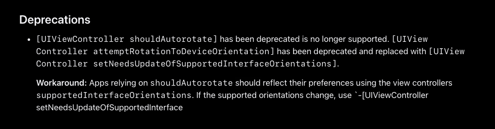
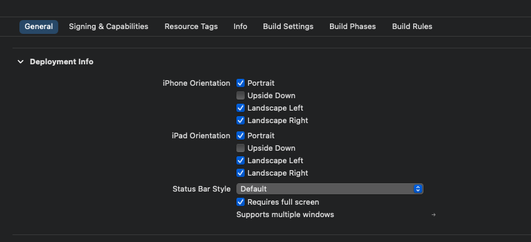
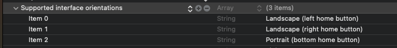

* UIDeviceOrientation

* UIInterfaceOrientation

* UIInterfaceOrientationMask

* `- (BOOL)shouldAutorotate;`

* `- (UIInterfaceOrientationMask)supportedInterfaceOrientations;`

* `- (UIInterfaceOrientation)preferredInterfaceOrientationForPresentation;`

<!-- more -->

## 基础概念

* `UIDeviceOrientation`：设备朝向

* `UIInterfaceOrientation`：页面内容朝向

* `UIInterfaceOrientationMask`：页面支持的朝向

### UIDeviceOrientation

`UIDeviceOrientation` 表示设备朝向，可以通过该方法获取：

```swift
[[UIDevice currentDevice] orientation];
```

`UIDeviceOrientation` 的取值有：

```swift
typedef NS_ENUM(NSInteger, UIDeviceOrientation) {
    UIDeviceOrientationUnknown,             // 未知，启动时会出现
    UIDeviceOrientationPortrait,            // Device oriented vertically, home button on the bottom
    UIDeviceOrientationPortraitUpsideDown,  // Device oriented vertically, home button on the top
    UIDeviceOrientationLandscapeLeft,       // Device oriented horizontally, home button on the right
    UIDeviceOrientationLandscapeRight,      // Device oriented horizontally, home button on the left
    UIDeviceOrientationFaceUp,              // Device oriented flat, face up
    UIDeviceOrientationFaceDown             // Device oriented flat, face down
} API_UNAVAILABLE(tvos);
```

### UIInterfaceOrientation

`UIInterfaceOrientation` 表示页面内容朝向。

⚠️注意：`UIInterfaceOrientation` 与 `UIDeviceOrientation` 的关系。不同枚举中的两个值可能相等：

```swift
UIInterfaceOrientationLandscapeLeft == UIDeviceOrientationLandscapeRight
```

这是因为向左旋转设备需要向右旋转内容。

`UIInterfaceOrientation` 的取值有：

```swift
// Note that UIInterfaceOrientationLandscapeLeft is equal to UIDeviceOrientationLandscapeRight (and vice versa).
// This is because rotating the device to the left requires rotating the content to the right.
typedef NS_ENUM(NSInteger, UIInterfaceOrientation) {
    UIInterfaceOrientationUnknown            = UIDeviceOrientationUnknown,
    UIInterfaceOrientationPortrait           = UIDeviceOrientationPortrait,
    UIInterfaceOrientationPortraitUpsideDown = UIDeviceOrientationPortraitUpsideDown,
    UIInterfaceOrientationLandscapeLeft      = UIDeviceOrientationLandscapeRight,
    UIInterfaceOrientationLandscapeRight     = UIDeviceOrientationLandscapeLeft
} API_UNAVAILABLE(tvos);
```

可以通过下面👇这个方法获取当前状态栏朝向：

```swift
[[UIApplication shareApplication] statusBarOrientation];
```

### UIInterfaceOrientationMask

`UIInterfaceOrientationMask` 表示页面支持的朝向。

`UIInterfaceOrientationMask` 的取值有：

```swift
typedef NS_OPTIONS(NSUInteger, UIInterfaceOrientationMask) {
    UIInterfaceOrientationMaskPortrait = (1 << UIInterfaceOrientationPortrait),
    UIInterfaceOrientationMaskLandscapeLeft = (1 << UIInterfaceOrientationLandscapeLeft),
    UIInterfaceOrientationMaskLandscapeRight = (1 << UIInterfaceOrientationLandscapeRight),
    UIInterfaceOrientationMaskPortraitUpsideDown = (1 << UIInterfaceOrientationPortraitUpsideDown),
    UIInterfaceOrientationMaskLandscape = (UIInterfaceOrientationMaskLandscapeLeft | UIInterfaceOrientationMaskLandscapeRight),
    UIInterfaceOrientationMaskAll = (UIInterfaceOrientationMaskPortrait | UIInterfaceOrientationMaskLandscapeLeft | UIInterfaceOrientationMaskLandscapeRight | UIInterfaceOrientationMaskPortraitUpsideDown),
    UIInterfaceOrientationMaskAllButUpsideDown = (UIInterfaceOrientationMaskPortrait | UIInterfaceOrientationMaskLandscapeLeft | UIInterfaceOrientationMaskLandscapeRight),
} API_UNAVAILABLE(tvos);
```

比如 `UIInterfaceOrientationMaskLandscape` 是由 `MaskLandscapeLeft` 和 `MaskLandscapeRight` 组成，是由页面内容朝向的二进制偏移组成，这样可以方便设备支持两个横屏方向。

## 横竖屏之UIViewController相关方法

* `- (BOOL)shouldAutorotate;`

* `- (UIInterfaceOrientationMask)supportedInterfaceOrientations;`

* `- (UIInterfaceOrientation)preferredInterfaceOrientationForPresentation;`

### shouldAutorotate

```swift
- (BOOL)shouldAutorotate;
```

用来返回页面是否支持自动旋转，或者说是否跟随屏幕方向进行旋转。

* 默认值是 `YES`，表示当前页面允许跟随设备旋转而自动旋转。

* iOS 16 相关改动：

  `[UIViewController should Autorotate]` 已被弃用，不再受支持。`[UIViewController attmptRotationToDeviceOrientation]` 已被弃用，并替换为 `[UIViewController setNeedsUpdateOfSupportedInterfaceOrienttions]`。  

  解决方法：依赖于 `shouldAutorotate` 的应用程序应使用支持的视图控制器 `InterfaceOrientations` 反映其首选项。**如果支持的方向更改**，请使用 `-[UIViewController setNeedsUpdateOfSupportedInterface]`

### supportedInterfaceOrientations

```swift
- (UIInterfaceOrientationMask)supportedInterfaceOrientations;
```

用来返回当前页面支持的页面朝向，可以返回四个朝向的任意组合。这个方法返回的前提是 `shouldAutorotate = YES`。

### preferredInterfaceOrientationForPresentation

```swift
- (UIInterfaceOrientation)preferredInterfaceOrientationForPresentation;
```

当页面被 **present** 出来的时候，返回该页面支持的朝向。可以返回四个朝向的任意组合。如果没有返回，则 **present** 时和原来页面的方向保持一致。

## 横竖屏之APPDelegate相关方法

* 方法一

在 XCode 的工程设置的 `General` 里，设置 iPhone 和 iPad 的页面朝向支持。



这种修改配置的方式其实就是修改 info.plist 文件，所以可以直接修改 info.plist 文件👇。

* 方法二



* 方法三  

这个方法实现在 APPDelegate 里，**根据需要返回当前 window 是否支持横屏**，优先级最高：

```swift
// AppDelegate.m 文件

- (UIInterfaceOrientationMask)application:(UIApplication *)application supportedInterfaceOrientationsForWindow:(UIWindow *)window {
    return UIInterfaceOrientationMaskAll;
}
```

该方法等效于 XCode 工程设置里的页面朝向支持，但是更灵活。

📢注意：以下内容都是基于设置了 `UIInterfaceOrientationMaskAll` 的情况下实现的，如果有其它情况会单独作补充。

## 自动旋转

关闭方向锁定，让屏幕随重力感应旋转。

* 自动旋转  
  指的是旋转设备时，系统会触发界面的旋转。页面设置 `shouldAutorotate = true`，当设备旋转方向后，会通过 `-supportedInterfaceOrientations` 方法，获取页面支持的方向，并更改页面朝向。

* 手动旋转  
  也可以说成主动旋转，通过调用修改设备方向的 api 来修改设备当前的朝向。如 UIViewController 的 `+attemptRotationToDeviceOrientation`，UIDievice 的 `-setOrientation:` 方法。  
  `+attemptRotationToDeviceOrientation` 是将界面朝向对齐设备朝向，是标准 api。  
  `-setOrientation:` 是调整设备朝向，是私有 api。

* iOS 16 相关改动：

 `[UIViewController should Autorotate]` 已被弃用，不再受支持。`[UIViewController attmptRotationToDeviceOrientation]` 已被弃用，并替换为 `[UIViewController setNeedsUpdateOfSupportedInterfaceOrienttions]`。  

  解决方法：依赖于 `shouldAutorotate` 的应用程序应使用支持的视图控制器 `InterfaceOrientations` 反映其首选项。**如果支持的方向更改**，请使用 `-[UIViewController setNeedsUpdateOfSupportedInterface]`

### App 自动旋转触发流程

当手机的重力感应打开的时候，旋转手机，系统会触发 UIDeviceOrientationDidChangeNotification 事件，同时读取 plist 文件中的支持朝向。

如果在 AppDelegate 中重写了下面这个方法👇，那么会以重写这个方法的返回值为准。

```swift
- (UIInterfaceOrientationMask)application:(UIApplication *)application supportedInterfaceOrientationsForWindow:(UIWindow *)window
```

然后会判断当前的 ViewController 是否为 AppDelegate 的 rootvc 或者 modal 的 vc，如果是则会读取该页面的以下三个属性：

```swift
// 是否支持自动旋转
- (BOOL)shouldAutorotate;

// 初始展示方向，只有modal模式下才会调用
- (UIInterfaceOrientation)preferredInterfaceOrientationForPresentation;

// 该页面支持的方向
- (UIInterfaceOrientationMask)supportedInterfaceOrientations;
```

系统会根据 `-preferredInterfaceOrientationForPresentation` 方法返回的结果展示初始视图。  

📢注意：在 `- (BOOL)shouldAutorotate;` 返回 `YES` 时，系统会调用该页面的 `supportedInterfaceOrientations` 方法获取页面朝向。该页面的 `supportedInterfaceOrientations` 返回值，必须是 plist 文件中 `supportedInterfaceOrientations` 包含的值。否则会 crash。

### App 自动旋转实现

#### 场景一

此处需要横屏的 ViewController 是 AppDelegate 的 rootVC，或者是 modal 下的 vc。

1. 先配置app支持的旋转方向，可以在 XCode 工程设置、info.plist 文件和 AppDelegate 三中方法中的任意一种。
2. 指定横屏页面重写相关方法；
  
```swift
// ViewController.m 文件

// 是否支持自动旋转
- (BOOL)shouldAutorotate{
    return YES;
}

// 初始的显示方向
- (UIInterfaceOrientation)preferredInterfaceOrientationForPresentation{
    return UIInterfaceOrientationLandscapeRight;
}

// 支持的旋转方向
- (UIInterfaceOrientationMask)supportedInterfaceOrientations{
    return UIInterfaceOrientationMaskAll; // 此处的返回值应该和infoplist文件中的值有交集，否则进入页面立马就会crash
}
```

#### 场景二

此处需要横屏的 ViewController 是被 push 过来的（非rootvc和modal下的vc）。

1. 先配置app支持的旋转方向，可以在 XCode 工程设置、info.plist 文件和 AppDelegate 三中方法中的任意一种。
2. 指定横屏页面重写相关方法；

```swift
// ViewController

- (BOOL)shouldAutorotate{
    return YES;
}

- (UIInterfaceOrientationMask)supportedInterfaceOrientations{
    return UIInterfaceOrientationMaskAll; // 此处的返回值应该和infoplist文件中的值有交集，否则进入页面立马就会crash
}
```

```swift
// UITabBarController

- (BOOL)shouldAutorotate {
    return [self.selectedViewController shouldAutorotate];
}

- (UIInterfaceOrientationMask)supportedInterfaceOrientations {
    return [self.selectedViewController supportedInterfaceOrientations];
}
```

```swift
// UINavigationController

- (BOOL)shouldAutorotate {
    return [self.topViewController shouldAutorotate];
}

- (UIInterfaceOrientationMask)supportedInterfaceOrientations {
    return [self.topViewController supportedInterfaceOrientations];
}
```

📢注意：通过 present 方式进入的页面会调用 `preferredInterfaceOrientationForPresentation` 方法，确定初始显示方向。通过 push 的方式进入的页面，不会再加载页面时调用 `preferredInterfaceOrientationForPresentation` 方法。无法实现通过 push 方式，直接进入一个横屏页面，只有触发旋转才会横屏展示，想要实现一进入页面就展示横屏，只能以 present（modal） 的形式进入。

#### 场景三

除了重写系统方法外，还可以通过 transform 的方式实现自动旋转。

1. 监听 UIDeviceOrientationDidChangeNotification 在监听回调中获取设备方向；
2. 根据设备方向对 view 做相应的 transform 操作；

## 强制横屏

强制横屏的实现方案：

1. 重写系统旋转方法；
2. 视图适配：通过 transform 修改 layer，从而在视图上实现横屏，但是此时屏幕宽度、状态栏、安全距离等都保留竖屏状态，这种方式仅仅适用于横屏弹窗等部分场景。

### 竖屏页面 present 横屏页面

1. 设置 `secondViewController` 的 `modalPresentationStyle` 为 `UIModalPresentationFullScreen`；
2. 在 `secondViewController.m` 文件，实现 `preferredInterfaceOrientationForPresentation` 方法，返回 `UIInterfaceOrientationLandscapeRight`;

```swift
// firstViewController.m 文件

- (void)present {
    UIViewController *secondViewController = [[VerticallyViewController alloc] init];
    secondViewController.modalPresentationStyle = UIModalPresentationFullScreen;
    [self presentViewController:secondViewController animated:YES completion:nil];
}
```

```swift
// secondViewController.m 文件

- (BOOL)shouldAutorotate{
    return NO;//关闭自动旋转
}

- (UIInterfaceOrientation)preferredInterfaceOrientationForPresentation{
    return UIInterfaceOrientationLandscapeRight;//初始化朝右边显示
}
```

补充：上面的代码有可能不生效，生效的前提是设置了 App 支持横屏方向，上面已经提到过，可以在 Xcode 里设置，也可以用代码设置👇

```swift
// AppDelegate.m 文件

- (UIInterfaceOrientationMask)application:(UIApplication *)application supportedInterfaceOrientationsForWindow:(UIWindow *)window {
    return UIInterfaceOrientationMaskAll;
}
```

如果这个方法返回的是 `[self.window.rootViewController supportedInterfaceOrientations]`，则上面的“竖屏 present 横屏”方案不生效。

```swift
// AppDelegate.m 文件

- (UIInterfaceOrientationMask)application:(UIApplication *)application supportedInterfaceOrientationsForWindow:(UIWindow *)window {
    return [self.window.rootViewController supportedInterfaceOrientations];
}
```

解决方案：在通用工具的单例里添加“是否支持横屏”的属性，在需要 present 横屏前设置为 true，不 dismiss 前设置为 false，并在 AppDelegate.m 文件的方法里返回对应方向👇。

```swift
// AppDelegate.m 文件

- (UIInterfaceOrientationMask)application:(UIApplication *)application supportedInterfaceOrientationsForWindow:(UIWindow *)window {
    // present 前 true，dismiss 前 false
    if ([CommonShared share].isSupportLandscapeRight) {
        return UIInterfaceOrientationLandscapeRight
    }
    return [self.window.rootViewController supportedInterfaceOrientations];
}
```

🤔思考：  

1. 如何实现横屏转竖屏？
2. 如何实现自定义旋转效果？
3. 横屏返回竖屏需要怎么处理？

📢注意：  

1. 强制某一方向横屏只能在 modal 模式下实现，push 模式下不行。
2. 通过 runtime 调用 setOrientation 的形式是不可行的，该方法仅支持 iOS6 以下的系统：

```swift
//以下仅仅使用ios6以下的设备！

if ([[UIDevice currentDevice] respondsToSelector:@selector(setOrientation:)]) {
    SEL selector = NSSelectorFromString(@"setOrientation:");
    NSInvocation *invocation = [NSInvocation invocationWithMethodSignature:[UIDevice instanceMethodSignatureForSelector:selector]];
    [invocation setSelector:selector];
    [invocation setTarget:[UIDevice currentDevice]];
    int val = UIInterfaceOrientationLandscapeRight;
    [invocation setArgument:&val atIndex:2];
    [invocation invoke];
}
```

### 竖屏页面 push 横屏页面

#### 方法一

```swift
// AppDelegate.m 文件

- (UIInterfaceOrientationMask)application:(UIApplication *)application supportedInterfaceOrientationsForWindow:(UIWindow *)window {
    if ([self.navigationVC.topViewController isKindOfClass:secondViewController.class]) {
        return UIInterfaceOrientationMaskLandscapeRight;
    }
    else {
        return UIInterfaceOrientationMaskPortrait;
    }
}
```

```swift
// secondViewController.m 文件
- (void)viewDidLoad {
    NSInvocation *invocation = [NSInvocation invocationWithMethodSignature:[UIDevice instanceMethodSignatureForSelector:@selector(setOrientation:)]];
    invocation.selector = NSSelectorFromString(@"setOrientation:");
    invocation.target = [UIDevice currentDevice];
    int initOrientation = UIDeviceOrientationLandscapeRight;
    [invocation setArgument:&initOrientation atIndex:2];
    [invocation invoke];
}
```

🤔思考：

1. 这里为什么没有用到 `UIViewController` 的三个方法？
2. 在 viewDidLoad 方法内部调用的旋转方法是什么意思？

#### 方法二

1. `UINavigationController` 内部实现相关方法，包括 `- (BOOL)shouldAutorotate;` 和 `- (UIInterfaceOrientationMask)supportedInterfaceOrientations;`
2. `secondViewController` 内部实现相关方法，包括 `- (BOOL)shouldAutorotate;` 和 `- (UIInterfaceOrientationMask)supportedInterfaceOrientations;`
3. `secondViewController` 主动旋转设备方向。

```swift
// UITabbarViewController.m 文件

- (BOOL)shouldAutorotate {
    return [self.selectedViewController shouldAutorotate];
}

- (UIInterfaceOrientationMask)supportedInterfaceOrientations {
    return [self.selectedViewController supportedInterfaceOrientations];
}
```

```swift
// UINavigationController.m 文件

- (BOOL)shouldAutorotate {
    return [self.topViewController shouldAutorotate];
}

- (UIInterfaceOrientationMask)supportedInterfaceOrientations {
    return [self.topViewController supportedInterfaceOrientations];
}
```

```swift
// secondViewController.m 文件

- (BOOL)shouldAutorotate {
    return YES;
}

- (UIInterfaceOrientationMask)supportedInterfaceOrientations {
    return UIInterfaceOrientationMaskLandscape; //⚠️此处的返回值应该和infoplist文件中的值有交集，否则旋转手机就会触发调用该方法，然后crash
}

- (void)viewDidLoad {
    if ([[UIDevice currentDevice] orientation] == UIDeviceOrientationLandscapeRight) {
        [self swichToNewOrientation:UIDeviceOrientationLandscapeRight];
    } else {
        [self swichToNewOrientation:UIDeviceOrientationLandscapeLeft];
    }
}

/// 调整设备方向
- (void)swichToNewOrientation:(UIDeviceOrientation)orientation {
    [[UIDevice currentDevice] setValue:@(UIDeviceOrientationUnknown) forKey:@"orientation"];
    [[UIDevice currentDevice] setValue:@(orientation) forKey:@"orientation"];
}
```

### view 的 transform

该方法是将 view 进行一个90度的旋转，不改变系统的显示方向。

```swift
- (void)viewDidLoad {
    [super viewDidLoad];
    
    //改变当前视图bounds的宽高
    self.view.bounds = CGRectMake(0, 0, [UIScreen mainScreen].bounds.size.height, [UIScreen mainScreen].bounds.size.width);
    //对当前视图做90度旋转
    [UIView animateWithDuration:0.2 animations:^{
        self.view.transform = CGAffineTransformMakeRotation(M_PI_2);
    }];
}

- (void)viewWillAppear:(BOOL)animated {
    [super viewWillAppear:animated];

    //隐藏状态栏
    [[UIApplication sharedApplication] setStatusBarHidden:YES];
}

- (void)viewWillDisappear:(BOOL)animated {
    [super viewWillDisappear:animated];

    //恢复状态栏
    [[UIApplication sharedApplication] setStatusBarHidden:NO];
}
```

📢注意：在全面屏手机中，可以通过 `self.view.safeAreaInsets` 获取到安全区域。竖屏状态下获取安全区域是 `(40, 0, 34, 0)`，横屏状态下获取安全区域是 `(0, 44, 0, 34)`。因为通过 transform 方式旋转 view，系统方向还是竖屏状态，所以获取到的安全区域不对。

自定义根据指定方向获取安全区域的方法：

```swift
/**
 获取屏幕的安全区域
 @param orientation 显示方向（是显示方向，非设备方向）
 */
+ (CGRect)getSafeAreaWithOrientation:(UIInterfaceOrientation)orientation {
    CGRect safeRect = kScreen_Bounds;
    UIEdgeInsets insets = UIEdgeInsetsZero;
#if __IPHONE_OS_VERSION_MAX_ALLOWED >= 110000
    //xcode baseSDK为11.0或者以上
    if (@available(iOS 11.0, *)) {
        insets = [UIApplication sharedApplication].keyWindow.safeAreaInsets;
    }
#endif
    if (orientation == UIInterfaceOrientationLandscapeLeft) {
        safeRect = CGRectMake(safeRect.origin.x, safeRect.origin.y, safeRect.size.height, safeRect.size.width);
        insets = UIEdgeInsetsMake(insets.left, insets.bottom, insets.right, insets.top);
    } else if (orientation == UIInterfaceOrientationLandscapeRight){
        safeRect = CGRectMake(safeRect.origin.x, safeRect.origin.y, safeRect.size.height, safeRect.size.width);
        insets = UIEdgeInsetsMake(insets.right, insets.top, insets.left, insets.bottom);
    } else if (orientation == UIInterfaceOrientationPortraitUpsideDown){
        insets = UIEdgeInsetsMake(insets.bottom, insets.right, insets.top, insets.left);
    }
    safeRect = UIEdgeInsetsInsetRect(safeRect, insets);
    return safeRect;
}
```

### AFPlayer

关于 transform 的使用，[ZFPlayer](https://github.com/renzifeng/ZFPlayer) 中有相关应用。

AFPlayer 支持小屏竖屏、大屏横屏状态，分别针对iOS15和iOS16做了对应的横屏方案。不支持小屏横屏状态。

iOS15

小屏 -> 大屏

1. 自定义 `ZFLandscapeWindow`，设置更控制器 `ZFLandscapeViewController_iOS15`，控制器中自定义一个 `playerSuperview`（`UIView`）；
2. 全屏时，修改设备方向为横向；
3. 设备方向改变时，触发`viewWillTransitionToSize:withTransitionCoordinator:`方法，将播放器添加到 `playerSuperview` 上，设置 playerSuperview、播放器 的大小为横屏大小；

大屏 -> 小屏

1. 修改设备方向为竖向；
2. 设备方向改变时，触发`viewWillTransitionToSize:withTransitionCoordinator:`方法，将播放器添加到 `containerView` 上，`containerView` 是开发者创建播放器时的容器view，设置播放器的大小。

iOS 16

小屏 -> 大屏

1. 自定义 `ZFLandscapeWindow`，设置更控制器 `ZFLandscapeViewController`；
2. 全屏时，修改设备方向为横向；
3. 设备方向改变时，触发`viewWillTransitionToSize:withTransitionCoordinator:`方法，将播放器添加到 `ZFLandscapeWindow.view` 上
4. 旋转播放器为横向，设置播放器坐标为对应 Window 上的frame
5. 调用`setNeedsUpdateOfSupportedInterfaceOrientations`重新设置内容方向，将播放器添加到 `ZFLandscapeViewController.view` 上，设置播放器大小为横屏大小

大屏 -> 小屏

1. 修改设备方向为竖向；
2. 设备方向改变时，触发`viewWillTransitionToSize:withTransitionCoordinator:`方法，将播放器添加到 `ZFLandscapeWindow.view` 上
3. 旋转播放器为横向，设置播放器坐标为对应 Window 上的frame
4. 将播放器添加到 `containerView` 上，`containerView` 是开发者创建播放器时的容器view，设置播放器的大小。

## 横竖屏切换机制分析

1. 工程配置文件没有设置支持横屏，为什么可以 push 出横屏页面？
2. 工程配置、`APPDelegate` 和 `UIViewController`，在横竖屏切换过程的关系是什么？
3. 自动旋转和手动旋转有什么区别？

### 系统如何知道 APP 对页面朝向的支持

* APP 启动前
  在 APP 启动前进程还未加载，代码无法运行，系统无法通过 `AppDelegate` 或者 `UIViewController` 这种代码的方式获取横竖屏的配置。所以，在这种情况下，工程配置中的 plist 文件中的横竖屏配置，可以帮助系统识别应该以什么样的朝向启动 APP。  
  在 plist 文件中增加横屏的支持，优点是开屏能够支持横屏，这样界面展示更加顺滑。缺点是开屏支持了横屏，导致启动的时候是横屏，但是 `[UIScreen mainScreen]` 是横屏的大小，很多业务代码在通过 `[UIScreen mainScreen]` 方法去获取屏幕的宽高时，会取到错误的值。

* APP 运行时  
  当 APP 进程加载完成，此时系统可以通过运行时询问的方式，来动态获取不同时机的界面朝向。  
  此时 APPDelegate 控制的事 UIWindow 层面的朝向，UIViewController 控制的是 ViewController 层级的朝向。需要注意的是，当我们返回 UIViewController 的朝向时，还要考虑父容器的朝向。通常一个 App 的界面层级是 UIWindow → RootViewController（父） → ViewController（子）。只在 UIWindow 返回界面朝向也是允许的，如上面的**竖屏页面 push 横屏页面**👆。

### 朝向冲突

在每次界面切换的时候，系统都会回调新的界面朝向，最终结果取 UIWindow 朝向、RootViewController 朝向、ViewController 朝向**三者的与**值。

如果 UIWindow 返回竖屏，RootViewController 和 ViewController 返回横屏，横屏不会生效。同样的，如果 UIWindow 返回横屏，RootViewController 和 ViewController 返回竖屏，竖屏不会生效。

朝向优先级：**UIWindow 朝向 > RootViewController 朝向 > ViewController 朝向**。

在界面切换的过程中，如果没有返回朝向值或朝向值未确定，系统更倾向于保持当前朝向不变。

## 横竖屏切换通知

NSNotification通知

```swift
[[NSNotificationCenter defaultCenter] addObserverForName:UIDeviceOrientationDidChangeNotification object:nil queue:nil usingBlock:^(NSNotification * _Nonnull note) {
    NSLog(@"NSNotification:%@, orientation:%d", note.userInfo, [(UIDevice *)note.object orientation]);
}];
```

UIViewController回调

```swift
- (void)viewWillTransitionToSize:(CGSize)size withTransitionCoordinator:(id <UIViewControllerTransitionCoordinator>)coordinator API_AVAILABLE(ios(8.0));
```

参考博文：  
[iOS横屏的深入研究](https://www.jianshu.com/p/7108620fee35)
[iOS横竖屏切换](https://www.jianshu.com/p/9eb26580950e)
