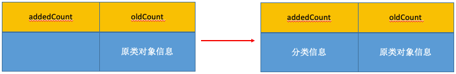
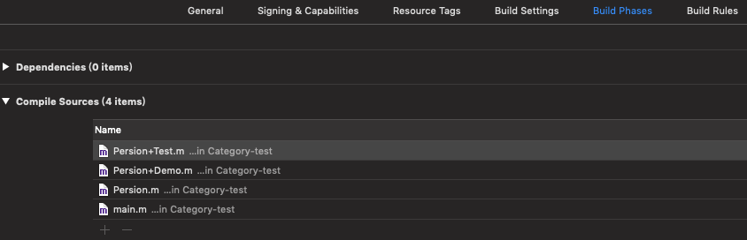
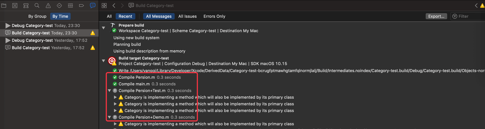

思考：
* Category 和 Class Extension 的区别是什么？
* Category 的实现原理  

<!-- more -->

# Category 的底层结构

* Category 在编译完成后就变成了一个 _category_t 结构体，里面存储这分类的所有信息。
* 在程序运行时通过 Runtime 加载所有 _category_t 的数据，把所有 _category_t 的数据（方法、属性、协议）合并到一个大数组中。
* 合并时先扩充内存，然后将类对象里面的原有数据向后移动，再将分类数据（方法、属性、协议）插入到前排。
* 靠后被编译到的 _category_t 数据（方法、属性、协议），因为在这个大数组的前排，所以会被优先调用到。  

## 定义 Persion+Test
```
@interface Persion (Test)
- (void)run;
- (void)test;
+ (void)test2;
@end

@implementation Persion (Test)
- (void)run
{
    NSLog(@"Person (Test) - run");
}
- (void)test
{
    NSLog(@"test");
}
+ (void)test2
{
    
}
@end
```

## Persion+Test.cpp
将 OC 代码转换为 C\C++ 代码，并在生成的 C/C++ 代码中找到 Persion+Test 的实现：
```
//_category_t 结构体
struct _category_t {
	const char *name; //类名
	struct _class_t *cls; //父类
	const struct _method_list_t *instance_methods; //对象方法列表
	const struct _method_list_t *class_methods; //类方法列表
	const struct _protocol_list_t *protocols; //协议列表
	const struct _prop_list_t *properties; //属性列表
};
extern "C" __declspec(dllimport) struct objc_cache _objc_empty_cache;
#pragma warning(disable:4273)

//Category 类对象的对象方法列表
static struct /*_method_list_t*/ {
	unsigned int entsize;  // sizeof(struct _objc_method)
	unsigned int method_count;
	struct _objc_method method_list[2];
} _OBJC_$_CATEGORY_INSTANCE_METHODS_Persion_$_Test __attribute__ ((used, section ("__DATA,__objc_const"))) = {
	sizeof(_objc_method),
	2,
	{{(struct objc_selector *)"run", "v16@0:8", (void *)_I_Persion_Test_run},
	{(struct objc_selector *)"test", "v16@0:8", (void *)_I_Persion_Test_test}}
};

//Category 类对象的类方法列表
static struct /*_method_list_t*/ {
	unsigned int entsize;  // sizeof(struct _objc_method)
	unsigned int method_count;
	struct _objc_method method_list[1];
} _OBJC_$_CATEGORY_CLASS_METHODS_Persion_$_Test __attribute__ ((used, section ("__DATA,__objc_const"))) = {
	sizeof(_objc_method),
	1,
	{{(struct objc_selector *)"test2", "v16@0:8", (void *)_C_Persion_Test_test2}}
};

extern "C" __declspec(dllimport) struct _class_t OBJC_CLASS_$_Persion;

//Persion+Test 分类的结构体
static struct _category_t _OBJC_$_CATEGORY_Persion_$_Test __attribute__ ((used, section ("__DATA,__objc_const"))) = 
{
	"Persion", //类名
	0, // &OBJC_CLASS_$_Persion,
	(const struct _method_list_t *)&_OBJC_$_CATEGORY_INSTANCE_METHODS_Persion_$_Test, //对象方法列表
	(const struct _method_list_t *)&_OBJC_$_CATEGORY_CLASS_METHODS_Persion_$_Test, //类方法列表
	0, //协议列表
	0, //属性列表
};
static void OBJC_CATEGORY_SETUP_$_Persion_$_Test(void ) {
	_OBJC_$_CATEGORY_Persion_$_Test.cls = &OBJC_CLASS_$_Persion;
}
#pragma section(".objc_inithooks$B", long, read, write)
__declspec(allocate(".objc_inithooks$B")) static void *OBJC_CATEGORY_SETUP[] = {
	(void *)&OBJC_CATEGORY_SETUP_$_Persion_$_Test,
};
static struct _category_t *L_OBJC_LABEL_CATEGORY_$ [1] __attribute__((used, section ("__DATA, __objc_catlist,regular,no_dead_strip")))= {
	&_OBJC_$_CATEGORY_Persion_$_Test,
};
static struct IMAGE_INFO { unsigned version; unsigned flag; } _OBJC_IMAGE_INFO = { 0, 2 };
```

# Category 的加载处理过程

## objc4 源码解读过程
* objc-os.mm  
_objc_init  
map_images  
map_images_nolock

* objc-runtime-new.mm  
_read_images  
remethodizeClass  
attachCategories  
attachLists  
realloc、memmove、 memcpy

打开 runtime 源码 [objc4-781](https://opensource.apple.com/tarballs/objc4/)。找到运行时入口 objc-os.mm 文件，打开文件找到运行时的初始化方法 `void _objc_init(void)` 方法：

### _objc_init
```
void _objc_init(void)
{
    static bool initialized = false;
    if (initialized) return;
    initialized = true;
    
    // fixme defer initialization until an objc-using image is found?
    environ_init(); //设置系统的环境变量
    tls_init(); //线程相关的处理
    static_init(); //运行C++静态构造函数
    runtime_init();
    exception_init(); //注册异常的回调
    cache_init();
    _imp_implementationWithBlock_init();

    _dyld_objc_notify_register(&map_images, load_images, unmap_image); //调用dyld的函数注册一个回调，并执行回调函数。

#if __OBJC2__
    didCallDyldNotifyRegister = true;
#endif
}
```

#### map_images
Jump To Definition -> map_images:
```
void
map_images(unsigned count, const char * const paths[],
           const struct mach_header * const mhdrs[])
{
    mutex_locker_t lock(runtimeLock);
    return map_images_nolock(count, paths, mhdrs);
}
```
map_images 方法的主要作用是处理由dyld映射的镜像文件.  

#### map_images_nolock
Jump To Definition -> map_images_nolock：
```
void 
map_images_nolock(unsigned mhCount, const char * const mhPaths[],
                  const struct mach_header * const mhdrs[])
{
    ...
	...
	...//一堆方法

    if (hCount > 0) {
        _read_images(hList, hCount, totalClasses, unoptimizedTotalClasses);
    }

    firstTime = NO;
    
    // Call image load funcs after everything is set up.
    for (auto func : loadImageFuncs) {
        for (uint32_t i = 0; i < mhCount; i++) {
            func(mhdrs[i]);
        }
    }
}
```

_read_images：images 是模块/镜像的意思。该方法是读取模块用的，比如读取类信息、分类信息等。  

### _read_images
Jump To Definition -> _read_images：
```
void _read_images(header_info **hList, uint32_t hCount, int totalClasses, int unoptimizedTotalClasses)
{
    ...
	...
	...//一堆方法

    // Category discovery MUST BE Late to avoid potential races
    // when other threads call the new category code before
    // this thread finishes its fixups.

    // +load handled by prepare_load_methods()

    // Realize non-lazy classes (for +load methods and static instances)
    for (EACH_HEADER) {
        classref_t const *classlist = 
            _getObjc2NonlazyClassList(hi, &count); // 获取分类数组
        for (i = 0; i < count; i++) {
            Class cls = remapClass(classlist[i]); //通过 remapClass 获取类对应的指针
            if (!cls) continue;

            addClassTableEntry(cls);

            if (cls->isSwiftStable()) {
                if (cls->swiftMetadataInitializer()) {
                    _objc_fatal("Swift class %s with a metadata initializer "
                                "is not allowed to be non-lazy",
                                cls->nameForLogging());
                }
                // fixme also disallow relocatable classes
                // We can't disallow all Swift classes because of
                // classes like Swift.__EmptyArrayStorage
            }
            realizeClassWithoutSwift(cls, nil);
        }
    }
	
	...
	...
	...//一堆方法
}
```

上面👆代码是 _read_images 处理 Category 的核心代码，首先通过 _getObjc2NonlazyClassList 方法获取 Category 数组，遍历 Category 数组通过 remapClass 获取分类对应的指针，作为参数调用 realizeClassWithoutSwift 方法。

#### realizeClassWithoutSwift
Jump To Definition -> realizeClassWithoutSwift：
```
static Class realizeClassWithoutSwift(Class cls, Class previously)
{
	...
	...
	...//一堆方法

    // Attach categories
    methodizeClass(cls, previously);

    return cls;
}
```

realizeClassWithoutSwift 方法内部进过一顿骚操作，最后调用 methodizeClass 方法开始加载分类信息。

Attach categories：将分类信息附加到类对象里。  

#### methodizeClass
Jump To Definition -> methodizeClass：
```
static void methodizeClass(Class cls, Class previously)
{
    runtimeLock.assertLocked();

    bool isMeta = cls->isMetaClass(); //是否是元类对象
    auto rw = cls->data();
    auto ro = rw->ro();
    auto rwe = rw->ext();

    // Methodizing for the first time
    if (PrintConnecting) {
        _objc_inform("CLASS: methodizing class '%s' %s", 
                     cls->nameForLogging(), isMeta ? "(meta)" : "");
    }

    // Install methods and properties that the class implements itself.
    // 方法数组
    method_list_t *list = ro->baseMethods();
    if (list) {
        prepareMethodLists(cls, &list, 1, YES, isBundleClass(cls));
        if (rwe) rwe->methods.attachLists(&list, 1);
    }
    
    // 属性数组
    property_list_t *proplist = ro->baseProperties;
    if (rwe && proplist) {
        rwe->properties.attachLists(&proplist, 1);
    }
    
    // 协议数组
    protocol_list_t *protolist = ro->baseProtocols;
    if (rwe && protolist) {
        rwe->protocols.attachLists(&protolist, 1);
    }

    // Root classes get bonus method implementations if they don't have 
    // them already. These apply before category replacements.
    if (cls->isRootMetaclass()) {
        // root metaclass
        addMethod(cls, @selector(initialize), (IMP)&objc_noop_imp, "", NO);
    }
    
    // 添加分类方法、属性、协议数据
    // Attach categories.
    if (previously) {
        if (isMeta) {
            objc::unattachedCategories.attachToClass(cls, previously,
                                                     ATTACH_METACLASS);
        } else {
            // When a class relocates, categories with class methods
            // may be registered on the class itself rather than on
            // the metaclass. Tell attachToClass to look for those.
            objc::unattachedCategories.attachToClass(cls, previously,
                                                     ATTACH_CLASS_AND_METACLASS);
        }
    }
    objc::unattachedCategories.attachToClass(cls, cls,
                                             isMeta ? ATTACH_METACLASS : ATTACH_CLASS);

#if DEBUG
    // Debug: sanity-check all SELs; log method list contents
    for (const auto& meth : rw->methods()) {
        if (PrintConnecting) {
            _objc_inform("METHOD %c[%s %s]", isMeta ? '+' : '-', 
                         cls->nameForLogging(), sel_getName(meth.name));
        }
        ASSERT(sel_registerName(sel_getName(meth.name)) == meth.name); 
    }
#endif
}
```
Install methods and properties that the class implements itself. 可以看出该方法是在加载类对象自己内部的信息。分别针对方法数组、属性数组和协议数组调用 attachLists 方法，将信息添加到类对象里。

#### attachToClass
Jump To Definition -> attachToClass:
```
void attachToClass(Class cls, Class previously, int flags)
    {
        runtimeLock.assertLocked();
        ASSERT((flags & ATTACH_CLASS) ||
               (flags & ATTACH_METACLASS) ||
               (flags & ATTACH_CLASS_AND_METACLASS));

        auto &map = get();
        auto it = map.find(previously);

        if (it != map.end()) {
            category_list &list = it->second;
            if (flags & ATTACH_CLASS_AND_METACLASS) {
                int otherFlags = flags & ~ATTACH_CLASS_AND_METACLASS;
                attachCategories(cls, list.array(), list.count(), otherFlags | ATTACH_CLASS);
                attachCategories(cls->ISA(), list.array(), list.count(), otherFlags | ATTACH_METACLASS);
            } else {
                attachCategories(cls, list.array(), list.count(), flags);
            }
            map.erase(it);
        }
    }
```

#### attachCategories
Jump To Definition -> attachCategories:
```
static void
attachCategories(Class cls, const locstamped_category_t *cats_list, uint32_t cats_count,
                 int flags)
{
    if (slowpath(PrintReplacedMethods)) {
        printReplacements(cls, cats_list, cats_count);
    }
    if (slowpath(PrintConnecting)) {
        _objc_inform("CLASS: attaching %d categories to%s class '%s'%s",
                     cats_count, (flags & ATTACH_EXISTING) ? " existing" : "",
                     cls->nameForLogging(), (flags & ATTACH_METACLASS) ? " (meta)" : "");
    }

    /*
     * Only a few classes have more than 64 categories during launch.
     * This uses a little stack, and avoids malloc.
     *
     * Categories must be added in the proper order, which is back
     * to front. To do that with the chunking, we iterate cats_list
     * from front to back, build up the local buffers backwards,
     * and call attachLists on the chunks. attachLists prepends the
     * lists, so the final result is in the expected order.
     */
    constexpr uint32_t ATTACH_BUFSIZ = 64;
    method_list_t   *mlists[ATTACH_BUFSIZ];
    property_list_t *proplists[ATTACH_BUFSIZ];
    protocol_list_t *protolists[ATTACH_BUFSIZ];

    uint32_t mcount = 0;
    uint32_t propcount = 0;
    uint32_t protocount = 0;
    bool fromBundle = NO;
    bool isMeta = (flags & ATTACH_METACLASS);
    auto rwe = cls->data()->extAllocIfNeeded();

    for (uint32_t i = 0; i < cats_count; i++) {
        
        // 取出某个分类 entry 是 category_t 类型
        auto& entry = cats_list[i];
        
        // 方法数组
        method_list_t *mlist = entry.cat->methodsForMeta(isMeta);
        if (mlist) {
            if (mcount == ATTACH_BUFSIZ) {
                prepareMethodLists(cls, mlists, mcount, NO, fromBundle);
                rwe->methods.attachLists(mlists, mcount);
                mcount = 0;
            }
            mlists[ATTACH_BUFSIZ - ++mcount] = mlist;
            fromBundle |= entry.hi->isBundle();
        }
        
        // 属性数组
        property_list_t *proplist =
            entry.cat->propertiesForMeta(isMeta, entry.hi);
        if (proplist) {
            if (propcount == ATTACH_BUFSIZ) {
                rwe->properties.attachLists(proplists, propcount);
                propcount = 0;
            }
            proplists[ATTACH_BUFSIZ - ++propcount] = proplist;
        }
        
        // 协议数组
        protocol_list_t *protolist = entry.cat->protocolsForMeta(isMeta);
        if (protolist) {
            if (protocount == ATTACH_BUFSIZ) {
                rwe->protocols.attachLists(protolists, protocount);
                protocount = 0;
            }
            protolists[ATTACH_BUFSIZ - ++protocount] = protolist;
        }
    }

    if (mcount > 0) {
        prepareMethodLists(cls, mlists + ATTACH_BUFSIZ - mcount, mcount, NO, fromBundle);
        rwe->methods.attachLists(mlists + ATTACH_BUFSIZ - mcount, mcount);
        if (flags & ATTACH_EXISTING) flushCaches(cls);
    }

    rwe->properties.attachLists(proplists + ATTACH_BUFSIZ - propcount, propcount);

    rwe->protocols.attachLists(protolists + ATTACH_BUFSIZ - protocount, protocount);
}
```

分别针对方法数组、属性数组和协议数组调用 attachLists 方法，将分类信息添加到原类对象里。

#### attachLists
Jump To Definition -> attachLists:
```
void attachLists(List* const * addedLists, uint32_t addedCount) {
        if (addedCount == 0) return;

        if (hasArray()) {
            // many lists -> many lists
            uint32_t oldCount = array()->count; // 原内存空间大小
            uint32_t newCount = oldCount + addedCount; // 新内存空间大小
            setArray((array_t *)realloc(array(), array_t::byteSize(newCount))); // 重新分配内存空间
            array()->count = newCount;
            memmove(array()->lists + addedCount, array()->lists, 
                    oldCount * sizeof(array()->lists[0])); // 调整内存格式
            memcpy(array()->lists, addedLists, 
                   addedCount * sizeof(array()->lists[0])); // 拷贝分类信息
        }
        else if (!list  &&  addedCount == 1) {
            // 0 lists -> 1 list
            list = addedLists[0];
        } 
        else {
            // 1 list -> many lists
            List* oldList = list;
            uint32_t oldCount = oldList ? 1 : 0;
            uint32_t newCount = oldCount + addedCount;
            setArray((array_t *)malloc(array_t::byteSize(newCount)));
            array()->count = newCount;
            if (oldList) array()->lists[addedCount] = oldList;
            memcpy(array()->lists, addedLists, 
                   addedCount * sizeof(array()->lists[0]));
        }
    }
```

#### realloc、memmove、memcpy
attachLists 方法内部
1.通过参数 addedCount 确定需要增加的内存空间 newCount，然后通过 realloc 方法重新分配空间。  
2.空间增加后，通过 memmove 方法将类对象里的信息往后移动 addedCount 距离，把前排 addedCount 大小的空间空出来留给将要添加进来的分类信息。  


3.类对象的前排空间空出来后，再通过 memcpy 方法将分类信息拷贝到该空间里。


## Category 的编译顺序
原文件 Persion.m 最先编译，之后添加的分类按照添加顺序，优先编译后来添加的分类。添加顺序：


如图编译顺序按照 Compile Sources 里的顺序，为 Persion.m -> Persion+Test.m -> Persion+Demo.m。如果 Persion.m、Persion+Test.m、Persion+Demo.m 中有相同的方法，后编译的类中的方法会优先于先编译的类中的方法（不是覆盖，只是优先被查询到）。

调用日志：


可以看到 Persion.m 被优先编译，其次是后来添加的 Persion+Test.m，第三个编译的是 最后添加的 Persion+Demo.m。添加顺序决定编译顺序只对分类有效，Persion.m 一定是最先编译的，这一点通过 methodizeClass 方法也能看出来，先处理类对象，再处理分类。

# Class Extension 的实现原理

## 定义 Persion()
```
@interface Persion : NSObject
@property (nonatomic, copy) NSString *categoryTest1;
- (void)run;
- (void)test;
+ (void)test2;
@end

@interface Persion()
@property (nonatomic, copy) NSString *categoryTest2;
@end

@implementation Persion
- (void)run
{
    NSLog(@"Person - run");
}
- (void)test
{
    NSLog(@"test");
}
+ (void)test2
{
    
}
@end
```

将 OC 代码转换为 C\C++ 代码，并在生成的 C/C++ 代码中找到 Persion 的实现：
```
extern "C" unsigned long OBJC_IVAR_$_Persion$_categoryTest1;
extern "C" unsigned long OBJC_IVAR_$_Persion$_categoryTest2;
struct Persion_IMPL {
	struct NSObject_IMPL NSObject_IVARS;
	NSString * _Nonnull _categoryTest1;
	NSString *_categoryTest2;
};
```

上面👆这块代码可以看到，在 Persion() 中定义的 categoryTest2 已经包含在类 Persion 类对象的结构体里面了。可以证明 Class Extension 在编译的时候，它的数据就已经包含在类信息中了。从实现上来看，Class Extension 不应该叫做匿名分类，叫类扩展更适合。

## 小结
* 运行时入口 objc-os.mm，初始化方法 void _objc_init(void) 方法。
* objc4 的代码虽然改了，但是实现原理还是没变。

# 总结
* Category 的实现原理  
Category 编译之后的底层结构是 struct category_t，里面存储着分类的对象方法、类方法、属性、协议信息，在程序运行的时候，runtime 会将 Category 的数据，合并到类信息中（类对象、元类对象中）。
* Category 和 Class Extension 的区别是什么？  
Class Extension 在编译的时候，它的数据就已经包含在类信息中。Category 是在运行时，才会将数据合并到类信息中。
