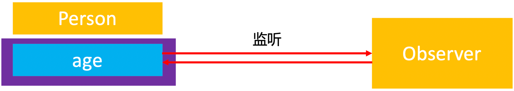

KVO的全称是Key-Value Observing，俗称“键值监听”，可以用于监听某个对象属性值的改变。


<!-- more -->

# KVO 监听
定义 Person、Observer
```
@interface Cat : NSObject
@property (assign, nonatomic) int weight;
@end

@interface Person : NSObject
@property (assign, nonatomic) int age;
@property (assign, nonatomic) Cat *cat;
@end

@implementation Person
- (void)setAge:(int)age
{
    _age = age;
    NSLog(@"setAge: - %d", age);
}
@end

@interface Observer : NSObject
@end

@implementation Observer
- (void)observeValueForKeyPath:(NSString *)keyPath ofObject:(id)object change:(NSDictionary<NSKeyValueChangeKey,id> *)change context:(void *)context
{
    NSLog(@"observeValueForKeyPath - %@", change);
}
@end

int main(int argc, const char * argv[]) {
    @autoreleasepool {
        Observer *observer = [[Observer alloc] init];
        Person *person1 = [[Person alloc] init];
        Person *person2 = [[Person alloc] init];
        
        [person1 addObserver:observer forKeyPath:@"age" options:NSKeyValueObservingOptionNew | NSKeyValueObservingOptionOld context:NULL];
        
        [person1 setAge:10];
        [person2 setAge:20];

        [person1 removeObserver:observer forKeyPath:@"age"];
    }
    return 0;
}
```

打印结果：
```
observeValueForKeyPath - {
    kind = 1;
    new = 10;
    old = 0;
}
```

person2 和 person1 拥有同一个类对象，修改属性 age 时调用的都是对象方法 -(void)setAge。

## 未使用 KVO 监听的对象

* 思考：person2 修改 age 时为什么在 Observer 里没有打印？  

因为 person2 没有使用 KVO 监听，修改属性 age 时调用的是 Person 类对象里的对象方法 -(void)setAge，所以在 Observer 里没有打印。


## 使用了 KVO 监听的对象

打印 person1、person2 类对象：
```
NSLog(@"person1添加KVO之前 - %@", object_getClass(person1));
NSLog(@"person1添加KVO之前 - %@", object_getClass(person2));

[person1 addObserver:observer forKeyPath:@"age" options:NSKeyValueObservingOptionNew | NSKeyValueObservingOptionOld context:NULL];
        
NSLog(@"person1添加KVO之后 - %@", object_getClass(person1));
NSLog(@"person1添加KVO之后 - %@", object_getClass(person2));
```

打印结果：
```
person1添加KVO之前 - Person
person1添加KVO之前 - Person
person1添加KVO之后 - NSKVONotifying_Person
person1添加KVO之后 - Person
```

从打印结果看出，因为 person1 使用了 KVO 监听，所以系统通过 runtime 生成了一个NSKVONotifying_Person 对象，所以 person1 修改属性 age 时调用的是 生成了一个NSKVONotifying_Person 类对象里的对象方法 -(void)setAge。  

### NSKVONotifying_Person 类对象


打印对象方法 -(void)setAge 的地址：
```
NSLog(@"person1添加KVO之前 - %p %p", [person methodForSelector:@selector(setAge:)], [person1 methodForSelector:@selector(setAge:)]);

[person1 addObserver:observer forKeyPath:@"age" options:NSKeyValueObservingOptionNew | NSKeyValueObservingOptionOld context:NULL];

NSLog(@"person1添加KVO之后 - %p %p", [person methodForSelector:@selector(setAge:)], [person1 methodForSelector:@selector(setAge:)]);
```

打印结果：
```
person1添加KVO之前 - 0x100001cf0 0x100001cf0
person1添加KVO之后 - 0x7fff304afa0b 0x100001cf0
```
从打印结果看出，person1 添加 KVO 监听前后，对象方法 -(void)setAge 的地址变了。

打印地址对应的方法名：
```
(lldb) p (IMP)0x100001cf0
(IMP) $0 = 0x0000000100001cf0 (Interview01-KVC`-[Person setAge:] at Person.h:16)
(lldb) p (IMP)0x7fff304afa0b
(IMP) $1 = 0x00007fff304afa0b (Foundation`_NSSetIntValueAndNotify)
```

从打印结果看出，person1 添加 KVO 监听后，修改 age 时调用的是 Foundation 框架里的  _NSSetIntValueAndNotify 方法。

### _NSSetIntValueAndNotify 方法
_NSSetIntValueAndNotify 方法实现猜想：
```
void _NSSetIntValueAndNotify 
{
    [self willChangeValueForKey:@"age"];
    [super setAge:age];
    [self didChagneValueForKey:@"age"];
}

- (void)didChagneValueForKey:(NSString *)key
{
    // 通知监听器，某属性值发生了改变
    [observer observeValueForKeyPath:key ofObject:nil change:nil context:nil];
}
```

### NSKVONotifying_Person 元类对象
打印 person1 的元类对象：
```
NSLog(@"person1添加KVO之后，类对象 - %@, %@", object_getClass(person1), object_getClass(person2));
NSLog(@"person1添加KVO之后，元类对象 - %@, %@", object_getClass(object_getClass(person1)), object_getClass(object_getClass(person2)));
```

打印结果：
```
person1添加KVO之后，类对象 - NSKVONotifying_Person, Person
person1添加KVO之后，元类对象 - NSKVONotifying_Person, Person
```

NSKVONotifying_Person 类对象的 isa 指针指向的是 NSKVONotifying_Person 元类对象。
