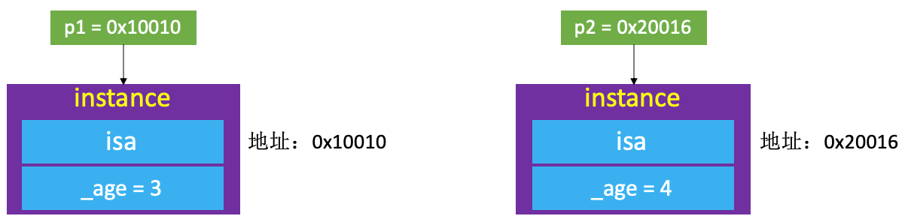
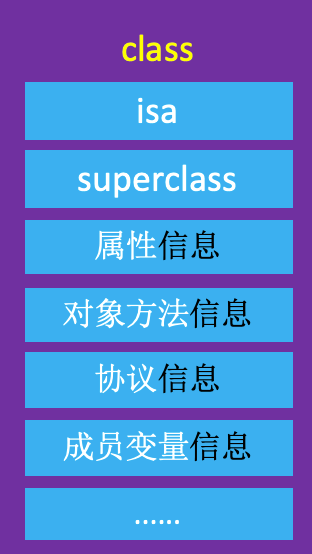
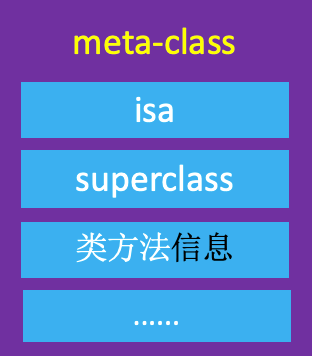

Objective-C 中的对象主要可以分为3种：  
* instance对象（实例对象）
* class对象（类对象）
* meta-class对象（元类对象）  

<!-- more -->

# instance 对象
instance 对象就是通过类 alloc 出来的对象，每次调用 alloc 都会产生新的 instance 对象。
```
NSObject *object1 = [[NSObject alloc] init];
NSObject *object2 = [[NSObject alloc] init];
```

object1、object2 是 NSObject 的 instance 对象，它们是不同的两个对象，分别占据着两块不同的内存。

## instance 对象在内存中存储的信息

* isa指针
* 其他成员变量

定义 Person
```
@interface Person : NSObject
{
    @public
    int _age;
}
@end

@implementation Person
@end
```

创建 Person 的实例对象
```
Person *p1 = [[Person alloc] init];
Person *p2 = [[Person alloc] init];
```

p1、p2 对象在内存中存储的信息



# class 对象
每个类在内存中有且只有一个class对象，同一个类 alloc 出来的实例对象共同拥有唯一的 class 对象。

获取 class 对象：
```
Class objectClass1 = [object1 class];
Class objectClass2 = [object2 class];
Class objectClass3 = object_getClass(object1);
Class objectClass4 = object_getClass(object2);
Class objectClass5 = [NSObject class];
```

objectClass1 ~ objectClass5 都是 NSObject 的 class 对象，它们是同一个对象。

## class 对象在内存中存储的信息主要包括
* isa指针
* superclass指针
* 类的属性信息（@property）、类的对象方法信息（instance method）
* 类的协议信息（protocol）、类的成员变量信息（ivar）  
......  



不同的 instance 对象却拥有相同的属性、对象方法、协议和成员变量等等，这些信息都存放在 class 对象的内存中，保证了同样的信息只存储一份。

## 👉 注意
以下代码获取的 objectClass 是 class 对象，并不是 meta-class 对象
```
Class objectClass = [[NSObject class] class];
```

# meta-class 对象

每个类在内存中有且只有一个meta-class对象。  

将类对象当做参数传入，获得元类对象：
```
Class objectMetaClass = object_getClass(objectClass5);
```

## meta-class 对象在内存中存储的信息主要包括
* isa指针
* superclass指针
* 类的类方法信息（class method）  
......



## 查看 objecClass 是否为 meta-class
```
#import <objc/runtime.h>

BOOL result = class_isMetaClass(objecClass)
```

# 窥视 objc_getClass()、object_getClass()

## object_getClass
打开 Runtime 源码 [objc4-781](https://opensource.apple.com/tarballs/objc4/)，找到 objc-class.mm，搜索 object_getClass：
```
Class object_getClass(id obj)
{
    if (obj) return obj->getIsa();
    else return Nil;
}
```

## objc_getClass
打开 Runtime 源码，找到 runtime.mm，搜索 objc_getClass：
```
Class objc_getClass(const char *aClassName)
{
    if (!aClassName) return Nil;

    // NO unconnected, YES class handler
    return look_up_class(aClassName, NO, YES);
}
```

上面👆的代码里可以确认 objc_getClass 的参数是一个类名。

Jump To Definition -> look_up_class：
```
Class 
look_up_class(const char *name, 
              bool includeUnconnected __attribute__((unused)), 
              bool includeClassHandler __attribute__((unused)))
{
    if (!name) return nil;

    Class result;
    bool unrealized;
    {
        runtimeLock.lock();
        result = getClassExceptSomeSwift(name);
        unrealized = result  &&  !result->isRealized();
        if (unrealized) {
            result = realizeClassMaybeSwiftAndUnlock(result, runtimeLock);
            // runtimeLock is now unlocked
        } else {
            runtimeLock.unlock();
        }
    }

    if (!result) {
        // Ask Swift about its un-instantiated classes.

        // We use thread-local storage to prevent infinite recursion
        // if the hook function provokes another lookup of the same name
        // (for example, if the hook calls objc_allocateClassPair)

        auto *tls = _objc_fetch_pthread_data(true);

        // Stop if this thread is already looking up this name.
        for (unsigned i = 0; i < tls->classNameLookupsUsed; i++) {
            if (0 == strcmp(name, tls->classNameLookups[i])) {
                return nil;
            }
        }

        // Save this lookup in tls.
        if (tls->classNameLookupsUsed == tls->classNameLookupsAllocated) {
            tls->classNameLookupsAllocated =
                (tls->classNameLookupsAllocated * 2 ?: 1);
            size_t size = tls->classNameLookupsAllocated *
                sizeof(tls->classNameLookups[0]);
            tls->classNameLookups = (const char **)
                realloc(tls->classNameLookups, size);
        }
        tls->classNameLookups[tls->classNameLookupsUsed++] = name;

        // Call the hook.
        Class swiftcls = nil;
        if (GetClassHook.get()(name, &swiftcls)) {
            ASSERT(swiftcls->isRealized());
            result = swiftcls;
        }

        // Erase the name from tls.
        unsigned slot = --tls->classNameLookupsUsed;
        ASSERT(slot >= 0  &&  slot < tls->classNameLookupsAllocated);
        ASSERT(name == tls->classNameLookups[slot]);
        tls->classNameLookups[slot] = nil;
    }

    return result;
}
```
Jump To Definition -> getClassExceptSomeSwift：
```
static Class getClassExceptSomeSwift(const char *name)
{
    runtimeLock.assertLocked();

    // Try name as-is
    Class result = getClass_impl(name);
    if (result) return result;

    // Try Swift-mangled equivalent of the given name.
    if (char *swName = copySwiftV1MangledName(name)) {
        result = getClass_impl(swName);
        free(swName);
        return result;
    }

    return nil;
}
```

Jump To Definition -> getClass_impl：
```
static Class getClass_impl(const char *name)
{
    runtimeLock.assertLocked();

    // allocated in _read_images
    ASSERT(gdb_objc_realized_classes);

    // Try runtime-allocated table
    Class result = (Class)NXMapGet(gdb_objc_realized_classes, name);
    if (result) return result;

    // Try table from dyld shared cache.
    // Note we do this last to handle the case where we dlopen'ed a shared cache
    // dylib with duplicates of classes already present in the main executable.
    // In that case, we put the class from the main executable in
    // gdb_objc_realized_classes and want to check that before considering any
    // newly loaded shared cache binaries.
    return getPreoptimizedClass(name);
}
```

Jump To Definition -> NXMapGet：
```
void *NXMapGet(NXMapTable *table, const void *key) {
    void	*value;
    return (_NXMapMember(table, key, &value) != NX_MAPNOTAKEY) ? value : NULL;
}
```

NXMapGet 根据传进来的类名返回了一个类对象。

# 总结
* object_getClass 的参数是 instance 对象/ class 对象/ meta-class 对象。  
* object_getClass 返回的是 obj 的 isa 指针。
* 如果 obj 是 instance 对象则返回 class 对象。如果 obj 是 class 对象则返回 meta-class 对象。如果 obj 是 meta-class 对象则返回 NSObject（基类） 的 meta-class 对象。
* Class objc_getClass(const char *aClassName) ：字符串类名 -> 对应的类对象
* -(void)Class 和 +(void)Class 返回的是类对象。