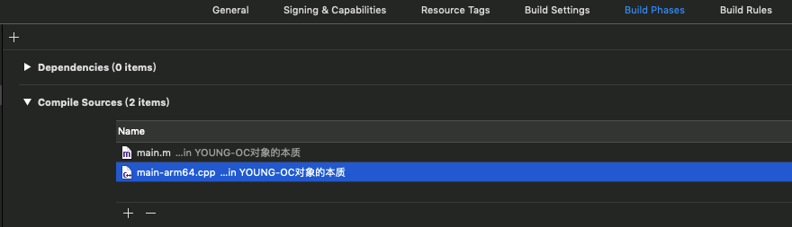
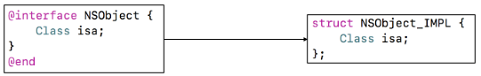
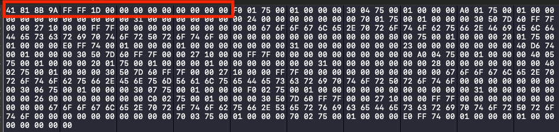
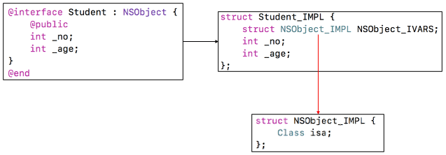
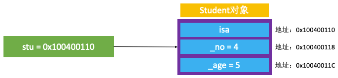
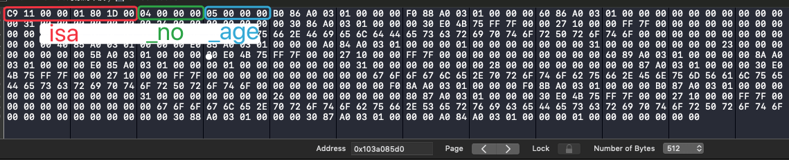
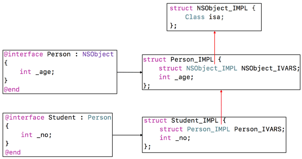

思考：
* 一个 NSObject 对象占用多少内存？ 
* 创建一个实例对象，至少需要多少内存？实际上分配了多少内存？

<!-- more -->

# Objective-C的本质

Objective-C 代码的底层实现其实是 C\C++ 代码，Objective-C 的面向对象是基于 C\C++ 的数据结构(结构体)实现的。


## 将 Objective-C 代码转换为 C\C++ 代码

### 创建一个命令行项目


在终端打开 main.m 的位置，输入下面👇的命令生成 main.cpp 文件。因为要生成的代码包括 c/c++，所以使用 main.cpp 文件，main.cpp 文件是 c++ 文件，支持 c/c++。

### 生成 main.cpp
```
$ clang -rewrite-objc main.m -o main.cpp
```
没有指定平台，默认生成的是多个平台的代码，代码量太大。

### 指定生成 iphoneos 平台、arm64 架构的 main.cpp  
指定平台：不同平台支持的代码不一样，如 Windows、mac、iOS。xcrun -sdk iphoneos：指定 iphoneos。    
指定框架：不同框架支持的代码也不一样，模拟器(i386)、32bit(armv7)、64bit（arm64）。-arch arm64：指定 arm64 架构。
```
$ xcrun -sdk iphoneos clang -arch arm64 -rewrite-objc main.m -o main-arm64.cpp
```

报错：xcrun: error: SDK "iphoneos" cannot be located  
解决1：给Xcode命令行工具指定路径👇
```
$ sudo xcode-select --switch /Applications/Xcode.app/Contents/Developer/
```

（如果需要链接其他框架，使用-framework参数。比如-framework UIKit。(未验证)）
```
$ xcrun -sdk iphoneos clang -arch arm64 -rewrite-objc main.m -o main-arm64.cpp -framework UIKit
```

### 取消 Xcode 对 main-arm64.cpp 的文件编译  
生成的 main-arm64.cpp 文件添加到项目后，运行会报错。main-arm64.cpp 是临时生成的，内部有一个 main 函数，没做适配。 

解决：删除 Build Phases -> Compile Sources -> main-arm64.cpp



# NSObject 的底层实现

* 思考：一个OC对象在内存中是如何布局的？

## NSObject 在 OC 中的定义：
```
@interface NSObject <NSObject> {
#pragma clang diagnostic push
#pragma clang diagnostic ignored "-Wobjc-interface-ivars"
    Class isa  OBJC_ISA_AVAILABILITY;
#pragma clang diagnostic pop
}

//简化后：
@interface NSObject {
    Class isa;
}
```

## 在 c++ 中的定义：
```
struct NSObject_IMPL {
    Class isa; // 8个字节
};
```
Class 是指向结构体的指针：typedef struct objc_class *Class。  
IMPL 是 implementation 的简写。结构体中只有一个成员变量，所以这个结构体在内存中占用的大小就是指针 isa 的大小。



## 打印 NSObject 实例对象的成员变量所占用的大小 >> 8
```
//1.导入头文件
#import <objc/runtime.h>

//2.打印，结果 8
NSLog(@"%zd", class_getInstanceSize([NSObject class]));
```

## 打印 obj 指针所指向内存的大小 >> 16
```
//1.导入头文件
#import <malloc/malloc.h>

//2.打印，结果 16
NSLog(@"%zd", malloc_size((__bridge const void *)obj));
```
__bridge 可以实现 Objective-C 与 C 语言变量 和 Objective-C 与 Core Foundation 对象之间的互相转换。  


## 窥视 class_getInstanceSize
下载 runtime 源码 [objc4-781](https://opensource.apple.com/tarballs/objc4/)。  
打开源码搜索 class_getInstanceSize，找到 objc-class.mm 文件中 class_getInstanceSize 的实现代码。
```
size_t class_getInstanceSize(Class cls)
{
    if (!cls) return 0;
    return cls->alignedInstanceSize();
}
```
Jump to Definition -> alignedInstanceSize：
```
// Class's ivar size rounded up to a pointer-size boundary.
uint32_t alignedInstanceSize() const {
    return word_align(unalignedInstanceSize());
}
```
翻译过来就是，class_getInstanceSize 内部根据成员变量的大小和内存对齐原则得到 NSObject 实例对象里成员变量所占用的内存大小。

👉 内存对齐原则：结构体的大小必须是最大成员大小的倍数。

## 窥视 alloc
alloc 的内部实现是 allocWithZone，在源码中搜索 allocWithZone：
```
id
_objc_rootAllocWithZone(Class cls, malloc_zone_t *zone)
{
    id obj;

    if (fastpath(!zone)) {
        obj = class_createInstance(cls, 0); //参数：类，额外空间0
    } else {
        obj = class_createInstanceFromZone(cls, 0, zone);
    }

    if (slowpath(!obj)) obj = _objc_callBadAllocHandler(cls);
    return obj;
}
```
Jump to Definition -> class_createInstance：
```
id
class_createInstance(Class cls, size_t extraBytes)
{
    if (!cls) return nil;
    return _class_createInstanceFromZone(cls, extraBytes, nil);
}
```
Jump to Definition -> _class_createInstanceFromZone：
```
//创建 cls 的实例对象
static ALWAYS_INLINE id
_class_createInstanceFromZone(Class cls, size_t extraBytes, void *zone,
                              int construct_flags = OBJECT_CONSTRUCT_NONE,
                              bool cxxConstruct = true,
                              size_t *outAllocatedSize = nil)
{
    ASSERT(cls->isRealized());

    // Read class's info bits all at once for performance
    bool hasCxxCtor = cxxConstruct && cls->hasCxxCtor();
    bool hasCxxDtor = cls->hasCxxDtor();
    bool fast = cls->canAllocNonpointer();
    size_t size;

    size = cls->instanceSize(extraBytes); //分配内存空间方法👇
    if (outAllocatedSize) *outAllocatedSize = size;

    id obj;
    if (zone) {
        obj = (id)malloc_zone_calloc((malloc_zone_t *)zone, 1, size);
    } else {
        obj = (id)calloc(1, size); //c语言分配内存的函数，分配空间：size
    }
    if (slowpath(!obj)) {
        if (construct_flags & OBJECT_CONSTRUCT_CALL_BADALLOC) {
            return _objc_callBadAllocHandler(cls);
        }
        return nil;
    }

    if (!zone && fast) {
        obj->initInstanceIsa(cls, hasCxxDtor);
    } else {
        // Use raw pointer isa on the assumption that they might be
        // doing something weird with the zone or RR.
        obj->initIsa(cls);
    }

    if (fastpath(!hasCxxCtor)) {
        return obj;
    }

    construct_flags |= OBJECT_CONSTRUCT_FREE_ONFAILURE;
    return object_cxxConstructFromClass(obj, cls, construct_flags);
}
```

Jump to Definition -> instanceSize：
```
size_t instanceSize(size_t extraBytes) const {
    if (fastpath(cache.hasFastInstanceSize(extraBytes))) {
        return cache.fastInstanceSize(extraBytes);
    }

    size_t size = alignedInstanceSize() + extraBytes;
    // CF requires all objects be at least 16 bytes.
    if (size < 16) size = 16; //至少16个字节
    return size;
}
```
可以看到，创建的实例对象的大小最终由 instanceSize 方法实现。内存大小至少16个字节，CoreFoundation 框架内部就是这么硬性规定的。

## 小结：  
```
NSObject *obj = [[NSObject alloc] init];
```
* 上面👆这句代码实际上是在内存中生成了一个 c 语言定义的结构体，结构体内有一个类型为 Class 的 isa 指针，结构体的大小 8 个字节。Class 是一个指向结构体的指针。
* 创建的实例对象的大小至少16个字节.


# 查看实例变量的内存的方法

## 通过 Xcode 工具查看对象内存  
打开 Debug -> Debug Workflow -> View Memory，在 Address 输入对象的地址。  



## 常用 LLDB 指令
### print、p：打印
```
(lldb) print obj
(NSObject *) $0 = 0x000000010380ef00
(lldb) p obj
(NSObject *) $1 = 0x000000010380ef00
```

### po：打印对象
```
(lldb) po obj
<NSObject: 0x10380ef00>
```

### 格式  
x是16进制，f是浮点，d是10进制

### 字节大小  
b：byte 1字节，h：half word 2字节  
w：word 4字节，g：giant word 8字节

### 读取内存  
* memory read/数量格式字节数 内存地址

memory read 内存地址
```
(lldb) memory read 0x10380ef00
0x10380ef00: 41 81 8b 9a ff ff 1d 00 00 00 00 00 00 00 00 00  A...............
0x10380ef10: e0 ef 80 03 01 00 00 00 20 f2 80 03 01 00 00 00  ........ ....... 
```

x/数量格式字节数 内存地址
```
(lldb) x 0x10380ef00
0x10380ef00: 41 81 8b 9a ff ff 1d 00 00 00 00 00 00 00 00 00  A...............
0x10380ef10: e0 ef 80 03 01 00 00 00 20 f2 80 03 01 00 00 00  ........ .......
(lldb) x/3xg 0x10380ef00
0x10380ef00: 0x001dffff9a8b8141 0x0000000000000000
0x10380ef10: 0x000000010380efe0
(lldb) x/4xg 0x10380ef00
0x10380ef00: 0x001dffff9a8b8141 0x0000000000000000
0x10380ef10: 0x000000010380efe0 0x000000010380f220
(lldb) x/4xw 0x10380ef00
0x10380ef00: 0x9a8b8141 0x001dffff 0x00000000 0x00000000
(lldb) x/4dw 0x10380ef00
0x10380ef00: -1702133439
0x10380ef04: 1966079
0x10380ef08: 0
0x10380ef0c: 0
```

打印结果中， x/3xg 0x10380ef00 打印的 `0x001dffff9a8b8141 0x0000000000000000` 部分是属于 obj 的内存。x/4xw 0x10380ef00 打印的 `0x9a8b8141 0x001dffff 0x00000000 0x00000000` 部分属于 obj 的内存。

### 修改内存中的值  
memory  write  内存地址  数值  
将内存中的第6个字节改成06：
```
(lldb) po obj
<NSObject: 0x10380ef00>

(lldb) memory read 0x10380ef00
0x10380ef00: 41 81 8b 9a ff ff 1d 00 00 00 00 00 00 00 00 00  A...............
0x10380ef10: e0 ef 80 03 01 00 00 00 20 f2 80 03 01 00 00 00  ........ .......
(lldb) memory write 0x10380ef06 6
(lldb) x 0x10380ef00
0x10380ef00: 41 81 8b 9a ff ff 06 00 00 00 00 00 00 00 00 00  A...............
0x10380ef10: e0 ef 80 03 01 00 00 00 20 f2 80 03 01 00 00 00  ........ .......
(lldb) 
```

po obj 获取到对象地址 0x10380ef00，所以第6个字节的地址就是 0x10380ef06。通过 memory write 0x10380ef06 6，将 0x10380ef06 处的字节改为 6。上面👆 x 0x10380ef00 打印出的结果中可以看到，第 6 个字节成功被修改为 06。


# Student 的本质
定义一个继承 NSObject 的类 Student：
```
@interface Student : NSObject {
    @public
    int _no;
    int _age;
}
@end

@implementation Student
@end
```

创建一个 Student 的实例对象：
```
Student *stu = [[Student alloc] init];
```

将 OC 代码转换为 C\C++ 代码，并在生成的 C/C++ 代码中找到 Student 的实现：
```
struct Student_IMPL {
    struct NSObject_IMPL NSObject_IVARS;
    int _no;
    int _age;
};
```

因为 NSObject_IMPL 内部只有一个成员变量指针 isa，所以上面👆的代码可以写成：
```
struct Student_IMPL {
    Class isa;
    int _no;
    int _age;
};
```

  

结构体 Student_IMPL 的成员变量大小是16字节。  
isa（8字节）+ _no（4字节）+ _age（4字节）= Student_IMPL（16字节）。  

根据地址也可以看出成员变量的大小：  
  

如图，指针 stu 指向的地址就是 isa 指向的地址（参考理解：数组首元素的地址就是数组的地址）。指针 isa 占8个字节，所以 _no 的地址在 isa 的地址基础上加8个字节。_no 是 Int 类型4字节，所以 _age 的地址在 _no 地址的基础上加4个字节。实例变量内部的成员变量的地址，在堆中依次往后加。

打开内存图：
Debug -> Debug Workflow -> View Memory
  
因为 iOS 平台是小端模式，所以从内存中读取数据的方式是从高地址开始读取（右→左）。_no 是 0x00000004，_age 是 0x00000005：
```
(lldb) x/4xw 0x103a085d0
0x103a085d0: 0x000011c9 0x001d8001 0x00000004 0x00000005
```

通过修改内存中的值的方式来修改 _no，查看内存：
```
(lldb) x 0x103a085d0
0x103a085d0: c9 11 00 00 01 80 1d 00 04 00 00 00 05 00 00 00  ................
0x103a085e0: b0 86 a0 03 01 00 00 00 f0 88 a0 03 01 00 00 00  ................
```

_no 的地址（0x103a085d0）向右数8个找到04的地址（0x103a085d8），通过 memory write 将实例对象的第8个字节 04 给为 09，打印 _no = 9。
```
(lldb) memory write 0x103a085d8 9
(lldb) x 0x103a085d0
0x103a085d0: c9 11 00 00 01 80 1d 00 09 00 00 00 05 00 00 00  ................
0x103a085e0: b0 86 a0 03 01 00 00 00 f0 88 a0 03 01 00 00 00  ................
(lldb) p stu->_no
(int) $3 = 9
```

## 小结
* iOS 平台是小端模式，所以从内存中读取数据的方式是从高地址开始读取。
* 使用 memory write，可以通过修改内存中的值的方式来修改成员变量的值。

# 更复杂的继承关系

## 定义 Person、Student
```
@interface Person : NSObject
{
    @public
    int _age;
}
@end

@implementation Person
@end

@interface Student : Person
{
    int _no;
}
@end

@implementation Student
@end
```

将 OC 代码转换为 C\C++ 代码，并在生成的 C/C++ 代码中找到 Person、Student 的实现：
```
struct Person_IMPL {
    struct NSObject_IMPL NSObject_IVARS; // 8
    int _age; // 4
}; // 16 内存对齐：结构体的大小必须是最大成员大小的倍数

struct Student_IMPL {
    struct Person_IMPL Person_IVARS; // 16
    int _no; // 4
}; // 16
```
继承关系图解：
  

## Person、Student 的内存大小

打印 Person、Student 实例变量的大小：  
```
Student *stu = [[Student alloc] init];
NSLog(@"stu - %zd", class_getInstanceSize([Student class])); //打印结果 16
NSLog(@"stu - %zd", malloc_size((__bridge const void *)stu)); //打印结果 16

Person *person = [[Person alloc] init];
NSLog(@"person - %zd", class_getInstanceSize([Person class])); //打印结果 16
NSLog(@"person - %zd", malloc_size((__bridge const void *)person)); //打印结果 16
```

虽然 Student 比 Person 多了一个成员变量 _no（4字节），但是 Student 和 Person 打印出来的内存大小都是16字节。

Person、Student 的内存分配图解：
  

Person 的成员变量的内存之和是12个字节，根据内存对齐的规则，Person 的内存大小必须是内存最大的成员变量 isa（8字节）的倍数，所以分配了16字节的内存给 Person。Student 的成员变量之和是20字节，但是 Person 中有多余的4字节，所以成员变量 _no 的内存被放到了 Person 多余的内存空间里，最终分配给 Student 的内存大小为16字节。  

## @property 定义属性的内存分配
```
@interface Person : NSObject
{
    @public
    int _age;
}
@property (nonatomic, assign) int height;
@end

@implementation Person
@end
```

将 OC 代码转换为 C\C++ 代码，并在生成的 C/C++ 代码中找到 Person 的实现：
```
struct Person_IMPL {
    struct NSObject_IMPL NSObject_IVARS; // 8
    int _age; // 4
    int _height; //4
}; // 16 
```

## 小结
* 子类在分配内存时，如果父类的内存空间有剩余，优先使用父类的内存空间。
* 创建出来的实列对象的内存中只存有成员变量，不包含方法。以 Person 为例，因为不同的 Person 实例对象的方法是相同的公用的，所以方法放到类对象的方法列表里，供不同的 Person 实例对象调用。


# 窥视 alignedInstanceSize
class_getInstanceSize 获取内存大小调用的是 alignedInstanceSize：
```
// Class's ivar size rounded up to a pointer-size boundary.
uint32_t alignedInstanceSize() const {
    return word_align(unalignedInstanceSize());
}
```

align：对齐。`word_align(unalignedInstanceSize())`：传入一个未对齐（unaligned）的内存，`word_align` 方法将其对齐后返回。


# Person 对象的内存分配

定义 Person
```
@interface Person : NSObject
{
    @public
    int _age;
    int _height;
    int _no;
}
@end

@implementation Person
@end
```

将 OC 代码转换为 C\C++ 代码，并在生成的 C/C++ 代码中找到 Person 的实现：
```
struct Person_IMPL {
    struct NSObject_IMPL NSObject_IVARS; // 8
    int _age; // 4
    int _height; //4
    int _no; //4
}; // 24
```

创建 Person 实例变量，打印内存大小：
```
Person *person = [[Person alloc] init];
NSLog(@"person - %zd", sizeof(struct Person_IMPL)); //24
NSLog(@"person - %zd", class_getInstanceSize([Person class])); //24
NSLog(@"person - %zd", malloc_size((__bridge const void *)person)); //32
```

sizeof() 是运算符，计算类型的大小，是在编译的时候就确定的。

Person 内的成员变量的从内存图中可以确认，Person 分配的内存是32：
 

## 窥视 _class_createInstanceFromZone
alloc -> allocWithZoone -> _objc_rootAllocWithZone -> class_createInstance -> _class_createInstanceFromZone

_class_createInstanceFromZone 实现：
```
//创建 cls 的实例对象
static ALWAYS_INLINE id
_class_createInstanceFromZone(Class cls, size_t extraBytes, void *zone,
                              int construct_flags = OBJECT_CONSTRUCT_NONE,
                              bool cxxConstruct = true,
                              size_t *outAllocatedSize = nil)
{
    ASSERT(cls->isRealized());

    // Read class's info bits all at once for performance
    bool hasCxxCtor = cxxConstruct && cls->hasCxxCtor();
    bool hasCxxDtor = cls->hasCxxDtor();
    bool fast = cls->canAllocNonpointer();
    size_t size;

    size = cls->instanceSize(extraBytes); //分配空间
    if (outAllocatedSize) *outAllocatedSize = size;

    id obj;
    if (zone) {
        obj = (id)malloc_zone_calloc((malloc_zone_t *)zone, 1, size);
    } else {
        obj = (id)calloc(1, size); //c语言分配内存的函数，需要分配的内存大小：size
    }
    if (slowpath(!obj)) {
        if (construct_flags & OBJECT_CONSTRUCT_CALL_BADALLOC) {
            return _objc_callBadAllocHandler(cls);
        }
        return nil;
    }

    if (!zone && fast) {
        obj->initInstanceIsa(cls, hasCxxDtor);
    } else {
        // Use raw pointer isa on the assumption that they might be
        // doing something weird with the zone or RR.
        obj->initIsa(cls);
    }

    if (fastpath(!hasCxxCtor)) {
        return obj;
    }

    construct_flags |= OBJECT_CONSTRUCT_FREE_ONFAILURE;
    return object_cxxConstructFromClass(obj, cls, construct_flags);
}
```

可以看出，代码最终是调用 obj = (id)calloc(1, size); 创建的实列对象。而 size = cls->instanceSize(extraBytes); 是根据成员变量大小计算出来的需要开辟的内存大小。instanceSize(extraBytes) 的参数 extraBytes 是额外空间，来自 _objc_rootAllocWithZone，_objc_rootAllocWithZone 传入的 extraBytes = 0：
```
id
_objc_rootAllocWithZone(Class cls, malloc_zone_t *zone)
{
    id obj;

    if (fastpath(!zone)) {
        obj = class_createInstance(cls, 0);
    } else {
        obj = class_createInstanceFromZone(cls, 0, zone);
    }

    if (slowpath(!obj)) obj = _objc_callBadAllocHandler(cls);
    return obj;
}
```

排查完 instanceSize(extraBytes) 后，可以确定 class_getInstanceSize() 与 malloc_size() 获取到的内存大小不同的原因来自 calloc。

# 窥视 calloc
calloc 是 c 语言的标准库，需要下载 [libmalloc](https://opensource.apple.com/tarballs/libmalloc/)（libmalloc-283 文件里没有 malloc.c 文件了，这里下的是 libmalloc-166.200.60.tar.gz）。

打开 libmalloc 项目找到 malloc.c 文件，再找到 calloc 方法：
```
void *
calloc(size_t num_items, size_t size)
{
	void *retval;
	retval = malloc_zone_calloc(default_zone, num_items, size);
	if (retval == NULL) {
		errno = ENOMEM;
	}
	return retval;
}
```

Jump to Definition -> malloc_zone_calloc
```
void *
malloc_zone_calloc(malloc_zone_t *zone, size_t num_items, size_t size)
{
	void *ptr;
	size_t alloc_size;
	if (malloc_check_start && (malloc_check_counter++ >= malloc_check_start)) {
		internal_check();
	}
	if (os_mul_overflow(num_items, size, &alloc_size) || alloc_size > MALLOC_ABSOLUTE_MAX_SIZE){
		errno = ENOMEM;
		return NULL;
	}

	ptr = zone->calloc(zone, num_items, size);
	
	if (malloc_logger) {
		malloc_logger(MALLOC_LOG_TYPE_ALLOCATE | MALLOC_LOG_TYPE_HAS_ZONE | MALLOC_LOG_TYPE_CLEARED, (uintptr_t)zone,
				(uintptr_t)(num_items * size), 0, (uintptr_t)ptr, 0);
	}
	return ptr;
}
```

malloc_zone_calloc 中就是系统分配内存的具体实现。另外，在系统分配内存时有一个 NANO_MAX_SIZE：
```
#define NANO_MAX_SIZE			256 /* Buckets sized {16, 32, 48, 64, 80, 96, 112, ...} */
```

Buckets sized：iOS 堆空间里内存分为一块一块的内存空间，大小都是16的倍数，最大的内存空间块是256。

malloc_zone_calloc 这里也存在内存对齐原则。前面在生成结构体的时候提到过，根据内存对齐原则，结构体的大小必须是最大成员大小的倍数。而在这里，系统在分配内存时，分配的内存必须是16的倍数。因为 ios 系统为了提升内存分配的速度，固定了需要分配的内存空间块（Buckets sized）。在需要分配内存的时候，会找到最合适的内存空间块们来分配给实例对象。

# 总结

* 一个 NSObject 对象占用多少内存？  
alloc 方法让系统分配了16个字节给 NSObject 对象（可以通过 malloc_size 函数获取）。  
NSObject 对象内部只有一个成员变量，即指针 isa，所以只使用了8个字节的空间（64bit环境下，可以通过 class_getInstanceSize 函数获得）。

* 创建一个实例对象，至少需要多少内存？实际上分配了多少内存？
```
//至少需要内存大小：
#import <objc/runtime.h>
class_getInstanceSize([NSObject class]);

//实际分配内存大小：
#import <malloc/malloc.h>
malloc_size((__bridge const void *)obj);
```

* 内存对齐原则：结构体的大小必须是最大成员大小的倍数，系统分配内存的大小必须是固定的大小（16的倍数）。