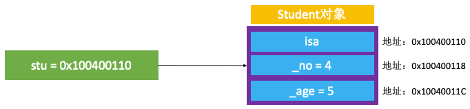

# Student 的本质
定义一个继承 NSObject 的类 Student：
```
@interface Student : NSObject {
    @public
    int _no;
    int _age;
}
@end

@implementation Student

@end
```

创建一个 Student 的实例对象：
```
Student *stu = [[Student alloc] init];
```

将 OC 代码转换为 C\C++ 代码，并在生成的 C/C++ 代码中找到 Student 的实现：
```
struct Student_IMPL {
    struct NSObject_IMPL NSObject_IVARS;
    int _no;
    int _age;
};
```

因为 NSObject_IMPL 内部只有一个成员变量指针 isa，所以上面👆的代码可以写成：
```
struct Student_IMPL {
    Class isa;
    int _no;
    int _age;
};
```

  

结构体 Student_IMPL 的成员变量大小是16字节。  
isa（8字节）+ _no（4字节）+ _age（4字节）= Student_IMPL（16字节）。  

根据地址也可以看出成员变量的大小：  
  

如图，指针 stu 指向的地址就是 isa 指向的地址（参考理解：数组首元素的地址就是数组的地址）。指针 isa 8字节，所以 _no 的地址在 isa 的地址基础上加8个字节。_no 是 Int 类型4字节，所以 _age 的地址在 _no 地址的基础上加4个字节。实例变量内部的成员变量的地址，在堆中依次往后加。

打开内存图：
Debug -> Debug Workflow -> View Memory
  
iOS 平台是小端模式，所以从内存中读取数据的方式是从高地址开始读取，所以 _no 是 0x00000004，_age 是 0x00000005：
```
(lldb) x/4xw 0x103a085d0
0x103a085d0: 0x000011c9 0x001d8001 0x00000004 0x00000005
```

通过修改内存中的值的方式来修改 _no：
```
(lldb) x 0x103a085d0
0x103a085d0: c9 11 00 00 01 80 1d 00 04 00 00 00 05 00 00 00  ................
0x103a085e0: b0 86 a0 03 01 00 00 00 f0 88 a0 03 01 00 00 00  ................
(lldb) memory write 0x103a085d8 9
(lldb) x 0x103a085d0
0x103a085d0: c9 11 00 00 01 80 1d 00 09 00 00 00 05 00 00 00  ................
0x103a085e0: b0 86 a0 03 01 00 00 00 f0 88 a0 03 01 00 00 00  ................
(lldb) p stu->_no
(int) $3 = 9
```

# Person 的内存大小

## 定义 Person、Student
```
@interface Person : NSObject
{
    @public
    int _age;
}
@end

@implementation Person
@end

@interface Student : Person
{
    int _no;
}
@end

@implementation Student
@end
```

将 OC 代码转换为 C\C++ 代码，并在生成的 C/C++ 代码中找到 Person、Student 的实现：
```
struct Person_IMPL {
    struct NSObject_IMPL NSObject_IVARS; // 8
    int _age; // 4
}; // 16 内存对齐：结构体的大小必须是最大成员大小的倍数

struct Student_IMPL {
    struct Person_IMPL Person_IVARS; // 16
    int _no; // 4
}; // 16
```

  

## Person、Student 的内存分配

打印 Person、Student 实例变量的大小：  
```
Student *stu = [[Student alloc] init];
NSLog(@"stu - %zd", class_getInstanceSize([Student class])); //打印结果 16
NSLog(@"stu - %zd", malloc_size((__bridge const void *)stu)); //打印结果 16

Person *person = [[Person alloc] init];
NSLog(@"person - %zd", class_getInstanceSize([Person class])); //打印结果 16
NSLog(@"person - %zd", malloc_size((__bridge const void *)person)); //打印结果 16
```

## 小结
Person 的成员变量的内存之和是12个字节，但是根据内存对齐的规则，分配了16字节的内存给 Person。Student 的成员变量之和是20字节，但是 Person 中有多余的4字节，所以成员变量 _no 的内存被放到了 Person 多余的内存空间里，最终分配给 Student 的内存大小为16字节。

  


## @property 定义属性的内存分配
```
@interface Person : NSObject
{
    @public
    int _age;
}
@property (nonatomic, assign) int height;
@end

@implementation Person
@end
```

将 OC 代码转换为 C\C++ 代码，并在生成的 C/C++ 代码中找到 Person 的实现：
```
struct Person_IMPL {
    struct NSObject_IMPL NSObject_IVARS; // 8
    int _age; // 4
    int _height; //4
}; // 16 
```

## 小结
创建出来的实列对象的内存中只存有成员变量，不包含方法。以 Person 为例，不同的 Person 实例对象的方法是相同的，所以方法放到类对象的方法列表里，供不同的 Person 实例对象调用。


# 窥视 alignedInstanceSize
class_getInstanceSize 获取内存大小调用的是 alignedInstanceSize：
```
// Class's ivar size rounded up to a pointer-size boundary.
uint32_t alignedInstanceSize() const {
    return word_align(unalignedInstanceSize());
}
```

align：对齐。word_align(unalignedInstanceSize())：传入一个未对齐（unaligned）的内存，word_align 将其对齐后返回。


# 窥视 calloc

## Person 对象的内存分配
```
@interface Person : NSObject
{
    @public
    int _age;
    int _height;
    int _no;
}
@end

@implementation Person
@end
```

将 OC 代码转换为 C\C++ 代码，并在生成的 C/C++ 代码中找到 Person 的实现：
```
struct Person_IMPL {
    struct NSObject_IMPL NSObject_IVARS; // 8
    int _age; // 4
    int _height; //4
    int _no; //4
}; // 24
```

创建 Person 实例变量，打印内存大小：
```
Person *person = [[Person alloc] init];
NSLog(@"person - %zd", sizeof(struct Person_IMPL)); //24
NSLog(@"person - %zd", class_getInstanceSize([Person class])); //24
NSLog(@"person - %zd", malloc_size((__bridge const void *)person)); //32
```

Person 内的成员变量的从内存图中可以确认，Person 分配的内存是32：
 

alloc -> allocWithZoone -> _objc_rootAllocWithZone -> class_createInstance -> _class_createInstanceFromZone

_class_createInstanceFromZone 实现：
```
//创建 cls 的实例对象
static ALWAYS_INLINE id
_class_createInstanceFromZone(Class cls, size_t extraBytes, void *zone,
                              int construct_flags = OBJECT_CONSTRUCT_NONE,
                              bool cxxConstruct = true,
                              size_t *outAllocatedSize = nil)
{
    ASSERT(cls->isRealized());

    // Read class's info bits all at once for performance
    bool hasCxxCtor = cxxConstruct && cls->hasCxxCtor();
    bool hasCxxDtor = cls->hasCxxDtor();
    bool fast = cls->canAllocNonpointer();
    size_t size;

    size = cls->instanceSize(extraBytes); //分配空间
    if (outAllocatedSize) *outAllocatedSize = size;

    id obj;
    if (zone) {
        obj = (id)malloc_zone_calloc((malloc_zone_t *)zone, 1, size);
    } else {
        obj = (id)calloc(1, size); //c语言分配内存的函数，分配空间：size
    }
    if (slowpath(!obj)) {
        if (construct_flags & OBJECT_CONSTRUCT_CALL_BADALLOC) {
            return _objc_callBadAllocHandler(cls);
        }
        return nil;
    }

    if (!zone && fast) {
        obj->initInstanceIsa(cls, hasCxxDtor);
    } else {
        // Use raw pointer isa on the assumption that they might be
        // doing something weird with the zone or RR.
        obj->initIsa(cls);
    }

    if (fastpath(!hasCxxCtor)) {
        return obj;
    }

    construct_flags |= OBJECT_CONSTRUCT_FREE_ONFAILURE;
    return object_cxxConstructFromClass(obj, cls, construct_flags);
}
```

可以看出，代码最终是调用 obj = (id)calloc(1, size); 创建的实列对象。其中，size = cls->instanceSize(extraBytes); 是根据成员变量大小计算出来的需要开辟的内存大小。instanceSize(extraBytes) 的参数 extraBytes 来自 _objc_rootAllocWithZone，extraBytes = 0：
```
NEVER_INLINE
id
_objc_rootAllocWithZone(Class cls, malloc_zone_t *zone __unused)
{
    // allocWithZone under __OBJC2__ ignores the zone parameter
    return _class_createInstanceFromZone(cls, 0, nil,
                                         OBJECT_CONSTRUCT_CALL_BADALLOC);
}
```

calloc 是 c 语言的标准库，需要下载 [libmalloc](https://opensource.apple.com/tarballs/libmalloc/)。libmalloc-283 文件里没有 malloc.c 文件了，这里下的是 libmalloc-166.200.60.tar.gz。

打开 libmalloc 找到 malloc.c 文件，找到 calloc 方法：
```
void *
calloc(size_t num_items, size_t size)
{
	void *retval;
	retval = malloc_zone_calloc(default_zone, num_items, size);
	if (retval == NULL) {
		errno = ENOMEM;
	}
	return retval;
}
```

-> malloc_zone_calloc
```
void *
malloc_zone_calloc(malloc_zone_t *zone, size_t num_items, size_t size)
{
	void *ptr;
	size_t alloc_size;
	if (malloc_check_start && (malloc_check_counter++ >= malloc_check_start)) {
		internal_check();
	}
	if (os_mul_overflow(num_items, size, &alloc_size) || alloc_size > MALLOC_ABSOLUTE_MAX_SIZE){
		errno = ENOMEM;
		return NULL;
	}

	ptr = zone->calloc(zone, num_items, size);
	
	if (malloc_logger) {
		malloc_logger(MALLOC_LOG_TYPE_ALLOCATE | MALLOC_LOG_TYPE_HAS_ZONE | MALLOC_LOG_TYPE_CLEARED, (uintptr_t)zone,
				(uintptr_t)(num_items * size), 0, (uintptr_t)ptr, 0);
	}
	return ptr;
}
```

NANO_MAX_SIZE
```
#define NANO_MAX_SIZE			256 /* Buckets sized {16, 32, 48, 64, 80, 96, 112, ...} */
```

malloc_zone_calloc 这里也存在内存对齐原则。前面在生成结构体的时候提到，根据内存对齐原则，结构体的大小必须是最大成员大小的倍数。而在这里，系统在分配内存时，分配的内存必须是16的倍数。因为 ios 系统为了提升内存分配的速度，固定了分配内存的大小（Buckets sized）。在需要分配内存的时候，会找到最接近的固定内存来分配给实例对象。

## 小结
* 创建一个实例对象，至少需要多少内存?
```
#import <objc/runtime.h>
class_getInstanceSize([NSObject class]);
```

* 创建一个实例对象，实际上分配了多少内存？
```
#import <malloc/malloc.h>
malloc_size((__bridge const void *)obj);
```
