思考：
* 讲一下 OC 的消息机制
* 消息转发机制流程
* 什么是 Runtime？平时项目中有用过么？
* Runtime 的具体应用

<!-- more -->

* 打印结果分别是什么？
```
//打印1
@interface Person : NSObject
@end

@implementation Person
@end

@interface Student : Person
@end

@implementation Student
- (instancetype)init
{
    self = [super init];
    if (self) {
        NSLog(@"[self class] = %@", [self class]);
        NSLog(@"[super class] = %@", [super class]);
        NSLog(@"[self superclass] = %@", [self superclass]);
        NSLog(@"[super superclass] = %@", [super superclass]);
    }
    return self;
}
@end

//打印2
int main(int argc, const char * argv[]) {
    @autoreleasepool {
        BOOL res1 = [[NSObject class] isKindOfClass:[NSObject class]];
        BOOL res2 = [[NSObject class] isMemberOfClass:[NSObject class]];
        BOOL res3 = [[Person class] isKindOfClass:[Person class]];
        BOOL res4 = [[Person class] isMemberOfClass:[Person class]];
        NSLog(@"%d %d %d %d", res1, res2, res3, res4);
    }
    return 0;
}
```

* 以下代码能不能执行成功？如果可以，打印结果是什么？
```
@interface Person : NSObject
@property (nonatomic, copy) NSString *name;
- (void)print;
@end

@implementation Person
- (void)print {
    NSLog(@"my name's %@", self.name);
}
@end

@implementation ViewController
- (void)viewDidLoad {
    [super viewDidLoad];
    id cls = [Person class];
    void *obj = &cls;
    [(__bridge id)obj print];
}
@end
```

Objective-C 是一门动态性比较强的编程语言，跟 C、C++ 等语言有着很大的不同，Objective-C 的动态性是由 Runtime API 来支撑的，Runtime API 提供的接口基本都是 C 语言的，源码由 C\C++\汇编语言 编写。

# isa 详解
学习 Runtime，首先要了解它底层的一些常用数据结构，比如 isa 指针。在 arm64 架构之前，isa 就是一个普通的指针，存储着 Class、Meta-Class 对象的内存地址。从 arm64 架构开始，对 isa 进行了优化，变成了一个共用体（union）结构，还使用位域来存储更多的信息。

## 位运算
```
@interface Person : NSObject
@property (nonatomic, assign, getter=isTall) BOOL tall;
@property (nonatomic, assign, getter=isRich) BOOL rich;
@property (nonatomic, assign, getter=isHandsome) BOOL handsome;
@end

@implementation Person
@end

int main(int argc, const char * argv[]) {
    @autoreleasepool {
        Person *person = [[Person alloc] init];
        person.tall = YES;
        person.rich = YES;
        person.handsome = YES;
        
        NSLog(@"tall：%d, rich：%d, handsome：%d", person.isTall, person.isRich, person.isHandsome);
        NSLog(@"person的大小：%zd", class_getInstanceSize([person class]));
    }
    return 0;
}
```

打印结果：
```
tall：1, rich：1, handsome：1
person的大小：16
```

tall（1个字节）+ rich（1个字节）+ handsome（1个字节）+ isa（8个字节）= 11个字节。根据内存对齐原则，person 的内存大小是16个字节。

因为 tall、rich 和 handsome 都是 BOOL 类型，它们的值只有0和1，所以可以用3个二进制位来存储他们的值。

### 设计  
定义一个 char 类型的变量 _tallRichHandsome 用来存储3个 BOOL 类型变量的值：
```
@interface Person()
{
    char _tallRichHandsome; //0b 0000 0000
}
@end
```

_tallRichHandsome 占1个字节（8位：`0b 0000 0000`），让它最右边的3位（`0b00000111`）分别存储 tall、rich 和 handsome：
```
0b 0000 0111 //_tallRichHandsome（tall：YES, rich：YES, handsome：YES）

0b 0000 0001 //tall
0b 0000 0010 //rich
0b 0000 0100 //handsome
```

### 取值
* 按位与运算符（`&`）  
定义：参加运算的两个数据，按二进制位进行“与”运算。  
运算规则：`0&0=0`，`0&1=0`，`1&0=0`，`1&1=1`。  
总结：两位同时为1，结果才为1，否则结果为0。 

因为"与"运算可以获取到特定位的值，所以可以通过“与”运算分别获取三个变量的值：

初始化 _tallRichHandsome
```
_tallRichHandsome = 0b00000101; //（tall：YES, rich：NO, handsome：YES）
```

获取 tall（`_tallRichHandsome & 0b00000001`）
```
  0b00000101
& 0b00000001
-------------
  0b00000001
```

获取 rich（`_tallRichHandsome & 0b00000010`）
```
  0b00000101
& 0b00000010
-------------
  0b00000000
```

获取 handsome（`_tallRichHandsome & 0b00000100`）
```
  0b00000101
& 0b00000100
-------------
  0b00000100
```

代码实现：
```
@interface Person : NSObject
- (BOOL)isTall;
- (BOOL)isRich;
- (BOOL)isHandsome;
@end


@interface Person()
{
    char _tallRichHandsome;
}
@end

@implementation Person

- (instancetype)init
{
    self = [super init];
    if (self) {
        _tallRichHandsome = 0b00000101;
    }
    return self;
}

- (BOOL)isTall {
    return !!(_tallRichHandsome & 1); //1（十进制）== 0b 0000 0001（二进制）
}

- (BOOL)isRich {
    return !!(_tallRichHandsome & 2); //2（十进制）== 0b 0000 0010（二进制）
}

- (BOOL)isHandsome {
    return !!(_tallRichHandsome & 4); //4（十进制）== 0b 0000 0100（二进制）
}
@end


int main(int argc, const char * argv[]) {
    @autoreleasepool {
        Person *person = [[Person alloc] init];
        NSLog(@"tall：%d, rich：%d, handsome：%d", person.isTall, person.isRich, person.isHandsome);
    }
    return 0;
}
```

打印结果：
```
tall：1, rich：0, handsome：1
```

因为返回的是 BOOL 类型，而“与”运算取出的是有值（`0b00000001`、`0b00000100`）和0（`0b00000000`），所以可以在“与”运算的结果前加`!!`取反两次：
```
!(0b00000000)   YES
!!(0b00000000)  NO   //!!(_tallRichHandsome & 2)
 
!(0b00000001)   NO
!!(0b00000001)  YES  //!!(_tallRichHandsome & 1)

!(0b00000100)   NO
!!(0b00000100)  YES  //!!(_tallRichHandsome & 4)
```

### 掩码
上面👆的实现太抽象，可以使用掩码增加可读性：
```
#define TallMask 1
#define RichMask 2
#define HandsomeMask 4
```

直接使用二进制定义掩码会更直观：
```
#define TallMask 0b00000001
#define RichMask 0b00000010
#define HandsomeMask 0b00000100
```

使用位移运算符，简化代码：
```
#define TallMask (1<<0)     //左移0位：0b00000001（二进制），1（十进制）
#define RichMask (1<<1)     //左移1位：0b00000010（二进制），2（十进制）
#define HandsomeMask (1<<2) //左移2位：0b00000100（二进制），4（十进制）
```

* 左移运算符（`<<`）  
定义：将一个运算对象的各二进制位全部左移若干位（左边的二进制位丢弃，右边补0）。

最终实现：
```
#define TallMask (1<<0)
#define RichMask (1<<1)
#define HandsomeMask (1<<2)

@implementation Person
- (BOOL)isTall {
    return !!(_tallRichHandsome & TallMask);
}

- (BOOL)isRich {
    return !!(_tallRichHandsome & RichMask);
}

- (BOOL)isHandsome {
    return !!(_tallRichHandsome & HandsomeMask);
}
@end
```

### 设值
* 按位或运算符（`|`）  
定义：参加运算的两个对象，按二进制位进行“或”运算。  
运算规则：`0|0=0`，`0|1=1`，`1|0=1`，`1|1=1`。  
总结：参加运算的两个对象只要有一个为1，其值为1。

* 取反运算符 (`~`)  
定义：参加运算的一个数据，按二进制进行“取反”运算。  
运算规则：`~1=0`，`~0=1`。  
总结：对一个二进制数按位取反，即将0变1，1变0。

设置 YES 时，跟 _tallRichHandsome 进行按位“或”运算，修改特定位置的值。  
设置 NO 时，先对 rich 的二进制数按位取反，再跟 _tallRichHandsome 进行按位“与”运算。

初始化 _tallRichHandsome
```
_tallRichHandsome = 0b00000010; //（tall：NO, rich：YES, handsome：NO）
```

设置 tall 为 YES（`_tallRichHandsome |= 0b00000001`）
```
  0b00000010
| 0b00000001
-------------
  0b00000011
```

设置 rich 为 NO（`_tallRichHandsome &= ~0b00000010`）
```
  0b00000010
& 0b11111101  //~0b00000010（按位取反） 
-------------
  0b00000000
```

设置 handsome 为 YES（`_tallRichHandsome |= 0b00000001`）
```
  0b00000010
| 0b00000100
-------------
  0b00000110
```

代码实现：
```
@interface Person : NSObject
- (void)setTall:(BOOL)tall;
- (void)setRich:(BOOL)rich;
- (void)setHandsome:(BOOL)handsome;
- (BOOL)isTall;
- (BOOL)isRich;
- (BOOL)isHandsome;
@end


#define TallMask (1<<0)
#define RichMask (1<<1)
#define HandsomeMask (1<<2)


@interface Person()
{
    char _tallRichHandsome;
}
@end

@implementation Person

- (void)setTall:(BOOL)tall {
    if (tall) {
        _tallRichHandsome |= TallMask;
    } else {
        _tallRichHandsome &= ~TallMask;
    }
}

- (void)setRich:(BOOL)rich {
    if (rich) {
        _tallRichHandsome |= RichMask;
    } else {
        _tallRichHandsome &= ~RichMask;
    }
}

- (void)setHandsome:(BOOL)handsome {
    if (handsome) {
        _tallRichHandsome |= HandsomeMask;
    } else {
        _tallRichHandsome &= ~HandsomeMask;
    }
}

- (BOOL)isTall {
    return !!(_tallRichHandsome & TallMask);
}

- (BOOL)isRich {
    return !!(_tallRichHandsome & RichMask);
}

- (BOOL)isHandsome {
    return !!(_tallRichHandsome & HandsomeMask);
}
@end


int main(int argc, const char * argv[]) {
    @autoreleasepool {
        Person *person = [[Person alloc] init];
        person.tall = YES;
        person.rich = NO;
        person.handsome = YES;
        NSLog(@"tall：%d, rich：%d, handsome：%d", person.isTall, person.isRich, person.isHandsome);
    }
    return 0;
}
```

打印结果：
```
tall：1, rich：0, handsome：1
```

## 位域
位域，C 语言允许在一个结构体中以位为单位来指定其成员所占内存长度，这种以位为单位的成员称为“位段”或称“位域”( bit field) 。利用位段能够用较少的位数存储数据。

机构体的第一个成员变量在结构体内存的最右边一个二进制位，其它变量依次从左往右排。

使用位域增加可读性。定义结构体 _tallRichHandsome，成员变量 tall，并通过“:”设置 tall 在内存中只占1位。
```
@interface Person()
{
    struct {
        char tall : 1; //1位
    } _tallRichHandsome; //1个字节
}
@end

@implementation Person
- (void)setTall:(BOOL)tall {
    _tallRichHandsome.tall = tall;
}

- (BOOL)isTall {
    BOOL ret = _tallRichHandsome.tall;
    return ret; //断点2
}
@end


int main(int argc, const char * argv[]) {
    @autoreleasepool {
        Person *person = [[Person alloc] init];
        person.tall = YES;
        NSLog(@"tall：%d", person.isTall); //断点1
    }
    return 0;
}
```

打印结果：
```
tall：-1
```

在断点1处查看 _tallRichHandsome 的内存：
```
(lldb) p/x &(person->_tallRichHandsome)
((anonymous struct) *) $0 = 0x0000000100493d98
(lldb) x 0x0000000100493d98
0x100493d98: 01 00 00 00 00 00 00 00 2d 5b 4e 53 54 61 62 50  ........-[NSTabP
0x100493da8: 69 63 6b 65 72 56 69 65 77 43 6f 6e 74 72 6f 6c  ickerViewControl
```

内存中的“01”是十六进制的，转成二进制就是`0b 0000 0001`。即 tall：YES。

在断点2处查看 ret 的内存：
```
(lldb) p/x & ret
(BOOL *) $0 = 0x00007ffeefbff4ff 255
(lldb) x 0x00007ffeefbff4ff
0x7ffeefbff4ff: ff b1 4e cb 5e ff 7f 00 00 90 81 16 03 01 00 00  ..N.^...........
0x7ffeefbff50f: 00 50 f5 bf ef fe 7f 00 00 90 0c 00 00 01 00 00  .P..............
```

内存中的“ff”是十六进制的（0xFF），转成二进制就是`0b11111111`，转成十进制是255（无符号）或-1（有符号）。这是因为 tall 原本是一个二进制位，即 tall：0b1，而返回值要求的是 BOOL 类型的值（8位：`0b00000000`），所以在返回时 tall 强转成了一个8位的值：
```
0b1 -> 0b 1111 1111（二进制） //0xff（十六进制）
```

因为在系统中整数是以补码形式存放的，所以要想找到打印结果为“-1”的原因需要先算出 `0b11111111` 的原码。
* 补码求原码  
如果补码的符号位为“0”，表示是一个正数，其原码就是补码。  
如果补码的符号位为“1”，表示是一个负数，那么求给定的这个补码的补码就是要求的原码。  

因为 tall 是一个 char 类型的整型变量，是有符号的（LLVM），所以此时的 `0b11111111` 是有符号的。

因为 `0b11111111` 的最高位是符号位为“1”，表示是一个负数，所以该位不变，仍为“1”。其余七位取反后为 `0b10000000`；再加1，所以是 `0b10000001`，十进制就是 -1。所以 tall 在设置为 YES 时，打印结果是 -1。

如果将 tall 设置为 NO 的话，_tallRichHandsome 和 ret 的内存都是 `0b00000000`。
```
(lldb) p/x &(person->_tallRichHandsome)
((anonymous struct) *) $1 = 0x0000000102c6fb28
(lldb) x 0x0000000102c6fb28
0x102c6fb28: 00 00 00 00 00 00 00 00 2d 5b 4e 53 56 69 62 72  ........-[NSVibr
0x102c6fb38: 61 6e 74 53 70 6c 69 74 44 69 76 69 64 65 72 56  antSplitDividerV

(lldb) p/x & ret
(BOOL *) $0 = 0x00007ffeefbff4ff NO
(lldb) x 0x00007ffeefbff4ff
0x7ffeefbff4ff: 00 b1 4e cb 5e ff 7f 00 00 20 fb c6 02 01 00 00  ..N.^.... ......
0x7ffeefbff50f: 00 50 f5 bf ef fe 7f 00 00 8d 0c 00 00 01 00 00  .P..............
```

综上所述，在对 tall 进行修改时，会有两个返回值“-1”和“0”。为了保证返回的结果正确，可以使用上面👆提到过的取反两次`!!`。

最终实现：  
定义结构体 _tallRichHandsome，同时定义成员变量 tall、rich 和 handsome，并通过“:”设置她们在内存中只占1位：
```
@interface Person()
{
    struct {
        char tall : 1; //只占1位
        char rich : 1;
        char handsome : 1;
    } _tallRichHandsome;
}
@end

@implementation Person
- (void)setTall:(BOOL)tall {
    _tallRichHandsome.tall = tall;
}

- (void)setRich:(BOOL)rich {
    _tallRichHandsome.rich = rich;
}

- (void)setHandsome:(BOOL)handsome {
    _tallRichHandsome.handsome = handsome;
}

- (BOOL)isTall {
    return !!_tallRichHandsome.tall;
}

- (BOOL)isRich {
    return !!_tallRichHandsome.rich;
}

- (BOOL)isHandsome {
    return !!_tallRichHandsome.handsome;
}
@end


int main(int argc, const char * argv[]) {
    @autoreleasepool {
        Person *person = [[Person alloc] init];
        person.tall = YES;
        person.rich = NO;
        person.handsome = YES;
        NSLog(@"tall：%d, rich：%d, handsome：%d", person.isTall, person.isRich, person.isHandsome); //断点1
    }
    return 0;
}
```

打印结果：
```
 tall：1, rich：0, handsome：1
```

_tallRichHandsome 的二级制就是`0b00000111`，tall 是第一个成员变量在最右边，然后依次从左往右排。

## 共用体（union）

### struct
struct 结构体里的成员变量各自拥有一块内存，单独存在：


定义一个结构体 Date，内部有三个 int 类型的成员变量 year、month 和 day：
```
struct Date {
    int year;  //4个字节
    int month; //4个字节
    int day;   //4个字节
}; //12个字节

int main(int argc, const char * argv[]) {
    @autoreleasepool {
        //struct Date date = {2020, 6, 17};
        struct Date date;
        date.year = 2020;
        date.month = 6;
        date.day = 17;
        NSLog(@"year：%d, month：%d, day：%d", date.year, date.month, date.day);
    }
}
```

打印结果：
```
year：2020, month：6, day：17
```

因为三个变量各自拥有自己的内存，所以打印结果各不相同。

### union
union 共用体里的成员变量共用一块内存，共用体的内存大小以成员变量的最大内存为准：


定义共用体 Date，内部有三个 int 类型的变量 year、month 和 day：
```
union Date {
    int year;  //4个字节
    int month; //4个字节
    int day;   //4个字节
}; //4个字节

int main(int argc, const char * argv[]) {
    @autoreleasepool {
        union Date date;
        date.year = 2020;
        NSLog(@"year：%d, month：%d, day：%d", date.year, date.month, date.day);
    }
}
```

打印结果：
```
year：2020, month：2020, day：2020
```

因为三个变量共用一块内存，所以三个变量访问的内存是同一块内存地址。

定义共用体 Date，内部有一个 int 类型的变量 year 和一个 char 类型的变量 month：
```
union Date {
    int year;   //4个字节
    char month; //1个字节
}; //4个字节

int main(int argc, const char * argv[]) {
    @autoreleasepool {
        union Date date;
        date.year = 2020;
        NSLog(@"year：%d, month：%d", date.year, date.month);
    }
}
```

打印结果：
```
year：2020, month：2020
```

### 实现
将位运算和位域结合在一起定义一个共用体，用位运算读取/写入变量的值，用位域增加可读性：
```
#define TallMask (1<<0)
#define RichMask (1<<1)
#define HandsomeMask (1<<2)

@interface Person()
{
    union {
        char bits;
        struct {
            char tall : 1;
            char rich : 1;
            char handsome : 1;
        };
    }_tallRichHandsome;
}
@end

@implementation Person

- (void)setTall:(BOOL)tall {
    if (tall) {
        _tallRichHandsome.bits |= TallMask;
    } else {
        _tallRichHandsome.bits &= ~TallMask;
    }
}

- (void)setRich:(BOOL)rich {
    if (rich) {
        _tallRichHandsome.bits |= RichMask;
    } else {
        _tallRichHandsome.bits &= ~RichMask;
    }
}

- (void)setHandsome:(BOOL)handsome {
    if (handsome) {
        _tallRichHandsome.bits |= HandsomeMask;
    } else {
        _tallRichHandsome.bits &= ~HandsomeMask;
    }
}

- (BOOL)isTall {
    return !!(_tallRichHandsome.bits & TallMask);
}

- (BOOL)isRich {
    return !!(_tallRichHandsome.bits & RichMask);
}

- (BOOL)isHandsome {
    return !!(_tallRichHandsome.bits & HandsomeMask);
}
@end


int main(int argc, const char * argv[]) {
    @autoreleasepool {
        Person *person = [[Person alloc] init];
        person.tall = NO;
        person.rich = NO;
        person.handsome = YES;
        NSLog(@"tall：%d, rich：%d, handsome：%d", person.isTall, person.isRich, person.isHandsome);
    }
    return 0;
}
```

打印结果：
```
tall：0, rich：0, handsome：1
```

这里定义的 tall、rich 和 handsome 都是占1个二进制位的，如果想要修改它们占二进制位的个数，bits 也要修改为相应的定义：

tall、rich 和 handsome 都是占4个二进制位，那 bits 就需要定义成 int 类型（4个字节），掩码也需要占4个二进制位：
```
#define TallMask (1<<0)
#define RichMask (1<<4)
#define HandsomeMask (1<<8)

@interface Person()
{
    union {
        int bits;
        struct {
            char tall : 4;
            char rich : 4;
            char handsome : 4;
        };
    }_tallRichHandsome;
}
@end
```

掩码也可以写成：
```
#define TallMask (0b1111<<0)
#define RichMask (0b1111<<4)
#define HandsomeMask (0b1111<<8)
```

或者
```
#define TallMask (15<<0)
#define RichMask (15<<4)
#define HandsomeMask (15<<8)
```

## isa
在源码 [objc4-781](https://opensource.apple.com/tarballs/objc4/) 中查找 isa 的定义。  

找到 OC 对象的结构体 objc_object：
```
struct objc_object {
private:
    isa_t isa;
    
    ··· //省略一堆方法
}
```

### isa_t

可以看到 isa 是一个 isa_t 类型的变量，Jump To Definition -> isa_t：
```
union isa_t {
    isa_t() { }
    isa_t(uintptr_t value) : bits(value) { }

    Class cls;
    uintptr_t bits;
#if defined(ISA_BITFIELD)
    //位域
    struct { 
        ISA_BITFIELD;  // defined in isa.h
    };
#endif
};
```

位域中是一个宏 ISA_BITFIELD，ISA_BITFIELD 在 `__arm64__`（真机） 和 `__x86_64__`（mac电脑/模拟器） 架构有不同的定义：
```
# if __arm64__ //真机上市 arm64
#   define ISA_MASK        0x0000000ffffffff8ULL
#   define ISA_MAGIC_MASK  0x000003f000000001ULL
#   define ISA_MAGIC_VALUE 0x000001a000000001ULL
#   define ISA_BITFIELD                                                      \
      uintptr_t nonpointer        : 1;                                       \
      uintptr_t has_assoc         : 1;                                       \
      uintptr_t has_cxx_dtor      : 1;                                       \
      uintptr_t shiftcls          : 33; /*MACH_VM_MAX_ADDRESS 0x1000000000*/ \
      uintptr_t magic             : 6;                                       \
      uintptr_t weakly_referenced : 1;                                       \
      uintptr_t deallocating      : 1;                                       \
      uintptr_t has_sidetable_rc  : 1;                                       \
      uintptr_t extra_rc          : 19
#   define RC_ONE   (1ULL<<45)
#   define RC_HALF  (1ULL<<18)

# elif __x86_64__ //模拟器是 x86 架构
#   define ISA_MASK        0x00007ffffffffff8ULL
#   define ISA_MAGIC_MASK  0x001f800000000001ULL
#   define ISA_MAGIC_VALUE 0x001d800000000001ULL
#   define ISA_BITFIELD                                                        \
      uintptr_t nonpointer        : 1;                                         \
      uintptr_t has_assoc         : 1;                                         \
      uintptr_t has_cxx_dtor      : 1;                                         \
      uintptr_t shiftcls          : 44; /*MACH_VM_MAX_ADDRESS 0x7fffffe00000*/ \
      uintptr_t magic             : 6;                                         \
      uintptr_t weakly_referenced : 1;                                         \
      uintptr_t deallocating      : 1;                                         \
      uintptr_t has_sidetable_rc  : 1;                                         \
      uintptr_t extra_rc          : 8
#   define RC_ONE   (1ULL<<56)
#   define RC_HALF  (1ULL<<7)

# else
#   error unknown architecture for packed isa
# endif
```

将宏 `ISA_BITFIELD` 替换掉，保留真机（arm64）代码，可以看到一个比较完整的 isa_t：
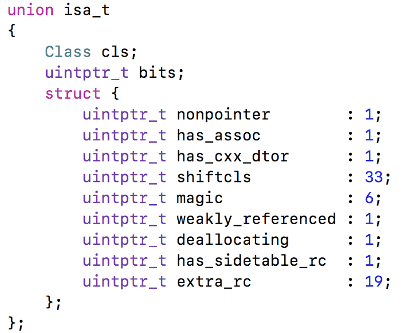

 因为 isa 指针的定义区分 `__arm64__`（真机）和 `__x86_64__`（mac/模拟器），所以需要用真机运行项目才能看到 `ISA_BITFIELD` 正确的成员变量的值：
 ```
 int main(int argc, char * argv[]) {
    NSString * appDelegateClassName;
    @autoreleasepool {
        appDelegateClassName = NSStringFromClass([AppDelegate class]);
    }
    Person *person = [[Person alloc] init];
    return UIApplicationMain(argc, argv, nil, appDelegateClassName);
}
 ```

查看 person 对象的 isa 指针的内存：
```
(lldb) p/x person->isa
(Class) $0 = 0x1A100455641 Person
```

转成二进制：
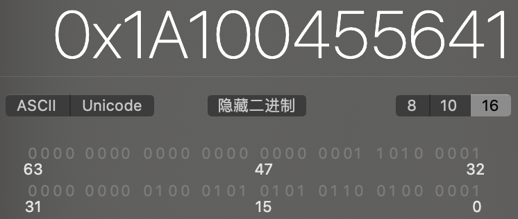

### 位域  
* nonpointer  
0，代表普通的指针，isa 只存储着 Class、Meta-Class 对象的内存地址  
1，代表优化过，isa 使用位域存储更多的信息
* has_assoc  
是否有设置过关联对象，如果没有，释放时会更快
* has_cxx_dtor  
是否有 C++ 的析构函数（.cxx_destruct），如果没有，释放时会更快
* shiftcls  
存储着 Class、Meta-Class 对象的内存地址信息
* magic  
用于在调试时分辨对象是否未完成初始化
* weakly_referenced  
是否有被弱引用指向过，如果没有，释放时会更快
* deallocating  
对象是否正在释放
* extra_rc  
里面存储的值是引用计数器减1
* has_sidetable_rc  
引用计数器是否过大无法存储在 isa 中，如果为1，那么引用计数会存储在一个叫 SideTable 的类的属性中

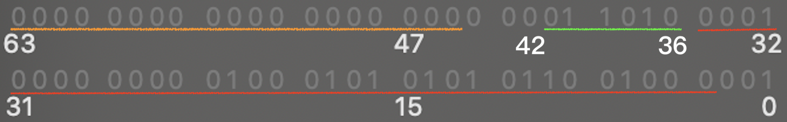
nonpointer：占1个二进制位，在最低位为1（第0位）。  
has_assoc（has_associate）：占1个二进制位，为0（第1位）。  
has_cxx_dtor：占1个二进制位，为0（第2位）。     
shiftcls：占33个二进制位（从第3位到第35位）。 
magic：占6个二进制位（从第36位到第41位）。magic 的值可以从宏 `ISA_MAGIC_VALUE` 看到（1a）。magic == 1a 表示初始化成功。  
weakly_referenced：占1个二进制位，为0（第42位）。  
deallocating：占1个二进制位，为0（第43位）。   
has_sidetable_rc：占1个二进制位，为0（第44位）。  
extra_rc（extra_retain_count）：占19个二进制位，为0（从第45位到63位）。

#### has_assoc 和 weakly_referenced

has_assoc 和 weakly_referenced 标记的是曾经是否设置过，如果添加了 __weak 和关联对象再移除掉，这两个变量的值依然是1：
```
int main(int argc, char * argv[]) {
    NSString * appDelegateClassName;
    @autoreleasepool {
        appDelegateClassName = NSStringFromClass([AppDelegate class]);
    }
    Person *person = [[Person alloc] init];
    __weak Person *weakPerson = person;
    weakPerson = nil;
    objc_setAssociatedObject(person, @"name", @"Tom", OBJC_ASSOCIATION_COPY_NONATOMIC); //添加关联对象
    objc_setAssociatedObject(person, @"name", nil, OBJC_ASSOCIATION_COPY_NONATOMIC); //移除关联对象
    return UIApplicationMain(argc, argv, nil, appDelegateClassName);
}
```

查看内存：
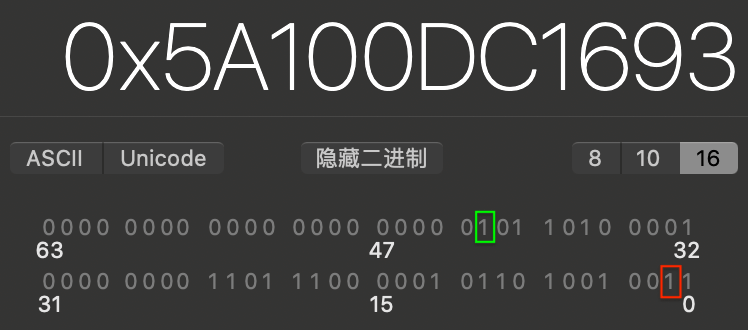

#### 如果没有，释放时会更快
如果 has_assoc、has_cxx_dtor 和 weakly_referenced 为0，即没有添加过关联对象、没有析构函数和没有被弱引用指向过，会让实例对象的释放变得更快。这点可以从源码里看出来。  

销毁实列对象的方法 objc_destructInstance：
```
/***********************************************************************
* objc_destructInstance
* Destroys an instance without freeing memory. 
* Calls C++ destructors.
* Calls ARC ivar cleanup.
* Removes associative references.
* Returns `obj`. Does nothing if `obj` is nil.
**********************************************************************/
void *objc_destructInstance(id obj) 
{
    if (obj) {
        // Read all of the flags at once for performance.
        bool cxx = obj->hasCxxDtor();
        bool assoc = obj->hasAssociatedObjects();

        // This order is important.
        if (cxx) object_cxxDestruct(obj);
        if (assoc) _object_remove_assocations(obj);
        obj->clearDeallocating();
    }

    return obj;
}
```

可以看到在销毁实例对象的方法里，判断了有没有析构函数和关联对象，如果有的话需要先处理析构函数和关联对象。

Jump To Definition -> clearDeallocating：
```
inline void 
objc_object::clearDeallocating()
{
    if (slowpath(!isa.nonpointer)) {
        // Slow path for raw pointer isa.
        sidetable_clearDeallocating();
    }
    else if (slowpath(isa.weakly_referenced  ||  isa.has_sidetable_rc)) {
        // Slow path for non-pointer isa with weak refs and/or side table data.
        clearDeallocating_slow();
    }

    assert(!sidetable_present());
}
```

Jump To Definition -> clearDeallocating_slow：
```
// Slow path of clearDeallocating() 
// for objects with nonpointer isa
// that were ever weakly referenced 
// or whose retain count ever overflowed to the side table.
NEVER_INLINE void
objc_object::clearDeallocating_slow()
{
    ASSERT(isa.nonpointer  &&  (isa.weakly_referenced || isa.has_sidetable_rc));

    SideTable& table = SideTables()[this];
    table.lock();
    if (isa.weakly_referenced) {
        weak_clear_no_lock(&table.weak_table, (id)this);
    }
    if (isa.has_sidetable_rc) {
        table.refcnts.erase(this);
    }
    table.unlock();
}
```

在 `clearDeallocating()` 方法里判断了是否有弱引用指向过，如果有的话需要在 `clearDeallocating_slow()` 方法里处理 weakly_referenced。

### ISA_MASK 
通过 `isa & ISA_MASK ` 能够取出 shiftcls 的值（Class、Meta-Class 对象的内存地址信息）。因为 `ISA_MASK` 最后面三位都是0，所以获取到的 Class、Meta-Class 对象的内存地址的最后三位肯定也为0。`ISA_MASK`：
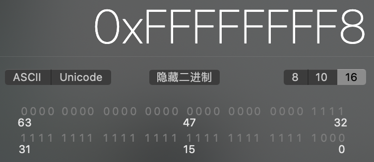

证明：
```
@interface ViewController()
@end

@implementation ViewController
- (void)viewDidLoad {
    [super viewDidLoad];
    NSLog(@"%p", [ViewController class]);
    NSLog(@"%p", object_getClass([ViewController class]));
    NSLog(@"%p", [Person class]);
    NSLog(@"%p", object_getClass([Person class]));
}
@end
```

打印结果：
```
0x1007d5550
0x1007d5578
0x1007d5618
0x1007d55f0
```

可以看到打印结果的最后一位都是”8“或”0“，即”`1000`“或”`0000`“。所以 Class、Meta-Class 对象的内存地址的最后三为为0。

## 位运算补充

用左移定义枚举的成员变量，用”或“运算传入多个值，用”与“运算获取传入的都有哪些值：
```
typedef enum {
    OptionsOne = 1<<0,
    OptionsTwo = 1<<1,
    OptionsThree = 1<<2,
    OptionsFour = 1<<3
} Options;

@interface ViewController ()
@end

@implementation ViewController
- (void)setOptions:(Options)option {
    if (option & OptionsOne) {
        NSLog(@"OptionsOne");
    }
    if (option & OptionsTwo) {
        NSLog(@"OptionsTwo");
    }
    if (option & OptionsThree) {
        NSLog(@"OptionsThree");
    }
    if (option & OptionsFour) {
        NSLog(@"OptionsFour");
    }
}
- (void)viewDidLoad {
    [super viewDidLoad];
    [self setOptions:OptionsOne | OptionsTwo | OptionsFour];
}
@end
```

打印结果：
```
OptionsOne
OptionsTwo
OptionsFour
```

# Class 的结构

类对象和元类对象都是 Class 类型的对象，元类对象是一种特殊的类对象。

在源码 [objc4-781](https://opensource.apple.com/tarballs/objc4/) 中查找 objc_class 的定义。 
```
struct objc_object {
private:
    isa_t isa;

    ...... //省略
}

struct objc_class : objc_object {
    // Class ISA;
    Class superclass;
    cache_t cache;             // formerly cache pointer and vtable
    class_data_bits_t bits;    // class_rw_t * plus custom rr/alloc flags

    ...... //省略
}
```

结构图：
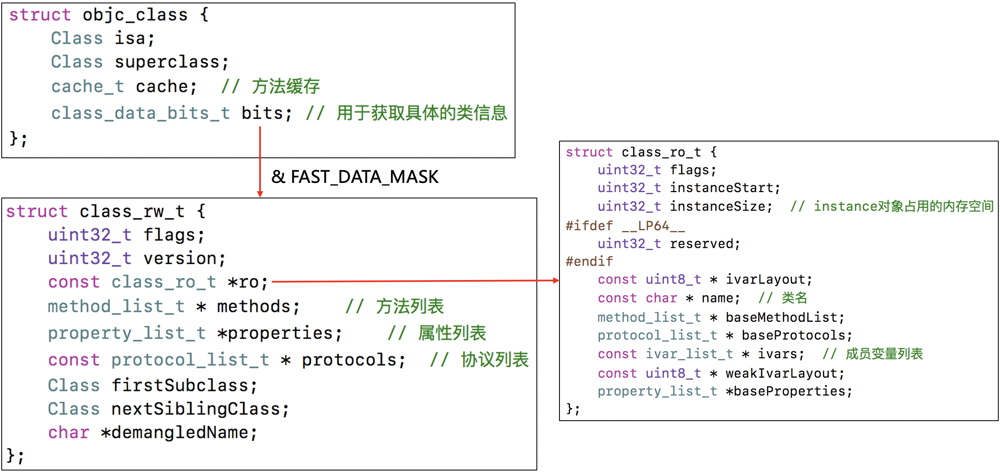

结构图里出现的 `rw`和 `ro` 分别表示 readwrite 和 readonly。

## class_rw_t
class_rw_t 里面的 methods、properties、protocols 是二维数组，是可读可写的，包含了类的初始内容、分类的内容。  
```
struct class_rw_ext_t {
    const class_ro_t *ro;
    method_array_t methods;
    property_array_t properties;
    protocol_array_t protocols;
    char *demangledName;
    uint32_t version;
};

struct class_rw_t {
    ...... //省略

    explicit_atomic<uintptr_t> ro_or_rw_ext;

    ...... //省略
}
```

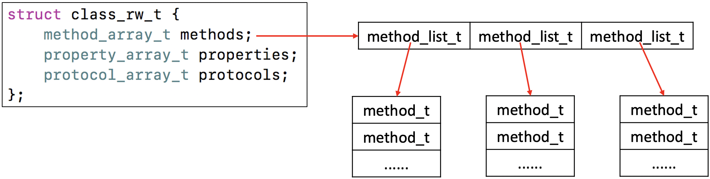

类的信息在编译时是放在 class_ro_t 里的，在程序运行时，会将类的 class_ro_t 里的信息和分类的信息（注意顺序）合并起来放到 class_rw_t 里。找到合并分类信息的方法 `realizeClassWithoutSwift()`：
```
static Class realizeClassWithoutSwift(Class cls, Class previously)
{
    runtimeLock.assertLocked();

    class_rw_t *rw;
    Class supercls;
    Class metacls;

    if (!cls) return nil;
    if (cls->isRealized()) return cls;
    ASSERT(cls == remapClass(cls));

    // fixme verify class is not in an un-dlopened part of the shared cache?

    auto ro = (const class_ro_t *)cls->data(); //取出类信息 ro
    auto isMeta = ro->flags & RO_META;
    if (ro->flags & RO_FUTURE) {
        // This was a future class. rw data is already allocated.
        rw = cls->data();
        ro = cls->data()->ro();
        ASSERT(!isMeta);
        cls->changeInfo(RW_REALIZED|RW_REALIZING, RW_FUTURE);
    } else {
        // Normal class. Allocate writeable class data.
        rw = objc::zalloc<class_rw_t>(); //初始化 rw
        rw->set_ro(ro); //添加类信息 ro
        rw->flags = RW_REALIZED|RW_REALIZING|isMeta;
        cls->setData(rw);
    }

    ...//一堆方法

    // Attach categories
    methodizeClass(cls, previously); //添加分类信息

    return cls;
}
```

可以看到在处理分类的信息之前，先从类里取出了类信息 ro，然后初始化了 rw，再将 ro 保存到 rw 里。

### method_array_t
methods 是用 method_array_t 定义的，method_array_t 是一个 list_array_tt 类型的二维数组，method_array_t 里存储的是数组 method_list_t，数组 method_list_t 里存储的是 method_t：
```
class method_array_t : 
    public list_array_tt<method_t, method_list_t> //list_array_tt<Element, List>
{
    typedef list_array_tt<method_t, method_list_t> Super;

 public:
    method_array_t() : Super() { }
    method_array_t(method_list_t *l) : Super(l) { }

    method_list_t * const *beginCategoryMethodLists() const {
        return beginLists();
    }
    
    method_list_t * const *endCategoryMethodLists(Class cls) const;

    method_array_t duplicate() {
        return Super::duplicate<method_array_t>();
    }
};
```

如果是类对象，methods 里保存的是对象方法，如果是元类对象，methods 里保存的是类方法。  

### property_array_t

properties 是用 property_array_t 定义的，property_array_t 是一个 list_array_tt 类型的二维数组，property_array_t 里存储的是数组 property_t，数组 property_t 存储的是 property_t：
```
class property_array_t : 
    public list_array_tt<property_t, property_list_t> //list_array_tt<Element, List>
{
    typedef list_array_tt<property_t, property_list_t> Super;

 public:
    property_array_t() : Super() { }
    property_array_t(property_list_t *l) : Super(l) { }

    property_array_t duplicate() {
        return Super::duplicate<property_array_t>();
    }
};
```

### protocol_array_t
protocols 是用 protocol_array_t 定义的，protocol_array_t 是一个 list_array_tt 类型的二维数组，protocol_array_t 里存储的是数组 protocol_ref_t，数组 protocol_ref_t 存储的是 protocol_ref_t：
```
class protocol_array_t : 
    public list_array_tt<protocol_ref_t, protocol_list_t> //list_array_tt<Element, List>
{
    typedef list_array_tt<protocol_ref_t, protocol_list_t> Super;

 public:
    protocol_array_t() : Super() { }
    protocol_array_t(protocol_list_t *l) : Super(l) { }

    protocol_array_t duplicate() {
        return Super::duplicate<protocol_array_t>();
    }
};
```


## class_ro_t
class_ro_t 里面的 baseMethodList、baseProtocols、ivars、baseProperties 是一维数组，是只读的，包含了类的初始内容。
```
struct class_ro_t {
    ...... //省略

    method_list_t * baseMethodList;
    protocol_list_t * baseProtocols;
    const ivar_list_t * ivars;
    
    ...... //省略

    property_list_t *baseProperties;
}
```

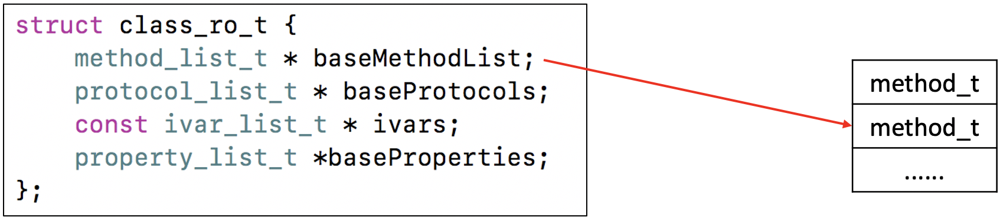

### method_list_t、ivar_list_t 和 property_list_t
```
struct method_list_t : entsize_list_tt<method_t, method_list_t, 0x3> {
    bool isUniqued() const;
    bool isFixedUp() const;
    void setFixedUp();

    uint32_t indexOfMethod(const method_t *meth) const {
        uint32_t i = 
            (uint32_t)(((uintptr_t)meth - (uintptr_t)this) / entsize());
        ASSERT(i < count);
        return i;
    }
};

struct ivar_list_t : entsize_list_tt<ivar_t, ivar_list_t, 0> {
    bool containsIvar(Ivar ivar) const {
        return (ivar >= (Ivar)&*begin()  &&  ivar < (Ivar)&*end());
    }
};

struct property_list_t : entsize_list_tt<property_t, property_list_t, 0> {
};
```

## method_t
method_t 是对方法\函数的封装。
```
using MethodListIMP = IMP;

struct method_t {
    SEL name;
    const char *types;
    MethodListIMP imp;

    ...... //省略
};
```

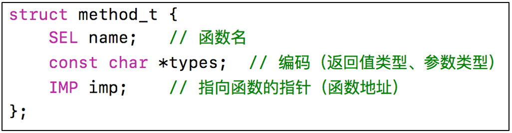

### IMP
`IMP` 代表函数的具体实现：
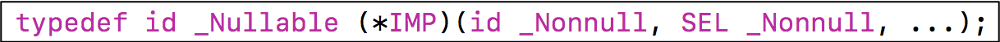

```
@interface Person : NSObject
- (void)test;
@end

@implementation Person
- (void)test {
    NSLog(@"%s", __func__); //断点2
}
@end

int main(int argc, char * argv[]) {
    NSString * appDelegateClassName;
    @autoreleasepool {
        appDelegateClassName = NSStringFromClass([AppDelegate class]);
    }
    Person *person = [[Person alloc] init];
    
    test_objc_class *cls = (__bridge test_objc_class*)[Person class];
    class_rw_t *data = cls->data();
    
    [person test]; //断点1
    
    return UIApplicationMain(argc, argv, nil, appDelegateClassName);
}
```

断点1打印 imp：
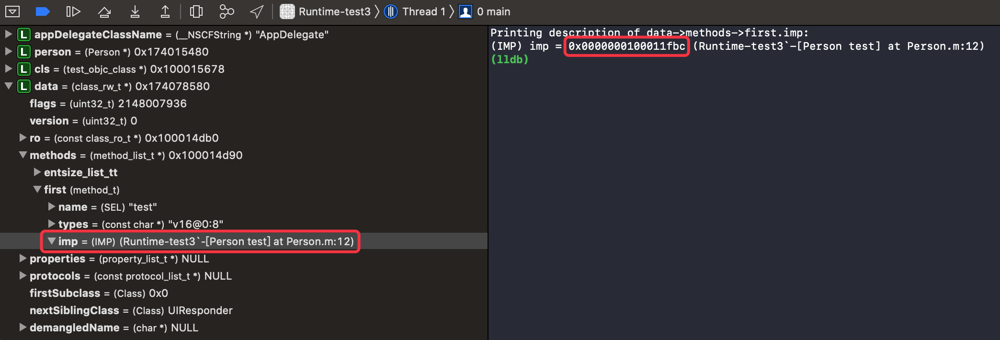

断点2查看 `-(void)test` 的内存（选择 Debug -> Debug Workflow -> Always Show Disassembly）：
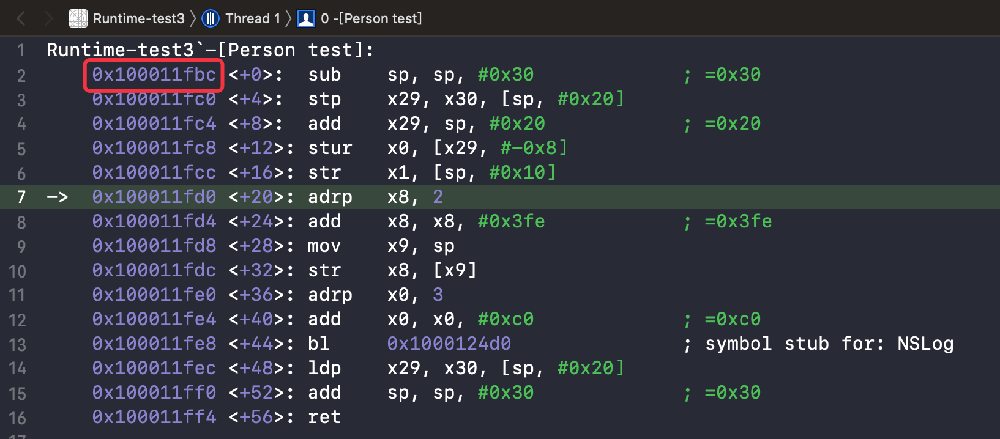

从打印结果可以看到，imp 指向的内存地址就是 `-(void)test` 方法的内存地址。

### SEL
`SEL` 代表方法\函数名，一般叫做选择器，底层结构跟 `char *` 类似。
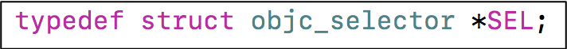
* 可以通过 `@selector()` 和 `sel_registerName()` 获得。
* 可以通过 `sel_getName()` 和 `NSStringFromSelector()` 转成字符串。
* 不同类中相同名字的方法，所对应的方法选择器是相同的

下面的代码需要用到 ClassInfo.h，并且需要真机运行：
```
int main(int argc, char * argv[]) {
    NSString * appDelegateClassName;
    @autoreleasepool {
        appDelegateClassName = NSStringFromClass([AppDelegate class]);
    }
    
    //SEL（@selector()）就是字符串
    NSLog(@"%s, %s", "test", @selector(test));
    
    //可以通过@selector()和sel_registerName()获得
    SEL sel1 = @selector(test);
    SEL sel2 = sel_registerName("test");
    NSLog(@"sel1：%s, sel2：%s", sel1, sel2);
    
    //可以通过sel_getName()和NSStringFromSelector()转成字符串
    char *selString1 = sel_getName(sel1);
    NSString *selString2 = NSStringFromSelector(sel2);
    NSLog(@"selString1：%s, selString2：%@", selString1, selString2);
    
    //不同类中相同名字的方法，所对应的方法选择器是相同的
    NSLog(@"%p, %p, %p", @selector(test), @selector(test), sel_registerName("test"));
    
    return UIApplicationMain(argc, argv, nil, appDelegateClassName);
}
```

打印结果：
```
test, test
sel1：test, sel2：test
selString1：test, selString2：test
0x7fff5281ed06, 0x7fff5281ed06, 0x7fff5281ed06
```

### types
types 包含了函数返回值、参数编码的字符串。
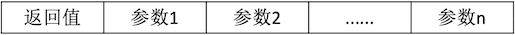

下面的代码需要用到 ClassInfo.h，并且需要真机运行，将 main.m 改成 main.mm：  
例1：
```
@interface Person : NSObject
- (void)test;
@end

@implementation Person
- (void)test {
    NSLog(@"%s", __func__);
}
@end

int main(int argc, char * argv[]) {
    NSString * appDelegateClassName;
    @autoreleasepool {
        appDelegateClassName = NSStringFromClass([AppDelegate class]);
    }
    Person *person = [[Person alloc] init];
    
    test_objc_class *cls = (__bridge test_objc_class*)[Person class];
    class_rw_t *data = cls->data();
    [person test]; //断点1
    
    return UIApplicationMain(argc, argv, nil, appDelegateClassName);
}
```

断点1出打印 types：
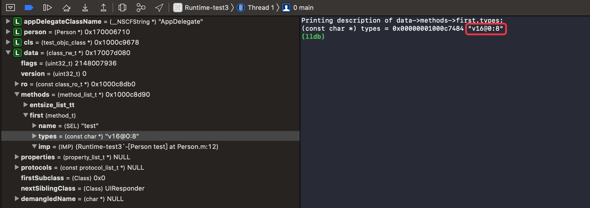
"v16@0:8" 是类型编码：`v`：返回值类型 void，`16`：参数占的字节数之和（id（8个字节） + SEL（8个字节）），`@`：第一个参数的类型 id，`0`：第一个参数内存的开始位置，`:`：第二个参数的类型 SEL，`8`：第二个参数内存的开始位置（id 占了8个字节）。  

下面的代码需要用到 ClassInfo.h，并且需要真机运行，将 main.m 改成 main.mm：
```
@implementation Person
// v 16 @ 0 : 8
//- (void)test:(id)self _cmd:(SEL)_cmd
- (void)test {
    NSLog(@"%s", __func__);
}
@end
```

例2：
```
@interface Person : NSObject
- (int)test:(int)age height:(float)height;
@end

@implementation Person
- (int)test:(int)age height:(float)height {
    NSLog(@"%s", __func__);
}
@end

int main(int argc, char * argv[]) {
    NSString * appDelegateClassName;
    @autoreleasepool {
        appDelegateClassName = NSStringFromClass([AppDelegate class]);
    }
    
    Person *person = [[Person alloc] init];
    test_objc_class *cls = (__bridge test_objc_class*)[Person class];
    class_rw_t *data = cls->data();
    [person test:20 height:30]; //断点1

    return UIApplicationMain(argc, argv, nil, appDelegateClassName);
}
```

断点1出打印 types：：
```
Printing description of data->methods->first.types:
(const char *) types = 0x0000000100087d4d "i24@0:8i16f20"
```

"i24@0:8i16f20" 是类型编码：`i`：范围值类型 int，`24`：参数占的字节数之和（id（8个字节） + SEL（8个字节）+ int（4个字节）+ float（4个字节）），`@`：第一个参数的类型 id，`0`：第一个参数内存的开始位置，`:`：第二个参数的类型 SEL，`8`：第二个参数内存的开始位置（id 占了8个字节），`i`：第三个参数的类型 int，`16`：第三个参数的开始位置（id 占了8个字节 + SEL 占了8个字节），`f`：第四个参数的类型 float，`20`：第四个参数的开始位置（id 占了8个字节 + SEL 占了8个字节 + int 占了4个字节）。
```
@implementation Person
// i 24 @ 0 : 8 i 16 f 20
// int test:(id self, SEL _cmd, int age, float height)
- (void)test {
    NSLog(@"%s", __func__);
}
@end
```

### Type Encoding
[Type Encodings](https://developer.apple.com/library/archive/documentation/Cocoa/Conceptual/ObjCRuntimeGuide/Articles/ocrtTypeEncodings.html) 是 iOS 中提供的一个叫做 @encode 的指令，可以将具体的类型表示成字符串编码。  
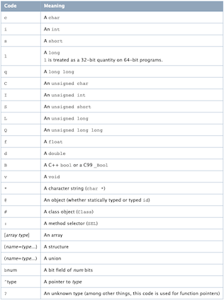

```
int main(int argc, char * argv[]) {
    NSString * appDelegateClassName;
    @autoreleasepool {
        appDelegateClassName = NSStringFromClass([AppDelegate class]);
    }
    
    NSLog(@"id == %s，SEL == %s", @encode(id), @encode(SEL));

    return UIApplicationMain(argc, argv, nil, appDelegateClassName);
}
```

打印结果：
```
 id == @，SEL == :
```

## 方法缓存
Class 内部结构中有个方法缓存 cache（cache_t），用散列表（哈希表）来缓存曾经调用过的方法，可以提高方法的查找速度。
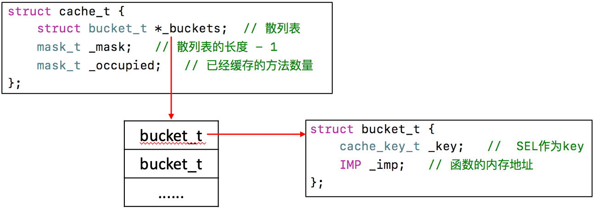

缓存查找：objc-cache.mm -> `bucket_t * cache_t::find(cache_key_t k, id receiver)`

cache_t 里通过 _buckets 缓存方法，通过 _mask 计算索引，通过 _occupied 统计已经缓存的方法的数量。_buckets 里缓存的是 bucke_t 结构体：
```
_key = @selector(方法名)
_imp = 方法的函数地址
```

### _mask
_mask 的值是散列表的长度-1，保证“与”运算的结果不会超出散列表的长度（&_mask <= _mask），即计算出的索引不会越界。

假设 _mask = 0b0000 1000：
```
  0b0100 1101
& 0b0000 1000
--------------
  0b0000 1000
```

散列表（哈希表）的实现逻辑：  
1、实现一个方法1可以计算出索引；  
2、实现一个方法2可以解决索引冲突（如：对索引 -1 计算出新的索引值）；

使用求余 `%` 也可以实现散列表（哈希表），通过求余计算出的索引也可以保证不越界。

### _buckets
_buckets 在初始化时的空间大小是指定好的，并且内部的数据都是 NULL（空间换时间）。如果 _buckets 里的数据满了，_buckets 会将数据清空 -> 扩容x2（一倍）-> 重新缓存。

先通过 `mask_t begin = cache_hash(sel, m)` 计算出索引 begin：  
如果 begin 处没有值，缓存。  
如果 begin 处有值，是当前需要缓存的方法，表示已经缓存过了直接返回。  
如果 begin 处有值，不是当前需要缓存的方法，通过 `(i = cache_next(i, m)` 计算出新的索引，如果新的索引不等于 begin 则重新判断，如果新的索引等于 begin 则去扩容（bad_cache()）。
```
void cache_t::insert(Class cls, SEL sel, IMP imp, id receiver)
{
    ...... //省略

    // Use the cache as-is if it is less than 3/4 full
    mask_t newOccupied = occupied() + 1; //occupied() 散列表长度，newOccupied 添加后的长度
    unsigned oldCapacity = capacity(), capacity = oldCapacity;
    if (slowpath(isConstantEmptyCache())) { //第一次
        // Cache is read-only. Replace it.
        if (!capacity) capacity = INIT_CACHE_SIZE;
        reallocate(oldCapacity, capacity, /* freeOld */false);
    }
    else if (fastpath(newOccupied + CACHE_END_MARKER <= capacity / 4 * 3)) { //已经缓存的数据不足3/4
        // Cache is less than 3/4 full. Use it as-is.
    }
    else {
        capacity = capacity ? capacity * 2 : INIT_CACHE_SIZE; //扩容x2
        if (capacity > MAX_CACHE_SIZE) {
            capacity = MAX_CACHE_SIZE;
        }
        reallocate(oldCapacity, capacity, true); //清空数据 -> 扩容
    }

    bucket_t *b = buckets();
    mask_t m = capacity - 1;
    mask_t begin = cache_hash(sel, m); //计算出索引
    mask_t i = begin;

    // Scan for the first unused slot and insert there.
    // There is guaranteed to be an empty slot because the
    // minimum size is 4 and we resized at 3/4 full.
    do {
        if (fastpath(b[i].sel() == 0)) { //如果 begin 处没有值，缓存
            incrementOccupied();
            b[i].set<Atomic, Encoded>(sel, imp, cls);
            return;
        }
        if (b[i].sel() == sel) { //索引处有值，是当前需要缓存的方法
            // The entry was added to the cache by some other thread
            // before we grabbed the cacheUpdateLock.
            return;
        }
    } while (fastpath((i = cache_next(i, m)) != begin)); //计算出新的索引，判断新的索引是否等于 begin，如果等于 begin 则重新判断，如果不等于 begin 则调用 bad_cache() 处理异常缓存

    cache_t::bad_cache(receiver, (SEL)sel, cls);
}

...... //省略

void cache_t::reallocate(mask_t oldCapacity, mask_t newCapacity, bool freeOld)
{
    bucket_t *oldBuckets = buckets(); //旧的散列表
    bucket_t *newBuckets = allocateBuckets(newCapacity); //新的散列表

    // Cache's old contents are not propagated. 
    // This is thought to save cache memory at the cost of extra cache fills.
    // fixme re-measure this

    ASSERT(newCapacity > 0);
    ASSERT((uintptr_t)(mask_t)(newCapacity-1) == newCapacity-1);

    setBucketsAndMask(newBuckets, newCapacity - 1); //使用新的散列表，_mask = newCapacity - 1
    
    if (freeOld) {
        cache_collect_free(oldBuckets, oldCapacity); //清空旧的数据
    }
}
```

`__arm64__` 下的 cache_next 方法：
```
static inline mask_t cache_next(mask_t i, mask_t mask) {
    return i ? i-1 : mask;
}
```

### 空间换时间
散列表（哈希表）遍历元素的效率比数组高的原因是牺牲了一定的空间换取了时间。  
#### 例1：
```
int main(int argc, const char * argv[]) {
    @autoreleasepool {
        Person *person = [[Person alloc] init];
        test_objc_class *cls = (__bridge test_objc_class*)[Person class];

        [person testPerson];
        [person testPerson];

        NSLog(@"--------"); //断点

        cache_t cache = cls->cache;
        bucket_t *buckets = cache._buckets;
        for (int i = 0; i <= cache._mask; i++) {
            bucket_t bucket = buckets[i];
            if (bucket._key && bucket._key > 10) {
                NSLog(@"%s %p", bucket._key, bucket._imp);
            } else {
                NSLog(@"%lu %p", bucket._key, bucket._imp);
            }
        }
    }
    return 0;
}
```

打印结果：
```
--------
init 0x7ffe558b5aa
testPerson 0xc5e8
0 0x0
1 0x600000781640
```

断点处查看 _mask 和 _occupied：
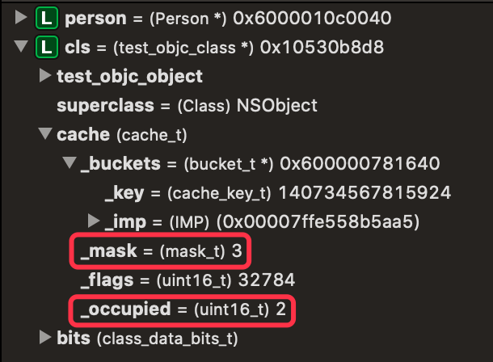

索引 | 缓存的方法
-- | ------
0  | bucket_t（_key = @selector(init), _imp）
1  | bucket_t（_key = @selector(testPerson), _imp）
2  | NULL
3  | NULL

第一次调用 `[person testPerson]` 即 `objc_msgSend(objc_getClass("Person"), sel_registerName("testPerson"))` 向 person 实例对象发送一条 `sel_registerName("testPerson")` 消息，person 会通过 isa 找到 Person 类对象查找 `-(void)testPerson` 方法，先查 cache（_buckets），没查到，再通过 bits 找到 class_rw_t 里的 methods 查，查到后返回。（如果没有找到，再通过 superclass 找到父类的类对象继续查找（查找方式相同）。假设在查找到基类的类对象时找到了 `-(void)testPerson` 方法，实列对象 person 会把 `-(void)testPerson` 方法缓存到 _buckets 里然后返回。）

在缓存 `@selector(testPerson)` 方法时，先计算出索引（1），然后检查索引处是否有值，没值，将 `@selector(testPerson)` 缓存到对象的索引处。

第二次调用 `[person testPerson]` 会先去实例对象 person 的 _buckets 里找，找到对应的索引处的值判断是否是当前方法 `@selector(testPerson)`，如果是就直接返回。（如果不是就将索引 -1 继续在 _buckets 里查找，找到了就直接返回。如果找了一圈还没有找到，会同第一次一样去类对象和父类的类对象查找，找到后缓存到 _buckets 里并返回。）

#### 例2：
```
int main(int argc, const char * argv[]) {
    @autoreleasepool {
        Person *person = [[Person alloc] init];
        test_objc_class *cls = (__bridge test_objc_class*)[Person class];

        [person testPerson];
        [person testPerson];
        [person testStudent];
        [person testStudent2];

        NSLog(@"--------"); //断点

        cache_t cache = cls->cache;
        bucket_t *buckets = cache._buckets;
        for (int i = 0; i <= cache._mask; i++) {
            bucket_t bucket = buckets[i];
            if (bucket._key && bucket._key > 10) {
                NSLog(@"%s %p", bucket._key, bucket._imp);
            } else {
                NSLog(@"%lu %p", bucket._key, bucket._imp);
            }
        }
    }
    return 0;
}
```

打印结果：
```
--------
testStudent2 0xc5
0 0x0
0 0x0
testStudent 0xc5d
0 0x0
0 0x0
0 0x0
1 0x600001008500
```

断点处查看 _mask 和 _occupied：
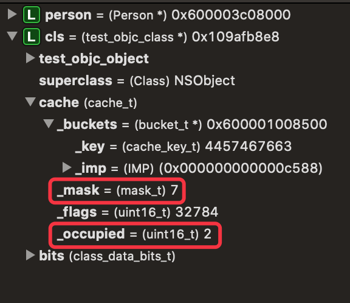

索引 | 缓存的方法
-- | ------
0  | bucket_t（_key = @selector(testStudent2), _imp）
1  | NULL
2  | NULL
3  | bucket_t（_key = @selector(testStudent), _imp）
4  | NULL
5  | NULL
6  | NULL
7  | NULL

在缓存 `@selector(testStudent)` 方法时，_buckets 的空间不够了，_buckets 清空数据 -> 扩容x2（8） -> 重新缓存。先计算出索引（3），然后检查索引处是否有值，没值，将 `@selector(testPerson)` 缓存到对象的索引处。

在缓存 `@selector(testStudent2)` 方法时，先计算出索引（0），然后检查索引处是否有值，没值，将 `@selector(testStudent2)` 缓存到对象的索引处。（如果索引值与 `@selector(testStudent)` 相同（3），检查到索引处有值，然后将索引 -1 获取到新的索引（2），再检查新的索引处是否有值，没值，将 `@selector(testStudent2)` 缓存到对象的索引处。）

#### 例3
```
int main(int argc, char * argv[]) {
    NSString * appDelegateClassName;
    @autoreleasepool {
        appDelegateClassName = NSStringFromClass([AppDelegate class]);
    }
    
    Teacher *teacher = [[Teacher alloc] init];
    test_objc_class *teacherClass = (__bridge test_objc_class *)[Teacher class];

    [teacher teacherTest];
    [teacher studentTest];
    [teacher personTest];

    NSLog(@"--------"); //断点

    cache_t cache = teacherClass->cache;
    bucket_t *buckets = cache._buckets;
    for (int i = 0; i <= cache._mask; i++) {
        bucket_t bucket = buckets[i];
        if (bucket._key && bucket._key > 1) {
            NSLog(@"%s %p", bucket._key, bucket._imp);
        } else {
            NSLog(@"%lu %p", bucket._key, bucket._imp);
        }
    }
    return UIApplicationMain(argc, argv, nil, appDelegateClassName);
}
```

打印结果：
```
0 0x0
studentTest 0x5aa
0 0x0
0 0x0
0 0x0
personTest 0x44c8
0 0x0
1 0x6000025f8380
```

断点处查看 _mask 和 _occupied：
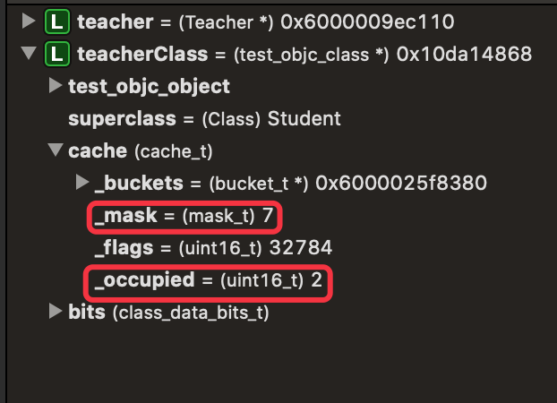

索引 | 缓存的方法
-- | ------
0  | NULL
1  | bucket_t（_key = @selector(studentTest), _imp）
2  | NULL
3  | NULL
4  | NULL
5  | bucket_t（_key = @selector(personTest), _imp）
6  | NULL
7  | NULL

调用 `[teacher teacherTest]` 即 `objc_msgSend(objc_getClass("Teacher"), sel_registerName("teacherTest"))` 向 teacher 实例对象发送一条 `sel_registerName("teacherTest")` 消息，teacher 会通过 isa 找到 Teacher 类对象查找 `-(void)teacherTest` 方法，先查 cache（_buckets），没查到，再通过 bits 找到 class_rw_t 里的 methods 查，查到后缓存到 _buckets 里并返回。

调用 `[teacher studentTest]` 即 `objc_msgSend(objc_getClass("Teacher"), sel_registerName("studentTest"))` 向 teacher 实例对象发送一条 `sel_registerName("studentTest")` 消息，teacher 会通过 isa 找到 Teacher 类对象查找 `-(void)studentTest` 方法，先查 cache（_buckets），没查到，再通过 bits 找到 class_rw_t 里的 methods 查，没查到。 Teacher 类对象通过 superclass 找到父类 Student 类对象，并在 Student 类对象的 _buckets 里查找，没找到，再通过到 class_rw_t 里查找，查到后缓存到 Teacher 类对象的 _buckets 里并返回。

调用 `[teacher personTest]` 即 `objc_msgSend(objc_getClass("Teacher"), sel_registerName("personTest"))` 向 teacher 实例对象发送一条 `sel_registerName("personTest")` 消息，teacher 会通过 isa 找到 Teacher 类对象查找，先查找 _buckets，没查到，再到 class_rw_t 里的方法列表 methods 查找，没查到。Teacher 类对象会通过 superclass 找到父类 Student 类对象，并在 Student 类对象的 _buckets 里查找，没找到，再到 class_rw_t 里查找，没查到。 Student 类对象会通过 superclass 找到父类 Person 类对象，并在 Person 类对象的 _buckets 里查找，没查到，再到 class_rw_t 里查找，查到后缓存到 Teacher 类对象的 _buckets 里并返回。

#### 小结
1. 先查当前类对象的缓存 _buckets，再查当前类对象的方法列表 class_rw_t -> methods;
2. 先查父类类对象的缓存 _buckets，再查父类类对象的方法列表 class_rw_t -> methods;
3. 在当前类对象的缓存 _buckets 里查到后直接返回；
4. 在当前类对象的方法列表 class_rw_t -> methods 里查到后，先缓存到当前类对象的 _buckets 里，再返回；
5. 在父类类对象的缓存 _buckets 里查到后，先缓存到当前类对象的 _buckets 里，再返回；
5. 在父类类对象的方法列表 class_rw_t -> methods 里查到后，先缓存到当前类对象的 _buckets 里，再返回；

# objc_msgSend
OC 中的方法调用，其实都是转换为 objc_msgSend 函数的调用。objc_msgSend 的执行流程可以分为三大阶段，即消息发送、动态方法解析和消息转发。

## objc_msgSend 执行流程

_objc_msgSend 的入口在汇编文件 objc-msg-arm64.s 里。runtime 的实现是用 c、c++ 和汇编语言组成的，对于一些调用频次比较高的方法一般使用汇编语言实现。对于 _objc_msgSend 等方法，为了提高效率都是使用汇编语言实现的。

在源码 [objc4-781](https://opensource.apple.com/tarballs/objc4/) 中查找 _objc_msgSend 的实现。  

### _objc_msgSend

ENTRY 的定义，ENTRY 是一个宏：
```
//macro 是宏的意思
.macro ENTRY /* name */
	.text         //数据段
	.align 5
	.globl    $0  //全局名字
$0:
.endmacro
```

_objc_msgSend 的定义，从 ENTRY 开始，到 END_ENTRY 结束：
```
ENTRY _objc_msgSend
    //---------------------------- 消息发送 start ----------------------------
	UNWIND _objc_msgSend, NoFrame
        //p0寄存器：消息接受者，receiver（_objc_msgSend 的第一个参数）
	cmp	p0, #0			// nil check and tagged pointer check
#if SUPPORT_TAGGED_POINTERS
        //b：跳转、调用。le：小于等于。如果 p0 小于等于 0，就跳转到 LNilOrTagged 方法（如果消息接收者是 nil 就跳转到 LNilOrTagged）
	b.le	LNilOrTagged		//  (MSB tagged pointer looks negative)
#else
	b.eq	LReturnZero
#endif
	ldr	p13, [x0]		// p13 = isa
	GetClassFromIsa_p16 p13		// p16 = class
LGetIsaDone:
	// calls imp or objc_msgSend_uncached
	CacheLookup NORMAL, _objc_msgSend //查找缓存，参数 NORMAL。（实现👇）

#if SUPPORT_TAGGED_POINTERS
LNilOrTagged:
        // 跳转到 LReturnZero 方法
	b.eq	LReturnZero		// nil check

	// tagged
	adrp	x10, _objc_debug_taggedpointer_classes@PAGE
	add	x10, x10, _objc_debug_taggedpointer_classes@PAGEOFF
	ubfx	x11, x0, #60, #4
	ldr	x16, [x10, x11, LSL #3]
	adrp	x10, _OBJC_CLASS_$___NSUnrecognizedTaggedPointer@PAGE
	add	x10, x10, _OBJC_CLASS_$___NSUnrecognizedTaggedPointer@PAGEOFF
	cmp	x10, x16
	b.ne	LGetIsaDone

	// ext tagged
	adrp	x10, _objc_debug_taggedpointer_ext_classes@PAGE
	add	x10, x10, _objc_debug_taggedpointer_ext_classes@PAGEOFF
	ubfx	x11, x0, #52, #8
	ldr	x16, [x10, x11, LSL #3]
	b	LGetIsaDone
// SUPPORT_TAGGED_POINTERS
#endif

LReturnZero:
	// x0 is already zero
	mov	x1, #0
	movi	d0, #0
	movi	d1, #0
	movi	d2, #0
	movi	d3, #0
	ret //相当于 c 语言的 return

	END_ENTRY _objc_msgSend
```

_objc_msgSend 涉及相关方法的实现
```
//👉 CacheLookup 的实现，查找缓存（在当前类对象的 cache 中查找）
.macro CacheLookup
	//
	// Restart protocol:
	//
	//   As soon as we're past the LLookupStart$1 label we may have loaded
	//   an invalid cache pointer or mask.
	//
	//   When task_restartable_ranges_synchronize() is called,
	//   (or when a signal hits us) before we're past LLookupEnd$1,
	//   then our PC will be reset to LLookupRecover$1 which forcefully
	//   jumps to the cache-miss codepath which have the following
	//   requirements:
	//
	//   GETIMP:
	//     The cache-miss is just returning NULL (setting x0 to 0)
	//
	//   NORMAL and LOOKUP:
	//   - x0 contains the receiver
	//   - x1 contains the selector
	//   - x16 contains the isa
	//   - other registers are set as per calling conventions
	//
LLookupStart$1:

	// p1 = SEL, p16 = isa
	ldr	p11, [x16, #CACHE]				// p11 = mask|buckets

#if CACHE_MASK_STORAGE == CACHE_MASK_STORAGE_HIGH_16
	and	p10, p11, #0x0000ffffffffffff	// p10 = buckets (缓存)
	and	p12, p1, p11, LSR #48		// x12 = _cmd & mask (通过"与"运算计算索引)
#elif CACHE_MASK_STORAGE == CACHE_MASK_STORAGE_LOW_4
	and	p10, p11, #~0xf			// p10 = buckets
	and	p11, p11, #0xf			// p11 = maskShift
	mov	p12, #0xffff
	lsr	p11, p12, p11				// p11 = mask = 0xffff >> p11
	and	p12, p1, p11				// x12 = _cmd & mask
#else
#error Unsupported cache mask storage for ARM64.
#endif


	add	p12, p10, p12, LSL #(1+PTRSHIFT)
		             // p12 = buckets + ((_cmd & mask) << (1+PTRSHIFT))

	ldp	p17, p9, [x12]		// {imp, sel} = *bucket
1:	cmp	p9, p1			// if (bucket->sel != _cmd)
	b.ne	2f			//     scan more
	CacheHit $0			// call or return imp (查找到函数地址，调用或者返回。hit：命中，找到。)
	
2:	// not hit: p12 = not-hit bucket（没有查找到）
	CheckMiss $0			// miss if bucket->sel == 0 (实现👇)
	cmp	p12, p10		// wrap if bucket == buckets
	b.eq	3f
	ldp	p17, p9, [x12, #-BUCKET_SIZE]!	// {imp, sel} = *--bucket
	b	1b			// loop

3:	// wrap: p12 = first bucket, w11 = mask
#if CACHE_MASK_STORAGE == CACHE_MASK_STORAGE_HIGH_16
	add	p12, p12, p11, LSR #(48 - (1+PTRSHIFT))
					// p12 = buckets + (mask << 1+PTRSHIFT)
#elif CACHE_MASK_STORAGE == CACHE_MASK_STORAGE_LOW_4
	add	p12, p12, p11, LSL #(1+PTRSHIFT)
					// p12 = buckets + (mask << 1+PTRSHIFT)
#else
#error Unsupported cache mask storage for ARM64.
#endif

	// Clone scanning loop to miss instead of hang when cache is corrupt.
	// The slow path may detect any corruption and halt later.

	ldp	p17, p9, [x12]		// {imp, sel} = *bucket
1:	cmp	p9, p1			// if (bucket->sel != _cmd)
	b.ne	2f			//     scan more
	CacheHit $0			// call or return imp
	
2:	// not hit: p12 = not-hit bucket
	CheckMiss $0			// miss if bucket->sel == 0
	cmp	p12, p10		// wrap if bucket == buckets
	b.eq	3f
	ldp	p17, p9, [x12, #-BUCKET_SIZE]!	// {imp, sel} = *--bucket
	b	1b			// loop

LLookupEnd$1:
LLookupRecover$1:
3:	// double wrap
	JumpMiss $0

.endmacro

...... //省略

//👉 CheckMiss 的实现
.macro CheckMiss
	// miss if bucket->sel == 0
.if $0 == GETIMP
	cbz	p9, LGetImpMiss
.elseif $0 == NORMAL //调用 CacheLookup 时的参数是 NORMAL
	cbz	p9, __objc_msgSend_uncached //调用 __objc_msgSend_uncached 方法（实现👇）
.elseif $0 == LOOKUP
	cbz	p9, __objc_msgLookup_uncached
.else
.abort oops
.endif
.endmacro

.macro JumpMiss
.if $0 == GETIMP
	b	LGetImpMiss
.elseif $0 == NORMAL
	b	__objc_msgSend_uncached
.elseif $0 == LOOKUP
	b	__objc_msgLookup_uncached
.else
.abort oops
.endif
.endmacro

...... //省略

//👉 __objc_msgSend_uncached 的实现
STATIC_ENTRY __objc_msgSend_uncached
UNWIND __objc_msgSend_uncached, FrameWithNoSaves

// THIS IS NOT A CALLABLE C FUNCTION
// Out-of-band p16 is the class to search

MethodTableLookup //查找方法列表（实现👇）
TailCallFunctionPointer x17

END_ENTRY __objc_msgSend_uncached

...... //省略

//👉 MethodTableLookup 的实现
.macro MethodTableLookup
	
	// push frame
	SignLR
	stp	fp, lr, [sp, #-16]!
	mov	fp, sp

	// save parameter registers: x0..x8, q0..q7
	sub	sp, sp, #(10*8 + 8*16)
	stp	q0, q1, [sp, #(0*16)]
	stp	q2, q3, [sp, #(2*16)]
	stp	q4, q5, [sp, #(4*16)]
	stp	q6, q7, [sp, #(6*16)]
	stp	x0, x1, [sp, #(8*16+0*8)]
	stp	x2, x3, [sp, #(8*16+2*8)]
	stp	x4, x5, [sp, #(8*16+4*8)]
	stp	x6, x7, [sp, #(8*16+6*8)]
	str	x8,     [sp, #(8*16+8*8)]

        // 这条注释可以看到在调用 lookUpImpOrForward 函数时的参数    
	// lookUpImpOrForward(obj, sel, cls, LOOKUP_INITIALIZE | LOOKUP_RESOLVER)
	// receiver and selector already in x0 and x1
	mov	x2, x16
	mov	x3, #3
	bl	_lookUpImpOrForward //_lookUpImpOrForward 方法返回的是函数地址 imp，bl imp：跳转\调用imp。（实现👇）

	// IMP in x0
	mov	x17, x0
	
	// restore registers and return
	ldp	q0, q1, [sp, #(0*16)]
	ldp	q2, q3, [sp, #(2*16)]
	ldp	q4, q5, [sp, #(4*16)]
	ldp	q6, q7, [sp, #(6*16)]
	ldp	x0, x1, [sp, #(8*16+0*8)]
	ldp	x2, x3, [sp, #(8*16+2*8)]
	ldp	x4, x5, [sp, #(8*16+4*8)]
	ldp	x6, x7, [sp, #(8*16+6*8)]
	ldr	x8,     [sp, #(8*16+8*8)]

	mov	sp, fp
	ldp	fp, lr, [sp], #16
	AuthenticateLR

.endmacro
```

### _lookUpImpOrForward
👉 \_lookUpImpOrForward 的实现在 objc-runtime-new.mm 文件。老版本的 runtime 源码在这里调用的是 `__class_lookupMethodAndLoadCache3`，`_class_lookupMethodAndLoadCache3` 函数里调用的才是 lookUpImpOrForward：
```
IMP _class_lookupMethodAndLoadCache3(id obj, SEL sel, Class cls) {
    return lookUpImpOrForward(cls, sel, obj, YES/*initalize*/, NO/*cache*/, YES/*reslover*/);
}
```

\_lookUpImpOrForward 是一个通过 c 语言实现的函数（对于函数名，汇编语言转 c 语言需要去掉一个“`_`”）。
```
IMP lookUpImpOrForward(id inst, SEL sel, Class cls, int behavior)
{
    const IMP forward_imp = (IMP)_objc_msgForward_impcache; //默认消息转发（实现👇）
    IMP imp = nil;
    Class curClass;

    runtimeLock.assertUnlocked();

    // Optimistic cache lookup
    if (fastpath(behavior & LOOKUP_CACHE)) { //传入的 behavior 是 LOOKUP_INITIALIZE | LOOKUP_RESOLVER，条件不成立
        imp = cache_getImp(cls, sel); //在缓存里查找
        if (imp) goto done_nolock; //跳转到 done_nolock 方法
    }

    // runtimeLock is held during isRealized and isInitialized checking
    // to prevent races against concurrent realization.

    // runtimeLock is held during method search to make
    // method-lookup + cache-fill atomic with respect to method addition.
    // Otherwise, a category could be added but ignored indefinitely because
    // the cache was re-filled with the old value after the cache flush on
    // behalf of the category.

    runtimeLock.lock();

    // We don't want people to be able to craft a binary blob that looks like
    // a class but really isn't one and do a CFI attack.
    //
    // To make these harder we want to make sure this is a class that was
    // either built into the binary or legitimately registered through
    // objc_duplicateClass, objc_initializeClassPair or objc_allocateClassPair.
    //
    // TODO: this check is quite costly during process startup.
    checkIsKnownClass(cls);

    if (slowpath(!cls->isRealized())) {
        cls = realizeClassMaybeSwiftAndLeaveLocked(cls, runtimeLock);
        // runtimeLock may have been dropped but is now locked again
    }

    if (slowpath((behavior & LOOKUP_INITIALIZE) && !cls->isInitialized())) {
        cls = initializeAndLeaveLocked(cls, inst, runtimeLock);
        // runtimeLock may have been dropped but is now locked again

        // If sel == initialize, class_initialize will send +initialize and 
        // then the messenger will send +initialize again after this 
        // procedure finishes. Of course, if this is not being called 
        // from the messenger then it won't happen. 2778172
    }

    runtimeLock.assertLocked();
    curClass = cls;

    // The code used to lookpu the class's cache again right after
    // we take the lock but for the vast majority of the cases
    // evidence shows this is a miss most of the time, hence a time loss.
    //
    // The only codepath calling into this without having performed some
    // kind of cache lookup is class_getInstanceMethod().

    for (unsigned attempts = unreasonableClassCount();;) {
        // curClass method list.（curClass 的方法列表。）
        // for 循环第一次时，curClass 代表当前类
        // for 循环非第一次时，curClass 代表父类
        Method meth = getMethodNoSuper_nolock(curClass, sel); //到 curClass 的方法列表里面找（实现👇）
        if (meth) { //如果找到了
            imp = meth->imp; //取出方法的函数地址
            goto done; //跳转到 done 方法
        }
        
        // 找到 curClass 的父类赋值给 curClass，并判断新赋值的 curClass 是否为 nil（通过 for 循环重复执行 curClass = curClass->superclass，找到更上层父类）
        if (slowpath((curClass = curClass->superclass) == nil)) { 
            // No implementation found, and method resolver didn't help.
            // Use forwarding.
            imp = forward_imp; //如果新赋值的 curClass 为 nil，说明没有更上层父类了，则设置 imp = forward_imp（消息转发）
            break; //跳出 for 循环
        }

        // Halt if there is a cycle in the superclass chain.
        if (slowpath(--attempts == 0)) { //判断 attempts - 1 后是否等于 0
            _objc_fatal("Memory corruption in class list."); //如果等于 0 报错
        }

        // Superclass cache.
        imp = cache_getImp(curClass, sel); //到父类的缓存里查找（此时 curClass 代表父类）
        
        if (slowpath(imp == forward_imp)) {
            // Found a forward:: entry in a superclass.
            // Stop searching, but don't cache yet; call method
            // resolver for this class first.
            break;
        }
        if (fastpath(imp)) {
            // Found the method in a superclass. Cache it in this class.
            goto done; //如果在父类的缓存里找到了，跳转到 done 方法
        }
    }
    //---------------------------- 消息发送 end ----------------------------

    //---------------------------- 动态方法解析 start ----------------------------
    // No implementation found. Try method resolver once.
    
    if (slowpath(behavior & LOOKUP_RESOLVER)) { //behavior 里是否包含 LOOKUP_RESOLVER，判断是否有过动态方法解析了（传入的 behavior 是 LOOKUP_INITIALIZE | LOOKUP_RESOLVER）
        behavior ^= LOOKUP_RESOLVER; //再加一个 LOOKUP_RESOLVER（动态方法解析执行完成后，会再走一遍 lookUpImpOrForward，保证只操作一次动态方法解析）
        return resolveMethod_locked(inst, sel, cls, behavior); //实现👇
    }
    //---------------------------- 动态方法解析 end ----------------------------

 done:
    log_and_fill_cache(cls, imp, sel, inst, curClass); //将 curClass 类里找到的函数地址 imp 填充到 cls 类（objc_msgSend 的接收者）里的缓存里（实现👇）
    runtimeLock.unlock();
 done_nolock:
    if (slowpath((behavior & LOOKUP_NIL) && imp == forward_imp)) {
        return nil;
    }
    return imp; //返回函数地址
}
```

消息发送相关方法实现
```
//👉 getMethodNoSuper_nolock 的实现
static method_t *
getMethodNoSuper_nolock(Class cls, SEL sel)
{
    runtimeLock.assertLocked();

    ASSERT(cls->isRealized());
    // fixme nil cls? 
    // fixme nil sel?

    auto const methods = cls->data()->methods(); //cls->data() 返回到是 class_rw_t，相当于 class_rw_t->methods()
    for (auto mlists = methods.beginLists(),
              end = methods.endLists();
         mlists != end;
         ++mlists)
    {
        // <rdar://problem/46904873> getMethodNoSuper_nolock is the hottest
        // caller of search_method_list, inlining it turns
        // getMethodNoSuper_nolock into a frame-less function and eliminates
        // any store from this codepath.
        method_t *m = search_method_list_inline(*mlists, sel); //到方法列表里查找（实现👇）
        if (m) return m;
    }

    return nil;
}

...... //省略

//👉 search_method_list_inline 的实现
static method_t *
search_method_list_inline(const method_list_t *mlist, SEL sel)
{
    int methodListIsFixedUp = mlist->isFixedUp();
    int methodListHasExpectedSize = mlist->entsize() == sizeof(method_t);
    
    if (fastpath(methodListIsFixedUp && methodListHasExpectedSize)) { //是否是排好序的方法列表
        return findMethodInSortedMethodList(sel, mlist); //在已经排好序的方法列表里面查找（二分查找）（实现👇）
    } else {
        // 在没有排好序的方法列表里遍历查找
        // Linear search of unsorted method list
        for (auto& meth : *mlist) { 
            if (meth.name == sel) return &meth;
        }
    }

#if DEBUG
    // sanity-check negative results
    if (mlist->isFixedUp()) {
        for (auto& meth : *mlist) {
            if (meth.name == sel) {
                _objc_fatal("linear search worked when binary search did not");
            }
        }
    }
#endif

    return nil;
}

...... //省略

//👉 findMethodInSortedMethodList 的实现
ALWAYS_INLINE static method_t *
findMethodInSortedMethodList(SEL key, const method_list_t *list)
{
    ASSERT(list);

    const method_t * const first = &list->first;
    const method_t *base = first;
    const method_t *probe;
    uintptr_t keyValue = (uintptr_t)key;
    uint32_t count;
    //二分查找
    for (count = list->count; count != 0; count >>= 1) {
        probe = base + (count >> 1);
        
        uintptr_t probeValue = (uintptr_t)probe->name;
        
        if (keyValue == probeValue) {
            // `probe` is a match.
            // Rewind looking for the *first* occurrence of this value.
            // This is required for correct category overrides.
            while (probe > first && keyValue == (uintptr_t)probe[-1].name) {
                probe--;
            }
            return (method_t *)probe;
        }
        
        if (keyValue > probeValue) {
            base = probe + 1;
            count--;
        }
    }
    
    return nil;
}

...... //省略

//👉 log_and_fill_cache 的实现
static void
log_and_fill_cache(Class cls, IMP imp, SEL sel, id receiver, Class implementer)
{
#if SUPPORT_MESSAGE_LOGGING
    if (slowpath(objcMsgLogEnabled && implementer)) {
        bool cacheIt = logMessageSend(implementer->isMetaClass(), 
                                      cls->nameForLogging(),
                                      implementer->nameForLogging(), 
                                      sel);
        if (!cacheIt) return;
    }
#endif
    cache_fill(cls, sel, imp, receiver); //填充到缓存
}

//cache_fill 的实现在 objc-cache.mm 文件
void cache_fill(Class cls, SEL sel, IMP imp, id receiver)
{
    runtimeLock.assertLocked();

#if !DEBUG_TASK_THREADS
    // Never cache before +initialize is done
    if (cls->isInitialized()) {
        cache_t *cache = getCache(cls);
#if CONFIG_USE_CACHE_LOCK
        mutex_locker_t lock(cacheUpdateLock);
#endif
        cache->insert(cls, sel, imp, receiver); //填充到缓存的具体实现（实现👇）
    }
#else
    _collecting_in_critical();
#endif
}

...... //省略

//👉 cache_t::insert 的实现
ALWAYS_INLINE
void cache_t::insert(Class cls, SEL sel, IMP imp, id receiver)
{
#if CONFIG_USE_CACHE_LOCK
    cacheUpdateLock.assertLocked();
#else
    runtimeLock.assertLocked();
#endif

    ASSERT(sel != 0 && cls->isInitialized());

    // Use the cache as-is if it is less than 3/4 full
    mask_t newOccupied = occupied() + 1;
    unsigned oldCapacity = capacity(), capacity = oldCapacity;
    if (slowpath(isConstantEmptyCache())) {
        // Cache is read-only. Replace it.
        if (!capacity) capacity = INIT_CACHE_SIZE;
        reallocate(oldCapacity, capacity, /* freeOld */false);
    }
    else if (fastpath(newOccupied + CACHE_END_MARKER <= capacity / 4 * 3)) { //判断添加后的剩余空间
        // Cache is less than 3/4 full. Use it as-is.
    }
    else { //扩容x2
        capacity = capacity ? capacity * 2 : INIT_CACHE_SIZE;
        if (capacity > MAX_CACHE_SIZE) {
            capacity = MAX_CACHE_SIZE;
        }
        reallocate(oldCapacity, capacity, true);
    }

    bucket_t *b = buckets();
    mask_t m = capacity - 1;
    mask_t begin = cache_hash(sel, m); //计算索引
    mask_t i = begin;

    // Scan for the first unused slot and insert there.
    // There is guaranteed to be an empty slot because the
    // minimum size is 4 and we resized at 3/4 full.
    do {
        if (fastpath(b[i].sel() == 0)) { //索引处没有方法
            incrementOccupied();
            b[i].set<Atomic, Encoded>(sel, imp, cls); //添加到缓存中对应的索引处
            return;
        }
        if (b[i].sel() == sel) {  //索引处有方法并且是同一个方法，表示已经存储过了，返回
            // The entry was added to the cache by some other thread
            // before we grabbed the cacheUpdateLock.
            return;
        }
    } while (fastpath((i = cache_next(i, m)) != begin)); //重新计算索引（当前索引-1），判断是否查了一圈了

    cache_t::bad_cache(receiver, (SEL)sel, cls);
}
```

### resolveMethod_locked()
动态方法解析相关方法实现
```
//👉 resolveMethod_locked 的实现
static NEVER_INLINE IMP
resolveMethod_locked(id inst, SEL sel, Class cls, int behavior)
{
    runtimeLock.assertLocked();
    ASSERT(cls->isRealized());

    runtimeLock.unlock();

    if (! cls->isMetaClass()) { 
        // 不是元类对象
        // try [cls resolveInstanceMethod:sel]
        resolveInstanceMethod(inst, sel, cls); //实现👇
    } 
    else {
        // 是元类对象
        // try [nonMetaClass resolveClassMethod:sel]
        // and [cls resolveInstanceMethod:sel]
        resolveClassMethod(inst, sel, cls); //实现👇
        if (!lookUpImpOrNil(inst, sel, cls)) {
            resolveInstanceMethod(inst, sel, cls); //实现👇
        }
    }

    // chances are that calling the resolver have populated the cache
    // so attempt using it
    return lookUpImpOrForward(inst, sel, cls, behavior | LOOKUP_CACHE); //动态方法解析相关方法调用完成后，会再走一遍 lookUpImpOrForward 方法，即消息发送的第二步（实现👆）
}

//👉 resolveInstanceMethod 的实现
static void resolveInstanceMethod(id inst, SEL sel, Class cls)
{
    runtimeLock.assertUnlocked();
    ASSERT(cls->isRealized());
    SEL resolve_sel = @selector(resolveInstanceMethod:);

    if (!lookUpImpOrNil(cls, resolve_sel, cls->ISA())) {
        // Resolver not implemented.
        return;
    }

    BOOL (*msg)(Class, SEL, SEL) = (typeof(msg))objc_msgSend;
    bool resolved = msg(cls, resolve_sel, sel); //让 cls 调用 resolve_sel 方法

    // Cache the result (good or bad) so the resolver doesn't fire next time.
    // +resolveInstanceMethod adds to self a.k.a. cls
    IMP imp = lookUpImpOrNil(inst, sel, cls);

    if (resolved  &&  PrintResolving) {
        if (imp) {
            _objc_inform("RESOLVE: method %c[%s %s] "
                         "dynamically resolved to %p", 
                         cls->isMetaClass() ? '+' : '-', 
                         cls->nameForLogging(), sel_getName(sel), imp);
        }
        else {
            // Method resolver didn't add anything?
            _objc_inform("RESOLVE: +[%s resolveInstanceMethod:%s] returned YES"
                         ", but no new implementation of %c[%s %s] was found",
                         cls->nameForLogging(), sel_getName(sel), 
                         cls->isMetaClass() ? '+' : '-', 
                         cls->nameForLogging(), sel_getName(sel));
        }
    }
}

//👉 resolveClassMethod 的实现
static void resolveClassMethod(id inst, SEL sel, Class cls)
{
    runtimeLock.assertUnlocked();
    ASSERT(cls->isRealized());
    ASSERT(cls->isMetaClass());

    if (!lookUpImpOrNil(inst, @selector(resolveClassMethod:), cls)) {
        // Resolver not implemented.
        return;
    }

    Class nonmeta;
    {
        mutex_locker_t lock(runtimeLock);
        nonmeta = getMaybeUnrealizedNonMetaClass(cls, inst);
        // +initialize path should have realized nonmeta already
        if (!nonmeta->isRealized()) {
            _objc_fatal("nonmeta class %s (%p) unexpectedly not realized",
                        nonmeta->nameForLogging(), nonmeta);
        }
    }
    BOOL (*msg)(Class, SEL, SEL) = (typeof(msg))objc_msgSend;
    bool resolved = msg(nonmeta, @selector(resolveClassMethod:), sel);

    // Cache the result (good or bad) so the resolver doesn't fire next time.
    // +resolveClassMethod adds to self->ISA() a.k.a. cls
    IMP imp = lookUpImpOrNil(inst, sel, cls);

    if (resolved  &&  PrintResolving) {
        if (imp) {
            _objc_inform("RESOLVE: method %c[%s %s] "
                         "dynamically resolved to %p", 
                         cls->isMetaClass() ? '+' : '-', 
                         cls->nameForLogging(), sel_getName(sel), imp);
        }
        else {
            // Method resolver didn't add anything?
            _objc_inform("RESOLVE: +[%s resolveClassMethod:%s] returned YES"
                         ", but no new implementation of %c[%s %s] was found",
                         cls->nameForLogging(), sel_getName(sel), 
                         cls->isMetaClass() ? '+' : '-', 
                         cls->nameForLogging(), sel_getName(sel));
        }
    }
}
```

### __objc_msgForward_impcache
消息转发相关方法的实现
👉 __objc_msgForward_impcache 方法的实现在汇编文件 objc-msg-arm64.s
```
	STATIC_ENTRY __objc_msgForward_impcache

	// No stret specialization.
	b	__objc_msgForward

	END_ENTRY __objc_msgForward_impcache

	
	ENTRY __objc_msgForward

	adrp	x17, __objc_forward_handler@PAGE
	ldr	p17, [x17, __objc_forward_handler@PAGEOFF] //实现👇
	TailCallFunctionPointer x17
	
	END_ENTRY __objc_msgForward
```

👉 _objc_forward_handler 的实现在 C 语言文件 objc-runtime.mm。
```
#if !__OBJC2__

// Default forward handler (nil) goes to forward:: dispatch.
void *_objc_forward_handler = nil;
void *_objc_forward_stret_handler = nil;

#else

// Default forward handler halts the process.
__attribute__((noreturn, cold)) void
objc_defaultForwardHandler(id self, SEL sel)
{
    _objc_fatal("%c[%s %s]: unrecognized selector sent to instance %p "
                "(no message forward handler is installed)", 
                class_isMetaClass(object_getClass(self)) ? '+' : '-', 
                object_getClassName(self), sel_getName(sel), self);
}
void *_objc_forward_handler = (void*)objc_defaultForwardHandler;
```

这里的 _objc_forward_handler 指针存储的是 objc_defaultForwardHandler 的函数地址。因为 _objc_forward_handler 没有开源，所以看不到其具体的内部实现，即无法知道该方法在消息转发阶段具体做了什么。在报错信息里可以看到消息转发最后调用了 `__forwarding__` 方法：
```
@interface Person : NSObject
- (void)test;
@end

@implementation Person
@end

int main(int argc, const char * argv[]) {
    @autoreleasepool {
        Person *person = [[Person alloc] init];
        [person test];
    }
    return 0;
}
```

报错信息：
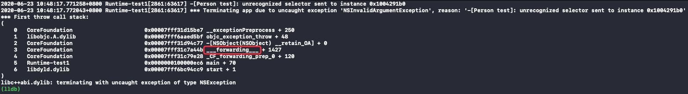

通过反编译可以看到 _objc_forward_handler 的具体实现，这里有一份根据汇编代码翻译成的 C 语言伪代码 `__forwarding__.c`：
```
// 伪代码
int __forwarding__(void *frameStackPointer, int isStret) {
    id receiver = *(id *)frameStackPointer;
    SEL sel = *(SEL *)(frameStackPointer + 8);
    const char *selName = sel_getName(sel);
    Class receiverClass = object_getClass(receiver);

    // 调用 forwardingTargetForSelector:
    if (class_respondsToSelector(receiverClass, @selector(forwardingTargetForSelector:))) {
        id forwardingTarget = [receiver forwardingTargetForSelector:sel]; //实例对象 - 对象方法，类对象 - 类方法
        if (forwardingTarget && forwardingTarget != receiver) {
            if (isStret == 1) {
                int ret;
                objc_msgSend_stret(&ret,forwardingTarget, sel, ...);
                return ret;
            }
            return objc_msgSend(forwardingTarget, sel, ...); //返回值 forwardingTarget 调用方法
        }
    }

    // 僵尸对象
    const char *className = class_getName(receiverClass);
    const char *zombiePrefix = "_NSZombie_";
    size_t prefixLen = strlen(zombiePrefix); // 0xa
    if (strncmp(className, zombiePrefix, prefixLen) == 0) {
        CFLog(kCFLogLevelError,
              @"*** -[%s %s]: message sent to deallocated instance %p",
              className + prefixLen,
              selName,
              receiver);
        <breakpoint-interrupt>
    }

    // 调用 methodSignatureForSelector 获取方法签名后再调用 forwardInvocation
    if (class_respondsToSelector(receiverClass, @selector(methodSignatureForSelector:))) {
        NSMethodSignature *methodSignature = [receiver methodSignatureForSelector:sel]; //实例对象 - 对象方法，类对象 - 类方法
        if (methodSignature) {
            BOOL signatureIsStret = [methodSignature _frameDescriptor]->returnArgInfo.flags.isStruct;
            if (signatureIsStret != isStret) {
                CFLog(kCFLogLevelWarning ,
                      @"*** NSForwarding: warning: method signature and compiler disagree on struct-return-edness of '%s'.  Signature thinks it does%s return a struct, and compiler thinks it does%s.",
                      selName,
                      signatureIsStret ? "" : not,
                      isStret ? "" : not);
            }
            if (class_respondsToSelector(receiverClass, @selector(forwardInvocation:))) {
                NSInvocation *invocation = [NSInvocation _invocationWithMethodSignature:methodSignature frame:frameStackPointer];

                [receiver forwardInvocation:invocation];

                void *returnValue = NULL;
                [invocation getReturnValue:&value];
                return returnValue;
            } else {
                CFLog(kCFLogLevelWarning ,
                      @"*** NSForwarding: warning: object %p of class '%s' does not implement forwardInvocation: -- dropping message",
                      receiver,
                      className);
                return 0;
            }
        }
    }

    SEL *registeredSel = sel_getUid(selName);

    // selector 是否已经在 Runtime 注册过
    if (sel != registeredSel) {
        CFLog(kCFLogLevelWarning ,
              @"*** NSForwarding: warning: selector (%p) for message '%s' does not match selector known to Objective C runtime (%p)-- abort",
              sel,
              selName,
              registeredSel);
    } // doesNotRecognizeSelector
    else if (class_respondsToSelector(receiverClass,@selector(doesNotRecognizeSelector:))) {
        [receiver doesNotRecognizeSelector:sel];
    }
    else {
        CFLog(kCFLogLevelWarning ,
              @"*** NSForwarding: warning: object %p of class '%s' does not implement doesNotRecognizeSelector: -- abort",
              receiver,
              className);
    }

    // The point of no return.
    kill(getpid(), 9);
}
```

## 消息发送
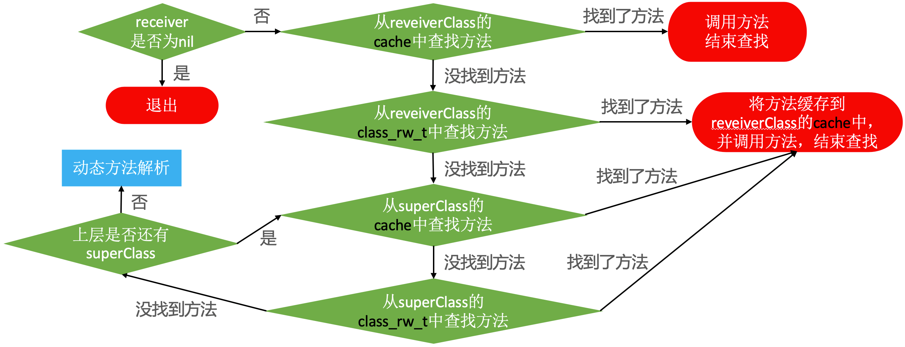

* receiver 通过 isa 指针找到 receiverClass，receiverClass 通过superclass 指针找到 superClass
* 如果是从class_rw_t中查找方法  
已经排序的，二分查找  
没有排序的，遍历查找

流程解析：
1. 首先判断 receiver 是否为空，如果 receiver 为空直接退出，如果 receiver 不为空则到 receiverClass 的 cache 中查找方法；  
2. 从 receiverClass 的 cache 中查找方法，找到了方法，则调用方法结束查找。没找到方法，则从 receiverClass 的 class_rw_t 中查找方法；
3. 从 receiverClass 的 class_rw_t 中查找方法，找到了方法，则将方法缓存到 receiverClass 的 cache 中，并调用方法结束查找。没有找到方法，则从 superclass 的 cache 中查找方法；
4. 从 superclass 的 cache 中查找方法，找到了方法，将方法缓存到 receiverClass 的 cache 中，并调用方法结束查找。没找到方法，则从 superclass 的 class_rw_t 中查找方法；
5. 从 superclass 的 class_rw_t 中查找方法，找到了方法，则将方法缓存到 receiverClass 的 cache 中，并调用方法结束查找。没有找到方法，则判断上层是否还有 superclass；
6. 判断上层是否还有 superclass，有，则回到第4步。没有，则开始动态方法解析；

## 动态方法解析
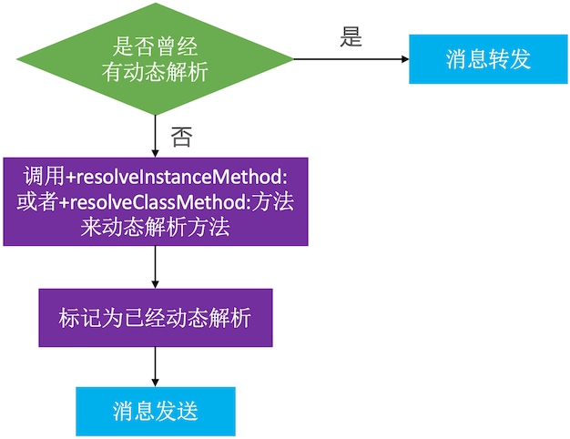
* 开发者可以实现以下方法，来动态添加方法实现
```
+ (BOOL)resolveInstanceMethod:(SEL)sel;
+ (BOOL)resolveClassMethod:(SEL)sel;
```
* 动态解析过后，会重新走“消息发送”的流程（“从 receiverClass的cache 中查找方法”这一步开始执行）

### 动态添加对象方法
```
@interface Person : NSObject
- (void)test;
@end

@implementation Person
- (void)other
{
    NSLog(@"%s", __func__);
}

+ (BOOL)resolveInstanceMethod:(SEL)sel
{
    if (sel == @selector(test)) {
        //获取其它方法
        Method method = class_getInstanceMethod(self, @selector(other));
        //动态添加方法
        class_addMethod(self, sel, method_getImplementation(method), method_getTypeEncoding(method));
        //返回YES代表有动态添加方法
        return YES;
    }
    return [super resolveInstanceMethod:sel];
}
@end

int main(int argc, const char * argv[]) {
    @autoreleasepool {
        Person *person = [[Person alloc] init];
        [person test];
    }
    return 0;
}
```

打印结果：
```
-[Person other]
```

Method 是指向结构体 method_t 的指针，即 struct objc_method == struct method_t，所以 `class_getInstanceMethod(self, @selector(other))` 返回的是结构体 method_t。Method 的定义：
```
typedef struct objc_method *Method;
```

证明：
```
@interface Person : NSObject
- (void)test;
@end

@implementation Person
- (void)other
{
    NSLog(@"%s", __func__);
}

struct method_t {
    SEL sel;
    char *types;
    IMP imp;
};

+ (BOOL)resolveInstanceMethod:(SEL)sel
{
    if (sel == @selector(test)) {
        //获取其它方法
        struct method_t *method = (struct method_t *)class_getInstanceMethod(self, @selector(other));
        NSLog(@"%s %s %p", method->sel, method->types, method->imp);
        //动态添加方法
        class_addMethod(self, sel, method->imp, method->types);
        //返回YES代表有动态添加方法
        return YES;
    }
    return [super resolveInstanceMethod:sel];
}
@end

int main(int argc, const char * argv[]) {
    @autoreleasepool {
        Person *person = [[Person alloc] init];
        [person test];
    }
    return 0;
}
```

打印结果：
```
other v16@0:8 0x100000b40
-[Person other]
```

### 动态添加C语言函数
```
@interface Person : NSObject
- (void)test;
@end

@implementation Person
void c_other(id self, SEL _cmd)
{
    NSLog(@"c_other - %@ - %@", self, NSStringFromSelector(_cmd));
}

+ (BOOL)resolveInstanceMethod:(SEL)sel
{
    if (sel == @selector(test)) {
        //动态添加方法，C语言的函数地址==函数名，函数编码"v16@0:8"（也可以写成 v@:）
        class_addMethod(self, sel, (IMP)c_other, "v16@0:8");
        //返回YES代表有动态添加方法
        return YES;
    }
    return [super resolveInstanceMethod:sel];
}
@end

int main(int argc, const char * argv[]) {
    @autoreleasepool {
        Person *person = [[Person alloc] init];
        [person test];
    }
    return 0;
}
```

### 动态添加类方法
```
@interface Person : NSObject
+ (void)test;
@end

@implementation Person
+ (void)other
{
    NSLog(@"%s", __func__);
}

+ (BOOL)resolveClassMethod:(SEL)sel
{
    if (sel == @selector(test)) {
        //获取其它方法
        Method method = class_getClassMethod(self, @selector(other));
        //动态添加方法
        class_addMethod(object_getClass(self), sel, method_getImplementation(method), method_getTypeEncoding(method));
        //返回YES代表有动态添加方法
        return YES;
    }
    return [super resolveClassMethod:sel];
}
@end

int main(int argc, const char * argv[]) {
    @autoreleasepool {
        [Person test];
    }
    return 0;
}
```

打印结果：
```
+[Person other]
```


## 消息转发
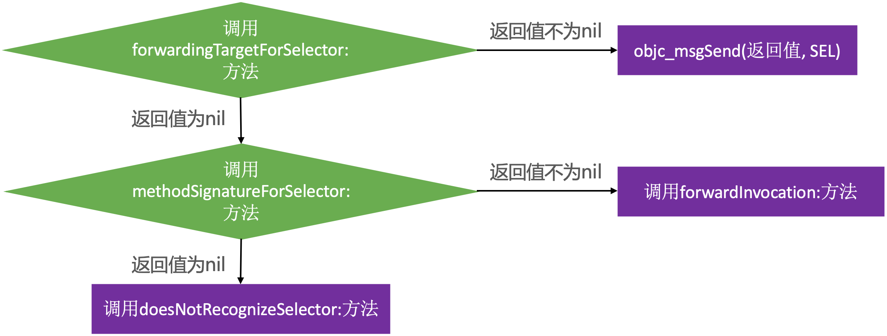
* 开发者可以在 forwardInvocation: 方法中自定义任何逻辑
* 以上方法都有对象方法、类方法2个版本（前面可以是加号+，也可以是减号-）

### 对象方法的消息转发

#### -forwardingTargetForSelector: 方法
`-forwardingTargetForSelector:` 方法有返回值时，返回值调用方法：
```
@interface Student : NSObject
- (void)test;
@end

@implementation Student
- (void)test
{
    NSLog(@"%s", __func__);
}
@end

@interface Person : NSObject
- (void)test;
@end

@implementation Person

- (id)forwardingTargetForSelector:(SEL)aSelector
{
    if (aSelector == @selector(test)) {
        return [[Student alloc] init];
    }
    return [super forwardingTargetForSelector:aSelector];;
}

int main(int argc, const char * argv[]) {
    @autoreleasepool {
        Person *person = [[Person alloc] init];
        [person test];
    }
    return 0;
}
```

打印结果：
```
-[Student test]
```

#### -methodSignatureForSelector: 方法

`-forwardingTargetForSelector:` 方法没有返回值时，会调用 `-methodSignatureForSelector:` 方法获取方法签名：
```
@interface Student : NSObject
- (void)test;
@end

@implementation Student
- (void)test
{
    NSLog(@"%s", __func__);
}
@end

@interface Person : NSObject
- (void)test;
@end

@implementation Person

- (id)forwardingTargetForSelector:(SEL)aSelector
{
    if (aSelector == @selector(test)) {
        return nil;
    }
    return [super forwardingTargetForSelector:aSelector];;
}

//方法签名：返回值类型、参数类型
- (NSMethodSignature *)methodSignatureForSelector:(SEL)aSelector {
    if (aSelector == @selector(test)) {
        return [NSMethodSignature signatureWithObjCTypes:"v16@0:8"]; //也可以写成 v@:
    }
    return [super methodSignatureForSelector:aSelector];
}

- (void)forwardInvocation:(NSInvocation *)anInvocation {
    /*
     anInvocation.target = [[Student alloc] init];
     [anInvocation invoke]; //调用
     */
    [anInvocation invokeWithTarget:[[Student alloc] init]]; //传入 Target 调用
}

int main(int argc, const char * argv[]) {
    @autoreleasepool {
        Person *person = [[Person alloc] init];
        [person test];
    }
    return 0;
}
```

打印结果：
```
-[Student test]
```

如果 `-methodSignatureForSelector:` 方法没有返回方法签名，则会报错：
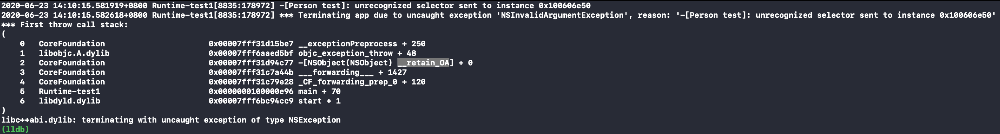

从调用栈可以看到停留在了 `doesNotRecognizeSelector:` 方法：
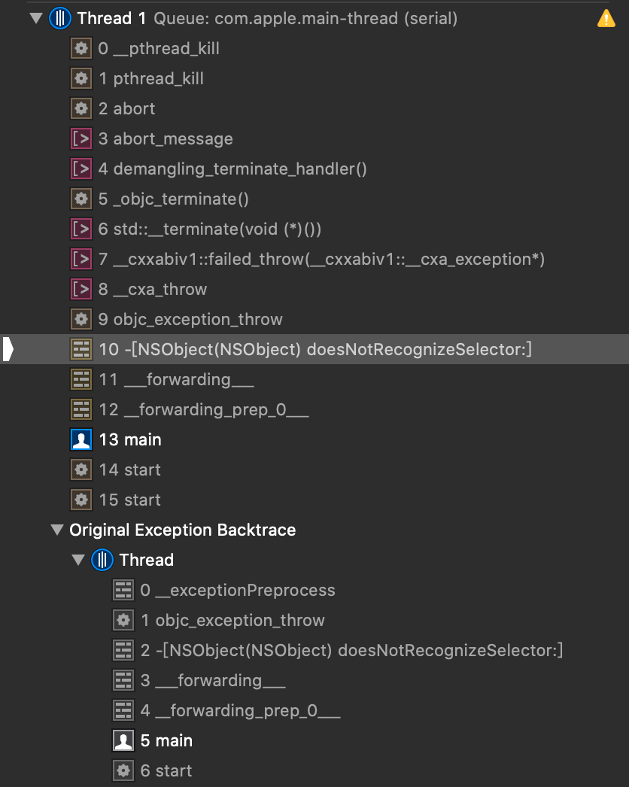

方法签名的另一种返回方式：
```
- (NSMethodSignature *)methodSignatureForSelector:(SEL)aSelector {
    if (aSelector == @selector(test:)) {
        return [[[Student alloc] init] methodSignatureForSelector:aSelector];
    }
    return [super methodSignatureForSelector:aSelector];
}
```

因为 Student 实现了 `-(void)test:(int)age` 方法，所以调用 Student 的 `methodSignatureForSelector:` 方法可以返回 `-(void)test:(int)age` 方法的方法签名。

### 类方法的消息转发

#### +forwardingTargetForSelector: 方法

在 `+forwardingTargetForSelector:` 方法里返回类对象：
```
@interface Student : NSObject
+ (void)test;
@end

@implementation Student
+ (void)test
{
    NSLog(@"%s", __func__);
}
@end

@interface Person : NSObject
+ (void)test;
@end

@implementation Person
+ (id)forwardingTargetForSelector:(SEL)aSelector
{
    if (aSelector == @selector(test)) { //类方法和对象方法的方法名都是 "test"
        return [Student class];         //objc_msgSend([Student class], @selector("test"))
    }
    return [super forwardingTargetForSelector:aSelector];;
}
@end

int main(int argc, const char * argv[]) {
    @autoreleasepool {
        [Person test];
    }
    return 0;
}
```

打印结果：
```
+[Student test]
```

在 `+forwardingTargetForSelector:` 方法里返回实列对象：
```
@interface Student : NSObject
- (void)test;
@end

@implementation Student
- (void)test
{
    NSLog(@"%s", __func__);
}
@end

@interface Person : NSObject
+ (void)test;
@end

@implementation Person
+ (id)forwardingTargetForSelector:(SEL)aSelector
{
    if (aSelector == @selector(test)) { //类方法和对象方法的方法名都是 "test"
        return [[Student alloc] init];  //objc_msgSend([[Student alloc] init], @selector("test"))
    }
    return [super forwardingTargetForSelector:aSelector];;
}
@end

int main(int argc, const char * argv[]) {
    @autoreleasepool {
        [Person test];
    }
    return 0;
}
```

打印结果：
```
-[Student test]
```

#### +methodSignatureForSelector: 方法

`+forwardingTargetForSelector:` 方法没有返回值时，会调用 `+methodSignatureForSelector:` 方法获取方法签名：
```
@interface Student : NSObject
+ (void)test;
@end

@implementation Student
+ (void)test
{
    NSLog(@"%s", __func__);
}
@end

@interface Person : NSObject
+ (void)test;
@end

@implementation Person
+ (id)forwardingTargetForSelector:(SEL)aSelector
{
    if (aSelector == @selector(test)) {
        return nil;
    }
    return [super forwardingTargetForSelector:aSelector];;
}

+ (NSMethodSignature *)methodSignatureForSelector:(SEL)aSelector {
    if (aSelector == @selector(test)) {
        return [NSMethodSignature signatureWithObjCTypes:"v16@0:8"]; //也可以写成 v@:
    }
    return [super methodSignatureForSelector:aSelector];
}

+ (void)forwardInvocation:(NSInvocation *)anInvocation {
    [anInvocation invokeWithTarget:[Student class]];
}
@end

int main(int argc, const char * argv[]) {
    @autoreleasepool {
        [Person test];
    }
    return 0;
}
```

打印结果：
```
+[Student test]
```

[Person test] 的本质是 objc_msgSend([Person test], @selector(test))，会先走一遍“消息发送”流程。因为 Person 没有实现 `-(void)test` 方法，所以

#### NSInvocation
NSInvocation 封装了一个方法调用，包括：方法调用者、方法名、方法参数和返回值（方法签名决定 NSInvocation 的方法参数和返回值）。  
anInvocation.target 方法调用者  
anInvocation.selector 方法名  
[anInvocation getArgument:NULL atIndex:0] 方法参数

示例代码：
```
@interface Student : NSObject
- (int)test:(int)age;
@end

@implementation Student
- (int)test:(int)age
{
    NSLog(@"%s，age == %d", __func__, age);
    return age * 2;
}
@end

@interface Person : NSObject
- (int)test:(int)age;
@end

@implementation Person

- (id)forwardingTargetForSelector:(SEL)aSelector
{
    if (aSelector == @selector(test:)) {
        return nil;
    }
    return [super forwardingTargetForSelector:aSelector];;
}

- (NSMethodSignature *)methodSignatureForSelector:(SEL)aSelector {
    if (aSelector == @selector(test:)) {
        return [NSMethodSignature signatureWithObjCTypes:"i24@0:8i16"];;
    }
    return [super methodSignatureForSelector:aSelector];
}

- (void)forwardInvocation:(NSInvocation *)anInvocation {
    // to do 👇
}
@end

int main(int argc, const char * argv[]) {
    @autoreleasepool {
        Person *person = [[Person alloc] init];
        [person test:15];
    }
    return 0;
}
```

👉 通过 `getArgument:atIndex:` 方法获取参数：
```
- (void)forwardInvocation:(NSInvocation *)anInvocation {
    int age;
    [anInvocation getArgument:&age atIndex:2]; //传入 age 的地址和下标
    NSLog(@"age == %d", age);
}
```

打印结果：
```
age == 15
```

因为 `-(void)test:(int)age` 的 C 语言实现是 `void test(id self, SEL _cmd, int age)`，一共有三个参数，参数顺序：receiver、selector 和 other argument，所以参数 age 的下标是 2。

👉 调用 `invokeWithTarget:` 方法，将消息转发给 Student 的实例对象：
```
- (void)forwardInvocation:(NSInvocation *)anInvocation {
    /**
     anInvocation.target == person对象
     anInvocation.selector == test:
     anInvocation 的参数：15
     */
    [anInvocation invokeWithTarget:[[Student alloc] init]];
}
```

打印结果：
```
-[Student test:]，age == 15
```

在调用 `invokeWithTarget:` 方法前，anInvocation 的 target 是 person 对象，selector 是 `-(void)test:(int)age` 方法，参数是 15。在调用 `invokeWithTarget:` 方法后， anInvocation 的 target 就变成了 student 对象了。相当于向 student 对象发送了一条“test:”消息 `objc_msgSend([[Student alloc] init], @selector(test:))`。

👉 调用 `getReturnValue:` 方法获取返回值：
```
- (void)forwardInvocation:(NSInvocation *)anInvocation {
    [anInvocation invokeWithTarget:[[Student alloc] init]];
    int returnAge;
    [anInvocation getReturnValue:&returnAge];
    NSLog(@"returnAge == %d", returnAge);
}
```

打印结果：
```
-[Student test:]，age == 15
returnAge == 30
```

### @synthesize、@dynamic

@synthesize 会自动生成属性 age 的成员变量 _age，同时生成属性 age 的 setter 和 getter 方法的实现。现在的 xcode 都是默认生成了，不用手写了。
```
@interface Student : NSObject
@property (nonatomic, assign) int age;
@end

@implementation Student
@synthesize age = _age;
@end

int main(int argc, const char * argv[]) {
    @autoreleasepool {
        Student *student = [[Student alloc] init];
        student.age = 20;
        NSLog(@"student.age == %d", student.age);
    }
    return 0;
}
```

打印结果：
```
student.age == 20
```

@dynamic 是告诉编译器不需要自动生成属性 age 的成员变量 _age，也不需要生成属性 age 的 setter 和 getter 方法的实现。 
```
@interface Student : NSObject
@property (nonatomic, assign) int age; //声明 age 的 setter 和 getter 方法
@end

@implementation Student
@dynamic age;
@end

int main(int argc, const char * argv[]) {
    @autoreleasepool {
        Student *student = [[Student alloc] init];
        student.age = 20; //[student setAge:20]，有 setter 和 getter 方法的声明，没有 setter 和 getter 方法的实现
        NSLog(@"student.age == %d", student.age);
    }
    return 0;
}
```

报错：unrecognized selector sent to instance
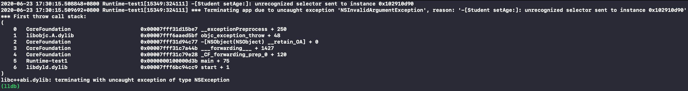

使用动态方法解析解决这个问题：
```
@interface Student : NSObject
@property (nonatomic, assign) int age;
@end

@implementation Student

@dynamic age;

void setAge(id self, SEL _cmd, int age)
{
    NSLog(@"age is %d", age);
}

int age(id self, SEL _cmd)
{
    return 15;
}

+ (BOOL)resolveInstanceMethod:(SEL)sel {
    if (sel == @selector(setAge:)) {
        class_addMethod(self, sel, (IMP)setAge, "v@:i");
        return YES;
    } else if (sel == @selector(age)) {
        class_addMethod(self, sel, (IMP)age, "i@:");
    }
    return [super resolveInstanceMethod:sel];
}
@end
```

打印结果：
```
age is 20
student.age == 15
```

### 小结
* `forwardingTargetForSelector:` 方法、`methodSignatureForSelector:` 方法 和 `forwardInvocation:` 方法本身并没有区分对象方法和类方法，但是在 _objc_forward_handler 的实现中，receiver （实列对象/类对象）会调用对应的方法（对象方法/类方法），所以实现的方法类型需要跟返回的类型统一（实例对象 - 对象方法，类对象 - 类方法）。消息转发中，不要在意方法是对象方法还是类方法，本质还是 objc_msgSend 的消息接收者和方法名。


# super 的本质

```
@interface Person : NSObject
@end

@implementation Person
@end

@interface Student : Person
@end

@implementation Student
- (instancetype)init
{
    self = [super init];
    if (self) {
        NSLog(@"[self class] = %@", [self class]);
        NSLog(@"[self superclass] = %@", [self superclass]);
        NSLog(@"----------------------------");
        NSLog(@"[super class] = %@", [super class]);
        NSLog(@"[super superclass] = %@", [super superclass]);
    }
    return self;
}
@end

int main(int argc, const char * argv[]) {
    @autoreleasepool {
        Student *stu = [[Student alloc] init];
    }
    return 0;
}
```

打印结果：
```
 [self class] = Student
 [self superclass] = Person
 ----------------------------
 [super class] = Student
 [super superclass] = Person
```

这里的 self 就是 person 实例对象，`[self class]` 返回的是 person 实例对象的类对象，`[self superclass]` 返回的是父类 Person 的类对象。  

思考：  
super 代表的是 student 的父类 person，那么 `[super class]` 应该就等于 `[person class]`，打印结果应该是 Person，而 `[super class]`  的打印结果却是 Student❓同样的 `[super superclass]` 应该就等于 `[person superclass]`，打印结果应该是 NSObject，而 `[super superclass]` 打印结果却是 Person❓

## objc_super 结构体

定义一个 `-(void)run` 方法：
```
@interface Person : NSObject
- (void)run;
@end

@implementation Person
- (void)run
{
    NSLog(@"%@", __func__);
}
@end

@interface Student : Person
- (void)run;
@end

@implementation Student
- (void)run
{
    [super run];
}
@end
```

通过终端命令 `xcrun -sdk iphoneos clang -arch arm64  -rewrite-objc Student.m` 生成 c++ 代码 Student.cpp，查看 `-(void)run` 方法的 c++ 实现：
```
static void _I_Student_run(Student * self, SEL _cmd) {
    //[super run];
    ((void (*)(__rw_objc_super *, SEL))(void *)objc_msgSendSuper)((__rw_objc_super){(id)self, (id)class_getSuperclass(objc_getClass("Student"))}, sel_registerName("run"));
}
```

简化后的 `[super run]`：
```
objc_msgSendSuper( (__rw_objc_super){
                        self, //student 实例对象
                        class_getSuperclass(objc_getClass("Student")) //[Person class]
                    }, //__rw_objc_super 结构体
                    sel_registerName("run") //@selector(run)) );
```

可以看到 `[super run]` 的底层实现调用的是 `objc_msgSendSuper()` 方法，第一个参数是 `__rw_objc_super` 结构体，第二参数是 `@selector(run)`。所以 super 的本质就是 `__rw_objc_super` 结构体：
```
struct __rw_objc_super { 
	struct objc_object *object; 
	struct objc_object *superClass; 
	__rw_objc_super(struct objc_object *o, struct objc_object *s) : object(o), superClass(s) {} 
};
```

`__rw_objc_super` 结构体是在编译时生成的，并将参数传入 objc_msgSendSuper() 方法。但是 objc_msgSendSuper() 在定义时该位置的参数是一个 objc_super 结构体：
```
struct objc_super {
    /// Specifies an instance of a class.
    __unsafe_unretained _Nonnull id receiver;

    /// Specifies the particular superclass of the instance to message. 
#if !defined(__cplusplus)  &&  !__OBJC2__
    /* For compatibility with old objc-runtime.h header */
    __unsafe_unretained _Nonnull Class class;
#else
    __unsafe_unretained _Nonnull Class super_class;
#endif
    /* super_class is the first class to search */
};
```

因为 `__rw_objc_super` 和 objc_super 的结构基本一致，所以 `__rw_objc_super` 结构体算是一个自定的 objc_super，作为参数传给 objc_msgSendSuper()。

因为现在使用的是 `__OBJC2__`，所以 objc_super 可以简化为：
```
struct objc_super {
    __unsafe_unretained _Nonnull id receiver; //消息接收者
    __unsafe_unretained _Nonnull Class super_class; //消息接收者的父类
};
```

可以看到 objc_super 结构体的第一个参数是消息接收者，第二个参数是消息接收者的父类。所以 `[super run]` 的底层实现就是：
```
struct __rw_objc_super arg = { 
    self, //消息接收者
    [Person class] //消息接收者的父类 
};
objc_msgSendSuper(arg, @selector(run));
```

## objc_msgSendSuper() 方法

通过终端命令 `xcrun -sdk iphoneos clang -arch arm64  -rewrite-objc Student.m` 生成的 c++ 代码 Student.cpp，查看 `[super run]` 的 c++ 实现是调用的 objc_msgSendSuper() 方法。  

关于 `[super run]` 调用的方法 objc_msgSendSuper()：
```
/** 
 * Sends a message with a simple return value to the superclass of an instance of a class.
 * 
 * @param super A pointer to an \c objc_super data structure. Pass values identifying the
 *  context the message was sent to, including the instance of the class that is to receive the
 *  message and the superclass at which to start searching for the method implementation.
 * @param op A pointer of type SEL. Pass the selector of the method that will handle the message.
 * @param ...
 *   A variable argument list containing the arguments to the method.
 * 
 * @return The return value of the method identified by \e op.
 * 
 * @see objc_msgSend
 */
OBJC_EXPORT id _Nullable
objc_msgSendSuper(struct objc_super * _Nonnull super, SEL _Nonnull op, ...)
    OBJC_AVAILABLE(10.0, 2.0, 9.0, 1.0, 2.0);
```

objc_msgSendSuper：向实例对象的 super 发送带有简单返回值的消息。第一个参数：super，第二个参数：op（方法的选择器 SEL）。  
* super：是一个指向 `objc_super` 结构体的指针，在结构体的内部有接收消息的实例对象和开始搜索方法实现的类对象（从该类对象开始搜索方法的实现）。  
* op：SEL 类型的指针。传递方法的选择器（@selector(run)），该方法就是要处理的消息。

通过注释，可以知道 objc_msgSendSuper() 有两个参数 super 和 SEL，其中 super 里有一个消息接收者和一个类对象。objc_msgSendSuper() 会从 super 里的类对象开始查找 SEL，找到后交给 super 里的消息接收者处理。

综上所述：  
`[super run]`：设置消息接收者是 self（student 实例对象），并从 Person 类对象开始查找 `-(void)run` 方法：
```
objc_msgSendSuper({ self, [Person class] }, @selector(run));
```

`[super method]` 流程图：
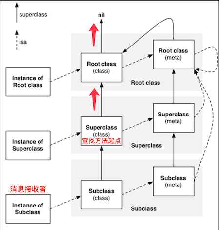

## objc_msgSendSuper2()

### 查看汇编代码
在 `[super superclass];` 处添加断点，选择 Debug -> Debug Workflow -> Always Show Disassembly：
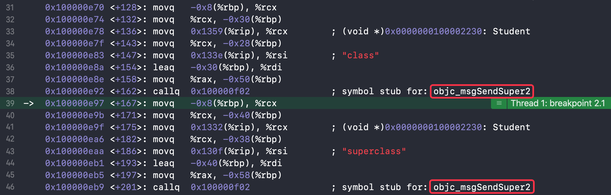
可以看到 `[super class]` 和 `[super superclass]` 底层实现调用的并不是 `objc_msgSendSuper()` 方法而是 `objc_msgSendSuper2()` 方法。


`objc_msgSendSuper2()` 方法的具体实现在汇编文件 objc-msg-arm64.s 里：
```
	ENTRY _objc_msgSendSuper2
	UNWIND _objc_msgSendSuper2, NoFrame

	ldp	p0, p16, [x0]		// p0 = real receiver, p16 = class
	ldr	p16, [x16, #SUPERCLASS]	// p16 = class->superclass
	CacheLookup NORMAL, _objc_msgSendSuper2

	END_ENTRY _objc_msgSendSuper2
```

也可以通过选择 Product -> Perform Action -> Assemble "Student.m" 将 OC 代码转成汇编代码，搜索 “:21”（第21行）找到具体的代码实现：
```
......//省略

Ltmp0:
	.loc	3 21 5 prologue_end     ## Runtime-test2/Student.m:21:5
	movq	-8(%rbp), %rax
	movq	%rax, -32(%rbp)
	movq	_OBJC_CLASSLIST_SUP_REFS_$_(%rip), %rax
	movq	%rax, -24(%rbp)
	movq	_OBJC_SELECTOR_REFERENCES_(%rip), %rsi
	leaq	-32(%rbp), %rdi
	callq	_objc_msgSendSuper2
	.loc	3 22 1                  ## Runtime-test2/Student.m:22:1
	addq	$32, %rsp
	popq	%rbp
	retq

......//省略
```

右边的注释代表的是 Student.m 第21行（:21）。在这里也可以看到 `[super run]` 调用的是 `_objc_msgSendSuper2` 方法。

### 查看 LLVM 的中间代码（IR）
Objective-C 在变为机器代码之前，会被 LLVM 编译器转换为[中间代码（Intermediate Representation）](https://llvm.org/docs/LangRef.html)。

|  语法   | 简介  |
| - | ----- |
| @ | 全局变量 |
| % | 局部变量 |
| alloca | 在当前执行的函数的堆栈帧中分配内存，当该函数返回到其调用者时，将自动释放内存 |
| i32 | 32位4字节的整数 |
| align | 对齐 |
| load | 读出 |
| store | 写入 |
| icmp | 两个整数值比较，返回布尔值 |
| br | 选择分支，根据条件来转向 label，不根据条件跳转的话类似 goto |
| label | 代码标签 |
| call | 调用函数 |

```
@interface Person : NSObject
@end

@implementation Person
void test(int param)
{
    
}

- (NSMethodSignature *)methodSignatureForSelector:(SEL)aSelector
{
    return [NSMethodSignature signatureWithObjCTypes:@"v@:"];
}

- (void)forwardInvocation:(NSInvocation *)anInvocation
{
    [super forwardInvocation:anInvocation];
    
    int a = 10;
    int b = 20;
    int c = a + b;
    test(c);
}
@end
```

使用以下命令行指令生成中间代码 Person.ll：
```
clang -emit-llvm -S Person.m
```

找到对应的方法实现：
```
......//省略
//%1*：self，i8*：_cmd，%2*：anInvocation
define internal void @"\01-[Person forwardInvocation:]"(%1*, i8*, %2*) #2 {
  %4 = alloca %1*, align 8
  %5 = alloca i8*, align 8
  %6 = alloca %2*, align 8
  %7 = alloca %struct._objc_super, align 8
  %8 = alloca i32, align 4
  %9 = alloca i32, align 4
  %10 = alloca i32, align 4
  store %1* %0, %1** %4, align 8
  store i8* %1, i8** %5, align 8
  store %2* %2, %2** %6, align 8
  %11 = load %1*, %1** %4, align 8
  %12 = load %2*, %2** %6, align 8
  %13 = bitcast %1* %11 to i8*
  %14 = getelementptr inbounds %struct._objc_super, %struct._objc_super* %7, i32 0, i32 0
  store i8* %13, i8** %14, align 8
  %15 = load %struct._class_t*, %struct._class_t** @"OBJC_CLASSLIST_SUP_REFS_$_", align 8
  %16 = bitcast %struct._class_t* %15 to i8*
  %17 = getelementptr inbounds %struct._objc_super, %struct._objc_super* %7, i32 0, i32 1
  store i8* %16, i8** %17, align 8
  %18 = load i8*, i8** @OBJC_SELECTOR_REFERENCES_.2, align 8, !invariant.load !9
  //调用 objc_msgSendSuper2，参数一：_objc_super，参数二：i8* _cmd
  call void bitcast (i8* (%struct._objc_super*, i8*, ...)* @objc_msgSendSuper2 to void (%struct._objc_super*, i8*, %2*)*)(%struct._objc_super* %7, i8* %18, %2* %12)
  store i32 10, i32* %8, align 4    //将10写入到%8
  store i32 20, i32* %9, align 4    //将20写入到%9
  %19 = load i32, i32* %8, align 4  //将%8读出到%19
  %20 = load i32, i32* %9, align 4  //将%9读出到%20
  %21 = add nsw i32 %19, %20        //将%19加上%20赋值给%21
  store i32 %21, i32* %10, align 4  //将%21写入到%10
  %22 = load i32, i32* %10, align 4 //将%10读出到%22
  call void @test(i32 %22)          //调用 test(%22)
  ret void
}

......//省略
```

### 小结
通过终端命令行生成的 c++ 代码中 `[super run]` 的底层实现是 `objc_msgSendSuper()` 方法，通过查看汇编代码和 LLVM 的中间代码可以看到 `[super run]` 的底层实现是 `objc_msgSendSuper2()` 方法。这个问题还是之前提到过的，通过终端命令生成的编译文件很运行时生成的编译文件相比，在某些细节的地方还是有区别的。不过并不影响理解具体的实现逻辑。

## self、class 和 superclass 的底层实现

self、class 和 superclass 的底层实现在源码 [objc4-781](https://opensource.apple.com/tarballs/objc4/) 的 NSObject.mm 文件。
```
+ (id)self {
    return (id)self;
}

- (id)self {
    return self;
}

+ (Class)class {
    return self;
}

- (Class)class {
    return object_getClass(self);
}

+ (Class)superclass {
    return self->superclass;
}

- (Class)superclass {
    return [self class]->superclass;
}
```

`[super class]` 设置的消息接收者是 self（student 实例对象），并从 Person 类对象开始查找对象方法 `-(Class)class`。在 Person 类对象里没有找到，通过 superclass 指针找到父类的类对象 NSObject，在 NSObject 类对象里找到了对象方法 `-(Class)class` 后交给消息接收者处理。因为是由消息接收者处理对象方法 `-(Class)class`，所以对象方法 `- (Class)class` 的参数 self 自然就是消息接收者本身了。所以 `[super class]` 最终的返回值就是 Student（`[student class]`）。
```
objc_msgSendSuper({ self, [Person class] }, @selector(class));
```

`[super superclass]` 设置的消息接收者是 self（student 实例对象），并从 Person 类对象开始查找对象方法 `-(Class)superclass`。在 Person 类对象里没有找到，通过 superclass 指针找到父类的类对象 NSObject，在 NSObject 类对象里找到了对象方法 `-(Class)superclass` 后交给消息接收者处理。因为是由消息接收者处理对象方法 `-(Class)superclass`，所以对象方法 `- (Class)superclass` 的参数 self 自然就是消息接收者本身了。所以 `[super superclass]` 的返回值就是 Person（`[student superclass]`）。
```
objc_msgSendSuper({ self, [Person class] }, @selector(superclass));
```

现在再看这四个方法，就很清晰了：
```
@implementation Student
- (instancetype)init
{
    self = [super init];
    if (self) {
        [self class];       //消息接收者：student，调用方法：-(void)class
        [self superclass];  //消息接收者：student，调用方法：-(void)superclass

        [super class];      //消息接收者：student，调用方法：-(void)class
        [super superclass]; //消息接收者：student，调用方法：-(void)superclass
    }
    return self;
}
@end
```

## isKindOfClass: 和 isMemberOfClass:

`isKindOfClass:` 和 `isMemberOfClass:` 的底层实现在源码 [objc4-781](https://opensource.apple.com/tarballs/objc4/) 的 NSObject.mm 文件。
```
+ (BOOL)isMemberOfClass:(Class)cls {
    return self->ISA() == cls;
}

- (BOOL)isMemberOfClass:(Class)cls {
    return [self class] == cls;
}

+ (BOOL)isKindOfClass:(Class)cls {
    for (Class tcls = self->ISA(); tcls; tcls = tcls->superclass) {
        if (tcls == cls) return YES;
    }
    return NO;
}

- (BOOL)isKindOfClass:(Class)cls {
    for (Class tcls = [self class]; tcls; tcls = tcls->superclass) {
        if (tcls == cls) return YES;
    }
    return NO;
}
```

* `-isMemberOfClass:`：获取 self 的类对象与传入的 cls 进行比较。

* `+isMemberOfClass:`：因为自身是类方法，所以这里是拿 self->ISA()（元类）作为 tcls 与传入的 cls 进行比较。如果不相等再遍历 tcls 的 superclass 与传入的 cls 进行比较。在遍历过程中有一个相等就结束遍历返回 YES，遍历结束后没有找到相等的类就返回 NO。

* `+isKindOfClass:`：方法内部是一个 for 循环，因为自身是类方法，所以这里是拿 self->ISA()（元类）与传入的 cls 进行比较。如果不相等再遍历 tcls 的 superclass 与传入的 cls 进行比较。遍历过程中有一个相等就结束遍历返回 YES，遍历结束后没有找到相等的类就返回 NO。

* `-isKindOfClass:`：方法内部是一个 for 循环，先获取到 self 的类对象 tcls 与传入的 cls 进行比较。如果不相等再遍历 tcls 的 superclass 与传入的 cls 进行比较。遍历过程中有一个相等就结束遍历返回 YES，遍历结束后没有找到相等的类就返回 NO。

### +isMemberOfClass: 和 +isKindOfClass:
```
@implementation Student
- (instancetype)init
{
    self = [super init];
    if (self) {
        BOOL res1 = [[NSObject class] isKindOfClass:[NSObject class]];   //1
        BOOL res2 = [[NSObject class] isMemberOfClass:[NSObject class]]; //2
        BOOL res3 = [[Person class] isKindOfClass:[Person class]];       //3
        BOOL res4 = [[Person class] isMemberOfClass:[Person class]];     //4
        NSLog(@"%d, %d, %d, %d", res1, res2, res3, res4);
    }
    return self;
}
@end
```

打印结果：
```
1, 0, 0, 0
```

打印结果解析：  
`+isKindOfClass:` 方法，先通过 self->ISA() 找到 NSObject 元类对象，不等于 NSObject 类对象。再通过 NSObject 元类对象的 superclass 指针找到 NSObject 类对象，等于 NSObject 类对象。所以结果等于 YES：
```
NSLog(@"%d", [[NSObject class] isKindOfClass:[NSObject class]]); //1

//等于
NSLog(@"%d", [NSObject isKindOfClass:[NSObject class]]); //1
```

`+isMemberOfClass:` 方法，通过 self->ISA() 找到 NSObject 元类对象，不等于 NSObject 类对象。所以结果等于 NO：
```
NSLog(@"%d", [[NSObject class] isMemberOfClass:[NSObject class]]); //0
//等于
NSLog(@"%d", [NSObject isMemberOfClass:[NSObject class]]); //0
```

`+isKindOfClass:` 方法，先通过 self->ISA() 找到 Person 元类对象，不等于 Person 类对象。再通过 Person 元类对象的 superclass 指针找到 NSObject 元类对象，不等于 Person 类对象。再通过 NSObject 元类对象的 superclass 指针找到 NSObject 类对象，不等于 Person 类对象。所以结果等于 NO：
```
NSLog(@"%d", [[Person class] isKindOfClass:[Person class]]); //0
//等于
NSLog(@"%d", [Person isKindOfClass:[Person class]]); //0
```

`+isMemberOfClass:` 方法，通过 self->ISA() 找到 Person 元类对象，不等于 Person 类对象。所以结果等于 NO：
```
NSLog(@"%d", [[Person class] isMemberOfClass:[Person class]]); //0
//等于
NSLog(@"%d", [Person isMemberOfClass:[Person class]]); //0
```

#### 小结
因为当类对象调用类方法 `+isMemberOfClass:` 和 `+isKindOfClass:` 时，是拿类对象的元类对象跟传入的对象做对比，所以除 NSObject 外，其它类对象调用这两个类方法时，右边传入的至少应该是元类对象才有意义。

### -isMemberOfClass: 和 -isKindOfClass:
```
@implementation Student
- (instancetype)init
{
    self = [super init];
    if (self) {
        Person *person = [[Person alloc] init];
        NSObject *object = [[NSObject alloc] init];
        BOOL res5 = [object isKindOfClass:[NSObject class]];
        BOOL res6 = [object isMemberOfClass:[NSObject class]];
        BOOL res7 = [person isKindOfClass:[Person class]];
        BOOL res8 = [person isMemberOfClass:[Person class]];
        NSLog(@"%d, %d, %d, %d", res5, res6, res7, res8);
    }
    return self;
}
@end
```

打印结果：
```
1, 1, 1, 1
```

`-isKindOfClass:` 方法，通过 [self class] 找到 NSObject 类对象，所以结果等于 YES：
```
NSLog(@"%d", [object isKindOfClass:[NSObject class]]); //1
```

`-isMemberOfClass:` 方法，通过 [self class] 找到 NSObject 类对象，所以结果等于 YES：
```
NSLog(@"%d", [object isMemberOfClass:[NSObject class]]); //1
```

`-isKindOfClass:` 方法，通过 [self class] 找到 Person 类对象，所以结果等于 YES：
```
NSLog(@"%d", [person isKindOfClass:[Person class]]); //1
```

`-isMemberOfClass:` 方法，通过 [self class] 找到 Person 类对象，所以结果等于 YES：
```
NSLog(@"%d", [person isMemberOfClass:[Person class]]); //1
```

#### 小结
因为当实例对象调用对象方法 `-isMemberOfClass:` 和 `-isKindOfClass:` 时，是拿实例对象的类对象跟传入的对象做对比，所以在实例对象调用这两个对象方法时，右边传入的至少应该是类对象才有意义。


## 对象方法的调用原理

### 正常调用
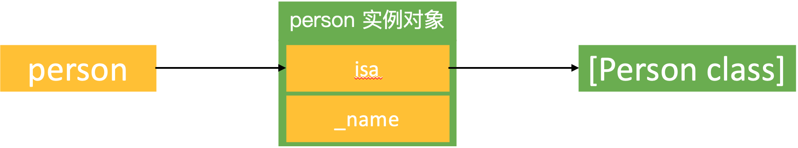
```
@interface Person : NSObject
@property (nonatomic, copy) NSString *name;
- (void)run;
@end

@implementation Person
- (void)run
{
    NSLog(@"Person -run %@", self->_name);
}
@end

@interface ViewController ()
@end

@implementation ViewController
- (void)viewDidLoad {
    [super viewDidLoad];

    Person *person = [[Person alloc] init];
    [person run];
}
@end
```

打印结果：
```
Person -run (null)
```

指针 person 存储着 person 实例对象的地址（person 实例对象的 isa 地址），而 person 实例对象的 isa 指针里存储着 Person 类对象的地址（Person 类对象的 isa 地址）。`[person run]` 是通过 person 实例对象的 isa 指针找到 Person 类对象查找 `-(void)run` 方法，`-(void)run` 方法内部的 self 就是消息接收者 person 实例对象。person 实例对象内部存储着 isa 指针和成员变量，`self->_name` 是从 isa 的地址开始在 person 实例对象的内存里向下查找成员变量 _name。

### 自定义调用
 
```
@interface Person : NSObject
@property (nonatomic, copy) NSString *name;
- (void)run;
@end

@implementation Person
- (void)run
{
    NSLog(@"Person -run %@", self.name);
}
@end

@interface ViewController ()
@end

@implementation ViewController
- (void)viewDidLoad {
    [super viewDidLoad];
    
    id cls = [Person class];
    void *obj = &cls;
    [(__bridge id)obj run];
}
@end
```

打印结果：
```
 Person -run <ViewController: 0x7fd88fb0a400>
```

思考：  
1. `[(__bridge id)obj run]` 为什么能够调用成功？  
2. 为什么 self.name 变成了 ViewController?  

局部变量的内存分配在栈空间，从高地址到低地址：
```
void test()
{
    long long a = 1; //0x7ffeefbff518（高地址）
    long long b = 2; //0x7ffeefbff510   ↓
    long long c = 3; //0x7ffeefbff508   ↓
    long long d = 4; //0x7ffeefbff500（低地址）
    NSLog(@"%p, %p, %p, %p", &a, &b, &c, &d);
}

int main(int argc, const char * argv[]) {
    @autoreleasepool {
        test();
    }
    return 0;
}
```

打印结果：
```
0x7ffeefbff518, 0x7ffeefbff510, 0x7ffeefbff508, 0x7ffeefbff500
```

从打印结果可以看到 a、b、c、d 的内存分配顺序是从高地址到低地址。

`[(__bridge id)obj run]` 图解：
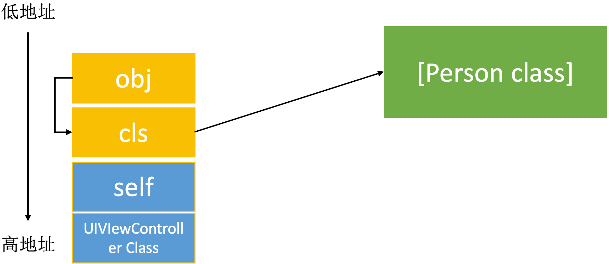 

图中可以看到 obj、cls 和 self 的内存都分配在栈空间，`[UIViewController class]` 在全局区，self 的地址值最大，obj 的地址值最小。self 和 `[UIViewController class]` 来自 `[super viewDidLoad]` 的结构体 `__rw_objc_super`，`__rw_objc_super` 也是一个临时变量：
```
struct __rw_objc_super arg = { 
    self, 
    [ViewController class] 
};
objc_msgSendSuper(arg, @selector(viewDidLoad));
```

这一点可以通过终端打印内存进行验证（`x/4g`：打印4个数据，每个数据8个字节）：
```
(lldb) p/x obj
(Person *) $0 = 0x00007ffeea236178
(lldb) x/4g 0x00007ffeea236178
0x7ffeea236178: 0x00000001059cb5c0 0x00007fc0cb00a9b0
0x7ffeea236188: 0x00000001059cb4f8 0x00007fff51ec8b0c
(lldb) p (Class)0x00000001059cb5c0
(Class) $1 = Person
(lldb) po 0x00007fc0cb00a9b0
<ViewController: 0x7fc0cb00a9b0>

(lldb) p (Class)0x00000001059cb4f8
(Class) $3 = ViewController
```

注释掉 `[super viewDidLoad]` 就会报坏内存访问的错误：
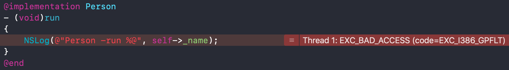

* `[(__bridge id)obj run]` 为什么能够调用成功？  
因为指针 obj 存储着 cls 的地址，而 cls 存储着 Person 类对象的地址（Person 类对象的 isa 地址），所以 `[(__bridge id)obj run]` 是通过 cls 找到 Person 类对象查找 `-(void)run` 方法(这里的 cls 相当于 person 实例对象的 isa)。
* 为什么 self.name 变成了 ViewController？  
因为 `-(void)run` 方法内部的 self 就是消息接收者 obj，`obj->_name` 是在 obj 所在的内存中从 obj 的地址开始向下查找成员变量 _name，而 obj 所在的内存（栈区）向下找到的是 cls 下面的指针 self（ViewController 实例对象），所以最终的打印结果是 `<ViewController: 0x7fd88fb0a400>`。

修改 ViewController.m 实现，添加成员变量 test：
```
@implementation ViewController
- (void)viewDidLoad {
    [super viewDidLoad];
    
    NSString *test = @"123";
    id cls = [Person class];
    void *obj = &cls;
    [(__bridge id)obj run];
}
@end
```

打印结果：
```
Person -run 123
```

指针 obj 存储着 cls 的地址，而 cls 存储着 Person 类对象的地址（Person 类对象的 isa 地址）。`[(__bridge id)obj run]` 是通过 cls 找到 Person 类对象查找 `-(void)run` 方法，`-(void)run` 方法内部的 self 就是消息接收者 obj。从 obj 的内存开始在 obj 所在的内存中向下查找成员变量 _name，最后找到的却是 cls 下面的局部变量 test：
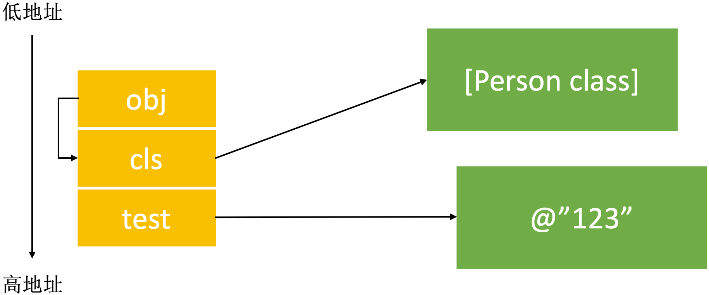 

从图中可以看到 obj、cls 和 test 三个变量的内存都分配在栈空间，test 的地址值最大，obj 的地址值最小。


# Runtime API

实战：
```
@interface Person : NSObject
- (void)run;
@end

@implementation Person
- (void)run
{
    NSLog(@"%s", __func__);
}
@end

@interface Student : NSObject
- (void)run;
@end

@implementation Student
- (void)run
{
    NSLog(@"%s", __func__);
}
@end

int main(int argc, const char * argv[]) {
    @autoreleasepool {
        test1();
        test2();
    }
    return 0;
}
```

## 类

|  方法   | 注释  |
|  -----  | ---  |
| `Class objc_allocateClassPair(Class superclass, const char *name, size_t extraBytes)` | 动态创建一个类（参数：父类，类名，额外的内存空间）|
| `void objc_registerClassPair(Class cls)` | 注册一个类（要在类注册之前添加成员变量）|
| `void objc_disposeClassPair(Class cls)` | 销毁一个类|
| `Class object_getClass(id obj)` | 获取 isa 指向的 Class |
| `Class object_setClass(id obj, Class cls)` | 设置 isa 指向的 Class |
| `BOOL object_isClass(id obj)` | 判断一个 OC 对象是否为 Class |
| `BOOL class_isMetaClass(Class cls)` | 判断一个 Class 是否为元类 |
| `Class class_getSuperclass(Class cls)` | 获取父类 |

`test1()` 实现：
```
void test1()
{
    NSLog(@"---------------------------------------//动态创建一个类，注册一个类");
    Class Teacher = objc_allocateClassPair([NSObject class], "Teacher", 0); //创建类对象和元类对象
    objc_registerClassPair(Teacher); //注册类
    NSLog(@"Teacher 的内存大小%zd个字节", class_getInstanceSize(Teacher)); //8个字节
    
    Person *person = [[Person alloc] init];
    
    NSLog(@"---------------------------------------//获取 isa 指向的 Class");
    NSLog(@"类对象：%p，类对象：%p", [Person class], object_getClass(person));
    NSLog(@"类对象：%p，元类对象：%p", [Person class], object_getClass([Person class]));
    
    NSLog(@"---------------------------------------//设置 isa 指向的 Class");
    object_setClass(person, [Student class]);
    [person run]; //这里的 Person 是 (Student *) 类型，isa 指向 Student 类对象
    
    NSLog(@"---------------------------------------//判断一个 OC 对象是否为 Class");
    NSLog(@"%d %d %d", object_isClass(person), object_isClass([Person class]), object_isClass(object_getClass([Person class]))); //元类对象是一种特殊的类对象
    
    NSLog(@"---------------------------------------//判断一个 Class 是否为元类");
    NSLog(@"%d %d", class_isMetaClass([Person class]), class_isMetaClass(object_getClass([Person class]))); //元类对象是一种特殊的类对象
    
    NSLog(@"---------------------------------------//获取父类");
    NSLog(@"%@类对象：%p, %@元类对象：%p", class_getSuperclass([Person class]), class_getSuperclass([Person class]),
          class_getSuperclass(object_getClass([Person class])), class_getSuperclass(object_getClass([Person class])));

    NSLog(@"---------------------------------------//销毁一个类");
    id teacher2 = [[Teacher alloc] init];
//    person = nil; 
//    teacher = nil; 
    teacher2 = nil; //实例中只要有一个置为 nil，就可以调用了！❓
    objc_disposeClassPair(Teacher); //当类或者它的子类的实例还存在，则不能调用 objc_disposeClassPair 方法
    objc_disposeClassPair(Teacher); //报错“Attempt to use unknown class 0x1030b92a0.”
}
```

打印结果：
```
---------------------------------------//动态创建一个类，注册一个类
Teacher 的内存大小8个字节
---------------------------------------//获取 isa 指向的 Class
类对象：0x100003228，类对象：0x100003228
类对象：0x100003228，元类对象：0x100003200
---------------------------------------//设置 isa 指向的 Class
-[Student run]
---------------------------------------//判断一个 OC 对象是否为 Class
0 1 1
---------------------------------------//判断一个 Class 是否为元类
0 1
---------------------------------------//获取父类
NSObject类对象：0x7fff94b06118, NSObject元类对象：0x7fff94b060f0
---------------------------------------//销毁一个类
objc[15858]: Attempt to use unknown class 0x102905440.
```

## 成员变量

|  方法   | 注释  |
|  -----  | ---  |
| `Ivar class_getInstanceVariable(Class cls, const char *name)` | 获取一个实例变量信息 |
| `Ivar *class_copyIvarList(Class cls, unsigned int *outCount)` | 拷贝实例变量列表（最后需要调用free释放）|
| `void object_setIvar(id obj, Ivar ivar, id value)` | 设置成员变量的值 |
| `id object_getIvar(id obj, Ivar ivar)` | 获取成员变量的值 |
| `BOOL class_addIvar(Class cls, const char * name, size_t size, uint8_t alignment, const char * types)` | 动态添加成员变量（已经注册的类是不能动态添加成员变量的）|
| `const char *ivar_getName(Ivar v)` | 获取成员变量的名字 |
| `const char *ivar_getTypeEncoding(Ivar v)` | 获取成员变量的方法签名 |

`test2()` 实现：
```
void test2()
{
    NSLog(@"---------------------------------------//动态添加成员变量（已经注册的类是不能动态添加成员变量的）");
    Class Teacher = objc_allocateClassPair([NSObject class], "Teacher", 0); //动态创建一个类（包括类对象和元类对象，参数：父类，类名，额外的内存空间）
    
    class_addIvar(Teacher, "_age", 4, 1, @encode(int)); //在类注册之前添加成员变量（因为类的成员变量列表是只读的，所有类一旦注册后就不能修改成员变量列表了）
    class_addIvar(Teacher, "_weight", 4, 1, @encode(int));

    //添加方法是随时可以操作的，最好是写在注册类前，逻辑比较清晰
    class_addMethod(Teacher, @selector(run), (IMP)run, "v@:");
    
    objc_registerClassPair(Teacher); //注册类
    NSLog(@"%zd", class_getInstanceSize(Teacher)); //isa(8个字节) + _age(4个字节) + _weight(4个字节) = 16个字节
    
    NSLog(@"---------------------------------------//修改/获取成员变量的值");
    id teacher = [[Teacher alloc] init];
    [teacher setValue:@10 forKey:@"_age"];
    [teacher setValue:@20 forKey:@"_weight"];
    NSLog(@"_age：%@, _weight：%@", [teacher valueForKey:@"_age"], [teacher valueForKey:@"_weight"]);

    NSLog(@"---------------------------------------//调用添加的方法");
    [teacher run];

    NSLog(@"---------------------------------------//设置 isa 指向的 Class");
    Person *person = [[Person alloc] init];
    object_setClass(person, Teacher);
    [person run];
    
    NSLog(@"---------------------------------------//获取成员变量的相关信息");
    Ivar ageIvar = class_getInstanceVariable([Person class], "_age");
    NSLog(@"%s %s", ivar_getName(ageIvar), ivar_getTypeEncoding(ageIvar));
    
    NSLog(@"---------------------------------------//设置和获取成员变量的值");
    Ivar nameIvar = class_getInstanceVariable([Person class], "_name");
    Person *person2 = [[Person alloc] init];
    object_setIvar(person2, nameIvar, @"name"); //设置 _name
    object_setIvar(person2, ageIvar, (__bridge id)(void *)10); //设置 _age（使用 runtime 方法，底层没有转换直接赋值，先转成指针变量，再转成 id 类型的对象）
    //[person2 setValue:@10 forKey:@"age"]; //NSNumber 类型的 10 在赋值给 age 时会转成 int 类型
    NSLog(@"%@", object_getIvar(person2, nameIvar)); //获取
    
    NSLog(@"---------------------------------------//拷贝实例变量列表（最后需要调用free释放）+ 获取成员变量的相关信息");
    unsigned int count;
    Ivar *ivars = class_copyIvarList([Person class], &count);
    for (int i=0; i<count; i++) {
        Ivar ivar = ivars[i];
        NSLog(@"%s %s", ivar_getName(ivar), ivar_getTypeEncoding(ivar));
    }
    free(ivars);
}
```

在使用 `object_setIvar()` 方法设置 int 类型的成员变量时，因为数值不能直接转为对象，所以先将数值转成指针（指针是用来存值的），再将指针转成 id 类型的对象。

打印结果：
```
---------------------------------------//动态添加成员变量（已经注册的类是不能动态添加成员变量的）
16
---------------------------------------//修改/获取成员变量的值
_age：10, _weight：20
---------------------------------------//调用添加的方法
<Teacher: 0x100525bc0> - run
---------------------------------------//设置 isa 指向的 Class
<Teacher: 0x10041dda0> - run
---------------------------------------//获取成员变量的相关信息
_age i
---------------------------------------//设置和获取成员变量的值
name 10
---------------------------------------//拷贝实例变量列表（最后需要调用free释放）+ 获取成员变量的相关信息
_age i
_name @"NSString"
```


## 属性

|  方法   | 注释  |
|  -----  | ---  |
| `objc_property_t class_getProperty(Class cls, const char *name)` | 获取一个属性 |
| `objc_property_t *class_copyPropertyList(Class cls, unsigned int *outCount)` | 拷贝属性列表 |
| `BOOL class_addProperty(Class cls, const char *name, const objc_property_attribute_t *attributes, unsigned int attributeCount)` | 动态添加属性 |
| `void class_replaceProperty(Class cls, const char *name, const objc_property_attribute_t *attributes, unsigned int attributeCount)` | 动态替换属性 |
| `const char *property_getName(objc_property_t property)` | 获取属性名 |
| `const char *property_getAttributes(objc_property_t property)` | 获取属性的真实类型 |

## 方法

|  方法   | 注释  |
|  -----  | ---  |
| `Method class_getInstanceMethod(Class cls, SEL name)` | 获得一个实例方法 |
| `Method class_getClassMethod(Class cls, SEL name)` | 获得一个类方法 |
| `IMP class_getMethodImplementation(Class cls, SEL name)` | 方法实现相关操作 |
| `IMP method_setImplementation(Method m, IMP imp)` | 方法实现相关操作 |
| `void method_exchangeImplementations(Method m1, Method m2)` | 方法实现相关操作|
| `Method *class_copyMethodList(Class cls, unsigned int *outCount)` | 拷贝方法列表（最后需要调用free释放） |
| `BOOL class_addMethod(Class cls, SEL name, IMP imp, const char *types)` | 动态添加方法 |
| `IMP class_replaceMethod(Class cls, SEL name, IMP imp, const char *types)` | 动态替换方法|
| `SEL method_getName(Method m)` | 获取方法的相关信息（带有copy的需要调用free去释放） |
| `IMP method_getImplementation(Method m)` | 获取方法的相关信息（带有copy的需要调用free去释放）|
| `const char *method_getTypeEncoding(Method m)` | 获取方法的相关信息（带有copy的需要调用free去释放） |
| `unsigned int method_getNumberOfArguments(Method m)` | 获取方法的相关信息（带有copy的需要调用free去释放） |
| `char *method_copyReturnType(Method m)` | 获取方法的相关信息（带有copy的需要调用free去释放） |
| `char *method_copyArgumentType(Method m, unsigned int index)` | 获取方法的相关信息（带有copy的需要调用free去释放） |
| `const char *sel_getName(SEL sel)` | 选择器相关 |
| `SEL sel_registerName(const char *str)` | 选择器相关 |
| `IMP imp_implementationWithBlock(id block)` | 用 block 作为方法实现 |
| `id imp_getBlock(IMP anImp)` | 用 block 作为方法实现 |
| `BOOL imp_removeBlock(IMP anImp)` | 用 block 作为方法实现 |


# Runtime 应用

## 查看私有成员变量

修改 UITextField 占位文字的颜色：

方案一：正常的 OC 代码
```
@interface ViewController ()
@property (weak, nonatomic) IBOutlet UITextField *textField;
@end

@implementation ViewController
- (void)viewDidLoad {
    [super viewDidLoad];
    
    NSMutableDictionary *attrs = [NSMutableDictionary dictionary];
    attrs[NSForegroundColorAttributeName] = [UIColor redColor];
    self.textField.attributedPlaceholder = [[NSMutableAttributedString alloc] initWithString:@"请输入用户名" attributes:attrs];
}
@end
```

方案二：使用 KVC 修改（iOS 13 后禁用）
```
@interface ViewController ()
@property (weak, nonatomic) IBOutlet UITextField *textField;
@end

@implementation ViewController
- (void)viewDidLoad {
    [super viewDidLoad];

    self.textField.placeholder = @"请输入用户名";
    UILabel *placeholderLabel = [self.textField valueForKeyPath:@"_placeholderLabel"];
    placeholderLabel.textColor = [UIColor redColor];

    //简化版：[self.textField setValue:[UIColor redColor] forKeyPath:@"_placeholderLabel.textColor"];
}
@end
```

报错：
```
*** Terminating app due to uncaught exception 'NSGenericException', reason: 'Access to UITextField's _placeholderLabel ivar is prohibited. This is an application bug'
```

方案三：使用 Runtime（还不如 OC 省事）
```
@interface ViewController ()
@property (weak, nonatomic) IBOutlet UITextField *textField;
@end

@implementation ViewController
- (void)viewDidLoad {
    [super viewDidLoad];
    
    self.textField.placeholder = @"请输入用户名";
    Ivar ivar = class_getInstanceVariable([UITextField class], "_placeholderLabel");
    UILabel *placeholderLabel = object_getIvar(self.textField, ivar);
    placeholderLabel.textColor = [UIColor redColor];
}
@end
```

## 字典转模型
```
@interface Person : NSObject
@property (nonatomic, assign) int ID;
@property (nonatomic, assign) int age;
@property (nonatomic, copy) NSString *name;
@end

@implementation Person
@end

@interface Teacher : Person
@property (nonatomic, assign) int weight;
@property (nonatomic, assign) int height;
@end

@implementation Teacher
@end

@interface NSObject (Json)
+ (instancetype)YQ_objectWithJson:(NSDictionary *)json;
@end

@implementation NSObject (Json)
+ (instancetype)YQ_objectWithJson:(NSDictionary *)json
{
    id obj = [[self alloc] init];
    [self enumerateIvarsWithObject:obj class:self json:json];
    return obj;
}

+ (void)enumerateIvarsWithObject:(id)obj class:(Class)class json:(NSDictionary *)json
{
    Class superclass = [class superclass];
    if (superclass && superclass != [NSObject class]) { //处理继承
        [self enumerateIvarsWithObject:obj class:superclass json:json];
    }
    unsigned int count;
    Ivar *ivars = class_copyIvarList(class, &count);
    for (int i=0; i<count; i++) {
        Ivar ivar = ivars[i]; //取出 i 位置的成员变量
        NSMutableString *name = [NSMutableString stringWithUTF8String:ivar_getName(ivar)];
        [name deleteCharactersInRange:NSMakeRange(0, 1)]; //去掉“_”
        id value = json[name]; //设置
        if ([name isEqualToString:@"ID"]) { //处理特殊数据
            value = json[@"id"];
        }
        [obj setValue:value forKey:name];
    }
    free(ivars);
}
@end

int main(int argc, const char * argv[]) {
    @autoreleasepool {
        NSDictionary *json = @{
            @"id" : @10,
            @"age" : @20,
            @"weight" : @60,
            @"height" : @160,
            @"name" : @"Tom"
        };
        Teacher *teacher = [Teacher YQ_objectWithJson:json];
        NSLog(@"%d, %d, %d, %d, %@", teacher.ID, teacher.age, teacher.weight, teacher.height, teacher.name);
    }
    return 0;
}
```

打印结果：
```
10, 20, 60, 160, Tom
```

## 替换方法实现

### class_replaceMethod
```
void myRun()
{
    NSLog(@"---myRun");
}

int main(int argc, const char * argv[]) {
    @autoreleasepool {
        //使用 myRun 替换类方法 +personRun，传入元类对象
        class_replaceMethod(object_getClass([Person class]), @selector(personRun), (IMP)myRun, "v");
        [Person personRun];
        //使用 block 替换类方法 +personRun
        class_replaceMethod(object_getClass([Person class]), @selector(personRun), imp_implementationWithBlock(^{
            NSLog(@"this is a block");
        }), "v");
        [Person personRun];
        
        //使用 myRun 替换对象方法 -run，传入类对象
        class_replaceMethod([Person class], @selector(run), (IMP)myRun, "v");
        Person *person = [[Person alloc] init];
        [person run];
        //使用 block 替换对象方法 -run
        class_replaceMethod([Person class], @selector(run), imp_implementationWithBlock(^{
            NSLog(@"this is a block");
        }), "v");
        [person run];
    }
    return 0;
}
```

打印结果：
```
---myRun
this is a block
---myRun
this is a block
```

### method_exchangeImplementations
```
int main(int argc, const char * argv[]) {
    @autoreleasepool {
        Person *person = [[Person alloc] init];
        
        Method runMethod = class_getInstanceMethod([Person class], @selector(run));
        Method testMethod = class_getInstanceMethod([Person class], @selector(test));
        method_exchangeImplementations(runMethod, testMethod);
        
        [person run];
    }
    return 0;
}
```

# 总结
* 讲一下 OC 的消息机制  
OC 中的方法调用其实都是转成了 objc_msgSend 函数的调用，给 receiver（方法调用者）发送了一条消息（selector(方法名)）。  
objc_msgSend 底层有三大阶段：  
    * 消息发送：先调在当前类的 cache 里找，再到当前类的 methods 里找。如果在当前类没有找到，再遍历父类查找，先在父类的 cache 里找，再到父类的 methods 里找。
    * 动态方法解析：在当前类及其父类里没有找到方法时，会调用 `resolveInstanceMethod:` 或者 `resolveClassMethod:` 方法动态添加方法。  
    * 消息转发：如果没有动态添加方法，会调用 `forwardingTargetForSelector:` 方法获取可以处理消息的对象。如果没有实现  `forwardingTargetForSelector:` 方法或者该方法返回的是 nil，会调用 `methodSignatureForSelector:` 方法获取方法签名，在获取方法签名成功后再调用 `forwardInvocation:` 方法进行自定义操作。如果没有实现 `methodSignatureForSelector:` 方法或者该方法返回的是 nil，会调用 `doesNotRecognizeSelector:` 方法终止流程。 

* 消息转发机制流程  
如果没有动态添加方法，会调用 `forwardingTargetForSelector:` 方法获取可以处理消息的对象。如果没有实现  `forwardingTargetForSelector:` 方法或者该方法返回的是 nil，会调用 `methodSignatureForSelector:` 方法获取方法签名，在获取方法签名成功后再调用 `forwardInvocation:` 方法进行自定义操作。如果没有实现 `methodSignatureForSelector:` 方法或者该方法返回的是 nil，会调用 `doesNotRecognizeSelector:` 方法终止流程。 

* 什么是 Runtime ？平时项目中有用过么？  
OC 是一门动态性比较强的编程语言，允许很多操作推迟到程序运行时再进行。OC 的动态性就是由 Runtime 来支撑和实现的，Runtime 是一套 C 语言的 API，封装了很多动态性相关的函数，平时编写的OC代码，底层都是转换成了 Runtime API 进行调用。

  具体应用  
  1、利用关联对象（AssociatedObject）给分类添加属性；  
  2、遍历类的所有成员变量（修改textfield的占位文字颜色、字典转模型、自动归档解档）；  
  3、交换方法实现（交换系统的方法）；  
  4、利用消息转发机制解决方法找不到的异常问题；  
  ......
