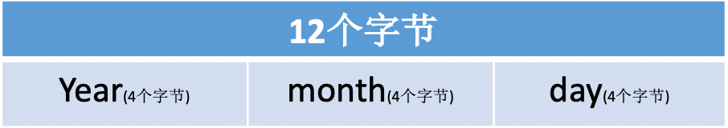
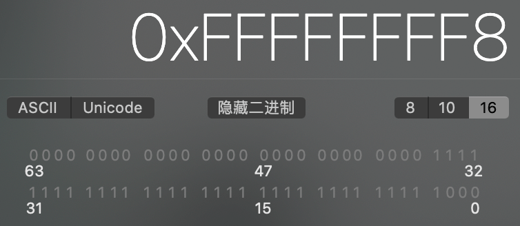

思考：
* 讲一下 OC 的消息机制
* 消息转发机制流程
* 什么是 Runtime？平时项目中有用过么？
* Runtime 的具体应用

<!-- more -->

* 打印结果分别是什么？
```
//打印1
@interface Person : NSObject
@end

@implementation Person
@end

@interface Student : Person
@end

@implementation Student
- (instancetype)init
{
    self = [super init];
    if (self) {
        NSLog(@"[self class] = %@", [self class]);
        NSLog(@"[super class] = %@", [super class]);
        NSLog(@"[self superclass] = %@", [self superclass]);
        NSLog(@"[super superclass] = %@", [super superclass]);
    }
    return self;
}
@end

//打印2
int main(int argc, const char * argv[]) {
    @autoreleasepool {
        BOOL res1 = [[NSObject class] isKindOfClass:[NSObject class]];
        BOOL res2 = [[NSObject class] isMemberOfClass:[NSObject class]];
        BOOL res3 = [[Person class] isKindOfClass:[Person class]];
        BOOL res4 = [[Person class] isMemberOfClass:[Person class]];
        NSLog(@"%d %d %d %d", res1, res2, res3, res4);
    }
    return 0;
}
```

* 以下代码能不能执行成功？如果可以，打印结果是什么？
```
@interface Person : NSObject
@property (nonatomic, copy) NSString *name;
- (void)print;
@end

@implementation Person
- (void)print {
    NSLog(@"my name's %@", self.name);
}
@end

@implementation ViewController
- (void)viewDidLoad {
    [super viewDidLoad];
    id cls = [Person class];
    void *obj = &cls;
    [(__bridge id)obj print];
}
@end
```

Objective-C 是一门动态性比较强的编程语言，跟 C、C++ 等语言有着很大的不同，Objective-C 的动态性是由 Runtime API 来支撑的，Runtime API 提供的接口基本都是 C 语言的，源码由 C\C++\汇编语言 编写。

# isa 详解
学习 Runtime，首先要了解它底层的一些常用数据结构，比如 isa 指针。在 arm64 架构之前，isa 就是一个普通的指针，存储着 Class、Meta-Class 对象的内存地址。从 arm64 架构开始，对 isa 进行了优化，变成了一个共用体（union）结构，还使用位域来存储更多的信息。

## 位运算
```
@interface Person : NSObject
@property (nonatomic, assign, getter=isTall) BOOL tall;
@property (nonatomic, assign, getter=isRich) BOOL rich;
@property (nonatomic, assign, getter=isHandsome) BOOL handsome;
@end

@implementation Person
@end

int main(int argc, const char * argv[]) {
    @autoreleasepool {
        Person *person = [[Person alloc] init];
        person.tall = YES;
        person.rich = YES;
        person.handsome = YES;
        
        NSLog(@"tall：%d, rich：%d, handsome：%d", person.isTall, person.isRich, person.isHandsome);
        NSLog(@"person的大小：%zd", class_getInstanceSize([person class]));
    }
    return 0;
}
```

打印结果：
```
tall：1, rich：1, handsome：1
person的大小：16
```

tall（1个字节）+ rich（1个字节）+ handsome（1个字节）+ isa（8个字节）= 11个字节。根据内存对齐原则，person 的内存大小是16个字节。

因为 tall、rich 和 handsome 都是 BOOL 类型，它们的值只有0和1，所以可以用3个二进制位来存储他们的值。

### 设计  
定义一个 char 类型的变量 _tallRichHandsome 用来存储3个 BOOL 类型变量的值：
```
@interface Person()
{
    char _tallRichHandsome; //0b 0000 0000
}
@end
```

_tallRichHandsome 占1个字节（8位：`0b 0000 0000`），让它最右边的3位（`0b00000111`）分别存储 tall、rich 和 handsome：
```
0b 0000 0111 //_tallRichHandsome（tall：YES, rich：YES, handsome：YES）

0b 0000 0001 //tall
0b 0000 0010 //rich
0b 0000 0100 //handsome
```

### 取值
* 按位与运算符（`&`）  
定义：参加运算的两个数据，按二进制位进行“与”运算。  
运算规则：`0&0=0`，`0&1=0`，`1&0=0`，`1&1=1`。  
总结：两位同时为1，结果才为1，否则结果为0。 

因为"与"运算可以获取到特定位的值，所以可以通过“与”运算分别获取三个变量的值：

初始化 _tallRichHandsome
```
_tallRichHandsome = 0b00000101; //（tall：YES, rich：NO, handsome：YES）
```

获取 tall（`_tallRichHandsome & 0b00000001`）
```
  0b00000101
& 0b00000001
-------------
  0b00000001
```

获取 rich（`_tallRichHandsome & 0b00000010`）
```
  0b00000101
& 0b00000010
-------------
  0b00000000
```

获取 handsome（`_tallRichHandsome & 0b00000100`）
```
  0b00000101
& 0b00000100
-------------
  0b00000100
```

代码实现：
```
@interface Person : NSObject
- (BOOL)isTall;
- (BOOL)isRich;
- (BOOL)isHandsome;
@end


@interface Person()
{
    char _tallRichHandsome;
}
@end

@implementation Person

- (instancetype)init
{
    self = [super init];
    if (self) {
        _tallRichHandsome = 0b00000101;
    }
    return self;
}

- (BOOL)isTall {
    return !!(_tallRichHandsome & 1); //1（十进制）== 0b 0000 0001（二进制）
}

- (BOOL)isRich {
    return !!(_tallRichHandsome & 2); //2（十进制）== 0b 0000 0010（二进制）
}

- (BOOL)isHandsome {
    return !!(_tallRichHandsome & 4); //4（十进制）== 0b 0000 0100（二进制）
}
@end


int main(int argc, const char * argv[]) {
    @autoreleasepool {
        Person *person = [[Person alloc] init];
        NSLog(@"tall：%d, rich：%d, handsome：%d", person.isTall, person.isRich, person.isHandsome);
    }
    return 0;
}
```

打印结果：
```
tall：1, rich：0, handsome：1
```

因为返回的是 BOOL 类型，而“与”运算取出的是有值（`0b00000001`、`0b00000100`）和0（`0b00000000`），所以可以在“与”运算的结果前加`!!`取反两次：
```
!(0b00000000)   YES
!!(0b00000000)  NO   //!!(_tallRichHandsome & 2)
 
!(0b00000001)   NO
!!(0b00000001)  YES  //!!(_tallRichHandsome & 1)

!(0b00000100)   NO
!!(0b00000100)  YES  //!!(_tallRichHandsome & 4)
```

### 掩码
上面👆的实现太抽象，可以使用掩码增加可读性：
```
#define TallMask 1
#define RichMask 2
#define HandsomeMask 4
```

直接使用二进制定义掩码会更直观：
```
#define TallMask 0b00000001
#define RichMask 0b00000010
#define HandsomeMask 0b00000100
```

使用位移运算符，简化代码：
```
#define TallMask (1<<0)     //左移0位：0b00000001（二进制），1（十进制）
#define RichMask (1<<1)     //左移1位：0b00000010（二进制），2（十进制）
#define HandsomeMask (1<<2) //左移2位：0b00000100（二进制），4（十进制）
```

* 左移运算符（`<<`）  
定义：将一个运算对象的各二进制位全部左移若干位（左边的二进制位丢弃，右边补0）。

最终实现：
```
#define TallMask (1<<0)
#define RichMask (1<<1)
#define HandsomeMask (1<<2)

@implementation Person
- (BOOL)isTall {
    return !!(_tallRichHandsome & TallMask);
}

- (BOOL)isRich {
    return !!(_tallRichHandsome & RichMask);
}

- (BOOL)isHandsome {
    return !!(_tallRichHandsome & HandsomeMask);
}
@end
```

### 设值
* 按位或运算符（`|`）  
定义：参加运算的两个对象，按二进制位进行“或”运算。  
运算规则：`0|0=0`，`0|1=1`，`1|0=1`，`1|1=1`。  
总结：参加运算的两个对象只要有一个为1，其值为1。

* 取反运算符 (`~`)  
定义：参加运算的一个数据，按二进制进行“取反”运算。  
运算规则：`~1=0`，`~0=1`。  
总结：对一个二进制数按位取反，即将0变1，1变0。

设置 YES 时，跟 _tallRichHandsome 进行按位“或”运算，修改特定位置的值。  
设置 NO 时，先对 rich 的二进制数按位取反，再跟 _tallRichHandsome 进行按位“与”运算。

初始化 _tallRichHandsome
```
_tallRichHandsome = 0b00000010; //（tall：NO, rich：YES, handsome：NO）
```

设置 tall 为 YES（`_tallRichHandsome |= 0b00000001`）
```
  0b00000010
| 0b00000001
-------------
  0b00000011
```

设置 rich 为 NO（`_tallRichHandsome &= ~0b00000010`）
```
  0b00000010
& 0b11111101  //~0b00000010（按位取反） 
-------------
  0b00000000
```

设置 handsome 为 YES（`_tallRichHandsome |= 0b00000001`）
```
  0b00000010
| 0b00000100
-------------
  0b00000110
```

代码实现：
```
@interface Person : NSObject
- (void)setTall:(BOOL)tall;
- (void)setRich:(BOOL)rich;
- (void)setHandsome:(BOOL)handsome;
- (BOOL)isTall;
- (BOOL)isRich;
- (BOOL)isHandsome;
@end


#define TallMask (1<<0)
#define RichMask (1<<1)
#define HandsomeMask (1<<2)


@interface Person()
{
    char _tallRichHandsome;
}
@end

@implementation Person

- (void)setTall:(BOOL)tall {
    if (tall) {
        _tallRichHandsome |= TallMask;
    } else {
        _tallRichHandsome &= ~TallMask;
    }
}

- (void)setRich:(BOOL)rich {
    if (rich) {
        _tallRichHandsome |= RichMask;
    } else {
        _tallRichHandsome &= ~RichMask;
    }
}

- (void)setHandsome:(BOOL)handsome {
    if (handsome) {
        _tallRichHandsome |= HandsomeMask;
    } else {
        _tallRichHandsome &= ~HandsomeMask;
    }
}

- (BOOL)isTall {
    return !!(_tallRichHandsome & TallMask);
}

- (BOOL)isRich {
    return !!(_tallRichHandsome & RichMask);
}

- (BOOL)isHandsome {
    return !!(_tallRichHandsome & HandsomeMask);
}
@end


int main(int argc, const char * argv[]) {
    @autoreleasepool {
        Person *person = [[Person alloc] init];
        person.tall = YES;
        person.rich = NO;
        person.handsome = YES;
        NSLog(@"tall：%d, rich：%d, handsome：%d", person.isTall, person.isRich, person.isHandsome);
    }
    return 0;
}
```

打印结果：
```
tall：1, rich：0, handsome：1
```

## 位域
位域，C 语言允许在一个结构体中以位为单位来指定其成员所占内存长度，这种以位为单位的成员称为“位段”或称“位域”( bit field) 。利用位段能够用较少的位数存储数据。

使用位域增加可读性。定义结构体 _tallRichHandsome，成员变量 tall，并通过“:”设置 tall 在内存中只占1位。
```
@interface Person()
{
    struct {
        char tall : 1; //1位
    } _tallRichHandsome; //1个字节
}
@end

@implementation Person
- (void)setTall:(BOOL)tall {
    _tallRichHandsome.tall = tall;
}

- (BOOL)isTall {
    BOOL ret = _tallRichHandsome.tall;
    return ret; //断点2
}
@end


int main(int argc, const char * argv[]) {
    @autoreleasepool {
        Person *person = [[Person alloc] init];
        person.tall = YES;
        NSLog(@"tall：%d", person.isTall); //断点1
    }
    return 0;
}
```

打印结果：
```
tall：-1
```

在断点1处查看 _tallRichHandsome 的内存：
```
(lldb) p/x &(person->_tallRichHandsome)
((anonymous struct) *) $0 = 0x0000000100493d98
(lldb) x 0x0000000100493d98
0x100493d98: 01 00 00 00 00 00 00 00 2d 5b 4e 53 54 61 62 50  ........-[NSTabP
0x100493da8: 69 63 6b 65 72 56 69 65 77 43 6f 6e 74 72 6f 6c  ickerViewControl
```

内存中的“01”是十六进制的，转成二进制就是`0b 0000 0001`。即 tall：YES。

在断点2处查看 ret 的内存：
```
(lldb) p/x & ret
(BOOL *) $0 = 0x00007ffeefbff4ff 255
(lldb) x 0x00007ffeefbff4ff
0x7ffeefbff4ff: ff b1 4e cb 5e ff 7f 00 00 90 81 16 03 01 00 00  ..N.^...........
0x7ffeefbff50f: 00 50 f5 bf ef fe 7f 00 00 90 0c 00 00 01 00 00  .P..............
```

内存中的“ff”是十六进制的（0xFF），转成二进制就是`0b11111111`，转成十进制是255（无符号）或-1（有符号）。这是因为 tall 原本是一个二进制位，即 tall：0b1，而返回值要求的是 BOOL 类型的值（8位：`0b00000000`），所以在返回时 tall 强转成了一个8位的值：
```
0b1 -> 0b 1111 1111（二进制） //0xff（十六进制）
```

因为在系统中整数是以补码形式存放的，所以要想找到打印结果为“-1”的原因需要先算出 `0b11111111` 的原码。
* 补码求原码  
如果补码的符号位为“0”，表示是一个正数，其原码就是补码。  
如果补码的符号位为“1”，表示是一个负数，那么求给定的这个补码的补码就是要求的原码。  

因为 tall 是一个 char 类型的整型变量，是有符号的（LLVM），所以此时的 `0b11111111` 是有符号的。

因为 `0b11111111` 的最高位是符号位为“1”，表示是一个负数，所以该位不变，仍为“1”。其余七位取反后为 `0b10000000`；再加1，所以是 `0b10000001`，十进制就是 -1。所以 tall 在设置为 YES 时，打印结果是 -1。

如果将 tall 设置为 NO 的话，_tallRichHandsome 和 ret 的内存都是 `0b00000000`。
```
(lldb) p/x &(person->_tallRichHandsome)
((anonymous struct) *) $1 = 0x0000000102c6fb28
(lldb) x 0x0000000102c6fb28
0x102c6fb28: 00 00 00 00 00 00 00 00 2d 5b 4e 53 56 69 62 72  ........-[NSVibr
0x102c6fb38: 61 6e 74 53 70 6c 69 74 44 69 76 69 64 65 72 56  antSplitDividerV

(lldb) p/x & ret
(BOOL *) $0 = 0x00007ffeefbff4ff NO
(lldb) x 0x00007ffeefbff4ff
0x7ffeefbff4ff: 00 b1 4e cb 5e ff 7f 00 00 20 fb c6 02 01 00 00  ..N.^.... ......
0x7ffeefbff50f: 00 50 f5 bf ef fe 7f 00 00 8d 0c 00 00 01 00 00  .P..............
```

综上所述，在对 tall 进行修改时，会有两个返回值“-1”和“0”。为了保证返回的结果正确，可以使用上面👆提到过的取反两次`!!`。

最终实现：  
定义结构体 _tallRichHandsome，同时定义成员变量 tall、rich 和 handsome，并通过“:”设置她们在内存中只占1位：
```
@interface Person()
{
    struct {
        char tall : 1; //只占1位
        char rich : 1;
        char handsome : 1;
    } _tallRichHandsome;
}
@end

@implementation Person
- (void)setTall:(BOOL)tall {
    _tallRichHandsome.tall = tall;
}

- (void)setRich:(BOOL)rich {
    _tallRichHandsome.rich = rich;
}

- (void)setHandsome:(BOOL)handsome {
    _tallRichHandsome.handsome = handsome;
}

- (BOOL)isTall {
    return !!_tallRichHandsome.tall;
}

- (BOOL)isRich {
    return !!_tallRichHandsome.rich;
}

- (BOOL)isHandsome {
    return !!_tallRichHandsome.handsome;
}
@end


int main(int argc, const char * argv[]) {
    @autoreleasepool {
        Person *person = [[Person alloc] init];
        person.tall = YES;
        person.rich = NO;
        person.handsome = YES;
        NSLog(@"tall：%d, rich：%d, handsome：%d", person.isTall, person.isRich, person.isHandsome); //断点1
    }
    return 0;
}
```

打印结果：
```
 tall：1, rich：0, handsome：1
```

## 共用体（union）

### struct
struct 结构体里的成员变量各自拥有一块内存，单独存在：


定义一个结构体 Date，内部有三个 int 类型的成员变量 year、month 和 day：
```
struct Date {
    int year;  //4个字节
    int month; //4个字节
    int day;   //4个字节
}; //12个字节

int main(int argc, const char * argv[]) {
    @autoreleasepool {
        //struct Date date = {2020, 6, 17};
        struct Date date;
        date.year = 2020;
        date.month = 6;
        date.day = 17;
        NSLog(@"year：%d, month：%d, day：%d", date.year, date.month, date.day);
    }
}
```

打印结果：
```
year：2020, month：6, day：17
```

因为三个变量各自拥有自己的内存，所以打印结果各不相同。

### union
union 共用体里的成员变量共用一块内存，共用体的内存大小以成员变量的最大内存为准：


定义共用体 Date，内部有三个 int 类型的变量 year、month 和 day：
```
union Date {
    int year;  //4个字节
    int month; //4个字节
    int day;   //4个字节
}; //4个字节

int main(int argc, const char * argv[]) {
    @autoreleasepool {
        union Date date;
        date.year = 2020;
        NSLog(@"year：%d, month：%d, day：%d", date.year, date.month, date.day);
    }
}
```

打印结果：
```
year：2020, month：2020, day：2020
```

因为三个变量共用一块内存，所以三个变量访问的内存是同一块内存地址。

定义共用体 Date，内部有一个 int 类型的变量 year 和一个 char 类型的变量 month：
```
union Date {
    int year;   //4个字节
    char month; //1个字节
}; //4个字节

int main(int argc, const char * argv[]) {
    @autoreleasepool {
        union Date date;
        date.year = 2020;
        NSLog(@"year：%d, month：%d", date.year, date.month);
    }
}
```

打印结果：
```
year：2020, month：2020
```

### 实现
将位运算和位域结合在一起定义一个共用体，用位运算读取/写入变量的值，用位域增加可读性：
```
#define TallMask (1<<0)
#define RichMask (1<<1)
#define HandsomeMask (1<<2)

@interface Person()
{
    union {
        char bits;
        struct {
            char tall : 1;
            char rich : 1;
            char handsome : 1;
        };
    }_tallRichHandsome;
}
@end

@implementation Person

- (void)setTall:(BOOL)tall {
    if (tall) {
        _tallRichHandsome.bits |= TallMask;
    } else {
        _tallRichHandsome.bits &= ~TallMask;
    }
}

- (void)setRich:(BOOL)rich {
    if (rich) {
        _tallRichHandsome.bits |= RichMask;
    } else {
        _tallRichHandsome.bits &= ~RichMask;
    }
}

- (void)setHandsome:(BOOL)handsome {
    if (handsome) {
        _tallRichHandsome.bits |= HandsomeMask;
    } else {
        _tallRichHandsome.bits &= ~HandsomeMask;
    }
}

- (BOOL)isTall {
    return !!(_tallRichHandsome.bits & TallMask);
}

- (BOOL)isRich {
    return !!(_tallRichHandsome.bits & RichMask);
}

- (BOOL)isHandsome {
    return !!(_tallRichHandsome.bits & HandsomeMask);
}
@end


int main(int argc, const char * argv[]) {
    @autoreleasepool {
        Person *person = [[Person alloc] init];
        person.tall = NO;
        person.rich = NO;
        person.handsome = YES;
        NSLog(@"tall：%d, rich：%d, handsome：%d", person.isTall, person.isRich, person.isHandsome);
    }
    return 0;
}
```

打印结果：
```
tall：0, rich：0, handsome：1
```

这里定义的 tall、rich 和 handsome 都是占1个二进制位的，如果想要修改它们占二进制位的个数，bits 也要修改为相应的定义：

tall、rich 和 handsome 都是占4个二进制位，那 bits 就需要定义成 int 类型（4个字节），掩码也需要占4个二进制位：
```
#define TallMask (1<<0)
#define RichMask (1<<4)
#define HandsomeMask (1<<8)

@interface Person()
{
    union {
        int bits;
        struct {
            char tall : 4;
            char rich : 4;
            char handsome : 4;
        };
    }_tallRichHandsome;
}
@end
```

掩码也可以写成：
```
#define TallMask (0b1111<<0)
#define RichMask (0b1111<<4)
#define HandsomeMask (0b1111<<8)
```

或者
```
#define TallMask (15<<0)
#define RichMask (15<<4)
#define HandsomeMask (15<<8)
```

## isa
在源码 [objc4-781](https://opensource.apple.com/tarballs/objc4/) 中查找 isa 的定义。  

找到 OC 对象的结构体 objc_object：
```
struct objc_object {
private:
    isa_t isa;
    
    ··· //省略一堆方法
}
```

可以看到 isa 是一个 isa_t 类型的变量，Jump To Definition -> isa_t：
```
union isa_t {
    isa_t() { }
    isa_t(uintptr_t value) : bits(value) { }

    Class cls;
    uintptr_t bits;
#if defined(ISA_BITFIELD)
    //位域
    struct { 
        ISA_BITFIELD;  // defined in isa.h
    };
#endif
};
```

位域中是一个宏 ISA_BITFIELD：
```
# if __arm64__ //真机上市 arm64
#   define ISA_MASK        0x0000000ffffffff8ULL
#   define ISA_MAGIC_MASK  0x000003f000000001ULL
#   define ISA_MAGIC_VALUE 0x000001a000000001ULL
#   define ISA_BITFIELD                                                      \
      uintptr_t nonpointer        : 1;                                       \
      uintptr_t has_assoc         : 1;                                       \
      uintptr_t has_cxx_dtor      : 1;                                       \
      uintptr_t shiftcls          : 33; /*MACH_VM_MAX_ADDRESS 0x1000000000*/ \
      uintptr_t magic             : 6;                                       \
      uintptr_t weakly_referenced : 1;                                       \
      uintptr_t deallocating      : 1;                                       \
      uintptr_t has_sidetable_rc  : 1;                                       \
      uintptr_t extra_rc          : 19
#   define RC_ONE   (1ULL<<45)
#   define RC_HALF  (1ULL<<18)

# elif __x86_64__ //模拟器是 x86 架构
#   define ISA_MASK        0x00007ffffffffff8ULL
#   define ISA_MAGIC_MASK  0x001f800000000001ULL
#   define ISA_MAGIC_VALUE 0x001d800000000001ULL
#   define ISA_BITFIELD                                                        \
      uintptr_t nonpointer        : 1;                                         \
      uintptr_t has_assoc         : 1;                                         \
      uintptr_t has_cxx_dtor      : 1;                                         \
      uintptr_t shiftcls          : 44; /*MACH_VM_MAX_ADDRESS 0x7fffffe00000*/ \
      uintptr_t magic             : 6;                                         \
      uintptr_t weakly_referenced : 1;                                         \
      uintptr_t deallocating      : 1;                                         \
      uintptr_t has_sidetable_rc  : 1;                                         \
      uintptr_t extra_rc          : 8
#   define RC_ONE   (1ULL<<56)
#   define RC_HALF  (1ULL<<7)

# else
#   error unknown architecture for packed isa
# endif
```

可以看到 ISA_BITFIELD 在 `__arm64__`（真机） 和 `__x86_64__`（mac电脑/模拟器） 架构有不同的定义。

将宏 ISA_BITFIELD 替换掉，保留真机（arm64）代码，可以看到一个比较完整的 isa_t：
```
union isa_t {
    isa_t() { }
    isa_t(uintptr_t value) : bits(value) { }
    Class cls;
    uintptr_t bits;
    struct { 
        uintptr_t nonpointer        : 1;                                       \
        uintptr_t has_assoc         : 1;                                       \
        uintptr_t has_cxx_dtor      : 1;                                       \
        uintptr_t shiftcls          : 33; /*MACH_VM_MAX_ADDRESS 0x1000000000*/ \
        uintptr_t magic             : 6;                                       \
        uintptr_t weakly_referenced : 1;                                       \
        uintptr_t deallocating      : 1;                                       \
        uintptr_t has_sidetable_rc  : 1;                                       \
        uintptr_t extra_rc          : 19
    };
}
```

* nonpointer  
0，代表普通的指针，存储着 Class、Meta-Class 对象的内存地址  
1，代表优化过，使用位域存储更多的信息
* has_assoc  
是否有设置过关联对象，如果没有，释放时会更快
* has_cxx_dtor  
是否有 C++ 的析构函数（.cxx_destruct），如果没有，释放时会更快
* shiftcls  
存储着 Class、Meta-Class 对象的内存地址信息
* magic  
用于在调试时分辨对象是否未完成初始化
* weakly_referenced  
是否有被弱引用指向过，如果没有，释放时会更快
* deallocating  
对象是否正在释放
* extra_rc  
里面存储的值是引用计数器减1
* has_sidetable_rc  
引用计数器是否过大无法存储在 isa 中，如果为1，那么引用计数会存储在一个叫 SideTable 的类的属性中

因为 shiftcls 占33个二进制位，ISA_MASK 也有33个1，所以 `isa & ISA_MASK ` 能够取出 shiftcls 的值。

ISA_MASK 


因为 ISA_MASK 最后面三位都是0，所以获取到的 Class、Meta-Class 对象的内存地址的最后三为肯定也为0。证明：
```
@interface ViewController()
@end

@implementation ViewController
- (void)viewDidLoad {
    [super viewDidLoad];
    NSLog(@"%p", [ViewController class]);
    NSLog(@"%p", object_getClass([ViewController class]));
    NSLog(@"%p", [Person class]);
    NSLog(@"%p", object_getClass([Person class]));
}
@end
```

打印结果：
```

```

可以看到打印结果的最后一位都是”8“或”0“，即”`1000`“或”`0000`“。所以 Class、Meta-Class 对象的内存地址的最后三为为0。

## 位运算补充

用左移定义枚举的成员变量，用”或“运算传入多个值，用”与“运算获取传入的都有哪些值：
```
typedef enum {
    OptionsOne = 1<<0,
    OptionsTwo = 1<<1,
    OptionsThree = 1<<2,
    OptionsFour = 1<<3
} Options;

@interface ViewController ()
@end

@implementation ViewController
- (void)setOptions:(Options)option {
    if (option & OptionsOne) {
        NSLog(@"OptionsOne");
    }
    if (option & OptionsTwo) {
        NSLog(@"OptionsTwo");
    }
    if (option & OptionsThree) {
        NSLog(@"OptionsThree");
    }
    if (option & OptionsFour) {
        NSLog(@"OptionsFour");
    }
}
- (void)viewDidLoad {
    [super viewDidLoad];
    [self setOptions:OptionsOne | OptionsTwo | OptionsFour];
}
@end
```

打印结果：
```
OptionsOne
OptionsTwo
OptionsFour
```