思考：
* block 的原理是怎样的？本质是什么？
* `__block`的作用是什么？有什么使用注意点？
* block 的属性修饰词为什么是 copy？使用 block 有哪些使用注意？
* block 在修改 NSMutableArray，需不需要添加 `__block`？


<!-- more -->

# 基本认识

## block
```
^{
    NSLog(@"this is a block");
};
```

block 可以封装一块代码，在将来需要执行的地方通过“()”进行调用：
```
int main(int argc, const char * argv[]) {
    @autoreleasepool {
        ^{
            NSLog(@"this is a block");
        }();
    }
    return 0;
}
```

或者
```
int main(int argc, const char * argv[]) {
    @autoreleasepool {
        void (^block)(void) = ^{
            NSLog(@"this is a block");
        };
        block();
    }
    return 0;
}
```

打印结果：
```
this is a block
```

## block 的 C++ 代码
查看 block 的 C++ 代码。找到 main.m 文件，在终端输入：
```
xcrun -sdk iphoneos clang -arch arm64 -rewrite-objc main.m -o main-arm64.cpp
```

block 的 C++ 代码（精简版）：
```
struct __main_block_desc_0 {
  size_t reserved;
  size_t Block_size; //占用内存大小
}

struct __block_impl {
    void *isa; //指向父类的指针（OC对象特征）
    int Flags;
    int Reserved;
    void *FuncPtr; //函数地址，用于函数调用
};

struct __main_block_impl_0 { //block 结构体
  struct __block_impl impl;
  struct __main_block_desc_0* Desc;
  int a; //调用环境
};

int main(int argc, const char * argv[]) {
    @autoreleasepool {
        int a = 20;
        void (^block)(void) = ^{
            NSLog(@"this is a block - %d", a); //断点2
        };
        block(); //断点1
    }
    return 0;
}
```

## __main_block_impl_0
__main_block_impl_0 是 block 在 C++ 中的结构体实现。第一个参数 __block_impl 中有一个 isa 指针，具备 OC 对象特征，说明 block 本质上也是一个 OC 对象。  

__main_block_impl_0 省略 __block_impl 和 __main_block_desc_0 后可以看成：
```
struct __main_block_impl_0 {
  void *isa; 
  int Flags;
  int Reserved;
  void *FuncPtr; 
  size_t reserved;
  size_t Block_size;
  int a; 
};
```

即：
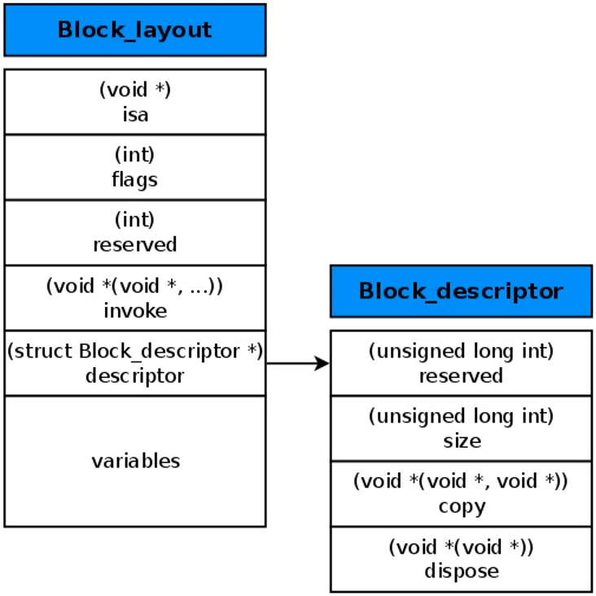

## FuncPtr
FuncPtr 是一个指针，指向 block 封装的代码块的函数地址。  

在断点1处打印 FuncPtr 地址：  
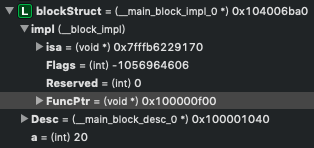

```
Printing description of blockStruct->impl.FuncPtr:
(void *) FuncPtr = 0x0000000100000f00
```

在断点2处，选择 Debug -> Debug Workflow -> Always Show Disassembly:
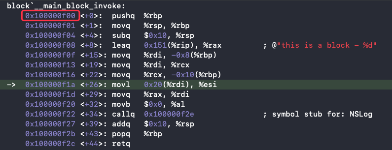

可以看到，block 里的开始地址值 100000f00 等于 FuncPtr 的地址值。说明 block 里的代码块的地址值被保存在了 __block_impl 里的 FuncPtr 中（函数调用），另外 __main_block_impl_0 里保存了外部变量 int a（调用环境），说明 block 是封装了函数调用以及函数调用环境的 OC 对象。


# block 的本质

block 本质上是封装了函数调用以及函数调用环境的 OC 对象，它内部也有个 isa 指针。

## 定义 block：
```
int main(int argc, const char * argv[]) {
    @autoreleasepool {
        void (^block)(void) =  ^{
            NSLog(@"this is a block");
        };
        block();
    }
    return 0;
}
```

查看 block 的 C++ 代码：
```
struct __block_impl {
    void *isa; //指向父类
    int Flags;
    int Reserved;
    void *FuncPtr; //指向 __main_block_func_0 函数地址的指针，用于函数调用
};

struct __main_block_impl_0 {
  struct __block_impl impl; //作为第一个变量，__block_impl 的内存地址就是 __main_block_impl_0 内存地址
  struct __main_block_desc_0* Desc; //描述，是一个结构体变量 __main_block_desc_0_DATA
  // 构造函数（类似于OC的init方法），返回结构体对象
  // 参数 fp：block 执行逻辑的函数的地址，即 __main_block_func_0
  // 参数 desc：描述，__main_block_desc_0 的结构体变量，即 __main_block_desc_0_DATA
  // 参数 flags：默认可以不传，flags=0
  __main_block_impl_0(void *fp, struct __main_block_desc_0 *desc, int flags=0) {
    impl.isa = &_NSConcreteStackBlock; //指向父类。_NSConcreteStackBlock：block 的类型
    impl.Flags = flags;
    impl.FuncPtr = fp; //__main_block_func_0
    Desc = desc; //__main_block_desc_0_DATA
  }
};

// 封装了 block 执行逻辑的函数
// 参数：block 结构体
static void __main_block_func_0(struct __main_block_impl_0 *__cself) {

    NSLog((NSString *)&__NSConstantStringImpl__var_folders_rw_lcynwz_524g1qwsw4sclwtrw0000gn_T_main_880b47_mi_0); // NSLog(@"this is a block");
}

// 封装了 block 执行逻辑的函数
static struct __main_block_desc_0 {
  size_t reserved; // 0
  size_t Block_size; // block 占用内存大小
} __main_block_desc_0_DATA = { 0, sizeof(struct __main_block_impl_0)}; //__main_block_desc_0 的结构体变量，参数 reserved：0，参数 Block_size：sizeof(struct __main_block_impl_0)

int main(int argc, const char * argv[]) {
    /* @autoreleasepool */ { __AtAutoreleasePool __autoreleasepool; 
        // 定义 block 变量，指向结构体 __main_block_impl_0 地址的指针
        void (*block)(void) = ((void (*)())&__main_block_impl_0(
                                                                (void *)__main_block_func_0, //block 执行逻辑的函数
                                                                &__main_block_desc_0_DATA //__main_block_desc_0 的结构体变量
                                                                ));
        // 执行 block 内部的代码
        // 因为在结构体 __main_block_impl_0 中，__block_impl 作为第一个变量，所以 __block_impl 的内存地址就是 __main_block_impl_0 内存地址
        // 所以这里可以将 block 强转为 __block_impl 类型
        // FuncPtr：函数 __main_block_func_0 地址
        ((void (*)(__block_impl *))((__block_impl *)block)->FuncPtr)((__block_impl *)block); //简化后：block->FuncPtr(block)
    }
    return 0;
}
static struct IMAGE_INFO { unsigned version; unsigned flag; } _OBJC_IMAGE_INFO = { 0, 2 };
```

__main_block_impl_0、__block_impl 和 __main_block_desc_0 三者之间的关系：
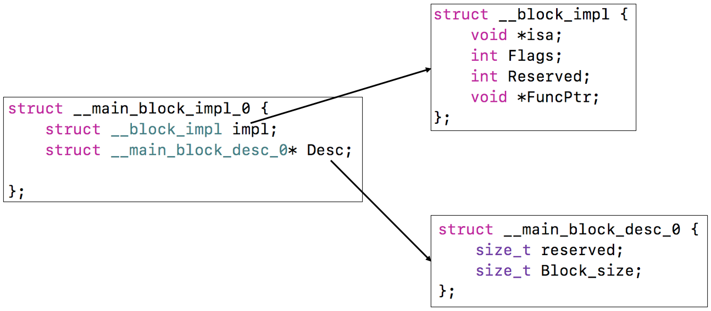

## 有参数的 block
```
int main(int argc, const char * argv[]) {
    @autoreleasepool {
        void (^block)(int, int) =  ^(int a, int b){
            NSLog(@"this is a block - %d, %d", a, b);
        };
        block(10, 20);
    }
    return 0;
}
```

查看 C++ 代码，可以看到 __main_block_func_0 函数发生了变化：
```
struct __block_impl {
    void *isa; 
    int Flags;
    int Reserved;
    void *FuncPtr;
};

struct __main_block_impl_0 {
  struct __block_impl impl;
  struct __main_block_desc_0* Desc;
  __main_block_impl_0(void *fp, struct __main_block_desc_0 *desc, int flags=0) {
    impl.isa = &_NSConcreteStackBlock;
    impl.Flags = flags;
    impl.FuncPtr = fp;
    Desc = desc;
  }
};

// 封装了 block 执行逻辑的函数，增加了参数 a 和 b
static void __main_block_func_0(struct __main_block_impl_0 *__cself, int a, int b) {
    NSLog((NSString *)&__NSConstantStringImpl__var_folders_rw_lcynwz_524g1qwsw4sclwtrw0000gn_T_main_f90d21_mi_0, a, b);
}

static struct __main_block_desc_0 {
  size_t reserved;
  size_t Block_size;
} __main_block_desc_0_DATA = { 0, sizeof(struct __main_block_impl_0)};

int main(int argc, const char * argv[]) {
    /* @autoreleasepool */ { __AtAutoreleasePool __autoreleasepool;
        // 定义 block 变量，增加了参数 10 和 20
        void (*block)(int, int) = ((void (*)(int, int))&__main_block_impl_0((void *)__main_block_func_0, &__main_block_desc_0_DATA));
        ((void (*)(__block_impl *, int, int))((__block_impl *)block)->FuncPtr)((__block_impl *)block, 10, 20); //简化后：block->FuncPtr(block, 10, 20)
    }
    return 0;
}
```

## 小结
* block的原理是怎样的？本质是什么？  
block 本质上是封装了函数调用以及函数调用环境的 OC 对象，它内部也有个 isa 指针。

# 变量捕获（capture）

为了保证 block 内部能够正常访问外部的变量，block 有个变量捕获机制。  
变量捕获机制：block 内部会生成对应的成员变量或指针，存储被捕获变量的值或地址值。

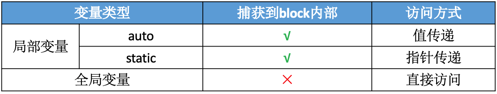

ps：局部变量还有一个 register 变量（定义 int age = 10，尽量使用寄存器寄存变量 age）。
```
register int age = 10;
```

## 局部变量

### auto 变量捕获
* auto 变量的作用域在当前“{}”内，离开作用域就销毁。
* auto 变量的捕获方式是值传递。  

平时定义的局部变量 int age = 10 默认就是 auto 变量，auto 省略不写：
```
auto int age = 10; // int age = 10;
```

定义 block：
```
int main(int argc, const char * argv[]) {
    @autoreleasepool {
        int age = 10;
        void (^block)(void) =  ^{
            NSLog(@"this is a block - %d", age);
        };
        age = 20;
        block();
    }
    return 0;
}
```

打印结果：
```
this is a block - 10
```

因为 auto 变量的捕获方式是值传递，即 block 捕获的是 age 的值（10），而不是 age 的地址值，所以在 block 捕获了 age 的值（10）后，再通过指针 age 修改指向的地址里的值（20），block 捕获到的值（10）不变。所以打印结果是 10。

查看 C++ 代码：
```
struct __main_block_impl_0 {
  struct __block_impl impl;
  struct __main_block_desc_0* Desc;
  int age; //新增变量，用于捕获外部变量 age

  //构造函数
  //参数 _age：新增参数
  //age(_age)方法：将参数 _age 赋值给 age，即 age(_age) 方法等于 age = _age;
  __main_block_impl_0(void *fp, struct __main_block_desc_0 *desc, int _age, int flags=0) : age(_age) {
    impl.isa = &_NSConcreteStackBlock;
    impl.Flags = flags;
    impl.FuncPtr = fp;
    Desc = desc;
  }
};

// 封装了 block 执行逻辑的函数
static void __main_block_func_0(struct __main_block_impl_0 *__cself) {
  int age = __cself->age; //取出 block 里的 age

  NSLog((NSString *)&__NSConstantStringImpl__var_folders_rw_lcynwz_524g1qwsw4sclwtrw0000gn_T_main_de0112_mi_0, age); //NSLog(@"this is a block - %d", age);
}

static struct __main_block_desc_0 {
  size_t reserved;
  size_t Block_size;
} __main_block_desc_0_DATA = { 0, sizeof(struct __main_block_impl_0)};

int main(int argc, const char * argv[]) {
    /* @autoreleasepool */ { __AtAutoreleasePool __autoreleasepool; 
        int age = 10;
        // 定义 block 变量，__main_block_impl_0 方法里捕获了 age
        void (*block)(void) = ((void (*)())&__main_block_impl_0((void *)__main_block_func_0, &__main_block_desc_0_DATA, age));
        age = 20;
        ((void (*)(__block_impl *))((__block_impl *)block)->FuncPtr)((__block_impl *)block); //简化后：block->FuncPtr(block)
    }
    return 0;
}
static struct IMAGE_INFO { unsigned version; unsigned flag; } _OBJC_IMAGE_INFO = { 0, 2 };
```

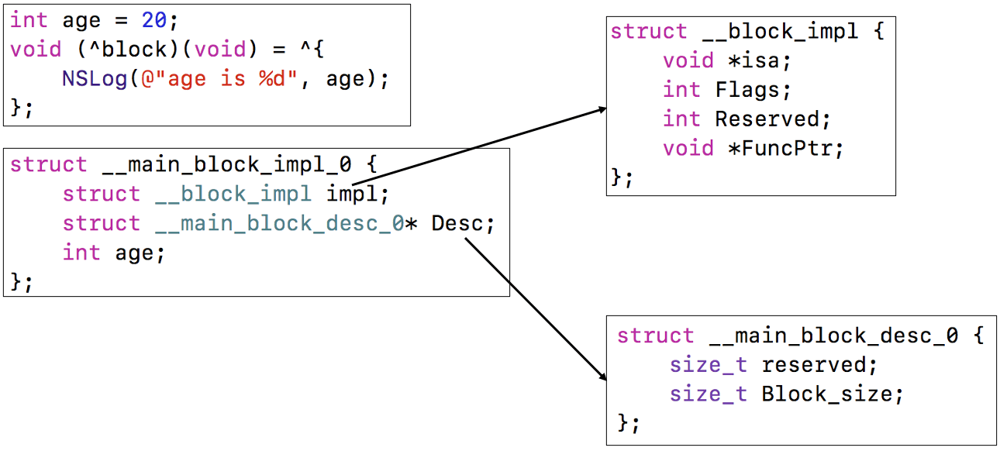

block 的结构体 __main_block_impl_0 内部新增了成员变量 age，就是用来捕获外部 auto 变量 age 用的。

### static 变量捕获
* static 变量会一直保存在内存里。
* static 变量的捕获方式是指针传递。

ps：static 声明的局部变量只初始化一次，其内存分配在静态存储区（数据区域），在程序中只有一份内存，并且在整个程序执行期间都存在不会释放。虽然 static 变量的内存不会释放，但是其作用域并没有改变。

定义 block：
```
int main(int argc, const char * argv[]) {
    @autoreleasepool {
        int age = 10;
        static int height = 10;
        void (^block)(void) =  ^{
            NSLog(@"this is a block - age = %d，height = %d", age, height);
        };
        age = 20;
        height = 20;
        block();
    }
    return 0;
}
```

查看 C++ 代码：
```
struct __main_block_impl_0 {
  struct __block_impl impl;
  struct __main_block_desc_0* Desc;
  int age; //新增变量 age，用于捕获外部 auto 变量 age 的值
  int *height; //新增指针 height，用于捕获外部的 static 变量 height 的地址值

  //构造函数
  //参数 *_height：static 变量的地址值
  __main_block_impl_0(void *fp, struct __main_block_desc_0 *desc, int _age, int *_height, int flags=0) : age(_age), height(_height) {
    impl.isa = &_NSConcreteStackBlock;
    impl.Flags = flags;
    impl.FuncPtr = fp;
    Desc = desc;
  }
};

static void __main_block_func_0(struct __main_block_impl_0 *__cself) {
  int age = __cself->age; //获取 block 的 age
  int *height = __cself->height; // 获取 block 的 height

  NSLog((NSString *)&__NSConstantStringImpl__var_folders_rw_lcynwz_524g1qwsw4sclwtrw0000gn_T_main_ac9850_mi_0, age, (*height)); //NSLog(@"this is a block - age = %d，height = %d", age, height);
}

static struct __main_block_desc_0 {
  size_t reserved;
  size_t Block_size;
} __main_block_desc_0_DATA = { 0, sizeof(struct __main_block_impl_0)};

int main(int argc, const char * argv[]) {
    /* @autoreleasepool */ { __AtAutoreleasePool __autoreleasepool; 
        int age = 10;
        static int height = 10;
        //调用 __main_block_impl_0 方法出入 age 和 &height（height 的地址）生成 block 指针
        void (*block)(void) = ((void (*)())&__main_block_impl_0((void *)__main_block_func_0, &__main_block_desc_0_DATA, age, &height));
        age = 20;
        height = 20;
        ((void (*)(__block_impl *))((__block_impl *)block)->FuncPtr)((__block_impl *)block);
    }
    return 0;
}
static struct IMAGE_INFO { unsigned version; unsigned flag; } _OBJC_IMAGE_INFO = { 0, 2 };
```

因为 static 变量的捕获方式是指针传递，即 block 捕获的是 height 的地址值，所以在 block 捕获了 height 地址值后，再通过指针 height 修改地址里的值（20），block 捕获到的地址里的值就是 20 了，所以打印结果是 20。

### 指针传递 & 值传递
```
void (^block)(void);

void test()
{
    int age = 10;
    static int height = 10;
    block =  ^{
        NSLog(@"this is a block - age = %d，height = %d", age, height);
    };
    age = 20;
    height = 20;
}

int main(int argc, const char * argv[]) {
    @autoreleasepool {
        test();
        block();
    }
    return 0;
}
```

因为 age 是 auto 变量，所以在 test() 执行后 age 就被被销毁了。因为 block 在执行时会访问 age，而 age 地址对应的内存已经被销毁不能被访问，所以 block 在捕获 age 时只能捕获 age 的值不能捕获 age 的地址值。因此 block 在捕获 auto 变量时采取的策略的是值传递。

因为 height 是 static 变量，会一直保存在内存里，所以 block 在执行时依然能成功访问 height 的地址。因此 block 在捕获 static 变量时采取的策略的是指针传递。

### self 的捕获方式
定义 Person：
```
@interface Person : NSObject
@property (nonatomic, copy) NSString *name;
@end

@implementation Person
- (void)test {
    void (^block)(void) = ^{
        NSLog(@"---- %p", self);
    };
    block();
}
- (instancetype)init
{
    self = [super init];
    if (self) {
        [self test];
    }
    return self;
}
@end
```

查看 Person.m 的 C++ 实现：
```
xcrun -sdk iphoneos clang -arch arm64 -rewrite-objc Person.m
```

-(void)test 方法的 C++ 代码：
```
static void _I_Person_test(Person * self, SEL _cmd) {
    //调用构造函数 __Person__test_block_impl_0 传入 self
    void (*block)(void) = ((void (*)())&__Person__test_block_impl_0((void *)__Person__test_block_func_0, &__Person__test_block_desc_0_DATA, self, 570425344));
    ((void (*)(__block_impl *))((__block_impl *)block)->FuncPtr)((__block_impl *)block);
}
```

-(void)test 方法的 C++ 实现时有两个默认参数，类对象 self 和 test 方法的指针 _cmd。因为参数都是局部变量，所以作为参数出入的 self 和 _cmd 是局部变量。

block 的 C++ 代码：
```
struct __Person__test_block_impl_0 {
  struct __block_impl impl;
  struct __Person__test_block_desc_0* Desc;
  Person *self; //捕获 self 变量的地址值
  __Person__test_block_impl_0(void *fp, struct __Person__test_block_desc_0 *desc, Person *_self, int flags=0) : self(_self) {
    impl.isa = &_NSConcreteStackBlock;
    impl.Flags = flags;
    impl.FuncPtr = fp;
    Desc = desc;
  }
};

static void __Person__test_block_func_0(struct __Person__test_block_impl_0 *__cself) {
  Person *self = __cself->self; //通过 block 获取 self

    NSLog((NSString *)&__NSConstantStringImpl__var_folders_rw_lcynwz_524g1qwsw4sclwtrw0000gn_T_Person_e5b707_mi_0, self);
}
```

因为局部变量都会被 block 捕获，所以 self 以参数的形式传入后，block 结构体 __Person__test_block_impl_0 里新增了一个变量 Person *self 用来捕获 self 的地址值。

#### 成员变量 _name 的捕获方式
```
- (void)test {
    void (^block)(void) = ^{
        NSLog(@"---- %p", _name); //等同于self->_name
    };
    block();
}
```

block 内部调用 _name 的方式等同于 self->_name，即 block 还是先捕获 self 再通过 self->_name 获取 _name。

查看 C++ 代码：
```
//-(void)test
static void _I_Person_test(Person * self, SEL _cmd) {
    //调用构造函数 __Person__test_block_impl_0 传入 self
    void (*block)(void) = ((void (*)())&__Person__test_block_impl_0((void *)__Person__test_block_func_0, &__Person__test_block_desc_0_DATA, self, 570425344));
    ((void (*)(__block_impl *))((__block_impl *)block)->FuncPtr)((__block_impl *)block);
}

//block 结构体
struct __Person__test_block_impl_0 {
  struct __block_impl impl;
  struct __Person__test_block_desc_0* Desc;
  Person *self; //捕获 self
  __Person__test_block_impl_0(void *fp, struct __Person__test_block_desc_0 *desc, Person *_self, int flags=0) : self(_self) {
    impl.isa = &_NSConcreteStackBlock;
    impl.Flags = flags;
    impl.FuncPtr = fp;
    Desc = desc;
  }
};

static void __Person__test_block_func_0(struct __Person__test_block_impl_0 *__cself) {
  Person *self = __cself->self; //通过 block 获取 self
    //self + OBJC_IVAR_$_Person$_name 调用 _name
    NSLog((NSString *)&__NSConstantStringImpl__var_folders_rw_lcynwz_524g1qwsw4sclwtrw0000gn_T_Person_6a1844_mi_0, (*(NSString * _Nonnull *)((char *)self + OBJC_IVAR_$_Person$_name)));
}
```

#### self.name 的捕获方式

self.name 等同于 [self name]，在调用时通过向捕获的 self 发送“name”消息调用，objc_msgSend(self, sel_registerName("name"))。
```
//-(void)test
static void _I_Person_test(Person * self, SEL _cmd) {
    //调用构造函数 __Person__test_block_impl_0 传入 self
    void (*block)(void) = ((void (*)())&__Person__test_block_impl_0((void *)__Person__test_block_func_0, &__Person__test_block_desc_0_DATA, self, 570425344));
    ((void (*)(__block_impl *))((__block_impl *)block)->FuncPtr)((__block_impl *)block);
}

//block 结构体
struct __Person__test_block_impl_0 {
  struct __block_impl impl;
  struct __Person__test_block_desc_0* Desc;
  Person *self; //捕获 self
  __Person__test_block_impl_0(void *fp, struct __Person__test_block_desc_0 *desc, Person *_self, int flags=0) : self(_self) {
    impl.isa = &_NSConcreteStackBlock;
    impl.Flags = flags;
    impl.FuncPtr = fp;
    Desc = desc;
  }
};

static void __Person__test_block_func_0(struct __Person__test_block_impl_0 *__cself) {
  Person *self = __cself->self; //通过 block 获取 self
    //向 self 发送 “name” 消息
    NSLog((NSString *)&__NSConstantStringImpl__var_folders_rw_lcynwz_524g1qwsw4sclwtrw0000gn_T_Person_49af9b_mi_0, ((NSString *(*)(id, SEL))(void *)objc_msgSend)((id)self, sel_registerName("name")));
}
```

## 全局变量

* 全局变量的内存存放在数据区域，在整个程序执行期间都存在不会释放。
* 全局变量不会被 block 捕获，而是直接访问。

定义 block：
```
int age_ = 10;
static int height_ = 10;

int main(int argc, const char * argv[]) {
    @autoreleasepool {
        void (^block)(void) =  ^{
            NSLog(@"this is a block - age = %d，height = %d", age_, height_);
        };
        age_ = 20;
        height_ = 20;
        block();
    }
    return 0;
}
```

打印结果：
```
this is a block - age = 20，height = 20
```

查看 C++ 代码：
```
int age_ = 10; //全局变量 age_
static int height_ = 10; //全局变量 height_

//block 结构体，并没有捕获全局变量 age 和 height
struct __main_block_impl_0 {
  struct __block_impl impl;
  struct __main_block_desc_0* Desc;
  //构造函数
  __main_block_impl_0(void *fp, struct __main_block_desc_0 *desc, int flags=0) {
    impl.isa = &_NSConcreteStackBlock;
    impl.Flags = flags;
    impl.FuncPtr = fp;
    Desc = desc;
  }
};

// 封装了 block 执行逻辑的函数
static void __main_block_func_0(struct __main_block_impl_0 *__cself) {
    //NSLog(@"this is a block - age = %d，height = %d", age, height);
    //age_ 和 height_ 不是通过参数传进来的，而是直接调用
    NSLog((NSString *)&__NSConstantStringImpl__var_folders_rw_lcynwz_524g1qwsw4sclwtrw0000gn_T_main_d9e2db_mi_0, age_, height_);
}

static struct __main_block_desc_0 {
  size_t reserved;
  size_t Block_size;
} __main_block_desc_0_DATA = { 0, sizeof(struct __main_block_impl_0)};

int main(int argc, const char * argv[]) {
    /* @autoreleasepool */ { __AtAutoreleasePool __autoreleasepool; 
        // 定义 block 变量
        void (*block)(void) = ((void (*)())&__main_block_impl_0((void *)__main_block_func_0, &__main_block_desc_0_DATA));
        age_ = 20;
        height_ = 20;

        ((void (*)(__block_impl *))((__block_impl *)block)->FuncPtr)((__block_impl *)block);
    }
    return 0;
}
static struct IMAGE_INFO { unsigned version; unsigned flag; } _OBJC_IMAGE_INFO = { 0, 2 };
```

全局变量不会被 block 捕获，因为全局变量的内存存放在全局（静态）存储区，任何函数都可以访问，所以在 __main_block_func_0 方法执行时，不需要通过 block 获取变量，而是直接访问。

## block 捕获局部变量的原因
局部变量之所以会被捕获，是因为局部变量的作用域的限制。为了防止在 block 调用时，局部变量因为超出作用域而无法访问了，block 会记住需要用到的局部变量，在调用 block 执行 __main_block_func_0 函数时，再从 block 取出局部变量：
```
void (^block)(void);

void test()
{
    int age = 10;
    static int height = 10;
    block =  ^{
        NSLog(@"this is a block - age = %d，height = %d", age, height);
    };
    age = 20;
    height = 20;
}

int main(int argc, const char * argv[]) {
    @autoreleasepool {
        test();
        block();
    }
    return 0;
}
```

查看 C++ 代码：
```
void (*block)(void);

struct __test_block_impl_0 {
  struct __block_impl impl;
  struct __test_block_desc_0* Desc;
  int age;
  int *height;
  __test_block_impl_0(void *fp, struct __test_block_desc_0 *desc, int _age, int *_height, int flags=0) : age(_age), height(_height) {
    impl.isa = &_NSConcreteStackBlock;
    impl.Flags = flags;
    impl.FuncPtr = fp;
    Desc = desc;
  }
};

//跨函数调用 age_ 和 height_
static void __test_block_func_0(struct __test_block_impl_0 *__cself) {
  int age = __cself->age; //获取 block 里捕获的 age
  int *height = __cself->height; //获取 block 里捕获的 height

  NSLog((NSString *)&__NSConstantStringImpl__var_folders_rw_lcynwz_524g1qwsw4sclwtrw0000gn_T_main_d42dac_mi_0, age, (*height));
}

static struct __test_block_desc_0 {
  size_t reserved;
  size_t Block_size;
} __test_block_desc_0_DATA = { 0, sizeof(struct __test_block_impl_0)};

//定义 age 和 height
void test()
{
    int age = 10; 
    static int height = 10;
    //调用 __test_block_impl_0 传入 age 和 height 生成 block
    block = ((void (*)())&__test_block_impl_0((void *)__test_block_func_0, &__test_block_desc_0_DATA, age, &height));
    age = 20;
    height = 20;
}

int main(int argc, const char * argv[]) {
    /* @autoreleasepool */ { __AtAutoreleasePool __autoreleasepool; 
        test();
        ((void (*)(__block_impl *))((__block_impl *)block)->FuncPtr)((__block_impl *)block);
    }
    return 0;
}
```

局部变量 age 和 height 的作用域是 test() 函数的“{}”内，而调用局部变量 age 和 height 是在 `__test_block_func_0` 函数里，为了实现跨函数调用局部变量，使用 block 捕获变量机制。在 `__test_block_func_0` 函数内可以通过 block 获取到被捕获的局部变量 age 的值和局部变量 height 的地址值。

# block 的继承
```
int main(int argc, const char * argv[]) {
    @autoreleasepool {
        void (^block)(void) =  ^{
            NSLog(@"this is a block");
        };
        NSLog(@"%@", [block class]);
        NSLog(@"%@", [[block class] superclass]);
        NSLog(@"%@", [[[block class] superclass] superclass]);
        NSLog(@"%@", [[[[block class] superclass] superclass] superclass]);
    }
    return 0;
}
```

打印结果：
```
__NSGlobalBlock__
__NSGlobalBlock
NSBlock
NSObject
```

从打印结果可以看出，block 的继承关系是：
```
__NSGlobalBlock__ : __NSGlobalBlock : NSBlock : NSObject
```

block 最终继承自 NSObject，block 里的 isa 指针来自 NSObject，也说明了 block 是一个 OC 对象。


# block 的类型
block 有3种类型，可以通过调用 class 方法或者 isa 指针查看具体类型，最终都是继承自 NSBlock 类型。

* \_\_NSGlobalBlock\_\_ （ _NSConcreteGlobalBlock ）
* \_\_NSStackBlock\_\_ （ _NSConcreteStackBlock ）
* \_\_NSMallocBlock\_\_ （ _NSConcreteMallocBlock ）

## 查看 block 的类型
（ARC 环境下）定义三种类型的 block：
```
int main(int argc, const char * argv[]) {
    @autoreleasepool {
        void (^block1)(void) =  ^{
            NSLog(@"this is a block1"); //__NSGlobalBlock__
        };
        
        int age = 10;
        void (^block2)(void) = ^{
            NSLog(@"this is a block2, age = %d", age); //__NSMallocBlock__
        }; //ARC 环境下默认调用 copy
       
        NSLog(@"%@ %@ %@", [block1 class], [block2 class], [^{
            NSLog(@"this is block3, age = %d", age); //__NSStackBlock__
        } class]);
    }
    return 0;
}
```

打印结果：
```
__NSGlobalBlock__ __NSMallocBlock__ __NSStackBlock__
```

终端通过 clang 生成 C++ 代码（只贴 block 结构体）：
```
//block1
struct __main_block_impl_0 {
  struct __block_impl impl;
  struct __main_block_desc_0* Desc;
  __main_block_impl_0(void *fp, struct __main_block_desc_0 *desc, int flags=0) {
    impl.isa = &_NSConcreteStackBlock;
    impl.Flags = flags;
    impl.FuncPtr = fp;
    Desc = desc;
  }
};

//block2
struct __main_block_impl_1 {
  struct __block_impl impl;
  struct __main_block_desc_1* Desc;
  int age;
  __main_block_impl_1(void *fp, struct __main_block_desc_1 *desc, int _age, int flags=0) : age(_age) {
    impl.isa = &_NSConcreteStackBlock;
    impl.Flags = flags;
    impl.FuncPtr = fp;
    Desc = desc;
  }
};

//block3
struct __main_block_impl_2 {
  struct __block_impl impl;
  struct __main_block_desc_2* Desc;
  int age;
  __main_block_impl_2(void *fp, struct __main_block_desc_2 *desc, int _age, int flags=0) : age(_age) {
    impl.isa = &_NSConcreteStackBlock;
    impl.Flags = flags;
    impl.FuncPtr = fp;
    Desc = desc;
  }
};
```

从上面👆 C++ 代码可以看到，三个 block 的 isa 都是指向 &_NSConcreteStackBlock，即三个 block 都是 `__NSStackBlock__` 类型的？！通过终端命令生成的编译文件，跟运行时打印的结果不一样？！

原因：
1. 因为运行时可能会在系统运行过程中修改一些内容，所以这里还是以运行时打印的结果为准。  
2. 通过 clang 生成的 C++ 代码，有时不一定是编译生成的代码，大致一样，细节上有区别。

## 三种 block 类型的内存分配

应用程序的内存分配：
* 编译时：  
程序区域：用于存放编写的代码。  
数据区域：用于存放全局变量。  

* 运行时：  
堆区域：用于存放动态分配的内存，如通过 [NSObject alloc] 或者 malloc() 等方式主动申请出的内存。同时也要管理这块内存的释放工作，如 release 或 free() 等。  
栈区域：用于存放局部变量，系统会负责管理这部分内存的创建和释放工作。

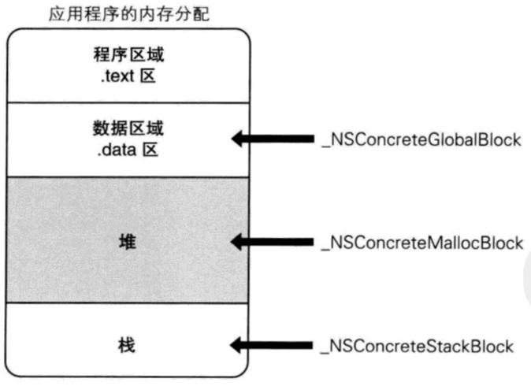

如图，GlobalBlock 存放在数据区域，MallocBlock 存放在堆区域，StackBlock 存放在栈区。

## 三种 block 类型的划分
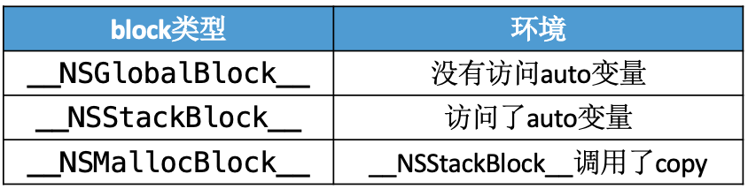

为了保证打印结果的准确性，需要关闭 Xcode 的 ARC。build setting -> Automatic Reference Counting（NO）。

### \_\_NSGlobalBlock\_\_
#### 不访问变量：
```
int main(int argc, const char * argv[]) {
    @autoreleasepool {
        void (^block)(void) =  ^{
            NSLog(@"this is a block");
        };
        NSLog(@"%@", [block class]);
    }
    return 0;
}
```

打印结果：
```
__NSGlobalBlock__
```

#### 访问 static 变量：
```
int main(int argc, const char * argv[]) {
    @autoreleasepool {
        static int age = 10;
        void (^block)(void) =  ^{
            NSLog(@"this is a block, age = %d", age);
        };
        NSLog(@"%@", [block class]);
    }
    return 0;
}
```

打印结果：
```
__NSGlobalBlock__
```

#### 访问全局变量：
```
int age_ = 10;

int main(int argc, const char * argv[]) {
    @autoreleasepool {
        void (^block)(void) =  ^{
            NSLog(@"this is a block, age_ = %d", age_);
        };
        NSLog(@"%@", [block class]);
    }
    return 0;
}
```

打印结果：
```
__NSGlobalBlock__
```

#### 小结
block 在“没有访问变量”、“访问 static 变量”和“访问全局变量”的时候，都是 `__NSGlobalBlock__` 类型，放在数据区域。

### \_\_NSStackBlock\_\_

#### 访问 auto 变量：
```
int main(int argc, const char * argv[]) {
    @autoreleasepool {
        int age = 10;
        void (^block)(void) =  ^{
            NSLog(@"this is a block, age = %d", age);
        };
        NSLog(@"%@", [block class]);
    }
    return 0;
}
```

打印结果：
```
__NSStackBlock__
```

上面👆的打印结果中可以看到，block 在访问 auto 变量的时候类型是 `__NSStackBlock__`，放在栈区。

放在栈区的 block 会有内存销毁的问题：
```
void (^block)(void);
void test()
{
    int age = 10;
    block = ^{
        NSLog(@"this is a block, age = %d", age);
    };
    NSLog(@"类型：%@", [block class]);
}

int main(int argc, const char * argv[]) {
    @autoreleasepool {
        test();
        block();
    }
    return 0;
}
```

打印结果：
```
类型：__NSStackBlock__
this is a block, age = -272632600
```

可以看到打印出来的 age 出现异常。因为 block 是 `__NSStackBlock__` 类型的，放在栈区，它的作用域是 void test 方法的“{}”内部。在调用 test() 方法时，会在栈区开辟一块空间（调用栈）给 test() 函数使用，调用完成后该空间（调用栈）会被回收，这时 block 内部的数据就变成垃圾数据了。

#### 小结
虽然 block 捕获了 auto 变量的值，但是 block 结构体的内存是在栈区的，在 test 函数调用完被销毁后，block 结构体在栈上的内存里的数据可能就变成了垃圾数据。

### \_\_NSMallocBlock\_\_

可以通过 copy 方法将 `__NSStackBlock__` 类型的 block 变成 `__NSMallocBlock__` 类型。

`__NSStackBlock__` 类型的 block 在调用 copy 后，block 的类型就变成了 `__NSMallocBlock__` 类型。`__NSMallocBlock__` 类型的 block 的内存存放在堆区，由开发者手动管理内存的释放，保证了 block 内存的完整性。


# block 的 copy

## 三种 block 类型的 copy

### \_\_NSGlobalBlock\_\_ 的 copy
```
int main(int argc, const char * argv[]) {
    @autoreleasepool {
        void (^block)(void) = [^{
            NSLog(@"this is a block");
        } copy];
        NSLog(@"%@", [block class]);
    }
    return 0;
}
```

打印结果：
```
__NSGlobalBlock__
```

`__NSGlobalBlock__` 类型的 block 调用 copy 后还是 `__NSGlobalBlock__` 类型。

### \_\_NSStackBlock\_\_ 的 copy
```
void (^block)(void);
void test()
{
    int age = 10;
    block = [^{
        NSLog(@"this is a block, age = %d", age);
    } copy];
    NSLog(@"类型：%@", [block class]);
}

int main(int argc, const char * argv[]) {
    @autoreleasepool {
        test();
        block();
    }
    return 0;
}
```

打印结果：
```
类型：__NSMallocBlock__
this is a block, age = 10
```

调用 copy 方法后，block 的类型从 `__NSStackBlock__` 类型变成了 `__NSMallocBlock__` 类型，block 的内存位置就从栈区拷贝到堆区，由开发者手动管理内存的释放。将 block 的内存 copy 到堆区保证了 block 内存的完整性。

### \_\_NSMallocBlock\_\_ 的 copy
```
int main(int argc, const char * argv[]) {
    @autoreleasepool {
        int age = 10;
        void (^block)(void) =  ^{
            NSLog(@"this is a block, age = %d", age);
        };
        NSLog(@"%@", [[[block copy] copy] class]);
    }
    return 0;
}
```

打印结果：
```
__NSMallocBlock__
```

`__NSMallocBlock__` 类型的 block 调用 copy 后还是 `__NSMallocBlock__` 类型，引用计数+1。

### 小结
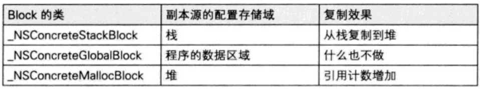

从内存管理的角度分析不同类型的 block 调用 copy 的不同现象：
1. 数据区域的 `__NSGlobalBlock__`，因为数据区域的内存在程序运行期间始终存在不会销毁，所以 `__NSGlobalBlock__` 的内存也没必要拷贝到堆区通过引用计数的方式管理内存。
2. 堆区的 `__NSMallocBlock__` 是通过引用计数策略被开发者管理内存的，所以在调用 copy 时要遵循引用计数管理逻辑+1。
3. 栈区的 `__NSStackBlock__` 是系统管理内存的，离开作用域就会销毁。通过 copy 将 `__NSStackBlock__` 类型的 block 的内存放到堆区，通过引用计数的方式管理内存，实现让开发者管理内存。

ps：  
类对象内存的存放位置：
```
int age = 10;
int main(int argc, const char * argv[]) {
    @autoreleasepool {
        int a = 10;
        NSLog(@"数据段：age %p", &age);
        NSLog(@"栈：a %p", &a);
        NSLog(@"堆：obj %p", [[NSObject alloc] init]);
        NSLog(@"class %p", [Person class]);
    }
    return 0;
}
```

打印结果：
```
数据段：age 0x100001310
栈：a 0x7ffeefbff52c
堆：obj 0x100606140
class 0x1000012c0
```

class 的内存地址跟 age 很接近，推测类对象的内存地址存放在数据段。

## ARC 环境下 block 的 copy

在 ARC 环境下，编译器会根据情况自动将栈上的 block 复制到堆上，比如以下情况：

### block 作为函数返回值

MRC 环境下 block 作为返回值的报错：Returning block that lives on the local stack
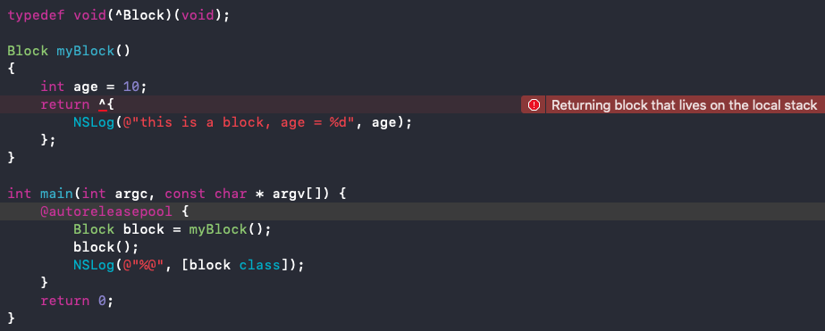

因为 myBlock() 方法里定义的 block 访问了 auto 变量，所以该 block 是 `__NSStackBlock__` 类型的，内存在栈区，作用域是在 myBlock() 方法的“{}”内。在 MRC 环境下，当 myBlock() 方法调用完成后，该 block 的内存就会被销毁。

ARC 环境下 block 作为返回值会调用 copy：
```
typedef void(^Block)(void);

Block myBlock()
{
    int age = 10;
    return ^{
        NSLog(@"this is a block, age = %d", age);
    }; //[^{} copy]，__NSStackBlock__（栈区）-> __NSMallocBlock__（堆区）
}

int main(int argc, const char * argv[]) {
    @autoreleasepool {
        Block block = myBlock();
        block();
        NSLog(@"%@", [block class]);
    }
    return 0;
}
```

ARC 环境下打印结果：
```
this is a block, age = 10
__NSMallocBlock__
```

在 ARC 环境下，^{} 在返回时返回的是 [^{} copy]，将 block 的内存从栈区拷贝到了堆区，所以打印 block 类型的结果是 `__NSMallocBlock__`。

### 将 block 赋值给 __strong 指针
```
int main(int argc, const char * argv[]) {
    @autoreleasepool {
        int age = 10;
        Block block = ^{
            NSLog(@"this is a block, age = %d", age);
        }; //[^{} copy]，__NSStackBlock__（栈区）-> __NSMallocBlock__（堆区）
        block();
        NSLog(@"%@", [block class]);
    }
    return 0;
}
```

ARC 环境下打印结果：
```
this is a block, age = 10
__NSMallocBlock__
```

MRC 环境下打印结果：
```
this is a block, age = 10
__NSStackBlock__
```

因为 block 访问了 auto 变量，所以该 block 是 `__NSStackBlock__` 类型的，内存在栈区，作用域是在当前“{}”内。在 ARC 环境下，^{} 在赋值给 `__strong` 指针时，调用了 copy（[^{} copy]），将 block 的内存从栈区拷贝到了堆区，所以打印 block 类型的结果是 `__NSMallocBlock__`。

反证：
```
NSLog(@"%@", [^{
    NSLog(@"this is a block, age = %d", age);
} class]);
```

ARC 环境下打印结果：
```
__NSStackBlock__
```

从打印结果可以看到，block 在没有被 `__strong` 指针指向时，其类型还是 `__NSStackBlock__` 类型，内存依然在栈区，说明 block 在没有 __strong 指针指向的时候不会调用 copy。

### block 作为 Cocoa API 中方法名含有 usingBlock 的方法参数
```
NSArray *array = @[];
[array enumerateObjectsUsingBlock:^(id  _Nonnull obj, NSUInteger idx, BOOL * _Nonnull stop) {
    
}]; //[^(id  _Nonnull obj, NSUInteger idx, BOOL * _Nonnull stop){} copy]，__NSStackBlock__（栈区）-> __NSMallocBlock__（堆区）
```

### block 作为 GCD API 的方法参数
GCD API 里的 block 都是在堆上的：
```
static dispatch_once_t onceToken;
dispatch_once(&onceToken, ^{
    
}); //[^{} copy]，__NSStackBlock__（栈区）-> __NSMallocBlock__（堆区）

dispatch_after(dispatch_time(DISPATCH_TIME_NOW, (int64_t)(1 * NSEC_PER_SEC)), dispatch_get_main_queue(), ^{
    
}); //[^{} copy]，__NSStackBlock__（栈区）-> __NSMallocBlock__（堆区）
```

## 小结
MRC 下 block 属性的建议写法
```
@property (copy, nonatomic) void (^block)(void);
```

ARC 下 block 属性的建议写法
```
@property (strong, nonatomic) void (^block)(void);
@property (copy, nonatomic) void (^block)(void);
```

* block 的属性修饰词为什么是 copy？使用 block 有哪些使用注意？  
block 创建时内存是在栈上的，进行 copy 操作后，block 的内存就从栈上拷贝到了堆上。  
堆上的 block 对捕获到的变量有强引用，需要注意 block 与被捕获的变量之间是否存在循环引用的问题。

# 对象类型的 auto 变量

## ARC 下的“对象类型的 auto 变量”
```
@interface Person : NSObject
@property (nonatomic, assign) int age;
@end

@implementation Person
- (void)dealloc
{
    NSLog(@"Person - dealloc");
}
@end

int main(int argc, const char * argv[]) {
    @autoreleasepool {
        {
            Person *person = [[Person alloc] init];
            person.age = 10;
        } //离开大括号，销毁 person 对象

        NSLog(@"-------"); //断点
    }
    return 0;
}
```

运行到断点处的打印结果：
```
Person - dealloc
```

auto 变量 person 的作用域在当前“{}”内，在没有其它引用的情况下，离开作用域就会被销毁。

block 捕获 person 对象：
```
typedef void(^Block)(void);

int main(int argc, const char * argv[]) {
    @autoreleasepool {
        Block block;
        {
            Person *person = [[Person alloc] init];
            person.age = 10;
            block = ^{
                NSLog(@"this is a block, person.age = %d", person.age);
            }; //[^{} copy]，__NSStackBlock__（栈区）-> __NSMallocBlock__（堆区），ARC 下日常 copy
        } //销毁 person 对象
        
        NSLog(@"-------"); //断点1
    } //销毁 block
    return 0; //断点2
}
```

运行到断点1处没有打印结果。

运行到断点2处的打印结果：
```
-------
Person - dealloc
```

简化代码，查看 block 与 person 的关系：
```
int main(int argc, const char * argv[]) {
    @autoreleasepool {
        Person *person = [[Person alloc] init];
        person.age = 10;
        Block block = ^{
            NSLog(@"this is a block, person.age = %d", person.age);
        }; //[^{} copy]，__NSStackBlock__（栈区）-> __NSMallocBlock__（堆区），ARC 下日常 copy
    }
    return 0;
}
```

查看 block 的 C++ 代码：
```
struct __main_block_impl_0 {
  struct __block_impl impl;
  struct __main_block_desc_0* Desc;
  Person *person; //ARC下是强指针
  __main_block_impl_0(void *fp, struct __main_block_desc_0 *desc, Person *_person, int flags=0) : person(_person) {
    impl.isa = &_NSConcreteStackBlock;
    impl.Flags = flags;
    impl.FuncPtr = fp;
    Desc = desc;
  }
};
```

可以看到 block 捕获了 person 对象。因为 person 对象是 auto 变量，所以 block 在捕获 person 对象时生成的也是 Person 类型的变量，即：  
```
auto int person; -> int person;  
auto Person *person; -> Person *person;  

static int person; -> int *person;  
static Person *person; -> Person **person;
```

因为在 ARC 下 block 有 copy 操作，所以 block 在堆空间。堆空间的 block 在捕获 person 对象时生成的变量 Person *person 在 ARC 下是强指针，即 block 持有了 person 对象，所以在 block 销毁前，block 不会释放 person。

## MRC 下的“对象类型的 auto 变量”
```
@interface Person : NSObject
@property (nonatomic, assign) int age;
@end

@implementation Person
- (void)dealloc
{
    [super dealloc];
    NSLog(@"Person - dealloc");
}
@end

typedef void(^Block)(void);

int main(int argc, const char * argv[]) {
    @autoreleasepool {
        Block block;
        {
            Person *person = [[Person alloc] init]; //等同于 __strong Person *person = [[Person alloc] init];
            person.age = 10;
            block = ^{
                NSLog(@"this is a block, person.age = %d", person.age);
            }; //MRC 下没有 copy 操作，block 在栈空间
            [person release]; // MRC 下的手动释放 person 对象
        } //销毁 person 对象
        NSLog(@"-------"); //断点
    }
    return 0;
}
```

运行到断点处的打印结果：
```
Person - dealloc
```

因为在 MRC 下 block 没有 copy 操作，所以 block 在栈空间。在断点处 person 对象被销毁了，说明栈空间的 block 对外部变量 person 对象时弱引用。

对 block 进行 copy 操作
```
int main(int argc, const char * argv[]) {
    @autoreleasepool {
        Block block;
        {
            Person *person = [[Person alloc] init]; //等同于 __strong Person *person = [[Person alloc] init];
            person.age = 10;
            block = [^{
                //堆空间的 block 会对 person 对象进行 retain 操作 [person retain]
                NSLog(@"this is a block, person.age = %d", person.age);
            } copy]; //[^{} copy]，__NSStackBlock__（栈区）-> __NSMallocBlock__（堆区）
            [person release]; // MRC 下的手动释放 person 对象
        }
        NSLog(@"-------"); //断点
    } //销毁 block 前，block 会释放 person 对象（release）
    return 0;
}
```

运行到断点处没有打印结果。

因为在 MRC 下对 block 进行 copy 操作后，block 的内存就从栈空间拷贝到了堆空间，堆空间的 block 会对 person 对象进行 retain 操作 [person retain]，即 block 持有了 person 对象，所以在 block 销毁前，block 不会释放 person。

堆空间的 block 在销毁时会对 person 对象进行一次 release 操作 [person release]。


# __weak

在使用 clang 转换 OC 为 C++ 代码时，如果使用了 `__weak` 可能会遇到以下问题：  
cannot create \_\_weak reference in file using manual reference

解决方案：支持 ARC、指定运行时系统版本：  
```
-fobjc-arc -fobjc-runtime=ios-8.0.0
```
即
```
xcrun -sdk iphoneos clang -arch arm64 -rewrite-objc -fobjc-arc -fobjc-runtime=ios-8.0.0 main.m
```

## __strong 修饰的“对象类型的 auto 变量”
```
typedef void(^Block)(void);

int main(int argc, const char * argv[]) {
    @autoreleasepool {
        Block block;
        {
            Person *person = [[Person alloc] init]; //等同于 __strong Person *person = [[Person alloc] init];
            person.age = 10;
            block = ^{
                NSLog(@"this is a block, person.age = %d", person.age);
            };
        }
        NSLog(@"-------"); //断点
    }
    return 0;
}
```

断点处没有打印结果。  

在 ARC 下，block 在赋值给 __strong 指针时会调用 copy，block 的内存从栈区被拷贝到堆区，同时会对不会的变量进行强引用（__strong），所以断点处 person 没有销毁。

查看 c++ 代码：
```
struct __main_block_impl_0 {
  struct __block_impl impl;
  struct __main_block_desc_0* Desc;
  Person *__strong person; //__strong 强引用
  __main_block_impl_0(void *fp, struct __main_block_desc_0 *desc, Person *__strong _person, int flags=0) : person(_person) {
    impl.isa = &_NSConcreteStackBlock;
    impl.Flags = flags;
    impl.FuncPtr = fp;
    Desc = desc;
  }
};
```

## __weak 修饰的“对象类型的 auto 变量”
```
typedef void(^Block)(void);

int main(int argc, const char * argv[]) {
    @autoreleasepool {
        Block block;
        {
            Person *person = [[Person alloc] init];
            person.age = 10;
            __weak Person *weakPerson = person;
            block = ^{
                NSLog(@"this is a block, person.age = %d", weakPerson.age);
            };
        } //销毁 person
        NSLog(@"-------"); //断点
    }
    return 0;
}
```

断点处的打印结果：
```
Person - dealloc
```

`__weak` 修饰的 person 对象，不会被 block 强引用。

查看 c++ 代码：
```
struct __main_block_impl_0 {
    struct __block_impl impl;
    struct __main_block_desc_0* Desc;
    Person *__weak weakPerson; //__weak 弱引用
    __main_block_impl_0(void *fp, struct __main_block_desc_0 *desc, Person *__weak _weakPerson, int flags=0) : weakPerson(_weakPerson) {
    impl.isa = &_NSConcreteStackBlock;
    impl.Flags = flags;
    impl.FuncPtr = fp;
    Desc = desc;
    }
};
```

结合“MRC 下对'对象类型的 auto 变量'的引用”可以看出，不管 block 的 c++ 结构体里引用外部变量的是 `__weak`（弱引用） 还是 `__strong`（强引用），栈上的 block 对外部变量的引用都不是强引用。

## copy 函数和 dispose 函数


以上面使用 __weak 修改变量的 c++ 代码为例：
```
struct __main_block_impl_0 {
    struct __block_impl impl;
    struct __main_block_desc_0* Desc;
    Person *__weak weakPerson; //__weak 弱引用
    __main_block_impl_0(void *fp, struct __main_block_desc_0 *desc, Person *__weak _weakPerson, int flags=0) : weakPerson(_weakPerson) {
        impl.isa = &_NSConcreteStackBlock;
        impl.Flags = flags;
        impl.FuncPtr = fp;
        Desc = desc;
    }
};

static void __main_block_func_0(struct __main_block_impl_0 *__cself) {
    Person *__weak weakPerson = __cself->weakPerson; // bound by copy
    NSLog((NSString *)&__NSConstantStringImpl__var_folders_rw_lcynwz_524g1qwsw4sclwtrw0000gn_T_main_52dcf5_mi_0, ((int (*)(id, SEL))(void *)objc_msgSend)((id)weakPerson, sel_registerName("age")));
}

//copy 函数，调用时机：栈上的 block 复制到堆时
static void __main_block_copy_0(struct __main_block_impl_0*dst, struct __main_block_impl_0*src) {
    //会根据 auto 变量的修饰符（__strong、__weak、__unsafe_unretained）做出相应的操作，形成强引用（retain）或者弱引用。方法内部有引用计数的管理。
    _Block_object_assign((void*)&dst->weakPerson, (void*)src->weakPerson, 3/*BLOCK_FIELD_IS_OBJECT*/);
}

//dispose 函数，调用时机：堆上的 block 被废弃时
static void __main_block_dispose_0(struct __main_block_impl_0*src) {
    //会自动释放引用的 auto 变量（release）
    _Block_object_dispose((void*)src->weakPerson, 3/*BLOCK_FIELD_IS_OBJECT*/);
}

static struct __main_block_desc_0 {
    size_t reserved;
    size_t Block_size;
    void (*copy)(struct __main_block_impl_0*, struct __main_block_impl_0*); //copy 函数
    void (*dispose)(struct __main_block_impl_0*); //dispose 函数
} __main_block_desc_0_DATA = { 0, sizeof(struct __main_block_impl_0), __main_block_copy_0, __main_block_dispose_0};

int main(int argc, const char * argv[]) {
    /* @autoreleasepool */ { __AtAutoreleasePool __autoreleasepool; 
        Block block;
        {
            Person *person = ((Person *(*)(id, SEL))(void *)objc_msgSend)((id)((Person *(*)(id, SEL))(void *)objc_msgSend)((id)objc_getClass("Person"), sel_registerName("alloc")), sel_registerName("init"));
            ((void (*)(id, SEL, int))(void *)objc_msgSend)((id)person, sel_registerName("setAge:"), 10);
            __attribute__((objc_ownership(weak))) Person *weakPerson = person;
            block = ((void (*)())&__main_block_impl_0((void *)__main_block_func_0, &__main_block_desc_0_DATA, weakPerson, 570425344));
        }
        NSLog((NSString *)&__NSConstantStringImpl__var_folders_rw_lcynwz_524g1qwsw4sclwtrw0000gn_T_main_52dcf5_mi_1);
    }
    return 0;
}
static struct IMAGE_INFO { unsigned version; unsigned flag; } _OBJC_IMAGE_INFO = { 0, 2 };
```

`__main_block_desc_0` 结构体多了两个函数指针 copy 和 dispose，分别对应着 `__main_block_copy_0` 方法和 `__main_block_dispose_0` 方法。

## GCD 与“对象类型的 auto 变量”

### GCD 与 __strong 修饰的“对象类型的 auto 变量”
创建一个 iOS 项目测试：
```
@interface ViewController ()
@end

@implementation ViewController
- (void)touchesBegan:(NSSet<UITouch *> *)touches withEvent:(UIEvent *)event 
{
    Person *person = [[Person alloc] init]; //等同于 __strong Person *person = [[Person alloc] init];
    dispatch_after(dispatch_time(DISPATCH_TIME_NOW, (int64_t)(3 * NSEC_PER_SEC)), dispatch_get_main_queue(), ^{
        NSLog(@"Person: %@", person);
    });
    NSLog(@"touchesBegan:withEvent:");
}
@end

@interface Person : NSObject
@end

@implementation Person
- (void)dealloc
{
    NSLog(@"Person - dealloc");
}
@end
```

打印结果：
```
2020-06-09 10:19:58.941605+0800 block-test[4017:52615] touchesBegan:withEvent:
2020-06-09 10:20:01.941715+0800 block-test[4017:52615] Person: <Person: 0x600001040370>
2020-06-09 10:20:01.941879+0800 block-test[4017:52615] Person - dealloc
```

从打印结果可以看到，在触摸事件触发后3秒，GCD 的 block 代码块打印了 person 对象，几乎是同时，person 对象被销毁了，说明 GCD 的 block 与 person 对象之间是强引用关系（`__strong`）。这是因为 GCD 的 block 在 ARC 下回自动调用 copy，将内存从栈区拷贝到堆区，堆区的 block 又会调用 block 内部的 copy 函数对 person 对象根据引用类型（`__strong`）进行强引用（retain）。

### GCD 与 __weak 修饰的“对象类型的 auto 变量”
```
@interface ViewController ()
@end

@implementation ViewController
- (void)touchesBegan:(NSSet<UITouch *> *)touches withEvent:(UIEvent *)event 
{
    Person *person = [[Person alloc] init];
    __weak Person *weakPerson = person;
    dispatch_after(dispatch_time(DISPATCH_TIME_NOW, (int64_t)(3 * NSEC_PER_SEC)), dispatch_get_main_queue(), ^{
        NSLog(@"Person: %@", weakPerson);
    });
    NSLog(@"touchesBegan:withEvent:");
}
@end

@interface Person : NSObject
@end

@implementation Person
- (void)dealloc
{
    NSLog(@"Person - dealloc");
}
@end
```

打印结果：
```
2020-06-09 10:31:06.313268+0800 block-test[4386:61611] touchesBegan:withEvent:
2020-06-09 10:31:06.313352+0800 block-test[4386:61611] Person - dealloc
2020-06-09 10:31:09.313416+0800 block-test[4386:61611] Person: (null)
```

从打印结果可以看到，在触摸事件触发时，person 对象就被销毁了，3秒后 block 内部打印的 person 对象等于（null），说明 GCD 的 block 与 person 对象之间是弱引用关系（`__weak`）。这是因为 GCD 的 block 在 ARC 下会自动调用 copy，将内存从栈区拷贝到堆区，堆区的 block 又会调用 block 内部的 copy 函数对 person 对象根据引用类型（`__weak`）进行弱引用。

拓展：
```
@interface ViewController ()
@end

@implementation ViewController
- (void)touchesBegan:(NSSet<UITouch *> *)touches withEvent:(UIEvent *)event 
{
    Person *person = [[Person alloc] init];
    __weak Person *weakPerson = person;
    dispatch_after(dispatch_time(DISPATCH_TIME_NOW, (int64_t)(1 * NSEC_PER_SEC)), dispatch_get_main_queue(), ^{
        NSLog(@"time：1，Person: %@", weakPerson); //__weak
        dispatch_after(dispatch_time(DISPATCH_TIME_NOW, (int64_t)(2 * NSEC_PER_SEC)), dispatch_get_main_queue(), ^{
            NSLog(@"time：2，Person: %@", person); //__strong
        });
    });
    NSLog(@"touchesBegan:withEvent:");
}
@end

@interface Person : NSObject
@end

@implementation Person
- (void)dealloc
{
    NSLog(@"Person - dealloc");
}
@end
```

打印结果：
```
2020-06-09 13:41:54.571551+0800 block-test[9174:148566] touchesBegan:withEvent:
2020-06-09 13:41:55.670345+0800 block-test[9174:148566] time：1，Person: <Person: 0x600002a90130>
2020-06-09 13:41:57.842076+0800 block-test[9174:148566] time：2，Person: <Person: 0x600002a90130>
2020-06-09 13:41:57.842202+0800 block-test[9174:148566] Person - dealloc
```

1秒的定时器对 person 对象时弱引用（`__weak`），2秒的定时器对 person 对象是强引用（`__strong`），所以 person 对象会在2秒的 GCD 定时器执行完成后，在 block 销毁前被释放。

## 小结

* 如果 block 是在栈上，将不会对 auto 变量产生强引用  
不管是 ARC 下还是 MRC 下，栈空间的 block 是不会持有“对象类型的 auto 变量”的。堆空间的 block 在 ARC 下通过 `__strong`（强引用）持有“对象类型的 auto 变量”。在 MRC 下，当 block 手动调用 copy 从栈区拷贝到堆区，并通过 retain 持有“对象类型的 auto 变量”，通过 release 释放“对象类型的 auto 变量”。 

* 如果 block 被拷贝到堆上，会调用 block 内部的 copy 函数，copy 函数内部会调用 _Block_object_assign 函数，_Block_object_assign 函数会根据 auto 变量的修饰符（`__strong`、`__weak`、`__unsafe_unretained`）做出相应的操作，形成强引用（retain）或者弱引用。

* 如果 block 从堆上移除，会调用 block 内部的 dispose 函数，dispose 函数内部会调用 _Block_object_dispose 函数，_Block_object_dispose 函数会自动释放引用的 auto 变量（release）。

# __block

## __block 的本质

block 内部无法修改 auto 变量的值：
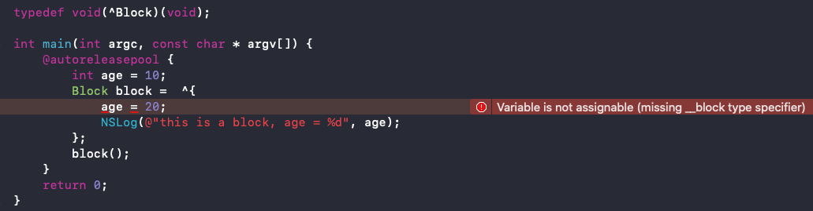

block 内部可以修改全局变量、静态变量（static）。  
全局变量：
```
typedef void(^Block)(void);

int age = 10;
int main(int argc, const char * argv[]) {
    @autoreleasepool {
        Block block =  ^{
            age = 20;
            NSLog(@"this is a block, age = %d", age);
        };
        block();
    }
    return 0;
}
```

打印结果：
```
this is a block, age = 20
```

静态变量（static）：
```
typedef void(^Block)(void);

int main(int argc, const char * argv[]) {
    @autoreleasepool {
        static int age = 10;
        Block block =  ^{
            age = 20;
            NSLog(@"this is a block, age = %d", age);
        };
        block();
    }
    return 0;
}
```

打印结果：
```
this is a block, age = 20
```
 
`__block` 可以用于解决 block 内部无法修改 auto 变量值的问题：
```
typedef void(^Block)(void);

int main(int argc, const char * argv[]) {
    @autoreleasepool {
        __block int age = 10;
        Block block =  ^{
            age = 20;
            NSLog(@"this is a block, age = %d", age);
        };
        block();
        NSLog(@"%p", &age);
    }
    return 0;
}
```

打印结果：
```
this is a block, age = 20
0x7ffeefbff578
```

编译器会将 `__block` 变量包装成一个对象，查看 c++ 代码：
```
typedef void(*Block)(void);

//__block 变量被包装成一个对象
struct __Block_byref_age_0 {
  void *__isa; //具有 isa 指针，说明 __Block_byref_age_0 结构体是一个对象
__Block_byref_age_0 *__forwarding; //指向 __Block_byref_age_0 结构体自身
 int __flags;
 int __size; //__Block_byref_age_0 结构体的大小
 int age; //auto 变量（10）
};

struct __main_block_impl_0 {
  struct __block_impl impl;
  struct __main_block_desc_0* Desc;
  __Block_byref_age_0 *age; //指向 __block 变量包装成的对象 
  __main_block_impl_0(void *fp, struct __main_block_desc_0 *desc, __Block_byref_age_0 *_age, int flags=0) : age(_age->__forwarding) {
    impl.isa = &_NSConcreteStackBlock;
    impl.Flags = flags;
    impl.FuncPtr = fp;
    Desc = desc;
  }
};

static void __main_block_func_0(struct __main_block_impl_0 *__cself) {
    __Block_byref_age_0 *age = __cself->age; //获取到 __Block_byref_age_0 对象
    (age->__forwarding->age) = 20; //通过 age（__Block_byref_age_0）对象的 __forwarding 指针找到 age（__Block_byref_age_0）对象里的参数 int age
    NSLog((NSString *)&__NSConstantStringImpl__var_folders_rw_lcynwz_524g1qwsw4sclwtrw0000gn_T_main_f95ea5_mi_0, (age->__forwarding->age));
}

static void __main_block_copy_0(struct __main_block_impl_0*dst, struct __main_block_impl_0*src) {_Block_object_assign((void*)&dst->age, (void*)src->age, 8/*BLOCK_FIELD_IS_BYREF*/);}

static void __main_block_dispose_0(struct __main_block_impl_0*src) {_Block_object_dispose((void*)src->age, 8/*BLOCK_FIELD_IS_BYREF*/);}

static struct __main_block_desc_0 {
  size_t reserved;
  size_t Block_size;
  void (*copy)(struct __main_block_impl_0*, struct __main_block_impl_0*);
  void (*dispose)(struct __main_block_impl_0*);
} __main_block_desc_0_DATA = { 0, sizeof(struct __main_block_impl_0), __main_block_copy_0, __main_block_dispose_0};
int main(int argc, const char * argv[]) {
    /* @autoreleasepool */ { __AtAutoreleasePool __autoreleasepool; 
        //对应的 OC 代码：__block int age = 10;
        //简化后：__Block_byref_age_0 age = {0,&age, 0, sizeof(__Block_byref_age_0), 10};
        __attribute__((__blocks__(byref))) __Block_byref_age_0 age = {(void*)0, //isa 指针
                                                                      (__Block_byref_age_0 *)&age, //age（__Block_byref_age_0）对象的地址值
                                                                      0, 
                                                                      sizeof(__Block_byref_age_0), //__Block_byref_age_0 结构体的大小
                                                                      10}; //auto 变量 age 的值
        Block block = ((void (*)())&__main_block_impl_0((void *)__main_block_func_0, 
                                                        &__main_block_desc_0_DATA, 
                                                        (__Block_byref_age_0 *)&age, 
                                                        570425344));
        ((void (*)(__block_impl *))((__block_impl *)block)->FuncPtr)((__block_impl *)block);
        //NSLog(@"%p", &age); 访问的是 __block 结构体里面的 age 变量
        NSLog((NSString *)&__NSConstantStringImpl__var_folders_rw_lcynwz_524g1qwsw4sclwtrw0000gn_T_main_85d8e5_mi_1, &(age.__forwarding->age));
    }
    return 0;
}
static struct IMAGE_INFO { unsigned version; unsigned flag; } _OBJC_IMAGE_INFO = { 0, 2 };
```

被 `__block` 修饰过的 auto 变量被包装成一个 `__Block_byref_age_0` 结构体。因为 `__Block_byref_age_0` 结构体内有 isa 指针，所以 `__Block_byref_age_0` 结构体是一个对象。`__Block_byref_age_0` 结构体的 `__forwarding` 指针指向自身，在 block 的执行代码里调用 `__Block_byref_age_0` 结构体内部参数 age 时，就是通过 `__forwarding` 指针调用的（age->__forwarding->age）。

外部再想访问 age 时，也会通过 `__block` 结构体访问 &(age.__forwarding->age)，如：NSLog(@"%p", &age)：
```
NSLog((NSString *)&__NSConstantStringImpl__var_folders_rw_lcynwz_524g1qwsw4sclwtrw0000gn_T_main_85d8e5_mi_1, &(age.__forwarding->age));
```

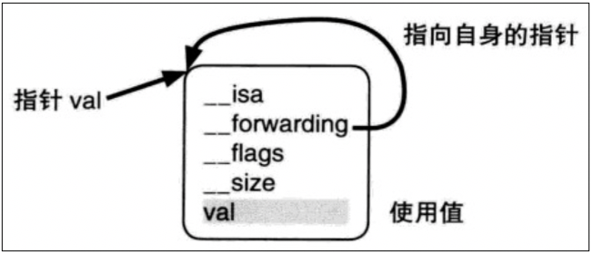

`__block` 修改“对象类型的 auto 变量”  
```
struct __Block_byref_obj_0 {
    void *__isa;
    __Block_byref_obj_0 *__forwarding;
    int __flags;
    int __size;
    void (*__Block_byref_id_object_copy)(void*, void*); //copy 函数（内存管理相关）
    void (*__Block_byref_id_object_dispose)(void*); //dispose 函数（内存管理相关）
    NSObject *obj; //auto 变量
};
```

使用 `__bloclk` 修改“对象类型的 auto 变量” 同样会生成对应的 __Block_byref_obj_0 对象。相对于普通的 auto 变量，增加了 copy 函数和 dispose 函数用于内存管理。

`__bloclk` 结构体内部用于保存 auto 变量 obj 的变量 NSObject *obj，同  auto 变量的类型保持一致。

`__block` 不能修饰全局变量、静态变量（static）
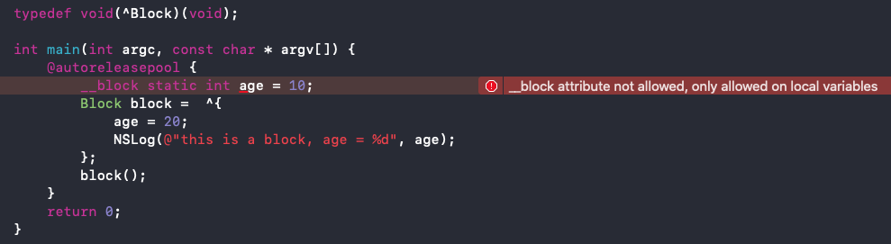

block 内部可以使用 array 指针，但是不可以修改 array 指针：  
使用 array 指针：
```
typedef void(^Block)(void);

int main(int argc, const char * argv[]) {
    @autoreleasepool {
        NSMutableArray *array = [NSMutableArray array];
        Block block =  ^{
            [array addObject:@"123"];
        };
        block();
    }
    return 0;
}
```

修改 array 指针：
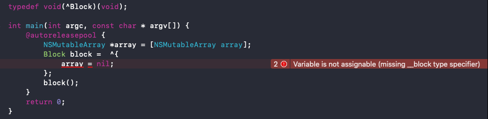

### 小结

* block 在修改 NSMutableArray，需不需要添加 `__block`？  
block 内部可以使用 NSMutableArray 指针（如：[array addObject:@"123"]），不需要添加 `__block`。  
block 内部不可以修改 NSMutableArray 的指针（如：array = nil），如果需要修改 NSMutableArray 指针的话，需要添加 `__block`。 

## \_\_block 的内存管理

当 block 在栈上时，并不会对 `__block` 变量产生强引用。  

当 block 被 copy 到堆时，会调用 block 内部的 copy 函数，copy 函数内部会调用 _Block_object_assign 函数，_Block_object_assign 函数会对 `__block` 变量形成强引用（retain）。

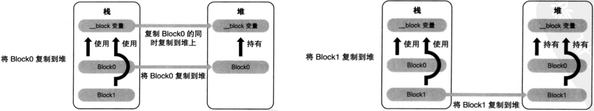


当 block 从堆中移除时，会调用 block 内部的 dispose 函数，dispose 函数内部会调用 _Block_object_dispose 函数，_Block_object_dispose 函数会自动释放引用的 `__block` 变量（release）。

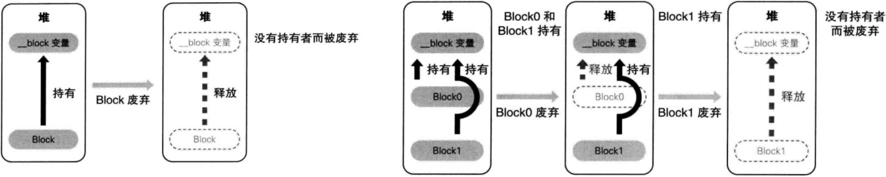


### 对象类型的 auto 变量、\_\_block 变量
当 block 在栈上时，对对象类型的 auto 变量、`__block` 变量都不会产生强引用.  

当 block 拷贝到堆上时，都会通过 copy 函数来处理对象类型的 auto 变量、`__block` 变量：  
`__block` 变量
```
_Block_object_assign((void*)&dst->a, (void*)src->a, 8/*BLOCK_FIELD_IS_BYREF*/);
```

对象类型的 auto 变量
```
_Block_object_assign((void*)&dst->p, (void*)src->p, 3/*BLOCK_FIELD_IS_OBJECT*/);
```

当 block 从堆上移除时，都会通过 dispose 函数来释放对象类型的 auto 变量、`__block` 变量：  
__block变量
```
_Block_object_dispose((void*)src->a, 8/*BLOCK_FIELD_IS_BYREF*/);
```

对象类型的 auto 变量
```
_Block_object_dispose((void*)src->p, 3/*BLOCK_FIELD_IS_OBJECT*/);
```

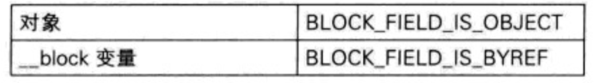

## \_\_block 的 \_\_forwarding 指针

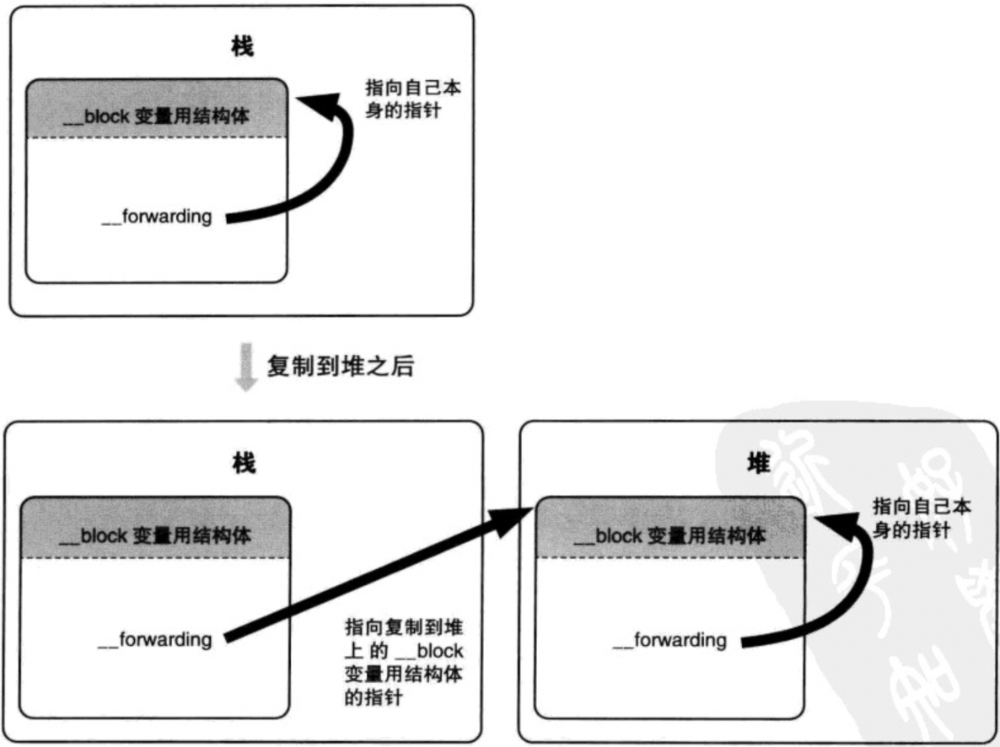

age.__forwarding->age：__Block_byref_obj_0 结构体对应的 age 对象通过 `__forwarding` 指针找到被拷贝到堆里的 `__block` 结构体，再找到结构体里的 age 变量。

## 被 \_\_block 修饰的对象类型

### ARC 下：
__block Person *person 的内存结构：
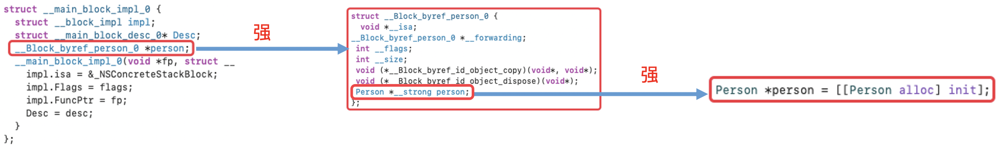

__block __weak Person *weakPerson 的内存结构：
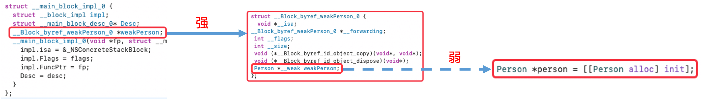

### MRC 下：

查看支持 MRC、指定运行时系统版本的 c++ 代码：
```
xcrun -sdk iphoneos clang -arch arm64 -rewrite-objc -fno-objc-arc -fobjc-runtime=ios-8.0.0 main.m
```

栈区的 block：
```
typedef void(^Block)(void);

int main(int argc, const char * argv[]) {
    @autoreleasepool {
        __block Person *person = [[Person alloc] init];
        Block block = ^{
            NSLog(@"%@", person);
        };
        [person release];
        block();
        [block release];
    }
    return 0;
}
```

打印结果：
```
Person - dealloc
```

堆区的 block：
```
typedef void(^Block)(void);

int main(int argc, const char * argv[]) {
    @autoreleasepool {
        __block Person *person = [[Person alloc] init];
        Block block = [^{
            NSLog(@"%@", person);
        } copy];
        [person release];
        block();
        [block release];
    }
    return 0;
}
```

打印结果：
```
Person - dealloc
```

栈区和堆区的 block 在执行代码时出现同样的错误：

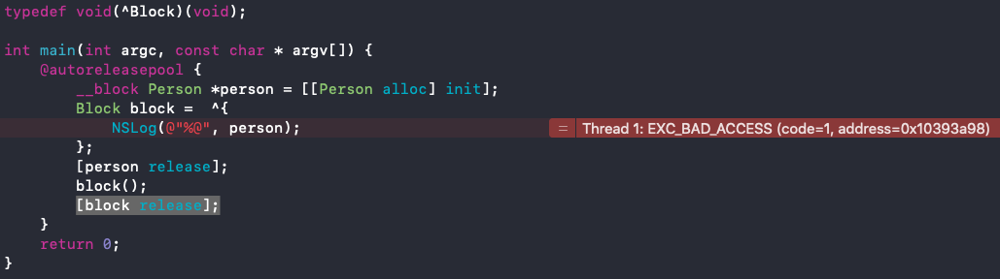

MRC 下栈区和堆区的 block 都不会对指向的对象产生强引用，内存结构：
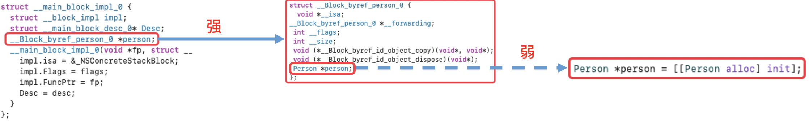

截图👆里 __Block_byref_person_0 结构体里的 Person *person 可能是省略了 __weak，即 Person *__weak person;

对比没有 __block 的对象类型的 auto 变量的内存结构：

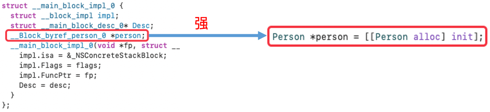


## 小结

当 \_\_block 变量在栈上时，不会对指向的对象产生强引用。  

当 \_\_block 变量被 copy 到堆时，会调用 `__block` 变量内部的 copy 函数，copy 函数内部会调用 _Block_object_assign 函数，_Block_object_assign 函数会根据所指向对象的修饰符（`__strong`、`__weak`、`__unsafe_unretained`）做出相应的操作，形成强引用（retain）或者弱引用（注意：这里仅限于 ARC 时会 retain，MRC 时不会 retain）。

当 `__block` 变量从堆上移除时，会调用 `__block` 变量内部的 dispose 函数，dispose 函数内部会调用 _Block_object_dispose 函数，_Block_object_dispose 函数会自动释放指向的对象（release）。


