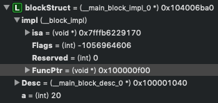
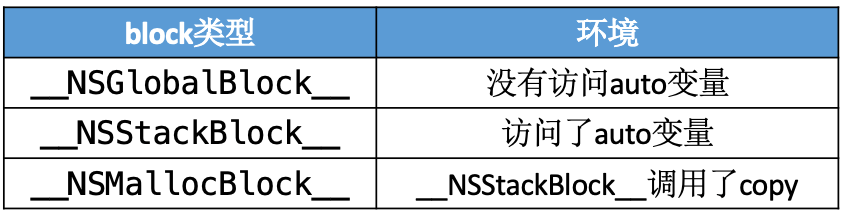

思考：
* block 的原理是怎样的？本质是什么？
<!-- more -->

# 基本认识

## block
```
^{
    NSLog(@"this is a block");
};
```

block 可以封装一块代码，在将来需要执行的地方通过“()”进行调用：
```
int main(int argc, const char * argv[]) {
    @autoreleasepool {
        ^{
            NSLog(@"this is a block");
        }();
    }
    return 0;
}
```

或者
```
int main(int argc, const char * argv[]) {
    @autoreleasepool {
        void (^block)(void) = ^{
            NSLog(@"this is a block");
        };
        block();
    }
    return 0;
}
```

打印结果：
```
this is a block
```

## block 的 C++ 代码
查看 block 的 C++ 代码。找到 main.m 文件，在终端输入：
```
xcrun -sdk iphoneos clang -arch arm64 -rewrite-objc main.m -o main-arm64.cpp
```

block 的 C++ 代码（精简版）：
```
struct __main_block_desc_0 {
  size_t reserved;
  size_t Block_size; //占用内存大小
}

struct __block_impl {
    void *isa; //指向父类的指针（OC对象特征）
    int Flags;
    int Reserved;
    void *FuncPtr; //函数地址，用于函数调用
};

struct __main_block_impl_0 { //block 结构体
  struct __block_impl impl;
  struct __main_block_desc_0* Desc;
  int a; //调用环境
};

int main(int argc, const char * argv[]) {
    @autoreleasepool {
        int a = 20;
        void (^block)(void) = ^{
            NSLog(@"this is a block - %d", a); //断点2
        };
        block(); //断点1
    }
    return 0;
}
```

## __main_block_impl_0
__main_block_impl_0 是 block 在 C++ 中的结构体实现。第一个参数 __block_impl 中有一个 isa 指针，具备 OC 对象特征，说明 block 本质上也是一个 OC 对象。  

__main_block_impl_0 省略 __block_impl 和 __main_block_desc_0 后可以看成：
```
struct __main_block_impl_0 {
  void *isa; 
  int Flags;
  int Reserved;
  void *FuncPtr; 
  size_t reserved;
  size_t Block_size;
  int a; 
};
```

即：


## FuncPtr
FuncPtr 是一个指针，指向 block 封装的代码块的函数地址。  

在断点1处打印 FuncPtr 地址：  


```
Printing description of blockStruct->impl.FuncPtr:
(void *) FuncPtr = 0x0000000100000f00
```

在断点2处，选择 Debug -> Debug Workflow -> Always Show Disassembly:


可以看到，block 里的开始地址值 100000f00 等于 FuncPtr 的地址值。说明 block 里的代码块的地址值被保存在了 __block_impl 里的 FuncPtr 中（函数调用），另外 __main_block_impl_0 里保存了外部变量 int a（调用环境），说明 block 是封装了函数调用以及函数调用环境的 OC 对象。


# block 的本质

block 本质上是封装了函数调用以及函数调用环境的 OC 对象，它内部也有个 isa 指针。

## 定义 block：
```
int main(int argc, const char * argv[]) {
    @autoreleasepool {
        void (^block)(void) =  ^{
            NSLog(@"this is a block");
        };
        block();
    }
    return 0;
}
```

查看 block 的 C++ 代码：
```
struct __block_impl {
    void *isa; //指向父类
    int Flags;
    int Reserved;
    void *FuncPtr; //指向 __main_block_func_0 函数地址的指针，用于函数调用
};

struct __main_block_impl_0 {
  struct __block_impl impl; //作为第一个变量，__block_impl 的内存地址就是 __main_block_impl_0 内存地址
  struct __main_block_desc_0* Desc; //描述，是一个结构体变量 __main_block_desc_0_DATA
  // 构造函数（类似于OC的init方法），返回结构体对象
  // 参数 fp：block 执行逻辑的函数的地址，即 __main_block_func_0
  // 参数 desc：描述，__main_block_desc_0 的结构体变量，即 __main_block_desc_0_DATA
  // 参数 flags：默认可以不传，flags=0
  __main_block_impl_0(void *fp, struct __main_block_desc_0 *desc, int flags=0) {
    impl.isa = &_NSConcreteStackBlock; //指向父类。_NSConcreteStackBlock：block 的类型
    impl.Flags = flags;
    impl.FuncPtr = fp; //__main_block_func_0
    Desc = desc; //__main_block_desc_0_DATA
  }
};

// 封装了 block 执行逻辑的函数
// 参数：block 结构体
static void __main_block_func_0(struct __main_block_impl_0 *__cself) {

    NSLog((NSString *)&__NSConstantStringImpl__var_folders_rw_lcynwz_524g1qwsw4sclwtrw0000gn_T_main_880b47_mi_0); // NSLog(@"this is a block");
}

// 封装了 block 执行逻辑的函数
static struct __main_block_desc_0 {
  size_t reserved; // 0
  size_t Block_size; // block 占用内存大小
} __main_block_desc_0_DATA = { 0, sizeof(struct __main_block_impl_0)}; //__main_block_desc_0 的结构体变量，参数 reserved：0，参数 Block_size：sizeof(struct __main_block_impl_0)

int main(int argc, const char * argv[]) {
    /* @autoreleasepool */ { __AtAutoreleasePool __autoreleasepool; 
        // 定义 block 变量，指向结构体 __main_block_impl_0 地址的指针
        void (*block)(void) = ((void (*)())&__main_block_impl_0(
                                                                (void *)__main_block_func_0, //block 执行逻辑的函数
                                                                &__main_block_desc_0_DATA //__main_block_desc_0 的结构体变量
                                                                ));
        // 执行 block 内部的代码
        // 因为在结构体 __main_block_impl_0 中，__block_impl 作为第一个变量，所以 __block_impl 的内存地址就是 __main_block_impl_0 内存地址
        // 所以这里可以将 block 强转为 __block_impl 类型
        // FuncPtr：函数 __main_block_func_0 地址
        ((void (*)(__block_impl *))((__block_impl *)block)->FuncPtr)((__block_impl *)block); //简化后：block->FuncPtr(block)
    }
    return 0;
}
static struct IMAGE_INFO { unsigned version; unsigned flag; } _OBJC_IMAGE_INFO = { 0, 2 };
```

__main_block_impl_0、__block_impl 和 __main_block_desc_0 三者之间的关系：


## 有参数的 block
```
int main(int argc, const char * argv[]) {
    @autoreleasepool {
        void (^block)(int, int) =  ^(int a, int b){
            NSLog(@"this is a block - %d, %d", a, b);
        };
        block(10, 20);
    }
    return 0;
}
```

查看 C++ 代码，可以看到 __main_block_func_0 和 main 两个函数发生了变化：
```
struct __block_impl {
    void *isa; 
    int Flags;
    int Reserved;
    void *FuncPtr;
};

struct __main_block_impl_0 {
  struct __block_impl impl;
  struct __main_block_desc_0* Desc;
  __main_block_impl_0(void *fp, struct __main_block_desc_0 *desc, int flags=0) {
    impl.isa = &_NSConcreteStackBlock;
    impl.Flags = flags;
    impl.FuncPtr = fp;
    Desc = desc;
  }
};

// 封装了 block 执行逻辑的函数，增加了参数 a 和 b
static void __main_block_func_0(struct __main_block_impl_0 *__cself, int a, int b) {
    NSLog((NSString *)&__NSConstantStringImpl__var_folders_rw_lcynwz_524g1qwsw4sclwtrw0000gn_T_main_f90d21_mi_0, a, b);
}

static struct __main_block_desc_0 {
  size_t reserved;
  size_t Block_size;
} __main_block_desc_0_DATA = { 0, sizeof(struct __main_block_impl_0)};

int main(int argc, const char * argv[]) {
    /* @autoreleasepool */ { __AtAutoreleasePool __autoreleasepool;
        // 定义 block 变量，增加了参数 10 和 20
        void (*block)(int, int) = ((void (*)(int, int))&__main_block_impl_0((void *)__main_block_func_0, &__main_block_desc_0_DATA));
        ((void (*)(__block_impl *, int, int))((__block_impl *)block)->FuncPtr)((__block_impl *)block, 10, 20); //简化后：block->FuncPtr(block, 10, 20)
    }
    return 0;
}
```

# 变量捕获（capture）

为了保证 block 内部能够正常访问外部的变量，block 有个变量捕获机制。  
变量捕获机制：block 内部会生成对应的成员变量或指针，存储被捕获变量的值或地址。


ps：局部变量还有一个 register 变量（定义 int age = 10，尽量使用寄存器寄存变量 age）。
```
register int age = 10;
```

## 局部变量

### auto 变量捕获
* auto 变量的作用域在当前“{}”内，离开作用域就销毁。
* auto 变量的捕获方式是值传递。  

平时定义的局部变量 int age = 10 默认就是 auto 变量，auto 省略不写：
```
auto int age = 10; // int age = 10;
```

定义 block：
```
int main(int argc, const char * argv[]) {
    @autoreleasepool {
        int age = 10;
        void (^block)(void) =  ^{
            NSLog(@"this is a block - %d", age);
        };
        age = 20;
        block();
    }
    return 0;
}
```

打印结果：
```
this is a block - 10
```

因为 auto 变量的捕获方式是值传递，即 block 捕获的是 age 的值（10），而不是 age 的地址，所以在 block 捕获了 age 的值（10）后，再通过修改 age 指向的地址里的值（20），block 捕获到的值（10）不变。所以打印结果是 10。

查看 C++ 代码：
```
struct __main_block_impl_0 {
  struct __block_impl impl;
  struct __main_block_desc_0* Desc;
  int age; //新增变量，用于捕获外部变量 age

  //构造函数
  //参数 _age：新增参数
  //age(_age)方法：将参数 _age 赋值给 age，即 age(_age) 方法等于 age = _age;
  __main_block_impl_0(void *fp, struct __main_block_desc_0 *desc, int _age, int flags=0) : age(_age) {
    impl.isa = &_NSConcreteStackBlock;
    impl.Flags = flags;
    impl.FuncPtr = fp;
    Desc = desc;
  }
};

// 封装了 block 执行逻辑的函数
static void __main_block_func_0(struct __main_block_impl_0 *__cself) {
  int age = __cself->age; //取出 block 里的 age

  NSLog((NSString *)&__NSConstantStringImpl__var_folders_rw_lcynwz_524g1qwsw4sclwtrw0000gn_T_main_de0112_mi_0, age); //NSLog(@"this is a block - %d", age);
}

static struct __main_block_desc_0 {
  size_t reserved;
  size_t Block_size;
} __main_block_desc_0_DATA = { 0, sizeof(struct __main_block_impl_0)};

int main(int argc, const char * argv[]) {
    /* @autoreleasepool */ { __AtAutoreleasePool __autoreleasepool; 
        int age = 10;
        // 定义 block 变量，__main_block_impl_0 方法里捕获了 age
        void (*block)(void) = ((void (*)())&__main_block_impl_0((void *)__main_block_func_0, &__main_block_desc_0_DATA, age));
        age = 20;
        ((void (*)(__block_impl *))((__block_impl *)block)->FuncPtr)((__block_impl *)block); //简化后：block->FuncPtr(block)
    }
    return 0;
}
static struct IMAGE_INFO { unsigned version; unsigned flag; } _OBJC_IMAGE_INFO = { 0, 2 };
```


block 的结构体 __main_block_impl_0 内部新增了成员变量 age，就是用来捕获外部 auto 变量 age 用的。

### static 变量捕获
* static 变量会一直保存在内存里。
* static 变量的捕获方式是指针传递。

ps：static 声明的局部变量只初始化一次，其内存分配在静态存储区（数据区域），在程序中只有一份内存，并且在整个程序执行期间都存在不会释放。虽然 static 变量的内存不会释放，但是其作用域并没有改变。

定义 block：
```
int main(int argc, const char * argv[]) {
    @autoreleasepool {
        int age = 10;
        static int height = 10;
        void (^block)(void) =  ^{
            NSLog(@"this is a block - age = %d，height = %d", age, height);
        };
        age = 20;
        height = 20;
        block();
    }
    return 0;
}
```

查看 C++ 代码：
```
struct __main_block_impl_0 {
  struct __block_impl impl;
  struct __main_block_desc_0* Desc;
  int age; //新增变量 age，用于捕获外部 auto 变量 age 的值
  int *height; //新增指针 height，用于捕获外部的 static 变量 height 的地址值

  //构造函数
  //参数 *_height：static 变量的地址值
  __main_block_impl_0(void *fp, struct __main_block_desc_0 *desc, int _age, int *_height, int flags=0) : age(_age), height(_height) {
    impl.isa = &_NSConcreteStackBlock;
    impl.Flags = flags;
    impl.FuncPtr = fp;
    Desc = desc;
  }
};

static void __main_block_func_0(struct __main_block_impl_0 *__cself) {
  int age = __cself->age; //获取 block 的 age
  int *height = __cself->height; // 获取 block 的 height

  NSLog((NSString *)&__NSConstantStringImpl__var_folders_rw_lcynwz_524g1qwsw4sclwtrw0000gn_T_main_ac9850_mi_0, age, (*height)); //NSLog(@"this is a block - age = %d，height = %d", age, height);
}

static struct __main_block_desc_0 {
  size_t reserved;
  size_t Block_size;
} __main_block_desc_0_DATA = { 0, sizeof(struct __main_block_impl_0)};

int main(int argc, const char * argv[]) {
    /* @autoreleasepool */ { __AtAutoreleasePool __autoreleasepool; 
        int age = 10;
        static int height = 10;
        //调用 __main_block_impl_0 方法出入 age 和 &height（height 的地址）生成 block 指针
        void (*block)(void) = ((void (*)())&__main_block_impl_0((void *)__main_block_func_0, &__main_block_desc_0_DATA, age, &height));
        age = 20;
        height = 20;
        ((void (*)(__block_impl *))((__block_impl *)block)->FuncPtr)((__block_impl *)block);
    }
    return 0;
}
static struct IMAGE_INFO { unsigned version; unsigned flag; } _OBJC_IMAGE_INFO = { 0, 2 };
```

因为 static 变量的捕获方式是指针传递，即 block 捕获的是 height 的地址值，所以在 block 捕获了 height 地址值后，再通过指针 height 修改地址里的值（20），block 捕获到的指针 height 指向的地址值就是 20 了，所以打印结果是 20。

### 指针传递 & 值传递
```
void (^block)(void);

void test()
{
    int age = 10;
    static int height = 10;
    block =  ^{
        NSLog(@"this is a block - age = %d，height = %d", age, height);
    };
    age = 20;
    height = 20;
}

int main(int argc, const char * argv[]) {
    @autoreleasepool {
        test();
        block();
    }
    return 0;
}
```

因为 age 是 auto 变量，所以在 test() 执行后 age 就被被销毁了。因为 block 在执行时会访问 age，而 age 已经被销毁不能被访问，所以 block 在捕获 age 时只能捕获 age 的值不能捕获 age 的地址值。因此 block 在捕获 auto 变量时采取的策略的是值传递。

因为 height 是 static 变量，会一直保存在内存里，所以 block 在执行时依然能成功访问 height 的地址。因此 block 在捕获 static 变量时采取的策略的是指针传递。

### self 的捕获方式
定义 Person：
```
@interface Person : NSObject
@property (nonatomic, copy) NSString *name;
@end

@implementation Person
- (void)test {
    void (^block)(void) = ^{
        NSLog(@"---- %p", self);
    };
    block();
}
- (instancetype)init
{
    self = [super init];
    if (self) {
        [self test];
    }
    return self;
}
@end
```

查看 Person.m 的 C++ 实现：
```
xcrun -sdk iphoneos clang -arch arm64 -rewrite-objc Person.m
```

-(void)test 方法的 C++ 代码：
```
static void _I_Person_test(Person * self, SEL _cmd) {
    //调用构造函数 __Person__test_block_impl_0 传入 self
    void (*block)(void) = ((void (*)())&__Person__test_block_impl_0((void *)__Person__test_block_func_0, &__Person__test_block_desc_0_DATA, self, 570425344));
    ((void (*)(__block_impl *))((__block_impl *)block)->FuncPtr)((__block_impl *)block);
}
```

-(void)test 方法的 C++ 实现时有两个默认参数，类对象 self 和 test 方法的指针 _cmd。因为参数都是局部变量，所以作为参数出入的 self 和 _cmd 是局部变量。

block 的 C++ 代码：
```
struct __Person__test_block_impl_0 {
  struct __block_impl impl;
  struct __Person__test_block_desc_0* Desc;
  Person *self; //捕获 self 变量的地址值
  __Person__test_block_impl_0(void *fp, struct __Person__test_block_desc_0 *desc, Person *_self, int flags=0) : self(_self) {
    impl.isa = &_NSConcreteStackBlock;
    impl.Flags = flags;
    impl.FuncPtr = fp;
    Desc = desc;
  }
};

static void __Person__test_block_func_0(struct __Person__test_block_impl_0 *__cself) {
  Person *self = __cself->self; //通过 block 获取 self

    NSLog((NSString *)&__NSConstantStringImpl__var_folders_rw_lcynwz_524g1qwsw4sclwtrw0000gn_T_Person_e5b707_mi_0, self);
}
```

因为局部变量都会被 block 捕获，所以 self 以参数的形式传入后，block 结构体 __Person__test_block_impl_0 里新增了一个变量 Person *self 用来捕获 self 的地址值。

#### 成员变量 _name 的捕获方式
```
- (void)test {
    void (^block)(void) = ^{
        NSLog(@"---- %p", _name); //等同于self->_name
    };
    block();
}
```

block 内部调用 _name 的方式等同于 self->_name，即 block 还是先捕获 self 再通过 self->_name 获取 _name。

查看 C++ 代码：
```
//-(void)test
static void _I_Person_test(Person * self, SEL _cmd) {
    //调用构造函数 __Person__test_block_impl_0 传入 self
    void (*block)(void) = ((void (*)())&__Person__test_block_impl_0((void *)__Person__test_block_func_0, &__Person__test_block_desc_0_DATA, self, 570425344));
    ((void (*)(__block_impl *))((__block_impl *)block)->FuncPtr)((__block_impl *)block);
}

//block 结构体
struct __Person__test_block_impl_0 {
  struct __block_impl impl;
  struct __Person__test_block_desc_0* Desc;
  Person *self; //捕获 self
  __Person__test_block_impl_0(void *fp, struct __Person__test_block_desc_0 *desc, Person *_self, int flags=0) : self(_self) {
    impl.isa = &_NSConcreteStackBlock;
    impl.Flags = flags;
    impl.FuncPtr = fp;
    Desc = desc;
  }
};

static void __Person__test_block_func_0(struct __Person__test_block_impl_0 *__cself) {
  Person *self = __cself->self; //通过 block 获取 self
    //self + OBJC_IVAR_$_Person$_name 调用 _name
    NSLog((NSString *)&__NSConstantStringImpl__var_folders_rw_lcynwz_524g1qwsw4sclwtrw0000gn_T_Person_6a1844_mi_0, (*(NSString * _Nonnull *)((char *)self + OBJC_IVAR_$_Person$_name)));
}
```

#### self.name 的捕获方式

self.name 等同于 [self name]，在调用时通过捕获的 self 发送消息调用，objc_msgSend(self, sel_registerName("name"))。
```
//-(void)test
static void _I_Person_test(Person * self, SEL _cmd) {
    //调用构造函数 __Person__test_block_impl_0 传入 self
    void (*block)(void) = ((void (*)())&__Person__test_block_impl_0((void *)__Person__test_block_func_0, &__Person__test_block_desc_0_DATA, self, 570425344));
    ((void (*)(__block_impl *))((__block_impl *)block)->FuncPtr)((__block_impl *)block);
}

//block 结构体
struct __Person__test_block_impl_0 {
  struct __block_impl impl;
  struct __Person__test_block_desc_0* Desc;
  Person *self; //捕获 self
  __Person__test_block_impl_0(void *fp, struct __Person__test_block_desc_0 *desc, Person *_self, int flags=0) : self(_self) {
    impl.isa = &_NSConcreteStackBlock;
    impl.Flags = flags;
    impl.FuncPtr = fp;
    Desc = desc;
  }
};

static void __Person__test_block_func_0(struct __Person__test_block_impl_0 *__cself) {
  Person *self = __cself->self; //通过 block 获取 self
    //向 self 发送 “name” 消息
    NSLog((NSString *)&__NSConstantStringImpl__var_folders_rw_lcynwz_524g1qwsw4sclwtrw0000gn_T_Person_49af9b_mi_0, ((NSString *(*)(id, SEL))(void *)objc_msgSend)((id)self, sel_registerName("name")));
}
```

## 全局变量

* 全局变量的内存存放在数据区域，在整个程序执行期间都存在不会释放。
* 全局变量不会被 block 捕获，而是直接访问。

定义 block：
```
int age = 10;
static int height = 10;

int main(int argc, const char * argv[]) {
    @autoreleasepool {
        void (^block)(void) =  ^{
            NSLog(@"this is a block - age = %d，height = %d", age, height);
        };
        age = 20;
        height = 20;
        block();
    }
    return 0;
}
```

打印结果：
```
this is a block - age = 20，height = 20
```

查看 C++ 代码：
```
int age_ = 10; //全局变量 age_
static int height_ = 10; //全局变量 height_

//block 结构体，并没有捕获全局变量 age 和 height
struct __main_block_impl_0 {
  struct __block_impl impl;
  struct __main_block_desc_0* Desc;
  //构造函数
  __main_block_impl_0(void *fp, struct __main_block_desc_0 *desc, int flags=0) {
    impl.isa = &_NSConcreteStackBlock;
    impl.Flags = flags;
    impl.FuncPtr = fp;
    Desc = desc;
  }
};

// 封装了 block 执行逻辑的函数
static void __main_block_func_0(struct __main_block_impl_0 *__cself) {
    //NSLog(@"this is a block - age = %d，height = %d", age, height);
    //age_ 和 height_ 不是通过参数传进来的，而是直接调用
    NSLog((NSString *)&__NSConstantStringImpl__var_folders_rw_lcynwz_524g1qwsw4sclwtrw0000gn_T_main_d9e2db_mi_0, age_, height_);
}

static struct __main_block_desc_0 {
  size_t reserved;
  size_t Block_size;
} __main_block_desc_0_DATA = { 0, sizeof(struct __main_block_impl_0)};

int main(int argc, const char * argv[]) {
    /* @autoreleasepool */ { __AtAutoreleasePool __autoreleasepool; 
        // 定义 block 变量
        void (*block)(void) = ((void (*)())&__main_block_impl_0((void *)__main_block_func_0, &__main_block_desc_0_DATA));
        age_ = 20;
        height_ = 20;

        ((void (*)(__block_impl *))((__block_impl *)block)->FuncPtr)((__block_impl *)block);
    }
    return 0;
}
static struct IMAGE_INFO { unsigned version; unsigned flag; } _OBJC_IMAGE_INFO = { 0, 2 };
```

全局变量不会被 block 捕获，因为全局变量的内存存放在全局（静态）存储区，任何函数都可以访问，所以在 __main_block_func_0 方法执行时，不需要通过 block 获取变量，而是直接访问。

### block 捕获局部变量的原因
局部变量之所以会被捕获，是因为局部变量的作用域的限制。为了防止在 block 调用时，局部变量因为超出作用域而无法访问了，block 会记住需要用到的局部变量，在调用 block 执行 __main_block_func_0 函数时，再从 block 取出局部变量：
```
void (^block)(void);

void test()
{
    int age = 10;
    static int height = 10;
    block =  ^{
        NSLog(@"this is a block - age = %d，height = %d", age, height);
    };
    age = 20;
    height = 20;
}

int main(int argc, const char * argv[]) {
    @autoreleasepool {
        test();
        block();
    }
    return 0;
}
```

查看 C++ 代码：
```
void (*block)(void);

struct __test_block_impl_0 {
  struct __block_impl impl;
  struct __test_block_desc_0* Desc;
  int age;
  int *height;
  __test_block_impl_0(void *fp, struct __test_block_desc_0 *desc, int _age, int *_height, int flags=0) : age(_age), height(_height) {
    impl.isa = &_NSConcreteStackBlock;
    impl.Flags = flags;
    impl.FuncPtr = fp;
    Desc = desc;
  }
};

//跨函数调用 age_ 和 height_
static void __test_block_func_0(struct __test_block_impl_0 *__cself) {
  int age = __cself->age; //获取 block 里捕获的 age
  int *height = __cself->height; //获取 block 里捕获的 height

  NSLog((NSString *)&__NSConstantStringImpl__var_folders_rw_lcynwz_524g1qwsw4sclwtrw0000gn_T_main_d42dac_mi_0, age, (*height));
}

static struct __test_block_desc_0 {
  size_t reserved;
  size_t Block_size;
} __test_block_desc_0_DATA = { 0, sizeof(struct __test_block_impl_0)};

//定义 age 和 height
void test()
{
    int age = 10; 
    static int height = 10;
    //调用 __test_block_impl_0 传入 age 和 height 生成 block
    block = ((void (*)())&__test_block_impl_0((void *)__test_block_func_0, &__test_block_desc_0_DATA, age, &height));
    age = 20;
    height = 20;
}

int main(int argc, const char * argv[]) {
    /* @autoreleasepool */ { __AtAutoreleasePool __autoreleasepool; 
        test();
        ((void (*)(__block_impl *))((__block_impl *)block)->FuncPtr)((__block_impl *)block);
    }
    return 0;
}
```

局部变量 age 和 height 的作用域是 test() 函数的“{}”内，而调用局部变量 age 和 height 是在 __test_block_func_0 函数里，为了实现跨函数调用局部变量，使用 block 捕获变量机制。在 __test_block_func_0 函数内可以通过 block 获取到被捕获的局部变量 age 的值和局部变量 height 的地址值。

# block 与继承
```
int main(int argc, const char * argv[]) {
    @autoreleasepool {
        void (^block)(void) =  ^{
            NSLog(@"this is a block");
        };
        NSLog(@"%@", [block class]);
        NSLog(@"%@", [[block class] superclass]);
        NSLog(@"%@", [[[block class] superclass] superclass]);
        NSLog(@"%@", [[[[block class] superclass] superclass] superclass]);
    }
    return 0;
}
```

打印结果：
```
__NSGlobalBlock__
__NSGlobalBlock
NSBlock
NSObject
```

从打印结果可以看出，block 的继承关系是：
```
__NSGlobalBlock__ : __NSGlobalBlock : NSBlock : NSObject
```

block 最终继承自 NSObject，block 里的 isa 指针来自 NSObject，也说明了 block 是一个 OC 对象。


# block 的类型
block 有3种类型，可以通过调用 class 方法或者 isa 指针查看具体类型，最终都是继承自 NSBlock 类型。

* \_\_NSGlobalBlock\_\_ （ _NSConcreteGlobalBlock ）
* \_\_NSStackBlock\_\_ （ _NSConcreteStackBlock ）
* \_\_NSMallocBlock\_\_ （ _NSConcreteMallocBlock ）

## 查看 block 的类型
（ARC 环境下）定义三种类型的 block：
```
int main(int argc, const char * argv[]) {
    @autoreleasepool {
        void (^block1)(void) =  ^{
            NSLog(@"this is a block1"); //__NSGlobalBlock__
        };
        
        int age = 10;
        void (^block2)(void) = ^{
            NSLog(@"this is a block2, age = %d", age); //__NSMallocBlock__
        }; //ARC 环境下默认调用 copy
       
        NSLog(@"%@ %@ %@", [block1 class], [block2 class], [^{
            NSLog(@"this is block3, age = %d", age); //__NSStackBlock__
        } class]);
    }
    return 0;
}
```

打印结果：
```
__NSGlobalBlock__ __NSMallocBlock__ __NSStackBlock__
```

终端通过 clang 生成 C++ 代码（只贴 block 结构体）：
```
//block1
struct __main_block_impl_0 {
  struct __block_impl impl;
  struct __main_block_desc_0* Desc;
  __main_block_impl_0(void *fp, struct __main_block_desc_0 *desc, int flags=0) {
    impl.isa = &_NSConcreteStackBlock;
    impl.Flags = flags;
    impl.FuncPtr = fp;
    Desc = desc;
  }
};

//block2
struct __main_block_impl_1 {
  struct __block_impl impl;
  struct __main_block_desc_1* Desc;
  int age;
  __main_block_impl_1(void *fp, struct __main_block_desc_1 *desc, int _age, int flags=0) : age(_age) {
    impl.isa = &_NSConcreteStackBlock;
    impl.Flags = flags;
    impl.FuncPtr = fp;
    Desc = desc;
  }
};

//block3
struct __main_block_impl_2 {
  struct __block_impl impl;
  struct __main_block_desc_2* Desc;
  int age;
  __main_block_impl_2(void *fp, struct __main_block_desc_2 *desc, int _age, int flags=0) : age(_age) {
    impl.isa = &_NSConcreteStackBlock;
    impl.Flags = flags;
    impl.FuncPtr = fp;
    Desc = desc;
  }
};
```

从上面👆 C++ 代码可以看到，三个 block 的 isa 都是指向 &_NSConcreteStackBlock，即三个 block 都是 `__NSStackBlock__` 类型的？！通过终端命令生成的编译文件，跟运行时打印的结果不一样？！

原因：
1. 因为运行时可能会在系统运行过程中修改一些内容，所以这里还是以运行时打印的结果为准。  
2. 通过 clang 生成的 C++ 代码，有时不一定是编译生成的代码，大致一样，细节上有区别。

## 三种 block 类型的内存分配

应用程序的内存分配：
* 编译时创建：  
程序区域：用于存放编写的代码。  
数据区域：用于存放全局变量。  

* 运行时创建：  
堆区域：用于存放动态分配的内存，如通过 [NSObject alloc] 或者 malloc() 等方式主动申请出的内存。同时也要管理这块内存的释放工作，如 release 或 free() 等。  
栈区域：用于存放局部变量，系统会负责管理这部分内存的创建和释放工作。


如图，GlobalBlock 存放在数据区域，MallocBlock 存放在堆区域，StackBlock 存放在栈区。

## 三种 block 类型的划分


为了保证打印结果的准确性，需要关闭 Xcode 的 ARC。build setting -> Automatic Reference Counting（NO）。

### \_\_NSGlobalBlock\_\_
#### 不访问变量：
```
int main(int argc, const char * argv[]) {
    @autoreleasepool {
        void (^block)(void) =  ^{
            NSLog(@"this is a block");
        };
        NSLog(@"%@", [block class]);
    }
    return 0;
}
```

打印结果：
```
__NSGlobalBlock__
```

#### 访问 static 变量：
```
int main(int argc, const char * argv[]) {
    @autoreleasepool {
        static int age = 10;
        void (^block)(void) =  ^{
            NSLog(@"this is a block, age = %d", age);
        };
        NSLog(@"%@", [block class]);
    }
    return 0;
}
```

打印结果：
```
__NSGlobalBlock__
```

#### 访问全局变量：
```
int age_ = 10;

int main(int argc, const char * argv[]) {
    @autoreleasepool {
        void (^block)(void) =  ^{
            NSLog(@"this is a block, age_ = %d", age_);
        };
        NSLog(@"%@", [block class]);
    }
    return 0;
}
```

打印结果：
```
__NSGlobalBlock__
```

#### 小结
block 在“没有访问变量”、“访问 static 变量”和“访问全局变量”的时候，都是 `__NSGlobalBlock__` 类型，放在数据区域。

### \_\_NSStackBlock\_\_

#### 访问 auto 变量：
```
int main(int argc, const char * argv[]) {
    @autoreleasepool {
        int age = 10;
        void (^block)(void) =  ^{
            NSLog(@"this is a block, age = %d", age);
        };
        NSLog(@"%@", [block class]);
    }
    return 0;
}
```

打印结果：
```
__NSStackBlock__
```

上面👆的打印结果中可以看到，block 在访问 auto 变量的时候类型是 `__NSStackBlock__`，放在栈区。

放在栈区的 block 会有内存销毁的问题：
```
void (^block)(void);
void test()
{
    int age = 10;
    block = ^{
        NSLog(@"this is a block, age = %d", age);
    };
    NSLog(@"类型：%@", [block class]);
}

int main(int argc, const char * argv[]) {
    @autoreleasepool {
        test();
        block();
    }
    return 0;
}
```

打印结果：
```
类型：__NSStackBlock__
this is a block, age = -272632600
```

可以看到打印出来的 age 出现异常。因为 block 是 `__NSStackBlock__` 类型的，放在栈区，它的作用域是 void test 方法的“{}”内部。在调用 test() 方法时，会在栈区开辟一块空间（调用栈）给 test() 函数使用，调用完成后该空间（调用栈）会被回收，这时 block 内部的数据就变成垃圾数据了。

#### 小结
虽然 block 捕获了 auto 变量的值，但是 block 结构体的内存是在栈区的，在 test 函数调用完被销毁后，block 结构体在栈上的内存里的数据可能就变成了垃圾数据。

### \_\_NSMallocBlock\_\_

可以通过 copy 方法将 `__NSStackBlock__` 类型的 block 变成 `__NSMallocBlock__` 类型。

`__NSStackBlock__` 类型的 block 在调用 copy 后，block 的类型就变成了 `__NSMallocBlock__` 类型。`__NSMallocBlock__` 类型的 block 的内存存放在堆区，由开发者手动管理内存的释放，保证了 block 内存的完整性。


# block 的 copy

## 三种 block 类型的 copy

### \_\_NSGlobalBlock\_\_ 的 copy
```
int main(int argc, const char * argv[]) {
    @autoreleasepool {
        void (^block)(void) = [^{
            NSLog(@"this is a block");
        } copy];
        NSLog(@"%@", [block class]);
    }
    return 0;
}
```

打印结果：
```
__NSGlobalBlock__
```

`__NSGlobalBlock__` 类型的 block 调用 copy 后还是 `__NSGlobalBlock__` 类型。

### \_\_NSStackBlock\_\_ 的 copy
```
void (^block)(void);
void test()
{
    int age = 10;
    block = [^{
        NSLog(@"this is a block, age = %d", age);
    } copy];
    NSLog(@"类型：%@", [block class]);
}

int main(int argc, const char * argv[]) {
    @autoreleasepool {
        test();
        block();
    }
    return 0;
}
```

打印结果：
```
类型：__NSMallocBlock__
this is a block, age = 10
```

调用 copy 方法后，block 的类型从 `__NSStackBlock__` 类型变成了 `__NSMallocBlock__` 类型，block 的内存位置就从栈区拷贝到堆区，由开发者手动管理内存的释放。将 block 的内存 copy 到堆区保证了 block 内存的完整性。

### __NSMallocBlock__ 的 copy
```
int main(int argc, const char * argv[]) {
    @autoreleasepool {
        int age = 10;
        void (^block)(void) =  ^{
            NSLog(@"this is a block, age = %d", age);
        };
        NSLog(@"%@", [[[block copy] copy] class]);
    }
    return 0;
}
```

打印结果：
```
__NSMallocBlock__
```

`__NSMallocBlock__` 类型的 block 调用 copy 后还是 `__NSMallocBlock__` 类型，引用计数+1。

### 小结


不同类型的 block 调用 copy 的现象都不同，这主要跟 block 的内存管理策略有关：  
1. 数据区域的 `__NSGlobalBlock__`，因为数据区域的内存在程序运行期间始终存在不会销毁，所以 `__NSGlobalBlock__` 的内存也没必要拷贝到堆区通过引用计数的方式管理内存。
2. 堆区的 `__NSMallocBlock__` 是通过引用计数策略被开发者管理内存的，所以在调用 copy 时要遵循引用计数管理逻辑+1。
3. 栈区的 `__NSStackBlock__` 是系统管理内存的，离开作用域就会销毁。通过 copy 将 `__NSStackBlock__` 类型的 block 的内存放到堆区，通过引用计数的方式管理内存，实现让开发者管理内存。

ps：  
类对象内存的存放位置：
```
int age = 10;
int main(int argc, const char * argv[]) {
    @autoreleasepool {
        int a = 10;
        NSLog(@"数据段：age %p", &age);
        NSLog(@"栈：a %p", &a);
        NSLog(@"堆：obj %p", [[NSObject alloc] init]);
        NSLog(@"class %p", [Person class]);
    }
    return 0;
}
```

打印结果：
```
数据段：age 0x100001310
栈：a 0x7ffeefbff52c
堆：obj 0x100606140
class 0x1000012c0
```

class 的内存地址跟 age 很接近，推测类对象的内存地址存放在数据段。

## ARC 环境下 block 的 copy

在 ARC 环境下，编译器会根据情况自动将栈上的 block 复制到堆上，比如以下情况：

### block 作为函数返回值

MRC 环境下 block 作为返回值的报错：Returning block that lives on the local stack


因为 myBlock() 方法里定义的 block 访问了 auto 变量，所以该 block 是 `__NSStackBlock__` 类型的，内存在栈区，作用域是在 myBlock() 方法的“{}”内。在 MRC 环境下，当 myBlock() 方法调用完成后，该 block 的内存就会被销毁。

ARC 环境下 block 作为返回值会调用 copy：
```
typedef void(^Block)(void);

Block myBlock()
{
    int age = 10;
    return ^{
        NSLog(@"this is a block, age = %d", age);
    }; //[^{} copy]，__NSStackBlock__（栈区）-> __NSMallocBlock__（堆区）
}

int main(int argc, const char * argv[]) {
    @autoreleasepool {
        Block block = myBlock();
        block();
        NSLog(@"%@", [block class]);
    }
    return 0;
}
```

ARC 环境下打印结果：
```
this is a block, age = 10
__NSMallocBlock__
```

在 ARC 环境下，^{} 在返回时返回的是 [^{} copy]，将 block 的内存从栈区拷贝到了堆区，所以打印 block 类型的结果是 `__NSMallocBlock__`。

### 将 block 赋值给 __strong 指针
```
int main(int argc, const char * argv[]) {
    @autoreleasepool {
        int age = 10;
        Block block = ^{
            NSLog(@"this is a block, age = %d", age);
        }; //[^{} copy]，__NSStackBlock__（栈区）-> __NSMallocBlock__（堆区）
        block();
        NSLog(@"%@", [block class]);
    }
    return 0;
}
```

ARC 环境下打印结果：
```
this is a block, age = 10
__NSMallocBlock__
```

MRC 环境下打印结果：
```
this is a block, age = 10
__NSStackBlock__
```

因为 block 访问了 auto 变量，所以该 block 是 `__NSStackBlock__` 类型的，内存在栈区，作用域是在当前“{}”内。在 ARC 环境下，^{} 在赋值给 `__strong` 指针时，调用了 copy（[^{} copy]），将 block 的内存从栈区拷贝到了堆区，所以打印 block 类型的结果是 `__NSMallocBlock__`。

反证：
```
NSLog(@"%@", [^{
    NSLog(@"this is a block, age = %d", age);
} class]);
```

ARC 环境下打印结果：
```
__NSStackBlock__
```

从打印结果可以看到，block 在没有被 `__strong` 指针指向时，其类型还是 `__NSStackBlock__` 类型，内存依然在栈区，说明并没有调用 copy。

### block 作为 Cocoa API 中方法名含有 usingBlock 的方法参数
```
NSArray *array = @[];
[array enumerateObjectsUsingBlock:^(id  _Nonnull obj, NSUInteger idx, BOOL * _Nonnull stop) {
    
}]; //[^(id  _Nonnull obj, NSUInteger idx, BOOL * _Nonnull stop){} copy]，__NSStackBlock__（栈区）-> __NSMallocBlock__（堆区）
```

### block 作为 GCD API 的方法参数
GCD API 里的 block 都是在堆上的：
```
static dispatch_once_t onceToken;
dispatch_once(&onceToken, ^{
    
}); //[^{} copy]，__NSStackBlock__（栈区）-> __NSMallocBlock__（堆区）

dispatch_after(dispatch_time(DISPATCH_TIME_NOW, (int64_t)(1 * NSEC_PER_SEC)), dispatch_get_main_queue(), ^{
    
}); //[^{} copy]，__NSStackBlock__（栈区）-> __NSMallocBlock__（堆区）
```
