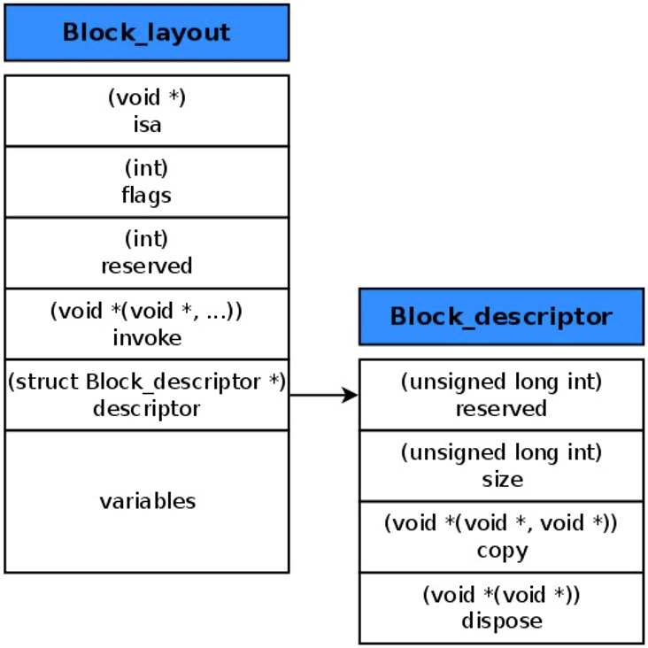

思考：
* block 的原理是怎样的？本质是什么？
* __block 的作用是什么？有什么使用注意点？
* block 的属性修饰词为什么是 copy？使用 block 有哪些使用注意？
* block 在修改 NSMutableArray 时需不需要添加 __block？
<!-- more -->

# 基本认识
## block
```
^{
    NSLog(@"this is a block");
};
```

block 可以封装一块代码，在将来需要执行的地方通过“()”进行调用：
```
int main(int argc, const char * argv[]) {
    @autoreleasepool {
        ^{
            NSLog(@"this is a block");
        }();
    }
    return 0;
}
```

或者
```
int main(int argc, const char * argv[]) {
    @autoreleasepool {
        void (^block)(void) = ^{
            NSLog(@"this is a block");
        };
        block();
    }
    return 0;
}
```

打印结果：
```
this is a block
```

## block 的 C++ 代码
查看 block 的 C++ 代码。找到 main.m 文件，在终端输入：
```
xcrun -sdk iphoneos clang -arch arm64 -rewrite-objc main.m -o main-arm64.cpp
```

block 的 C++ 代码（精简版）：
```
struct __main_block_desc_0 {
  size_t reserved;
  size_t Block_size; //占用内存大小
}

struct __block_impl {
    void *isa; //指向父类的指针（OC对象特征）
    int Flags;
    int Reserved;
    void *FuncPtr; //函数地址，用于函数调用
};

struct __main_block_impl_0 { //block 结构体
  struct __block_impl impl;
  struct __main_block_desc_0* Desc;
  int a; //调用环境
};

int main(int argc, const char * argv[]) {
    @autoreleasepool {
        int a = 20;
        void (^block)(void) = ^{
            NSLog(@"this is a block - %d", a); //断点2
        };
        block(); //断点1
    }
    return 0;
}
```

## __main_block_impl_0
__main_block_impl_0 是 block 在 C++ 中的结构体实现。第一个参数__block_impl 中有一个 isa 指针，具备 OC 对象特征，说明 block 本质上也是一个 OC 对象。  

__main_block_impl_0 省略 __block_impl 和 __main_block_desc_0 后可以看成：
```
struct __main_block_impl_0 {
  void *isa; 
  int Flags;
  int Reserved;
  void *FuncPtr; 
  size_t reserved;
  size_t Block_size;
  int a; 
};
```

即：


## FuncPtr
FuncPtr 是一个指针，指向 block 封装的代码块的函数地址。  

在断点1处打印 FuncPtr 地址：  


```
Printing description of blockStruct->impl.FuncPtr:
(void *) FuncPtr = 0x0000000100000f00
```

在断点2处，选择 Debug -> Debug Workflow -> Always Show Disassembly:


可以看到，block 里的开始地址值 100000f00 等于 FuncPtr 的地址值。说明 block 里的代码块的地址值被保存在了 __block_impl 里的 FuncPtr 中，另外 __main_block_impl_0 里保存了外部变量 int a，说明 block 是封装了函数调用以及函数调用环境的 OC 对象。

# block 的本质

block 本质上是封装了函数调用以及函数调用环境的 OC 对象，它内部也有个 isa 指针。

## 定义 block：
```
int main(int argc, const char * argv[]) {
    @autoreleasepool {
        void (^block)(void) =  ^{
            NSLog(@"this is a block");
        };
        block();
    }
    return 0;
}
```

查看 block 的 C++ 代码：
```
struct __block_impl {
    void *isa; //指向父类
    int Flags;
    int Reserved;
    void *FuncPtr; //指向 __main_block_func_0 函数地址的指针，用于函数调用
};

struct __main_block_impl_0 {
  struct __block_impl impl; //作为第一个变量，__block_impl 的内存地址就是 __main_block_impl_0 内存地址
  struct __main_block_desc_0* Desc; //描述，是一个结构体变量 __main_block_desc_0_DATA
  // 构造函数（类似于OC的init方法），返回结构体对象
  // 参数 fp：block 执行逻辑的函数的地址，即 __main_block_func_0
  // 参数 desc：描述，__main_block_desc_0 的结构体变量，即 __main_block_desc_0_DATA
  // 参数 flags：默认可以不传，flags=0
  __main_block_impl_0(void *fp, struct __main_block_desc_0 *desc, int flags=0) {
    impl.isa = &_NSConcreteStackBlock; //指向父类。_NSConcreteStackBlock：block 的类型
    impl.Flags = flags;
    impl.FuncPtr = fp; //__main_block_func_0
    Desc = desc; //__main_block_desc_0_DATA
  }
};

// 封装了 block 执行逻辑的函数
// 参数：block 结构体
static void __main_block_func_0(struct __main_block_impl_0 *__cself) {

    NSLog((NSString *)&__NSConstantStringImpl__var_folders_rw_lcynwz_524g1qwsw4sclwtrw0000gn_T_main_880b47_mi_0); // NSLog(@"this is a block");
}

// 封装了 block 执行逻辑的函数
static struct __main_block_desc_0 {
  size_t reserved; // 0
  size_t Block_size; // block 占用内存大小
} __main_block_desc_0_DATA = { 0, sizeof(struct __main_block_impl_0)}; //__main_block_desc_0 的结构体变量，参数 reserved：0，参数 Block_size：sizeof(struct __main_block_impl_0)

int main(int argc, const char * argv[]) {
    /* @autoreleasepool */ { __AtAutoreleasePool __autoreleasepool; 
        // 定义 block 变量，指向结构体 __main_block_impl_0 地址的指针
        void (*block)(void) = ((void (*)())&__main_block_impl_0(
                                                                (void *)__main_block_func_0, //block 执行逻辑的函数
                                                                &__main_block_desc_0_DATA //__main_block_desc_0 的结构体变量
                                                                ));
        // 执行 block 内部的代码
        // 因为在结构体 __main_block_impl_0 中，__block_impl 作为第一个变量，所以 __block_impl 的内存地址就是 __main_block_impl_0 内存地址
        // 所以这里可以将 block 强转为 __block_impl 类型
        // FuncPtr：函数 __main_block_func_0 地址
        ((void (*)(__block_impl *))((__block_impl *)block)->FuncPtr)((__block_impl *)block); //简化后：block->FuncPtr(block)
    }
    return 0;
}
static struct IMAGE_INFO { unsigned version; unsigned flag; } _OBJC_IMAGE_INFO = { 0, 2 };
```

__main_block_impl_0、__block_impl 和 __main_block_desc_0 三者之间的关系：


## 有参数的 block
```
int main(int argc, const char * argv[]) {
    @autoreleasepool {
        void (^block)(int, int) =  ^(int a, int b){
            NSLog(@"this is a block - %d, %d", a, b);
        };
        block(10, 20);
    }
    return 0;
}
```

查看 C++ 代码，可以看到 __main_block_func_0 和 main 两个函数发生了变化：
```
// 封装了 block 执行逻辑的函数，增加了参数 a 和 b
static void __main_block_func_0(struct __main_block_impl_0 *__cself, int a, int b) {
    NSLog((NSString *)&__NSConstantStringImpl__var_folders_rw_lcynwz_524g1qwsw4sclwtrw0000gn_T_main_f90d21_mi_0, a, b);
}

int main(int argc, const char * argv[]) {
    /* @autoreleasepool */ { __AtAutoreleasePool __autoreleasepool;
        // 定义 block 变量，增加了参数 10 和 20
        void (*block)(int, int) = ((void (*)(int, int))&__main_block_impl_0((void *)__main_block_func_0, &__main_block_desc_0_DATA));
        ((void (*)(__block_impl *, int, int))((__block_impl *)block)->FuncPtr)((__block_impl *)block, 10, 20); //简化后：block->FuncPtr(block, 10, 20)
    }
    return 0;
}
```

# 变量捕获（capture）

为了保证 block 内部能够正常访问外部的变量，block 有个变量捕获机制。  
变量捕获机制：block 内部会生成对应的成员变量或指针，存储被捕获变量的值或地址。


ps：
局部变量还有一个 register 变量（定义 int age = 10，尽量使用寄存器寄存变量 age）。
```
register int age = 10;
```

## 局部变量
### auto 变量捕获
* auto 变量的作用域在当前“{}”内，离开作用域就销毁。
* auto 变量的捕获方式是值传递。  

平时定义的 int age = 10 默认就是 auto 变量，auto 省略不写：
```
auto int age = 10; // int age = 10;
```

定义 block：
```
int main(int argc, const char * argv[]) {
    @autoreleasepool {
        int age = 10;
        void (^block)(void) =  ^{
            NSLog(@"this is a block - %d", age);
        };
        age = 20;
        block();
    }
    return 0;
}
```

打印结果：
```
this is a block - 10
```

因为 auto 变量的捕获方式是值传递，即 block 捕获的是 age 的值（10），而不是 age 的地址，所以在 block 捕获了 age 的值（10）后，再通过修改指针 age 指向的地址里的值（20），block 捕获到的值（10）不变。所以打印结果是 10。

查看 C++ 代码：
```
struct __main_block_impl_0 {
  struct __block_impl impl;
  struct __main_block_desc_0* Desc;
  int age; //新增变量 age
  //构造函数
  //参数 _age：新增参数
  //age(_age)：将参数 _age 赋值给 age，即 age(_age) 等于 age = _age;
  __main_block_impl_0(void *fp, struct __main_block_desc_0 *desc, int _age, int flags=0) : age(_age) {
    impl.isa = &_NSConcreteStackBlock;
    impl.Flags = flags;
    impl.FuncPtr = fp;
    Desc = desc;
  }
};

// 封装了 block 执行逻辑的函数
static void __main_block_func_0(struct __main_block_impl_0 *__cself) {
  int age = __cself->age; //取出 block 里的 age

  NSLog((NSString *)&__NSConstantStringImpl__var_folders_rw_lcynwz_524g1qwsw4sclwtrw0000gn_T_main_de0112_mi_0, age); //NSLog(@"this is a block - %d", age);
}

static struct __main_block_desc_0 {
  size_t reserved;
  size_t Block_size;
} __main_block_desc_0_DATA = { 0, sizeof(struct __main_block_impl_0)};

int main(int argc, const char * argv[]) {
    /* @autoreleasepool */ { __AtAutoreleasePool __autoreleasepool; 
        int age = 10;
        // 定义 block 变量，__main_block_impl_0 方法里捕获了 age
        void (*block)(void) = ((void (*)())&__main_block_impl_0((void *)__main_block_func_0, &__main_block_desc_0_DATA, age));
        age = 20;
        ((void (*)(__block_impl *))((__block_impl *)block)->FuncPtr)((__block_impl *)block); //简化后：block->FuncPtr(block)
    }
    return 0;
}
static struct IMAGE_INFO { unsigned version; unsigned flag; } _OBJC_IMAGE_INFO = { 0, 2 };
```


__main_block_impl_0 内部新增了成员变量 age，就是用来捕获外部 auto 变量 age 用的。

### static 变量捕获
* static 变量会一直保存在内存里。
* static 变量的捕获方式是指针传递。

ps：static 声明的局部变量只初始化一次，其内存分配在静态存储区，在程序中只有一份内存，并且在整个程序执行期间都终存在不会释放。虽然内存不会释放，但是作用域并没有改变。

定义 block：
```
int main(int argc, const char * argv[]) {
    @autoreleasepool {
        int age = 10;
        static int height = 10;
        void (^block)(void) =  ^{
            NSLog(@"this is a block - age = %d，height = %d", age, height);
        };
        age = 20;
        height = 20;
        block();
    }
    return 0;
}
```

查看 C++ 代码：
```
struct __main_block_impl_0 {
  struct __block_impl impl;
  struct __main_block_desc_0* Desc;
  int age; //新增变量 age，用于捕获外部 auto 变量 age 的值
  int *height; //新增指针 height，用于捕获外部的 static 变量 height 的地址值
  //构造函数
  //参数 *_height：static 变量的地址值
  __main_block_impl_0(void *fp, struct __main_block_desc_0 *desc, int _age, int *_height, int flags=0) : age(_age), height(_height) {
    impl.isa = &_NSConcreteStackBlock;
    impl.Flags = flags;
    impl.FuncPtr = fp;
    Desc = desc;
  }
};

static void __main_block_func_0(struct __main_block_impl_0 *__cself) {
  int age = __cself->age; //获取 block 的 age
  int *height = __cself->height; // 获取 block 的 height

  NSLog((NSString *)&__NSConstantStringImpl__var_folders_rw_lcynwz_524g1qwsw4sclwtrw0000gn_T_main_ac9850_mi_0, age, (*height)); //NSLog(@"this is a block - age = %d，height = %d", age, height);
}

static struct __main_block_desc_0 {
  size_t reserved;
  size_t Block_size;
} __main_block_desc_0_DATA = { 0, sizeof(struct __main_block_impl_0)};

int main(int argc, const char * argv[]) {
    /* @autoreleasepool */ { __AtAutoreleasePool __autoreleasepool; 
        int age = 10;
        static int height = 10;
        // 定义 block __main_block_impl_0 方法里捕获了 age 和 &height（height 的地址）
        void (*block)(void) = ((void (*)())&__main_block_impl_0((void *)__main_block_func_0, &__main_block_desc_0_DATA, age, &height));
        age = 20;
        height = 20;
        ((void (*)(__block_impl *))((__block_impl *)block)->FuncPtr)((__block_impl *)block);
    }
    return 0;
}
static struct IMAGE_INFO { unsigned version; unsigned flag; } _OBJC_IMAGE_INFO = { 0, 2 };
```

因为 static 变量的捕获方式是指针传递，即 block 捕获的是 height 的地址值，所以在 block 捕获了 height 地址值后，再通过指针 height 修改地址里的值（20），block 捕获到的指针 height 指向的地址值就是 20 了。所以打印结果是 20。

### 指针传递 & 值传递
```
void (^block)(void);

void test()
{
    int age = 10;
    static int height = 10;
    block =  ^{
        NSLog(@"this is a block - age = %d，height = %d", age, height);
    };
    age = 20;
    height = 20;
}

int main(int argc, const char * argv[]) {
    @autoreleasepool {
        test();
        block();
    }
    return 0;
}
```

因为 age 是 auto 变量，所以在 test() 执行后，age 就被被销毁了。因为 block 在执行时会打印 age，而 age 已经被销毁不能被访问，所以 block 在捕获 age 时只能捕获 age 的值不能捕获 age 的地址值。因此 block 在捕获 auto 变量时采用的是值传递。

因为 height 是 static 变量，会一直保存在内存里，所以 block 在执行时依然能成功访问 height 的地址。因此 block 在捕获 static 变量时采用的是指针传递。