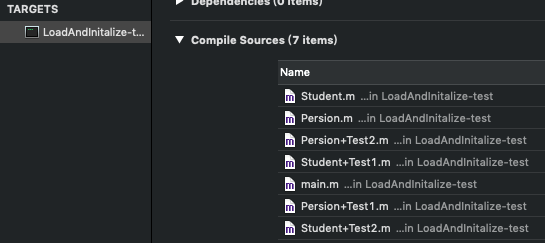

* +initialize 方法会在类第一次接收到消息时调用
* 思考：load、initialize方法的区别什么？它们在category中的调用的顺序？以及出现继承时他们之间的调用过程？


<!-- more -->

# 定义 Persion、Student 及其分类
```
@interface Person : NSObject
@end

@implementation Person
+ (void)initialize
{
    NSLog(@"Person +initialize");
}
@end

@interface Person (Test1)
@end

@implementation Person (Test1)
+ (void)initialize
{
    NSLog(@"Person (Test1) +initialize");
}
@end

@interface Person (Test2)
@end

@implementation Person (Test2)
+ (void)initialize
{
    NSLog(@"Person (Test2) +initialize");
}
@end

@interface Student : Persion
@end

@implementation Student
+ (void)initialize
{
    NSLog(@"Student +initialize");
}
@end

@interface Student (Test1)
@end

@implementation Student (Test1)
+ (void)initialize
{
    NSLog(@"Student (Test1) +initialize");
}
@end

@interface Student (Test2)
@end

@implementation Student (Test2)
+ (void)initialize
{
    NSLog(@"Student (Test2) +initialize");
}
@end

int main(int argc, const char * argv[]) {
    @autoreleasepool {
        NSLog(@"main");
        [Persion alloc];
        [Student alloc];
    }
    return 0;
}
```

编译顺序：  


打印结果：
```
Persion (Test1) +initialize
Student (Test2) +initialize
```

# objc4源码解读过程
* objc-msg-arm64.s  
objc_msgSend  

* objc-runtime-new.mm  
class_getInstanceMethod  
lookUpImpOrNil  
lookUpImpOrForward  
_class_initialize  
callInitialize  
objc_msgSend(cls, SEL_initialize)

[Persion alloc] 的本质是：
```
objc_msgSend(objc_getClass("Persion"), sel_registerName("alloc"))
```

[Student alloc] 的本质是：  
```
 objc_msgSend(objc_getClass("Student"), sel_registerName("alloc"))
```

# objc_msgSend()
打开 runtime 源码 [objc4-781](https://opensource.apple.com/tarballs/objc4/)，搜索 objc_msgSend()，会发现 objc_msgSend() 方法的源码是汇编语言。
 
objc_msgSend() - 类方法调用流程：  
isa -> 类对象/元类对象，寻找方法，调用  
superclass -> 类对象/元类对象，寻找方法，调用  
superclass -> 类对象/元类对象，寻找方法，调用

从“寻找方法”入手👇

# class_getClassMethod

class_getClassMethod 是获取类方法的函数，内部调用的是 class_getInstanceMethod 获取对象方法的函数。
```
Method class_getClassMethod(Class cls, SEL sel)
{
    if (!cls  ||  !sel) return nil;

    return class_getInstanceMethod(cls->getMeta(), sel);
}
```

## class_getInstanceMethod
Jump To Definition -> class_getInstanceMethod
```
Method class_getInstanceMethod(Class cls, SEL sel)
{
    if (!cls  ||  !sel) return nil;

    // This deliberately avoids +initialize because it historically did so.

    // This implementation is a bit weird because it's the only place that 
    // wants a Method instead of an IMP.

#warning fixme build and search caches
        
    // Search method lists, try method resolver, etc.
    lookUpImpOrForward(nil, sel, cls, LOOKUP_RESOLVER);

#warning fixme build and search caches

    return _class_getMethod(cls, sel);
}
```

## lookUpImpOrForward

在 class_getInstanceMethod 方法中，调用 lookUpImpOrForward(nil, sel, cls, LOOKUP_RESOLVER) 方法。所以 behavior == LOOKUP_RESOLVER

Jump To Definition -> lookUpImpOrForward
```
IMP lookUpImpOrForward(id inst, SEL sel, Class cls, int behavior)
{
    ...
    ...
    ...//一堆方法

    // Check for +initialize
    if ((behavior & LOOKUP_INITIALIZE)  &&  !cls->isInitialized()) { //如果类还没有实现 +initialized 方法
        initializeNonMetaClass (_class_getNonMetaClass(cls, inst));
        // If sel == initialize, initializeNonMetaClass will send +initialize 
        // and then the messenger will send +initialize again after this 
        // procedure finishes. Of course, if this is not being called 
        // from the messenger then it won't happen. 2778172
    }

    ...
    ...
    ...//一堆方法
}
```

## initializeNonMetaClass

initializeNonMetaClass 方法使用递归的方式优先将传入的类 cls 的父类调用 initializeNonMetaClass 方法进行处理。

Jump To Definition -> initializeNonMetaClass
```
void initializeNonMetaClass(Class cls)
{
    ASSERT(!cls->isMetaClass());

    Class supercls;
    bool reallyInitialize = NO;

    // Make sure super is done initializing BEFORE beginning to initialize cls.
    // See note about deadlock above.
    supercls = cls->superclass;
    if (supercls  &&  !supercls->isInitialized()) { // 存在父类 && 父类没有调用个 +initialize 方法
        initializeNonMetaClass(supercls);
    }
    
    // Try to atomically set CLS_INITIALIZING.
    SmallVector<_objc_willInitializeClassCallback, 1> localWillInitializeFuncs;
    {
        monitor_locker_t lock(classInitLock);
        if (!cls->isInitialized() && !cls->isInitializing()) {
            cls->setInitializing(); //设置 RW_INITIALIZING 状态
            reallyInitialize = YES;

            // Grab a copy of the will-initialize funcs with the lock held.
            localWillInitializeFuncs.initFrom(willInitializeFuncs);
        }
    }
    
    if (reallyInitialize) {
        // We successfully set the CLS_INITIALIZING bit. Initialize the class.
        
        // Record that we're initializing this class so we can message it.
        _setThisThreadIsInitializingClass(cls);

        if (MultithreadedForkChild) {
            // LOL JK we don't really call +initialize methods after fork().
            performForkChildInitialize(cls, supercls); // 设置 RW_INITIALIZED 状态
            return;
        }
        
        for (auto callback : localWillInitializeFuncs)
            callback.f(callback.context, cls);

        // Send the +initialize message.
        // Note that +initialize is sent to the superclass (again) if 
        // this class doesn't implement +initialize. 2157218
        if (PrintInitializing) {
            _objc_inform("INITIALIZE: thread %p: calling +[%s initialize]",
                         objc_thread_self(), cls->nameForLogging());
        }

        // Exceptions: A +initialize call that throws an exception 
        // is deemed to be a complete and successful +initialize.
        //
        // Only __OBJC2__ adds these handlers. !__OBJC2__ has a
        // bootstrapping problem of this versus CF's call to
        // objc_exception_set_functions().
#if __OBJC2__
        @try
#endif
        {
            callInitialize(cls);

            if (PrintInitializing) {
                _objc_inform("INITIALIZE: thread %p: finished +[%s initialize]",
                             objc_thread_self(), cls->nameForLogging());
            }
        }
        ...
        ...
        ...
}
```

设置正在调用 +initialize 方法的状态 RW_INITIALIZING：
```
cls->setInitializing()
```

设置已经调用 +initialize 方法的状态 RW_INITIALIZED：
```
performForkChildInitialize(cls, supercls) -> lockAndFinishInitializing(cls, supercls) -> _finishInitializing(cls, supercls) -> cls->setInitialized()
```

isInitializing()、setInitializing()、isInitialized()、setInitialized() 方法：
```
struct objc_class : objc_object {
    // Class ISA;
    Class superclass;
    cache_t cache;             // formerly cache pointer and vtable
    class_data_bits_t bits;    // class_rw_t * plus custom rr/alloc flags

    class_rw_t *data() const {
        return bits.data();
    }
    void setData(class_rw_t *newData) {
        bits.setData(newData);
    }

    void setInfo(uint32_t set) {
        ASSERT(isFuture()  ||  isRealized());
        data()->setFlags(set);
    }

    ...
    ...
    ...//一堆方法

    bool isInitializing() {
        return getMeta()->data()->flags & RW_INITIALIZING;
    }

    void setInitializing() {
        ASSERT(!isMetaClass());
        ISA()->setInfo(RW_INITIALIZING);
    }

    bool isInitialized() {
        return getMeta()->data()->flags & RW_INITIALIZED;
    }

    void setInitialized();

    ...
    ...
    ...//一堆方法
```

## callInitialize

向传入的类 cls 发送“initialize”消息。至此实现了 +initialize 方法的调用。

Jump To Definition -> callInitialize
```
void callInitialize(Class cls)
{
    ((void(*)(Class, SEL))objc_msgSend)(cls, @selector(initialize));
    asm("");
}
```

# 调用顺序
```
@interface Persion : NSObject
@end

@implementation Persion
+ (void)initialize
{
    NSLog(@"Persion +initialize");
}
@end

@interface Persion (Test1)
@end

@implementation Persion (Test1)
+ (void)initialize
{
    NSLog(@"Persion (Test1) +initialize");
}
@end

@interface Persion (Test2)
@end

@implementation Persion (Test2)
+ (void)initialize
{
    NSLog(@"Persion (Test2) +initialize");
}
@end

@interface Student : Persion
@end

@implementation Student
@end

@interface Teacher : Persion
@end

@implementation Teacher
@end
```

编译顺序：  


打印结果：
```
Persion (Test1) +initialize
Persion (Test1) +initialize
Persion (Test1) +initialize
```

## 优先调用父类的 +initialize 方法  
从 initializeNonMetaClass 方法中有个一递归设计，跟 +load 方法调用中的 schedule_class_load 方法如出一辙。会先判断父类的 +initialize 方法是否已经调用，如果没有会优先先调用父类的 +initialize 方法。在将所有的父类都处理完后，再调用传入的类 cls 的 +initialize 方法。  

## 每个类只会调用一次 +initialize 方法 
因为有 !cls->isInitialized() 判断，所以每个类只会初始化1次，也就是每个类只会调用一次 +initialize 方法。  

## 父类的 +initialize 可能会被调用多次
如果子类没有实现 +initialize 会调用父类的 +initialize（所以父类的 +initialize 可能会被调用多次）。这一点通过 callInitialize 方法可以看出，向传入的类 cls 发送一条 @selector(initialize) 消息。类 cls 会通过 isa 找到 cls 元类对象查找 +initialize 方法，如果没有再通过 superclass 指针找到父类的元类方法查找 +initialize 方法，找到后并调用。

# 小结
* 调用顺序  
先调用父类的 +initialize，再调用子类的 +initialize  
先初始化父类，再初始化子类，每个类只会初始化1次  
父类的 +initialize 可能会被调用多次

* load、initialize 方法的区别什么？它们在 category 中的调用的顺序？以及出现继承时他们之间的调用过程？  
  load、initialize 方法的区别：+initialize 和 +load 的最大区别是， +initialize 方法是在运行时通过 objc_msgSend 进行调用的。所以子类没有实现 +initialize 方法时，会调用父类的 +initialize 方法，所以父类的 +initialize 可能会被调用多次。+load 方法是通过 APP 启动时加载类/分类时通过指针调用的 (*load_method)(cls, @selector(load))，如果子类没有实现 +load 方法就不调用了，不会找到父类。  
  在 category 中的调用的顺序：如果分类实现了 +initialize 方法，会覆盖类本身的 +initialize 方法，分类之间的 +initialize 方法根据编译顺序优先调用最后被编译的分类里的 +initialize 方法。如果分类实现了 +load 方法，则先调用类里的 +load 方法（先父类再子类），再调用分类里的 +load 方法（按照编译顺序）。

