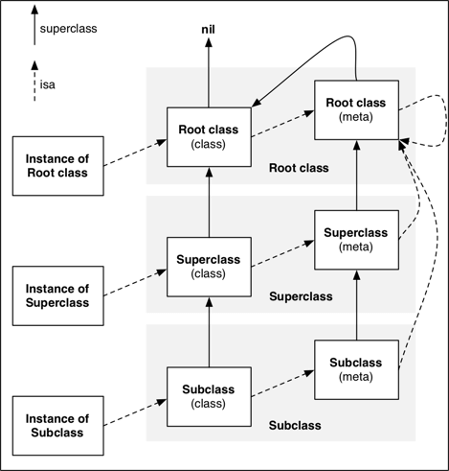
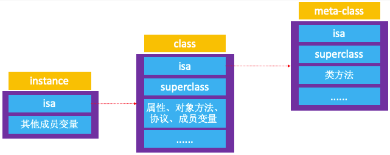
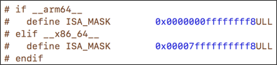
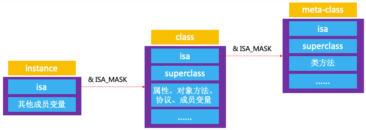
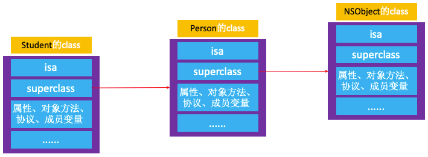
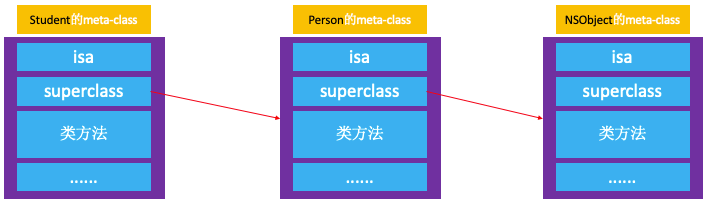
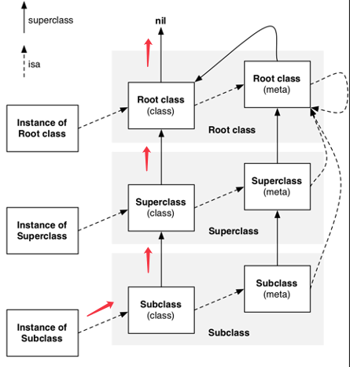
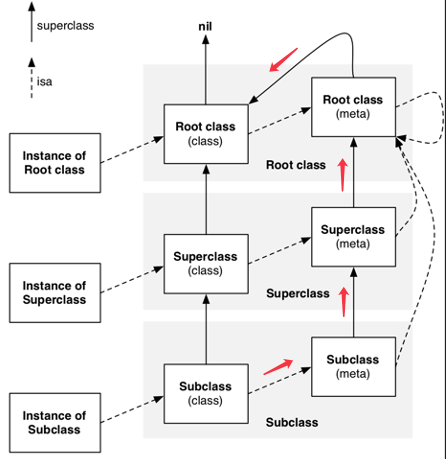
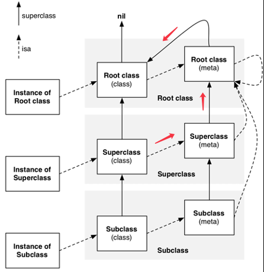
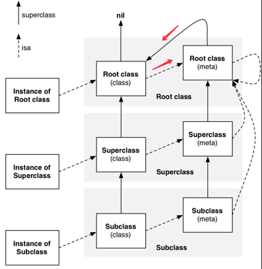

<!-- more -->

* instance 的 isa 指向 class
* class 的 isa 指向 meta-class
* meta-class 的 isa 指向基类的 meta-class
* class 的 superclass 指向父类的 class，如果没有父类，superclass 指针为nil
* meta-class 的 superclass 指向父类的 meta-class，基类的 meta-class 的 superclass 指向基类的 class
* instance 调用对象方法的轨迹：isa 找到 class，方法不存在，就通过 superclass 找父类
* class 调用类方法的轨迹：isa 找 meta-class，方法不存在，就通过 superclass 找父类

# isa

## instance 对象、class 对象 和 meta-class 对象之间的 isa 关系


### 定义 Person
```
@interface Person : NSObject <NSCopying>
{
    @public
    int _age;
}
@property (nonatomic, assign) int no;
- (void)personInstanceMethod;
+ (void)personClassMethod;
@end

@implementation Person
@end
```

创建 Person 的实例对象
```
int main(int argc, const char * argv[]) {
    @autoreleasepool {
        
        Person *person = [[Person alloc] init];
        
        person->_age = 10;

        [person personInstanceMethod];
        
        [Person personClassMethod];
        
    }
    return 0;
}
```

### 将 OC 代码转换为 C\C++ 代码
找到 main.m 所在文件，在终端输入：
```
$ xcrun -sdk iphoneos clang -arch arm64  -rewrite-objc main.m
```

没有通过 ‘-o’ 生成指定文件时，默认生成 main.cpp 文件，打开 main.cpp 文件。找到 main 函数：
```
int main(int argc, const char * argv[]) {
    /* @autoreleasepool */ { __AtAutoreleasePool __autoreleasepool; 

        Person *person = ((Person *(*)(id, SEL))(void *)objc_msgSend)((id)((Person *(*)(id, SEL))(void *)objc_msgSend)((id)objc_getClass("Person"), sel_registerName("alloc")), sel_registerName("init"));

        (*(int *)((char *)person + OBJC_IVAR_$_Person$_age)) = 10;

        ((void (*)(id, SEL))(void *)objc_msgSend)((id)person, sel_registerName("personInstanceMethod"));

        ((void (*)(id, SEL))(void *)objc_msgSend)((id)objc_getClass("Person"), sel_registerName("personClassMethod"));

    }
    return 0;
}
```

找到 objc_msgSend：
```
((void (*)(id, SEL))(void *)objc_msgSend)((id)person, sel_registerName("personInstanceMethod"));

((void (*)(id, SEL))(void *)objc_msgSend)((id)objc_getClass("Person"), sel_registerName("personClassMethod"));

//简化后：
objc_msgSend(person, sel_registerName("personInstanceMethod"));

objc_msgSend(objc_getClass("Person"), sel_registerName("personClassMethod"));
```

[person personInstanceMethod] 的具体实现是 objc_msgSend(person, sel_registerName("personInstanceMethod"))。  
即在实例对象 person 调用 -(void)personInstanceMethod 对象方法的时候，向实例对象 person 发送一条 "personInstanceMethod" 消息。  

[Person personClassMethod] 的具体实现是 objc_msgSend(objc_getClass("Person"), sel_registerName("personClassMethod"))。  
即在类对象 Person 调用 +(void)personClassMethod 类方法的时候，向类对象 Person 发送一条 "personClassMethod" 消息。  

### 方法调用与对象的关系
```
[person personInstanceMethod];
[Person personClassMethod];
```

上面👆两个方法调用表现出来的是，实例对象 person 可以调用存在 Person 类对象里的对象方法， Person 类对象可以调用存储在 Person 元类对象里的类方法。

### 小结
* instance 对象的 isa 指针指向 class 对象。当调用对象方法时，通过 instance 对象的 isa 指针找到 class 对象，最后找到对象方法的实现进行调用。

* class 对象的 isa 指针指向 meta-class 对象。当调用类方法时，通过 class 对象的 isa 指针找到 meta-class对象，最后找到类方法的实现进行调用。

## ISA_MASK

<!--  -->

```
int main(int argc, const char * argv[]) {
    @autoreleasepool {
        
        Person *person = [[Person alloc] init];
        
        Class personClass = [Person class];

        Class personMetaClass = object_getClass(personClass);

        NSLog(@"%p %p %p", person, personClass, personMetaClass);
    }
    return 0;
}
```
### 实例对象的 isa 指针
打印 Person->isa、personClass：
```
(lldb) p/x (long)person->isa //指针地址格式设置16进制
(long) $2 = 0x001d8001000014f1
(lldb) p/x personClass
(Class) $3 = 0x00000001000014f0 Person
```

上面👆的打印结果可以看到，Person 的类对象地址是 0x00000001000014f0，而 Person 的实例对象的 isa 指针的地址是 0x001d8001000014f1。

在 64bit 之前 isa 指针的地址等于被指向对象的地址。从 64bit 开始，isa 需要进行一次位运算，才能计算出真实地址：


ISA_MASK 在源码 [objc4-781](https://opensource.apple.com/tarballs/objc4/) 中的定义：
```
# if __arm64__
#   define ISA_MASK        0x0000000ffffffff8ULL
#   define ISA_MAGIC_MASK  0x000003f000000001ULL
#   define ISA_MAGIC_VALUE 0x000001a000000001ULL
#   define ISA_BITFIELD                                                      \
      uintptr_t nonpointer        : 1;                                       \
      uintptr_t has_assoc         : 1;                                       \
      uintptr_t has_cxx_dtor      : 1;                                       \
      uintptr_t shiftcls          : 33; /*MACH_VM_MAX_ADDRESS 0x1000000000*/ \
      uintptr_t magic             : 6;                                       \
      uintptr_t weakly_referenced : 1;                                       \
      uintptr_t deallocating      : 1;                                       \
      uintptr_t has_sidetable_rc  : 1;                                       \
      uintptr_t extra_rc          : 19
#   define RC_ONE   (1ULL<<45)
#   define RC_HALF  (1ULL<<18)

# elif __x86_64__
#   define ISA_MASK        0x00007ffffffffff8ULL
#   define ISA_MAGIC_MASK  0x001f800000000001ULL
#   define ISA_MAGIC_VALUE 0x001d800000000001ULL
#   define ISA_BITFIELD                                                        \
      uintptr_t nonpointer        : 1;                                         \
      uintptr_t has_assoc         : 1;                                         \
      uintptr_t has_cxx_dtor      : 1;                                         \
      uintptr_t shiftcls          : 44; /*MACH_VM_MAX_ADDRESS 0x7fffffe00000*/ \
      uintptr_t magic             : 6;                                         \
      uintptr_t weakly_referenced : 1;                                         \
      uintptr_t deallocating      : 1;                                         \
      uintptr_t has_sidetable_rc  : 1;                                         \
      uintptr_t extra_rc          : 8
#   define RC_ONE   (1ULL<<56)
#   define RC_HALF  (1ULL<<7)
```

iPhoneOS 是 __arm64__ 架构，ISA_MASK：0x0000000ffffffff8。  
MacOS 是 __x86_64__ 架构，ISA_MASK：0x00007ffffffffff8ULL。  

打印 person->isa & ISA_MASK
```
(lldb) p/x 0x001d8001000014f1 & 0x00007ffffffffff8
(long) $4 = 0x00000001000014f0
```

上面👆的打印结果可以看出，Person 实例对象的 isa 指针 & ISA_MASK 就是 Person 类对象的地址。


### 类对象的 isa 指针
类对象的类型 Class 是一个指向结构体 objc_class 的指针：
```
typedef struct objc_class *Class;
```

Jump TO Definition -> objc_class：
```
struct objc_class {
    Class _Nonnull isa  OBJC_ISA_AVAILABILITY;

#if !__OBJC2__
    Class _Nullable super_class                              OBJC2_UNAVAILABLE;
    const char * _Nonnull name                               OBJC2_UNAVAILABLE;
    long version                                             OBJC2_UNAVAILABLE;
    long info                                                OBJC2_UNAVAILABLE;
    long instance_size                                       OBJC2_UNAVAILABLE;
    struct objc_ivar_list * _Nullable ivars                  OBJC2_UNAVAILABLE;
    struct objc_method_list * _Nullable * _Nullable methodLists                    OBJC2_UNAVAILABLE;
    struct objc_cache * _Nonnull cache                       OBJC2_UNAVAILABLE;
    struct objc_protocol_list * _Nullable protocols          OBJC2_UNAVAILABLE;
#endif

} OBJC2_UNAVAILABLE;
```

👆objc_class 的 isa 是不支持外部访问的，所以 personClass->isa 获取不到 isa 指针地址，所以要自定义一个结构体：
```
struct test_objc_class {
    Class isa;
    Class superclass;
};
```

将 personClass 的类型强转为 test_objc_class 类型：
```
Class personClass = [Person class];

struct test_objc_class *personClass2 = (__bridge struct test_objc_class *)(personClass);
```

因为 personClass 是 OC 对象，所以需要桥接 (__bridge struct test_objc_class *)。  

打印 personClass2->isa、personMetaClass 和 personClass2->isa & ISA_MASK：
```
(lldb) p/x personClass2->isa
(Class) $5 = 0x001d8001000014c9
(lldb) p/x personMetaClass
(Class) $6 = 0x00000001000014c8
(lldb) p/x 0x001d8001000014c9 & 0x00007ffffffffff8
(long) $7 = 0x00000001000014c8
```

上面👆的打印结果可以看出，Person 类对象的 isa 指针 & ISA_MASK 就是 Person 元类对象的地址。


# superclass

## 定义 Studen 继承自 Person
```
@interface Student : Person <NSCoding>
{
    @public
    int _weight;
}
@property (nonatomic, assign) int height;
- (void)studentInstanceMethod;
+ (void)studentClassMethod;
@end

@implementation Student
- (void)studentInstanceMethod
{
    
}
+ (void)studentClassMethod
{
    
}
- (id)initWithCoder:(NSCoder *)aDecoder
{
    return nil;
}
- (void)encodeWithCoder:(NSCoder *)aCoder
{
    
}
@end
```

创建 Student 的实例对象
```
int main(int argc, const char * argv[]) {
    @autoreleasepool {
        
         Student *student = [[Student alloc] init];
         
         [student personInstanceMethod];
         
         [student init];
         
         [Student studentClassMethod];
         
         [Student personClassMethod];
         
         [Student load];
    }
    return 0;
}
```

## class 对象的 superclass 指针

### Student 类对象、Person 类对象 和 NSObject 类对象之间的 superclass 关系


获取 test_objc_class 类型的 Person 类对象和 Student 类对象：
```
struct mj_objc_class *personClass = (__bridge struct test_objc_class *)([Person class]);

struct mj_objc_class *studentClass = (__bridge struct test_objc_class *)([Student class]);
```

打印 personClass、studentClass 和 studentClass->superclass：
```
(lldb) p personClass
(test_objc_class *) $0 = 0x00000001000014b8
(lldb) p studentClass
(test_objc_class *) $1 = 0x0000000100001508
(lldb) p/x studentClass->superclass
(Class) $2 = 0x00000001000014b8 Person
```

上面👆的打印结果可以看出，Student 类对象的 superclass 指针地址就是 Person 类对象的地址。

### Student 的实例对象调用父类 Person 里的对象方法：
```
[student personInstanceMethod];
```

对象方法 -(void)personInstanceMethod 方法保存在 Person 的类对象里，[student personInstanceMethod] 首先通过 student 的 isa 指针找到 Student 的类对象，再通过 Student 类对象里的 superclass 找到 Person 的类对象，最后在 Person 类对象里找到了对象方法 -(void)personInstanceMethod。

### Student 的实例对象调用父类 NSObject 里的对象方法：
```
[student init];
```

对象方法 -(void)init 方法保存在 NSObject 的类对象里，[student init] 首先通过 student 的 isa 指针找到 Student 的类对象，再通过 Student 类对象里的 superclass 找到 Person 的类对象，再通过 Person 类对象里的 superclass 找到 NSObject 的类对象，最后在 NSObject 类对象里找到了对象方法 -(void)init。

### 小结
* 具有继承关系的不同的类之间，是通过 superlass 指针连接的。有了 superlass 指针的连接，子类就实现了调用父类方法的逻辑。

* 当 Student 的 instance 对象要调用 Person 的对象方法时，会先通过 isa 找到 Student 的 class，然后通过 superclass 找到 Person 的 class，最后找到对象方法的实现进行调用。


## meta-class 对象的 superclass 指针

### Student 元类对象、Person 元类对象 和 NSObject 元类对象之间的 superclass 关系：


### Student 类对象调用 Student 元类对象里的类方法：
```
[Student studentClassMethod];
```

首先通过 Student 类对象里的 isa 指针找到 Student 元类对象，最终在 Student 元类对象里找到类方法 +(void)studentClassMethod。

### Student 类对象调用父类 Person 元类对象里的类方法：
```
[Student personClassMethod];
```

首先通过 Student 类对象里的 isa 指针找到 Student 元类对象，再通过 Student 元类对象里的 superclass 找到 Person 元类对象，最终在 Person 元类对象里找到类方法 +(void)personClassMethod。

### Student 类对象调用父类 NSObject 元类对象里的类方法：
```
[Student load];
```

首先通过 Student 类对象里的 isa 指针找到 Student 元类对象，再通过 Student 元类对象里的 superclass 找到 Person 元类对象，再通过 Person 元类对象里的 superclass 找到 NSObject 元类对象，最终在 NSObject 元类对象里找到类方法 +(void)load。


# instance 对象调用对象方法流程

## 流程图


## unrecoginzed selector sent to instance

```
[student unrecoginzedSelector];
```

向实例对象 student 发送一条 "unrecoginzedSelector" 消息。student 通过 isa 指针找到 Student 类对象，在类对象里查找对象方法 -(void)unrecoginzedSelector 。如果没有，Student 类对象会通过 superclass 指针找到 Student 父类的类对象，并在父类的类对象里查找对象方法 -(void)unrecoginzedSelector。如果还是没有找到，再通过 superclass 查找父类的类对象。以此往复，直找到基类 NSObject 的类对象。如果在 NSObject 的类对象里也没有查找到对象方法 -(void)unrecoginzedSelector，就会返回出现‘unrecoginzed selector sent to instance’错误。

## 子类重写父类的对象方法

```
@interface Person : NSObject <NSCopying>
- (void)test;
@end

@implementation Person
- (void)test 
{

}
@end

@interface Student : Person <NSCoding>
@end

@implementation Student
- (void)test
{
    
}
@end

int main(int argc, const char * argv[]) {
    @autoreleasepool {
        
         Student *student = [[Student alloc] init];
         
         [student test];
    }
    return 0;
}
```

向实例对象 student 发送一条 "test" 消息。studnet 通过 isa 指针找到 Student 类对象，在类对象里查找对象方法 -(void)test，找到后返回，不在查找父类的类对象。

# class 对象调用类方法流程

## 流程图


## unrecoginzed selector sent to class
```
[Student unrecoginzedSelector];
```

向类对象 Student 发送一条 "unrecoginzedSelector" 消息。Student 通过 isa 指针找到 Student 元类对象，在元类对象里查找类方法 -(void)unrecoginzedSelector 。如果没有，Student 元类对象会通过 superclass 指针找到 Student 父类的元类对象，并在父类的元类对象里查找类方法 -(void)unrecoginzedSelector。如果还是没有找到，再通过 superclass 查找父类的元类对象。以此往复，直找到基类 NSObject 的元类对象。如果在 NSObject 的元类对象里也没有查找到类方法 -(void)unrecoginzedSelector，就会通过 superclass 指针找到 NSObject 的类对象，如果在 NSObject 的类对象里也没找到类方法 -(void)unrecoginzedSelector，就会返回出现‘unrecoginzed selector sent to class’错误。

## 子类重写父类的类方法

```
@interface Person : NSObject <NSCopying>
+ (void)test;
@end

@implementation Person
+ (void)test 
{

}
@end

@interface Student : Person <NSCoding>
@end

@implementation Student
+ (void)test
{
    
}
@end

int main(int argc, const char * argv[]) {
    @autoreleasepool {
         
         [Student test];
    }
    return 0;
}
```

向类对象 Student 发送一条 "test" Student 通过 isa 指针找到 Student 元类对象，在元类对象里查找类方法 +(void)test，找到后返回，不在查找父类的元类对象。

# class 对象调用对象方法流程

## 定义 NSObject+test
```
@interface NSObject (Test)
+ (void)test;
@end

@implementation NSObject (Test)
- (void)test
{
    NSLog(@"-[NSObject test] - %p", self);
}
@end

@interface Person : NSObject <NSCopying>
@end

@implementation Person
@end

int main(int argc, const char * argv[]) {
    @autoreleasepool {
        NSLog(@"[Person class] - %p", [Person class]);
        NSLog(@"[NSObject class] - %p", [NSObject class]);
        
        [Person test];
        [NSObject test];
    }
    return 0;
}
```

打印结果：
```
[Person class] - 0x1000011e0
[NSObject class] - 0x7fffaa791140
[NSObject test] - 0x1000011e0
[NSObject test] - 0x7fffaa791140
```

## [Person test]

### 流程图


```
//打印结果：[NSObject test] - 0x1000011e0
[Person test];
```

向类对象 Person 发送一条 "test" 消息。Person 通过 isa 指针找到 Person 元类对象，在元类对象里查找类方法 +(void)test 。如果没有，Person 元类对象会通过 superclass 指针找到 NSObject 的元类对象，并在 NSObject 的元类对象里查找类方法 +(void)test。如果还是没有找到，再通过 superclass 指针找到 NSObject 的类对象，在类对象中找到对象方法 -(void)test 并返回。  

NSObject+test 里打印的 self，是 objc_msgSend() 里的对象，即接收‘test’消息的对象。[Person test] 中，因为是想 Person 发送了一条‘test’消息，所以打印的 self 是 Person 的类对象。

### + (void)test 与 - (void)test 同时存在

```
@interface NSObject (Test)
+ (void)test;
@end

@implementation NSObject (Test)
+ (void)test
{
    NSLog(@"+[NSObject test] - %p", self);
}
- (void)test
{
    NSLog(@"-[NSObject test] - %p", self);
}
@end
```

此时 [Person test] 调用的就是类方法 + (void)test 了。因为 + (void)test 存储在 NSObject 元类对象里，而 - (void)test 存储在 NSObject 类对象里。查找类方法 + (void)test 时，会优先找到 NSObject 源对象，在元类对象里找到类方法 + (void)test 后返回，不再到类对象里找了。

## [NSObject test]

### 流程图


```
//打印结果：[NSObject test] - 0x7fffaa791140
[NSObject test];
```

向类对象 NSObject 发送一条 "test" 消息。NSObject 通过 isa 指针找到 NSObject 元类对象，在元类对象里查找类方法 +(void)test 。如果没有，NSObject 元类对象再通过 superclass 指针找到 NSObject 的类对象，在类对象中找到对象方法 -(void)test 并返回。  

## class 对象调用对象方法的可能性

```
[Person test];
```

上面👆这句代码的本质是：
```
objc_msgSend(objc_getClass("Person"), sel_registerName("test"));
```

向类对象 Person 发送一条 "test" 消息，这条消息里并没有包含方法的类型，即不区分类方法和对象方法。
