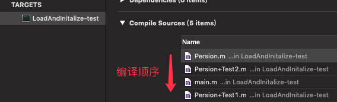
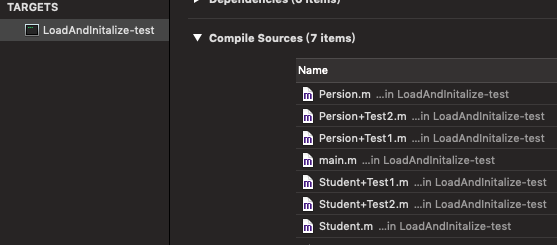

# +load 方法
* +load 方法会在 runtime 加载类、分类时调用；
* 每个类、分类的 +load 方法，在程序运行过程中只调用一次；

<!-- more -->

## 定义 Persion、Persion+Test1 和 Persion+Test2
```
@interface MJPerson : NSObject
+ (void)test;
@end

@implementation MJPerson
+ (void)load
{
    NSLog(@"MJPerson +load");
}
+ (void)test
{
    NSLog(@"MJPerson +test");
}
@end

@interface MJPerson (Test1)
@end

@implementation MJPerson (Test1)
+ (void)load
{
    NSLog(@"MJPerson (Test1) +load");
}
+ (void)test
{
    NSLog(@"MJPerson (Test1) +test");
}
@end

@interface MJPerson (Test2)
@end

@implementation MJPerson (Test2)
+ (void)load
{
    NSLog(@"MJPerson (Test2) +load");
}
+ (void)test
{
    NSLog(@"MJPerson (Test2) +test");
}
@end

int main(int argc, const char * argv[]) {
    @autoreleasepool {
        NSLog(@"main");
        [Persion test];
    }
    return 0;
}
```

编译顺序：


打印结果：
```
Persion +load
Persion (Test2) +load
Persion (Test1) +load
main
Persion (Test1) +test
```

从打印结果👆可以看出：  
* 类和分类里的 +load 方法都会被调用
* +load 方法的调用顺序和编译顺序是一致的
* Persion (Test1) 最后被编译，所以优先调用 Persion (Test1) 里的 +test 方法  

## objc4 源码解读过程
* objc-os.mm  
_objc_init  
load_images

* prepare_load_methods  
schedule_class_load  
add_class_to_loadable_list  
add_category_to_loadable_list

* call_load_methods  
call_class_loads  
call_category_loads  
(*load_method)(cls, SEL_load)

打开 runtime 源码 [objc4-781](https://opensource.apple.com/tarballs/objc4/)。找到运行时入口 objc-os.mm 文件，打开文件找到运行时的初始化方法 void _objc_init(void) 方法：

## + load 方法的调用流程
### _objc_init
runtime 的初始化方法：
```
void _objc_init(void)
{
    static bool initialized = false;
    if (initialized) return;
    initialized = true;
    
    // fixme defer initialization until an objc-using image is found?
    environ_init(); //设置系统的环境变量
    tls_init(); //线程相关的处理
    static_init(); //运行C ++静态构造函数
    runtime_init();
    exception_init(); //注册异常的回调
    cache_init();
    _imp_implementationWithBlock_init();

    _dyld_objc_notify_register(&map_images, load_images, unmap_image); //调用dyld的函数注册一个回调，并执行回调函数。

#if __OBJC2__
    didCallDyldNotifyRegister = true;
#endif
}
```

### load_images
Jump To Definition -> load_images（加载类信息）：
```
void
load_images(const char *path __unused, const struct mach_header *mh)
{
    if (!didInitialAttachCategories && didCallDyldNotifyRegister) {
        didInitialAttachCategories = true;
        loadAllCategories();
    }

    // Return without taking locks if there are no +load methods here.
    if (!hasLoadMethods((const headerType *)mh)) return;

    recursive_mutex_locker_t lock(loadMethodLock);

    // Discover load methods
    {
        mutex_locker_t lock2(runtimeLock);
        prepare_load_methods((const headerType *)mh);
    }

    // Call +load methods (without runtimeLock - re-entrant)
    call_load_methods();
}
```

Call +load methods. 可以看出 call_load_methods() 方法里调用了 +load 方法。

### call_load_methods

Jump To Definition -> call_load_methods（调用 +load 方法）：
```
void call_load_methods(void)
{
    static bool loading = NO;
    bool more_categories;

    loadMethodLock.assertLocked();

    // Re-entrant calls do nothing; the outermost call will finish the job.
    if (loading) return;
    loading = YES;

    void *pool = objc_autoreleasePoolPush();

    do {
        // 1. Repeatedly call class +loads until there aren't any more
        while (loadable_classes_used > 0) {
            call_class_loads(); // 调用类的 +load 方法
        }

        // 2. Call category +loads ONCE
        more_categories = call_category_loads(); // 调用分类的 +load 方法

        // 3. Run more +loads if there are classes OR more untried categories
    } while (loadable_classes_used > 0  ||  more_categories);

    objc_autoreleasePoolPop(pool);

    loading = NO;
}
```

call_load_methods 方法中先调用了 call_class_loads 方法去调用“类”的 +load 方法，后调用了 call_category_loads 去调用“分类”的 +load 方法。

### call_class_loads
Jump To Definition -> call_class_loads（调用“类”的 +load 方法）：
```
static void call_class_loads(void)
{
    int i;
    
    // Detach current loadable list.
    struct loadable_class *classes = loadable_classes;
    int used = loadable_classes_used;
    loadable_classes = nil;
    loadable_classes_allocated = 0;
    loadable_classes_used = 0;
    
    // Call all +loads for the detached list.
    for (i = 0; i < used; i++) {
        Class cls = classes[i].cls;
        load_method_t load_method = (load_method_t)classes[i].method; //取出 +load 方法
        if (!cls) continue; 

        if (PrintLoading) {
            _objc_inform("LOAD: +[%s load]\n", cls->nameForLogging());
        }
        (*load_method)(cls, @selector(load)); //调用 +load 方法
    }
    
    // Destroy the detached list.
    if (classes) free(classes);
}
```

### call_category_loads
Jump To Definition -> call_category_loads（调用“分类”的 +load 方法）：
```
static bool call_category_loads(void)
{
    int i, shift;
    bool new_categories_added = NO;
    
    // Detach current loadable list.
    struct loadable_category *cats = loadable_categories;
    int used = loadable_categories_used;
    int allocated = loadable_categories_allocated;
    loadable_categories = nil;
    loadable_categories_allocated = 0;
    loadable_categories_used = 0;

    // Call all +loads for the detached list.
    for (i = 0; i < used; i++) {
        Category cat = cats[i].cat;
        load_method_t load_method = (load_method_t)cats[i].method; //取出 +load 方法
        Class cls;
        if (!cat) continue;

        cls = _category_getClass(cat);
        if (cls  &&  cls->isLoadable()) {
            if (PrintLoading) {
                _objc_inform("LOAD: +[%s(%s) load]\n", 
                             cls->nameForLogging(), 
                             _category_getName(cat));
            }
            (*load_method)(cls, @selector(load)); //调用 +load 方法
            cats[i].cat = nil;
        }
    }

    // Compact detached list (order-preserving)
    shift = 0;
    for (i = 0; i < used; i++) {
        if (cats[i].cat) {
            cats[i-shift] = cats[i];
        } else {
            shift++;
        }
    }
    used -= shift;

    // Copy any new +load candidates from the new list to the detached list.
    new_categories_added = (loadable_categories_used > 0);
    for (i = 0; i < loadable_categories_used; i++) {
        if (used == allocated) {
            allocated = allocated*2 + 16;
            cats = (struct loadable_category *)
                realloc(cats, allocated *
                                  sizeof(struct loadable_category));
        }
        cats[used++] = loadable_categories[i];
    }

    // Destroy the new list.
    if (loadable_categories) free(loadable_categories);

    // Reattach the (now augmented) detached list. 
    // But if there's nothing left to load, destroy the list.
    if (used) {
        loadable_categories = cats;
        loadable_categories_used = used;
        loadable_categories_allocated = allocated;
    } else {
        if (cats) free(cats);
        loadable_categories = nil;
        loadable_categories_used = 0;
        loadable_categories_allocated = 0;
    }

    if (PrintLoading) {
        if (loadable_categories_used != 0) {
            _objc_inform("LOAD: %d categories still waiting for +load\n",
                         loadable_categories_used);
        }
    }

    return new_categories_added;
}
```

### 小结
* 在上面👆出现的 call_class_loads 和 call_category_loads 方法中，cats / classes 是存放着类 / 分类的数组。cats[i].method / classes[i].method 即取出类 / 分类里的 +load 方法，然后通过 *load_method)(cls, @selector(load)) 方法进行调用。  

* 因为在 call_load_methods 方法中，是按照 call_class_loads()、call_category_loads() 顺序调用的，所以打印日志里先调用“类”里的 +load 方法，再调用“分类”里的 +load 方法。  

* cats[i].method / classes[i].method 调用的 method 方法就是 +load 方法。

至于分类 +load 方法的调用顺序，以及子类 +load 方法的调用顺序，还得看一下 prepare_load_methods 方法👇。

## 子类的 +load 方法

### 定义 Student : Persion
```
@interface Student : Persion
+ (void)test;
@end

@implementation Student
+ (void)load
{
    NSLog(@"Student +load");
}
@end

@interface Student (Test1)
@end

@implementation Student (Test1)
+ (void)load
{
    NSLog(@"Student (Test1) +load");
}
@end

@interface Student (Test2)
@end

@implementation Student (Test2)
+ (void)load
{
    NSLog(@"Student (Test2) +load");
}
@end

int main(int argc, const char * argv[]) {
    @autoreleasepool {
        NSLog(@"main");
        [Persion test];
    }
    return 0;
}
```

编译顺序：


打印结果：
```
Persion +load
Student +load
Persion (Test2) +load
Student (Test1) +load
Persion (Test1) +load
Student (Test2) +load
main
Persion (Test1) +test
```

通过"+load 方法的调用过程"知道了 call_load_methods 是调用 +load 方法的入口。而在 load_images 方法中还有一个 prepare_load_methods 方法是在 call_load_methods 方法前调用的。从命名上可以猜到，prepare_load_methods 方法是在调用 call_load_methods 方法之前做一些准备工作的方法。

### prepare_load_methods

获取并保存所有的类和分类。

Jump To Definition -> prepare_load_methods：
```
void prepare_load_methods(const headerType *mhdr)
{
    size_t count, i;

    runtimeLock.assertLocked();

    classref_t const *classlist = 
        _getObjc2NonlazyClassList(mhdr, &count); //获取所有的类
    for (i = 0; i < count; i++) {
        schedule_class_load(remapClass(classlist[i])); //将类 cls 及其父类添加到 loadable_classes 数组中
    }

    category_t * const *categorylist = _getObjc2NonlazyCategoryList(mhdr, &count); //获取所有的分类
    for (i = 0; i < count; i++) { //遍历分类数组，逐个取出所有分类 cat
        category_t *cat = categorylist[i];
        Class cls = remapClass(cat->cls);
        if (!cls) continue;  // category for ignored weak-linked class
        if (cls->isSwiftStable()) {
            _objc_fatal("Swift class extensions and categories on Swift "
                        "classes are not allowed to have +load methods");
        }
        realizeClassWithoutSwift(cls, nil);
        ASSERT(cls->ISA()->isRealized());
        add_category_to_loadable_list(cat); //将分类 cat 添加到 loadable_categories 数组中
    }
}
```

_getObjc2NonlazyClassList 方法是获取到所有的类。  

_getObjc2NonlazyCategoryList 方法是获取到所有的分类。  

schedule_class_load 方法内部调用了一个 add_class_to_loadable_list 方法，是将类 cls 及其父类添加到 loadable_classes 数组中。  

add_category_to_loadable_list 方法是将分类 cat 添加到 loadable_categories 数组中。

### schedule_class_load

通过递归，通过 add_class_to_loadable_list 方法，将类 cls 的父类及其自身添加到 loadable_classes 数组中。  

Jump To Definition -> schedule_class_load：
```
static void schedule_class_load(Class cls)
{
    if (!cls) return;
    ASSERT(cls->isRealized());  // _read_images should realize

    if (cls->data()->flags & RW_LOADED) return; //如果是已经处理过的类则直接返回

    // Ensure superclass-first ordering
    schedule_class_load(cls->superclass); //递归，先处理类 cls 的父类

    add_class_to_loadable_list(cls); //将类 cls 添加到 loadable_classes 数组中
    cls->setInfo(RW_LOADED); //标记类 cls 已经处理过了
}
```

schedule_class_load 方法内部通过 schedule_class_load(cls->superclass) 方法形成递归，优先让父类调用 schedule_class_load() 方法，添加的 loadable_classes 数组中，直到父类不存在时再处理类 cls。  

在 schedule_class_load 方法的最后，通过修改类 cls 的 info 信息来标记已经加入到 loadable_classes 数组中了，避免重复操作。

### add_class_to_loadable_list

将传入的 cls 类添加到 loadable_classes 数组中。

Jump To Definition -> add_class_to_loadable_list：
```
void add_class_to_loadable_list(Class cls)
{
    IMP method;

    loadMethodLock.assertLocked();

    method = cls->getLoadMethod();
    if (!method) return;  // Don't bother if cls has no +load method
    
    if (PrintLoading) {
        _objc_inform("LOAD: class '%s' scheduled for +load", 
                     cls->nameForLogging());
    }
    
    if (loadable_classes_used == loadable_classes_allocated) {
        loadable_classes_allocated = loadable_classes_allocated*2 + 16;
        loadable_classes = (struct loadable_class *)
            realloc(loadable_classes,
                              loadable_classes_allocated *
                              sizeof(struct loadable_class));
    }
    
    loadable_classes[loadable_classes_used].cls = cls;
    loadable_classes[loadable_classes_used].method = method;
    loadable_classes_used++; //下标累加（按照编译顺序，后添加的类依次往后放置）
}
```

loadable_classes 可以理解为 runtime 中存储所有“类”的容器。

### add_category_to_loadable_list

将传入的分类 cat 添加到 loadable_categories 数组中。   

Jump To Definition -> add_category_to_loadable_list：  
```
void add_category_to_loadable_list(Category cat)
{
    IMP method;

    loadMethodLock.assertLocked();

    method = _category_getLoadMethod(cat);

    // Don't bother if cat has no +load method
    if (!method) return;

    if (PrintLoading) {
        _objc_inform("LOAD: category '%s(%s)' scheduled for +load", 
                     _category_getClassName(cat), _category_getName(cat));
    }
    
    if (loadable_categories_used == loadable_categories_allocated) {
        loadable_categories_allocated = loadable_categories_allocated*2 + 16;
        loadable_categories = (struct loadable_category *)
            realloc(loadable_categories,
                              loadable_categories_allocated *
                              sizeof(struct loadable_category));
    }

    loadable_categories[loadable_categories_used].cat = cat;
    loadable_categories[loadable_categories_used].method = method;
    loadable_categories_used++;//下标累加（按照编译顺序，后添加的分类依次往后放置）
}
```

loadable_categories 可以理解为 runtime 中存储所有“分类”的容器。

Jump To Definition -> method：  
```
struct loadable_class {
    Class cls;  // may be nil
    IMP method; // +load 方法
};

struct loadable_category {
    Category cat;  // may be nil
    IMP method; // +load 方法
};
```

## +load 方法的调用顺序

### 类 +load > 分类 +load
因为 runtime 中 call_load_methods 方法里是按照 call_class_loads()、call_category_loads() 顺序调用的，所以是先调用类的 +load 方法，再调用分类的 +load 方法。

### 父类 +load > 子类 +load
在调用 call_class_loads 方法之前调用了 prepare_load_methods 方法用来加载所有的类。因为 prepare_load_methods 方法中的 schedule_class_load 方法在添加类时通过递归的方式优先找到该类的父类进行添加，所以在先调用类的 +load 方法的基础上，优先调用父类的 +load 方法，在调用子类的 +load 方法。

### 分类 +load 的调用顺序 == 编译顺序
在添加所有分类的时候，因为 prepare_load_methods 方法直接调用 add_category_to_loadable_list 方法进行了添加，所有在 call_category_loads 方法
中获取分类并调用分类的 +load 方法的顺序就是分类的编译顺序。

## +load 方法与继承
### 定义 Student : Persion
```
@interface Student : Persion
+ (void)test;
@end

@implementation Student
@end

@interface Student (Test1)
@end

@implementation Student (Test1)
@end

@interface Student (Test2)
@end

@implementation Student (Test2)
@end

int main(int argc, const char * argv[]) {
    @autoreleasepool {
        NSLog(@"main");
        [Student load];
    }
    return 0;
}
```

打印结果：
```
Persion +load
Persion (Test2) +load
Persion (Test1) +load
main
Persion (Test1) +load
```

### [Student load] 的本质
[Student load] 这句代码本质就是 objc_msgSend(Student, @Selector("load"))，即向类对象 Student 发送一条 "load" 消息。因为 Student 类里没有实现 +load 方法，所以类对象 Student 通过 superclass 指针找到父类 Persion。Persion 在查找 +load 方法时，会优先查找到最后被编译的分类 Persion (Test1) 里的 +load 方法，返回该方法。所以 +load 方法是可以被继承的。

## 小结
* runtime 会优先调用类的 +load 方法，调用时按照编译先后顺序调用（先编译，先调用）。对于有继承关系的类，在调用子类的 +load 方法之前会优先调用父类的 +load 方法。

* 在类的 +load 方法调用完成后再调用分类的 +load 方法，调用时按照编译先后顺序调用（先编译，先调用）。

* 类中的 +load 方法的调用流程：  
```
_objc_init -> load_images -

-> prepare_load_methods -> schedule_class_load -> add_class_to_loadable_list  

-> call_load_methods -> call_class_loads
```

* 分类中的 +load 方法的调用流程：  
```
_objc_init -> load_images -  

-> prepare_load_methods -> add_category_to_loadable_list

-> call_load_methods -> call_category_loads
```

* +load 方法是可以被继承的。在启动时由 runtime 调用的 +load 方法是优先调用父类的 +load 方法。而通过 [Student load] 这种方式主动调用 +load 方法，是优先调用子类的 +load 方法。