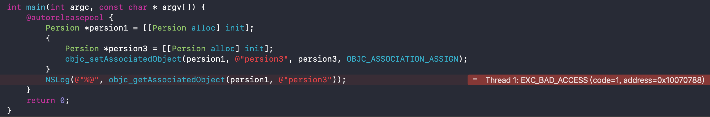
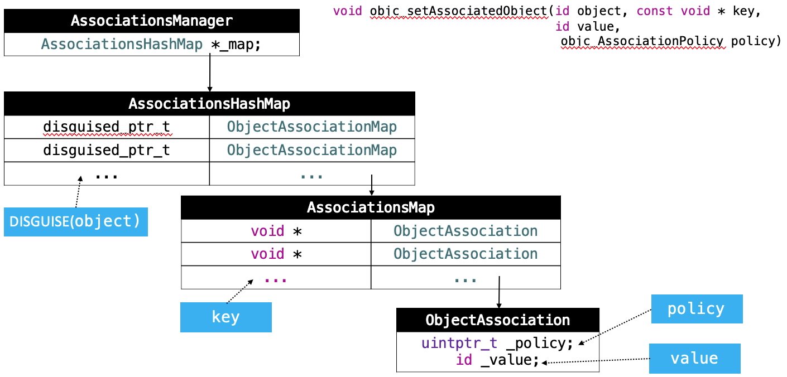

思考：
* Category 能否添加成员变量？如果可以，如何给 Category 添加成员变量？
* 类对象可以关联对象吗？
* 关联对象存储在什么位置？
* 对象及其关联对象之间有强引用关系吗？
* 对象释放后，关联对象会被释放吗？

<!-- more -->

# Category 的成员变量
## _category_t 结构体
```
struct _category_t {
	const char *name; //类名
	struct _class_t *cls; //父类
	const struct _method_list_t *instance_methods; //对象方法列表
	const struct _method_list_t *class_methods; //类方法列表
	const struct _protocol_list_t *protocols; //协议列表
	const struct _prop_list_t *properties; //属性列表
};
```

从 _category_t 的结构体可以看出，Category 中并没有存放成员变量的容器，所以 Category 本身是不支持添加成员变量的。

## 在 Persion.h 中定义属性
```
@interface Persion : NSObject
@property (nonatomic, assign) int age;
@end
```

在 Persion.h 中定义了属性后，系统会在 Persion.m 里自动做三件事：
```
@implementation Persion
{
    int _age; //第一件事：定义成员变量
}
//第二件事：实现 age 的 set 方法
- (void)setAge:(int)age { 
    _age = age;
}
//第三件事：实现 age 的 get 方法
- (int)age { 
    return _age;
}
@end
```

## 在 Persion+Test.h 中定义属性
```
@interface Persion (Test)
@property (nonatomic, assign) int weight;
@end
```

在 Persion+Test.h 中定义了属性后，系统会在 Persion+Test.h 里自动是实现两件事：
```
@interface Persion (Test)
//第一件事：生成 weight 的 set 方法的声明
- (void)setWeight:(int)weight;
//第二件事：生成 weight 的 get 方法的声明
- (int)weight;
@end
```

在分类里定义的属性，并没有对应的成员变量和 set/get 方法的实现。如果尝试手动添加，系统会报错。


## 定义全局变量 int weight_
```
int weight_;
@implementation Persion (Test)
- (void)setWeight:(int)weight {
    weight_ = weight;
}
- (int)weight {
    return weight_;
}
@end
```

通过定义全局变量 _weight 的方式可以实现成员变量的效果，但是 _weight 是全局变量，所有的实例对象 person 会共用同一个 _weight。这样会导致所有的实例对象 person 都可以修改 _weight，无法保证单个实例对象 person 与 _weight 一一对应关系。

## 定义全局变量 NSMutableDictionary *weights_
```
NSMutableDictionary *weights_;
@implementation Persion (Test)
+ (void)load {
    weights_ = [NSMutableDictionary dictionary];
}
- (void)setWeight:(int)weight {
    NSString *key = [NSString stringWithFormat:@"%p", self];
    weights_[key] = @(weight);
}

- (int)weight {
    NSString *key = [NSString stringWithFormat:@"%p", self];
    return [weights_[key] intValue];
}
@end

int main(int argc, const char * argv[]) {
    @autoreleasepool {
        Persion *persion1 = [[Persion alloc] init];
        persion1.age = 10;
        persion1.weight = 20;
        
        Persion *persion2 = [[Persion alloc] init];
        persion2.age = 30;
        persion2.weight = 40;
        
        NSLog(@"persion1.age = %d, persion1.wight = %d", persion1.age, persion1.weight);
        NSLog(@"persion2.age = %d, persion2.wight = %d",persion2.age, persion2.weight);
    }
    return 0;
}
```

打印结果：
```
persion1.age = 10, persion1.wight = 20
persion2.age = 30, persion2.wight = 40
```

* 注意：  
10和30是存储在 persion 对象的内部，20和40是存放在全局的字典 weights_ 对象里面。

优点：通过定义全局变量字典，以 persion 对象的地址作 key，属性 weight 作 value，保证了 persion 对象与 weight 的一一对相应关系。  
缺点：这种方式可能会有线程问题，在 - (void)setWeight:(int)weight 方法里需要加锁。另外每添加一个属性就要定义一个新的全局变量字典。

## 小结

* Category 能否添加成员变量？如果可以，如何给 Category 添加成员变量？  
因为分类底层结构的限制，不能直接添加成员变量到分类中，但是可以通过关联对象来间接实现。

# 基本用法

## 方法列表
参数：  
id _Nonnull object：需要添加关联对象的对象（通常写法传 self）;  
const void * _Nonnull key：指针类型，保存关联对象的key；  
id _Nullable value：关联对象；  
objc_AssociationPolicy policy：关联策略；

添加关联对象：
```
OBJC_EXPORT void
objc_setAssociatedObject(id _Nonnull object, const void * _Nonnull key,
                         id _Nullable value, objc_AssociationPolicy policy)
    OBJC_AVAILABLE(10.6, 3.1, 9.0, 1.0, 2.0);
```

获取关联对象：
```
OBJC_EXPORT id _Nullable
objc_getAssociatedObject(id _Nonnull object, const void * _Nonnull key)
    OBJC_AVAILABLE(10.6, 3.1, 9.0, 1.0, 2.0);
```

移除所有的关联对象：
```
OBJC_EXPORT void
objc_removeAssociatedObjects(id _Nonnull object)
    OBJC_AVAILABLE(10.6, 3.1, 9.0, 1.0, 2.0);
```

### 关联策略 objc_AssociationPolicy
```
typedef OBJC_ENUM(uintptr_t, objc_AssociationPolicy) {
    OBJC_ASSOCIATION_ASSIGN = 0,           /**< Specifies a weak reference to the associated object. */
    OBJC_ASSOCIATION_RETAIN_NONATOMIC = 1, /**< Specifies a strong reference to the associated object. 
                                            *   The association is not made atomically. */
    OBJC_ASSOCIATION_COPY_NONATOMIC = 3,   /**< Specifies that the associated object is copied. 
                                            *   The association is not made atomically. */
    OBJC_ASSOCIATION_RETAIN = 01401,       /**< Specifies a strong reference to the associated object.
                                            *   The association is made atomically. */
    OBJC_ASSOCIATION_COPY = 01403          /**< Specifies that the associated object is copied.
                                            *   The association is made atomically. */
};
```

关联策略 objc_AssociationPolicy 类似于定义属性时设置的参数，确定要关联的对象的内存内存管理方式。


关联策略中没有 week，因为关联对象的实现并没有弱引用效果。



👆通过 OBJC_ASSOCIATION_ASSIGN 策略关联了对象 persion3，此时在 ObjcAssociation 对象里的 value 记住的是关联对象 persion3 的地址值，当关联对象 persion3 离开大括号销毁后，value 依然保存着关联对象的地址值。如果这个时候再通过 value 去访问关联对象就会出现坏内存访问的错误。

## key的常见用法
先添加打印：
```
int main(int argc, const char * argv[]) {
    @autoreleasepool {
        Persion *persion1 = [[Persion alloc] init];
        persion1.name = @"persion1";
        persion1.weight = 20;
        
        Persion *persion2 = [[Persion alloc] init];
        persion2.name = @"persion2";
        persion2.weight = 40;
        
        NSLog(@"persion1.name = %@, persion1.wight = %d", persion1.name, persion1.weight);
        NSLog(@"persion2.name = %@, persion2.wight = %d",persion2.name, persion2.weight);
    }
    return 0;
}
```

### 用法一：static const void *Key = &Key;
#### const void *Key;
```
@interface Person (Test)
@property (copy, nonatomic) NSString *name;
@property (assign, nonatomic) int weight;
@end

@implementation Person (Test)
const void *NameKey;
const void *WeightKey;
- (void)setName:(NSString *)name
{
    objc_setAssociatedObject(self, NameKey, name, OBJC_ASSOCIATION_COPY_NONATOMIC);
}
- (NSString *)name
{
    return objc_getAssociatedObject(self, NameKey);
}
- (void)setWeight:(int)weight
{
    objc_setAssociatedObject(self, WeightKey, @(weight), OBJC_ASSOCIATION_RETAIN_NONATOMIC);
}
- (int)weight
{
    return [objc_getAssociatedObject(self, WeightKey) intValue];
}
@end
```

打印结果：
```
persion1.name = 20, persion1.wight = 20
persion2.name = 40, persion2.wight = 40
```

因为这种方式定义的 NameKey/WeightKey 没有赋值，都是 NULL。这样 name 和 weight 在赋值或取值的时候用的 key 都是 NULL，所以打印结果 name == weight。

#### const void *Key = &Key;
修改 NameKey/WeightKey 的定义：
```
const void *NameKey = &NameKey;
const void *WeightKey = &WeightKey;
```

打印结果：
```
persion1.name = persion1, persion1.wight = 20
persion2.name = persion2, persion2.wight = 40
```

这样定义的 NameKey/WeightKey 内部存储的分别是 NameKey/WeightKey 的地址值，这样保证了 name 和 weight 在赋值或取值的时候用的 key 是不同的值。但是这种方式定义的 NameKey/WeightKey 是全局变量，在其它文件可以通过 exten 访问到：
```
extern const void *NameKey;
extern const void *WeightKey;

int main(int argc, const char * argv[]) {
    @autoreleasepool {
        NSLog(@"NameKey = %p, WeightKey = %p", NameKey, WeightKey);
    }
    return 0;
}
```

打印结果：
```
NameKey = 0x100002338, WeightKey = 0x100002340
```

#### static const void *Key = &Key;
使用 static，限定全局变量的作用域，修改 NameKey/WeightKey 的定义：
```
@implementation Person (Test)
static const void *NameKey = &NameKey;
static const void *WeightKey = &WeightKey;
- (void)setName:(NSString *)name
{
    objc_setAssociatedObject(self, NameKey, name, OBJC_ASSOCIATION_COPY_NONATOMIC);
}
- (NSString *)name
{
    return objc_getAssociatedObject(self, NameKey);
}
- (void)setWeight:(int)weight
{
    objc_setAssociatedObject(self, WeightKey, @(weight), OBJC_ASSOCIATION_RETAIN_NONATOMIC);
}
- (int)weight
{
    return [objc_getAssociatedObject(self, WeightKey) intValue];
}
@end
```

打印结果：
```
persion1.name = persion1, persion1.wight = 20
persion2.name = persion2, persion2.wight = 40
```

这个时候再使用 extern 的方式查找全局变量 NameKey/WeightKey 就会报错：  


#### 小结 

* static：保证了全局变量的作用域仅限于当前文件。  
* Key = &Key：Key 内部存储的是 Key 的地址值。

### 用法二：static const char Key;

#### static const int Key;
const void * _Nonnull key 要求的参数是指针（地址值），所以可以定义一个 int Key，传入 &Key。
```
@implementation Persion (Test)
static const int NameKey; //占用4个字节
static const int WeightKey; //占用4个字节
- (void)setName:(NSString *)name
{
    objc_setAssociatedObject(self, &NameKey, name, OBJC_ASSOCIATION_COPY_NONATOMIC);
}
- (NSString *)name
{
    return objc_getAssociatedObject(self, &NameKey);
}
- (void)setWeight:(int)weight
{
    objc_setAssociatedObject(self, &WeightKey, @(weight), OBJC_ASSOCIATION_RETAIN_NONATOMIC);
}
- (int)weight
{
    return [objc_getAssociatedObject(self, &WeightKey) intValue];
}

@end
```

#### static const char Key;
int 类型在内存中占用4个字节，既然只是要求指针，也可以定义一个 char Key，传入 &Key，这样就只占用1个字节了👇。
```
@implementation Persion (Test)
static const char NameKey; //占用1个字节
static const char WeightKey; //占用1个字节
- (void)setName:(NSString *)name
{
    objc_setAssociatedObject(self, &NameKey, name, OBJC_ASSOCIATION_COPY_NONATOMIC);
}
- (NSString *)name
{
    return objc_getAssociatedObject(self, &NameKey);
}
- (void)setWeight:(int)weight
{
    objc_setAssociatedObject(self, &WeightKey, @(weight), OBJC_ASSOCIATION_RETAIN_NONATOMIC);
}
- (int)weight
{
    return [objc_getAssociatedObject(self, &WeightKey) intValue];
}

@end
```

打印结果：
```
persion1.name = persion1, persion1.wight = 20
persion2.name = persion2, persion2.wight = 40
```

### 用法三：使用属性名作为 key
使用属性名作为 key 可以很好的增加代码的可读性：
```
@implementation Persion (Test)
- (void)setName:(NSString *)name
{
    objc_setAssociatedObject(self, @"name", name, OBJC_ASSOCIATION_COPY_NONATOMIC);
}
- (NSString *)name
{
    return objc_getAssociatedObject(self, @"name");
}
- (void)setWeight:(int)weight
{
    objc_setAssociatedObject(self, @"weight", @(weight), OBJC_ASSOCIATION_RETAIN_NONATOMIC);
}
- (int)weight
{
    return [objc_getAssociatedObject(self, @"weight") intValue];
}
@end
```

打印结果：
```
persion1.name = persion1, persion1.wight = 20
persion2.name = persion2, persion2.wight = 40
```

#### @"name" 与 const void * _Nonnull key。  
定义一个字符串：
```
NSString *str = @"name";
```

str 里装的就是 @"name" 的地址值。因为 str == @"name"，所以字符串 @"name" 就是其地址值，可以直接让字符串 @"name" 作 key。  

字符串 @"name" 是放在内存常量区的，所以不同位置的字符串 @"name" 都是同一个字符串，这样也能保证了存储和读取时传入的 key 是同一个地址值👇:
```
@implementation Persion (Test)
- (void)logName
{
    NSLog(@"%p", @"name");
    NSLog(@"%p", @"name");
}
@end

int main(int argc, const char * argv[]) {
    @autoreleasepool {
        NSLog(@"main - %p", @"name");
        NSLog(@"main - %p", @"name");

        Persion *persion1 = [[Persion alloc] init];
        [persion1 logName];
    }
    return 0;
}
```

打印结果：
```
main - 0x100001080
main - 0x100001080
Persion+Test - 0x100001080
Persion+Test - 0x100001080
```

## 用法四：使用 get 方法的 @selecor 作为 key

### @selecor
```
@implementation Persion (Test)
- (void)setName:(NSString *)name
{
    objc_setAssociatedObject(self, @selector(name), name, OBJC_ASSOCIATION_COPY_NONATOMIC);
}
- (NSString *)name
{
    return objc_getAssociatedObject(self, @selector(name));
}
- (void)setWeight:(int)weight
{
    objc_setAssociatedObject(self, @selector(weight), @(weight), OBJC_ASSOCIATION_RETAIN_NONATOMIC);
}
- (int)weight
{
    return [objc_getAssociatedObject(self, @selector(weight)) intValue];
}
@end
```

打印结果：
```
persion1.name = persion1, persion1.wight = 20
persion2.name = persion2, persion2.wight = 40
```

@selector() 方法是一个指向结构体的指针，即返回某个结构体的指针，方法名相同的 @selector() 地址值相等：
```
- (void)setName:(NSString *)name
{
    NSLog(@"selector(name) = %p", @selector(name));
    objc_setAssociatedObject(self, @selector(name), name, OBJC_ASSOCIATION_COPY_NONATOMIC);
}
- (NSString *)name
{
    NSLog(@"selector(name) = %p", @selector(name));
    return objc_getAssociatedObject(self, @selector(name));
}
@end

int main(int argc, const char * argv[]) {
    @autoreleasepool {
        Persion *persion1 = [[Persion alloc] init];
        persion1.name = @"persion1";
        persion1.weight = 20;

        NSLog(@"persion1.name = %@, persion1.wight = %d", persion1.name, persion1.weight);
    }
    return 0;
}
```

打印结果：
```
selector(name) = 0x7fff2e86480f
selector(name) = 0x7fff2e86480f
ersion1.name = persion1, persion1.wight = 20
```

使用 @selector() 作为 key，即增加可读性，又在编写时会有代码提示，如果写错了还会出现方法不存在的警告。

### _cmd
在 get 方法里可以使用 _cmd 替换 @selecor(方法名)：
```
@implementation Persion (Test)
- (void)setName:(NSString *)name
{
    objc_setAssociatedObject(self, @selector(name), name, OBJC_ASSOCIATION_COPY_NONATOMIC);
}
- (NSString *)name
{
    return objc_getAssociatedObject(self, _cmd);
}
- (void)setWeight:(int)weight
{
    objc_setAssociatedObject(self, @selector(weight), @(weight), OBJC_ASSOCIATION_RETAIN_NONATOMIC);
}
- (int)weight
{
    return [objc_getAssociatedObject(self, _cmd) intValue];
}
@end
```

打印结果：
```
persion1.name = persion1, persion1.wight = 20
persion2.name = persion2, persion2.wight = 40
```

隐式参数：OC 方法在被调用的时候，有两个隐式的参数传入，self 和 _cmd。_cmd 就是当前方法的 SEL，即 @selecor(name)：
```
- (NSString *)name:(id)self _cmd:(SEL)_cmd
```

因为 set 方法中的 _cmd == @selecor(setName:)，get 方法中的 _cmd == @selecor(name)，所以为了保证存储和读取时用到的 key 是同一个，set 方法和 get 方法不能同时使用 _cmd。

## 类对象添加关联对象
```
@implementation Persion (Test)
- (void)setName:(NSString *)name
{
    objc_setAssociatedObject([Persion class], @selector(name), name, OBJC_ASSOCIATION_COPY_NONATOMIC);
}
- (NSString *)name
{
    return objc_getAssociatedObject([Persion class], _cmd);
}
@end
```

打印结果：
```
persion1.name = persion2, persion1.wight = 20
persion2.name = persion2, persion2.wight = 40
```

## 小结
* 类对象可以关联对象吗？  
关联对象方法可以给任何对象关联新的对象，类对象自然也是可以关联对象的。但是类对象只有一个，不同的实例对象在修改和读取被新关联的对象时，都是在操作类对象关联的这个对象，这样又会出现实例对象和关联对象不是一一对应的关系。


# 关联对象的原理

实现关联对象技术的核心对象有：
* AssociationsManager：关联对象管理类，内部管理着所有的 AssociationsHashMap； 
* AssociationsHashMap：存储着所有添加了关联对象的对象，及其添加的关联对象的信息；  
* ObjectAssociationMap：存储着某一个关联对象的 key、value 和 policy 信息；  
* ObjcAssociation：存储着某一个关联对象的 value 和 policy 信息；



打开 runtime 源码 [objc4-781](https://opensource.apple.com/tarballs/objc4/)，找到 _base_objc_setAssociatedObject 方法的实现👇：
## _base_objc_setAssociatedObject
```
static void
_base_objc_setAssociatedObject(id object, const void *key, id value, objc_AssociationPolicy policy)
{
  _object_set_associative_reference(object, key, value, policy);
}
```

找到 objc-references.mm 文件里的 _object_set_associative_reference，
Jump To Definition -> _object_set_associative_reference：
```
void
_object_set_associative_reference(id object, const void *key, id value, uintptr_t policy)
{
    // This code used to work when nil was passed for object and key. Some code
    // probably relies on that to not crash. Check and handle it explicitly.
    // rdar://problem/44094390
    if (!object && !value) return;

    if (object->getIsa()->forbidsAssociatedObjects())
        _objc_fatal("objc_setAssociatedObject called on instance (%p) of class %s which does not allow associated objects", object, object_getClassName(object));

    DisguisedPtr<objc_object> disguised{(objc_object *)object}; //根据传入的 object 封装成 DisguisedPtr，作为读写 ObjectAssociationMap 的 key
    ObjcAssociation association{policy, value}; //根据 policy 和 value 生成 ObjcAssociation 对象

    // retain the new value (if any) outside the lock.
    association.acquireValue();

    {
        AssociationsManager manager; //关联对象管理类
        AssociationsHashMap &associations(manager.get()); //获取关联对象管理类里的 AssociationsHashMap，AssociationsHashMap 保存了所有对象的关联对象信息

        if (value) { //传入的关联对象有值（value != nil）
            auto refs_result = associations.try_emplace(disguised, ObjectAssociationMap{}); //如果键不在 associations 中，则将键和值对插入到 associations 中
            if (refs_result.second) {
                /* it's the first association we make */
                object->setHasAssociatedObjects(); //标记其被关联状态
            }

            /* establish or replace the association */
            auto &refs = refs_result.first->second; //生成 ObjectAssociationMap 对象
            auto result = refs.try_emplace(key, std::move(association)); //如果键不在 refs 中，则将键和值对插入到 refs 中
            if (!result.second) { //如果键在 refs 中，更新 ObjectAssociation
                association.swap(result.first->second);
            }
        } else { //传入的关联对象没有值（value == nil）
            auto refs_it = associations.find(disguised); //找到 ObjectAssociationMap 的遍历器
            if (refs_it != associations.end()) {
                auto &refs = refs_it->second; //找到 ObjectAssociationMap 对象
                auto it = refs.find(key); //找到 key 对应的 ObjcAssociation 遍历器
                if (it != refs.end()) {
                    association.swap(it->second);
                    refs.erase(it); //擦除 ObjcAssociation 对象
                    if (refs.size() == 0) { 
                        associations.erase(refs_it); //如果遍历器 refs 里数据为空，即 ObjectAssociationMap 里的数据为空，则擦除掉 ObjectAssociationMap 对象

                    }
                }
            }
        }
    }

    // release the old value (outside of the lock).
    association.releaseHeldValue();
}
```

### AssociationsManager
```
class AssociationsManager {
    using Storage = ExplicitInitDenseMap<DisguisedPtr<objc_object>, ObjectAssociationMap>; 
    static Storage _mapStorage; //声明 AssociationsHashMap 对象

public:
    AssociationsManager()   { AssociationsManagerLock.lock(); }
    ~AssociationsManager()  { AssociationsManagerLock.unlock(); }

    AssociationsHashMap &get() {
        return _mapStorage.get(); //获取 AssociationsHashMap 对象
    }

    static void init() {
        _mapStorage.init();
    }
};
```

### AssociationsHashMap
可以看到 AssociationsManager 中有一个 AssociationsHashMap 对象，并且 AssociationsHashMap 对象是一个通过 DenseMap 定义的，以 DisguisedPtr<objc_object> 为 key，ObjectAssociationMap 为 value 的字典。ExplicitInitDenseMap：

```
class ExplicitInitDenseMap : public ExplicitInit<DenseMap<Key, Value>> { };
```

### ObjectAssociationMap
```
typedef DenseMap<const void *, ObjcAssociation> ObjectAssociationMap;
```

👆从 ObjectAssociationMap 的定义可以看出，ObjectAssociationMap 是一个通过 DenseMap 定义的，以指针(地址值)为 key，ObjcAssociation 为 value 的字典。ObjcAssociation：

### ObjcAssociation
```
class ObjcAssociation {
    uintptr_t _policy; //关联策略
    id _value; //关联对象
public:
    ObjcAssociation(uintptr_t policy, id value) : _policy(policy), _value(value) {}
    ObjcAssociation() : _policy(0), _value(nil) {}
    ObjcAssociation(const ObjcAssociation &other) = default;
    ObjcAssociation &operator=(const ObjcAssociation &other) = default;
    ObjcAssociation(ObjcAssociation &&other) : ObjcAssociation() {
        swap(other);
    }

    inline void swap(ObjcAssociation &other) {
        std::swap(_policy, other._policy);
        std::swap(_value, other._value);
    }

    inline uintptr_t policy() const { return _policy; }
    inline id value() const { return _value; }

    inline void acquireValue() {
        if (_value) {
            switch (_policy & 0xFF) {
            case OBJC_ASSOCIATION_SETTER_RETAIN:
                _value = objc_retain(_value);
                break;
            case OBJC_ASSOCIATION_SETTER_COPY:
                _value = ((id(*)(id, SEL))objc_msgSend)(_value, @selector(copy));
                break;
            }
        }
    }

    inline void releaseHeldValue() {
        if (_value && (_policy & OBJC_ASSOCIATION_SETTER_RETAIN)) {
            objc_release(_value);
        }
    }

    inline void retainReturnedValue() {
        if (_value && (_policy & OBJC_ASSOCIATION_GETTER_RETAIN)) {
            objc_retain(_value);
        }
    }

    inline id autoreleaseReturnedValue() {
        if (slowpath(_value && (_policy & OBJC_ASSOCIATION_GETTER_AUTORELEASE))) {
            return objc_autorelease(_value);
        }
        return _value;
    }
};
```

可以看出 ObjcAssociation 有两个变量 _policy 和 _value。


## objc_getAssociatedObject
```
id
objc_getAssociatedObject(id object, const void *key)
{
    return _object_get_associative_reference(object, key);
}
```

找到 objc-references.mm 文件里的 _object_get_associative_reference，
Jump To Definition -> _object_get_associative_reference：
```
id
_object_get_associative_reference(id object, const void *key)
{
    ObjcAssociation association{};

    {
        AssociationsManager manager; //关联对象管理类
        AssociationsHashMap &associations(manager.get()); //获取关联对象管理类里的 AssociationsHashMap，AssociationsHashMap 保存了所有对象的关联对象信息
        AssociationsHashMap::iterator i = associations.find((objc_object *)object); //根据 object 找到 ObjectAssociationMap 遍历器 
        if (i != associations.end()) {
            ObjectAssociationMap &refs = i->second; //获取到 ObjectAssociationMap 对象
            ObjectAssociationMap::iterator j = refs.find(key); //根据 key 找到 ObjcAssociation 遍历器
            if (j != refs.end()) {
                association = j->second;
                association.retainReturnedValue();
            }
        }
    }

    return association.autoreleaseReturnedValue();
}
```

## 小结
* 关联对象存储在什么位置？  
关联对象并不是存储在被关联对象本身内存中，关联对象存储在全局的统一的一个 AssociationsManager 中。
* 对象及其关联对象之间有强引用关系吗？  
不存在。在 set 方法中并没有直接使用传入的 object 对象，而是通过的 disguised 方法将传入的 object 对象生成了 DisguisedPtr 对象，并作为 key。
* 对象释放后，关联对象会被释放吗？  
会释放。参考内存管理-release。
* 设置关联对象为nil，就相当于是移除关联对象。