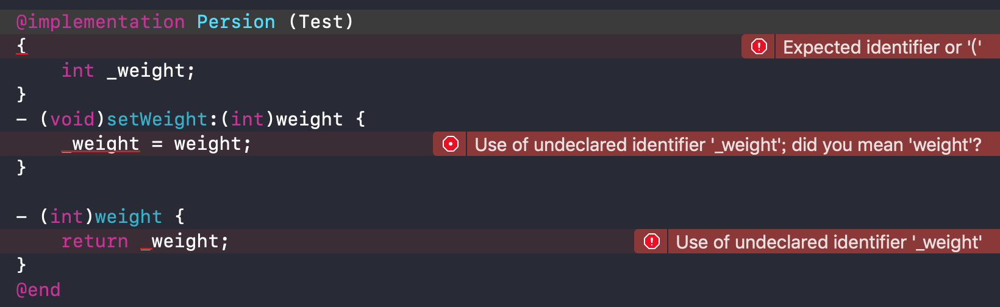
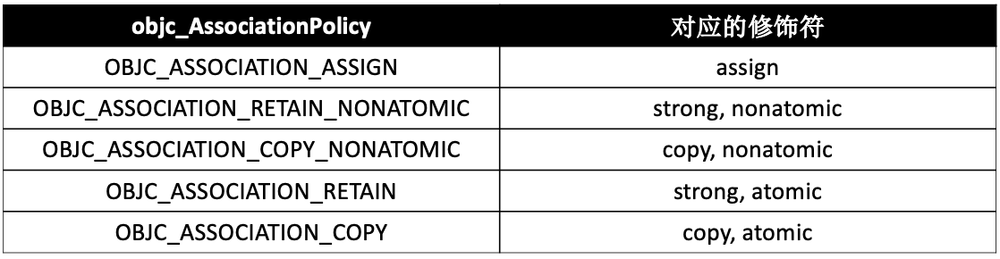
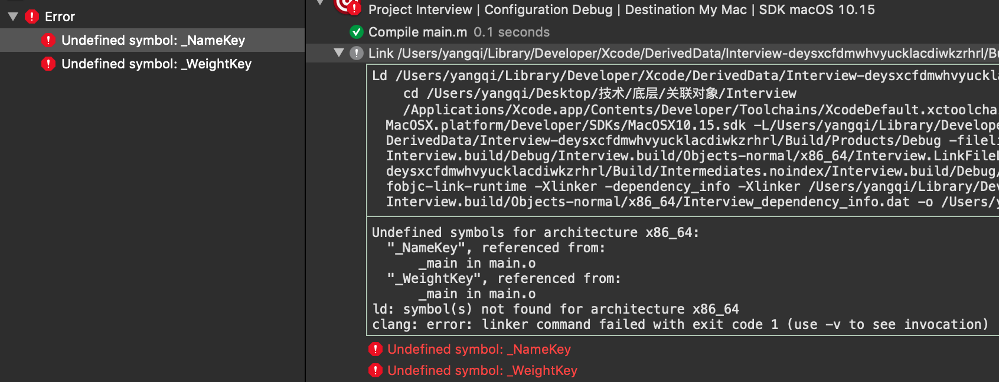

* 思考：Category能否添加成员变量？如果可以，如何给Category添加成员变量？

<!-- more -->

# Category的成员变量
## _category_t 结构体
```
struct _category_t {
	const char *name; //类名
	struct _class_t *cls; //父类
	const struct _method_list_t *instance_methods; //对象方法列表
	const struct _method_list_t *class_methods; //类方法列表
	const struct _protocol_list_t *protocols; //协议列表
	const struct _prop_list_t *properties; //属性列表
};
```

从 _category_t 的结构体可以看出，Category 中并没有存放成员变量的容器，所以 Category 本身是不支持添加成员变量的。

## 在 Persion.h 中定义属性
```
@interface Persion : NSObject
@property (nonatomic, assign) int age;
@end
```

在 Persion.h 中定义了属性后，系统会在 Persion.m 里自动做三件事：
```
@implementation Persion
{
    int _age; //第一件事：定义成员变量
}
//第二件事：实现 age 的 set 方法
- (void)setAge:(int)age { 
    _age = age;
}
//第三件事：实现 age 的 get 方法
- (int)age { 
    return _age;
}
@end
```

## 在 Persion+Test.h 中定义属性
```
@interface Persion (Test)
@property (nonatomic, assign) int weight;
@end
```

在 Persion+Test.h 中定义了属性后，系统会在 Persion+Test.h 里自动是实现两件事：
```
@interface Persion (Test)
//第一件事：生成 weight 的 set 方法的声明
- (void)setWeight:(int)weight;
//第二件事：生成 weight 的 get 方法的声明
- (int)weight;
@end
```

在分类里定义的属性，并没有对应的成员变量和 set/get 方法的实现。如果尝试手动添加，系统会报错。


## 定义全局变量 int weight_
```
int weight_;
@implementation Persion (Test)
- (void)setWeight:(int)weight {
    weight_ = weight;
}
- (int)weight {
    return weight_;
}
@end
```

通过定义全局变量 _weight 的方式可以实现成员变量的效果，但是 _weight 是全局变量，所有的实例对象 persion 会公用同一个 _weight。这样会导致所有的实例对象 persion 都可以修改 _weight，无法保证单个实例对象 persion 与 _weight 一一对应关系。

## 定义全局变量 NSMutableDictionary *weights_
```
NSMutableDictionary *weights_;
@implementation Persion (Test)
+ (void)load {
    weights_ = [NSMutableDictionary dictionary];
}
- (void)setWeight:(int)weight {
    NSString *key = [NSString stringWithFormat:@"%p", self];
    weights_[key] = @(weight);
}

- (int)weight {
    NSString *key = [NSString stringWithFormat:@"%p", self];
    return [weights_[key] intValue];
}
@end

int main(int argc, const char * argv[]) {
    @autoreleasepool {
        Persion *persion1 = [[Persion alloc] init];
        persion1.age = 10;
        persion1.weight = 20;
        
        Persion *persion2 = [[Persion alloc] init];
        persion2.age = 30;
        persion2.weight = 40;
        
        NSLog(@"persion1.age = %d, persion1.wight = %d", persion1.age, persion1.weight);
        NSLog(@"persion2.age = %d, persion2.wight = %d",persion2.age, persion2.weight);
    }
    return 0;
}
```

打印结果：
```
persion1.age = 10, persion1.wight = 20
persion2.age = 30, persion2.wight = 40
```

* 注意：  
10和30是存储在 persion 对象的内部，20和40是存放在全局的字典 weights_ 对象里面。

优点： 
通过定义全局变量字典，以 persion 对象的地址作 key，属性 weight 作 value，保证了 persion 对象与 weight 的一一对相应关系。  
缺点：这种方式可能会有线程问题，在 - (void)setWeight:(int)weight 方法里需要加锁。另外每添加一个属性就要定义一个新的全局变量字典。

因为分类底层结构的限制，不能添加成员变量到分类中，但是可以通过关联对象来间接实现👇。

# 关联对象
## 基本用法

参数：  
id _Nonnull object：需要添加关联对象的对象（通常写法传 self）;  
const void * _Nonnull key：指针类型（void *），保存关联对象的key；  
id _Nullable value：关联对象；  
objc_AssociationPolicy policy：关联策略；

添加关联对象：
```
OBJC_EXPORT void
objc_setAssociatedObject(id _Nonnull object, const void * _Nonnull key,
                         id _Nullable value, objc_AssociationPolicy policy)
    OBJC_AVAILABLE(10.6, 3.1, 9.0, 1.0, 2.0);
```

获取关联对象：
```
OBJC_EXPORT id _Nullable
objc_getAssociatedObject(id _Nonnull object, const void * _Nonnull key)
    OBJC_AVAILABLE(10.6, 3.1, 9.0, 1.0, 2.0);
```

移除所有的关联对象：
```
OBJC_EXPORT void
objc_removeAssociatedObjects(id _Nonnull object)
    OBJC_AVAILABLE(10.6, 3.1, 9.0, 1.0, 2.0);
```

## 关联策略 objc_AssociationPolicy
```
typedef OBJC_ENUM(uintptr_t, objc_AssociationPolicy) {
    OBJC_ASSOCIATION_ASSIGN = 0,           /**< Specifies a weak reference to the associated object. */
    OBJC_ASSOCIATION_RETAIN_NONATOMIC = 1, /**< Specifies a strong reference to the associated object. 
                                            *   The association is not made atomically. */
    OBJC_ASSOCIATION_COPY_NONATOMIC = 3,   /**< Specifies that the associated object is copied. 
                                            *   The association is not made atomically. */
    OBJC_ASSOCIATION_RETAIN = 01401,       /**< Specifies a strong reference to the associated object.
                                            *   The association is made atomically. */
    OBJC_ASSOCIATION_COPY = 01403          /**< Specifies that the associated object is copied.
                                            *   The association is made atomically. */
};
```

关联策略 objc_AssociationPolicy 类似于定义属性时设置的参数，确定要关联的对象的内存内存管理方式。



# key的常见用法

## 用法一：static const void *Key = &Key;

### const void *Key;
```
@interface Person (Test)
@property (copy, nonatomic) NSString *name;
@property (assign, nonatomic) int weight;
@end

@implementation Person (Test)
const void *NameKey;
const void *WeightKey;
- (void)setName:(NSString *)name
{
    objc_setAssociatedObject(self, NameKey, name, OBJC_ASSOCIATION_COPY_NONATOMIC);
}
- (NSString *)name
{
    return objc_getAssociatedObject(self, NameKey);
}
- (void)setWeight:(int)weight
{
    objc_setAssociatedObject(self, WeightKey, @(weight), OBJC_ASSOCIATION_RETAIN_NONATOMIC);
}
- (int)weight
{
    return [objc_getAssociatedObject(self, WeightKey) intValue];
}
@end

int main(int argc, const char * argv[]) {
    @autoreleasepool {
        Persion *persion1 = [[Persion alloc] init];
        persion1.name = @"persion1";
        persion1.weight = 20;
        
        Persion *persion2 = [[Persion alloc] init];
        persion2.name = @"persion2";
        persion2.weight = 40;
        
        NSLog(@"persion1.name = %@, persion1.wight = %d", persion1.name, persion1.weight);
        NSLog(@"persion2.name = %@, persion2.wight = %d",persion2.name, persion2.weight);
    }
    return 0;
}
```

打印结果：
```
persion1.name = 20, persion1.wight = 20
persion2.name = 40, persion2.wight = 40
```

因为这种方式定义的 NameKey/WeightKey 没有赋值，都是 NULL。这样 name 和 weight 赋值取值的时候用的 key 都是 NULL，所以打印结果 name == weight。

### const void *Key = &Key;
修改 NameKey/WeightKey 的定义：
```
const void *NameKey = &NameKey;
const void *WeightKey = &WeightKey;
```

打印结果：
```
persion1.name = persion1, persion1.wight = 20
persion2.name = persion2, persion2.wight = 40
```  

这样定义的 NameKey/WeightKey 内部存储的分别是 NameKey/WeightKey 的地址值。但是这种方式定义的 NameKey/WeightKey 是全局变量，在其它文件可以通过 exten 访问到：
```
extern const void *NameKey;
extern const void *WeightKey;

int main(int argc, const char * argv[]) {
    @autoreleasepool {
        NSLog(@"NameKey = %p, WeightKey = %p", NameKey, WeightKey);
        }
    return 0;
}
``` 

打印结果：
```
NameKey = 0x100002338, WeightKey = 0x100002340
```

### static const void *Key = &Key;
修改 NameKey/WeightKey 的定义：
```
@implementation Person (Test)
static const void *NameKey = &NameKey;
static const void *WeightKey = &WeightKey;
- (void)setName:(NSString *)name
{
    objc_setAssociatedObject(self, NameKey, name, OBJC_ASSOCIATION_COPY_NONATOMIC);
}
- (NSString *)name
{
    return objc_getAssociatedObject(self, NameKey);
}
- (void)setWeight:(int)weight
{
    objc_setAssociatedObject(self, WeightKey, @(weight), OBJC_ASSOCIATION_RETAIN_NONATOMIC);
}
- (int)weight
{
    return [objc_getAssociatedObject(self, WeightKey) intValue];
}
@end
```

这个时候再使用 extern 的方式查找全局变量 NameKey/WeightKey 就会报错：  


### 小结 

* static：保证了全局变量的作用域仅限于当前文件。  
* Key = &Key：Key 内部存储的是 Key 的地址值。

## 用法二：static const char Key;

### static const int Key;
const void * _Nonnull key 要求的参数是指针（地址值），所以可以定义一个 int Key，传入 &Key。
```
@implementation Persion (Test)
static const int NameKey; //占用4个字节
static const int WeightKey; //占用4个字节
- (void)setName:(NSString *)name
{
    objc_setAssociatedObject(self, &NameKey, name, OBJC_ASSOCIATION_COPY_NONATOMIC);
}
- (NSString *)name
{
    return objc_getAssociatedObject(self, &NameKey);
}
- (void)setWeight:(int)weight
{
    objc_setAssociatedObject(self, &WeightKey, @(weight), OBJC_ASSOCIATION_RETAIN_NONATOMIC);
}
- (int)weight
{
    return [objc_getAssociatedObject(self, &WeightKey) intValue];
}

@end
```

### static const char Key;
int 类型在内存中占用4个字节，既然只是要求指针，也可以定义一个 char Key，传入 &Key，这样就只占用1个字节了👇。
```
@implementation Persion (Test)
static const char NameKey; //占用1个字节
static const char WeightKey; //占用1个字节
- (void)setName:(NSString *)name
{
    objc_setAssociatedObject(self, &NameKey, name, OBJC_ASSOCIATION_COPY_NONATOMIC);
}
- (NSString *)name
{
    return objc_getAssociatedObject(self, &NameKey);
}
- (void)setWeight:(int)weight
{
    objc_setAssociatedObject(self, &WeightKey, @(weight), OBJC_ASSOCIATION_RETAIN_NONATOMIC);
}
- (int)weight
{
    return [objc_getAssociatedObject(self, &WeightKey) intValue];
}

@end
```

## 用法三：使用属性名作为key
```
@implementation Persion (Test)
- (void)setName:(NSString *)name
{
    objc_setAssociatedObject(self, @"name", name, OBJC_ASSOCIATION_COPY_NONATOMIC);
}
- (NSString *)name
{
    return objc_getAssociatedObject(self, @"name");
}
- (void)setWeight:(int)weight
{
    objc_setAssociatedObject(self, @"weight", @(weight), OBJC_ASSOCIATION_RETAIN_NONATOMIC);
}
- (int)weight
{
    return [objc_getAssociatedObject(self, @"weight") intValue];
}
@end
```

定义一个字符串：
```
NSString *str = @"name";
```

str 里装的就是 @"name" 的地址值。因为 str == @"name"，所以字符串 @"name" 就是其地址值，可以直接让字符串 @"name" 作 key。  

字符串 @"name" 是放在内存常量区的，所以不同位置的字符串 @"name" 都是同一个字符串 @"name"，保证了存储和读取时传入的 key 是同一个地址值。