思考：
* 使用 CADisplayLink、NSTimer 有什么注意点？
* 介绍下内存的几大区域
* 讲一下你对 iOS 内存管理的理解
* ARC 都帮我们做了什么？(LLVM + Runtime)
* weak 指针的实现原理
* autorelease 对象在什么时机会被调用 release
* 方法里有局部对象， 出了方法后会立即释放吗?
<!-- more -->

# CADisplayLink、NSTimer 定时器
CADisplayLink、NSTimer 会对 target 产生强引用，如果 target 又对它们产生强引用，那么就会引发循环引用。

## 循环引用问题

### CADisplayLink
CADisplayLink 保证调用 `-(void)timerTest` 方法的频率和屏幕的刷新帧频率一致，60FPS。实际的调用频率可能不太一样，根据任务的耗时情况会有减少。
```
@interface TimerViewController ()
@property (nonatomic, strong) CADisplayLink *link;
@end

@implementation TimerViewController
- (void)viewDidLoad {
    [super viewDidLoad];
    
    self.link = [CADisplayLink displayLinkWithTarget:self selector:@selector(timerTest)];
    [self.link addToRunLoop:[NSRunLoop currentRunLoop] forMode:NSDefaultRunLoopMode];
}

- (void)timerTest
{
    NSLog(@"%s", __func__);
}

- (void)dealloc
{
    NSLog(@"%s", __func__);
    [self.link invalidate];
}
@end
```

打印结果：
```
-[TimerViewController timerTest]
-[TimerViewController timerTest]
-[TimerViewController timerTest]
-[TimerViewController timerTest]
......
```

从打印结果可以看到，进入 TimerViewController 控制器后返回，会发现 TimerViewController 没有释放，CADisplayLink 定时器还在继续运行。

### NSTimer
```
@interface TimerViewController ()
@property (nonatomic, strong) NSTimer *timer;
@end

@implementation TimerViewController

- (void)viewDidLoad {
    [super viewDidLoad];
    
    self.timer = [NSTimer scheduledTimerWithTimeInterval:1.0 target:self selector:@selector(timerTest) userInfo:nil repeats:YES];
}

- (void)timerTest
{
    NSLog(@"%s", __func__);
}

- (void)dealloc
{
    NSLog(@"%s", __func__);
    [self.timer invalidate];
}
@end
```

打印结果：
```
-[TimerViewController timerTest]
-[TimerViewController timerTest]
-[TimerViewController timerTest]
-[TimerViewController timerTest]
......
```

从打印结果可以看到，进入 TimerViewController 控制器后返回，会发现 TimerViewController 没有释放，NSTimer 定时器还在继续运行。

### 问题分析
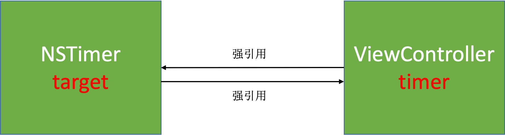

## 解决方案

### 方案一：使用 block
```
@interface TimerViewController ()
@property (nonatomic, strong) NSTimer *timer;
@end

@implementation TimerViewController

- (void)viewDidLoad {
    [super viewDidLoad];
    __weak typeof(self) weakSelf = self;
    self.timer = [NSTimer scheduledTimerWithTimeInterval:1.0 repeats:YES block:^(NSTimer * _Nonnull timer) {
        [weakSelf timerTest];
    }];
}

- (void)timerTest
{
    NSLog(@"%s", __func__);
}

- (void)dealloc
{
    NSLog(@"%s", __func__);
    [self.timer invalidate];
}
@end
```

打印结果：
```
-[TimerViewController timerTest]
-[TimerViewController timerTest]
-[TimerViewController timerTest]
-[TimerViewController timerTest]
-[TimerViewController dealloc]
```

在使用 NSTimer 的时候，使用 block 的方式传入 weakSelf 可以有效解决循环引用的问题。并且以 scheduled 开头的方法会自动将 timer 添加到当前的 runloop 中并使用 default mode。
```
+ (NSTimer *)scheduledTimerWithTimeInterval:(NSTimeInterval)interval repeats:(BOOL)repeats block:(void (^)(NSTimer *timer))block API_AVAILABLE(macosx(10.12), ios(10.0), watchos(3.0), tvos(10.0));
```

target 传入 weakSelf 并不能解决循环引用个问题，因为 NSTimer 内部对传入的 target 也是强引用的，而且 weakSelf 只是用来解决 block 循环引用问题的方案。
```
+ (NSTimer *)scheduledTimerWithTimeInterval:(NSTimeInterval)ti target:(id)aTarget selector:(SEL)aSelector userInfo:(nullable id)userInfo repeats:(BOOL)yesOrNo;
```

CADisplayLink 没有 block 相关的 API。

### 方案二：使用中间对象
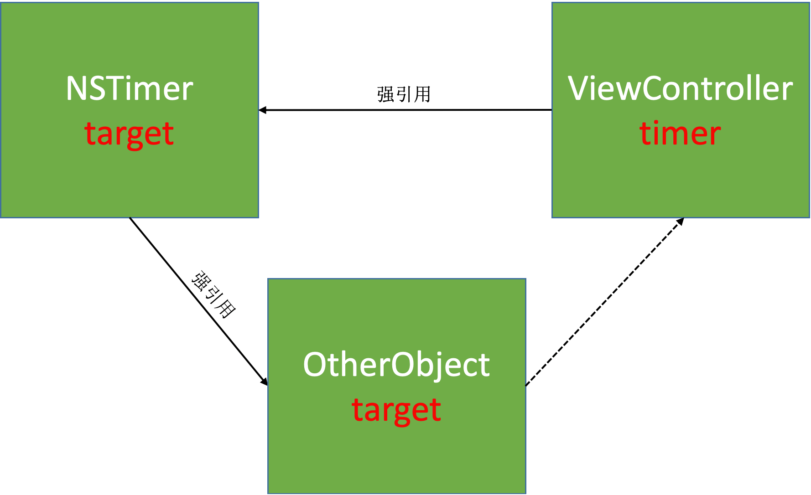

定义中间对象：
```
@interface YQProxy : NSObject
+ (instancetype)proxyWithTarget:(id)target;
@property (nonatomic, weak) id target;
@end

@implementation YQProxy
+ (instancetype)proxyWithTarget:(id)target
{
    YQProxy *proxy = [[YQProxy alloc] init];
    proxy.target = target;
    return proxy;
}

- (id)forwardingTargetForSelector:(SEL)aSelector
{
    return self.target;
}
@end
```

#### NSTimer
```
@interface TimerViewController ()
//@property (nonatomic, strong) CADisplayLink *link;
@property (nonatomic, strong) NSTimer *timer;
@end

@implementation TimerViewController

- (void)viewDidLoad {
    [super viewDidLoad];
    self.timer = [NSTimer scheduledTimerWithTimeInterval:1.0 target:[YQProxy proxyWithTarget:self] selector:@selector(timerTest) userInfo:nil repeats:YES];
}

- (void)timerTest
{
    NSLog(@"%s", __func__);
}

- (void)dealloc
{
    NSLog(@"%s", __func__);
    [self.timer invalidate];
}
@end
```

打印结果：
```
-[TimerViewController timerTest]
-[TimerViewController timerTest]
-[TimerViewController timerTest]
-[TimerViewController timerTest]
-[TimerViewController dealloc]
```

#### CADisplayLink
```
@interface TimerViewController ()
@property (nonatomic, strong) CADisplayLink *link;
@end

@implementation TimerViewController

- (void)viewDidLoad {
    [super viewDidLoad];
    
    self.link = [CADisplayLink displayLinkWithTarget:[YQProxy proxyWithTarget:self] selector:@selector(timerTest)];
    [self.link addToRunLoop:[NSRunLoop currentRunLoop] forMode:NSDefaultRunLoopMode];
}

- (void)timerTest
{
    NSLog(@"%s", __func__);
}

- (void)dealloc
{
    NSLog(@"%s", __func__);
    [self.link invalidate];
}
@end
```

打印结果：
```
......
-[TimerViewController timerTest]
-[TimerViewController timerTest]
-[TimerViewController timerTest]
-[TimerViewController timerTest]
-[TimerViewController dealloc]
```

传给定时器的 target 是 YQProxy 对象，在 YQProxy 对象尝试调用 `-(void)timerTest` 方法时，发现没有实现后会调用 `- (id)forwardingTargetForSelector:(SEL)aSelector` 方法走消息转发的逻辑，在该方法内部返回已经实现了 `-(void)timerTest` 方法的对象，就可以正常实现 timer 定时器调用 `-(void)timerTest` 方法的逻辑了。 

因为 YQProxy 对象没有实现 `-(void)timerTest` 方法，所以需要添加消息转发逻辑。如果 YQProxy 中没有添加消息转发的逻辑会出现如下报错：
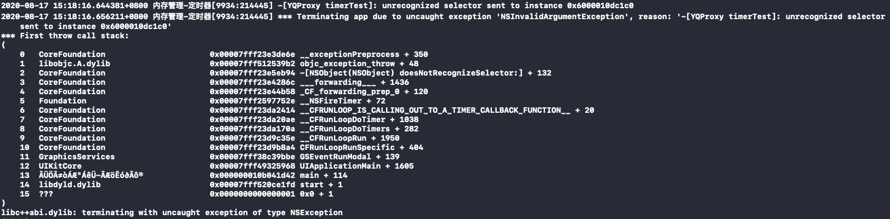 

YQProxy 会在其类对象以及父类的类对象里查找 `-(void)timerTest` 方法，查找了一圈后发现找不到，就会抛出错误。

## 使用代理对象（NSProxy）

定义 YQTimerProxy 继承自 NSProxy：
```
@interface YQTimerProxy : NSProxy
+ (instancetype)proxyWithTarget:(id)target;
@property (nonatomic, weak) id target;
@end

@implementation YQTimerProxy
+ (instancetype)proxyWithTarget:(id)target
{
    YQTimerProxy *proxy = [YQTimerProxy alloc];
    proxy.target = target;
    return proxy;
}

- (NSMethodSignature *)methodSignatureForSelector:(SEL)sel
{
    return [self.target methodSignatureForSelector:sel];
}

- (void)forwardInvocation:(NSInvocation *)invocation
{
    [invocation invokeWithTarget:self.target];
}
@end
```

NSProxy 对象没有 `-(instancetype)init` 方法，直接 alloc 就可以了。

### NSTimer
```
@interface TimerViewController ()
@property (nonatomic, strong) NSTimer *timer;
@end

@implementation TimerViewController

- (void)viewDidLoad {
    [super viewDidLoad];
    self.timer = [NSTimer scheduledTimerWithTimeInterval:1.0
                                                  target:[YQTimerProxy proxyWithTarget:self]
                                                selector:@selector(timerTest)
                                                userInfo:nil
                                                 repeats:YES];
}

- (void)timerTest
{
    NSLog(@"%s", __func__);
}

- (void)dealloc
{
    NSLog(@"%s", __func__);
    [self.timer invalidate];
}
@end
```

打印结果：
```
-[TimerViewController timerTest]
-[TimerViewController timerTest]
-[TimerViewController timerTest]
-[TimerViewController timerTest]
-[TimerViewController dealloc]
```

### CADisplayLink
```
@interface TimerViewController ()
@property (nonatomic, strong) CADisplayLink *link;
@end

@implementation TimerViewController

- (void)viewDidLoad {
    [super viewDidLoad];
    self.link = [CADisplayLink displayLinkWithTarget:[YQTimerProxy proxyWithTarget:self] selector:@selector(timerTest)];
    [self.link addToRunLoop:[NSRunLoop currentRunLoop] forMode:NSDefaultRunLoopMode];
}

- (void)timerTest
{
    NSLog(@"%s", __func__);
}

- (void)dealloc
{
    NSLog(@"%s", __func__);
    [self.link invalidate];
}

@end
```

传给定时器的 target 是 YQTimerProxy 对象，YQTimerProxy 对象不会尝试调用 `-(void)timerTest` 方法，而是直接走消息转发逻辑，在对应的消息转发的方法里返回已经实现了 `-(void)timerTest` 方法的对象，就可以正常实现 timer 定时器调用 `-(void)timerTest` 方法的逻辑了。

因为 YQTimerProxy 对象不会尝试调用 `-(void)timerTest` 方法，而是直接调用 `- (NSMethodSignature *)methodSignatureForSelector:(SEL)sel` 方法，所以需要添加消息转发逻辑。如果 YQTimerProxy 中没有添加消息转发的逻辑会出现如下报错：
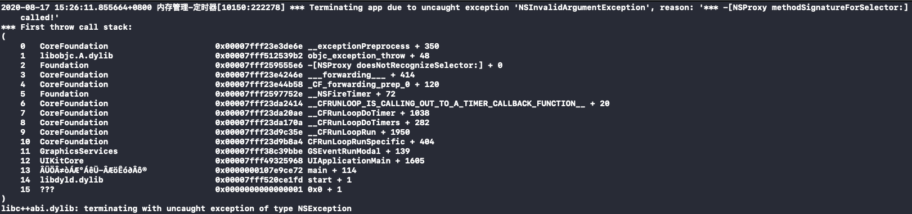 

可以看到 YQTimerProxy 没有去查找 `-(void)timerTest` 方法，而是直接查找的 `- (NSMethodSignature *)methodSignatureForSelector:(SEL)sel` 方法。这一点可以通过 [GNUStep](http://www.gnustep.org/resources/downloads.php) 查看 NSProxy 的源码找到原因。NSProxy 内部的方法的实现都是直接调用的 `- (NSMethodSignature *)methodSignatureForSelector:(SEL)sel` 方法，因此 NSProxy 作为代理对象效率更高。

## NSProxy
```
@interface ViewController ()
@end

@implementation ViewController
- (void)viewDidLoad {
    [super viewDidLoad];
    YQProxy *proxy1 = [YQProxy proxyWithTarget:self];
    YQTimerProxy *proxy2 = [YQTimerProxy proxyWithTarget:self];
    NSLog(@"%d %d", [proxy1 isKindOfClass:[ViewController class]], [proxy2 isKindOfClass:[ViewController class]]);
}
@end
```

打印结果：
```
0 1
```

从打印结果可以看到，YQProxy 的实例对象和 YQTimerProxy 的实列对象在判断是否是 ViewController 的对象类型的时候结果不同。这是因为 YQTimerProxy 继承自 NSProxy，NSProxy 的 `-(BOOL) isKindOfClass:(Class)aClass` 方法的实现与普通的 OC 对象同。通过 [GNUStep](http://www.gnustep.org/resources/downloads.php) 查看 NSProxy 的源码：
```
- (BOOL)isKindOfClass:(Class)aClass
{
    NSMethodSignature	*sig;
    NSInvocation		*inv;
    BOOL			ret;

    sig = [self methodSignatureForSelector: _cmd];
    inv = [NSInvocation invocationWithMethodSignature: sig];
    [inv setSelector: _cmd];
    [inv setArgument: &aClass atIndex: 2];
    [self forwardInvocation: inv];
    [inv getReturnValue: &ret];
    return ret;
}
```

可以看到，NSProxy 的 `-(BOOL)isKindOfClass:(Class)aClass` 方法内部直接调用了 `- (NSMethodSignature *)methodSignatureForSelector:(SEL)sel` 方法。

普通 OC 对象的 `-(BOOL)isKindOfClass:(Class)aClass` 方法实现 [objc4-781](https://opensource.apple.com/tarballs/objc4/) ：
```
- (BOOL)isKindOfClass:(Class)cls {
    for (Class tcls = [self class]; tcls; tcls = tcls->superclass) {
        if (tcls == cls) return YES;
    }
    return NO;
}
```

# GCD 定时器
CADisplayLink 和 NSTimer 依赖于 RunLoop，如果 RunLoop 的任务过于繁重，可能会导致 CADisplayLink 和 NSTimer 不准时。GCD 的定时器会更加准时。

## block 回调：
```
@interface ViewController ()
@property (nonatomic, strong) dispatch_source_t timer;
@end

@implementation ViewController
- (void)viewDidLoad {
    [super viewDidLoad];
    NSLog(@"%s", __func__);
    // 队列
    dispatch_queue_t queue = dispatch_get_main_queue();
    // 创建定时器
    dispatch_source_t timer = dispatch_source_create(DISPATCH_SOURCE_TYPE_TIMER, 0, 0, queue);
    // 设置时间（定时器，延迟执行时间，执行时间间隔，误差）
    dispatch_source_set_timer(timer, dispatch_time(DISPATCH_TIME_NOW, 2 * NSEC_PER_SEC), 1 * NSEC_PER_SEC, 0);
    // 回调
    dispatch_source_set_event_handler(timer, ^{
        NSLog(@"GCD timer");
    });
    // 启动定时器
    dispatch_resume(timer);
    self.timer = timer;
}
@end
```

打印结果：
```
18:16:38.889349+0800 内存管理-定时器[15880:352867] -[ViewController viewDidLoad]
18:16:40.889609+0800 内存管理-定时器[15880:352867] GCD timer
18:16:41.889685+0800 内存管理-定时器[15880:352867] GCD timer
18:16:42.889624+0800 内存管理-定时器[15880:352867] GCD timer
......
```

## 函数回调：
```
@interface ViewController ()
@property (nonatomic, strong) dispatch_source_t timer;
@end

@implementation ViewController

- (void)viewDidLoad {
    [super viewDidLoad];
    NSLog(@"%s", __func__);
    // 队列
    dispatch_queue_t queue = dispatch_get_main_queue();
    // 创建定时器
    dispatch_source_t timer = dispatch_source_create(DISPATCH_SOURCE_TYPE_TIMER, 0, 0, queue);
    // 设置时间（定时器，延迟执行时间，执行时间间隔，误差）
    dispatch_source_set_timer(timer, dispatch_time(DISPATCH_TIME_NOW, 2 * NSEC_PER_SEC), 1 * NSEC_PER_SEC, 0);
    // 回调
    dispatch_source_set_event_handler_f(timer, timerFire);
    
    // 启动定时器
    dispatch_resume(timer);
    self.timer = timer;
}

void timerFire(void *param)
{
    NSLog(@"GCD timer - %@", [NSThread currentThread]);
}
@end
```

打印结果：
```
20:37:01.629410+0800 内存管理-定时器[1363:25276] -[ViewController viewDidLoad]
20:37:03.629774+0800 内存管理-定时器[1363:25276] GCD timer - <NSThread: 0x600001b70d40>{number = 1, name = main}
20:37:04.629784+0800 内存管理-定时器[1363:25276] GCD timer - <NSThread: 0x600001b70d40>{number = 1, name = main}
20:37:05.629800+0800 内存管理-定时器[1363:25276] GCD timer - <NSThread: 0x600001b70d40>{number = 1, name = main}
......
```

## 自定义队列
```
@interface ViewController ()
@property (nonatomic, strong) dispatch_source_t timer;
@end

@implementation ViewController
- (void)viewDidLoad {
    [super viewDidLoad];
    NSLog(@"%s", __func__);
    // 自定义队列
    dispatch_queue_t queue = dispatch_queue_create("GCDTimer", NULL);
    // 创建定时器
    dispatch_source_t timer = dispatch_source_create(DISPATCH_SOURCE_TYPE_TIMER, 0, 0, queue);
    // 设置时间（定时器，延迟执行时间，执行时间间隔，误差）
    dispatch_source_set_timer(timer, dispatch_time(DISPATCH_TIME_NOW, 2 * NSEC_PER_SEC), 1 * NSEC_PER_SEC, 0);
    // 回调
    dispatch_source_set_event_handler_f(timer, timerFire);
    // 启动定时器
    dispatch_resume(timer);
    self.timer = timer;
}

void timerFire(void *param)
{
    NSLog(@"GCD timer - %@", [NSThread currentThread]);
}
@end
```

打印结果：
```
20:39:58.857389+0800 内存管理-定时器[1460:28690] -[ViewController viewDidLoad]
20:40:00.857845+0800 内存管理-定时器[1460:28836] GCD timer - <NSThread: 0x600002119280>{number = 5, name = (null)}
20:40:01.857692+0800 内存管理-定时器[1460:28835] GCD timer - <NSThread: 0x6000021272c0>{number = 6, name = (null)}
20:40:02.857792+0800 内存管理-定时器[1460:28836] GCD timer - <NSThread: 0x600002119280>{number = 5, name = (null)}
......
```

## 封装 GCD

```
@interface YQGCDTimer : NSObject
/**
block 回调
*/
+ (NSString *)execTask:(void(^)(void))task
                 start:(NSTimeInterval)start
              interval:(NSTimeInterval)interval
               repeats:(BOOL)repeats
                 async:(BOOL)async;
/**
函数回调
*/
+ (NSString *)execTaskWithTarget:(id)target
                        selector:(SEL)selector
                           start:(NSTimeInterval)start
                        interval:(NSTimeInterval)interval
                         repeats:(BOOL)repeats
                           async:(BOOL)async;
/**
取消
*/
+ (void)cancelTask:(NSString *)name;
@end


NSInteger index_;
static NSMutableDictionary *timers_;
dispatch_semaphore_t semaphore_;

@implementation YQGCDTimer

+ (void)initialize
{
    static dispatch_once_t onceToken;
    dispatch_once(&onceToken, ^{
        timers_ = [NSMutableDictionary dictionary];
        semaphore_ = dispatch_semaphore_create(1);
        index_ = 0;
    });
}

+ (NSString *)execTask:(void (^)(void))task start:(NSTimeInterval)start interval:(NSTimeInterval)interval repeats:(BOOL)repeats async:(BOOL)async
{
    if (!task || start < 0 || (interval <= 0 && repeats)) return nil;
    // 队列（全局串行队列或主队列）
    dispatch_queue_t queue = async ? dispatch_get_global_queue(0, 0) : dispatch_get_main_queue();
    // 创建定时器
    dispatch_source_t timer = dispatch_source_create(DISPATCH_SOURCE_TYPE_TIMER, 0, 0, queue);
    // 设置时间
    dispatch_source_set_timer(timer, dispatch_time(DISPATCH_TIME_NOW, start * NSEC_PER_SEC), interval * NSEC_PER_SEC, 0);
    // 回调
    dispatch_source_set_event_handler(timer, ^{
        task();
        // 不需要重复任务
        if (!repeats) {
            dispatch_source_cancel(timer);
        }
    });
    // 加锁
    dispatch_semaphore_wait(semaphore_, DISPATCH_TIME_FOREVER);
    // 定时器唯一标识
    NSString *identify = [NSString stringWithFormat:@"%ld", (long)index_++];
    // 保存
    timers_[identify] = timer;
    // 解锁
    dispatch_semaphore_signal(semaphore_);
    // 启动定时器
    dispatch_resume(timer);
    return identify;
}

+ (NSString *)execTaskWithTarget:(id)target selector:(SEL)selector start:(NSTimeInterval)start interval:(NSTimeInterval)interval repeats:(BOOL)repeats async:(BOOL)async
{
    return [self execTask:^{
        if ([target respondsToSelector:selector]) {
#pragma clang diagnostic push
#pragma clang diagnostic ignored "-Warc-performSelector-leaks"
            [target performSelector:selector];
#pragma clang diagnostic pop
        }
    } start:start interval:interval repeats:repeats async:async];
}

+ (void)cancelTask:(NSString *)name
{
    if (name.length == 0) return;
    // 加锁
    dispatch_semaphore_wait(semaphore_, DISPATCH_TIME_FOREVER);
    dispatch_source_t timer = timers_[name];
    if (timer) {
        dispatch_source_cancel(timer);
        [timers_ removeObjectForKey:name];
    }
    // 解锁
    dispatch_semaphore_signal(semaphore_);
}
@end
```

调用 block 回调方法：
```
@interface TimerViewController ()
@property (nonatomic, copy) NSString *task;
@end

@implementation TimerViewController

- (void)viewDidLoad {
    [super viewDidLoad];
    NSLog(@"%s", __func__);
    self.task = [YQGCDTimer execTask:^{
        NSLog(@"GCD timer");
    } start:2 interval:1 repeats:YES async:NO];
}

- (void)touchesBegan:(NSSet<UITouch *> *)touches withEvent:(UIEvent *)event
{
    [YQGCDTimer cancelTask:self.task];
}
@end
```

调用函数回调方法：
```
@interface TimerViewController ()
@property (nonatomic, copy) NSString *task;
@end

@implementation TimerViewController

- (void)viewDidLoad {
    [super viewDidLoad];
    NSLog(@"%s", __func__);
    self.task = [YQGCDTimer execTaskWithTarget:self selector:@selector(timerTest) start:2 interval:1 repeats:YES async:NO];
}

- (void)timerTest
{
    NSLog(@"%s", __func__);
}

- (void)touchesBegan:(NSSet<UITouch *> *)touches withEvent:(UIEvent *)event
{
    [YQGCDTimer cancelTask:self.task];
}
@end
```

打印结果：
```
21:18:01.050592+0800 内存管理-定时器[2321:52592] -[TimerViewController viewDidLoad]
21:18:03.050800+0800 内存管理-定时器[2321:52592] GCD timer
21:18:04.050986+0800 内存管理-定时器[2321:52592] GCD timer
21:18:05.050943+0800 内存管理-定时器[2321:52592] GCD timer
```

去掉警告：
```
+ (NSString *)execTaskWithTarget:(id)target selector:(SEL)selector start:(NSTimeInterval)start interval:(NSTimeInterval)interval repeats:(BOOL)repeats async:(BOOL)async
{
    return [self execTask:^{
        if ([target respondsToSelector:selector]) {
#pragma clang diagnostic push
#pragma clang diagnostic ignored "-Warc-performSelector-leaks"
            [target performSelector:selector];
#pragma clang diagnostic pop
        }
    } start:start interval:interval repeats:repeats async:async];
}
```

`"-Warc-performSelector-leaks"` 可以在这里找到：
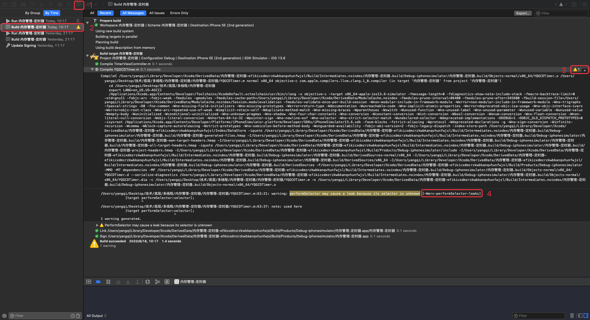 

# iOS程序的内存布局
* 代码段：编译之后的代码
* 数据段：
  字符串常量  
  已初始化数据  
  未初始化数据
* 栈：函数调用开销，比如局部变量。（分配的内存空间地址越来越小）
* 堆：通过 alloc、malloc、calloc 等动态分配的空间，分配的内存空间地址越来越大
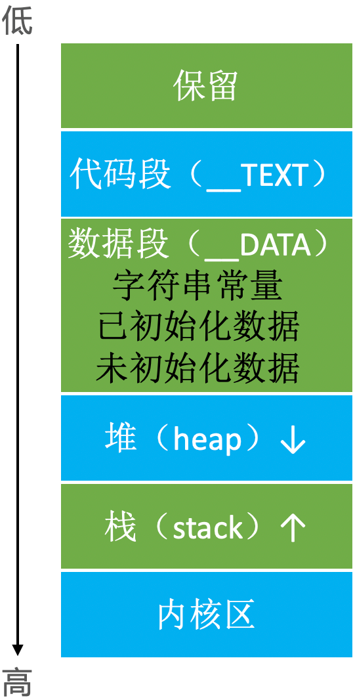 

```
// 已初始化的全局变量
int a = 10;
// 未初始化的全局变量
int b;

int main(int argc, char * argv[]) {
    @autoreleasepool {
        // 已初始化的静态变量
        static int c = 20;
        // 未初始化的静态变量
        static int d;
        // 栈
        int e;
        int f = 20;
        // 字符串常量
        NSString *str = @"123";
        // 堆
        NSObject *obj = [[NSObject alloc] init];
        
        NSLog(@"\n&a=%p\n&b=%p\n&c=%p\n&d=%p\n&e=%p\n&f=%p\nstr=%p\nobj1=%p\nobj2=%p\n",
              &a, &b, &c, &d, &e, &f, str, obj1, obj2);
        return UIApplicationMain(argc, argv, nil, NSStringFromClass([AppDelegate class]));
    }
}
```

打印结果：
```
&a=0x105bbee38
&b=0x105bbef04
&c=0x105bbee3c
&d=0x105bbef00
&e=0x7ffeea042c2c
&f=0x7ffeea042c28
str=0x105bbe070
obj1=0x600002528110
obj2=0x600002528120
```

打印结果解析（内地地址从小到大排序）：
```
// 字符串常量
str=0x105bbe070

// 已初始化的全局变量、静态变量
&a=0x105bbee38
&c=0x105bbee3c

// 未初始化的全局变量、静态变量
&d=0x105bbef00
&b=0x105bbef04

// 堆
obj1=0x600002528110
obj2=0x600002528120

// 栈
&f=0x7ffeea042c28
&e=0x7ffeea042c2c
```

内存地址大小比较：
```
str < a < c < d < b < obj1 < obj2 < f < e 
```

数据段：str < a < c < d < b，空间地址越来越大。   
堆区：obj1 比 b 多了3位数，这3位数的空间都属于数据段。obj1 的内存地址首位数字为6，obj1 < obj2，分配的内存空间越来越大（越来越逼近栈区）。  
栈区：e 的内存地址首位数字为7，f < e，分配的内存空间越来越小（越来越逼近堆区）。  

# Tagged Pointer

* 从64bit开始，iOS 引入了 Tagged Pointer 技术，用于优化 NSNumber、NSDate、NSString 等小对象的存储。
* 在没有使用 Tagged Pointer 之前，NSNumber 等对象需要动态分配内存、维护引用计数等，NSNumber 等对象的指针存储的是堆中 NSNumber 对象的地址值。
* 使用 Tagged Pointer 之后，NSNumber 指针里面存储的数据变成了：Tag + Data，也就是将数据直接存储在了指针中。
* 当指针不够存储数据时，才会使用动态分配内存的方式来存储数据。
* `objc_msgSend()` 能识别 Tagged Pointer，比如 NSNumber 的 intValue 方法，直接从指针提取数据，节省了以前的调用开销。
* 如何判断一个指针是否为Tagged Pointer？  
  iOS平台，最高有效位是1（第64bit）  
  Mac平台，最低有效位是1  

## NSNumber
```
int main(int argc, char * argv[]) {
    NSString * appDelegateClassName;
    @autoreleasepool {
        
        NSNumber *number1 = @4;
        NSNumber *number2 = @5;
        NSNumber *number3 = @(0xFFFFFFFFFFFFFFFF);
        NSLog(@"%p %p %p", number1, number2, number3);
        
        int a = [number1 intValue];

        appDelegateClassName = NSStringFromClass([AppDelegate class]);
    }
    return UIApplicationMain(argc, argv, nil, appDelegateClassName);
}
```

打印结果：
```
0xb0d1e4bcdb858740 0xb0d1e4bcdb858750 0x600000b4c080
```

`0xb0d1e4bcdb858740` 和 `0xb0d1e4bcdb858750` 去掉前面相同的部分后是 `0x40` 和 `0x50`，可以看出数据直接存储在了指针中。当指针不够存储数据时，如 `@(0xFFFFFFFFFFFFFFFF)` 打印出来的内存地址是 `0x600000b4c080`（堆空间里 NSNumber 对象的地址值），是使用了动态分配内存的方式来存储数据。

因为 `objc_msgSend()` 能识别 Tagged Pointer，所以在 number1 调用 `intValue` 方法时，`objc_msgSend()` 直接从指针提取数据。
```
int a = [number1 intValue];
```

可以看出 Tagged Pointer 技术不仅仅是内存空间的优化，也对使用过程进行了优化。

## NSString

### 例一：
```
@interface ViewController ()
@property (nonatomic, copy) NSString *name;
@end

@implementation ViewController

- (void)viewDidLoad {
    [super viewDidLoad];
    dispatch_queue_t queue = dispatch_get_global_queue(0, 0);
    for (int i=0; i<1000; i++) {
        dispatch_async(queue, ^{
            self.name = [NSString stringWithFormat:@"abcdefghijk"];
        });
    }
}
@end
```

运行后报错（坏内存访问）：
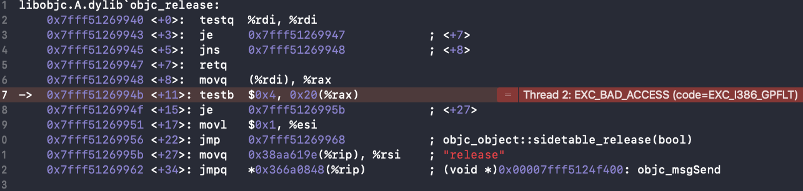

因为 `name` 是非原子性（`nonatomic`）的，多条线程同时访问 `name` 的 set 方法时，如果有一条线程已经将 `_name` 释放了，其它线程再次对 `_name` 进行释放操作就会出现坏内存访问的错误：
```
- (void)setName:(NSString *)name
{
    if (_name != name) {
        [_name release]; // 多条线程同时操作这一行，如果 `_name` 已经被释放了，其它线程再次对 `_name` 进行 release 操作，坏内存访问
        _name = [name copy];
    }
}
```

#### 解决方案一：
将 `name` 改成原子性的：
```
@property (atomic, copy) NSString *name;
```

程序运行正常。

将 `name` 改成原子性后，`name` 的 set 方法就是线程安全的了，不会出现多条线程同时对 `name` 进行 release 操作。

#### 解决方案二：
将 `name` 改成原子性后，任何地方、任何时候调用 `name` 的 get 方法都是有锁的。因为 `name` 只需要在异步线程访问时加锁，如果在主线程的话没有必要加锁，所以不使用 `atomic` 而是选择手动加锁，哪里需要就在哪里加锁，尽可能的提升效率节省资源：
```
/// 加锁
#define SemaphoreBegin \
static dispatch_semaphore_t semaphore; \
static dispatch_once_t onceToken; \
dispatch_once(&onceToken, ^{ \
    semaphore = dispatch_semaphore_create(1); \
}); \
dispatch_semaphore_wait(semaphore, DISPATCH_TIME_FOREVER);
/// 解锁
#define SemaphoreEnd \
dispatch_semaphore_signal(semaphore);

@interface ViewController ()
@property (nonatomic, copy) NSString *name;
@end

@implementation ViewController

- (void)viewDidLoad {
    [super viewDidLoad];
    dispatch_queue_t queue = dispatch_get_global_queue(0, 0);
    for (int i=0; i<1000; i++) {
        dispatch_async(queue, ^{
            // 加锁
            SemaphoreBegin;
            self.name = [NSString stringWithFormat:@"abcdefghijk"];
            // 解锁
            SemaphoreEnd;
        });
    }
}
@end
```

程序运行正常。

### 例二：  
将 `@"abcdefghijk"` 改成 `@"abc"`：
```
@interface ViewController ()
@property (nonatomic, copy) NSString *name;
@end

@implementation ViewController

- (void)viewDidLoad {
    [super viewDidLoad];
    dispatch_queue_t queue = dispatch_get_global_queue(0, 0);
    for (int i=0; i<1000; i++) {
        dispatch_async(queue, ^{
            self.name = [NSString stringWithFormat:@"abc"];
        });
    }
}
@end
```

运行正常。  

同样是多线程访问、没有加锁，但是将 `@"abcdefghijk"` 改成 `@"abc"` 后，就不会出现坏内存访问的错误，难道是没有调用 `name` 的 set 方法吗？是的。
```
@implementation ViewController

- (void)viewDidLoad {
    [super viewDidLoad];
    NSString *str1 = [NSString stringWithFormat:@"abcdefghijk"];
    NSString *str2 = [NSString stringWithFormat:@"abc"];
    NSLog(@"%p %p", str1, str2);
    NSLog(@"%@ %@", [str1 class], [str2 class]);
}
@end
```

打印结果：
```
0x600002aefdc0 0x9cedd15798132057
__NSCFString NSTaggedPointerString
```

str1 是一个 `__NSCFString`，其内存地址是6开头的，说明 str1 是存储在堆空间里的。  
str2 是一个 `NSTaggedPointerString`，`@"abc"` 存储在 str2 指针里，不会调用 set 方法，取值时也不会调用 get 方法而是直接从指针里取值。

## 判断是否是 Tagged Pointer

[objc4-781](https://opensource.apple.com/tarballs/objc4/) 的 objc-internal.h 文件里：

`_OBJC_TAG_MASK` 定义：
```
#if (TARGET_OS_OSX || TARGET_OS_IOSMAC) && __x86_64__
    // 64-bit Mac - tag bit is LSB
#   define OBJC_MSB_TAGGED_POINTERS 0 // Mac
#else
    // Everything else - tag bit is MSB
#   define OBJC_MSB_TAGGED_POINTERS 1 // iPhone（真机/模拟器）
#endif

#if OBJC_MSB_TAGGED_POINTERS
#   define _OBJC_TAG_MASK (1UL<<63) 
#else
#   define _OBJC_TAG_MASK 1UL 
#endif
```

判断是否是 tagged pointer：
```
static inline bool 
_objc_isTaggedPointer(const void * _Nullable ptr)
{
    return ((uintptr_t)ptr & _OBJC_TAG_MASK) == _OBJC_TAG_MASK;
}
```

如果是 mac，`_OBJC_TAG_MASK` 等于1。如果不是 mac， `_OBJC_TAG_MASK` 等于 1UL<<63。`_OBJC_TAG_MASK` 和指针地址进行与运算，判断结果是否是 `_OBJC_TAG_MASK`，如果是的话，那这个指针就是 tagged pointer。  
在 iOS 平台，如果指针转成2进制后它的最高位（64位）为1的话，那么这个指针就是 tagged pointer。  
在 Mac 平台，如果指针转成2进制后它的最低位为1的话，那么这个指针就是 tagged pointer。

# MRC
* 在 iOS 中，使用引用计数来管理 OC 对象的内存。  
* 一个新创建的 OC 对象引用计数默认是1，当引用计数减为0，OC 对象就会销毁，释放其占用的内存空间。  
* 调用 retain 会让 OC 对象的引用计数+1，调用 release 会让 OC 对象的引用计数-1。  
* 内存管理的经验总结：  
  当调用 alloc、new、copy、mutableCopy 方法返回了一个对象，在不需要这个对象时，要调用 release 或者 autorelease 来释放它。  
  想拥有某个对象，就让它的引用计数+1；不想再拥有某个对象，就让它的引用计数-1。  
* 可以通过以下私有函数来查看自动释放池的情况  
  ```
  extern void _objc_autoreleasePoolPrint(void);
  ```

👉 使用 MRC：Build Setting -> Objective-C Automatic Referencd Counting 设置为 YES。

定义 Person 类：
```
@interface Person : NSObject
@end

@implementation Person
- (void)dealloc
{
    [super dealloc];
    NSLog(@"%s", __func__);
}
@end
```

## release

创建 person 对象：
```
int main(int argc, const char * argv[]) {
    @autoreleasepool {
        Person *person = [[Person alloc] init]; // Person *person = [Person new];
        NSLog(@"%zd", person.retainCount);
    }
    return 0;
}
```

打印结果：
```
 1
```

从打印结果可以看到，person 对象调用完 `alloc` 方法后引用计数是1，没有被释放。

添加 release：
```
int main(int argc, const char * argv[]) {
    @autoreleasepool {
        Person *person = [[Person alloc] init];
        
        // 使用 person 对象
        NSLog(@"%zd", person.retainCount);

        [person release];
        NSLog(@"111");
    }
    return 0;
}
```

打印结果：
```
 1
 -[Person dealloc]
 111
```

从打印结果可以看到，因为 person 对象调用完 `alloc` 方法后引用计数是1，调用完 `release` 方法后引用计数减1等于0，所以 person 对象在调用 `release` 的那一刻就被释放了。

MRC 下 `alloc` 方法和 `release` 方法是一一对应的，每个对象使用完成后都要调用一下 `release` 方法，这样才能避免内存泄漏。另外，在使用 `release` 方法管理 person 对象时，要保证在调用 `release` 方法之前使用 person 对象。

## autorelease
```
int main(int argc, const char * argv[]) {
    @autoreleasepool {
        Person *person = [[[Person alloc] init] autorelease];
        NSLog(@"%zd", person.retainCount);
        NSLog(@"111");
    }
    NSLog(@"222");
    return 0;
}
```

打印结果：
```
1
111
-[Person dealloc]
222
```

从打印结果可以看到，因为 person 对象调用完 `alloc` 方法又调用了 `autorelease` 后引用计数是1，直到 `@autoreleasepool {}` 执行完那一刻才被释放。  

在 `@autoreleasepool {}` 执行完那一刻，会对调用了 `autorelease` 方法的对象进行 `release` 操作：
```
int main(int argc, const char * argv[]) {
    @autoreleasepool {
        Person *person1 = [[[Person alloc] init] autorelease];
        Person *person2 = [[[Person alloc] init] autorelease];
        NSLog(@"111");
    } // [person release]、[person release]
    NSLog(@"222");
    return 0;
}
```

打印结果：
```
111
-[Person dealloc]
-[Person dealloc]
222
```

使用 `autorelease` 方法管理 person 对象的内存，只需要在调用 `alloc` 方法的同时调用一下 `autorelease` 方法，就可以放心的使用 person 对象了，当然是在 `@autoreleasepool {}` 内部使用。不用再关心 person 对象的释放问题，在 `@autoreleasepool {}` 执行完那一刻，person 对象会自动调用 `release` 方法。

## retain

错误演示：
```
// Dog
@interface Dog : NSObject
- (void)run;
@end

@implementation Dog
- (void)dealloc
{
    [super dealloc];
    NSLog(@"%s", __func__);
}

- (void)run
{
    NSLog(@"%s", __func__);
}
@end

// Person
@interface Person : NSObject
{
    Dog *_dog;
}
- (void)setDog:(Dog *)dog;
- (Dog *)dog;
@end

@implementation Person
- (void)dealloc
{
    [super dealloc];
    NSLog(@"%s", __func__);
}

- (void)setDog:(Dog *)dog
{
    _dog = dog;
}

- (Dog *)dog
{
    return _dog;
}
@end

// 调用
int main(int argc, const char * argv[]) {
    @autoreleasepool {
        Dog *dog = [[Dog alloc] init]; // 引用计数：1
        Person *person = [[Person alloc] init];
        [person setDog:dog];
        
        [dog release]; // 引用计数：0
        
        [[person dog] run];
        
        [person release];
        
        NSLog(@"111");
    }
    NSLog(@"222");
    return 0;
}
```

打印信息：
```
 -[Dog dealloc]
```

`[[person dog] run]` 这个时候 dog 对象因为引用计数为0已经被释放了。
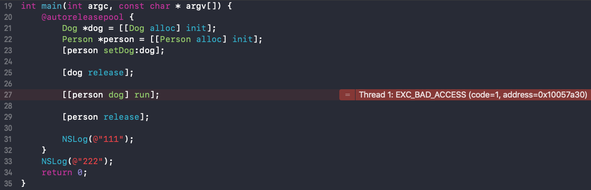

`[person setDog:dog]` 方法表示 person 对象想要用于 dog 对象，那么 person 对象应该对 dog 的引用计数加1，只要 person 对象还在，dog 对象就不可以被释放。

上面的写法有两个地方需要优化：  
1、Person 类的 `- (void)setDog:(Dog *)dog` 方法在获取 dog 对象时，引用计数需要加1。  
2、Person 类的 `- (void)dealloc` 方法需要对 dog 对象进行 `release` 操作。  

Person 类优化后：
```
@implementation Person
- (void)dealloc
{
    [_dog release];
    _dog = nil;
    
    [super dealloc]; // 父类的 dealloc 放到子类后
    NSLog(@"%s", __func__);
}

- (void)setDog:(Dog *)dog
{
    _dog = [dog retain];
}

- (Dog *)dog
{
    return _dog;
}
@end
```

打印结果：
```
-[Dog run]
-[Dog dealloc]
-[Person dealloc]
111
222
```

创建两个 person 对象引用 dog 对象：
```
int main(int argc, const char * argv[]) {
    @autoreleasepool {
        Dog *dog = [[Dog alloc] init]; // dog 引用计数：1
        
        Person *person1 = [[Person alloc] init];
        [person1 setDog:dog]; // dog 引用计数：2
        
        Person *person2 = [[Person alloc] init];
        [person2 setDog:dog]; // dog 引用计数：3
        
        [dog release]; // dog 引用计数：2
        
        [person1 release]; // dog 引用计数：1
        
        [[person2 dog] run];
        
        [person2 release]; // dog 引用计数：0
        
        NSLog(@"111");
    }
    NSLog(@"222");
    return 0;
}
```

打印结果：
```
-[Person dealloc]
-[Dog run]
-[Dog dealloc]
-[Person dealloc]
111
222
```

## set 方法

上面 Person 类里的 set 方法还有问题，在 person 对象替换 dog 对象时会出现不释放的问题：
```
int main(int argc, const char * argv[]) {
    @autoreleasepool {
        Dog *dog1 = [[Dog alloc] init]; // dog1 : 1
        Dog *dog2 = [[Dog alloc] init]; // dog2 : 1
        Person *person = [[Person alloc] init];
        
        [person setDog:dog1]; // dog1 : 2
        [person setDog:dog2]; // dog2 : 2
        
        [dog1 release]; // dog1 : 1
        [dog2 release]; // dog2 : 1
        [person release]; // dog0 : 0
        NSLog(@"111");
    }
    NSLog(@"222");
    return 0;
}
```

打印结果：
```
-[Dog dealloc]
-[Person dealloc]
111
222
```

从打印结果和注释可以看到，dog1 最后的引用计数是1，没有释放。这是因为 person 对象在拥有 dog1 时，将 `_dog` 指向了 dog1 并对其引用计数加1，后又将 `_dog` 指向了 dog2 并对其引用计数加1，所以 person 对象在调用 `[_dog release]` 时的 `_dog` 是 dog2 对象，dog1 对象因此少调用了一次 release 方法，最后的引用计数最后为1无法释放。

优化 set 方法：在 person 对象引用新的 dog 对象时，需要先将之前的 dog 对象进行 release 操作。
```
@implementation Person
- (void)dealloc
{
    [_dog release];
    _dog = nil;
    
    [super dealloc];
    NSLog(@"%s", __func__);
}

- (void)setDog:(Dog *)dog
{
    [_dog release];
    _dog = [dog retain];
}

- (Dog *)dog
{
    return _dog;
}
@end
```

打印结果：
```
-[Dog dealloc]
-[Dog dealloc]
-[Person dealloc]
111
222
```

从打印结果可以看到，dog1 和 dog2 对象都被释放调用。但是优化后的 set 方法还不够完善，person 对象在重复设置同一个 dog 对象的时候还是有问题：
```
int main(int argc, const char * argv[]) {
    @autoreleasepool {
        Dog *dog = [[Dog alloc] init]; // dog1 : 1
        Person *person = [[Person alloc] init];
        
        [person setDog:dog]; // dog1 : 2
        
        [dog release]; // dog1 : 1
        
        [person setDog:dog]; // dog1 : 0
        
        [person release];
        
        NSLog(@"111");
    }
    NSLog(@"222");
    return 0;
}
```

错误信息：
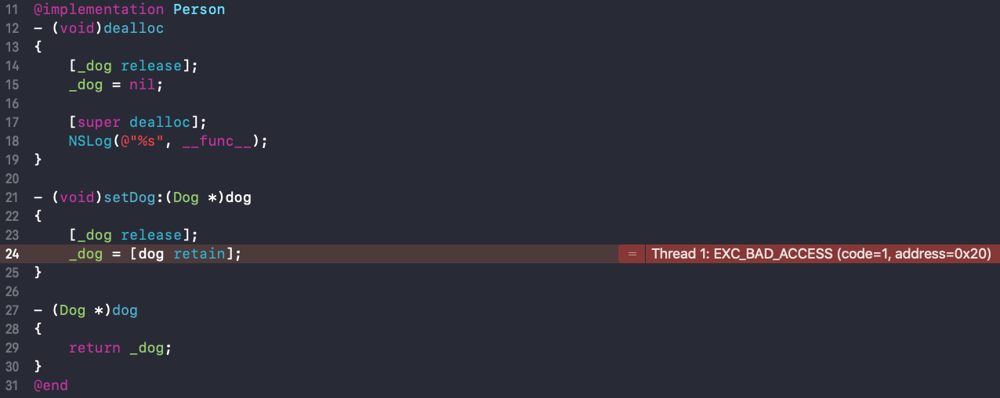

问题出在 Person 类的 set 方法：  
第一次赋值，dog 对象的引用计数加一，此时 dog 对象的引用计数等于2。  
dog 对象调用了一次 release 方法，此时 dog 对象的引用计数等于1。  
第二次赋值，会先调用 `[_dog release]`, 此时 dog 对象的引用计数等于0，dog 对象被释放。再调用 `_dog = [dog retain]`，此时 dog 指向的内存已经被销毁了：
```
- (void)setDog:(Dog *)dog
{
    [_dog release]; // dog : 0
    _dog = [dog retain]; // dog 指向的内存已经被销毁
}
```

因此，在 set 方法里对 `_dog` 处理前，需要先判断一下 `_dog` 是否等于传入的 dog 对象。因为一个 person 对象在拥有一个 dog 对象时只需要对其 retain 一次，所以如果 `_dog == dog` 就不做处理。

优化 Person 类里的 set 方法：
```
@implementation Person
- (void)dealloc
{
    self.dog = nil;
    
    [super dealloc];
    NSLog(@"%s", __func__);
}

- (void)setDog:(Dog *)dog
{
    if (_dog != dog) {
        [_dog release];
        _dog = [dog retain];
    }
}

- (Dog *)dog
{
    return _dog;
}
@end
```

打印结果：
```
-[Dog dealloc]
-[Person dealloc]
111
222
```

## property 属性

在 .h 文件通过 property 声明的属性，编译器会自动生成成员变量和属性的 setter、getter 实现。

## 基本数据类型
```
@interface Person : NSObject
@property (nonatomic, assign) int age;
@end
```

编译器自动生成：
```
@implementation Person

@synthesize age = _age;

- (void)setAge:(int)age
{
    _age = age;
}

- (int)age
{
    return _age;
}
@end
```

## 对象类型
```
@interface Person : NSObject
@property (nonatomic, retain) Dog *dog;
@end
```

编译器自动生成：
```
@implementation Person

@synthesize dog = _dog;

- (void)setDog:(Dog *)dog
{
    if (_dog != dog) {
        [_dog release];
        _dog = [dog retain];
    }
}

- (Dog *)dog
{
    return _dog;
}
@end
```

如果是在 MRC 环境下，这种情况下还需要在 delloc 方法里手动调用 _dog 的 release 方法：
```
@implementation Person
- (void)dealloc
{
    self.dog = nil;
    
    [super dealloc];
    NSLog(@"%s", __func__);
}
@end
```

## 常用代码解析

创建一个 iOS 项目，设置 MRC 环境。

```
@interface ViewController ()
@property (nonatomic, retain) NSMutableArray *data;
@end

@implementation ViewController

- (void)viewDidLoad {
    [super viewDidLoad];
    
    NSMutableArray *data = [[NSMutableArray alloc] init];
    self.data = data;
    [data release];
}

- (void)dealloc
{
    self.data = nil;
    
    [super dealloc];
}
@end
```

简化：
```
- (void)viewDidLoad {
    [super viewDidLoad];
    
    self.data = [[NSMutableArray alloc] init];
    [self.data release];
}
```

`autorelease`：
```
- (void)viewDidLoad {
    [super viewDidLoad];
    
    self.data = [[[NSMutableArray alloc] init] autorelease];
}
```

`+array`：
```
- (void)viewDidLoad {
    [super viewDidLoad];
    
    self.data = [NSMutableArray array];
}
```

不是通过 `alloc` 方法初始化的，而是通过类方法初始化的，在类方法内部已经调用过 `autorelease` 了。类方法 `+array` 大概是这样：
```
@implementation NSMutableArray
+ (instancetype)array
{
    return [[[NSMutableArray alloc] init] autorelease];
}
@end
```

## 工厂方法
```
@interface Person : NSObject
+ (instancetype)person;
@end

@implementation Person
+ (instancetype)person
{
    return [[[Person alloc] init] autorelease];
}

- (void)dealloc
{
    [super dealloc];
    NSLog(@"%s", __func__);
}
@end

int main(int argc, const char * argv[]) {
    @autoreleasepool {
        
        Person *person = [Person person];
        NSLog(@"111");
    }
    NSLog(@"222");
    return 0;
}
```

打印结果：
```
111
-[Person dealloc]
222
```

# copy和mutableCopy

* 拷贝的目的：产生一个副本对象，跟原对象互不影响  
  修改了原对象，不会影响副本对象  
  修改了副本对象，不会影响原对象  

* iOS 提供了两个拷贝方法  
  1、copy，不可变拷贝，产生不可变副本  
  2、mutableCopy，可变拷贝，产生可变副本  

## 拷贝
### NSString
```
int main(int argc, const char * argv[]) {
    @autoreleasepool {
        NSString *str1 = [NSString stringWithFormat:@"test"];
        NSString *str2 = [str1 copy]; // 返回的是 NSString
        NSMutableString *str3 = [str1 mutableCopy]; // 返回的是 NSMutableString

        NSLog(@"%@ %@ %@", str1, str2, str3);
        NSLog(@"%d %d %d",
              [str1 isKindOfClass:[NSMutableString class]],
              [str2 isKindOfClass:[NSMutableString class]],
              [str3 isKindOfClass:[NSMutableString class]]);
    }
    return 0;
}
```

打印结果：
```
test test test
0 0 1
```

str1、str2 和 str3 打印出来都是 test，但是 str1 和 str2 是不可变字符串，str3 是可变字符串。即：  
[不可变 copy] -> 不可变  
[不可变 mutableCopy] -> 可变  

### NSMutableString
```
int main(int argc, const char * argv[]) {
    @autoreleasepool {
        NSMutableString *str1 = [NSMutableString stringWithFormat:@"test"];
        NSString *str2 = [str1 copy];
        NSMutableString *str3 = [str1 mutableCopy];
        
        NSLog(@"%@ %@ %@", str1, str2, str3);
        NSLog(@"%d %d %d",
              [str1 isKindOfClass:[NSMutableString class]],
              [str2 isKindOfClass:[NSMutableString class]],
              [str3 isKindOfClass:[NSMutableString class]]);
    }
    return 0;
}
```

打印结果：
```
test test test
1 0 1
```

不管是可变字符串还是不可变字符串，调用 `copy` 返回的都是不可变字符串，调用 `mutableCopy` 返回的都是可变字符串。

### 内存管理
在 MRC 环境下，调用 alloc、new、copy、mutableCopy 方法返回了一个对象，在不需要这个对象时，要调用 release 或者 autorelease 来释放它。

```
int main(int argc, const char * argv[]) {
    @autoreleasepool {
        NSString *str1 = [[NSString alloc] initWithString:@"test"];
        NSString *str2 = [str1 copy];
        NSMutableString *str3 = [str1 mutableCopy];

        [str1 release];
        [str2 release];
        [str3 release];
    }
    return 0;
}
```

## 深拷贝和浅拷贝

* 深拷贝：内容拷贝，产生新的对象
* 浅拷贝：指针拷贝，没有产生新的对象

### NSString
```
int main(int argc, const char * argv[]) {
    @autoreleasepool {
        NSString *str1 = [[NSString alloc] initWithFormat:@"test"];
        NSString *str2 = [str1 copy]; // 浅拷贝：指针拷贝，没有产生新对象
        NSMutableString *str3 = [str1 mutableCopy]; // 深拷贝：内容拷贝，又产生新对象
        
        NSLog(@"%@ %@ %@", str1, str2, str3);
        NSLog(@"%p %p %p", str1, str2, str3);
        
        [str1 release];
        [str2 release];
        [str3 release];
    }
    return 0;
}
```

打印结果：
```
test test test
0x100001018 0x100001018 0x1007bb4e0
```

str1、str2 和 str3 打印出来都是 test，但是 str1 和 str2 指向的是同一个内存地址，str3 指向的是另一个内存地址。即 str1 通过 `copy` 方法拷贝出来的副本 str2 还是原对象（str1），而 str1 通过 `mutableCopy` 方法拷贝出来的副本 str3 是一个新的对象。
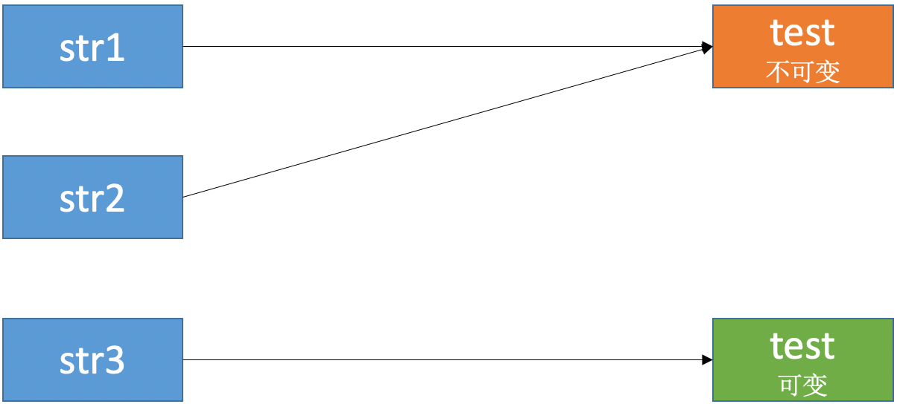

👉 拷贝的目的：产生一个副本对象，跟原对象互不影响。  
str1 是一个不可变字符串对象，通过 `copy` 方法拷贝出来的副本也是不可变字符串对象。因为不可变字符串对象不可以被修改，不可以被修改就不会互相影响，所以 str1 和 str2 指向同一个对象满足拷贝的原则（互不影响）。而且将 str1 和 str2 指向同一个对象还节省了内存。  
str1 是一个不可变字符串对象，通过 `mutableCopy` 方法拷贝出来的副本是可变字符串对象。因为可变字符串对象可以被修改，所以 str3 指向的是一个新的对象，保证在修改 str3 时不会影响到 str1。  

（总的来看，既要保证互不影响，也要做到节省资源）

```
int main(int argc, const char * argv[]) {
    @autoreleasepool {
        NSString *str1 = [[NSString alloc] initWithString:@"test"];
        NSString *str2 = [[NSString alloc] initWithString:@"test"];
        NSString *str3 = [str2 copy];
        NSString *str4 = @"test";
        NSMutableString *str5 = [str1 mutableCopy];
        
        NSLog(@"%@ %@ %@ %@ %@ %@", @"test", str1, str2, str3, str4, str5);
        NSLog(@"%p %p %p %p %p %p", @"test", str1, str2, str3, str4, str5);
        
        [str1 release];
        [str2 release];
        [str3 release];
    }
    return 0;
}
```

打印结果：
```
test test test test test test
0x100002040 0x100002040 0x100002040 0x100002040 0x100002040 0x1006bd980
```

str1、str2、str3 和 str4 都是 `@"test"` 对象。

引用计数：
```
int main(int argc, const char * argv[]) {
    @autoreleasepool {
        NSString *str1 = [[NSString alloc] initWithFormat:@"test111111111"]; // str1 : 1
        NSString *str2 = [str1 copy]; // str1 : 2
        NSMutableString *str3 = [str1 mutableCopy];
        
        NSLog(@"%zd", str1.retainCount);
        
        [str1 release];
        [str2 release];
        [str3 release];
    }
    return 0;
}
```

打印结果：
```
2
```

从打印结果可以看到，str1 在调用 `copy` 方法后，引用计数加1，相当于调用了一次 `retain` 方法。
```
int main(int argc, const char * argv[]) {
    @autoreleasepool {
        NSString *str1 = [[NSString alloc] initWithFormat:@"test111111111"];
        NSString *str2 = [[NSString alloc] initWithFormat:@"test"];
        NSString *str3 = [[NSString alloc] initWithString:@"test"];
        
        NSLog(@"%@ %@ %@", [str1 class], [str2 class], [str3 class]);
        NSLog(@"%zd %zd %zd", str1.retainCount, str2.retainCount, str3.retainCount);
        
        [str1 release];
        [str2 release];
        [str3 release];
    }
    return 0;
}
```

打印结果：
```
__NSCFString NSTaggedPointerString __NSCFConstantString
1 -1 -1
```

使用 `initWithFormat:` 方法初始化字符串，字符串长度足够长，创建出来的是 `__NSCFString` 类型的字符串。`__NSCFString` 类型的字符串是通过引用计数管理内存的。  
使用 `initWithFormat:` 方法初始化字符串，字符串长度不够长，创建出来的是 `NSTaggedPointerString` 类型的字符串。`NSTaggedPointerString` 类型的字符串不是通过引用计数管理内存的。  
使用 `initWithString:` 方法初始化字符串，不管字符串长度，创建出来的是 `__NSCFConstantString` 类型的字符串。`__NSCFConstantString` 类型的字符串不是通过引用计数管理内存的。

ps：
```
int main(int argc, const char * argv[]) {
    @autoreleasepool {
        NSString *str1 = @"test";
        NSString *str1_1 = @"test";
        
        NSString *str2 = [[NSString alloc] initWithString:@"test"];
        NSString *str2_1 = [[NSString alloc] initWithString:@"test"];
        
        NSString *str3 = [NSString stringWithString:@"test"];
        NSString *str3_1 = [NSString stringWithString:@"test"];
        
        NSString *str4 = [[NSString alloc] initWithFormat:@"test"];
        NSString *str4_1 = [[NSString alloc] initWithFormat:@"test"];
        
        NSString *str5 = [NSString stringWithFormat:@"test"];
        NSString *str5_1 = [NSString stringWithFormat:@"test"];
        
        NSLog(@"%p", str1);
        NSLog(@"%p", str1_1);
        NSLog(@"------------------");
        NSLog(@"%p", str2);
        NSLog(@"%p", str2_1);
        NSLog(@"------------------");
        NSLog(@"%p", str3);
        NSLog(@"%p", str3_1);
        NSLog(@"------------------");
        NSLog(@"%p", str4);
        NSLog(@"%p", str4_1);
        NSLog(@"------------------");
        NSLog(@"%p", str5);
        NSLog(@"%p", str5_1);
        
        [str1 release];
        [str1_1 release];
        [str2 release];
        [str2_1 release];
        [str3 release];
        [str3_1 release];
        [str4 release];
        [str4_1 release];
        [str5 release];
        [str5_1 release];
    }
    return 0;
}
```

打印结果：
```
0x100002040
0x100002040
------------------
0x100002040
0x100002040
------------------
0x100002040
0x100002040
------------------
0x1f9d08801e47ec0b
0x1f9d08801e47ec0b
------------------
0x1f9d08801e47ec0b
0x1f9d08801e47ec0b
```

通过 [GNUStep](http://www.gnustep.org/resources/downloads.php) 查看源码：  
以 Format 结尾的方法最终调用的都是这个方法：
```
- (id)initWithFormat:(NSString*)format locale:(NSDictionary*)locale arguments:(va_list)argList;
```

以 String 结尾的方法最终调用的都是这个方法：
```
- (id)initWithString:(NSString*)string;
```

### NSMutableString
```
int main(int argc, const char * argv[]) {
    @autoreleasepool {
        NSMutableString *str1 = [[NSMutableString alloc] initWithString:@"test"];
        NSString *str2 = [str1 copy]; // 深拷贝
        NSMutableString *str3 = [str1 mutableCopy]; // 深拷贝
        
        NSLog(@"%@ %@ %@", str1, str2, str3);
        NSLog(@"%p %p %p", str1, str2, str3);
        
        [str1 release];
        [str2 release];
        [str3 release];
    }
    return 0;
}
```

打印结果：
```
test test test
0x103aaab50 0x48301b1a78a3a9e5 0x103aab150
```

str1、str2 和 str3 打印出来都是 test，但是他们指向的都是不同的内存地址。即 str1 通过 `copy` 和 `mutableCopy` 方法拷贝出来的副本 str2 和 str3 都是一个新的对象。
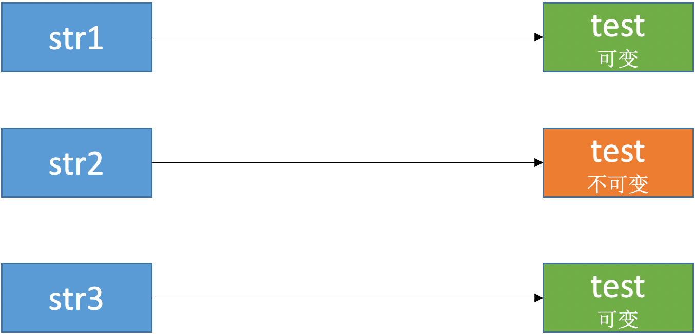

### NSArray
```
int main(int argc, const char * argv[]) {
    @autoreleasepool {
        NSArray *arr1 = [[NSArray alloc] initWithArray:@[@"1", @"2"]];
        NSArray *arr2 = [arr1 copy]; // 浅拷贝
        NSMutableArray *arr3 = [arr1 mutableCopy]; // 深拷贝
        
        NSLog(@"%@ %@ %@", arr1, arr2, arr3);
        NSLog(@"%p %p %p", arr1, arr2, arr3);
        NSLog(@"%d %d %d",
              [arr1 isKindOfClass:[NSMutableArray class]],
              [arr2 isKindOfClass:[NSMutableArray class]],
              [arr3 isKindOfClass:[NSMutableArray class]]);
    }
    return 0;
}
```

打印结果：
```
(
    1,
    2
) (
    1,
    2
) (
    1,
    2
)
0x1004bfc20 0x1004bfc20 0x1004c0100
0 0 1
```

arr1 和 arr2 是不可变数组，arr3 是可变数组。即：  
[不可变 copy] -> 不可变  
[不可变 mutableCopy] -> 可变  

arr1、arr2 和 arr3 打印出来都是同样的内容，但是 arr1 和 arr2 指向的是同一个内存地址，arr3 指向的是另一个内存地址。即 arr1 通过 `copy` 方法拷贝出来的副本 arr2 还是原对象（arr1），而 arr1 通过 `mutableCopy` 方法拷贝出来的副本 arr3 是一个新的对象。

```
int main(int argc, const char * argv[]) {
    @autoreleasepool {
        NSArray *arr1 = [[NSArray alloc] initWithArray:@[@"1", @"2"]];
        NSArray *arr2 = [arr1 copy]; // 浅拷贝
        NSMutableArray *arr3 = [arr1 mutableCopy]; // 深拷贝
        NSLog(@"%p %p %p %p", @[@"1", @"2"], arr1, arr2, arr3);
    }
    return 0;
}
```

打印结果：
```
0x100713270 0x100712d60 0x100712d60 0x100713240
```

NSArray 和 NSString 不同，`@[@"1", @"2"]`、arr1 和 arr2 虽然内容相同，但是它们是不同的对象（arr1 和 arr2 是同一个对象）。

### NSMutableArray
```
int main(int argc, const char * argv[]) {
    @autoreleasepool {
        NSMutableArray *arr1 = [[NSMutableArray alloc] initWithArray:@[@"1", @"2"]];
        NSArray *arr2 = [arr1 copy]; // 深拷贝
        NSMutableArray *arr3 = [arr1 mutableCopy]; // 深拷贝
        
        NSLog(@"%@ %@ %@", arr1, arr2, arr3);
        NSLog(@"%p %p %p", arr1, arr2, arr3);
        NSLog(@"%d %d %d",
              [arr1 isKindOfClass:[NSMutableArray class]],
              [arr2 isKindOfClass:[NSMutableArray class]],
              [arr3 isKindOfClass:[NSMutableArray class]]);
    }
    return 0;
}
```

打印结果：
```
(
    1,
    2
) (
    1,
    2
) (
    1,
    2
)
0x100535780 0x1005358f0 0x100535910
1 0 1
```

arr1 和 arr3 是可变数组，arr2 是不可变数组。即：  
[可变 copy] -> 不可变  
[可变 mutableCopy] -> 可变  

arr1、arr2 和 arr3 打印出来都是同样的内容，但是他们指向的都是不同的内存地址。即 arr1 通过 `copy` 和 `mutableCopy` 方法拷贝出来的副本 arr2 和 arr3 都是一个新的对象。


### NSDictionary
```
int main(int argc, const char * argv[]) {
    @autoreleasepool {
        NSDictionary *dict1 = [NSDictionary dictionaryWithObjectsAndKeys:@"value", @"key", nil];
        NSDictionary *dict2 = [dict1 copy]; // 浅拷贝
        NSMutableDictionary *dict3 = [dict1 mutableCopy]; // 深拷贝
        
        NSLog(@"%@ %@ %@", dict1, dict2, dict3);
        NSLog(@"%p %p %p", dict1, dict2, dict3);
    }
    return 0;
}
```

打印结果：
```
{
    key = value;
} {
    key = value;
} {
    key = value;
}
0x100491ff0 0x100491ff0 0x1004923f0
```

dict1 和 dict2 是不可变字典，dict3 是可变字典。即：  
[不可变 copy] -> 不可变  
[不可变 mutableCopy] -> 可变  

dict1、dict2 和 dict3 打印出来都是同样的内容，但是 dict1 和 dict2 指向的是同一个内存地址，dict3 指向的是另一个内存地址。即 dict1 通过 `copy` 方法拷贝出来的副本 dict2 还是原对象（dict1），而 dict1 通过 `mutableCopy` 方法拷贝出来的副本 dict3 是一个新的对象。

### NSMutableDictionary
```
int main(int argc, const char * argv[]) {
    @autoreleasepool {
        NSMutableDictionary *dict1 = [NSMutableDictionary dictionaryWithObjectsAndKeys:@"value", @"key", nil];
        NSDictionary *dict2 = [dict1 copy]; // 深拷贝
        NSMutableDictionary *dict3 = [dict1 mutableCopy]; // 深拷贝
        
        NSLog(@"%@ %@ %@", dict1, dict2, dict3);
        NSLog(@"%p %p %p", dict1, dict2, dict3);
    }
    return 0;
}
```

打印结果：
```
{
    key = value;
} {
    key = value;
} {
    key = value;
}
0x100463300 0x100463900 0x100463920
```

dict1 和 dict3 是可变字典，dict2 是不可变字典。即：  
[可变 copy] -> 不可变  
[可变 mutableCopy] -> 可变  

dict1、dict2 和 dict3 打印出来都是同样的内容，但是他们指向的都是不同的内存地址。即 dict1 通过 `copy` 和 `mutableCopy` 方法拷贝出来的副本 dict2 和 dict3 都是一个新的对象。

### 小结

|  | copy | mutableCopy |
| :-- | :-- | :-- |
| NSString | NSString<br><font color=#FF0000> 浅拷贝 </font> | NSMutableString<br>深拷贝 |
| NSMutableString | NSString<br>深拷贝| NSMutableString<br>深拷贝 |
| NSArray | NSArray<br><font color=#FF0000> 浅拷贝 </font>| NSMutableArray<br>深拷贝 |
| NSMutableArray | NSArray<br>深拷贝| NSMutableArray<br>深拷贝 |
| NSDictionary | NSDictionary<br><font color=#FF0000> 浅拷贝 </font>| NSMutableDictionary<br>深拷贝 |
| NSMutableDictionary | NSDictionary<br>深拷贝| NSDictionary<br>深拷贝 |


## copy策略的property

定义 Person
```
@interface Person : NSObject
@property (nonatomic, copy) NSMutableArray *data;
@end

@implementation Person
@end

int main(int argc, const char * argv[]) {
    @autoreleasepool {
        Person *person = [[Person alloc] init];
        person.data = [NSMutableArray array];
        [person.data addObject:@"123"];
    }
    return 0;
}
```

报错：
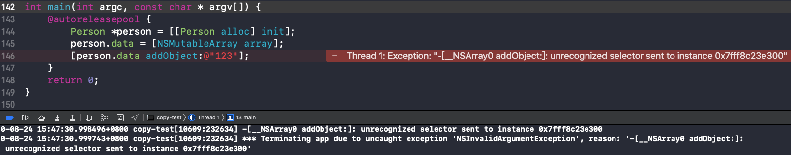

`data` 是 Person 用 `copy` 策略定义的 `NSMutableArray`，`data` 的 set 方法是：
```
@implementation Person
- (void)setData:(NSMutableArray *)data
{
    if (_data != data) {
        [_data release];
        _data = [data copy];
    }
}
@end
```

在 `person.data = [NSMutableArray array]` 赋值的这一刻，虽然传入的是一个 `NSMutableArray`，但是因为是 `copy` 策略，所以在赋值时需要进行 `copy` 操作 `_data = [data copy]`，所以 `_data` 是一个 `NSArray` 类型的不可变数组。

对于可变类型的变量，在声明时使用 `strong` 策略。  
对于不可变类型的变量，在声明时使用 `copy` 策略。

比如 `UITextField` 里的 text、attributedText 和 placeholder 等，都是使用的 copy 策略，保证不管传入的是可变类型还是不可变类型，`UITextField` 内部使用的都是不可变类型：
```
@interface UITextField : UIControl <UITextInput, NSCoding, UIContentSizeCategoryAdjusting>

@property(nullable, nonatomic,copy)   NSString               *text;                 // default is nil
@property(nullable, nonatomic,copy)   NSAttributedString     *attributedText API_AVAILABLE(ios(6.0)); // default is nil
......
@property(nullable, nonatomic,copy)   NSString               *placeholder;          // default is nil. string is drawn 70% gray
@property(nullable, nonatomic,copy)   NSAttributedString     *attributedPlaceholder API_AVAILABLE(ios(6.0)); // default is nil
```

## copyWithZone:

对象类型进行 `copy` 操作，首先要遵守 `<NSCopying>` 协议，然后实现 `- (id)copyWithZone:(struct _NSZone *)zone` 方法：
```
@interface Person : NSObject <NSCopying>
@property (nonatomic, assign) int age;
@property (nonatomic, assign) int weight;
@end

@implementation Person
- (id)copyWithZone:(struct _NSZone *)zone
{
    Person *person = [Person allocWithZone:zone];
    // 设置需要拷贝的属性
    person.age = self.age;
    person.weight = self.weight;
    return person;
}

- (NSString *)description
{
    return [NSString stringWithFormat:@"age = %d, weight = %d", self.age, self.weight];
}
@end

int main(int argc, const char * argv[]) {
    @autoreleasepool {
        Person *person = [[Person alloc] init];
        person.age = 10;
        person.weight = 20;
        
        Person *person2 = [person copy];
        NSLog(@"{%@} {%@}", person, person2);
    }
    return 0;
}
```

打印结果：
```
{age = 10, weight = 20} {age = 10, weight = 20}
```

# 引用计数的存储
在 64bit 中，引用计数可以直接存储在优化过的 isa 指针中，也可能存储在 SideTable 类中。
```
struct SideTable {
    spinlock_t slock;
    RefcountMap refcnts; // 一个存放着对象引用计数的散列表
    weak_table_t weak_table; // 弱引用表
    ......
};
```

在 objc-weak.h 文件查看 `weak_table_t` 定义：
```
struct weak_table_t {
    weak_entry_t *weak_entries; // 数组地址（首元素地址）
    size_t    num_entries; // 数组的数量
    uintptr_t mask; // 数组下标最大值（weak_table_t的size-1）
    uintptr_t max_hash_displacement; // 最大hash偏移量
};
```

## retainCount
在 [objc4-781](https://opensource.apple.com/tarballs/objc4/) 的 NSObject.mm 文件中查看 `retainCount`：  
```
- (NSUInteger)retainCount {
    return _objc_rootRetainCount(self);
}

......

uintptr_t
_objc_rootRetainCount(id obj)
{
    ASSERT(obj);

    return obj->rootRetainCount();
}
```

在 objc-object.h 文件中查看 `rootRetainCount()` 方法：
```
inline uintptr_t 
objc_object::rootRetainCount()
{
    if (isTaggedPointer()) return (uintptr_t)this;

    sidetable_lock();
    isa_t bits = LoadExclusive(&isa.bits);
    ClearExclusive(&isa.bits);
    if (bits.nonpointer) { // 非指针类型（优化过的isa指针）
        uintptr_t rc = 1 + bits.extra_rc;
        if (bits.has_sidetable_rc) { // 引用计数不是存储在isa中，而是存储在sidetable中
            rc += sidetable_getExtraRC_nolock();
        }
        sidetable_unlock();
        return rc;
    }

    sidetable_unlock();
    return sidetable_retainCount();
}
```

在 NSObject.mm 文件中查看 `sidetable_getExtraRC_nolock()` 方法：
```
size_t 
objc_object::sidetable_getExtraRC_nolock()
{
    ASSERT(isa.nonpointer);
    SideTable& table = SideTables()[this];
    RefcountMap::iterator it = table.refcnts.find(this); //取出对象对应的散列表
    if (it == table.refcnts.end()) return 0;
    else return it->second >> SIDE_TABLE_RC_SHIFT;
}
```

`has_sidetable_rc`：引用计数器是否过大无法存储在 isa 中，如果为1，那么引用计数会存储在一个叫 SideTable 的类的属性中。
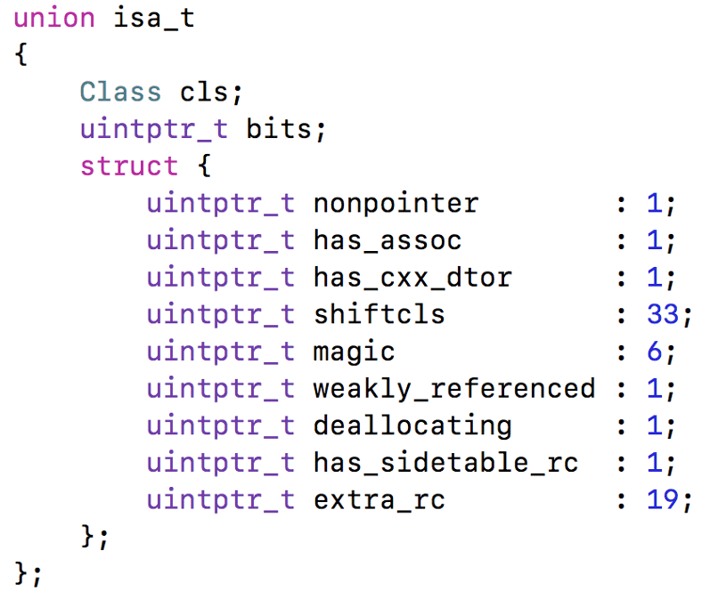

## release
```
- (oneway void)release {
    _objc_rootRelease(self);
}

......

NEVER_INLINE void
_objc_rootRelease(id obj)
{
    ASSERT(obj);

    obj->rootRelease();
}
```

在 objc-object.h 文件中查看 `rootRelease()` 方法：
```
ALWAYS_INLINE bool 
objc_object::rootRelease(bool performDealloc, bool handleUnderflow)
{
    if (isTaggedPointer()) return false;

    bool sideTableLocked = false;

    isa_t oldisa;
    isa_t newisa;

 retry:
    do {
        oldisa = LoadExclusive(&isa.bits);
        newisa = oldisa;
        if (slowpath(!newisa.nonpointer)) {
            // 不是优化过的isa指针
            ClearExclusive(&isa.bits);
            if (rawISA()->isMetaClass()) return false;
            if (sideTableLocked) sidetable_unlock();
            return sidetable_release(performDealloc);
        }
        // don't check newisa.fast_rr; we already called any RR overrides
        uintptr_t carry;
        newisa.bits = subc(newisa.bits, RC_ONE, 0, &carry);  // extra_rc--
        // 相减后下溢出
        if (slowpath(carry)) {
            // don't ClearExclusive()
            goto underflow;
        }
    } while (slowpath(!StoreReleaseExclusive(&isa.bits, 
                                             oldisa.bits, newisa.bits)));

    if (slowpath(sideTableLocked)) sidetable_unlock();
    return false;

 underflow:
    // newisa.extra_rc-- underflowed: borrow from side table or deallocate

    // abandon newisa to undo the decrement
    newisa = oldisa;

    // 引用计数不是存储在isa中，而是存储在sidetable中 
    if (slowpath(newisa.has_sidetable_rc)) {
        if (!handleUnderflow) {
            ClearExclusive(&isa.bits);
            // 再执行 rootRelease 一次，处理下溢出
            return rootRelease_underflow(performDealloc);
        }

        // Transfer retain count from side table to inline storage.

        if (!sideTableLocked) {
            ClearExclusive(&isa.bits);
            sidetable_lock();
            sideTableLocked = true;
            // Need to start over to avoid a race against 
            // the nonpointer -> raw pointer transition.
            goto retry;
        }

        // 下面是从 sideTable 借 RC_HALF 的引用计数放到 extra_rc 上, 借不到的情况，对象需要被销毁了
        // Try to remove some retain counts from the side table.        
        size_t borrowed = sidetable_subExtraRC_nolock(RC_HALF);

        // To avoid races, has_sidetable_rc must remain set 
        // even if the side table count is now zero.

        if (borrowed > 0) {
            // Side table retain count decreased.
            // Try to add them to the inline count.
            newisa.extra_rc = borrowed - 1;  // redo the original decrement too
            bool stored = StoreReleaseExclusive(&isa.bits, 
                                                oldisa.bits, newisa.bits);
            if (!stored) {
                // Inline update failed. 
                // Try it again right now. This prevents livelock on LL/SC 
                // architectures where the side table access itself may have 
                // dropped the reservation.
                isa_t oldisa2 = LoadExclusive(&isa.bits);
                isa_t newisa2 = oldisa2;
                if (newisa2.nonpointer) {
                    uintptr_t overflow;
                    newisa2.bits = 
                        addc(newisa2.bits, RC_ONE * (borrowed-1), 0, &overflow);
                    if (!overflow) {
                        stored = StoreReleaseExclusive(&isa.bits, oldisa2.bits, 
                                                       newisa2.bits);
                    }
                }
            }

            if (!stored) {
                // Inline update failed.
                // Put the retains back in the side table.
                sidetable_addExtraRC_nolock(borrowed);
                goto retry;
            }

            // Decrement successful after borrowing from side table.
            // This decrement cannot be the deallocating decrement - the side 
            // table lock and has_sidetable_rc bit ensure that if everyone 
            // else tried to -release while we worked, the last one would block.
            sidetable_unlock();
            return false;
        }
        else {
            // Side table is empty after all. Fall-through to the dealloc path.
        }
    }

    // Really deallocate.

    if (slowpath(newisa.deallocating)) {
        ClearExclusive(&isa.bits);
        if (sideTableLocked) sidetable_unlock();
        return overrelease_error();
        // does not actually return
    }
    newisa.deallocating = true;
    if (!StoreExclusive(&isa.bits, oldisa.bits, newisa.bits)) goto retry;

    if (slowpath(sideTableLocked)) sidetable_unlock();

    __c11_atomic_thread_fence(__ATOMIC_ACQUIRE);

    if (performDealloc) {
        ((void(*)(objc_object *, SEL))objc_msgSend)(this, @selector(dealloc));
    }
    return true;
}
```

在 NSObject.mm 文件中查看 `sidetable_release()` 方法：
```
#define SIDE_TABLE_RC_ONE            (1UL<<2)  // MSB-ward of deallocating bit

......

uintptr_t
objc_object::sidetable_release(bool performDealloc)
{
#if SUPPORT_NONPOINTER_ISA
    ASSERT(!isa.nonpointer);
#endif
    SideTable& table = SideTables()[this];

    bool do_dealloc = false;
    
    //----- 对引用计数减操作 -----
    table.lock();
    auto it = table.refcnts.try_emplace(this, SIDE_TABLE_DEALLOCATING);
    auto &refcnt = it.first->second;
    if (it.second) {
        do_dealloc = true;
    } else if (refcnt < SIDE_TABLE_DEALLOCATING) {
        // SIDE_TABLE_WEAKLY_REFERENCED may be set. Don't change it.
        do_dealloc = true;
        refcnt |= SIDE_TABLE_DEALLOCATING;
    } else if (! (refcnt & SIDE_TABLE_RC_PINNED)) {
        refcnt -= SIDE_TABLE_RC_ONE;
    }
    table.unlock();
    //----- 对引用计数减操作 end -----

    // 是否要执行 dealloc
    if (do_dealloc  &&  performDealloc) {
        ((void(*)(objc_object *, SEL))objc_msgSend)(this, @selector(dealloc));
    }
    return do_dealloc;
}
```

## retain()
在 objc-object.h 文件中查看 `retain()` 方法：
```
inline id 
objc_object::retain()
{
    ASSERT(!isTaggedPointer());

    if (fastpath(!ISA()->hasCustomRR())) {
        return sidetable_retain();
    }

    return ((id(*)(objc_object *, SEL))objc_msgSend)(this, @selector(retain));
}
```

在 NSObject.mm 文件中查看 `sidetable_retain()` 方法：
```
id
objc_object::sidetable_retain()
{
#if SUPPORT_NONPOINTER_ISA
    ASSERT(!isa.nonpointer);
#endif
    SideTable& table = SideTables()[this];
    
    //----- 对引用计数加操作 -----
    table.lock();
    size_t& refcntStorage = table.refcnts[this];
    if (! (refcntStorage & SIDE_TABLE_RC_PINNED)) {
        refcntStorage += SIDE_TABLE_RC_ONE;
    }
    table.unlock();
    //----- 对引用计数加操作 end -----

    return (id)this;
}
```

# weak指针的原理

## 局部变量的内存管理
创建局部变量 person：
```
@implementation ViewController
- (void)viewDidLoad {
    [super viewDidLoad];
    NSLog(@"111");
    {
        Person *person = [[Person alloc] init];
    }
    NSLog(@"222");
}
@end
```

打印结果：
```
111
-[Person dealloc]
222
```

### \_\_strong
使用 `__strong` 修饰的局部变量 person：
```
@implementation ViewController
- (void)viewDidLoad {
    [super viewDidLoad];
    __strong Person *strongPerson;
    NSLog(@"111");
    {
        Person *person = [[Person alloc] init];
        strongPerson = person;
    }
    NSLog(@"222");
    NSLog(@"%@", strongPerson);
}
@end
```

打印结果：
```
111
222
<Person: 0x60000177c310>
-[Person dealloc]
```

### \_\_weak 
使用 `__weak` 修饰的局部变量 person：
```
@implementation ViewController
- (void)viewDidLoad {
    [super viewDidLoad];
    __weak Person *weakPerson;
    NSLog(@"111");
    {
        Person *person = [[Person alloc] init];
        weakPerson = person;
    }
    NSLog(@"222");
    NSLog(@"%@", weakPerson);
}
@end
```

打印结果：
```
111
-[Person dealloc]
222
(null)
```

`weakPerson` 指针指向的内存地址被销毁后，`weakPerson` 指针会自动置为 nil。

### \_\_unsafe_unretained
使用 `__unsafe_unretained` 修饰的局部变量 person：
```
@implementation ViewController
- (void)viewDidLoad {
    [super viewDidLoad];
    __unsafe_unretained Person *unsafePerson;
    NSLog(@"111");
    {
        Person *person = [[Person alloc] init];
        unsafePerson = person;
    }
    NSLog(@"222");
}
@end
```

报错：


报错的原因是指针 `unsafePerson` 还在，但是它指向的内存地址已经不存在了。这也是跟 `weakPerson` 指针相比不同也是不够安全的地方。

## dealloc

[objc4-781](https://opensource.apple.com/tarballs/objc4/) 查看源码：  

NSObject.mm 文件：
```
- (void)dealloc {
    _objc_rootDealloc(self);
}

......

void
_objc_rootDealloc(id obj)
{
    ASSERT(obj);

    obj->rootDealloc();
}
```

在 objc-object.h 文件查看 `rootDealloc()` 方法：
```
inline void
objc_object::rootDealloc()
{
    if (isTaggedPointer()) return;  // fixme necessary?

    if (fastpath(isa.nonpointer  &&  
                 !isa.weakly_referenced  &&  
                 !isa.has_assoc  &&  
                 !isa.has_cxx_dtor  &&  
                 !isa.has_sidetable_rc))
    {
        assert(!sidetable_present());
        free(this);
    } 
    else {
        object_dispose((id)this);
    }
}
```

* nonpointer  
0，代表普通的指针，isa 只存储着 Class、Meta-Class 对象的内存地址  
1，代表优化过，isa 使用位域存储更多的信息
* has_assoc  
是否有设置过关联对象，如果没有，释放时会更快
* has_cxx_dtor  
是否有 C++ 的析构函数（.cxx_destruct），如果没有，释放时会更快
* weakly_referenced  
是否有被弱引用指向过，如果没有，释放时会更快
* has_sidetable_rc  
引用计数器是否过大无法存储在 isa 中，如果为1，那么引用计数会存储在一个叫 SideTable 的类的属性中

如果条件不成立会走到 objc-runtime-new.mm 文件的 `object_dispose()` 方法：
```
id 
object_dispose(id obj)
{
    if (!obj) return nil;

    objc_destructInstance(obj);    
    free(obj);

    return nil;
}

......

void *objc_destructInstance(id obj) 
{
    if (obj) {
        // Read all of the flags at once for performance.
        bool cxx = obj->hasCxxDtor();
        bool assoc = obj->hasAssociatedObjects();

        // This order is important.
        if (cxx) object_cxxDestruct(obj); // 清除成员变量
        if (assoc) _object_remove_assocations(obj); // 移除关联对象
        obj->clearDeallocating(); // 将指向当前对象的弱指针置为nil
    }

    return obj;
}
```

在 objc-object.h 文件查看 `clearDeallocating()` 方法：
```
inline void 
objc_object::clearDeallocating()
{
    if (slowpath(!isa.nonpointer)) { // 是否是普通的isa指针
        // Slow path for raw pointer isa.
        sidetable_clearDeallocating();
    }
    else if (slowpath(isa.weakly_referenced  ||  isa.has_sidetable_rc)) { // 是否有被弱引用指向过 || // 是否是优化过的isa指针
        // Slow path for non-pointer isa with weak refs and/or side table data.
        clearDeallocating_slow();
    }

    assert(!sidetable_present());
}
```

在 NSObject.mm 文件 查看 `clearDeallocating_slow()` 方法：
```
NEVER_INLINE void
objc_object::clearDeallocating_slow()
{
    ASSERT(isa.nonpointer  &&  (isa.weakly_referenced || isa.has_sidetable_rc));

    SideTable& table = SideTables()[this];
    table.lock();
    if (isa.weakly_referenced) {
        weak_clear_no_lock(&table.weak_table, (id)this); // 清除弱应用
    }
    if (isa.has_sidetable_rc) {
        table.refcnts.erase(this); // 清空引用计数
    }
    table.unlock();
}
```

在 objc-weak.mm 文件查看 `weak_clear_no_lock()` 方法：
```
void 
weak_clear_no_lock(weak_table_t *weak_table, id referent_id) 
{
    // 获取当前对象
    objc_object *referent = (objc_object *)referent_id;

    weak_entry_t *entry = weak_entry_for_referent(weak_table, referent); // 传入弱引用表和当前对象的地址值，找到对应的弱引用数组
    if (entry == nil) {
        return; // 如果没有表示当前对象没有弱引用，不用处理直接返回
    }

    // zero out references
    weak_referrer_t *referrers;
    size_t count;
    
    if (entry->out_of_line()) {
        referrers = entry->referrers;
        count = TABLE_SIZE(entry);
    } 
    else {
        referrers = entry->inline_referrers;
        count = WEAK_INLINE_COUNT;
    }
    
    for (size_t i = 0; i < count; ++i) {
        objc_object **referrer = referrers[i];
        if (referrer) {
            if (*referrer == referent) {
                *referrer = nil;
            }
            else if (*referrer) {
                _objc_inform("__weak variable at %p holds %p instead of %p. "
                             "This is probably incorrect use of "
                             "objc_storeWeak() and objc_loadWeak(). "
                             "Break on objc_weak_error to debug.\n", 
                             referrer, (void*)*referrer, (void*)referent);
                objc_weak_error();
            }
        }
    }
    
    weak_entry_remove(weak_table, entry);
}

......

static weak_entry_t *
weak_entry_for_referent(weak_table_t *weak_table, objc_object *referent)
{
    ASSERT(referent);

    weak_entry_t *weak_entries = weak_table->weak_entries; // 在weak_table中取出weak_entry_t数组

    if (!weak_entries) return nil;

    size_t begin = hash_pointer(referent) & weak_table->mask; // 通过hash实例对象的地址 & weak_table->mask得到begin(没有hash冲突的index)，因为是 & mask(2的n次方-1，类似00001111)，所以保证了begin在mask范围内(<=mask)
    size_t index = begin;
    size_t hash_displacement = 0;
    while (weak_table->weak_entries[index].referent != referent) { // while循环检测hash冲突，如果有冲突,index+1，hash_displacement++（hash冲突偏移量）
        index = (index+1) & weak_table->mask;
        if (index == begin) bad_weak_table(weak_table->weak_entries);
        hash_displacement++;
        if (hash_displacement > weak_table->max_hash_displacement) {
            return nil;
        }
    }
    
    return &weak_table->weak_entries[index];
}
```

# 自动释放池
自动释放池的主要底层数据结构是：`__AtAutoreleasePool`、`AutoreleasePoolPage`，调用了 `autorelease` 的对象最终都是通过 `AutoreleasePoolPage` 对象来管理的。

## \_\_AtAutoreleasePool

堆代码：
```
int main(int argc, const char * argv[]) {
    @autoreleasepool {
        Person *person = [[[Person alloc] init] autorelease];
    }
    return 0;
}
```

找到 main.m 所在文件，在终端输入：
```
$ xcrun -sdk iphoneos clang -arch arm64  -rewrite-objc main.m
```

上面的代码转成 C++ 代码后就是这个样子：
```
int main(int argc, const char * argv[]) {
    {
        __AtAutoreleasePool __autoreleasepool; 
        Person *person = ((Person *(*)(id, SEL))(void *)objc_msgSend)((id)((Person *(*)(id, SEL))(void *)objc_msgSend)((id)((Person *(*)(id, SEL))(void *)objc_msgSend)((id)objc_getClass("Person"), sel_registerName("alloc")), sel_registerName("init")), sel_registerName("autorelease"));
    }
    return 0;
}
```

简化一下：
```
int main(int argc, const char * argv[]) {
    {
        __AtAutoreleasePool __autoreleasepool; 
        Person *person = [[[Person alloc] init] autorelease];
    }
    return 0;
}
```

在生成的 main.mm 文件中搜索 `__AtAutoreleasePool`，`__AtAutoreleasePool` 是一个 C++ 结构体：
```
struct __AtAutoreleasePool {
    // 构造函数，在创建结构体的时候调用
    __AtAutoreleasePool() {
        atautoreleasepoolobj = objc_autoreleasePoolPush();
    }
    // 析构函数，在结构体销毁的时候调用
    ~__AtAutoreleasePool() {
        objc_autoreleasePoolPop(atautoreleasepoolobj);
    }
    void * atautoreleasepoolobj;
};
```

认识了 `__AtAutoreleasePool` 结构体后，通过 clang 生成的 C++ 代码可以看做：
```
int main(int argc, const char * argv[]) {
    atautoreleasepoolobj = objc_autoreleasePoolPush();
 
    MJPerson *person = [[[MJPerson alloc] init] autorelease];
 
    objc_autoreleasePoolPop(atautoreleasepoolobj);
    return 0;
}
```

通过上面的摸索，`@autoreleasepool {}` 的第一个大括号其实是调用了 `objc_autoreleasePoolPush()` 方法，第二个大括号是调用 `objc_autoreleasePoolPop()` 方法，`objc_autoreleasePoolPop()` 方法的参数是 `objc_autoreleasePoolPush()` 方法生成的 `atautoreleasepoolobj`。

如果有多个 `@autoreleasepool {}` 嵌套的话就是这样：
```
int main(int argc, const char * argv[]) {
    @autoreleasepool { // objc_autoreleasePoolPush()
        
        @autoreleasepool { // objc_autoreleasePoolPush()
            
            @autoreleasepool { // objc_autoreleasePoolPush()
               
                Person *person = [[[Person alloc] init] autorelease];
            
            } // objc_autoreleasePoolPop()
        
        } // objc_autoreleasePoolPop()
    
    } // objc_autoreleasePoolPop()
    return 0;
}
```

查看 `objc_autoreleasePoolPush()` 源码：
```
void *
objc_autoreleasePoolPush(void)
{
    return AutoreleasePoolPage::push();
}
```

查看 `objc_autoreleasePoolPop()` 源码：
```
NEVER_INLINE
void
objc_autoreleasePoolPop(void *ctxt)
{
    AutoreleasePoolPage::pop(ctxt);
}
```

从源码可以看到，`objc_autoreleasePoolPush()` 和 `objc_autoreleasePoolPop()` 方法内部都是通过 `AutoreleasePoolPage` 实现的。

## AutoreleasePoolPage

### 定义
在 [objc4-781](https://opensource.apple.com/tarballs/objc4/) 的 NSObject-internal.h 文件可以看到 AutoreleasePoolPage 的定义：
```
class AutoreleasePoolPage;
struct AutoreleasePoolPageData
{
	magic_t const magic; // 用于校验内存是否损坏
	__unsafe_unretained id *next; // 指向了下一个能存放autorelease对象地址的区域
	pthread_t const thread; // 线程
	AutoreleasePoolPage * const parent; // 前驱结点，指向前一个page
	AutoreleasePoolPage *child; // 后继结点，指向下一个page
	uint32_t const depth;
	uint32_t hiwat;

	AutoreleasePoolPageData(__unsafe_unretained id* _next, pthread_t _thread, AutoreleasePoolPage* _parent, uint32_t _depth, uint32_t _hiwat)
		: magic(), next(_next), thread(_thread),
		  parent(_parent), child(nil),
		  depth(_depth), hiwat(_hiwat)
	{
	}
};

class AutoreleasePoolPage : private AutoreleasePoolPageData
{
    ......
}
```

`AutoreleasePoolPage` 结构体的 thread 存储的是其对应的线程，也表示一个 `AutoreleasePoolPage` 对应一个线程。

### 结构
每个 `AutoreleasePoolPage` 对象占用4096字节内存，除了用来存放它内部的成员变量，剩下的空间用来存放 `autorelease` 对象的地址，所有的 `AutoreleasePoolPage` 对象通过双向链表的形式连接在一起。

假设 `AutoreleasePoolPage` 对象的内存地址从 `0x1000` 开始：
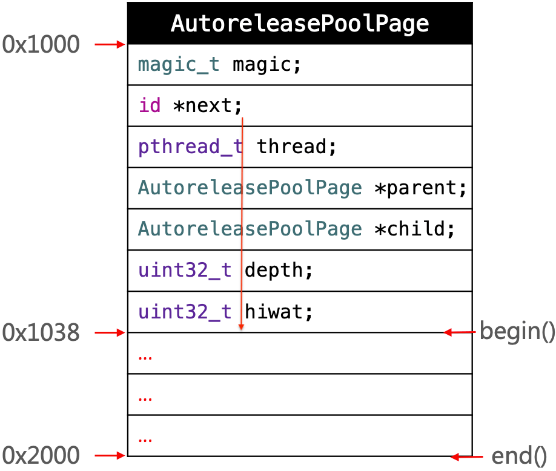
从 `0x1000` 到 `0x2000` 共4096个字节（`0x1000`）。  
从 `0x1000` 到 `0x1038` 共56个字节（`0x38`），即 `AutoreleasePoolPage` 结构体内部的成员变量大小之和。  
从 `0x1038` 到 `0x2000` 共4040个字节，分别是 `begain()` 和 `end()` 方法调用的位置，这段内存用来保存调用了 `autorelease` 方法的对象的地址值。  

查看 `begain()` 方法源码：
```
id * begin() {
    return (id *) ((uint8_t *)this+sizeof(*this));
}
```

可以看到 `begain()` 方法内部直接返回的是 `AutoreleasePoolPage` 内存地址开始位置加上其自身占用内存大小（`0x1000` + `0x38` = `0x1038`）。

查看 `end()` 方法源码：
```
id * end() {
    return (id *) ((uint8_t *)this+SIZE);
}
```

可以看到 `end()` 方法内部直接返回的是 `AutoreleasePoolPage` 内存地址开始位置加上 `SIZE`：
```
#define I386_PGBYTES            4096            /* bytes per 80386 page */
#define PAGE_SIZE               I386_PGBYTES
#define PAGE_MAX_SIZE           PAGE_SIZE

static size_t const SIZE =
#if PROTECT_AUTORELEASEPOOL
		PAGE_MAX_SIZE;  // must be multiple of vm page size
#else
		PAGE_MIN_SIZE;  // size and alignment, power of 2
#endif
```

一个 `AutoreleasePoolPage` 结构体能够存放的 `autorelease` 对象的地址是有限的，如果超出存储最大值，会新创建一个 `AutoreleasePoolPage` 结构体用来存储剩下的部分。多个 `AutoreleasePoolPage` 结构体通过机构体中的 child 指向下一个 `AutoreleasePoolPage` 结构体，通过 parent 指向上一个 `AutoreleasePoolPage` 结构体，构成双向链表结构：
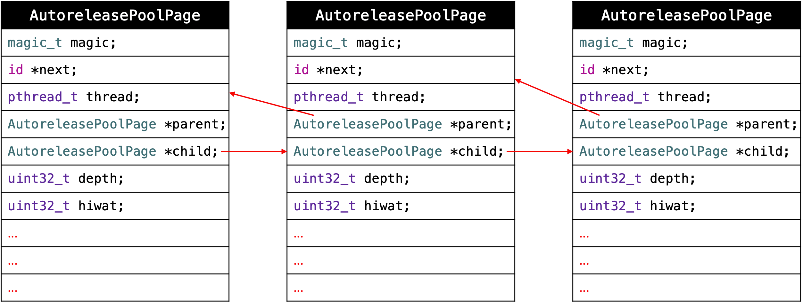

* 👉 双向链表也叫双链表，是链表的一种，它的每个数据结点中都有两个指针，分别指向直接后继和直接前驱。所以，从双向链表中的任意一个结点开始，都可以很方便地访问它的前驱结点和后继结点。
* 👉 循环链表是另一种形式的链式存贮结构。它的特点是表中最后一个结点的指针域指向头结点，整个链表形成一个环。

### 原理
调用 `push` 方法会将一个 `POOL_BOUNDARY` 入栈，并且返回其存放的内存地址。  
调用 `pop` 方法时传入一个 `POOL_BOUNDARY` 的内存地址，会从最后一个入栈的对象开始发送 `release` 消息，直到遇到这个 `POOL_BOUNDARY`。  
`id *next` 指向了下一个能存放 `autorelease` 对象地址的区域。    

比如在 `@autoreleasepool {}` 内创建1000个 person 对象调用 `autorelease`。
```
int main(int argc, const char * argv[]) {
    @autoreleasepool {
        for (int i=0; i<1000; i++) {
            Person *person = [[[Person alloc] init] autorelease];
        }
    }
    return 0;
}
```

一个 person 对象的指针占8个字节，1000个 person 对象就是8000个字节。一个 `AutoreleasePoolPage` 对象可以保存4040个字节，所以会再创建一个 `AutoreleasePoolPage` 对象用来保存剩下的 person 对象的地址值。

将 `@autoreleasepool {}` 转成 `__AtAutoreleasePool`：
```
int main(int argc, const char * argv[]) {
    atautoreleasepoolobj = objc_autoreleasePoolPush(); // atautoreleasepoolobj = 0x1038
    
    for (int i=0; i<1000; i++) {
        Person *person = [[[Person alloc] init] autorelease];
    } // 8000个字节

    objc_autoreleasePoolPop(atautoreleasepoolobj); // atautoreleasepoolobj = 0x1038
    return 0;
}
```

`objc_autoreleasePoolPush()` 会调用 `AutoreleasePoolPage` 对象的 `push()` 方法，将一个 `POOL_BOUNDARY` 入栈，并且返回其存放的内存地址（`0x1038`）：
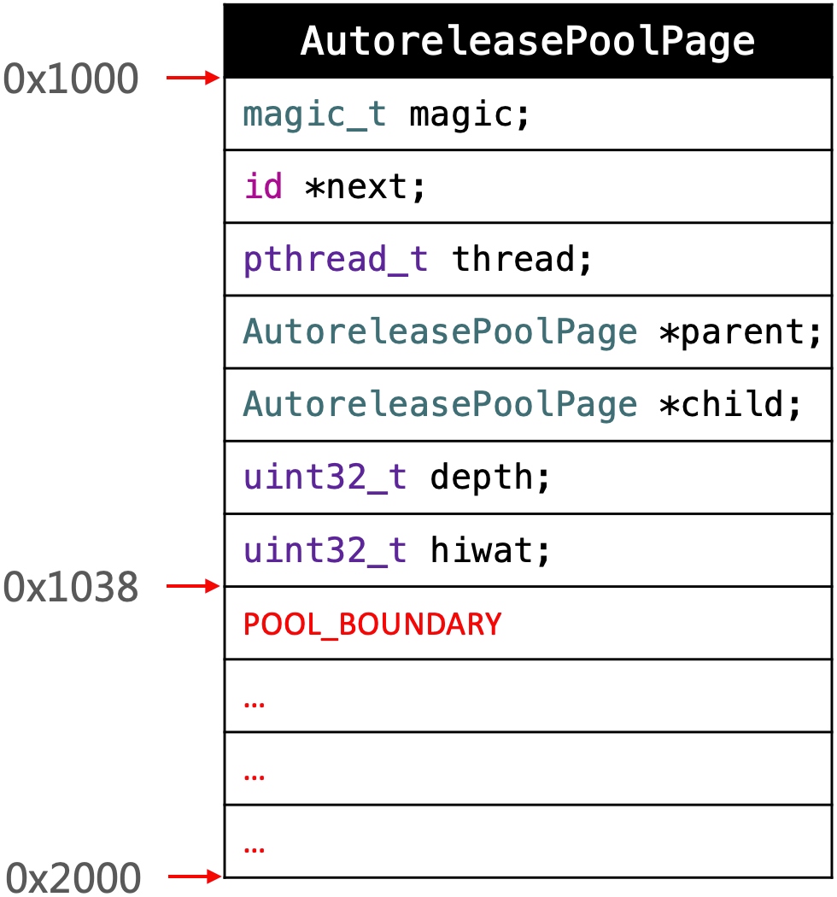

每个调用 `autorelease` 方法的 person 对象都会添加到 `AutoreleasePoolPage` 对象中：
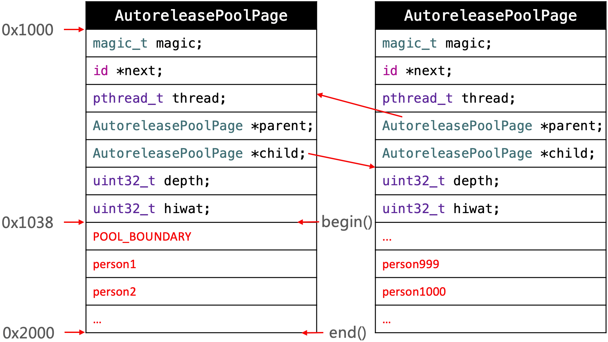
正如上面提到的一样，一个 `AutoreleasePoolPage` 对象可以保存4040个字节，所以会创建一个新的 `AutoreleasePoolPage` 对象用来保存剩下的 person 对象的地址值。

`objc_autoreleasePoolPop(atautoreleasepoolobj)` 方法传入的 `atautoreleasepoolobj` 是 `objc_autoreleasePoolPush()` 方法返回的 `POOL_BOUNDARY` 的地址值（`0x1038`），即 `objc_autoreleasePoolPop(POOL_BOUNDARY)`。拿到 `POOL_BOUNDARY` 后，`objc_autoreleasePoolPop()` 方法内部会从最后一个加入到 `AutoreleasePoolPage` 里的对象开始，依次调用 `release` 方法，直到 `POOL_BOUNDARY` 完成释放工作。

在整个过程中，`next` 指向 page 中下一个将要存放的对象的地址, 通过 `*next++ = obj` 来实现对象的存入并 `next` 指针的累加, 用 `id obj = *--page->next` 来取出要 `release` 的对象并实现 `next` 的递减。

### 验证
可以通过以下私有函数来查看自动释放池的情况：
```
extern void _objc_autoreleasePoolPrint(void);
```

`_objc_autoreleasePoolPrint()` 方法是定义在 Runtime 里的，所以是不开源的。但是可以通过 `extern` 关键字在 main.m 文件中声明，编译器就会自动去找到这个方法，从而实现调用。
```
extern void _objc_autoreleasePoolPrint(void);

int main(int argc, const char * argv[]) {
    @autoreleasepool {

        _objc_autoreleasePoolPrint(); // 位置0

        Person *person1 = [[[Person alloc] init] autorelease];
        Person *person2 = [[[Person alloc] init] autorelease];
        
        //_objc_autoreleasePoolPrint(); // 位置1

        @autoreleasepool {
            Person *person3 = [[[Person alloc] init] autorelease];
            Person *person4 = [[[Person alloc] init] autorelease];

            //_objc_autoreleasePoolPrint(); // 位置2

            @autoreleasepool {
                Person *person5 = [[[Person alloc] init] autorelease];
                Person *person6 = [[[Person alloc] init] autorelease];

                //_objc_autoreleasePoolPrint(); // 位置3
            }

            //_objc_autoreleasePoolPrint(); // 位置4
        }

        //_objc_autoreleasePoolPrint(); // 位置5
    }

    //_objc_autoreleasePoolPrint(); // 位置6
    return 0;
}
```

位置0，打印结果：
```
objc[13812]: ##############
objc[13812]: AUTORELEASE POOLS for thread 0x1000d3dc0
objc[13812]: 0 releases pending.
objc[13812]: [0x1]  ................  PAGE (placeholder)
objc[13812]: [0x1]  ################  POOL (placeholder)
objc[13812]: ##############
Program ended with exit code: 0
```

位置1，打印结果：
```
objc[13633]: ##############
objc[13633]: AUTORELEASE POOLS for thread 0x1000d3dc0
objc[13633]: 3 releases pending.
objc[13633]: [0x10400a000]  ................  PAGE  (hot) (cold)
objc[13633]: [0x10400a038]  ################  POOL 0x10400a038
objc[13633]: [0x10400a040]       0x10293c6e0  Person
objc[13633]: [0x10400a048]       0x10293b7a0  Person
objc[13633]: ##############
Program ended with exit code: 0
```

位置2，打印结果：
```
objc[13658]: ##############
objc[13658]: AUTORELEASE POOLS for thread 0x1000d3dc0
objc[13658]: 6 releases pending.
objc[13658]: [0x10400a000]  ................  PAGE  (hot) (cold)
objc[13658]: [0x10400a038]  ################  POOL 0x10400a038
objc[13658]: [0x10400a040]       0x102974880  Person
objc[13658]: [0x10400a048]       0x102973940  Person
objc[13658]: [0x10400a050]  ################  POOL 0x10400a050
objc[13658]: [0x10400a058]       0x1029722e0  Person
objc[13658]: [0x10400a060]       0x102973800  Person
objc[13658]: ##############
Program ended with exit code: 0
```

位置3，打印结果：
```
objc[13677]: ##############
objc[13677]: AUTORELEASE POOLS for thread 0x1000d3dc0
objc[13677]: 9 releases pending.
objc[13677]: [0x10280d000]  ................  PAGE  (hot) (cold)
objc[13677]: [0x10280d038]  ################  POOL 0x10280d038
objc[13677]: [0x10280d040]       0x1006addd0  Person
objc[13677]: [0x10280d048]       0x1006ace90  Person
objc[13677]: [0x10280d050]  ################  POOL 0x10280d050
objc[13677]: [0x10280d058]       0x1006ab830  Person
objc[13677]: [0x10280d060]       0x1006acd50  Person
objc[13677]: [0x10280d068]  ################  POOL 0x10280d068
objc[13677]: [0x10280d070]       0x1006aba20  Person
objc[13677]: [0x10280d078]       0x1006ab4f0  Person
objc[13677]: ##############
Program ended with exit code: 0
```

位置4，打印结果：
```
objc[13703]: ##############
objc[13703]: AUTORELEASE POOLS for thread 0x1000d3dc0
objc[13703]: 6 releases pending.
objc[13703]: [0x10080d000]  ................  PAGE  (hot) (cold)
objc[13703]: [0x10080d038]  ################  POOL 0x10080d038
objc[13703]: [0x10080d040]       0x100437c20  Person
objc[13703]: [0x10080d048]       0x100436ce0  Person
objc[13703]: [0x10080d050]  ################  POOL 0x10080d050
objc[13703]: [0x10080d058]       0x100435680  Person
objc[13703]: [0x10080d060]       0x100436ba0  Person
objc[13703]: ##############
Program ended with exit code: 0
```

位置5，打印结果：
```
objc[13735]: ##############
objc[13735]: AUTORELEASE POOLS for thread 0x1000d3dc0
objc[13735]: 3 releases pending.
objc[13735]: [0x10480a000]  ................  PAGE  (hot) (cold)
objc[13735]: [0x10480a038]  ################  POOL 0x10480a038
objc[13735]: [0x10480a040]       0x10322c4d0  Person
objc[13735]: [0x10480a048]       0x10322b590  Person
objc[13735]: ##############
Program ended with exit code: 0
```

位置6，打印结果：
```
objc[13751]: ##############
objc[13751]: AUTORELEASE POOLS for thread 0x1000d3dc0
objc[13751]: 0 releases pending.
objc[13751]: [0x10300d000]  ................  PAGE  (hot) (cold)
objc[13751]: ##############
Program ended with exit code: 0
```

打印结果中的 `POOL` 代表的就是 `POOL_BOUNDARY`，person 代表的就是调用 `autorelease` 方法的对象。`releases pending` 表示当前自动释放池里的对象个数。 

多个 `AutoreleasePoolPage` 对象的情况：
```
extern void _objc_autoreleasePoolPrint(void);

int main(int argc, const char * argv[]) {
    @autoreleasepool {
        Person *person1 = [[[Person alloc] init] autorelease];
        Person *person2 = [[[Person alloc] init] autorelease];

        @autoreleasepool {
            for (int i=0; i<600; i++) {
                Person *person3 = [[[Person alloc] init] autorelease];
            }

            @autoreleasepool {
                Person *person5 = [[[Person alloc] init] autorelease];
                Person *person6 = [[[Person alloc] init] autorelease];

                _objc_autoreleasePoolPrint();
            }
        }
    }
    return 0;
}
```

打印结果：
```
objc[13947]: ##############
objc[13947]: AUTORELEASE POOLS for thread 0x1000d3dc0
objc[13947]: 607 releases pending.
objc[13947]: [0x10280c000]  ................  PAGE (full)  (cold)
objc[13947]: [0x10280c038]  ################  POOL 0x10280c038
objc[13947]: [0x10280c040]       0x10067bc20  Person
objc[13947]: [0x10280c048]       0x10067a1d0  Person
objc[13947]: [0x10280c050]  ################  POOL 0x10280c050
objc[13947]: [0x10280c058]       0x100679d60  Person
objc[13947]: [0x10280c060]       0x100678e20  Person
objc[13947]: [0x10280c068]       0x1006777c0  Person
objc[13947]: [0x10280c070]       0x100678ce0  Person
...
objc[13947]: [0x10280cff8]       0x100681ba0  Person
objc[13947]: [0x10280a000]  ................  PAGE  (hot) 
objc[13947]: [0x10280a038]       0x100681bb0  Person
...
objc[13947]: [0x10280a348]       0x1006821d0  Person
objc[13947]: [0x10280a350]  ################  POOL 0x10280a350
objc[13947]: [0x10280a358]       0x1006821e0  Person
objc[13947]: [0x10280a360]       0x1006821f0  Person
```

从打印结果中可以看到，第一个 page 里有两个 `POOL_BOUNDARY`，由于对象太多超出了第一个 page 的存储范围，所以创建出了第二个 page。第二个 page 中存储了多出来的 person 对象，还有一个 `POOL_BOUNDARY`。  
`PAGE  (hot) ` 表示该 page 为当前页，`PAGE (full)  (cold)` 中的 full 表示这一页已经满了，cold 表示该 page 不是当前页。

### 源码分析

`objc_autoreleasePoolPush()` 方法的实现原理是调用 `AutoreleasePoolPage` 对象的 `push()` 方法。  
`objc_autoreleasePoolPop()` 方法的实现原理是调用 `AutoreleasePoolPage` 对象的 `pop()` 方法。  
`autorelease` 方法的实现原理则是调用了 `AutoreleasePoolPage` 对象的 `autorelease()` 方法。

在 [objc4-781](https://opensource.apple.com/tarballs/objc4/) 中的 NSObject.mm 文件查看。

#### objc_autoreleasePoolPush(void)
```
void *
objc_autoreleasePoolPush(void)
{
    return AutoreleasePoolPage::push();
}
```

`push()` 方法：
```
static inline void *push() 
{
    id *dest;
    if (slowpath(DebugPoolAllocation)) {
        dest = autoreleaseNewPage(POOL_BOUNDARY); // 传入 POOL_BOUNDARY 来新建一个 AutoreleasePoolPage 对象
    } else {
        dest = autoreleaseFast(POOL_BOUNDARY); // AutoreleasePoolPage 对象已经存在就直接添加
    }
    ASSERT(dest == EMPTY_POOL_PLACEHOLDER || *dest == POOL_BOUNDARY);
    return dest;
}
```

如果 page 不存在就调用 `autoreleaseNewPage()` 方法传入 `POOL_BOUNDARY` 创建：
```
static __attribute__((noinline))
id *autoreleaseNewPage(id obj)
{
    AutoreleasePoolPage *page = hotPage(); // 获取当前 page
    if (page) return autoreleaseFullPage(obj, page);
    else return autoreleaseNoPage(obj);
}

static inline AutoreleasePoolPage *hotPage() 
{
    AutoreleasePoolPage *result = (AutoreleasePoolPage *)
        tls_get_direct(key);
    if ((id *)result == EMPTY_POOL_PLACEHOLDER) return nil;
    if (result) result->fastcheck();
    return result;
}

static __attribute__((noinline))
id *autoreleaseFullPage(id obj, AutoreleasePoolPage *page)
{
    // The hot page is full. 
    // Step to the next non-full page, adding a new page if necessary.
    // Then add the object to that page.
    ASSERT(page == hotPage());
    ASSERT(page->full()  ||  DebugPoolAllocation);

    do {
        if (page->child) page = page->child;
        else page = new AutoreleasePoolPage(page);
    } while (page->full());

    setHotPage(page);
    return page->add(obj); // 入栈 POOL_BOUNDARY
}
```

如果 `AutoreleasePoolPage` 对象已经存在就直接调用 `autoreleaseFast()` 方法添加 `POOL_BOUNDARY`：
```
static inline id *autoreleaseFast(id obj)
{
    AutoreleasePoolPage *page = hotPage();
    if (page && !page->full()) { // page 存在 && page 没有满
        return page->add(obj); // 添加 obj
    } else if (page) { // page 存在 && page 满了
        return autoreleaseFullPage(obj, page);
    } else { // page 不存在
        return autoreleaseNoPage(obj);
    }
}
```

#### - (id)autorelease
```
- (id)autorelease {
    return _objc_rootAutorelease(self);
}

NEVER_INLINE id
_objc_rootAutorelease(id obj)
{
    ASSERT(obj);
    return obj->rootAutorelease();
}

__attribute__((noinline,used))
id 
objc_object::rootAutorelease2()
{
    ASSERT(!isTaggedPointer());
    return AutoreleasePoolPage::autorelease((id)this); // 将当前对象 this 加入 page
}
```

`autorelease((id)this)` 方法：
```
static inline id autorelease(id obj)
{
    ASSERT(obj);
    ASSERT(!obj->isTaggedPointer());
    id *dest __unused = autoreleaseFast(obj); // 添加 obj
    ASSERT(!dest  ||  dest == EMPTY_POOL_PLACEHOLDER  ||  *dest == obj);
    return obj;
}
```

调用 `autoreleaseFast()` 方法添加 obj：
```
static inline id *autoreleaseFast(id obj)
{
    AutoreleasePoolPage *page = hotPage();
    if (page && !page->full()) { // page 存在 && page 没有满
        return page->add(obj); // 添加 obj
    } else if (page) { // page 存在 && page 满了
        return autoreleaseFullPage(obj, page);
    } else { // page 不存在
        return autoreleaseNoPage(obj);
    }
}
```

`autorelease` 方法最终是通过调用 `autoreleaseFast()` 方法，将调用了 `autorelease` 方法的对象保存到了 page 中。

#### objc_autoreleasePoolPop(void *ctxt)
```
NEVER_INLINE
void
objc_autoreleasePoolPop(void *ctxt)
{
    AutoreleasePoolPage::pop(ctxt);
}
```

`pop()` 方法：
```
static inline void
pop(void *token)
{
    AutoreleasePoolPage *page;
    id *stop;
    if (token == (void*)EMPTY_POOL_PLACEHOLDER) {
        page = hotPage(); // 从当前的 page 开始 pop
        if (!page) {
            // Pool was never used. Clear the placeholder.
            return setHotPage(nil);
        }
        // Pool was used. Pop its contents normally.
        // Pool pages remain allocated for re-use as usual.
        page = coldPage();
        token = page->begin();
    } else {
        page = pageForPointer(token);
    }

    stop = (id *)token;
    if (*stop != POOL_BOUNDARY) {
        if (stop == page->begin()  &&  !page->parent) {
            // Start of coldest page may correctly not be POOL_BOUNDARY:
            // 1. top-level pool is popped, leaving the cold page in place
            // 2. an object is autoreleased with no pool
        } else {
            // Error. For bincompat purposes this is not 
            // fatal in executables built with old SDKs.
            return badPop(token);
        }
    }

    if (slowpath(PrintPoolHiwat || DebugPoolAllocation || DebugMissingPools)) {
        return popPageDebug(token, page, stop);
    }

    return popPage<false>(token, page, stop); // 释放对象
}
```

`popPageDebug()` 方法：
```
__attribute__((noinline, cold))
static void
popPageDebug(void *token, AutoreleasePoolPage *page, id *stop)
{
    popPage<true>(token, page, stop);
}
```

`popPage()` 方法：
```
template<bool allowDebug>
static void
popPage(void *token, AutoreleasePoolPage *page, id *stop)
{
    if (allowDebug && PrintPoolHiwat) printHiwat();

    page->releaseUntil(stop); // 释放 page 里的所有对象，知道遇到 stop 才停止

    // memory: delete empty children
    if (allowDebug && DebugPoolAllocation  &&  page->empty()) {
        // special case: delete everything during page-per-pool debugging
        AutoreleasePoolPage *parent = page->parent;
        page->kill();
        setHotPage(parent);
    } else if (allowDebug && DebugMissingPools  &&  page->empty()  &&  !page->parent) {
        // special case: delete everything for pop(top)
        // when debugging missing autorelease pools
        page->kill();
        setHotPage(nil);
    } else if (page->child) {
        // hysteresis: keep one empty child if page is more than half full
        if (page->lessThanHalfFull()) {
            page->child->kill();
        }
        else if (page->child->child) {
            page->child->child->kill();
        }
    }
}
```

`releaseUntil()` 方法：
```
void releaseUntil(id *stop) 
{
    while (this->next != stop) {
        AutoreleasePoolPage *page = hotPage(); // 取出当前 page

        while (page->empty()) {
            page = page->parent;
            setHotPage(page);
        }

        page->unprotect();
        id obj = *--page->next; // 取出最后面的一个 obj
        memset((void*)page->next, SCRIBBLE, sizeof(*page->next));
        page->protect();

        if (obj != POOL_BOUNDARY) {
            objc_release(obj); // 调用obj的release方法
        }
    }

    setHotPage(this);
}
```

`pop()` 方法最终是通过调用 `releaseUntil()` 方法，将 page 里的对象依次调用 `objc_release(obj)` 方法释放掉了。

## autorelease 释放时机
创建一个 iOS 项目，选择 MRC 环境，修改 main.m 文件（当前XCode版本11.6）。
```
int main(int argc, char * argv[]) {
    NSString * appDelegateClassName;
    @autoreleasepool {
        appDelegateClassName = NSStringFromClass([AppDelegate class]);
        return UIApplicationMain(argc, argv, nil, appDelegateClassName);
    }
}
```

定义 Person 类，添加打印：
```
@implementation Person
- (void)dealloc
{
    NSLog(@"%s", __func__);
    [super dealloc];
}
@end

@implementation ViewController
- (void)viewDidLoad {
    [super viewDidLoad];
    Person *person = [[[Person alloc] init] autorelease];
    NSLog(@"%s", __func__);
}

- (void)viewWillAppear:(BOOL)animated
{
    [super viewWillAppear:animated];
    NSLog(@"%s", __func__);
}

- (void)viewDidAppear:(BOOL)animated
{
    [super viewDidAppear:animated];
    NSLog(@"%s", __func__);
}
@end
```

打印结果：
```
-[ViewController viewDidLoad]
-[ViewController viewWillAppear:]
-[Person dealloc]
-[ViewController viewDidAppear:]
```

从打印结果可以看到，person 对象是在 `viewWillAppear` 方法执行完成后被释放的。

### Runloop和Autorelease
iOS 在主线程的 Runloop 中注册了两个 Observer：  
第一个 Observer 监听了 `kCFRunLoopEntry` 事件，会调用 `objc_autoreleasePoolPush()`。  
第二个 Observer 监听了 `kCFRunLoopBeforeWaiting` 事件，会调用 `objc_autoreleasePoolPop()`、`objc_autoreleasePoolPush()`，监听了 `kCFRunLoopBeforeExit` 事件，会调用 `objc_autoreleasePoolPop()`。

打印当前的 RunLoop，查看 Observers：
```
@implementation ViewController
- (void)viewDidLoad {
    [super viewDidLoad];
    Person *person = [[[Person alloc] init] autorelease];
    NSLog(@"%s", __func__);
    
    NSLog(@"%@", [NSRunLoop currentRunLoop]);
}
@end
```

打印结果里有很多内容，这里是摘出来的跟 Autorelease 相关的两个 Observe：
```
observers = (
    "<CFRunLoopObserver 0x6000009fc1e0 [0x7fff8062d750]>{valid = Yes, activities = 0x1, repeats = Yes, order = -2147483647, callout = _wrapRunLoopWithAutoreleasePoolHandler (0x7fff4931eaa4), context = <CFArray 0x60000368ce70 [0x7fff8062d750]>{type = mutable-small, count = 1, values = (\n\t0 : <0x7fdaef00a048>\n)}}",

    "<CFRunLoopObserver 0x6000009fc280 [0x7fff8062d750]>{valid = Yes, activities = 0xa0, repeats = Yes, order = 2147483647, callout = _wrapRunLoopWithAutoreleasePoolHandler (0x7fff4931eaa4), context = <CFArray 0x60000368ce70 [0x7fff8062d750]>{type = mutable-small, count = 1, values = (\n\t0 : <0x7fdaef00a048>\n)}}"
),
```

`_wrapRunLoopWithAutoreleasePoolHandler` 是回调方法，在收到消息时用来处理 Autorelease 相关操作。

第一个 observe 的 `activities` 是 `0x1`，第二个 observe 的 `activities` 是 `0xa0`。

`activities` 对应的枚举：
```
typedef CF_OPTIONS(CFOptionFlags, CFRunLoopActivity) {
    kCFRunLoopEntry = (1UL << 0),          // 1（十进制）
    kCFRunLoopBeforeTimers = (1UL << 1),   // 2
    kCFRunLoopBeforeSources = (1UL << 2),  // 4
    kCFRunLoopBeforeWaiting = (1UL << 5),  // 32
    kCFRunLoopAfterWaiting = (1UL << 6),   // 64
    kCFRunLoopExit = (1UL << 7),           // 128
    kCFRunLoopAllActivities = 0x0FFFFFFFU
};
```

因为：  
`0x1`（十六进制）-> 1（十进制） 
`0xa0`（十六进制）-> 160（十进制）  
所以：    
```
0x1：kCFRunLoopEntry
0xa0：kCFRunLoopAfterWaiting | kCFRunLoopExit
```

所以第一个 observe 监听的状态就是 `kCFRunLoopEntry`，第二个 observe 监听的状态就是 `kCFRunLoopAfterWaiting` 和 `kCFRunLoopExit`。 

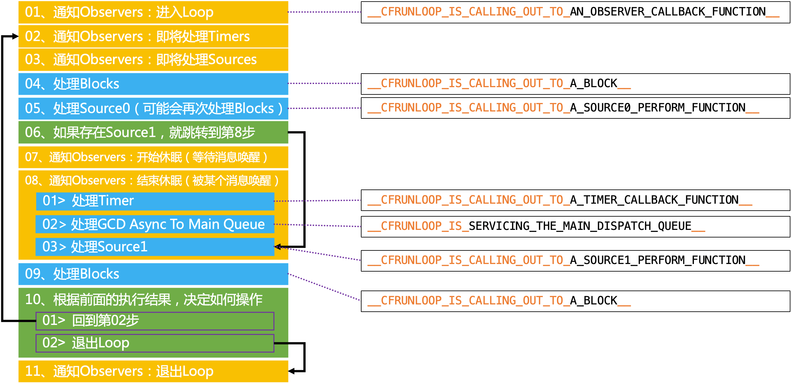
* 第一次循环：  
  01 状态是 `kCFRunLoopEntry`，RunLoop 会调用 `objc_autoreleasePoolPush()` 方法；  
  07 状态是 `kCFRunLoopAfterWaiting`，RunLoop 会先调用 `objc_autoreleasePoolPop()` 方法，然后调用 `objc_autoreleasePoolPush()` 方法； 
* 非第一次循环：
  10-1 回到 02 继续循环至 07；  
  07 状态是 `kCFRunLoopAfterWaiting`，RunLoop 会先调用 `objc_autoreleasePoolPop()` 方法，然后调用 `objc_autoreleasePoolPush()` 方法； 
  10-1 回到 02 继续循环至 07；  
* 结束循环：
  10-2 退出 RunLoop；  
  11 状态是 `kCFRunLoopExit`，RunLoop 会调用 `objc_autoreleasePoolPop()` 方法。

因为 02 会先调用 `objc_autoreleasePoolPop()` 方法，然后调用 `objc_autoreleasePoolPush()` 方法，所以 `push()` 和 `pop()` 实现了一一对应的关系。

在看打印结果：
```
-[ViewController viewDidLoad]
-[ViewController viewWillAppear:]
-[Person dealloc]
-[ViewController viewDidAppear:]
```

在 `viewWillAppear` 执行完成后，RunLoop 到了 02 的位置。此时 RunLoop 监听到了 `kCFRunLoopAfterWaiting` 状态，会先调用 `objc_autoreleasePoolPop()` 方法，然后调用 `objc_autoreleasePoolPush()` 方法。在调用 `objc_autoreleasePoolPop()` 方法时，Autorelease 中的 person 对象就被释放了。

另外，打印结果也说明了 `viewDidLoad` 和 `viewWillAppear` 方法是在同一个循环中执行的。

### ARC环境下的release
```
@implementation ViewController

- (void)viewDidLoad {
    [super viewDidLoad];
    Person *person = [[Person alloc] init];
    NSLog(@"%s", __func__);
}

- (void)viewWillAppear:(BOOL)animated
{
    [super viewWillAppear:animated];
    NSLog(@"%s", __func__);
}

- (void)viewDidAppear:(BOOL)animated
{
    [super viewDidAppear:animated];
    NSLog(@"%s", __func__);
}
@end
```

打印结果：
```
-[ViewController viewDidLoad]
-[Person dealloc]
-[ViewController viewWillAppear:]
-[ViewController viewDidAppear:]
```

从打印结果可以看到，person 对象在 `viewDidLoad` 方法执行完就释放了。所以在 ARC 环境下，在方法最后结束前，对方法内部的局部变量调用了 release 方法：
```
- (void)viewDidLoad {
    [super viewDidLoad];
    Person *person = [[Person alloc] init];
    NSLog(@"%s", __func__);
    
    // [person release];
}
```

# 总结
* 使用 CADisplayLink、NSTimer 有什么注意点？
  CADisplayLink 和 NSTimer 依赖于 RunLoop，如果 RunLoop 的任务过于繁重，可能会导致 CADisplayLink 和 NSTimer 不准时。  
  CADisplayLink 和 NSTimer 有可能会造成循环引用问题，CADisplayLink 可以通过使用代理对象（NSProxy）解决，NSTimer 除了可以通过使用代理对象（NSProxy）解决外，还可以使用带有 block 回调的初始化方法。  

* 介绍下内存的几大区域
  代码段：编译之后的代码  
  数据段：字符串常量、已初始化数据和未初始化数据  
  栈：函数调用开销，比如局部变量。（分配的内存空间地址越来越小）  
  堆：通过 alloc、malloc、calloc 等动态分配的空间，分配的内存空间地址越来越大

* 讲一下你对 iOS 内存管理的理解
  在 iOS 中，使用引用计数来管理 OC 对象的内存。  
  一个新创建的 OC 对象引用计数默认是1，当引用计数减为0，OC 对象就会销毁，释放其占用的内存空间。  
  调用 retain 会让 OC 对象的引用计数+1，调用 release 会让 OC 对象的引用计数-1。  
  内存管理的经验总结：  
  当调用 alloc、new、copy、mutableCopy 方法返回了一个对象，在不需要这个对象时，要调用 release 或者 autorelease 来释放它。  
  想拥有某个对象，就让它的引用计数+1；不想再拥有某个对象，就让它的引用计数-1。  

* ARC 都帮我们做了什么？(LLVM + Runtime)
  ARC 是 LLVM 编译器和 Runtime 协作协作实现的。ARC 利用 LLVM 编译器自动生成 release、retain 和 autorelease 等内存管理相关的代码，利用 Runtime 实现在运行时对弱引用的管理（添加和清除）。

* weak 指针的实现原理
  将弱引用存储在一个弱引用表（哈希表）里面，在对象要销毁时，就以对象的地址值 & mask 得到一个索引取出对应的弱引用表，并把弱引用表里存储的弱引用都清除掉。

* autorelease 对象在什么时机会被调用 release？  
  autorelease 对象在什么时候调用 release 是由 RunLoop 控制的，在 RunLoop 监听到 `kCFRunLoopAfterWaiting` 或 `kCFRunLoopExit` 状态时会调用 `objc_autoreleasePoolPop()` 方法，此时 autorelease 对象会调用 release。即在 RunLoop 进入休眠或者退出时调用 release。

* 方法里有局部对象， 出了方法后会立即释放吗?
  会。在方法结束前，runtime 会自动为方法内部的局部对象调用 release 方法进行释放。

相关阅读：  
[深入理解 Tagged Pointer](https://www.infoq.cn/article/deep-understanding-of-tagged-pointer/)


