思考：
* 你理解的多线程？
* iOS的多线程方案有哪几种？你更倾向于哪一种？
* 你在项目中用过 GCD 吗？
* GCD 的队列类型
* 说一下 OperationQueue 和 GCD 的区别，以及各自的优势
* 线程安全的处理手段有哪些？
* OC你了解的锁有哪些？在你回答基础上进行二次提问；  
追问一：自旋和互斥对比？  
追问二：使用以上锁需要注意哪些？  
追问三：用C/OC/C++，任选其一，实现自旋或互斥？
<!-- more -->
* 请问下面代码的打印结果是什么？
```
@implementation ViewController
- (void)viewDidLoad {
    [super viewDidLoad];
    
    dispatch_queue_t queue = dispatch_get_global_queue(0, 0);
    dispatch_async(queue, ^{
        NSLog(@"1");
        [self performSelector:@selector(test) withObject:nil afterDelay:.0];
        NSLog(@"3");
    });
}

- (void)test
{
    NSLog(@"2");
}
@end
```

* 请问下面代码的打印结果是什么？
```
@implementation ViewController
- (void)test
{
    NSLog(@"2");
}

- (void)touchesBegan:(NSSet<UITouch *> *)touches withEvent:(UIEvent *)event
{
    NSThread *thread = [[NSThread alloc] initWithBlock:^{
        NSLog(@"1");
    }];
    [thread start];
    
    [self performSelector:@selector(test) onThread:thread withObject:nil waitUntilDone:YES];
}
@end
```

# GCD

👉 [GCD源码](https://github.com/apple/swift-corelibs-libdispatch)

## iOS中的常见多线程方案

<!-- <style>
table th:nth-of-type(1){
    width: 20%;
}
table th:nth-of-type(2){
    width: 25%;
}
table th:nth-of-type(3){
    width: 20%;
}
table th:nth-of-type(4){
    width: 20%;
}
table th:nth-of-type(5){
    width: 15%;
}
</style> -->

| 技术方案 | 简介 | 语言 | 线程生命周期 | 使用频率 |
| :--: | :-------- | :--: | :--: | :--: |
| phread | 1.一套通用的多线程API；<br>2.适用于Unix\Linux\Windows等系统；<br>3.跨平台\可移植；<br>4.使用难度大；| C | 开发者管理 | 几乎不用 |
| NSThread | 1.使用更加面向对象；<br>2.简单易用，可直接操作线程对象； | OC | 开发者管理 | 偶尔使用 |
| GCD | 1.旨在替代NSThread等多线程技术； | C | 自动管理 | 经常使用 |
| NSOperation | 1.基于GCD（底层是GCD）；<br>2.比GCD多了一些更简单使用的功能；<br>3.使用更加面向对象； | OC | 自动管理 | 经常使用 |

phread 在实际开发中几乎不会用到，一般只会在加锁解锁的地方用到。另外，NSThead、GCD 和 NSOperation 底层都会用到 phread，比如创建线程等。NSThread 就是对 phread 的包装。

## GCD的常用函数

GCD 中有2个用来执行任务的函数：
* 用同步的方式执行任务（queue：队列；block：任务）  
```
dispatch_sync(dispatch_queue_t queue, dispatch_block_t block);
```

* 用异步的方式执行任务  
```
dispatch_async(dispatch_queue_t queue, dispatch_block_t block);
```

队列相关函数：
* 获取主队列
```
dispatch_queue_t queue = dispatch_get_main_queue();
```

* 获取全局并发队列
```
dispatch_queue_t queue = dispatch_get_global_queue(0, 0);
```

* 手动创建并发队列
```
dispatch_queue_t queue = dispatch_queue_create("myQueue", DISPATCH_QUEUE_CONCURRENT);
```

* 手动创建串行队列
```
dispatch_queue_t queue = dispatch_queue_create("mySerialQueue", DISPATCH_QUEUE_SERIAL);
```

* 手动创建队列组
```
dispatch_group_t group = dispatch_group_create();
```

## GCD的队列

GCD的队列可以分为2大类型
* 并发队列（Concurrent Dispatch Queue）  
可以让多个任务并发（同时）执行（自动开启多个线程同时执行任务）；  
并发功能只有在异步（dispatch_async）函数下才有效；

* 串行队列（Serial Dispatch Queue）  
让任务一个接着一个地执行（一个任务执行完毕后，再执行下一个任务）；

## 容易混淆的术语

有4个术语比较容易混淆：同步、异步、并发、串行
* 同步和异步主要影响：能不能开启新的线程  
同步：在当前线程中执行任务，不具备开启新线程的能力；  
异步：在新的线程中执行任务，具备开启新线程的能力；

* 并发和串行主要影响：任务的执行方式  
并发：多个任务并发（同时）执行；  
串行：一个任务执行完毕后，再执行下一个任务；

## 各种队列的执行效果

| &nbsp; | 并发队列 | 手动穿件的串行队列 | 主队列 |
| :--: | :--: | :--: | :--: |
| 同步（sync） | 没有开启新线程<br>串行执行任务 | 没有开启新线程<br>串行执行任务 | 没有开启新线程<br>串行执行任务 |
| 异步（async） | 有开启新线程<br>并发执行任务 | 有开启新线程<br>串行执行任务 | 没有开启新线程<br>串行执行任务 |

使用sync函数往当前串行队列中添加任务，会卡住当前的串行队列（产生死锁）。

主队列是一个特殊的串行队列，async 方法在主队列中添加任务不会开启新线程，并且是串行执行任务。

### 并发队列 & 异步执行（async）
```
- (void)viewDidLoad {
    [super viewDidLoad];
    
    NSLog(@"任务1 - %@", [NSThread currentThread]);
    
    /// 全局并发队列
    dispatch_queue_t queue = dispatch_get_global_queue(0, 0);
    /// 任务2
    dispatch_async(queue, ^{
        for (int i = 0; i < 5; i++) {
            NSLog(@"执行任务2 - %@", [NSThread currentThread]);
        }
    });
    /// 任务3
    dispatch_async(queue, ^{
        for (int i = 0; i < 5; i++) {
            NSLog(@"执行任务3 - %@", [NSThread currentThread]);
        }
    });

    NSLog(@"任务4 - %@", [NSThread currentThread]);
    /// 主线程睡1秒
    sleep(1);
    NSLog(@"任务5 - %@", [NSThread currentThread]);
}
```

打印结果：
```
任务1 - <NSThread: 0x600003595140>{number = 1, name = main}
任务4 - <NSThread: 0x600003595140>{number = 1, name = main}
执行任务2 - <NSThread: 0x600003588f00>{number = 4, name = (null)}
执行任务3 - <NSThread: 0x6000035c1ec0>{number = 3, name = (null)}
执行任务2 - <NSThread: 0x600003588f00>{number = 4, name = (null)}
执行任务3 - <NSThread: 0x6000035c1ec0>{number = 3, name = (null)}
执行任务3 - <NSThread: 0x6000035c1ec0>{number = 3, name = (null)}
执行任务2 - <NSThread: 0x600003588f00>{number = 4, name = (null)}
执行任务3 - <NSThread: 0x6000035c1ec0>{number = 3, name = (null)}
执行任务2 - <NSThread: 0x600003588f00>{number = 4, name = (null)}
执行任务3 - <NSThread: 0x6000035c1ec0>{number = 3, name = (null)}
执行任务2 - <NSThread: 0x600003588f00>{number = 4, name = (null)}
任务5 - <NSThread: 0x600000434d40>{number = 1, name = main}
```

从打印结果可以看到，队列里任务的执行方式为：并发，创建新线程。
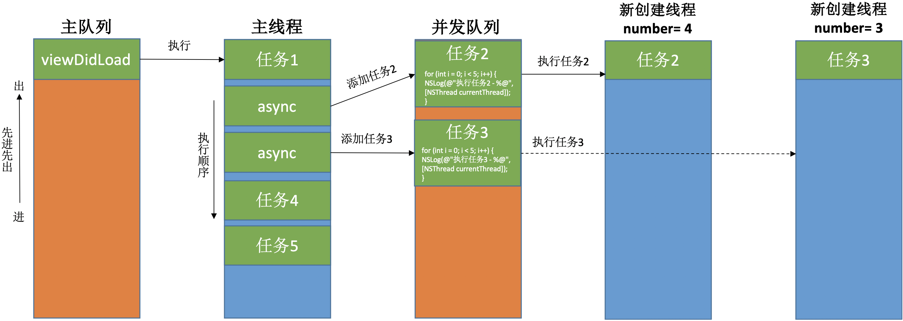

### 并发队列 & 同步执行（sync）
```
- (void)viewDidLoad {
    [super viewDidLoad];
    
    NSLog(@"任务1 - %@", [NSThread currentThread]);
    
    /// 全局并发队列
    dispatch_queue_t queue = dispatch_get_global_queue(0, 0);
    /// 任务2
    dispatch_sync(queue, ^{
        for (int i = 0; i < 5; i++) {
            NSLog(@"执行任务2 - %@", [NSThread currentThread]);
        }
    });
    /// 任务3
    dispatch_sync(queue, ^{
        for (int i = 0; i < 5; i++) {
            NSLog(@"执行任务3 - %@", [NSThread currentThread]);
        }
    });
    
    NSLog(@"任务4 - %@", [NSThread currentThread]);
    /// 主线程睡1秒
    sleep(1);
    NSLog(@"任务5 - %@", [NSThread currentThread]);
}
```

打印结果：
```
任务1 - <NSThread: 0x600002fa4d80>{number = 1, name = main}
执行任务2 - <NSThread: 0x600002fa4d80>{number = 1, name = main}
执行任务2 - <NSThread: 0x600002fa4d80>{number = 1, name = main}
执行任务2 - <NSThread: 0x600002fa4d80>{number = 1, name = main}
执行任务2 - <NSThread: 0x600002fa4d80>{number = 1, name = main}
执行任务2 - <NSThread: 0x600002fa4d80>{number = 1, name = main}
执行任务3 - <NSThread: 0x600002fa4d80>{number = 1, name = main}
执行任务3 - <NSThread: 0x600002fa4d80>{number = 1, name = main}
执行任务3 - <NSThread: 0x600002fa4d80>{number = 1, name = main}
执行任务3 - <NSThread: 0x600002fa4d80>{number = 1, name = main}
执行任务3 - <NSThread: 0x600002fa4d80>{number = 1, name = main}
任务4 - <NSThread: 0x600002fa4d80>{number = 1, name = main}
任务5 - <NSThread: 0x600002fa4d80>{number = 1, name = main}
```

从打印结果可以看到，队列里任务的执行方式为：串行，主线程。
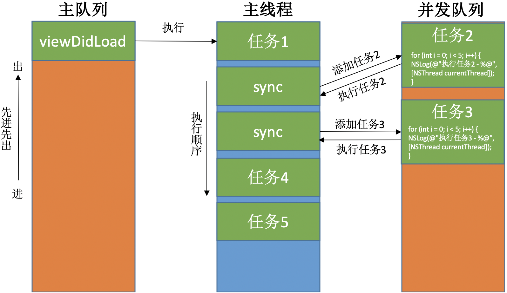

### 串行队列 & 异步执行（async）
```
- (void)viewDidLoad {
    [super viewDidLoad];
    
    NSLog(@"任务1 - %@", [NSThread currentThread]);
    
    /// 手动创建并发队列
    dispatch_queue_t queue = dispatch_queue_create("myQueue", DISPATCH_QUEUE_SERIAL);
    /// 任务2
    dispatch_async(queue, ^{
        for (int i = 0; i < 5; i++) {
            NSLog(@"执行任务2 - %@", [NSThread currentThread]);
        }
    });
    /// 任务3
    dispatch_async(queue, ^{
        for (int i = 0; i < 5; i++) {
            NSLog(@"执行任务3 - %@", [NSThread currentThread]);
        }
    });
    
    NSLog(@"任务4 - %@", [NSThread currentThread]);
    /// 主线程睡1秒
    sleep(1);
    NSLog(@"任务5 - %@", [NSThread currentThread]);
}
```

打印结果：
```
任务1 - <NSThread: 0x6000004b0d40>{number = 1, name = main}
任务4 - <NSThread: 0x6000004b0d40>{number = 1, name = main}
执行任务2 - <NSThread: 0x6000004dc740>{number = 5, name = (null)}
执行任务2 - <NSThread: 0x6000004dc740>{number = 5, name = (null)}
执行任务2 - <NSThread: 0x6000004dc740>{number = 5, name = (null)}
执行任务2 - <NSThread: 0x6000004dc740>{number = 5, name = (null)}
执行任务2 - <NSThread: 0x6000004dc740>{number = 5, name = (null)}
执行任务3 - <NSThread: 0x6000004dc740>{number = 5, name = (null)}
执行任务3 - <NSThread: 0x6000004dc740>{number = 5, name = (null)}
执行任务3 - <NSThread: 0x6000004dc740>{number = 5, name = (null)}
执行任务3 - <NSThread: 0x6000004dc740>{number = 5, name = (null)}
执行任务3 - <NSThread: 0x6000004dc740>{number = 5, name = (null)}
任务5 - <NSThread: 0x6000004b0d40>{number = 1, name = main}
```

从打印结果可以看到，队列里任务的执行方式为：串行，创建新线程。
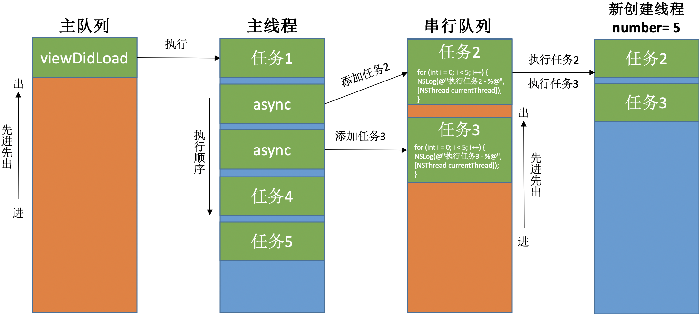

### 串行队列 & 同步执行（sync）
```
- (void)viewDidLoad {
    [super viewDidLoad];
    
    NSLog(@"任务1 - %@", [NSThread currentThread]);
    
    /// 手动创建并发队列
    dispatch_queue_t queue = dispatch_queue_create("myQueue", DISPATCH_QUEUE_SERIAL);
    /// 任务2
    dispatch_sync(queue, ^{
        for (int i = 0; i < 5; i++) {
            NSLog(@"执行任务2 - %@", [NSThread currentThread]);
        }
    });
    /// 任务3
    dispatch_sync(queue, ^{
        for (int i = 0; i < 5; i++) {
            NSLog(@"执行任务3 - %@", [NSThread currentThread]);
        }
    });
    
    NSLog(@"任务4 - %@", [NSThread currentThread]);
    /// 主线程睡1秒
    sleep(1);
    NSLog(@"任务5 - %@", [NSThread currentThread]);
}
```

打印结果：
```
任务1 - <NSThread: 0x600001438d40>{number = 1, name = main}
执行任务2 - <NSThread: 0x600001438d40>{number = 1, name = main}
执行任务2 - <NSThread: 0x600001438d40>{number = 1, name = main}
执行任务2 - <NSThread: 0x600001438d40>{number = 1, name = main}
执行任务2 - <NSThread: 0x600001438d40>{number = 1, name = main}
执行任务2 - <NSThread: 0x600001438d40>{number = 1, name = main}
执行任务3 - <NSThread: 0x600001438d40>{number = 1, name = main}
执行任务3 - <NSThread: 0x600001438d40>{number = 1, name = main}
执行任务3 - <NSThread: 0x600001438d40>{number = 1, name = main}
执行任务3 - <NSThread: 0x600001438d40>{number = 1, name = main}
执行任务3 - <NSThread: 0x600001438d40>{number = 1, name = main}
任务4 - <NSThread: 0x600001438d40>{number = 1, name = main}
任务5 - <NSThread: 0x600001438d40>{number = 1, name = main}
```

从打印结果可以看到，队列里任务的执行方式为：串行，主线程。
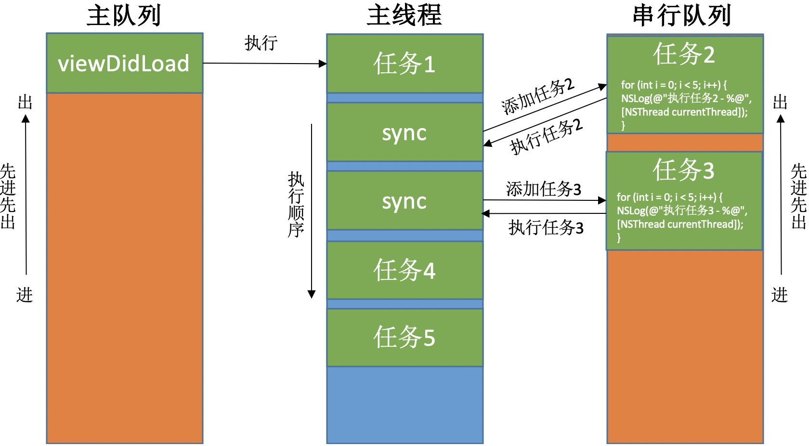

### 主队列 & 异步执行（async）
```
- (void)viewDidLoad {
    [super viewDidLoad];
    
    NSLog(@"任务1 - %@", [NSThread currentThread]);
    
    /// 手动创建并发队列
    dispatch_queue_t queue = dispatch_get_main_queue();
    /// 任务2
    dispatch_async(queue, ^{
        for (int i = 0; i < 5; i++) {
            NSLog(@"执行任务2 - %@", [NSThread currentThread]);
        }
    });
    /// 任务3
    dispatch_async(queue, ^{
        for (int i = 0; i < 5; i++) {
            NSLog(@"执行任务3 - %@", [NSThread currentThread]);
        }
    });
    
    NSLog(@"任务4 - %@", [NSThread currentThread]);
    /// 主线程睡1秒
    sleep(1);
    NSLog(@"任务5 - %@", [NSThread currentThread]);
}
```

打印结果：
```
任务1 - <NSThread: 0x600002408d80>{number = 1, name = main}
任务4 - <NSThread: 0x600002408d80>{number = 1, name = main}
任务5 - <NSThread: 0x600002408d80>{number = 1, name = main}
执行任务2 - <NSThread: 0x600002408d80>{number = 1, name = main}
执行任务2 - <NSThread: 0x600002408d80>{number = 1, name = main}
执行任务2 - <NSThread: 0x600002408d80>{number = 1, name = main}
执行任务2 - <NSThread: 0x600002408d80>{number = 1, name = main}
执行任务2 - <NSThread: 0x600002408d80>{number = 1, name = main}
执行任务3 - <NSThread: 0x600002408d80>{number = 1, name = main}
执行任务3 - <NSThread: 0x600002408d80>{number = 1, name = main}
执行任务3 - <NSThread: 0x600002408d80>{number = 1, name = main}
执行任务3 - <NSThread: 0x600002408d80>{number = 1, name = main}
执行任务3 - <NSThread: 0x600002408d80>{number = 1, name = main}
```

从打印结果可以看到，队列里任务的执行方式为：串行，主线程。
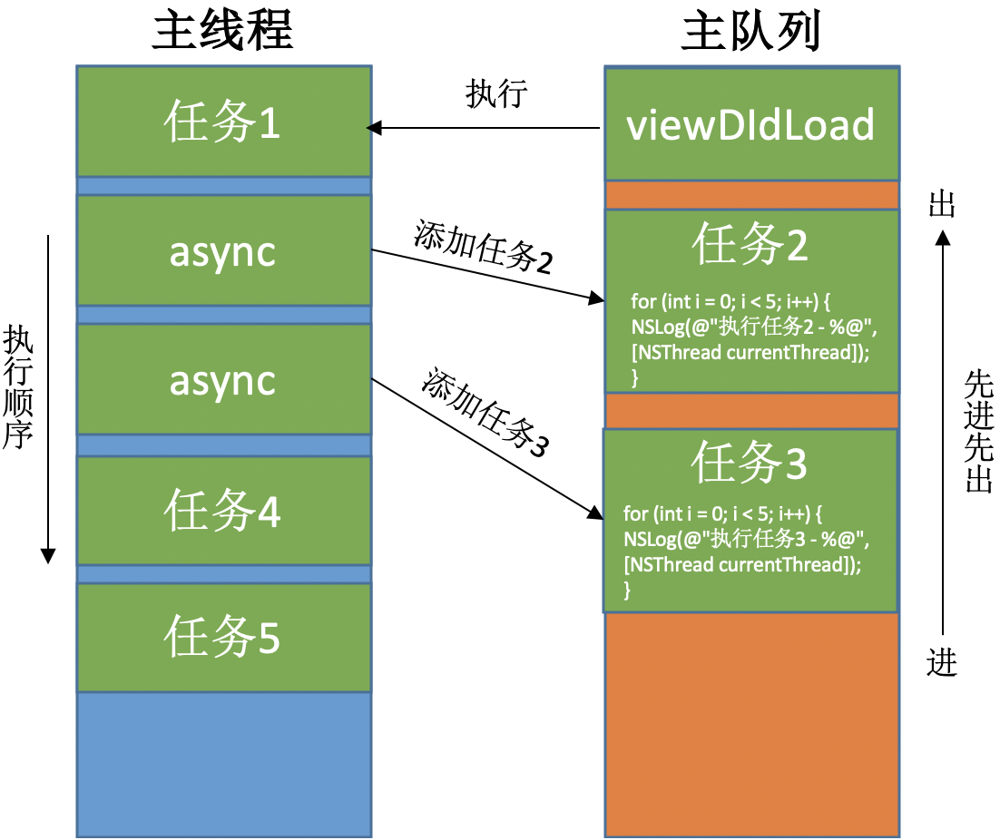

### 主队列 & 同步执行（sync）-> 死锁

死锁一：使用sync函数往当前串行队列中添加任务，会卡住当前的串行队列（产生死锁）：
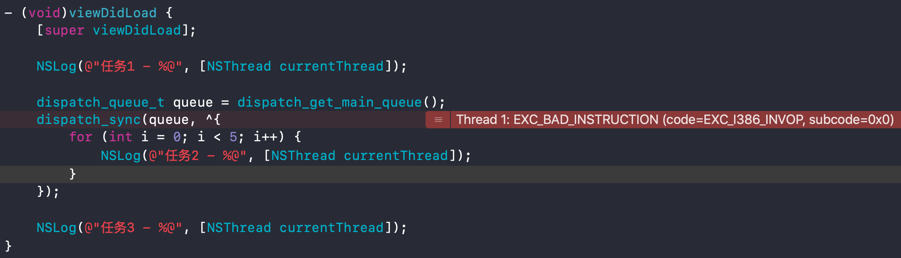

问题分析：
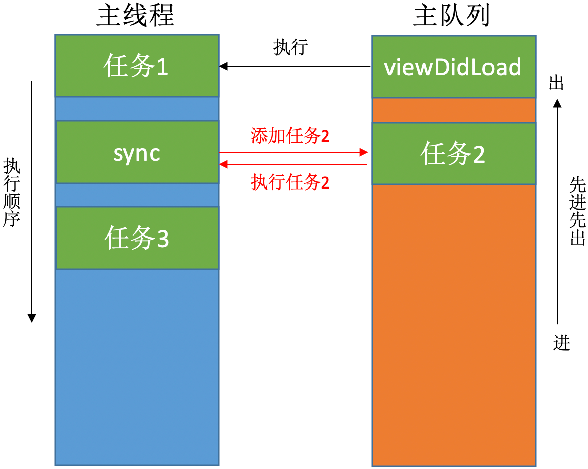

`sync` 函数在这里的作用有两个，第一个是添加任务2，第二个是执行任务2。因为主队列是串行队列，所以遵循先进先出原则，只有在第一个任务 `viewDidLoad` 执行完成后才能执行任务2。但是第一个任务 `viewDidLoad` 要想执行完就必须执行完 `sync` 函数，而 `sync` 函数要想执行完就必须执行完任务2，而任务2要想执行完就必须执行完 `viewDidLoad` ... ... 产生死锁。

死锁二：
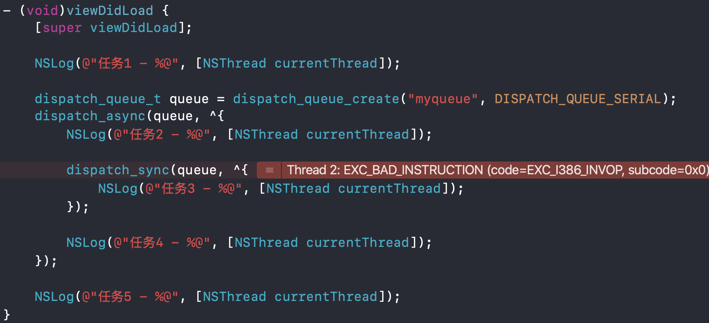

问题分析：
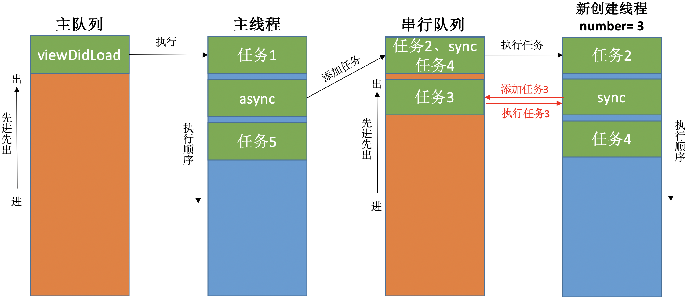

## performSelector:withObject:afterDelay:

在子线程里调用 `performSelector:withObject:afterDelay:` 方法：
```
- (void)test
{
    NSLog(@"执行任务2 - %@ - %@", [NSThread currentThread], [NSOperationQueue currentQueue]);
}

- (void)touchesBegan:(NSSet<UITouch *> *)touches withEvent:(UIEvent *)event
{
    dispatch_queue_t queue = dispatch_get_global_queue(0, 0);
    dispatch_async(queue, ^{
        NSLog(@"1");
        [self performSelector:@selector(test) withObject:nil afterDelay:.0];
        NSLog(@"3");
    });
}
```

打印结果：
```
1
3
```

从打印结果可以看到，`performSelector:withObject:afterDelay:` 方法并没有起作用。这是因为 `performSelector:withObject:afterDelay:` 方法内部使用了 timer，而子线程默认没有 RunLoop，所以 `performSelector:withObject:afterDelay:` 方法内部的 TImer 无法调用。1和3可以打印是因为 `NSLog()` 方法是普通的代码，不需要 RunLoop。

解决方案 👉 手动添加 RunLoop：
```
- (void)test
{
    NSLog(@"执行任务2 - %@ - %@", [NSThread currentThread], [NSOperationQueue currentQueue]);
}

- (void)touchesBegan:(NSSet<UITouch *> *)touches withEvent:(UIEvent *)event
{
    dispatch_queue_t queue = dispatch_get_global_queue(0, 0);
    dispatch_async(queue, ^{
        NSLog(@"1");
        [self performSelector:@selector(test) withObject:nil afterDelay:.0];
        NSLog(@"3");
        
        [[NSRunLoop currentRunLoop] runMode:NSDefaultRunLoopMode beforeDate:[NSDate distantFuture]];
    });
}
```

打印结果：
```
1
执行任务2 - <NSThread: 0x600001ad0cc0>{number = 6, name = (null)} - (null)
3
```

从打印结果可以看到，`performSelector:withObject:afterDelay:` 方法可以正常调用了。这是因为手动为子线程添加了 RunLoop，所以 `performSelector:withObject:afterDelay:` 方法内部的 timer 可以正常运行了。

猜想：`performSelector:withObject:afterDelay:` 方法的本质是往 RunLoop 中添加定时器：
```
- (void)viewDidLoad {
    [super viewDidLoad];
    
    CFRunLoopObserverRef observer = CFRunLoopObserverCreateWithHandler(kCFAllocatorDefault, kCFRunLoopAllActivities, YES, 0, ^(CFRunLoopObserverRef observer, CFRunLoopActivity activity) {
        switch (activity) {
            case kCFRunLoopEntry:
                NSLog(@"kCFRunLoopEntry");
                break;
            case kCFRunLoopBeforeTimers:
                NSLog(@"kCFRunLoopBeforeTimers");
                break;
            case kCFRunLoopBeforeSources:
                NSLog(@"kCFRunLoopBeforeSources");
                break;
            case kCFRunLoopBeforeWaiting:
                NSLog(@"kCFRunLoopBeforeWaiting");
                break;
            case kCFRunLoopAfterWaiting:
                NSLog(@"kCFRunLoopAfterWaiting");
                break;
            case kCFRunLoopExit:
                NSLog(@"kCFRunLoopExit");
                break;
            default:
                break;
        }
    });
    CFRunLoopAddObserver(CFRunLoopGetCurrent(), observer, kCFRunLoopCommonModes);
    CFRelease(observer);
}

- (void)test
{
    NSLog(@"执行任务2 - %@ - %@", [NSThread currentThread], [NSOperationQueue currentQueue]);
}

- (void)touchesBegan:(NSSet<UITouch *> *)touches withEvent:(UIEvent *)event
{
    NSLog(@"1");
    [self performSelector:@selector(test) withObject:nil afterDelay:.0];
    NSLog(@"3");
}
```

打印结果：
```
kCFRunLoopAfterWaiting
kCFRunLoopBeforeTimers
kCFRunLoopBeforeSources
1
3
kCFRunLoopBeforeTimers
kCFRunLoopBeforeSources
执行任务2 - <NSThread: 0x600000b5cd40>{number = 1, name = main} - <NSOperationQueue: 0x7fb3f0006020>{name = 'NSOperationQueue Main Queue'}
... ...
```

从打印结果可以看到，`performSelector:withObject:afterDelay:` 方法的调用是一个 timers 事件：RunLoop 先处理了 Sources0 事件，再处理的 Timers。

### GNUstep

GNUstep 是 GNU 计划的项目之一，它将 Cocoa 的 OC 库重新开源实现了一遍。虽然 GNUstep 不是苹果官方源码，但还是具有一定的参考价值。👉 [源码地址](http://www.gnustep.org/resources/downloads.php)

找到 NSRunLoop.m 文件查看 `performSelector:withObject:afterDelay:` 方法源码：
```
- (void) performSelector: (SEL)aSelector
	      withObject: (id)argument
	      afterDelay: (NSTimeInterval)seconds
{
  NSRunLoop		*loop = [NSRunLoop currentRunLoop];
  GSTimedPerformer	*item;

  //根据传入参数生成一个 GSTimedPerformer 对象（内含 NSTimer 定时器），作为 Timers 事件添加到 RunLoop 中。
  item = [[GSTimedPerformer alloc] initWithSelector: aSelector
					     target: self
					   argument: argument
					      delay: seconds];
  [[loop _timedPerformers] addObject: item];
  RELEASE(item);
  [loop addTimer: item->timer forMode: NSDefaultRunLoopMode];
}
```

通过源码可以得出结论：`performSelector:withObject:afterDelay:` 方法内部根据传入参数生成一个 GSTimedPerformer 对象（内含 NSTimer 定时器），作为 Timers 事件添加到 RunLoop 中。

### performSelector:withObject:

`performSelector:withObject:` 方法跟 `performSelector:withObject:afterDelay:` 方法的实现原理不同，`performSelector:withObject:afterDelay:` 是定义在 RunLoop.h 文件里的 API，内部实现的本质是往 RunLoop 中添加定时器。而 `performSelector:withObject:` 方法的本质是调用 objc_msgSend() 方法。可以在 runtime 源码 [objc4-781](https://opensource.apple.com/tarballs/objc4/) 里看到具体实现，找到 NSObjec.m 文件：
```
- (id)performSelector:(SEL)sel withObject:(id)obj {
    if (!sel) [self doesNotRecognizeSelector:sel];
    return ((id(*)(id, SEL, id))objc_msgSend)(self, sel, obj);
}
```

## 队列组的使用

异步并发执行任务1、任务2，在任务1、任务2都执行完毕后，再回到主线程执行任务3：
```
- (void)viewDidLoad {
    [super viewDidLoad];
    
    dispatch_group_t group = dispatch_group_create();
    dispatch_queue_t queue = dispatch_queue_create("myQueue", DISPATCH_QUEUE_CONCURRENT);
    dispatch_group_async(group, queue, ^{
        sleep(1);
        NSLog(@"任务1");
    });
    dispatch_group_async(group, queue, ^{
        NSLog(@"任务2");
    });
    dispatch_group_notify(group, dispatch_get_main_queue(), ^{
        NSLog(@"任务3");
    });
}
```

打印结果：
```
任务2
任务1
任务3
```

任务3会等到任务1和任务2都执行完成之后再执行。

# GCD源码分析

## dispatch_async()

在 queue.h 文件找到 `dispatch_async()` 方法的定义
```
API_AVAILABLE(macos(10.6), ios(4.0))
DISPATCH_EXPORT DISPATCH_NONNULL_ALL DISPATCH_NOTHROW
void
dispatch_async(dispatch_queue_t queue, dispatch_block_t block);
```

在 queue.c 文件找到 `dispatch_async()` 方法的实现：
```
void
dispatch_async(dispatch_queue_t dq, dispatch_block_t work)
{
    //将任务 work 打包成 dispatch_continuation_t 类型
	dispatch_continuation_t dc = _dispatch_continuation_alloc(); 
    //设置标志位
	uintptr_t dc_flags = DC_FLAG_CONSUME;
	dispatch_qos_t qos;

    //进行block初始化
	qos = _dispatch_continuation_init(dc, dq, work, 0, dc_flags);
	_dispatch_continuation_async(dq, dc, qos, dc->dc_flags);
}
```

在 inline_internal.h 文件找到 `_dispatch_continuation_async()` 方法的实现：
```
DISPATCH_ALWAYS_INLINE
static inline void
_dispatch_continuation_async(dispatch_queue_class_t dqu,
		dispatch_continuation_t dc, dispatch_qos_t qos, uintptr_t dc_flags)
{
#if DISPATCH_INTROSPECTION
	if (!(dc_flags & DC_FLAG_NO_INTROSPECTION)) {
		_dispatch_trace_item_push(dqu, dc); //将任务添加到队列中
	}
#else
	(void)dc_flags;
#endif
	return dx_push(dqu._dq, dc, qos);
}
```

在 trace.h 文件找到 `_dispatch_trace_item_push` 方法的实现：
```
#define _dispatch_trace_item_push(dq, dou) \
		do { (void)(dq); (void)(dou); } while(0)
```

## dispatch_sync()

# 多线程的安全隐患

资源共享：1块资源可能会被多个线程共享，也就是多个线程可能会访问同一块资源，比如多个线程访问同一个对象、同一个变量、同一个文件。

当多个线程访问同一块资源时，很容易引发数据错乱和数据安全问题。

## 多线程安全隐患示例

### 卖票
```
@interface ViewController ()
@property (assign, nonatomic) int ticketsCount;
@end

@implementation ViewController

- (void)viewDidLoad {
    [super viewDidLoad];

    [self ticketTest];
}

- (void)ticketTest
{
    self.ticketsCount = 15;
    
    dispatch_queue_t queue = dispatch_get_global_queue(0, 0);
    
    dispatch_async(queue, ^{
        for (int i = 0; i < 5; i++) {
             [self saleTicket];
        }
    });
    
    dispatch_async(queue, ^{
        for (int i = 0; i < 5; i++) {
            [self saleTicket];
        }
    });
    
    dispatch_async(queue, ^{
        for (int i = 0; i < 5; i++) {
            [self saleTicket];
        }
    });
}

//卖1张票
- (void)saleTicket
{
    int oldTicketsCount = self.ticketsCount;
    sleep(.2);
    oldTicketsCount--;
    self.ticketsCount = oldTicketsCount;
    
    NSLog(@"还剩%d张票 - %@", oldTicketsCount, [NSThread currentThread]);
}
@end
```

打印结果：
```
还剩14张票 - <NSThread: 0x600000db4040>{number = 5, name = (null)}
还剩14张票 - <NSThread: 0x600000da81c0>{number = 4, name = (null)}
还剩14张票 - <NSThread: 0x600000d91a80>{number = 6, name = (null)}
还剩13张票 - <NSThread: 0x600000da81c0>{number = 4, name = (null)}
还剩12张票 - <NSThread: 0x600000d91a80>{number = 6, name = (null)}
还剩11张票 - <NSThread: 0x600000db4040>{number = 5, name = (null)}
还剩10张票 - <NSThread: 0x600000da81c0>{number = 4, name = (null)}
还剩9张票 - <NSThread: 0x600000d91a80>{number = 6, name = (null)}
还剩9张票 - <NSThread: 0x600000db4040>{number = 5, name = (null)}
还剩8张票 - <NSThread: 0x600000da81c0>{number = 4, name = (null)}
还剩7张票 - <NSThread: 0x600000da81c0>{number = 4, name = (null)}
还剩6张票 - <NSThread: 0x600000d91a80>{number = 6, name = (null)}
还剩5张票 - <NSThread: 0x600000d91a80>{number = 6, name = (null)}
还剩4张票 - <NSThread: 0x600000db4040>{number = 5, name = (null)}
还剩3张票 - <NSThread: 0x600000db4040>{number = 5, name = (null)}
```

可以看到，刚开始三个线程都卖了1张票，结果还是下14张票。在三个线程走完后总共卖了15张票，但是最后还剩3张票。无论是在卖票过程中，还是最后剩余的票数都出现了异常。

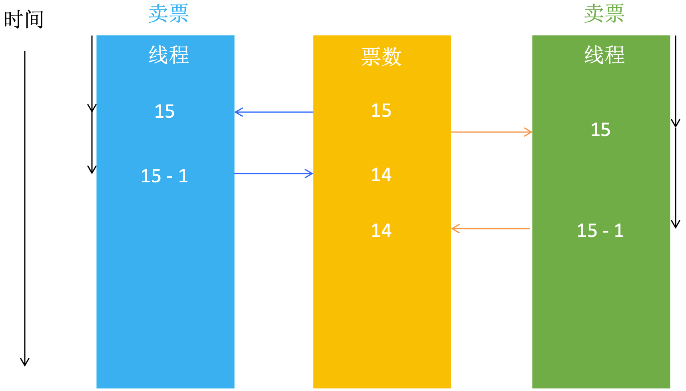
总共15张票，两个线程同时卖票，每个线程都是拿15减1，得到的手势14张票。不同的线程拿到同一个变量进行修改，就会出现问题。

### 存钱取钱
```
@interface ViewController ()
@property (assign, nonatomic) int money;
@end

@implementation ViewController

- (void)viewDidLoad {
    [super viewDidLoad];
    
    [self moneyTest];
}

- (void)moneyTest
{
    self.money = 100;
    
    dispatch_queue_t queue = dispatch_get_global_queue(0, 0);
    
    dispatch_async(queue, ^{
        for (int i = 0; i < 10; i++) {
            [self saveMoney];
        }
    });
    
    dispatch_async(queue, ^{
        for (int i = 0; i < 10; i++) {
            [self drawMoney];
        }
    });
}

/// 存钱
- (void)saveMoney
{
    int oldMoney = self.money;
    sleep(.2);
    oldMoney += 50;
    self.money = oldMoney;
    
    NSLog(@"存50，还剩%d元 - %@", oldMoney, [NSThread currentThread]);
}

/// 取钱
- (void)drawMoney
{
    int oldMoney = self.money;
    sleep(.2);
    oldMoney -= 20;
    self.money = oldMoney;
    
    NSLog(@"取20，还剩%d元 - %@", oldMoney, [NSThread currentThread]);
}
@end
```

打印结果：
```
存50，还剩150元 - <NSThread: 0x60000094bf40>{number = 5, name = (null)}
取20，还剩80元 - <NSThread: 0x600000928a80>{number = 3, name = (null)}
取20，还剩110元 - <NSThread: 0x600000928a80>{number = 3, name = (null)}
存50，还剩130元 - <NSThread: 0x60000094bf40>{number = 5, name = (null)}
取20，还剩90元 - <NSThread: 0x600000928a80>{number = 3, name = (null)}
存50，还剩140元 - <NSThread: 0x60000094bf40>{number = 5, name = (null)}
取20，还剩120元 - <NSThread: 0x600000928a80>{number = 3, name = (null)}
存50，还剩170元 - <NSThread: 0x60000094bf40>{number = 5, name = (null)}
取20，还剩150元 - <NSThread: 0x600000928a80>{number = 3, name = (null)}
存50，还剩200元 - <NSThread: 0x60000094bf40>{number = 5, name = (null)}
取20，还剩180元 - <NSThread: 0x600000928a80>{number = 3, name = (null)}
存50，还剩230元 - <NSThread: 0x60000094bf40>{number = 5, name = (null)}
取20，还剩210元 - <NSThread: 0x600000928a80>{number = 3, name = (null)}
存50，还剩260元 - <NSThread: 0x60000094bf40>{number = 5, name = (null)}
取20，还剩240元 - <NSThread: 0x600000928a80>{number = 3, name = (null)}
存50，还剩290元 - <NSThread: 0x60000094bf40>{number = 5, name = (null)}
取20，还剩270元 - <NSThread: 0x600000928a80>{number = 3, name = (null)}
存50，还剩320元 - <NSThread: 0x60000094bf40>{number = 5, name = (null)}
取20，还剩300元 - <NSThread: 0x600000928a80>{number = 3, name = (null)}
存50，还剩350元 - <NSThread: 0x60000094bf40>{number = 5, name = (null)}
```

从打印结果可以看到，最后还剩350。代码中，原本有100，存了500，取了200，所以结果应该是400。

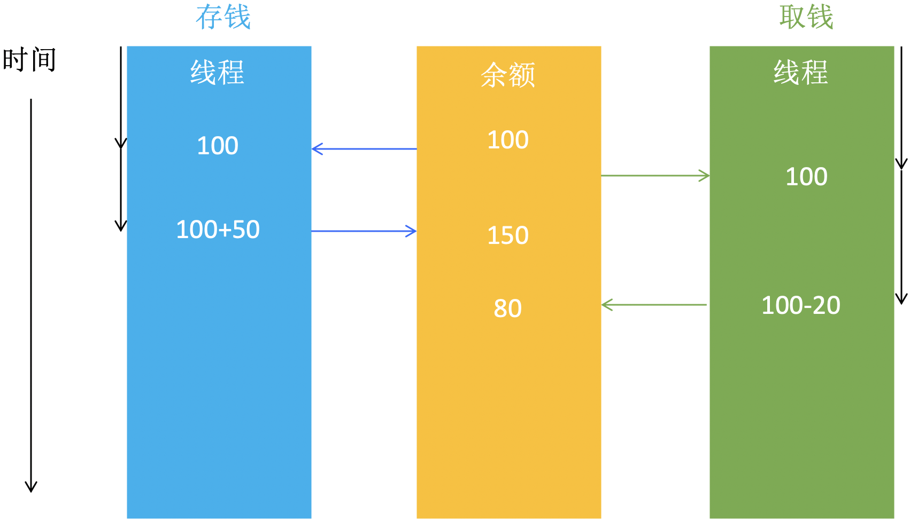
总共100元，两个线程同时拿到100元，第一个线程存了50元后余额还剩150元，第二个线程去了20元余额还剩80元。不同的线程拿到同一个变量进行修改，就会出现问题。

## 多线程安全隐患分析

线程A先取到变量的值17，线程B后取到变量的值17。线程A对取到的值加一（17+1=18），线程B对取到的值加一（17+1=18）。线程A将处理后的值赋值给变量（18），线程B也将处理后的值赋值给变量（18）。虽然修改了两次变量（+1），但是结果都是18：
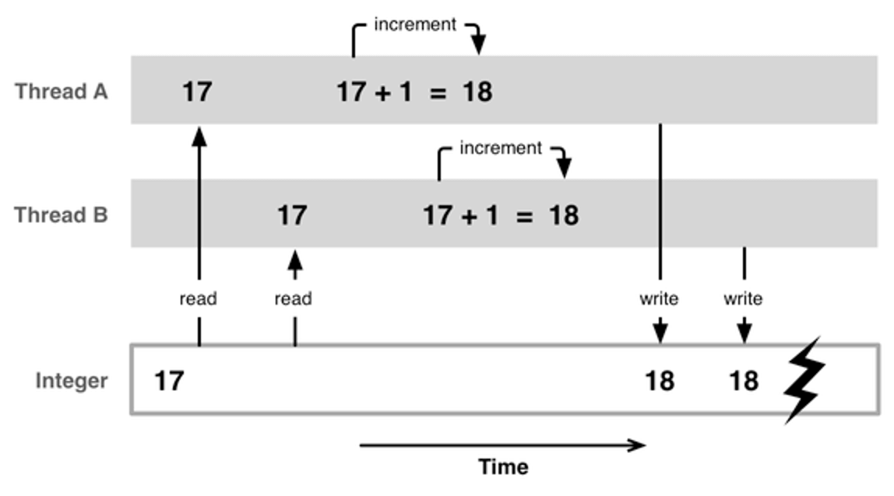

## 多线程安全隐患的解决方案
解决方案：使用线程同步技术（同步，就是协同步调，按预定的先后次序进行）。  
常见的线程同步技术是：加锁。
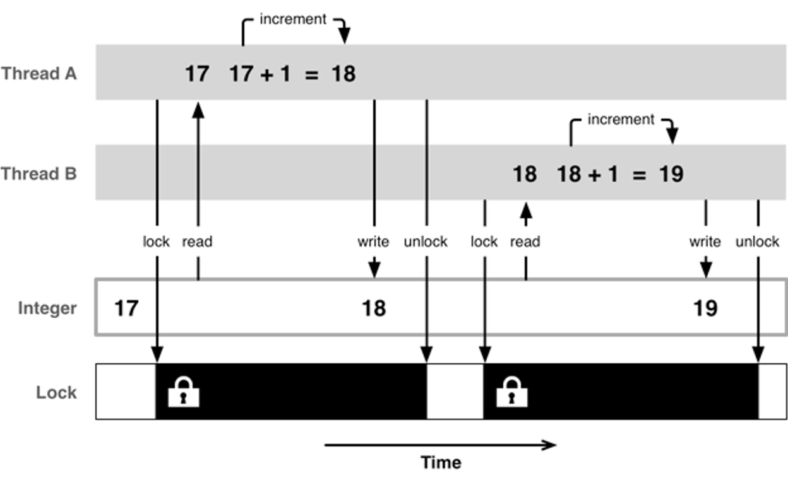

# iOS中的线程同步方案

| 同步方案 | 简介 |
| :-- | :-- |
| OSSpinLock | 自旋锁 |
| os_unfair_lock | 用于取代不安全的OSSpinLock |
| pthread_mutex | 互斥锁 |
| dispatch_semaphore | 信号量 |
| dispatch_queue(DISPATCH_QUEUE_SERIAL) | 串行队列 |
| NSLock | 对mutex普通锁的封装 |
| NSRecursiveLock | 对mutex递归锁的封装，API跟NSLock基本一致 |
| NSCondition | 对mutex和cond的封装 |
| NSConditionLock | 对NSCondition的进一步封装，可以设置具体的条件值 |
| @synchronized | 对mutex递归锁的封装 |

将卖票和存钱取钱测试代码封装起来：
```
@interface BaseLockDemo : NSObject
/// 存钱取钱
- (void)moneyTest;
/// 卖票
- (void)ticketTest;
#pragma mark - 暴露给子类去使用
- (void)__saveMoney;
- (void)__drawMoney;
- (void)__saleTicket;
@end

@interface BaseLockDemo()
@property (assign, nonatomic) int money;
@property (assign, nonatomic) int ticketsCount;
@end

@implementation BaseLockDemo
///------ 存钱、取钱 ------
- (void)moneyTest
{
    self.money = 100;
    
    dispatch_queue_t queue = dispatch_get_global_queue(0, 0);
    
    dispatch_async(queue, ^{
        for (int i = 0; i < 10; i++) {
            [self __saveMoney];
        }
    });
    
    dispatch_async(queue, ^{
        for (int i = 0; i < 10; i++) {
            [self __drawMoney];
        }
    });
}

/// 存钱
- (void)__saveMoney
{
    int oldMoney = self.money;
    sleep(.2);
    oldMoney += 50;
    self.money = oldMoney;
    
    NSLog(@"存50，还剩%d元 - %@", oldMoney, [NSThread currentThread]);
}

/// 取钱
- (void)__drawMoney
{
    int oldMoney = self.money;
    sleep(.2);
    oldMoney -= 20;
    self.money = oldMoney;
    
    NSLog(@"取20，还剩%d元 - %@", oldMoney, [NSThread currentThread]);
}

///------ 卖票 ------
- (void)ticketTest
{
    self.ticketsCount = 15;
    
    dispatch_queue_t queue = dispatch_get_global_queue(0, 0);
    
    dispatch_async(queue, ^{
        for (int i = 0; i < 5; i++) {
            [self __saleTicket];
        }
    });
    
    dispatch_async(queue, ^{
        for (int i = 0; i < 5; i++) {
            [self __saleTicket];
        }
    });
    
    dispatch_async(queue, ^{
        for (int i = 0; i < 5; i++) {
            [self __saleTicket];
        }
    });
}

/// 卖1张票
- (void)__saleTicket
{
    int oldTicketsCount = self.ticketsCount;
    sleep(.2);
    oldTicketsCount--;
    self.ticketsCount = oldTicketsCount;
    NSLog(@"还剩%d张票 - %@", oldTicketsCount, [NSThread currentThread]);
}
@end
```

## OSSpinLock
`OSSpinLock` 叫做”自旋锁”，等待锁的线程会处于忙等（busy-wait）状态，一直占用着CPU资源。目前已经不再安全，可能会出现优先级反转问题（如果等待锁的线程优先级较高，它会一直占用着CPU资源，优先级低的线程就无法释放锁）。需要导入头文件 `#import <libkern/OSAtomic.h>`。

忙等状态可以理解为一个 do-while 循环，不停的监测着是否解锁，这个状态下的线程会一直占用着CPU资源。正因为是处于忙等状态，所以 `OSSpinLock` 的效率要其它锁都高，一旦解锁立刻就能监测到并继续执行。不在安全的原因是优先级较高的线程在等待锁时（忙等），CPU不再分配资源给其它线程，那么上锁的线程负责解锁，由于CPU没有分配资源也无法解锁，导致优先级较高的线程一直在这里等待。

* 线程调度
计算机通常只有一个CPU，在任意时刻只能执行一条机器指令，每个线程只有获得CPU的使用权才能执行指令。所谓多线程的并发运行，其实是指从宏观上看，各个线程轮流获得CPU的使用权，分别执行各自的任务。在运行池中，会有多个处于就绪状态的线程在等待CPU，JAVA虚拟机的一项任务就是负责线程的调度，线程调度是指按照特定机制为多个线程分配CPU的使用权。
* 时间片轮转调度
时间片轮转调度是一种最古老，最简单，最公平且使用最广的算法。每个进程被分配一个时间段，称作它的时间片，即该进程允许运行的时间。如果在时间片结束时进程还在运行，则CPU将被剥夺并分配给另一个进程。如果进程在时间片结束前阻塞或结束，则CPU当即进行切换。调度程序所要做的就是维护一张就绪进程列表，当进程用完它的时间片后，它被移到队列的末尾。

### 常用API
```
/// 初始化
OSSpinLock lock = OS_SPINLOCK_INIT;
/// 尝试加锁（如果需要等待就不加锁，直接返回false；如果不需要等待就加锁，返回true）
bool result = OSSpinLockTry(&lock);
/// 加锁
OSSpinLockLock(&lock);
/// 解锁
OSSpinLockUnlock(&lock);
```

### 解决卖票和存钱取钱问题
定义 OSSpinLockDemo 继承自 LockBaseDemo。
```
#import <libkern/OSAtomic.h>

@interface OSSpinLockDemo()
@property (assign, nonatomic) OSSpinLock moneyLock;
@property (assign, nonatomic) OSSpinLock ticketLock;
@end

@implementation OSSpinLockDemo

- (instancetype)init
{
    if (self = [super init]) {
        self.moneyLock = OS_SPINLOCK_INIT;
        self.ticketLock = OS_SPINLOCK_INIT;
    }
    return self;
}
/// 取钱
- (void)__drawMoney
{
    OSSpinLockLock(&_moneyLock);
    
    [super __drawMoney];
    
    OSSpinLockUnlock(&_moneyLock);
}
/// 存钱
- (void)__saveMoney
{
    OSSpinLockLock(&_moneyLock);
    
    [super __saveMoney];
    
    OSSpinLockUnlock(&_moneyLock);
}
/// 卖票
- (void)__saleTicket
{
    OSSpinLockLock(&_ticketLock);
    
    [super __saleTicket];
    
    OSSpinLockUnlock(&_ticketLock);
}
@end

@implementation ViewController

- (void)viewDidLoad {
    [super viewDidLoad];
    
    BaseLockDemo *demo = [[OSSpinLockDemo alloc] init];
    [demo ticketTest];
    [demo moneyTest];
}
@end
```

调用 `-(void)moneyTest` 打印结果：
```
存50，还剩150元 - <NSThread: 0x600000471080>{number = 4, name = (null)}
存50，还剩200元 - <NSThread: 0x600000471080>{number = 4, name = (null)}
存50，还剩250元 - <NSThread: 0x600000471080>{number = 4, name = (null)}
存50，还剩300元 - <NSThread: 0x600000471080>{number = 4, name = (null)}
存50，还剩350元 - <NSThread: 0x600000471080>{number = 4, name = (null)}
存50，还剩400元 - <NSThread: 0x600000471080>{number = 4, name = (null)}
存50，还剩450元 - <NSThread: 0x600000471080>{number = 4, name = (null)}
存50，还剩500元 - <NSThread: 0x600000471080>{number = 4, name = (null)}
存50，还剩550元 - <NSThread: 0x600000471080>{number = 4, name = (null)}
存50，还剩600元 - <NSThread: 0x600000471080>{number = 4, name = (null)}
取20，还剩580元 - <NSThread: 0x600000463ec0>{number = 3, name = (null)}
取20，还剩560元 - <NSThread: 0x600000463ec0>{number = 3, name = (null)}
取20，还剩540元 - <NSThread: 0x600000463ec0>{number = 3, name = (null)}
取20，还剩520元 - <NSThread: 0x600000463ec0>{number = 3, name = (null)}
取20，还剩500元 - <NSThread: 0x600000463ec0>{number = 3, name = (null)}
取20，还剩480元 - <NSThread: 0x600000463ec0>{number = 3, name = (null)}
取20，还剩460元 - <NSThread: 0x600000463ec0>{number = 3, name = (null)}
取20，还剩440元 - <NSThread: 0x600000463ec0>{number = 3, name = (null)}
取20，还剩420元 - <NSThread: 0x600000463ec0>{number = 3, name = (null)}
取20，还剩400元 - <NSThread: 0x600000463ec0>{number = 3, name = (null)}
```

调用 `-(void)ticketTest` 打印结果：
```
还剩14张票 - <NSThread: 0x600003a39ec0>{number = 3, name = (null)}
还剩13张票 - <NSThread: 0x600003a39ec0>{number = 3, name = (null)}
还剩12张票 - <NSThread: 0x600003a39ec0>{number = 3, name = (null)}
还剩11张票 - <NSThread: 0x600003a39ec0>{number = 3, name = (null)}
还剩10张票 - <NSThread: 0x600003a39ec0>{number = 3, name = (null)}
还剩9张票 - <NSThread: 0x600003a6c2c0>{number = 6, name = (null)}
还剩8张票 - <NSThread: 0x600003a6c2c0>{number = 6, name = (null)}
还剩7张票 - <NSThread: 0x600003a6c2c0>{number = 6, name = (null)}
还剩6张票 - <NSThread: 0x600003a6c2c0>{number = 6, name = (null)}
还剩5张票 - <NSThread: 0x600003a6c2c0>{number = 6, name = (null)}
还剩4张票 - <NSThread: 0x600003a4a700>{number = 5, name = (null)}
还剩3张票 - <NSThread: 0x600003a4a700>{number = 5, name = (null)}
还剩2张票 - <NSThread: 0x600003a4a700>{number = 5, name = (null)}
还剩1张票 - <NSThread: 0x600003a4a700>{number = 5, name = (null)}
还剩0张票 - <NSThread: 0x600003a4a700>{number = 5, name = (null)}
```

因为要修改的有两个变量，一个是存钱取钱里的余额，一个是卖票里的剩余票数，所以要有两把锁分别对应这两个变量。一旦有线程对 OSSpinLock 上锁后，其它线程再遇到 OSSpinLock 时会阻塞住，等待 OSSpinLock 解锁在继续向下执行。

上面👆的例子是将 OSSpinLock 锁对象放到了实例对象里，也可以将 OSSpinLock 锁对象放到类对象里：
```
static OSSpinLock moneyLock_;
+ (void)initialize
{
    static dispatch_once_t onceToken;
    dispatch_once(&onceToken, ^{
        moneyLock_ = 0;
    });
}
```

类方法 `+ (void)initialize` 只会被系统调用一次，但是允许被开发者调用，所以使用 `dispatch_once` 保证类对象的 `moneyLock_` 锁只初始化一次。

或者：
```
- (void)__saleTicket
{
    static OSSpinLock ticketLock = OS_SPINLOCK_INIT;
    
    OSSpinLockLock(&ticketLock);
    
    [super __saleTicket];
    
    OSSpinLockUnlock(&ticketLock);
}
```

使用 static 关键字，将 `ticketLock` 锁保存在全局区，保证只初始化一次。

### OSSpinLock 汇编分析
* lldb 指令：
  jne：j 是 jump，ne 是条件。  
  callq：函数调用。  
  setp：执行一行OC代码。  
  stepi：stepinstruction 的简写，执行一行汇编代码，也可以简写为 si。  
  next：执行一行OC代码。
  nexti：执行一行汇编代码。
  stepi 和 nexti 的区别：在遇到函数调用是，stepi 会进入调用的函数，nexti 不会进入。  
  c：continue 的简写，继续执行。  

（重复敲回车会执行上一个 lldb 指令，如果敲的过快可能会出现异常）  

### 查看汇编代码方法
👉 修改 LockBaseDemo 类里的 `- (void)__saleTicket` 方法，设置睡眠时间为 60s，这样可以有足够的时间查看第二次加锁时的汇编代码。修改 `- (void)ticketTest` 方法，设置调用10次 `- (void)__saleTicket` 方法：
```
- (void)ticketTest
{
    self.ticketsCount = 15;
    
    for (int i=0; i<10; i++) {
        [[[NSThread alloc] initWithTarget:self selector:@selector(__saleTicket) object:nil] start]; 
    }
}

/// 卖票
- (void)__saleTicket
{
    int oldTicketsCount = self.ticketsCount; //断点
    sleep(60.2);
    oldTicketsCount--;
    self.ticketsCount = oldTicketsCount;
    NSLog(@"还剩%d张票 - %@", oldTicketsCount, [NSThread currentThread]);
}
```

第一次加锁后，在第二次尝试加锁时，就可以有足够多的时间查看其汇编代码，在断点处查看 Debug -> Debug Workflow -> Always Show Disassembly。

### 查看 OSSpinLock 汇编代码

可以看到第一次调用 `- (void)__saleTicket` 方法是在 Thread 9 并加锁。第二次调用 `- (void)__saleTicket` 方法是在 Thread 10，因为此时的自旋锁处于上锁状态，所以 Thread 10 处于等待锁的状态。重复执行 si 指令，到第11行时会调用 OSSpinLocklock 函数：
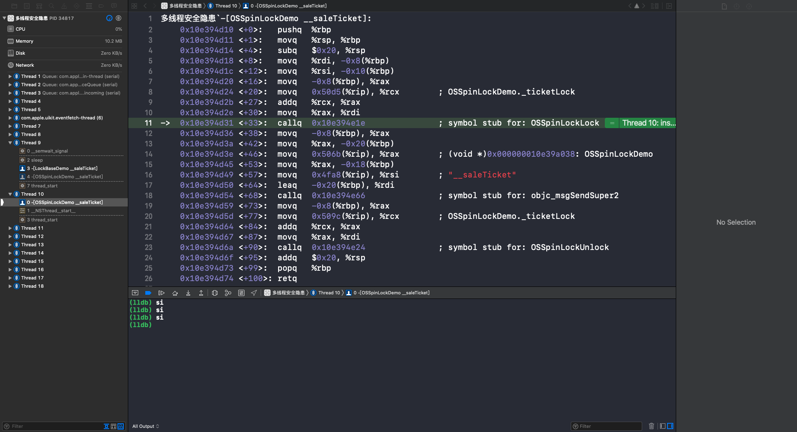
使用 si 指令进入到调用函数：
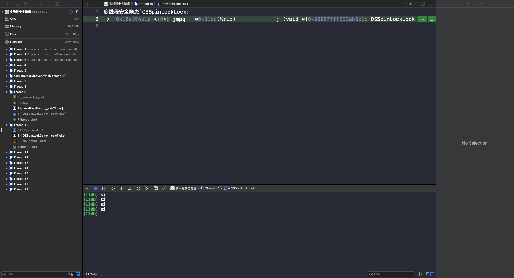
重复执行 si 指令，在第6行通过 jne 跳转到 _OSSpinLockLockSlow 函数：
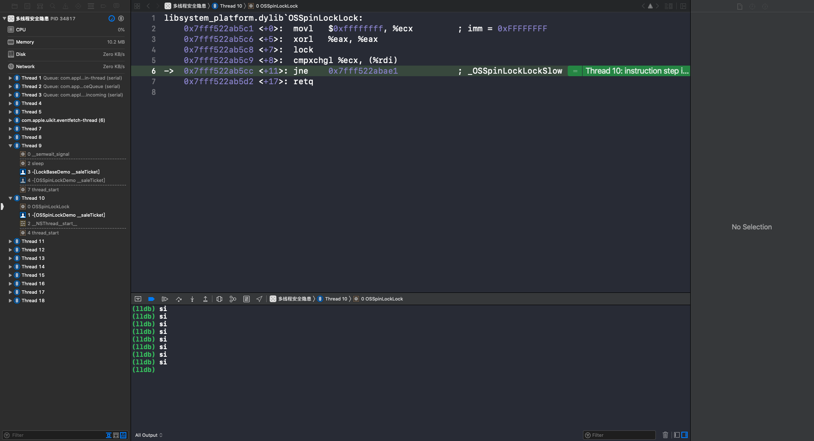
_OSSpinLockLockSlow 函数是自旋锁的核心代码，从第6行到第19行是一个 while 循环（🔎自旋锁标志）。因为 Thread 9 已经加过锁并且还没有解锁，所以这里会一直循环执行，等待 Thread 9 解锁。可以看到第14行和第16行是跳出 while 循环的判断：
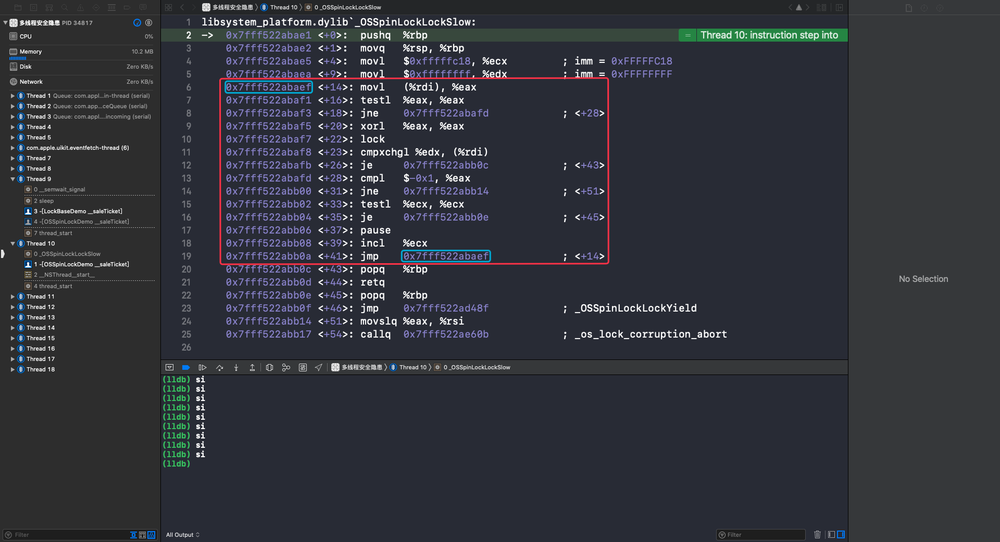


## os_unfair_lock
`OSSpinLock` 在以前算是性能最高的一种锁，但是由于不再安全（优先级反转问题），苹果已经不建议使用了，从 iOS10 开始推出了替代它的 `os_unfair_lock`。需要导入头文件 `#import <os/lock.h>`。

### 常用API
```
/// 初始化
os_unfair_lock lock = OS_UNFAIR_LOCK_INIT;
/// 尝试加锁
os_unfair_lock_trylock(&lock);
/// 加锁
os_unfair_lock_lock(&lock);
/// 解锁
os_unfair_lock_unlock(&lock);
```

### 解决卖票和存钱取钱问题
定义 OSUnfairLockDemo 继承自 LockBaseDemo。
```
#import <libkern/OSAtomic.h>

@interface OSUnfairLockDemo()
@property (nonatomic, assign) os_unfair_lock moneyLock;
@property (nonatomic, assign) os_unfair_lock ticketLock;
@end

@implementation OSUnfairLockDemo

- (instancetype)init
{
    self = [super init];
    if (self) {
        self.moneyLock = OS_UNFAIR_LOCK_INIT;
        self.ticketLock = OS_UNFAIR_LOCK_INIT;
    }
    return self;
}

/// 取钱
- (void)__drawMoney
{
    os_unfair_lock_lock(&_moneyLock);
    
    [super __drawMoney];
    
    os_unfair_lock_unlock(&_moneyLock);
}

/// 存钱
- (void)__saveManey
{
    os_unfair_lock_lock(&_moneyLock);
    
    [super __saveManey];
    
    os_unfair_lock_unlock(&_moneyLock);
}

/// 卖票
- (void)__saleTicket
{
    os_unfair_lock_lock(&_ticketLock);
    
    [super __saleTicket];
    
    os_unfair_lock_unlock(&_ticketLock);
}
```

打印结果同 OSSpinLock。

* 死锁  
如果加锁后没有解锁，其它线程就会进入等待，永远无法执行。这种由于没有解锁造成的其它线程的等待叫做死锁。

### os_unfair_lock 汇编分析

根据“查看汇编代码方法”查看 os_unfair_lock 第二次尝试加锁的汇编代码。  

可以看到第一次调用 `- (void)__saleTicket` 方法是在 Thread 8 并加锁。第二次调用 `- (void)__saleTicket` 方法是在 Thread 15，因为此时的自旋锁处于上锁状态，所以 Thread 15 处于等待锁的状态。重复执行 `si` 指令，到第11行时会调用 `os_unfair_lock_lock` 函数：
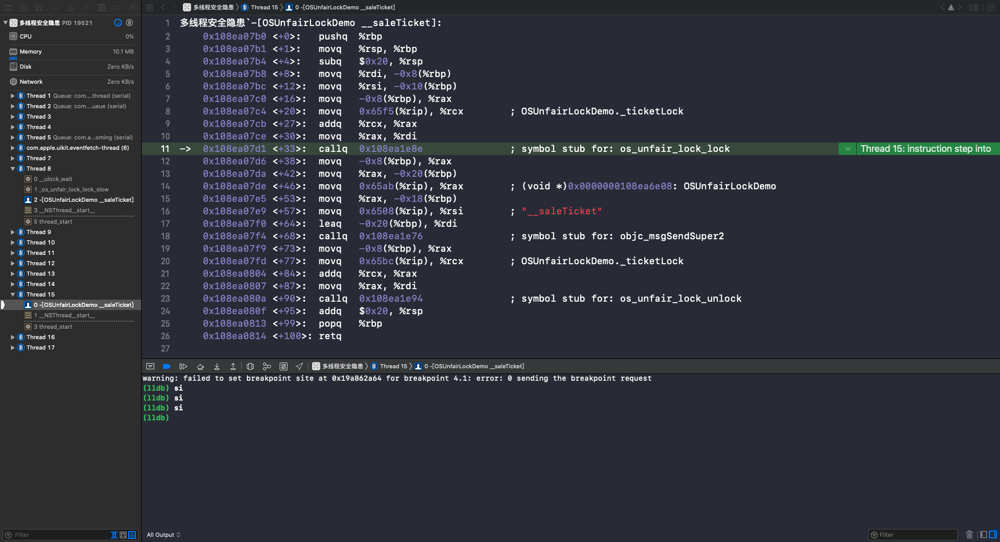
使用 `si` 指令进入到 `os_unfair_lock_lock` 函数：
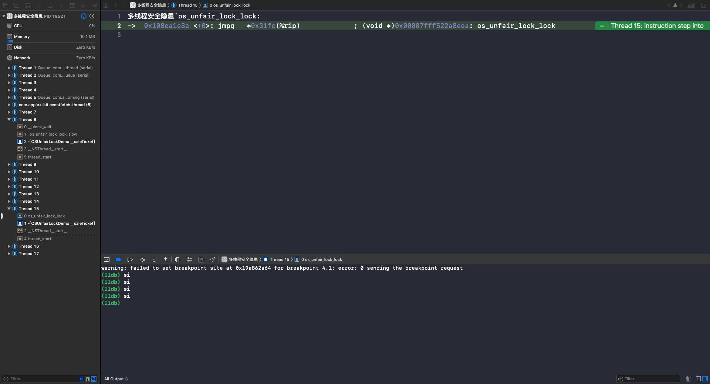
重复使用 `si` 指令，进入 `_os_unfair_lock_lock_slow` 函数：
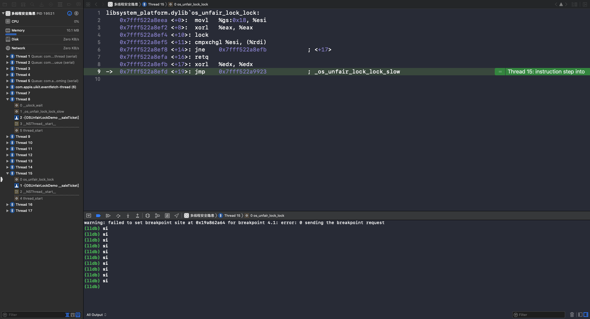
使用 `si` 指令，第56行会调用 `__ulock_wait` 函数：
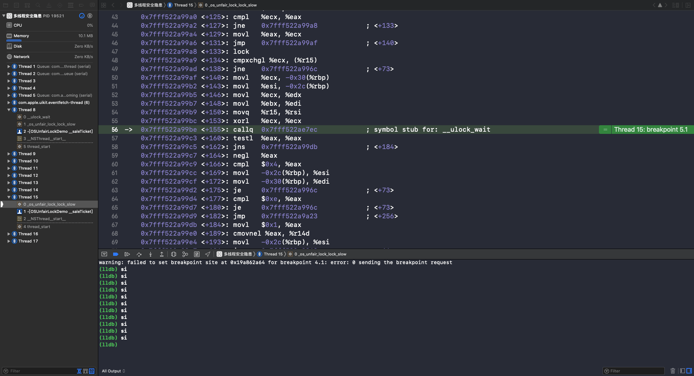
使用 `si` 指令，进入 `__ulock_wait`：
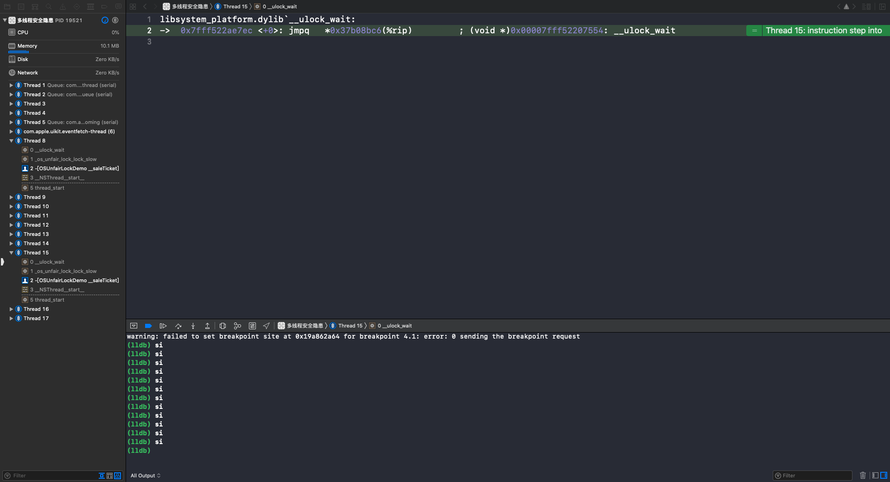
第4行 `syscall` 是系统调用，这个函数调用完成后，XCode 就又回到了OC代码页面，线程就进入休眠状态了（🔎互斥锁标志）：
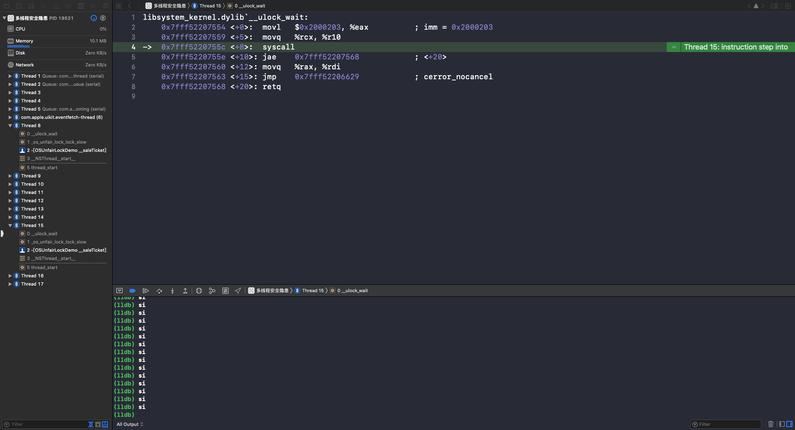

从上面👆对 os_unfair_lock 的汇编分析，可以看出 os_unfair_lock 是一个互斥锁。在 os_unfair_lock 的头文件 lock.h 里的注释可以看到一个单词 Low-level（低级锁），低级锁的特点就是休眠。自旋锁 OSSpinLock 是一个高级锁。

## pthread_mutex

mutex 叫做”互斥锁”，等待锁的线程会处于休眠状态。需要导入头文件 `#import <pthread.h>`。

### 常用API
```
/// 初始化锁的属性
pthread_mutexattr_t attr;
pthread_mutexattr_init(&attr);
pthread_mutexattr_settype(&attr, PTHREAD_MUTEX_NORMAL);
/// 初始化锁
pthread_mutex_t mutex;
pthread_mutex_init(&mutex, &attr);
/// 尝试加锁
pthread_mutex_trylock(&mutex);
/// 加锁
pthread_mutex_lock(&mutex);
/// 解锁
pthread_mutex_unlock(&mutex);
/// 销毁相关资源
pthread_mutexattr_destroy(&attr);
pthread_mutex_destroy(&mutex);
```

锁定类型：
```
#define PTHREAD_MUTEX_NORMAL		0
#define PTHREAD_MUTEX_ERRORCHECK	1
#define PTHREAD_MUTEX_RECURSIVE		2
#define PTHREAD_MUTEX_DEFAULT		PTHREAD_MUTEX_NORMAL
```

### PTHREAD_MUTEX_INITIALIZER
```
/*
 * Mutex variables
 */
#define PTHREAD_MUTEX_INITIALIZER {_PTHREAD_MUTEX_SIG_init, {0}}
```

可以看到，PTHREAD_MUTEX_INITIALIZER 是一个结构体，在使用 PTHREAD_MUTEX_INITIALIZER 初始化锁时，由于结构体语法的问题，需要进行静态初始化：
```
- (instancetype)init
{
    self = [super init];
    if (self) {
        pthread_mutex_t mutex = PTHREAD_MUTEX_INITIALIZER;
    }
    return self;
}
```

如果使用 PTHREAD_MUTEX_INITIALIZER 动态初始化 pthread_mutex_t 会报错：
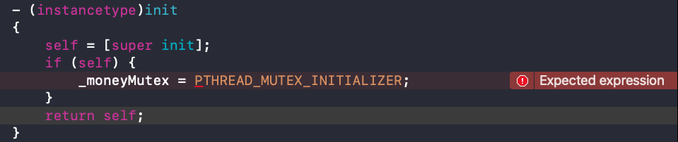

### pthread_mutexattr_t
初始化 pthread_mutex 锁： 
```
- (instancetype)init
{
    self = [super init];
    if (self) {
        /// 初始化属性
        pthread_mutexattr_t attr;
        pthread_mutexattr_init(&attr);
        pthread_mutexattr_settype(&attr, PTHREAD_MUTEX_DEFAULT);
        /// 初始化锁
        pthread_mutex_init(&_moneyMutex, &attr);
        /// 销毁属性
        pthread_mutexattr_destroy(&attr);
    }
    return self;
}
```

上面👆初始化锁的代码比较繁琐，一般使用 `pthread_mutex_init(&_moneyMutex, NULL)` 方法进行初始化。`pthread_mutex_init()` 方法的第二参数传 `NULL`，就相当于设置了 `PTHREAD_MUTEX_DEFAULT` 类型的 `pthread_mutexattr_t` 属性。

### 解决卖票和存钱取钱问题
定义 PthreadMutexDemo 继承自 LockBaseDemo。
```
#import <pthread.h>

@interface PthreadMutexDemo()
@property (nonatomic, assign) pthread_mutex_t moneyMutex;
@property (nonatomic, assign) pthread_mutex_t ticketMutex;
@end

@implementation PthreadMutexDemo

- (instancetype)init
{
    self = [super init];
    if (self) {
        pthread_mutex_init(&_moneyMutex, NULL);
        pthread_mutex_init(&_ticketMutex, NULL);
    }
    return self;
}

/// 取钱
- (void)__drawMoney
{
    pthread_mutex_lock(&_moneyMutex);
    
    [super __drawMoney];
    
    pthread_mutex_unlock(&_moneyMutex);
}

/// 存钱
- (void)__saveManey
{
    pthread_mutex_lock(&_moneyMutex);
    
    [super __saveManey];
    
    pthread_mutex_unlock(&_moneyMutex);
}

/// 卖票
- (void)__saleTicket
{
    pthread_mutex_lock(&_ticketMutex);
    
    [super __saleTicket];
    
    pthread_mutex_unlock(&_ticketMutex);
}

/// 销毁锁
- (void)dealloc
{
    pthread_mutex_destroy(&_moneyMutex);
    pthread_mutex_destroy(&_ticketMutex);
}

@end
```

打印结果同 OSSpinLock。

相对于 `OSSpinLock` 和 `os_unfair_lock`，`pthread_mutex` 的 API 里提供了销毁方法 `pthread_mutex_destroy()`，所以需要在 `-(void)dealloc` 方法里对锁进行销毁。

### pthread_mutex 汇编分析

根据“查看汇编代码方法”查看 pthread_mutex 第二次尝试加锁的汇编代码。  

可以看到第一次调用 `- (void)__saleTicket` 方法是在 Thread 10 并加锁。第二次调用 `- (void)__saleTicket` 方法是在 Thread 14，因为此时的自旋锁处于上锁状态，所以 Thread 14 处于等待锁的状态。重复执行 `si` 指令，到第11行时会调用 `phread_mutex_lock` 函数：
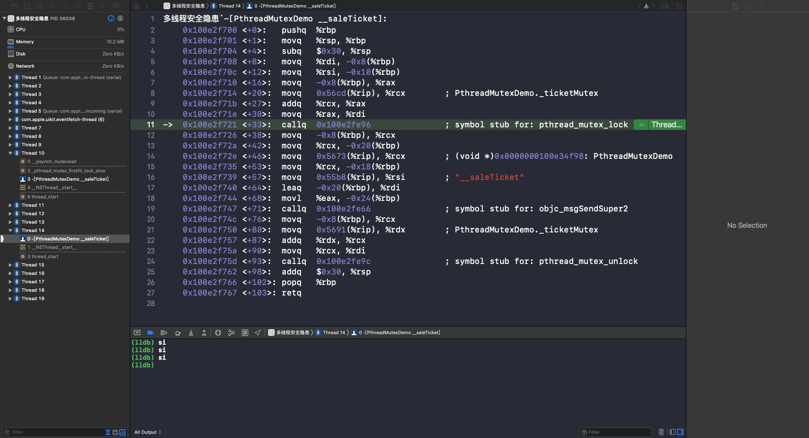
使用 `si` 指令进入到 `phread_mutex_lock` 函数：
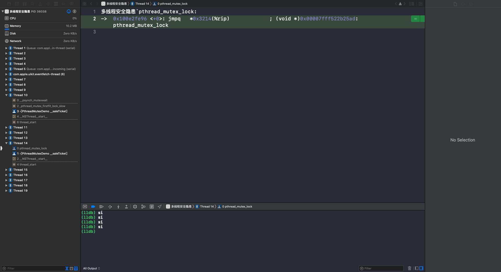
重复使用 `si` 指令，进入 `_pthread_mutex_firstfit_lock_slow` 函数：
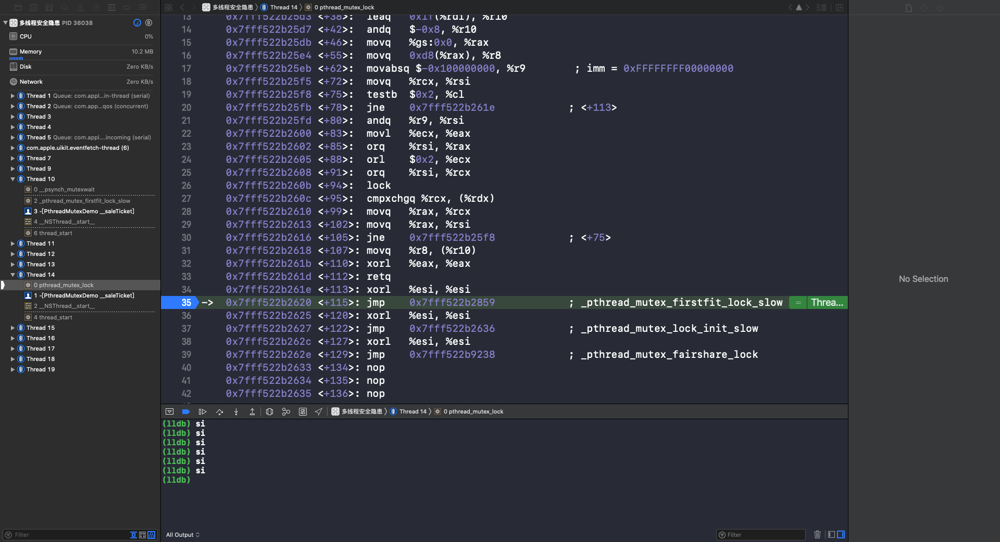
重复使用 `si` 指令，进入 `_pthread_mutex_firstfit_lock_wait` 函数：
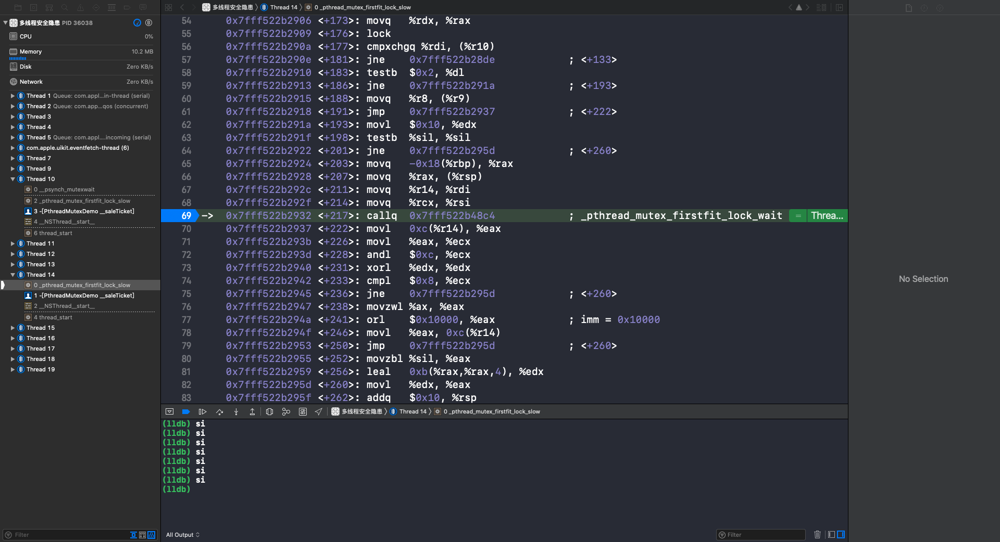
重复使用 `si` 指令，调用 `__psynch_mutexwait`：
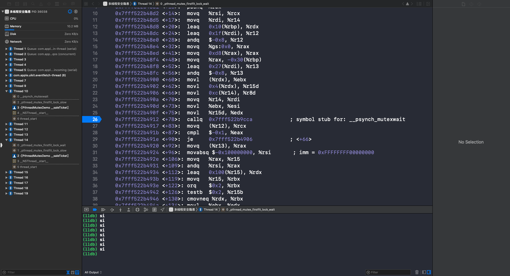
使用 `si` 指令，进入 `__psynch_mutexwait` 函数：
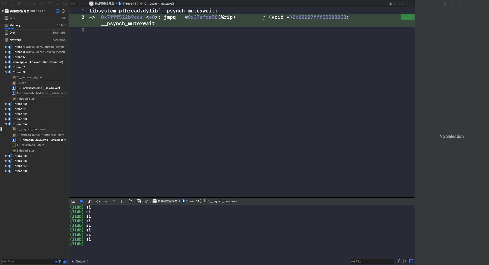
第4行 `syscall` 是系统调用，这个函数调用完成后，XCode 就又回到了OC代码页面，线程就进入休眠状态了（🔎互斥锁标志）：
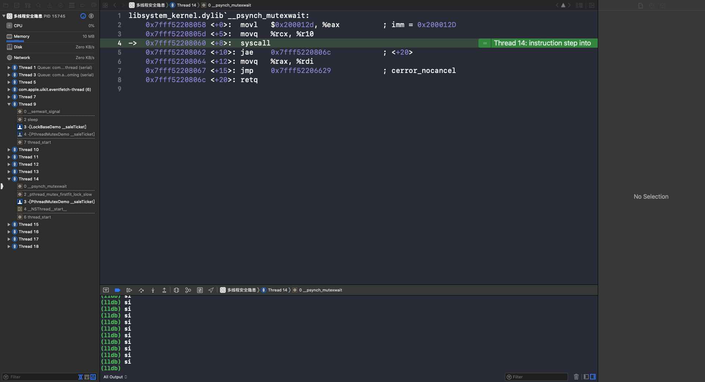

从上面👆对 pthread_mutex 的汇编分析，可以看出 pthread_mutex 是一个互斥锁，也是一个低级锁。

## pthread_mutex – 递归锁
初始化 pthread_mutex 递归锁：
```
- (instancetype)init
{
    self = [super init];
    if (self) {
        /// 初始化属性
        pthread_mutexattr_t attr;
        pthread_mutexattr_init(&attr);
        pthread_mutexattr_settype(&attr, PTHREAD_MUTEX_RECURSIVE);
        /// 初始化锁
        pthread_mutex_init(&_moneyMutex, &attr);
        /// 销毁属性
        pthread_mutexattr_destroy(&attr);
    }
    return self;
}
```

用 PTHREAD_MUTEX_RECURSIVE 类型定义的属性创建出来的 pthread_mutex 锁就是 pthread_mutex 递归锁。

### 死锁
在使用锁时如果出现了递归调用，或者在加锁后调用了一个使用同一把锁的方法，就会出现死锁的情况。与上面👆提到过的死锁的概念相同。

定义 PthreadMutexRecursiveDemo：
```
@interface PthreadMutexRecursiveDemo : LockBaseDemo
- (void)recursiveMutexTest;
@end

@implementation PthreadMutexRecursiveDemo
- (void)recursiveMutexTest
{
    NSLog(@"%s", __func__);
    /// 递归调用
    [self recursiveMutexTest];
}
@end
```

打印结果：
```
-[PthreadMutexRecursiveDemo recursiveMutexTest]
-[PthreadMutexRecursiveDemo recursiveMutexTest]
-[PthreadMutexRecursiveDemo recursiveMutexTest]
-[PthreadMutexRecursiveDemo recursiveMutexTest]
......
```

#### 死锁情况一：递归调用
```
@interface PthreadMutexRecursiveDemo : LockBaseDemo
- (void)recursiveMutexTest;
@end

@interface PthreadMutexRecursiveDemo()
@property (nonatomic, assign) pthread_mutex_t mutex;
@end

@implementation PthreadMutexRecursiveDemo
- (instancetype)init
{
    self = [super init];
    if (self) {
        pthread_mutex_init(&_mutex, NULL);
    }
    return self;
}

- (void)recursiveMutexTest
{
    pthread_mutex_lock(&_mutex);
    
    NSLog(@"%s", __func__);
    /// 递归调用
    [self recursiveMutexTest];
    
    pthread_mutex_unlock(&_mutex);
}

- (void)dealloc
{
    pthread_mutex_destroy(&_mutex);
}
@end
```

打印结果：
```
-[PthreadMutexRecursiveDemo recursiveMutexTest]
```

可以看到打印结果里只有一条打印信息，这是因为加锁后再次调用 `-(void)recursiveMutexTest` 方法，会发现 `_mutex` 已经上锁了，进入休眠等待解锁。

#### 死锁情况二：函数间互相调用
```
@interface PthreadMutexRecursiveDemo : LockBaseDemo
- (void)recursiveMutexTest;
@end

@interface PthreadMutexRecursiveDemo()
@property (nonatomic, assign) pthread_mutex_t mutex;
@end

@implementation PthreadMutexRecursiveDemo
- (instancetype)init
{
    self = [super init];
    if (self) {
        pthread_mutex_init(&_mutex, NULL);
    }
    return self;
}

- (void)recursiveMutexTest
{
    pthread_mutex_lock(&_mutex);
    
    NSLog(@"%s", __func__);
    /// 递归调用
    [self recursiveMutexTest2];
    
    pthread_mutex_unlock(&_mutex);
}

- (void)recursiveMutexTest2
{
    pthread_mutex_lock(&_mutex);
    
    NSLog(@"%s", __func__);
    
    pthread_mutex_unlock(&_mutex);
}

- (void)dealloc
{
    pthread_mutex_destroy(&_mutex);
}
@end
```

打印结果：
```
-[PthreadMutexRecursiveDemo recursiveMutexTest]
```

可以看到打印结果里只有一条打印信息，这是因为两个方法使用的是同一把锁，在 `- (void)recursiveMutexTest` 方法加锁后再去调用 `- (void)recursiveMutexTest2` 方法时，会发现 _mutex 已经上锁了，进入休眠等待解锁。

### 递归锁

因为递归锁允许在同一个线程里重复加锁，所以递归锁可以解决上面出现的死锁情况。

#### 解决死锁情况一：递归调用
```
@interface PthreadMutexRecursiveDemo : LockBaseDemo
- (void)recursiveMutexTest;
@end

@interface PthreadMutexRecursiveDemo()
@property (nonatomic, assign) pthread_mutex_t mutex;
@end

@implementation PthreadMutexRecursiveDemo
- (void)initMutex:(pthread_mutex_t *)mutex
{
    /// 初始化属性
    pthread_mutexattr_t attr;
    pthread_mutexattr_init(&attr);
    pthread_mutexattr_settype(&attr, PTHREAD_MUTEX_RECURSIVE);
    /// 初始化锁
    pthread_mutex_init(mutex, &attr);
    /// 销毁属性
    pthread_mutexattr_destroy(&attr);
}

- (instancetype)init
{
    self = [super init];
    if (self) {
        [self initMutex:&_mutex];
    }
    return self;
}

- (void)recursiveMutexTest
{
    pthread_mutex_lock(&_mutex);
    
    NSLog(@"%s", __func__);
    /// 递归调用
    [self recursiveMutexTest];
    
    pthread_mutex_unlock(&_mutex);
}

- (void)dealloc
{
    pthread_mutex_destroy(&_mutex);
}
@end
```

打印结果：
```
-[PthreadMutexRecursiveDemo recursiveMutexTest]
-[PthreadMutexRecursiveDemo recursiveMutexTest]
-[PthreadMutexRecursiveDemo recursiveMutexTest]
-[PthreadMutexRecursiveDemo recursiveMutexTest]
......
```

#### 解决死锁情况二：函数间互相调用 
```
@interface PthreadMutexRecursiveDemo : LockBaseDemo
- (void)recursiveMutexTest;
@end

@interface PthreadMutexRecursiveDemo()
@property (nonatomic, assign) pthread_mutex_t mutex;
@end

@implementation PthreadMutexRecursiveDemo
- (void)initMutex:(pthread_mutex_t *)mutex
{
    /// 初始化属性
    pthread_mutexattr_t attr;
    pthread_mutexattr_init(&attr);
    pthread_mutexattr_settype(&attr, PTHREAD_MUTEX_RECURSIVE);
    /// 初始化锁
    pthread_mutex_init(mutex, &attr);
    /// 销毁属性
    pthread_mutexattr_destroy(&attr);
}

- (instancetype)init
{
    self = [super init];
    if (self) {
        [self initMutex:&_mutex];
    }
    return self;
}


- (void)recursiveMutexTest
{
    pthread_mutex_lock(&_mutex);
    
    NSLog(@"%s", __func__);
    /// 递归调用
    [self recursiveMutexTest2];
    
    pthread_mutex_unlock(&_mutex);
}

- (void)recursiveMutexTest2
{
    pthread_mutex_lock(&_mutex);
    
    NSLog(@"%s", __func__);
    
    pthread_mutex_unlock(&_mutex);
}

- (void)dealloc
{
    pthread_mutex_destroy(&_mutex);
}
@end
```

打印结果：
```
-[PthreadMutexRecursiveDemo recursiveMutexTest]
-[PthreadMutexRecursiveDemo recursiveMutexTest2]
```

使用递归锁后，死锁的问题不存在了。但是，加了递归锁后的打印结果跟没加锁一样，这样被加锁的代码块还安全吗？其实，递归锁只可以在当前线程重复加锁。也就是说，当前线程加锁后，在当前线程再次调用 `- (void)recursiveMutexTest` 方法还可以重复加锁，而其它线程在此时调用 `- (void)recursiveMutexTest` 方法时判断到已经加过锁了就不再加锁了，会进入休眠等待解锁。

## pthread_mutex – 条件

### 相关API
```
/// 初始化锁
 pthread_mutex_t mutex;
 /// NULL代表使用默认属性
 pthread_mutex_init(&mutex, NULL);
 /// 初始化条件
 pthread_cond_t condition;
 pthread_cond_init(&condition, NULL);
 /// 等待条件（进入休眠，放开mutex；被唤醒后，会再次对mutex加锁）
 pthread_cond_wait(&condition, &mutex);
 /// 激活一个等待该条件的线程
 pthread_cond_signal(&condition);
 /// 激活所有等待该条件的线程
 pthread_cond_broadcast(&condition);
 /// 销毁资源
 pthread_mutex_destroy(&mutex);
 pthread_cond_destroy(&condition);
```

### 应用场景
```
#import <pthread.h>

@interface PthreadMutexCondDemo()
@property (nonatomic, assign) pthread_mutex_t mutex;
@property (nonatomic, assign) pthread_cond_t cond;
@property (nonatomic, strong) NSMutableArray *data;
@end

@implementation PthreadMutexCondDemo

- (void)initMutex:(pthread_mutex_t *)mutex cond:(pthread_cond_t *)cond
{
    /// 初始化属性
    pthread_mutexattr_t attr;
    pthread_mutexattr_init(&attr);
    pthread_mutexattr_settype(&attr, PTHREAD_MUTEX_RECURSIVE);
    /// 初始化锁
    pthread_mutex_init(mutex, &attr);
    /// 销毁属性
    pthread_mutexattr_destroy(&attr);
    /// 初始化条件
    pthread_cond_init(cond, NULL);
}

- (instancetype)init
{
    self = [super init];
    if (self) {
        [self initMutex:&_mutex cond:&_cond];
        
        self.data = [NSMutableArray array];
    }
    return self;
}

- (void)otherTest
{
    [[[NSThread alloc] initWithTarget:self selector:@selector(remove) object:nil] start];
    
    sleep(2.);
    
    [[[NSThread alloc] initWithTarget:self selector:@selector(add) object:nil] start];
}

/// 线程1
- (void)remove
{
    pthread_mutex_lock(&_mutex);
    NSLog(@"%s, 上锁", __func__);
    
    if (self.data.count == 0) {
        NSLog(@"%s, 等待信号", __func__);
        pthread_cond_wait(&_cond, &_mutex);
        NSLog(@"%s, 收到信号", __func__);
    }
    
    [self.data removeLastObject];
    NSLog(@"%s, 删除", __func__);
    
    pthread_mutex_unlock(&_mutex);
    NSLog(@"%s, 解锁", __func__);
}

/// 线程2
- (void)add
{
    pthread_mutex_lock(&_mutex);
    NSLog(@"%s, 上锁", __func__);
    
    [self.data addObject:@"test"];
    NSLog(@"%s, 添加", __func__);
    
    pthread_cond_signal(&_cond);
    NSLog(@"%s, 发送信号", __func__);
    
    pthread_mutex_unlock(&_mutex);
    NSLog(@"%s, 解锁", __func__);
}

- (void)dealloc
{
    pthread_mutex_destroy(&_mutex);
    pthread_cond_destroy(&_cond);
}

@end
```

打印结果：
```
00:35:21.182042+0800 多线程安全隐患[7160:142356] -[PthreadMutexCondDemo remove], 上锁
00:35:21.182158+0800 多线程安全隐患[7160:142356] -[PthreadMutexCondDemo remove], 等待信号
00:35:23.182238+0800 多线程安全隐患[7160:142386] -[PthreadMutexCondDemo add], 上锁
00:35:23.182447+0800 多线程安全隐患[7160:142386] -[PthreadMutexCondDemo add], 添加
00:35:23.182614+0800 多线程安全隐患[7160:142386] -[PthreadMutexCondDemo add], 发送信号
00:35:23.182700+0800 多线程安全隐患[7160:142386] -[PthreadMutexCondDemo add], 解锁
00:35:23.182709+0800 多线程安全隐患[7160:142356] -[PthreadMutexCondDemo remove], 收到信号
00:35:23.182772+0800 多线程安全隐患[7160:142356] -[PthreadMutexCondDemo remove], 删除
00:35:23.182835+0800 多线程安全隐患[7160:142356] -[PthreadMutexCondDemo remove], 解锁
```

在 `pthread_cond_wait()` 方法调用后，线程1会解锁并进入等待消息状态（休眠）。线程2监听到 pthread_mutex_t 锁已经解锁开始正常执行，添加完数据后发送消息。线程1在收到消息后会判断 pthread_mutex_t 锁是否已经上锁，如果已经上锁了就继续等待其解锁（休眠），一旦解锁了（线程2）就立即向下执行下面的代码。

因为应用场景是不同线程的调用，所以初始化属性时传入的第二个的参数 PTHREAD_MUTEX_RECURSIVE 也可以是 PTHREAD_MUTEX_NORMAL。

pthread_mutex 条件锁的应用场景比较少见，就算遇到了类似的场景，估计也不会选择用这种方式解决。它主要是解决优先及问题，上面👆代码中为了不对空数组进行删除操作，给锁添加了条件，保证了数组的删除操作在添加完数据后执行。

## NSLock

NSLock 是对 mutex 普通锁的封装。

### 相关API
```
/// 初始化锁
NSLock *lock = [[NSLock alloc] init];
/// 加锁
[lock lock];
/// 解锁
[lock unlock];
```

### 应用
```
@interface NSLockDemo()
@property (nonatomic, strong) NSLock *moneyLock;
@property (nonatomic, strong) NSLock *ticketLock;
@end

@implementation NSLockDemo

- (instancetype)init
{
    self = [super init];
    if (self) {
        self.moneyLock = [[NSLock alloc] init];
        self.ticketLock = [[NSLock alloc] init];
    }
    return self;
}

/// 取钱
- (void)__drawMoney
{
    [self.moneyLock lock];
    
    [super __drawMoney];
    
    [self.moneyLock unlock];
}

/// 存钱
- (void)__saveManey
{
    [self.moneyLock lock];
    
    [super __saveManey];
    
    [self.moneyLock unlock];
}

/// 卖票
- (void)__saleTicket
{
    [self.ticketLock lock];
    
    [super __saleTicket];
    
    [self.ticketLock unlock];
}

@end
```

打印结果同 OSSpinLock。

### NSLock 实现原理

在 GNUstep 里的 source/Foundation 下面可以找到 NSLock.m 文件，在该文件里可以找到 NSLock 的具体实现：
```
......
/// NSLock.h文件（Foundation）
@protocol NSLocking

- (void)lock;
- (void)unlock;

@end

@interface NSLock : NSObject <NSLocking> {
@private
    void *_priv;
}

/// 尝试加锁，返回YES表示加锁成功
- (BOOL)tryLock;
/// 尝试加锁，返回YES表示加锁成功，在终止时间（limt）前处于加锁状态，到了时间后，会自动解锁
- (BOOL)lockBeforeDate:(NSDate *)limit;

@property (nullable, copy) NSString *name API_AVAILABLE(macos(10.5), ios(2.0), watchos(2.0), tvos(9.0));

@end

/// NSLock.m文件（GNUstep）
@implementation NSLock

+ (id) allocWithZone: (NSZone*)z
{
    if (self == baseLockClass && YES == traceLocks)
    {
        return class_createInstance(tracedLockClass, 0);
    }
    return class_createInstance(self, 0);
}

+ (void) initialize
{
  static BOOL	beenHere = NO;

    if (beenHere == NO)
    {
        beenHere = YES;

        pthread_mutexattr_init(&attr_normal);
        pthread_mutexattr_settype(&attr_normal, PTHREAD_MUTEX_NORMAL);
        pthread_mutexattr_init(&attr_reporting);
        pthread_mutexattr_settype(&attr_reporting, PTHREAD_MUTEX_ERRORCHECK);
        pthread_mutexattr_init(&attr_recursive);
        pthread_mutexattr_settype(&attr_recursive, PTHREAD_MUTEX_RECURSIVE);

        pthread_mutex_init(&deadlock, &attr_normal);
        pthread_mutex_lock(&deadlock);

        baseConditionClass = [NSCondition class];
        baseConditionLockClass = [NSConditionLock class];
        baseLockClass = [NSLock class];
        baseRecursiveLockClass = [NSRecursiveLock class];

        tracedConditionClass = [GSTracedCondition class];
        tracedConditionLockClass = [GSTracedConditionLock class];
        tracedLockClass = [GSTracedLock class];
        tracedRecursiveLockClass = [GSTracedRecursiveLock class];

        untracedConditionClass = [GSUntracedCondition class];
        untracedConditionLockClass = [GSUntracedConditionLock class];
        untracedLockClass = [GSUntracedLock class];
        untracedRecursiveLockClass = [GSUntracedRecursiveLock class];
    }
}

MDEALLOC
MDESCRIPTION
MFINALIZE

/* Use an error-checking lock.  This is marginally slower, but lets us throw
 * exceptions when incorrect locking occurs.
 */
- (id) init
{
    if (nil != (self = [super init]))
    {
        if (0 != pthread_mutex_init(&_mutex, &attr_reporting))
        {
            DESTROY(self);
        }
    }
    return self;
}

......
```

## NSRecursiveLock

NSRecursiveLock 是对 mutex 递归锁的封装，API 跟 NSLock 基本一致。

### 常用API
```
/// 初始化
NSRecursiveLock *lock = [[NSRecursiveLock alloc] init];
/// 加锁
[lock lock];
/// 解锁
[lock unlock];
```

### 应用

#### 递归调用
```
@interface NSRecursiveLockDemo()
@property (nonatomic, strong) NSRecursiveLock *lock;
@end

@implementation NSRecursiveLockDemo

- (instancetype)init
{
    self = [super init];
    if (self) {
        self.lock = [[NSRecursiveLock alloc] init];
    }
    return self;
}

- (void)test
{
    [self.lock lock];
    
    NSLog(@"%s", __func__);
    
    [self test];
    
    [self.lock unlock];
}
@end
```

打印结果：
```
-[NSRecursiveLockDemo test]
-[NSRecursiveLockDemo test]
-[NSRecursiveLockDemo test]
-[NSRecursiveLockDemo test]
......
```

#### 方法间调用
```
@interface NSRecursiveLockDemo()
@property (nonatomic, strong) NSRecursiveLock *lock;
@end

@implementation NSRecursiveLockDemo

- (instancetype)init
{
    self = [super init];
    if (self) {
        self.lock = [[NSRecursiveLock alloc] init];
    }
    return self;
}

- (void)test
{
    [self.lock lock];
    
    NSLog(@"%s", __func__);
    
    [self test2];
    
    [self.lock unlock];
}

- (void)test2
{
    [self.lock lock];
    
    NSLog(@"%s", __func__);
    
   [self.lock unlock];
}
@end
```

打印结果：
```
-[NSRecursiveLockDemo test]
-[NSRecursiveLockDemo test2]
```

### NSRecursiveLock 实现原理
在 GNUstep 里的 source/Foundation 下面可以找到 NSLock.m 文件，在该文件里可以找到 NSRecursiveLock 的具体实现：
```
/// NSLock.h文件（Foundation）
@protocol NSLocking

- (void)lock;
- (void)unlock;

@end

@interface NSRecursiveLock : NSObject <NSLocking> {
@private
    void *_priv;
}

/// 尝试加锁，返回YES表示加锁成功
- (BOOL)tryLock;
/// 尝试加锁，返回YES表示加锁成功，在终止时间（limt）前处于加锁状态，到了终止时间会自动解锁
- (BOOL)lockBeforeDate:(NSDate *)limit;

@property (nullable, copy) NSString *name API_AVAILABLE(macos(10.5), ios(2.0), watchos(2.0), tvos(9.0));

@end

/// NSLock.m文件（GNUstep）
static pthread_mutexattr_t attr_recursive;

@implementation NSRecursiveLock

+ (id) allocWithZone: (NSZone*)z
{
    if (self == baseRecursiveLockClass && YES == traceLocks)
    {
        return class_createInstance(tracedRecursiveLockClass, 0);
    }
    return class_createInstance(self, 0);
}

+ (void) initialize
{
    [NSLock class];	// Ensure mutex attributes are set up.
}

MDEALLOC
MDESCRIPTION
MFINALIZE

- (id) init
{
    if (nil != (self = [super init]))
    {
        if (0 != pthread_mutex_init(&_mutex, &attr_recursive))
        {
            DESTROY(self);
        }
    }
    return self;
}

MISLOCKED
MLOCK
MLOCKBEFOREDATE
MNAME
MSTACK
MTRYLOCK
MUNLOCK
@end
```

因为 NSRecursiveLock 是在 lock.m 文件定义的，所以 `- (id)init` 方法里的 attr_recursive 属性是在 `+ (void)initialize` 方法👆里创建好的：
```
pthread_mutexattr_init(&attr_recursive);
pthread_mutexattr_settype(&attr_recursive, PTHREAD_MUTEX_RECURSIVE);
```

## NSCondition
NSCondition 是对 mutex 和 cond 的封装。

### 相关API
```
/// 初始化
NSCondition *condition = [[NSCondition alloc] init];
/// 加锁
[condition lock];
/// 解锁
[condition unlock];
/// 等待
[condition wait];
/// 发信号
[condition signal];
```

### 应用
```
@interface NSConditionDemo()
@property (nonatomic, strong) NSCondition *condition;
@property (nonatomic, strong) NSMutableArray *data;
@end

@implementation NSConditionDemo
- (instancetype)init
{
    self = [super init];
    if (self) {
        self.condition = [[NSCondition alloc] init];
        self.data = [NSMutableArray array];
    }
    return self;
}

- (void)otherTest
{
    [[[NSThread alloc] initWithTarget:self selector:@selector(remove) object:nil] start];
    
    sleep(2.);
    
    [[[NSThread alloc] initWithTarget:self selector:@selector(add) object:nil] start];
}

- (void)remove
{
    [self.condition lock];
    NSLog(@"%s, 上锁", __func__);
    
    if (self.data.count == 0) {
        NSLog(@"%s, 等待信号", __func__);
        [self.condition wait];
        NSLog(@"%s, 收到信号", __func__);
    }
    
    [self.data removeLastObject];
    NSLog(@"%s, 删除", __func__);
    
    [self.condition unlock];
    NSLog(@"%s, 解锁", __func__);
}

- (void)add
{
    [self.condition lock];
    NSLog(@"%s, 上锁", __func__);
    
    [self.data addObject:@"test"];
    NSLog(@"%s, 添加", __func__);
    
    [self.condition signal];
    NSLog(@"%s, 发送信号", __func__);
    
    [self.condition unlock];
    NSLog(@"%s, 解锁", __func__);
}

@end
```

打印结果：
```
14:30:32.001876+0800 多线程安全隐患[26696:271952] -[NSConditionDemo remove], 上锁
14:30:32.002080+0800 多线程安全隐患[26696:271952] -[NSConditionDemo remove], 等待信号
14:30:34.002046+0800 多线程安全隐患[26696:271974] -[NSConditionDemo add], 上锁
14:30:34.002227+0800 多线程安全隐患[26696:271974] -[NSConditionDemo add], 添加
14:30:34.002313+0800 多线程安全隐患[26696:271974] -[NSConditionDemo add], 发送信号
14:30:34.002384+0800 多线程安全隐患[26696:271974] -[NSConditionDemo add], 解锁
14:30:34.002395+0800 多线程安全隐患[26696:271952] -[NSConditionDemo remove], 收到信号
14:30:34.002470+0800 多线程安全隐患[26696:271952] -[NSConditionDemo remove], 删除
14:30:34.002556+0800 多线程安全隐患[26696:271952] -[NSConditionDemo remove], 解锁
```

### NSCondition 实现原理
在 GNUstep 里的 source/Foundation 下面可以找到 NSLock.m 文件，在该文件里可以找到 NSRecursiveLock 的具体实现：
```
/// NSLock.h文件（Foundation）
@protocol NSLocking

- (void)lock;
- (void)unlock;

@end

@interface NSCondition : NSObject <NSLocking> {
@private
    void *_priv;
}
/// 添加等待，收到了 signal 就会唤醒线程
- (void)wait;
/// 等待条件（进入休眠，解锁；被唤醒后，加锁）。在终止时间（limt）前收到了 signal 就会唤醒线程。当到达终止时间的时候，即使没有收到 signal，也会直接唤醒线程
- (BOOL)waitUntilDate:(NSDate *)limit;
/// 激活一个等待该条件的线程
- (void)signal;
/// 激活所有等待该条件的线程
- (void)broadcast;

@property (nullable, copy) NSString *name API_AVAILABLE(macos(10.5), ios(2.0), watchos(2.0), tvos(9.0));

@end

/// NSLock.m文件（GNUstep）
@implementation NSCondition

+ (id) allocWithZone: (NSZone*)z
{
    if (self == baseConditionClass && YES == traceLocks)
    {
        return class_createInstance(tracedConditionClass, 0);
    }
    return class_createInstance(self, 0);
}

+ (void) initialize
{
    [NSLock class];	// Ensure mutex attributes are set up.
}

- (void) broadcast
{
    pthread_cond_broadcast(&_condition);
}

MDEALLOC
MDESCRIPTION

- (void) finalize
{
    pthread_cond_destroy(&_condition);
    pthread_mutex_destroy(&_mutex);
}

- (id) init
{
    if (nil != (self = [super init]))
    {
        if (0 != pthread_cond_init(&_condition, NULL))
        {
            DESTROY(self);
        }
        else if (0 != pthread_mutex_init(&_mutex, &attr_reporting))
        {
            pthread_cond_destroy(&_condition);
            DESTROY(self);
        }
    }
    return self;
}

MISLOCKED
MLOCK
MLOCKBEFOREDATE
MNAME

- (void) signal
{
    pthread_cond_signal(&_condition);
}

MSTACK
MTRYLOCK
MUNLOCK

- (void) wait
{
    pthread_cond_wait(&_condition, &_mutex);
}

- (BOOL) waitUntilDate: (NSDate*)limit
{
    NSTimeInterval ti = [limit timeIntervalSince1970];
    double secs, subsecs;
    struct timespec timeout;
    int retVal = 0;

    // Split the float into seconds and fractions of a second
    subsecs = modf(ti, &secs);
    timeout.tv_sec = secs;
    // Convert fractions of a second to nanoseconds
    timeout.tv_nsec = subsecs * 1e9;

    /* NB. On timeout the lock is still held even through condition is not met
    */

    retVal = pthread_cond_timedwait(&_condition, &_mutex, &timeout);
    if (retVal == 0)
    {
        return YES;
    }
    if (retVal == ETIMEDOUT)
    {
        return NO;
    }
    if (retVal == EINVAL)
    {
        NSLog(@"Invalid arguments to pthread_cond_timedwait");
    }
    return NO;
}

@end
```

## NSConditionLock

NSConditionLock 是对 NSCondition 的进一步封装，可以设置具体的条件值。

### 相关API
```
/// 初始化锁，设置锁的条件1
NSConditionLock *conditionLock = [[NSConditionLock alloc] initWithCondition:1];
/// 如果条件为1就加锁
[conditionLock lockWhenCondition:1];
/// 解锁，并设置条件为2
[conditionLock unlockWithCondition:2];
```

### 应用
```
@interface NSConditionLockDemo()
@property (nonatomic, strong) NSConditionLock *conditionLock;
@property (nonatomic, strong) NSMutableArray *data;
@end

@implementation NSConditionLockDemo
- (instancetype)init
{
    self = [super init];
    if (self) {
        self.conditionLock = [[NSConditionLock alloc] initWithCondition:1];
        
        self.data = [NSMutableArray array];
    }
    return self;
}

- (void)otherTest
{
    [[[NSThread alloc] initWithTarget:self selector:@selector(one) object:nil] start];
    
    sleep(2.);
    
    [[[NSThread alloc] initWithTarget:self selector:@selector(two) object:nil] start];
    
    sleep(2.);
    
    [[[NSThread alloc] initWithTarget:self selector:@selector(three) object:nil] start];
}

- (void)one
{
    [self.conditionLock lockWhenCondition:1];
    
    NSLog(@"1");
    
    [self.conditionLock unlockWithCondition:2];
}

- (void)two
{
    [self.conditionLock lockWhenCondition:2];
    
    NSLog(@"2");
    
    [self.conditionLock unlockWithCondition:3];
}

- (void)three
{
    [self.conditionLock lockWhenCondition:3];
    
    NSLog(@"3");
    
    [self.conditionLock unlockWithCondition:4];
}
@end
```

打印结果：
```
16:04:40.425810+0800 多线程安全隐患[28831:334816] 1
16:04:42.426001+0800 多线程安全隐患[28831:334904] 2
16:04:44.426143+0800 多线程安全隐患[28831:334908] 3
```

可以看到 NSConditionLock 可以给线程之间设置优先级。

如果使用 `-(void)lock` 方法只会判断锁是否处于加锁状态，如果不是就直接加锁，不会判断条件。

### NSConditionLock 实现原理
在 GNUstep 里的 source/Foundation 下面可以找到 NSLock.m 文件，在该文件里可以找到 NSConditionLock 的具体实现：
```
/// NSLock.h文件（Foundation）
@interface NSConditionLock : NSObject <NSLocking> {
@private
    void *_priv;
}

/// 初始化
- (instancetype)initWithCondition:(NSInteger)condition NS_DESIGNATED_INITIALIZER;
/// 条件
@property (readonly) NSInteger condition;
/// 如果条件成立就加锁
- (void)lockWhenCondition:(NSInteger)condition;
/// 尝试加锁，成功返回YES
- (BOOL)tryLock;
/// 如果条件成立就尝试加锁，成功返回YES
- (BOOL)tryLockWhenCondition:(NSInteger)condition;
/// 解锁并设置条件
- (void)unlockWithCondition:(NSInteger)condition;
/// 在终止时间前加锁，成功返回YES
- (BOOL)lockBeforeDate:(NSDate *)limit;
/// 在终止时间前，如果条件成立就加锁
- (BOOL)lockWhenCondition:(NSInteger)condition beforeDate:(NSDate *)limit;

@property (nullable, copy) NSString *name API_AVAILABLE(macos(10.5), ios(2.0), watchos(2.0), tvos(9.0));

@end

/// NSLock.m文件（GNUstep）
@implementation NSConditionLock

+ (id) allocWithZone: (NSZone*)z
{
    if (self == baseConditionLockClass && YES == traceLocks)
    {
        return class_createInstance(tracedConditionLockClass, 0);
    }
    return class_createInstance(self, 0);
}

+ (void) initialize
{
    [NSLock class];	// Ensure mutex attributes are set up.
}

- (NSInteger) condition
{
    return _condition_value;
}

- (void) dealloc
{
    [_name release];
    [_condition release];
    [super dealloc];
}

- (id) init
{
    return [self initWithCondition: 0];
}

- (id) initWithCondition: (NSInteger)value
{
    if (nil != (self = [super init]))
    {
        if (nil == (_condition = [NSCondition new]))
        {
            DESTROY(self);
        }
        else
        {
            _condition_value = value;
            [_condition setName:[NSString stringWithFormat: @"condition-for-lock-%p", self]];
        }
    }
    return self;
}

- (BOOL) isLockedByCurrentThread
{
    return [_condition isLockedByCurrentThread];
}

- (void) lock
{
    [_condition lock];
}

- (BOOL) lockBeforeDate: (NSDate*)limit
{
    return [_condition lockBeforeDate: limit];
}

- (void) lockWhenCondition: (NSInteger)value
{
    [_condition lock];
    while (value != _condition_value)
    {
        [_condition wait];
    }
}

- (BOOL) lockWhenCondition: (NSInteger)condition_to_meet
                beforeDate: (NSDate*)limitDate
{
    if (NO == [_condition lockBeforeDate: limitDate])
    {
        return NO;        // Not locked
    }
    if (condition_to_meet == _condition_value)
    {
        return YES;       // Keeping the lock
    }
    while ([_condition waitUntilDate: limitDate])
    {
        if (condition_to_meet == _condition_value)
        {
            return YES;   // Keeping the lock
        }
    }
    [_condition unlock];
    return NO;            // Not locked
}

MNAME
MSTACK

- (BOOL) tryLock
{
    return [_condition tryLock];
}

- (BOOL) tryLockWhenCondition: (NSInteger)condition_to_meet
{
    if ([_condition tryLock])
    {
        if (condition_to_meet == _condition_value)
        {
            return YES; // KEEP THE LOCK
        }
        else
        {
            [_condition unlock];
        }
    }
    return NO;
}

- (void) unlock
{
    [_condition unlock];
}

- (void) unlockWithCondition: (NSInteger)value
{
    _condition_value = value;
    [_condition broadcast];
    [_condition unlock];
}

@end
```

## dispatch_semaphore

semaphore 叫做“信号量”。信号量的初始值，可以用来控制线程并发访问的最大数量。信号量的初始值为1，代表同时只允许1条线程访问资源，保证线程同步。

### 相关API
```
/// 初始化
dispatch_semaphore_t semaphore = dispatch_semaphore_create(5);
/// 如果信号量的值 >= 0，就让信号量的值减1，然后继续往下执行代码
/// 如果信号量的值 <= 0，就会休眠等待；当信号量的值变成 >0 时，就让信号量的值减1，然后继续往下执行代码
/// DISPATCH_TIME_FOREVER 表示一直在这里等待信号量变成 >0；DISPATCH_TIME_NOW 判断完后不管信号量的值是否 >0 都继续往下执行
dispatch_semaphore_wait(semaphore, DISPATCH_TIME_FOREVER);
/// 让信号量的值+1
dispatch_semaphore_signal(semaphore);
```

### 应用 - 控制最大并发数量
```
@interface SemaphoreDemo()
@property (nonatomic, strong) dispatch_semaphore_t semaphore;
@end

@implementation SemaphoreDemo
- (instancetype)init
{
    self = [super init];
    if (self) {
        self.semaphore = dispatch_semaphore_create(5);
    }
    return self;
}

- (void)otherTest
{
    for (int i=0; i < 20; i++) {
        [[[NSThread alloc] initWithTarget:self selector:@selector(test) object:nil] start];
    }
}

- (void)test
{
    dispatch_semaphore_wait(self.semaphore, DISPATCH_TIME_FOREVER);
    
    sleep(2);
    NSLog(@"test - %@", [NSThread currentThread]);
    
    dispatch_semaphore_signal(self.semaphore);
}
@end
```

打印结果：
```
10:16:19.552038+0800 多线程安全隐患[10797:47431] test - <NSThread: 0x600002deb640>{number = 6, name = (null)}
10:16:19.552041+0800 多线程安全隐患[10797:47434] test - <NSThread: 0x600002deb880>{number = 9, name = (null)}
10:16:19.552076+0800 多线程安全隐患[10797:47441] test - <NSThread: 0x600002deba40>{number = 16, name = (null)}
10:16:19.552043+0800 多线程安全隐患[10797:47433] test - <NSThread: 0x600002deb600>{number = 8, name = (null)}
10:16:19.552082+0800 多线程安全隐患[10797:47435] test - <NSThread: 0x600002deb8c0>{number = 10, name = (null)}
10:16:21.552319+0800 多线程安全隐患[10797:47445] test - <NSThread: 0x600002debb40>{number = 20, name = (null)}
10:16:21.552317+0800 多线程安全隐患[10797:47432] test - <NSThread: 0x600002deb800>{number = 7, name = (null)}
10:16:21.552447+0800 多线程安全隐患[10797:47439] test - <NSThread: 0x600002deb9c0>{number = 14, name = (null)}
10:16:21.552460+0800 多线程安全隐患[10797:47438] test - <NSThread: 0x600002deb980>{number = 13, name = (null)}
10:16:21.552463+0800 多线程安全隐患[10797:47449] test - <NSThread: 0x600002df16c0>{number = 24, name = (null)}
10:16:24.475953+0800 多线程安全隐患[10797:47436] test - <NSThread: 0x600002deb900>{number = 11, name = (null)}
10:16:24.475953+0800 多线程安全隐患[10797:47443] test - <NSThread: 0x600002debac0>{number = 18, name = (null)}
10:16:24.475953+0800 多线程安全隐患[10797:47444] test - <NSThread: 0x600002debb00>{number = 19, name = (null)}
10:16:24.475953+0800 多线程安全隐患[10797:47450] test - <NSThread: 0x600002da8380>{number = 25, name = (null)}
10:16:24.476004+0800 多线程安全隐患[10797:47446] test - <NSThread: 0x600002debb80>{number = 21, name = (null)}
10:16:26.476651+0800 多线程安全隐患[10797:47437] test - <NSThread: 0x600002deb940>{number = 12, name = (null)}
10:16:26.476652+0800 多线程安全隐患[10797:47448] test - <NSThread: 0x600002debc00>{number = 23, name = (null)}
10:16:26.476658+0800 多线程安全隐患[10797:47447] test - <NSThread: 0x600002debbc0>{number = 22, name = (null)}
10:16:26.476660+0800 多线程安全隐患[10797:47442] test - <NSThread: 0x600002deba80>{number = 17, name = (null)}
10:16:26.476658+0800 多线程安全隐患[10797:47440] test - <NSThread: 0x600002deba00>{number = 15, name = (null)}
```

从打印结果可以看到，一共执行了4次，每次5条线程。这是因为初始化 semaphore 的条件是5，每调用一次 `dispatch_semaphore_wait` 会减1，减5次等于0后就不在执行其它线程了。每调用一次 `dispatch_semaphore_signal` 会加1，就会有新的线程开始调用 `dispatch_semaphore_wait` 对条件减1。 

### 应用 - 解决卖票和存钱取钱问题
```
@interface SemaphoreDemo()
@property (nonatomic, strong) dispatch_semaphore_t moneySemaphore;
@property (nonatomic, strong) dispatch_semaphore_t ticketSemaphore;
@end

@implementation SemaphoreDemo

- (instancetype)init
{
    self = [super init];
    if (self) {
        self.moneySemaphore = dispatch_semaphore_create(1);
        self.ticketSemaphore = dispatch_semaphore_create(1);
    }
    return self;
}

/// 取钱
- (void)__drawMoney
{
    dispatch_semaphore_wait(self.moneySemaphore, DISPATCH_TIME_FOREVER);
    
    [super __drawMoney];
    
    dispatch_semaphore_signal(self.moneySemaphore);
}

/// 存钱
- (void)__saveManey
{
    dispatch_semaphore_wait(self.moneySemaphore, DISPATCH_TIME_FOREVER);
    
    [super __saveManey];
    
    dispatch_semaphore_signal(self.moneySemaphore);
}

/// 卖票
- (void)__saleTicket
{
    dispatch_semaphore_wait(self.ticketSemaphore, DISPATCH_TIME_FOREVER);
    
    [super __saleTicket];
    
    dispatch_semaphore_signal(self.ticketSemaphore);
}
@end
```

打印结果同 OSSpinLock。

### dispatch_semaphore 汇编分析

查看方式与 “OSSpinLock 汇编分析” 相同。可以看到第一次调用 `- (void)__saleTicket` 方法是在 Thread 9 对信号量减1。第二次调用 `- (void)__saleTicket` 方法是在 Thread 11，因为此时的信号量等于0，所以 Thread 15 处于等待信号量变成 >0 的状态。重复执行 `si` 指令，到第16行时会调用 `dispatch_semaphore_wait` 函数：
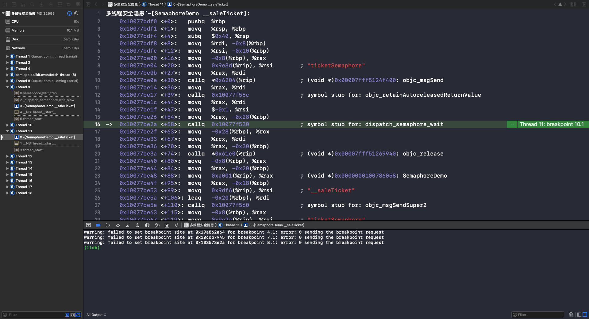
执行 `si` 指令，进入 `dispatch_semaphore_wait` 函数：
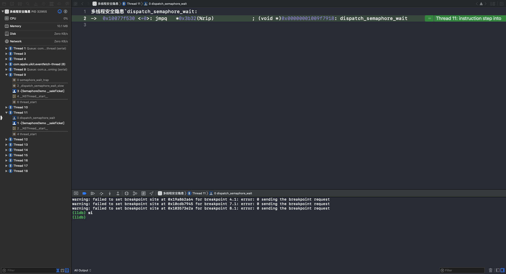
执行 `si` 指令，进入 `dispatch_semaphore_wait_slow` 函数：
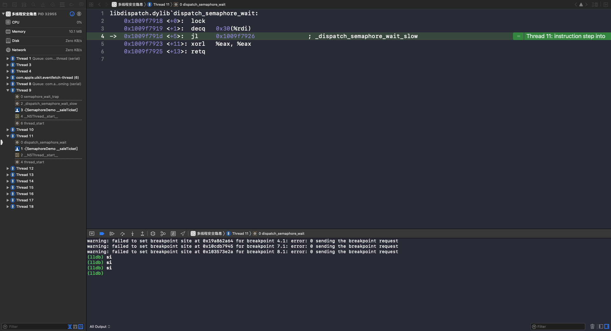
重复执行 `si` 指令，在第35行，进入 `_dispatch_sema4_wait` 函数：
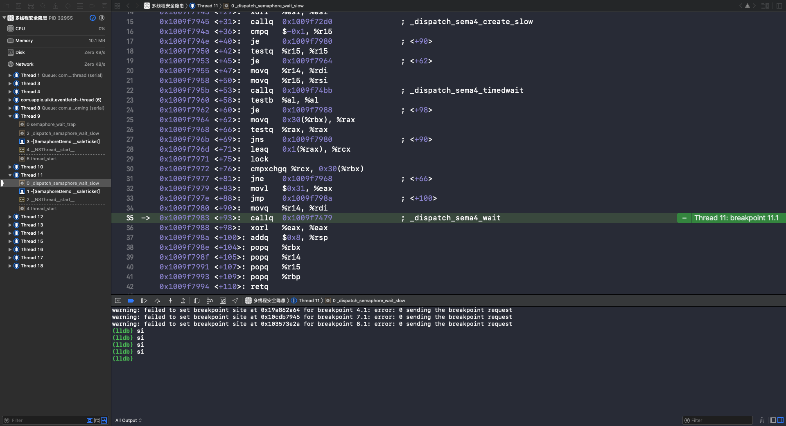
重复执行 `si` 指令，在第8行，调用 `semaphore_wait` 函数：
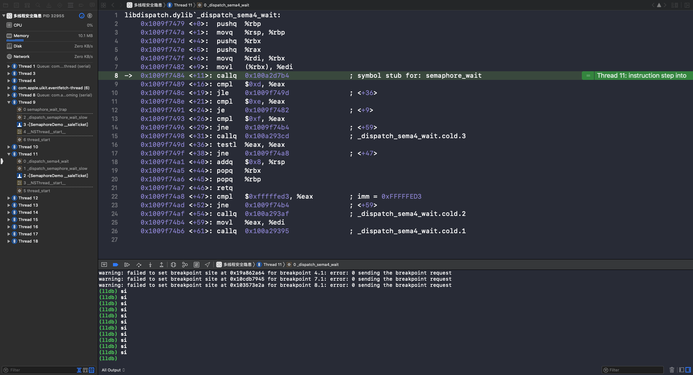
执行 `si` 指令，进入 `semaphore_wait` 函数：
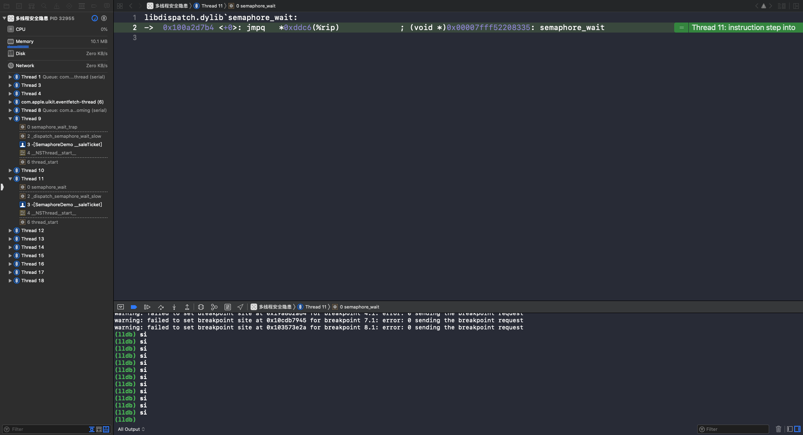
执行 `si` 指令，进入 `semaphore_wait_trap` 函数：
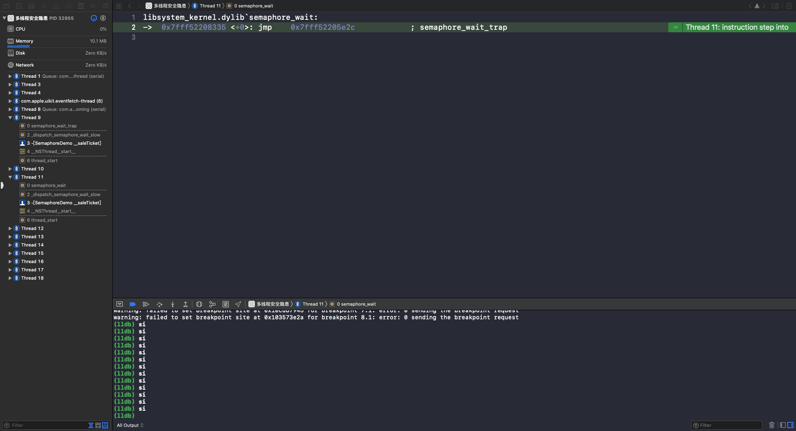
重复执行 `si` 指令，在第4行，调用 `syscall` 函数。`syscall` 是系统调用，这个函数调用完成后，XCode 就又回到了OC代码页面，线程就进入休眠状态了（🔎互斥锁标志）：
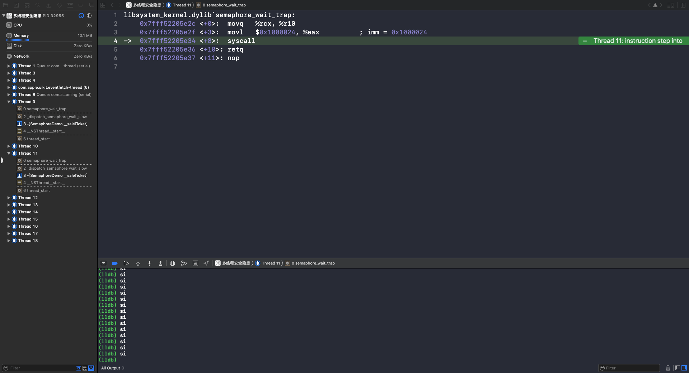

## dispatch_queue

直接使用 GCD 的串行队列，也是可以实现线程同步的。因为线程同步的本质就是保证多条线程按顺序执行任务，所以串行队列可以通过控制执行顺序来实现线程同步。

解决卖票和存钱取钱问题：
```
@interface SerialQueueDemo()
@property (nonatomic, strong) dispatch_queue_t moneyQueue;
@property (nonatomic, strong) dispatch_queue_t ticketQueue;
@end

@implementation SerialQueueDemo

- (instancetype)init
{
    self = [super init];
    if (self) {
        self.moneyQueue = dispatch_queue_create("moneyQueue", nil);
        self.ticketQueue = dispatch_queue_create("ticketQueue", nil);
    }
    return self;
}

/// 取钱
- (void)__drawMoney
{
    dispatch_sync(self.moneyQueue, ^{
       [super __drawMoney];
    });
}

/// 存钱
- (void)__saveManey
{
    dispatch_sync(self.moneyQueue, ^{
       [super __saveManey];
    });
}

/// 卖票
- (void)__saleTicket
{
    dispatch_sync(self.ticketQueue, ^{
       [super __saleTicket];
    });
}
@end
```

打印结果同 OSSpinLock。

## @synchronized
`@synchronized` 是对 mutex 递归锁的封装，`@synchronized(obj)` 内部会生成 obj 对应的递归锁，然后进行加锁、解锁操作。源码查看：[objc4-781](https://opensource.apple.com/tarballs/objc4/) 中的 objc-sync.mm 文件。

### 解决卖票和存钱取钱问题

为了解决不同对象调用的问题，存钱取钱的 `@synchronized()` 传入的是类对象 `[self class]`，卖票传入的是一个全局唯一的 NSObject 对象：
```
@implementation SynchronizeDemo

///取钱
- (void)__drawMoney
{
    @synchronized ([self class]) {
        [super __drawMoney];
    }
}

///存钱
- (void)__saveManey
{
    @synchronized ([self class]) { /// 断点1
        [super __saveManey];
    }
}

///卖票
- (void)__saleTicket
{
    static NSObject *object;
    static dispatch_once_t onceToken;
    dispatch_once(&onceToken, ^{
        object = [[NSObject alloc] init];
    });
    @synchronized (object) {
        [super __saleTicket];
    }
}
@end
```

打印结果同 OSSpinLock。

### @synchronized 实现原理

在断点1处查看汇编代码 Debug -> Debug Workflow -> Always Show Disassembly：
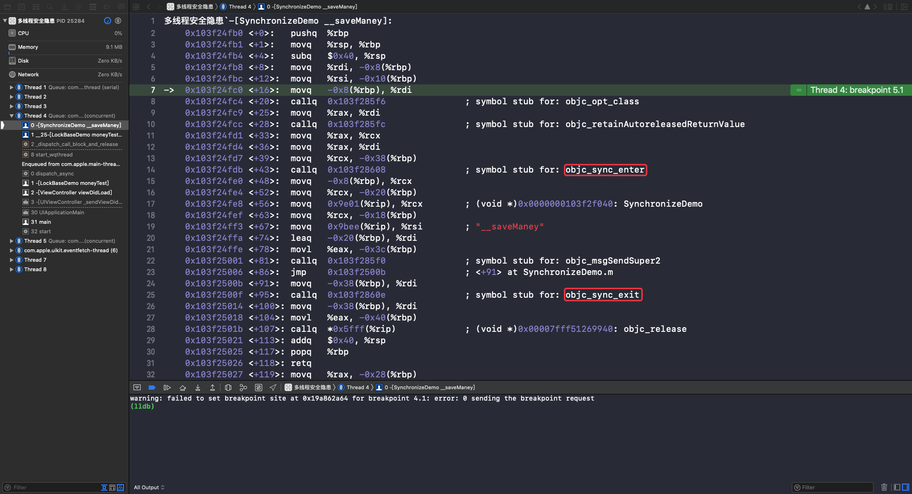

可以看到 `@synchronized()` 在开始和结束分别调用了 `objc_sync_enter()` 和 `objc_sync_exit()`，即：
```
///存钱
- (void)__saveManey
{
    @synchronized ([self class]) { /// objc_sync_enter()
        [super __saveManey];
    } /// objc_sync_exit()
}
```

源码查看：[objc4-781](https://opensource.apple.com/tarballs/objc4/) 中的 objc-sync.mm 文件
```
/// 加锁
int objc_sync_enter(id obj)
{
    int result = OBJC_SYNC_SUCCESS;

    if (obj) {
        SyncData* data = id2data(obj, ACQUIRE); /// 以 obj 为key，获取到对应的 spinlock_t
        ASSERT(data);
        data->mutex.lock(); /// 调用 mutex 上锁
    } else {
        // @synchronized(nil) does nothing
        if (DebugNilSync) {
            _objc_inform("NIL SYNC DEBUG: @synchronized(nil); set a breakpoint on objc_sync_nil to debug");
        }
        objc_sync_nil();
    }

    return result;
}

/// 尝试加锁
BOOL objc_sync_try_enter(id obj)
{
    BOOL result = YES;

    if (obj) {
        SyncData* data = id2data(obj, ACQUIRE);
        ASSERT(data);
        result = data->mutex.tryLock();
    } else {
        // @synchronized(nil) does nothing
        if (DebugNilSync) {
            _objc_inform("NIL SYNC DEBUG: @synchronized(nil); set a breakpoint on objc_sync_nil to debug");
        }
        objc_sync_nil();
    }

    return result;
}

/// 解锁
int objc_sync_exit(id obj)
{
    int result = OBJC_SYNC_SUCCESS;
    
    if (obj) {
        SyncData* data = id2data(obj, RELEASE); 
        if (!data) {
            result = OBJC_SYNC_NOT_OWNING_THREAD_ERROR;
        } else {
            bool okay = data->mutex.tryUnlock(); /// 调用 mutex 解锁
            if (!okay) {
                result = OBJC_SYNC_NOT_OWNING_THREAD_ERROR;
            }
        }
    } else {
        // @synchronized(nil) does nothing
    }

    return result;
}
```

`SyncData` 实现：
```
typedef struct alignas(CacheLineSize) SyncData {
    struct SyncData* nextData;
    DisguisedPtr<objc_object> object;
    int32_t threadCount;  // number of THREADS using this block
    recursive_mutex_t mutex; /// 对 os_unfair_recursive_lock 锁的封装👇
} SyncData;

#define LOCK_FOR_OBJ(obj) sDataLists[obj].lock
#define LIST_FOR_OBJ(obj) sDataLists[obj].data

static SyncData* id2data(id object, enum usage why)
{
    spinlock_t *lockp = &LOCK_FOR_OBJ(object);
    SyncData **listp = &LIST_FOR_OBJ(object);
    SyncData* result = NULL;

    ......
}
```

`recursive_mutex_tt` 实现：
```
class recursive_mutex_tt : nocopy_t {
    os_unfair_recursive_lock mLock;

  public:
    constexpr recursive_mutex_tt() : mLock(OS_UNFAIR_RECURSIVE_LOCK_INIT) { /// 静态初始化方法，递归锁
        lockdebug_remember_recursive_mutex(this);
    }

    constexpr recursive_mutex_tt(const fork_unsafe_lock_t unsafe)
        : mLock(OS_UNFAIR_RECURSIVE_LOCK_INIT)
    { }

    void lock()
    {
        lockdebug_recursive_mutex_lock(this);
        os_unfair_recursive_lock_lock(&mLock);
    }

    void unlock()
    {
        lockdebug_recursive_mutex_unlock(this);

        os_unfair_recursive_lock_unlock(&mLock);
    }

    void forceReset()
    {
        lockdebug_recursive_mutex_unlock(this);

        bzero(&mLock, sizeof(mLock));
        mLock = os_unfair_recursive_lock OS_UNFAIR_RECURSIVE_LOCK_INIT;
    }

    bool tryLock()
    {
        if (os_unfair_recursive_lock_trylock(&mLock)) {
            lockdebug_recursive_mutex_lock(this);
            return true;
        }
        return false;
    }

    bool tryUnlock()
    {
        if (os_unfair_recursive_lock_tryunlock4objc(&mLock)) {
            lockdebug_recursive_mutex_unlock(this);
            return true;
        }
        return false;
    }

    void assertLocked() {
        lockdebug_recursive_mutex_assert_locked(this);
    }

    void assertUnlocked() {
        lockdebug_recursive_mutex_assert_unlocked(this);
    }
};
```

因为从源码中看到锁在初始化时传入的是 OS_UNFAIR_RECURSIVE_LOCK_INIT，所以 @synchronized 其实就是一个递归锁。

验证：
```
- (void)otherTest
{
    @synchronized (self) {
        NSLog(@"%s", __func__);
        [self otherTest];
    }
}
```

打印结果：
```
-[SynchronizeDemo otherTest]
-[SynchronizeDemo otherTest]
-[SynchronizeDemo otherTest]
-[SynchronizeDemo otherTest]
......
```

# iOS线程同步方案性能比较

性能从高到低排序
* os_unfair_lock
* OSSpinLock
* dispatch_semaphore
* pthread_mutex
* dispatch_queue(DISPATCH_QUEUE_SERIAL)
* NSLock
* NSCondition
* pthread_mutex(recursive)
* NSRecursiveLock
* NSConditionLock
* @synchronized

推荐使用
* dispatch_semaphore
* pthread_mutex

## dispatch_semaphore
不同方法使用 dispatch_semaphore 实现线程同步，每个方法都需要一把属于自己的锁，可以这样实现：
```
/// 加锁
#define SemaphoreBegin \
static dispatch_semaphore_t semaphore; \
static dispatch_once_t onceToken; \
dispatch_once(&onceToken, ^{ \
    semaphore = dispatch_semaphore_create(1); \
}); \
dispatch_semaphore_wait(semaphore, DISPATCH_TIME_FOREVER);

/// 解锁
#define SemaphoreEnd \
dispatch_semaphore_signal(semaphore);

@interface ViewController ()
@end

@implementation ViewController
- (void)viewDidLoad {
    [super viewDidLoad];
    
    [[[NSThread alloc] initWithTarget:self selector:@selector(test1) object:nil] start];
    sleep(2);
    [[[NSThread alloc] initWithTarget:self selector:@selector(test2) object:nil] start];
    sleep(2);
    [[[NSThread alloc] initWithTarget:self selector:@selector(test3) object:nil] start];
}

- (void)test1 {
    SemaphoreBegin
    
    NSLog(@"%s", __func__);
    
    SemaphoreEnd
}

- (void)test2 {
    SemaphoreBegin
    
    NSLog(@"%s", __func__);
    
    SemaphoreEnd
}

- (void)test3 {
    SemaphoreBegin
    
    NSLog(@"%s", __func__);
    
    SemaphoreEnd
}
@end
```

打印结果：
```
-[ViewController test1]
-[ViewController test2]
-[ViewController test3]
```

## pthread_mutex
```
#define PthreadMutexBegain \
static pthread_mutex_t mutex; \
static dispatch_once_t onceToken; \
dispatch_once(&onceToken, ^{ \
    pthread_mutex_init(&mutex, NULL); \
}); \
pthread_mutex_lock(&mutex);

#define PthreadMutexEnd \
pthread_mutex_unlock(&mutex);

@interface ViewController ()
@end

@implementation ViewController
- (void)viewDidLoad {
    [super viewDidLoad];
    
    [[[NSThread alloc] initWithTarget:self selector:@selector(test1) object:nil] start];
    sleep(2);
    [[[NSThread alloc] initWithTarget:self selector:@selector(test2) object:nil] start];
    sleep(2);
    [[[NSThread alloc] initWithTarget:self selector:@selector(test3) object:nil] start];
}

- (void)test1 {
    PthreadMutexBegain
    
    NSLog(@"%s", __func__);
    
    PthreadMutexEnd
}

- (void)test2 {
    PthreadMutexBegain
    
    NSLog(@"%s", __func__);
    
    PthreadMutexEnd
}

- (void)test3 {
    PthreadMutexBegain
    
    NSLog(@"%s", __func__);
    
    PthreadMutexEnd
}
@end
```

打印结果：
```
-[ViewController test1]
-[ViewController test2]
-[ViewController test3]
```

## 自旋锁、互斥锁比较

* 什么情况使用自旋锁比较划算？  
预计线程等待锁的时间很短；（线程1加锁后处理的事情很少，线程2不需要等太多时间，就没必要去休眠，只通过一个while循环稍微等一下就好）  
加锁的代码（临界区）经常被调用，但竞争情况很少发生；（对于多条线程同时调用临界区的情况很少，而且临界区的调用比较频繁，使用自旋锁效率会更高）  
CPU资源不紧张；（自旋锁的优点是效率高，缺点是一直占用CPU资源，如果CPU资源不紧张，比如多核，就可以忽略自旋锁的缺点）  
多核处理器；

* 什么情况使用互斥锁比较划算？  
预计线程等待锁的时间较长；（线程1加锁后处理的事情很多，比如需要耗时2~3秒，此时自旋锁效率高的优点也没啥用了，不如让线程2去休眠，这样也减少了CPU资源的占用）  
单核处理器；（这种情况以节省CPU资源为主，尽量不去占用CPU资源）  
临界区有IO操作；（因为IO操作是比较占用CPU资源的，所以这种情况以节省CPU资源为主）  
临界区代码复杂或者循环量大；（因为这种情况比较耗时，所以忽略效率比较高的自旋锁，选择节省CPU资源的互斥锁）  
临界区竞争非常激烈；（很多线程会同事调用临界区的代码，为了节省CPU资源，选择互斥锁）

## atomic
atom：原子，不可再分割的单位。atomic：原子性，用于保证属性 setter、getter 的原子性操作，相当于在 getter 和 setter 内部加了线程同步的锁。

打开源码 [objc4-781](https://opensource.apple.com/tarballs/objc4/) 的 objc-accessors.mm 文件，查看 setter 和 getter 方法 的实现：
```
/// setter 方法
static inline void reallySetProperty(id self, SEL _cmd, id newValue, ptrdiff_t offset, bool atomic, bool copy, bool mutableCopy)
{
    if (offset == 0) {
        object_setClass(self, newValue);
        return;
    }

    id oldValue;
    id *slot = (id*) ((char*)self + offset);

    if (copy) {
        newValue = [newValue copyWithZone:nil];
    } else if (mutableCopy) {
        newValue = [newValue mutableCopyWithZone:nil];
    } else {
        if (*slot == newValue) return;
        newValue = objc_retain(newValue);
    }

    if (!atomic) {
        /// 非原子性的不加锁
        oldValue = *slot;
        *slot = newValue;
    } else {
        /// 原子性的要加锁
        spinlock_t& slotlock = PropertyLocks[slot];
        slotlock.lock();
        oldValue = *slot;
        *slot = newValue;        
        slotlock.unlock();
    }

    objc_release(oldValue);
}

/// getter 方法
id objc_getProperty(id self, SEL _cmd, ptrdiff_t offset, BOOL atomic) {
    if (offset == 0) {
        return object_getClass(self);
    }

    id *slot = (id*) ((char*)self + offset);
    /// 非原子性的不加锁
    if (!atomic) return *slot;
        
    /// 原子性的要加锁
    spinlock_t& slotlock = PropertyLocks[slot];
    slotlock.lock();
    id value = objc_retain(*slot);
    slotlock.unlock();
    
    return objc_autoreleaseReturnValue(value);
}
```

aotmic 并不能保证使用属性的过程是线程安全的：
```
@interface ViewController ()
@property (atomic, copy) NSMutableArray *data;
@end

@implementation ViewController
- (void)viewDidLoad {
    [super viewDidLoad];

    self.data = [NSMutableArray array];
    [[[NSThread alloc] initWithTarget:self selector:@selector(test1) object:nil] start];
    [[[NSThread alloc] initWithTarget:self selector:@selector(test2) object:nil] start];
    [[[NSThread alloc] initWithTarget:self selector:@selector(test3) object:nil] start];
}

- (void)test1 {
    [self.data addObject:@"test1"];
}

- (void)test2 {
    [self.data addObject:@"test2"];
}

- (void)test3 {
    [self.data addObject:@"test3"];
}
```

上面这段代码中 data 是原子性的，所以 `self.data` 是线程安全的，但是 `addObject` 不是线程安全的，需要单独加锁：
```
- (void)test1 {
    /// 加锁
    [self.data addObject:@"test1"];
    /// 解锁
}

- (void)test2 {
    /// 加锁
    [self.data addObject:@"test2"];
    /// 解锁
}

- (void)test3 {
    /// 加锁
    [self.data addObject:@"test3"];
    /// 解锁
}
```

# iOS中的读写安全方案

* 思考如何实现以下场景  
  同一时间，只能有1个线程进行写的操作；  
  同一时间，允许有多个线程进行读的操作；  
  同一时间，不允许既有写的操作，又有读的操作；  

上面的场景就是典型的“多读单写”，经常用于文件等数据的读写操作，iOS中的实现方案有 pthread_rwlock（读写锁）和 dispatch_barrier_async（异步栅栏调用）。

## pthread_rwlock

### 相关API：
```
/// 初始化
pthread_rwlock_t lock;
pthread_rwlock_init(&lock, NULL);
/// 读-加锁
pthread_rwlock_rdlock(&lock);
/// 读-尝试加锁
pthread_rwlock_tryrdlock(&lock);
/// 写-加锁
pthread_rwlock_wrlock(&lock);
/// 写-尝试加锁
pthread_rwlock_trywrlock(&lock);
/// 解锁
pthread_rwlock_unlock(&lock);
/// 销毁
pthread_rwlock_destroy(&lock);
```

 ### 应用
 ```
@interface ViewController ()
@property (nonatomic, assign) pthread_rwlock_t lock;
@end

@implementation ViewController
- (void)viewDidLoad {
    [super viewDidLoad];
    /// 初始化
    pthread_rwlock_init(&_lock, NULL);
    
    for (int i=0; i < 5; i++) {
        dispatch_async(dispatch_get_global_queue(0, 0), ^{
            [self read];
        });
        dispatch_async(dispatch_get_global_queue(0, 0), ^{
            [self write];
        });
    }
}

- (void)read
{
    pthread_rwlock_rdlock(&_lock);
    
    NSLog(@"%s", __func__);
    sleep(2);
    
    pthread_rwlock_unlock(&_lock);
}

- (void)write
{
    pthread_rwlock_wrlock(&_lock);
    
    NSLog(@"%s", __func__);
    sleep(2);
    
    pthread_rwlock_unlock(&_lock);
}

- (void)dealloc
{
    pthread_rwlock_destroy(&_lock);
}
@end
 ```

 打印结果：
 ```
10:57:24.915613+0800 多线程安全隐患[3171:66309] -[ViewController read]
10:57:24.915613+0800 多线程安全隐患[3171:66290] -[ViewController read]
10:57:26.918756+0800 多线程安全隐患[3171:66295] -[ViewController write]
10:57:28.921411+0800 多线程安全隐患[3171:66308] -[ViewController write]
10:57:30.924043+0800 多线程安全隐患[3171:66299] -[ViewController read]
10:57:32.927292+0800 多线程安全隐患[3171:66291] -[ViewController write]
10:57:34.927716+0800 多线程安全隐患[3171:66327] -[ViewController read]
10:57:36.930458+0800 多线程安全隐患[3171:66328] -[ViewController write]
10:57:38.934914+0800 多线程安全隐患[3171:66329] -[ViewController read]
10:57:40.940214+0800 多线程安全隐患[3171:66330] -[ViewController write]
 ```

 从打印结果可以看到，read 和 read 操作之间存在同时被打印的情况，但是 read 和 write 操作、write 和 write 操作之间不存在同时被打印的情况。

 ## dispatch_barrier_async

这个函数传入的并发队列必须是自己通过 dispatch_queue_cretate 创建的，如果传入的是一个串行或是一个全局的并发队列，那这个函数便等同于 dispatch_async 函数的效果。

`dispatch_barrier_async` 方法能够保证当前只有这一个临界区在执行，就可以实现在写的时候，没有其它写操作和读操作。

 ### 相关API
 ```
/// 初始化队列
dispatch_queue_t queue = dispatch_queue_create("rw_queue", DISPATCH_QUEUE_CONCURRENT);

/// 读
dispatch_async(queue, ^{
    
});

/// 写
dispatch_barrier_async(queue, ^{
    
});
 ```

 ### 应用
 ```
@interface ViewController ()
@property (nonatomic, strong) dispatch_queue_t queue;
@end

@implementation ViewController
- (void)viewDidLoad {
    [super viewDidLoad];
    self.queue = dispatch_queue_create("rw_queue", DISPATCH_QUEUE_CONCURRENT);
    for (int i=0; i<5; i++) {
        [self read];
        [self read];
        [self read];
        [self write];
        [self write];
        [self write];
    }
}

- (void)read
{
    dispatch_async(self.queue, ^{
        NSLog(@"read");
        sleep(2);
    });
}

- (void)write
{
    dispatch_barrier_async(self.queue, ^{
        NSLog(@"write");
        sleep(2);
    });
}
@end
 ```

 打印结果：
 ```
11:29:28.216697+0800 多线程安全隐患[3903:86003] read
11:29:28.216708+0800 多线程安全隐患[3903:85991] read
11:29:28.216724+0800 多线程安全隐患[3903:85989] read
11:29:30.218087+0800 多线程安全隐患[3903:86003] write
11:29:32.222250+0800 多线程安全隐患[3903:86003] write
11:29:34.226490+0800 多线程安全隐患[3903:86003] write
11:29:36.231180+0800 多线程安全隐患[3903:86003] read
11:29:36.231210+0800 多线程安全隐患[3903:85983] read
11:29:36.231265+0800 多线程安全隐患[3903:86132] read
11:29:38.232286+0800 多线程安全隐患[3903:86003] write
11:29:40.232572+0800 多线程安全隐患[3903:86003] write
11:29:42.232894+0800 多线程安全隐患[3903:86003] write
......
 ```

 从打印结果可以看到，read 操作是可以同时进行的，write 操作只能一个一个执行。

# 总结

## 你理解的多线程？  
  通过多线程可以处理耗时任务，减少主线程的压力。  
  通过多线程可以处理一个复杂任务的不同部分，充分利用CPU资源，提升效率。

## iOS的多线程方案有哪几种？你更倾向于哪一种？  

### 性能从高到低排序
os_unfair_lock  
OSSpinLock  
dispatch_semaphore  
pthread_mutex  
dispatch_queue(DISPATCH_QUEUE_SERIAL)  
NSLock  
NSCondition  
pthread_mutex(recursive)  
NSRecursiveLock  
NSConditionLock  
@synchronized

### 推荐使用  
dispatch_semaphore  
pthread_mutex

## 你在项目中用过 GCD 吗？  
### 回到主线程
```
- (void)action
{
    if (![NSThread isMainThread]) {
        dispatch_async(dispatch_get_main_queue(), ^{
            [self action];
            return;
        });
    }
}
```

### 等所有的网络请求结束后，再刷新UI
```
dispatch_semaphore_t semaphore = dispatch_semaphore_create(0);
dispatch_queue_t queue = dispatch_queue_create("myRequestQueue", NULL);
dispatch_async(queue, ^{
    dispatch_semaphore_wait(semaphore, DISPATCH_TIME_FOREVER); /// 减1
    dispatch_semaphore_wait(semaphore, DISPATCH_TIME_FOREVER); /// 减1
    dispatch_semaphore_wait(semaphore, DISPATCH_TIME_FOREVER); /// 减1
    /// 请求全部完成
    dispatch_async(dispatch_get_main_queue(), ^{
        /// 回到主线程刷新UI
    });
});

/// 网络请求1
[self.server request1Completion:^(id responseObject) {
    if (semaphore) dispatch_semaphore_signal(semaphore); /// 加1
}];

/// 网络请求2
[self.server request2Completion:^(id responseObject) {
    if (semaphore) dispatch_semaphore_signal(semaphore); /// 加1
}];

/// 网络请求3
[self.server request3Completion:^(id responseObject) {
    if (semaphore) dispatch_semaphore_signal(semaphore); /// 加1
}];
```

### 延时执行
```
/// 延时5秒执行
dispatch_after(dispatch_time(DISPATCH_TIME_NOW, (int64_t)(5 * NSEC_PER_SEC)), dispatch_get_main_queue(), ^{
    /// 回到主线程执行 
});
```

### 定时器
```
@interface ViewController ()
@property (nonatomic, strong) dispatch_source_t timer;
@end

@implementation ViewController

- (void)startTimer {

    __weak typeof(self) weakSelf = self;
    /// 初始化
    _timer = dispatch_source_create(DISPATCH_SOURCE_TYPE_TIMER, 0, 0, dispatch_get_global_queue(DISPATCH_QUEUE_PRIORITY_DEFAULT, 0));
    /// 5秒后开始执行
    dispatch_time_t delayTime = dispatch_time(DISPATCH_TIME_NOW, (int64_t)(5.0 * NSEC_PER_SEC));
    /// 5秒执行一次
    dispatch_source_set_timer(_timer, delayTime, 5.0 * NSEC_PER_SEC, 0 * NSEC_PER_SEC);
    dispatch_source_set_event_handler(_timer, ^{
        dispatch_async(dispatch_get_main_queue(), ^{
            [weakSelf cancelTimer];
        });
    });
    dispatch_resume(_timer);
}

- (void)cancelTimer {
    if (_timer) {
        dispatch_source_cancel(_timer);
        _timer = nil;
    }
}
@end
```

## GCD 的队列类型
GCD的队列可以分为2大类型
* 并发队列（Concurrent Dispatch Queue）  
可以让多个任务并发（同时）执行（自动开启多个线程同时执行任务）；  
并发功能只有在异步（dispatch_async）函数下才有效；

* 串行队列（Serial Dispatch Queue）  
让任务一个接着一个地执行（一个任务执行完毕后，再执行下一个任务）；

主队列是一个特殊的串行队列，async 方法在主队列中添加任务不会开启新线程，并且是串行执行任务。

## 说一下 OperationQueue 和 GCD 的区别，以及各自的优势
OperationQueue 是对 GCD 的封装，更加面向对象。  
GCD 相对于 OperationQueue 更加底层，效率更高。

## 线程安全的处理手段有哪些？
线程安全的处理是使用线程同步技术，包括加锁、信号量和串行队列。

## OC你了解的锁有哪些？在你回答基础上进行二次提问；  

性能从高到低排序：  
os_unfair_lock  
OSSpinLock  
dispatch_semaphore  
pthread_mutex   
NSLock  
NSCondition  
pthread_mutex(recursive)  
NSRecursiveLock  
NSConditionLock  
@synchronized

### 追问一：自旋和互斥对比？
* 什么情况使用自旋锁比较划算？  
预计线程等待锁的时间很短；（线程1加锁后处理的事情很少，线程2不需要等太多时间，就没必要去休眠，只通过一个while循环稍微等一下就好）  
加锁的代码（临界区）经常被调用，但竞争情况很少发生；（对于多条线程同时调用临界区的情况很少，而且临界区的调用比较频繁，使用自旋锁效率会更高）  
CPU资源不紧张；（自旋锁的优点是效率高，缺点是一直占用CPU资源，如果CPU资源不紧张，比如多核，就可以忽略自旋锁的缺点）  
多核处理器；

* 什么情况使用互斥锁比较划算？  
预计线程等待锁的时间较长；（线程1加锁后处理的事情很多，比如需要耗时2~3秒，此时自旋锁效率高的优点也没啥用了，不如让线程2去休眠，这样也减少了CPU资源的占用）  
单核处理器；（这种情况以节省CPU资源为主，尽量不去占用CPU资源）  
临界区有IO操作；（因为IO操作是比较占用CPU资源的，所以这种情况以节省CPU资源为主）  
临界区代码复杂或者循环量大；（因为这种情况比较耗时，所以忽略效率比较高的自旋锁，选择节省CPU资源的互斥锁）  
临界区竞争非常激烈；（很多线程会同事调用临界区的代码，为了节省CPU资源，选择互斥锁）

### 追问二：使用以上锁需要注意哪些？  
加锁后一定要解锁；  

### 追问三：用C/OC/C++，任选其一，实现自旋或互斥？
参考上面的内容。

## 请问下面代码的打印结果是什么？
```
@implementation ViewController
- (void)viewDidLoad {
    [super viewDidLoad];
    
    dispatch_queue_t queue = dispatch_get_global_queue(0, 0);
    dispatch_async(queue, ^{
        NSLog(@"1");
        [self performSelector:@selector(test) withObject:nil afterDelay:.0];
        NSLog(@"3");
    });
}

- (void)test
{
    NSLog(@"2");
}
@end
```

上面有详解👆。

## 请问下面代码的打印结果是什么？
```
@implementation ViewController
- (void)test
{
    NSLog(@"2");
}

- (void)touchesBegan:(NSSet<UITouch *> *)touches withEvent:(UIEvent *)event
{
    NSThread *thread = [[NSThread alloc] initWithBlock:^{
        NSLog(@"1");
    }];
    [thread start];
    
    [self performSelector:@selector(test) onThread:thread withObject:nil waitUntilDone:YES];
}
@end
```

上面有详解👆。