思考：
* 你在项目中是怎么优化内存的？
* 优化你是从哪几方面着手？
* 列表卡顿的原因可能有哪些？你平时是怎么优化的？
* 遇到tableView卡顿嘛？会造成卡顿的原因大致有哪些？
<!-- more -->

# 卡顿

## CPU和GPU
在屏幕成像的过程中，CPU和GPU起着至关重要的作用
* CPU（Central Processing Unit，中央处理器）  
  对象的创建和销毁、对象属性的调整、布局计算、文本的计算和排版、图片的格式转换和解码、图像的绘制（Core Graphics）

* GPU（Graphics Processing Unit，图形处理器）  
  纹理的渲染

在iOS中是双缓冲机制，有前帧缓存、后帧缓存。
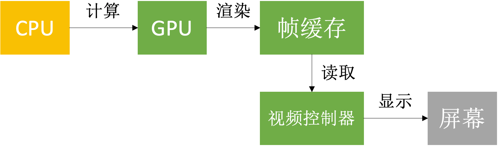

## 屏幕成像原理
显示器上的所有图像都是一线一线的扫描上去的，无论是隔行扫描还是逐行扫描，显示器，都有2种同步参数——水平同步和垂直同步。

水平同步脉冲（Horizontal synchronization pulse, Hsync）加在两个扫描行之间。它是一个短小的脉冲，在一行扫描完成之后，它就会出现，指示着这一行扫描完成，同时它也指示着下一行将要开始。 水平同步脉冲出现后，会有一小段叫horizontal back porch的时间，这段时间里的像素信号是不会被显示出来，过了这一小段时间之后，电子枪就开始扫描新的一行，将要显示的内容扫描到显示器上。

垂直同步脉冲（Vertical synchronization, Vsync）是加在两帧之间。跟水平同步脉冲类似，但它指示着前一帧的结束，和新一帧的开始。 垂直同步脉冲是一个持续时间比较长的脉冲，可能持续一行或几行的扫描时间，但在这段时间内，没有像素信号出现。
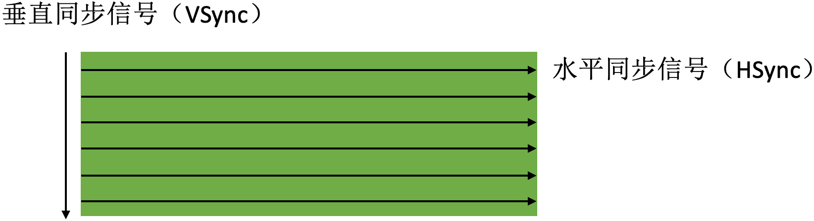

## 卡顿产生的原因
红色箭头表示CPU处理过程，蓝色箭头表示GPU处理过程，箭头的长短代表处理时间的长短。按照60FPS的刷帧率，每隔 16ms 就会有一次 VSync 信号：
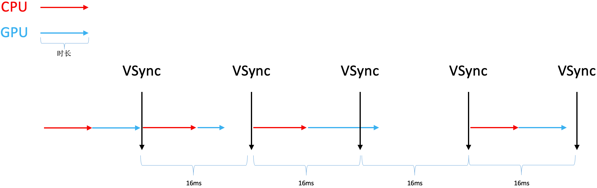

在图像渲染的过程中主要有三种情况（图中从左至右）：  
第一种情况：CPU和GPU处理完成后，正好有一次 VSync 信号，将刚刚处理好的帧数据渲染到屏幕上；  
第二种情况：CPU和GPU处理完成后，因为用时较短，VSync 信号过了一会才到，将刚刚处理好的帧数据渲染到屏幕上； 
第三种情况：CPU和GPU处理完成后，因为用时较长错过了一次 VSync 信号，这条被错过的 VSync 信号只能将之前处理好的帧数据再次渲染到屏幕上，而这一次处理好的帧数据就要等下一次 VSync 信号才能渲染到屏幕上；

第三种情况就是卡顿产生的原因。分析第三种情况可以看出，卡顿产生的主要原因是CPU、GPU处理时间的长短，那么解决卡顿的主要思路就是尽可能减少CPU、GPU资源消耗。

## 卡顿优化

### CPU
* 尽量用轻量级的对象
  比如用不到事件处理的地方，可以考虑使用 CALayer 取代 UIView；
  基本数据类型能用 int 的就不要用 NSNumber；

* 不要频繁地调用 UIView 的相关属性，比如 frame、bounds、transform 等属性，尽量减少不必要的修改；
* 尽量提前计算好布局，在有需要时一次性调整对应的属性，不要多次修改属性；
* Autolayout 会比直接设置 frame 消耗更多的 CPU 资源；
* 图片的 size 最好刚好跟 UIImageView 的 size 保持一致；（避免CPU对不同size的图片进行伸缩计算）
* 控制一下线程的最大并发数量；
* 尽量把耗时的操作放到子线程，如：文本处理（尺寸计算、绘制）、图片处理（解码、绘制）；

子线程绘制图片：
```
@implementation ViewController

- (void)viewDidLoad {
    [super viewDidLoad];
    
    UIImageView *imageView = [[UIImageView alloc] init];
    imageView.frame = CGRectMake(50, 100, 300, 300);
    [self initImageWithName:@"test" completion:^(UIImage *image) {
        imageView.image = image;
    }];
    [self.view addSubview:imageView];
}

- (void)initImageWithName:(NSString *)imageName completion:(void(^)(UIImage *image))completion
{
    dispatch_async(dispatch_get_global_queue(0, 0), ^{
        // 获取网络图片
        // CGImageRef cgImage = [UIImage imageWithData:[NSData dataWithContentsOfURL:[NSURL URLWithString:@"imageUrlString"]]].CGImage;
        // 获取CGImage
        CGImageRef cgImage = [UIImage imageNamed:imageName].CGImage;

        // alphaInfo
        CGImageAlphaInfo alphaInfo = CGImageGetAlphaInfo(cgImage) & kCGBitmapAlphaInfoMask;
        BOOL hasAlpha = NO;
        if (alphaInfo == kCGImageAlphaPremultipliedLast ||
            alphaInfo == kCGImageAlphaPremultipliedFirst ||
            alphaInfo == kCGImageAlphaLast ||
            alphaInfo == kCGImageAlphaFirst) {
            hasAlpha = YES;
        }

        // bitmapInfo
        CGBitmapInfo bitmapInfo = kCGBitmapByteOrder32Host;
        bitmapInfo |= hasAlpha ? kCGImageAlphaPremultipliedFirst : kCGImageAlphaNoneSkipFirst;

        // size
        size_t width = CGImageGetWidth(cgImage);
        size_t height = CGImageGetHeight(cgImage);

        // context
        CGContextRef context = CGBitmapContextCreate(NULL, width, height, 8, 0, CGColorSpaceCreateDeviceRGB(), bitmapInfo);

        // draw
        CGContextDrawImage(context, CGRectMake(0, 0, width, height), cgImage);

        // get CGImage
        cgImage = CGBitmapContextCreateImage(context);

        // into UIImage
        UIImage *newImage = [UIImage imageWithCGImage:cgImage];

        // release
        CGContextRelease(context);
        CGImageRelease(cgImage);

        // back to the main thread
        dispatch_async(dispatch_get_main_queue(), ^{
            if (completion) {
                completion(newImage);
            }
        });
    });
}
@end
```

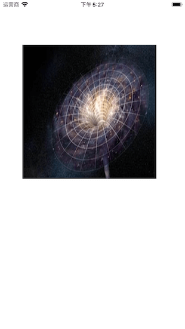

### GPU
* 尽量避免短时间内大量图片的显示，尽可能将多张图片合成一张进行显示；
* GPU能处理的最大纹理尺寸是4096x4096，一旦超过这个尺寸，就会占用CPU资源进行处理，所以纹理尽量不要超过这个尺寸；
* 尽量减少视图数量和层次；
* 减少透明的视图（alpha<1），不透明的就设置 opaque 为 YES；
* 尽量避免出现离屏渲染；

### 离屏渲染

* 在 OpenGL 中，GPU 有2种渲染方式  
  On-Screen Rendering：当前屏幕渲染，在当前用于显示的屏幕缓冲区进行渲染操作；  
  Off-Screen Rendering：离屏渲染，在当前屏幕缓冲区以外新开辟一个缓冲区进行渲染操作；

* 离屏渲染消耗性能的原因  
  1.需要创建新的缓冲区；  
  2.离屏渲染的整个过程，需要多次切换上下文环境，先是从当前屏幕（On-Screen）切换到离屏（Off-Screen）；等到离屏渲染结束以后，将离屏缓冲区的渲染结果显示到屏幕上，又需要将上下文环境从离屏切换到当前屏幕；

* 哪些操作会触发离屏渲染？  
  1.光栅化，`layer.shouldRasterize = YES`；  
  2.遮罩，`layer.mask`；  
  3.圆角，同时设置 `layer.masksToBounds = YES`、`layer.cornerRadius` 大于0；（考虑通过 CoreGraphics 绘制裁剪圆角，或者叫美工提供圆角图片）  
  4.阴影，`layer.shadowXXX`；（如果设置了 `layer.shadowPath` 就不会产生离屏渲染）

添加圆角：
```
@implementation ViewController

- (void)viewDidLoad {
    [super viewDidLoad];
    
    UIImageView *imageView = [[UIImageView alloc] init];
    imageView.frame = CGRectMake(50, 100, 300, 300);
    [self initImageWithName:@"test" completion:^(UIImage *image) {
        imageView.image = image;
        [self setCornerRadius:150 forImageView:imageView];
    }];
//    [self addShadowForImageView:imageView];
    [self.view addSubview:imageView];
}

/**
使用 CAShapeLayer 与 UIBezierPath 配合画圆角
*/
- (void)addCornerRadius:(CGFloat)radius forImageView:(UIImageView *)imageView
{
    // 开启图片上下文
    // UIGraphicsBeginImageContext(imageView.bounds.size);
    // 一般使用下面的方法
    UIGraphicsBeginImageContextWithOptions(imageView.bounds.size, NO, 0);
    // 绘制贝塞尔曲线
    UIBezierPath *bezierPath = [UIBezierPath bezierPathWithRoundedRect:imageView.bounds cornerRadius:100];
    // 按绘制的贝塞尔曲线剪切
    [bezierPath addClip];
    // 画图
    [imageView drawRect:imageView.bounds];
    // 获取上下文中的图片
    imageView.image = UIGraphicsGetImageFromCurrentImageContext();
    // 关闭图片上下文
    UIGraphicsEndImageContext();
}

/**
使用 Core Graphics 画圆角
*/
- (void)setCornerRadius:(CGFloat)radius forImageView:(UIImageView *)imageView
{
    // NO代表透明
    UIGraphicsBeginImageContextWithOptions(imageView.bounds.size, NO, 0.0);
    // 获得上下文
    CGContextRef context = UIGraphicsGetCurrentContext();
    // 添加一个圆
    CGRect rect = CGRectMake(0, 0, imageView.bounds.size.width, imageView.bounds.size.height);
    CGContextAddEllipseInRect(context, rect);
    // 裁剪
    CGContextClip(context);
    // 将图片画上去
    [imageView.image drawInRect:rect];
    imageView.image = UIGraphicsGetImageFromCurrentImageContext();
    // 关闭上下文
    UIGraphicsEndImageContext();
}
```

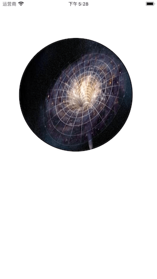

## 卡顿检测
平时所说的“卡顿”主要是因为在主线程执行了比较耗时的操作，可以添加 Observer 到主线程 RunLoop 中，通过监听 RunLoop 状态切换的耗时，以达到监控卡顿的目的。

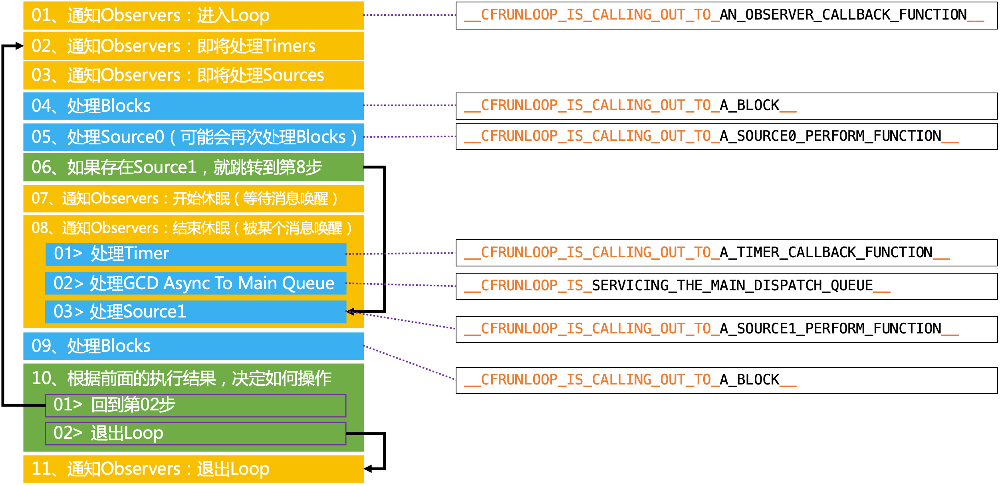

NSRunLoop 调用方法主要就是在 06 ~> 05 的循环，如果这段时间内耗时太长，就说明这段时间主线程出现卡顿。

### LXDAppFluecyMonitor
使用 [LXDAppFluecyMonitor](https://github.com/UIControl/LXDAppFluecyMonitor) 监测卡顿：
```
@interface ViewController ()<UITableViewDelegate, UITableViewDataSource>
@property (weak, nonatomic) IBOutlet UITableView *tableView;
@end

@implementation ViewController
- (void)viewDidLoad {
    [super viewDidLoad];
    [[LXDAppFluecyMonitor sharedMonitor] startMonitoring];
    [self.tableView registerClass: [UITableViewCell class] forCellReuseIdentifier: @"cell"];
}

#pragma mark - UITableViewDataSource
- (NSInteger)tableView: (UITableView *)tableView numberOfRowsInSection: (NSInteger)section {
    return 1000;
}

- (UITableViewCell *)tableView: (UITableView *)tableView cellForRowAtIndexPath: (NSIndexPath *)indexPath {
    UITableViewCell * cell = [tableView dequeueReusableCellWithIdentifier: @"cell"];
    cell.textLabel.text = [NSString stringWithFormat: @"%lu", indexPath.row];
    if (indexPath.row > 0 && indexPath.row % 30 == 0) {
        usleep(2000000);
    }
    return cell;
}
@end
```

打印结果：
```

2020-09-01 18:26:51.657686+0800 LXDAppFluecyMonitor[17096:323364] Backtrace of Thread 771:
======================================================================================
libsystem_kernel.dylib         0x7fff52208756 __semwait_signal + 10
libsystem_c.dylib              0x7fff52198510 usleep + 53
LXDAppFluecyMonitor            0x10876d58f -[ViewController tableView:cellForRowAtIndexPath:] + 351
UIKitCore                      0x7fff4953de96 -[UITableView _createPreparedCellForGlobalRow:withIndexPath:willDisplay:] + 867
UIKitCore                      0x7fff49507522 -[UITableView _updateVisibleCellsNow:] + 3010
UIKitCore                      0x7fff4952724e -[UITableView layoutSubviews] + 194
UIKitCore                      0x7fff4982d5f4 -[UIView(CALayerDelegate) layoutSublayersOfLayer:] + 2478
QuartzCore                     0x7fff2b4e9260 -[CALayer layoutSublayers] + 255
QuartzCore                     0x7fff2b4ef3eb _ZN2CA5Layer16layout_if_neededEPNS_11TransactionE + 523
QuartzCore                     0x7fff2b4faa8a _ZN2CA5Layer28layout_and_display_if_neededEPNS_11TransactionE + 80
QuartzCore                     0x7fff2b443a7c _ZN2CA7Context18commit_transactionEPNS_11TransactionEd + 324
QuartzCore                     0x7fff2b477467 _ZN2CA11Transaction6commitEv + 649
QuartzCore                     0x7fff2b3a4305 _ZN2CA7Display11DisplayLink14dispatch_itemsEyyy + 921
QuartzCore                     0x7fff2b47b768 _ZL22display_timer_callbackP12__CFMachPortPvlS1_ + 299
CoreFoundation                 0x7fff23d627dd __CFMachPortPerform + 157
CoreFoundation                 0x7fff23da2449 __CFRUNLOOP_IS_CALLING_OUT_TO_A_SOURCE1_PERFORM_FUNCTION__ + 41
CoreFoundation                 0x7fff23da1a48 __CFRunLoopDoSource1 + 472
CoreFoundation                 0x7fff23d9c474 __CFRunLoopRun + 2228
CoreFoundation                 0x7fff23d9b8a4 CFRunLoopRunSpecific + 404
GraphicsServices               0x7fff38c39bbe GSEventRunModal + 139
UIKitCore                      0x7fff49325968 UIApplicationMain + 1605
LXDAppFluecyMonitor            0x10876ea40 main + 112
libdyld.dylib                  0x7fff520ce1fd start + 1

======================================================================================
```

`LXDAppFluecyMonitor` 的核心代码：
```
static void lxdRunLoopObserverCallback(CFRunLoopObserverRef observer, CFRunLoopActivity activity, void * info) {
    SHAREDMONITOR.currentActivity = activity;
    dispatch_semaphore_signal(SHAREDMONITOR.semphore); // semphore加1
};

- (void)startMonitoring {
    if (_isMonitoring) { return; }
    _isMonitoring = YES;
    // 注册RunLoop状态观察
    CFRunLoopObserverContext context = {
        0,
        (__bridge void *)self,
        NULL,
        NULL
    };
    /** 创建RunLoop observer对象
     分配内存
     设置要关注的事件
     标识在第一次进入run loop时执行还是每次进入run loop处理时均执行
     设置优先级
     设置回调函数
     设置运行环境
     */
    _observer = CFRunLoopObserverCreate(kCFAllocatorDefault, kCFRunLoopAllActivities, YES, 0, &lxdRunLoopObserverCallback, &context);
    CFRunLoopAddObserver(CFRunLoopGetMain(), _observer, kCFRunLoopCommonModes);
    
    dispatch_async(lxd_event_monitor_queue(), ^{
        while (SHAREDMONITOR.isMonitoring) {
            // kCFRunLoopBeforeWaiting - 即将进入休眠
            if (SHAREDMONITOR.currentActivity == kCFRunLoopBeforeWaiting) {
                __block BOOL timeOut = YES;
                dispatch_async(dispatch_get_main_queue(), ^{
                    timeOut = NO;
                    dispatch_semaphore_signal(SHAREDMONITOR.eventSemphore); // eventSemphore加1
                });
                [NSThread sleepForTimeInterval: lxd_time_out_interval]; // 当前线程睡1s
                if (timeOut) { // 1s后主线程还没有将timeOut修改为NO，默认主线程阻塞
                    [LXDBacktraceLogger lxd_logMain]; // 打印日志
                }
                dispatch_wait(SHAREDMONITOR.eventSemphore, DISPATCH_TIME_FOREVER); // eventSemphore减1
            }
        }
    });
    
    dispatch_async(lxd_fluecy_monitor_queue(), ^{
        while (SHAREDMONITOR.isMonitoring) {
            // semphore减1（等待200s，semphore == 0 或者“超时”会继续向下执行）
            long waitTime = dispatch_semaphore_wait(self.semphore, dispatch_time(DISPATCH_TIME_NOW, lxd_wait_interval)); 
            if (waitTime != LXD_SEMPHORE_SUCCESS) {
                // 信号量超时了（runloop 的状态长时间没有发生变更,长期处于某一个状态下）
                if (!SHAREDMONITOR.observer) { // 异常处理
                    SHAREDMONITOR.timeOut = 0;
                    [SHAREDMONITOR stopMonitoring];
                    continue;
                }
                // kCFRunLoopBeforeSources - 即将处理source
                // kCFRunLoopAfterWaiting - 刚从休眠中唤醒
                if (SHAREDMONITOR.currentActivity == kCFRunLoopBeforeSources || SHAREDMONITOR.currentActivity == kCFRunLoopAfterWaiting) {
                    if (++SHAREDMONITOR.timeOut < 5) {
                        continue; // timeOut标记信号量超时次数，不足5次则停止当次循环开启下一次循环
                    }
                    [LXDBacktraceLogger lxd_logMain]; // 打印日志
                    [NSThread sleepForTimeInterval: lxd_restore_interval]; // 当前线程睡1s
                }
            }
            SHAREDMONITOR.timeOut = 0; // 将 timeOut 置为0
        }
    });
}

- (void)stopMonitoring {
    if (!_isMonitoring) { return; }
    _isMonitoring = NO;
    
    CFRunLoopRemoveObserver(CFRunLoopGetMain(), _observer, kCFRunLoopCommonModes);
    CFRelease(_observer);
    _observer = nil;
}
```

# 耗电

## 耗电的主要来源
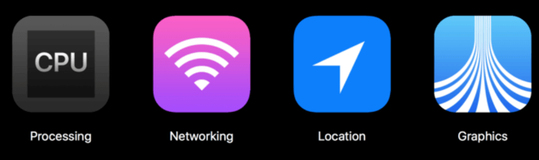
* CPU处理，Processing
* 网络，Networking
* 定位，Location
* 图像，Graphics

## 耗电优化
尽可能降低CPU、GPU功耗：
* 少用定时器

* 优化I/O操作  
  1.尽量不要频繁写入小数据，最好批量一次性写入；  
  2.读写大量重要数据时，考虑用 `dispatch_io`，其提供了基于GCD的异步操作文件 `I/O` 的API。用 `dispatch_io` 系统会优化磁盘访问；  
  3.数据量比较大的，建议使用数据库（比如SQLite、CoreData）；

* 网络优化  
  1.减少、压缩网络数据；  
  2.如果多次请求的结果是相同的，尽量使用缓存；  
  3.使用断点续传，否则网络不稳定时可能多次传输相同的内容；  
  4.网络不可用时，不要尝试执行网络请求；  
  5.让用户可以取消长时间运行或者速度很慢的网络操作，设置合适的超时时间；  
  6.批量传输，比如，下载视频流时，不要传输很小的数据包，直接下载整个文件或者一大块一大块地下载。如果下载广告，一次性多下载一些，然后再慢慢展示。如果下载电子邮件，一次下载多封，不要一封一封地下载；

* 定位优化  
  1.如果只是需要快速确定用户位置，最好用 `CLLocationManager` 的 `requestLocation` 方法。定位完成后，会自动让定位硬件断电；  
  2.如果不是导航应用，尽量不要实时更新位置，定位完毕就关掉定位服务；  
  3.尽量降低定位精度，比如尽量不要使用精度最高的 `kCLLocationAccuracyBest`；  
  4.需要后台定位时，尽量设置 `pausesLocationUpdatesAutomatically` 为YES，如果用户不太可能移动的时候系统会自动暂停位置更新；  
  5.尽量不要使用 `startMonitoringSignificantLocationChanges`，优先考虑 `startMonitoringForRegion:`；

* 硬件检测优化
  1.用户移动、摇晃、倾斜设备时，会产生动作(motion)事件，这些事件由加速度计、陀螺仪、磁力计等硬件检测。在不需要检测的场合，应该及时关闭这些硬件；

# 启动

## APP的启动
* APP的启动可以分为2种
  冷启动（Cold Launch）：从零开始启动APP；
  热启动（Warm Launch）：APP已经在内存中，在后台存活着，再次点击图标启动APP；

* APP启动时间的优化，主要是针对冷启动进行优化

* 通过添加环境变量可以打印出APP的启动时间分析（Edit scheme -> Run -> Arguments）  
  1.`DYLD_PRINT_STATISTICS` 设置为1；
  ```
  Total pre-main time:  59.28 milliseconds (100.0%)
         dylib loading time:  52.30 milliseconds (88.2%)
        rebase/binding time: 126687488.9 seconds (190140774.5%)
            ObjC setup time:   7.95 milliseconds (13.4%)
           initializer time:  34.35 milliseconds (57.9%)
           slowest intializers :
             libSystem.B.dylib :   2.69 milliseconds (4.5%)
   libBacktraceRecording.dylib :   5.37 milliseconds (9.0%)
    libMainThreadChecker.dylib :  23.06 milliseconds (38.8%)
  ```

  2.如果需要更详细的信息，那就将 `DYLD_PRINT_STATISTICS_DETAILS` 设置为1；
  ```
  total time: 433.28 milliseconds (100.0%)
  total images loaded:  318 (311 from dyld shared cache)
  total segments mapped: 21, into 385 pages
  total images loading time: 299.19 milliseconds (69.0%)
  total load time in ObjC:   9.88 milliseconds (2.2%)
  total debugger pause time: 145.67 milliseconds (33.6%)
  total dtrace DOF registration time:   0.14 milliseconds (0.0%)
  total rebase fixups:  18,196
  total rebase fixups time:   0.32 milliseconds (0.0%)
  total binding fixups: 436,908
  total binding fixups time:  86.76 milliseconds (20.0%)
  total weak binding fixups time:   0.01 milliseconds (0.0%)
  total redo shared cached bindings time: 130.32 milliseconds (30.0%)
  total bindings lazily fixed up: 0 of 0
  total time in initializers and ObjC +load:  36.94 milliseconds (8.5%)
                         libSystem.B.dylib :   2.94 milliseconds (0.6%)
               libBacktraceRecording.dylib :   6.00 milliseconds (1.3%)
                           libobjc.A.dylib :   0.86 milliseconds (0.1%)
                            CoreFoundation :   0.86 milliseconds (0.2%)
                libMainThreadChecker.dylib :  24.27 milliseconds (5.6%)
  total symbol trie searches:    1056780
  total symbol table binary searches:    0
  total images defining weak symbols:  32
  total images using weak symbols:  84
  ```

* APP的冷启动可以概括为3大阶段：dyld、runtime 和 main

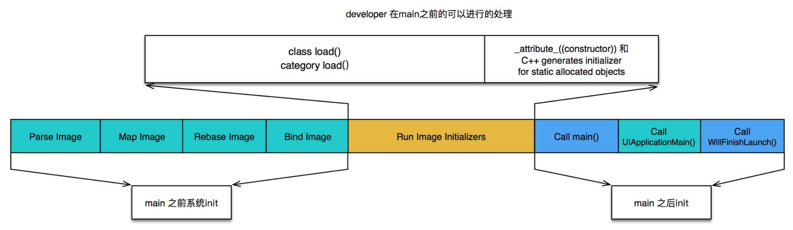

### dyld
dyld（dynamic link editor），Apple的动态链接器，可以用来装载Mach-O文件（可执行文件、动态库等）。启动APP时，dyld 所做的事情有：  
1.装载APP的可执行文件，同时会递归加载所有依赖的动态库； 
2.当dyld把可执行文件、动态库都装载完毕后，会通知Runtime进行下一步的处理；
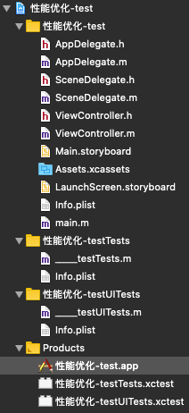
显示包内容：
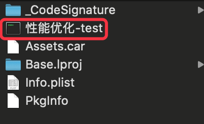

### runtime
启动APP时，runtime 所做的事情有：
1.调用 `map_images` 进行可执行文件内容的解析和处理；
2.在 `load_images` 中调用 `call_load_methods`，调用所有 Class 和 Category 的 `+load` 方法；  
3.进行各种objc结构的初始化（注册Objc类 、初始化类对象等等）；  
4.调用C++静态初始化器和 `__attribute__((constructor))` 修饰的函数；(被 `__attribute__((constructor))` 修饰的函数在程序启动时，系统会自动调用该函数)

```
void _objc_init(void)
{
    static bool initialized = false;
    if (initialized) return;
    initialized = true;
    
    environ_init();
    tls_init();
    static_init();
    runtime_init();
    exception_init();
    cache_init();
    _imp_implementationWithBlock_init();

    // 调用 map_images 和 load_images
    _dyld_objc_notify_register(&map_images, load_images, unmap_image);

#if __OBJC2__
    didCallDyldNotifyRegister = true;
#endif
}
```

上面就是 APP 启动时 dyld 和 runtime 全部的处理内容了，到此为止，可执行文件和动态库中所有的符号(Class，Protocol，Selector，IMP，…)都已经按格式成功加载到内存中，被 runtime 所管理。

### main
1.APP 的启动由 dyld 主导，将可执行文件加载到内存，顺便加载所有依赖的动态库；
2.并由 runtime 负责加载成 objc 定义的结构；
3.所有初始化工作结束后，dyld 就会调用 main 函数；
4.接下来就是 UIApplicationMain 函数，AppDelegate 的 `application:didFinishLaunchingWithOptions:` 方法；

## APP的启动优化
按照不同的阶段
* dyld
  1.减少动态库、合并一些动态库（定期清理不必要的动态库）；
  2.减少Objc类、分类的数量、减少Selector数量（定期清理不必要的类、分类）；
  3.减少C++虚函数数量；
  4.Swift尽量使用struct；

* runtime
  1.用 `+initialize` 方法和 `dispatch_once` 取代所有的 `__attribute__((constructor))`、C++静态构造器、ObjC的 `+load`；

* main  
  1.在不影响用户体验的前提下，尽可能将一些操作延迟，不要全部都放在 `application:didFinishLaunchingWithOptions:` 方法中；
  2.按需加载

# 安装包瘦身

安装包（IPA）主要由可执行文件、资源组成：

## 资源
资源：图片、音频、视频等。

1.采取无损压缩；  
2.去除没有用到的资源，工具 [LSUnusedResources](https://github.com/tinymind/LSUnusedResources)；

## 可执行文件瘦身
* 编译器优化：  
  1.Strip Linked Product、Make Strings Read-Only、Symbols Hidden by Default设置为YES；  
  2.去掉异常支持，`Enable C++ Exceptions`、`Enable Objective-C Exceptions` 设置为NO， `Other C Flags` 添加 `-fno-exceptions`；
* 利用 [AppCode](https://www.jetbrains.com/objc/) 检测未使用的代码：菜单栏 -> Code -> Inspect Code；
* 编写 LLVM 插件检测出重复代码、未被调用的代码；
* 生成 LinkMap 文件，可以查看可执行文件的具体组成
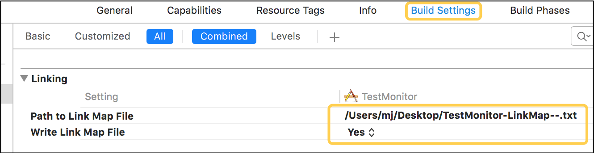
可借助第三方工具解析LinkMap文件，工具 [LinkMap](https://github.com/huanxsd/LinkMap)
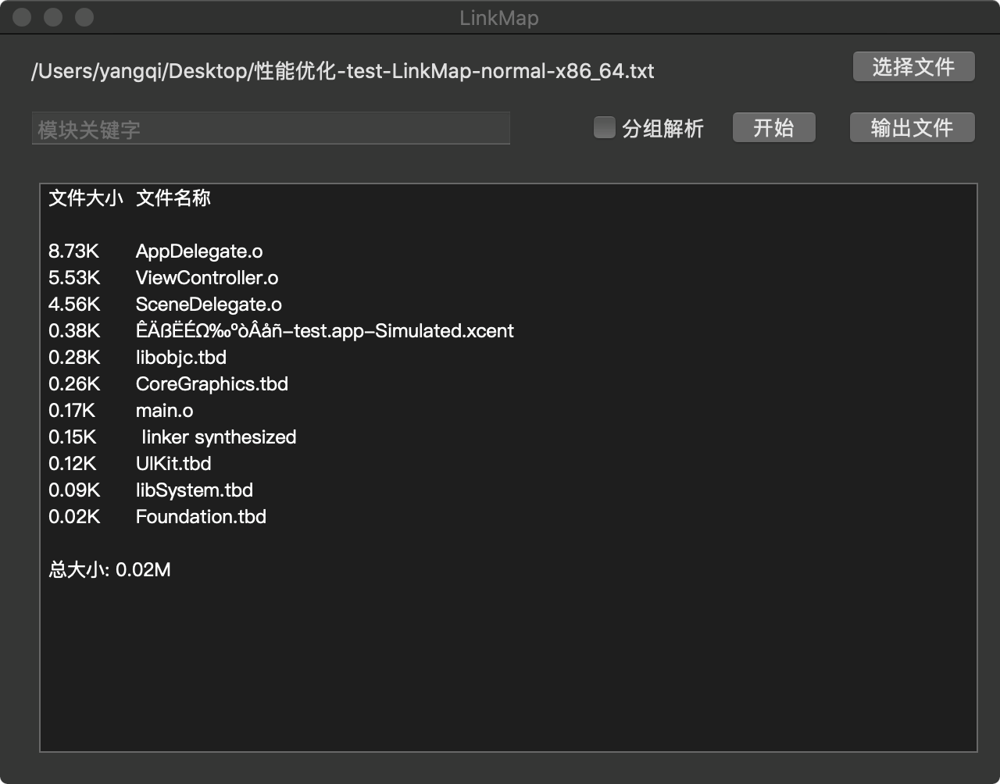

# 相关阅读  
[手机GPU](https://baike.baidu.com/item/%E6%89%8B%E6%9C%BAGPU/4688178?fr=aladdin)
[图形处理器](https://baike.baidu.com/item/%E5%9B%BE%E5%BD%A2%E5%A4%84%E7%90%86%E5%99%A8/8694767?fromtitle=gpu&fromid=105524&fr=aladdin)
[iOS应用千万级架构：性能优化与卡顿监控](https://www.cnblogs.com/jys509/p/13296128.html)
[CPU和GPU的设计区别](https://www.cnblogs.com/biglucky/p/4223565.html)
[iOS 图像渲染原理](http://chuquan.me/2018/09/25/ios-graphics-render-principle/)
[Matrix-iOS 卡顿监控](https://cloud.tencent.com/developer/article/1427933)

