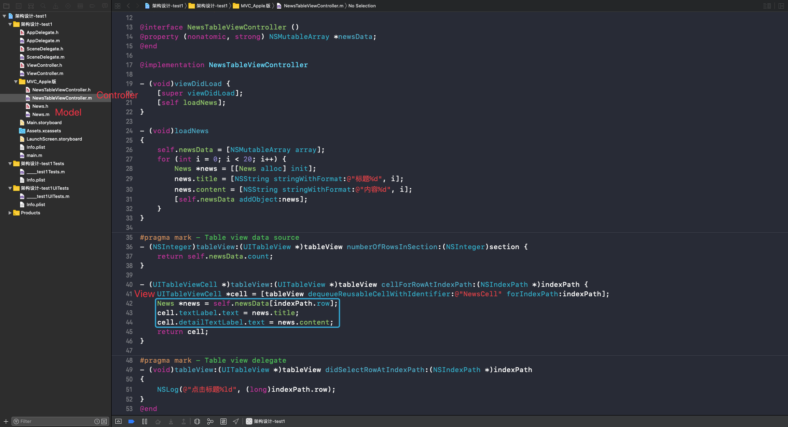
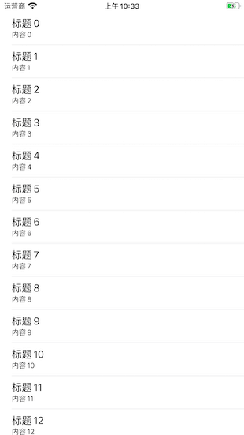
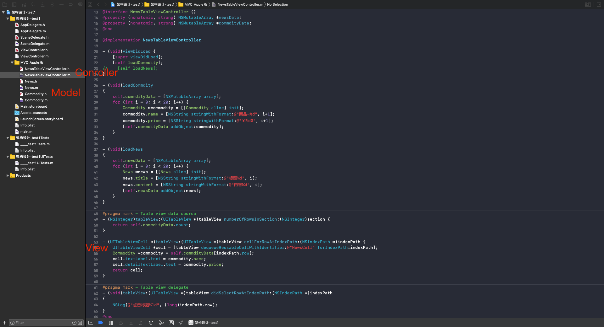
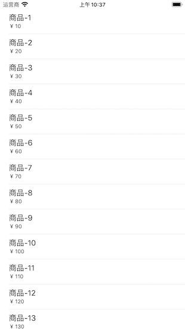
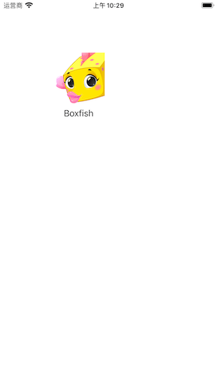
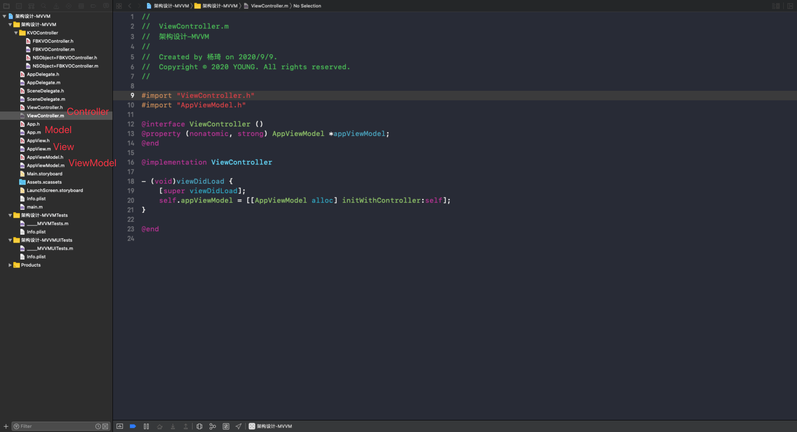

思考：  
* 讲讲 MVC、MVVM、MVP，以及你在项目里具体是怎么写的？
* 你自己用过哪些设计模式？
* 一般开始做一个项目，你的架构是如何思考的？
<!-- more -->

# 架构
架构（Architecture），软件开发中的设计方案。类与类之间的关系、模块与模块之间的关系、客户端与服务端的关系。

经常听到的架构名词：MVC、MVP、MVVM、VIPER、CDD、三层架构、四层架构......

## MVC - Apple版
Model-View-Controller

优点：View、Model可以重复利用，可以独立使用；  
缺点：Controller的代码过于臃肿；

Controller 拥有 Model 和 View，并负责处理 Model 和 View 的逻辑。Model 和 View 不需要知道对方的存在。

示例代码：




拥有关系：在使用 MVC 设计模式里，TableView 是最经典的了。从示例代码可以看到，Controller 同时拥有 News 和 NewsCell，但是 News 和 NewsCell 互相不知道对方的存在。

数据：Controller 成为 TableView 的代理，并在 `cellForRowAtIndexPath:` 方法里将 News 传递给了 NewsCell，在 NewsCell 内部处理数据。  

事件：Controller 成为 TableView 的代理，并在 `didSelectRowAtIndexPath:` 方法里处理 NewCell 的点击事件。

优点：因为 NewsCell 不需要 News，只需要在 `cellForRowAtIndexPath:` 方法里获取需要展示的数据，所以 Controller 里的 News 不是必要条件，也可以使用其它的 Model 跟当前的 Controller 和 NewsCell 组成 MVC 结构。比如新建 替换掉 News：




缺点：因为 Controller 要负责将 Model 里的数据传递给 View 用于展示，所以在 View 比较多的情况下，Controller 就会变得臃肿。在实际开发中同一个 TableView 往往会有多种 Cell，或者 Cell 的功能非常复杂，需要处理的数据和逻辑很多，所以一般不会在 Controller 里处理 Cell 数据相关的逻辑，就衍生出了下面这种设计模式👇。

## MVC – 变种
Model-View-Controller

优点：对 Controller 进行瘦身，将 View 内部的细节封装起来了，外界不知道 View 内部的具体实现；
缺点：View 依赖于 Model；

Controller 拥有 Model 和 View。View 拥有 Model，在 View 内部处理 Model。

### 示例代码一
```
// Model
@interface News : NSObject
@property (nonatomic, copy) NSString *title;
@property (nonatomic, copy) NSString *content;
@end

@implementation News
@end

// View
@interface NewsTableViewCell : UITableViewCell
@property (nonatomic, strong) News *news;
@end

@implementation NewsTableViewCell
- (void)setNews:(News *)news
{
    _news = news;
    self.textLabel.text = _news.title;
    self.detailTextLabel.text = _news.content;
}
@end

// Controller
@interface NewsTableViewController ()
@property (nonatomic, strong) NSMutableArray *newsData;
@end

@implementation NewsTableViewController

- (void)viewDidLoad {
    [super viewDidLoad];
    [self loadNews];
}

- (void)loadNews
{
    self.newsData = [NSMutableArray array];
    for (int i = 0; i < 20; i++) {
        News *news = [[News alloc] init];
        news.title = [NSString stringWithFormat:@"标题%d", i];
        news.content = [NSString stringWithFormat:@"内容%d", i];
        [self.newsData addObject:news];
    }
}

#pragma mark - Table view data source
- (NSInteger)tableView:(UITableView *)tableView numberOfRowsInSection:(NSInteger)section {
    return self.newsData.count;
}

- (UITableViewCell *)tableView:(UITableView *)tableView cellForRowAtIndexPath:(NSIndexPath *)indexPath {
    NewsTableViewCell *cell = [tableView dequeueReusableCellWithIdentifier:@"NewsTableViewCell"];
    if (!cell) {
        cell = [[NewsTableViewCell alloc] initWithStyle:UITableViewCellStyleSubtitle reuseIdentifier:@"NewsTableViewCell"];
    }
    News *news = self.newsData[indexPath.row];
    cell.news = news;
    return cell;
}

#pragma mark - Table view delegate
- (void)tableView:(UITableView *)tableView didSelectRowAtIndexPath:(NSIndexPath *)indexPath
{
    NSLog(@"点击标题%ld", (long)indexPath.row);
}
@end
```


拥有关系：从示例代码可以看到，Controller 同时拥有 News 和 NewsCell，NewsCell 拥有 News。  

数据：Controller 成为 TableView 的代理，并在 `cellForRowAtIndexPath:` 方法里将 News 传递给了 NewsCell，在 NewsCell 内部处理数据。  

事件：Controller 成为 TableView 的代理，并在 `didSelectRowAtIndexPath:` 方法里处理 NewCell 的点击事件。

### 示例代码二
```
// Model
@interface App : NSObject
@property (nonatomic, copy) NSString *image;
@property (nonatomic, copy) NSString *name;
@end

@implementation App
@end

// View
@class App, AppView;
@protocol AppViewDelegate <NSObject>
@optional
- (void)appViewDidClick:(AppView *)appView;
@end

@interface AppView : UIView
@property (nonatomic, strong) App *app;
@property (nonatomic, weak) id<AppViewDelegate> delegate;
@end

@interface AppView()
@property (nonatomic, weak) UIImageView *iconView;
@property (nonatomic, weak) UILabel *nameLabel;
@end

@implementation AppView
- (instancetype)initWithFrame:(CGRect)frame
{
    self = [super initWithFrame:frame];
    if (self) {
        UIImageView *iconView = [[UIImageView alloc] init];
        iconView.frame = CGRectMake(0, 0, 100, 100);
        iconView.contentMode = UIViewContentModeScaleAspectFill;
        [self addSubview:iconView];
        _iconView = iconView;
        
        UILabel *nameLabel = [[UILabel alloc] init];
        nameLabel.frame = CGRectMake(0, 100, 100, 30);
        nameLabel.textAlignment = NSTextAlignmentCenter;
        [self addSubview:nameLabel];
        _nameLabel = nameLabel;
    }
    return self;
}

- (void)setApp:(App *)app
{
    _app = app;
    self.iconView.image = [UIImage imageNamed:app.image];
    self.nameLabel.text = app.name;
}

- (void)touchesBegan:(NSSet<UITouch *> *)touches withEvent:(UIEvent *)event
{
    if ([self.delegate respondsToSelector:@selector(appViewDidClick:)]) {
        [self.delegate appViewDidClick:self];
    }
}
@end

// Controller
@interface ViewController ()<AppViewDelegate>
@end

@implementation ViewController
- (void)viewDidLoad {
    [super viewDidLoad];

    // 拥有View
    AppView *appView = [[AppView alloc] init];
    appView.frame = CGRectMake(100, 100, 100, 150);
    appView.delegate = self;
    [self.view addSubview:appView];
    
    // 拥有Model
    App *app = [[App alloc] init];
    app.name = @"Boxfish";
    app.image = @"Boxfish";
    
    // 数据传递
    appView.app = app;
}

#pragma mark - AppViewDelegate
- (void)appViewDidClick:(AppView *)appView
{
    NSLog(@"控制器监听到AppView的点击");
}
@end
```



拥有关系：从示例代码可以看到，Controller 同时拥有 App 和 AppView，AppView 拥有 App。  

数据：Controller 将 App 传递给了 AppView 并在 AppView 内部处理数据。  

事件：Controller 成为 AppView 的代理，并在代理方法 `appViewDidClick:` 里 AppView 的点击事件。

## MVP
Model-View-Presenter


MVP 和 MVC 很像，他们的相同点是都要求 Model 和 View 不需要知道对方的存在。他们的区别在于：  
在 MVC 中，Controller 拥有 Model 和 View，并负责处理 Model 和 View 的逻辑。  
在 MVP 中，Controller 里的逻辑代码挪到了 Presenter 里，由 Presenter 负责处理 Model 和 View 的逻辑，Controller 不需要知道 Model 和 View 的存在。

示例代码：
```
// Model
@interface App : NSObject
@property (nonatomic, copy) NSString *name;
@property (nonatomic, copy) NSString *image;
@end

@implementation App
@end

// View
@class AppView;
@protocol AppViewDelegate <NSObject>
@optional
- (void)appViewDidClick:(AppView *)appView;
@end

@interface AppView : UIView
- (void)setName:(NSString *)name andImage:(NSString *)image;
@property (nonatomic, weak) id<AppViewDelegate> delegate;
@end

@interface AppView()
@property (nonatomic, weak) UIImageView *iconView;
@property (nonatomic, weak) UILabel *nameLabel;
@end

@implementation AppView
- (instancetype)initWithFrame:(CGRect)frame
{
    self = [super initWithFrame:frame];
    if (self) {
        UIImageView *iconView = [[UIImageView alloc] init];
        iconView.frame = CGRectMake(0, 0, 100, 100);
        [self addSubview:iconView];
        _iconView = iconView;
        
        UILabel *nameLabel = [[UILabel alloc] init];
        nameLabel.frame = CGRectMake(0, 100, 100, 30);
        nameLabel.textAlignment = NSTextAlignmentCenter;
        [self addSubview:nameLabel];
        _nameLabel = nameLabel;
    }
    return self;
}

- (void)setName:(NSString *)name andImage:(NSString *)image
{
    _iconView.image = [UIImage imageNamed:image];
    _nameLabel.text = name;
}

- (void)touchesBegan:(NSSet<UITouch *> *)touches withEvent:(UIEvent *)event
{
    if ([self.delegate respondsToSelector:@selector(appViewDidClick:)]) {
        [self.delegate appViewDidClick:self];
    }
}
@end

// Presenter
@interface AppPresenter : NSObject
- (instancetype)initWithController:(UIViewController *)controller;
@end

@interface AppPresenter()<AppViewDelegate>
@property (nonatomic, weak) UIViewController *controller;
@end

@implementation AppPresenter
- (instancetype)initWithController:(UIViewController *)controller
{
    self = [super init];
    if (self) {
        self.controller = controller;
        
        AppView *appView = [[AppView alloc] init];
        appView.frame = CGRectMake(100, 100, 100, 100);
        appView.delegate = self;
        [controller.view addSubview:appView];
        
        App *app = [[App alloc] init];
        app.name = @"Boxfish";
        app.image = @"Boxfish";
        
        [appView setName:app.name andImage:app.image];
    }
    return self;
}

#pragma mark - AppViewDelegate
- (void)appViewDidClick:(AppView *)appView
{
    NSLog(@"presenter 监听到了 appView 的点击");
}
@end

// Controller
@interface ViewController ()
@property (nonatomic, strong) AppPresenter *appPresenter;
@end

@implementation ViewController
- (void)viewDidLoad {
    [super viewDidLoad];
     
    self.appPresenter = [[AppPresenter alloc] initWithController:self];
}
@end
```


拥有关系：从示例代码可以看到，Controller 拥有 AppPresenter，AppPresenter 拥有 Controller、App 和 AppView，Controller、App 和 AppView 不知道对方的存在。  

数据：AppPresenter 将 App 的数据传递给了 AppView。  

事件：AppPresenter 成为 AppView 的代理，并在代理方法 `appViewDidClick:` 里 AppView 的点击事件。

## MVVM
Model-View-ViewModel


👉 [KVOController](https://github.com/facebookarchive/KVOController)

示例代码：

```
// Model
@interface App : NSObject
@property (nonatomic, copy) NSString *name;
@property (nonatomic, copy) NSString *image;
@end

@implementation App
@end

// AppView
@class AppView,AppViewModel;
@protocol AppViewDelegate <NSObject>
@optional
- (void)appViewDidClick:(AppView *)appView;
@end

@interface AppView : UIView
@property (nonatomic, weak) AppViewModel *viewModel;
@property (nonatomic, weak) id<AppViewDelegate> delegate;
@end

@interface AppView()
@property (nonatomic, weak) UIImageView *iconView;
@property (nonatomic, weak) UILabel *nameLabel;
@end

@implementation AppView
- (instancetype)initWithFrame:(CGRect)frame
{
    self = [super initWithFrame:frame];
    if (self) {
        UIImageView *iconView = [[UIImageView alloc] init];
        iconView.frame = CGRectMake(0, 0, 100, 100);
        [self addSubview:iconView];
        _iconView = iconView;
        
        UILabel *nameLabel = [[UILabel alloc] init];
        nameLabel.frame = CGRectMake(0, 100, 100, 100);
        nameLabel.textAlignment = NSTextAlignmentCenter;
        [self addSubview:nameLabel];
        _nameLabel = nameLabel;
    }
    return self;
}

- (void)setViewModel:(AppViewModel *)viewModel
{
    _viewModel = viewModel;
    
    /// MVVM设计模式的核心代码，这里使用了 FaceBook 的开源项目 KVOController
    __weak typeof(self) weakSelf = self;
    [self.KVOController observe:viewModel keyPath:@"name" options:NSKeyValueObservingOptionNew block:^(id  _Nullable observer, id  _Nonnull object, NSDictionary<NSKeyValueChangeKey,id> * _Nonnull change) {
        weakSelf.nameLabel.text = change[NSKeyValueChangeNewKey];
    }];
    
    [self.KVOController observe:viewModel keyPath:@"image" options:NSKeyValueObservingOptionNew block:^(id  _Nullable observer, id  _Nonnull object, NSDictionary<NSKeyValueChangeKey,id> * _Nonnull change) {
        weakSelf.iconView.image = [UIImage imageNamed:change[NSKeyValueChangeNewKey]];
    }];
}

- (void)touchesBegan:(NSSet<UITouch *> *)touches withEvent:(UIEvent *)event
{
    if ([self.delegate respondsToSelector:@selector(appViewDidClick:)]) {
        [self.delegate appViewDidClick:self];
    }
}
@end

// ViewModel
@interface AppViewModel : NSObject
- (instancetype)initWithController:(UIViewController *)controller;
@end

@interface AppViewModel() <AppViewDelegate>
@property (nonatomic, weak) UIViewController *controller;
@property (nonatomic, weak) NSString *name;
@property (nonatomic, weak) NSString *image;
@end

@implementation AppViewModel
- (instancetype)initWithController:(UIViewController *)controller
{
    self = [super init];
    if (self) {
        self.controller = controller;
        
        /// 拥有View
        AppView *appView = [[AppView alloc] init];
        appView.frame = CGRectMake(100, 100, 100, 100);
        appView.delegate = self;
        appView.viewModel = self;
        [controller.view addSubview:appView];
        
        /// 拥有Model
        App *app = [[App alloc] init];
        app.name = @"Boxfish";
        app.image = @"Boxfish";
        
        /// 处理逻辑
        self.name = app.name;
        self.image = app.image;
    }
    return self;
}
@end

// View（在MVVM中，Controller被看做View）
@interface ViewController ()
@property (nonatomic, strong) AppViewModel *appViewModel;
@end

@implementation ViewController

- (void)viewDidLoad {
    [super viewDidLoad];
    self.appViewModel = [[AppViewModel alloc] initWithController:self];
}
@end
```


拥有关系：从示例代码可以看到，Controller 拥有 AppViewModel，AppViewModel 拥有 Controller、App 和 AppView，AppView 拥有 AppViewModel，Controller、App 和 AppView 不知道对方的存在。  

数据：AppView 监听 AppViewModel 中的属性，在属性发生改变时，获取到 AppViewModel 中的属性的数据。  

事件：AppViewModel 成为 AppView 的代理，并在代理方法 `appViewDidClick:` 里 AppView 的点击事件。

## 三层结构


## 四层结构


# 设计模式

设计模式（Design Pattern），是一套被反复使用、代码设计经验的总结。使用设计模式的好处是：可重用代码、让代码更容易被他人理解、保证代码可靠性。一般与编程语言无关，是一套比较成熟的编程思想。

设计模式可以分为三大类：
* 创建型模式：对象实例化的模式，用于解耦对象的实例化过程。单例模式、工厂方法模式，等等。
* 结构型模式：把类或对象结合在一起形成一个更大的结构。代理模式、适配器模式、组合模式、装饰模式，等等。
* 行为型模式：类或对象之间如何交互，及划分责任和算法。观察者模式、命令模式、责任链模式，等等。


相关阅读：  
[三层架构](https://baike.baidu.com/item/%E4%B8%89%E5%B1%82%E6%9E%B6%E6%9E%84/11031448?fr=aladdin)
[三层结构](https://baike.baidu.com/item/%E4%B8%89%E5%B1%82%E7%BB%93%E6%9E%84/5091466?fr=aladdin)


