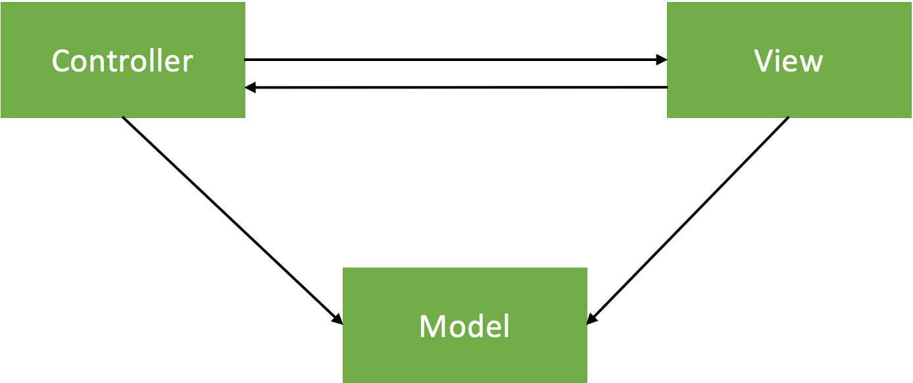
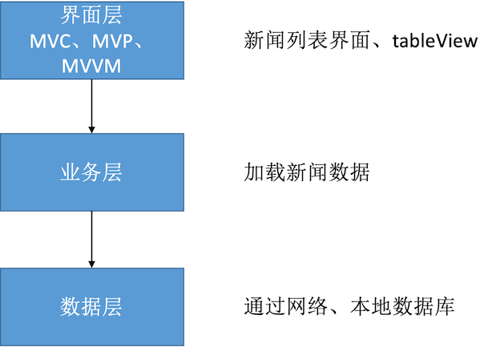
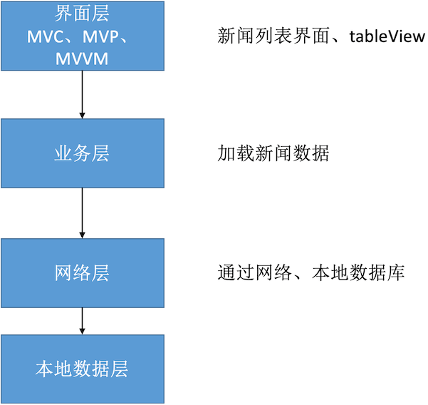

思考：  
* 讲讲 MVC、MVVM、MVP，以及你在项目里具体是怎么写的？
* 你自己用过哪些设计模式？
* 一般开始做一个项目，你的架构是如何思考的？
<!-- more -->

# 架构
架构（Architecture），软件开发中的设计方案。类与类之间的关系、模块与模块之间的关系、客户端与服务端的关系。

经常听到的架构名词：MVC、MVP、MVVM、VIPER、CDD、三层架构、四层架构......

## MVC - Apple版
Model-View-Controller

优点：View、Model可以重复利用，可以独立使用；  
缺点：Controller的代码过于臃肿；

## MVC – 变种
Model-View-Controller

优点：对Controller进行瘦身，将View内部的细节封装起来了，外界不知道View内部的具体实现；
缺点：View依赖于Model；

## MVP
Model-View-Presenter

## MVVM
Model-View-ViewModel

## 三层结构

## 四层结构

# 设计模式

设计模式（Design Pattern），是一套被反复使用、代码设计经验的总结。使用设计模式的好处是：可重用代码、让代码更容易被他人理解、保证代码可靠性。一般与编程语言无关，是一套比较成熟的编程思想。

设计模式可以分为三大类：
* 创建型模式：对象实例化的模式，用于解耦对象的实例化过程。单例模式、工厂方法模式，等等。
* 结构型模式：把类或对象结合在一起形成一个更大的结构。代理模式、适配器模式、组合模式、装饰模式，等等。
* 行为型模式：类或对象之间如何交互，及划分责任和算法。观察者模式、命令模式、责任链模式，等等。

