思考：
* iOS 用什么方式实现对一个对象的 KVO？(KVO的本质是什么？)  
* 如何手动触发 KVO ？  
* 直接修改成员变量会触发 KVO 么？  
* 通过 KVC 修改属性会触发 KVO 么？ 
* KVC 的赋值和取值过程是怎样的？原理是什么？  

<!-- more -->

# KVO 监听

KVO 的全称是 Key-Value Observing，俗称“键值监听”，可以用于监听某个对象属性值的改变。


定义 Person、Observer
```
@interface Person : NSObject
@property (assign, nonatomic) int age;
@end

@implementation Person
- (void)setAge:(int)age
{
    _age = age;
    NSLog(@"setAge: - %d", age);
}
@end

@interface Observer : NSObject
@end

@implementation Observer
- (void)observeValueForKeyPath:(NSString *)keyPath ofObject:(id)object change:(NSDictionary<NSKeyValueChangeKey,id> *)change context:(void *)context
{
    NSLog(@"observeValueForKeyPath - %@", change);
}
@end

int main(int argc, const char * argv[]) {
    @autoreleasepool {
        Observer *observer = [[Observer alloc] init];
        Person *person1 = [[Person alloc] init];
        Person *person2 = [[Person alloc] init];
        
        [person1 addObserver:observer forKeyPath:@"age" options:NSKeyValueObservingOptionNew | NSKeyValueObservingOptionOld context:NULL];
        
        [person1 setAge:10];
        [person2 setAge:20];

        [person1 removeObserver:observer forKeyPath:@"age"];
    }
    return 0;
}
```

打印结果：
```
observeValueForKeyPath - {
    kind = 1;
    new = 10;
    old = 0;
}
```

person2 和 person1 拥有同一个类对象，修改属性 age 时调用的是同一个类对象里的对象方法 `-(void)setAge`。

## 未使用 KVO 监听的对象

* 思考：person2 修改 age 时为什么在 Observer 里没有打印？  

因为 person2 没有使用 KVO 监听，修改属性 age 时调用的是 Person 类对象里的对象方法 `-(void)setAge`，所以在 Observer 里没有打印。

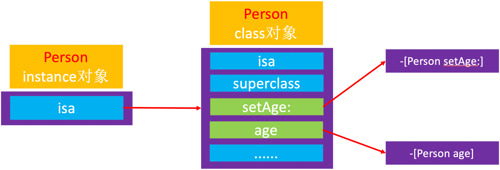

## 使用了 KVO 监听的对象

打印 person1、person2 类对象：
```
NSLog(@"person1添加KVO之前 - %@", object_getClass(person1));
NSLog(@"person1添加KVO之前 - %@", object_getClass(person2));

[person1 addObserver:observer forKeyPath:@"age" options:NSKeyValueObservingOptionNew | NSKeyValueObservingOptionOld context:NULL];
        
NSLog(@"person1添加KVO之后 - %@", object_getClass(person1));
NSLog(@"person1添加KVO之后 - %@", object_getClass(person2));
```

打印结果：
```
person1添加KVO之前 - Person
person1添加KVO之前 - Person
person1添加KVO之后 - NSKVONotifying_Person
person1添加KVO之后 - Person
```

从打印结果看出，因为 person1 使用了 KVO 监听，所以系统通过 runtime 生成了一个NSKVONotifying_Person 对象，所以 person1 修改属性 age 时调用的是 生成了一个NSKVONotifying_Person 类对象里的对象方法 `-(void)setAge`。  

### NSKVONotifying_Person 类对象

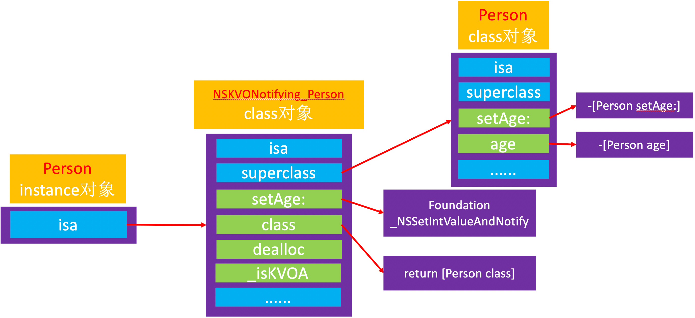

打印对象方法 `-(void)setAge` 的地址：
```
NSLog(@"person1添加KVO之前 - %p %p", [person methodForSelector:@selector(setAge:)], [person1 methodForSelector:@selector(setAge:)]);

[person1 addObserver:observer forKeyPath:@"age" options:NSKeyValueObservingOptionNew | NSKeyValueObservingOptionOld context:NULL];

NSLog(@"person1添加KVO之后 - %p %p", [person methodForSelector:@selector(setAge:)], [person1 methodForSelector:@selector(setAge:)]);
```

打印结果：
```
person1添加KVO之前 - 0x100001cf0 0x100001cf0
person1添加KVO之后 - 0x7fff304afa0b 0x100001cf0
```
从打印结果看出，person1 添加 KVO 监听前后，对象方法 `-(void)setAge` 的地址变了。

打印地址对应的方法名：
```
(lldb) p (IMP)0x100001cf0
(IMP) $0 = 0x0000000100001cf0 (Interview01-KVC`-[Person setAge:] at Person.h:16)
(lldb) p (IMP)0x7fff304afa0b
(IMP) $1 = 0x00007fff304afa0b (Foundation`_NSSetIntValueAndNotify)
```

从打印结果看出，person1 添加 KVO 监听后，修改 age 时调用的是 Foundation 框架里的  _NSSetIntValueAndNotify 方法。

### _NSSetIntValueAndNotify 方法
_NSSetIntValueAndNotify 方法实现猜想：
```
- (void)setAge:(int)age {
    _NSSetIntValueAndNotify();
}

void _NSSetIntValueAndNotify 
{
    [self willChangeValueForKey:@"age"];
    [super setAge:age];
    [self didChagneValueForKey:@"age"];
}

- (void)didChagneValueForKey:(NSString *)key
{
    // 通知监听器，某属性值发生了改变
    [observer observeValueForKeyPath:key ofObject:nil change:nil context:nil];
}
```

查看 _NSSet*AndNotify 的存在：  
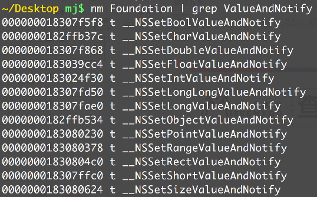


_NSSet*ValueAndNotify 的内部实现：
```
void _NSSet*ValueAndNotify 
{
    [self willChangeValueForKey:@"key"];
    // 原来的 setter 实现
    [self didChagneValueForKey:@"key"];
}
```

* 调用 `willChangeValueForKey:`  
* 调用原来的 setter 实现  
* 调用 `didChangeValueForKey:`，其内部会调用 observer 的 `observeValueForKeyPath:ofObject:change:context:` 方法


### NSKVONotifying_Person 元类对象
打印 person1 的元类对象：
```
NSLog(@"person1添加KVO之后，类对象 - %@, %@", object_getClass(person1), object_getClass(person2));
NSLog(@"person1添加KVO之后，元类对象 - %@, %@", object_getClass(object_getClass(person1)), object_getClass(object_getClass(person2)));
```

打印结果：
```
person1添加KVO之后，类对象 - NSKVONotifying_Person, Person
person1添加KVO之后，元类对象 - NSKVONotifying_Person, Person
```

NSKVONotifying_Person 类对象的 isa 指针指向的是 NSKVONotifying_Person 元类对象。


### 修改成员变量的值是否会触发 KVO
```
@interface MJPerson : NSObject
{
    @public
    int _age;
}
@end

@implementation MJPerson
@end

int main(int argc, const char * argv[]) {
    @autoreleasepool {
        MJObserver *observer = [[MJObserver alloc] init];
        MJPerson *person = [[MJPerson alloc] init];
        
        [person addObserver:observer forKeyPath:@"age" options:NSKeyValueObservingOptionNew | NSKeyValueObservingOptionOld context:NULL];

        person->_age = 10;

        [person removeObserver:observer forKeyPath:@"age"];
    }
    return 0;
}
```

运行后并没有出现打印。虽然 person 添加了 KVO 监听，但是修改 age 时并没有调用 `-(void)setAge` 方法。

# KVC
KVC 的全称是 Key-Value Coding，俗称“键值编码”，可以通过一个 key 来访问某个属性。常见的API有：
```
- (void)setValue:(id)value forKeyPath:(NSString *)keyPath;
- (void)setValue:(id)value forKey:(NSString *)key;
- (id)valueForKeyPath:(NSString *)keyPath;
- (id)valueForKey:(NSString *)key; 
```

## setValue: forKey: 原理
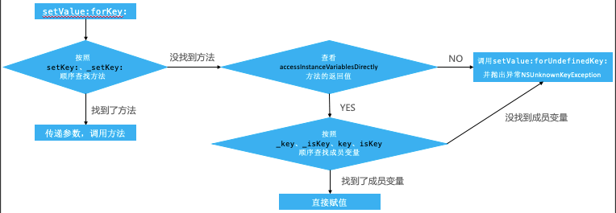

定义 Person：
```
@interface Person : NSObject
{
    @public
    int _age;
    int _isAge;
    int age;
    int isAge;
}
@end

@implementation Person
- (void)setAge:(int)age
{
    NSLog(@"setAge: - %d", age);
}

- (void)_setAge:(int)age
{
    NSLog(@"_setAge: - %d", age);
}

+ (BOOL)accessInstanceVariablesDirectly
{
    return YES; //默认的返回值就是YES（YES表示可以访问成员变量）
}
@end
```

通过你 kvc 修改 age 的值：
```
Person *person = [[Person alloc] init];
[person setValue:@10 forKey:@"age"];
```

依次注释掉 `setAge:`、`_setAge:` 方法，可以发现 `setValue:forKey:` 会优先调用 `setAge:`，`setAge:` 不存在时会调用 `_setAge:` 方法。如果 `setAge:` 和 `_setAge:` 都不存在时，会调用 `+(BOOL)accessInstanceVariablesDirectly` 方法判断是否可以访问成员变量。

打断点后，可以在控制台看到 _age、_isAge、age、isAge 被依次赋值：
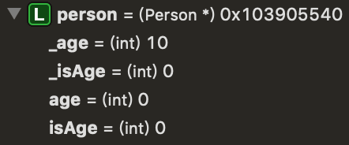

## KVC 触发 KVO

定义 Person：
```
@interface Person : NSObject
{
    @public
    int age;
}
@end

@implementation Person
- (void)willChangeValueForKey:(NSString *)key
{
    [super willChangeValueForKey:key];
    NSLog(@"willChangeValueForKey - %@", key);
}

- (void)didChangeValueForKey:(NSString *)key
{
    NSLog(@"didChangeValueForKey - begin - %@", key);
    [super didChangeValueForKey:key];
    NSLog(@"didChangeValueForKey - end - %@", key);
}

+ (BOOL)accessInstanceVariablesDirectly
{
    return YES; //默认的返回值就是YES（YES表示可以访问成员变量）
}
@end

int main(int argc, const char * argv[]) {
    @autoreleasepool {
        MJObserver *observer = [[MJObserver alloc] init];
        MJPerson *person = [[MJPerson alloc] init];
        
        [person addObserver:observer forKeyPath:@"age" options:NSKeyValueObservingOptionNew | NSKeyValueObservingOptionOld context:NULL];

        [person setValue:@10 forKey:@"age"];

        [person removeObserver:observer forKeyPath:@"age"];
    }
    return 0;
}
```

打印结果：
```
willChangeValueForKey - age
didChangeValueForKey - begin - age
observeValueForKeyPath - {
    kind = 1;
    new = 10;
    old = 0;
}
didChangeValueForKey - end - age
```

### setKey 和 _setKey 存在
添加 KVO 监听时会调用一次 `+(BOOL)accessInstanceVariablesDirectly`， 调用 `setValue:forKey:` 时会调用一次 `+(BOOL)accessInstanceVariablesDirectly`，再去调用 `willChangeValueForKey` 和 `didChangeValueForKey`。 

添加 KVO 监听第一次调用 accessInstanceVariablesDirectly 方法：
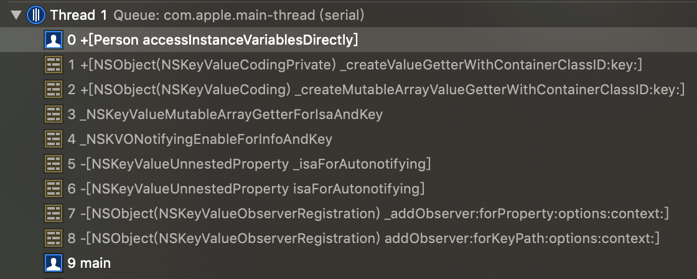
setValue:forKey: 第一次调用 accessInstanceVariablesDirectly 方法：
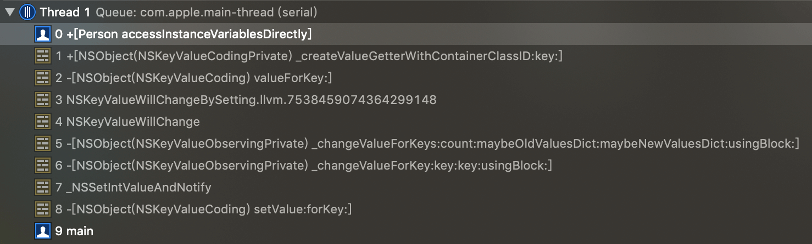

### setKey 和 _setKey 不存在
添加 KVO 监听时会调用两次 `+ (BOOL)accessInstanceVariablesDirectly`， 调用 `setValue:forKey:` 时会调用两次 `+ (BOOL)accessInstanceVariablesDirectly`，再去调用 `willChangeValueForKey` 和 `didChangeValueForKey`。 

添加 KVO 监听第一次调用 accessInstanceVariablesDirectly 方法：
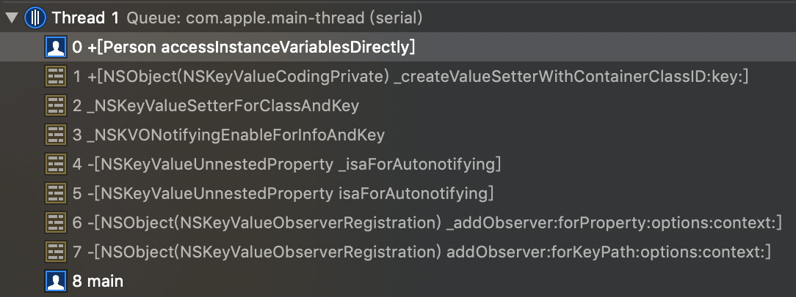
添加 KVO 监听第二次调用 accessInstanceVariablesDirectly 方法：
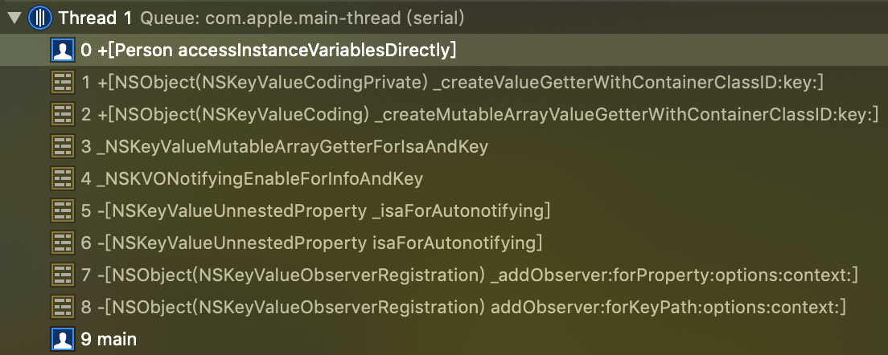
setValue:forKey: 第一次调用 accessInstanceVariablesDirectly 方法：
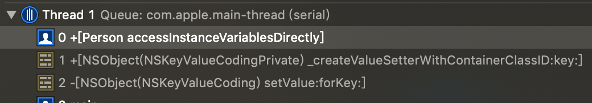
setValue:forKey: 第二次调用 accessInstanceVariablesDirectly 方法：
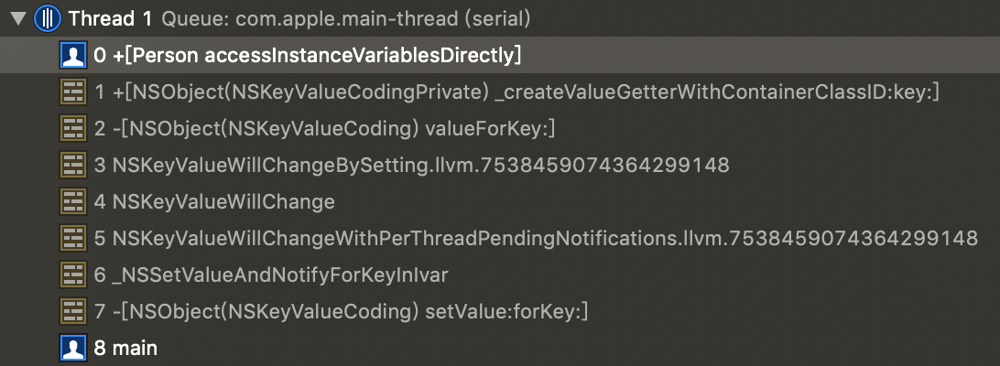

## valueForKey: 原理


定义 Person：
```
@interface Person : NSObject
{
    @public
    int _age;
    int _isAge;
    int age;
    int isAge;
}
@end

@implementation Person
- (int)getAge
{
    return 11;
}

- (int)age
{
    return 12;
}

- (int)isAge
{
    return 13;
}

- (int)_age
{
    return 14;
}
@end
```

依次注释掉 `- (int)getAge`、`- (int)age`、`- (int)isAge`、`- (int)_age` 方法，从打印结果可以发现，`setValue:forKey:` 方法会优先调用 `- (void)setAge:(int)age`，`- (void)setAge:(int)age` 不存在时会调用 `- (void)_setAge:(int)age` 方法，以此类推。

### setKey 和 _setKey 存在
添加 KVO 监听第一次调用 accessInstanceVariablesDirectly 方法：
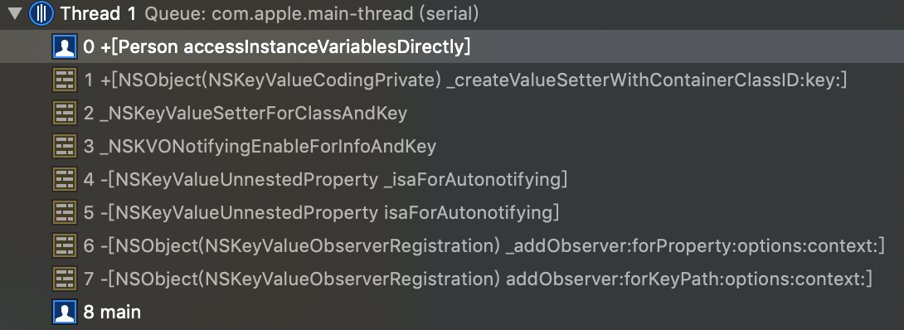

### setKey 和 _setKey 不存在
添加 KVO 监听第一次调用 accessInstanceVariablesDirectly 方法：
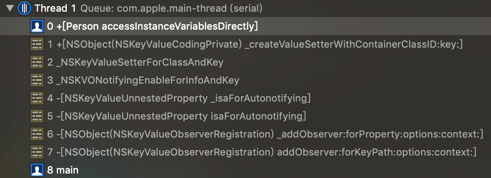
valueForKey: 第一次调用 accessInstanceVariablesDirectly 方法：
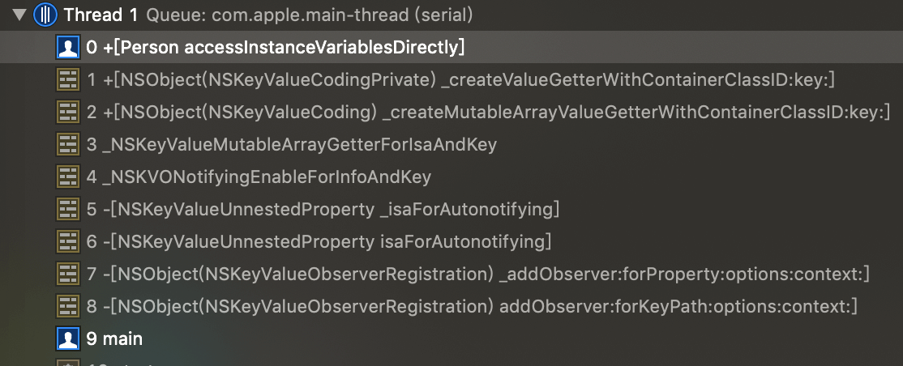


# 总结
* iOS 用什么方式实现对一个对象的 KVO？(KVO的本质是什么？)  
利用 RuntimeAPI 动态生成一个子类，并且让 instance 对象的 isa 指向这个全新的子类。  
当修改 instance 对象的属性时，会调用 Foundation 的 _NSSetXXXValueAndNotify 函数：  
```
willChangeValueForKey:
父类原来的setter
didChangeValueForKey:
```

didChangeValueForKey: 内部会触发监听器（Oberser）的监听方法( observeValueForKeyPath:ofObject:change:context:）

* 如何手动触发 KVO ？  
手动调用 willChangeValueForKey: 和 didChangeValueForKey:  
```
willChangeValueForKey:
person->age = 10;
didChangeValueForKey:
```

* 直接修改成员变量会触发 KVO 么？  
不会触发，修改 age 时并没有调用 -(void)setAge 方法。

* 通过 KVC 修改属性会触发 KVO 么？  
会触发KVO。通过KVC修改属性会调用 willChangeValueForKey: 和 didChangeValueForKey: 方法，而 didChangeValueForKey: 方法内部会触发 KVO 监听。  

* KVC 的赋值和取值过程是怎样的？原理是什么？  
赋值：`setValue:forKey:` 会按照 `setKey:`/`_setKey:` 顺序查找方法，如果方法存在，直接调用方法赋值。如果方法不存在，会调用 `accessInstanceVariablesDirectly` 方法，判断是否可以访问成员变量。如果可以，会按照 `_key`/`_isKey`/`key`/`isKsy` 顺序查找成员变量，找到后赋值。如果不可以访问成员变量，或者成员变量不存在，就会调用 `setValue:forUndefinedKey:` 并抛出异常 NSUnknownKeyException。  
  
  取值：`valueForKey:` 会按照 `getKey`/`key`/`isKey`/`_key` 顺序查找方法，如果方法存在，直接调用方法取值。如果方法不存在，会调用 `accessInstanceVariablesDirectly` 方法，判断是否可以访问成员变量。会按照 `_key`/`_isKey`/`key`/`isKsy` 顺序查找成员变量，找到成员变量后取值。如果不可以访问成员变量，或者成员变量不存在，就会调用 `valueForUndefinedKey:` 并抛出异常 NSUnknownKeyException。  
