思考：
* 讲讲 RunLoop，项目中有用到吗？
* RunLoop 内部实现逻辑？
* RunLoop 和线程的关系？
* timer 与 RunLoop 的关系？
* 程序中添加每3秒响应一次的 NSTimer，当拖动 tableview 时 timer 可能无法响应要怎么解决？
* RunLoop 是怎么响应用户操作的， 具体流程是什么样的？
* 说说 RunLoop 的几种状态
* RunLoop 的 mode 作用是什么？

<!-- more -->

# 什么是 RunLoop

顾名思义：运行循环，在程序运行过程中循环做一些事情。

应用范畴：
1. 定时器（Timer）、PerformSelector  
2. GCD Async Main Queue  
3. 事件响应、手势识别、界面刷新  
4. 网络请求  
5. AutoreleasePool  


## 如果没有 RunLoop
打印完“Hello, World!”后，执行完 return 方法会退出程序：
```
int main(int argc, char * argv[]) {
    @autoreleasepool {
        NSLog(@"Hello, World!");
    }
    return 0; //退出程序
}
```

## 如果有了 RunLoop
程序并不会马上退出，而是保持运行状态。`UIApplicationMain()` 方法的内部创建了 RunLoop：
```
int main(int argc, char * argv[]) {
    NSString * appDelegateClassName;
    @autoreleasepool {
        appDelegateClassName = NSStringFromClass([AppDelegate class]);
    }
    return UIApplicationMain(argc, argv, nil, appDelegateClassName);
}
```

## RunLoop 的基本作用
* 保持程序的持续运行
* 处理App中的各种事件（比如触摸事件、定时器事件等）
* 节省CPU资源，提高程序性能：该做事时做事，该休息时休息  
......

## RunLoop 的实现原理（伪代码）
```
int main(int argc, char * argv[]) {
    @autoreleasepool {
        int retVal = 0;
        do {
            // 没有任务时进入睡眠等待消息，不会执行下一行代码；有任务消息是被唤醒，执行下一行代码处理消息；
            int message = sleep_and_wait(); 
            // 处理消息
            retVal = process_message(message); 
        } while (0 == retVal);
        return 0;
    }
}
```

# RunLoop 对象

## 获取 RunLoop 对象

iOS 中有2套 API 来访问和使用 RunLoop：
1. Foundation：NSRunLoop  
2. Core Foundation：CFRunLoopRef

Foundation
```
// 获取当前线程的 RunLoop 对象
NSRunLoop *currentRunLoop = [NSRunLoop currentRunLoop]; 
// 获取主线程的 RunLoop 对象
NSRunLoop *mainRunLoop = [NSRunLoop mainRunLoop]; 
NSLog(@"%p %p", currentRunLoop, mainRunLoop);
```

打印结果：
```
0x600003a0e880 0x600003a0e880
```

因为是在主线程打印的，所以 `+currentRunLoop` 和 `+mainRunLoop` 获取的都是主线程的 RunLoop。

Core Foundation
```
// 获取当前线程的 RunLoop 对象
CFRunLoopRef currentCFRunLoop = CFRunLoopGetCurrent(); 
// 获取主线程的 RunLoop 对象
CFRunLoopRef mainCFRunLoop = CFRunLoopGetMain(); 
NSLog(@"%p %p", currentCFRunLoop, mainCFRunLoop);
```

打印结果：
```
0x600002208500 0x600002208500
```

因为是在主线程打印的，所以 `CFRunLoopGetCurrent()` 和 `CFRunLoopGetMain()` 获取的都是主线程的 CFRunLoopRef。

从打印结果可以看出，上面种方式在获取主线程的 RunLoop 时获取到的 `NSRunLoop` 和 `CFRunLoopRef` 内存地址不一样。NSRunLoop 和 CFRunLoopRef 都代表着 RunLoop 对象，但是 NSRunLoop 是基于 CFRunLoopRef 的一层 OC 包装，真正的 RunLoop 是里面的 `CFRunLoopRef`（如：NSArray 是基于 CFArrayRef 的封装，NSString 是基于 CFStringRef 的封装）。

## RunLoop 与线程
* 每条线程都有唯一的一个与之对应的 RunLoop 对象；
* RunLoop 保存在一个全局的 Dictionary 里，线程作为 key，RunLoop 作为 value；
* 线程刚创建时并没有 RunLoop 对象，RunLoop 会在第一次获取它时创建；
* RunLoop 会在线程结束时销毁；
* 主线程的 RunLoop 已经自动获取（创建），子线程默认没有开启 RunLoop；

CFRunLoopRef 是开源的，下载 [CF-1153.18](https://opensource.apple.com/tarballs/CF/) 。找到 CFRunLoop.c 文件里的 `_CFRunLoopGet0()` 方法：
```
/// 全局字典，key 是 pthread_t， value 是 CFRunLoopRef
static CFMutableDictionaryRef __CFRunLoops = NULL;
/// 获取一个 pthread 对应的 RunLoop
CF_EXPORT CFRunLoopRef _CFRunLoopGet0(pthread_t t) {
    if (pthread_equal(t, kNilPthreadT)) {
        t = pthread_main_thread_np();
    }
    __CFLock(&loopsLock);
    if (!__CFRunLoops) { //如果不存在就创建
        __CFUnlock(&loopsLock);
        ///初始化全局Dic
        CFMutableDictionaryRef dict = CFDictionaryCreateMutable(kCFAllocatorSystemDefault, 0, NULL, &kCFTypeDictionaryValueCallBacks);
        ///为主线程创建一个 RunLoop
        CFRunLoopRef mainLoop = __CFRunLoopCreate(pthread_main_thread_np());
        CFDictionarySetValue(dict, pthreadPointer(pthread_main_thread_np()), mainLoop);
        if (!OSAtomicCompareAndSwapPtrBarrier(NULL, dict, (void * volatile *)&__CFRunLoops)) {
            CFRelease(dict);
        }
        CFRelease(mainLoop);
        __CFLock(&loopsLock);
    }
    ///以 pthreadPointer(t) 为 key，在 __CFRunLoops 里查找 loop
    CFRunLoopRef loop = (CFRunLoopRef)CFDictionaryGetValue(__CFRunLoops, pthreadPointer(t));
    __CFUnlock(&loopsLock);
    if (!loop) {
        ///如果 loop 不存在就创建新的 newLoop
        CFRunLoopRef newLoop = __CFRunLoopCreate(t);
        __CFLock(&loopsLock);
        loop = (CFRunLoopRef)CFDictionaryGetValue(__CFRunLoops, pthreadPointer(t)); 
        if (!loop) {
            ///以 pthreadPointer(t) 为 key，newLoop 为 value 保存到 __CFRunLoops 里
            CFDictionarySetValue(__CFRunLoops, pthreadPointer(t), newLoop);
            loop = newLoop;
        }
        // don't release run loops inside the loopsLock, because CFRunLoopDeallocate may end up taking it
        __CFUnlock(&loopsLock);
        CFRelease(newLoop);
    }
    if (pthread_equal(t, pthread_self())) {
        _CFSetTSD(__CFTSDKeyRunLoop, (void *)loop, NULL);
        if (0 == _CFGetTSD(__CFTSDKeyRunLoopCntr)) {
            _CFSetTSD(__CFTSDKeyRunLoopCntr, (void *)(PTHREAD_DESTRUCTOR_ITERATIONS-1), (void (*)(void *))__CFFinalizeRunLoop);
        }
    }
    return loop;
}
```

从源码里可以看到线程和 RunLoop 之间是一一对应的，其关系是保存在一个全局的 Dictionary 里。`_CFRunLoopGet0()` 先调用 `CFDictionaryGetValue()` 方法，以线程 pthreadPointer(t) 为 key 在 `__CFRunLoops` 里查找 loop。如果 loop 不存在，再通过 `__CFRunLoopCreate()` 方法创建新的 newLoop，并以线程 pthreadPointer(t) 为 key，newLoop 为 value 保存到 `__CFRunLoops` 里。

## RunLoop 相关的类

Core Foundation 中关于 RunLoop 的5个类：
* CFRunLoopRef
* CFRunLoopModeRef
* CFRunLoopSourceRef
* CFRunLoopTimerRef
* CFRunLoopObserverRef

查看 RunLoop 源码，找到 [CF-1153.18](https://opensource.apple.com/tarballs/CF/) 里的 RunLoop.c 文件：

### CFRunLoopRef
CFRunLoopRef：RunLoop 类对象的结构体。
```
typedef struct __CFRunLoop * CFRunLoopRef;

struct __CFRunLoop {
    CFRuntimeBase _base;
    pthread_mutex_t _lock;			/* locked for accessing mode list */
    __CFPort _wakeUpPort;			// used for CFRunLoopWakeUp 
    Boolean _unused;
    volatile _per_run_data *_perRunData;              // reset for runs of the run loop
    pthread_t _pthread;
    uint32_t _winthread;
    CFMutableSetRef _commonModes;
    CFMutableSetRef _commonModeItems;
    CFRunLoopModeRef _currentMode;
    CFMutableSetRef _modes;
    struct _block_item *_blocks_head;
    struct _block_item *_blocks_tail;
    CFAbsoluteTime _runTime;
    CFAbsoluteTime _sleepTime;
    CFTypeRef _counterpart;
};
```

 精简版
 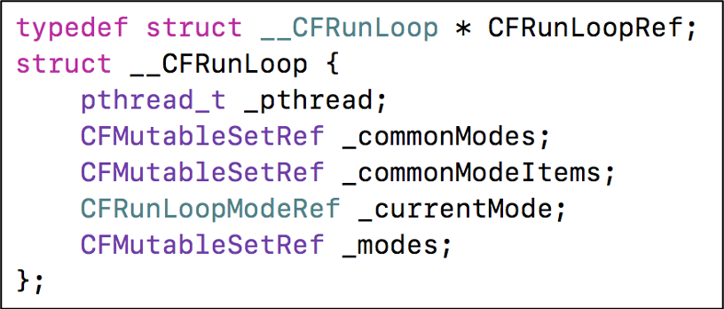

_pthread：`__CFRunLoop` 对应的线程。  
_currentMode：当前的 CFRunLoopModeRef。  
_modes：装着 CFRunLoopModeRef 的集合。

CFRunLoopModeRef 代表 RunLoop 的运行模式。RunLoop 启动时只能选择其中一个 Mode，作为 _currentMode。如果需要切换 Mode，只能退出当前 Loop，再重新选择一个 Mode 进入。

一个 RunLoop 包含若干个 Mode，每个 Mode 又包含若干个 Sources0/Sources1/Timer/Observer。不同组（不同mode）的 Sources0/Sources1/Timer/Observer 能分隔开来，互不影响。  

👉 注意：如果 Mode 里没有任何 Sources0/Sources1/Timer/Observer，RunLoop 会立马退出。
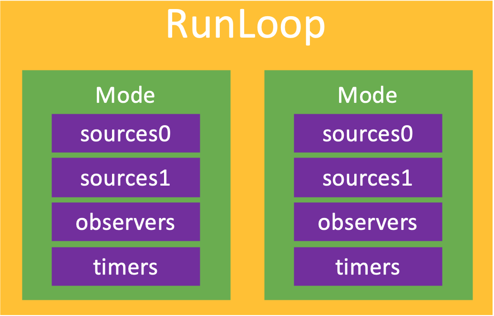 

### CFRunLoopModeRef
CFRunLoopModeRef：RunLoop 的运行模式。
```
typedef struct __CFRunLoopMode *CFRunLoopModeRef;

struct __CFRunLoopMode {
    CFRuntimeBase _base;
    pthread_mutex_t _lock;	/* must have the run loop locked before locking this */
    CFStringRef _name;
    Boolean _stopped;
    char _padding[3];
    CFMutableSetRef _sources0;
    CFMutableSetRef _sources1;
    CFMutableArrayRef _observers;
    CFMutableArrayRef _timers;
    CFMutableDictionaryRef _portToV1SourceMap;
    __CFPortSet _portSet;
    CFIndex _observerMask;
#if USE_DISPATCH_SOURCE_FOR_TIMERS
    dispatch_source_t _timerSource;
    dispatch_queue_t _queue;
    Boolean _timerFired; // set to true by the source when a timer has fired
    Boolean _dispatchTimerArmed;
#endif
#if USE_MK_TIMER_TOO
    mach_port_t _timerPort;
    Boolean _mkTimerArmed;
#endif
#if DEPLOYMENT_TARGET_WINDOWS
    DWORD _msgQMask;
    void (*_msgPump)(void);
#endif
    uint64_t _timerSoftDeadline; /* TSR */
    uint64_t _timerHardDeadline; /* TSR */
};
```

精简版
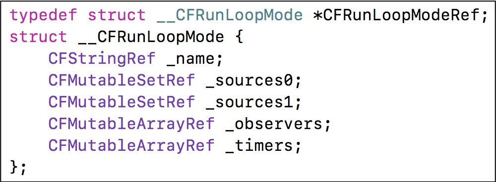

_sources0：装着 CFRunLoopSourceRef 的集合。  
_sources1：装着 CFRunLoopSourceRef 的集合。  
_observers：装着 CFRunLoopObserverRef 的集合。  
_timers：装着 CFRunLoopTimerRef 的集合。

RunLoop 在选择了某一种模式作为当前模式后，就开始处理当前模式里的 Source0/Source1/Timer/Observer 事件了：

* Source0：触摸事件、`performSelector:onThread:` 方法
* Source1：基于 Port 的线程间通信、系统事件捕捉
* Timers：NSTimer、`performSelector:withObject:afterDelay:` 方法
* Observers：用于监听 RunLoop 的状态、UI 刷新（BeforeWaiting）、Autorelease pool（BeforeWaiting）

RunLoop 将 OC 代码转换成了 Sources0/Sources1/Timer/Observer，并且循环监测并执行它们。比如 UI 的刷新和Autorelease pool 的自动释放都是在进入休眠前完成的。

### CFRunLoopSourceRef
```
typedef struct CF_BRIDGED_MUTABLE_TYPE(id) __CFRunLoopSource * CFRunLoopSourceRef;

struct __CFRunLoopSource {
    CFRuntimeBase _base;
    uint32_t _bits;
    pthread_mutex_t _lock;
    CFIndex _order;			/* immutable */
    CFMutableBagRef _runLoops;
    union {
	CFRunLoopSourceContext version0;	/* immutable, except invalidation */
        CFRunLoopSourceContext1 version1;	/* immutable, except invalidation */
    } _context;
};
```

触摸事件：
```
@implementation ViewController
- (void)touchesBegan:(NSSet<UITouch *> *)touches withEvent:(UIEvent *)event
{
    NSLog(@"%s", __func__); //断点
}
@end
```

在断点处打印函数调用栈：
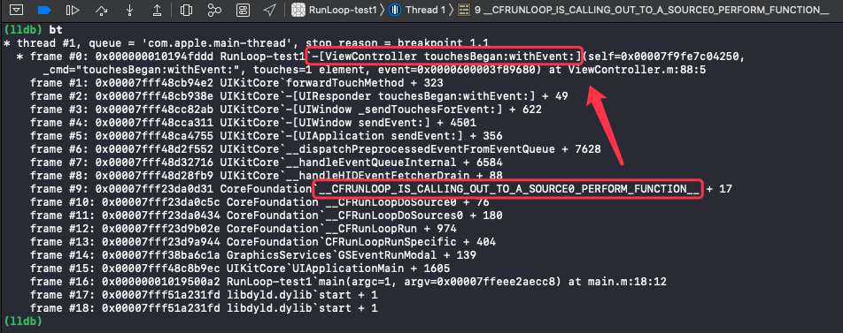

在打印出的函数调用栈里可以看到该事件是由 `__CFRUNLOOP_IS_CALLING_OUT_TO_A_SOURCE0_PERFORM_FUNCTION__` 调用过来的。触摸事件先是由 Sources1 捕捉到后传递给 Sources0。

### CFRunLoopObserverRef
实现：
```
typedef struct CF_BRIDGED_MUTABLE_TYPE(id) __CFRunLoopObserver * CFRunLoopObserverRef;

struct __CFRunLoopObserver {
    CFRuntimeBase _base;
    pthread_mutex_t _lock;
    CFRunLoopRef _runLoop;
    CFIndex _rlCount;
    CFOptionFlags _activities;		//RunLoop 状态枚举
    CFIndex _order;			/* immutable */
    CFRunLoopObserverCallBack _callout;	/* immutable */
    CFRunLoopObserverContext _context;	/* immutable, except invalidation */
};
```

`__CFRunLoopObserver` 的 `_activities` 是一个枚举，包含以下状态：
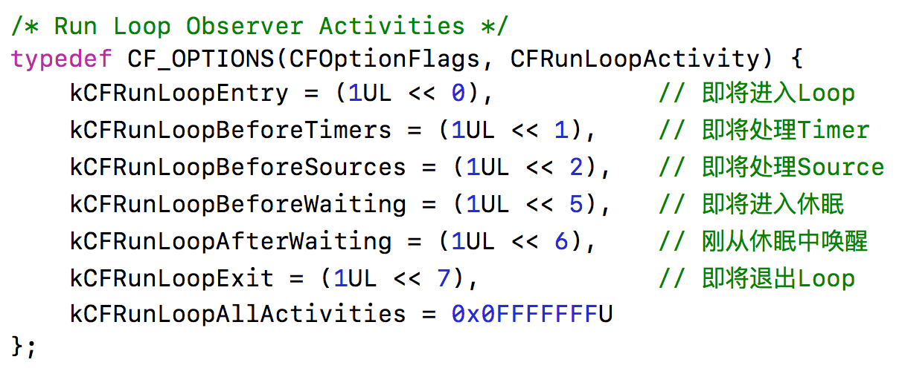

#### CFRunLoopObserverCreateWithHandler()

使用 CFRunLoopObserverCreateWithHandler() 方法监听 RunLoop：
```
@implementation ViewController
- (void)viewDidLoad {
    [super viewDidLoad];
    
    CFRunLoopObserverRef observer = CFRunLoopObserverCreateWithHandler(kCFAllocatorDefault, kCFRunLoopAllActivities, YES, 0, ^(CFRunLoopObserverRef observer, CFRunLoopActivity activity) {
        switch (activity) {
            case kCFRunLoopEntry:
                NSLog(@"kCFRunLoopEntry");
                break;
            case kCFRunLoopBeforeTimers:
                NSLog(@"kCFRunLoopBeforeTimers");
                break;
            case kCFRunLoopBeforeSources:
                NSLog(@"kCFRunLoopBeforeSources");
                break;
            case kCFRunLoopBeforeWaiting:
                NSLog(@"kCFRunLoopBeforeWaiting");
                break;
            case kCFRunLoopAfterWaiting:
                NSLog(@"kCFRunLoopAfterWaiting");
                break;
            case kCFRunLoopExit:
                NSLog(@"kCFRunLoopExit");
                break;
            default:
                break;
        }
    });
    CFRunLoopAddObserver(CFRunLoopGetCurrent(), observer, kCFRunLoopCommonModes);
    CFRelease(observer);
}
@end
```

#### 点击事件唤醒 RunLoop
```
- (void)touchesBegan:(NSSet<UITouch *> *)touches withEvent:(UIEvent *)event
{
    NSLog(@"%s", __func__);
}
```

点击屏幕打印结果：
```
2020-07-04 21:11:18.429011+0800 RunLoop-test1[7880:206615] kCFRunLoopAfterWaiting
2020-07-04 21:11:18.429138+0800 RunLoop-test1[7880:206615] kCFRunLoopBeforeTimers
2020-07-04 21:11:18.429218+0800 RunLoop-test1[7880:206615] kCFRunLoopBeforeSources
2020-07-04 21:11:18.430235+0800 RunLoop-test1[7880:206615] -[ViewController touchesBegan:withEvent:]

......
```

从打印结果可以看到，在处理点击事件前，RunLoop 先进入到了 kCFRunLoopBeforeSources 状态，表明即将处理 sources。 

#### NSTimer 唤醒 RunLoop
```
- (void)touchesBegan:(NSSet<UITouch *> *)touches withEvent:(UIEvent *)event
{
    [NSTimer scheduledTimerWithTimeInterval:3.0 repeats:NO block:^(NSTimer * _Nonnull timer) {
        NSLog(@"------- 定时器 -------");
    }];
}
```

点击屏幕打印结果：
```
......

2020-07-04 21:01:17.901246+0800 RunLoop-test1[7611:196926] kCFRunLoopBeforeWaiting
2020-07-04 21:01:20.832895+0800 RunLoop-test1[7611:196926] kCFRunLoopAfterWaiting
2020-07-04 21:01:20.833116+0800 RunLoop-test1[7611:196926] ------- 定时器 -------
2020-07-04 21:01:20.833258+0800 RunLoop-test1[7611:196926] kCFRunLoopBeforeTimers
2020-07-04 21:01:20.833354+0800 RunLoop-test1[7611:196926] kCFRunLoopBeforeSources
2020-07-04 21:01:20.833450+0800 RunLoop-test1[7611:196926] kCFRunLoopBeforeWaiting

......
```

从打印结果可以看到，RunLoop 在17秒处进入了 kCFRunLoopBeforeWaiting（休眠）状态，20秒处进入了 kCFRunLoopAfterWaiting（唤醒）状态，同时执行了代码块打印出了结果。

#### CFRunLoopObserverCreate()

使用 CFRunLoopObserverCreate() 方法监听 RunLoop：
```
@implementation ViewController

void observerCallBackAllActivities(CFRunLoopObserverRef observer, CFRunLoopActivity activity, void *info)
{
     switch (activity) {
         case kCFRunLoopEntry:
             NSLog(@"kCFRunLoopEntry");
             break;
         case kCFRunLoopBeforeTimers:
             NSLog(@"kCFRunLoopBeforeTimers");
             break;
         case kCFRunLoopBeforeSources:
             NSLog(@"kCFRunLoopBeforeSources");
             break;
         case kCFRunLoopBeforeWaiting:
             NSLog(@"kCFRunLoopBeforeWaiting");
             break;
         case kCFRunLoopAfterWaiting:
             NSLog(@"kCFRunLoopAfterWaiting");
             break;
         case kCFRunLoopExit:
             NSLog(@"kCFRunLoopExit");
             break;
         default:
             break;
     }
}

- (void)viewDidLoad {
    [super viewDidLoad];

    CFRunLoopObserverRef observer = CFRunLoopObserverCreate(kCFAllocatorDefault, kCFRunLoopAllActivities, YES, 0, observerCallBackAllActivities, nil);
    CFRunLoopAddObserver(CFRunLoopGetMain(), observer, kCFRunLoopCommonModes);
    CFRelease(observer);
}
@end
```

## 常见的2种 Mode
kCFRunLoopDefaultMode（NSDefaultRunLoopMode）：App 的默认 Mode，通常主线程是在这个 Mode 下运行。  
UITrackingRunLoopMode：界面跟踪 Mode，用于 ScrollView 追踪触摸滑动，保证界面滑动时不受其他 Mode 影响。（只有主线程需要考虑这种 mode）

RunLoop 的模式切换：
```
@implementation ViewController

- (void)viewDidLoad {
    [super viewDidLoad];
    
    CFRunLoopObserverRef observer = CFRunLoopObserverCreateWithHandler(kCFAllocatorDefault, kCFRunLoopAllActivities, YES, 0, ^(CFRunLoopObserverRef observer, CFRunLoopActivity activity) {
        switch (activity) {
            case kCFRunLoopEntry:{
                CFRunLoopMode mode = CFRunLoopCopyCurrentMode(CFRunLoopGetCurrent());
                NSLog(@"kCFRunLoopEntry - %@", mode);
                CFRelease(mode);
            }
            case kCFRunLoopExit:{
                CFRunLoopMode mode = CFRunLoopCopyCurrentMode(CFRunLoopGetCurrent());
                NSLog(@"kCFRunLoopExit - %@", mode);
                CFRelease(mode);
            }
                break;
            default:
                break;
        }
    });
    CFRunLoopAddObserver(CFRunLoopGetCurrent(), observer, kCFRunLoopCommonModes);
    CFRelease(observer);
}
@end
```

添加监听后，在页面上添一个 UITextView。  

开始滚动 UITextView 时的打印：
```
kCFRunLoopExit - kCFRunLoopDefaultMode
kCFRunLoopEntry - UITrackingRunLoopMode
```

停止滚动 UITextView 时的打印：
```
kCFRunLoopExit - UITrackingRunLoopMode
kCFRunLoopEntry - kCFRunLoopDefaultMode
```

从打印结果可以看到，操作 textView 时 RunLoop 进行了模式切换：  
在开始滚动 textView 时，RunLoop 先退出了 kCFRunLoopDefaultMode 再进入了 UITrackingRunLoopMode。  
在停止滚动 textView 时，RunLoop 先退出了 UITrackingRunLoopMode 再进入 kCFRunLoopDefaultMode。


# RunLoop 源码分析

RunLoop 执行流程图：
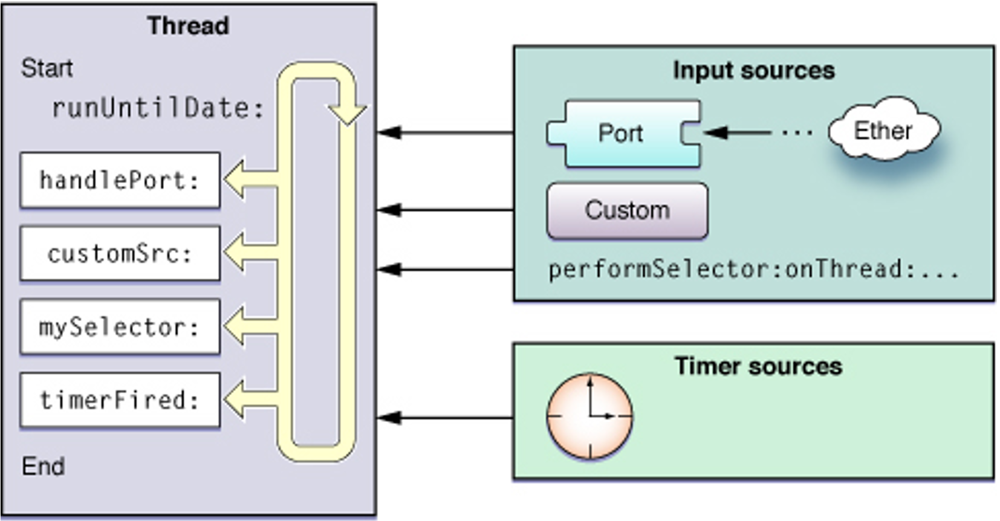

## RunLoop 的实现原理

找到 RunLoop 的入口：
```
@implementation ViewController
- (void)touchesBegan:(NSSet<UITouch *> *)touches withEvent:(UIEvent *)event
{
    NSLog(@"%s", __func__); //断点
}
@end
```

断点处查看函数调用栈：
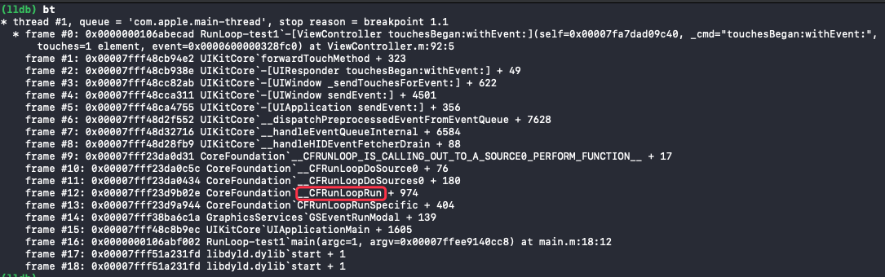
从图中可以看到，RunLoop 先通过 `CFRunLoopRunSpecific()` 方法调用了 `__CFRunLoopRun()` 方法，`__CFRunLoopRun` 方法调用了 `__CFRunLoopDoSources0()` 方法，所以 `CFRunLoopRunSpecific` 就是 RunLoop 的入口。

### CFRunLoopRunSpecific 
实现：
```
SInt32 CFRunLoopRunSpecific(CFRunLoopRef rl, CFStringRef modeName, CFTimeInterval seconds, Boolean returnAfterSourceHandled) {
    CHECK_FOR_FORK();
    if (__CFRunLoopIsDeallocating(rl)) return kCFRunLoopRunFinished;
    __CFRunLoopLock(rl);
    /// 根据modeName找到对应mode
    CFRunLoopModeRef currentMode = __CFRunLoopFindMode(rl, modeName, false);
    /// 如果mode里没有source/timer/observer, 直接返回。
    if (NULL == currentMode || __CFRunLoopModeIsEmpty(rl, currentMode, rl->_currentMode)) {
        Boolean did = false;
        if (currentMode) __CFRunLoopModeUnlock(currentMode);
        __CFRunLoopUnlock(rl);
        return did ? kCFRunLoopRunHandledSource : kCFRunLoopRunFinished;
    }
    volatile _per_run_data *previousPerRun = __CFRunLoopPushPerRunData(rl);
    CFRunLoopModeRef previousMode = rl->_currentMode;
    rl->_currentMode = currentMode;
    int32_t result = kCFRunLoopRunFinished;
    
    /// 通知 Observers：进入 Loop
	if (currentMode->_observerMask & kCFRunLoopEntry ) __CFRunLoopDoObservers(rl, currentMode, kCFRunLoopEntry);
    /// 具体要做的事情
	result = __CFRunLoopRun(rl, currentMode, seconds, returnAfterSourceHandled, previousMode);
    /// 通知 Observers：退出 Loop
	if (currentMode->_observerMask & kCFRunLoopExit ) __CFRunLoopDoObservers(rl, currentMode, kCFRunLoopExit);

        __CFRunLoopModeUnlock(currentMode);
        __CFRunLoopPopPerRunData(rl, previousPerRun);
	rl->_currentMode = previousMode;
    __CFRunLoopUnlock(rl);
    return result;
}
```

简化后：
```
SInt32 CFRunLoopRunSpecific(CFRunLoopRef rl, CFStringRef modeName, CFTimeInterval seconds, Boolean returnAfterSourceHandled) {
    /// 通知 Observers：进入 Loop
    __CFRunLoopDoObservers(rl, currentMode, kCFRunLoopEntry);
	
    /// 具体要做的事情
    result = __CFRunLoopRun(rl, currentMode, seconds, returnAfterSourceHandled, previousMode);
	
    /// 通知 Observers：退出 Loop
    __CFRunLoopDoObservers(rl, currentMode, kCFRunLoopExit);

    return result;
}
```

`CFRunLoopRunSpecific()` 方法内部调用了 `__CFRunLoopRun()` 方法来实现 RunLoop 的具体处理逻辑。

### __CFRunLoopRun
在 [CF-1153.18](https://opensource.apple.com/tarballs/CF/) 找到 RunLoop.c 文件，再找到 `__CFRunLoopRun()` 方法。简化后：
```
static int32_t __CFRunLoopRun(CFRunLoopRef rl, CFRunLoopModeRef rlm, CFTimeInterval seconds, Boolean stopAfterHandle, CFRunLoopModeRef previousMode) {
    int32_t retVal = 0;
    do {
        /// 通知 Observers：即将处理 Timers
        __CFRunLoopDoObservers(rl, rlm, kCFRunLoopBeforeTimers);
        
        /// 通知 Observers：即将处理 Sources
        __CFRunLoopDoObservers(rl, rlm, kCFRunLoopBeforeSources);
        
        /// 处理 Blocks
        __CFRunLoopDoBlocks(rl, rlm);
        
        /// 处理 Sources0
        Boolean sourceHandledThisLoop = __CFRunLoopDoSources0(rl, rlm, stopAfterHandle);
        if (sourceHandledThisLoop) {
            // 处理 Blocks
            __CFRunLoopDoBlocks(rl, rlm);
        }
        
        /// 判断有无 Sources1
        if (__CFRunLoopServiceMachPort(dispatchPort, &msg, sizeof(msg_buffer), &livePort, 0, &voucherState, NULL)) {
            // 如果有 Sources1，就直接跳转到 handle_msg👇
            goto handle_msg;
        }
        
        /// 通知 Observers：即将休眠
        __CFRunLoopDoObservers(rl, rlm, kCFRunLoopBeforeWaiting);
        __CFRunLoopSetSleeping(rl);
        
        do {
            /// 等待消息唤醒当前线程（进入休眠，不会执行任何代码，也不会消耗CPU）
            __CFRunLoopServiceMachPort(waitSet, &msg, sizeof(msg_buffer), &livePort, poll ? 0 : TIMEOUT_INFINITY, &voucherState, &voucherCopy);
        } while (1); // 循环内部的 RunLoop 会阻塞 while 循环，RunLoop 退出后，while 循环的阻塞消失，再次创建一个新的 RunLoop 阻塞 while 循环，保证一直会有一个 RunLoop 存在
        
        __CFRunLoopSetIgnoreWakeUps(rl);
        __CFRunLoopUnsetSleeping(rl);
        /// 通知 Observers：结束休眠
        __CFRunLoopDoObservers(rl, rlm, kCFRunLoopAfterWaiting);
        
    ///（👉 如果有 Sources1，会直接跳转到这里。没有 Sources1，就等上面的代码走走完了再来到这里）
    handle_msg:;
        __CFRunLoopSetIgnoreWakeUps(rl);
        
        if (rlm->_timerPort != MACH_PORT_NULL && livePort == rlm->_timerPort) {
            /// 被timer唤醒
            CFRUNLOOP_WAKEUP_FOR_TIMER();
            /// 处理 Timers
            if (!__CFRunLoopDoTimers(rl, rlm, mach_absolute_time())) {
                __CFArmNextTimerInMode(rlm, rl);
            }
        }
        else if (livePort == dispatchPort) {
            /// 被gcd唤醒
            CFRUNLOOP_WAKEUP_FOR_DISPATCH();
            /// 处理gcd
            __CFRUNLOOP_IS_SERVICING_THE_MAIN_DISPATCH_QUEUE__(msg);
        } else {
            /// 被 Sources1 唤醒
            CFRUNLOOP_WAKEUP_FOR_SOURCE();
            /// 处理 Sources1
            __CFRunLoopDoSource1(rl, rlm, rls, msg, msg->msgh_size, &reply) || sourceHandledThisLoop;
        }
        
        /// 处理 Blocks
        __CFRunLoopDoBlocks(rl, rlm);
        
        /// 设置返回值
        if (sourceHandledThisLoop && stopAfterHandle) {
            retVal = kCFRunLoopRunHandledSource;
        } else if (timeout_context->termTSR < mach_absolute_time()) {
            retVal = kCFRunLoopRunTimedOut;
        } else if (__CFRunLoopIsStopped(rl)) {
            __CFRunLoopUnsetStopped(rl);
            retVal = kCFRunLoopRunStopped;
        } else if (rlm->_stopped) {
            rlm->_stopped = false;
            retVal = kCFRunLoopRunStopped;
        } else if (__CFRunLoopModeIsEmpty(rl, rlm, previousMode)) {
            retVal = kCFRunLoopRunFinished;
        }
        
        voucher_mach_msg_revert(voucherState);
        os_release(voucherCopy);
        
    } while (0 == retVal); //是否继续执行
    
    return retVal;
}
```

可以看到 RunLoop 主要做了以下6件事（有序）：
1. `__CFRunLoopDoObservers()` 通知 observers
2. `__CFRunLoopDoBlocks()` 处理 blocks
3. `__CFRunLoopDoSources0()` 处理 sources0
4. `__CFRunLoopDoTimers()` 处理 timers
5. `__CFRUNLOOP_IS_SERVICING_THE_MAIN_DISPATCH_QUEUE__()` 处理 GCD
6. `__CFRunLoopDoSource1()` 处理 sources1

除了处理 GCD 的方法外，其它的5个方法，在调用到 Foundation 框架的函数前，还会调用一个 Core Foundation 框架的函数：

### __CFRunLoopDoObservers()
```
static void __CFRUNLOOP_IS_CALLING_OUT_TO_AN_OBSERVER_CALLBACK_FUNCTION__() __attribute__((noinline));
static void __CFRUNLOOP_IS_CALLING_OUT_TO_AN_OBSERVER_CALLBACK_FUNCTION__(CFRunLoopObserverCallBack func, CFRunLoopObserverRef observer, CFRunLoopActivity activity, void *info) {
    if (func) {
        func(observer, activity, info);
    }
    asm __volatile__(""); // thwart tail-call optimization
}

static void __CFRunLoopDoObservers(CFRunLoopRef rl, CFRunLoopModeRef rlm, CFRunLoopActivity activity) {
    ......
    
    __CFRUNLOOP_IS_CALLING_OUT_TO_AN_OBSERVER_CALLBACK_FUNCTION__(rlo->_callout, rlo, activity, rlo->_context.info);

    ......
}
```

函数调用栈：
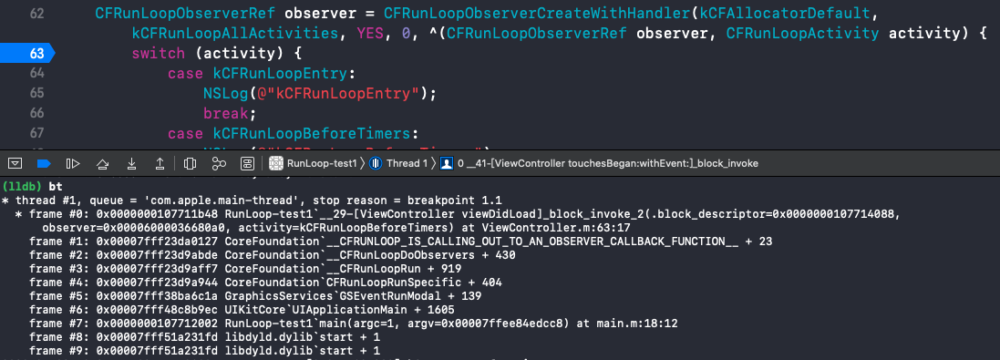

### __CFRunLoopDoBlocks()
内部调用的是 `__CFRUNLOOP_IS_CALLING_OUT_TO_A_BLOCK__()` 方法：
```
static void __CFRUNLOOP_IS_CALLING_OUT_TO_A_BLOCK__() __attribute__((noinline));
static void __CFRUNLOOP_IS_CALLING_OUT_TO_A_BLOCK__(void (^block)(void)) {
    if (block) {
        block();
    }
    asm __volatile__(""); // thwart tail-call optimization
}

static Boolean __CFRunLoopDoBlocks(CFRunLoopRef rl, CFRunLoopModeRef rlm) {
    ......

    __CFRUNLOOP_IS_CALLING_OUT_TO_A_BLOCK__(block);

    ......
}
```

函数调用栈：


### __CFRunLoopDoSources0()
内部调用的是 `__CFRUNLOOP_IS_CALLING_OUT_TO_A_SOURCE0_PERFORM_FUNCTION__()` 方法：
```
static void __CFRUNLOOP_IS_CALLING_OUT_TO_A_SOURCE0_PERFORM_FUNCTION__() __attribute__((noinline));
static void __CFRUNLOOP_IS_CALLING_OUT_TO_A_SOURCE0_PERFORM_FUNCTION__(void (*perform)(void *), void *info) {
    if (perform) {
        perform(info);
    }
    asm __volatile__(""); // thwart tail-call optimization
}

static Boolean __CFRunLoopDoSources0(CFRunLoopRef rl, CFRunLoopModeRef rlm, Boolean stopAfterHandle) {	
    ......

    __CFRUNLOOP_IS_CALLING_OUT_TO_A_SOURCE0_PERFORM_FUNCTION__(rls->_context.version0.perform, rls->_context.version0.info);
	
    ......
}
```

函数调用栈：
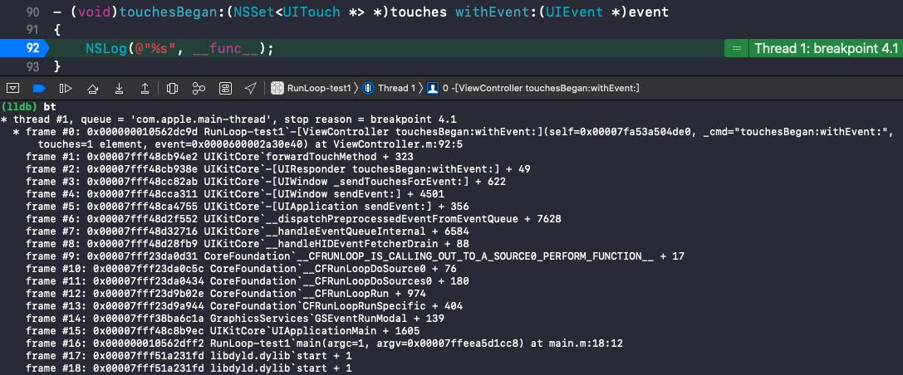

### __CFRunLoopDoTimers()
内部调用的是 `__CFRUNLOOP_IS_CALLING_OUT_TO_A_TIMER_CALLBACK_FUNCTION__()` 方法：
```
static void __CFRUNLOOP_IS_CALLING_OUT_TO_A_TIMER_CALLBACK_FUNCTION__() __attribute__((noinline));
static void __CFRUNLOOP_IS_CALLING_OUT_TO_A_TIMER_CALLBACK_FUNCTION__(CFRunLoopTimerCallBack func, CFRunLoopTimerRef timer, void *info) {
    if (func) {
        func(timer, info);
    }
    asm __volatile__(""); // thwart tail-call optimization
}

static Boolean __CFRunLoopDoTimers(CFRunLoopRef rl, CFRunLoopModeRef rlm, uint64_t limitTSR) {
    ......

    Boolean did = __CFRunLoopDoTimer(rl, rlm, rlt);

    ......
}

static Boolean __CFRunLoopDoTimer(CFRunLoopRef rl, CFRunLoopModeRef rlm, CFRunLoopTimerRef rlt) {
    ......

	__CFRUNLOOP_IS_CALLING_OUT_TO_A_TIMER_CALLBACK_FUNCTION__(rlt->_callout, rlt, context_info);

    ......
}
```

函数调用栈：
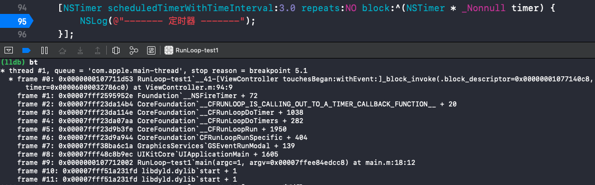

### __CFRunLoopDoSource1()
内部调用的是 `__CFRUNLOOP_IS_CALLING_OUT_TO_A_SOURCE1_PERFORM_FUNCTION__()` 方法：
```
static void __CFRUNLOOP_IS_CALLING_OUT_TO_A_SOURCE1_PERFORM_FUNCTION__() __attribute__((noinline));
static void __CFRUNLOOP_IS_CALLING_OUT_TO_A_SOURCE1_PERFORM_FUNCTION__(
    void *(*perform)(void *msg, CFIndex size, CFAllocatorRef allocator, void *info), mach_msg_header_t *msg, CFIndex size, mach_msg_header_t **reply, void *info) {
    if (perform) {
        *reply = perform(msg, size, kCFAllocatorSystemDefault, info);
    }
    asm __volatile__(""); // thwart tail-call optimization
}

static Boolean __CFRunLoopDoSource1(CFRunLoopRef rl, CFRunLoopModeRef rlm, CFRunLoopSourceRef rls, mach_msg_header_t *msg, CFIndex size, mach_msg_header_t **reply) {
    ......

    __CFRUNLOOP_IS_CALLING_OUT_TO_A_SOURCE1_PERFORM_FUNCTION__(rls->_context.version1.perform, msg, size, reply, rls->_context.version1.info);

    ......
}
```

### \_\_CFRUNLOOP_IS_SERVICING_THE_MAIN_DISPATCH_QUEUE__
```
static void __CFRUNLOOP_IS_SERVICING_THE_MAIN_DISPATCH_QUEUE__() __attribute__((noinline));
static void __CFRUNLOOP_IS_SERVICING_THE_MAIN_DISPATCH_QUEUE__(void *msg) {
    _dispatch_main_queue_callback_4CF(msg);
    asm __volatile__(""); // thwart tail-call optimization
}
```

GCD 和 RunLoop 是相对独立的，只在一种情况下会调用到 RunLoop 的 `__CFRUNLOOP_IS_SERVICING_THE_MAIN_DISPATCH_QUEUE__()` 方法：
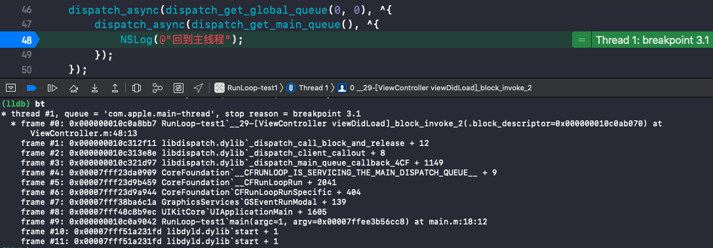

## 文字版流程图
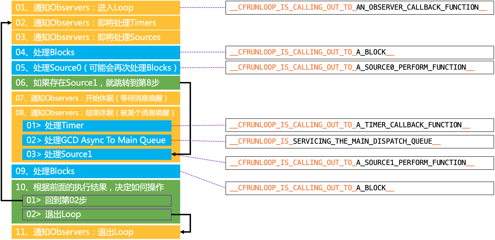
图中的 block 是通过 `CFRunLoopPerformBlock()` 添加的任务。
```
CFRunLoopPerformBlock(CFRunLoopGetCurrent(), kCFRunLoopCommonModes, ^{
        
});
```

## RunLoop 休眠的实现原理
```
static int32_t __CFRunLoopRun(CFRunLoopRef rl, CFRunLoopModeRef rlm, CFTimeInterval seconds, Boolean stopAfterHandle, CFRunLoopModeRef previousMode) {
    ......

    do {
        // 等待消息唤醒当前线程（进入休眠，不会执行任何代码，也不会消耗CPU）
        __CFRunLoopServiceMachPort(waitSet, &msg, sizeof(msg_buffer), &livePort, poll ? 0 : TIMEOUT_INFINITY, &voucherState, &voucherCopy);
    } while (1);

    ......
}

static Boolean __CFRunLoopServiceMachPort(mach_port_name_t port, mach_msg_header_t **buffer, size_t buffer_size, mach_port_t *livePort, mach_msg_timeout_t timeout, voucher_mach_msg_state_t *voucherState, voucher_t *voucherCopy) {
    ......

    ret = mach_msg(msg, MACH_RCV_MSG|(voucherState ? MACH_RCV_VOUCHER : 0)|MACH_RCV_LARGE|((TIMEOUT_INFINITY != timeout) ? MACH_RCV_TIMEOUT : 0)|MACH_RCV_TRAILER_TYPE(MACH_MSG_TRAILER_FORMAT_0)|MACH_RCV_TRAILER_ELEMENTS(MACH_RCV_TRAILER_AV), 0, msg->msgh_size, port, timeout, MACH_PORT_NULL);

    ......
}
```

在 `__CFRunLoopRun()` 方法中调用了 `__CFRunLoopServiceMachPort()` 方法，`__CFRunLoopServiceMachPort()` 方法内部又调用了 `mach_msg()` 方法，使得 RunLoop 进入休眠状态。此时当前线程不再执行，while 循环会停止在 `__CFRunLoopServiceMachPort()` 方法这里，同时 RunLoop 会释放在 CPU 占用的资源，不再执行任何代码，直到有消息唤醒时才会继续执行当前线程（while 循环，以及 while 循环下面省略掉的代码），充分做到了节省资源。RunLoop 就是这样一个函数，其内部是一个 do-while 循环。当你调用 CFRunLoopRun() 时，线程就会一直停留在这个循环里；直到超时或被手动停止，该函数才会返回。 

`mach_msg()` 方法会调用到内核层级的 API，该 API 对应的函数主要功能是等待消息，实现逻辑包括：  
* 没有消息的时候让线程休眠  
* 有消息的时候唤醒线程

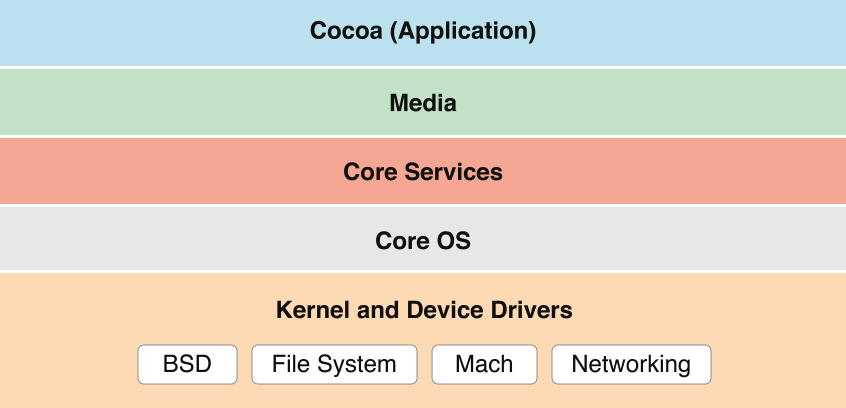

苹果官方将整个系统大致划分为上述4个层次：
* Cocoa 层：是直接向iOS应用程序提供各种基础功能的支持。其中的UIKit框架提供各种可视化控件供应用程序使用，如窗口、视图、视图控制器与各种用户控件等。另外UIKit也定义了应用程序的默认行为和事件处理结构。  
* Media层：依赖于Core Services层提供的功能，主要负责图形与多媒体服务。它包含了CoreGraphics、Core Text、OpenGL ES、Core Animation、AVFoundation、Core Audio等与图形、视频和音频相关的功能模块。  
* Core Services层：可称之为核心服务层，顾名思义，它提供诸如字符串管理、集合管理、网络操作、URL实用工具、联系人管理、偏好设置等服务。除此之外，它还提供很多基于硬件特性的服务，如GPS、加速仪、陀螺仪等。该层包含了Core Location、Core Motion、SystemConfiguration、Foundation与Core Foundation子模块。其中Foundation与Core Foundation子模块提供了对公共数据类型(字符串、集合等)的抽象，Core Foundation中的Core Data子模块可以实现对象图形管理与对象持久化。  
* Core OS层：位于baiiOS框架的最底层，主要du包含内核、文件系统、网zhi络基础架构、安全管理、电源管理、设备驱动、线程管理、内存管理等。简而言之，该层提供了最低级的、系统级的服务。  
* Darwin 即操作系统的核心，包括系统内核、驱动、Shell 等内容，这一层是开源的，其所有源码都可以在 [opensource.apple.com](https://opensource.apple.com/) 里找到。

OC 的 API 有很多个层级，开发者可以调用的属于用户层级的 API，向 _mach_msg() 这种属于内核层级的 API。
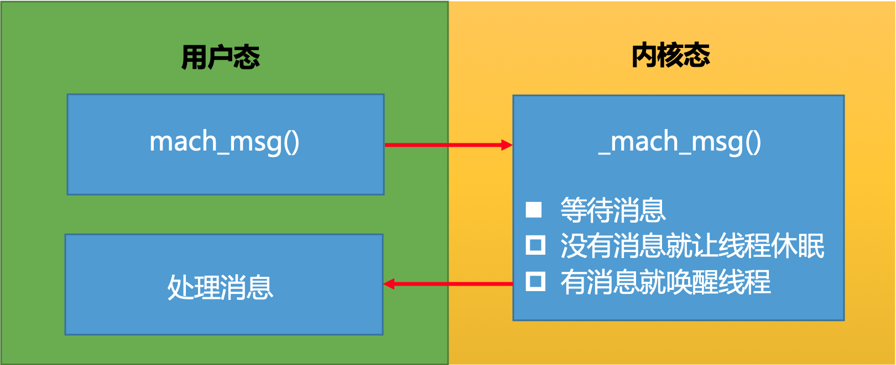

# RunLoop 在实际开中的应用

## NSTimer 失效
```
@interface ViewController : UIViewController
@end

@implementation ViewController
- (void)viewDidLoad {
    [super viewDidLoad];
    
    static int count = 0;
    [NSTimer scheduledTimerWithTimeInterval:1.0 repeats:YES block:^(NSTimer * _Nonnull timer) {
        NSLog(@"%d", ++count);
    }];
}
@end
```

在控制器上加一个 UITextView 并上下拖拽，打印结果：
```
00:34:43.342490+0800 RunLoop-test1[5939:131757] 1
00:34:44.341608+0800 RunLoop-test1[5939:131757] 2
00:34:45.341603+0800 RunLoop-test1[5939:131757] 3
00:34:55.169027+0800 RunLoop-test1[5939:131757] 4
00:34:55.341906+0800 RunLoop-test1[5939:131757] 5
00:34:56.341997+0800 RunLoop-test1[5939:131757] 6
......
```

会发现定时器的打印在拖拽 TextView 时停止了，停止拖拽后，定时器的打印又继续进行了。这是因为 `+scheduledTimerWithTimeInterval:repeats:block:` 方法会自动将创建的 timer 添加到 RunLoop 中，并将 RunLoop 的 mode 设置为 `kCFRunLoopDefaultMode`，而拖拽 TextView 使用的是 `UITrackingRunLoopMode`，但是 RunLoop 在同一时间只会执行一种 Mode，所以在拖拽 TextView 时 RunLoop 将 currentMode 切换成了 `UITrackingRunLoopMode`，NSTimer 自然就停止了。

解决方案：  
通过 `+timerWithTimeInterval:repeats:block:` 方法创建 timer，然后手动添加到 RunLoop 中，并将 RunLoop 的 mode 设置为 NSRunLoopCommonModes。这个时候拖拽 TextView 就不会影响到 timer 了：
```
@implementation ViewController
- (void)viewDidLoad {
    [super viewDidLoad];
    
    static int count = 0;
    NSTimer *timer = [NSTimer timerWithTimeInterval:1.0 repeats:YES block:^(NSTimer * _Nonnull timer) {
        NSLog(@"%d", ++count);
    }];

    [[NSRunLoop currentRunLoop] addTimer:timer forMode:NSRunLoopCommonModes]; //也可以用 CFRunLoopAddTimer(CFRunLoopGetCurrent(), timer, kCFRunLoopCommonModes);
}
@end
```

👉 思考：  
为什么将 NSTimer 的 RunLoop 的 mode 设置为 NSRunLoopCommonModes 就可以正常执行了？NSRunLoopCommonModes 跟 UITrackingRunLoopMode 和 kCFRunLoopDefaultMode 有什么区别？

### NSRunLoopCommonModes
```
struct __CFRunLoop {
    ......

    pthread_t _pthread;
    CFMutableSetRef _commonModes; //保存着 UITrackingRunLoopMode 和 kCFRunLoopDefaultMode
    CFMutableSetRef _commonModeItems; //保存着 NSRunLoopCommonModes 类型的任务（timer）
    CFRunLoopModeRef _currentMode;
    CFMutableSetRef _modes;

    ......
};

struct __CFRunLoopMode {
    ......

    CFStringRef _name;
    CFMutableSetRef _sources0;
    CFMutableSetRef _sources1;
    CFMutableArrayRef _observers;
    CFMutableArrayRef _timers;

    ......
};
```

NSRunLoopCommonModes 并不是一个真正的模式，只是一个标记。UITrackingRunLoopMode 和 kCFRunLoopDefaultMode 才是真正意义上的模式。

一般情况下添加 timer 到 RunLoop 时 mode 设置为 kCFRunLoopDefaultMode，timer 运行在 RunLoop 的 _modes 里的模式下，同时 timer 被保存到 mode 里的 _timers 中。当添加 timer 到 RunLoop 将 mode 设置为 NSRunLoopCommonModes 标记时，那么 timer 能在 _commonModes 里的模式下运行，同时 timer 被保存到了 RunLoop 的 _commonModeItems 中。

## 线程保活
```
@interface YQThread : NSThread
@end

@implementation YQThread
- (void)dealloc
{
    NSLog(@"%s", __func__);
}
@end

@implementation ViewController

- (void)viewDidLoad {
    [super viewDidLoad];
}

- (void)touchesBegan:(NSSet<UITouch *> *)touches withEvent:(UIEvent *)event
{
    YQThread *thread = [[YQThread alloc] initWithTarget:self selector:@selector(run) object:nil];
    [thread start];
}

- (void)run
{
    NSLog(@"%s %@", __func__, [NSThread currentThread]);
}
```

点击屏幕，打印结果：
```
-[ViewController run] <YQThread: 0x600002375fc0>{number = 8, name = (null)}
-[YQThread dealloc]
-[ViewController run] <YQThread: 0x600002352c80>{number = 9, name = (null)}
-[YQThread dealloc]
```

在线程中添加 RunLoop，可以保证线程不被释放，并在需要的时候工作，不需要的时候休眠。`-(void)run` 方法是线程调用的，所以在线程中添加 RunLoop 可以加在 `-(void)run` 方法中。RunLoop 不需要手动创建，在线程中第一次获取 RunLoop 的时候就会自动创建。
```
- (void)run
{
    NSLog(@"%s %@", __func__, [NSThread currentThread]);
    [[NSRunLoop currentRunLoop] run];
    NSLog(@"--- end ---");
}
```

点击屏幕，打印结果：
```
-[ViewController run] <YQThread: 0x600000335f80>{number = 6, name = (null)}
--- end ---
-[YQThread dealloc]
-[ViewController run] <YQThread: 0x60000033d380>{number = 7, name = (null)}
--- end ---
-[YQThread dealloc]
```

可以看到线程还是被销毁了，这是因为 RunLoop 没有找到 Sources0/Sources1/Timer/Observer 就退出了，所以需要向 RunLoop 中添加任务：
```
- (void)run
{
    NSLog(@"%s %@", __func__, [NSThread currentThread]);
    // 在 RunLoop 中添加 Sources/timer/observer
    [[NSRunLoop currentRunLoop] addPort:[[NSPort alloc] init] forMode:NSDefaultRunLoopMode];
    [[NSRunLoop currentRunLoop] run]; //线程停留在这里，不会打印下面这句
    NSLog(@"--- end ---");
}
```

打印结果：
```
-[ViewController run] <YQThread: 0x60000101d000>{number = 6, name = (null)}
-[ViewController run] <YQThread: 0x60000101b480>{number = 7, name = (null)}
-[ViewController run] <YQThread: 0x600001077680>{number = 8, name = (null)}
```

从打印结果可以看到，线程停留在了 `[[NSRunLoop currentRunLoop] run];` 这一行，一直都没有打印 "--- end ---"。

因为 port 是 sources1 类型的事件，添加到 RunLoop 中却没有什么事情可做，RunLoop 就进入了休眠等待任务唤醒（没有退出），即 RunLoop 阻塞住了线程保证了线程不被释放，所以一直没有打印 "--- end ---"。

因为是在异步线程，所以不需要考虑 UITrackingRunLoopMode，直接设置为 NSDefaultRunLoopMode 就可以了。

为一直存活的线程添加任务：
```
@interface ViewController ()
@property (nonatomic, strong) YQThread *thread;
@end

@implementation ViewController

- (void)viewDidLoad {
    [super viewDidLoad];
    
    self.thread = [[YQThread alloc] initWithTarget:self selector:@selector(run) object:nil];
    [self.thread start];
}

- (void)touchesBegan:(NSSet<UITouch *> *)touches withEvent:(UIEvent *)event
{
    [self performSelector:@selector(test) onThread:self.thread withObject:nil waitUntilDone:NO];
}

// 子线程的任务
- (void)test {
    NSLog(@"%s %@", __func__, [NSThread currentThread]);
}

// 这个方法的目的：线程保活
- (void)run
{
    NSLog(@"%s %@", __func__, [NSThread currentThread]);
    // 在 RunLoop 中添加 Sources/timer/observer
    [[NSRunLoop currentRunLoop] addPort:[[NSPort alloc] init] forMode:NSDefaultRunLoopMode];
    [[NSRunLoop currentRunLoop] run];
    NSLog(@"--- end ---");
}
@end
```

点击屏幕，打印结果：
```
 -[ViewController run] <YQThread: 0x600000d56640>{number = 6, name = (null)}
 -[ViewController test] <YQThread: 0x600000d56640>{number = 6, name = (null)}
 -[ViewController test] <YQThread: 0x600000d56640>{number = 6, name = (null)}
 -[ViewController test] <YQThread: 0x600000d56640>{number = 6, name = (null)}
```

从打印结果可以看到，线程一直存在，并且可以重复执行任务。

上面👆的实现有以下几个问题：  
1. NSThread 的初始化方法会对 self 进行强引用，导致 thread 和 self 循环引用问题。
```
self.thread = [[YQThread alloc] initWithTarget:self selector:@selector(run) 
```

2. RunLoop 进入休眠并没有退出，所以一直不会打印 "--- end ---"，线程也就无法结束。
3. NSRunLoop 的 `-(void)run` 方法是无法停止的，它专门用于开启一个永不销毁的线程。`-(void)run` 方法内部在重复创建 RunLoop。while 循环在第一次循环时会创建一个 RunLoop1 阻塞住 while 循环，RunLoop1 会在有任务时执行任务，没任务时休眠。当调用退出方法让 RunLoop1 退出后，while 循环会再次启动并创建一个新的 RunLoop2，逻辑同 RunLoop1。即退出了当前的 RunLoop 还会创建一个新的 RunLoop。伪代码实现：
```
while (1) {
    [[NSRunLoop currentRunLoop] runMode:NSDefaultRunLoopMode beforeDate:[NSDate distantFuture]];
}
```

优化后的实现：
```
@interface ViewController ()
@property (nonatomic, strong) YQThread *thread;
@property (nonatomic, assign, getter=isStop) BOOL stop; //停止RunLoop的标记
@end

@implementation ViewController

- (void)viewDidLoad 
{
    [super viewDidLoad];
    
    __weak typeof(self) weakSelf = self;
    self.thread = [[YQThread alloc] initWithBlock:^{
        NSLog(@"%@--- begain ---", [NSThread currentThread]);
        /**--- 线程保活 ---*/
        [[NSRunLoop currentRunLoop] addPort:[[NSPort alloc] init] forMode:NSDefaultRunLoopMode];
        while (!weakSelf.isStop) {
            [[NSRunLoop currentRunLoop] runMode:NSDefaultRunLoopMode beforeDate:[NSDate distantFuture]];
        }
        /**--- 线程保活 end ---*/
        NSLog(@"%@--- end ---", [NSThread currentThread]);
    }];
    [self.thread start];
}

- (void)touchesBegan:(NSSet<UITouch *> *)touches withEvent:(UIEvent *)event
{
    [self performSelector:@selector(test) onThread:self.thread withObject:nil waitUntilDone:NO];
}

// 子线程的任务
- (void)test 
{
    NSLog(@"%s %@", __func__, [NSThread currentThread]);
}

- (void)stopThread
{
    // 设置停止线程标记
    self.stop = YES;
    // 停止RunLoop
    CFRunLoopStop(CFRunLoopGetCurrent());
}

- (void)dealloc
{
    NSLog(@"%s", __func__);
    //停止 RunLoop 的方法需要在对应线程内执行，dealloc 方法在主线程，可以通过该方法调用到需要停止的线程里执行
    [self performSelector:@selector(stopThread) onThread:self.thread withObject:nil waitUntilDone:NO];
}
@end
```

打印结果：
```
<YQThread: 0x60000372e200>{number = 7, name = (null)}--- begain ---
-[ViewControllerNew test] <YQThread: 0x60000372e200>{number = 7, name = (null)}
-[ViewControllerNew test] <YQThread: 0x60000372e200>{number = 7, name = (null)}
-[ViewControllerNew dealloc]
```

`CFRunLoopStop(CFRunLoopGetCurrent())` 方法会退出当前的 RunLoop，此时 while 循环重新启动并在判断 isStop == YES 时停止循环，不会再创建新的 RunLoop。

打印结果中没有打印 "--- end ---"，线程也没有释放，是因为上面👆的实现还有以下几个问题： 
1. `performSelector:onThread:waitUntilDone` 方法的第三个参数 waitUntilDone 表示是否需要当前线程等待方法执行完成后再继续执行下一行。如果设置为 NO，则表示不需要等待，那么在控制器的 `-(void)dealloc` 方法里在 self 调用 `performSelector:onThread:waitUntilDone` 后，`-(void)dealloc` 方法会继续往下执行，控制器被释放。那么在执行 `-(void)stopThread` 方法的时候再访问 self 就会出现坏内存访问的错误。
2. `while (!weakSelf.isStop)` 在控制器被销毁后也是成立的（`while (!nil)` == `while (true)`），所以 while 循环又会创建新的 RunLoop，线程还是无法释放。

最终实现：
```
@interface ViewController ()
@property (nonatomic, strong) YQThread *thread;
@property (nonatomic, assign, getter=isStop) BOOL stop; //停止RunLoop的标记
@end

@implementation ViewController

- (void)viewDidLoad 
{
    [super viewDidLoad];
    
    __weak typeof(self) weakSelf = self;
    self.thread = [[YQThread alloc] initWithBlock:^{
        NSLog(@"%@--- begain ---", [NSThread currentThread]);
        /**--- 线程保活 ---*/
        [[NSRunLoop currentRunLoop] addPort:[[NSPort alloc] init] forMode:NSDefaultRunLoopMode];
        while (weakSelf && !weakSelf.isStop) {
            [[NSRunLoop currentRunLoop] runMode:NSDefaultRunLoopMode beforeDate:[NSDate distantFuture]];
        }
        /**--- 线程保活 end ---*/
        NSLog(@"%@--- end ---", [NSThread currentThread]);
    }];
    [self.thread start];
}

- (void)touchesBegan:(NSSet<UITouch *> *)touches withEvent:(UIEvent *)event
{
    [self performSelector:@selector(test) onThread:self.thread withObject:nil waitUntilDone:NO];
}

// 子线程的任务
- (void)test 
{
    NSLog(@"%s %@", __func__, [NSThread currentThread]);
}

- (void)stopThread
{
    // 设置停止线程标记
    self.stop = YES;
    // 停止RunLoop
    CFRunLoopStop(CFRunLoopGetCurrent());
}

- (void)dealloc
{
    NSLog(@"%s", __func__);
    // 停止 RunLoop 的方法需要在对应线程内执行，dealloc 方法在主线程，可以通过该方法调用到需要停止的线程里去执行
    // waitUntilDone:YES，表示执行完该方法在向下执行，保证了在执行该方法时，控制器（self）不会被销毁
    [self performSelector:@selector(stopThread) onThread:self.thread withObject:nil waitUntilDone:YES];
}
@end
```

打印结果：
```
<YQThread: 0x600000c70100>{number = 6, name = (null)}--- begain ---
-[ViewControllerNew test] <YQThread: 0x600000c70100>{number = 6, name = (null)}
-[ViewControllerNew test] <YQThread: 0x600000c70100>{number = 6, name = (null)}
-[ViewControllerNew dealloc]
<YQThread: 0x600000c70100>{number = 6, name = (null)}--- end ---
-[YQThread dealloc]
```

## 线程的封装

为了方便使用，将线程封装成一个工具类，这样在使用的时候就不用管理线程的创建、保活和销毁了。

### 接口设计

方案一：创建一个 NSThread 的分类。这种方式需要用到关联对象创建 NSThread 对象，而且在外部使用时调用者可以调用 NSThread 提供的 API，封装性不够好。

方案二：创建一个 NSObject 管理类，里面管理一个 NSThread 对象。不直接继承 NSThread 的原因同上，为了控制调用者不能去访问  NSThread 提供的 API，保证 NSThread 相关的操作（创建、保活和销毁）全部且只能在管理类的内部操作，调用者只能调用由管理类提供的 API，这样就保证了封装性。 

定义接口：
```
@interface YQPermenantThread : NSObject
/**
 开启线程
 */
- (void)run;
/**
 执行任务
 */
- (void)executeTaskWithTarget:(id)target action:(SEL)action object:(id)object;
/**
结束线程
*/
- (void)stop;
@end
```

调用：
```
@interface ViewControllerNew ()
@property (nonatomic, strong) YQPermenantThread *thread;
@end

@implementation ViewControllerNew
- (void)viewDidLoad
{
    [super view];
    
    self.thread = [[YQPermenantThread alloc] init];
    [self.thread run];
}

- (void)touchesBegan:(NSSet<UITouch *> *)touches withEvent:(UIEvent *)event
{
    [self.thread executeTaskWithTarget:self action:@selector(test) object:nil];
}

- (void)test
{
    NSLog(@"%s %@", __func__, [NSThread currentThread]);
}

- (void)dealloc
{
    [self.thread stop];
}
@end
```

执行任务的方法也可以设计成 Block 的形式，代码会更精简：
```
@interface YQPermenantThread : NSObject
/**
 开启线程
 */
- (void)run;
/**
 执行任务
 */
- (void)executeTask:(void (^)(void))task;
/**
结束线程
*/
- (void)stop;
@end


@interface ViewControllerNew ()
@property (nonatomic, strong) YQPermenantThread *thread;
@end

@implementation ViewControllerNew
- (void)viewDidLoad
{
    [super view];
    
    self.thread = [[YQPermenantThread alloc] init];
    [self.thread run];
}

- (void)touchesBegan:(NSSet<UITouch *> *)touches withEvent:(UIEvent *)event
{
    /**
     [self.thread executeTask:^{
         NSLog(@"%@", [NSThread currentThread]);
     }];
     */
    __weak typeof(self) weakSelf = self;
    [self.thread executeTask:^{
        [weakSelf test];
    }];
}

- (void)test
{
    NSLog(@"%s %@", __func__, [NSThread currentThread]);
}

- (void)dealloc
{
    [self.thread stop];
}
@end
```

### 内部实现
```
@interface YQThread : NSThread
@end
@implementation YQThread
- (void)dealloc
{
    NSLog(@"%s", __func__);
}
@end

@interface YQPermenantThread()
@property (nonatomic, strong) YQThread *innerThread;
@property (nonatomic, assign, getter=isStopped) BOOL stopped; //停止RunLoop的标记
@end

@implementation YQPermenantThread

- (instancetype)init
{
    self = [super init];
    if (self) {
        self.stopped = NO;
        
        __weak typeof(self) weakSelf = self;
        self.innerThread = [[YQThread alloc] initWithBlock:^{
            [[NSRunLoop currentRunLoop] addPort:[[NSPort alloc] init] forMode:NSDefaultRunLoopMode];
            while (weakSelf && !weakSelf.isStopped) {
                [[NSRunLoop currentRunLoop] runMode:NSDefaultRunLoopMode beforeDate:[NSDate distantFuture]];
            }
        }];
    }
    return self;
}

- (void)run
{
    if (!self.innerThread) return;
    
    [self.innerThread start];
}

- (void)executeTask:(void (^)(void))task
{
    if (!self.innerThread || !task) return;
    
    [self performSelector:@selector(__executeTask:) onThread:self.innerThread withObject:task waitUntilDone:NO];
}

- (void)stop
{
    if (!self.innerThread) return;
    
    [self performSelector:@selector(__stop) onThread:self.innerThread withObject:nil waitUntilDone:YES];
}

- (void)dealloc
{
    NSLog(@"%s", __func__);
    [self stop];
}

#pragma mark - private methods
- (void)__stop
{
    self.stopped = YES;
    CFRunLoopStop(CFRunLoopGetCurrent());
    self.innerThread = nil;
}

- (void)__executeTask:(void(^)(void))task
{
    task();
}
@end
```

调用：
```
@interface ViewControllerNew ()
@property (nonatomic, strong) YQPermenantThread *thread;
@end

@implementation ViewControllerNew

- (void)viewDidLoad
{
    [super viewDidLoad];
    self.view.backgroundColor = [UIColor orangeColor];
    
    self.thread = [[YQPermenantThread alloc] init];
    [self.thread run];
}

- (void)touchesBegan:(NSSet<UITouch *> *)touches withEvent:(UIEvent *)event
{
    __weak typeof(self) weakSelf = self;
    [self.thread executeTask:^{
        [weakSelf test];
    }];
}

- (void)test
{
    NSLog(@"%s %@", __func__, [NSThread currentThread]);
}

- (void)dealloc
{
    NSLog(@"%s", __func__);
}
@end
```

打印结果：
```
-[ViewControllerNew test] <YQThread: 0x600000d76f00>{number = 9, name = (null)}
-[ViewControllerNew dealloc]
-[YQPermenantThread dealloc]
-[YQThread dealloc]
```

### C语言方式实现
```
@interface YQThread : NSThread
@end
@implementation YQThread
- (void)dealloc
{
    NSLog(@"%s", __func__);
}
@end

@interface YQPermenantThread()
@property (nonatomic, strong) YQThread *innerThread;
@end

@implementation YQPermenantThread

- (instancetype)init
{
    self = [super init];
    if (self) {
        __weak typeof(self) weakSelf = self;
        self.innerThread = [[YQThread alloc] initWithBlock:^{
            // 创建上下文
            CFRunLoopSourceContext context = {0};

            // 创建source
            CFRunLoopSourceRef source = CFRunLoopSourceCreate(kCFAllocatorDefault, 0, &context);

            // 往RunLoop中添加source
            CFRunLoopAddSource(CFRunLoopGetCurrent(), source, kCFRunLoopDefaultMode);

            // 销毁source
            CFRelease(source);

            // 启动（ture：执行完source退出；false：执行完source不退出）
            CFRunLoopRunInMode(kCFRunLoopDefaultMode, 1.0e10, false);
        }];
    }
    return self;
}

- (void)run
{
    if (!self.innerThread) return;
    
    [self.innerThread start];
}

- (void)executeTask:(void (^)(void))task
{
    if (!self.innerThread || !task) return;
    
    [self performSelector:@selector(__executeTask:) onThread:self.innerThread withObject:task waitUntilDone:NO];
}

- (void)stop
{
    if (!self.innerThread) return;
    
    [self performSelector:@selector(__stop) onThread:self.innerThread withObject:nil waitUntilDone:YES];
}

- (void)dealloc
{
    NSLog(@"%s", __func__);
    [self stop];
}

#pragma mark - private methods
- (void)__stop
{
    CFRunLoopStop(CFRunLoopGetCurrent());
    self.innerThread = nil;
}

- (void)__executeTask:(void(^)(void))task
{
    task();
}
@end
```

打印结果：
```
-[ViewControllerNew dealloc]
-[YQPermenantThread dealloc]
-[YQThread dealloc]
```

👉注意：
1. 在创建上下文时，CFRunLoopSourceContext 是一个结构体，如果没有进行初始化，context 的内部的值可能会是一堆乱码。只有添加了初始化方法`{0}`，才能保证结构里内部的值是正常的数值：
```
CFRunLoopSourceContext context = {0};
```

2. 启动 RunLoop 时，第三个参数传 true 表示执行完 source 立即退出，传 false 表示执行完 source 不退出。在这里传 false 等同于 OC 实现中的 while 循环的作用。
```
CFRunLoopRunInMode(kCFRunLoopDefaultMode, 1.0e10, false);
```

# 总结

* 讲讲 RunLoop，项目中有用到吗？  
  1. RunLoop 保持程序的持续运行，没有 RunLoop 程序会马上退出，有了 RunLoop 程序并不会马上退出，而是保持运行状态；
  2. RunLoop 处理App中的各种事件（如：定时器（Timer）、PerformSelector、GCD、事件响应、手势识别、界面刷新、网络请求和 AutoreleasePool 等）。这些事件的代码最终都变成了 RunLoop 里的执行任务（sources0/sources1/timers），由 RunLoop 监控和执行；
  3. RunLoop 的休眠机制极大可能的节省了对CPU资源的占用，提高了程序性能；
  4. 每条线程都有唯一的一个与之对应的 RunLoop 对象。RunLoop 保存在一个全局的 Dictionary 里，线程作为 key，RunLoop 作为 value。线程刚创建时并没有 RunLoop 对象，RunLoop 会在第一次获取它时创建。RunLoop 会在线程结束时销毁。主线程的 RunLoop 已经自动获取（创建），子线程默认没有开启 RunLoop；
  5. RunLoop 启动时只能选择其中一个 Mode，作为 _currentMode。如果需要切换 Mode，只能退出当前 Loop，再重新选择一个 Mode 进入。一个 RunLoop 包含若干个 Mode，每个 Mode 又包含若干个 Sources0/Sources1/Timer/Observer。如果 Mode 里没有任何 Source0/Source1/Timer/Observer，RunLoop 会立马退出。
  6. RunLoop 有两种常见的 mode：  
  kCFRunLoopDefaultMode（NSDefaultRunLoopMode）：App 的默认 Mode，通常主线程是在这个 Mode 下运行。  
  UITrackingRunLoopMode：界面跟踪 Mode，用于 ScrollView 追踪触摸滑动，保证界面滑动时不受其他 Mode 影响。（只有主线程需要考虑这种 mode）  
  NSRunLoopCommonModes：并不是一个真正的模式，只是一个标记。UITrackingRunLoopMode 和 kCFRunLoopDefaultMode 才是真正意义上的模式。一般情况下添加 timer 到 RunLoop 时 mode 设置为 kCFRunLoopDefaultMode，timer 运行在 RunLoop 的 _modes 里的模式下，同时 timer 被保存到 mode 里的 _timers 中。当添加 timer 到 RunLoop 将 mode 设置为 NSRunLoopCommonModes 标记时，那么 timer 能在 _commonModes 里的模式下运行，同时 timer 被保存到了 RunLoop 的 _commonModeItems 中。
  7. RunLoop 的休眠唤醒逻辑是通过调用一个内核方法 `mach_msg()` 实现的。  
  
    项目中使用 RunLoop 的地方比较少，主要有解决 NSTimer 失效问题，自定义线程保活。

* RunLoop 内部实现逻辑？  
  1. RunLoop 启动时只能选择其中一个 Mode，作为 _currentMode。如果需要切换 Mode，只能退出当前 Loop，再重新选择一个 Mode 进入。一个 RunLoop 包含若干个 Mode，每个 Mode 又包含若干个 Sources0/Sources1/Timer/Observer。如果 Mode 里没有任何 Source0/Source1/Timer/Observer，RunLoop 会立马退出。

  2. RunLoop 的休眠唤醒逻辑是通过调用一个内核方法 `mach_msg()` 实现的。

* RunLoop 和线程的关系？  
每条线程都有唯一的一个与之对应的 RunLoop 对象。RunLoop 保存在一个全局的 Dictionary 里，线程作为 key，RunLoop 作为 value。线程刚创建时并没有 RunLoop 对象，RunLoop 会在第一次获取它时创建。RunLoop 会在线程结束时销毁。主线程的 RunLoop 已经自动获取（创建），子线程默认没有开启 RunLoop；

* timer 与 RunLoop 的关系？  
一般情况下添加 timer 到 RunLoop 时 mode 设置为 kCFRunLoopDefaultMode，timer 运行在 RunLoop 的 _modes 里的模式下，同时 timer 被保存到 mode 里的 _timers 中。当添加 timer 到 RunLoop 将 mode 设置为 NSRunLoopCommonModes 标记时，那么 timer 能在 _commonModes 里的模式下运行，同时 timer 被保存到了 RunLoop 的 _commonModeItems 中。

* 程序中添加每3秒响应一次的 NSTimer，当拖动 tableview 时 timer 可能无法响应要怎么解决？  
通过 +timerWithTimeInterval:repeats:block: 方法创建 timer，然后手动添加到 RunLoop 中，并将 RunLoop 的 mode 设置为 NSRunLoopCommonModes。这个时候拖拽 TextView 就不会影响到 timer 了。原因在上面“timer 与 RunLoop 的关系”。

* RunLoop 是怎么响应用户操作的， 具体流程是什么样的？


* 说说 RunLoop 的几种状态  
```
typedef CF_OPTIONS(CFOptionFlags, CFRunLoopActivity) {
    kCFRunLoopEntry = (1UL << 0),         //即将进入Loop
    kCFRunLoopBeforeTimers = (1UL << 1),  //即将处理Timer
    kCFRunLoopBeforeSources = (1UL << 2), //即将处理Source
    kCFRunLoopBeforeWaiting = (1UL << 5), //即将进入休眠
    kCFRunLoopAfterWaiting = (1UL << 6),  //刚从休眠中唤醒
    kCFRunLoopExit = (1UL << 7),          //即将推出Loop
    kCFRunLoopAllActivities = 0x0FFFFFFFU
};
```

* RunLoop 的 mode 作用是什么？  
mode 是 RunLoop 的运行模式。RunLoop 启动时只能选择其中一个 Mode，作为 _currentMode。如果需要切换 Mode，只能退出当前 Loop，再重新选择一个 Mode 进入。一个 RunLoop 包含若干个 Mode，每个 Mode 又包含若干个 Sources0/Sources1/Timer/Observer。不同组（不同mode）的 Sources0/Sources1/Timer/Observer 能分隔开来，互不影响。如果 Mode 里没有任何 Sources0/Sources1/Timer/Observer，RunLoop 会立马退出。RunLoop 将 OC 代码转换成了 Sources0/Sources1/Timer/Observer 保存到不同的 mode 里，并且循环监测并执行它们。比如：定时器（Timer）、PerformSelector、GCD、事件响应、手势识别、界面刷新、网络请求和 AutoreleasePool 等都是在进入休眠前完成的。