* [Documentation](https://developer.apple.com/documentation/)
* [Documentation Technologies](https://developer.apple.com/documentation/technologies)
* [Documentation Archive](https://developer.apple.com/library/archive/navigation/)
* [Opensource Srource](https://opensource.apple.com/source/)
* [Opensource tarballs](https://opensource.apple.com/tarballs/)
* [Opensource](https://opensource.apple.com/)
* [Github Of Apple](https://github.com/apple)
* [Swift Book](https://docs.swift.org/swift-book/)
* [Develop](https://developer.apple.com/develop/)

<!-- more -->

# 苹果Xcode帮助文档阅读指南/官方文档

转自：[苹果Xcode帮助文档阅读指南/官方文档](https://blog.csdn.net/YLGWHYH/article/details/41806103)

## Xcode文档的结构

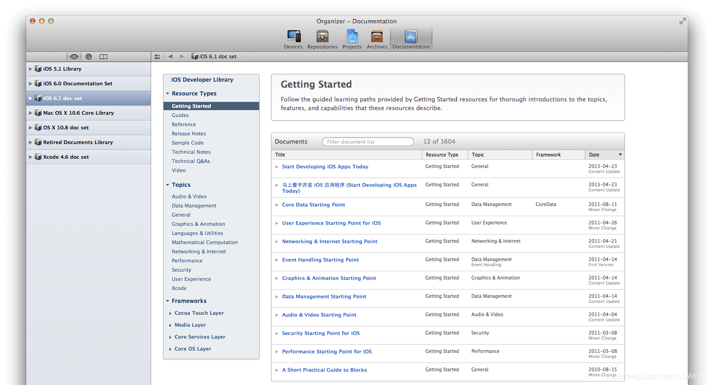

如上图，打开文档后，整个文档界面由 **左面的侧栏** 和 **右面的内容区域** 构成。左面的侧栏可以选择不同的文档库，右面的内容区域是对应文档库的所有文档列表。你的 Xcode 里面一般来说有一组不同版本的 iOS 文档库、一组不同版本的 OS X 文档库，以及一个 Xcode 文档库。

如果这里没有你要查看的文档库，你可以选择 Xcode 的 Preferences 菜单，然后选择 **Downloads -> Documentation**。在这里可以看到已经下载安装了的文档库，还没有下载的文档库，可以酌情选择。如下图：

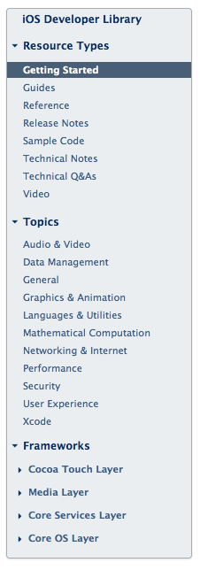

然后我们看，文档内容区域的左侧导航区域，这里揭示了**文档库的结构**。如下图：

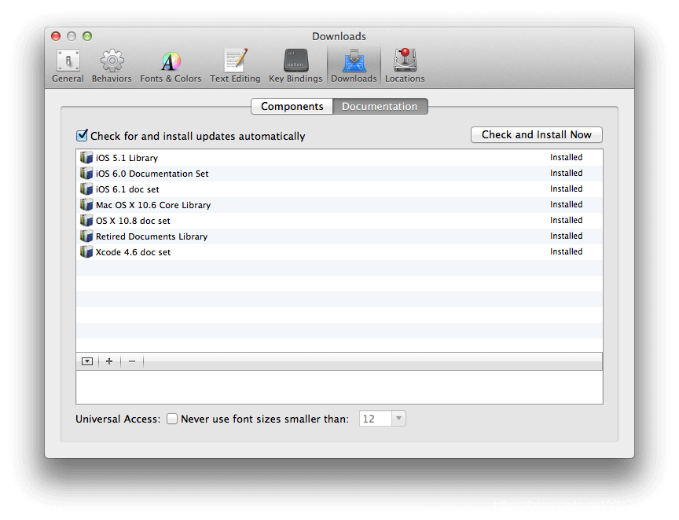

### 文档库侧栏

#### Resource Types

首先是 **Resource Types**，也就是资源类型，标签。文档库里面所有的文档是属于不同类型的，该类型是以下这几种类型中的一种：

* **Getting Started** -- 新手入门。一般来说，是给完全的新手看的。建议初学者看看，这里面有一些建立观念的东西，有了这些建立观念的东西，后面的学习就比较容易了。

* **Guides** -- 指南。指南是 Xcode 里面最酷最好的部分，学会看指南则大多数情况完全不用买书。Xcode 文档里面的指南，就是一个一个问题的，从一个问题或者系统的一个方面出发，一步一步详细介绍怎么使用 Cocoa 库的文档。一般程序员比较熟悉的是 Reference，就是你查某个类、方法、函数的文档时候，冒出来的东西（`option +`）。那些其实是一点一点的细碎知识，光看那些东西就完全没有脉络。而 Guides 就是帮你整理好的学习的脉络。

* **Reference** -- 参考资料。一个一个框架一个一个类组织起来的文档，包含了每个方法的使用方法。

* **Release Notes** -- 发布说明。一个 iOS 新版本带来了哪些新特性，这样的信息，熟悉新 iOS，比较不同 iOS 版本 API 不同，都需要参考这些文档。

* **Sample Code** -- 示例代码。苹果官方提供的一些示例代码，帮助你学习某些技术某些 API。非常强烈建议学习的时候参考，一方面光看文档有时候还是很难弄明白具体实现是怎么回事儿。另外一方面这些示例代码都是苹果的工程师写的，你从示例代码的变迁可以看到苹果官方推荐的代码风格变化。

* **Technical Notes** -- 技术说明。一些技术主题文章，有空的时候可以浏览一下。往往会有一些收获。

* **Technical Q&A** -- 常见技术问答。这是技术社区里面一些常见问题以及回答的整理。

* **Video** -- 视频。目前主要是 WWDC 的视频，实际上是登录到开发者网站上去浏览的，这里就是快捷方式。想深入学习的话，一定不能错过，大量的看，不仅可以学好技术，还可以练好英文。

总结一下，这里面的 `Reference、Release Notes、Sample Code、Technical Notes、Technical Q&A`，一般来说只是备查的。主要要看的是 `Getting Started` 和 `Guides`。

#### Topics

然后下面是 Topics，也就是话题，被分为：

1. **Audio & Video** -- 音视频
2. **Languages & Utilities** -- 语言和工具，Objective-C 的一些知识，App Store 的管理工具等。
3. **Mathematical Computation** -- 数学计算。
4. **Xcode**
5. **Data Management** -- 数据管理。
6. **General** -- 一般性的问题。
7. **Graphics & Animation** -- 图形和动画。
8. **Networking & Internet** -- 网络问题。
9. **Performance** -- 性能。
10. **Security** -- 安全。
11. **User Experience** -- 用户体验。

这里不多说，大多数都是顾名思义的问题。但是值得一提的就是有很多初学者说，我想好好了解下图形和动画的技术，但是文档里面找不到，这就只能说，你睁着大大的眼睛，为毛左看右看看不到呢？

#### Frameworks

最下面是 **Frameworks**（框架），分为：

1. **Cocoa Touch Layer**
2. **Media Layer**
3. **Core Services Layer**
4. **Core OS Layer**

这里我们先不讨论这个东西，后面会仔细讲。

总体来说左边的导航区域就是用三种不同的维度，来帮你精准定位你需要的内容。

## 内容区域
现在我们看内容区域的右边。**注意上面的文档过滤器**。如下图：

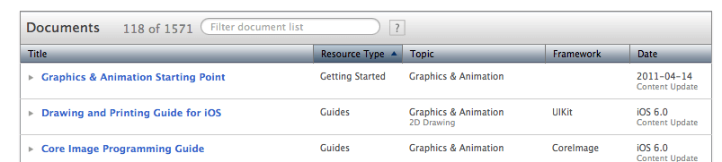

假设，你现在想看关于性能方面的 Guides，那么你应该做的就是在左面的导航，点击 **Topics -> Performance**，然后在右边的文档过滤器上面输入 **Guides**。

或者你也可以在左边的导航，点击 **Resource Types -> Guides**，然后在文档过滤器里面输入 **Performance**。

熟练使用导航和文档过滤器的话，学习就会非常方便快捷。

## 文档导读

前面我们讲 Xcode 的文档结构是在介绍如何能够快速定位到你要找的内容。但是很多人的问题可能是一开始就根本不知道要读什么。

这里我们就介绍自学 iOS 开发应该遵循或者说我们推荐的必读文档的阅读顺序。

阅读顺序：

1. **《马上着手开发 iOS 应用程序 (Start Developing iOS Apps Today)》**
2. **《Your First iOS App》**
3. **《Your Second iOS App: Storyboards》**
4. **《Your Third iOS App: iCloud》**
5. **《iOS Technology Overview》**
6. **《iOS Human Interface Guidelines》**
7. **《Learning Objective-C: A Primer》** 和 **《Programming with Objective-C》**
8. **《iOS App Programming Guide》**
9. **《View Programming Guide for iOS》和《View Controller Programming Guide for iOS》**
10. **《Table View Programming Guide for iOS》**

### 马上着手开发 iOS 应用程序 (Start Developing iOS Apps Today)》

首先应该看的是 **Getting Started** 里面的 **《马上着手开发 iOS 应用程序 (Start Developing iOS Apps Today)》**（中英文版本皆有，苹果官方的翻译）。这个文档讲的很浅，但是是建立概念的文档，你以后在开发里面经常遇到的概念，在这里都有包含，特别注 意是，这个文档看起来简单，但是每页下面的相关文章，不是选读，都是必读。

即使是很多做了 iOS 开发很久的同学，其实也有很多概念上的误解，现代程序开发越来越简单，工具越来越强大，往往有些误解也可以继续前行，但是实际上不建立扎实的基础是很吃亏的，往往后面理解和解决一个不难解决小问题都要付出很多辛苦。

阅读这个文档的目的和检测标准是，以后你看到iOS开发中的基本概念，都大致所有了解。

### 《Your First iOS App》

读完 **《马上着手开发 iOS 应用程序 (Start Developing iOS Apps Today)》** 后，应该去看 **Your XXX iOS App** 系列这个系列不是什么很难的文章，你也不必着急先去学习 Objective-C，学什么 C 语言就更不要着急。我推荐的学习方法是有成就的逐步学习法。在学习系统体系架构、Objective-C之 前，你可以先按照文档写一个全天下最简单的 App，完成学习过程中第一个里程碑。在这个过程中不用担心 有什么疑问，有什么不懂，先照着做就是。

阅读这三个文档的目的和检测标准是，把这三个 Demo App 做出来在模拟器上跑起来。

在这个过程中，你对开发工具的基本认识就建立起来了，也有了成就感，去了魅（就是消除了对 iOS 开发的神秘感）。

### 《iOS Technology Overview》

再往下，建议你去看 **《iOS Technology Overview》**（iOS技术概览），iOS 不是一个技术，而是一堆技术，前一篇讲到文档导航区域的分类，框架分类的时候，我说不细讲的原因就在于此， 你要做一个动画应该用 Core Animation 还是 OpenGL？你要做一些文本相关操作应该用 Core Text 还是什么，就是看这里。

学习现代的程序开发，语言和框架并重。我们 Tiny4Cocoa 叫做这个名字的原因就是，iOS/Mac 开发者的代表往往就是这个 Cocoa 框架，就是这个 SDK。大多数你所需要的功能都躺在框架里面，你知道框架的结构，你才知道怎么去寻找相关的技术资料。

阅读这个文档的目的和检测标准是，遇到具体问题，知道应该去看哪方面的文档。

### 《iOS Human Interface Guidelines》

再下来，建议阅读的是 **《iOS Human Interface Guidelines》**，Mac/iOS 平台虽然也是百花齐放各类程序、App都有，但是总体看来，大多数优秀 App 的 UI 看起来都和整个系统很协调。这 和 Windows 以及很多其他平台完全不同。这是为什么呢？

很大程度就归功于 **《Human Interface Guidelines》** 文化，所谓 Human Interface Guidelines 就是用户界面的规范，在苹果它还专门有一个缩写叫做 HIG，是天条一样的东西。所有的 App 都推荐遵循 HIG，遵循了 HIG，你做的东西用户看起来就会觉得和整个系统很协调。即使是你要做一些创新的设计，你势必会打破 HIG 的限制，但是你这个时候仍旧应该遵循 HIG 的精神。

此外，你阅读 HIG 的很重要一点是了解整个 UI 结构和 UE 行为的逻辑机理，这样才能在你设计界面的时候有所依据。

阅读这个文档的目的和检测标准是，看到任何一个App，你可以知道它的任何一个 UI 是系统控件，还是自定义控件，它的层次关系等等。

### 《Learning Objective-C: A Primer》 和 《Programming with Objective-C》

**《Learning Objective-C: A Primer》** 是非常初级和简单的入门，适合先阅读。**《Programming with Objective-C》** 超微复杂一点点，适合后阅读。

一般人建议先学习语言，我反之建议先做了一个App，然后再学习语言。原因有几个，首先现代开发工具，往往不是用来开发控制台程序的，上来就会有框架，光懂语言不会使用 IDE，甚至可能会更麻烦。再其次就是，其实现代语言发展到了面向对象以后，库往往比语言更复杂，更重要，或者说更多的时候，我们是在学习库，而不是语言，语言只是库的一个载体。

比如，Delegate 和 Block 等等都和 Cocoa 的 UI 异步机制关系紧密，光看代码，这些语言元素非常难以学习，也完全不知道其意义在哪里。

阅读这个文档的目的和检测标准是，看得懂基本的 Objective-C 代码，方便后面的学习和阅读各种示例代码。

### 《iOS App Programming Guide》

**《iOS App Programming Guide》** 基本上介绍的就是开发一个 App 的完整流程，包括 App 的生命周期、休眠、激活等等，里面介绍的细节颇多。正式开发第一个上线的 App 之前必看。或者开发了一个 App，临到提交前必看的文档。

阅读这个文档的目的和检测标准是，了解全部流程和很多细节问题。

### 《View Programming Guide for iOS》 和 《View Controller Programming Guide for iOS》

**《View Programming Guide for iOS》** 和 **《View Controller Programming Guide for iOS》** 非常重要。View 是整个图形界面里面最重要的概念。所有的图形、界面绘制都基于 View。你看到的一切复杂的用户界面，就是各种不同的View 的组合堆叠。

View Controller 是 View 和某种逻辑在一起的组合，本质上这种组合不是必须的，但是是大大降低编程复杂度的一种设计。很多人不懂什么是 View 什么是 View Controller，这样写起代码来就很痛苦。

阅读这个文档的目的和检测标准是，深刻理解什么是 View，什么是 View Controller，理解什么情况用 View，什么情况用 View Controller。

UITableView 是最重要的一个控件，是最常用的 UI 界面元素。在 UICollectionView 出现之前，大量的内容列表展示的自定义控件都是基于 UITableView，比如很多书架、图片 Grid 其实都是 UITableView 做的。

所以 **《Table View Programming Guide for iOS》** 非常重要，一定要好好阅读。

阅读这个文档的目的和检测标准是，深刻理解 UITableView／UITableViewController 的理论和使用方法。

我推荐的必读文档就这么多，仔细看的话，最多也就是今天就看完了。学习一个东西，如果有一点点耐心，有正确的方法其实不难，不是说脑子非要很聪明，大多数人都可以做到一个星期就学会 iOS 开发，其实就是读完这些文档，大多数人就会了。

就像我强调了无数次，阅读英文文档不难，我自己从当年看英文文档非常吃力，必须查词典开始，认真的看英文文档，不会就查词典，一个多月过去，读英文文档就完全不需要查词典了。

我们公司主程 @sycx 老师，也说他原来英语也很不好，甚至现在英语仍旧很烂，但是看英文文档完全没有问题，也就是几个星期的认真学习以后就突破了。

其实学习iOS也如此。当然我不是说你看懂这10组文档就再也不用看别的了。而是说，如果你看懂了这10组文档，你就从初学者，或者是虽然会写一些程序，但是对iOS其实还不懂的状态，变成了一个入门者。

我不希望这个文章可以一句一句的帮你学会iOS是什么，这个文章的目的是帮你快速入门。一旦你入门了，你再遇到问题该看什么，你就不需要我讲了，你自己就知道了。一旦入门了，你就会发现，Xcode里面别的文档讲的内容虽然不同，但是结构你已经很清楚了，你学习起来很方便。

阅读本文的目的和检测标准是，遇到问题，知道看什么文档，想提升自己技术的时候，知道按照什么脉络自己组织阅读。

## 如何查询文档

### Quick Help

最快捷的查询帮助文档的方法是不需要键入任何关键词的。你只需要在 Xcode 代码编辑器里，按住 **Option 键**，然后点击你想查询的关键词，就会获得关键词的帮助信息。如下图：

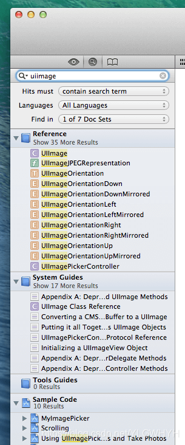

帮助信息会包括，一些简单的描述、哪个 iOS 操作系统开始提供，头文件，参考文档。头文件和参考文档是可以直接点击的。

即使你点击的关键字不是 Cocoa 库的内容，是自己代码里面的类或者方法，也可以获得相关的定义信息。如下图：

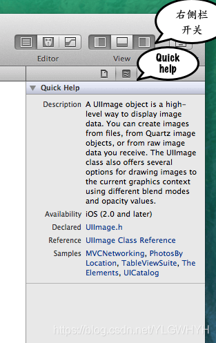

与之相关的热键是 **Command 键加鼠标点击**，即可跳到任何一个类名或者方法名的所定义的头文件。

快速查询帮助的另外一个方法是直接打开 **Quick Help** 栏，如下图，首先找到“**右侧栏开关**”，然后找到“**Quick Help**”开关即可打开。

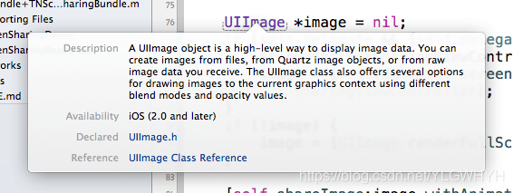

**Quick Help** 栏的作用机制是，只要它在打开状态，只要输入光标在什么关键字上，**Quick Help** 栏就会显示跟关键字相关的简要帮助信息，跟 **Option 键加点击** 的信息基本一致，但可能略微丰富一点。

写代码的时候，在大多数情况下，查询下快速帮助，看看头文件，就足以了。

### 搜索帮助

文档阅读界面最左面的上端的放大镜按钮就是搜索界面。下图是我们搜索 `uiimage`，得到的搜索结果。

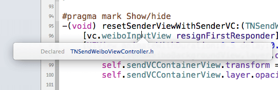

首先值得注意的是，结果也是分类的，分为 **Reference、System Guides、Tools Guides、Sample Code** 这四类。类别很利于我们快速找到我们需要的信息。前面已经介绍过类别，跟那个基本一致，参照即可。

另外需要注意的是，搜索框下面的选项，首先是 **Hits Must**（什么样的结果才会命中），包含了三项：

1. **contain search term** -- 这是最常见的就是结果包含搜索词
2. **start with search term** -- 由搜索词开始
3. **match search term** -- 必须完全匹配搜索词

然后是 **Languages**（语言选项），包含 Javascript、C++、Java、Objective-C、C 语言。

然后是，**Find in**（在哪些文档库搜索），包含了你 Xcode 里面安装的全部文档库。

### 阅读文档

最后，我们简单介绍下怎么阅读文档。文档的阅读界面如下图：

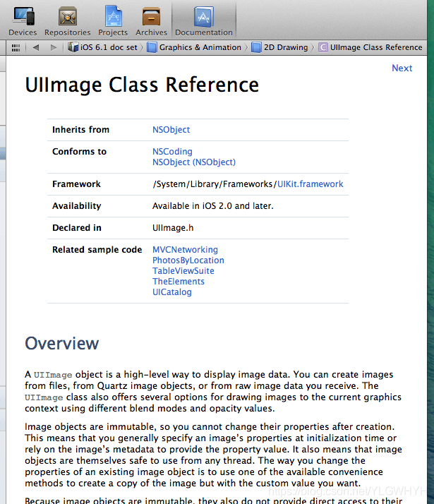

值得注意的是，标题下面这几样：

1. **Inherits from** -- 继承关系，继承自
2. **Conforms to** -- 遵循什么协议
3. **Framework** -- 属于什么框架
4. **Availability** -- 从什么iOS版本开始支持
5. **Declared in** -- 头文件
6. **Related sample code** -- 相关例子代码
7. **Companion guide** -- 相关的指南（`UIImage` 没有，很多其他的类有）

在其次一个很重要的东西，其实是标题上面那一条窄窄的导航栏，那是一个多层树状导航栏，看文档的时候，可以点击那个栏的不同位置浏览。

其实这个栏包含了整个文档库的组织结构树状图，可惜只有在这个界面才能浏览。有兴趣的可以慢慢浏览，里面信息量其实非常大。

# 《苹果官方文档》

* [Documentation](https://developer.apple.com/documentation/)
* [Documentation Technologies](https://developer.apple.com/documentation/technologies)
* [Documentation Archive](https://developer.apple.com/library/archive/navigation/)
* [Opensource Srource](https://opensource.apple.com/source/)
* [Opensource tarballs](https://opensource.apple.com/tarballs/)
* [Opensource](https://opensource.apple.com/)
* [Github Of Apple](https://github.com/apple)
* [Swift Book](https://docs.swift.org/swift-book/)
* [Develop](https://developer.apple.com/develop/)

转自：[苹果官方文档](https://blog.csdn.net/rccrx/article/details/115405502)

## Documentation

跳转链接：[Documentation](https://developer.apple.com/documentation/)

点击右边搜索按钮，搜索结果比较细节，基本是标题中包含关键字才搜到却不一定匹配这个主题比如 `runtime`，结果指向综合框架文档下的其中一篇文档。而且这个搜索区分大小写，比如 `AVfoundation` 和 `avfoundation` 的搜索结果数量不一样。

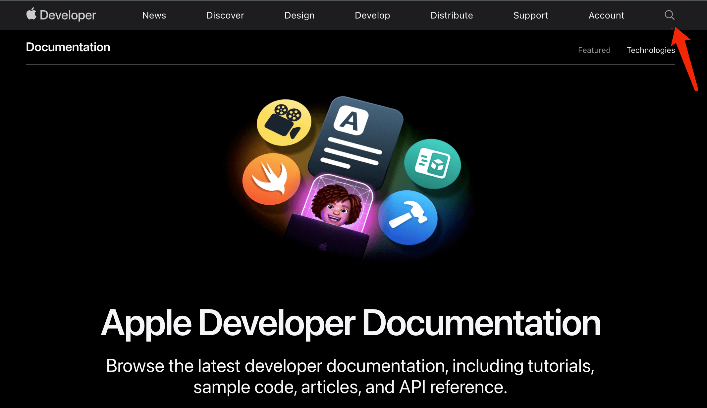

点击左边的“**Documentation**”文字进行搜索 Technologies，其实是过滤筛选下面的238个框架文档中匹配关键字的框架，搜索结果指向概论，可以从概论链接跳转到细节。

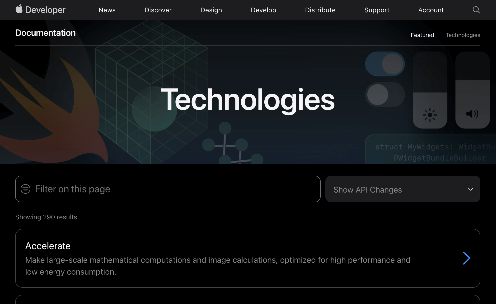

Documentation 基本上是**框架、类、方法**的说明文档，也会有文章加代码片段指导如何开发，也会有一些编程示例可供下载。（Documentation 首页，也是点击右边 **Featured** 显示的页面，第一张图片就有指示“Apple Developer Documentation —— Browse the latest developer documentation, including tutorials, sample code, articles, and API reference.”）

Documentation 首页的最下方有4个链接，最后一个是“**Documentation Archive**”，并且说明了归档是一些不会再更新的文档和示例代码。

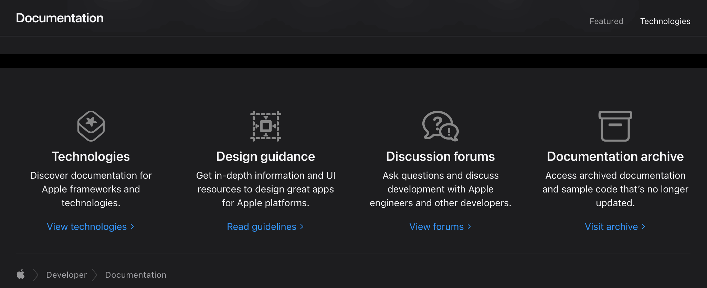

## Documentation Archive

跳转链接：[Documentation Archive](https://developer.apple.com/library/archive/navigation/)

在 **Documents 旁边的搜索框**搜索文档，例如输入 `runtime` 选择 Objective-C Runtime Programming Guide。输入 `loop` 选择 **Run Loops**（打开会提示该文章已经被取代了，去 Threading Programming Guide 查看 run loop 信息）。**Documents 旁边的搜索框**，可以根据关键字筛选5219篇文档中的匹配文档。Safari 输入文字时很卡，Chrome 不卡。

在上方搜索框 **Search Documentation Archive** 搜索，结果和在 Documentation 搜索一样。

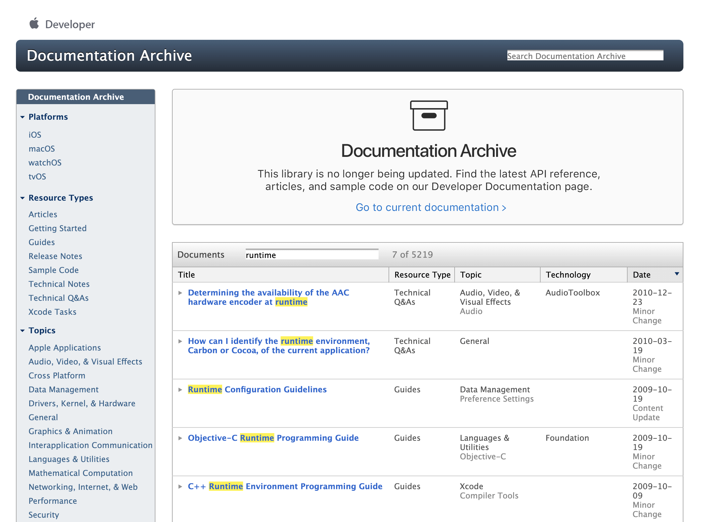

主要是一些编程指导 Programming Guide，但是这些文档比较旧且不再更新（点击进去一个文档最下面显示最后更新时间 `Updated: 2009-10-19`），Archive 首页也有提示“This library is no longer being updated. Find the latest API reference, articles, and sample code on our Developer Documentation page.”去 **Documentation** 查看最新文档。

**有的文章只在 Archive 不在 Documentation**，比如 《Objective-C Runtime Programming Guide》 和 《Run Loops》，而且 Documentation 搜索结果总是搜不到专题总是细化到一个不一定相关的类，而去 Technologies 搜索专题也不一定有，所以**一般先去 Archive 搜索专题文档，然后去 Documentation 查看相关框架和类的最新文档**。

### Archive 和 Documentation 比较

1. AVFoundation 框架：Documentation 的示例使用 [PHPhotoLibrary](https://developer.apple.com/documentation/avfoundation/photo_capture/capturing_photos_in_raw_and_apple_proraw_formats?language=objc)，而 Archive 使用过期的 [ALAssetsLibrary](https://developer.apple.com/library/archive/documentation/AudioVideo/Conceptual/AVFoundationPG/Articles/03_Editing.html)；

2. Runtime：Archive 有而 Documentation 没有，但是 Documentation 的 **See Also** 下有跳转到 Archive 的链接。
3. **Archive 基本都是专题文章**（Programming Guide），比如 Runtime 会描述运行时机制、消息传递、类型编码等；而 **Documentation 基本都是类和方法的说明**（API Reference），比如 Runtime 会说明有哪些运行时相关的方法函数，开发者可以调用的方法，Archive 的代码示例中用到的方法。

## 开源代码

* [https://opensource.apple.com/source/](https://opensource.apple.com/source/)：在线查看源码，比如查找 `objc4` 可以找到 runtime 源码。

搜索 `objc4`：
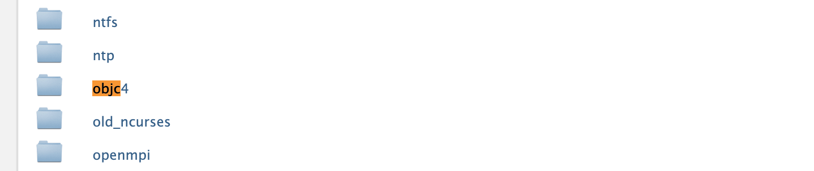

进入目录 `objc4`：
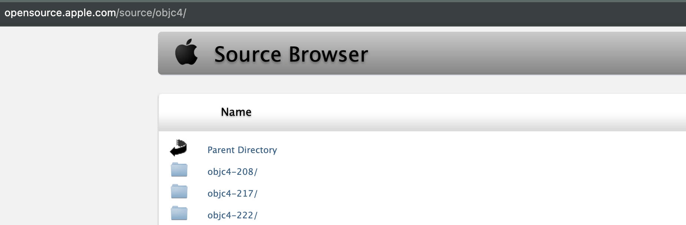

* [https://opensource.apple.com/tarballs](https://opensource.apple.com/tarballs)：源码压缩包，可下载。

* [https://opensource.apple.com](https://opensource.apple.com)：可以按操作系统和版本号导航开源代码，例如Release->macOS->11.0->11.2，打开页面中的“objc4-818.2”，Runtime的源码在macOS而不是iOS。

* [https://github.com/apple](https://github.com/apple)：比如darwin-xnu。

* [https://developer.apple.com/opensource/](https://developer.apple.com/opensource/)

## Xcode 中的文档

* **Developer Documentation**（是离线版的 Documentation，内容基本一样），可以利用左边的导航视图找到所需框架，也可以点击搜索框搜索。

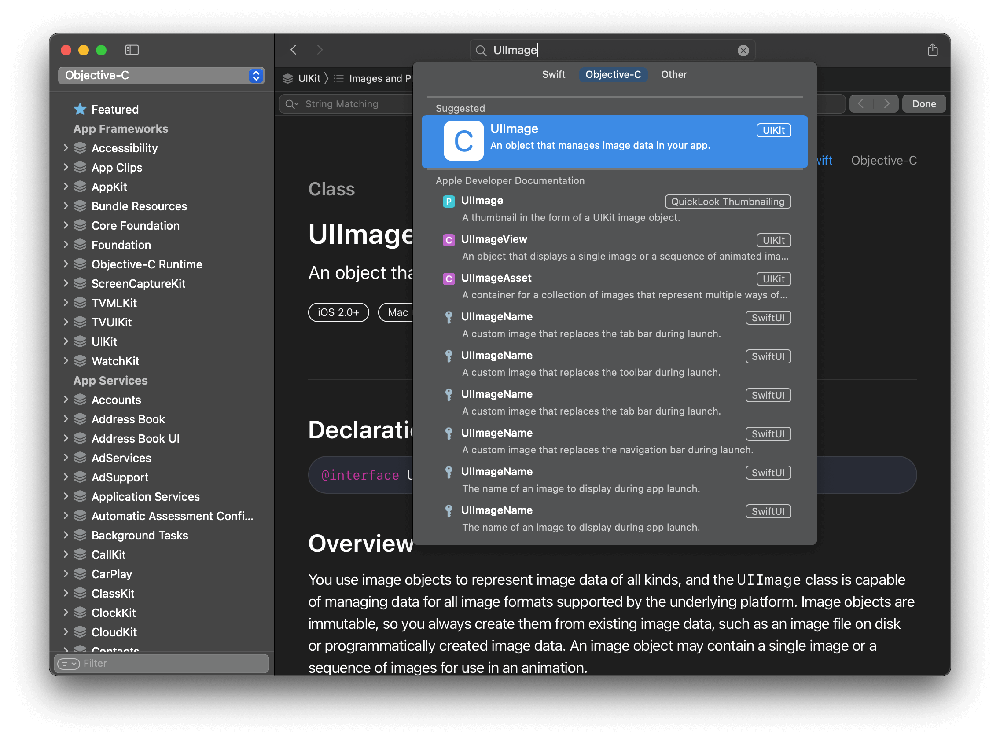

* [Swift Programing Language Book](https://docs.swift.org/swift-book/)

* Xcode使用“**Control+Command+鼠标点击**”一个类名，跳到类头文件中，查看文件中方法和属性的注释（和官方文档 Documentation 中的说明差不多且包含各个参数说明，而类头文件对整个类的注释说明不够详细，看 Documentation 更能知道这个类的作用）。

## Develop

[https://developer.apple.com/develop/](https://developer.apple.com/develop/)：最下方的 Media and Web 的“Audio”、“AVFoundation”、“HTTP Live Streaming”有这些开发文档的链接；点击最上方的“Documentation”可以跳到文档搜索中心。

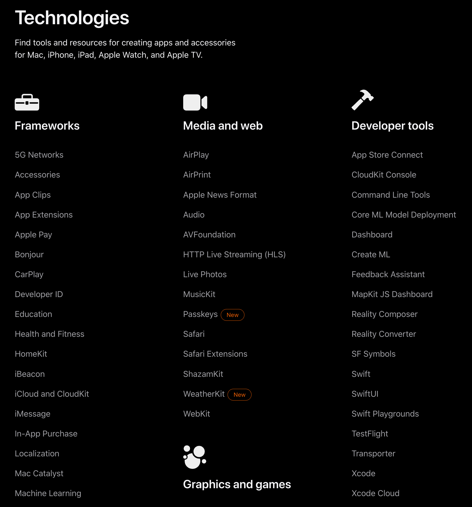

