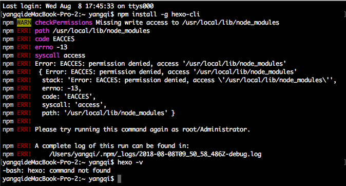
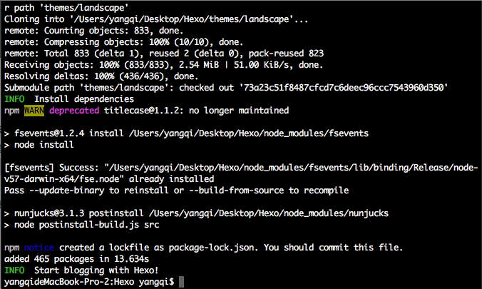

## Hexo-NEXT常用操作命令

### 部署命令行

```js
hexo clean && hexo g && hexo d
```

### 写作

```js
hexo new “title”
```

### 标签

```js
---
title: 多线程 — GCD
date: 2016-06-14 
tags: OC //标签
---
```

### 文章内添加图片

1. 把图片放到  source/_posts/自定义文件夹/image.png
2. 文章中插入图片

```js

```

### 设置头像

1. 把图片放入 themes/next/source/images
2. 修改头像

```js
# Sidebar Avatar
# in theme directory(source/images): /images/avatar.jpg
# in site  directory(source/uploads): /uploads/avatar.jpg
avatar: http://example.com/avatar.png
```

## 本地头像

```js
avatar: /images/avatar.gif
```

Ps：图片格式我用.jpeg时加载不出了，改成.gif可以正常显示

## Hexo 安装手记

* 2018/08/08

### 一、安装 Node.js

[下载Node.js](https://nodejs.org)

### 二、安装HEXO

执行命令行，报错

```js
npm install -g hexo-cli
```



改用👇，成功

```js
sudo npm install -g hexo 
```

### 三、初始化HEXO

cd 所在文件夹，执行命令👇，初始化

```js
hexo init
```



`Permission denied (publickey).` 问题解决：

```js
git config --global user.email “yagnqi_office@163.com”
git config --global user.name “KevinYangGit”

ssh-keygen -t rsa -C "yangqi_office@163.com"
```

更新 github 里的 SSH

### 四、安装插件

执行👇，安装插件

```js
npm install hexo-deployer-git --save
```

### 五、常用复合命令

```js
// （第一次要输入用户名和密码）
hexo deploy -g 
hexo server -g
```

简写：

`hexo n` == `hexo new`
`hexo g` == `hexo generate`
`hexo s` == `hexo server`
`hexo d` == `hexo deploy`

## Hexo常见问题解决方案

[[http://wp.huangshiyang.com/hexo%E5%B8%B8%E8%A7%81%E9%97%AE%E9%A2%98%E8%A7%A3%E5%86%B3%E6%96%B9%E6%A1%88]]

[[https://cnodejs.org/topic/5502652573263b0e4eef9b26]]

[[http://stackoverflow.com/questions/9484829/npm-cant-find-package-json]]

[[http://www.jianshu.com/p/98e993305653]]

## 博客样式

[[https://github.com/hexojs/hexo/wiki/Themes]]

[[https://github.com/daisygao/hexo-themes-cover]]

[[https://github.com/A-limon/pacman]]

[[https://github.com/TryGhost/Casper]]

[[https://github.com/huangjunhui/concise.git]]
