[微信官方文档](https://developers.weixin.qq.com/miniprogram/dev/framework/)
<!-- more -->

# 开发工具
微信开发者工具相关内容：[微信官方文档-工具](https://developers.weixin.qq.com/miniprogram/dev/devtools/devtools.html)。  
小图标：[iconfont](https://www.iconfont.cn/)。  
高效的设计稿标注、测量工具：[马克鳗](http://www.getmarkman.com/)。  
数据：[聚合数据](https://www.juhe.cn/)。  
小程序为了压缩体积，wxss 文件里设置图片，不支持本地资源图片，可以支持base64和网络图片：[base64图片在线转换工具](https://tool.chinaz.com/tools/imgtobase)。  
CSS文档：[w3school](https://www.w3school.com.cn/cssref/index.asp)。  
视频加密：[POLYV保利威](https://www.polyv.net/)。  
minapp：VSCode 开发小程序插件。  
Beautify：VSCode 代码格式化工具。  


# 实战项目 DouBan


[小程序的生命周期](https://developers.weixin.qq.com/miniprogram/dev/framework/app-service/app.html)，打开 app.js 文件：
```
App({

  /**
   * 当小程序初始化完成时，会触发 onLaunch（全局只触发一次）
   */
  onLaunch: function () {
    
  },

  /**
   * 当小程序启动，或从后台进入前台显示，会触发 onShow
   */
  onShow: function (options) {
    
  },

  /**
   * 当小程序从前台进入后台，会触发 onHide
   */
  onHide: function () {
    
  },

  /**
   * 当小程序发生脚本错误，或者 api 调用失败时，会触发 onError 并带上错误信息
   */
  onError: function (msg) {
    
  }
})
```

## 自定义组件
[组件生命周期](https://developers.weixin.qq.com/miniprogram/dev/framework/custom-component/lifetimes.html)，打开自定义组件的 .js 文件：
```
Component({
  /**
   * 组件的属性列表
   */
  properties: {

  },

  /**
   * 组件的初始数据
   */
  data: {

  },

  /**
   * 组件的方法列表
   */
  methods: {

  },

  /**
   * 组件的生命周期方法列表
   */
  lifetimes: {
    // 在组件实例进入页面节点树时执行
    attached: function() {
      
    },

    // 在组件实例被从页面节点树移除时执行
    detached: function() {

    },
  },

  /**
   * 组件所在页面的生命周期
   */
  pageLifetimes: {
    // 页面被展示
    show: function() {

    },

    // 页面被隐藏
    hide: function() {

    },

    // 页面尺寸变化
    resize: function(size) {

    }
  }
})
```

### stars
自定义组件：评分（stars.wxml）：
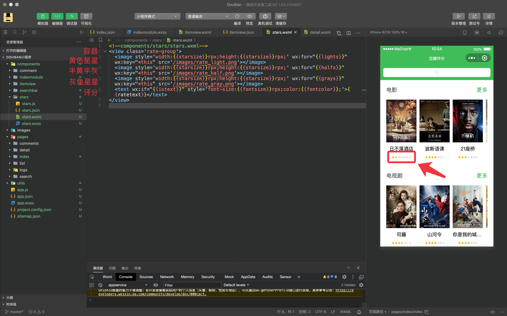

#### stars.wxml
```
<!--components/stars/stars.wxml-->
<view class='rate-group'>
  <!-- 全黄 -->
  <image style='width:{{starsize}}rpx;height:{{starsize}}rpx;' wx:for="{{lights}}" wx:key="*this"
    src='/images/rate_light.png'></image>
  <!-- 半黄半灰 -->
  <image style='width:{{starsize}}rpx;height:{{starsize}}rpx;' wx:for="{{halfs}}" wx:key="*this"
    src='/images/rate_half.png'></image>
  <!-- 全灰 -->
  <image style='width:{{starsize}}rpx;height:{{starsize}}rpx;' wx:for="{{grays}}" wx:key="*this"
    src='/images/rate_gray.png'></image>
  <!-- 评分 -->
  <text wx:if="{{istext}}" style='font-size:{{fontsize}}rpx;color:{{fontcolor}};'>{{ratetext}}</text>
</view>
```

在评分UI中，设置一个 view 作为五个星星和评分的容器：
```
<!--components/stars/stars.wxml-->
<view class='rate-group'>
  <!--内容-->
</view>
```

`<view></view>`：创建 view 组件。  
`class='rate-group'`：设置类名，方便在 stars.wxss 文件中设置布局。

以创建黄色星星的的代码为例：
```
<image style='width:{{starsize}}rpx;height:{{starsize}}rpx;' wx:for="{{lights}}" wx:key="*this" src='/images/rate_light.png'></image>
```

`<image></image>`：创建 image 组件。  
`style='width:{{starsize}}rpx;height:{{starsize}}rpx;'`：通过 style 设置 image 的宽高。  
`wx:for="{{lights}}" wx:key="*this"`：通过 wx:for wx:key 遍历创建 image。  
`src='/images/rate_light.png'`：指定 image 的文件路径。

```
<text wx:if="{{istext}}" style='font-size:{{fontsize}}rpx;color:{{fontcolor}};'>{{ratetext}}</text>
```

`<text>{{ratetext}}</text>`：创建 text 组件。  
`wx:if="{{istext}}"`：如果条件成立，则创建 text。  
`style='font-size:{{fontsize}}rpx;color:{{fontcolor}};'>`：指定字体大小、字体颜色。  
`<text>{{ratetext}}</text>`：设置展示文案。  
用于加载 stars.js 文件中的属性和变量，使用符号：`{{}}`

#### stars.wxss
stars 组件的布局：
```
/* components/stars/stars.wxss */

.rate-group {
  display: flex;
  justify-content: center;
  align-items: center;
  font-size: 20rpx;
  color: #ccc;
}

/* 设置图片的宽高 */
.rate-group image {
  width: 20rpx;
  height: 20rpx;
}
```

`display: flex;`：布局方式采用 flex 布局。  
`justify-content: center;`：横向居中对齐。  
`align-items: center;`：垂直居中对齐。  
`font-size: 20rpx;`：在 .rate-group 容器中的字体大小。  
`color: #ccc;`：在 .rate-group 容器中的字体颜色。  

#### stars.js
```
// components/stars/stars.js
Component({
  /**
   * 组件的属性列表
   */
  properties: {
    rate: {
      type: Number,
      value: 0,
      observer(newVal, oldVal, changedPath) {
        // 属性被改变时执行的函数（可选），也可以写成在methods段中定义的方法名字符串, 如：'_propertyChange'
        // 通常 newVal 就是新设置的数据， oldVal 是旧数据
        this.updateRate();
      }
    },
    starsize: {
      type: Number,
      value: 20 //rpx
    },
    fontsize: {
      type: Number,
      value: 20 //rpx
    },
    fontcolor: {
      type: String,
      value: "#ccc"
    },
    istext: {
      type: Boolean,
      value: true
    }
  },

  /**
   * 组件的初始数据
   */
  data: {

  },

  /**
   * 组件的方法列表
   */
  methods: {
    updateRate: function () {
      // 定义变量
      var that = this;
      var rate = that.properties.rate;
      var intRate = parseInt(rate);
      var light = parseInt(intRate / 2);
      var half = intRate % 2;
      var gray = 5 - light - half;
      var lights = [];
      var halfs = [];
      var grays = [];
      for (var index = 1; index <= light; index++) {
        lights.push(index);
      }
      for (var index = 1; index <= half; index++) {
        halfs.push(index);
      }
      for (var index = 1; index <= gray; index++) {
        grays.push(index);
      }
      var ratetext = rate && rate > 0 ? rate.toFixed(1) : "未评分"
      that.setData({
        lights: lights,
        halfs: halfs,
        grays: grays,
        ratetext: ratetext,
      })
    }
  },

  /**
   * 组件的声明周期方法列表
   */
  lifetimes: {
    // 在组件实例进入页面节点树时执行
    attached: function(){
      this.updateRate();
    }
  }
})
```

stars 文件是自定义的组件，`rate、starsize、fontsize、fontcolor、istext` 都是 stars 文件的属性，是让调用者在调用时进行设置的，如果没有设置则使用默认值。`lights、halfs、grays、ratetext` 都是 stars 文件的变量，经过数据处理后，用于UI展示。

更新UI：
```
that.setData({
  lights: lights,
  halfs: halfs,
  grays: grays,
  ratetext: ratetext,
})
```

### itemview
自定义组件电影信息（itemview.wxml）：
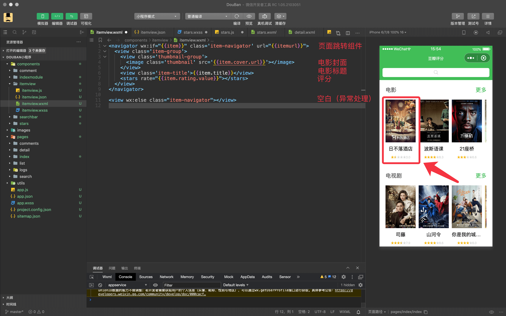

#### itemview.wxml
```
<navigator wx:if="{{item}}" class='item-navigator' url="{{itemurl}}">
  <view class='item-group'>
    <!-- 封面 -->
    <view class='thumbnail-group'>
      <image class='thumbnail' src='{{item.cover.url}}'></image>
    </view>
    <!-- 名称 -->
    <view class='item-title'>{{item.title}}</view>
    <!-- 评分 -->
    <stars rate="{{item.rating.value}}"></stars>
  </view>
</navigator>

<!-- 占位view -->
<view wx:else class="item-navigator"></view>
```

navigator 组件是一个负责页面跳转的系统组件，具有响应点击事件和页面跳转功能。
```
<navigator url="{{itemurl}}">
  <!--内容-->
</navigator>
```

`class='item-navigator'`：设置类名，便于布局。  
`url="{{itemurl}}"`：需要跳转的页面路径。因为是自定义组件，所以跳转路径由外部调用者传入。  
`wx:if="{{item}}" wx:else`：条件成立则创建 navigator 组件，否则创建空白 view。  

stars 就是上面👆介绍的自定义组件-评分。设置 rate，其它属性使用默认值。
```
<stars rate="{{item.rating.value}}"></stars>
```

#### itemview.json
使用自定义组件的前提是在 .json 文件中导入了组件（`usingComponents`），如在 itemview.json 文件导入 `stars` 组件的文件路径：
```
{
  "component": true,
  "usingComponents": {
    "stars": "/components/stars/stars"
  }
}
```

#### itemview.wxss
`itemview` 组件的布局：
```
.item-navigator {
  width: 200rpx;
  margin-right: 20rpx;
  display: inline-block;
}

.item-navigator .item-group {
  width: 100%;
}

.item-group .thumbnail-group {
  width: 100%;
  height: 284rpx;
}

.thumbnail-group .thumbnail {
  width: 100%;
  height: 100%;
}

.item-group .item-title {
  font-size: 32rpx;
  text-align: center;
  margin-top: 20rpx;
  text-overflow: ellipsis;
  overflow: hidden;
  margin-bottom: 20rpx;
}
```

`margin-right: 20rpx;`：是指容器本身右边距离其他容器有20像素，不包含在容器内；  
`display: inline-block;`：垂直排列。  
`width: 100%;`：宽度跟父view保持一致。  
`text-align: center;`：字体居中显示。  
`text-overflow: ellipsis;`：字体长度超过组件时显示为“...”。  
`overflow: hidden;`：超出组件的view，隐藏。  
`margin-bottom: 20rpx;`：设置底部边距。  

#### itemview.js
```
// components/itemview/itemview.js
Component({
  /**
   * 组件的属性列表
   */
  properties: {
    item: {
      type: Object,
      value: {}
    },
    itemurl: {
      type: String,
      value: ""
    }
  },

  /**
   * 组件的初始数据
   */
  data: {

  },

  /**
   * 组件的方法列表
   */
  methods: {

  }
})
```

`itemview` 组件的属性有 `item、itemurl`，其中 item 是外部调用者创建好了的数据容器对象。itemurl 是外部调用者设置的跳转路径。

### indexmodule
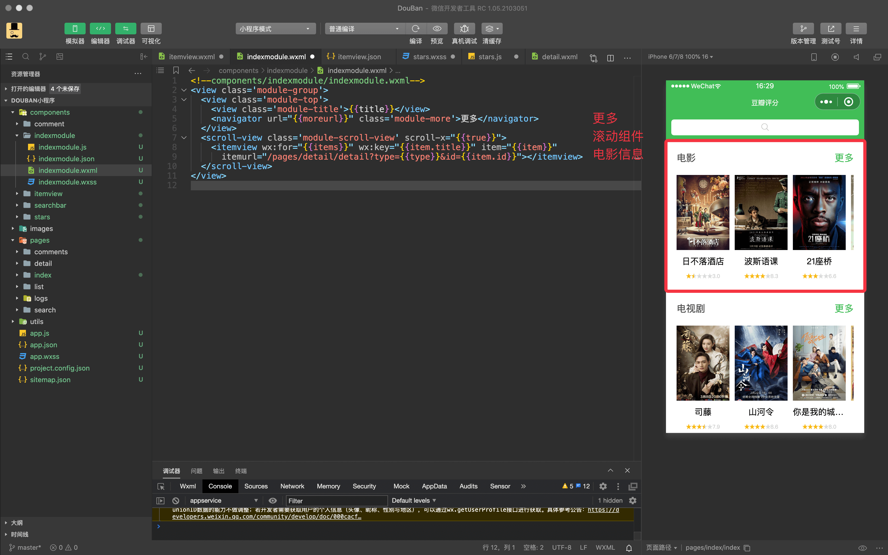

#### indexmodule.wxml
```
<!--components/indexmodule/indexmodule.wxml-->
<view class='module-group'>
  <!-- 标题、更多 -->
  <view class='module-top'>
    <view class='module-title'>{{title}}</view>
    <navigator url="{{moreurl}}" class='module-more'>更多</navigator>
  </view>
  <!-- 电影展示 -->
  <scroll-view class='module-scroll-view' scroll-x="{{true}}">
    <itemview wx:for="{{items}}" wx:key="{{item.title}}" item="{{item}}"
      itemurl="/pages/detail/detail?type={{type}}&id={{item.id}}"></itemview>
  </scroll-view>
</view>
```

创建 scroll-view：
```
<scroll-view class='module-scroll-view' scroll-x="{{true}}">
  <!--内容-->
</scroll-view>
```

`scroll-x="{{true}}"`：设置滚动方向，x轴方向。  

使用自定义组件：
```
<itemview wx:for="{{items}}" wx:key="{{item.title}}" item="{{item}}"
      itemurl="/pages/detail/detail?type={{type}}&id={{item.id}}"></itemview>
```

`item="{{item}}"`：设置数据 item。  
`itemurl="/pages/detail/detail?type={{type}}&id={{item.id}}"`：设置跳转页面的路径。路径中的 `?type={{type}}&id={{item.id}}"` 是页面间跳转时的数据传递。  

#### indexmodule.wxss
indexmodule 组件的布局：
```
.module-group {
  padding: 40rpx;
  background-color: #fff;
}

.module-group .module-top {
  font-size: 36rpx;
  display: flex;
  justify-content: space-between;
}

.module-group .module-title {
  color: #494949;
}

.module-group .module-more {
  color: #41be57;
}

.module-scroll-view {
  margin-top: 40rpx;
  width: 100%;
  height: 400rpx;
  white-space: nowrap;
}
```

`padding: 40rpx;`：设置上下、左右边距。  
`background-color: #fff;`：设置背景色。  
`justify-content: space-between;`：项目沿主轴均匀分布，位于首尾两端的子容器与父容器紧紧挨着。  
`white-space: nowrap;`：设置 scroll-view 不换行。 
`margin-top: 40rpx;` 是指容器本身的顶部距离其他容器有40个像素，不包含在容器内；

#### indexmodule.json
在 .json 文件中导入了组件：
```
{
  "component": true,
  "usingComponents": {
    "itemview": "/components/itemview/itemview"
  }
}
```

#### indexmodule.js
为外部调用者提供了四个属性：`title、moreurl、items、type`：
```
// components/indexmodule/indexmodule.js
Component({
  /**
   * 组件的属性列表
   */
  properties: {
    title: {
      type: String,
      value: ""
    },
    moreurl: {
      type: String,
      value: ""
    },
    items: {
      type: Array,
      value: []
    },
    type: {
      type: String,
      value: ""
    }
  },

  /**
   * 组件的初始数据
   */
  data: {

  },

  /**
   * 组件的方法列表
   */
  methods: {

  }
})
```

### comment
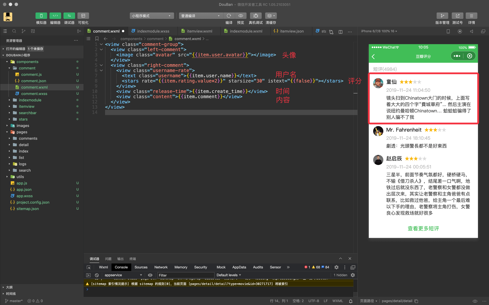

#### comment.wxml
为了方便布局，嵌套了多层view：
```
<view class="comment-group">
  <view class="left-comment">
    <image class="avatar" src="{{item.user.avatar}}"></image>
  </view>
  <view class="right-comment">
    <view class="username-rate">
      <text class="username">{{item.user.name}}</text>
      <stars rate="{{item.rating.value*2}}" starsize="30" istext="{{false}}"></stars>
    </view>
    <view class="release-time">{{item.create_time}}</view>
    <view class="content">{{item.comment}}</view>
  </view>
</view>
```

使用网络图片创建 image：
```
<image class="avatar" src="{{item.user.avatar}}"></image>
```

使用自定义组件 stars，自定义了星星的大小（starsize），不需要显示评分（istext = false）：
```
<stars rate="{{item.rating.value*2}}" starsize="30" istext="{{false}}"></stars>
```

#### comment.wxss
```
.comment-group {
  display: flex;
  justify-content: flex-start;
  padding-top: 40rpx;
}

.comment-group .left-comment {
  width: 70rpx;
  margin-right: 20rpx;
}

.left-comment .avatar {
  width: 70rpx;
  height: 70rpx;
  border-radius: 50%;
}

.comment-group .right-comment {
  flex: 1;
}

.right-comment .username-rate {
  display: flex;
  justify-content: flex-start;
  align-items: center;
}

.username-rate .username {
  font-size: 36rpx;
  margin-right: 20rpx;
}

.release-time {
  color: #b3b3b3;
  font-size: 32rpx;
  margin-top: 10rpx;
}

.content {
  font-size: 32rpx;
  color: #353535;
  margin-top: 10rpx;
}
```

`justify-content: flex-start;` 起始端对齐。默认就是这种对齐方式。  
`padding-top: 40rpx;` 是指容器内的内容距离容器的顶部有40个像素，是包含在容器内的；  
`border-radius: 50%;` 设置圆角，圆角大小等于宽度的一半。  

#### comment.json
在 .json 文件中导入了组件：
```
{
  "component": true,
  "usingComponents": {
    "stars": "/components/stars/stars"
  }
}
```

#### comment.js
只需要一个参数 item 对象：
```
// components/comment/comment.js
Component({
  /**
   * 组件的属性列表
   */
  properties: {
    item: {
      type: Object,
      value: {}
    }
  },

  /**
   * 组件的初始数据
   */
  data: {

  },

  /**
   * 组件的方法列表
   */
  methods: {

  }
})
```

### searchbar
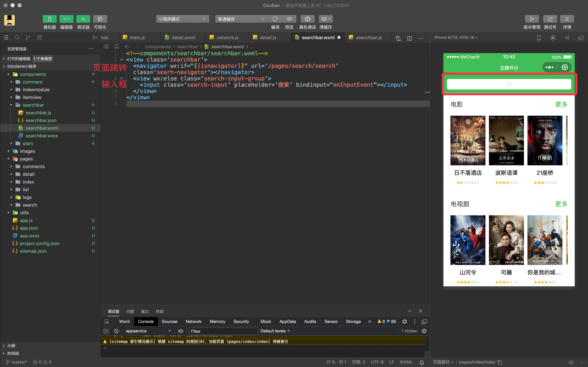

#### searchbar.wxml
```
<!--components/searchbar/searchbar.wxml-->
<view class='searchbar'>
  <navigator wx:if="{{isnavigator}}" url='/pages/search/search' class='searh-navigator'></navigator>
  <view wx:else class='search-input-group'>
    <input class='search-input' placeholder='搜索' bindinput="onInputEvent"></input>
  </view>
</view>
```

如果 isnavigator = true，创建导航组件，在点击搜索框时，跳转到 search 页面：
```
<navigator wx:if="{{isnavigator}}" url='/pages/search/search' class='searh-navigator'></navigator>
```

如果 isnavigator = false，创建输入框：
```
<input class='search-input' placeholder='搜索' bindinput="onInputEvent"></input>
```

#### searchbar.wxss
```
/* components/searchbar/searchbar.wxss */

.searchbar {
  background-color: #41be57;
  padding: 20rpx; 
}

.searh-navigator {
  width: 100%;
  height: 60rpx;
  background-color: #fff;
  border-radius: 10rpx;
  background-image: url("");
  background-position: center center;
  background-repeat: no-repeat;
  background-size: 6%;
}

.search-input-group {
  width: 100%;
  height: 60rpx;
  background-color: #fff;
  border-radius: 10rpx;
  padding: 10rpx 20rpx;
  box-sizing: border-box;
}

.search-input {
  min-height: 40rpx;
  height: 40rpx;
  font-size: 12px;
}
```

`border-radius: 10rpx;`：设置圆角大小 10rpx。  
`background-image: url("")`：设置背景图。因为 wxss 文件里使用的是本地图片资源，所以需要将图片转成base64。  
`background-position: center center;`：设置图片垂直水平居中。  
`box-sizing: border-box;`：设置的边框和内边距的值是包含在 width 内的。
`min-height: 40rpx; height: 40rpx;`：同时设置最小高度和高度，防止光标偏移。  
`background-repeat: no-repeat;`：背景图像将仅显示一次。

#### search.js
```
// components/searchbar/searchbar.js
Component({
  /**
   * 组件的属性列表
   */
  properties: {
    isnavigator: {
      type: Boolean,
      value: false
    }
  },

  /**
   * 组件的初始数据
   */
  data: {

  },

  /**
   * 组件的方法列表
   */
  methods: {
    // 输入框输入回调
    onInputEvent: function(event) {
      var value = event.detail.value;
      var detail = {"value": value};
      var options = {};
      // 回调方法
      this.triggerEvent("searchinput",detail,options);
    }
  }
})
```

`isnavigator` 用于判断是否创建导航控件。  
`onInputEvent` 是输入框正在输入的回调事件。  
`this.triggerEvent("searchinput",detail,options);` 主动触发事件 triggerEvent，参数为 `"searchinput"`、`detail`、`options`。因为这里的 `searchbar` 是自定义组件，所以需要将输入事件传递给外部调用者，外部调用者需要实现 triggerEvent 事件：  
search.json 文件：
```
{
  "usingComponents": {
    "searchbar": "/components/searchbar/searchbar"
  }
}
```

search.wxml 文件：
```
<!-- 搜索框 -->
<searchbar bindsearchinput="onSearchInputEvent"></searchbar>
```

search.js 文件：
```
onItemTapEvent: function(event) {
  var that = this;
  var id = event.currentTarget.dataset.id;
  var title = event.currentTarget.dataset.title;

  // to do
},
```

## 网络

[网络请求API](https://developers.weixin.qq.com/miniprogram/dev/api/network/request/wx.request.html)

### urls.js
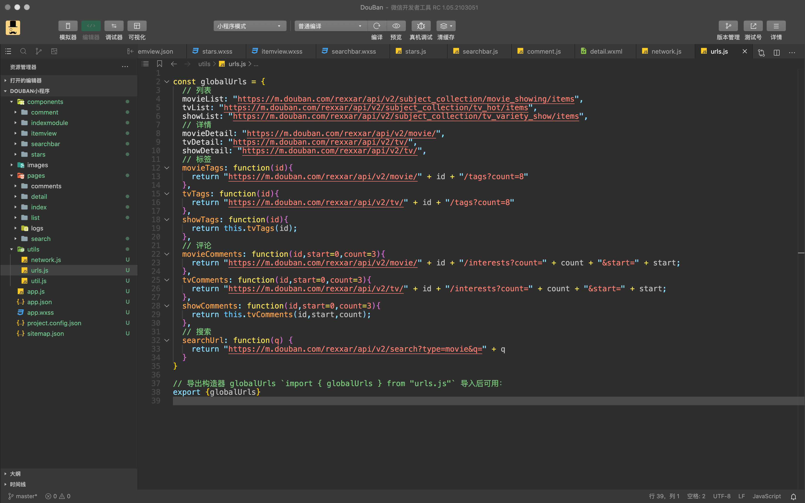

定义构造器 globalUrls：
```
const globalUrls = {
    // 内容
}
```

定义 url 变量：
```
// 列表
movieList: "https://m.douban.com/rexxar/api/v2/subject_collection/movie_showing/items",
tvList: "https://m.douban.com/rexxar/api/v2/subject_collection/tv_hot/items",
showList: "https://m.douban.com/rexxar/api/v2/subject_collection/tv_variety_show/items",
// 详情
movieDetail: "https://m.douban.com/rexxar/api/v2/movie/",
tvDetail: "https://m.douban.com/rexxar/api/v2/tv/",
showDetail: "https://m.douban.com/rexxar/api/v2/tv/",
```

创建方法，根据参数拼接 url：
```
// 标签
movieTags: function(id){
  return "https://m.douban.com/rexxar/api/v2/movie/" + id + "/tags?count=8"
},
tvTags: function(id){
  return "https://m.douban.com/rexxar/api/v2/tv/" + id + "/tags?count=8"
},
showTags: function(id){
  return this.tvTags(id);
},
// 评论
movieComments: function(id,start=0,count=3){
  return "https://m.douban.com/rexxar/api/v2/movie/" + id + "/interests?count=" + count + "&start=" + start;
},
tvComments: function(id,start=0,count=3){
  return "https://m.douban.com/rexxar/api/v2/tv/" + id + "/interests?count=" + count + "&start=" + start;
},
showComments: function(id,start=0,count=3){
  return this.tvComments(id,start,count);
},
// 搜索
searchUrl: function(q) {
  return "https://m.douban.com/rexxar/api/v2/search?type=movie&q=" + q
}
```

导出构造器 globalUrls，导出后外部调用者通过 `import { globalUrls } from "urls.js"` 导入后可用：
```
export {globalUrls}
```

### network
```
// 导入 globalUrls 类
import { globalUrls } from "urls.js"


// 定义构造器 network
const network = {
  // 电影
  getMovieList: function (params) {
    params.type = "movie";
    this.getItemList(params);
  },

  // 电视剧
  getTVList: function (params) {
    params.type = "tv";
    this.getItemList(params);
  },

  // 综艺
  getShowList: function (params) {
    params.type = "show";
    this.getItemList(params);
  },

  // 首页列表
  getItemList: function (params) {
    var url = "";
    if (params.type == "movie") {
      url = globalUrls.movieList;
    } else if (params.type == "tv") {
      url = globalUrls.tvList;
    } else if (params.type == "show") {
      url = globalUrls.showList;
    } else { 
    
    }
    var count = params.count ? params.count : 7;
    // 发起网络请求
    wx.request({
      // 设置请求url
      url: url,
      // 设置请求参数
      data: {
        count: count
      },
      // 请求成功回调
      success: function(res) {
        var items = res.data.subject_collection_items;
        var itemCount = items.length;
        var left = itemCount%3;
        if (left === 2) {
          items.push(null);
        }
        if (params && params.success) {
          params.success(items);
        }
      }
    })
  },
  
  // 详情
  getItemDetail: function(params) {
    var type = params.type;
    var id = params.id;
    var url = "";
    if (type === "movie") {
      url = globalUrls.movieDetail + id;
    } else if (type === "tv") {
      url = globalUrls.tvDetail + id;
    } else if (type === "show") {
      url = globalUrls.showDetail + id;
    } else {

    }
    wx.request({
      url: url,
      success: function(res) {
        var item = res.data;
        if (params.success) {
          params.success(item);
        }
      }
    })
  },
  
  // 标签
  getItemTags: function(params) {
    var type = params.type;
    var id = params.id;
    var url = "";
    if (type === "movie") {
      url = globalUrls.movieTags(id);
    } else if (type === "tv") {
      url = globalUrls.tvTags(id);
    } else if (type === "show") {
      url = globalUrls.showTags(id);
    } else {

    }
    wx.request({
      url: url,
      success: function(res) {
        var tags = res.data.tags;
        if (params.success) {
          params.success(tags)
        }
      }
    })
  },

  // 评论
  getItemComments: function(params) {
    var type = params.type;
    var id = params.id;
    var start = params.start;
    var count = params.count;
    var url = "";
    if (type === "movie") {
      url = globalUrls.movieComments(id,start,count);
    } else if (type === "tv") {
      url = globalUrls.tvComments(id,start,count);
    } else if (type === "show") {
      url = globalUrls.showComments(id,start,count);
    } else {

    }
    wx.request({
      url: url,
      success: function(res){
        var comment = res.data;
        if (params.success) {
          params.success(comment); 
        }
      }
    })
  },

  // 搜索
  getSearch: function(params) {
    var q = params.q;
    var url = globalUrls.searchUrl(q);
    wx.request({
      url: url,
      success: function(res){
        var subjects = res.data.subjects;
        if (params.success) {
          params.success(subjects);
        }
      }
    })
  }
}

// 导出构造器 network，导出后外部调用者通过 `import {network} from "../../utils/network.js"` 导入后可用：
export { network }
```

## 页面
[页面生命周期](https://developers.weixin.qq.com/miniprogram/dev/framework/app-service/page-life-cycle.html)

生命周期函数在 .js 文件：[注册页面](https://developers.weixin.qq.com/miniprogram/dev/framework/app-service/page.html)：
```
Page({
  
  /**
   * 页面的初始数据
   */
  data: {

  },

  /**
   * 生命周期函数--监听页面加载
   */
  onLoad: function (options) {
    
  },

  /**
   * 生命周期函数--监听页面初次渲染完成
   */
  onReady: function () {
    
  },

  /**
   * 生命周期函数--监听页面显示
   */
  onShow: function () {
    
  },

  /**
   * 生命周期函数--监听页面隐藏
   */
  onHide: function () {
    
  },

  /**
   * 生命周期函数--监听页面卸载
   */
  onUnload: function () {
    
  },

  /**
   * 页面相关事件处理函数--监听用户下拉动作
   */
  onPullDownRefresh: function () {
    
  },

  /**
   * 页面上拉触底事件的处理函数
   */
  onReachBottom: function () {
    
  },

  /**
   * 用户点击右上角分享
   */
  onShareAppMessage: function () {
    
  }
})
```

### 首页
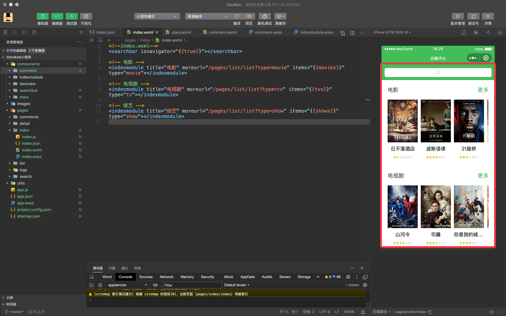

#### index.wxml
```
<!--index.wxml-->
<searchbar isnavigator="{{true}}"></searchbar>

<!-- 电影 -->
<indexmodule title="电影" moreurl="/pages/list/list?type=movie" items="{{movies}}" type="movie"></indexmodule>

<!-- 电视剧 -->
<indexmodule title="电视剧" moreurl="/pages/list/list?type=tv" items="{{tvs}}" type="tv"></indexmodule>

<!-- 综艺 -->
<indexmodule title="综艺" moreurl="/pages/list/list?type=show" items="{{shows}}" type="show"></indexmodule>
```

创建自定义组件 `searchbar`， 指定导航 isnavigator = true。
```
<searchbar isnavigator="{{true}}"></searchbar>
```

创建三个自定义组件 `indexmodule`，分别用于展示电影、电视剧和综艺。`moreurl` 是更多按钮跳转的页面路径，`items` 是每一个电影的信息。
```
<indexmodule title="电影" moreurl="/pages/list/list?type=movie" items="{{movies}}" type="movie"></indexmodule>
```

#### index.json
在 .json 文件中导入了组件：
```
{
  "usingComponents": {
    "searchbar": "/components/searchbar/searchbar",
    "indexmodule": "/components/indexmodule/indexmodule"
  }
}
```

#### index.js
```
//index.js
import {network} from "../../utils/network.js"
Page({
  
  /**
   * 页面的初始数据
   */
  data: {

  },

  /**
   * 生命周期函数--监听页面加载
   */
  onLoad: function (options) {
    var that = this;
    
    // 电影
    network.getMovieList({
      success: function(movies){
        that.setData({
          movies: movies,
        })
      }
    })
   
    // 电视剧
    network.getTVList({
      success: function(tvs) {
        that.setData({
          tvs: tvs,
        })
      }
    })
    
    // 综艺
    network.getShowList({
      success: function (shows){
        that.setData({
          shows: shows,
        })
      }
    })
  }
})
```

导入 network.js 文件后才可以使用 `network`：
```
import {network} from "../../utils/network.js"
```

请求数据，`network.getMovieList({ })` 方法内部的 `{}` 是方法 `getMovieList: function (params){ }` 需要的 `params`，可以看到这里的 `params` 内部只有一个 `success: function(movies){ }` 方法。在网络请求完成时，`network` 在 `getMovieList()` 方法内部可以通过 `params.success(moives)` 回调过来：
```
// 电影
network.getMovieList({
  success: function(movies){
    that.setData({
      movies: movies,
    })
  }
})
```

更新数据，并且重新渲染UI：
```
that.setData({
  movies: movies,
})
```

### 更多


#### list.wxml
```
<searchbar isnavigator="{{true}}"></searchbar>

<view class="container">
  <itemview wx:for="{{items}}" wx:key="{{item.title}}" item="{{item}}"
    itemurl="/pages/detail/detail?type={{type}}&id={{item.id}}"></itemview>
</view>
```

创建自定义组件 `searchbar`， 指定导航 isnavigator = true。
```
<searchbar isnavigator="{{true}}"></searchbar>
```

遍历创建 itemview 组件，展示每一个 item 数据。
```
<itemview wx:for="{{items}}" wx:key="{{item.title}}" item="{{item}}"
    itemurl="/pages/detail/detail?type={{type}}&id={{item.id}}"></itemview>
```

#### list.wxml
```
.container {
  display: flex;
  justify-content: space-between;
  flex-wrap: wrap;
  padding: 30rpx
}
```

`justify-content: space-between;` 项目沿主轴均匀分布，位于首尾两端的子容器与父容器紧紧挨着。  
`flex-wrap: wrap;` 换行。  
`padding: 30rpx` 边距30个像素。  

#### list.json
在 .json 文件中导入了组件：
```
{
  "usingComponents": {
    "searchbar": "/components/searchbar/searchbar",
    "itemview": "/components/itemview/itemview"
  }
}
```

#### list.js
```
// pages/list/list.js
import { network } from "../../utils/network.js"

Page({

  /**
   * 页面的初始数据
   */
  data: {
    type: {
      type: String,
      value: ""
    }
  },

  /**
   * 生命周期函数--监听页面加载
   */
  onLoad: function (options) {
    var that = this;

    // 提示框
    wx.showLoading({
      title: '正在加载中...',
    })
    var title = "";
    var type = options.type;
    if (type === "movie") {
      // 电影
      title = "电影";
      network.getMovieList({
        success: function(movies){
          that.setData({
            items: movies,
            type: type
          });
          // 移除提示框
          wx.hideLoading();
        },
        count: 1000
      })
    } else if (type === "tv") {
      //电视剧
      title = "电视剧";
      network.getTVList({
        success: function(tvs) {
          that.setData({
            items: tvs,
            type: type
          });
          // 移除提示框
          wx.hideLoading();
        },
        count: 1000
      })
    } else {
      // 综艺
      title = "综艺";
      network.getShowList({
        success: function(shows) {
          that.setData({
            items: shows,
            type: type
          });
          // 移除提示框
          wx.hideLoading();
        },
        count: 1000
      })
    }

    // 设置导航栏的标题
    wx.setNavigationBarTitle({
      title: title,
    })
  }
})
```

导入网络请求文件 network.js：
```
import { network } from "../../utils/network.js"
```

定义变量 type：
```
data: {
  type: {
    type: String,
    value: ""
  }
},
```

显示提示框：
```
wx.showLoading({
  title: '正在加载中...',
})
```

移除提示框：
```
wx.hideLoading();
```

设置导航栏的标题：
```
wx.setNavigationBarTitle({
  title: title,
})
```

### 电影详情
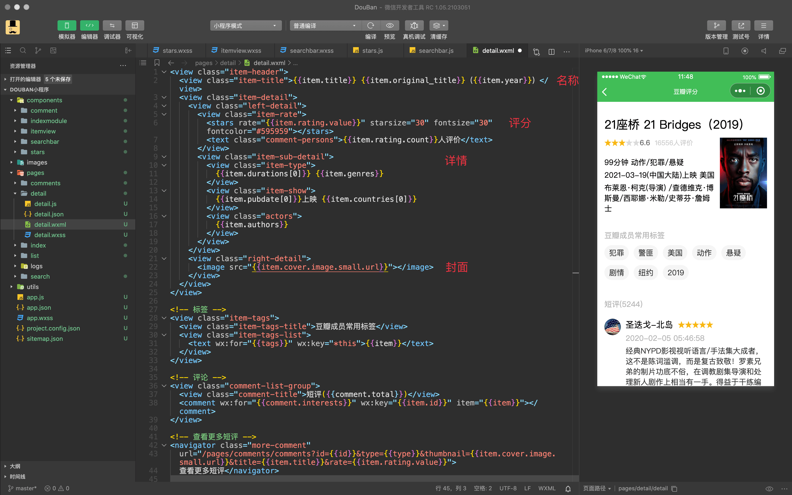

#### detail.wxml
```
<view class="item-header">
  <view class="item-title">{{item.title}} {{item.original_title}}（{{item.year}}）</view>
  <view class="item-detail">
    <view class="left-detail">
      <!-- 评分 -->
      <view class="item-rate">
        <stars rate="{{item.rating.value}}" starsize="30" fontsize="30" fontcolor="#595959"></stars>
        <text class="comment-persons">{{item.rating.count}}人评价</text>
      </view>
      <!-- 信息 -->
      <view class="item-sub-detail">
        <view class="item-type">
          {{item.durations[0]}} {{item.genres}}
        </view>
        <view class="item-show">
          {{item.pubdate[0]}}上映 {{item.countries[0]}}
        </view>
        <view class="actors">
          {{item.authors}}
        </view>
      </view>
    </view>
    <!-- 封面 -->
    <view class="right-detail">
      <image src="{{item.cover.image.small.url}}"></image>
    </view>
  </view>
</view>

<!-- 标签 -->
<view class="item-tags">
  <view class="item-tags-title">豆瓣成员常用标签</view>
  <view class="item-tags-list">
    <text wx:for="{{tags}}" wx:key="*this">{{item}}</text>
  </view>
</view>

<!-- 评论 -->
<view class="comment-list-group">
  <view class="comment-title">短评({{comment.total}})</view>
  <comment wx:for="{{comment.interests}}" wx:key="{{item.id}}" item="{{item}}"></comment>
</view>

<!-- 查看更多短评 -->
<navigator class="more-comment"
  url="/pages/comments/comments?id={{id}}&type={{type}}&thumbnail={{item.cover.image.small.url}}&title={{item.title}}&rate={{item.rating.value}}">
  查看更多短评</navigator>
```

创建自定义组件-评分，指定星星大小、字体大小和字体颜色：
```
<stars rate="{{item.rating.value}}" starsize="30" fontsize="30" fontcolor="#595959"></stars>
```

遍历创建自定义组件-评价：
```
<comment wx:for="{{comment.interests}}" wx:key="{{item.id}}" item="{{item}}"></comment>
```

创建“查看更多短评”按钮，需要传递五个参数：`id、type、thumbnail、title、rete`。
```
<navigator class="more-comment"
  url="/pages/comments/comments?id={{id}}&type={{type}}&thumbnail={{item.cover.image.small.url}}&title={{item.title}}&rate={{item.rating.value}}">
  查看更多短评</navigator>
```

#### detail.wxss
```
.item-header {
  padding: 60rpx 30rpx;
}

/* 电影名称 */
.item-header .item-title {
  font-size: 50rpx;
}

/* 评分 */
.item-header .item-detail {
  display: flex;
  justify-content: space-between;
  margin-top: 20rpx;
}

.item-detail .left-detail {
  flex: 1;
  margin-right: 20rpx; 
}

.left-detail .item-rate {
  display: flex;
  justify-content: flex-start;
  align-items: center;
}

.item-rate .comment-persons {
  font-size: 28rpx;
  color: #ccc;
  margin-left: 20rpx;
}

/* 电影封面 */
.item-detail .right-detail {
  width: 200rpx;
  height: 300rpx;
}

.right-detail image {
  width: 100%;
  height: 100%;
}

/* 电影信息 */
.item-sub-detail {
  margin-top: 40rpx;
  font-size: 32rpx;
}

.item-sub-detail view {
  margin-bottom: 10rpx;
}

/* 标签 */
.item-tags {
  padding: 0rpx 30rpx;
}

.item-tags .item-tags-title {
  color: #b3b3b3;
  font-size: 32rpx;
  margin-bottom: 20rpx;
}

.item-tags .item-tags-list {
  display: flex;
  justify-content: flex-start;
  flex-wrap: wrap;
}

.item-tags-list text {
  padding: 10rpx 20rpx;
  background-color: #f5f5f5;
  font-size: 32rpx;
  color: #353535;
  text-align: center;
  border-radius: 40rpx;
  margin-right: 20rpx;
  margin-bottom: 20rpx;
}

/* 评论列表 */
.comment-list-group {
  padding: 60rpx 30rpx;
}

.comment-list-group .comment-title {
  font-size: 32rpx;
  color: #b3b3b3;
}

/* 查看更多短评 */
.more-comment {
  text-align: center;
  font-size: 36rpx;
  color: #41be57;
  margin-bottom: 40rpx;
}
```

#### detail.json
在 .json 文件中导入了组件：
```
{
  "usingComponents": {
    "stars": "/components/stars/stars",
    "comment": "/components/comment/comment"
  }
}
```

#### detail.js
```
// pages/detail/detail.js
import {network} from "../../utils/network.js"


Page({

  /**
   * 页面的初始数据
   */
  data: {

  },

  /**
   * 生命周期函数--监听页面加载
   */
  onLoad: function (options) {
    <!-- options 可以获取到页面跳转时传递的数据 -->
    console.log(options);
    var that = this;
    var type = options.type;
    var id = options.id;
    that.setData({
      type: type,
      id: id
    })
    // 详情
    network.getItemDetail({
      type: type,
      id: id,
      success: function(item) {
        var genres = item.genres;
        genres = genres.join("/");
        item.genres = genres;

        var actors = item.actors;
        var actornames = [];
        if (actors.length > 3) {
          actors = actors.slice(0, 3);
        }
        for (var index=0; index<actors.length; index++) {
          var actor = actors[index];
          actornames.push(actor.name);
        }
        
        actornames = actornames.join("/");
        var director = "";
        if (item.directors.length > 0) {
          director = item.directors[0].name;
        }
        var authors = director + "(导演) /" + actornames;
        item.authors = authors;
        
        that.setData({
          item: item
        });
      }
    });
    // 标签
    network.getItemTags({
      type: type,
      id: id,
      success: function (tags) {
        that.setData({
          tags: tags
        })
      }
    });
    // 评论
    network.getItemComments({
      type: type,
      id: id,
      success: function (comment) {
        that.setData({
          comment: comment
        })
      }
    })
  },

  /**
   * 生命周期函数--监听页面显示
   */
  onShow: function () {
    // 滚动到顶部
    wx.pageScrollTo({
      scrollTop: 0,
    })
  }
})
```

数据处理，将 [1, 2, 3] -> '1/2/3' 的样式：
```
actornames = actornames.join("/");
```

`var actornames = [];` 定义一个可变数组。  
`actornames.push(actor.name);` 向数组中添加元素。  

### 评论
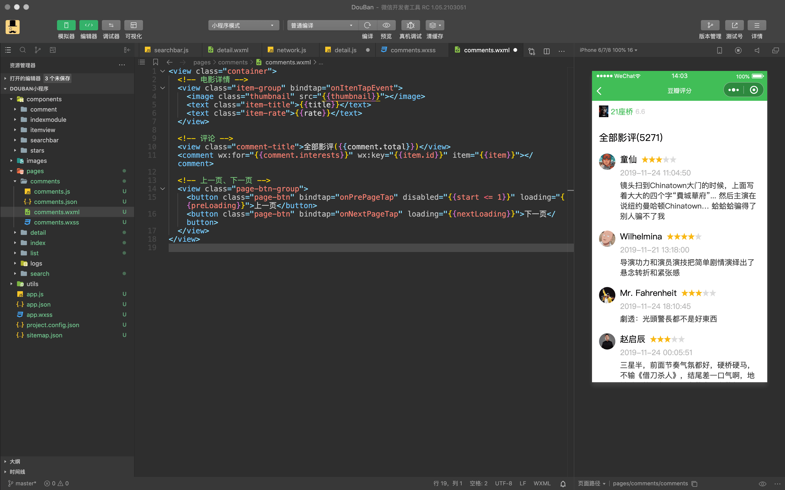

#### comments.wxml
```
<view class="container">
  <!-- 电影详情 -->
  <view class="item-group" bindtap="onItenTapEvent">
    <image class="thumbnail" src="{{thumbnail}}"></image>
    <text class="item-title">{{title}}</text>
    <text class="item-rate">{{rate}}</text>
  </view>

  <!-- 评论 -->
  <view class="comment-title">全部影评({{comment.total}})</view>
  <comment wx:for="{{comment.interests}}" wx:key="{{item.id}}" item="{{item}}"></comment>

  <!-- 上一页、下一页 -->
  <view class="page-btn-group">
    <button class="page-btn" bindtap="onPrePageTap" disabled="{{start <= 1}}" loading="{{preLoading}}">上一页</button>
    <button class="page-btn" bindtap="onNextPageTap" loading="{{nextLoading}}">下一页</button>
  </view>
</view>
```

#### comments.wxss
```
.container {
  padding: 20rpx 30rpx;
}

.item-group {
  display: flex;
  justify-content: flex-start;
  align-items: center;
}

.item-group .thumbnail{
  width: 40rpx;
  height: 50rpx;
}

.item-group .item-title {
  font-size: 32rpx;
  color: #41be57;
  margin-left: 10rpx;
  margin-right: 10rpx;
}

.item-group .item-rate {
  font-size: 28rpx;
  color: #ccc;
}

.comment-title {
  margin-top: 60rpx;
  font-size: 40rpx;
}

/* 上一页、下一页 */
.page-btn-group {
  margin-top: 40rpx;
  margin-bottom: 40rpx;
  display: flex;
  justify-content: flex-start;
  align-items: center;
}

.page-btn {
  flex: 1;
  height: 60rpx;
  color: #898989;
  border-color: #898989;
  line-height: 60rpx;
}
```

#### comments.json
在 .json 文件中导入了组件：
```
{
  "usingComponents": {
    "comment": "/components/comment/comment"
  }
}
```

#### comments.js
```
// pages/comments/comments.js
import {network} from "../../utils/network.js"

Page({

  /**
   * 页面的初始数据
   */
  data: {
    total: 0,
    start: 1,
    count: 20
  },

  /**
   * 生命周期函数--监听页面加载
   */
  onLoad: function (options) {
    console.log(options);
    var that = this;
    that.setData(options);

    that.getComments(1);
  },

  /**
   * 获取评论
   */
  getComments: function(start) {
    var that = this;
    var type = that.data.type;
    var id = that.data.id;
    if (start > that.data.start) {
      that.setData({
        nextLoading: true
      })
    } else {
      that.setData({
        preLoading: true
      })
    }

    // 请求评论数据
    network.getItemComments({
      type: type,
      id: id,
      start: start,
      count: 20,
      success: function (comment) {
        that.setData({
          comment: comment,
          start: start,
          nextLoading: false,
          preLoading: false,
        });
        wx.pageScrollTo({
          scrollTop: 0,
        })
      }
    })
  },

  // 返回上一页
  onItenTapEvent: function(event) {
    wx.navigateBack({});
  },

  // 上一页
  onPrePageTap: function(event) {
    var that = this;
    var oldStart = that.data.start;
    var start = oldStart - that.data.count;
    if (start > 0) {
      that.getComments(start);
    }
  },

  // 下一页
  onNextPageTap: function(event) {
    var that = this;
    var oldStart = that.data.start;
    var start = oldStart + that.data.count;
    that.getComments(start);
  }
})
```

### 搜索
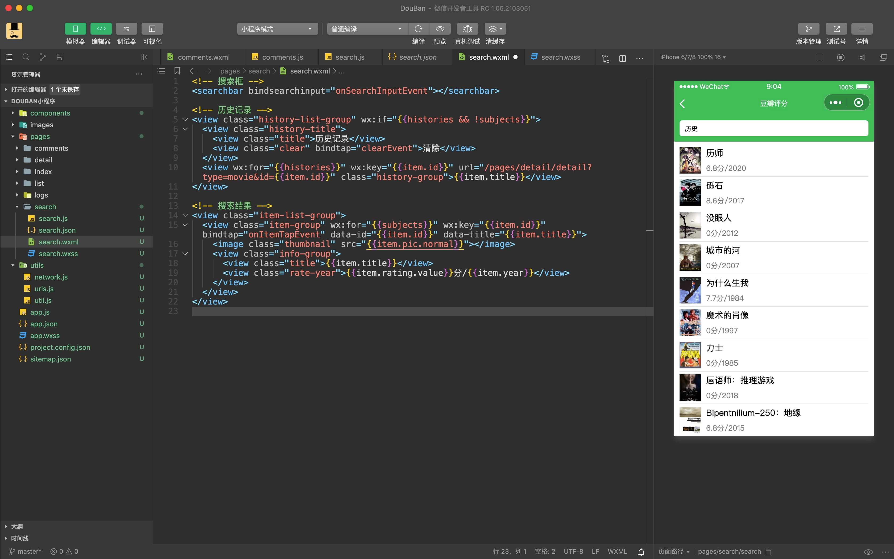

#### search.wxml
```
<!-- 搜索框 -->
<searchbar bindsearchinput="onSearchInputEvent"></searchbar>

<!-- 历史记录 -->
<view class="history-list-group" wx:if="{{histories && !subjects}}">
  <view class="history-title">
    <view class="title">历史记录</view>
    <view class="clear" bindtap="clearEvent">清除</view>
  </view>
  <view wx:for="{{histories}}" wx:key="{{item.id}}" url="/pages/detail/detail?type=movie&id={{item.id}}" class="history-group">{{item.title}}</view>
</view>

<!-- 搜索结果 -->
<view class="item-list-group">
  <view class="item-group" wx:for="{{subjects}}" wx:key="{{item.id}}" bindtap="onItemTapEvent" data-id="{{item.id}}" data-title="{{item.title}}">
    <image class="thumbnail" src="{{item.pic.normal}}"></image>
    <view class="info-group">
      <view class="title">{{item.title}}</view>
      <view class="rate-year">{{item.rating.value}}分/{{item.year}}</view>
    </view>
  </view>
</view>
```

使用自定义组件 `searchbar`，使用 `bindsearchinput="onSearchInputEvent"` 绑定输入框的输入事件。其中的 `bindsearchinput` = `bind` + `searchinput`，而 `"onSearchInputEvent"` 是搜索页面需要实现的回调方法：
```
<searchbar bindsearchinput="onSearchInputEvent"></searchbar>
```

#### search.wxss
```
.item-list-group {
  padding: 10rpx 20rpx;
}

.item-list-group .item-group {
  padding: 10rpx 0;
  border-bottom: 1rpx solid #e4e4e4;
  display: flex;
}

.item-group .thumbnail{
  width: 80rpx;
  height: 100rpx;
  margin-right: 20rpx;
}

.item-group .info-group {
  flex: 1;
  display: flex;
  flex-direction: column;
  justify-content: space-between;
}

.info-group .title {
  font-size: 32rpx;
}

.info-group .rate-year {
  font-size: 28rpx;
  color: #7b7b7b;
}


.history-list-group {
  padding: 10rpx 20rpx;
}

.history-list-group .history-title {
  display: flex;
  justify-content: space-between;
  padding: 20rpx 0;
  background: #f9f9f9;
  font-size: 28rpx;
  color: #9e9e9e;
}

.history-list-group .history-group {
  font-size: 32rpx;
  padding: 20rpx 0;
  border-bottom: 1rpx solid #e4e4e4;
}

/* 
 padding:10px 5px 15px 20px;
 
 上内边距是 10px
 右内边距是 5px
 下内边距是 15px
 左内边距是 20px

 ---------
 padding:10px 5px 15px;

 上内边距是 10px
 右内边距和左内边距是 5px
 下内边距是 15px

 ---------
 padding:10px 5px;

 上内边距和下内边距是 10px
 右内边距和左内边距是 5px

 ---------
 padding:10px;

 所有 4 个内边距都是 10px
 */
```

#### search.json
使用自定义组件 searchbar：
```
{
  "usingComponents": {
    "searchbar": "/components/searchbar/searchbar"
  }
}
```

#### search.js
```
// pages/search/search.js
import {network} from "../../utils/network.js"

Page({

  /**
   * 页面的初始数据
   */
  data: {

  },

  /**
   * 生命周期函数--监听页面加载
   */
  onLoad: function (options) {
    var that = this;
    wx.getStorage({
      key: 'searched',
      success: function(res) {
        console.log(res)
        var data = res.data;
        that.setData({
          histories: data
        })
      },
    })
  },

  // 输入框输入事件
  onSearchInputEvent: function(event) {
    var that = this;
    var value = event.detail.value;
    if (!value || value === "") {
      that.setData({
        subjects: null
      });
      return;
    }
    network.getSearch({
      q: value,
      success: function(subjects){
        that.setData({
          subjects: subjects
        })
      }
    })
  },

  // 选中某一条搜索结果
  onItemTapEvent: function(event) {
    var that = this;
    var id = event.currentTarget.dataset.id;
    var title = event.currentTarget.dataset.title;
    var histories = that.data.histories;
    if (!histories) {
      histories = [];
    }
    var isExisted = false;
    for (var index=0; index<histories.length;index++) {
      var movie = histories[index];
      if (movie.id === id) {
        isExisted = true;
        break;
      }
    }
    if (!isExisted) {
      histories.push({ title: title, id: id })
      wx.setStorage({
        key: 'searched',
        data: histories,
        success: function () {
          console.log("保存成功！");
        }
      })
    }
    
    // 页面跳转
    wx.navigateTo({
      url: "/pages/detail/detail?type=movie&id="+id,
    })
  },

  clearEvent: function() {
    var that = this;
    wx.removeStorage({
      key: 'searched',
      success: function(res) {
        console.log("删除成功!");
        that.setData({
          histories: null
        });
      },
    });
  }
})
```

## 总结

### 更新UI
```
that.setData({
  lights: lights,
  halfs: halfs,
  grays: grays,
  ratetext: ratetext,
})
```

### 页面跳转
创建 `navigator` 组件；  
设置跳转路径 `url`；  
`type、id`：在 `url` 中通过符号 `?` 加入参数，实现页面间传值。  
```
<navigator url="/pages/detail/detail?type={{type}}&id={{item.id}}"> </navigator>
```

### padding、padding-top、margin-top 和 top 的区别
```
padding:10px 5px 15px 20px; //上内边距是 10px，右内边距是 5px，下内边距是 15px，左内边距是 20px

padding:10px 5px 15px; //上内边距是 10px，右内边距和左内边距是 5px，下内边距是 15px

padding:10px 5px; //上内边距和下内边距是 10px，右内边距和左内边距是 5px

padding:10px; //所有 4 个内边距都是 10px

padding-top:10px; //是指容器内的内容距离容器的顶部有10个像素，是包含在容器内的

margin-top:10px; //是指容器本身的顶部距离其他容器有10个像素，不包含在容器内

top:10px; //是指容器本身的顶部距离页面的顶端有10个像素
```

### observer（监听属性）  
属性被改变时执行的函数（可选），也可以写成在 `methods` 段中定义的方法名字符串, 如：`'_propertyChange'`。通常 `newVal` 就是新设置的数据，`oldVal` 是旧数据
```
properties: {
  rate: {
    type: Number,
    value: 0,
    observer(newVal, oldVal, changedPath) {
      this.updateRate();
    }
  }
}
```

### 事件回调、主动触发
组件内通过主动触发回调方法，实现事件传递，同时使用到组件的文件需要绑定回调方法。以 `searchbar` 组件为例：  
searchbar.js 文件：
```
/**
  * 组件的方法列表
  */
methods: {
  // 输入框输入回调
  onInputEvent: function(event) {
    var value = event.detail.value;
    var detail = {"value": value};
    var options = {};
    // 回调方法
    this.triggerEvent("searchinput",detail,options);
  }
}
```

search.wxml 文件：
```
<searchbar bindsearchinput="onSearchInputEvent"></searchbar>
```

`bindsearchinput` = `bind` + `searchinput`。`"onSearchInputEvent"` 是需要实现的回调事件。

search.js 文件：
```
// pages/search/search.js
import {network} from "../../utils/network.js"

Page({

  // 输入框输入事件
  onSearchInputEvent: function(event) {
    var that = this;
    var value = event.detail.value;
    // to do
  }
})
```

### 加载动画
```
// 显示加载动画
wx.showLoading({
  title: '正在加载中...',
})

// 移除加载动画
wx.hideLoading();
```

### scroll-view 滚动到指定位置
```
// 滚动到顶部
wx.pageScrollTo({
  scrollTop: 0,
})
```

### 网络请求
```
// 发起网络请求
wx.request({
  // 设置请求url
  url: url,
  // 设置请求参数
  data: {
    count: count
  },
  // 请求成功回调
  success: function(res) {
    console.log(res);
  }
})
```

### 构造器
可以单独创建一个 .js 文件，在文件内部创建构造器。以 `globalUrls、ntework` 为例，构造器内部可以定义变量、构造方法，这样外部调用者不需要初始化，可以直接使用 `globalUrls、ntework` 调用构造器内部的变量和方法，同 iOS 里的类方法。
```
const globalUrls = {
    // 内容
}
```


# ES6语法
ES6 是 ECMAScript 6 的简写，ECMAScript 6 泛指“下一代 JavaScript 语言”，具体每年发布的都有自己的专属名称，比如2015年发布的则为 ESMAScript 2015。目前说的 ES6 语法，一般值得都是 ESMAScript 2015版。[ECMAScript](https://baike.baidu.com/item/ECMAScript/1889420?fr=aladdin) 是 JavaScript 的标准，JavaScript 是 ECMAScript 的一种实现，另外的 ECMAScript 方言还有 Jscript 和 ActionScript。

在小程序开发工具中开启ES6：在微信开发者工具中->详情->ES6转ES5。

## 定义变量

### let
`let` 跟 `var` 一样，也是用来定义变量，但是他比 `var` 更加的安全，体现在以下两点：
1. 不会出现变量提升的情况。
   ```
   console.log(a);
   var a = 10;
   ```

   变量 `a` 是在打印的后面定义的，但是以上的代码并不会出错，而是会打印 `undefined`，因为var会把变量 `a` 提升到代码最开始的地方进行定义。但是如果使用 `let` 就不会出现这种问题了：
   ```
   console.log(b);
   let b = 10;
   ```

   此时再去打印的时候，就直接会抛出一个错误 `ReferenceError: b is not defined.`，这才是正确的方式。

   注意：小程序中不能真正解析ES6语法，他只是借助了第三方工具将 ES6 语法转成 ES5 语法运行的，在底层也是用 `var` 来代替 `let` 的，所以依然会发生变量提升。

2. 只在当前代码块内有效。
   ```
   for(var i=0;i<=3;i++){
     console.log(i);
   }
   console.log(i);
   ```

   正常逻辑下，在 for 循环结束后 i 就不能够再使用了，但是这里的打印结果是 3 而不是抛出异常，这种现象在一些情况下也会阐释莫名其妙的错误，影响开发。但是 `let` 就不会出现这种情况：
   ```
   for(let i=0; i<=3; i++){
     console.log(i);
   }
   console.log(i);
   ```

   此时再打印i的时候，就会抛出错误 `ReferenceError: b is not defined.`。

### const
`const` 是用来定义常量的，常量是一旦定义好了以后，就不能够再修改了：
```
const PI = 3.14;
PI = 3 // 会抛出异常
```

`const` 只是用来限制指向的内存地址不能改变，但是如果这个内存地址上的数据改变了，是可以的：
```
const mylist = [1,2,3];
mylist.push(4);
console.log(mylist);
```

打印结果：
```
[1,2,3,4]
```

## 函数
### 默认参数
```
function fetch(url, method="get"){
    console.log(url);
    console.log(method);
}
```

`method="get"` 表示在调用 `fetch` 函数的时，可以不传 `method` 参数，他会默认使用 `get`：
```
fetch("http://www.baidu.com/"); //method == get
fetch("http://www.baidu.com/","post") // method == post
```

* 定义默认参数的时候，默认参数必须要在非默认参数的后面。

有多个默认值的情况：
```
function person(name, age=18, gender='男'){
    console.log(name, age, gender);
}
```

在调用 `person` 函数时，如果只提供 `gender`，不提供 `age`，那么必须与解构赋值默认值结合使用：
```
function person(name, {age=18 ,gender='女'} = {}){
    console.log(name, age, gender);
}

person("知了",{gender:"男"});
```

### 箭头函数
函数作为一个参数变量传递的时候，为了简化写法，可以使用箭头函数来实现：
```
wx.request({
    url: "http://www.baidu.com/",
    success: function(res){
        // to do
    }
});
```

对上面的代码使用箭头函数：
```
wx.request({
    url: 'http://www.baidu.com/',
    success: res => {
        // to do 
    }
});
```

#### 箭头函数的语法
```
(参数1,参数2) => {代码块}
```

定义一个网络请求的方法：
```
function request(url,success) {
  if (success) {
    let result = success();
    console.log(result);
  }
}
```

如果只有一行代码，那么可以不用花括号（`(a,b) => a+b` 返回 a+b 的结果）：
```
request("http://www.baidu.com/", (res1, res2) => true);
```

如果只有一个参数，可以不使用圆括号（`a => a+1`）：
```
request("http://www.baidu.com/", res => {
  console.log(res);
  return true;
});
```

如果没有参数：
```
request("http://www.baidu.com/", () => {
  console.log("111111");
  return true;
});
```

### Promise
`Promise` 的实现原理：
```
const p = new Promise(function(resolve,reject){
    setTimeout(() => {
        // 如果执行以下代码，那么会执行下面的then函数
        resolve("success");
    },1000);
    
    setTimeout(() => {
        // 如果执行以下代码，那么会执行下面的catch函数
        reject("fail")
    },1000);

    // 如果以上代码都执行完，那么只会调用下面的then方法，因为resolve的调用在前面。
});

p.then((res) => {
  console.log(res);
}).catch((error) => {
  console.log(error);
});
```

## 类
在 ESS 中实现一个类：
```
function Point(x, y) {
  this.x = x;
  this.y = y;
}

Point.prototype.toString = function () {
  return '(' + this.x + ', ' + this.y + ')';
};

var p = new Point(1, 2);
```

在 ES6 中实现一个类：
```
class Person{
  // 构造函数
  constructor(name,age){
    this.name = name;
    this.age = age;
  }

  sayHello(){
    console.log("hello world");
  }
}

let p = new Person("zhiliao",18);
p.sayHello();
```

### 定义静态方法
使用 `static` 关键字定义的静态方法，该静态方法是只属于类，不属于对象。在使用这个方法的时候直接通过类名就可以调用：
```
class Utils{
  constructor(){}
  static timeFormat(time){
    // to do
  }
}

// 调用
Utils.timeFormat("2021/1/1")
```

## 模块
在传统的 JS 中，没有办法在多个 js 文件中互相导入，对于大型项目来说很不方便。因此 ES6 提供了一个模块的功能。

### export
认在一个js文件中写好的代码或者变量，是不能够给其他的文件使用的，如果想要被外部使用，那么需要使用export关键字：
```
// utils.js
var name = "zhiliao";
function dateFormat(date){
    // 格式化代码
}
class Person{
    constructor(name,age){
        this.name = name;
        this.age = age;
    }
}

// 导出
export {name,dateFormat,Person}
```

### import
以上文件进行 `export` 了，那么以后其他文件想要使用的，则需要从这个文件中把需要的进行 `import`：
```
// from 后面是一个相对路径
import {name,dateFormat,Person} from "utils.js";
```

# 云开发

[小程序·云开发](https://developers.weixin.qq.com/miniprogram/dev/wxcloud/basis/getting-started.html)

## 创建小程序
[创建小程序](https://developers.weixin.qq.com/miniprogram/dev/wxcloud/quick-start/miniprogram.html)
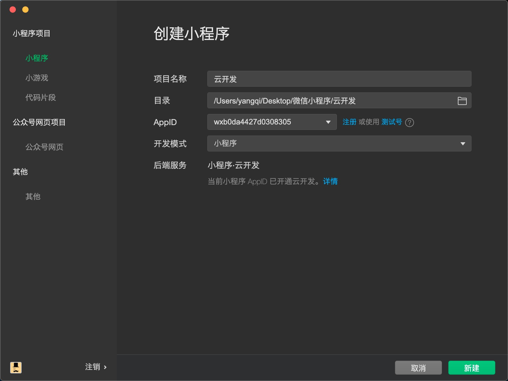
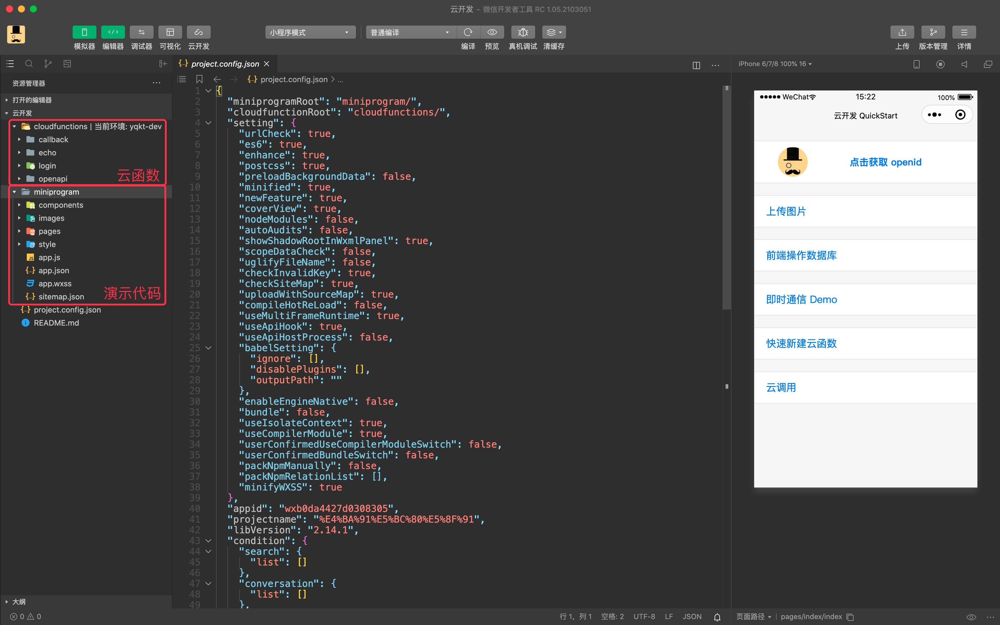

## 数据库
### 创建程序
新建项目 databasedemo：
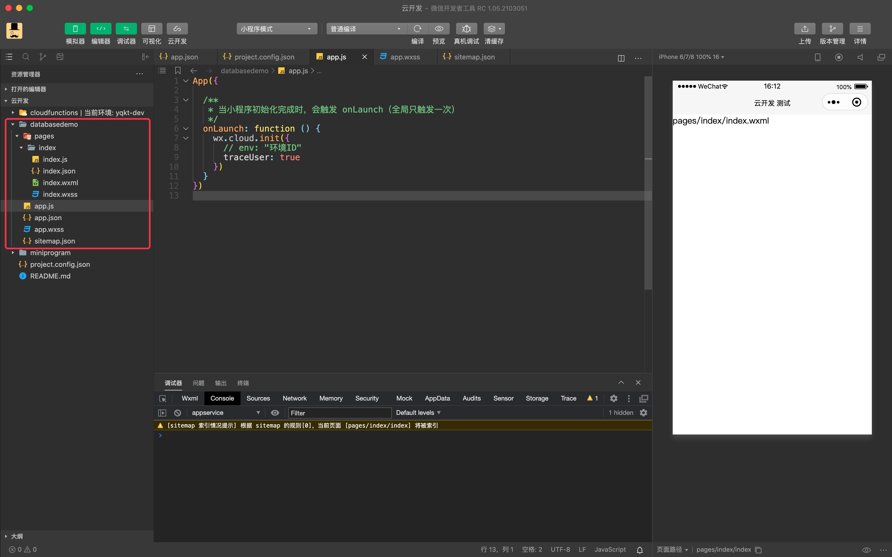

### 初始化云开发
在 app.js 文件中的 `onLaunch()` 方法 [初始化](https://developers.weixin.qq.com/miniprogram/dev/wxcloud/guide/init.html) 数据库：
```
App({

  /**
   * 当小程序初始化完成时，会触发 onLaunch（全局只触发一次）
   */
  onLaunch: function () {
    wx.cloud.init({
      env: "环境ID"
      traceUser: true
    })
  }
})
```
`env`：指定所有服务的默认环境。  
`traceUser`：是否在将用户访问记录到用户管理中，在控制台中可见。  

### 创建集合
在云开发的数据库中，使用的是 `NoSQL` 类型的数据库。关系型数据库中的表，对应的是 `NoSQL` 中的一个集合。所以在所数据操作之前，应该先创建一个集合。创建完集合后，也不需要跟关系型数据库一样，先定义好这个集合中的字段，而是直接插入数据，并且插入数据的时候，每条数据的字段无需保持一致！
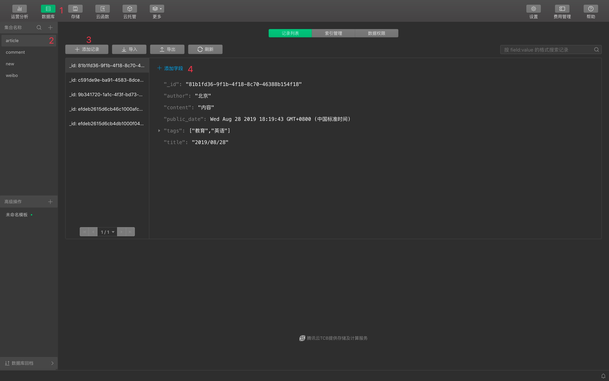

### 获取数据库对象
可以通过 `wx.cloud.database` 函数来获取数据库对象，这个函数默认会使用 `wx.cloud.init` 方法中提供的环境下的数据库。如果想要使用其他环境的数据库，可以给 `wx.cloud.database` 方法传递一个 `env` 参数，比如：`wx.cloud.database({ "env":"数据库环境ID" })`。

### 获取集合对象
可以通过 `db.collection("集合名称")` 来获取集合对象，比如通过 `const test = db.collection("test")` 获取到 `test` 集合对象，然后就可以对 `test` 来进行操作了。

### 插入数据
调用集合 `test` 的 `add()` 方法来插入数据：
```
// 数据库
const db = wx.cloud.database();

Page({
  /**
   * 添加数据
   */
  add: function (options) {
    // 集合
    db.collection("test").add({
      data: {
        title: "测试标题",
        pub_date: new Date("2021-04-01"),
        author: "测试作者",
        content: "测试内容"
      }
    }).then(res => {
      console.log(res);
    })
  }
})
```

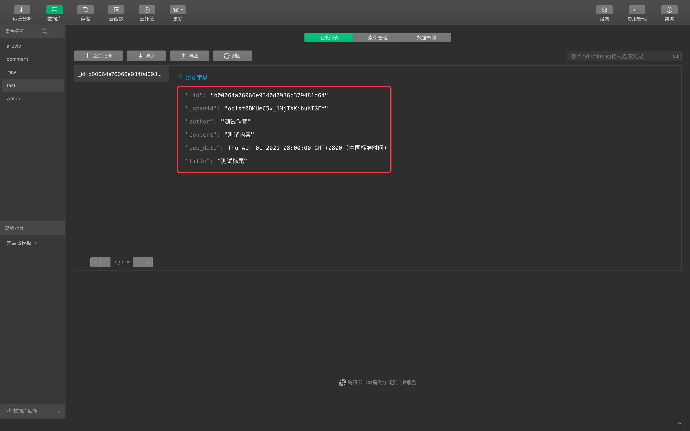

### 获取数据
1.获取集合里的所有数据（考虑到性能，小程序一次性最多只能获取20条数据）
```
get: function (options) {
  db.collection("test").get().then(res => {
    console.log(res)
  })
}
```

2.根据 `id` 获取指定某一条数据（通过 `id` 获取数据需要通过 `doc()` 函数来实现）
```
getById: function (options) {
  db.collection("test").doc("b00064a76066e9340d0936c379481d64").get().then(res => {
    console.log(res)
  })
}
```

3.根据条件获取数据，可以通过 where 函数来实现
```
getBy: function (options) {
  db.collection("test").where({
    title: "测试标题"
  }).get().then(res => {
    console.log(res);
  })
}
```

### 删除数据
```
/**
 * 删除一条数据,需要知道这条数据的 id
 */
remove: function (options) {
  db.collection("test").doc("b00064a76066e9340d0936c379481d64").remove().then(res => {
    console.log(res);
  })
}
```

删除多条数据（只能在服务端实现，需要用到云函数）：
```
db.collection("article").where({
    title: "知了"
}).remove().then(res => {
    console.log(res);
});
```

### 更新数据
```
/**
 * 局部数据：局部更新是一次性只更新一条数据中的某几个字段的值，用的是update方法。 
 */
update: function (options) {
  db.collection("test").doc("b00064a76066e9340d0936c379481d64").update({
    data: {
      title: "测试作者2"
    }
  }).then(res => {
    console.log(res);
  })
},

/**
 * 整体更新：整体更新是一次性把所有数据都更新，用的是set方法 
 */
updateAll: function (options) {
  db.collection("test").doc("b00064a76066e9340d0936c379481d64").set({
    data: {
        title: "测试标题3",
        author: "测试作者2",
        content: "测试内容2"
    }
  })
}
```

一次更新多个数据：需要在服务器端，使用云函数来实现。 

### command指令
获取 command 对象：
```
const db = wx.cloud.database();
const _ = db.command;
```

#### 查询指令
通过 `db.command` 实现条件查询。
##### command.eq
示例一，在 `test` 集合中，找到字段 `author == "测试作者03"` 的数据：  
第一种方式，通过制定数据查询：
```
db.collection("test").where({
  author: "测试作者03"
}).get().then(res => {
  console.log(res);
});
```

第二种方式，通过eq指令查询：
```
eqcommand: function(){
  db.collection("test").where({
    author: _.eq("测试作者03")
  }).get().then(res => {
    console.log(res);
  })
}
```

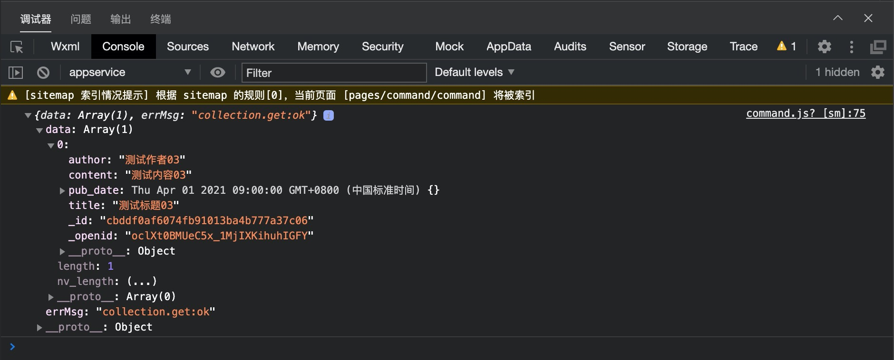
`author: _.eq("测试作者03")` 强调用是等于，`author: "测试作者03"` 强调的事匹配条件。

示例二，匹配 `dic.key == "测试对象03"` 的数据：
```
db.collection("test").where({
  dic: {
    key: "测试对象03"
  }
}).get().then(res => {
  console.log(res)
})
```

指定数据方式可以获取到两条数据，这两条数据的 `dic` 对象的 `key` 等于"测试对象03"。
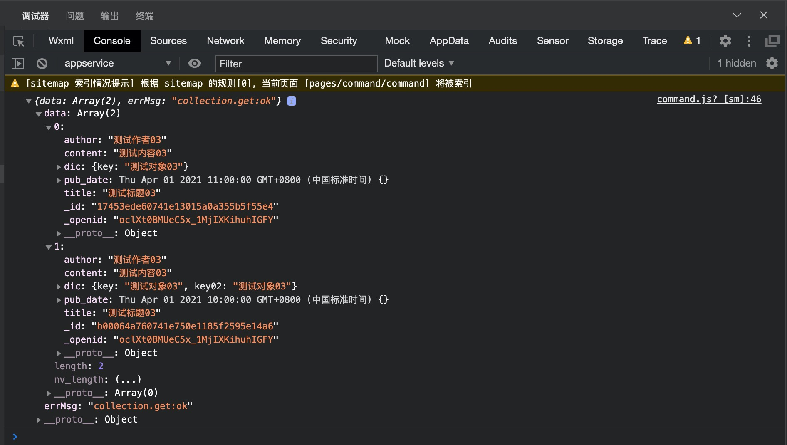

示例三，匹配 `dic.key == "测试对象03"` 且 `dic.key02 == "测试对象03"` 的数据：
```
db.collection("test").where({
  dic: {
    key: "测试对象03",
    key02: "测试对象03"
  }
}).get().then(res => {
  console.log(res)
})
```


示例四，获取 `dic == { key: "测试对象" }` 的数据：
```
db.collection("test").where({
  dic: _.eq({
    key: "测试对象03"
  })
}).get().then(res => {
  console.log(res)
})
```

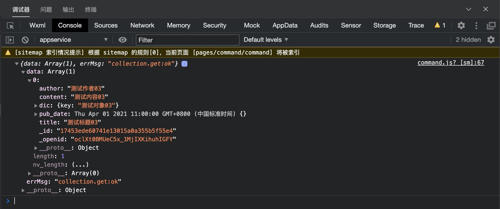

##### command.neq
表示字段不等于某个值，和 `db.command.eq` 相反。

##### command.lt
表示小于某个值。比如查找小于2021/4/1 10:00:00发布的数据：
```
db.collection("test").where({
  pub_date: _.lt(new Date("2021/4/1 10:00:00"))
}).get().then(res => {
  console.log(res)
})
```


##### command.lte
表示小于或者等于某个值。与 `command.lt` 类似。

##### command.gt
表示大于某个值。与 `command.lt` 类似。

##### command.gte
表示大于或者等于某个值。与 `command.lte` 类似。

##### command.in
查询筛选条件，表示字段的值需在给定的数组内。比如查找北京日报和今日头条两个作者发表的文章：
```
db.collection("test").where({
  author: _.in(["测试作者01", "测试作者02"])
}).get().then(res => {
  console.log(res)
})
```

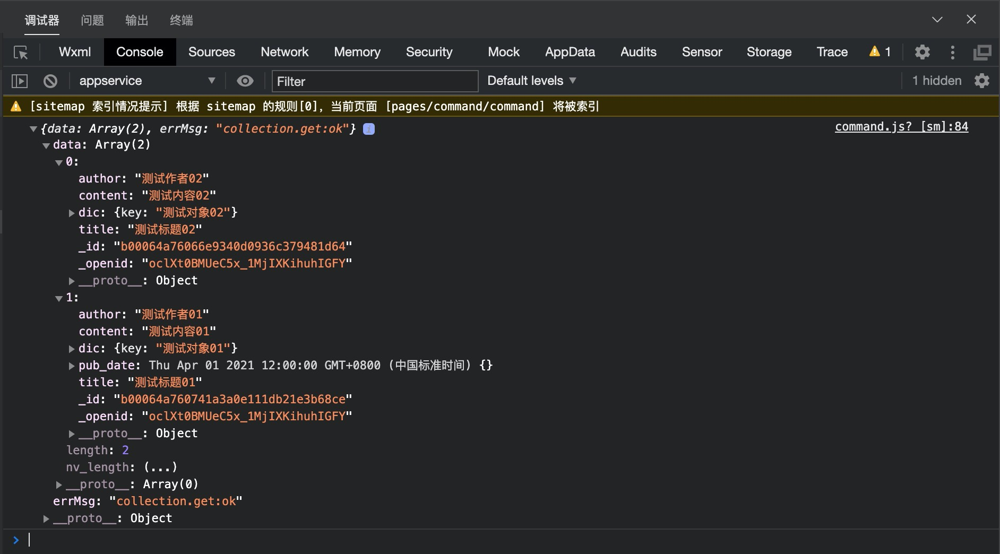

##### command.nin
查询筛选条件，表示字段的值需不在给定的数组内。与 `command.in` 类似。

##### command.and
查询指令，用于表示逻辑 "与" 的关系，表示需同时满足多个查询筛选条件。比如获取发表在 2021/4/1 10:00:00 和 2021/4/1 11:00:00 之间的所有数据：
```
// 1.普通调用
db.collection("test").where({
  pub_date: _.and(_.gte(new Date("2021/4/1 10:00:00")), _.lte(new Date("2021/4/1 11:00:00")))
}).get().then(res => {
  console.log(res)
})

// 2.链式调用
db.collection("test").where({
  pub_date: _.gte(new Date("2021/4/1 10:00:00")).and(_.lte(new Date("2021/4/1 11:00:00")))
}).get().then(res => {
  console.log(res)
})
```

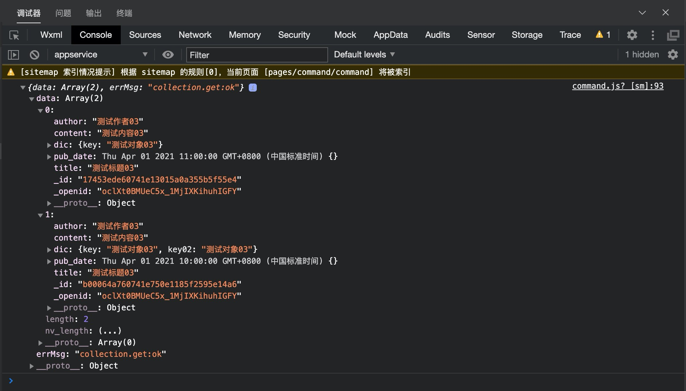

##### command.or
查询指令，用于表示逻辑 "或" 的关系，表示需同时满足多个查询筛选条件。或指令有两种用法：
1. 可以进行字段值的 “或” 操作；
2. 可以进行跨字段的 “或” 操作。

示例一，一个字段的或操作（比如获取时间在 2021/4/1 10:00:00 前或者 2021/4/1 11:00:00 后的数据）：
```
db.collection("test").where({
  pub_date: _.or(_.lt(new Date("2021/4/1 10:00:00")), _.gt(new Date("2021/4/1 11:00:00")))
}).get().then(res => {
  console.log(res)
})
```


示例二，跨字段或操作（比如想要获取时间在 2021/4/1 10:00:00 前，或者是作者中包含 “测试作者01” 的数据）：
```
db.collection("test").where(
  _.or([
    {
      pub_date: _.lt(new Date("2021/4/1 10:00:00"))
    },
    {
      author: "测试作者01"
    }
  ])
).get().then(res => {
  console.log(res)
})
```

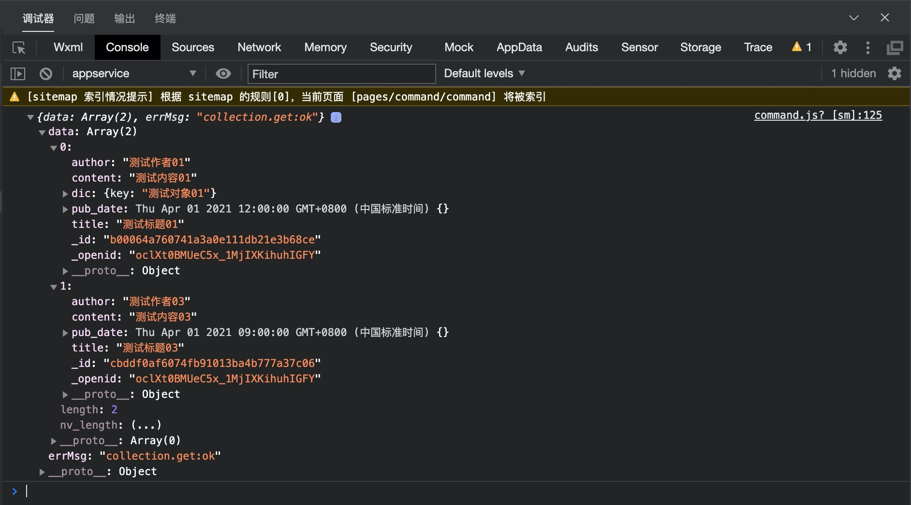
注意：`where()` 没有 `{}`，`or()` 内部是一个数组 `[]`。

#### 更新指令

##### command.set
更新指令。用于设定字段等于指定值。比如以下是一条数据：
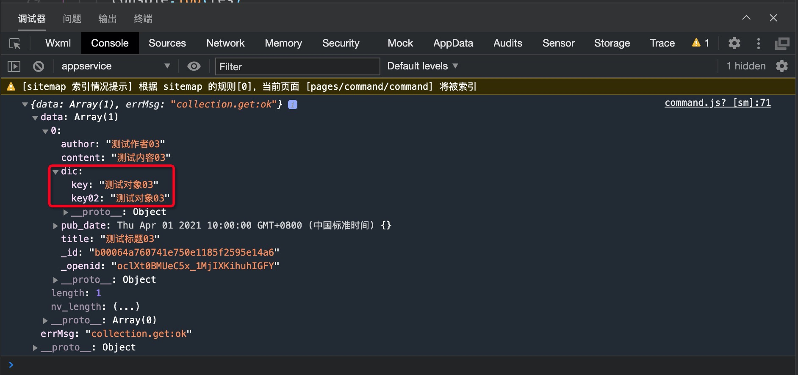

如果想将这个数据中的 `dic` 变成 `{ "key": "测试对象" } `，那么通过传统的方式是无法实现的：
```
db.collection("test").doc("b00064a760741e750e1185f2595e14a6").update({
  data: {
    dic: {
      "key": "测试对象"
    }
  }
}).then(res => {
  console.log(res)
})
```

上面这种方式，只能将 `dic.key` 改成“测试对象”，即 `dic == { key: "测试对象", key02: "测试对象03" }`，所以需要用 `_.set` 方法：
```
db.collection("test").doc("b00064a760741e750e1185f2595e14a6").update({
  data: {
    dic: _.set({
      key: "测试对象"
    })
  }
}).then(res => {
  console.log(res);
})
```

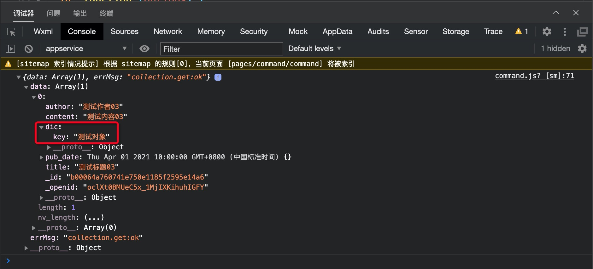

##### command.remove
更新指令。用于表示删除某个字段。比如我们想将author这个字段删除，那么就可以调用这个方法。示例代码如下：
```
db.collection("test").doc("b00064a760741e750e1185f2595e14a6").update({
  data: {
    dic: _.remove()
  }
}).then(res => {
  console.log(res);
})
```

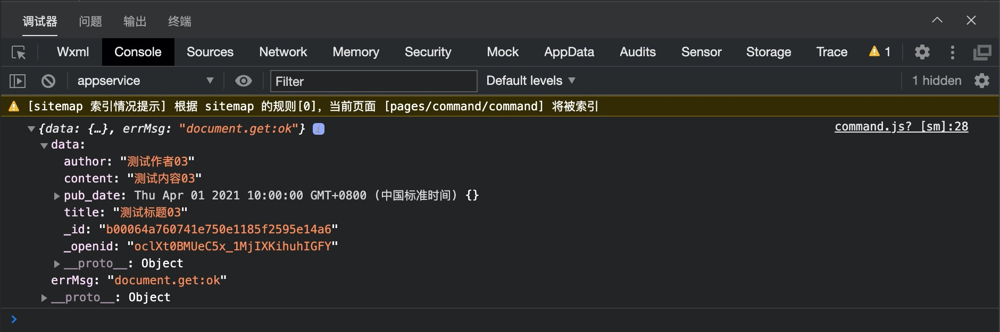

##### command.inc
更新指令。用于指示字段自增某个值，这是个原子操作，使用这个操作指令而不是先读数据、再加、再写回的好处是：

原子性：多个用户同时写，对数据库来说都是将字段加一，不会有后来者覆写前者的情况。
减少一次网络请求：不需先读再写。
比如 `test` 集合中的一条数据加一个 `read_count` 字段，给这个字段加1，那么可以使用以下方式实现：
```
db.collection("test").doc("b00064a760741e750e1185f2595e14a6").update({
  data: {
    read_count: _.inc(1)
  }
})
```

运行两次：
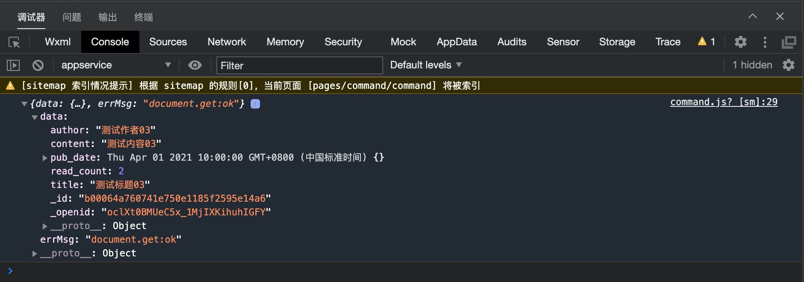

##### command.mul
自乘指令，跟 `command.inc` 一样。

##### command.push
更新指令，对一个值为数组的字段，往数组尾部添加一个或多个值。如果该字段原为空，则创建该字段并设数组为传入值。  
比如要给 `test` 集合中的某条数据添加标签，那么可以使用以下方式来实现：
```
db.collection("test").doc("b00064a760741e750e1185f2595e14a6").update({
  data: {
    tags: _.push(["新闻"])
  }
})
```

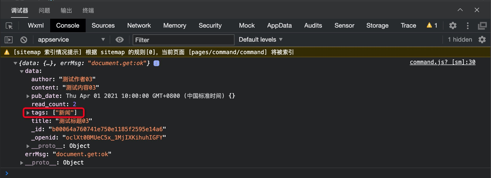

##### command.pop
更新指令，对一个值为数组的字段，将数组尾部元素删除。

##### command.shift
更新指令，对一个值为数组的字段，将数组头部元素删除。

##### command.unshift
更新指令，对一个值为数组的字段，往数组头部添加一个或多个值。如果该字段原为空，则创建该字段并设数组为传入值。

### 高级查询
#### collection.count
统计集合记录数或统计查询语句对应的结果记录数，注意这与集合权限设置有关，一个用户仅能统计其有读权限的记录数。比如查找所有由“测试作者03”发布的数据的个数：
```
db.collection("test").where({
  author: "测试作者03"
}).count().then(res => {
  console.log(res)
})
```

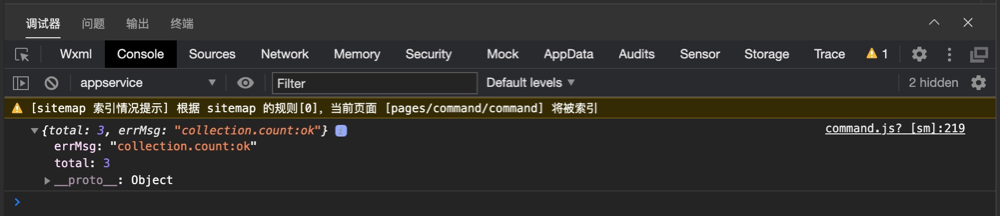

#### collection.orderBy
该方法接受两个参数：
1. 一个必填字符串参数 `fieldName` 用于定义需要排序的字段；
2. 一个字符串参数 `order` 定义排序顺序，`order` 只能取 `asc` 或 `desc`。

注意：
1. 如果需要对嵌套字段排序，需要用 "点表示法" 连接嵌套字段，比如 `author.age` 表示字段 `author` 里的嵌套字段 `age`。
2. 同时也支持按多个字段排序，多次调用 `orderBy` 即可，多字段排序时的顺序会按照 `orderBy` 调用顺序先后对多个字段排序。

比如通过“阅读量”从大到小以及“作者的年龄”从小到大进行排序。那么可以使用以下代码来实现：
```
orderBy: function (options) {
  db.collection("test")
  .orderBy("read_count", "desc")
  .orderBy("author.age", "asc")
  .get()
  .then(res => {
    console.log(res);
  })
}
```

没有指定字段的数据也会返回并且默认排在后面：
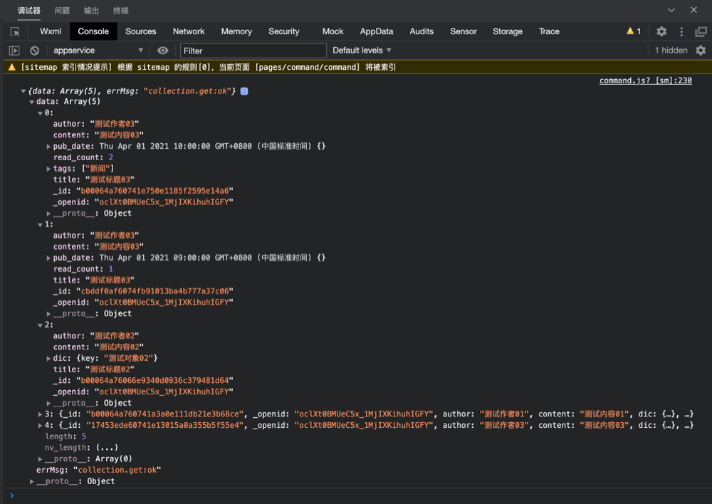

#### collection.limit
指定查询结果集数量上限。比如一次性获取10篇文章，那么可以通过以下代码来实现：
```
limit: function (options) {
  db.collection("test").limit(10)
  .get()
  .then(res => {
    console.log(res);
  })
}
```

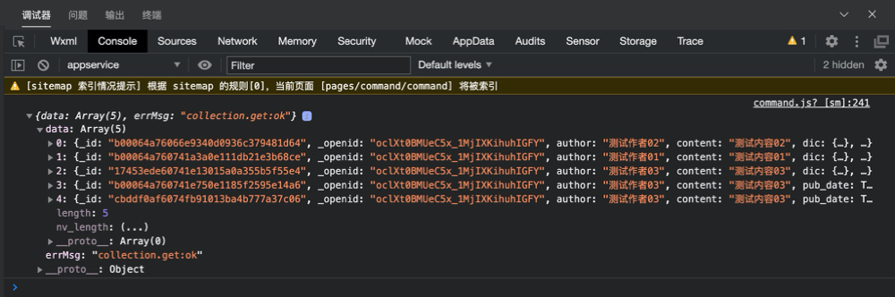

#### collection.skip
指定查询返回结果时从指定序列后的结果开始返回，常用于分页。比如跳过前面4篇文章，从第11篇开始获取。代码如下：
```
skip: function (options) {
  db.collection("test").skip(4)
  .get()
  .then(res => {
    console.log(res);
  })
}
```

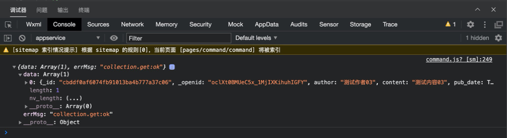

#### collection.field
指定返回结果中记录需返回的字段。比如只想获取 `test` 文章中的 `author` 字段。那么可以使用以下代码来实现：
```
field: function (options) {
  db.collection("test").field({
    read_count: true
  }).get().then(res => {
    console.log(res)
  })
}
```

结果显示，如果数据中没有指定的字段也会返回：
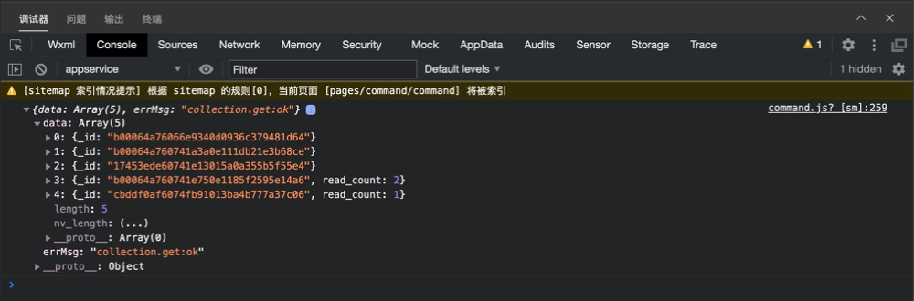

## 文件管理
小程序文件管理官方文档：[文件](https://developers.weixin.qq.com/miniprogram/dev/api/file/wx.saveFile.html)。

### wx.saveFile(Object object)  
保存文件到本地。注意：saveFile 会把临时文件移动，因此调用成功后传入的 tempFilePath 将不可用
```
/**
 * 生命周期函数--监听页面显示
 */
onShow: function () {
  wx.chooseImage({
    success: function (res) {
      const tempFilePaths = res.tempFilePaths
      wx.saveFile({
        tempFilePath: tempFilePaths[0],
        success (res) {
          const savedFilePath = res.saveFile;
          console.log(res)
        }
      })
    }
  })
},
```

## 云函数
### node环境搭建
因为云函数在服务器上是运行在 node.js 环境中的，并且云函数会用到一些第三方库。先在本地编写好，再提交到云服务器，所以本地也需要安装好一套 node.js 环境。原则上，本地的 node.js 版本应该跟云服务器的版本一致。

### 初始化环境
在以上文件夹中，右键->初始化环境：
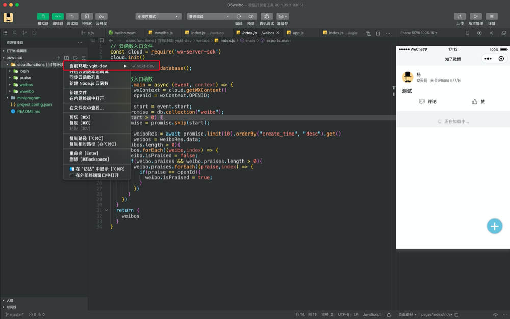

### 创建云函数
在 `cloudfunctions` 文件夹上，右键->创建云函数，填入云函数的名称，然后点击确定即可创建好。然后就可以在相应的 `index.js` 文件中写代码了。示例代码如下：
```
// 云函数入口文件
const cloud = require('wx-server-sdk')

cloud.init()

// 云函数入口函数
exports.main = async (event, context) => {
  const x = event.x;
  const y = event.y;

  return {
    result: x + y
  }
}
```

### 上传和部署
在本地创建完云函数后，需要上传到服务器并部署。只需要在相应函数的文件夹上：右键 -> 上传并部署：云端安装依赖。
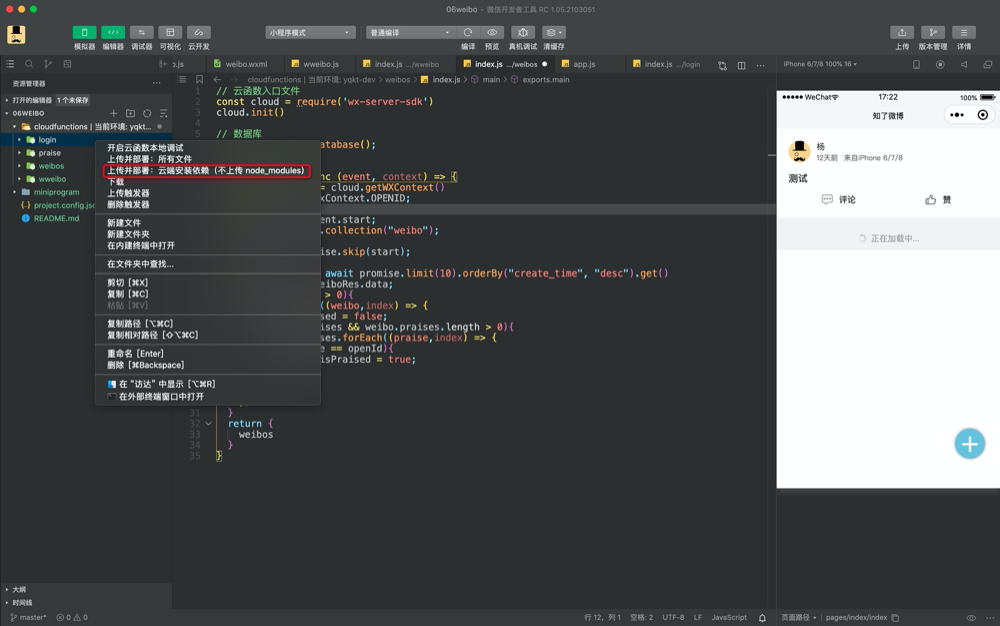

### 在云函数中操作数据库
在云函数中操作数据库、文件等，可以通过 `wx-server-sdk` 实现。这个 sdk 与小程序端的 API 有以下两点不同：
1. 服务端的 API 仅支持 Promise 风格调用。
2. 服务端 API 可以进行批量的 update 和 remove 操作。

获取微博数据示例：
```
// 云函数入口文件
const cloud = require('wx-server-sdk')
cloud.init()

// 数据库
const db = cloud.database();

// 云函数入口函数
exports.main = async (event, context) => {
  // 获取微信调用上下文
  const wxContext = cloud.getWXContext()
  // 小程序用户 openid
  const openId = wxContext.OPENID;

  const start = event.start;
  // 获取 weibo 集合
  let promise = db.collection("weibo");
  if (start > 0) {
    promise = promise.skip(start);
  }
  // 异步获取10调微博数据，按创建时间，倒序
  const weiboRes = await promise.limit(10).orderBy("create_time", "desc").get()
  const weibos = weiboRes.data;
  if(weibos.length > 0){
    weibos.forEach((weibo,index) => {
      weibo.isPraised = false;
      if(weibo.praises && weibo.praises.length > 0){
        weibo.praises.forEach((praise,index) => {
          if(praise == openId){
            weibo.isPraised = true;
          }
        })
      }
    })
  }
  // 返回数据
  return {
    weibos
  }
}
```

