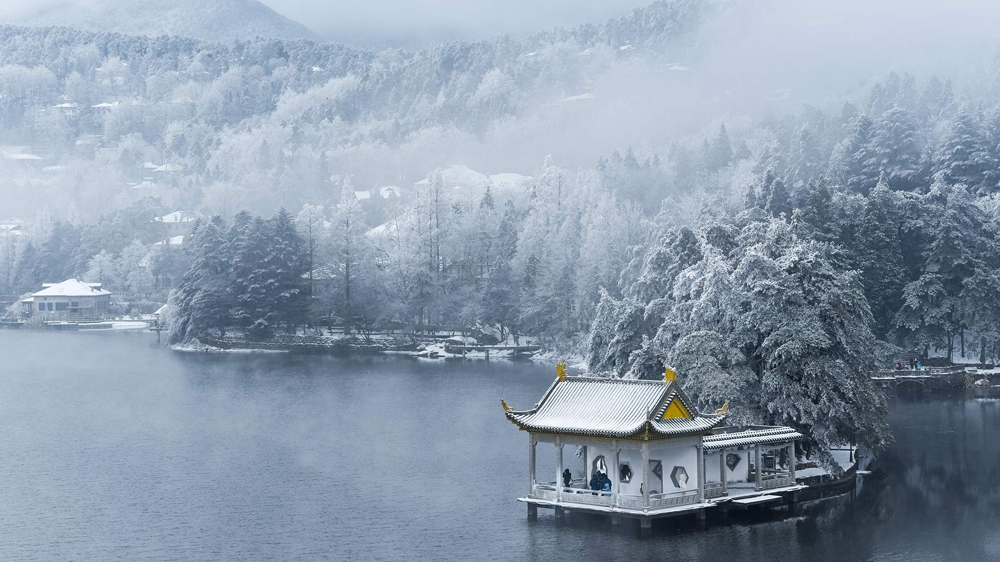
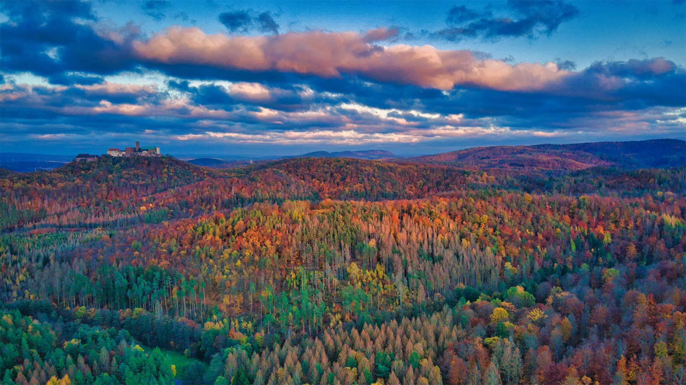

Life is not only about compromise, but also peoms and dreams.

<!-- more -->

* 202211016

**50th anniversary of the Convention concerning the Protection of the World Cultural and Natural Heritage**

On 16 November 1972, UNESCO adopted the Convention concerning the Protection of the World Cultural and Natural Heritage, linking the concepts of nature conservation and cultural heritage conservation for the first time. The origin of this convention dates back to the early 60s of the last century, when Egypt built the Aswan Dam, the Nile water will flood the original site of the Abu Simbel Temple, in order to protect the historical witness and cultural treasure of human civilization, the world has actively cooperated, and finally the Convention for the Protection of the World Cultural and Natural Heritage was born.

Mesa Verde National Park, where the Pueblo people lived for seven centuries, was listed as one of the first World Heritage Sites by UNESCO in 1978.

**《保护世界文化和自然遗产公约》50周年**

1972年11月16日，联合国教科文组织通过了《保护世界文化和自然遗产公约》，首次将自然保护和文化遗产保护的概念联系起来。这个公约的起源要追溯到上世纪60年代初，埃及修建阿斯旺大坝时，尼罗河水将淹没阿布辛贝勒神庙的原址，为保护这个人类文明的历史见证和文化瑰宝，世界各国展开了积极合作，最终《保护世界文化和自然遗产公约》诞生了。

梅萨维德国家公园是普韦布洛人生活了七个世纪的地方，在1978年被联合国教科文组织列为首批世界遗产之一。

* 20221107

**Beautiful view of Lushan Mountain in winter**  

Today is November 7th, which coincides with the beginning of winter. Lidong is the first solar term of winter in the Chinese lunar calendar. Winter lasts from November 7 or 8 to 22 or 23. Like the beginning of spring, summer and autumn, the beginning of winter also marks the beginning of a new season.

We still maintain the custom of eating food at the beginning of winter. In southern China, people eat chicken, duck, fish and meat to celebrate this festival; In northern China, especially Beijing and Tianjin, people like to eat dumplings, which herald the arrival of winter.

**冬天的庐山美景**  

今天是11月7日，正好是立冬时节。立冬是中国农历中冬季的第一个节气。每年立冬从11月7日或8日持续到22日或23日。跟立春、立夏、立秋一样，立冬也标志着一个新季节的开始。

我们仍然保留了立冬时节吃美食的习俗。在中国南方，人们会吃鸡鸭鱼肉来庆祝这一节日；在中国北方，尤其是北京和天津，人们则喜欢吃饺子，它预示着冬天已经来临。

* 20221103

**Peto Lake, Banff National Park**  

Peyto Lake is difficult to reach compared to other lakes within Banff National Park, which is elongated in a narrow shape and surrounded by steep cliffs and dense forests. The rising sun in the morning, dying the peaks of the mountains surrounding the lake golden, the cliffs and forests casting beautiful reflections in the lake, and the birds singing in the forest, this is the perfect time to see Lake Peto. Nature captivates people with its pristine appearance and conquers people's senses.

Summer is the best time to visit Peito Lake to enjoy the scenery, as there is a hiking trail leading to Bow Peak, which has an observation deck with views of Peto Lake. In winter, Lake Peto freezes and the surrounding mountains are covered in snow and snow. However, be aware that the area is covered in snow from November to May each year, and the snow on the roads (including bus routes) makes it difficult to walk on foot and requires extensive snow travel experience.

**沛托湖, 班夫国家公园**  

与班夫国家公园（Banff National Park）内的其他湖泊相比，佩托湖（Peyto Lake）是很难到达的，它呈狭长形状，被陡峭的山崖和茂密的森林包围着。清晨的旭日缓缓升起，将围绕湖水的群山山顶染成金色，峭壁和森林在湖中投下美丽的倒影，鸟儿在森林里歌唱，这是欣赏沛托湖绝佳时机。大自然用它原始的样貌吸引着人们，征服着人们的感官。

夏季是来沛托湖欣赏美景的最好时机，因为会有一徒步旅行的小路通向弓峰，这里拥有一个欣赏沛托湖美景的瞭望台。冬天，佩托湖会结冰，周围的群山也被冰雪覆盖，满目皆是白雪皑皑的景色。不过冬季想要饱览这里的冰雪美景需要注意，该地区被积雪覆盖的时间是每年的11月到5月，路上的积雪很厚（包括巴士线路在内），很难徒步行走，需要有丰富的雪地旅行经验。

* 20221101

**Munard, India**  

Located in the Iduki district of Kerala, India, Munar is known as the "Kashmir of South India", at an altitude of 1600 meters, and was once the summer residence of the British royal family. Today Munnar is a popular honeymoon resort and tourist destination. When one thinks of Munnar, one immediately reminds one of the local tea plantations. Our photo today is of Munnar's tea plantations.

Located in the mountains of the Western Ghats, Munar is a great place to visit all year round. There are countless tea plantations, beautiful valleys, winding mountain roads, exotic flora and fauna, picturesque towns and waterfalls. It's all tempting you to stop, take a break in the embrace of nature and have a cup of hot tea by the way. Sounds tempting.

**慕纳尔，印度**

慕纳尔位于印度喀拉拉邦的伊杜基区，素有“南印度的克什米尔”的美名，海拔1600米，曾一度是英国王室的避暑地。今天的慕纳尔是一个热门的蜜月度假地和旅游胜地。一提起慕纳尔，人们还会马上联想起当地漫山遍野的茶叶种植园。我们今天的照片便是慕纳尔的茶园。

慕纳尔位于西高止山脉的群山之中，一年四季都是个旅游的好去处。这里有着数不尽的茶园、美丽的山谷、蜿蜒的山路、奇特的异域动植物、风景如画的小镇以及瀑布。这一切都在蛊惑你停下来，在大自然的怀抱中歇一下，顺便喝杯热茶。听起来确实挺诱人呢。

* 20221018

**Waterburg and Thuringian Forest, Germany**

As you admire the beauty of the Thuringian forest in Germany in today's photo, pay attention to the castle in the distance. That's Waterburg, built in the Middle Ages. Martin Luther translated the New Testament into German at Waterburg while in exile. It is the most popular tourist destination in the region and is known worldwide for its typical medieval architectural features.

The name of Waterburg comes from a play on words. "Warte" means both "watchtower" and "etc." in German. It is said that the builders of the castle exclaimed "Warte, Berg—du sollst mir eine Burg tragen!" when they saw the site, meaning "Wait, there must be a castle on this hill!" The "berg" and "burg" in this sentence mean mountains and fortresses, respectively. The name Wartburg was born.

If castles aren't your thing, the Thuringian Forest known as the green heart of Germany is also attractive. The Reynsteink Trail is Germany's oldest and most popular long-distance hike, with about 110 miles of forest spanning. On the way, you will feel the tranquility and fresh, pollution-free air here. You might even happen to crash into the small villages dotted around the area and feel their hospitality.

**瓦特堡与图林根森林，德国**

在你欣赏今天照片里德国图林根森林的美景时，请注意远处的城堡。那是瓦特堡，建于中世纪。马丁·路德流亡期间就在瓦特堡将《新约》翻译成了德语。它是该地区最受欢迎的旅游胜地，并因其典型的中世纪建筑特色而闻名于世。

瓦特堡名字的来源于一场文字游戏。“瓦特（Warte）”在德语中既有“瞭望塔”的意思，也有“等等”的意思。据说，城堡的修建者在看到这个地点时惊呼“Warte, Berg—du sollst mir eine Burg tragen!”，意思是“等等，这山上得有座城堡！”这句话中的“berg”和“burg”，分别意为山和堡垒。瓦特堡（Wartburg）这个名字就此诞生了。

如果你对城堡没兴趣，那么被称为德国绿色心脏的图林根森林也是充满吸引力的。雷恩施泰克登山道是德国最古老、最受欢迎的长途徒步路线，它在森林中蔓延约110英里。你会在途中感受到这里的宁静和清新、无污染的空气。说不定你还会碰巧撞进遍布该区域的小村庄，感受他们的热情好客。