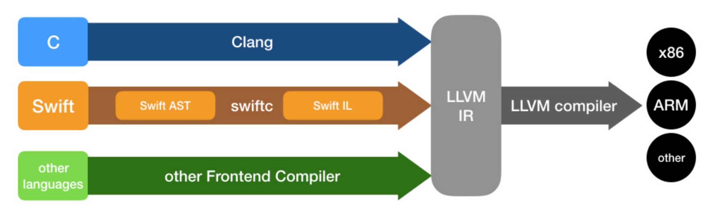
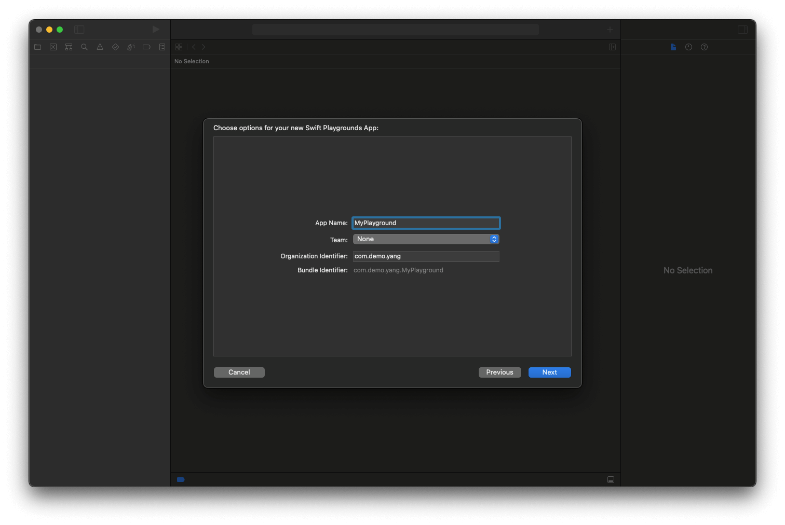

# Swift 版本历史


Swift 从2014年至今发布了多个版本，其中有 5 大版本，[查看当前版本](https://github.com/apple/swift/releases)。而 Objective-C 从80年代至今，只有两个版本。2015年12月 Swift 正式[开源](https://github.com/apple/swift)。

<!-- more -->

* Swift 2

  * Error handling 增强
  * guard 语法
  * 协议支持扩展

* Swift 3

  * 新的 GCD 和 Core Graphics
  * NS 前缀从老的 Foundation 类型中移除
  * 内联序列函数 sequence
  * 新增 filePrivate 和 open 两个权限控制
  * 移除了诸多弃用的特性，如 `++`、`-- `运算符等

* Swift4

  * extension 中可以访问 private 的属性
  * 类型和协议的组合类型
  * Associated Type 可以追加 Where 约束语句
  * 新的 Key Paths 语法
  * 下标支持泛型
  * 字符串增强

* Swift5

  * ABI 稳定
  * Raw strings
  * 标准库新增 Result
  * 定义了与 Python 或 Ruby 等脚本语言互操作的动态可调用类型

# Swift VS Objective-C

## 编程范式

* Swift 可以面向协议编程、函数式编程、面向对象编程。
* Objective-C 以面向对象编程为主，当然也可以通过引入 ReactiveCocoa 类库进行函数式编程。

## 类型安全

* Swift 是一门类型安全的语言，在代码中要求清楚明确值的类型。Swift 会在代码编译的时候做类型检查，并且把所有不匹配的类型作为一个错误标记出来。如果代码中使用一个字符串 String，在传递一个整型 Int 给它时，编译器就会报错。
* Objective-C 虽然在编译时也会做类型检查，但是只会给出警告提示，并不会报错。比如声明一个 NSString 变量，可以传一个 NSNumber 给它，并且可以将它作为 NSNumber 用。

## 值类型增强

* 在 Swift 中，struct、enum 和 tuple 都是值类型，并且 Int、Double、Float、String、Array、Dictionary、Set 也都是用结构体实现的，都是值类型。
* Objective-C 中，NSNumber、NSString 以及集合类对象都是指针类型。

## 枚举增强

* Swift 的枚举可以使用整型、浮点型、字符串等，还能拥有属性和方法，甚至支持泛型、协议、扩展等等。
* Objective-C 里面的枚举则没有这些功能。

## 泛型

* Swift 中支持泛型，也支持泛型的类型约束等特性。
* 苹果推出了 Swift2.0 版本时，也为 Objective-C 带来了 泛型支持。

## 协议和扩展

* Swift 对协议的支持更加丰富，配合扩展（extension）、泛型、关联类型等可以实现面向协议编程，从而大大提高代码的灵活性。同时，Swift 中的 Protocol 还可以用于值类型，如结构体和枚举。
* Objective-C 的协议缺乏强约束，提供的 optional 特性往往成为很多问题的来源，而如果放弃 optional 又会让实现代价过大，每次调用代理方法前，都需要判断代理方法是否实现。

## 函数和闭包

* Swift 里函数是一等公民，可以直接定义函数类型变量，可以作为其它函数参数传递，可以作为函数返回值返回。
* Objective-C 里函数是次等公民，需要 selector 封装或者使用 block 才能模拟 Swift 中类似的效果。

# Swift 命令行编译



## LLVM  


上图是经典的 LLVM 三段式架构，分为前端（Frontend）、优化器（Optimizer）和后端（Backend）。当需要支持新语言时，只需要实现实现前端部分，需要支持新的架构只需要实现后端部分，而前后端的连接枢纽就是 IR（Intermediate Representation），IR 独立于编程语言和机器架构，所以 IR 阶段的优化可以做到抽象而通用。

LLVM 是架构编译器的框架系统，以 C++ 编写而成，用于优化任意程序语言编写的程序的编译时间（compile-time）、链接时间（link-time）、运行时间（run-time）以及空闲时间（idle-time）。对开发者保持开放，并兼容已有脚本。  

对于 iOS 系统，Objective-C 语言前端使用 Clang 编译器，而 Swift 语言前端使用 Swiftc 编译器。编译器将代码编译成 IR 中间代码，交给 LLVM 进行优化，接着交给代码生成器生成机器语言，最终生成 .o 机器执行文件。

## 编译过程


## Swiftc

1. 编译生成可执行文件
```
swiftc -o main.out main.swift
```

2. 生成抽象语法树（Swift Abstract Syntax Tree 【AST】）
```
swiftc main.swift -dump-ast
```

3. 生成中间语言（Swift Intermediate Language 【SIL】）
```
swiftc main.swift -emit-sil
```

4. 生成中间表示层语言（LLVM Intermediate Representation 【LLVM IR】）
```
swiftc main.swift -emit-ir
```

5. 生成汇编语言（Assembly Language）
```
swiftc main.swift -emit-assembly
```

# Swift REPL

Read Eval PrintLoop，简称 REPL。是 Xcode 6.1 引入的另外一种以交互式的方式体验 Swift 的方法。

进入 REPL：


运行代码：


定义函数实现和函数调用：


ps：在函数实现部分，如果需要换行，使用 `Control + enter`。大括号需要敲一个，回车后编写完代码，在敲入最后一个。

## 常用命令
* 退出 `:quit`
* 帮助 `:help`
* 将光标移动到当前行的开始处 `Control+A`
* 将光标移动到当前行的结束处 `Control+E`  


# Playground





参考博文：  
[Swift：编译流程](https://www.jianshu.com/p/ba7b80f181f6)  
[Swift编译流程 & Swift类](https://www.jianshu.com/p/e917bf0e8a7d)  
[Swift 编译过程](https://www.jianshu.com/p/771604d38f0e)