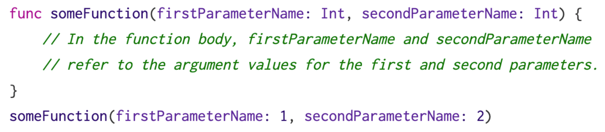
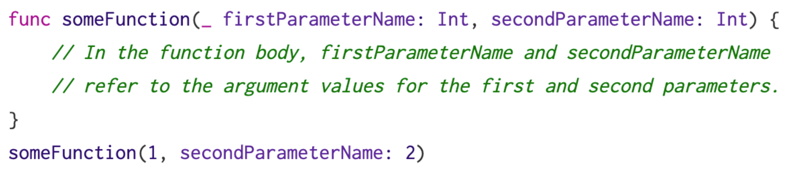
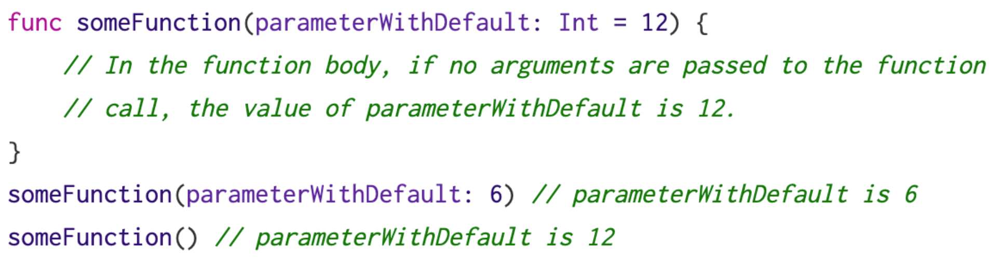
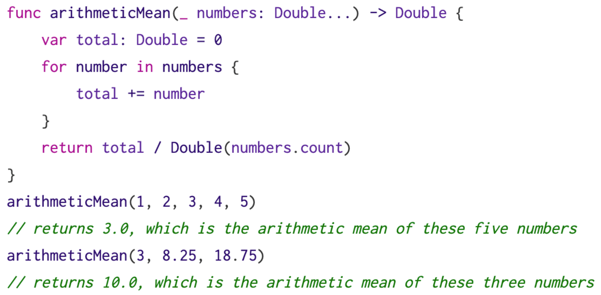
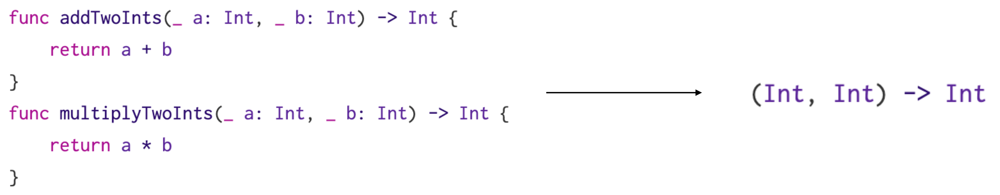
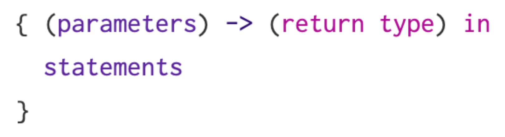
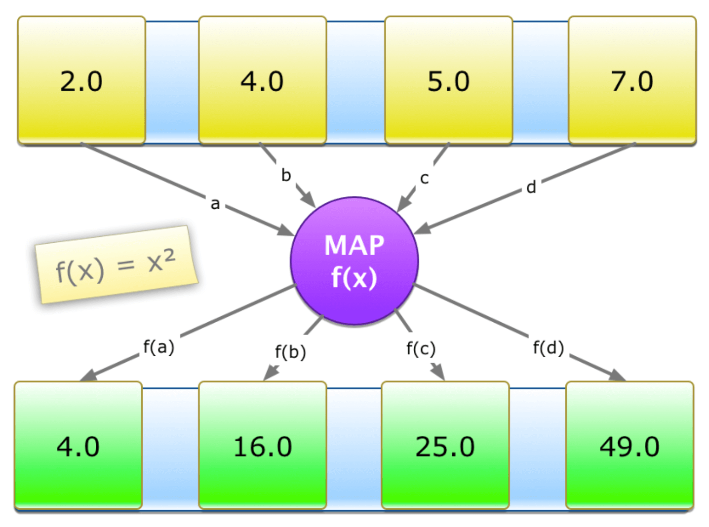
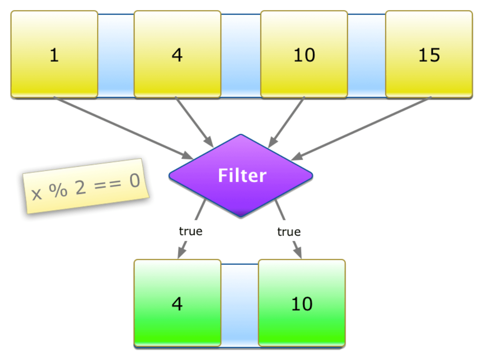
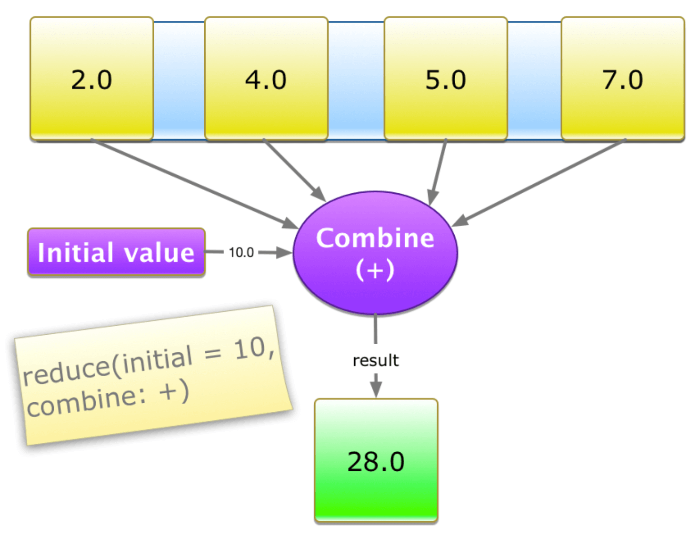

* [函数的定义](#函数的定义)
* [函数实际参数标签和形式参数名](#函数实际参数标签和形式参数名)
* [函数类型和内嵌函数](#函数类型和内嵌函数)
* [闭包](#闭包)
* [高阶函数](#高阶函数)
* [函数式编程](#函数式编程)
* [并行](#并行)

<!-- more -->

## 函数的定义

函数是一个独立的代码块，用来执行特定的任务。通过给函数一个名字来定义它的功能，并且在需要的时候，通过这个名字来“调用”函数执行它的任务。

### 定义和调用函数

在定义一个函数时，可以定义一个或者多个被命名的分类的值，作为函数的输入（形式参数）。在函数完成后，也可以定义将要传回的值作为输出的类型（返回类型）。

每一个函数都有一个函数名，它描述了函数执行的任务。要使用一个函数，可以通过“调用”函数的名字并且传入符合函数形式参数类型的输入值（实际参数）来调用这个函数。给函数提供的实际参数的顺序必须符合函数的形式参数列表顺序。

```swift
import Foundation

func greet(person: String) -> String {
    let greeting = "Hello, " + person + "!"
    return greeting
}

greet(person: "zhangsan")
// Prints 'Hello, zhangsan!'
```

### 无形式参数的函数

函数没有要求必须输入一个参数，可以没有形式参数。函数的定义需要在名字后边加一个圆括号`()`，即使在不接受形式参数时也得这样做。当函数被调用的时候同样要在函数的名字后边加一个空的圆括号`()`。

```swift
func sayHello() -> String {
    return "hello"
}
print(sayHello())
// Prints 'hello'
```

### 多形式参数的函数

函数可以输入多个形式参数，写在函数后边的圆括号内，用逗号分隔。

```swift
func greetAgain(person: String) -> String {
    return "Hello again, \(person)"
}

func greet(person: String) -> String {
    return "Hello, \(person)"
}

func greet(person: String, alreadyGreeted: Bool) -> String {
    if alreadyGreeted {
        return greetAgain(person: person)
    } else {
        return greet(person: person)
    }
}

print(greet(person: "Kevin", alreadyGreeted: true))
// Prints 'Hello again, Kevin'
```

### 无返回值的函数

函数定义中没有要求必须有一个返回类型。不需要返回值，函数在定义的时候就没有包含返回箭头`->`或者返回类型。

严格来讲，尽管函数 `greet(person:)`没有定义返回值，但是它还是有一个返回值的。没有定义返回类型的函数实际上会返回一个特殊的类型 `Void`，它是一个空的元组，作用相当于没有元素的元组，可以写作 `()`。

```swift
func greet(person: String) {
    print("Hello, \(person)")
}

print(greet(person: "kevin"))
```

打印结果：

```js
Hello, kevin
()
```

### 多返回值的函数

为了让函数返回多个值作为一个复合的返回值，可以使用元组类型作为返回类型。

```swift
func minMax(array: [Int]) -> (min: Int, max: Int)? {
    var currentMin = array[0]
    var currentMax = array[0]
    for value in array[1..<array.count] {
        if value < currentMin {
            currentMin = value
        } else if value > currentMax {
            currentMax = value
        }
    }
    return (currentMin, currentMax)
}

if let bounds = minMax(array: [8, -6, 2, 109, 3, 711]) {
    print("min is \(bounds.min) and max is \(bounds.max)")
}
// Prints 'min is -6 and max is 711'
```

### 可选元组返回类型

如果函数返回的元组可能“没有值”，可以用一个**可选元组返回类型**来表示整个元组可能是 `nil`。写法是在可选元组类型的圆括号后边添加一个问号`?`，例如：`(Int, Int)?` 或者 `(String, Int, Bool)?`。

```swift
func minMax(array: [Int]) -> (min: Int, max: Int)? {
    if array.count == 0 {
        return nil
    }
    var currentMin = array[0]
    var currentMax = array[0]
    for value in array[1..<array.count] {
        if value < currentMin {
            currentMin = value
        } else if value > currentMax {
            currentMax = value
        }
    }
    return (currentMin, currentMax)
}

print(minMax(array: []))
// Prints 'nil'
```

### 隐式返回的函数

如果整个函数体是一个单一表达式，那么函数隐式返回这个表达式，不需要 return 关键字。

```swift
func greeting(for person: String) -> String {
    "Hello, " + person + "!"
}
print(greeting(for: "Kevin"))
// Prints 'Hello, Kevin!'
```

上面的写法等价于👇

```swift
func anotherGreeting(for person: String) -> String {
    return "Hello, " + person + "!"
}
print(anotherGreeting(for: "Kevin"))
// Prints 'Hello, Kevin!'
```

## 函数实际参数标签和形式参数名

形式参数：值形式参数、变量形式参数。函数或过程**定义时的参数**为形式参数。
实际参数：函数或过程**调用时的参数**为实际参数。

### 实参标签和形参名

每一个函数的**形式参数**都包含**实际参数标签**和**形式参数名**。实际参数标签用在调用函数的时候，在调用函数的时候每一个**实际参数**前边都要写**实际参数标签**。形式参数名用在函数的实现当中，默认情况下，形式参数使用**形式参数名**作为**实际参数标签**。所有的形式参数必须有唯一的名字。尽管多个形式参数拥有相同的实际参数标签也是有可能的，但是唯一的实际参数标签有助于让代码更加易读。

参数由形式参数名代替实际参数标签👇



```swift
func someFunction(【形式参数名】: Int, 【形式参数名】: Int) {
    print("\(【形式参数名】), \(【形式参数名】)")
}

someFunction(【形式参数名】：【实际参数】, 【形式参数名】：【实际参数】)
```

### 指定实际参数标签

在提供形式参数名之前写实际参数标签，用空格分隔。如果为一个形式参数提供了实际参数标签，那么这个实际参数就必须在调用函数的时候使用标签。实际参数标签的使用能够让函数的调用更加明确，更像是自然语句，同时还能提供更可读的函数体并更清晰的表达函数的意图。

```swift
func greet(person: String, from hometown: String) -> String {
    return "Hello \(person)! Glad you could visit from \(hometown)."
}

print(greet(person: "Kevin", from: "Cupertion"))
// Prints 'Hello Kevin! Glad you could visit from Cupertion.'
```

```swift
func greet(【形式参数名】: String, 【实际参数标签】【形式参数名】: String) -> String {
    return "Hello \(【形式参数名】)! Glad you could visit from \(【形式参数名】)."
}

someFunction(【形式参数名】：【实际参数】, 【实际参数标签】：【实际参数】)
```

### 省略实际参数标签

如果对于函数的形式参数不想使用实际参数标签的话，可以**利用下划线 `_` 来代替显示的实际参数标签**。

第一个参数不使用实际参数标签，第二个参数由形式参数名代替实际参数标签👇



```swift
func someFunction(_ firstParameterName: Int, secondParameterName: Int) {
    print(firstParameterName, secondParameterName)
}

someFunction(1, secondParameterName: 2)
// Prints '1 2'
```

### 默认形式参数值

给形式参数定义默认值：在形式参数类型后赋一个值作为默认值。如果定义了默认值，在调用函数时可以省略这个形式参数。



```swift
func someFunction(parameterWithDefault: Int = 12) {
    print(parameterWithDefault)
}

someFunction(parameterWithDefault: 6) // Prints '6'
someFunction() // Prints '12'
```

### 可变形式参数

在形式参数的**类型名称后边**插入三个点符号`...`来书写可变形式参数。`...`（可变形式参数）声明形式参数可以被传入值的数量是可变的。一个可变形式参数可以接受零或者多个特定类型的值，传入到可变参数中的值在函数体内被当作是对应类型的数组。



```swift
func arithmeticMean(_ numbers: Double...) -> Double {
    var total: Double = 0
    for number in numbers {
        total += number
    }
    return total / Double(numbers.count)
}

print(arithmeticMean(1, 2, 3, 4, 5)) //Prints '3.0'
print(arithmeticMean(3, 8.25, 18.75)) //Prints '10.0'
```

### 输入输出形式参数

在定义形式参数时，**在前边添加一个 `inout`** 关键字可以定义一个输入输出形式参数。输入输出形式参数有一个能输入给函数的值，函数能对其进行修改，还能输出到函数外边替换原来的值。**只能把变量作为输入输出形式参数的实际参数**。在调用函数时，将变量作为实际参数传递给输入输出形式参数，直接在它前边添加一个和符号`&`来明确可以被函数修改。**输入输出形式参数不能有默认值，可变形式参数不能标记 inout**。

```swift
func swapTowInts(_ a: inout Int, _ b: inout Int) {
    let temp = a
    a = b
    b = temp
}

var someInt = 3
var anotherInt = 107
swapTowInts(&someInt, &anotherInt)
print("someInt is \(someInt), anotherInt is \(anotherInt)")
//Prints 'someInt is 107, anotherInt is 3'
```

### 值形式参数

值形式参数也可以叫做常量形式参数。

值形式参数的作用：值形参从与它位置对应的实参中接收数据，并把数据传送到所在的函数中。

📢注意：当函数被调用时，系统为每个值形参开辟临时的存储单元，并按从左到右的顺序，把实在参数的值——赋给对应位置上的形式参数。值形参作为子程序的局部变量，当函数返回程序后，值形参的存储单元释放。

### 变量形式参数

必须在形参名的前面加上 `var`。

变量形参的作用：变量形参可以将子程序调用过程中产生的值返回调用它的程序。

📢注意：当函数被调用时，系统并不会为变量形参开辟临时的存储单元，而是让它们和对应的实参共用存储单元。也就是说，调用函数时是将实参的地址传递给对应的变量形参。

### 值形式参数和变量形式参数的区别

1. 在函数调用时，值形式参数所对应的实参必须有确定的值，而变量形参所对应的实参的值是否确定并不会影响调用的执行。
2. 子啊函数被调用后，值形参所对应的实参的值保持不变，而变量形参所对应的实参的值会发生改变。

## 函数类型和内嵌函数

### 函数类型

每一个函数都有一个特定的函数类型，它由**形式参数类型**和**返回类型**组成。



### 使用函数类型

使用函数类型和使用Swift中的其他类型一样，可以给一个变量或者常量定义一个函数类型，并且为该常量或变量指定一个相应的函数。

```swift
func addTwoNumber(num1: Int, num2: Int) -> Int {
    return num1 + num2;
}

var mathFunction: (Int, Int) -> Int = addTwoNumber
print(mathFunction(1, 1));
```

### 函数类型作为形式参数类型

可以使用一个函数的类型例如 `(Int, Int) -> Int` 作为其他函数的形式参数类型。这种方式允许开发者预留函数的部分实现，从而让函数的调用者在调用函数的时候提供。

```swift
func printMathResult(_ mathFunction: (Int, Int) -> Int, _ a: Int, _ b: Int) {
    print("Result: \(mathFunction(a, b))")
}
printMathResult(addTwoInts, 1, 1) //Prints 'Result: 2'

func addTwoInts(num1: Int, num2: Int) -> Int {
    num1 + num2
}
```

### 函数类型作为返回类型

可以使用函数的类型作为另一个函数的返回类型。写法是在函数的返回箭头`->`后立即写一个完整的函数类型。

```swift
func stepForward(_ input: Int) -> Int {
    return input + 1
}

func stepBackward(_ input: Int) -> Int {
    return input - 1
}

func chooseStepFunction(backwards: Bool) -> (Int) -> Int {
    return backwards ? stepBackward : stepForward
}

var currentValue = 3
let moveNearerToZero = chooseStepFunction(backwards: currentValue > 0)

print("Counting to zero:")
while currentValue != 0 {
    print("\(currentValue)...")
    currentValue = moveNearerToZero(currentValue)
}
print("zero!")
```

打印结果：

```js
Counting to zero:
3...
2...
1...
zero!
```

### 内嵌函数

内嵌函数：在一个函数体内定义一个函数，称为内嵌函数。

内嵌函数在默认情况下是对外隐藏的，可以通过包裹它们的函数来调用它们。同时包裹函数也可以返回它内部的内嵌函数，来实现在另外的范围使用它。

```swift
func chooseStepFunction(backward: Bool) -> (Int) -> Int {
    func stepForward(input: Int) -> Int { return input + 1 }
    func stepBackward(input: Int) -> Int { return input - 1}
    return backward ? stepBackward : stepForward
}

var currentValue = -4
let moveNearerToZero = chooseStepFunction(backward: currentValue > 0)

print("Counting to zero:")
while currentValue != 0 {
    print("\(currentValue)")
    currentValue = moveNearerToZero(currentValue)
}
print("zero!")
```

打印结果：

```js
Counting to zero:
-4
-3
-2
-1
zero!
```

## 闭包

闭包是可以在代码中被传递和引用的功能性独立代码块。

闭包能够捕获和存储定义在其上下文中的任何常量和变量的引用，这也就是所谓的**闭合并包裹**那些常量和变量，因此被称为“闭包”。Swift 能够处理所有关于捕获的内存管理的操作。

在函数章节中介绍的全局和内嵌函数，实际上是特殊的闭包。闭包符合如下三种形式中的一种：

1. 全局函数是一个**有名字**但**不能捕获值**的闭包；
2. 内嵌函数是一个**有名字**且**能捕获值**（从其上层函数）的闭包；
3. 闭包表达式是一个**没有名字**且**能捕获值**（其上下文中常量或变量的值）的闭包。

### 闭包表达式

闭包表达式是一种在简短行内就能写完闭包的语法。

### 闭包表达式-从 sorted 函数说起

Swfit 的标准库提供了一个叫做 `sorted(by:)` 的方法，该方法会根据调用者提供的排序闭包将已知类型的数组的值进行排序。在排序完成后，`sorted(by:)` 方法会返回与原数组类型大小完全相同的一个**新数组**，新数组的元素是已排序好的。原始数组不会被 `sorted(by:)` 方法修改。

```swift
let names = ["zhangsan", "lisi", "wangwu", "zhaoliu"]
func backward(_ s1: String, _ s2: String) -> Bool {
    return s1 > s2
}

var reversedNames = names.sorted(by: backward)
print(reversedNames)
//Prints '["zhaoliu", "zhangsan", "wangwu", "lisi"]'
```

### 闭包表达式语法



闭包表达式语法能够使用常量形式参数、变量形式参数和输入输出形式参数，但不能提供默认值。可变形式参数也能使用，但需要在形式参数列表的最后面使用。元组也可被用来作为形式参数和返回类型。

### 闭包表达式语法版本的backward

将上面的 `backward(_:_:)` 函数改为闭包表达式版本：

```swift
let names = ["zhangsan", "lisi", "wangwu", "zhaoliu"]
var reversedNames = names.sorted(by: { (s1: String, s2: String) -> Bool in
    return s1 > s2
})
print(reversedNames)
//Prints '["zhaoliu", "zhangsan", "wangwu", "lisi"]'
```

### 从语境中推断类型

因为排序闭包作为实际参数传递给函数，所以 Swift 能推断函数的形式参数类型和返回类型。

`sorted(by:)` 方法期望它的形式参数是一个 `(String, String) -> Bool` 类型的函数。这意味着 `(String, String)` 和 `Bool` 类型不需要被写成闭包表达式定义中的一部分。因为所有的类型都能被推断，所以**返回箭头 `->`** 和围绕在**形式参数名周围的括号**也能被省略。

```swift
let names = ["zhangsan", "lisi", "wangwu", "zhaoliu"]
var reversedNames = names.sorted(by: { s1, s2 in
    return s1 > s2
})
//Prints '["zhaoliu", "zhangsan", "wangwu", "lisi"]'
```

### 从单表达式闭包隐式返回

单表达式闭包能够从它们的声明中删掉 return 关键字，通过这种方式来隐式返回单个表达式的结果。

同隐式返回的函数，如果整个函数体是一个单一表达式，那么函数隐式返回这个表达式，不需要 return 关键字。

```swift
let names = ["zhangsan", "lisi", "wangwu", "zhaoliu"]
var reversedNames = names.sorted(by: { s1, s2 in
    s1 > s2
})
print(reversedNames)
//Prints '["zhaoliu", "zhangsan", "wangwu", "lisi"]'
```

也可以简写为：

```swift
var reversedNames = names.sorted(by: { s1, s2 in s1 > s2 })
```

### 简写实际参数名

Swift 自动对行内闭包提供简写实际参数名，可以通过 `$0`，`$1`，`$2` 等名字来引用闭包的实际参数值。

```swift
let names = ["zhangsan", "lisi", "wangwu", "zhaoliu"]
var reversedNames = names.sorted(by: { $0 > $1 })
print(reversedNames)
```

### 运算符函数

Swift 的 String 类型定义了关于大于号 `>` 的特定字符串实现，让其作为一个有两个 String 类型形式参数的函数并返回一个 Bool 类型的值（`(String, String) -> Bool`）。这与 `sorted(by:)` 方法的形式参数需要的函数相匹配。因此，简单的传递一个大于号 `>`，Swift 将推断想使用大于号特殊字符串函数实现。

```swift
let names = ["zhangsan", "lisi", "wangwu", "zhaoliu"]
var reversedNames = names.sorted(by: > )
print(reversedNames)
//Prints '["zhaoliu", "zhangsan", "wangwu", "lisi"]'
```

### 尾随闭包

如果需要将一个很长的闭包表达式作为函数最后一个实际参数传递给函数，使用尾随闭包将增强函数的可读性。尾随闭包是一个被书写在函数形式参数的括号外面（后面）的闭包表达式。

```swift
let names = ["zhangsan", "lisi", "wangwu", "zhaoliu"]
var reversedNames = names.sorted{ $0 > $1 }
print(reversedNames)
//Prints '["zhaoliu", "zhangsan", "wangwu", "lisi"]'
```

### 捕获值

一个闭包能够从上下文捕获已被定义的常量和变量。即使在定义这些常量和变量的原作用域已经不存在时，闭包仍能够在其函数体内引用和修改这些值。

```swift
func makeIncrementer(forIncrement amount: Int) -> () -> Int {
    var runingTotal = 0
    func incrementer() -> Int {
        runingTotal += amount
        return runingTotal
    }
    return incrementer
}

let incrementByTen = makeIncrementer(forIncrement: 10)
incrementByTen() // 10
incrementByTen() // 20
incrementByTen() // 30
```

作为一种优化，**如果被捕获的值没有改变，Swift 会使用这个值的拷贝而不是捕获**。Swift 也处理了变量的内存管理操作，当变量不再需要时会被释放。

如果建立了第二个 incrementer，它将会有一个新的、独立的 `runningTotal` 变量的引用。

```swift
func makeIncrementer(forIncrement amount: Int) -> () -> Int {
    var runingTotal = 0
    func incrementer() -> Int {
        runingTotal += amount
        return runingTotal
    }
    return incrementer
}

let incrementByTen = makeIncrementer(forIncrement: 10)
incrementByTen() // 10

let incrementBySeven = makeIncrementer(forIncrement: 7)
incrementBySeven() // 10

incrementByTen() // 20
```

### 闭包是引用类型

在 Swift 中，函数和闭包都是引用类型。当赋值一个函数或者闭包给一个常量或者变量时，其实是将常量和变量设置为对函数和闭包的引用。

```swift
func makeIncrementer(forIncrement amount: Int) -> () -> Int {
    var runingTotal = 0
    func incrementer() -> Int {
        runingTotal += amount
        return runingTotal
    }
    return incrementer
}

let incrementByTen = makeIncrementer(forIncrement: 10)
incrementByTen() // 10

let alsoIncrementByTen = incrementByTen
alsoIncrementByTen() // 20
```

📢注意：关于闭包的循环引用问题。如果分配一个闭包给类实例的属性，同时闭包通过引用该实例或者它的成员来捕获了该实例，则会在闭包和实例之间产生**循环引用**（实例持有闭包，闭包持有实例）。

### 逃逸闭包和自动闭包

#### 逃逸闭包

当闭包作为一个实际参数传递给一个函数的时候，并且它会在函数返回之后调用，我们就说这个闭包逃逸了。声明一个函数，让它接收闭包作为形式参数时，可以在形式参数前写 `@escaping` 来明确闭包是允许逃逸的。

逃逸闭包的一种实现方法——被存储在一个变量里，该变量定义于函数外。如异步任务完成后的回调，函数通过接收闭包作为实际参数，来实现在启动异步任务完成后的回调。函数在启动异步任务后就返回了，而闭包会在异步任务完成后才返回，即**为了稍后再调用，闭包需要逃逸**。

```swift
// 闭包容器
var completionHandlers: [() -> Void] = []
// 添加逃逸闭包
func someFunctionWithEscapingClosure(completionHandler: @escaping () -> Void) {
    completionHandlers.append(completionHandler)
}

// 直接调用闭包
func someFunctionWithNoneEscapingClosure(closure: () -> Void) {
    closure()
}

class SomeClass {
    var x = 10
    func doSomething() {
        someFunctionWithEscapingClosure {
            self.x = 100
        }
        someFunctionWithNoneEscapingClosure {
            x = 200
        }
    }
}

let instance = SomeClass()
instance.doSomething()
print(instance.x) 
//Prints '200'

// 获取闭包容器中的第一个逃逸闭包，并调用（需要时才被调用的闭包——逃逸闭包）
completionHandlers.first?()
print(instance.x) 
//Prints '100'
```

让闭包逃逸意味着必须在表中显示的引用 `self`，即让闭包持有 `self`，才能实现对 `self.x` 的修改。

#### 自动闭包

因为闭包允许延迟处理，所以闭包内部的代码块直到调用闭包的时候才会运行。对于有副作用或者占用资源的代码来说很有用，因为它可以控制代码何时才进行求值。

```swift
var customersInLine = ["Chris", "Alex", "Ewa", "Barry", "Daniella"]
print(customersInLine.count)
//Prints '5'

// 创建闭包
let customerProvider = {
    customersInLine.remove(at: 0)
}
print(customersInLine.count)
//Prints '5'

// 调用闭包
print("Now serving \(customerProvider())!")
//Prints 'Now serving Chris!'

print(customersInLine.count)
//Prints '4'
```

在传一个闭包作为实际参数给函数的时候，会得到与延迟处理相同的行为。

```swift
// customersInLine is ["Alex", "Ewa", "Barry", "Daniella"]
func serve(customer customerProvider: () -> String) {
    print("Now serving \(customerProvider())!")
}
serve(customer: { customersInLine.remove(at: 0) })
//Prints 'Now serving Alex!'
```

通过 `@autoclosure` 标记形式参数使用了自动闭包。使用 `@autoclosure` 标记后，调用函数传递参数更像是传递 String 实际参数一样，而不是在传递一个闭包。因为 `customerProvider` 形式参数的类型被标记为 `@autoclosure`，所以实际参数会自动转换为闭包（自动加上大括号`{ 实际参数 }`）。

👇下面这种实现方式，跟上面相同👆：

```swift
// customersInLine is ["Ewa", "Barry", "Daniella"]
func serve(customer customerProvider: @autoclosure () -> String) {
    print("Now serving \(customerProvider())!")
}
serve(customer: customersInLine.remove(at: 0))
//Prints 'Now serving Ewa!'
```

小结：

1. 自动闭包是一种自动创建的闭包，用来把作为实际参数传递给函数的表达式打包成闭包。自动闭包不接受任何实际参数，并且当它被调用时，它会返回内部打包的表达式的值。

2. 这个语法的好处在于通过书写普通表达式代替显示闭包，从而省略包围形式参数的括号`{}`。

#### 自动+逃逸

```swift
// customersInLine is ["Barry", "Daniella"]
var customerProviders: [() -> String] = []
func collectCustomerProviders(_ customerProvider: @autoclosure @escaping () -> String) {
    // 逃逸
    customerProviders.append(customerProvider)
}
// 自动
collectCustomerProviders(customersInLine.remove(at: 0))
collectCustomerProviders(customersInLine.remove(at: 0))

print("Collected \(customerProviders.count) closures.")
// Prints "Collected 2 closures."

for customerProvider in customerProviders {
    print("Now serving \(customerProvider())!")
}
// Prints "Now serving Barry!"
// Prints "Now serving Daniella!"
```

## 高阶函数

### map

实现：对于原始集合里的每一个元素，以一个变换后的元素替换它，形成一个**新的集合**。



```swift
let numbers = [2.0, 4.0, 5.0, 7.0]
print(numbers.map { $0 * $0 })
// Prints "[4.0, 16.0, 25.0, 49.0]"
```

📢注意：调用 `map` 函数返回的是一个新的集合。

```swift
let numbers = [2.0, 4.0, 5.0, 7.0]
print(numbers.map { $0 * 10 })
// Prints "[20.0, 40.0, 50.0, 70.0]"
print(numbers)
// Prints "[2.0, 4.0, 5.0, 7.0]"
```

### filter

实现：对于原始集合里的每一个元素，通过判断来将其丢弃或者保存到新的集合里。



```swift
let numbers = [1, 4, 10, 15]
print(numbers.filter { $0 % 2 == 0 })
// Prints "[4, 10]"
```

### reduce

实现：对于原始集合里的每一个元素，作用于当前累计的结果上。



```swift
let numbers = [2.0, 4.0, 5.0, 7.0]
print(numbers.reduce(10) { $0 + $1})
// Prints "28.0"
```

### flatMap

实现：对于二级集合（元素是集合的集合），可以得到单级的集合。

```swift
let results = [[1, 2, 3], [4, 5, 6], [7, 8, 9]]
// 所有的元素乘以10
let allResults = results.flatMap { $0.map { $0 * 10 }}
// 获取所有大于5的元素
let passMarks = results.flatMap { $0.filter { $0 > 5 }}
print(allResults)
// Prints "[10, 20, 30, 40, 50, 60, 70, 80, 90]"
print(passMarks)
// Prints "[6, 7, 8, 9]"
```

### compactMap

实现：过滤空值。

```swift
let keys: [String?] = ["zhangsan", nil, "lisi", "wangwu"]
// 获取不为空的字符串
let validNames = keys.compactMap { $0 }
print(validNames)
// Prints "["zhangsan", "lisi", "wangwu"]"

// 获取字符串长度
let counts = keys.compactMap { $0?.count }
print(counts)
// Prints "[8, 4, 6]"
```

## 函数式编程

### 函数式编程1

#### 范式转换

实现：读入一个文本文件，确定所有单词的使用频率并从高到低排序，打印出所有单词及其频率的排序列表。

>这道题目出自计算机科学史上的著名事件，当年 Communications of the ACM 杂志 “Programming Pearls” 专栏的作者 Jon Bentley 向计算机先去 Donald Knuth 提出的挑战。

#### 传统解决方案

```swift
let NON_WORDS: Set = ["the", "and", "of", "to", "a", "i", "it", "in", "or", "is", "as", "so", "but", "be"]

func wordFreq(words: String) -> [String: Int] {
    var wordDict: [String: Int] = [:]
    let wordList = words.split(separator: " ")
    for word in wordList {
        let lowerCaseWord = word.lowercased()
        if !NON_WORDS.contains(lowerCaseWord) {
            if let count = wordDict[lowerCaseWord] {
                wordDict[lowerCaseWord] = count + 1;
            } else {
                wordDict[lowerCaseWord] = 1;
            }
        }
    }
    return wordDict
}

let words = """
There are moments in life when you miss someone so much that you just want to pick them from your dreams and hug them for real Dream what you want to dream go where you want to go be what you want to be because you have only one life and one chance to do all the things you want to do
"""
print(wordFreq(words: words))
```

打印结果：

```js
["chance": 1, "go": 2, "do": 2, "life": 2, "for": 1, "that": 1, "you": 7, "dreams": 1, "what": 2, "things": 1, "real": 1, "someone": 1, "have": 1, "them": 2, "much": 1, "pick": 1, "when": 1, "only": 1, "there": 1, "dream": 2, "want": 5, "moments": 1, "from": 1, "one": 2, "just": 1, "because": 1, "miss": 1, "are": 1, "your": 1, "hug": 1, "where": 1, "all": 1]
```

#### 函数式

```swift
let NON_WORDS: Set = ["the", "and", "of", "to", "a", "i", "it", "in", "or", "is", "as", "so", "but", "be"]

func wordFreq(words: String) -> [String: Int] {
    var wordDict : [String: Int] = [:]
    let wordList = words.split(separator: " ")
    wordList.map { $0.lowercased()}
        .filter { !NON_WORDS.contains($0) }
        .forEach { word in
            wordDict[word] = (wordDict[word] ?? 0) + 1
        }
    return wordDict
}
print(wordFreq2(words: words))

let words = """
There are moments in life when you miss someone so much that you just want to pick them from your dreams and hug them for real Dream what you want to dream go where you want to go be what you want to be because you have only one life and one chance to do all the things you want to do
"""
print(wordFreq(words: words))
```

打印结果：

```js
["because": 1, "moments": 1, "much": 1, "life": 2, "are": 1, "you": 7, "want": 5, "dream": 2, "dreams": 1, "your": 1, "from": 1, "things": 1, "hug": 1, "chance": 1, "do": 2, "miss": 1, "what": 2, "real": 1, "where": 1, "when": 1, "pick": 1, "for": 1, "all": 1, "just": 1, "there": 1, "them": 2, "that": 1, "go": 2, "only": 1, "one": 2, "someone": 1, "have": 1]
```

#### 小结

1. 命令式编程风格尝尝迫使我们出于性能考虑，把不同的任务交织起来，以便能够**用一次循环来完成多个任务**。
2. 函数式编程用 `map()`、`filter` 这些高阶函数，让开发者**站在更高的抽象层次上去考虑问题**，把问题看的更清楚。

#### 简洁

1. 面向对象编程通过**封装不确定因素**来是代码能够被人理解。函数式编程通过**尽量减少不确定因素**来是代码能被人理解。

2. 在面向对象的命令式编程语言里面，重用的单元是类和类之间沟通用的消息。函数式编程语言实现重用的思路很不一样。函数式语言提倡在有限的几种关键数据结构（如 list、set、map）上，运用针对这些数据结构高度优化过的操作，以此构成基本的运转机构。开发者再根据具体用途，插入自己的数据结构和高阶函数去调整机构的运转方式。

3. 比起一味地创建新的类结构体系，把封装的单元降低到函数级别，更有利于达到**细粒度的、基础层面**的重用。函数式开发者喜欢用少数几个核心数据结构，围绕它们去建立一套充分优化的运转机构。面向对象开发者喜欢**不断地创建新的数据结构和附属的操作**，因为压倒一切的面向对象编程范式就是穿件新的类和类间的消息。**把所有的数据结构都封装成类，一方面压制了方法层面的重用，另一方面鼓励大粒度的框架式的重用**。函数式编程的程序构造更方便**在比较细小的层面上重用代码**。

### 函数式编程2

实现：假设我们有一个名字列表，其中一些条目由单个字符串构成。现在的任务是，将除去单字符条目外的列表内容，放在一个逗号分隔的字符串里返回，且每个名字的首字母都要大写。

#### 命令式解法

命令式编程是按照“**程序是一系列改变状态的命令**”来建模的一种编程风格。传统的 for 循环是命令时风格的绝好例子：先确定初始状态，然后每次迭代都执行循环体中的一系列命令。

```swift
let employee = ["neal", "s", "stu", "j", "rich", "bob", "aiden", "j", "ethan", "liam", "mason", "noah", "lucas", "jacob", "jack"]

func cleanNames(names: Array<String>) -> String {
    var cleanedNames = ""
    for name in names {
        if name.count > 1 {
            cleanedNames += name.capitalized + ","
        }
    }
    cleanedNames.remove(at: cleanedNames.index(before: cleanedNames.endIndex))
    return cleanedNames
}
print(cleanNames(names: employee))
```

打印结果：

```js
Neal,Stu,Rich,Bob,Aiden,Ethan,Liam,Mason,Noah,Lucas,Jacob,Jack
```

#### 函数式解法

函数式编程**将程序描述为表达式和变换**，以数学方程的形式建立模型，并且尽量避免可变的状态。函数式编程语言对问题的归类不同于命令式语言。如前面所用到的几种操作 `filter`、`transform`、`cover`，**每一种都作为一个逻辑分类，由不同的函数所代表**，这些函数实现了低层次的变换，但依赖于开发者定义的高阶函数作为参数来调整其低层次运转机构的运作。

```swift
let employee = ["neal", "s", "stu", "j", "rich", "bob", "aiden", "j", "ethan", "liam", "mason", "noah", "lucas", "jacob", "jack"]

let cleanedNames = employee.filter{ $0.count > 1}
    .map{ $0.capitalized }
    .joined(separator: ",")
print(cleanedNames)
```

打印结果：

```js
Neal,Stu,Rich,Bob,Aiden,Ethan,Liam,Mason,Noah,Lucas,Jacob,Jack
```

命令式解法在实现部分创建了一个 `cleanedNames` 对象，然后根据不同的判断对其进行修改。而函数式解法中并没有创建一个新的对象，而是通过执行不同的函数，将程序描述为变换，最后直接得到了结果。

## 并行

因为 Swift 的 map 不支持并行，所以上面的命令执行串行的。可以为 Swift 扩展一个串行遍历方法，实现 java 中并行 map 的功能。

```swift
let employee = ["neal", "s", "stu", "j", "rich", "bob", "aiden", "j", "ethan", "liam", "mason", "noah", "lucas", "jacob", "jack"]

let cleanedNames = employee.filter{ $0.count > 1}
    .map{ $0.capitalized }
    .joined(separator: ",")
print(cleanedNames)

extension Array where Element: Any {
    func parallelMap<T>(_ transform: (Element) -> T) -> [T] {
        let n = self.count
        if n == 0 {
            return []
        }
        
        var result = ContiguousArray<T>()
        result.reserveCapacity(n)
        
        // 将 iterations 次任务放入到队列中，异步执行。阻塞当前线程直到全部任务完成。
        DispatchQueue.concurrentPerform(iterations: n) { (i) in
            result.append(transform(self[i]))
        }
        
        return Array<T>(result)
    }
}

let result = employee.filter{ $0.count > 1}
    .parallelMap{ $0.capitalized }
    .joined(separator: ",")
print(result)
```

打印结果：

```js
Neal,Stu,Rich,Bob,Aiden,Ethan,Liam,Mason,Noah,Lucas,Jacob,Jack
Stu,Neal,Bob,Rich,Ethan,Aiden,Liam,Mason,Jack,Lucas,Jacob
```

### 线程安全

从打印结果可以看到 `parallelMap` 打印的结构丢了一个元素，这是因为 `parallelMap` 是非线程安全的。通过 NSLock 实现线程安全的 `parallelMap`：

```swift
extension Array where Element: Any {
    
    func parallelMap<T>(_ transform: (Element) -> T) -> [T] {
        let n = self.count
        if n == 0 {
            return []
        }

        var result = ContiguousArray<T>()
        result.reserveCapacity(n)
        // 线程安全方案：加锁
        var lock = NSLock()
        // 将 iterations 次任务放入到队列中，异步执行。阻塞当前线程直到全部任务完成。
        DispatchQueue.concurrentPerform(iterations: n) { (i) in
            lock.lock()
            result.append(transform(self[i]))
            lock.unlock()
        }

        return Array<T>(result)
    }
}
```

## 总结

1. 函数式编程中具有普遍意义的构造单元包括：筛选（`filter`）、映射（`map`）、折叠/化约（`foldLeft`/`reduce`）等等。

2. Swift 统一的函数语法十分灵活，可以表达从简单的无形式参数的 C 风格函数，到复杂的每一个形式参数都带有局部和外部形式参数名的 Object-C 风格方法的任何内容。

3. 形式参数能提供一个默认的值来简化函数的调用，也可以被当做输入输出形式参数被传递，它在函数执行完成时修改传递来的变量。

4. Swfit 中的每一个函数都有类型，由函数的**形式参数类型**和**返回类型**组成，可以像 Swfit 中其它类型那样使用它。这使得能够方便的实现：
   1. 将一个函数当作一个形式参数传递到另外的一个函数中；
   2. 也可以在一个函数中返回另一个函数；
   3. 函数同时也可以写在其它函数内部，在内嵌范围封装有用的功能。