<!-- more -->

# 常量和变量

## 声明常量和变量

* 使用关键字 `let` 来声明常量
```swift
let maxNumber = 10
```

* 使用关键字 `var` 来声明变量
```swift
var currentNumber = 0
```

* 可以在一行中声明多个变量或常量，用逗号分隔
```swift
var x = 0.0, y = 0.0, z = 0.0
```

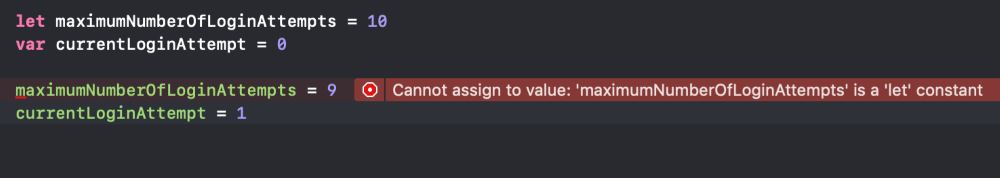

## 类型标注

* 在声明一个变量或常量的时候提供类型标注，来明确变量或常量能够储存值的类型

* 添加类型标注的方法是在变量或常量的名字后边加一个冒号，再跟一个空格，最后加上要使用的类型名称

* 可以在一行中定义多个相关的变量为相同的类型，用逗号分隔，只要在最后的变量名字后边加上类型标注

```swift
var message: String
message = "hello"
// message = 10 // 错误
```


## 变量和常量命名

* 常量和变量的名字几乎可以使用任何字符，包括 Unicode 字符

* 常量和变量的名字不能包含白字符、书序符号、箭头、保留的（或者无效的）Unicode 码位、连线和制表符，也不能以数字开头。

```swift
let π = 3.14159
let 你好 = "你好世界"
let 🐶🐮 = "dogcow"
```

## 打印常量和变量

* print(_:separator:terminator:)

* 字符串插值

```swift
let 你好 = "你好世界"
print("欢迎语是\(你好)")
```

# 基本数据类型

## 整数

* Swift 提供了 8，16，32 和 64 位编码的有符号和无符号整数

* 命名方式：例如 8 位无符号整数的类型是 `UInt8`，32 位有符号整数的类型是 `Int32`

* 通过 `min` 和 `max` 属性来访问每个整数类型的最小值和最大值

* Swift 提供了一个额外的整数类型：`Int`，它拥有与当前平台的原生字相同的长度

* 同时 Swift 也提供 `UInt` 类型，来表示平台长度相关的无符号整数

* 建议在用到整数的地方都是用 `Int`

## 浮点类型

* Double：64 位浮点数，至少有 15 位数字的精度

* Float：32 位浮点数，至少有 6 位数字的精度

* 在两种类型都可以的情况下，推荐使用 Double 类型

## 数值范围
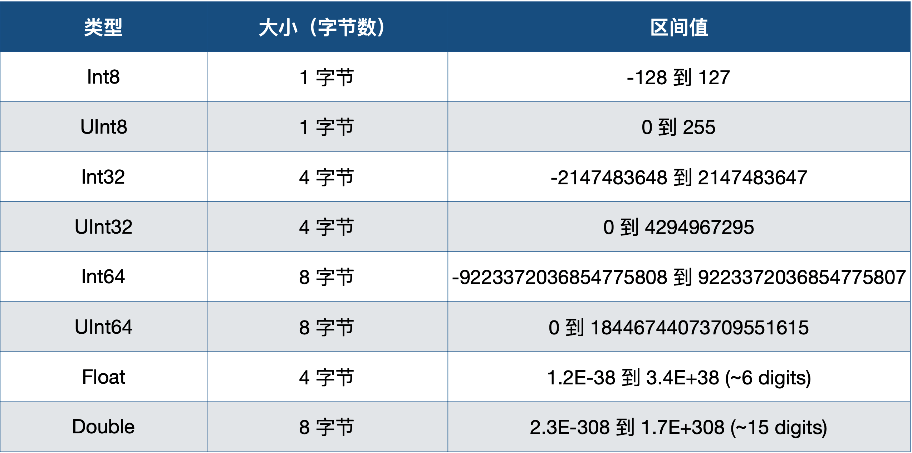

## Bool

* Bool：true 和 false

* Swift 的类型安全机制会阻止用一个非布尔量的值替换掉 `Bool`

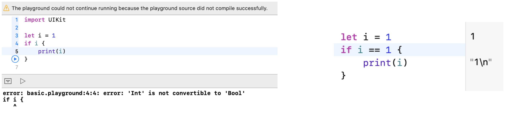

## 类型别名

* 类型别名是一个为已存在类型定义的一个可选择的名字

* 可以通过关键字 `typealias` 定义一个类型别名

* 如定义一个在上下文中看起来更合适可具有表达性的名字，来引用一个已存在的类型  
```swift
typealias AudioSample = UInt8
let sample: AudioSample = 32
```

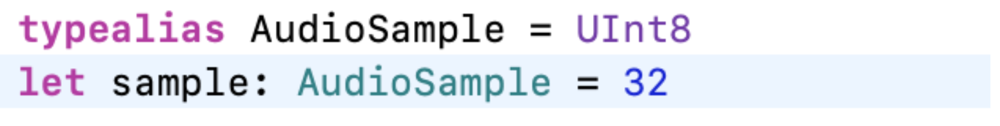

# Tuple

* 元组把多个值合并成单一的复合型的值

* 元组内的值可以是任何类型，而且可以不必是同一类型

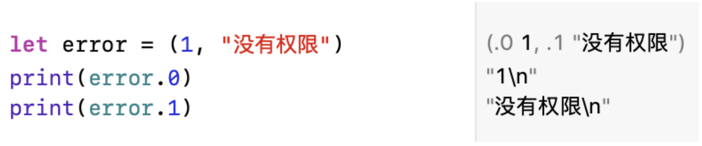

## 元素命名

* 元组中的每个元素可以指定对应的元素名称

* 如果没有指定名称的元素也可以使用下标的方式来引用

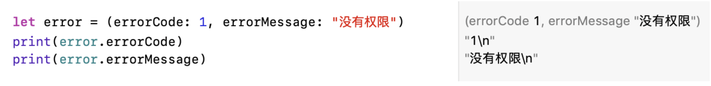

## Tuple 修改

* 用 `var` 定义的元组就是可变元组，`let` 定义的就是不可变元组

* 不管是可变还是不可变元组，元组在创建后就不能增加和删除元素

* 可以对可变元组的元素进行修改，但是不能改变其类型

* `any` 类型可以改为任何类型

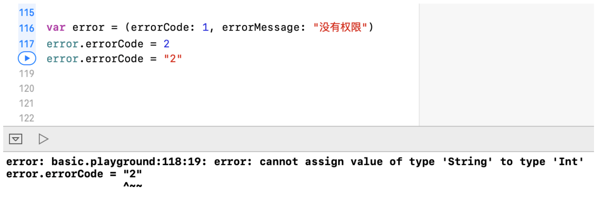

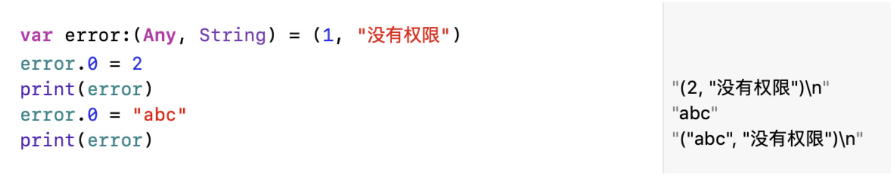

## Tuple 分解

* 将一个元组的内容分解成单独的常量或变量

* 如果只需要使用其中的一部分数据，不需要的数据可以用下划线（ `_` ）代替


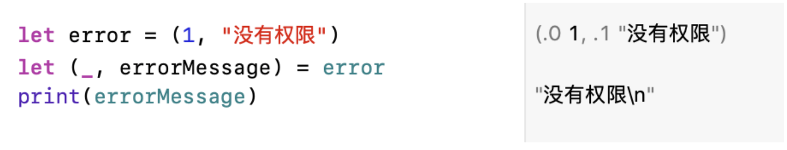

## 作为函数返回值

* 使用 Tuple 为函数返回多个值

* 返回值的 Tuple 可以在函数的返回类型部分被命名

```swift
func writeToFile(content: String) -> (errorCode: Int, errorMessage: String) {
    return (1, "没有权限")
}
```

# Optional

## 为什么需要 Optional

* Objective-C 里的 `nil` 是无类型指针

* Objective-C 里面的数组、字典、集合等不允许放入 `nil`

* Objective-C 所有对象变量都可以为 `nil`

* Objective-C 只能用在对象上，而在其他地方又用其他特殊值（例如 `NSNotFound`）表示指的缺失

## Swift 中的 Optional

* 通过在变量后面加 `?` 表示：
  * 这里有一个值，它等于 x
  * 或者，这里根本没有值

* 可以通过给可选变量赋值一个 `nil` 来将之设置为没有值

* 在 Swift 中，`nil` 不是指针，他是值缺失的一种特殊类型，任何类型的可选项都可以设置成 `nil` 而不仅仅是对象类型

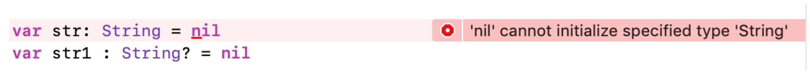

## Optional-if 语句以及强制展开

* 可选项是没法直接使用的，需要用 `!` 展开之后才能使用

错误演示：


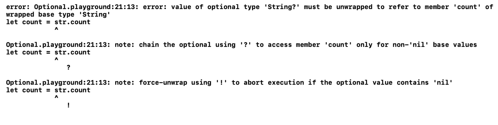

正确演示：
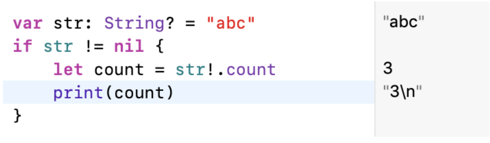

## Optional-强制展开

* 使用 `!` 来获取一个不存在的可选值会导致运行错误，在使用 `!` 强制展开之前必须确保可选项中包含一个非 `nil` 的值。

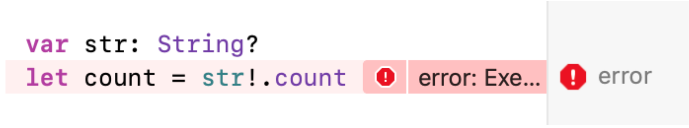

## Optional-绑定

* 可以使用可选项绑定来判断可选项是否包含值，如果包含就把值赋给一个临时的常量或者变量

* 可选绑定可以与 `if` 和 `while` 的语句使用来检查可选项内部的值，并赋值给一个变量或常量

* 同一个 `if` 语句中包含多个可选项绑定，用逗号分隔即可。如果任一可选绑定结果是 `nil` 或者布尔值为 `false`，那么整个 `if` 判断会被看做 `false`

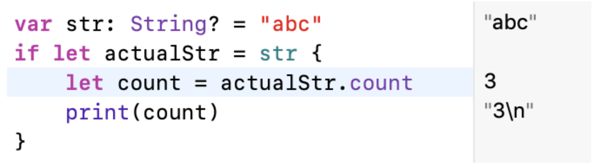

## Optional-隐式展开

* 有些可选项一旦被设定值之后，就会一直拥有值，在这种情况下，就可以去掉检查的需求，也不必每次访问的时候都进行展开

* 通过在声明的类型后边添加一个叹号（`String!`）而非问号（`String?`）来书写隐式展开可选项

* 隐式展开可选项主要被用在 Swift 类的初始化过程中

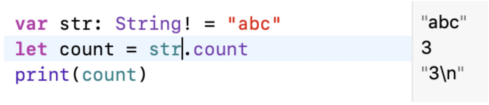

## Optional-可选链

* 可选项后面加问号，如果可选项不为 `nil`，返回一个可选项结果，否则返回 `nil`

错误演示：
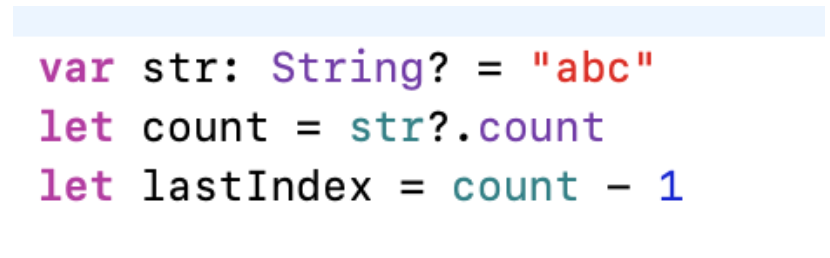


正确演示：
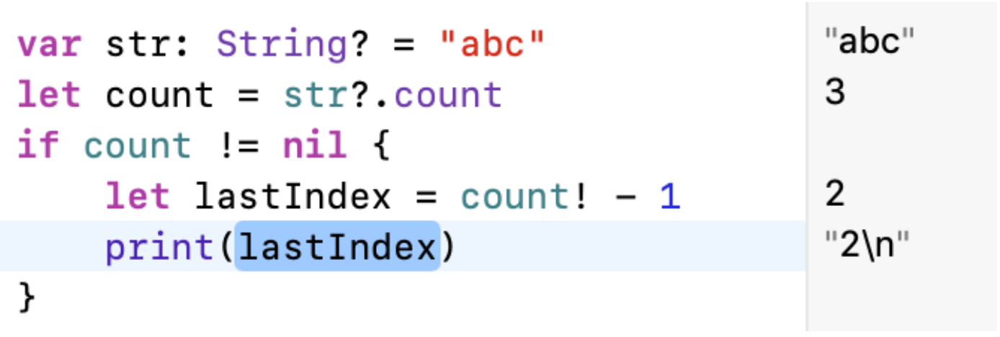

# Optional-实现探究

* Optional 其实是标准库里的一个 enum 类型

* Optional 是用标准库实现语言特性的典型

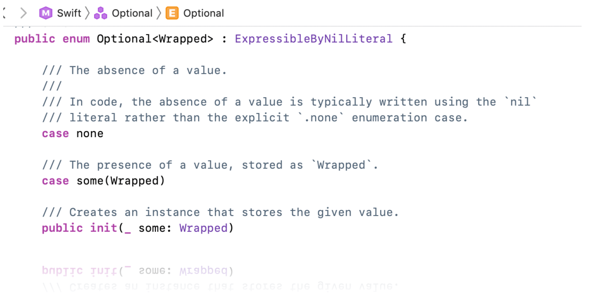

* Optional.none 就是 nil

* Optional.some 则包装了实际的值

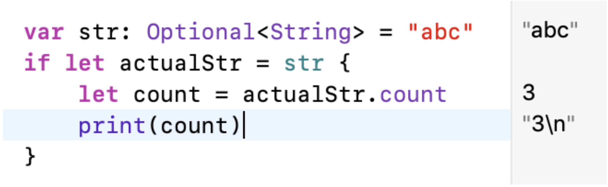

* 泛型属性 unsafelyUnwrapped
```swift
/// The wrapped value of this instance, unwrapped without checking whether
/// the instance is `nil`.
///
/// The `unsafelyUnwrapped` property provides the same value as the forced
/// unwrap operator (postfix `!`). However, in optimized builds (`-O`), no
/// check is performed to ensure that the current instance actually has a
/// value. Accessing this property in the case of a `nil` value is a serious
/// programming error and could lead to undefined behavior or a runtime
/// error.
///
/// In debug builds (`-Onone`), the `unsafelyUnwrapped` property has the same
/// behavior as using the postfix `!` operator and triggers a runtime error
/// if the instance is `nil`.
///
/// The `unsafelyUnwrapped` property is recommended over calling the
/// `unsafeBitCast(_:)` function because the property is more restrictive
/// and because accessing the property still performs checking in debug
/// builds.
///
/// - Warning: This property trades safety for performance.  Use
///   `unsafelyUnwrapped` only when you are confident that this instance
///   will never be equal to `nil` and only after you've tried using the
///   postfix `!` operator.
@inlinable public var unsafelyUnwrapped: Wrapped { get }
```

* 理论上可以直接调用 `unsafelyUnwrapped` 获取可选项的值
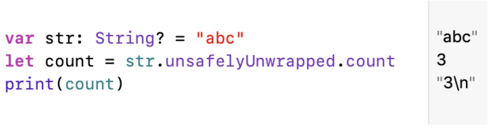

# 字符串-初始化

## 初始化空串

* 字面量
```swift
var emptyString = ""
```

* 初始化器语法
```swift
var anotherEmptyString = String()
```

* `isEmpty` 检查是否为空串
```swift
if emptyString.isEmpty {
    print("Nothing to see here")
}
```

## 字面量

* 字符串字面量是被双引号（`""`）包裹的固定顺序文本字符

* Swift 会为 `str` 常量推断类型为 `String`
```swift
let str = "some string"
```

## 多行字面量

* 多行字符串字面量是用三个双引号引起来的一系列字符

* 多行字符串字面量把所有行包括在引号内，开始和结束默认不会有换行符

* 当代码中在多行字符串字面量里面包含了换行，那个换行符同样会成为字符串里的值。如果想要使用换行符来让代码易读，却不想让换行符成为字符串的值，那就在那些行的末尾使用反斜杠（`\`）

多行字符串字面量，包含换行：
```swift
let string = """
In the Southern Hemisphere,
the end of September means a warm climate and the approaching of summer.

For this southern right whale off the coast of Argentina,
that means migrating south,
heading to Antarctica to feed.

The Southern Right Whale is a subspecies of the Right Whale that inhabits the ocean south of the equator,
feeds on krill on the surface of the sea,
and feeds through flocks of krill with their mouths open.
"""

print(string)
```

打印结果：
```
In the Southern Hemisphere,
the end of September means a warm climate and the approaching of summer.

For this southern right whale off the coast of Argentina,
that means migrating south,
heading to Antarctica to feed.

The Southern Right Whale is a subspecies of the Right Whale that inhabits the ocean south of the equator,
feeds on krill on the surface of the sea,
and feeds through flocks of krill with their mouths open.
```

使用`\`，使代码更易读：
```swift
let string = """
In the Southern Hemisphere,\
the end of September means a warm climate and the approaching of summer.

For this southern right whale off the coast of Argentina,\
that means migrating south,\
heading to Antarctica to feed.

The Southern Right Whale is a subspecies of the Right Whale that inhabits the ocean south of the equator,\
feeds on krill on the surface of the sea,\
and feeds through flocks of krill with their mouths open.
"""

print(string)
```

打印结果：
```
In the Southern Hemisphere,the end of September means a warm climate and the approaching of summer.

For this southern right whale off the coast of Argentina,that means migrating south,heading to Antarctica to feed.

The Southern Right Whale is a subspecies of the Right Whale that inhabits the ocean south of the equator,feeds on krill on the surface of the sea,and feeds through flocks of krill with their mouths open.
```

* 要让多行字符串字面量起始或结束于换行，就在第一或最后一行写一个空行

* 多行字符串可以缩进已匹配周围的代码。引号前的空格会告诉 Swift 其他行前应该有多少空白是需要忽略的

* 如果你在某行的空格超过了结束的引号，那么这些空格会被包含进字符串

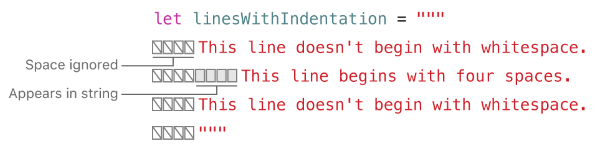

定义一个字符串，带有代码缩进，在起始和结束换行：
```swift
    let string = """

        In the Southern Hemisphere,\
    the end of September means a warm climate and the approaching of summer.

        For this southern right whale off the coast of Argentina,\
    that means migrating south,\
    heading to Antarctica to feed.

    The Southern Right Whale is a subspecies of the Right Whale that inhabits the ocean south of the equator,\
    feeds on krill on the surface of the sea,\
    and feeds through flocks of krill with their mouths open.

    """
```

打印结果：
```

    In the Southern Hemisphere,the end of September means a warm climate and the approaching of summer.

    For this southern right whale off the coast of Argentina,that means migrating south,heading to Antarctica to feed.

The Southern Right Whale is a subspecies of the Right Whale that inhabits the ocean south of the equator,feeds on krill on the surface of the sea,and feeds through flocks of krill with their mouths open.

```

## 字符串里的特殊字符

* 转义特殊字符 `\0`（空字符），`\\`（反斜杠），`\t`（水平制表符），`\n`（换行符），`\r`（回车符），`\"`（双引号）以及`\'`（单引号）

* 任意的 Unicode 标量，写作 `\u{n}`，n 是一个 1-8 位的16进制数字，其值是合法 Unicode 值

* 可以在多行字符串字面量中包含双引号（`""`）而不需转义，要在多行字符串中包含文本 `"""`，转义至少一个双引号

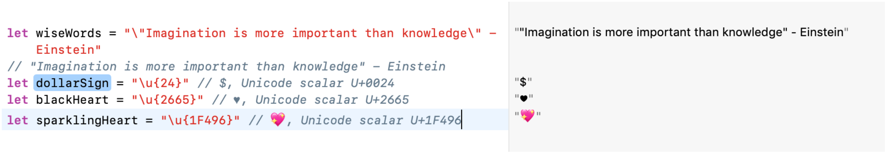

## 扩展字符串分隔符（Raw String）

* 在字符串字面量中放置扩展分隔符，使字符串中包含的特殊字符不生效

* 把字符串放在双引号（`""`）内并由井号（`#`）包裹

* 如果字符串里有 `"#` 则首位需要两个井号 `##`

* 如果需要字符串中某个特殊符号的效果，使用匹配包裹作用的井号数量的井号，并在井号前面写转义符号（`\`）

```swift
let str = #"Line 1\nLine 2 "#
let str1 = #"Line 3\#nLine 4"#
let str2 = ###"Line 5\###nLine 6"###
print(str)
print(str1)
print(str2)
```

打印结果：
```
Line 1\nLine 2 
Line 3
Line 4
Line 5
Line 6
```

# 字符串-操作

## 字符串的可变性

* `var` 指定的可以修改

* `let` 指定的不可以修改

* 对比 Objective-C（`NSString` 和 `NSMutableString`）

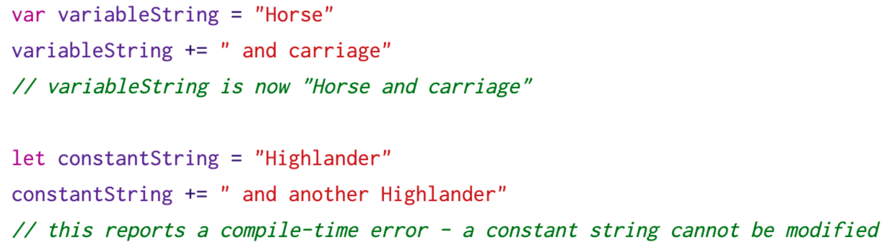

## 字符串是值类型

* `String` 值在传递给方法或者函数的时候会被复制过去

* 赋值给常量或者变量的时候也是一样

* Swift 编译器优化了字符串使用的资源，实际上拷贝只会在确实需要的时候才进行

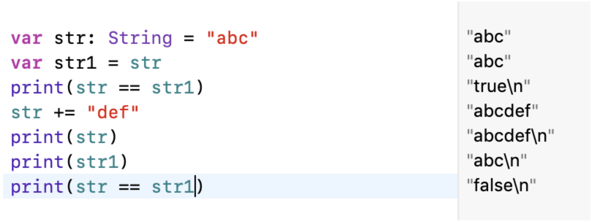

## 操作字符

* for-in 循环遍历 String 中的每一个独立的 Character

* Character 类型

* String 值可以通过传入 Character 数组来构造

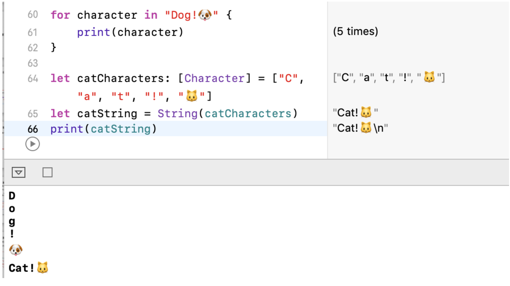

## 字符串拼接

* 使用加运算符（`+`）创建新字符串

* 使用加赋值符号（`+=`）在已经存在的 String 值末尾追加一个 String 值

* 使用 String 类型的 `append()` 方法来可以给一个 String 变量的末尾追加 Character 值

## 字符串插值

* 字符串插值是一种从混合常量、变量、字面量和表达式的字符串字面量构造新 String 值的方法

* 每一个你插入到字符串字面量的元素都要被一对圆括号包裹，然后使用反斜杠前缀（`\(string)`）

* 类似于 `NSString` 的 `stringWithFormat:` 方法，但是更加简便，更强大

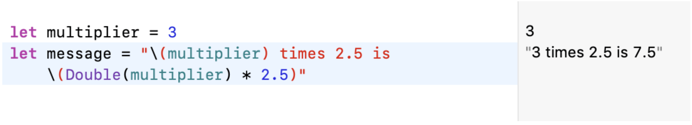

* 可以在扩展字符串分隔符中创建一个包含在其他情况下会被当作字符串插值的字符

* 要在使用扩展分隔符的字符串中使用字符串插值，在反斜杠后使用匹配首位井号数量的井号

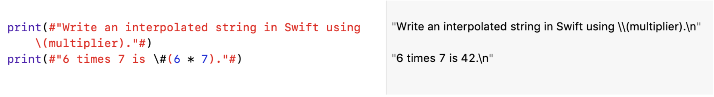

# 字符串-访问和修改

## 字符串索引

* 每一个 String 值都有相关的索引类型，`String.index`，它相当于每个 Character 在字符串中的位置

* `startIndex` 属性用来访问 String 的第一个 Character 的位置。`endIndex` 属性就是 String 中最后一个字符后的位置

* `endIndex` 属性并不是字符串下标脚本的合法实际参数

* 如果 String 为空，则 `startIndex` 与 `endIndex` 相等

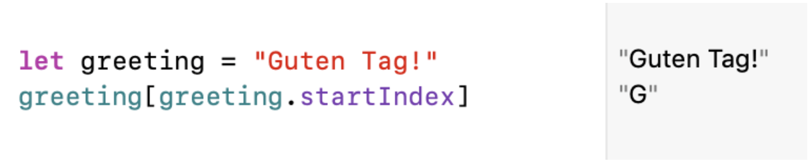

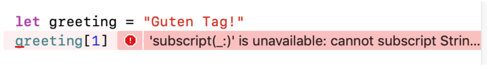

```swift
/// A position of a character or code unit in a string.
@frozen public struct Index : Sendable {
}
```

* 使用 `index(before:)` 和 `index(after:)` 方法来访问给定索引的前后

* 要访问给定索引更远的索引，可以使用 `index(_:offsetBy:)`

* 使用 `indices` 属性来访问字符串中每个字符的索引

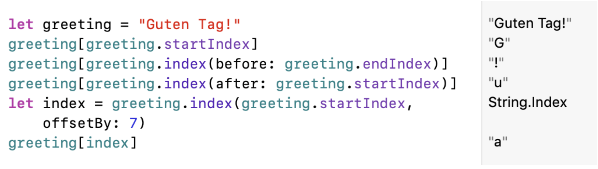

## 插入

* 插入字符，使用 `insert(_:at:)` 方法

* 插入另一个字符串的内容到特定的索引，使用 `insert(contentsOf:at:)` 方法

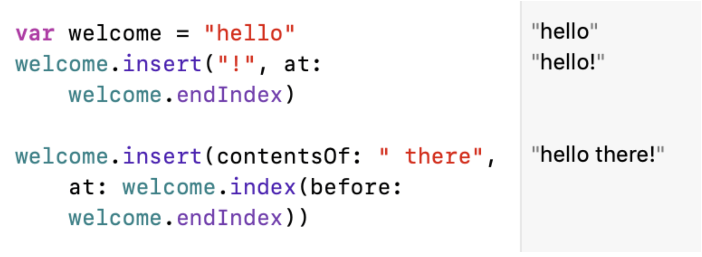

## 删除

* 移除字符，使用 `remove(at:)` 方法

* 移除一小段特定范围的字符串，使用 `removeSubrange(_:)` 方法

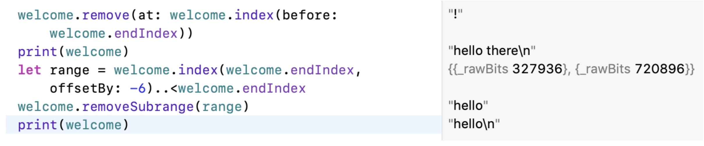

# 字符串-子串和字符串比较

## 子字符串

* 使用下标或者类似 `prefix(_:)` 的方法得到的子字符串是 `Substring` 类型

* Substring 拥有 String 的大部分方法

* Substring 可以转成 String 类型（`String()`）

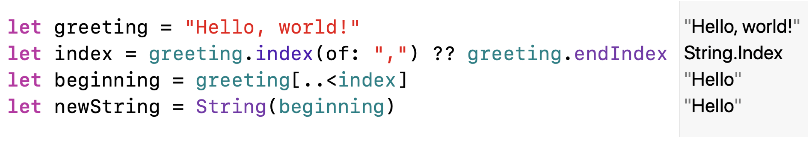

* 子字符串重用一部分原字符串的内存

* 修改字符串或者子字符串之前都不需要花费拷贝内存的代价

* String 和 Substring 都遵循 StringProtocol 协议，也就是说它基本上能很方便地兼容所有接受 StringProtocol 值的字符串操作函数

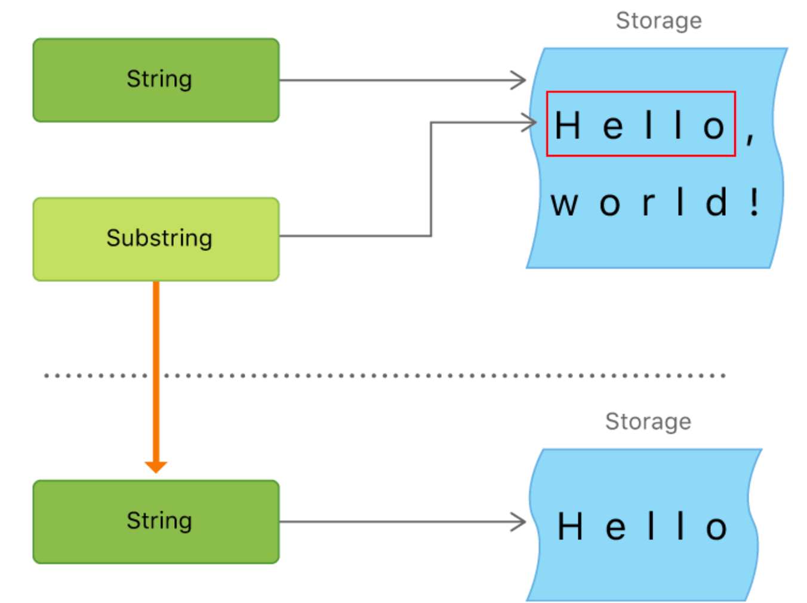

## 字符串比较

* 字符串和字符相等性（`==`和`!=`）

* 前缀相等性 `hasPrefix(_:)`

* 后缀相等性 `hasSuffix(_:)`

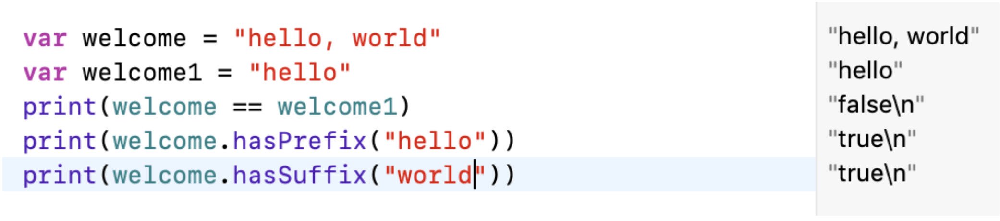