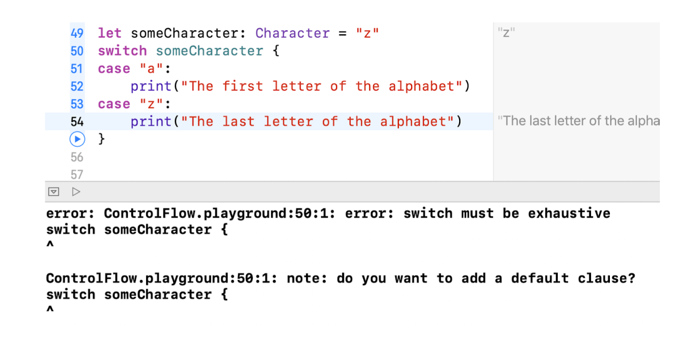
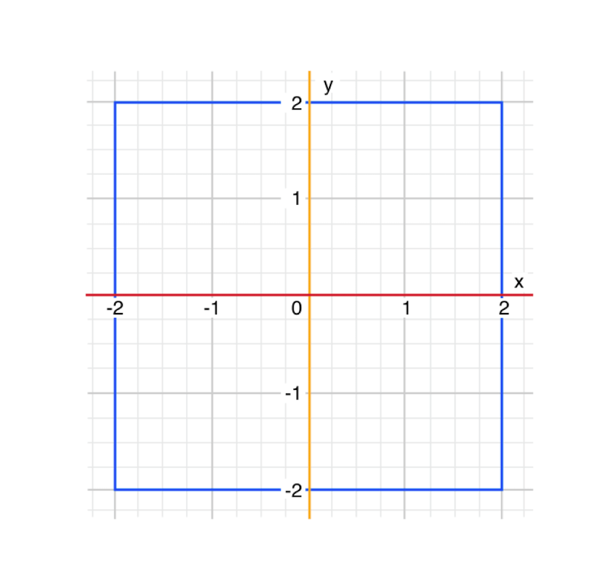
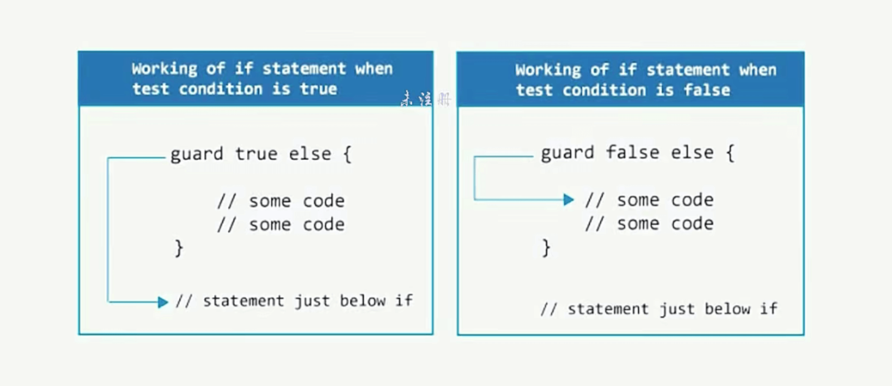

* [循环控制](#循环控制)
* [switch](#switch)
* [guard](#guard)
* [模式和模式匹配](#模式和模式匹配)

<!-- more -->

## 循环控制

### for-in 循环

使用 for-in 循环来遍历序列，比如一个范围的数字：

```swift
for i in 0...5 {
    print(i)
}
// 0
// 1
// 2
// 3
// 4
// 5
```

遍历字符串中的字符：

```swift
for c in "Hello,World" {
    print(c)
}
H
// e
// l
// l
// o
// ,
// W
// o
// r
// l
```

遍历数组中的元素：

```swift
let names = ["zhangsan", "lisi", "wangwu", "zhaoliu"]
for name in names {
    print(name)
}
// zhangsan
// lisi
// wangwu
// zhaoliu
```

#### for-in 遍历字典

字典在 for-in 遍历时，每一个元素都是一个元组 `(key, value)`。

```swift
let numberLegs = ["spider": 8, "ant": 6, "cat": 4]
for t in numberLegs {
    print("\(t.0) has \(t.1) legs")
}
//spider has 8 legs
//cat has 4 legs
//ant has 6 legs
```

可以在 for-in 循环体中，使用显示命名常量来分解元组成员：

```swift
let numberLegs = ["spider": 8, "ant": 6, "cat": 4]
for (animalName, legCount) in numberLegs {
    print("\(animalName) has \(legCount) legs")
}
// ant has 6 legs
// cat has 4 legs
// spider has 8 legs
```

在不需要遍历到的每一个值时，可以使用下划线 `_` 取代遍历名以忽略值：

```swift
let base = 3
let power = 5
var answer = 1
for _ in 1...power {
    answer *= base
}

print("\(base) to the power of \(power) is \(answer)")
// Prints "3 to the power of 5 is 243"
```

#### for-in 分段区间

使用 `stride()` 函数来跳过不想要的标记。

* `stride(from:to:by:)`：开区间

```swift
let minuteInterval = 5
for tickMark in stride(from: 0, to: 50, by: minuteInterval) {
    print(tickMark)
}
// 0
// 5
// 10
// 15
// 20
// 25
// 30
// 35
// 40
// 45
```

* `stride(from:through:by:)`：闭区间

```swift
let minuteInterval = 5
for tickMark in stride(from: 0, through: 50, by: minuteInterval) {
    print(tickMark)
}
// 0
// 5
// 10
// 15
// 20
// 25
// 30
// 35
// 40
// 45
// 50
```

### while 循环

Swift 中的 repeat-while 循环。

```swift
var count = 0
repeat {
    print(count)
    count += 1
} while count < 5

// 0
// 1
// 2
// 3
// 4
```

> OC 中的 while 循环和 do-while 循环：
>
> ```swift
> int count = 0;
> while (count < 5) {
>    NSLog(@"%d", count);
>    count += 1;
>}
>
>// 0
>// 1
>// 2
>// 3
>// 4
>
> int count = 0;
> do {
>     NSLog(@"%d", count);
>     count += 1;
> } while (count < 5);
> 
> // 0
> // 1
> // 2
> // 3
> // 4
>```

## switch

switch 语句会将一个值与多个可能的模式匹配，然后基于第一个成功匹配的模式来执行合适的代码块。

switch 语句一定得是全面的，在给定类型里，每一个值都要被考虑到，并且匹配到一个对应的 switch case 里。如果无法提供一个 switch case 所有可能的值，则可以用关键字 default 标记，即默认匹配所有未明确的值。default 关键字必须在所有 case 的最后。

```swift
let someCharacter: Character = "z"
switch someCharacter {
case "a":
    print("The first letter of the alphabet")
case "z":
    print("The last letter of the alphabet")
default:
    print("Some other character")
}

// Prints "The last letter of the alphabet"
```

如果没有 default 关键字，则会报错：


> Objective-C 中的 switch 语句如果不全面，仍然可以运行
>
>```swift
>char c = 'z';
>switch (c) {
>    case 'a':
>        NSLog(@"The first letter of the alphabet");
>        break;
>    case 'z':
>        NSLog(@"The last letter of the alphabet");
>        break;
>}
>
>// Prints "The last letter of the alphabet"
>```

### 没有隐式贯穿

相比 C 和 Objective-C 里的 switch 语句来说，Swift 里的 switch 语句不会默认从匹配 case 的末尾贯穿到下一个 case 里。相反，整个 switch 语句会在匹配到第一个 switch 的 case 执行完毕之后退出，不再需要显式的 break 语句。

> C 和 Objective-C 里的 switch 的隐式贯穿：
>
>```swift
>char c = 'z';
>switch (c) {
>    case 'a':
>        NSLog(@"The first letter of the alphabet");
>    case 'z':
>        NSLog(@"The last letter of the alphabet");
>    default:
>        NSLog(@"Some other character");
>}
>
>// The last letter of the alphabet
>// Some other character
>```

因为 Swift 的 switch 语句没有隐式贯穿，所以每一个 case 的函数体必须包含至少一个可执行的语句。


因为 Swift 的 switch 语句没有隐式贯穿，所以想要实现匹配多个值的情况，可以用逗号分隔，并且可以写成多行。

```swift
let someCharacter: Character = "z"
switch someCharacter {
case "a", "A", "B",
     "C", "D":
    print("The first letter of the alphabet")
case "z", "Z":
    print("The last letter of the alphabet")
default:
    print("Some other character")
}

// Prints "The last letter of the alphabet"
```

### 区间匹配

switch 的 case 的值可以在一个区间中匹配。

```swift
let approximateCount = 62
let countedThings = "moons orbiting Saturn"
var naturalCount: String

switch approximateCount {
case 0:
    naturalCount = "no"
case 1..<5:
    naturalCount = "a few"
case 5..<12:
    naturalCount = "several"
case 12..<100:
    naturalCount = "dozens of"
case 100..<1000:
    naturalCount = "hundreds of"
default:
    naturalCount = "many"
}
print("There are \(naturalCount) \(countedThings).")

// Prints "There are dozens of moons orbiting Saturn."
```

### 元组匹配

可以使用元组来在一个 switch 语句中测试多个值，使用下划线 `_` 来表明匹配所有可能的值。

匹配在 (-2, 2) 组成的盒子内的点：



```swift
let somePoint = (1, 1)
switch somePoint {
case (0, 0):
    print("(0, 0) is at the origin")
case (_, 0):
    print("(\(somePoint.0), 0) is on the x-axis")
case (0, _):
    print("(0, \(somePoint.1)) is on the y-axis")
case (-2...2, -2...2):
    print("(\(somePoint.0), \(somePoint.1)) is inside the box")
default:
    print("(\(somePoint.0), \(somePoint.1)) is outside of the box")
}

// Prints "(1, 1) is inside the box"
```

### 值绑定

switch 的 case 可以将匹配到的值临时绑定为一个常量或者变量，来给 case 的函数体使用。

```swift
let anotherPoint = (2, 0)
switch anotherPoint {
case (let x, 0):
    print("on the x-axis with an x value of \(x)")
case (0, let y):
    print("ont the y-axis with a y value of \(y)")
case let (x, y):
    print("somewhere else at (\(x), \(y)")
}

// Prints "on the x-axis with an x value of 2"
```

如果使用 `var` 关键字，临时的变量就会以合适的值来创建并初始化。这个变量的任何改变都只会在 case 的函数体内有效。

```swift
let anotherPoint = (2, 0)
switch anotherPoint {
case (var x, 0):
    x += 2
    print("on the x-axis with an x value of \(x)")
case (0, var y):
    print("on the y-axis with a y value of \(y)")
case var (x, y):
    print("somewhere else at (\(x), \(y))")
}

print(anotherPoint)

// on the x-axis with an x value of 4
// (2, 0)
```

### where 字句

switch case 可以使用 `where` 分句来检查是否符合特定的约束。

匹配在两条直线上的点：


```swift
let yetAnotherPoint = (1, -1)
switch yetAnotherPoint {
case let (x, y) where x == y:
    print("(\(x), \(y)) is on the line x == y")
case let (x, y) where x == -y:
    print("(\(x), \(y)) is on the line x == -y")
case let (x, y):
    print("(\(x), \(y)) is just some arbitrary point")
}

// Prints "(1, -1) is on the line x == -y"
```

### 复合匹配

多种情形共享同一个函数体的多个情况可以在 case 后写多个模式来复合，在每个模式之间用逗号分隔。如果任何一个模式匹配了，那么这个情况都会被认为是匹配的。如果模式太长，可以把它们写成多行。

```swift
let someCharacter: Character = "e"
switch someCharacter {
case "a", "e", "i", "o", "u":
    print("\(someCharacter) is a vowel")
case "b", "c", "d", "f", "g", "h", "j", "k", "l", "m",
     "n", "p", "q", "r", "s", "t", "v", "w", "x", "y", "z":
    print("\(someCharacter) is a consonant")
default:
    print("\(someCharacter) is not a vowel or a consonant")
}

// Prints "e is a vowel"
```

#### 复合匹配 - 值绑定

复合匹配同样可以包含值绑定。所有复合匹配的模式都必须包含**相同的值绑定集合**，并且复合情况中的每一个绑定都得**有相同的类型格式**。这才能确保无论复合匹配的哪部分命中了，在函数体中的代码都能访问到绑定的值，并且值的类型也都相同。

```swift
let stillAnotherPoint = (9, 0)
switch stillAnotherPoint {
case (let distance, 0), (0, let distance):
    print("On an axis, \(distance) from the origin")
default:
    print("Not on an axis")
}

// Prints "On an axis, 9 from the origin"
```

### 控制转移

#### continue

`continue` 语句表示让循环停止当前遍历，开始下一次遍历。并不是离开整个循环。

```swift
for i in 0...5 {
    if i == 3 {
        continue
    }
    print(i)
}

// 0
// 1
// 2
// 4
// 5
```

#### break

break 语句会立即结束整个控制流语句。在需要提前结束 switch 或者其它循环语句时，可以使用 break。

break 会立即结束整个循环的执行，并且转移控制到循环结束花括号（`}`）后的第一行代码上。**结束整个循环**，表示当前遍历循环里的其它代码都不会被执行，并且余下的遍历循环也不会开始了。

```swift
for i in 0...5 {
    if i == 3 {
        break
    }
    print(i)
}

// 0
// 1
// 2
```

在 switch 语句里使用 break 时，switch 语句会立即结束执行，并且转移控制到 switch 语句结束花括号（`}`）之后的第一行代码上。

```swift
let string = "break"
switch string {
case "break":
    print("Before break")
    break
    print("After break")
default:
    print("Nothing")
}

// Prints "Before break"
```

#### fallthrough

Swift 的 switch 语句不支持隐私贯穿，可以通过关键字 `fallthrough` 显式实现贯穿行为。

```swift
let integerToDescribe = 5
var description = "The number \(integerToDescribe) is"
switch integerToDescribe {
case 2, 3, 5, 7, 11, 13, 17, 19:
    description += " a prime number, and also"
    fallthrough
default:
    description += " an integer."
}
print(description)

// Prints "The number 5 is a prime number, and also an integer."
```

#### 语句标签

可以使用语句标签给循环语句或者条件语句做标记。在一个条件语句中，可以使用语句标签配合 `break` 语句来结束被标记的语句。在循环语句中，你可以使用语句标签来配合 `break` 或者 `continue` 语句来结束或者继续执行被标记的语句。

```swift
var number = 10
whileLoop : while number > 0 {
    switch number {
    case 9:
        print("9")
    case 10:
        var sum = 0
        for index in 0...10 {
            sum += index
            if index == 9 {
                print(sum)
                break whileLoop
            }
        }
    default:
        break
    }
    number = -1
}

// Prints 45
```

## guard

guard 语句，类似于 if 语句，基于布尔值表达式来执行语句。使用 guard 语句来要求一个条件必须是真才能执行 guard 之后的语句。与 if 语句不同，guard 语句总是有一个 else 分句——else 分句里的代码会在条件不为真的时候执行



在编写条件语句的时候，左边的代码间距应该是一个“黄金”或者“快了”的大道。不要嵌套 if 语句，多个 return 语句可能是更好的，这样可以避免圈复杂度（Cyclomatic Complexity），并且让代码更加容易阅读。因为重要部分没有嵌套在分支上，可以很清楚的找到相关代码。

推荐写法：

```swift
- (void)someMethod {
    if (![someOther boolValue]) {
        return;
    }

    //Do something important
}
```

不推荐写法：

```swift
- (void)someMethod {
    if ([someOther boolValue]) {
        //Do something important
    }
}
```

或者：

```swift
- (void)someMethod {
    if (![someOther boolValue]) 
        return;

    //Do something important
}
```

或者：

```swift
- (void)someMethod {
    if (![someOther boolValue]) return;

    //Do something important
}
```

相关文档：
<https://github.com/objc-zen/objc-zen-book>
<https://docs.swift.org/swift-book/LanguageGuide/ControlFlow.html>

### 验证 ip 地址的格式是否正确

使用 if 语句

```swift
func isIPAddress(ipAddr: String) -> (Int, String) {
    let compoments = ipAddr.split(separator: ".")
    if compoments.count == 4 {
        if let first = Int(compoments[0]), first >= 0 && first < 256 {
            if let second = Int(compoments[1]), second >= 0 && second < 256 {
                if let third = Int(compoments[2]), third >= 0 && third < 256 {
                    if let fourth = Int(compoments[3]), fourth >= 0 && fourth < 256 {
                        return (0, "")
                    } else {
                        return (4, "第四个数不对")
                    }
                } else {
                    return (3, "第三个数不对")
                }
            } else {
                return (2, "第二个数不对")
            }
        } else {
            return (1, "第一个数不对")
        }
    }
    return (100, "ip只能有四部分")
}

print(isIPAddress(ipAddr: "192.122.111.-1"))

// Prints "(4, "第四个数不对")"
```

使用 guard 语句

```swift
func isIPAddress(ipAddr: String) -> (Int, String) {
    let compoments = ipAddr.split(separator: ".")
    
    guard compoments.count == 4 else {
        return (100, "ip只能有四部分")
    }
    
    guard let first = Int(compoments[0]), first >= 0 && first < 256 else {
        return (1, "第一个数不对")
    }
    
    guard let second = Int(compoments[1]), second >= 0 && second < 256 else {
        return (2, "第二个数不对")
    }
    
    guard let third = Int(compoments[2]), third >= 0 && third < 256 else {
        return (3, "第三个数不对")
    }
    
    guard let fourth = Int(compoments[3]), fourth >= 0 && fourth < 256 else {
        return (4, "第四个数不对")
    }
    
    return (0, "")
}

print(isIPAddress(ipAddr: "192.118.222.300"))

// Prints "(4, "第四个数不对")"
```

### 检查 API 可用性

Swift 拥有内置的 API 可用性的检查功能，能够确保使用不可用的 API。

可以在 if 或者 guard 语句中使用一个可用性条件来有条件地执行代码。

```swift
if #available(iOS 10, macOS 10.12, *) {
    // 在iOS上使用iOS 10 API，在macOS上使用macOS 10.12 API
} else {
    // 回到早期的iOS和macOS API
}
```

## 模式和模式匹配

### 模式


### 模式分类

#### 通配符模式（Wildcard Pattern）

#### 标识符模式（Identifier Pattern）

#### 值绑定模式（Value-Binding Pattern）

#### 元组模式（Tuple Pattern）

#### 枚举用例模式（Enumeration Case Pattern）

#### 可选项目模式（Optional Pattern）

#### 类型转换模式（Type-Casting Pattern）

#### 表达式模式（Expression Pattern）
