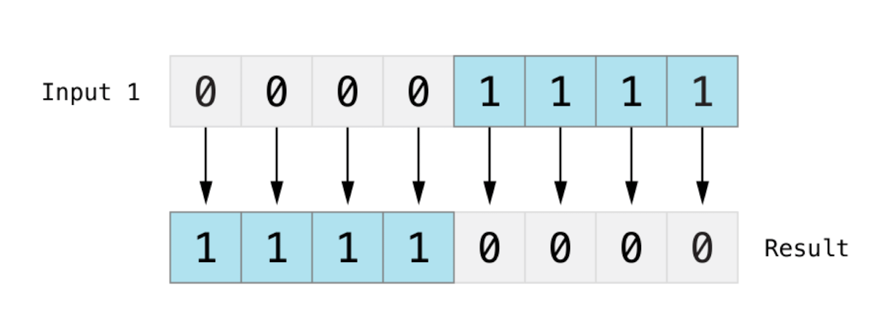
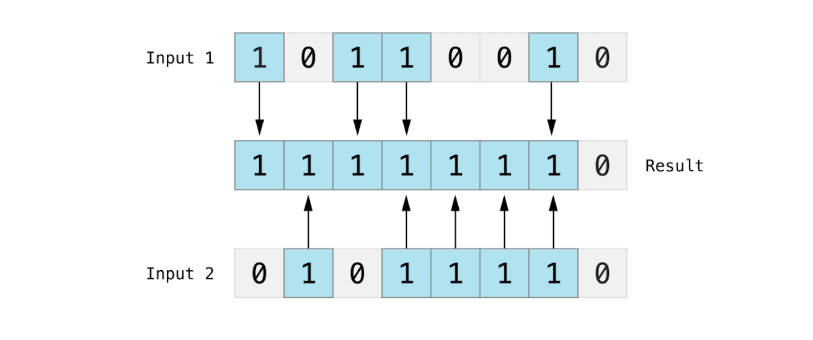
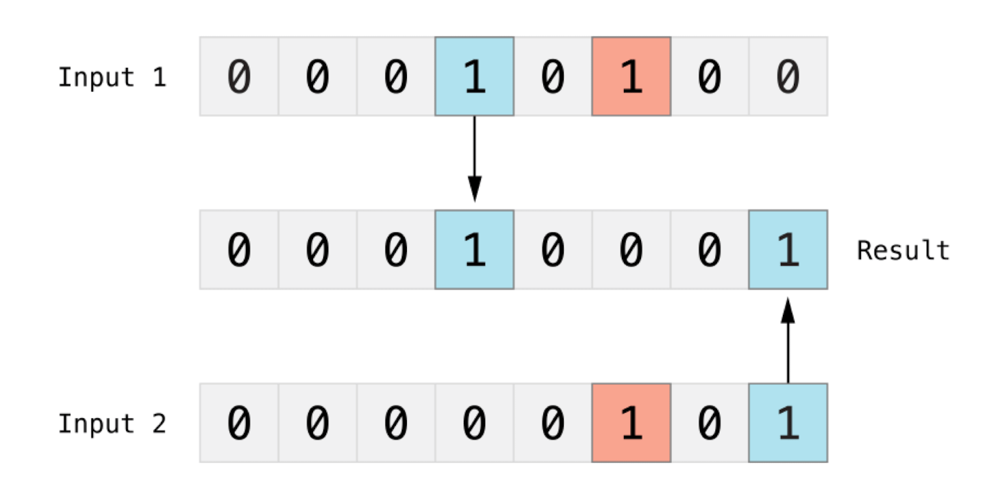

* [溢出运算符](#溢出运算符)
* [合并空值运算符](#合并空值运算符)
* [区间运算符](#区间运算符)
* [位运算符](#位运算符)
* [位运算符经典算法](#位运算符经典算法)
* [运算符的优先升级和结核性](#运算符的优先升级和结核性)
* [自定义运算符](#自定义运算符)

<!-- more -->

## 赋值和算术运算符

### 基本概念

* 一元运算符，对一个目标进行操作。一元前缀运算符：`!b`，一元后缀运算符：`b!`。

* 二元运算符，对两个目标进行操作。如`a + b`，同时因为它们出现在两个目标之间，所以是中缀运算符。

* 三元运算符，对三个目标进行操作。Swift 语言仅有一个三元运算符，即三元条件运算符 `a ? b : c`。

Swift 支持 C 中大多数的标准运算符，同时也增加了一些能力，用来排除常见代码错误：

1. 赋值符号（`=`）不会返回值，以防止它和等于符号（`==`）产生误用。
2. 算数符号（`+`，`-`，`*`，`/`，`%`等）可以检测并阻止值溢出，如存储类型放入大于允许范围的数字。

### 赋值运算符

* `=`：赋值运算符，将一个值赋值给另外一个值。如果赋值符号右侧是拥有多个值的元组，则元组的元素将会一次性拆分成常量和变量。

#### 赋值运算符不会返回值

在 OC 中，赋值运算符在赋值成功后会返回 `true`：


而 Swift 的赋值符号自身不会返回值：


### 算术运算符

#### 标准运算符

`+`、`-`、`*`、`/` 是标准算术运算符。
  
加法运算符也支持 String 的拼接：

```swift
let str = str1 + str2
```

* Swift 算术运算符默认不允许值溢出

#### 余数运算符

```swift
let c = a % b
```

余数：指整数除法中被除数**未被除尽部分**，且余数的取值范围为0到除数之间（不包括除数）的整数。


除数为负数时，也是用同样的方法进行计算：

```swift
let c = -4 % 3
print(c)
// Prints -1
```

被除数为负数时，负号会被忽略：

```swift
let c = 4 % -3
print(c)
// Prints 1
```

#### 一元

* 一元减号运算符（`-`）：直接放置在操作的值前边。数字值的正负号可以用前缀 `-` 来切换。
* 一元加号运算符（`+`）：直接返回操作的值，不会对其进行任何的修改。

## 溢出运算符

向一个整数赋值超过它容量的值时，Swift 会报错，而不是生成一个无效的数。

* `&+` 溢出加法
* `&-` 溢出减法
* `&*` 溢出乘法

### 值溢出

无符号整型数值和有符号整型数值都可以向上溢出或向下溢出。

当发生上溢时，它们会从数值所能容纳的**最大数变成最小数**。

当发生下溢时，它们会从数值所能容纳的**最小数变成最大数**。

无符号整型数值，向上溢出：


无符号整型数值，向下溢出：


有符号整型数值，向下溢出：


Swift 算术运算符默认不允许值溢出：


可以使用**溢出加法`&+`**：


## 合并空值运算符

如果 a 有值则返回 a，不会再判断 b；如果 a 没有值（`nil`），则返回默认值 b：

```swift
let c = a ?? b
```

其中，a 必须是一个可选类型，b  必须与 a 的储存类型相同。

合并空值运算符就是三元运算符，是三元运算符作用到 Optional 上的缩写版：

```swift
// 合并空值运算符
let c = a ?? b

// 三元运算符
let c = a != nil ? a! : b
```

### 应用效果对比

1、使用强制解包，有崩溃风险，如果 num1 或 num2 为 nil 会崩：

```swift
func addTowNumber(num1: Int?, num2: Int?) -> Int {
    return num1! + num2!
}
```

2、使用 if 判断，代码量比较多：

```swift
func addTowNumber(num1: Int?, num2: Int?) -> Int {
    if num1 != nil && num2 != nil {
        return num1! + num2!
    } else {
        return 0
    }
}
```

3、使用合并控制运算符 `??`

```swift
func addTowNumber(num1: Int?, num2: Int?) -> Int {
    return (num1 ?? 0) + (num2 ?? 0)
}
```

## 区间运算符

### 闭区间运算符

`a...b`：闭区间运算符，定义了从 a 到 b 的一组范围，**包含 a 和 b**。a 的值不能大于 b。

```swift
for index in 1...5 {
    print(index)
}
// 1
// 2
// 3
// 4
// 5
```

### 半开区间运算符

`a..<b`：半开区间运算符，定义了从 a 到 b 的一组范围，**包含 a 不包含 b**。a 不能大于 b，如果 a 与 b 相等，则返回空。

```swift
for index in 1..<5 {
    print(index)
}
// 1
// 2
// 3
// 4
```

### 单侧区间

单侧区间是闭区间的另外一种形式，让区间**朝一个方向尽可能的远**。

* `a...`：区间左边大于等于 a。
* `...b`：区间右边小于等于 b。

半开区间运算符也有单侧形式：

* `..<b`：区间右边小于b。

举例1：从索引2到数组最后一个元素

```swift
let names = ["zhangsan", "lisi", "wangwu", "zhaoliu"]
for name in names[2...] {
    print(name)
}
// wangwu
// zhaoliu
```

举例2：从数组第一个元素开始到索引2：

```swift
let names = ["zhangsan", "lisi", "wangwu", "zhaoliu"]
for name in names[...2] {
    print(name)
}
// zhangsan
// lisi
// wangwu
```

举例3：从数组第一个元素开始到索引2前一个元素：

```swift
let names = ["zhangsan", "lisi", "wangwu", "zhaoliu"]
for name in names[..<2] {
    print(name)
}
// zhangsan
// lisi
```

举例4：单侧区间不仅用于下标，还可以在上下文中使用

```swift
let range = ...5
print(range.contains(7))
print(range.contains(4))
print(range.contains(-1))
// false
// true
// true
```

### 字符串索引区间

区间运算符在字符串中的应用：删除指定范围的字符

```swift
var welcome = "hello,world"
let range = welcome.index(welcome.endIndex, offsetBy: -6) ..< welcome.endIndex
welcome.removeSubrange(range)
print(welcome)
// Prints "hello"
```

### 倒序索引

```swift
var welcome = "hello,world"
let reversedWelcome = String(welcome.reversed())
print(reversedWelcome)
// Prints "dlrow,olleh"
```

### Comparable 区间

区间运算符作用在 Comparable 类型上，返回闭区间和半闭区间。

```swift
let welcome = "Hello"
let interval = "a"..."z"
for c in welcome {
    if !interval.contains(String(c)) {
        print("\(c)不是小写字母")
    }
}
// Prints "H不是小写字母"
```

## 位运算符

### 位取反运算符

* `~` 位取反运算符，是对所有位的数字进行取反操作。



### 位与运算符

* `&` 位与运算符，可以对两个数的比特位进行比较，返回一个新的数，当**两个比特位都是 1** 时返回 1。


### 位或运算符

* `|` 位或运算符，可以对两个数的比特位进行比较，返回一个新的数，当**两个比特位任意一个为 1** 时返回 1。



### 位异或运算符

* `^` 为异或运算符，或者叫“互斥或”，可以对两个数的比特位进行比较，返回一个新的数，当**两个比特位不相同** 时返回 1。



### 位左移和右移运算符

* `<<` 位左移运算符，可以把所有位数的数字向左移动一个确定的位数。
* `>>` 位右移运算符，可以把所有位数的数字向右移动一个确定的位数。

位左移和位右移具有将整数乘以或除以二的效果。将一个数左移一位相当于把这个数翻倍，将一个数右移一位相当于把这个数减半。

### 无符号整数的移位操作

实现过程：

1. 已经存在的比特位按指定的位数进行左移和右移；
2. 任何移动超出整型存储边界的位都会被丢弃；
3. 用 0 来填充向左或向右移动后产生的空白位。


### 有符号整数的移位操作

符号位：有符号整数用第一位表示正数还是负数。符号位为 0 表示正数，1 表示负数。

数值位：除第一位外其余的位，存储了实际的值。

有符号正整数和无符号数的存储方式是一样的，都是从 0 开始算起。


但是负数的存储方式略有不同，它存储的是 2 的 n 次方减去它的绝对值，这里的 n 为数值位的位数。


-4 的存储位 128 - 4 = 124。

### 补码表示的优点

对于算式 `-4 + -1`，先将两个数的全部八个比特位相加（包括符号位），再将计算结果中超出的部分丢弃。


-4 的存储位 `2^8 - 4`，-1 的存储位 `2^8 - 1`，-5 的存储位 `2^8 - 5`。
`-4 + -1 = 2^8 - 4 + 2^8 - 1`，将计算结果中超出的部分丢弃（去掉一个2^8）。
即 `-4 + -1 = 2^8 - 4 - 1 = 2^8 - 5`，等于 -5。

使用二进制补码可以使负数的位左移和右移操作，得到跟正数同样的效果，即每向左移一位就将自身的数值乘以 2，每向右移一位就将自身的数值除以 2。

要达到此目的，对有符号整数的右移有一个额外的规则：当对正整数进行位右移操作时，遵循与无符号整数相同的规则，但是对于移位产生的空白位使用符号位进行填充，而不是 0。


### 位运算符经典算法

#### 两个数字交换

```swift
var a = 10
var b = 8
a = a ^ b
b = a ^ b
a = a ^ b
print(a)
print(b)
// 8
// 10
```

#### 求无符号整数二进制中1的个数

* 给定一个无符号整型（UInt）变量，求其二进制表示中 “1” 的个数，要求算法的执行效率尽可能的高。

> 思路：看一个八位整数 10 100 001，先判断最后一位是否为 1，而“与”操作可以达到目的。可以把这个八位的数字与 00 000 001 进行“与”操作。如果结果为1，则表示当前八位数的最后一位为1，否则为0。怎么判断第二位呢？向右移位，在延续前面的判断即可。

```swift
func countOfOnes(num: UInt) -> UInt {
    var count: UInt = 0
    var temp = num
    while temp != 0 {
        count += temp & 1
        temp = temp >> 1
    }
    return count
}
print(countOfOnes(num: 4))
print(countOfOnes(num: 5))
// Prints 1
// Prints 2
```

思考：如果整数的二进制中有较多的 0，那么我们每一次右移一位做判断会很浪费，怎么改进呢？有没有办法让算法的复杂度只与“1”的个数有关？

> 思路：为了简化这个问题，先考虑只有高位有“1”的情况。例如：11 000 000，如何跳过前面低位的 6 个 0，而直接判断第七位的 1？我们可以设计 11 000 000 和 10 111 111（也就是 11 000 000 - 1）做“与”操作，消去最低位的 1。如果得到的结果为 0，说明已经找到（消去）里面最后一个 1。如果不为 0，那么说明消去了最低位的 1，但是二进制中还有其它的 1，计数器加一继续上面的操作。
>
> 计数器 count = 0
>
> 步骤一：整数不为0，说明二进制里肯定有 1，count = 1
>
> 11 000 000 & 10 111 111 = 10 000 000（消去第七位的 1）。
>
> 步骤二：结果不为0，说明二进制里还有 1，count = 2
>
> 10 000 000 & 01 111 111 = 0（消去第八位的 1）。
>
> 步骤三：结果为0，终止，返回 count 为 2。

```swift
func countOfOnes(num: UInt) -> UInt {
    var count: UInt = 0
    var temp = num
    while temp != 0 {
        count += 1
        temp = temp & (temp - 1)
    }
    return count
}

print(countOfOnes(num: 4))
print(countOfOnes(num: 5))
// Prints 1
// Prints 2
```

#### 如何判断一个整数为2的整数次幂

* 给定一个无符号整型（UInt）变量，判断是否为 2 的整数次幂。

> 思路：**一个整数如果是 2 的整数次方，那么它的二进制表示中有且只有一位是 1，其它所有位都是 0**。根据前面的分析，把这个整数减去 1 后再和它自己做“与”运算，这个整数中唯一的 1 就变成 0 了，也就是得到的结尾为 0。

```swift
func isPowerOfTwo(num: UInt) -> Bool {
    return (num & (num - 1)) == 0;
}

print(isPowerOfTwo(num: 4))
print(isPowerOfTwo(num: 5))
// Prints true
// Prints false
```

#### 缺失的数字

* 很多成对出现的正整数保存在磁盘文件中，注意成对的数字不一定是相邻的，如 2，3，4，3，4，2......，由于意外有一个数字消失了，如何尽快找到是哪个数字消失了？

> 思路：考虑“异或”操作的定义，当两个操作数的对应位不同时，该数的对应位就为 1。也就是说如果是 **相等的两个数“异或”，得到的结果为 0，而 0 与任何数字“异或”，得到的是那个数字本身**。所以可以将所的数字做“异或”操作，因为只有一个数字消失，那么其它两两出现的数字“异或”后为 0，0与仅有的一个数字做“异或”，就得到了消失的数字是哪个。

```swift
func findLostNum(nums: [UInt]) -> UInt {
    var lostNum: UInt = 0
    for num in nums {
        lostNum = lostNum ^ num
    }
    return lostNum
}

print(findLostNum(nums: [1, 2, 1, 3, 2, 3, 4]))
// Prints 4
```

#### 缺失的数字2

* 很多成对出现的正整数保存在磁盘文件中，注意成对的数字不一定是相邻的，如 2，3，4，3，4，2......，如果有两个数字意外丢失了（丢失的不是相等的数字），该如何找到丢失的两个数字？

> 思路：设题目中这两个只出现 1 次的数字分别为 A 和 B，如果能将 A，B 分开到两个数组中，那显然符合“异或”解法的关键点了。因此这个题目的关键点就是将 A，B 分开到二个数组中。由于 A，B 肯定是不相等的，因此在二进制上必定有一位是不同的。根据这一位是 0 还是 1 可以将 A 和 B 分开到 A组 和 B组。而这个数组中其它数字要么属于 A 组，要么就属于 B 组。再对 A组 和 B组 分别执行“异或”解法就可以得到 A，B 了。而要判断 A，B 在哪一位上不相同，只要根据 “A异或B” 的结果就可以知道了，这个结果在二进制上为 1 的位都说明 A，B 在这一位上是不相同的。

```swift
func findTwoLostNums(nums: [UInt]) -> (UInt, UInt) {
    var lostNum1: UInt = 0
    var lostNum2: UInt = 0
    var temp: UInt = 0
    //计算两个数的异或结果
    for num in nums {
        temp = temp ^ num
    }
    //找到第一个不为1的位
    var flag: UInt = 1;
    while ((flag & temp) == 0) {
        flag = flag << 1
    }
    //找两个丢失的数字
    for num in nums {
        if (num & flag == 0) {
            lostNum1 = lostNum1 ^ num
        } else {
            lostNum2 = lostNum2 ^ num
        }
    }
    return (lostNum1, lostNum2)
}

print(findTwoLostNums(nums: [1,2,1,3,2,4]))
// Prints (4, 3)
```

#### 缺失的数字3

* 数组中，只有一个数出现一次，剩下的都出现三次，找出出现一次的数字。

> 思路：考虑到三次异或后还是数字本身，所以不能像例2那样使用异或。根据**位运算**的思想，出现三次的数字每个比特位也出现了三次，如果将出现的次数相加的话，每一个比特位都可以被3整除。只出现一次的数字的每一个比特位出现的次数都是1，不能被3整除。

```swift
func findLostNum(nums: [UInt]) -> UInt {
    // 长度为32的数组
    var bitSum = [UInt](repeating: 0, count: 32)
    // 遍历二进制表示的32个比特位
    for i in 0..<32 {
        var sum: UInt = 0
        // 遍历数组，判断每个数的二进制表示，在第 i 位是否为1
        for num in nums {
            sum += (num >> i & 1)
        }
        // 保存所有数在第 i 位的总和
        bitSum[i] = sum
    }
    var res: UInt = 0
    for i in 0..<32 {
        // 不能被3整除的比特位，表示只出现一次的那个数字在这个二进制位上为1
        if (bitSum[i]%3 != 0) {
            // 将res的第i位置为1
            res += 1<<i
        }
    }
    return res
}

print(findLostNum(nums: [1,2,3,4,1,2,3,1,2,3]))
// Prints 4
```

## 运算符的优先升级和结核性

运算符的优先级使得一些运算符优先于其他运算符，高优先级的运算符会先被计算。

结合性定义了具有相同优先级的运算符是如何结合（或关联）的——与左边结合为一组，还是与右边结合为一组。

```swift
let c = 2 + 3 % 4 * 5
print(c)
// Prints 17
```

`2 + 3 % 4 * 5` 等价于 `2 + ((3 % 4) * 5)`。

### 运算符优先级 - 显示括号

Swift 语言中逻辑运算符 `&&` 和 `||` 是做相关的，意味着多个逻辑运算符组合的表达式会首先计算最左边的子表达式。

```swift
let lockA = true, lockB = false, lockC = false, lockD = false

if (lockA && lockB || lockC || lockD) {
    print("Welcome!")
} else {
    print("ACCESS DENIED")
}
// Prints "ACCESS DENIED"
```

等价于

```swift
if ((lockA && lockB) || lockC || lockD) {
    print("Welcome!")
} else {
    print("ACCESS DENIED")
}
// Prints "ACCESS DENIED"
```

## 运算符重载

类和结构体可以为现有的运算符提供自定义的实现，称为运算符重载。

```swift
struct Vector2D {
    var x = 0.0, y = 0.0
}

extension Vector2D {
    static func + (left: Vector2D, right: Vector2D) -> Vector2D {
        return Vector2D(x: left.x + right.x, y: left.y + right.y)
    }
}

let vector = Vector2D(x: 3.0, y: 1.0)
let anotherVector = Vector2D(x: 2.0, y: 4.0)
let combinedCector = vector + anotherVector
print(combinedCector)
// prints Vector2D(x: 5.0, y: 5.0)
```

### 一元运算符重载

类与结构体也能提供标准一元运算符的实现。要实现前缀或者后缀运算符，需要在声明运算符函数的时候在 func 关键字之前指定 prefix 或者 postfix 限定符。

```swift
struct Vector2D {
    var x = 0.0, y = 0.0
}

extension Vector2D {
    static prefix func - (vector: Vector2D) -> Vector2D {
        return Vector2D(x: -vector.x, y: -vector.y)
    }
}

let positive = Vector2D(x: 3.0, y: 4.0)
let negative = -positive
let alsoPositive = -negative

print(negative)
print(alsoPositive)
// prints Vector2D(x: -3.0, y: -4.0)
// prints Vector2D(x: 3.0, y: 4.0)
```

### 组合赋值运算符重载

组合赋值运算符将赋值运算符（`=`）与其它运算符进行结合。

```swift
struct Vector2D {
    var x = 0.0, y = 0.0
}

extension Vector2D {
    static func + (left: Vector2D, right: Vector2D) -> Vector2D {
        return Vector2D(x: left.x + right.x, y: left.y + right.y)
    }
}

extension Vector2D {
    // 把 left 设置成 inout 类型
    static func += (left: inout Vector2D, right: Vector2D) {
        left = left + right
    }
}

var original = Vector2D(x: 1.0, y: 2.0)
let vectorToAdd = Vector2D(x: 3.0, y: 4.0)
original += vectorToAdd

print(original)
// Prints Vector2D(x: 4.0, y: 6.0)
```

因为 `left` 的值会在运算符函数内直接被修改，所以需要把 `left` 设置成 `inout` 类型。

### 等价运算符重载

自定义类和结构体不接收等价运算符的默认实现，也就是所谓的“等于”运算符（`==`）和“不等于”运算符（`!=`）。要使用等价运算符，需要提供一个“等于”运算符（类似中缀运算符`+`），并且遵循标准库 Equaltable 协议。

```swift
struct Vector3D: Equatable {
    var x = 0.0, y = 0.0, z = 0.0
}

let vector01 = Vector3D(x: 2.0, y: 3.0, z: 4.0)
let vector02 = Vector3D(x: 2.0, y: 3.0, z: 4.0)
if vector01 == vector02 {
    print("vector01 == vector02")
}
// Prints "vector01 == vector02"
```

swift 为一下自定义类型提供等价运算符合成实现：

* 只拥有遵循 Equaltable 协议存储属性的结构体
* 只拥有遵循 Equaltable 协议关联类型的枚举
* 没有关联类型的枚举

## 自定义运算符

除了实现标准运算符，在 Swift 中还可以声明和实现自定义运算符。自定义的运算符如果想在全局作用域内，可以使用 `operator` 关键字进行声明，同时还要指定 `prefix`、`infix` 或者 `postfix` 限定符。

```swift
// 全局作用域
prefix operator +++

struct Vector2D {
    var x = 0.0, y = 0.0
}

extension Vector2D {
    static func + (left: Vector2D, right: Vector2D) -> Vector2D {
        return Vector2D(x: left.x + right.x, y: left.y + right.y)
    }
}

extension Vector2D {
    static func += (left: inout Vector2D, right: Vector2D) {
        left = left + right
    }
}

// 自定义前缀翻倍运算符
extension Vector2D {
    static prefix func +++ (vector: inout Vector2D) -> Vector2D {
        vector += vector
        return vector
    }
}

var toBeDoubled = Vector2D(x: 1.0, y: 4.0)
let afterDoubling = +++toBeDoubled

print(afterDoubling)
// Prints Vector2D(x: 2.0, y: 8.0)
```

### 自定义中缀运算符的优先级和结合性

自定义的中缀（`infix`）运算符也可以指定优先级和结合性，每一个自定义的中缀运算符都属于一个优先级组，优先级组制定了自定义中缀运算符和其他中缀运算符的关系。

* `AdditionPrecedence` 加法运算优先级组
* `MultiplicationPrecedence` 乘法运算优先级组

```swift
// 自定义优先级组
precedencegroup MyPrecedence {
    // 设置优先级组的计算方向为从左侧开始
    associativity: left
    // 设置优先级小于加法运算优先级组
    lowerThan: AdditionPrecedence
}
```

自定义中缀运算符 `+-`

```swift
struct Vector2D {
    var x = 0.0, y = 0.0
}

// 自定义运算符 +- 属于加法运算符组
infix operator +-: AdditionPrecedence
extension Vector2D {
    static func +- (left: Vector2D, right: Vector2D) -> Vector2D {
        return Vector2D(x: left.x + right.x, y: left.y - right.y)
    }
}

// 自定义运算符 *^ 属于乘法运算符组
infix operator *^: MultiplicationPrecedence
extension Vector2D {
    static func *^ (left: Vector2D, right: Vector2D) -> Vector2D {
        return Vector2D(x: left.x * right.x, y: left.y * left.y + right.y + right.y)
    }
}

let firstVector = Vector2D(x: 1.0, y: 2.0)
let secondVector = Vector2D(x: 3.0, y: 7.0)
let plusMinusVector = firstVector +- secondVector
let thirdVector = Vector2D(x: 2.0, y: 2.0)
let resFirstVector = firstVector +- secondVector *^ thirdVector
let resSecondVector = (firstVector +- secondVector) *^ thirdVector
print(resFirstVector)
print(resSecondVector)
// Prints Vector2D(x: 7.0, y: -51.0)
// Prints Vector2D(x: 8.0, y: 29.0)
```

自定义运算符 `+-` 属于加法运算符组，自定义运算符 \*^ 属于乘法运算符组。因为乘法运算的优先级大于加法运算，所以运算符组 `+-` 的优先级小于运算符组 `\*^` ，即 `\*^` 先于 `+-` 运算：

```swift
struct Vector2D {
    var x = 0.0, y = 0.0
}

// 自定义运算符 +- 属于加法运算符组
infix operator +-: AdditionPrecedence
extension Vector2D {
    static func +- (left: Vector2D, right: Vector2D) -> Vector2D {
        return Vector2D(x: left.x + right.x, y: left.y - right.y)
    }
}

infix operator
// 自定义运算符 *^ 属于乘法运算符组
precedencegroup MyPrecedence {
    // 设置优先级组的计算方向为从左侧开始
    associativity: left
    // 设置优先级小于加法运算优先级组
    lowerThan: AdditionPrecedence
}
extension Vector2D {
    static func *^ (left: Vector2D, right: Vector2D) -> Vector2D {
        return Vector2D(x: left.x * right.x, y: left.y * left.y + right.y + right.y)
    }
}

let firstVector = Vector2D(x: 1.0, y: 2.0)
let secondVector = Vector2D(x: 3.0, y: 7.0)
let plusMinusVector = firstVector +- secondVector
let thirdVector = Vector2D(x: 2.0, y: 2.0)
let resFirstVector = firstVector +- secondVector *^ thirdVector
let resSecondVector = (firstVector +- secondVector) *^ thirdVector
print(resFirstVector)
print(resSecondVector)
// Prints Vector2D(x: 7.0, y: -51.0)
// Prints Vector2D(x: 8.0, y: 29.0)
```

自定义运算符组 `MyPrecedence`，设置优先级低于加法运算组。即 `*^` 和 `+-` 的执行顺序按从左至右的顺序：

```swift
struct Vector2D {
    var x = 0.0, y = 0.0
}

infix operator +-: AdditionPrecedence
extension Vector2D {
    static func +- (left: Vector2D, right: Vector2D) -> Vector2D {
        return Vector2D(x: left.x + right.x, y: left.y - right.y)
    }
}

//infix operator *^: MultiplicationPrecedence
infix operator *^: MyPrecedence
precedencegroup MyPrecedence {
    associativity: left
    lowerThan: AdditionPrecedence
}

extension Vector2D {
    static func *^ (left: Vector2D, right: Vector2D) -> Vector2D {
        return Vector2D(x: left.x * right.x, y: left.y * left.y + right.y + right.y)
    }
}

let firstVector = Vector2D(x: 1.0, y: 2.0)
let secondVector = Vector2D(x: 3.0, y: 7.0)
let plusMinusVector = firstVector +- secondVector
let thirdVector = Vector2D(x: 2.0, y: 2.0)
let resFirstVector = firstVector +- secondVector *^ thirdVector
let resSecondVector = (firstVector +- secondVector) *^ thirdVector
print(resFirstVector)
print(resSecondVector)
// Prints Vector2D(x: 8.0, y: 29.0)
// Prints Vector2D(x: 8.0, y: 29.0)
```
