* [数组](#数组)
* [Set](#set)
* [字典](#字典)

<!-- more -->

## 数组

### 创建数组

#### 数组字面量

1、字面量创建：

```swift
let array = [1, 2, 3, 4]
```

>数组字面量写法：一系列的值，用逗号分隔，用方括号括起来。

2、字面量创建空数组：

```swift
var array:[Int] = []
var array:[String] = []
```

>⚠️注意：**创建空数组必须携带类型信息**，否则编译不通过。
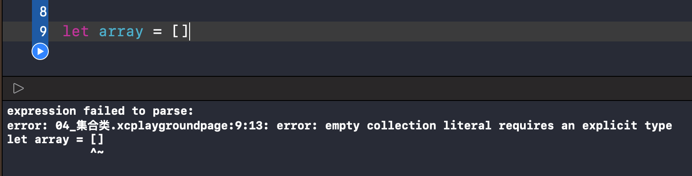

3、如果内容已经提供了类型信息，则可以通过空数组字面量来创建一个空数组：

```swift
// 因为内容提供了类型信息 [Int]
var array = [1, 2, 3, 4]
print(array)
// 所以可以通过空数组字面量来创建一个空数组
array = []
print(array)
```

>提供类型信息的情况包括：
>
>1. 作为函数的实际参数；
>2. 已经分类了的变量或常量；

#### 初始化器

使用初始化器有两种方式：

1、`[类型]()`

```swift
var array = [String]()
```

2、`Array<类型>()`

```swift
var array = Array<String>()
```

#### 初始化器参数

```swift
let fiveZs = Array(repeating: "Z", count: 5)
print(fiveZs)
// Prints ["Z", "Z", "Z", "Z", "Z"]
```

```swift
let fiveYs = Array(arrayLiteral: "Y", "Y", "Y", "Y", "Y")
print(fiveYs)
// Prints ["Y", "Y", "Y", "Y", "Y"]
```

```swift
let numbers = [Int](0...7)
print(numbers)
// Prints [0, 1, 2, 3, 4, 5, 6, 7]
```

```swift
let persons = ["zhangsan":27, "lisi":28, "wangwu":29]
let names = [String](persons.keys)
print(names)
// Prints ["zhangsan", "wangwu", "lisi"]
```

### 数组遍历与索引

#### For-In

1、遍历

```swift
let numbers = [Int](0...7)
for num in numbers {
    print(num)
}
```

打印结果：

```js
0
1
2
3
4
5
6
7
```

2、使用 break 跳出循环。

```swift
let numbers = [Int](0...7)
for num in numbers {
    if (num == 3) {
        break
    }
    print(num)
}
```

打印结果中只有`0、1、2`：

```js
0
1
2
```

3、使用 continue 跳过循环。

```swift
let numbers = [Int](0...7)
for num in numbers {
    if (num == 3) {
        continue
    }
    print(num)
}
```

打印结果中没有3：

```js
0
1
2
4
5
6
7
```

#### forEach

1、遍历。

```swift
let numbers = [Int](0...7)
numbers.forEach { (num) in
    print(num)
}
```

打印结果：

```js
0
1
2
3
4
5
6
7
```

2、无法使用 break 或 continue 跳出或者跳过循环。

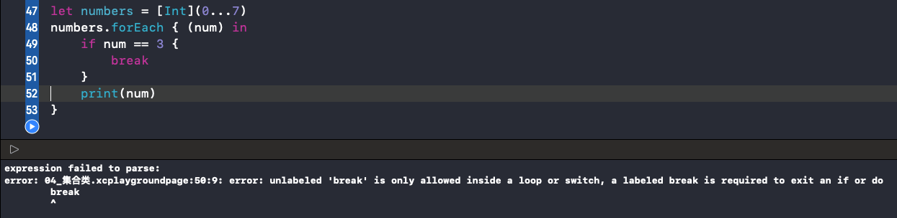

3、使用 return 只能退出当前一次循环的执行体，效果等同于 For-in 中使用 continue。

```swift
let numbers = [Int](0...7)
numbers.forEach { (num) in
    if num == 3 {
        return
    }
    print(num)
}
```

打印结果中没有3：

```js
0
1
2
4
5
6
7
```

#### enumerated

可以实现同时得到索引和值。

```swift
let numbers = [Int](2...7)
for (index, num) in numbers.enumerated() {
    print("the index is: \(index)")
}
```

打印结果：

```js
the index is: 0
the index is: 1
the index is: 2
the index is: 3
the index is: 4
the index is: 5
```

想要同时得到索引和值，必须使用 `enumerated()`，否则会报错。

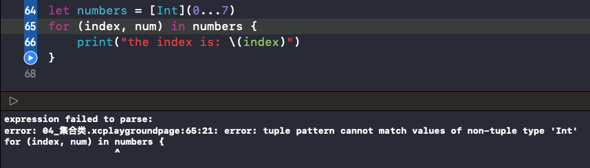

#### Iterator

`Iterator`：迭代器。

```swift
let numbers = [Int](2...7)
var numIterator = numbers.makeIterator()
while let num = numIterator.next() {
    print(num)
}
```

打印结果：

```js
2
3
4
5
6
7
```

#### 索引

`startIndex`：返回第一个元素的位置，对于数组来说，永远都是0。

```swift
let numbers = [1]
print(numbers.startIndex)
// Prints 0
```

`endIndex`：返回最后一个元素 **索引值+1** 的位置，对于数组来说，**等同于`count`**。

```swift
let numbers = [1]
print(numbers.endIndex)
print(numbers.count)
// 1
// 1
```

对于空数组，`startIndex` 等于 `endIndex`。

* `indices`：获取数组的索引区间。

```swift
let numbers = [Int](2...7)
for i in numbers.indices {
    print(numbers[i])
}
```

打印结果：

```js
2
3
4
5
6
7
```

### 数组的查找操作

#### 判断是否包含指定元素

`contains(_:)`：判断数组是否包含给定元素。

```swift
let numbers = [Int](0...7)
if numbers.contains(3) {
    print("numbers contains 3")
}
// Prints "numbers contains 3"
```

`contains(where:)`：判断数组是否包含符合给定条件的元素。

```swift
if numbers.contains(where: { $0 > 7 }) {
    print("num > 7")
} else {
    print("num < 7")
}
// Prints "num < 7"
```

#### 判断所有元素符合某个条件

`allSatisfy(_:)`：判断数组的每一个元素都符合给定的条件。

```swift
var array = [10, 20, 45, 30, 98, 101, 30, 4]
print(array.allSatisfy({ $0 > 10 }))
print(array.allSatisfy({ $0 >= 4 }))
```

打印结果：

```text
false
true
```

#### 查找元素

`first`：返回数组第一个元素，如果数组为空，返回 nil。

```swift
var array = [10, 20, 45, 30, 98, 101, 30, 4]
print(array.first)
// Prints Optional(10)
```

`last`：返回数组最后一个元素，如果数组为空，返回 nil。

```swift
var array = [10, 20, 45, 30, 98, 101, 30, 4]
print(array.last)
// Prints Optional(4)
```

`first(where:)`：返回数组第一个符合给定条件的元素。

```swift
var array = [10, 20, 45, 30, 98, 101, 30, 4]
print(array.first(where: { $0 > 25 }))
// Prints Optional(45)
```

`last(where)`：返回数组最后一个符合给定条件的元素。

```swift
var array = [10, 20, 45, 30, 98, 101, 30, 4]
print(array.last(where: { $0 > 25 }))
// Prints Optional(30)
```

#### 查找索引

`firstIndex(of:)`：返回给定元素在数组中出现的第一个位置。

```swift
var array = [10, 20, 45, 30, 98, 101, 30, 4]
print(array.firstIndex(of: 30))
// Prints Optional(3)
```

`lastIndex(of:)`：返回给定元素在数组中出现的最后一个位置。

```swift
var array = [10, 20, 45, 30, 98, 101, 30, 4]
print(array.lastIndex(of: 20))
// Prints Optional(1)
```

`firstIndex(where:)`：返回符合条件的第一个元素的位置。

```swift
var array = [10, 20, 45, 30, 98, 101, 30, 4]
print(array.firstIndex(where: { $0 > 25 }))
// Prints Optional(2)
```

`lastIndex(where:)`：返回符合条件的最后一个元素的位置。

```swift
var array = [10, 20, 45, 30, 98, 101, 30, 4]
print(array.lastIndex(where: { $0 > 25 }))
// Prints Optional(6)
```

#### 查找最大最小元素

`min()`：返回数组中最小的元素。

```swift
var array = [10, 20, 45, 30, 98, 101, 30, 4]
print(array.min())
// Prints Optional(4)
```

`max()`：返回数组中最大的元素。

```swift
var array = [10, 20, 45, 30, 98, 101, 30, 4]
print(array.max())
// Prints Optional(101)
```

`min(by:)`：利用给定的方式比较元素并返回数组中最小的元素。

```swift
var array = [(45, "error1"), (23, "error2"), (30, "error3")]
// 系统方法
print(array.min(by: { a, b in
    a.0 < b.0
}))
// Prints Optional((23, "error2"))

// 尾随闭包方式
print(array.min { a, b in a.0 < b.0 })
// Prints Optional((23, "error2"))
```

`max(by:)`：利用给定的方式比较元素并返回数组中最大的元素。

```swift
var array = [(45, "error1"), (23, "error2"), (30, "error3")]
print(array.max { a, b in a.0 < b.0 })
// Prints Optional((45, "error1"))
```

### 数组添加和删除

#### 在末尾添加

`append(_:)`：在末尾添加一个元素。

```swift
var numbers = [Int](2...7)
numbers.append(100)
print(numbers)
// Prints [2, 3, 4, 5, 6, 7, 100]
```

`append(contentsOf:)`：在末尾添加多个元素。

```swift
var numbers = [Int](2...7)
numbers.append(contentsOf: 100...105)
print(numbers)
// Prints [2, 3, 4, 5, 6, 7, 100, 101, 102, 103, 104, 105]
```

#### 在任意位置插入

`insert(_:at:)`：在指定位置插入一个元素。

```swift
var numbers = [Int](2...7)
numbers.insert(-1, at: 0)
print(numbers)
// Prints [-1, 2, 3, 4, 5, 6, 7]
```

`insert(contentOf:at:)`：在指定位置插入多个元素。

```swift
var numbers = [Int](2...7)
numbers.insert(contentsOf: -2...0, at: 0)
print(numbers)
// Prints [-2, -1, 0, 2, 3, 4, 5, 6, 7]
```

#### 字符串也是集合

字符串也是集合（Collection），Element（元素）是字符（Character）类型。

```swift
var chars: [Character] = ["a", "b", "c"]
chars.insert(contentsOf: "hello", at: 0)
print(chars)
// Prints ["h", "e", "l", "l", "o", "a", "b", "c"]
```

#### 移除单个元素

`remove(at:)`：移除并返回指定位置的一个元素。

```swift
var chars: [Character] = ["a", "b", "c", "d"]
let removedChar = chars.remove(at: 1)
print(removedChar)
print(chars)
// b
// ["a", "c", "d"]
```

`removeFirst()`：移除并返回数组的第一个元素。

```swift
var chars: [Character] = ["a", "b", "c", "d"]
let removedChar = chars.removeFirst()
print(removedChar)
print(chars)
// a
// ["b", "c", "d"]
```

`removeLast()`：移除并返回数组的最后一个元素。

```swift
var chars: [Character] = ["a", "b", "c", "d"]
let removedChar = chars.removeLast()
print(removedChar)
print(chars)
// d
// ["a", "b", "c"]
```

`popLast`：移除并返回数组的最后一个元素（`Optional`），如果数组为空返回`nil`。

```swift
var chars: [Character] = ["a", "b", "c", "d"]
let removedChar = chars.popLast()
print(removedChar)
print(chars)
// Optional("d")
// ["a", "b", "c"]
```

```swift
var chars: [Character] = []
let removedChar = chars.popLast()
print(removedChar)
// Prints nil
```

#### 移除多个元素

`removeFirst(:)`：移除数组前面多个元素。

```swift
var chars: [Character] = ["a", "b", "c", "d"]
chars.removeFirst(2)
print(chars)
// Prints ["c", "d"]
```

`removeLast(:)`：移除数组后面多个元素。

```swift
chars.removeLast(2)
print(chars)
// Prints ["a", "b"]
```

`removeSubrange(_:)`：移除数组中给定范围的元素。

```swift
chars.removeSubrange(1...2)
print(chars)
// Prints ["a", "d"]
```

`removeAll()`：移除数组所有元素，数组容量置为0。

```swift
chars.removeAll()
print(chars)
print(chars.capacity)
// []
// 0
```

`removeAll(keepingCapacity:)`：移除数组所有元素，保留数组容量。

```swift
chars.removeAll(keepingCapacity: true)
print(chars)
print(chars.capacity)
// []
// 4
```

### ArraySlice

ArraySlice 是数组或者其它 ArraySlice 的一段连续切片，**和原数组共享内存**。当要改变 ArraySlice 的时候，ArraySlice 会 copy 出来，形成单独内存。

ArraySlice 拥有和 Array 基本完全类似的方法。

#### 通过 Drop 得到 ArraySlice

`dropFirst(:)`：“移除”原数组前面指定个数的元素**得到一个 ArraySlice**。

移除前面指定个数的元素，每次操作得到一个新的 ArraySlice：

```swift
let array = [5, 2, 10, 1, 0, 100, 46, 99]  // [5, 2, 10, 1, 0, 100, 46, 99]
array.dropFirst()                          // [2, 10, 1, 0, 100, 46, 99]
array.dropFirst(3)                         // [1, 0, 100, 46, 99]
```

移除后面指定个数的元素，每次操作得到一个新的 ArraySlice：

```swift
let array = [5, 2, 10, 1, 0, 100, 46, 99]  // [5, 2, 10, 1, 0, 100, 46, 99]
array.dropLast()                           // [5, 2, 10, 1, 0, 100, 46]
array.dropLast(3)                          // [5, 2, 10, 1, 0]
```

#### 通过 prefix 得到 ArraySlice

`prefix()`：获取数组前面指定个数的元素组成 ArraySlice。

```swift
let array = [5, 2, 10, 1, 0, 100, 46, 99]  // [5, 2, 10, 1, 0, 100, 46, 99]
array.prefix(4)                            // [5, 2, 10, 1]
```

`prefix(upTo:)`：获取数组到指定位置（不包含指定位置）前面的元素组成 ArraySlice。

```swift
let array = [5, 2, 10, 1, 0, 100, 46, 99]  // [5, 2, 10, 1, 0, 100, 46, 99]
array.prefix(upTo: 4)                      // [5, 2, 10, 1]
```

`prefix(through:)`：获取数组到指定位置（包含指定位置）前面的元素组成 ArraySlice。

```swift
let array = [5, 2, 10, 1, 0, 100, 46, 99]  // [5, 2, 10, 1, 0, 100, 46, 99]
array.prefix(through: 4)                   // [5, 2, 10, 1, 0]
```

`prefix(while:)`：获取数组前面符合条件的元素（到第一个不符合条件的元素截止）组成的 ArraySlice。

```swift
let array = [5, 2, 10, 1, 0, 100, 46, 99]  // [5, 2, 10, 1, 0, 100, 46, 99]
array.prefix(while: { $0 < 10 })           // [5, 2]
array.prefix { $0 < 10 }                   // [5, 2]
```

#### 通过 suffix 得到 ArraySlice

`suffix()`：获取数组后面指定个数的元素组成的 ArraySlice。

```swift
let array = [5, 2, 10, 1, 0, 100, 46, 99]
array.suffix(3)  // [100, 46, 99]
```

`suffix(from:)`：获取数组从指定位置到结尾（包含指定位置）的元素组成的 ArraySlice。

```swift
let array = [5, 2, 10, 1, 0, 100, 46, 99]
array.suffix(from: 5)  // [100, 46, 99]
```

#### 通过 Range 得到 ArraySlice

可以通过对数组下标指定 Range 获取 ArraySlice，可以使用闭区间、半开半闭区间、单侧区间截取数组获得 ArraySlice，也可以用`...`来获取整个数组组成的 ArraySlice。

```swift
let array = [5, 2, 10, 1, 0, 100, 46, 99]  // [5, 2, 10, 1, 0, 100, 46, 99]
array[...2]                                // [5, 2, 10]
array[..<2]                                // [5, 2]
array[3...5]                               // [1, 0, 100]
array[3..<5]                               // [1, 0]
array[6...]                                // [46, 99]
array[...]                                 // [5, 2, 10, 1, 0, 100, 46, 99]
```

#### ArraySlice 转为 Array

ArraySlice 无法直接复制给一个 Array 的常量或变量，需要使用 `Array(slice)` 方法转成 Array 类型。

```swift
var array = [5, 2, 10, 1, 0, 100, 46, 99]  // [5, 2, 10, 1, 0, 100, 46, 99]
let slice = array[3...5]                   // [1, 0, 100]
array = Array(slice)                       // [1, 0, 100]
```

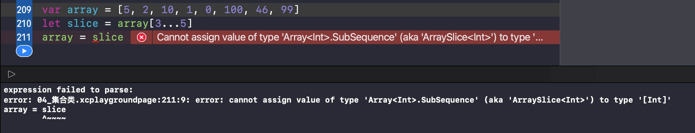

#### ArraySlice 和原 Array 相互独立

`ArraySlice` 和原 `Array` 是相互独立的，它们添加删除元素不会影响对方。

```swift
var array = [10, 46, 99]      // [10, 46, 99]
var slice = array.dropLast()  // [10, 46]

array.append(333)             // [10, 46, 99, 333]
slice.append(555)             // [10, 46, 555]
```

### 重排操作

#### 数组元素的随机化

`shuffle()`：在原数组上将数组元素打乱，只能作用在数组**变量**上。

```swift
var array = [Int](1...8)  // [1, 2, 3, 4, 5, 6, 7, 8]
array.shuffle()           // [8, 2, 3, 5, 6, 1, 7, 4]
```

`shuffled()`：返回原数组的随机化**数组**，可以作用在数组**变量和常量**上。

```swift
let array = [Int](1...8)       // [1, 2, 3, 4, 5, 6, 7, 8]
var array2 = array.shuffled()  // [4, 8, 1, 7, 3, 2, 6, 5]
```

#### 数组的逆序

`reverse()`：在原数组上将数组逆序，只能作用在数组**变量**上。

```swift
var array = [Int](1...8)  // [1, 2, 3, 4, 5, 6, 7, 8]
array.reverse()           // [8, 7, 6, 5, 4, 3, 2, 1]
```

`reversed()`：返回原数组的逆序“**集合表示**”，可以作用在数组变量和常量上，该方法**不会分配新内存空间**。

```swift
let array1 = [Int](1...8)       // [1, 2, 3, 4, 5, 6, 7, 8]
var array2 = array1.reversed()  // ReversedCollection<Array<Int>>
print(array2)                   // ReversedCollection<Array<Int>>(_base: [1, 2, 3, 4, 5, 6, 7, 8])
```

#### 数组的分组

`partition(by belongsInSecondPartition: (Element) throws -> Bool) rethrows -> Int`：将数组以某个条件分组，数组前半部分都是不符合条件的元素，数组后半部分都是符合条件的元素。

```swift
var array = [10, 20, 45, 30, 98, 101, 30, 4]         // [10, 20, 45, 30, 98, 101, 30, 4]
let index = array.partition { (element) -> Bool in   // 5
    element > 30
}
let partition1 = array[..<index]                     // [10, 20, 4, 30, 30]
let partition2 = array[index...]                     // [101, 98, 45]
```

#### 数组的排序

`sort`：在原数组上将元素排序，只能作用于数组**变量**。

```swift
var array = [10, 20, 45, 30, 98, 101, 30, 4]  // [10, 20, 45, 30, 98, 101, 30, 4]
array.sort()                                  // [4, 10, 20, 30, 30, 45, 98, 101] 
```

`sorted()`：返回原数组的排序结果**数组**，可以作用在数组**变量和常量**上。

```swift
let array = [10, 20, 45, 30, 98, 101, 30, 4]
let array2 = array.sorted()
```

#### 交换数组两个元素

`swapAt(_ i: Int, _ j: Int)`：交换指定位置的两个元素。

```swift
var array = [10, 20, 45, 30, 98, 101, 30, 4]        // [10, 20, 45, 30, 98, 101, 30, 4]
array.swapAt(array.startIndex, array.endIndex - 1)  // [4, 20, 45, 30, 98, 101, 30, 10]
```

### 拼接操作

#### 字符串数组拼接

`joined()`：拼接字符串数组里的所有元素为一个字符串。

```swift
var array = ["hello", "world"]        // ["hello", "world"]
print(array.joined())                 // "helloworld\n"
```

`joined(separator)`：以给定的分隔符拼接字符串数组里的所有元素为一个字符串。

```swift
var array = ["hello", "world"]        // ["hello", "world"]
print(array.joined(separator: ", "))  // "hello, world\n"
```

#### 元素为 Sequence 数组的拼接

`joined()`：拼接数组里的所有元素为一个更大的 Sequence。

```swift
let ranges = [0..<3, 8..<10, 15..<17]  // [{lowerBound 0, upperBound 3}, {lowerBound 8, upperBound 10}, {lowerBound 15, upperBound 17}]
for range in ranges {
    print(range)
}

print("")
for i in ranges.joined() {
    print(i)
}
```

打印结果：

```js
0..<3
8..<10
15..<17

0
1
2
8
9
15
16
```

`joined(separator:)`：以给定的分隔符拼接数组里的所有元素为一个更大的Sequence。

```swift
let nestedNumbers = [[1, 2, 3], [4, 5, 6], [7, 8, 9]]
let joined = nestedNumbers.joined(separator: [-1, -2])
print(Array(joined))  // "[1, 2, 3, -1, -2, 4, 5, 6, -1, -2, 7, 8, 9]\n"
```

### 探秘数组

阅读源码：

1. 先看顶层设计，再看底层源码是怎么符合顶层设计的。
2. 从关键的调用链开始，找到关键方法，再看关键方法底层又调用到了哪些方法。

#### 数组的协议结构

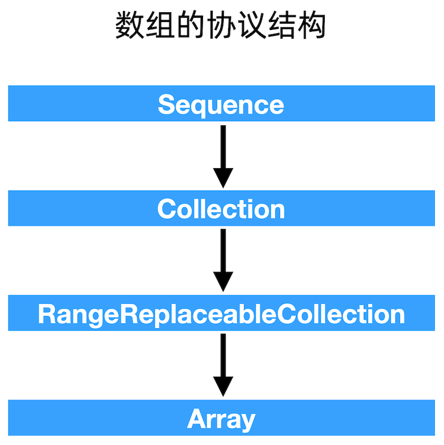

#### 顶层设计

##### Sequence

一个序列（sequence）代表的是一系列具有相同类型的值，可以对这些值进行迭代。

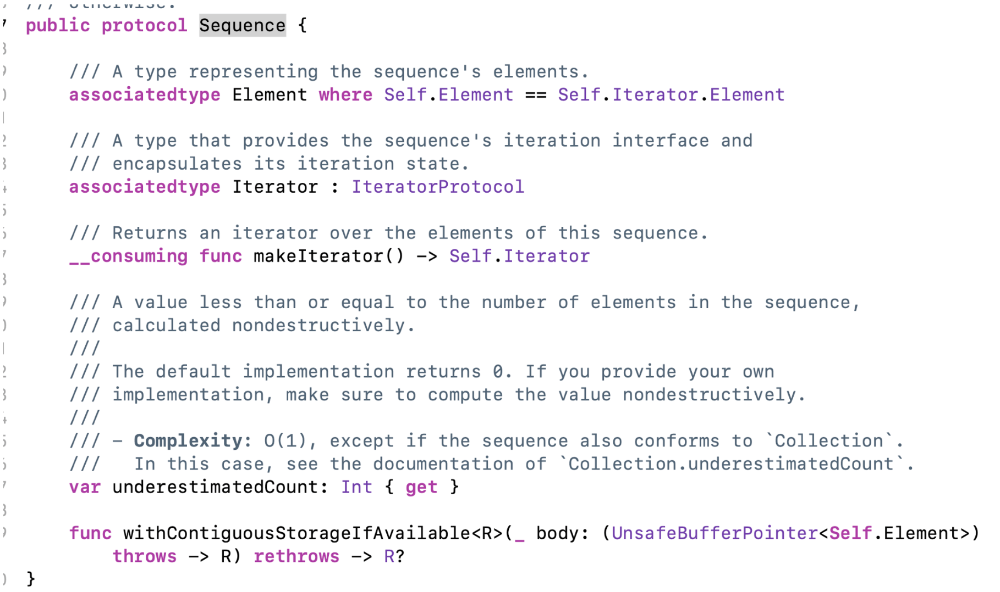

##### IteratorProtocol

迭代器：Sequence 通过创建一个迭代器来提供对元素的访问。迭代器每次产生一个序列的值，并且当遍历序列时对遍历状态进行管理。

如：

```swift
protocol IteratorProtocol {
    associatedtype Element
    mutating func next() -> Element?
}
```

`next()` 返回序列的下一个元素。当序列被耗尽时，`next()` 应该返回 nil。

##### 定义自己的 Sequence

实现斐波那契数列：

```swift
struct FibsIterator: IteratorProtocol {
    let number: Int
    var index: Int = 0
    
    init(_ number: Int) {
        self.number = number
    }
    
    var state = (0, 1)
    mutating func next() -> Int? {
        if index >= number {
            return nil
        }
        index += 1
        
        let fibNumber = state.0
        // 后一个数等于前两个数之和
        state = (state.1, state.0 + state.1)
        return fibNumber
    }
    typealias Element = Int
}

struct FibsSequence: Sequence {
    let number: Int
    init(_ number: Int) {
        self.number = number
    }
    typealias Iterator = FibsIterator
    func makeIterator() -> FibsSequence.Iterator {
        return FibsIterator(number)
    }
}

let fibs = FibsSequence(10)

for fib in fibs {
    print(fib)
}
```

打印结果：

```swift
0
1
1
2
3
5
8
13
21
34
```

`IteratorProtocol` 是迭代器协议，继承协议同时实现协议要求的方法，就拥有了迭代器的能力。`Sequence` 是序列协议，继承协议同时实现协议要求的方法，就拥有了序列的能力。

`mutating` 表示方法内部可以对全局变量进行修改。

##### Collection

一个集合（Collection）是满足下面条件的序列（Sequence）：

1. 稳定的 Sequence， 能够被多次遍历且保持一致；
2. 除了线性遍历以外，集合中的元素也可以通过下标索引的方式被获取到；
3. 和 Sequence 不同，Collection 类型不能是无限的。

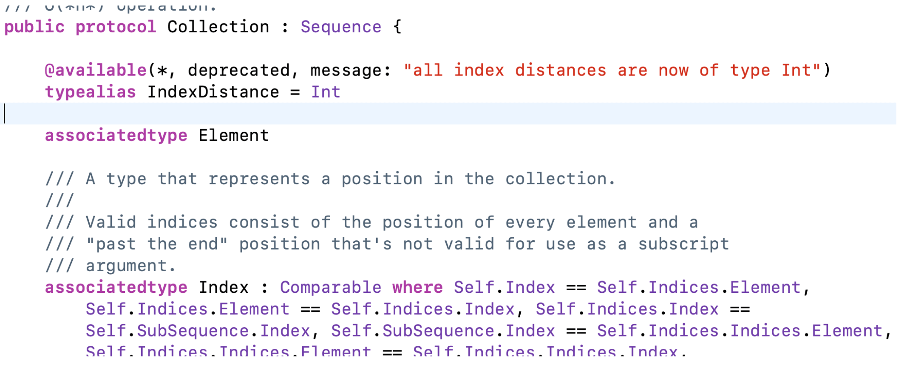

#### Array 源码

Array 的本质是一个 Sequence。

Array 的迭代器实现基于数组的下标操作，数组的小标操作基于 `buffer.getElement()` 方法，`buffer.getElement()` 方法基于 `UnsafeMutablePointer` 的小标操作。

#### Array 的迭代器

左侧是 Array 的迭代器的底层实现。`next()` 方法负责返回数组的下一个元素，超出数组容量则返回空。获取数组内部元素的方式是**下标访问**。

右侧是 Array 的迭代器的创建。调用 `IndexingItetator` 传入的是 `self`，也就是说左面的 element 是右面传入的 Collection。

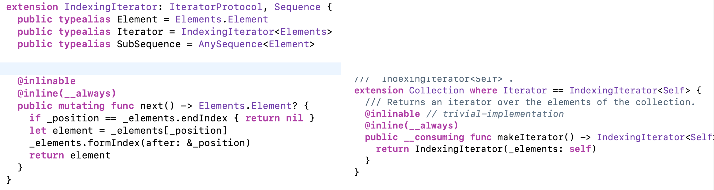

#### Array 的下标访问

下图是下标访问的代码实现，核心方法是 `_getElement()` 方法。下标方法的调用链是 `subscrip(index:)`→`_getElement()`→`_buffer.getElement()`。

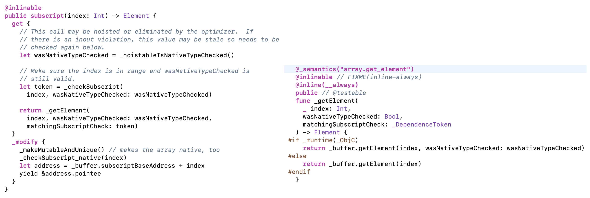

#### Array 的 buffer

`_Buffer` 的实现区分 Objc 和 Swift 两个版本，Swift 版本是 `_ContiguousArrayBuffer`。

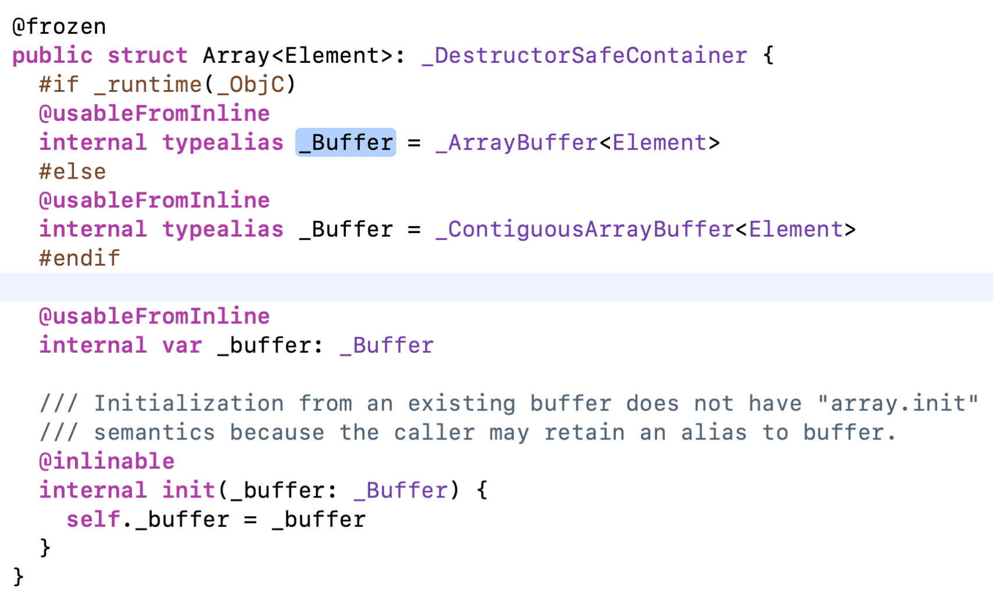

`storageAddr` 是通过 `UnsafeMutablePointer` 方法生成的一个地址，后续会对`_storageAddr`进行加法操作。

##### _ContiguousArrayBuffer

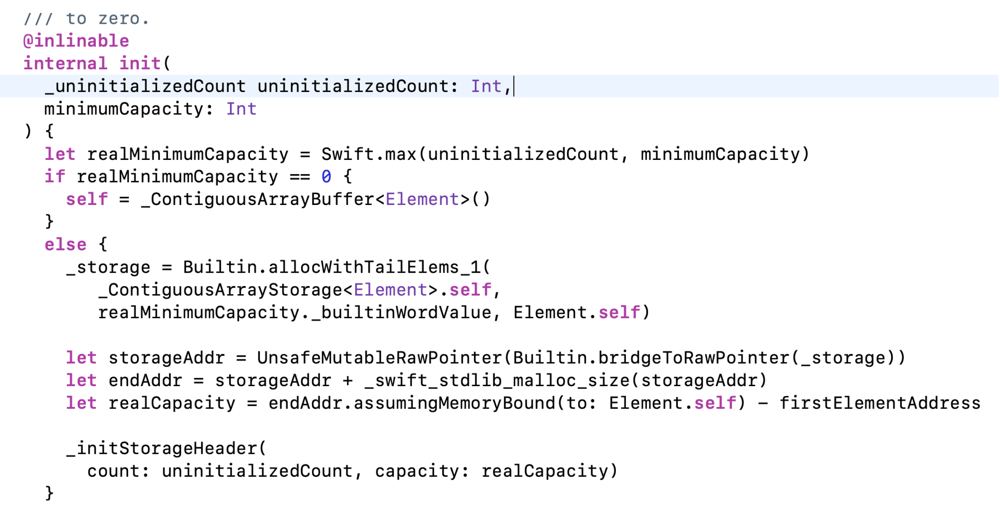

`_ContiguousArrayBuffer` 中 `getElement()` 方法的实现：

1. 首先判断了是否越界；
2. 通过下表访问，返回 `firstElementAddress[i]` 中第 `i` 个元素。`firstElementAddress` 方法中是基于 c/c++ 的指针操作。

##### _ContiguousArrayBuffer 的 getElement

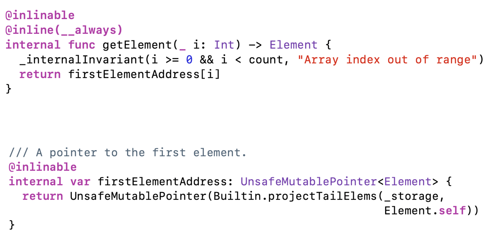

##### UnsafeMutablePointer 的下标操作

`UnsafeMutablePointer` 是 Array 的迭代器实现中真正的指针操作实现，基于 c/c++ 实现。

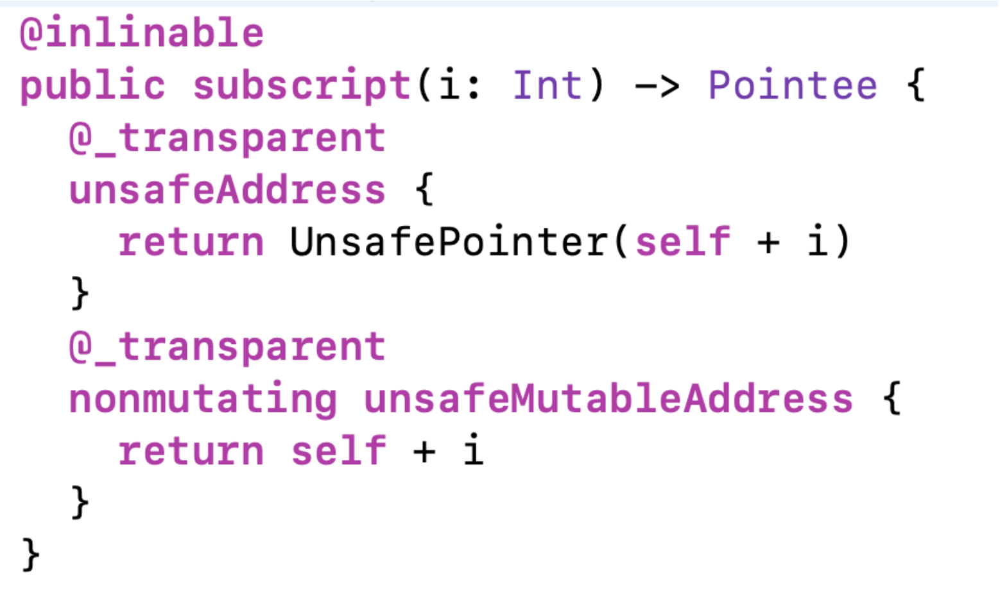

至此，数组迭代器的底层代码实现已经完成。数组的 `Iterator` 实际上是 `IndexingIterator`。因为 `IndexingIterator` 方法传入的参数是 self，所以 `next()` 方法实际是对 self（数组）的下标进行操作。而数组的下标操作又会转化成 ArrayBuffer 的下标操作。

在阅读数组源码的过程中，主要包括两个步骤：

1. 先看顶层设计，包括 Sequence、IteratorProtocol、Collection。
2. 从关键的调用链开始，从 Iterator 的 `next()` 方法切入。 `subscrip(index:)`→`_getElement()`→`_buffer.getElement()`。

#### 问题：endIndex vs count

* endIdex 是 Self.index 类型。
* count 是 Int 类型。

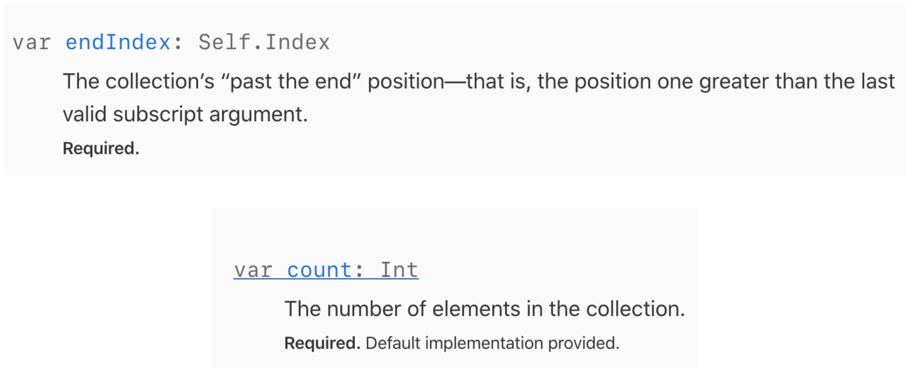

##### 探索-索引

官方文档指出，所有实现 Collection 协议类，必须提供 startIndex 和 endIndex 两个属性，并且读取这两个属性的时间复杂度是 O(1) 的。因为在读取一个前向或双向的 Collection 的 count 属性时，需要遍历整个 Collection 的所有元素，所以其复杂度是 O(n) 的。

即：

对于一个随机存储的数组，获取 count 的时间复杂度是 O(1) 的。

对于一个链表实现的数组，获取 count 的时间复杂度是 O(n) 的，startIndex 和 endIndex 属性获取是 O(1) 的。在遍历一个链表数组时，如果使用 startIndex 或 endIndex 遍历，会比使用 count 遍历更加便捷。

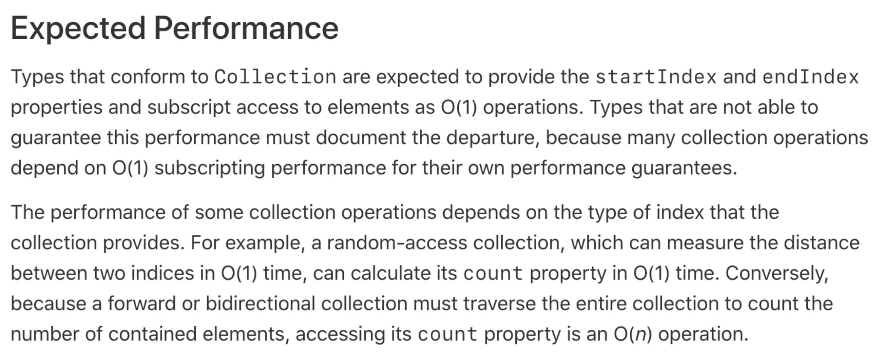

左侧是 String 的 endIndex 和 count 的实现。endIndex 返回的是 _guits.endIndex()，是 O(1) 复杂度的。count 返回的是从 startIndex 到 endIndex 的计算结果，复杂度是非 O(1) 的。

右侧是 Array 的 endIndex 和 count 的实现。两者的实现是一样的。

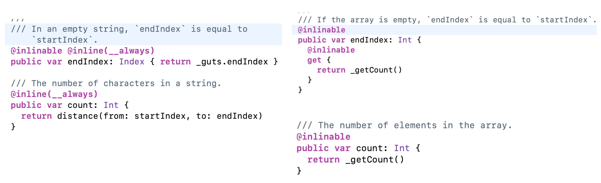

##### 探索

* 阅读 `removeFirst` 方法的源码，得出 `removeFirst` 的复杂度。

* 阅读 `sort` 方法的源码，了解 Array 的排序方法。

#### 实现栈和队列

#### Stack

栈（Stack）是一种 **后入先出（Last in First Out）** 的数据结构，仅限定在栈顶进行插入或者删除操作。栈结构的实现应用主要有数制转换、括号匹配、表达式求值等等。

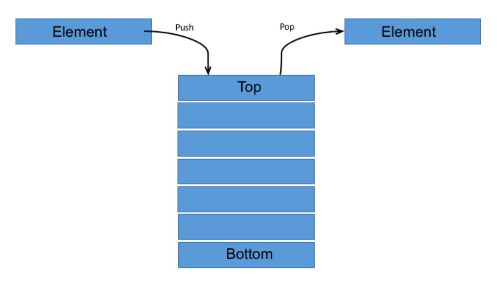

```swift
struct Stack <T> {
    private var elements = [T]()
    
    var count: Int {
        return elements.count
    }
    
    var isEmpty: Bool {
        return elements.isEmpty
    }
    
    var peek: T? {
        return elements.last
    }
    
    mutating func push(_ element: T) {
        elements.append(element)
    }
    
    mutating func pop() -> T? {
        return elements.popLast()
    }
}

var stack = Stack<Int>()
stack.push(1)
stack.push(3)
stack.push(8)
print(stack.pop() ?? 0)  // "8"
print(stack.count)       // "2"
```

#### Queue

队列在生活中非常常见。排队等位吃饭、在火车站卖票、通过高速路口等，这些生活中的现象很好的描述了队列的特点：先进先出（FIFO，first in first out），排在最前面的先出来，后面来的只能排在最后面。

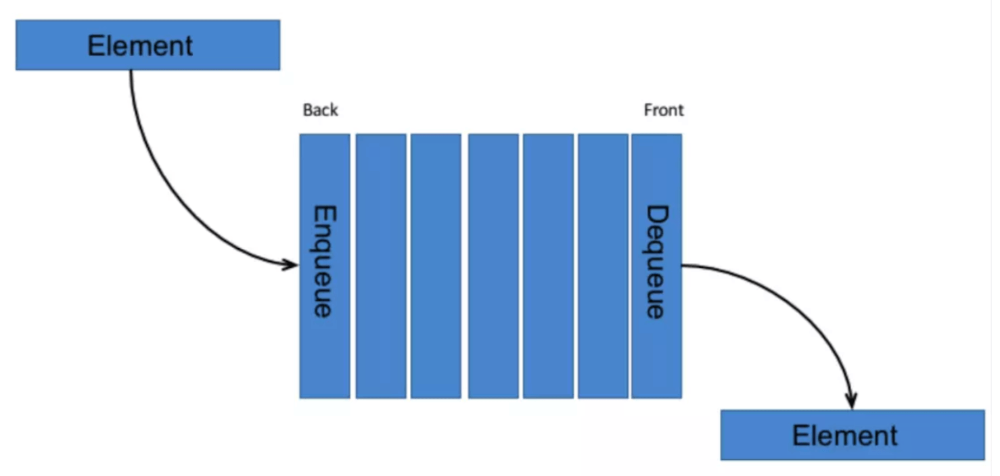

```swift
struct Queue<T> {
    private var elements : [T] = []
    
    var count: Int {
        return elements.count
    }
    
    var isEmpty: Bool {
        return elements.isEmpty
    }
    
    var peek: T? {
        return elements.first
    }
    
    mutating func enqueue(_ element: T) {
        elements.append(element)
    }
    
    mutating func dequeue() -> T? {
        return isEmpty ? nil : elements.removeFirst();
    }
}

var queue = Queue<Int>()
queue.enqueue(1)
queue.enqueue(3)
queue.enqueue(8)
print(queue.dequeue() ?? 0)  // "1"
print(queue.count)           // "2"
```

#### 练习

尝试改造 Stack 和 Queue 的代码让实现 Sequence 协议，支持 For-in 循环。

```swift
struct QueueIterator<T>: IteratorProtocol {
    let elements: [T]
    var index: Int = 0
    
    init(_ elements: [T]) {
        self.elements = elements
    }
    
    mutating func next() -> T? {
        if index >= elements.count {
            return nil
        }
        let element: T = elements[index];
        index += 1
        return element
    }
    
    typealias Element = T
}

struct Queue<T> : Sequence {
    private var elements : [T] = []
        
    var count: Int {
        return elements.count
    }
    
    var isEmpty: Bool {
        return elements.isEmpty
    }
    
    var peek: T? {
        return elements.first
    }
    
    mutating func enqueue(_ element: T) {
        elements.append(element)
    }
    
    mutating func dequeue() -> T? {
        return isEmpty ? nil : elements.removeFirst();
    }
    
    typealias Iterator = QueueIterator
    func makeIterator() -> Queue.Iterator<T> {
        return QueueIterator(elements)
    }
}

var queue = Queue<Int>()
queue.enqueue(1)
queue.enqueue(3)
queue.enqueue(8)

for element in queue {
    print(element)
}
```

打印结果：

```js
1
3
8
```

总结：实现 Sequence 协议，需要实现 Sequence 创建迭代器的方法 `makeIterator()`，迭代器则负责实现 `next()` 方法序列的下一个元素，从而实现对序列的遍历。

## Set

Set（集合）是指具有某种特定性质的具体的或抽象的对象汇总而成的集体。其中，构成 Set 的这些对象则称为该 Set 的元素。

集合的三个特性

1. 确定性：给定一个集合，任给一个元素，该元素或者属于或者不属于该集合，二者必居其一。
2. 互斥性：一个集合中，任何两个元素都认为是不相同的，即**每个元素只出现一次**。
3. 无序性：一个集合中，每个元素的地位都是相同的，**元素之间是无序的**。

Swift 的集合类型写做 `Set<Element>`，这里的 Element 是 Set 要储存的类型。不同于数组，集合没有等价的简写。

### 创建 Set

1、使用**初始化器**语法来创建一个确定类型的空 Set：

```swift
var letters = Set<Character>()
letters.insert("c")
print(letters)
```

2、使用**数组字面量**创建 Set：

```swift
var course: Set<String> = ["Math", "English", "History"]
course.insert("History")
print(course)
```

### Set 类型的哈希值

为了能让类型储存在 Set 中，它必须是可哈希的——就是说类型必须提供计算它自身哈希值的方法。

所有 Swift 的基础类型，比如 `String`，`Int`，`Double` 和 `Bool` 默认都是可哈希的，并且可以用于 Set 或者 DIctionary 的键。

报错信息：Person 没有实现 Hashable 协议。

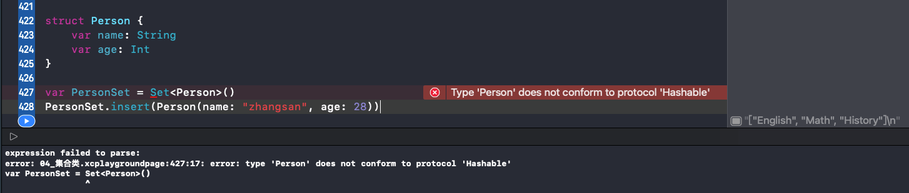

让 Person 实现 Hashable 协议：

```swift
struct Person {
    var name: String
    var age: Int
}

extension Person: Hashable {
    func hash(into hasher: inout Hasher) {
        hasher.combine(name)
        hasher.combine(age)
    }
}

var PersonSet = Set<Person>()
PersonSet.insert(Person(name: "zhangsan", age: 28))
// Prints '[__lldb_expr_28.Person(name: "zhangsan", age: 28)]'
```

### 访问和修改 Set

#### 遍历 Set

可以使用 `For-In` 遍历 Set。

```swift
let courses: Set = ["Math", "English", "History"]
for course in courses {
    print(course)
}
```

打印结果：

```js
History
Math
English
```

因为 Set 是无序的，如果需要顺序遍历 Set，可以使用 `sorted()` 方法进行排序。

```swift
for course in courses.sorted() {
    print(course)
}
```

打印结果：

```js
English
History
Math
```

#### 访问 Set

使用 `count` 获取 Set 里元素个数。

```swift
let set: Set<Character> = ["A", "B", "C"]
print(set.count)
//Prints '3'
```

使用 `isEmpty` 判断 Set 是否为空。

```swift
let set: Set<Character> = ["A", "B", "C"]
print(set.isEmpty)
// 'false'
```

#### 添加元素

`insert(_:)`：添加一个元素到 Set。

```swift
struct Person {
    var name: String
    var age: Int
}

extension Person: Hashable {
    func hash(into hasher: inout Hasher) {
        hasher.combine(name)
        hasher.combine(age)
    }
}

var personSet = Set<Person>()
personSet.insert(Person(name: "zhangsan", age: 28))  // '[__lldb_expr_28.Person(name: "zhangsan", age: 28)]'
```

`update(with:)`：如果已经有相等的元素，替换为新元素。如果 Set 中没有，则插入。

```swift
struct Person {
    var name: String
    var age: Int
}

extension Person: Hashable {
    func hash(into hasher: inout Hasher) {
        hasher.combine(name)
        hasher.combine(age)
    }
}

extension Person: Equatable {
    static func == (lhs: Person, rhs: Person) -> Bool {
        return lhs.name == rhs.name
    }
}

var personSet : Set = [Person(name: "zhangsan", age: 28)]
personSet.update(with: Person(name: "wangwu", age: 18))    // '[__lldb_expr_44.Person(name: "zhangsan", age: 28), __lldb_expr_44.Person(name: "wangwu", age: 18)]'
personSet.update(with: Person(name: "zhangsan", age: 18))  // '[__lldb_expr_44.Person(name: "zhangsan", age: 18), __lldb_expr_44.Person(name: "wangwu", age: 18)]'
```

在使用 `update(with:)` 方法时，需要保证集合内的元素实现了 `Equatable` 协议，用来判断两个元素是否相等。

#### 移除元素

`filter(_:)`：返回一个新的 Set，新 Set 的元素是原始 Set 符合条件的元素。

```swift
struct Person {
    var name: String
    var age: Int
}

extension Person: Hashable {
    func hash(into hasher: inout Hasher) {
        hasher.combine(name)
        hasher.combine(age)
    }
}

extension Person: Equatable {
    static func == (lhs: Person, rhs: Person) -> Bool {
        return lhs.name == rhs.name
    }
}

var personSet : Set = [Person(name: "zhangsan", age: 28), Person(name: "wangwu", age: 18)]
print(personSet.filter{ $0.age > 20 })  // '[__lldb_expr_59.Person(name: "zhangsan", age: 28)]'
print(personSet)                        // '[__lldb_expr_59.Person(name: "wangwu", age: 18), __lldb_expr_59.Person(name: "zhangsan", age: 28)]'
```

`remove(_:)`：从 Set 当中移除一个元素，如果元素是 Set 的成员就移除它，并且返回移除的值。如果集合没有这个成员就返回 nil。

```swift
struct Person {
    var name: String
    var age: Int
}

extension Person: Hashable {
    func hash(into hasher: inout Hasher) {
        hasher.combine(name)
        hasher.combine(age)
    }
}

extension Person: Equatable {
    static func == (lhs: Person, rhs: Person) -> Bool {
        return lhs.name == rhs.name
    }
}

var personSet : Set = [Person(name: "zhangsan", age: 28), Person(name: "wangwu", age: 18)]
personSet.remove(Person(name: "zhangsan", age: 33))
print(personSet)
// Prints '[__lldb_expr_67.Person(name: "wangwu", age: 18)]'
```

`removeAll()`：移除所有元素。

```swift
var personSet : Set = [Person(name: "zhangsan", age: 28), Person(name: "wangwu", age: 18)]
personSet.removeAll()
print(personSet)
// Prints '[]'
```

`removeFirst()`：移除 Set 的第一个元素，因为 Set 是无序的，所以第一个元素并不是放入的第一个元素。

```swift
var personSet : Set = [Person(name: "zhangsan", age: 28), Person(name: "wangwu", age: 18)]
personSet.removeFirst()
print(personSet)
// Prints '[__lldb_expr_71.Person(name: "zhangsan", age: 28)]'
```

### 基本 Set 操作

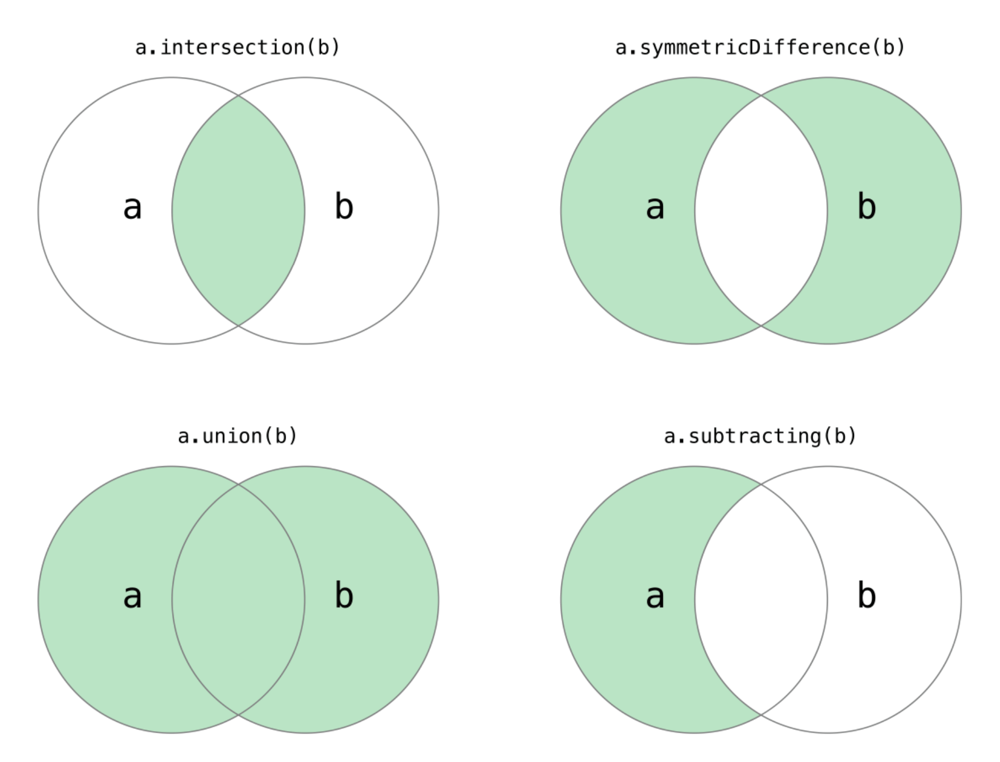

`intersection(_:)`：交集，由属于 A 且属于 B 的相同元素组成的集合，记作 A∩B（或 B∩A）。

```swift
let set1: Set<Character> = ["A", "B", "C"]
let set2: Set<Character> = ["B", "E", "F", "G"]
print(set1.intersection(set2))
// Prints '["B"]'
```

`union(_:)`：并集，由属于 A 或者属于 B 的所有元素组成的集合，记作 A∪B（或 B∪A）。

```swift
let set1: Set<Character> = ["A", "B", "C"]
let set2: Set<Character> = ["B", "E", "F", "G"]
print(set1.union(set2))
// Prints '["F", "G", "C", "A", "E", "B"]'
```

`symmetricDifference(_:)`：对称差集，集合 A 与集合 B 的对称差集定义为集合 A 与集合 B 中所有不属于 A∩B 的元素的集合。

```swift
let set1: Set<Character> = ["A", "B", "C"]
let set2: Set<Character> = ["B", "E", "F", "G"]
print(set1.symmetricDifference(set2))
// Prints '["G", "C", "A", "E", "F"]'
```

`subtracting(_:)`：相对补集，由属于 A 而不属于 B 的元素组成的集合，称为 B 关于 A 的相对补集，记作 A-B 或 A\B。

```swift
let set1: Set<Character> = ["A", "B", "C"]
let set2: Set<Character> = ["B", "E", "F", "G"]
print(set1.subtracting(set2))
// Prints '["C", "A"]'
```

#### Set 判断方法

`isSubset(of:)`：判断是否是另一个 Set 或者 Sequence 的子集。

```swift
let smallSet: Set = [1, 2, 3]
let bigSet: Set = [1, 2, 3, 4]
print(smallSet.isSubset(of: bigSet))
// Prints 'true'
```

`isSuperset(of:)`：判断是否是另一个 Set 或者 Sequence 的超集。

```swift
let smallSet: Set = [1, 2, 3]
let bigSet: Set = [1, 2, 3, 4]
print(bigSet.isSuperset(of: smallSet))
// Prints 'true'
```

`isStrictSubset(of:)` ：判断是否是另一个 Set 的**子集**，但是又不等于另一个 Set。

```swift
let smallSet: Set = [1, 2, 3]
let bigSet: Set = [1, 2, 3, 4]
print(smallSet.isStrictSubset(of: bigSet))
// Prints 'true'
```

`isStrictSuperset(of:)`：判断是否是另一个 Set 的**超集**，但是又不等于另一个 Set。

```swift
let smallSet: Set = [1, 2, 3]
let bigSet: Set = [1, 2, 3, 4]
print(bigSet.isStrictSuperset(of: smallSet))
// Prints 'true'
```

`isDisjoint(with:)`：判断两个 Set 是否不相交，如果不相交返回 `true`，如果相交返回 `false`。

```swift
let smallSet: Set = [1, 2, 3]
let bigSet: Set = [1, 2, 3, 4]
print(smallSet.isDisjoint(with: bigSet))
// Prints 'false'
```

### Set-练习

* 给定一个集合，返回这个集合所有的子集。

#### 思路1-位

解这道题的思想本质上就是元素选与不选的问题，于是就可以想到用二进制来代表选与不选的情况。“1”代表这个元素已经选择，而“0”代表这个元素没有选择。假如三个元素 A B C，那么 101 就代表 B 没有选择，所以 101 代表的子集为 AC。

```swift
func getSubsetsOfSet<T>(_ set1: Set<T>) -> Array<Set<T>> {
    // 子集有 2^n 个
    let count = 1 << set1.count
    // 使用数组，方便使用下标
    let elements = Array(set1)
    var subsets = Array<Set<T>>()
    // 遍历 2^n 个子集对应的下标
    for i in 0..<count {
        var subSet = Set<T>()
        for j in 0..<set1.count {
            // 当子集的下标对应的二进制位为1时，放入子集中
            if ((i >> j) & 1) == 1 {
                subSet.insert(elements[j])
            }
        }
        subsets.append(subSet)
    }
    return subsets
}

let set1: Set = ["A", "B", "C"]
let subSets = getSubsetsOfSet(set1)
for subset in subSets {
    print(subset)
}
```

打印结果：

```js
[]
["A"]
["B"]
["A", "B"]
["C"]
["A", "C"]
["B", "C"]
["A", "B", "C"]
```

打印结果解析：

第0个子集，二进制 000，没有元素
第1个子集，二进制 001，有一个元素 A
第2个子集，二进制 010，有一个元素 B
第3个子集，二进制 011，有两个元素 A B
第4个子集，二进制 100，有一个元素 C
第5个子集，二进制 101，有两个元素 A C
第6个子集，二进制 110，有两个元素 A B
第7个子集，二进制 111，有三个元素 A B C

使用这种方式有一个注意项，因为二进制的最大长度是64，所有 count 不能超过64位。

#### 思路2-递归

```swift
func getSubsetsOfSet<T>(_ originSet: Set<T>) -> Array<Set<T>> {
    let elements = Array(originSet)
    return getSubsetsOfSet2(elements, elements.count - 1)
}

func getSubsetsOfSet2<T>(_ elements: Array<T>, _ index: Int) -> Array<Set<T>> {
    var subSets = Array<Set<T>>()
    if index == 0 {
        // 空集
        subSets.append(Set<T>())
        // 只有一个元素
        var subSet = Set<T>()
        subSet.insert(elements[index])
        subSets.append(subSet)
    } else {
        subSets = getSubsetsOfSet2(elements, index - 1)
        for subSet in subSets {
            // 根据 subSet 生成新的 currentSubSet，向 currentSubSet 中加入新的元素
            var currentSubSet = subSet
            currentSubSet.insert(elements[index])
            subSets.append(currentSubSet)
        }
    }
    return subSets
}

let originSet: Set = ["A", "B", "C"]
let subSets = getSubsetsOfSet(originSet)
for subSet in subSets {
    print(subSet)
}
```

打印结果：

```js
[]
["A"]
["B"]
["A", "B"]
["C"]
["C", "A"]
["B", "C"]
["A", "B", "C"]
```

index == 0，一个元素，生成两个子集，`[] ["A"]`
index == 1，两个元素，生成四个子集，`[] ["A"]` `["B"] ["A", "B"]`
index == 2，三个元素，生成八个子集，`[] ["A"]` `["B"] ["A", "B"]` `["C"] ["A", "C"] ["B", "C"] ["A", "B", "C"]`

### Set 实现探秘

1. 先看顶层设计，再看底层源码实现。
2. 从关键方法开始，沿着调用链阅读。

主要包括两个部分：

1. 使用 HashTable 存放 bucket。
2. 使用 elements 存放 元素。

线性探测的开放寻址法：

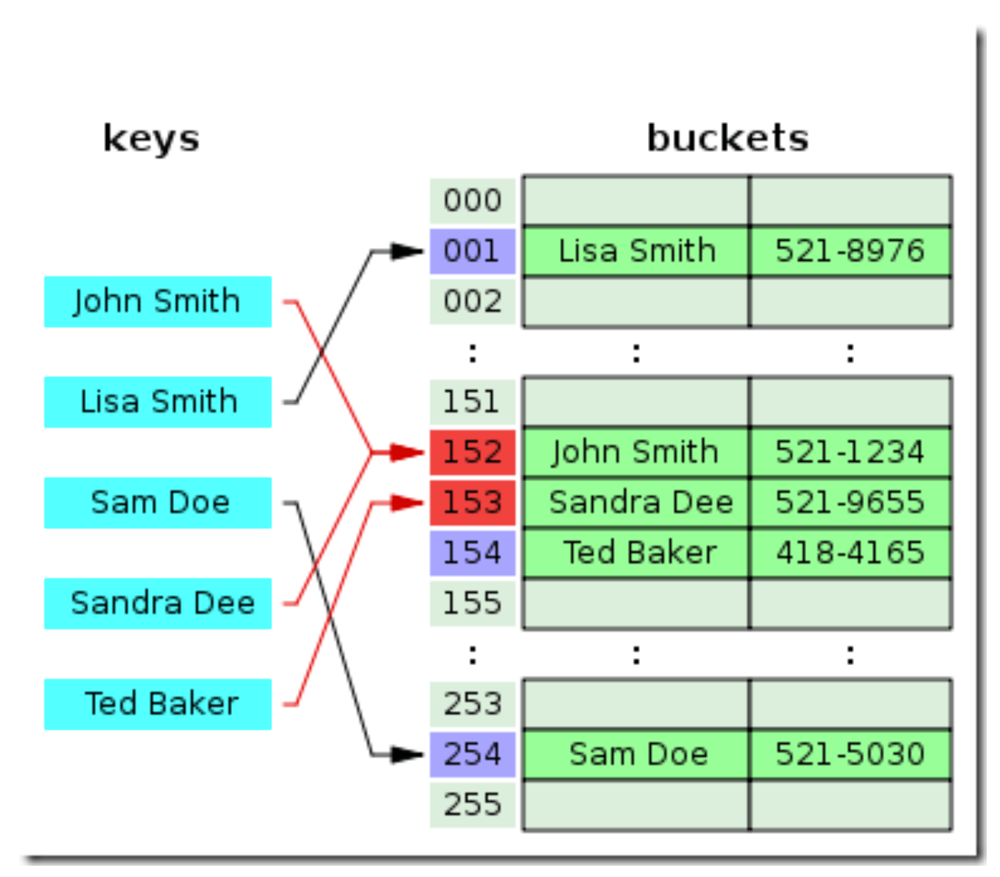

左侧是 keys，右侧是 buckets。

John Smith 通过计算找到 bucket，因为 bucket 没有被占用，所以可以直接进行存储。
Sam Doe 通过计算得找到 bucket，因为 bucket 被占用，寻找下一个 bucket01，因为 bucket01 没有被占用，所以可以使用 bucket01 进行存储。

#### 从 Set 的 insert 说起

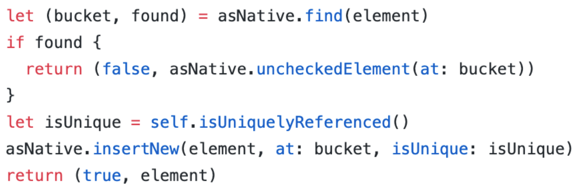

这是 `inser()` 的关键代码，用到的核心方法是 `find()` 和 `insertNew()`。

#### _NativeSet 的 find 方法

`find()`：查找桶（Bucket），找到后直接使用并返回。没有找到则调用 `insertNew()`。主要用到了 HasTable 的 `idealBucket()` 和 `bucket()` 方法。

`_isOccupied()`：判断桶是否被占用。

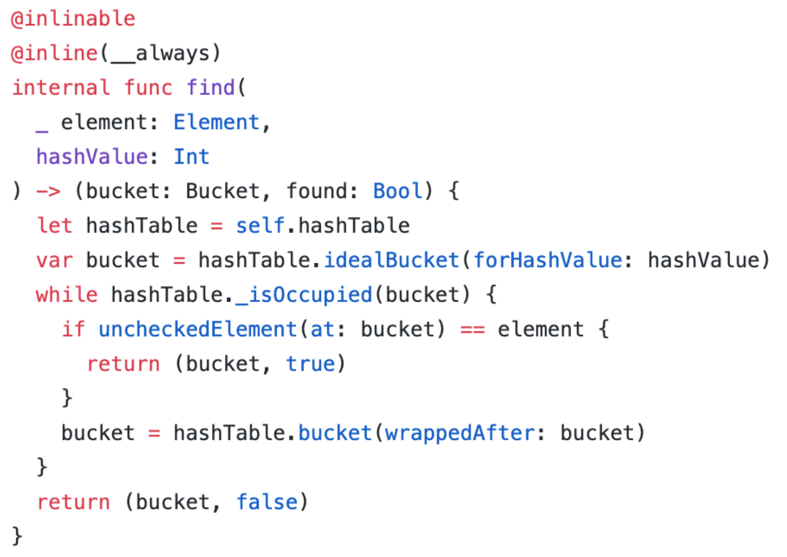

#### HashTable

`idealBucket()`：找到对应的 bucket。
`bucket()`：找到当前 bucket 的后一个 bucket。

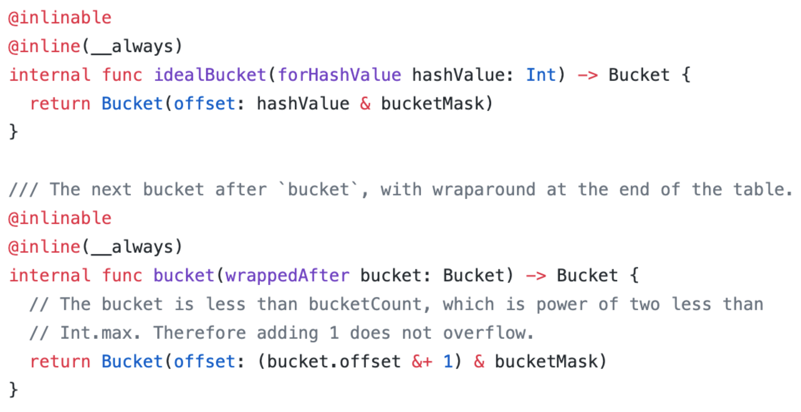

从 HashTable 的源码可以看到，`bucketMask = bucketCount &-1`，与上 `-1` 可以保证 `bucket.offset & bucketMask` 小于 bucketCount，`hashValue & bucketMask` 小于 bucketCount。

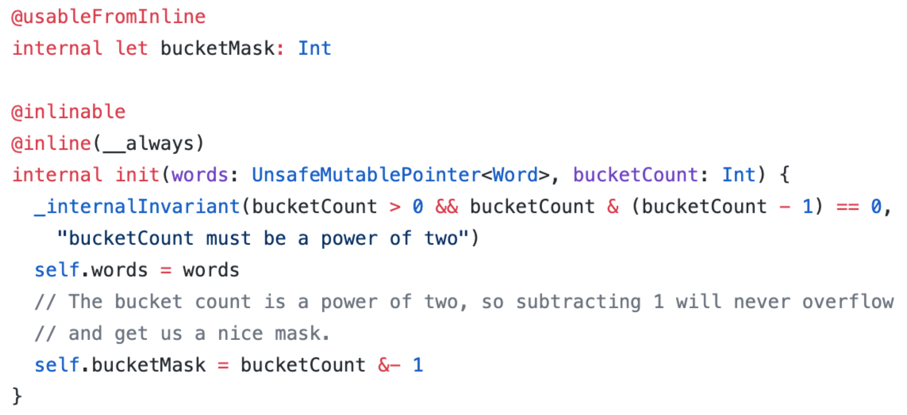

#### _NativeSet 的 insertNew

_isDebugAssertConfiguration() 是 debug 代码，可以直接看 else 里的代码，是调用了 HashTable 的 `insertNew()` 方法。

`insertNew()` 根据 hashValue 找到 bucket，再调用 `uncheckedInitialize()` 插入数据。

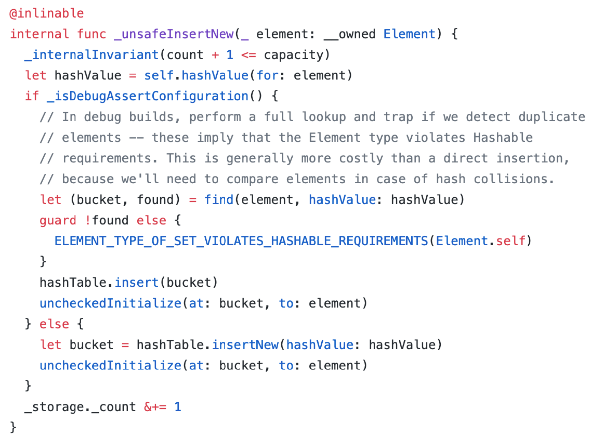

#### HashTable 的 insertNew

根据 hashValue 找到可用的 bucket。

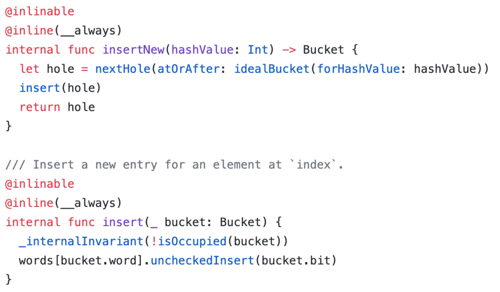

#### _NativeSet 的 uncheckedInitialize

根据 `_elements` 首地址值加偏移量 `bucket.offset` 得到插入位置，插入数据。

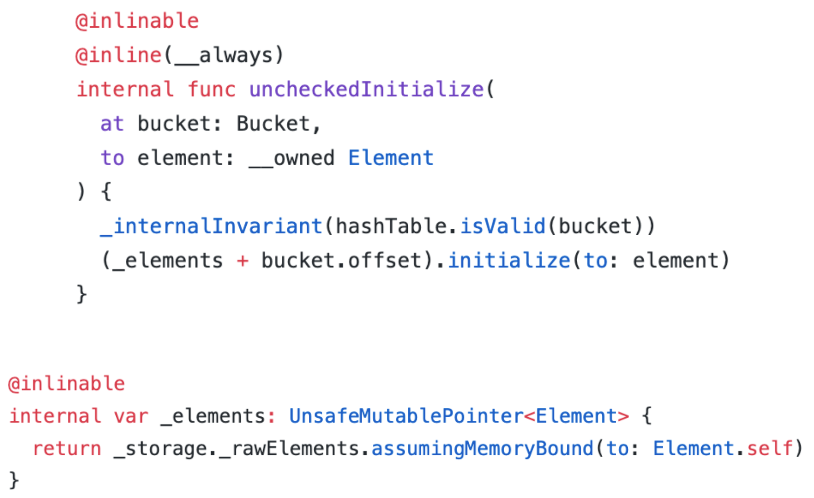

## 字典

字典：储存无序的互相关联的同一类型的键和同一类型的值的集合。

字典类型的全写方式 `Dictionary<Key, Value>`，简写方式 `[Key: Value]`，建议使用简写方式。其中字典的 Key 必须是可哈希的。

### 创建空字典

1、初始器方式

```swift
var dic = Dictionary<String, Int>()
```

2、简写方式

```swift
var dic = [String: Int]()
```

3、字面量方式

```swift
var dic3: Dictionary<String, Int> = [:]
```

### 字面量创建字典

字典字面量：`[key1:value1, key2:value2, key3:value3]`

```swift
let dic = ["zhangsan": 18, "lishi": 19, "wangwu": 20]
```

#### count 和 isEmpty

`count`：只读属性，找出 Dictionary 拥有多少元素。

```swift
let dic = ["zhangsan": 18, "lishi": 19, "wangwu": 20]
print(dic.count)
// Prints '3'
```

`isEmpty`：布尔量属性，检查字典是否为空。

```swift
let dic = ["zhangsan": 18, "lishi": 19, "wangwu": 20]
print(dic.isEmpty)
// Prints 'false'
```

### 遍历字典

`For-In`循环

```swift
let dic = ["zhangsan": 18, "lishi": 19, "wangwu": 20]

for (key, value) in dic {
    print("name \(key), age \(value)")
}
```

打印结果：

```js
name lishi, age 19
name wangwu, age 20
name zhangsan, age 18
```

可以通过字典的 keys 或 values 属性遍历字典的键或值的集合。

```swift
let dic = ["zhangsan": 18, "lishi": 19, "wangwu": 20]

for key in dic.keys {
    print("name \(key)")
}

for key in dic.values {
    print("name \(key)")
}
```

打印结果：

```js
name zhangsan
name wangwu
name lishi
name 18
name 20
name 19
```

Swift 的 Dictionary 类型是无序的，可以通过对 keys 或 values 调用 sort() 方法排序，来遍历有序的键或值。

```swift
let dic = ["zhangsan": 18, "lishi": 19, "wangwu": 20]

for key in dic.keys.sorted() {
    print("name \(key), age \(dic[key])")
}
```

打印结果：

```swift
name lishi, age Optional(19)
name wangwu, age Optional(20)
name zhangsan, age Optional(18)
```

### 操作字典

#### 添加或更新元素

1、使用下标添加或更新元素。

```swift
var dic = ["zhangsan": 18, "lishi": 19, "wangwu": 20]
dic["zhangsan"] = 28  // '["lishi": 19, "zhangsan": 28, "wangwu": 20]'
```

2、使用 `updateValue(_:forKey)` 方法添加或更新元素，返回一个字典值类型的可选项值。

```swift
var dic = ["zhangsan": 18, "lishi": 19, "wangwu": 20]
dic.updateValue(29, forKey: "lishi")  // '["wangwu": 20, "zhangsan": 18, "lishi": 29]'
```

#### 字典-移除元素

1、可以使用下标脚本语法给一个键赋值 `nil`，实现从字典中移除该键值对。

```swift
var dic = ["zhangsan": 18, "lishi": 19, "wangwu": 20]
dic["zhangsan"] = nil  // '["lishi": 19, "wangwu": 20]'
```

2、也可以使用 `removeValue(forKey:)` 从字典中移除键值对。

```swift
var dic = ["zhangsan": 18, "lishi": 19, "wangwu": 20]
print(dic.removeValue(forKey: "zhangsan") ?? 0)  // '18'
print(dic)                                       // '["lishi": 19, "wangwu": 20]'
print(dic.removeValue(forKey: "zhangsan"))       // 'nil'
```

在使用这个方法移除键值对时，如果键值对存在则返回其 `value`，如果不存在则返回 `nil`。

#### 合并两个字典

`merge(_:uniquingKeysWith:)`

1、保留旧值

```swift
var dictionary = ["a": 1, "b": 2]
dictionary.merge(["a": 3, "c": 4]) { (current, _) in current }
print(dictionary)
// Prints '["b": 2, "c": 4, "a": 1]'
```

2、保留新值

```swift
var dictionary = ["a": 1, "b": 2]
dictionary.merge(["a": 5, "d": 6]) { (_, new) in new }
print(dictionary)
// Prints '["a": 5, "b": 2, "d": 6, "c": 4]'
```

#### firstIndex

虽然字典是无序的，但是每个kv对（键值对）在扩容之前的位置是确定的。可以通过 `firstIndex` 获取某个kv对的位置。

```swift
let imagePaths = ["star": "/glyphs/stat.png",
                  "protrait": "/images/content/portrait.jpg",
                  "spacer": "/images/shared/spacer.gif"]
let glyphIndex = imagePaths.firstIndex(where: { $0.value.hasPrefix("/glyphs") })

if let index = glyphIndex {
    print(index)
    print("The '\(imagePaths[index].key)' image is a glyph.")
} else {
    print("No glyphs found!")
}
```

打印结果：

```js
Index(_variant: Swift.Dictionary<Swift.String, Swift.String>.Index._Variant.native(Swift._HashTable.Index(bucket: Swift._HashTable.Bucket(offset: 1), age: -1384877248)))
The 'star' image is a glyph.
```

如果需要保持顺序的kv对，可以是用 KeyValuePairs。

```swift
let recordTimes: KeyValuePairs = ["Florence Griffith-Joyner": 10.49,
                                  "Evelyn Ashford": 10.76,
                                  "Evelyn Ashford": 10.79,
                                  "Marlies Gohr": 10.81]
print(recordTimes.first)
// Prints 'Optional((key: "Florence Griffith-Joyner", value: 10.49))'
```

### 字典实现探秘

从关键方法开始，沿着调用链阅读。从 set 方法开始。

#### 从下标操作说起

字典的关键操作跟 set 方法类似，就是下标操作。

`subscript(key:)`：字典的 set 方法，参数是 `Key`，返回值是可选 `Value?`。

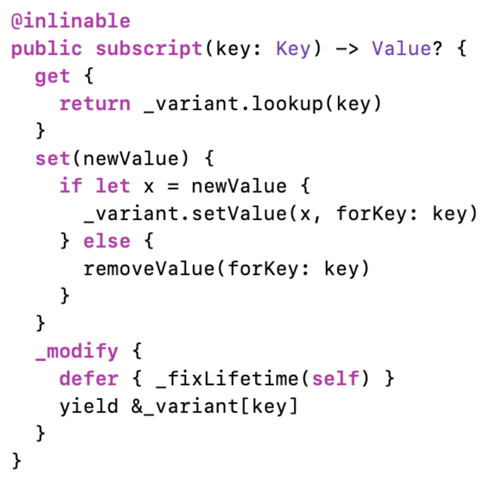

`lookup()`：get 方法通过 lookup() 方法找到对应的 value。

`setValue()`：写入新值。

#### Dictionary._Variant 的 setValue

`setValue(_ value: __owned Value, forKey key: Key)`：写入新值。需要两个参数，值、键。

源码包括 OC 和 Swift 两个实现，最后两行是 Swift 实现部分。

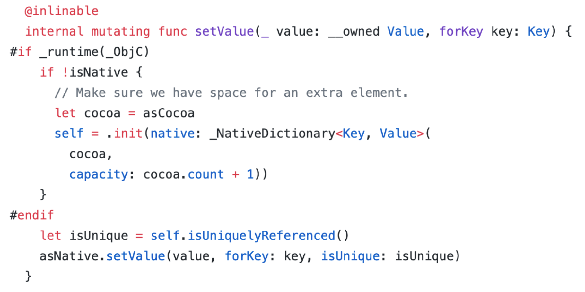

调用链：`setValue()` → `asNative.setValue()`。

`isUniquelyReferenced()`：判断当前 Dictionary 是否唯一。

`asNative` 是 `_NativeDictionary`，主要负责实现 `setValue()` 方法👇。

#### _NativeDictionary 的 setValue

`setValue(_ value: __owned Value, forKey key: Key, isUnique: Bool)`：可以看到需要三个参数，值、键、是否唯一。

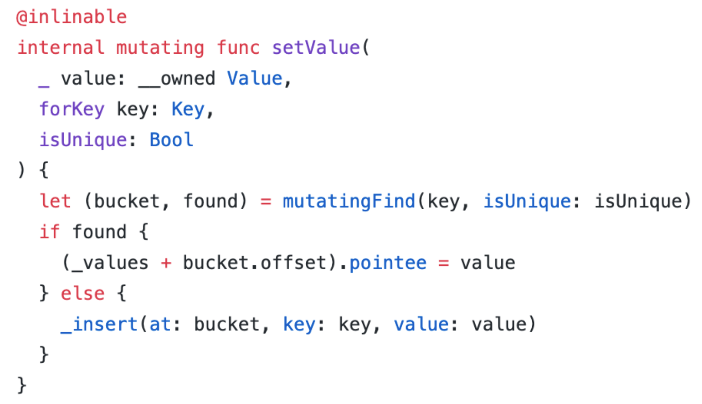

实现部分和 `insertNew()` 类似，采用的也是开放寻址法。

如果找到了，则根据 `_values` 首地址值加上桶的偏移量 `bucket.offset` 计算出位置，存放 value。

如果没找到，则调用 `_insert()` 方法👇。

#### _NativeDictionary 的_insert

`_insert(at bucket: Bucket, key: __owned Key, value: __owned Value)`：需要三个参数，桶、键、值。

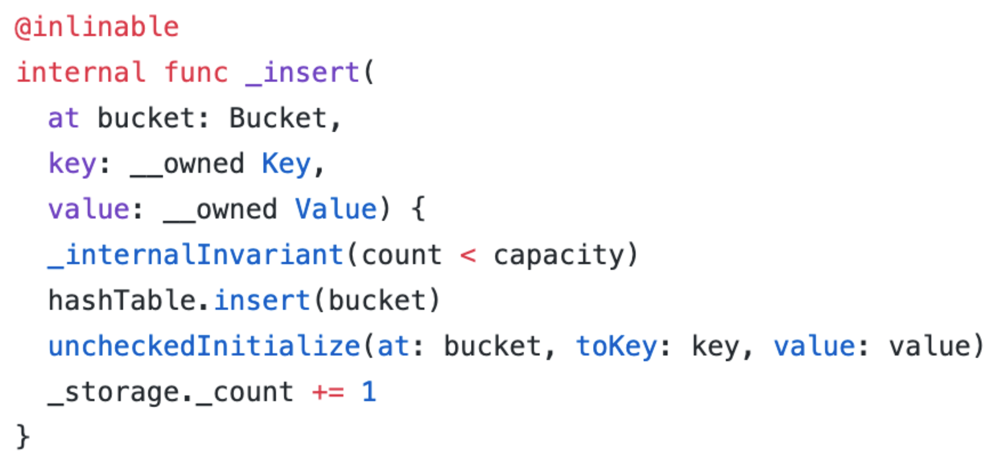

`hashTable.insert(bucket)`：将桶插入到哈希表里。

`uncheckedInitialize()`：保存键值。

>两个关键操作：
>
>1. 保存桶到哈希表。
>2. 保存键值。

#### _NativeDictionary 的 uncheckedInitialize

`uncheckedInitialize(at bucket: Bucket, toKey key: __owned Key, value: __owned Value)`：需要三个参数，桶、键、值。

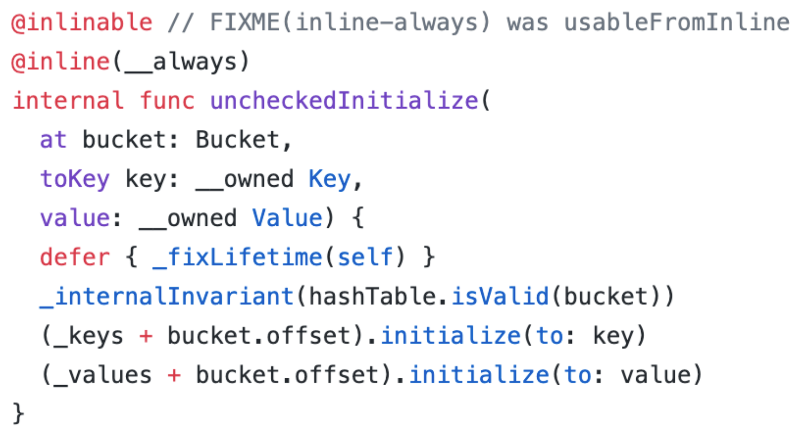

`(_keys + bucket.offset).initialize(to: key)`：根据 _keys 的首地址加上桶的偏移量 bucket.offset 计算出位置，存放 key。

`(_values + bucket.offset).initialize(to: value)`：根据 _values 的首地址加上桶的偏移量 bucket.offset 计算出位置，存放 key。

>两个关键操作：
>
>1. 保存key。
>2. 保存value。

#### _NativeDictionary 的 findKey

`find(_ key: Key, hashValue: Int) -> (bucket: Bucket, found: Bool)`：需要两个参数，键、键的哈希值。返回结果包括两个内容，桶、是否存在。

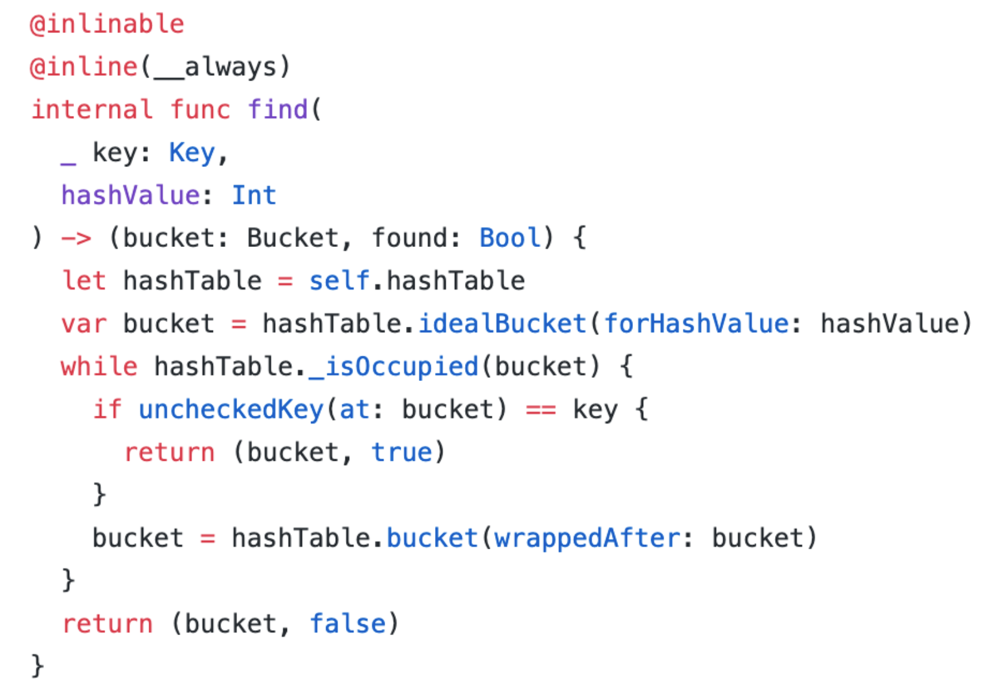

`idealBucket()`：根据哈希值查找桶。

`_isOccupied()`：桶是否被占用。

`bucket(wrappedAfter:)`：从当前 bucket 开始向后查找桶。

>两个关键操作：
>
>1. 根据哈希值查找对应的桶。
>2. 查找没有被占用的桶。
