* [概述](#概述)
* [枚举](#枚举)
* [属性](#属性)
* [方法](#方法)
* [下标](#下标)
* [初始化和反初始化](#初始化和反初始化)
* [继承](#继承)
* [多态](#多态)
* [扩展](#扩展)
* [协议](#协议)
* [协议和扩展](#协议和扩展)
* [面向协议编程](#面向协议编程)

<!-- more -->

## 概述

Swift 的类、结构体、枚举中都可以定义属性、方法、下标、构造体和嵌套类型。在 Swift 中，枚举和结构体是值类型，类是引用类型。从整体的功能上看 Swift 的枚举、结构体、类三者具有完全平等的地位。

### 面向对象的三大特性

1. **封装（Encapsulation）**：隐藏类的实现细节，让使用者只能通过预定的方法来访问。
2. **继承（inheritance）**：指子类从父类继承方法，使得子类具有父类相同的行为。通过继承创建的新类称为“子类”或“派生类”，被继承的类称为“基类”、“父类”或“超类”。继承的过程，就是从一般到特殊的过程。
3. **多态（polymorphism）**：指同一个方法在不同的对象上有不同的实现方式。

### 基本单元

1. 枚举（enum）
2. 结构体（struct）
3. 类（class）
4. 协议（protocol）
5. 扩展（extension）

### 类和结构体相似点

1. **属性**：定义属性用来存储值；
2. **方法**：定义方法用于提供功能；
3. **下标**：定义下标脚本用来允许使用下标语法访问值；
4. **扩展**：可以被扩展提供默认所没有的功能；
5. **协议**：遵循协议来针对特定类型提供标准功能。
6. **初始化器**：定义初始化器用于初始化状态；

### 类和结构体的不同点

1. **继承**：允许一个类继承另一个类的特征；
2. **类型转换**：允许在运行时检查和解释一个类实例的类型；
3. **反初始化器**：允许一个类实例释放所有被分配的资源；
4. **引用计数**：允许不止一个对类实例的引用。

## 枚举

### 枚举语法

用 `enum` 关键字来定义一个枚举，然后将所有的定义内容放在大括号`{}`中。

```swift
enum CompassPoint {
    case north
    case south
    case east
    case west
}
```

多个成员值可以出现在同一行中，用逗号隔开：

```swift
enum CompassPoint {
    case north, south, east, west
}
```

每个枚举都定义了一个全新的类型。枚举的名字需要首字母大写（例如：`CompassPoint`）。要给枚举类型起一个单数的名字，从而使得枚举能够通俗易懂、顾名思义。

### 使用 Switch 语句来匹配枚举值

使用 `switch` 语句匹配每一个单独的枚举值：

```swift
enum CompassPoint {
    case north, south, east, west
}

let directionToHead = CompassPoint.south
switch directionToHead {
case .north:
    print("north")
case .south:
    print("south")
case .east:
    print("east")
case .west:
    print("weat")
}

// Prints "south"
```

### 遍历枚举的 case

1. `CaseIterable`：通过在枚举名字后面写 `CaseIterable`，来允许枚举被遍历。
2. `allCases`：Swift 的枚举暴露了一个集合 `allCases`，同字面义，该集合包含对应枚举类型的所有情况。

```swift
enum CompassPoint: CaseIterable {
    case north
    case south
    case east
    case west
}

for direction in CompassPoint.allCases {
    print(direction)
}
```

打印结果：

```js
north
south
east
west
```

### 关联值

可以定义枚举来存储任意类型的关联值，不同枚举成员关联值的类型可以不同。

定义一个枚举，支持条形码和二维码：

```swift
enum Barcode {
    case upc(Int, Int, Int, Int)
    case qrCode(String)
}

var productBarCode = Barcode.upc(8, 85909, 51226, 3)
print(productBarCode)

productBarCode = .qrCode("ABCDEFGHIJKLMNOPQRSTUVWXYZ")
print(productBarCode)
```

打印结果：

```js
upc(8, 85909, 51226, 3)
qrCode("ABCDEFGHIJKLMNOPQRSTUVWXYZ")
```

`upc` 有四个关联值，都是 `Int` 类型；`qrCode` 有一个关联值，`String` 类型。

使用 `switch` **匹配值**：

```swift
switch productBarCode {
case .upc(let numberSystem, let manufacturer, let product, let check):
    print("UPC: \(numberSystem), \(manufacturer), \(product), \(check).")
case .qrCode(let productCode):
    print("QR code: \(productCode)")
}

// Prints "QR code: ABCDEFGHIJKLMNOPQRSTUVWXYZ"
```

### 原始值

原始值：指枚举成员可以用相同类型的**默认值**预先填充。

```swift
enum ASCIIControlCharacter: Character {
    case tab = "\t"
    case lineFeed = "\n"
    case carriageReturn = "\r"
}
```

#### 预设原始值

在操作存储整数或字符串原始值枚举的时候，因为Swift的枚举会自动分配值（在没有分配值时），所以不用显示的为每一个成员分配原始值。

```swift
enum Planet: Int {
    case mercury = 1, venus, earth, mars, jupiter, saturn, uranus, neptune
}

enum CompassPoint: String {
    case north, south, east, west
}
```

使用 `rawValue` 获取其值：

```swift
print(Planet.earth.rawValue)
// Prints "3"

print(CompassPoint.south.rawValue)
// Prints "south"
```

`.earth` 的原始值被自动分配成了 3，`.south` 的原始值被自动分配成了字符串“south”。

#### 从原始值初始化

枚举提供了一个默认初始化器，该初始化器可以接收一个形式参数 rawValue，返回一个枚举成员或者 nil。

使用初始化器创建一个枚举实例：

```swift
let possiblePlanet = Planet(rawValue: 7)
print(possiblePlanet!)
// Prints "uranus"
```

或者：

```swift
let positionToFind = 11
if let somePlanet = Planet(rawValue: positionToFind) {
    switch somePlanet {
    case .earth:
        print("earth")
    default:
        print("Not a safe place for humans")
    }
} else {
    print("There isn't a planet at position \(positionToFind)")
}
// Prints "There isn't a planet at position 11"
```

### 递归枚举（indirect）

递归枚举：枚举成员的**关联值是枚举**。

因为编译器在操作递归枚举时必须插入间接寻址层，所以在声明枚举时需要使用 `indirect` 关键字来明确该枚举是递归枚举。

实现 `(1 + 2) * 3`，先算加法，再算乘法：

```swift
indirect enum ArithmeticExpression {
    case number(Int)
    case addition(ArithmeticExpression, ArithmeticExpression)
    case multiplication(ArithmeticExpression, ArithmeticExpression)
}

// 执行函数
func evaluate(_ expression: ArithmeticExpression) -> Int {
    switch expression {
    case let .number(value):
        return value
    case let .addition(left, right):
        return evaluate(left) + evaluate(right)
    case let .multiplication(left, right):
        return evaluate(left) * evaluate(right)
    }
}

// (1 + 2) * 3
let one = ArithmeticExpression.number(1)
let two = ArithmeticExpression.number(2)
let sum = ArithmeticExpression.addition(one, two)
let product = ArithmeticExpression.multiplication(sum, ArithmeticExpression.number(3))

print(evaluate(product))
// Prints "9"
```

因为 `switch` 实现了所有 case，所以不用 `default` 字段。

## 属性

### 存储属性

存储属性是特定类和结构体实例一部分，可以是变量存储属性（var），也可以是常量存储属性（let）。

```swift
class DataManager {
    var fileName = "data.text"
    let filePath: String
    init(name: String, path: String) {
        fileName = name
        filePath = path
    }
}
```

#### 常量结构体实例的存储属性

如果创建了一个结构体的实例，并且把实例赋给常量，则不能修改该实例的属性，即使是声明为变量的属性。即**常量结构体实例，不允许修改其属性**。

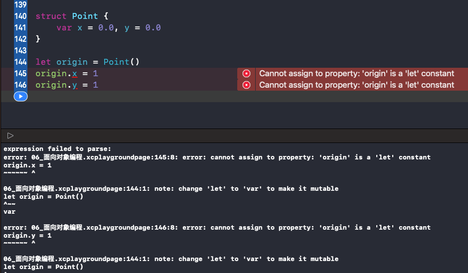

#### 延迟存储属性

在声明属性时，通过在声明前面标注 `lazy` 修改语来表示一个延迟存储属性，即**被 `lazy` 修饰符标记的属性**。延迟存储属性的初始值会延迟到在其第一次使用时才进行计算。

延迟存储属性的线程安全问题：在延迟存储属性还没有被初始化时，同时被多个线程访问，则**无法保证属性值只初始化一次**。

```swift
class DataImporter {
    var fileName = "data.text"
    init() {
        print("DataImporter inits")
    }
}

class DataManager {
    lazy var importer = DataImporter()
    var data = [String]()
}

let manager = DataManager()
manager.data.append("some data")
manager.data.append("some more data")
print("manager.data.append finish")
print(manager.importer.fileName)
```

打印结果：

```js
manager.data.append finish
DataImporter inits
data.text
```

“DataImporter inits” 是在执行完 `manager.data.append()`，直到调用 `print(manager.importer.fileName)` 之前才打印的。

### 计算属性

类、结构体和枚举也能够定义计算属性，与存储属性不同，**计算属性不存储值**。计算属性通过提供一个读取器和一个设置器，间接实现读取和修改其它的属性和值。

```swift
struct Point {
    var x = 0.0, y = 0.0
}
struct Size {
    var width = 0.0, height = 0.0
}
struct Rect {
    var origin = Point()
    var size = Size()
    var center: Point {
        get {
            let centerX = origin.x + (size.width / 2)
            let centerY = origin.y + (size.height / 2)
            return Point(x: centerX, y: centerY)
        }
        set(newCenter) {
            origin.x = newCenter.x - (size.width / 2)
            origin.y = newCenter.y - (size.height / 2)
        }
    }
}
```

#### 简写 setter

计算属性的设置器有一个默认的名字 newValue，可以不用为设置器传入的值定义名字。

```swift
struct Rect {
    var origin = Point()
    var size = Size()
    var center: Point {
        get {
            return Point(x: origin.x + (size.width / 2), y: origin.y + (size.height / 2))
        }
        set {
            origin.x = newValue.x - (size.width / 2)
            origin.y = newValue.y - (size.height / 2)
        }
    }
}
```

#### 简写 getter

如果整个读取器 getter 的函数体是一个单一的表达式，则 getter 会隐式返回这个表达式。可以省略 return：

```swift
struct Rect {
    var origin = Point()
    var size = Size()
    var center: Point {
        get {
            Point(x: origin.x + (size.width / 2), y: origin.y + (size.height / 2))
        }
        set {
            origin.x = newValue.x - (size.width / 2)
            origin.y = newValue.y - (size.height / 2)
        }
    }
}
```

#### 只读计算属性

只读计算属性：计算属性只有读取器，没有设置器。只读属性可以返回一个值，但是不能修改。可以通过点语法访问只读计算属性。

因为计算属性的值是不固定的，所以必须用 `var` 关键字定义计算属性为变量属性，包括只读计算属性。

`let` 关键字只用于常量属性，明确属性在初始化后就不能更改。

```swift
struct Rect {
    var origin = Point()
    var size = Size()
    var center: Point {
        get {
            Point(x: origin.x + (size.width / 2), y: origin.y + (size.height / 2))
        }
    }
}
```

或者简写成：

```swift
struct Rect {
    var origin = Point()
    var size = Size()
    var center: Point {
        return Point(x: origin.x + (size.width / 2), y: origin.y + (size.height / 2))
    }
}
```

### 属性观察者

`willSet` 会在一个新值**被存储之前被调用**。新的属性值会以常量形式参数传递，默认名字为 newValue，也可以自定义名字。
`didSet` 会在一个新值**被存储后被调用**。旧的属性值会以常量形式参数传递，默认名字为 oldValue，也可以自定义名字。如果在属性的 `didSet` 里给该属性赋值，则会覆盖 `willSet` 里设置的值。

```swift
class StepCounter {
    var totalSteps: Int = 0 {
        willSet(newTotalSteps) {
            print("About to set totalSteps to \(newTotalSteps)")
        }
        didSet {
            if totalSteps > oldValue {
                print("Added \(totalSteps - oldValue) steps")
            }
        }
    }
}

let stepCounter = StepCounter()
stepCounter.totalSteps = 200
stepCounter.totalSteps = 300
```

打印结果：

```js
About to set totalSteps to 200
Added 200 steps
About to set totalSteps to 300
Added 100 steps
```

#### 全局和局部变量

观察属性的能力同样对全局变量和局部变量有效。全局变量是定义在任何函数、方法、闭包或者类型环境之外的变量。局部变量是定义在函数、方法或者闭包环境之中的变量。

```swift
var count: Int = 0 {
    willSet {
        print("About to set count to \(newValue)")
    }
    didSet {
        if count > oldValue {
            print("Added \(count - oldValue)")
        }
    }
}

count = 10
print(count)
```

打印结果：

```js
About to set count to 10
Added 10
10
```

### 类型属性（static）

使用 `static` 关键字定义类型属性。**类类型**的计算属性，可以使用 `class` 关键字来允许子类重写父类的实现。

```swift
class SomeClass {
    static var storedTypeProperty = "Some value."
    static var computedTypeProperty: Int {
        return 27
    }
    class var overrideableComputedTypeProperty: Int {
        return 107
    }
}
```

## 方法

### 实例方法

实例方法是属于特定类实例、结构体实例或者枚举实例的函数。实例方法为实例提供功能性，可以提供访问和修改属性的方法，也可以提供与实例目的相关的功能。

定义一个**类**，在实例方法中修改**类的属性**：

```swift
class Counter {
    var count = 0
    func increment() {
        count += 1
    }
    func increment(by amount: Int) {
        count += amount
    }
    func reset() {
        count = 0
    }
}
```

#### 隐含属性-self

每一个类的实例都隐含一个 `self` 属性，它代表实力本身，可以使用它来调用实例方法。

如果没有显示的写出 `self`，则在方法中调用属性或方法时，Swift 会假定调用的是当前实例中的属性或方法。

📢注意：当实例方法的形式参数名与某个实例属性名相同时，形式参数名具有优先权，可以使用 `self` 调用属性来区分形式参数名和属性名。

```swift
struct Point {
    var x = 0.0, y = 0.0
    func isToTheRightOf(x: Double) -> Bool {
        return self.x > x
    }
}

let somePoint = Point(x: 2.0, y: 2.0)
if somePoint.isToTheRightOf(x: 1.0) {
    print("This point is to the right of the line where x == 1.0")
}

// Prints "This point is to the right of the line where x == 1.0"
```

#### 在实例方法中修改属性-mutating（异变方法）

结构体和枚举是值类型，默认情况下，**值类型属性不能被自身的实例方法修改**。可以在 `func` 关键字前放一个 `mutating` 关键字来指定方法可以修改属性。

```swift
struct Point {
    var x = 0.0, y = 0.0
    mutating func moveBy(x deltaX: Double, y deltaY: Double) {
        x += deltaX
        y += deltaY
    }
}

var somePoint = Point(x: 1.0, y: 1.0)
somePoint.moveBy(x: 2.0, y: 3.0)
print("The point is now at (\(somePoint.x), \(somePoint.y))")
// Prints "The point is now at (3.0, 4.0)"
```

#### 在 mutating 方法中赋值给 self

结构体的异变方法可以指定整个实例给隐含的 `self` 属性。

```swift
struct Point {
    var x = 0.0, y = 0.0
    mutating func moveBy(x deltaX: Double, y deltaY: Double) {
        self = Point(x: x + deltaX, y: y + deltaY)
    }
}

var somePoint = Point(x: 1.0, y: 1.0)
somePoint.moveBy(x: 2.0, y: 3.0)
print("The point is now at (\(somePoint.x), \(somePoint.y))")
// Prints "The point is now at (3.0, 4.0)"
```

#### 枚举的 mutating 方法

枚举的异变方法可以设置隐含的 `self` 属性为相同枚举里的不同成员。

```swift
enum TriStateSwitch {
    case off, low, high
    mutating func next() {
        switch self {
        case .off:
            self = .low
        case .low:
            self = .high
        case .high:
            self = .off
        }
    }
}

var ovenLight = TriStateSwitch.off
ovenLight.next()
print(ovenLight)
// Prints "low"
```

### 类型方法（static）

通过在 `func` 关键字前面使用 `static` 关键字来明确一个类型方法。类同样可以使用 `class` 关键字来允许子类重写父类对类型方法的实现。

```swift
class SomeClass {
    class func someTypeMethod() {
        print("someTypeMethod")
    }
}
SomeClass.someTypeMethod()
// Prints "someTypeMethod"
```

## 下标

类、结构体和枚举可以定义下标，它可以作为访问集合、列表或序列成员元素的快捷方式。

下标的作用：

1. 可以通过索引值来设置或检索值，而不用分别为设置或检索提供实例方法。

2. 可以为一个类型定义多个下标，下标会根据传入的索引值的类型，选择合适的下标重载使用。

3. 可以使用多个输入形参来定义下标，以满足自定义类型的需求。

### 下标语法（subscript）

使用关键字 `subscript` 定义下标。与实例方法相同，可以指定一个或多个输入形式参数和返回类型。与实例方法不同的是，下标可以是读写的，也可以是只读的。

下标脚本（`subscript`）允许通过在实例名后面的**方括号内写一个或多个值**，对该类的实例进行查询。

```swift
struct TimesTable {
    let multiplier: Int
    subscript(index: Int) -> Int {
        return multiplier * index
    }
}

let threeTimesTable = TimesTable(multiplier: 3)
print("six times three is \(threeTimesTable[6])")
// Prints "six times three is 18"
```

### 下标参数

1. 下标可以接收任意数量的输入形式参数，并且这些输入形式参数可以是任意类型；
2. 下标可以返回任何类型；
3. 下标可以使用变量形式参数（`var`）和可变实行参数（`...`），但是不能使用输入输出形式参数（`inout`），也不能提供默认形式参数。

### 实例下标

```swift
// 矩阵
struct Matrix {
    // 行，列
    let rows: Int, columns: Int
    // 坐标
    var grid: [Double]
    init(rows: Int, columns: Int) {
        self.rows = rows
        self.columns = columns
        grid = Array(repeating: 0.0, count: rows * columns)
    }
    func indexIsValid(row: Int, column: Int) -> Bool {
        return row >= 0 && row <= rows && columns >= 0 && columns <= columns
    }
    subscript(row: Int, column: Int) -> Double {
        get {
            assert(indexIsValid(row: row, column: column), "Index out of range")
            return grid[(row * columns) + column]
        }
        set {
            assert(indexIsValid(row: row, column: column), "Index out of range")
            grid[(row * columns) + column] = newValue
        }
    }
}

var matrix = Matrix(rows: 2, columns: 2)
matrix[0, 1] = 1.5
matrix[1, 0] = 3.2
print(matrix.grid)
// Prints "[0.0, 1.5, 3.2, 0.0]"
```


### 类型下标（static）

除了定义实例下标外，也可以定义类型本身的下标。在 `subscript` 关键字前加 `static` 关键字来标记类型下标。

```swift
enum Planet: Int {
    case mercury = 1, venus, earth, mars, jupiter, saturn, uranus, neptune
    static subscript(n: Int) -> Planet {
        return Planet(rawValue: n)!
    }
}
let mars = Planet[3]
print(mars)
// Prints "earth"
```

同样的，使用 `class` 关键字，可以允许子类重写父类的下标实现。

```swift
enum Planet: Int {
    case mercury = 1, venus, earth, mars, jupiter, saturn, uranus, neptune
    static subscript(n: Int) -> Planet {
        return Planet(rawValue: n)!
    }
}

class PlanetClass {
    class subscript(n: Int) -> Planet {
        return Planet[n]
    }
}

class SubPlanetClass {
    class subscript(n: Int) -> Planet {
        return Planet[n + 1]
    }
}

print(PlanetClass[3])
// Prints "earth"
print(SubPlanetClass[3])
// Prints "mars"
```

## 初始化和反初始化

### 初始化器

初始化器在创建特定类型的实例时被调用。

如下所示：在初始化器里给存储属性设置初始值：

```swift
// 温度计
struct Fahrenheit {
    var temperature: Double
    init() {
        temperature = 32.0
    }
}

var f = Fahrenheit()
print("The default temperature is \(f.temperature) Fahrenheit")
// Prints "The default temperature is 32.0 Fahrenheit"
```

### 默认的属性值

存储属性的初始值，可以在初始化器设置，也可以**在属性定义的时候设置**。

如下所示，在存储属性定义的时候设置初始值：

```swift
struct Fahrenheit {
    var temperature = 32.0
}

var f = Fahrenheit()
print("The default temperature is \(f.temperature) Fahrenheit")
// Prints "The default temperature is 32.0 Fahrenheit"
```

### 默认的初始化器

当结构体或类没有提供初始化器时，Swfit 会提供一个默认的初始化器。

没有提供初始化器的**类**，必须设置默认属性值：

```swift
class ShoppingListItem {
    var name: String?
    var quantity = 1
    var purchased = false
}

var item = ShoppingListItem()
```

提供了初始化器的结构体或类，可以不设置默认属性值：

```swift
class ShoppingListItem {
    var name: String?
    var quantity: Int
    var purchased: Bool
    init() {
        quantity = 1
        purchased = false
    }
}

var item = ShoppingListItem()
```

### 自定义初始化

可以通过为初始化器添加形式参数的方式，实现自定义类型和值的名称。初始化形式参数与函数的形式参数具有相同的功能和语法。

```swift
// 摄氏度
struct Celsius {
    var temperatureInCelsius: Double
    // 华氏温度计的(冰点为32度，沸点为212度)
    init(fromFahrenheit fahrenheit: Double) {
        temperatureInCelsius = (fahrenheit - 32.0) / 1.8
    }
    // 开(开尔文温标的计量单位，1开氏度相当于1摄氏度)
    init(fromKelvin kelvin: Double) {
        temperatureInCelsius = kelvin - 273.15
    }
}
// 水的沸点
let boilingPointOfWater = Celsius(fromFahrenheit: 212.0)
// 水的冰点
let freezingPointOfWater = Celsius(fromKelvin: 273.15)

print(boilingPointOfWater.temperatureInCelsius)
// Prints "100.0"
print(freezingPointOfWater.temperatureInCelsius)
// Prints "0.0"
```

### 在初始化中分配常量属性

常量属性：赋值后不能修改。

在初始化结束前，要保证常量属性被设置了确定的值，可以在初始化的任意时刻设置。

```swift
class SurveyQuestion {
    let text: String
    var response: String?
    init(text: String) {
        self.text = text
    }
    func ask() {
        print(text)
    }
}

let beetsQuestion = SurveyQuestion(text: "How about beets?")
beetsQuestion.ask()
// Prints "How about beets?"
beetsQuestion.response = "I like beets."
```

### 结构体的成员初始化器

如果结构体类型中没有定义自定义初始化器，系统会提供一个默认的成员初始化器。没有提供初始化器的**类**，必须设置默认属性值。但是**结构体的**成员初始化器允许存储属性没有默认值。

```swift
struct Size {
    var width: Float, height = 0.0
}
let twoByTwo = Size(width: 1.0, height: 1.0)
print(twoByTwo)
// Prints "Size(width: 1.0, height: 1.0)"
```

### 值类型的初始化器委托

初始化器委托：初始化器可以调用其他初始化器来执行部分实例的初始化。避免了多个初始化器里冗余代码。

```swift
struct Size {
    var width = 0.0, height = 0.0
}

struct Point {
    var x = 0.0, y = 0.0
}

struct Rect {
    var origin = Point()
    var size = Size()
    init() {
        self.init(origin: Point(x: 0.0, y: 0.0), size: Size(width: 2.0, height: 2.0))
    }
    // 值类型的简单初始化器
    init(origin: Point, size: Size) {
        self.origin = origin
        self.size = size
    }
    init(center: Point, size: Size) {
        let originX = center.x - (size.width / 2)
        let originY = center.y - (size.height / 2)
        self.init(origin: Point(x: originX, y: originY), size: size)
    }
}

let rect1 = Rect()
let rect2 = Rect(center: Point(x: 1.0, y: 1.0), size: Size(width: 2.0, height: 2.0))
let rect3 = Rect(origin: Point(x: 0.0, y: 0.0), size: Size(width: 2.0, height: 2.0))
print("rect1: \(rect1.origin), \(rect1.size)")
// Prints "rect1: Point(x: 0.0, y: 0.0), Size(width: 2.0, height: 2.0)"
print("rect2: \(rect1.origin), \(rect1.size)")
// Prints "rect2: Point(x: 0.0, y: 0.0), Size(width: 2.0, height: 2.0)"
print("rect3: \(rect1.origin), \(rect1.size)")
// Prints "rect3: Point(x: 0.0, y: 0.0), Size(width: 2.0, height: 2.0)"
```

### 类的继承和初始化

### 指定初始化器和便捷初始化器（convenience）

用与**值类型的简单初始化器**相同的方式类写类的**指定初始化器**：

```swift
init(origin: Point, size: Size) {
    self.origin = origin
    self.size = size
}
```

将 `convenience` 修饰符放到 `init` 关键字前定义**便捷初始化器**：

```swift
convenience init() {
    self.init(origin: Point(x: 0.0, y: 0.0), size: Size(width: 2.0, height: 2.0))
}
```

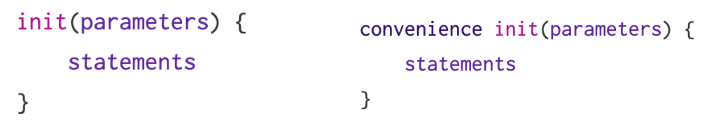

### 类的初始化委托

1. 指定初始化**必须**从它的直系父类调用指定初始化器（子类必须要调用父类）。
2. 便捷初始化器**必须**从相同的类里调用另一个初始化器（便捷初始化器或指定初始化器）。
3. 便捷初始化器**最终**必须调用一个指定初始化器。

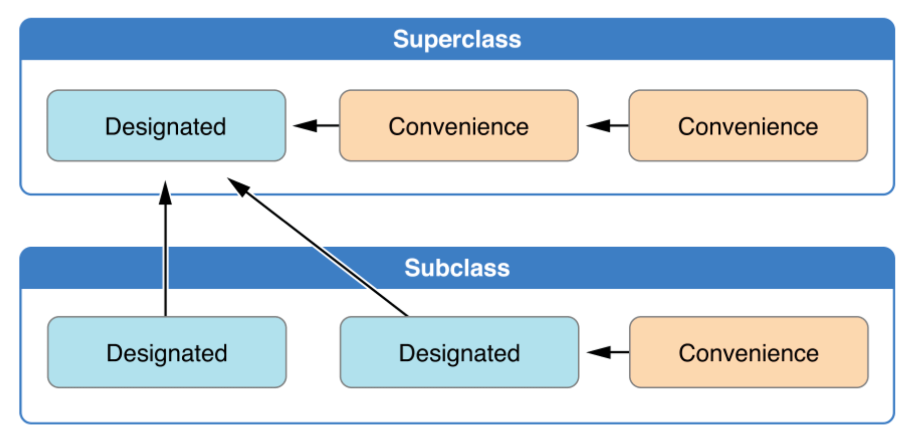

### 两段式初始化

Swift 的类初始化是一个两段式过程：

* 第一阶段：**每一个**存储属性被引入类并分配一个初始值。
* 第二阶段：每个类都可以在新的实例准备使用之前定制它的存储属性。

#### 两段式初始化-阶段一

1. 指定初始化器或便捷初始化器在类中被**调用**；
2. 为这个类的新实例**分配内存**，内存还没有被初始化；
3. 这个类的指定初始化器确保所有由该类引入的存储属性都有一个值。现在这些**存储属性的内存被初始化了**；
4. 指定初始化器上交**父类的初始化器**为其存储属性执行相同任务；
5. 这个调用父类初始化器的过程将沿着**初始化链**一直向上进行，直到到达初始化器链的最顶部；
6. 一旦达到初始化器的最顶部，在链顶部的类确保所有的存储属性都有一个值，此实例的内存被认为**完全初始化**了，此时第一阶段完成。

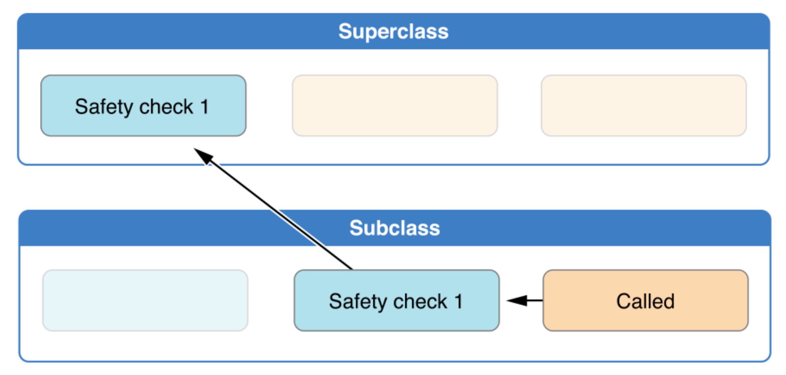

#### 两段式初始化-阶段二

从顶部初始化器往下，初始化链中的每一个**指定初始化器**都有机会进一步定制实例。在第二阶段，初始化器能够访问 `self`，并且可以修改它的属性、调用它的实例方法等等。

最终，初始化链中任何**便捷初始化器**都有机会定制实例以及使用 `self`。

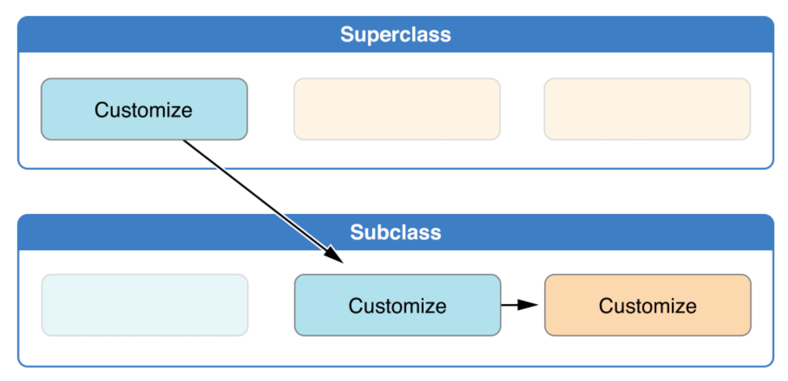

### 安全检查

1、指定初始化器必须保证在向上委托给父类初始化器之前，**其所在的类引入的所有属性**都要初始化完成。（子类必须先初始化自己的所有属性，再调用父类的初始化器）

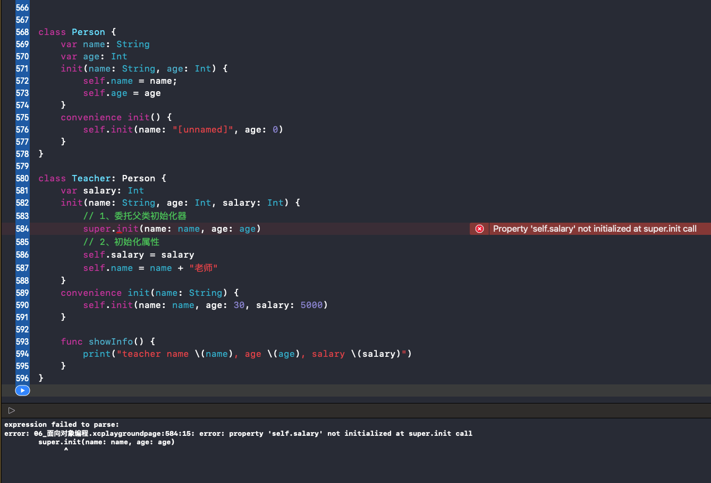

2、指定初始化器必须先向上委托父类初始化器，然后才能为**继承的属性**设置新值，否则指定初始化器赋予的新值会被父类中的初始化器所覆盖。（**子类必须先调用父类的初始化器，再初始化父类的属性**）


3、便捷初始化器必须先委托同类中的其它初始化器，然后再为**任意属性**赋值，否则便捷初始化器赋予的新值会被自己类中其它指定初始化器所覆盖。

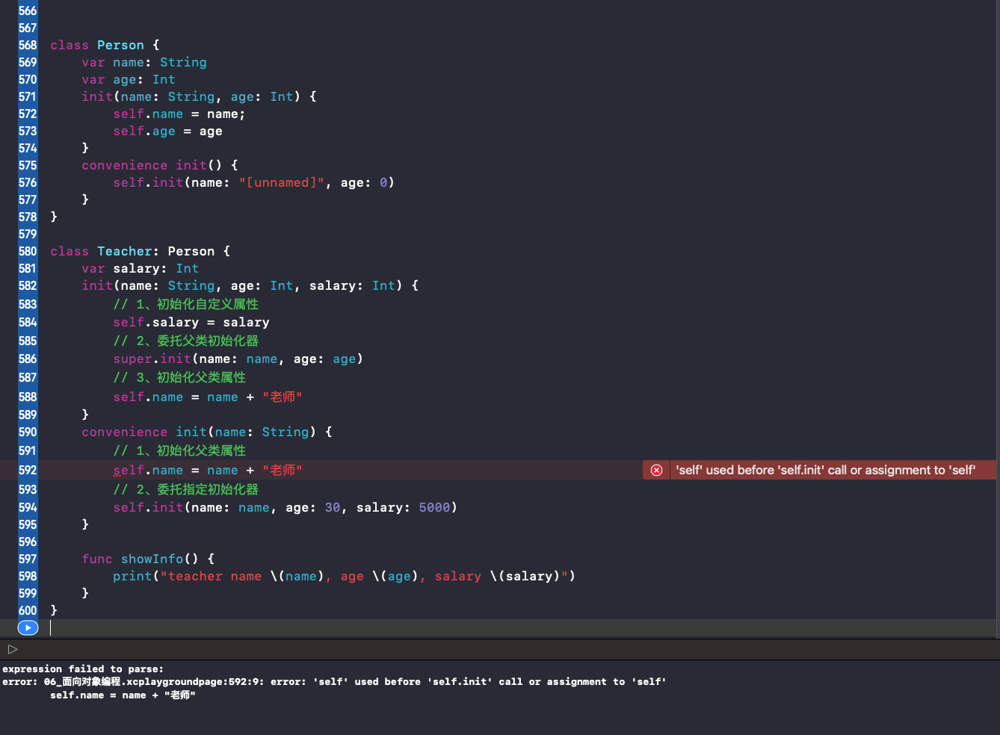

4、初始化器在第一阶段初始化完成之前，不能调用任何实例方法、不能读取任何实例属性的值，也不能引用 `self` 作为值。

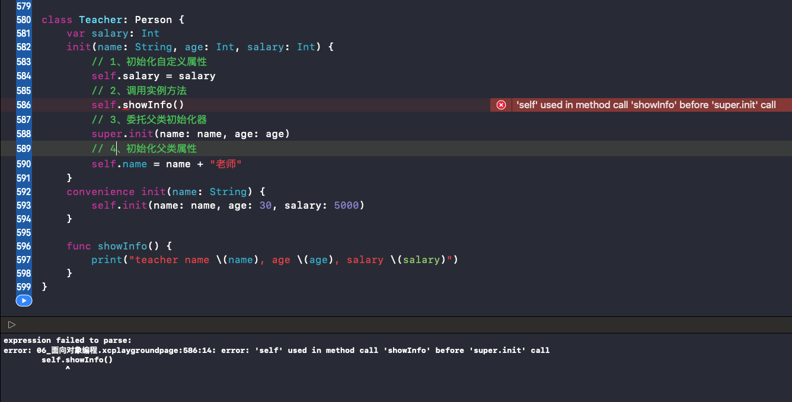

正确的执行顺序：

```swift
class Person {
    var name: String
    var age: Int
    init(name: String, age: Int) {
        self.name = name;
        self.age = age
    }
    convenience init() {
        self.init(name: "[unnamed]", age: 0)
    }
}

class Teacher: Person {
    var salary: Int
    init(name: String, age: Int, salary: Int) {
        // 1、初始化自定义属性
        self.salary = salary
        // 2、委托父类初始化器
        super.init(name: name, age: age)
        // 3、修改父类属性
        self.name = name + "老师"
        // 4、调用实例方法
        self.showInfo()
    }
    convenience init(name: String) {
        self.init(name: name, age: 30, salary: 5000)
    }
    
    func showInfo() {
        print("teacher name \(name), age \(age), salary \(salary)")
    }
}

let teacher = Teacher(name: "kevin")
// Prints "teacher name kevin老师, age 30, salary 5000"
```

### 初始化器的继承和重写（override）

与 Object-C 中的子类不同，Swfit 的子类不会默认继承父类的初始化器。Swift 的这种机制防止父类的简单初始化器被一个更专用的子类继承，并被用来创建一个没有完全初始化或错误初始化的新实例的情况。**只有在特定情况下才会继承父类的初始化器**。

如果想自定义子类来实现一个或多个父类相同的初始化器，可以在子类中为初始化器提供定制的实现。如果提供的子类初始化器完全匹配父类指定初始化器，则可以重写父类的初始化器。**通过在子类初始化器定义的前面写 `override` 修饰符，实现对该方法的重写。**同默认初始化器一样，即使是自动提供的默认初始化器也可以重写。

### 初始化器的自动继承

规则1：如果子类没有定义任何指定初始化器，它会自动继承父类所有的**指定初始化器**。

规则2：如果子类提供了所有父类指定初始化器的实现——要么是通过规则1继承来的，要么通过在定义中提供自定义实现的——那么它自动继承父类所有的**便捷初始化器**。

### 可失败初始化器（init?/init!）

类、结构体或枚举的可失败初始化器引用场景：

1. 初始化传入无效的形式参数值；
2. 缺少某种外部所需的资源；
3. 其他阻止初始化的情况。

定义方式：

1. 通过在 `init` 关键字后面添加问号（`init?`）的方式来定义一个可失败初始化器以创建一个合适类型的可选项实例。

2. 通过在 `init` 关键字后面添加惊叹号（`init!`）的方式来定义一个可失败初始化器以创建一个**隐式展开**具有合适类型的可选项实例。

### 必要初始化器（required）

在类的初始化器前添加 `required` 修饰符来表明所有该类的子类都必须实现该初始化器。

### 反初始化（deinit）

在类的**实例被释放**的时候，反初始化器就会立即被调用。使用 `deinit` 关键字来写反初始化器，同写初始化器要用 `init` 关键字一样。反初始化器只在类类型中有效。

反初始化器的调用时机：

1. 反初始化器会在实例被释放之前自动被调用。
2. 不能自行调用反初始化器。
3. 父类的反初始化器可以被子类继承，并且子类的反初始化器实现结束之后父类的反初始化器会被调用。
4. 父类的反初始化器总会被调用，就算子类没有反初始化器。

每个类当中只能有一个反初始化器。反初始化器不接收任何形式参数，并且不需要写圆括号。

```swift
deinit {
    // perform the deinitialization
}
```

## 继承

### 定义基类

Swift 类不会从一个通用基类继承，**任何不从另一个类继承的类都是所谓的基类**。如果没有指定特定父类的类都会以基类的形式创建。

```swift
/// 定义一个交通工具类
class Vehicle {
    var currentSpeed = 0.0
    var description: String {
        return "traveling at \(currentSpeed) miles per hour"
    }
    func makeNoise() {
        // to do
    }
}
```

### 子类

**子类是基于现有类创建新类的行为**。子类从现有的类继承了一些特征，可以重新定义继承来的特征，也可以为子类添加新的特征。为了表明子类有父类，要把子类写在父类的前面，用冒号分隔（`subClass : superClass`）。

```swift
/// 定义一个自行车类，继承自交通工具类
class Bicycle : Vehicle {
    // 自定义新的属性，是否有车筐
    var hasBasket = false
}

let bicycle = Bicycle()
bicycle.hasBasket = true
bicycle.currentSpeed = 15.0
print("Bicycle: \(bicycle.description)")
// Prints "Bicycle: traveling at 15.0 miles per hour"
```

### 重写（override）

重写：子类可以提供自己的实例方法、类型方法、实例属性、类型属性或下标脚本的自定义实现，否则子类将会从父类继承。

如果想要重写而不是继承一个特征，需要在重写定义前面加上 `override` 关键字，表明提供一个重写，而不是额外提供一个相同的定义。额外提供一个相同的定义可能导致意想不到的行为，并且任何没有使用 `override` 关键字的重写都会在编译时报错。

### 访问父类的方法、属性和下标脚本

可以通过使用 `super` 前缀访问父类的方法、属性或下标脚本。

1. 一个命名为 `somoeMethod()` 的重写方法可以通过 `super.someMethod()` 在重写方法的实现中调用父类版本的 `someMethod()` 方法。
2. 一个命名为 `someProperty` 的重写属性可以通过 `super.someProperty` 在重写的 getter 或 setter 实现中访问父类版本的 `someProperty` 属性。
3. 一个命名为 `someIndex` 的重写下标脚本可以通过 `super[someIndex]` 在重写的下标脚本实现中访问父类版本中相同的下标脚本。

### 重写方法

在子类中重写一个继承的实例方法或类型方法来提供定制的或替代的方法实现。

```swift
class Vehicle {
    var currentSpeed = 0.0
    var description: String {
        return "traveling at \(currentSpeed) miles per hour"
    }
    func makeNoise() {
        // to do
    }
}

/// 定义一个火车类，继承自交通工具类
class Train: Vehicle {
    // 重写发声方法
    override func makeNoise() {
        print("火车鸣笛~")
    }
}

let train = Train()
train.makeNoise()
// Prints "火车鸣笛~"
```

### 重写属性的 getter 和 setter

可以提供一个自定义的 `getter` 或 `setter` 方法来重写任意继承的属性（存储属性或计算属性）。

```swift
class Car: Vehicle {
    var gear = 1
    override var description: String {
        return super.description + " in gear \(gear)"
    }
}
let car = Car()
car.currentSpeed = 25.0
car.gear = 3
print("Car: \(car.description)")
// Prints "Car: traveling at 25.0 miles per hour in gear 3"
```

### 重写属性的观察器

可以使用属性重写来为继承的属性添加属性观察器（`willSet`、`didSet`）。

注意：

1. 因为常量存储属性（`let`）和只读的计算属性（`readonly`）不支持改变，所以不能提供 `willSet` 和 `didSet` 来监听值的改变（它们不会变）。
2. 不能为同一个属性同时提供重写的 `setter` 和重写的属性观察器。自定义的 `setter` 就可以实现监听值的改变。

```swift
class AutomaticCar: Car {
    override var currentSpeed: Double {
        didSet {
            gear = Int(currentSpeed / 10.0) + 1
        }
    }
}

let automaticCar = AutomaticCar()
automaticCar.currentSpeed = 35.0
print("AutomaticCar: \(automaticCar.description)")
// Prints "AutomaticCar: traveling at 35.0 miles per hour in gear 4"
```

### 组织重写（final）

通过在方法、属性或者下标甲苯的关键字前写 `final` 修饰符，来阻止其被重写（如：`final var`，`final func`，`final class func`，`final subscript`）。

## 多态

多态是面向对象三大特性之一，指同一个方法在不同的对象上有不同的实现方式。

### 类型

```swift
class MediaItem {
    var name: String
    init(name: String) {
        self.name = name
    }
}

class Movie: MediaItem {
    var director: String
    init(name: String, director: String) {
        self.director = director
        super.init(name: name)
    }
}

class Song: MediaItem {
    var artist: String
    init(name: String, artist: String) {
        self.artist = artist
        super.init(name: name)
    }
}

let library = [
    Movie(name: "Casablanca", director: "Michael Curtiz"),
    Song(name: "Blue Suede Shoes", artist: "Elvis Presley"),
    Movie(name: "Citizen Kane", director: "Orson Welles"),
    Song(name: "The One And Only", artist: "Chesney Hawkes"),
    Song(name: "Never Gonna Give You Up", artist: "Rick Astley")
]

print(type(of: library))
// Prints "Array<MediaItem>"

let library1 = [
    Movie(name: "Casablanca", director: "Michael Curtiz")
]
print(type(of: library1))
// Prints "Array<Movie>"

let library2 = [
    Song(name: "Blue Suede Shoes", artist: "Elvis Presley")
]
print(type(of: library2))
// Prints "Array<Song>"
```

### 类型检查（is）

使用类型检查操作符`is`来检查**一个实例是否属于一个特定的子类**，如果实例是该子类类型，类型检查操作符返回 true，否则返回 false。

```swift
class MediaItem {
    var name: String
    init(name: String) {
        self.name = name
    }
}

class Movie: MediaItem {
    var director: String
    init(name: String, director: String) {
        self.director = director
        super.init(name: name)
    }
}

class Song: MediaItem {
    var artist: String
    init(name: String, artist: String) {
        self.artist = artist
        super.init(name: name)
    }
}

let library = [
    Movie(name: "Casablanca", director: "Michael Curtiz"),
    Song(name: "Blue Suede Shoes", artist: "Elvis Presley"),
    Movie(name: "Citizen Kane", director: "Orson Welles"),
    Song(name: "The One And Only", artist: "Chesney Hawkes"),
    Song(name: "Never Gonna Give You Up", artist: "Rick Astley")
]

print(type(of: library))

for item in library {
    if item is Song {
        print(item.name)
    }
}
```

打印结果：

```js
Array<MediaItem>
Blue Suede Shoes
The One And Only
Never Gonna Give You Up
```

### 向下类型转换（as?/as!）

某个**类类型**的常量或变量可能实际上引用自一个子类的实例，可以使用类型转换操作符`as?`或`as!`将它向下类型转换至其子类类型。因为向下类型转换可能失败，所以类型转换操作符有两个不同的形式`as?`和`as!`。

1. `as?`，条件形式，返回一个将要向下类型转换的值的可选项。
2. `as!`，强制形式，将向下类型转换和**强制展开**结合为一个步骤。

```swift
class MediaItem {
    var name: String
    init(name: String) {
        self.name = name
    }
}

class Movie: MediaItem {
    var director: String
    init(name: String, director: String) {
        self.director = director
        super.init(name: name)
    }
}

class Song: MediaItem {
    var artist: String
    init(name: String, artist: String) {
        self.artist = artist
        super.init(name: name)
    }
}

let library = [
    Movie(name: "Casablanca", director: "Michael Curtiz"),
    Song(name: "Blue Suede Shoes", artist: "Elvis Presley"),
    Movie(name: "Citizen Kane", director: "Orson Welles"),
    Song(name: "The One And Only", artist: "Chesney Hawkes"),
    Song(name: "Never Gonna Give You Up", artist: "Rick Astley")
]

print(type(of: library))

for item in library {
    if let song = item as? Song {
        print("Song: \(song.name)")
    }
}
```

打印结果：

```js
Array<MediaItem>
Song: Blue Suede Shoes
Song: The One And Only
Song: Never Gonna Give You Up
```

### 不确定类型 Any 和 AnyObject

Swift 为不确定的类型提供了两种特殊的类型别名：

1. `AnyObject`：表示**任何类类型**的实例。
2. `Any`：表示**任何类型**，包括函数类型。

### 嵌套类型

Swift 中的类、结构体和枚举可以进行嵌套，即**在某一个类型的内部定义类型**，嵌套类型能够访问它外部的成员。

这种类型嵌套在 Java 中称为内部类，在 C# 中称为嵌套类。

嵌套类

```swift
class Person {
    var body = Body() 
    
    class Body {
        var height = 175
        var weight = 80
        func profile() -> String {
            return "Height: \(self.height), Weight: \(self.weight)"
        }
    }
}

let p = Person()
print(p.body.profile())
// Prints "Height: 175, Weight: 80"
```

嵌套结构体

```swift
struct Shapes {
    struct Line {
        var x = 0
        var y = 0
        var length = 0
    }
    
    struct Rectangle {
        var x = 0
        var y = 0
        var width = 0
        var height = 0
        var area = 0
    }
    
    struct Circle {
        let pi = 3.1415926
        var radius = 0.0
    }
}

var c = Shapes.Circle()
c.radius = 45.0
```

## 扩展

扩展为现有的类、结构体、枚举类型或协议添加了新功能，包括为无访问权限的源代码扩展类型的能力（逆向建模）。

扩展和 Object-C 中的 category 类似，与 Object-C 的分类不同的是 Swift 的扩展没有名字。

```swift
class Person {

}

// 扩展：让 Person 实现 Hashable 协议
extension Person : Hashable {

}
```

### 扩展（extension）的能力

1. 添加计算实例属性和计算类型属性；
2. 定义实例方法和类型方法；
3. 提供新初始化器；
4. 定义下标；
5. 定义和使用新内嵌类型；
6. 使现有的类型遵循某些以。
7. **扩展可以向一个类型添加新的方法，但是不能重写已有的方法。**

#### 扩展的能力-计算属性

* 扩展可以向已有的类型添加计算实例属性和计算类型属性。

```swift
extension Double {
    var km: Double { return self * 1_000.0 }
    var m: Double { return self }
    var cm: Double { return self / 100.0 }
    var mm: Double { return self / 1_000.0 }
    var ft: Double { return self / 3.28084 }
}
let oneInch = 25.4.mm
print("One inch is \(oneInch) meters")
let threeFeet = 3.ft
print("Three feet is \(threeFeet) meters")
```

打印结果：

```swift
One inch is 0.0254 meters
Three feet is 0.914399970739201 meters
```

#### 扩展的能力-初始化器

* 扩展可以向已有的类型添加新的初始化器。

通过扩展可以使初始化器接收自定义类型作为形式参数，也可以提供该类型原始实现中未包含的额外初始化选项。

扩展能为类添加新的**便捷初始化器**，但是不能添指定初始化或反初始化器。**指定初始化器和反初始化器必须由原来类的实现提供**。

```swift
struct Size {
    var width = 0.0, height = 0.0
}

struct Point {
    var x = 0.0, y = 0.0
}

struct Rect {
    var origin = Point()
    var size = Size()
}

extension Rect {
    init(center: Point, size: Size) {
        let originX = center.x - (size.width / 2)
        let originY = center.y - (size.height / 2)
        self.init(origin: Point(x: originX, y: originY), size: size)
    }
}

let centerRect = Rect(center: Point(x: 4.0, y: 4.0), size: Size(width: 3.0, height: 3.0))
print(centerRect.origin)
// Prints "Point(x: 2.5, y: 2.5)"
```

#### 扩展的能力-方法

扩展可以为已有的类型添加新的实例方法和类型方法。

```swift
extension Int {
    func repetitions(task: () -> Void) {
        for _ in 0..<self {
            task()
        }
    }
}

2.repetitions {
    print("Hello!")
}
```

打印结果：

```js
Hello!
Hello!
```

#### 扩展的能力-mutating方法

扩展的实例方法仍可以修改（异变）实例本身。

结构体和枚举类型方法在修改 self 或本身的属性时必须标记实例方法为 `mutating`，和原本实现的一遍方法一样。

```swift
extension Int {
    mutating func sequare() {
        self = self * self
    }
}
var someInt = 3
someInt.sequare()
print(someInt)
// Prints "9"
```

#### 扩展的能力-下标

扩展能为已有的类型添加新的下标。

```swift
extension Int {
    subscript(digitIndex: Int) -> Int {
        var decimalBase = 1
        for _ in 0..<digitIndex {
            decimalBase *= 10
        }
        return (self / decimalBase) % 10
    }
}
print(746381295[0])
// Prints "5"
print(746381295[1])
// Prints "9"
print(746381295[2])
// Prints "2"
print(746381295[8])
// Prints "7"
```

#### 扩展的能力-添加内嵌类型

```swift
extension Int {
    enum Kind {
        case negative, zero, positive
    }
    var kind: Kind {
        switch self {
        case 0:
            return .zero
        case let x where x > 0:
            return .positive
        default:
            return .negative
        }
    }
}

print(0.kind)
// Prints "zero"
print(100.kind)
// Prints "positive"
print((0-1).kind)
// Prints "negative"
```

## 协议

### 协议的语法

自定义类型声明时，**将协议名放在类型名的冒号之后**来表示该类型采纳一个特定的协议，多个协议可以用逗号分开列出。若一个类拥有父类，将这个父类名放在其采纳的协议名**之前**，并用逗号分隔。

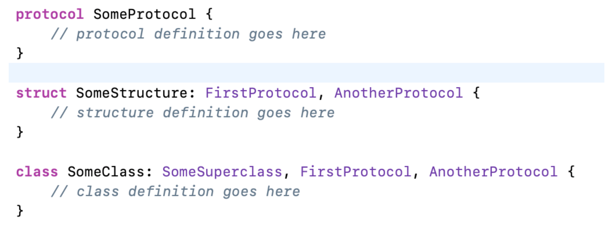

### 属性要求

协议可以要求所有遵循该协议的类型，提供特定名字和类型的实例属性或类型属性。协议并不会具体说明属性时存储型属性还是计算型属性，它只具体要求——**属性有特定的名称和类型**。

协议同时要求——**一个属性必须明确是可读的或可读可写**：

1. 若协议要求一个属性为可读可写的，那么该属性不能用常量储存属性或只读计算属性来满足。

2. 若协议要求一个属性为可读的，那么任何种类的属性都能满足这个要求。

读写计算属性和只读计算属性：

```swift
protocol SomeProtocol {
    var mustBeSettable: Int { get set }
    var doesNotNeedToBeSettable: Int { get }
}
```

制度计算属性：

```swift
protocol FullyNamed {
    var fullName: String { get }
}

struct Person: FullyNamed {
    var fullName: String
}
let john = Person(fullName: "John Appleseed")
// Prints "John Appleseed"
```

只读计算属性

```swift
class Starship: FullyNamed {
    var prefix: String?
    var name: String
    init(name: String, prefix: String? = nil) {
        self.name = name
        self.prefix = prefix
    }
    var fullName: String {
        return (prefix != nil ? prefix! + " " : "") + name
    }
}
var ncc1701 = Starship(name: "Enterprise", prefix: "USS")
print(ncc1701.fullName)
// Prints "USS Enterprise"
```

在协议中定义**类型属性**时在前面添加 `static` 关键字。当类的实现使用 `class` 或 `static` 关键字前缀声明类型属性要求时，这个规则仍然适用。

```swift
protocol AnotherProtocol {
    static var someTypeProperty: Int { get set }
}
```

### 方法要求

协议可以要求采纳的类型**实现指定的实例方法和类方法**。

1. 这些方法作为协议定义的一部分，书写方式与正常实例和类方法的方式完全相同，但是不需要大括号和方法的主题；
2. 允许方法拥有参数，与正常的方法使用同样的规则；
3. 方法参数不能定义默认值。

在类实现时，类型方法要求使用 `class` 或 `static` 作为关键字前缀，协议中同样适用。

```swift
protocol AnotherProtocol {
    func someMethod(element: String)
    static func anotherMethod(element: Int)
}
```

### mutating 方法要求

对于协议里定义的实例方法，如果想要异变采用了该协议的类型实例，就要在方法的定义当中使用 `mutating` 关键字。这允许结构体和枚举类型能采用相应协议并满足方法要求。

```swift
protocol MoveProtocol {
    mutating func moveBy(x deltaX: Int, y deltaY: Int)
}

struct Point: MoveProtocol {
    var x = 0, y = 0
    mutating func moveBy(x deltaX: Int, y deltaY: Int) {
        self = Point(x: x + deltaX, y: y + deltaY)
    }
}

var p = Point(x: 1, y: 1)
p.moveBy(x: 1, y: 1)
print(p)
// Prints "Point(x: 2, y: 2)"
```

### 初始化器要求

协议可以要求遵循协议的类型实现指定的初始化器。

协议在定义初始化器时和一般的初始化器一样，只用将初始化器写在协议的定义当中，只是不用写大括号（初始化的实体）。

```swift
protocol SomeProtocol {
    init(someParameter: Int)
}
```

### 初始化器要求的类实现

一、如果想让遵循协议的类满足协议的初始化器要求，在实现协议指定的初始化器或便捷初始化器时，必须使用 `required` 关键字修饰初始化器的实现。

```swift
protocol SomeProtocol {
    init(someParameter: Int)
}

class SomeClass: SomeProtocol {
    required init(someParameter: Int) {
        // initializer implementation goes here
    }
}
```

如果遵循了协议，且实现了协议指定的初始化器，没有使用 `required` 关键字，则会报错：

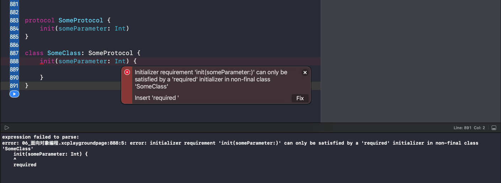

二、如果一个子类重写了父类指定的初始化器，并且遵循协议实现了初始化器要求，那么就要为这个初始化器的实现添加 `required` 和 `override` 两个修饰符。

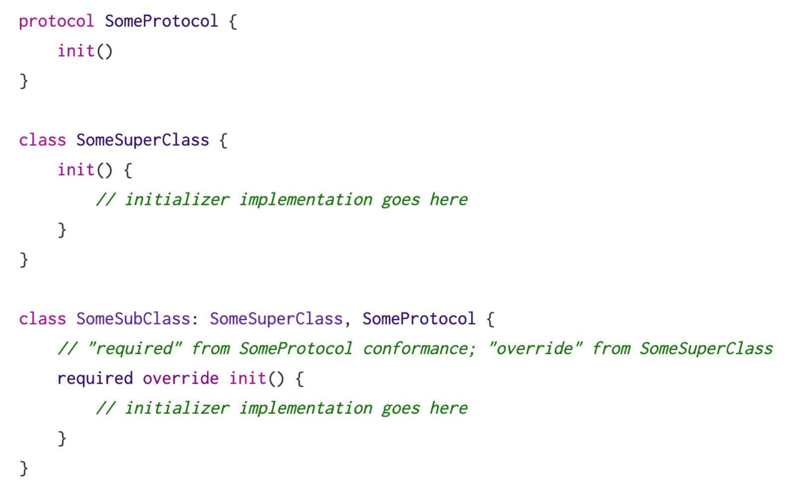

如果重写了方法，没有加 `override` 关键字，则会报错：

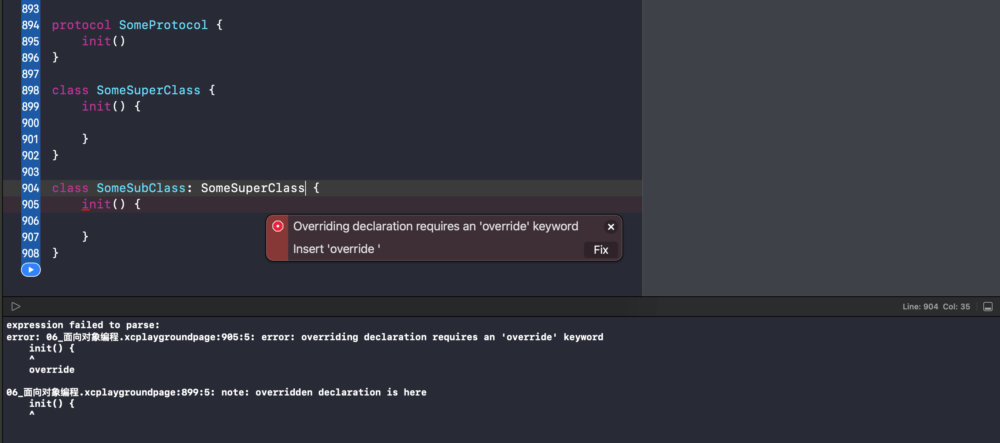

如果遵循了协议实现了初始化器要求，没有加 `required` 关键字，则会报错：

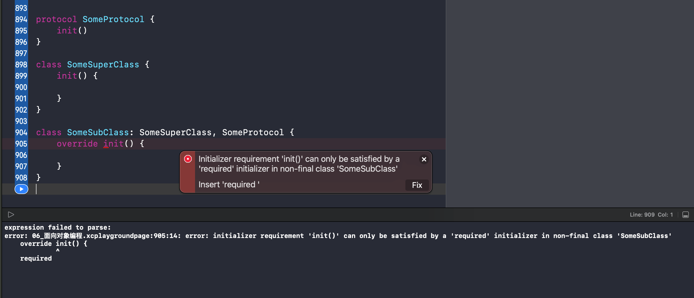

### 将协议作为类型

1. 在函数、方法或者初始化器里作为形式参数类型或者返回类型；
2. 作为常量、变量或者属性的类型；
3. 作为数组、字典或者其他存储器的元素的类型。

### 协议继承

协议可以继承一个或者多个其他协议，并且可以在继承的基础之上添加更多要求。协议继承的语法与类继承的语法相似，只不过可以选择列出**多个继承的协议**，使用逗号分隔。


### 类专用的协议（AnyObject）

通过添加 `AnyObject` 关键字到协议的继承列表，可以**限制协议只能被类类型采纳**，并且不是结构体或者枚举。

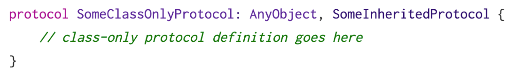

### 协议组合（&）

可以使用协议组合来复合多个协议到一个要求里。协议组合不定义任何新的协议类型。

协议组合使用 `SomeProtocol & AnotherProtocol` 的形式。可以列举任意数量的协议，用和符号`&`连接，使用逗号`,`分隔。除了协议列表，协议组合也能包含类类型，这允许标明一个需要的父类。

```swift
protocol Named {
    var name: String { get }
}

protocol Aged {
    var age: Int { get }
}

struct Person: Named, Aged {
    var name: String
    var age: Int
}

func wishHappyBirthday(to celebrator: Named & Aged) {
    print("Happy birthday, \(celebrator.name), you'er \(celebrator.age)")
}

let birthdayPerson = Person(name: "kevin", age: 18)
wishHappyBirthday(to: birthdayPerson)
// Prints "Happy birthday, kevin, you'er 18"
```

### 可选协议要求（optional）

可以给协议定义可选要求，这些要求不需要强制遵循协议的类型实现。

可选要求使用 `optional` 修饰符作为前缀放在协议的定义中。

可选要求允许 Object-C 操作，协议和可选要求必须使用 `@objc` 标志标记，注意 `@objc` 协议只能被继承自 Object-C 类或其他 `@objc` 类采纳，他们不能被结构体或者枚举采纳。

## 协议和扩展

### 在扩展里添加协议遵循

可以通过扩展为一个已经存在的类型**采纳**和**遵循**一个新的协议，即使无法访问现有类型的源代码也能实现。

扩展可以添加新的属性、方法和小标到已经存在的类型，并且因此允许添加协议需要的任何**要求**。

```swift
protocol TextRepresentable {
    var desc: String { get }
}

extension Person: TextRepresentable {
    var desc: String {
        return "name \(name) age \(age)"
    }
}

let p = Person(name: "zhangsan", age: 35)
print(p.desc)
// Prints "name zhangsan age 35"
```

### 有条件的遵循协议

泛型类型可能**只在某些情况下**满足一个协议的要求，比如当类型的泛型形式参数也遵循对应协议时。

可以通过在扩展类型时列出限制让泛型类型**有条件地遵循某协议**，即在采纳协议的名字后面写泛型 `where` 分句。

```swift
protocol TextRepresentable {
    var desc: String { get }
}

extension Person: TextRepresentable {
    var desc: String {
        return "name \(name) age \(age)"
    }
}

extension Array: TextRepresentable where Element: TextRepresentable {
    var desc: String {
        let itemDesc = self.map{ $0.desc }
        return itemDesc.joined(separator: ",")
    }
}

let array = [Person(name: "zhangsan", age: 20), Person(name: "lis", age: 30)];
print(array.desc)
// Prints "name zhangsan age 20,name lis age 30"
```

如果参数没有遵循 协议：

```swift
protocol TextRepresentable {
    var desc: String { get }
}

extension Array: TextRepresentable {
    var desc: String {
        var temp = ""
        for element in self {
            if let p = element as? Person {
                if temp.count > 0 {
                    temp += ","
                }
                temp += "name \(p.name) age \(p.age)"
            }
        }
        return temp
    }
}

let array = [Person(name: "zhangsan", age: 20), Person(name: "lis", age: 30)];
print(array.desc)
// Prints "name zhangsan age 20,name lis age 30"
```

通过对比可见，有效的遵循协议可以更好的简化代码和逻辑。

### 使用扩展声明采纳协议

如果一个类型已经**遵循**了协议的所有**要求**，但是还没有声明该属性**采纳**了这个协议，则可以通过一个空的扩展来让该类型**采纳**这个协议。👇

```swift
// Hamster 已经遵循了 TextRepresentable 协议的需求，但是还没有声明“采纳了 TextRepresentable 协议”
struct Hamster {
    var name: String
    var desc: String {
        return "A hamster named \(name)"
    }
}

// 通过一个空的扩展让 Hamster 采纳 TextRepresentable 协议
extension Hamster: TextRepresentable {}
```

### 协议扩展

协议可以通过扩展来提供方法和属性的实现，来实现**遵循协议类型**，这就允许在协议自身定义行为，而不是在每一个遵循的类里或者全局函数里定义行为。

```swift
protocol Named {
    var name: String { get }
}

protocol Aged {
    var age: Int { get }
}

protocol TextRepresentable {
    var desc: String { get }
}

struct Person: Named, Aged {
    var name: String
    var age: Int
}

extension Person: TextRepresentable {
    var desc: String {
        return "name \(name) age \(age)"
    }
}

extension Aged {
    func moreThan35() -> Bool {
        return age >= 35
    }
}

let p = Person(name: "zhangsan", age: 35)
print(p.moreThan35())
// Print "true"
```

### 给协议提供默认实现

可以使用协议扩展来给协议的任一方法或者计算属性要求提供默认实现：

```swift
protocol Named {
    var name: String { get }
}

protocol Aged {
    var age: Int { get }
}

protocol TextRepresentable {
    var desc: String { get }
}

extension TextRepresentable {
    var desc: String {
        return "name and age"
    }
}

struct Person: Named, Aged {
    var name: String
    var age: Int
}

extension Person: TextRepresentable {
//    var desc: String {
//        return "name \(name) age \(age)"
//    }
}

extension Aged {
    func moreThan35() -> Bool {
        return age >= 35
    }
}

let p = Person(name: "zhangsan", age: 35)
print(p.desc)
// Prints "name and age"
```

如果**遵循类型**（`Person`）给这个协议（`TextRepresentable`）的**要求**（`var desc(): String { get }`）提供了自己的实现，那么该实现会替代扩展中提供的默认实现：

```swift
protocol Named {
    var name: String { get }
}

protocol Aged {
    var age: Int { get }
}

protocol TextRepresentable {
    var desc: String { get }
}

extension TextRepresentable {
    var desc: String {
        return "name and age"
    }
}

struct Person: Named, Aged {
    var name: String
    var age: Int
}

extension Person: TextRepresentable {
    var desc: String {
        return "name \(name) age \(age)"
    }
}

extension Aged {
    func moreThan35() -> Bool {
        return age >= 35
    }
}

let p = Person(name: "zhangsan", age: 35)
print(p.desc)
// Prints "name zhangsan age 35"
```

### 给协议扩展添加限制

通过扩展可以为类型添加方法和属性，也可以在添加这些方法和属性时设定限制。在扩展协议名字后边使用 `where` 分句来写这些限制。

```swift
protocol Named {
    var name: String { get }
}

protocol Aged {
    var age: Int { get }
}

protocol TextRepresentable {
    var desc: String { get }
}

struct Person: Named, Aged {
    var name: String
    var age: Int
}

extension Person: TextRepresentable {
    var desc: String {
        return "name \(name) age \(age)"
    }
}

extension Collection where Iterator.Element: TextRepresentable {
    var desc: String {
        let itemDesc = self.map{ $0.desc }
        return itemDesc.joined(separator: ",")
    }
}

let collection = [Person(name: "zhangsan", age: 20), Person(name: "lis", age: 30)];
print(collection.desc)
// Prints "name zhangsan age 20,name lis age 30"
```

如果 Collection 中包含没有采纳 `TextRepresentable` 协议的对象，则不能使用扩展里提供的 `desc()` 方法：

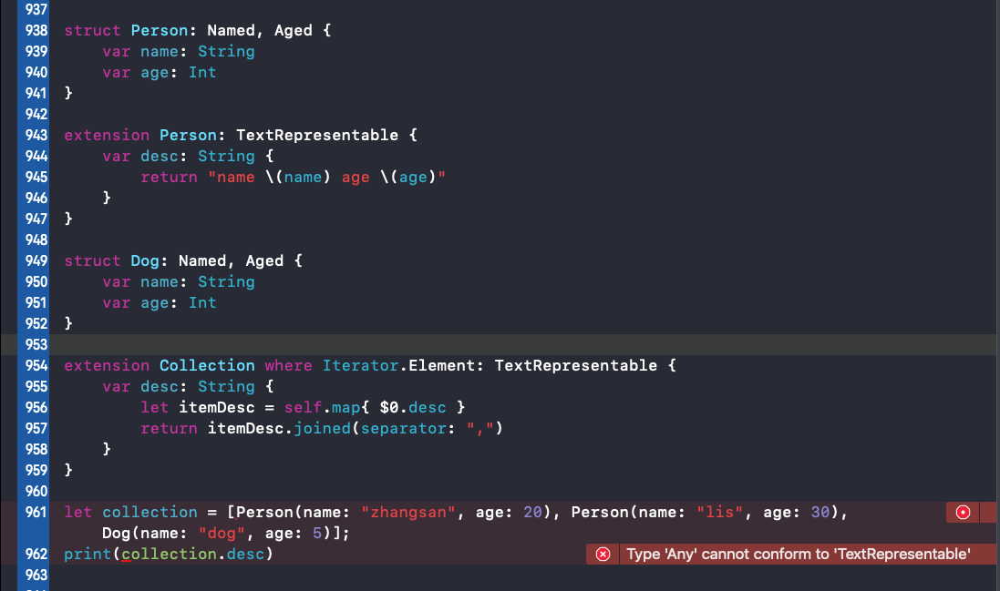

## 面向协议编程

### OOP（面向对象编程）

OOP（Object Oriented Programming）即面向对象程序设计，是以建立模型体现出来的抽象思维过程和面向对象的方法。

几乎所有的编程语言都支持OOP，Java、Ruby等语言的设计理念中几乎将一切事物都看做对象，对象即中心、对象即真理。

> 面向对象三要素：
>
> 1. 封装
> 将事物抽象为类，把对外接口暴露，将实现和内部数据隐藏。
> 2. 继承
> 可以使用现有类的所有功能，并在无序重新编写原来的类的情况下对这些功能进行扩展。
> <1> 通过继承创建的类称为“子类”或“派生类”。
> <2> 被继承的类称为“基类”、“父类”或“超类”。
> <3> 继承的过程，被称为从一般到特殊的过程。
> <4> 一个子类只能有一个基类，可以通过**多级继承**来实现多重继承。（在某些 OOP 语言中，一个子类可以继承多个基类。）
> 3. 多态
> 允许将子类类型的指针赋值给父类类型的指针。

OOP 的缺陷：

1. 继承机制要求在开始之前就能设计好整个程序的框架、结构、事物间的连接关系。这要求开发者必须有很好的分类设计能力，将不同的属性和方法分配到合适的层次里面去。设计清晰明了的继承体系总是很难的。（**C++标准库不是面向对象的**）

2. 结构天生对改动有抵抗特性。这也是为什么 OOP 领域中所有程序员都对重构讳莫如深，有些框架到最后代码量几句膨胀变得难以维护从而失控。（**修改行为比修改结构体简单**）

3. 继承机制带来的另一个问题是：很多语言都不提供多继承，我们不得不在父类塞入更多的内容，子类中会存在无用的父类属性和方法，而这些冗余代码给子类带来的一定的风险，而且对于层级很深的代码结构体来说 Bug 修复将会成为难题。（**组合优于继承**）

4. **对象**（Class，引用类型）的状态不是编码的好友，相反是编码的敌人。对象固有的状态在分享和传递过程中很难追踪调试，尤其在并行程序编码中问题就更加明显，很难查找对象在哪一个并行线程发生了改变。OOP 所带来的可变、不确定、复杂等特征完全与并行编程中倡导的小型化、核心化、高效化完全背离。在并行编程中，值类型的优势更加明显，一个值在传递后，不会因为传递出去的值的变化而变化，即并行线程间修改的值都是独立的。（**值类型优于引用类型**）

### POP（面向协议编程）

Protocol oriented programming。

协议为方法、属性等定义了蓝图，然后类、结构体或枚举可以采用该协议。

在 Objective-C 中数组的实现遵循的是 OOP 编程范式。可变数组 `NSMutableArray` 继承自 `NSArray`，`NSArray` 继承自 `NSObject`。同时`NSArray` 采纳了 `NSCopying`、`NSFastEnumeration`、`NSMutableCopying`、`NSSecureCoding` 等协议。

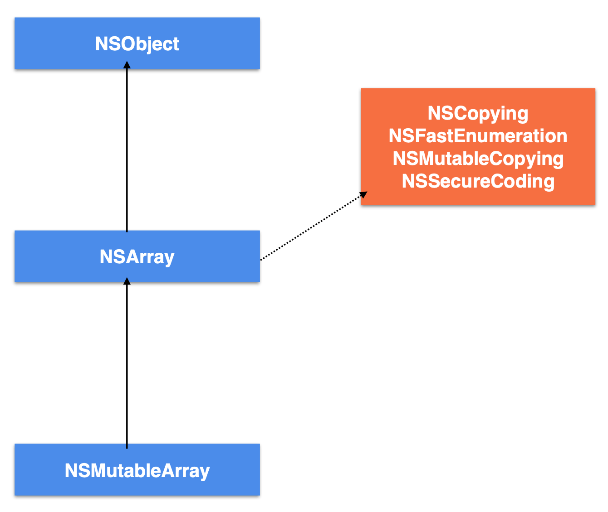

在 Swift 中数组的实现遵循的是 POP 编程范式。`Array` 没有继承自任何类，而是遵循了一系列的协议，不同的协议定义了不同功能的蓝图。

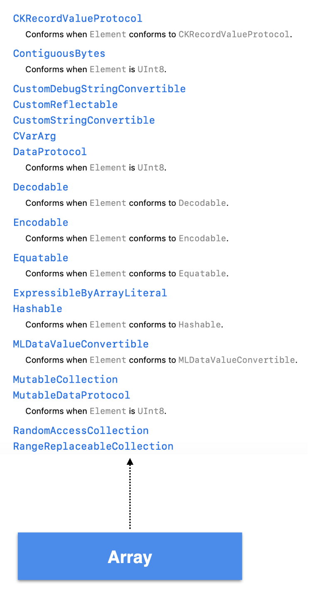

### OOP vs POP

**OOP 关心对象是什么，POP 关心对象做什么。**

#### OOP 关心对象是什么

采用 OOP 实现不同种类的运动员：

首页不同种类的运动员统称为运动员，运动员都是人，所以有以下方案

1、定义人类，一个有名字、年龄和说话等基本能力的人类：

```swift
class Human {
    var name: String
    var age: Int
    
    init(name: String, age: Int) {
        self.name = name
        self.age = age
    }
    
    func sayHi() {
        print("say Hi")
    }
}
```

2、定义运动员，一个人类运动员（继承自“人类”），他可以自定义自我介绍的内容：

```swift
class Athlete: Human {
    override func sayHi() {
        print("Hi, I'm \(name)")
    }
}
```

3、定义田径运动员、游泳运动员，他们统称为运动员（继承自“运动员”），并可以定义属于自己的特有的能力：

```swift
class Runner: Athlete {
    func run() {
        print("run")
    }
}

class Swimmer: Athlete {
    func swim() {
        print("swim")
    }
}
```

🤔**思考**：如果既是田径运动员，又是游泳运动员？

```swift
class RunnerAndSwimmer: Athlete {
    func run() {
        print("run")
    }

    func swim() {
        print("swim")
    }
}
```

直接定义一个“田径游泳”运动员，这个命名真的很 OC。

如果还是篮球运动员A，则可以写成 “RunnerAndSwimmerAndBasketballPlayer”，而且还可以一直 and 下去，“RunnerAndSwimmerAndBasketballPlayerAnd...”。

即：“田径” + “游泳” + “篮球”

```swift
class RunnerAndSwimmerAndBasketballPlayer: Athlete {
    func run() {
        print("run")
    }

    func swim() {
        print("swim")
    }

    func playBasketball() {
        print("play basketball")
    }
}
```

如果这时有一个运动员B，相对于第一个除了不是“田径”运动员外其他的都是，则需要定义一个类，类名可以写成 “SwimmerAndBasketballPlayer”。

即：“游泳” + “篮球”

```swift
class SwimmerAndBasketballPlayer: Athlete {
    func swim() {
        print("swim")
    }

    func playBasketball() {
        print("play basketball")
    }
}
```

运动员C：“田径” + “篮球”

```swift
class RunnerAndBasketballPlayer: Athlete {
    func run() {
        print("run")
    }

    func playBasketball() {
        print("play basketball")
    }
}
```

4、定义裁判，裁判肯定是一个人类

```swift
class Referee: Human {
    override func sayHi() {
        print("Hi, I'm \(name)")
    }
}
```

🤔**思考**：如果既是运动员，又是裁判？

```swift
class Referee: Athlete {
    override func sayHi() {
        print("Hi, I'm \(name)")
    }
}
```

让裁判继承自运动员，来表明这个裁判也是属于运动员这一类里的。显示生活中虽然裁判有可能是从运动员发展来的，但是这里显然裁判和运动员是两个职业，并没有从属关系。

#### POP 关心对象做什么

1、定义人类应该具备的基本属性，田径运动员的基本属性，游泳运动员的基本属性：

```swift
protocol Human {
    var name: String { get set }
    var age: Int { get set }
    func sayHi()
}

protocol Runnalbe {
    func run()
}

protocol Swimming {
    func swim()
}
```

2、田径运动员：“人类” + “田径”

```swift
struct Runner: Human, Runnalbe {
    var name = "zhangsan"
    var age = 35
    
    func sayHi() {
        print("Hi, I'm \(name)")
    }
    
    func run() {
        print("run")
    }
}
```

3、游泳运动员：“人类” + “游泳”

```swift
struct Swimmer: Human, Swimming {
    var name = "lisi"
    var age = 18
    
    func sayHi() {
        print("Hi, I'm \(name)")
    }
    
    func swim() {
        print("swim")
    }
}
```

4、运动健将：“人类” + “田径” + “游泳”

```swift
struct AllAroundAthlete: Human, Runnalbe, Swimming {
    var name: String = "wangwu"
    var age: Int = 25
    
    func sayHi() {
        print("Hi, I'm \(name)")
    }
    
    func run() {
        print("run")
    }
    
    func swim() {
        print("swim")
    }
}
```

### POP

Objective-C 的UIKit框架部分继承结构图👇：

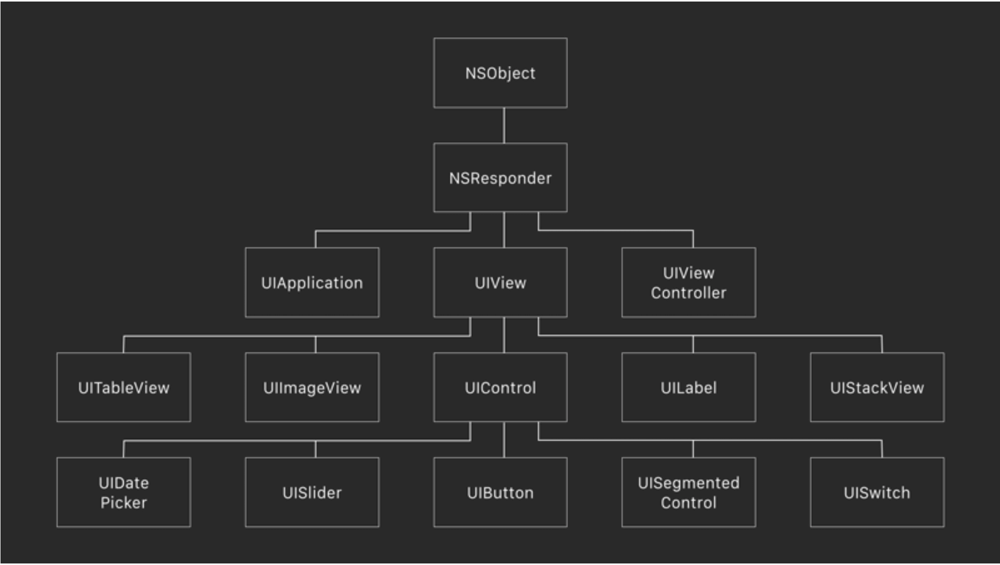

#### 《怪物城堡 Monster Castle》

开发一款塔防游戏《怪物城堡 Monster Castle》。

使用 OOP 开发，游戏中的角色：

1. 主要分为两类角色 `Castle` 和 `Monster`；
2. `Castle` 包括电脑玩家 `AI Player` 和真实玩家 `Human Player`；
3. `Monster` 包括三种怪物 `Munch Monster`、`Quirk Monster` 和 `Zap Monster`。

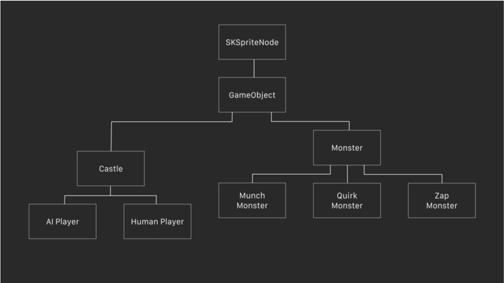

游戏中的能力：

1. `Castle` 和 `Zap Monster` 有射击的能力。

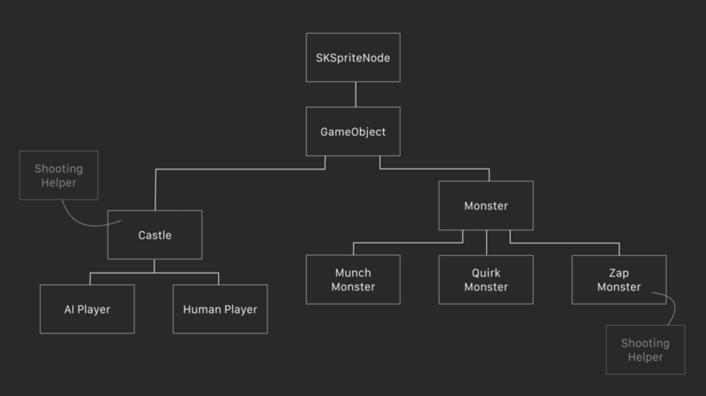

通过封装一个 Shooting Helper 类来实现射击的能力，则 Castle 和 Zap Monster 通过 Shooting Helper 来进行射击。

虽然一个专门负责射击的类可以实现需求，但是无法从 Castle 和 Zap Monster 的**定义**里面看出他们是拥有射击的能力的，只有去**内部实现**里查找 Shooting Helper 的存在，才能知道这两个角色是有射击能力的，而另外两个 Munch Monster 和 Quirk Monster 是没有设计能力的。

---

如果使用 POP 开发，则不再关心角色的分类，所有的角色都是 `GameObject` 的子类，它们的不同点在于他们拥有的能力不同。

游戏中的角色：`AI Player`（电脑玩家）、`Human Player`（真实玩家）、`Munch Monster`（蒙奇怪物）、`Quirk Monster`（魁克怪物）、`Zap Monster`（扎普怪物）。
游戏中的能力：`Gun Trait`（强制特性）、`Render Trait`（渲染特性）、`Movement Trait`（运动特性）、`Health Trait`（血条）、`AI Trait`

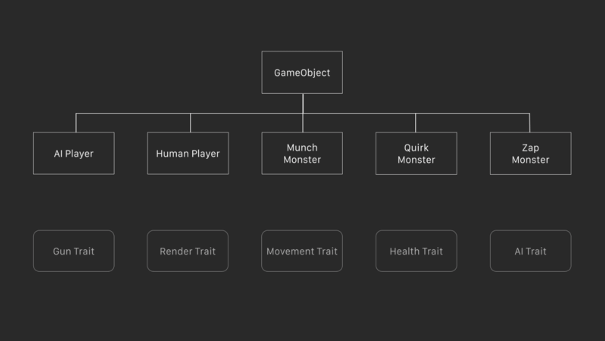

则代码中角色的形成，完全由他所拥有的能力提现出来：

```swift
class AIPlayer: GameObject, AITrait, GunTrait, RenderTrait, HealthTrait {

}

class ZapMonster: GameObject, GunTrait, RenderTrait, HealthTrait, MovementTrait {

}
```

---


```swift
class LoginViewController: UIViewController {
    private func isUsernameValid(username: String) -> Bool {
        return true
    }
    
    private func isPasswordValid(password: String) -> Bool {
        return true
    }
    
    @IBAction func loginButtonPressed() {
        if isUsernameValid(username: usernameTextField.text!) &&
           isPasswordValid(password: passwordTextField.text!) {
           // proceed with login
        } else {
           // show alert
        }
    }
}
```

```swift
class UsernameValidator {
    func isUsernameValid(username: String) -> Bool {
        return true
    }
}

class PasswordValidator {
    func isPasswordValid(password: String) -> Bool {
        return true
    }
}

class LoginViewController: UIViewController {
    let usernameValidator = UsernameValidator()
    let passwordValidator = PasswordValidator()
    
    @IBAction func loginButtonPressed() {
        if usernameValidator.isUsernameValid(username: usernameTextField.text!) &&
           passwordValidator.isPasswordValid(password: passwordTextField.text!) {
           // proceed with login
        } else {
           // show alert
        }
    }
}
```