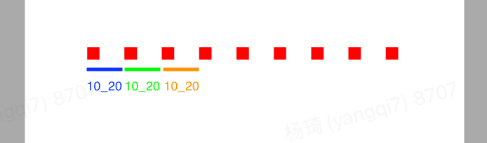
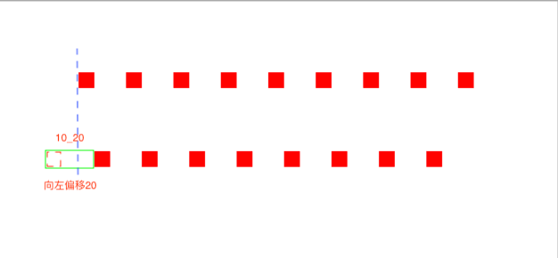
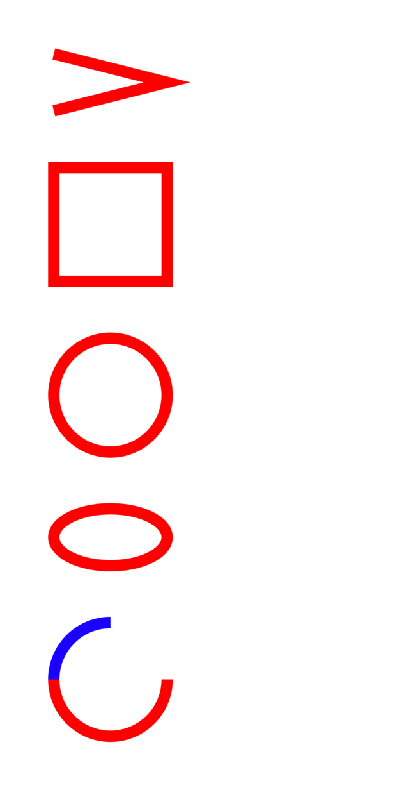
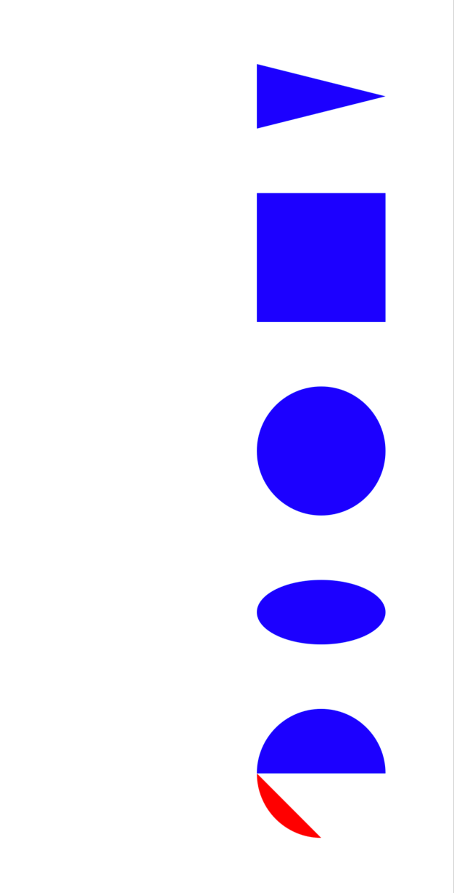
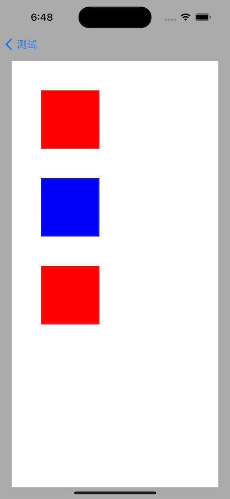

## UIBezierPath

`UIBezierPath` 是在 UIKit 中定义的类，可以用来创建基于矢量的**路径**，可以用来创建矩形、椭圆、曲线等等。`UIBezierPath`` 本质是对 Core Graphics 框架中的 CGPathRef 的封装。

### API

```js
ER_AUDIT_BEGIN(nullability, sendability)

UIKIT_EXTERN API_AVAILABLE(ios(3.2)) @interface UIBezierPath : NSObject<NSCopying, NSSecureCoding>

/// 创建 UIBezierPath 对象
+ (instancetype)bezierPath;

/// 创建矩形
/// - Parameters:
///   - rect: 大小
+ (instancetype)bezierPathWithRect:(CGRect)rect;

/// 创建圆形
/// - Parameters:
///   - rect: 大小
+ (instancetype)bezierPathWithOvalInRect:(CGRect)rect;

/// 创建圆角矩形
/// - Parameters:
///   - rect: 大小
///   - cornerRadius: 圆角
+ (instancetype)bezierPathWithRoundedRect:(CGRect)rect cornerRadius:(CGFloat)cornerRadius;

/// 创建指定角为圆角的矩形
/// - Parameters:
///   - rect: 大小
///   - corners: 指定角
///   - cornerRadius: 圆角
+ (instancetype)bezierPathWithRoundedRect:(CGRect)rect byRoundingCorners:(UIRectCorner)corners cornerRadii:(CGSize)cornerRadii;

/// 创建圆弧
/// - Parameters:
///   - center: 圆点
///   - radius: 半径
///   - startAngle: 开始位置
///   - endAngle: 结束为止
///   - clockwise: 是否顺时针方向
+ (instancetype)bezierPathWithArcCenter:(CGPoint)center radius:(CGFloat)radius startAngle:(CGFloat)startAngle endAngle:(CGFloat)endAngle clockwise:(BOOL)clockwise;

/// 根据已有路径创建新路径
/// - Parameters:
///   - CGPath: 已有路径
+ (instancetype)bezierPathWithCGPath:(CGPathRef)CGPath;

- (instancetype)init NS_DESIGNATED_INITIALIZER;
- (nullable instancetype)initWithCoder:(NSCoder *)coder NS_DESIGNATED_INITIALIZER;

/// 返回一个不可变的CGPathRef，该值仅在UIBezierPath进一步发生突变之前有效。
/// 设置路径将创建所提供CGPathRef的不可变副本，因此将忽略所提供CGMutablePathRef上的任何进一步突变。
@property(nonatomic) CGPathRef CGPath;
- (CGPathRef)CGPath NS_RETURNS_INNER_POINTER CF_RETURNS_NOT_RETAINED;

// 路径建设

/// 移动到某一点
/// - Parameters:
///   - point: 指定点坐标
- (void)moveToPoint:(CGPoint)point;

/// 绘制一条直线
/// - Parameters:
///   - point: 指定点坐标
- (void)addLineToPoint:(CGPoint)point;

/// 创建三次贝塞尔曲线
/// - Parameters:
///   - endPoint: 终点
///   - controlPoint1: 控制点1
///   - controlPoint2: 控制点2
- (void)addCurveToPoint:(CGPoint)endPoint controlPoint1:(CGPoint)controlPoint1 controlPoint2:(CGPoint)controlPoint2;

/// 创建两次贝塞尔曲线
/// - Parameters:
///   - endPoint: 终点
///   - controlPoint: 控制点
- (void)addQuadCurveToPoint:(CGPoint)endPoint controlPoint:(CGPoint)controlPoint;

/// 创建圆弧
/// - Parameters:
///   - center: 圆心
///   - radius: 半径
///   - startAngle: 开始位置
///   - endAngle: 结束为止
///   - clockwise: 是否顺时针方向
- (void)addArcWithCenter:(CGPoint)center radius:(CGFloat)radius startAngle:(CGFloat)startAngle endAngle:(CGFloat)endAngle clockwise:(BOOL)clockwise API_AVAILABLE(ios(4.0));

/// 闭合路径，即在终点和起点绘制一根线
- (void)closePath;

/// 清空路径
- (void)removeAllPoints;

// 附加路径

/// 追加路径
/// - Parameters:
///   - bezierPath: 路径
- (void)appendPath:(UIBezierPath *)bezierPath;

// 修改路径

/// 翻转路径，即起点变终点，终点变起点
- (UIBezierPath *)bezierPathByReversingPath API_AVAILABLE(ios(6.0));

// 转换路径

/// 路径进行仿射变换
/// - Parameters:
///   - transform: 仿射变换
- (void)applyTransform:(CGAffineTransform)transform;

// 路径信息

/// 路径上是否有有效元素（只读）
@property(readonly,getter=isEmpty) BOOL empty;

/// 获取 Path 的 x坐标、y坐标、宽度，高度为0（不同于UIView的bounds）
@property(nonatomic,readonly) CGRect bounds;

/// 当前path的位置，可以理解为path的终点
@property(nonatomic,readonly) CGPoint currentPoint;

/// 是否包含某点
/// - Parameters:
///   - point: 指定点
- (BOOL)containsPoint:(CGPoint)point;

// 绘画属性

/// path宽度
@property(nonatomic) CGFloat lineWidth;

/// path端点样式（butt：无端点；round：圆形端点；square：方形端点，跟 butt 一样，但是比 butt 长）
@property(nonatomic) CGLineCap lineCapStyle;

/// path拐角样式（miter：尖角；round：圆角；bevel：缺角）
@property(nonatomic) CGLineJoin lineJoinStyle;

/// 最大斜接长度，角度越小，斜接长度越大（在miter类型情况下，为了避免斜接长度过长，使用lineLimit属性限制，超过限制会以 bevel 类型来显示）
@property(nonatomic) CGFloat miterLimit; 

/// 弯曲路径的渲染精度，默认为0.6，越小精度越高，相应的更加消耗性能
@property(nonatomic) CGFloat flatness;

/// 奇偶数圈规则是否用于绘制路径
@property(nonatomic) BOOL usesEvenOddFillRule;

/// 绘制虚线
/// - Parameters:
///   - pattern: 如何交替绘制，C类型现行数据（如：CGFloat dash[] = {0.0, dotSpacing+dotDiameter};）
///   - count: 数组长度
///   - phase: 偏移量
- (void)setLineDash:(nullable const CGFloat *)pattern count:(NSInteger)count phase:(CGFloat)phase;
- (void)getLineDash:(nullable CGFloat *)pattern count:(nullable NSInteger *)count phase:(nullable CGFloat *)phase;

// 当前图形上下文（CGContextRef）上的路径操作

/// 填充
- (void)fill;

/// 描边，路径的绘制需要描边才能显示出来
- (void)stroke;

/*
补充：

设置描边颜色，需要在设置后调用描边发方法
[[UIColor redColor] setStroke];

设置填充颜色，需要在设置后调用填充方法
[[UIColor redColor] setFill]; 
*/

// 这些方法不会影响当前图形上下文（CGContextRef）的混合模式或alpha

/// 设置填充的混合模式
/// - Parameters:
///   - blendMode: 混合模式
///   - alpha: 透明度、
- (void)fillWithBlendMode:(CGBlendMode)blendMode alpha:(CGFloat)alpha;

/// 设置描边的混合模式
/// - Parameters:
///   - blendMode: 混合模式
///   - alpha: 透明度
- (void)strokeWithBlendMode:(CGBlendMode)blendMode alpha:(CGFloat)alpha;

/// 修改当前图形上下文（CGContextRef）的绘图区域可见
- (void)addClip;

@end

NS_HEADER_AUDIT_END(nullability, sendability)
```

### 直线

1. `bezierPath`：创建一个 UIBezierPath 对象；
2. `moveToPoint:`：设置起点；
3. `addLineToPoint:`：创建线段；
4. `stroke`：绘制线段；

```js
- (void)drawRect:(CGRect)rect {
    
    [[UIColor redColor] setStroke];
    
    // 直线
    UIBezierPath *path = [UIBezierPath bezierPath];
    path.lineWidth = 10;
    [path moveToPoint:CGPointMake(50, 50)];
    [path addLineToPoint:CGPointMake(300, 50)];
    // path.lineCapStyle = kCGLineCapButt; // 默认无线帽
    [path stroke];
    
    // 圆形线帽
    UIBezierPath *lineCapPath_round = [UIBezierPath bezierPath];
    lineCapPath_round.lineWidth = 10;
    [lineCapPath_round moveToPoint:CGPointMake(50, 100)];
    [lineCapPath_round addLineToPoint:CGPointMake(300, 100)];
    lineCapPath_round.lineCapStyle = kCGLineCapRound; // 圆角
    [lineCapPath_round stroke];
    
    // 直角线帽
    UIBezierPath *lineCapPath_square = [UIBezierPath bezierPath];
    lineCapPath_square.lineWidth = 10;
    [lineCapPath_square moveToPoint:CGPointMake(50, 150)];
    [lineCapPath_square addLineToPoint:CGPointMake(300, 150)];
    lineCapPath_square.lineCapStyle = kCGLineCapSquare; // 直角
    [lineCapPath_square stroke];
}
```


### 虚线

1. `bezierPath`：创建一个 UIBezierPath 对象；
2. `moveToPoint:`：设置起点；
3. `addLineToPoint:`：创建线段；
4. `setLineDash:count:`：设置线段样式，交替绘制数组中的长度；
5. `stroke`：绘制线段；

```js
- (void)drawRect:(CGRect)rect {
    
    [[UIColor redColor] setStroke];
    
    // 虚线
    UIBezierPath *lineDashPath = [UIBezierPath bezierPath];
    lineDashPath.lineWidth = 10;
    [lineDashPath moveToPoint:CGPointMake(50, 200)];
    [lineDashPath addLineToPoint:CGPointMake(300, 200)];
    CGFloat pattern[] = {10, 20};
    [lineDashPath setLineDash:pattern count:2 phase:0];
    [lineDashPath stroke];
}
```

相较于实线，创建虚线多了一个设置项 `setLineDash:count:`，它是**交替**绘制的线段长度的数组。

如果数组长度是偶数，如 `{10, 20}`，则 10 是虚线长度，20 是虚线间隙长度。



```js
- (void)drawRect:(CGRect)rect {
    
    [[UIColor redColor] setStroke];
    
    // 虚线
    UIBezierPath *lineDashPath = [UIBezierPath bezierPath];
    lineDashPath.lineWidth = 10;
    [lineDashPath moveToPoint:CGPointMake(50, 200)];
    [lineDashPath addLineToPoint:CGPointMake(300, 200)];
    CGFloat pattern[] = {10, 20, 40};
    [lineDashPath setLineDash:pattern count:3 phase:0];
    [lineDashPath stroke];
}
```

如果数组长度是奇数，如 `{10, 20, 40}`，则 10 即是虚线长度也是间隙长度，如下图：


`setLineDash:count:` 中的 count 表示线段个数，dash 是线段长度数组。如果 dash 等于 {10, 20}，count 等于3，则第三个线段长度默认为0，交替方式为：


### 三角行

1. `bezierPath`：创建一个 UIBezierPath 对象；
2. `moveToPoint:`：设置起点；
3. `addLineToPoint:`：创建线段（多次调用创建多个子路径）；
4. `closePath`：闭合路径，即在终点和起点绘制一根线；
5. `stroke`：绘制线段；

```js
- (void)drawRect:(CGRect)rect {
    
    [[UIColor redColor] setStroke];
    
    // 三角形
    UIBezierPath *lineJoinPath = [UIBezierPath bezierPath];
    lineJoinPath.lineWidth = 10;
    [lineJoinPath moveToPoint:CGPointMake(50, 50)];
    [lineJoinPath addLineToPoint:CGPointMake(300, 100)];
    [lineJoinPath addLineToPoint:CGPointMake(50, 150)];
    // lineJoinPath.lineJoinStyle = kCGLineJoinMiter; // 默认尖角
    [lineJoinPath closePath];
    [lineJoinPath stroke];
    
    // 三角形
    UIBezierPath *lineJoinPath_round = [UIBezierPath bezierPath];
    lineJoinPath_round.lineWidth = 10;
    [lineJoinPath_round moveToPoint:CGPointMake(50, 200)];
    [lineJoinPath_round addLineToPoint:CGPointMake(300, 250)];
    [lineJoinPath_round addLineToPoint:CGPointMake(50, 300)];
    lineJoinPath_round.lineJoinStyle = kCGLineJoinRound; // 圆角
    [lineJoinPath_round closePath];
    [lineJoinPath_round stroke];
    
    // 三角形
    UIBezierPath *lineJoinPath_bevel = [UIBezierPath bezierPath];
    lineJoinPath_bevel.lineWidth = 10;
    [lineJoinPath_bevel moveToPoint:CGPointMake(50, 350)];
    [lineJoinPath_bevel addLineToPoint:CGPointMake(300, 400)];
    [lineJoinPath_bevel addLineToPoint:CGPointMake(50, 450)];
    lineJoinPath_bevel.lineJoinStyle = kCGLineJoinBevel; // 缺角
    [lineJoinPath_bevel closePath];
    [lineJoinPath_bevel stroke];
}
```


`lineJoinStyle` 是设置斜接长度

`kCGLineJoinMiter`：


`kCGLineJoinBevel`：


### 图形

```js
- (void)drawRect:(CGRect)rect {

    // 设置描边色
    [[UIColor redColor] setStroke];
    
    // 矩形
    UIBezierPath *rectPath = [UIBezierPath bezierPathWithRect:CGRectMake(50, 50, 100, 50)];
    [rectPath stroke];
    
    // 圆
    UIBezierPath *ovalPath = [UIBezierPath bezierPathWithOvalInRect:CGRectMake(50, 150, 100, 100)];
    [ovalPath stroke];
    
    // 圆角矩形
    UIBezierPath *roundPath = [UIBezierPath bezierPathWithRoundedRect:CGRectMake(50, 300, 100, 100) cornerRadius:20];
    [roundPath stroke];
    
    // 指定角圆角矩形
    UIBezierPath *roundPath2 = [UIBezierPath bezierPathWithRoundedRect:CGRectMake(50, 450, 100, 100) byRoundingCorners:(UIRectCornerTopLeft | UIRectCornerBottomRight) cornerRadii:CGSizeMake(20, 20)];
    [roundPath2 stroke];
    
    // 圆弧
    UIBezierPath *arcPath = [UIBezierPath bezierPathWithArcCenter:CGPointMake(100, 650) radius:50 startAngle:0 endAngle:M_PI clockwise:YES];
    [arcPath stroke];
    
    // 设置描边色
    [[UIColor blueColor] setStroke];
    
    // 圆弧
    UIBezierPath *arcPath2 = [UIBezierPath bezierPathWithArcCenter:CGPointMake(100, 650) radius:50 startAngle:0 endAngle:-M_PI*0.5 clockwise:NO];
    [arcPath2 stroke];
    
    // 设置填充色
    [[UIColor blueColor] setFill];
    
    // 矩形
    UIBezierPath *rectPath_fill = [UIBezierPath bezierPathWithRect:CGRectMake(200, 50, 100, 50)];
    [rectPath_fill fill];
    
    // 圆
    UIBezierPath *ovalPath_fill = [UIBezierPath bezierPathWithOvalInRect:CGRectMake(200, 150, 100, 100)];
    [ovalPath_fill fill];
    
    // 圆角矩形
    UIBezierPath *roundPath_fill = [UIBezierPath bezierPathWithRoundedRect:CGRectMake(200, 300, 100, 100) cornerRadius:20];
    [roundPath_fill fill];
    
    // 指定角圆角矩形
    UIBezierPath *roundPath2_fill = [UIBezierPath bezierPathWithRoundedRect:CGRectMake(200, 450, 100, 100) byRoundingCorners:(UIRectCornerTopLeft | UIRectCornerBottomRight) cornerRadii:CGSizeMake(20, 20)];
    [roundPath2_fill fill];
    
    // 圆弧
    UIBezierPath *arcPath_fill = [UIBezierPath bezierPathWithArcCenter:CGPointMake(250, 650) radius:50 startAngle:0 endAngle:M_PI clockwise:YES];
    [arcPath_fill fill];
    
    // 设置填充色
    [[UIColor redColor] setFill];
    
    // 圆弧
    UIBezierPath *arcPath2_fill = [UIBezierPath bezierPathWithArcCenter:CGPointMake(250, 650) radius:50 startAngle:0 endAngle:-M_PI*0.5 clockwise:NO];
    [arcPath2_fill fill];
}
```


绘制圆形的角度关系


### 曲线

```js
- (void)drawRect:(CGRect)rect {
    // 设置描边色
    [[UIColor redColor] setStroke];
    
    // 一个控制点的曲线
    UIBezierPath *quadCurvePath = [UIBezierPath bezierPath];
    quadCurvePath.lineWidth = 5;
    [quadCurvePath moveToPoint:CGPointMake(50, 100)];
    [quadCurvePath addQuadCurveToPoint:CGPointMake(300, 100) controlPoint:CGPointMake(200, 150)];
    [quadCurvePath stroke];
    
    // 两个控制点的曲线
    UIBezierPath *curvePath = [UIBezierPath bezierPath];
    curvePath.lineWidth = 5;
    [curvePath moveToPoint:CGPointMake(50, 200)];
    [curvePath addCurveToPoint:CGPointMake(300, 200) controlPoint1:CGPointMake(100, 150) controlPoint2:CGPointMake(250, 250)];
    [curvePath stroke];
}
```


二次曲线：包括两个起点，一个控制点。


三次曲线：包括两个起点，两个控制点。


## Core Graphics

Core Graphics Framework 是一套基于 C 的 API 框架，使用了 Quartz 作为绘图引擎。它提供了低级别、轻量级、高保真度的 2D 渲染。该框架可以用于基于路径的绘图、变换、颜色管理、脱屏渲染，模板、渐变、遮蔽、图像数据管理、图像的创建、遮罩，以及PDF文档的创建、显示和分析。

iOS 支持两套图形API族：

1. Core Graphics/QuartZ 2D（QuartZ 2D 是苹果公司开发的API，是 Core Graphics Framework 的一部分）；
2. OpenGL ES（跨平台图形API，OpenGL 的简化版本）；

`UIBezierPath` 是基于 Core Graphics 对 `CGPathRef` 数据类型的封装。

### 直线

```js
- (void)drawRect:(CGRect)rect {
    // 设置描边颜色
    [[UIColor redColor] setStroke];
    
    // 获取当前上下文（CGContextRef）
    CGContextRef context = UIGraphicsGetCurrentContext();
    
    // 线帽，butt（默认值，无线帽）
    CGContextSetLineCap(context, kCGLineCapButt);
    // 线条宽度
    CGContextSetLineWidth(context, 10);
    // 起点
    CGContextMoveToPoint(context, 50, 50);
    // 创建线段
    CGContextAddLineToPoint(context, 300, 50);
    // 绘制
    CGContextStrokePath(context);
    
    
    // 线帽，round（圆形）
    CGContextSetLineCap(context, kCGLineCapRound);
    // 线条宽度
    CGContextSetLineWidth(context, 10);
    // 起点
    CGContextMoveToPoint(context, 50, 100);
    // 创建线段
    CGContextAddLineToPoint(context, 300, 100);
    // 绘制
    CGContextStrokePath(context);
    
    
    // 线帽，square（方形）
    CGContextSetLineCap(context, kCGLineCapSquare);
    // 线条宽度
    CGContextSetLineWidth(context, 10);
    // 起点
    CGContextMoveToPoint(context, 50, 150);
    // 创建线段
    CGContextAddLineToPoint(context, 300, 150);
    // 绘制
    CGContextStrokePath(context);
}
```


### 虚线

```js
- (void)drawRect:(CGRect)rect {
    // 设置描边颜色
    [[UIColor redColor] setStroke];
    // 获取当前上下文（CGContextRef）
    CGContextRef context = UIGraphicsGetCurrentContext();
    // 线段长度数组
    CGFloat lengths[] = {10, 20};
    
    
    // 宽度
    CGContextSetLineWidth(context, 10);
    // 起点
    CGContextMoveToPoint(context, 50, 50);
    // 创建线段
    CGContextAddLineToPoint(context, 300, 50);
    // 设置虚线样式
    CGContextSetLineDash(context, 0, lengths, 2);
    // 绘制
    CGContextStrokePath(context);
    
    
    // 宽度
    CGContextSetLineWidth(context, 10);
    // 起点
    CGContextMoveToPoint(context, 50, 100);
    // 创建线段
    CGContextAddLineToPoint(context, 300, 100);
    // 设置虚线样式（phase = 20，虚线向左移动20）
    CGContextSetLineDash(context, 20, lengths, 2);
    // 绘制
    CGContextStrokePath(context);
}
```



### 三角形

```js
- (void)drawRect:(CGRect)rect {
    // 设置描边颜色
    [[UIColor redColor] setStroke];

    // 后期当前上下文（CGContextRef）
    CGContextRef context = UIGraphicsGetCurrentContext();
    
    // 设置斜接角样式，miter（默认，尖角）
    CGContextSetLineJoin(context, kCGLineJoinMiter);
    // 线宽
    CGContextSetLineWidth(context, 10);
    // 起点
    CGContextMoveToPoint(context, 50, 50);
    // 创建线段
    CGContextAddLineToPoint(context, 300, 100);
    // 创建线段
    CGContextAddLineToPoint(context, 50, 150);
    // 闭环
    CGContextClosePath(context);
    // 描边
    CGContextStrokePath(context);
    
    // 设置斜接角仰视，round（圆形）
    CGContextSetLineJoin(context, kCGLineJoinRound);
    // 先款
    CGContextSetLineWidth(context, 10);
    // 起点
    CGContextMoveToPoint(context, 50, 200);
    // 创建线段
    CGContextAddLineToPoint(context, 300, 250);
    // 创建线段
    CGContextAddLineToPoint(context, 50, 300);
    // 闭环
    CGContextClosePath(context);
    // 绘制
    CGContextStrokePath(context);
    
    // 设置斜接角样式，bevel（方形）
    CGContextSetLineJoin(context, kCGLineJoinBevel);
    // 起点
    CGContextMoveToPoint(context, 50, 350);
    // 创建线段
    CGContextAddLineToPoint(context, 300, 400);
    // 创建线段
    CGContextAddLineToPoint(context, 50, 450);
    // 闭环
    CGContextClosePath(context);
    // 绘制
    CGContextStrokePath(context);
}
```


### 更多图形

```js
- (void)drawRect:(CGRect)rect {
    [[UIColor redColor] setStroke];
    
    // 获取当前上下文（CGContextRef）
    CGContextRef context = UIGraphicsGetCurrentContext();
    CGContextSetLineWidth(context, 10);
    
    CGContextMoveToPoint(context, 50, 50);
    CGContextAddLineToPoint(context, 150, 75);
    CGContextAddLineToPoint(context, 50, 100);
    
    // 矩形
    CGContextAddRect(context, CGRectMake(50, 150, 100, 100));
    
    // 圆
    CGContextAddEllipseInRect(context, CGRectMake(50, 300, 100, 100));
    
    // 椭圆
    CGContextAddEllipseInRect(context, CGRectMake(50, 450, 100, 50));
    
    // 描边（绘制上面的path，下面的path单独绘制）
    CGContextStrokePath(context);
    
    // 圆弧（(x, y)中心点，radius半径，startAngle起点，endAngle终点，clockwise顺时针0、逆时针1）
    CGContextAddArc(context, 100, 600, 50, 0, M_PI, 0);
    
    // 描边（绘制上面的path，下面的path单独绘制）
    CGContextStrokePath(context);
    
    // 改变颜色
    [[UIColor blueColor] setStroke];
    // 圆弧
    CGContextAddArc(context, 100, 600, 50, M_PI, M_PI * 1.5, 0);
    // 描边
    CGContextStrokePath(context);
}
```



填充样式：

```js
- (void)drawRect:(CGRect)rect {
    [[UIColor redColor] setStroke];
    [[UIColor blueColor] setFill];

    // 获取当前上下文（CGContextRef）
    CGContextRef context = UIGraphicsGetCurrentContext();
    CGContextSetLineWidth(context, 10);
    
    // 三角
    CGPoint points[] = {CGPointMake(200, 50), CGPointMake(300, 75), CGPointMake(200, 100)};
    CGContextAddLines(context, points, 3);
    CGContextClosePath(context);
    
    // 矩形
    CGContextAddRect(context, CGRectMake(200, 150, 100, 100));
    
    // 圆
    CGContextAddEllipseInRect(context, CGRectMake(200, 300, 100, 100));
    
    // 椭圆
    CGContextAddEllipseInRect(context, CGRectMake(200, 450, 100, 50));
    // CGContextFillEllipseInRect(context, CGRectMake(150, 450, 100, 50));
    
    CGContextFillPath(context);
    
    // 圆弧
    CGContextAddArc(context, 250, 600, 50, 0, -M_PI, 1);
    CGContextFillPath(context);
    
    CGContextSetFillColorWithColor(context, [UIColor redColor].CGColor);
    CGContextSetStrokeColorWithColor(context, [UIColor blueColor].CGColor);
    CGContextAddArc(context, 250, 600, 50, -M_PI, -M_PI*1.5, 1);
    
    CGContextFillPath(context);
}
```



### 贝塞尔曲线

```js
- (void)drawRect:(CGRect)rect {
    [[UIColor redColor] setStroke];
    
    CGContextRef context = UIGraphicsGetCurrentContext();
    CGContextSetLineWidth(context, 10);
    
    // 起点
    CGContextMoveToPoint(context, 50, 50);
    // 弧线（(x1, y1)起点，(x2, y2)终点，半径）
    CGContextAddArcToPoint(context, 250, 50, 200, 150, 20);
    
    CGContextMoveToPoint(context, 50, 200);
    // 二次贝塞尔曲线（(cpx, cpy)控制点，(x, y)终点）
    CGContextAddQuadCurveToPoint(context, 200, 100, 250, 200);
    
    CGContextMoveToPoint(context, 50, 300);
    // 三次贝塞尔曲线（(cp1x, cp1y)控制点，(cp2x, cp2y)控制点，(x, y)终点）
    CGContextAddCurveToPoint(context, 100, 200, 200, 400, 250, 300);
    
    CGContextStrokePath(context);
}
```


### 高级API

```js
- (void)drawRect:(CGRect)rect {
    [[UIColor redColor] setStroke];
    [[UIColor blueColor] setFill];
    
    CGPoint points[] = {CGPointMake(50, 50), CGPointMake(250, 50), CGPointMake(100, 80), CGPointMake(250, 80)};
    
    CGContextRef context = UIGraphicsGetCurrentContext();
    CGContextSetLineWidth(context, 10);
    
    // 绘制直线线，p0-p1，p2-p3
    CGContextStrokeLineSegments(context, points, 4);
    
    // 矩形
    CGContextStrokeRect(context, CGRectMake(50, 150, 100, 100));
    
    // 矩形，指定线宽
    CGContextStrokeRectWithWidth(context, CGRectMake(50, 300, 100, 100), 1);
    // 填充矩形
    CGContextFillRect(context, CGRectMake(200, 300, 100, 100));
    
    // 同时创建多个填充矩形
    CGRect rects[] = {CGRectMake(50, 450, 100, 100), CGRectMake(200, 450, 100, 100)};
    CGContextFillRects(context, rects, 2);
    
    // 椭圆
    CGContextStrokeEllipseInRect(context, CGRectMake(50, 600, 100, 60));
    // 填充椭圆
    CGContextFillEllipseInRect(context, CGRectMake(200, 600, 100, 60));
}
```


### push

```js
- (void)drawRect:(CGRect)rect {
    // 设置填充色：红色
    [[UIColor redColor] setFill];
    // 把context压入栈中，并把context设置为当前绘图上下文
    UIGraphicsPushContext(UIGraphicsGetCurrentContext());
    // 设置填充色：蓝色
    [[UIColor blueColor] setFill];
    // 将栈顶的上下文弹出，恢复先前的上下文，但是绘图状态不变
    UIGraphicsPopContext();
    // 设置填充范围
    UIRectFill(CGRectMake(10, 10, 80, 80));
}
```


### SaveGState

```js
- (void)drawRect:(CGRect)rect {
    // 设置填充色：红色
    [[UIColor redColor] setFill]; // red
    // 保存状态
    CGContextSaveGState(UIGraphicsGetCurrentContext()); // red
    // 设置填充色：蓝色
    [[UIColor blueColor] setFill]; // blue
    // 回复状态
    CGContextRestoreGState(UIGraphicsGetCurrentContext()); // red
    // 设置填充范围
    UIRectFill(CGRectMake(10, 10, 80, 80)); // red
}
```



## drawRect

上面演示的 UIBezierPath 和 Core Graphics，都是在 `drawRect:` 方法里实现的，所以这里有一个问题：为什么要在 `drawRect:` 方法内实现绘图操作？

### 思考：为什么要在 `drawRect:` 方法内实现绘图操作

因为 Core Graphics API 所有的操作都在上下文中进行，所以在绘图前需要获取该上下文并传入执行渲染的函数内。上下文就是**内存中的一块画布**，屏幕上的所有图片有自己所属的画布（上下文），同时任何绘图操作都要在画布（上下文）上实现。

有两种获取上下文的常用方法：

一、创建一个图片类型的上下文

1. 调用 `UIGraphicsBeginImageContext()` 或 `UIGraphicsBeginImageContextWithOptions()` 函数可以获得处理图片的图形上下文。

2. 调用 `UIGraphicsGetImageFromCurrentImageContext()` 函数可以从画布（上下文）中获取一个 UIImag 对象。

3. 调用 `UIGraphicsEndImageContext()` 函数关闭图形上下文。

二、利用 Cocoa 自动生成的上下文（`drawRect:`方法）。

1. 子类化 UIView 并实现 `drawRect:`` 方法，一旦 `drawRect:`` 方法被调用，Cocoa 就会创建一个图形上下文。

2. 调用 `UIGraphicsGetCurrentContext()` 函数，获取到当前的图形上下文；

3. 进行绘图操作，所有操作都会显示在当前上下文对应的 UIView 上。

### 思考：UIView 和上下文是什么关系❓


### UIGraphicsBeginImageContext

在 `drawRect:` 方法外完成绘图操作：

```js
- (void)withoutDrawRect {
    
    CGRect rect = CGRectMake(50, 50, 100, 100);
    // 获取图形上下文，用来处理图片
    UIGraphicsBeginImageContext(rect.size);
    // 获取当前上下文
    CGContextRef context = UIGraphicsGetCurrentContext();
    // 设置填充色
    CGContextSetFillColorWithColor(context, [UIColor redColor].CGColor);
    // 设置填充坐标、大小（在rect内的坐标）
    CGContextFillRect(context, CGRectMake(0, 0, 100, 100));
    // 设置边框颜色
    CGContextSetStrokeColorWithColor(context, [UIColor blueColor].CGColor);
    // 设置边框宽度
    CGContextSetLineWidth(context, 5);
    // 设置边框坐标、大小（在rect内的坐标）
    CGContextStrokeRect(context, CGRectMake(0, 0, 100, 100));
    // 当前上下文中获取 UIImage 对象
    UIImage *theImage = UIGraphicsGetImageFromCurrentImageContext();
    // 关闭图形上下文
    UIGraphicsEndImageContext();
    
    // 展示
    UIImageView *imageView = [[UIImageView alloc] initWithImage:theImage];
    imageView.frame = rect;
    [self addSubview:imageView];
}
```


这里使用 `UIGraphicsBeginImageContext()` 方法，完成了在 `drawRect:` 方法外绘图的操作。

## 其它

先关文档：

1. [iOS绘图教程](https://www.cnblogs.com/xdream86/archive/2012/12/12/2814552.html)