AVL树是最先发明的自平衡二叉查找树。在AVL树中任何节点的两个子树的高度最大差别为1，所以它也被称为高度平衡树。增加和删除可能需要通过一次或多次树旋转来重新平衡这个树。AVL树得名于它的发明者G. M. Adelson-Velsky和E. M. Landis，他们在1962年的论文《An algorithm for the organization of information》中发表了它。

<!-- more -->

# 平衡二叉搜索树（Balanced Binary Search Tree）
## 二叉搜索树的复杂度分析
依次添加节点 `7、4、9、2、5、8、11` 得到的二叉搜索树，添加、删除和搜索操作的复杂度跟二叉搜索树的高度有关，O(h) == O(logn)。
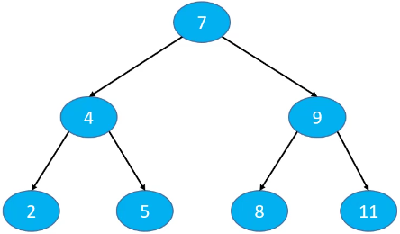

依次添加节点 `2、4、5、7、8、9、11` 得到的二叉搜索树，添加、删除和搜索操作的复杂度跟节点个数有关，O(h) == O(n)。二叉搜索树退化成了链表。
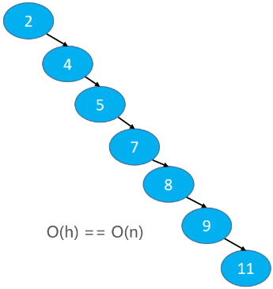

当 n 比较大时，两者的性能差异比较大。如 n == 1000000 时，二叉搜索树的最低高度是 20。

## 平衡（Balance）
平衡：当节点数固定时，左右子树的高度越接近，这课二叉树就越平衡（高度越低）
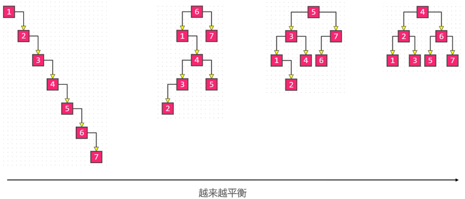

## 理想平衡
最理想的平衡，就是像完全二叉树、满二叉树那样，高度是最小的。
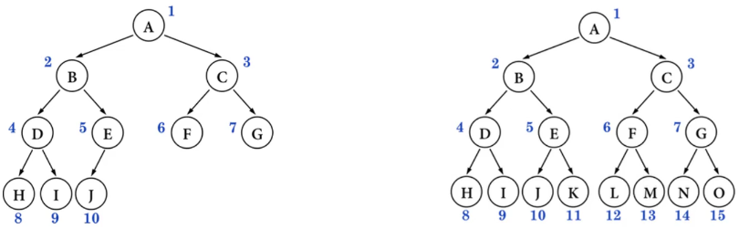

## 如何改进二叉搜索树？
因为节点的添加、删除顺序是无法限制的，可以认为是随机的，所以改进方案是：在节点的添加、删除操作之后，想办法让二叉搜索树恢复平衡（减小树的高度）。
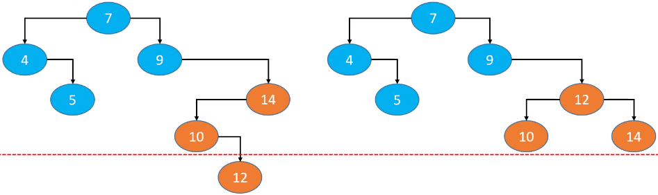

如果按照图中的调整方式再继续调整其它节点的位置，就可以达到理想平衡。但是调整的次数太多，反而增加了时间复杂度。所以，比较合理的改进方案是：用尽量少的调整次数达到适合平衡即可，即平衡二叉搜索树。

## 经典的平衡二叉搜索树
平衡二叉搜索树简称：BBST。

### AVL 树
Windows NT 内核中广泛使用

### 红黑树
1. C++ STL（比如：map、set）；
2. Java 的 TreeMap、TreeSet、HashMap、HashSet；
3. Linux 的进度调整；
4. Ngix 的 timer 管理；

AVL 树、红黑树一般也称为自平衡的二叉搜索树。

# AVL 树

## 平衡因子
平衡因子（Balance Factor）：某节点的左右子树的高度差。

AVL树的特点：
1. 每个节点的平衡因子只可能是 1、0、-1（绝对值 <= 1，如果超过 1，称之为“失衡”）；
2. 每个节点的左右子树高度差不超过 1；
3. 搜索、添加和删除的时间复杂度是 O(logn)；  
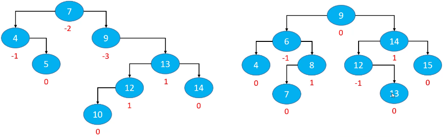

## 继承结构
创建 AVLTree 继承自 BST。红黑树同理，创建 RBTree 继承自 BST。
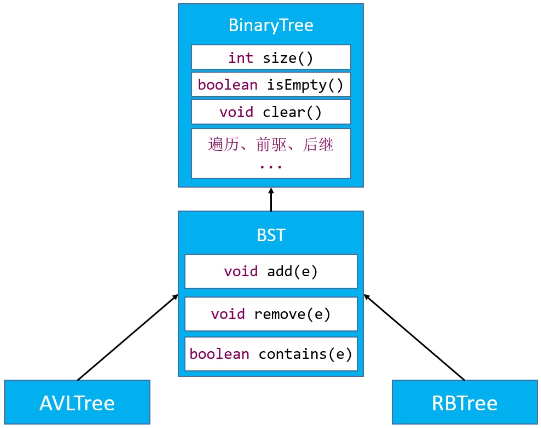

# 添加导致的失衡
下面这个子树原本是平衡的，添加节点`13`后出现失衡。最坏情况是导致节点`13`的所有祖先节点都失衡（`14`、`15`、`9`及其父节点）。节点`13`的父节点、非祖先节点都不可能失衡。
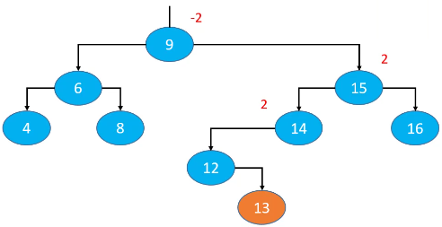

## LL-右旋转（单旋）
`n`（node）、`p`（paren）和`g`（grandparent），`T0`（n的左子树）、`T1`（n的右子树）、`T2`（p的右子树）、`T3`（g的右子树）。

1. `g.left = p.right`
2. `p.right = g`
3. 让`p`成为这棵子树的根节点
4. 更新 `T2`、`p`、`g` 的 parent 属性
5. 先后更新 `g`、`p` 的高度

旋转后的子树又恢复了平衡，仍然是一棵二叉搜索树：T0 < g < T1 < p < T2 < n < T3。

注意：一定要修改 `T2`、`p`、`g` 的 parent 属性；依次更新 `g`、`p` 的高度（因为旋转后，`g` 是 `p` 的右子树，所以先计算子树的高度，然后 +1 就是 `p` 的高度）。
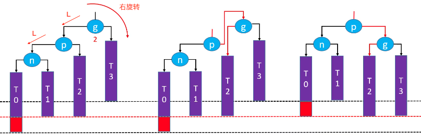

## RR-左旋转（单旋）
1. `g.right = p.left`
2. `p.left = g`
3. 让`p`成为这个子树的根节点
4. 更新 `T1`、`p`、`g` 的 parent 属性
5. 先后更新 `g`、`p` 的高度

旋转后的子树又恢复了平衡，仍然是一棵二叉搜索树：T0 < g < T1 < p < T2 < n < T3。
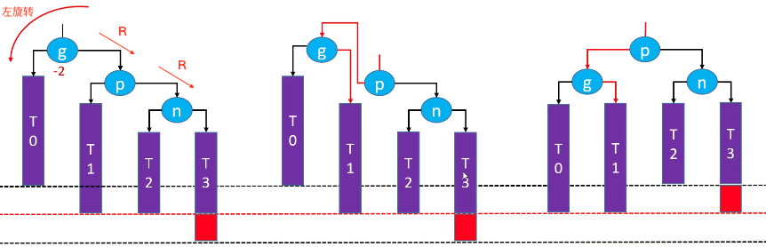

## LR-RR左旋转，LL右旋转（双旋）
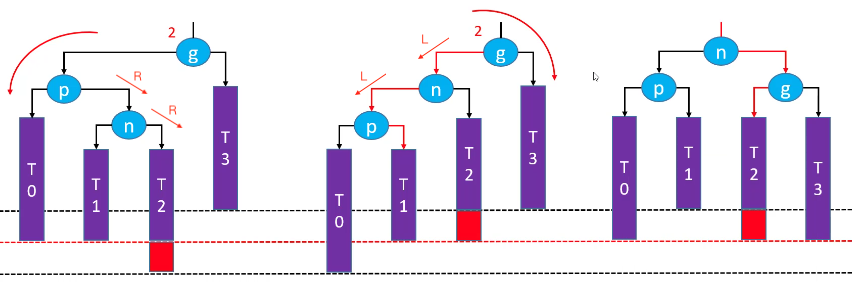

## RL-LL右旋转，RR左旋转（双旋）
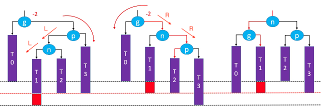

## CODE
```
public void add(E element) {
    elementNotNullCheck(element);
    //添加第一个节点
    if (root == null) {
        root = createNode(element, null);
        size++;
        // 新添加节点之后的处理
        afterAdd(root);
        return;
    }
    // 添加的不是第一个节点
    // 找到父节点
    Node<E> parent = root;
    Node<E> node = root;
    int cmp = 0;
    while (node != null) {
        cmp = compare(element, node.element);
        parent = node;
        if (cmp > 0) {
            node = node.right;
        } else if (cmp < 0) {
            node = node.left;
        } else {
            node.element = element;
            return;
        }
    }
    Node<E> newNode = createNode(element, parent);
    if (cmp > 0) {
        parent.right = newNode;
    } else {
        parent.left = newNode;
    }
    
    size++;
    // 新添加节点之后的处理
    afterAdd(newNode);
}
```

### 添加处理（affterAdd）
在节点的添加、删除操作之后，先办法让二叉搜索树恢复平衡（减小树的高度）。  
在 BST 定义：
```
protected void afterAdd(Node<E> node) { }
```

在 AVLTree 实现：
```
@Override
protected void afterAdd(Node<E> node) {
    while ((node = node.parent) != null) {
        if (isBalanced(node)) {
            // 更新高度
            updateHeight(node);
        } else {
            // 恢复平衡
            rebalance(node);
            // 整棵树恢复平衡
            break;
        }
    }
}

private boolean isBalanced(Node<E> node) {
    return Math.abs(((AVLNode<E>)node).balanceFactor()) <= 1;
}

private void updateHeight(Node<E> node) {
    ((AVLNode<E>)node).updateHeight();
}
```

### AVLNode
1. 因为 Node 里用不到 height 属性，所以定义 AVLNode 继承自 Node，添加 height 属性；
2. `isBalanced()` 是否平衡；
3. `updateHeight()` 更新高度；
4. `tallerChild()` 高度较高的子树，用于恢复平衡；
```
private static class AVLNode<E> extends Node<E> {
    //叶子节点高度默认1
    int height = 1;
    
    public AVLNode(E element, Node<E> parent) {
        super(element, parent);
    }
    
    public int balanceFactor() {
        int leftHeight = left == null ? 0 : ((AVLNode<E>)left).height;
        int rightHeight = right == null ? 0 : ((AVLNode<E>)right).height;
        return leftHeight - rightHeight;
    }
    
    public void updateHeight() {
        int leftHeight = left == null ? 0 : ((AVLNode<E>)left).height;
        int rightHeight = right == null ? 0 : ((AVLNode<E>)right).height;
        height= 1 + Math.max(leftHeight, rightHeight);
    }
    
    public Node<E> tallerChild() {
        int leftHeight = left == null ? 0 : ((AVLNode<E>)left).height;
        int rightHeight = right == null ? 0 : ((AVLNode<E>)right).height;
        if (leftHeight > rightHeight) return left;
        if (leftHeight < rightHeight) return right;
        return isLeftChild() ? left : right;
    }
}
```

### 恢复平衡
```
// 恢复平衡
private void rebalance(Node<E> grand) {
    Node<E> parent = ((AVLNode<E>)grand).tallerChild();
    Node<E> node = ((AVLNode<E>)parent).tallerChild();
    if (parent.isLeftChild()) { //L
        if (node.isLeftChild()) { //LL
            roteRight(grand);
        } else { //LR
            roteLeft(parent);
            roteRight(grand);
        }
    } else { //R
        if (node.isLeftChild()) { //RL
            roteRight(parent);
            roteLeft(grand);
        } else { //RR
            roteLeft(grand);
        }
    }
}

//左旋转（RR）
private void roteLeft(Node<E> grand) {
    Node<E> parent = grand.right;
    Node<E> child = parent.left;
    grand.right = child;
    parent.left = grand;
    
    //让parent成为子树的根节点
    parent.parent = grand.parent;
    if (grand.isLeftChild()) {
        grand.parent.left = parent;
    } else if (grand.isRightChild()) {
        grand.parent.right = parent;
    } else {
        root = parent;
    }
    
    //更新child的parent
    if (child != null) {
        child.parent = grand;
    }
    
    //更新grand的parent
    grand.parent = parent;
    
    //更新高度
    updateHeight(grand);
    updateHeight(parent);
}

//右旋转（LL）
private void roteRight(Node<E> grand) {
    Node<E> parent = grand.left;
    Node<E> child = parent.right;
    grand.left = child;
    parent.right = grand;
    
    //让parent成为子树的根节点
    parent.parent = grand.parent;
    if (grand.isLeftChild()) {
        grand.parent.left = parent;
    } else if (grand.isRightChild()) {
        grand.parent.right = parent;
    } else {
        root = parent;
    }
    
    //更新child的parent
    if (child != null) {
        child.parent = parent;
    }
    
    //更新grand的parent
    grand.parent = parent;
    
    //更新高度
    updateHeight(grand);
    updateHeight(parent);
}
```

### 统一所有旋转操作
综上所述，失去平衡的情况有四种：LL、RR、LR 和 RL。这四种情况再恢复平衡后是一样的结构：
1. `d` 是根节点；
2. `b` 和 `f` 分别是 `d` 的左子树和右子树；
3. `a` 和 `c` 分别是 `b` 的左子树和右子树，`e` 和 `g` 分别是 `f` 的左子树和右子树；

（`a` 和 `g` 在操作前后是没有变化的，所以这里的 `a` 和 `g` 可以不做处理）
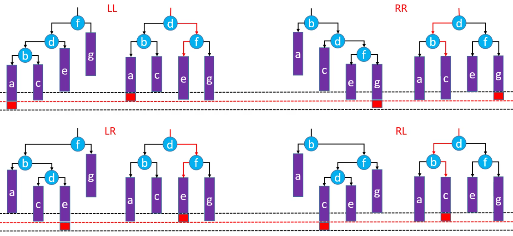
```
private void rebalance(Node<E> grand) {
    Node<E> parent = ((AVLNode<E>)grand).tallerChild();
    Node<E> node = ((AVLNode<E>)parent).tallerChild();
    if (parent.isLeftChild()) { //L
        if (node.isLeftChild()) { //LL
            rote(grand, node, node.right, parent, parent.right, grand);
        } else { //LR
            rote(grand, parent, node.left, node, node.right, grand);
        }
    } else { //R
        if (node.isLeftChild()) { //RL
            rote(grand, grand, node.left, node, node.right, parent);
        } else { //RR
            rote(grand, grand, parent.left, parent, node.left, node);
        }
    }
}

private void rote(
        Node<E> r, 
        Node<E> b, Node<E> c,
        Node<E> d,
        Node<E> e, Node<E> f) {
    // 让 d 成为子树的根节点
    d.parent = r.parent;
    if (r.isLeftChild()) {
        r.parent.left = d;
    } else if (r.isRightChild()) {
        r.parent.right = d;
    } else {
        root = d;
    }
    
    // b-c
    b.right = c;
    if (c != null) {
        c.parent = b;
    }
    updateHeight(b);
    
    // e-f
    f.left = e;
    if (e != null) {
        e.parent = f;
    }
    updateHeight(f);
    
    // b-d-f
    d.left = b;
    d.right = f;
    b.parent = d;
    f.parent = d;
    updateHeight(d);
}
```

# 删除导致的失衡
删除操作可能会导致父节点或祖先节点失衡（只有一个节点会失衡），其他节点都不可能失衡。
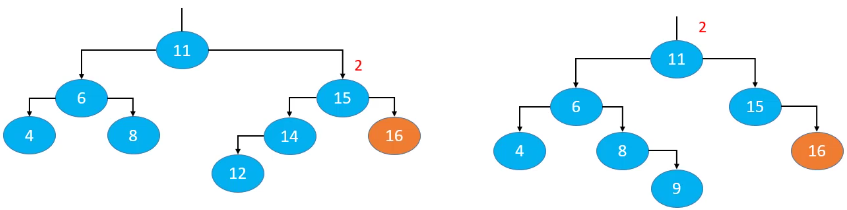

## LL-右旋转（单旋）
删除红色节点：  
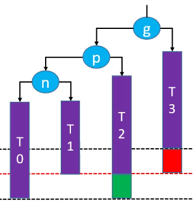  
右旋转后恢复平衡（绿色节点存在的情况下）：
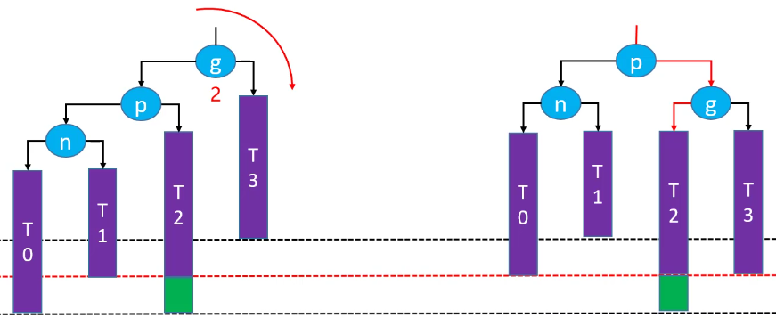  
右旋转后，祖先节点失去平衡（绿色节点不存在的情况下）：  
如果绿色节点不存在，更高层的祖先节点可能也会失衡，需要再次恢复平衡，然后又可能导致更高层次的祖先节点失衡。极端情况下，所有祖先节点都需要进行恢复平衡的操作，共 O(logn) 次调整。
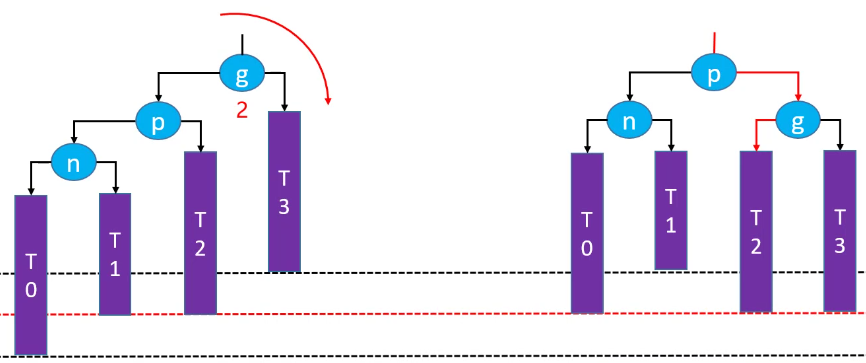

## RR-左旋转（单旋）
删除红色节点：  
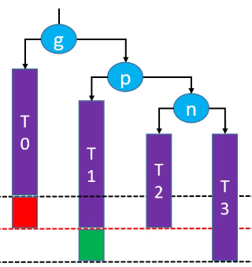  
左旋转后恢复平衡（绿色节点存在的情况下）：  
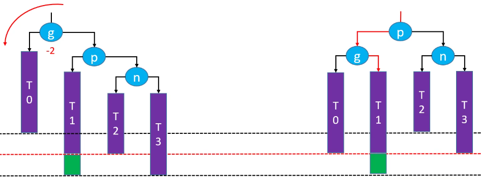  
左旋转后，祖先节点失去平衡（绿色节点不存在的情况下）：  
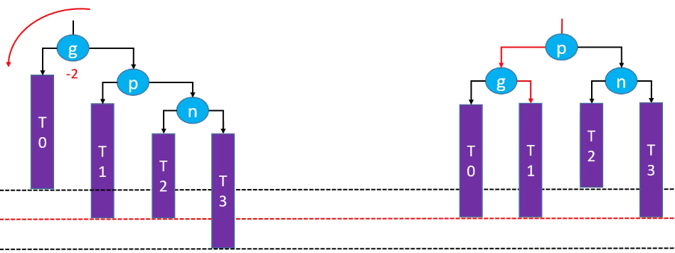  

## LR-RR左旋转，LL右旋转（双旋）
删除红色节点：  
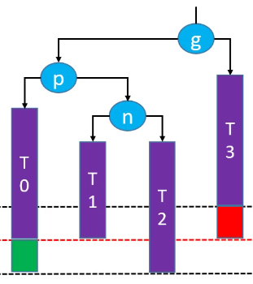  
先左旋再右旋恢复平衡（绿色节点存在的情况下）：  
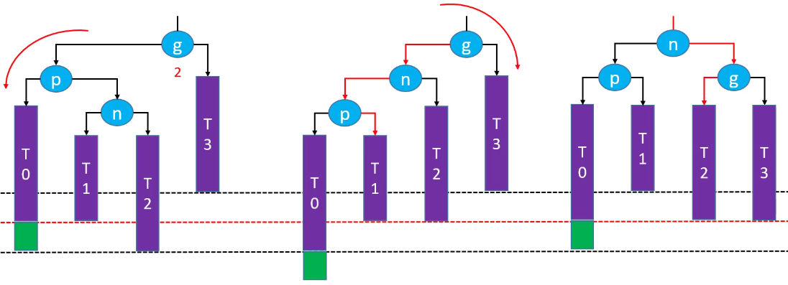  
先左旋再右旋后，祖先节点失去平衡（绿色节点不存在的情况下）：
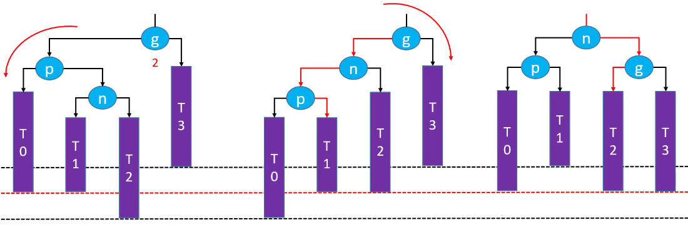  

## RL-LL右旋转，RR左旋转（双旋）
删除红色节点：  
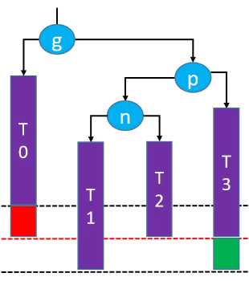  
先右旋在左旋恢复平衡（绿色节点存在的情况下）：  
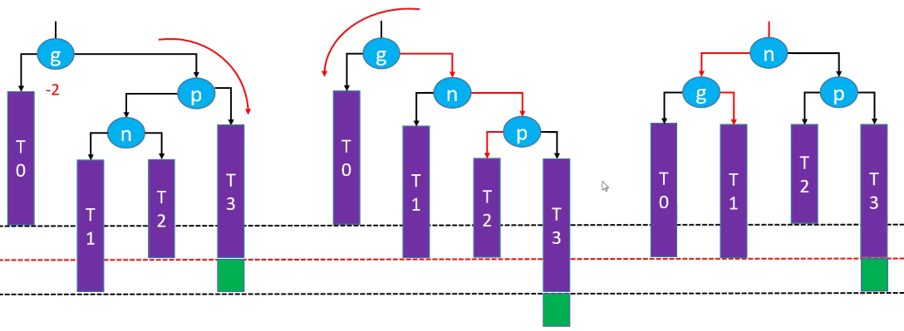  
先右旋再左旋，祖先节点失去平衡（绿色节点不存在的情况下）：
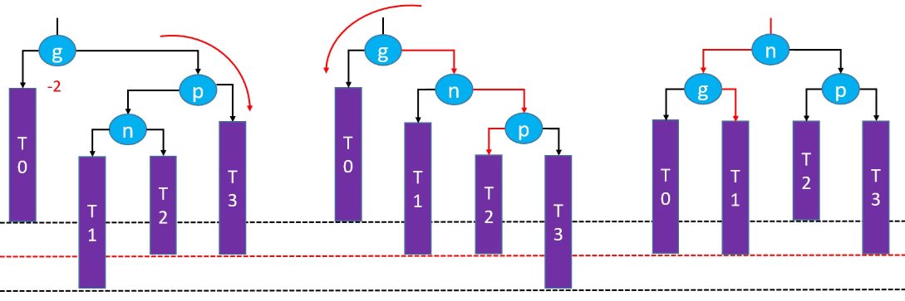  

## CODE
```
private void remove(Node<E> node) {
		
    //删除度为2的节点
    if (node.isHasTwoChildren()) {
        //找到后继节点
        Node<E> s = successor(node);
        //用后继节点的值覆盖度为2的节点的值
        node.element = s.element;
        //删除后继节点
        node = s;
    }
    
    //删除度为1或0的节点
    Node<E> replacement = node.left != null ? node.left : node.right;
    
    if (replacement != null) { // node是度为1的节点
        // 更改parent
        replacement.parent = node.parent;
        // 更改parent的left、right的指向
        if (node.parent == null) { //node是度为1的节点并且是根节点
            root = replacement;
        } else if (node.parent.left == node) {
            node.parent.left = replacement;
        } else {
            node.parent.right = replacement;
        }
        
        // 删除之后的处理
        afterRemove(node);
    } else if (node.parent == null) { // node是叶子节点并且是根节点
        root = null;
        
        // 删除之后的处理
        afterRemove(node);
    } else { // node是叶子节点，但不是根节点
        if (node.parent.left == node) {
            node.parent.left = null;
        } else {
            node.parent.right = null;
        }
        
        // 删除之后的处理
        afterRemove(node);
    }
}
```

### 删除后处理（afterRemove）
在 BST 定义：
```
protected void afterAdd(Node<E> node) { }
```

在 AVLTree 实现：
```
protected void afterRemove(Node<E> node) {
    while ((node = node.parent) != null) {
        if (isBalanced(node)) {
            // 更新高度
            updateHeight(node);	
        } else {
            // 恢复平衡
            rebalance(node);
        }
    }
}
```

# 总结
* 添加  
可能会导致所有祖先节点都失衡；  
只要让高度最低的失衡节点恢复平衡，整棵树就恢复平衡【仅需O(1)次调整】。

* 删除  
可能会导致父节点或祖先节点失衡（只有1个节点会失衡）；  
恢复平衡后，可能会导致更高层的祖先节点失衡【最多需要O(logn)次调整】。

* 平均时间复杂度
搜索：O(logn)；  
添加：O(logn)，仅需O(1)次的旋转操作；  
删除：O(logn)，最多需要O(logn)次的旋转操作。

# 练习
[110. 平衡二叉树](https://leetcode-cn.com/problems/balanced-binary-tree/)
```
public boolean isBalanced(TreeNode root) {
    return height(root) >= 0;
}

public int height(TreeNode root) {
    if (root == null) return 0;
    
    int leftHeight = height(root.left);
    int rightHeight = height(root.right);		
    /**
     * 1. Math.abs(leftHeight - rightHeight) > 1  => -1
     * 2. leftHeight == -1 || rightHeight == -1   => -1
     */
    if (leftHeight == -1 || rightHeight == -1 || Math.abs(leftHeight - rightHeight) > 1) {
        return -1;
    } else {
        return Math.max(leftHeight, rightHeight) + 1;
    }
}
```

ps:  
[Data Structure Visualizations](https://www.cs.usfca.edu/~galles/visualization/Algorithms.html)  
