[B树](https://baike.baidu.com/item/B%E6%A0%91/5411672?fr=aladdin#1)是一种平衡的多路搜索树，多用于文件系统，数据库的实现。

<!-- more -->
# B树
一棵 m 阶B树是一棵平衡的 m 路搜索树。它或者是空树，或者是满足下列性质的树：
1. 根节点至少有两个子树；
2. 每个非根节点所包含的元素个数 `j` 满足：`┌m/2┐ - 1 <= j <= m - 1`；
3. 除根节点以外的所有节点（不包含叶子节点）的度数正好是元素总数加1，故“内部子树”个数 `k`（度）满足：`┌m/2┐ <= k <= m`；
4. 所有的叶子节点都位于同一层。
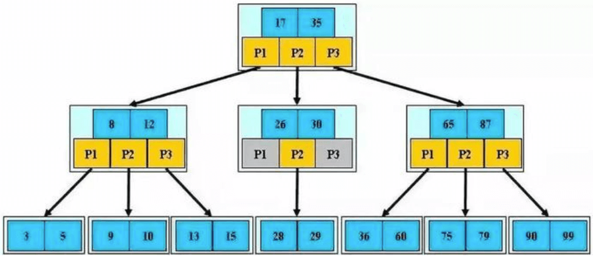

## 特点
* 一个节点可以存储超过两个元素，可以拥有超过两个节点。
* 拥有二叉搜索树的一些性质，如：平衡，每个节点的所有子树高度一致。
* 比较矮。
* 每个节点中元素从小到大排列。

## m 阶 B 树的性质（m >= 2）
假设一个节点存储的元素个数为 `j`，则根节点：`1 <= j <= m-1`，非根节点：`┌m/2┐ - 1 <= j <= m - 1`。  

如果有子节点，子节点个数 `y = j + 1`，则根节点的子节点个数：`2 <= y <= m`。非根节点的子节点个数：`┌m/2┐ <= y <= m`。  
比如 m = 3，2 <= y <= 3，因此可以成为（2，3）树或 2-3 树；  
比如 m = 4，2 <= y <= 4，因此可以成为（2，4）树或 2-3-4 树；  
比如 m = 5，3 <= y <= 5，因此可以成为（3，5）树；  
比如 m = 6，3 <= y <= 6，因此可以成为（3，6）树；  
比如 m = 7，4 <= y <= 7，因此可以成为（4，7）树；  

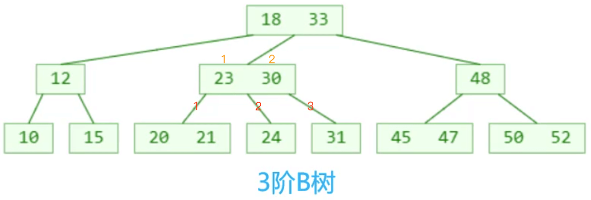
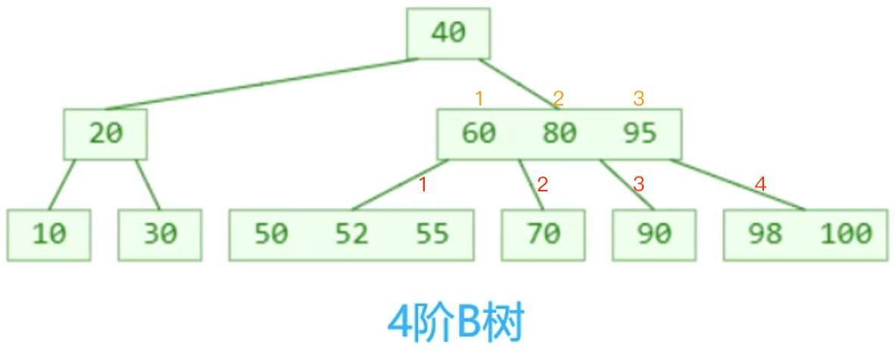
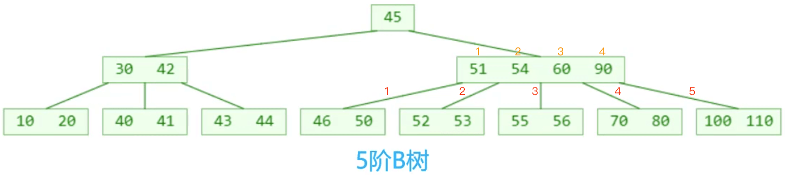

在数据库的实现中一般用 200~300 阶B树。

# B树 VS 二叉搜索树
二叉搜索树 -> 3阶B树
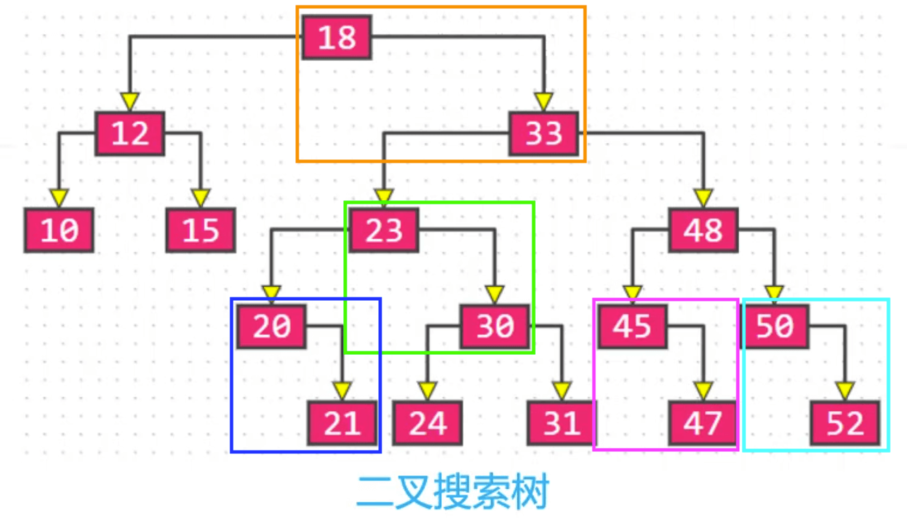

B树和二叉搜索树，在逻辑上是等价的。拿一个二叉搜索树为例，通过多代节点合并，可以获得一个超级节点，如：  
2 代合并的超级节点，最多拥有 4 个子节点（至少是 4 阶B树）；  
3 代合并的超级节点，最多拥有 8 个子节点（至少是 8 阶B树）；  
n 代合并的超级节点，最多拥有 2^n 个子节点（至少是 2^n 阶B树）；  

m 阶B树，最多需要 log2(m) 带合并。

2 代合并：
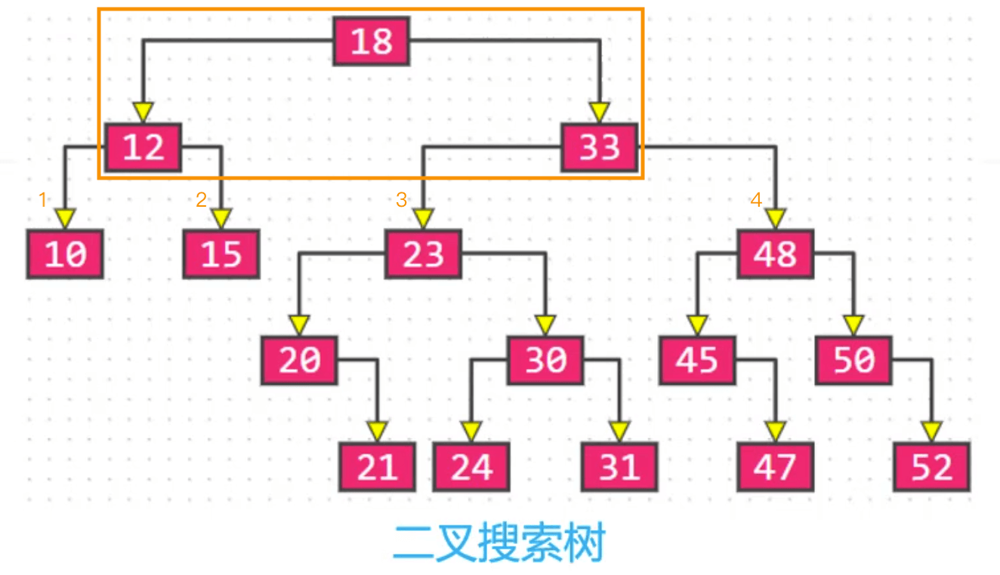

# 搜索
步骤：
1. 先在节点内部从小到大开始搜索元素；
2. 如果命中，搜索结束；
3. 如果为命中，再去对应的子节点中搜索元素，重复步骤1；

如：搜索 `52`
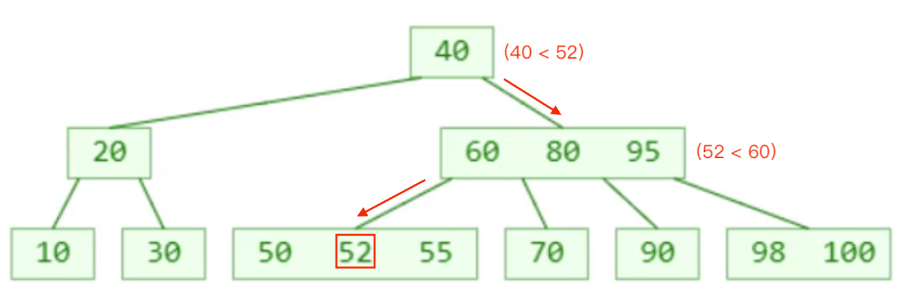
搜索 `72`：

# 添加
新添加的元素必定是添加到叶子节点。  
假设这是一棵4阶B树：
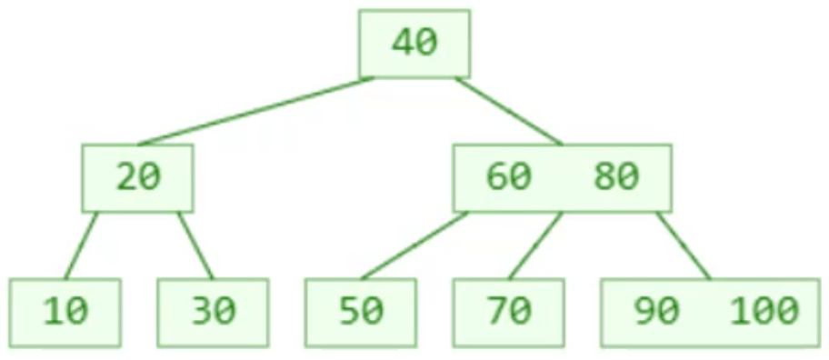
添加 `55`：
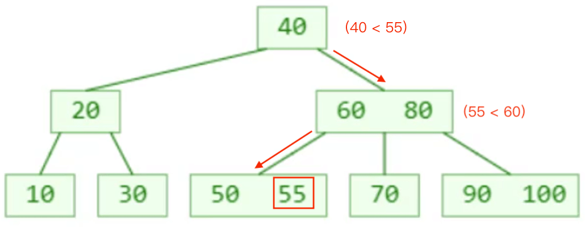
添加 `95`：
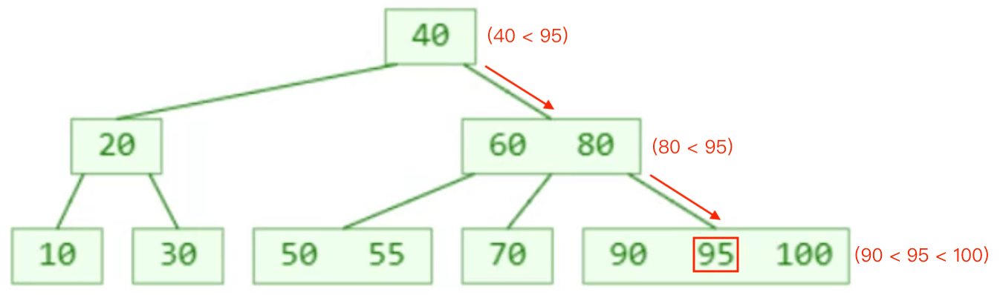

# 上溢（overflow）
插入 `98` 时，最右下角的叶子节点（`90、95、98、100`）的元素个数超过限制，这种现象可以称之为：上溢（overflow）。
插入 `98`，产生上溢：
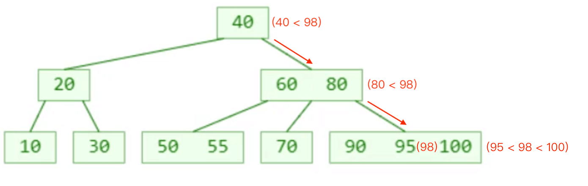

## 上溢的解决
1. `m` 阶B树上溢节点的元素个数必然等于 `m`。
2. 假设上溢节点最中间元素的位置为 `k`，将 `k` 位置的元素向上与父节点合并。
3. 将 [0, k-1] 和 [k+1, m-1] 位置的元素分裂成 2 个子节点，这 2 个子节点的元素个数必然都不会低于最低限制 `┌m/2┐ - 1`。
4. 一次分裂完毕后，有可能导致父节点上溢，依然按照上述方法解决。最极端的情况，有可能一直分裂到根节点。

假设有一个5阶B树，插入了 `34` 产生上溢：  
从图中可以看到，上溢节点的元素个数等于5，即B树的阶数。
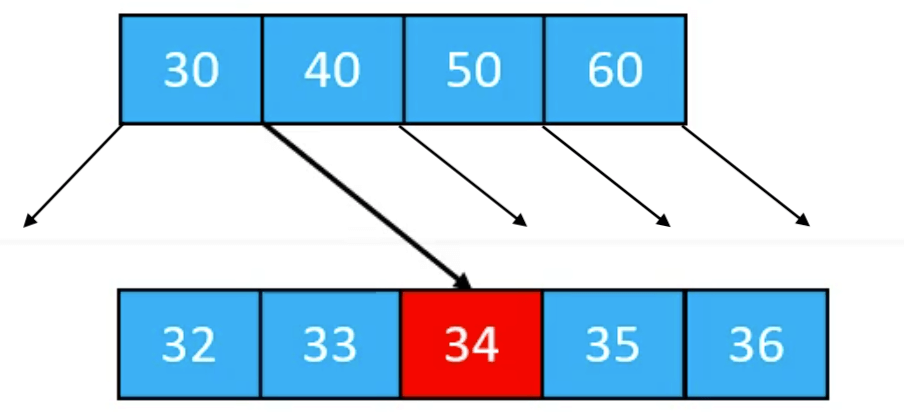  
上溢节点最中间元素的位置为 `2`，将 `2` 位置的元素向上与父节点合并。  
将 [0, 1] 和 [3, 4] 位置的元素分裂成2个子节点。这2个子节点的元素个数都等于2（必然都不低于最低限制`┌m/2┐ - 1`）。
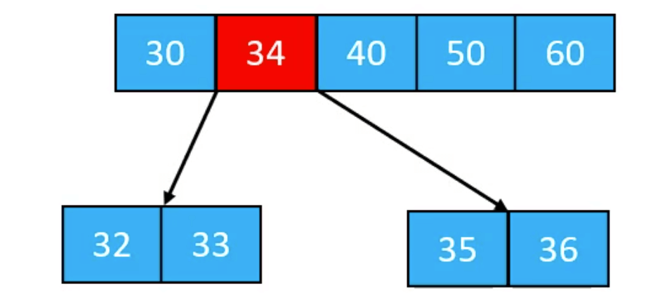
分裂完毕后，导致父节点上溢。按照上述方法，将最中间位置的元素向上与父节点合并。最极端的情况是，一直分裂到根节点。
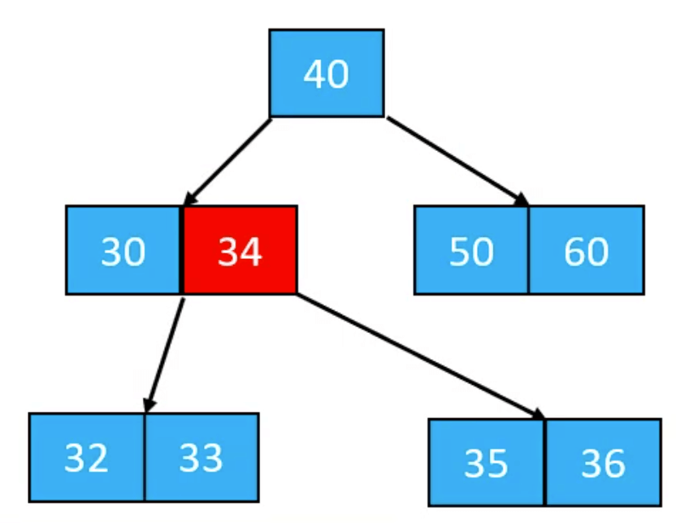

解决在插入 `98` 时产生的上溢：
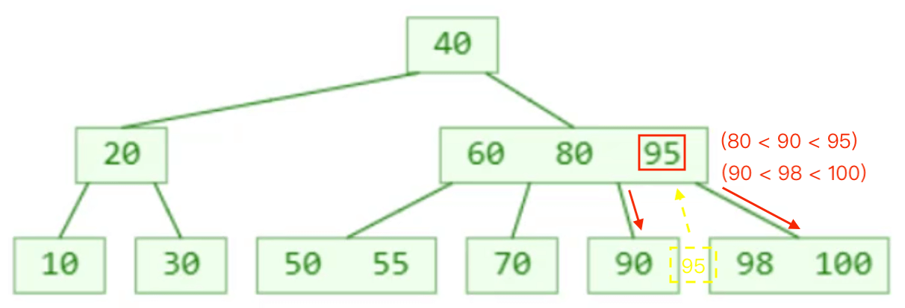

插入`52`：
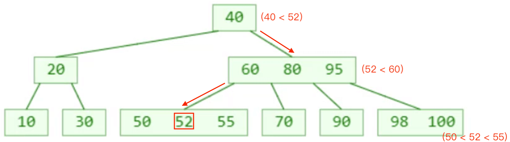

插入`54`，产生上溢:
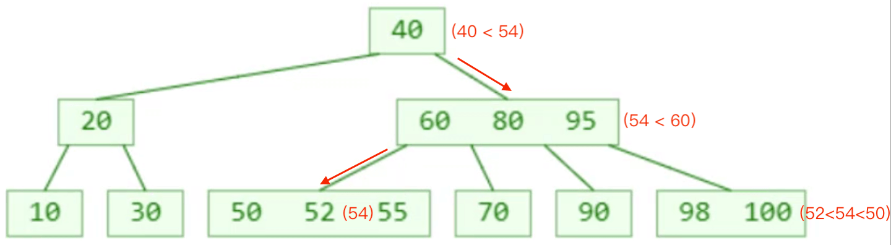

解决上溢：
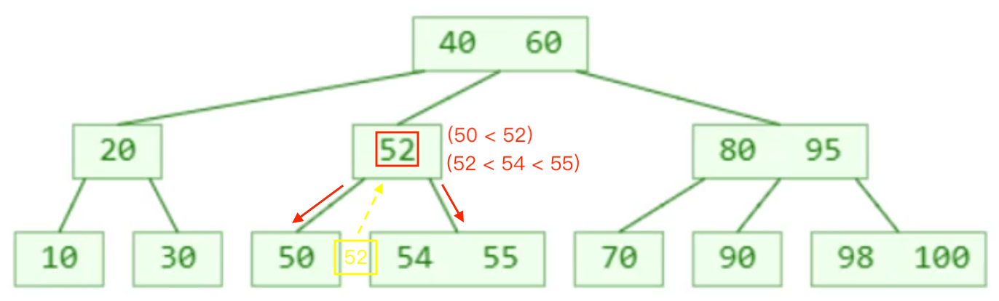

## 小结
* 最极端的情况是，一直分裂到根节点，是唯一一种可以让 B 树长高的情况。

# 删除

## 叶子节点
假设需要删除的元素在叶子节点中，那么直接删除即可：
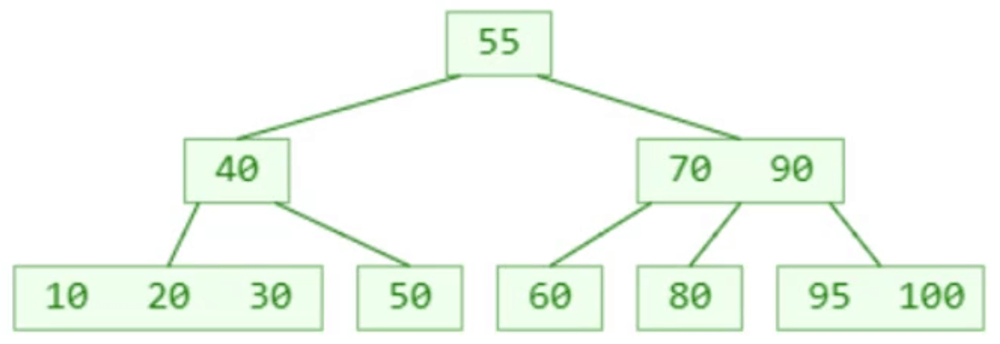
删除 `30`：
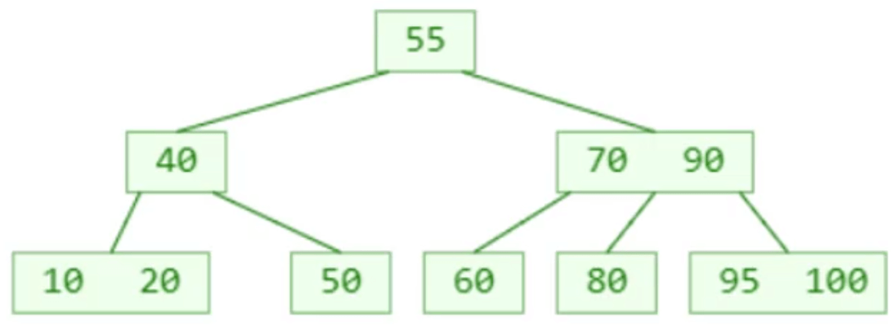

## 非叶子节点
假设需要删除的元素在非叶子节点中，则：
1. 先找到前驱或后继元素；
2. 覆盖所需删除的元素的值，再把前驱或后继元素删除。

删除 `60`：  
找到前驱元素（前驱节点里最靠右的元素）：
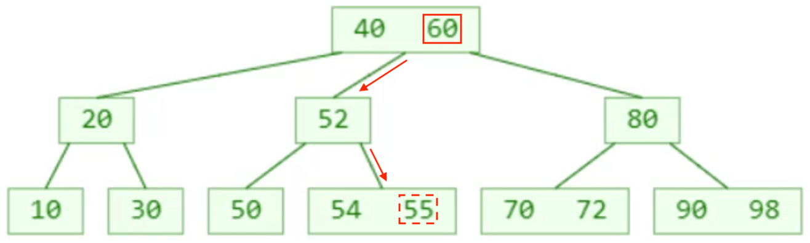
覆盖所需删除的元素的值，再把前驱或后继元素删除：
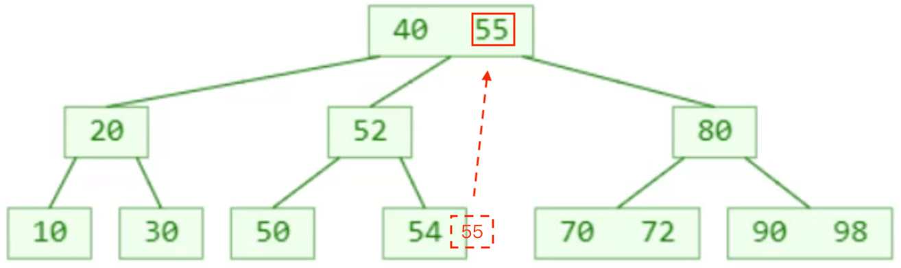

## 小结
* 非叶子节点的前驱或后继元素，必定在叶子节点中
* 删除前驱或后继元素，等同于删除叶子节点中的元素
* 真正的删除元素都是繁盛在叶子节点中

# 下溢
设有一棵5阶B树：
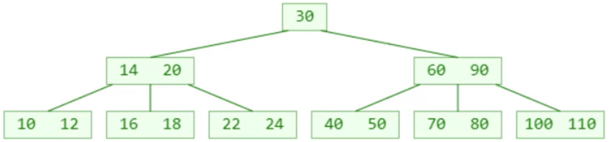
删除 `22`：叶子节点被删除一个元素，导致元素个数可能会低于最低限制（`┌m/2┐ - 1`），这种现象称为：下溢（underflow）。

## 下溢的解决
* 下溢节点的元素数量必然等于 `┌m/2┐ - 2`。

### 元素个数 >= ┌m/2┐
如果下溢节点临近的兄弟节点，有至少 `┌m/2┐` 个元素，可以向其借一个元素：  
1. 将父节点的元素 `b` 插入到下溢节点的0位置（最小位置）；  
2. 用兄弟节点的元素 `a`（最大的元素）替代父节点的元素 `b`。  

这种操作就是“旋转”。
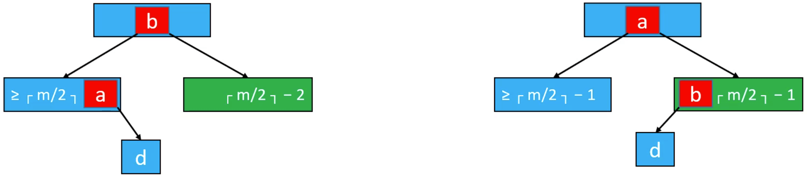

### 元素个数 == ┌m/2┐-1
如果下溢节点临近的兄弟节点只有 `┌m/2┐ - 1` 个元素：
1. 将父节点的元素 `b` 挪下来跟左右子节点进行合并；
2. 合并后的节点元素个数等于 `┌m/2┐ + ┌m/2┐ - 2`，不超过 `m-1`；

这个操作可能会导致父节点下溢，依然按照上述方法解决，下溢现象可能会一直向上传播。
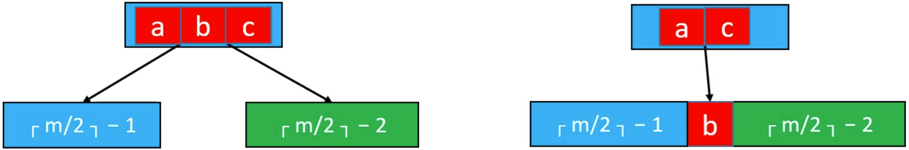

## 小结
* 最极端的情况是，一直下溢到根节点。根节点下溢导致根节点消失，与子节点合并成一个新的节点。这种情况是唯一一种可以让 B 树变矮的情况。

# 练习
设有一个4阶B树，则根节点的元素个数：`1 <= j <= 3`，非根节点的元素个数：`1 <= j <= 3`。

依次添加`1`、`2`、`3`、`4`、`5`、`6`、`7`：  

依次添加`8`、`9`、`10`、`11`：  
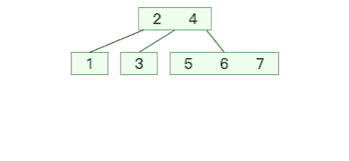

依次添加`12`、`13`、`14`、`15`、`16`、`17`： 
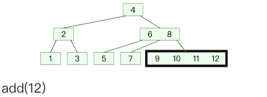

依次添加`18`、`19`、`20`、`21`、`22`： 
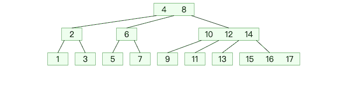

ps：[Data Structure Visualizations](https://www.cs.usfca.edu/~galles/visualization/BPlusTree.html)

