[二叉搜索树（Binary Search Tree）](https://baike.baidu.com/item/%E4%BA%8C%E5%8F%89%E6%90%9C%E7%B4%A2%E6%A0%91/7077855?fr=aladdin)作为一种经典的数据结构，它既有链表的快速插入与删除操作的特点，又有数组快速查找的优势；所以应用十分广泛，例如在文件系统和数据库系统一般会采用这种数据结构进行高效率的排序与检索操作。

<!-- more -->

# 二叉搜索树

## 思考：在 n 个动态的整数中搜索某个整数（查看其是否存在）？

1. 使用动态数组，从第 0 个位置开始遍历搜索，平均时间复杂度：O(n)；  
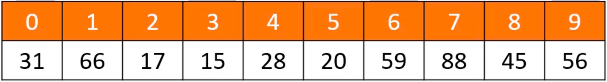
2. 使用有序的动态数组，使用二分搜索，最坏时间负载度：O(log(n))，但是添加和删除的平均时间复杂度是：O(n)；  
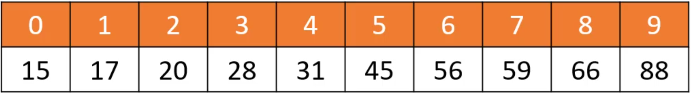
3. 使用二叉搜索树，添加、删除和搜索的最坏时间复杂度都是：O(log(n));

## 二叉搜索树特性
二叉搜索树是二叉树的一种，是应用非常广泛的一种二叉树，英文简称为 BST。又被称为：二叉查找树、二叉排序树。二叉搜索树可以大大提高搜索数据的效率。  
1. 若它的左子树不空，则左子树上所有结点的值均<u>小于</u>它的根结点的值；  
2. 若它的右子树不空，则右子树上所有结点的值均<u>大于</u>它的根结点的值；  
3. 它的左、右子树也分别为<u>二叉搜索树</u>。

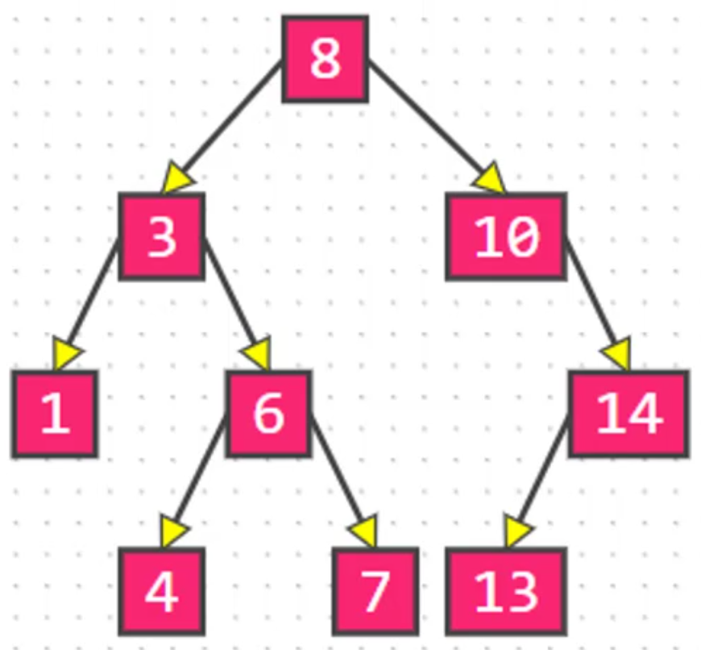
使用二叉搜索树需要注意：  
1. 存储的元素必须具备比较性，比如 `int`、`double` 等。
2. 如果是自定义类型，需要指定比较方式。
3. 存储的元素不可以是 `null`。

# 接口设计
```
/*
 * 元素的数量
 */
public int size() {}
/*
 * 是否为空
 */
public boolean isEmpty() {}
/*
 * 清空所有元素
 */
public void clear() {}
/*
 * 添加元素
 */
public void add(E element) {}
/*
 * 删除元素
 */
public void remove(E element) {}
/*
 * 是否包含某元素
 */
public void contains(E element) {}
```

## 添加节点
1. 找到要添加到的位置，即找到该位置的父节点 `parent`；  
2. 创建新节点 `node`；  
3. 加入到树中：`parent.left = node` 或者 `parent.right = node`。

注意：遇到值相等的元素可以覆盖旧值。

如添加 `12`、`1`，先找到父节点 `11`、`2`：
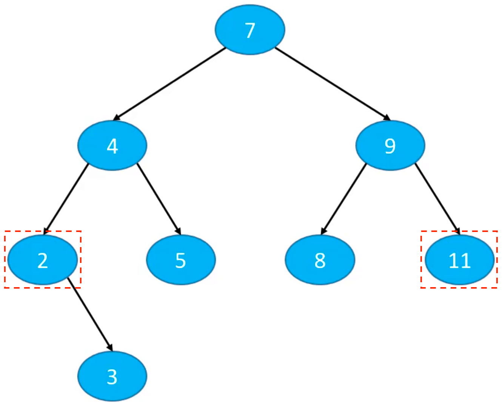
创建新节点 `node`，加入到树中：
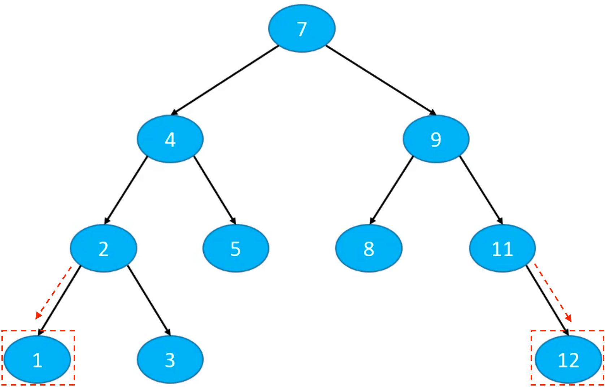

代码实现：
```
public void add(E element) {
	if (root == null) {
		root = new Node<>(element, null);
		return;
	}
	
	Node<E> node = root;
	Node<E> parent = root;
	int cmp = 0;
	while (node != null) {
		parent = node;
		cmp = compare(element, node.element); // 返回值等于0：e1 == e2，大于0：e1 > e2，小于0：e1 < e2

		if (cmp > 0) {
			node = node.right;
		} else if (cmp < 0) {
			node = node.left;
		} else {
			node.element = element; // 考虑到不同名字的 person，相等就覆盖
			return;
		}
	}
	
	Node<E> newNode = new Node<>(element, parent);
	if (cmp > 0) {
		parent.right = newNode;
	} else {
		parent.left = newNode;
	}
	
	size++;
}
```

## 元素的比较方案设计
### 方案一
强制元素实现 `Comparable` 接口：
```
public class BinarySearchTree<E extends Comparable> {
    ...
}
```

添加 `extends Comparable` 后，要加入到二叉搜索树的元素都必须实现 `Comparable` 接口。

定义 Person 实现 `Comparable` 接口：
```
public class Person implements Comparable<Person> {
	private int age;
	
	// 生成 age 的 get、set 方法
	public int getAge() {
		return age;
	}
	
	public void setAge(int age) {
		this.age = age;
	}
	
	@Override
	public int compareTo(Person e) {
		return age - e.age;
	}
	
	@Override
	public String toString() {
		return age + "";
	}
}
```

### 方案二
1. 允许外界传入一个 `Comparator` 自定义比较方案；
2. 如果没有传入 `Comparator`，强制认定元素实现了 `Comparable` 接口。
```
public class BinarySearchTree<E> {

	private Comparator<E> comparator;

	public BinarySearchTree() {
		this(null);
	}
	
	public BinarySearchTree(Comparator<E> comparator) {
		this.comparator = comparator;
	}
    
	private int compare(E e1, E e2) {
		if (comparator != null) {
			return comparator.compare(e1, e2);
		}
		return ((Comparable<E>)e1).compareTo(e2);
	}
}
```

## 打印器
使用 [BinaryTrees](https://github.com/CoderMJLee/BinaryTrees) 打印二叉搜索树。

1、实现 `BinaryTreeInfo` 接口
```
public class BinarySearchTree<E> implements BinaryTreeInfo {
	...

	@Override
	public Object root() {
		return root;
	}

	@Override
	public Object left(Object node) {
		return ((Node<E>)node).left;
	}

	@Override
	public Object right(Object node) {
		return ((Node<E>)node).right;
	}

	@Override
	public Object string(Object node) {
		return ((Node<E>)node).element;
	}
}
```

2、调用打印API `BinaryTrees.println(bst)`：
```
static void test() {
	Integer data[] = new Integer[] {
			7, 4, 9, 2, 5, 8, 11, 3, 12, 1
	};
	
	BinarySearchTree<Integer> bst = new BinarySearchTree<>();
	for (int i = 0; i < data.length; i++) {
		bst.add(data[i]);
	}
	
	BinaryTrees.println(bst);;
}
```

### Comparable
```
static void test() {
	Integer data[] = new Integer[] {
			7, 4, 9, 2, 5, 8, 11, 3, 12, 1
	};
	
	BinarySearchTree<Integer> bst = new BinarySearchTree<>();
	for (int i = 0; i < data.length; i++) {
		bst.add(data[i]);
	}
	
	BinaryTrees.println(bst);
}
```

打印结果：
```
    ┌──7──┐
    │     │
  ┌─4─┐ ┌─9─┐
  │   │ │   │
┌─2─┐ 5 8   11─┐
│   │          │
1   3          12
```

### Comparator
```
public class Main {
	public static void main(String[] args) {
		Integer data[] = new Integer[] {
				7, 4, 9, 2, 5, 8, 11, 3, 12, 1
		};
		
		BinarySearchTree<Person> bst = new BinarySearchTree<>(new Comparator<Person>() {
			public int compare(Person o1, Person o2) {
				return o1.getAge() - o2.getAge();
			}
		});

		for (int i = 0; i < data.length; i++) {
			bst.add(new Person(data[i]));
		}
		
		BinaryTrees.println(bst);;
	}
}
```

修改 `BinarySearchTree` 的 `string` 方法，查看更详细的打印信息：
```
public Object string(Object node) {
	Node<E> myNode = (Node<E>)node;
	String parentString = "null";
	if (myNode.parent != null) {
		parentString = myNode.parent.element.toString();
	}
	return myNode.element + "_p(" + parentString + ")";
}
```

打印结果：
```
             ┌───7_p(null)───┐
             │               │
        ┌─4_p(7)─┐       ┌─9_p(7)─┐
        │        │       │        │
   ┌─2_p(4)─┐  5_p(4) 8_p(9)   11_p(9)─┐
   │        │                          │
1_p(2)    3_p(2)                    12_p(11)
```

国外教材的说法  
Full Binary Tree：完满二叉树（真二叉树）；  
Perfect Binary Tree：完美二叉树（满二叉树）；  
Complete Binary Tree：完全二叉树；

# 遍历
遍历是数据结构中的常见操作，线性数据结构（如：数组）的遍历比较简单，有两种：正序遍历和逆序遍历。二叉树的遍历方式有四种：  
1. 前序遍历（Preorder Traversal）
2. 中序遍历（Inorder Traversal）
3. 后序遍历（Postorder Traversal）
4. 层序遍历（Level Order Traversal）

## 前序遍历
访问顺序：
1. 根节点；
2. 前序遍历左子树；
3. 前序遍历右子树。
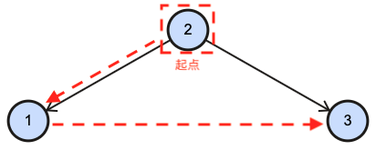

### 递归
<font color=#FF0000>7、</font><font color=#00BFF>4、2、1、3、5、</font><font color=#F0E68C>9、8、11、10、12</font>
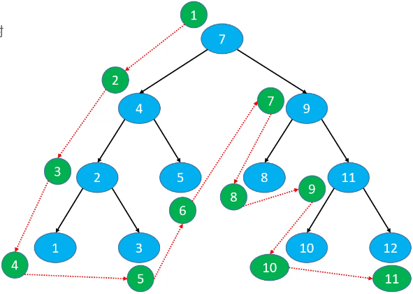

代码实现：
```
public void preorderTraversal() {
	preorderTraversal(root);
}

private void preorderTraversal(Node<E> node) {
	if (node == null) return;
	
	System.out.println(node.element);
	preorderTraversal(node.left);
	preorderTraversal(node.right);
}
```

### 非递归

## 中序遍历
访问顺序（升序）：
1. 中序遍历左子树；
2. 根节点；
3. 中序遍历右子树。  
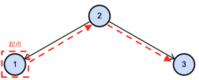 

访问顺序（降序）：
1. 中序遍历右子树；
2. 根节点；
3. 中序遍历左子树。
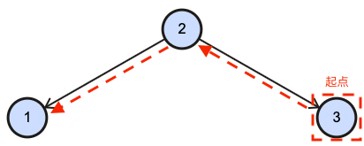

### 递归
<font color=#00BFF>1、2、3、4、5、</font><font color=#FF0000>7、</font><font color=#F0E68C>8、9、10、11、12</font>（升序）
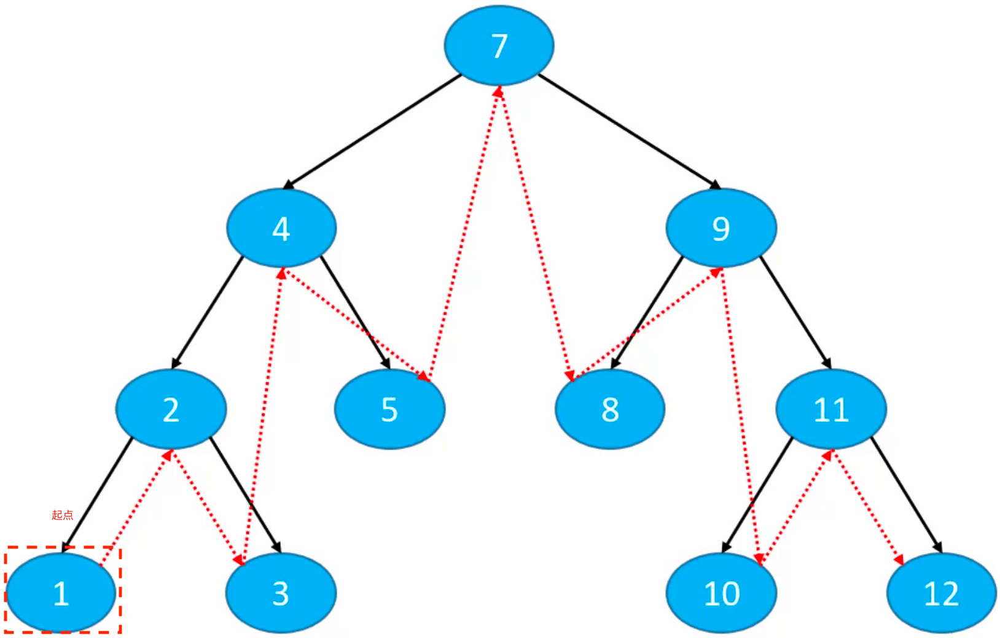

代码实现：
```
public void inorderTraversal() {
	inorderTraversal(root);
}

private void inorderTraversal(Node<E> node) {
	if (node == null) return;
	
	inorderTraversal(node.left);
	System.out.println(node.element);
	inorderTraversal(node.right);
}
```

### 非递归

## 后序遍历
访问顺序：
1. 后序遍历左子树；
2. 后序遍历右子树；
3. 根节点。  
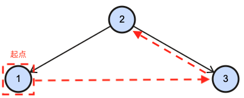

### 递归
<font color=#00BFF>1、3、2、5、4、</font><font color=#F0E68C>8、10、12、11、9、</font><font color=#FF0000>7</font>
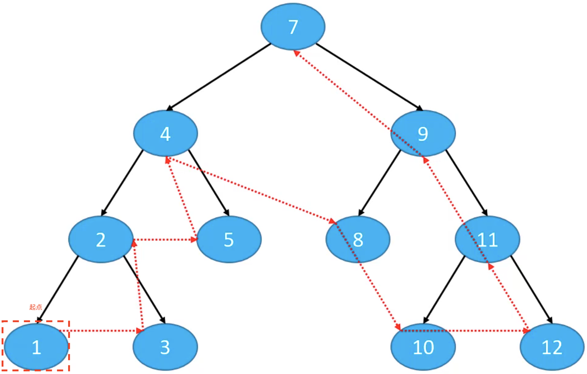

代码实现：
```
public void postorderTraversal() {
	postorderTraversal(root);
}

private void postorderTraversal(Node<E> node) {
	if (node == null) return;
	
	postorderTraversal(node.left);
	postorderTraversal(node.right);
	System.out.println(node.element);
}
```

### 非递归

## 层序遍历
访问顺序：  
1. 从上到下、从左到右依次访问每一个几点。

<font color=#FF0000>7、</font><font color=#00BFF>4、9、</font><font color=#F0E68C>2、5、8、11、</font><font color=#32CD32>1、3、10、12</font>
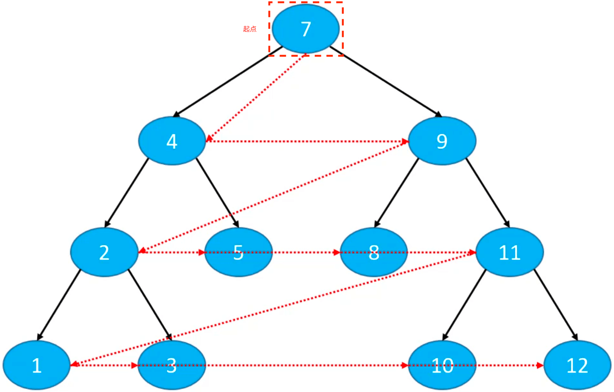

代码实现：
```
public void levelOrderTraversal() {
	Queue<Node<E>> queue = new LinkedList<>();
	queue.offer(root);
	
	while (!queue.isEmpty()) {
		Node<E> node = queue.poll();
		System.out.println(node.element);
		
		if (node.left != null) {
			queue.add(node.left);
		}
		if (node.right != null) {
			queue.add(node.right);
		}
	}
}
```

# 遍历接口
## 前、中、后、层
遍历接口提供一个回调方法，将遍历到的元素传到方法调用处处理：
```
/*
 * 回调方法（相当于 OC 的 block）
 */
public static interface Visitor<E> {
	void visit(E element);
}
```

前序遍历、中序遍历、后序遍历和中序遍历：
```
/*
 * 前序遍历
 */
public void preorderTraversal(Visitor<E> visitor) {
	if (visitor == null) return;
	preorderTraversal(root, visitor);
}

private void preorderTraversal(Node<E> node, Visitor<E> visitor) {
	if (node == null) return;
	
	visitor.visit(node.element);
	preorderTraversal(node.left, visitor);
	preorderTraversal(node.right, visitor);
}

/*
 * 中序遍历
 */
public void inorderTraversal(Visitor<E> visitor) {
	if (visitor == null) return;
	inorderTraversal(root, visitor);
}

private void inorderTraversal(Node<E> node, Visitor<E> visitor) {
	if (node == null) return;
	
	inorderTraversal(node.left, visitor);
	visitor.visit(node.element);
	inorderTraversal(node.right, visitor);
}

/*
 * 后序遍历
 */
public void postorderTraversal(Visitor<E> visitor) {
	if (visitor == null) return;
	postorderTraversal(root, visitor);
}

private void postorderTraversal(Node<E> node, Visitor<E> visitor) {
	if (node == null) return;
	
	postorderTraversal(node.left, visitor);
	postorderTraversal(node.right, visitor);
	visitor.visit(node.element);
}

/*
 * 层序遍历（有回调）
 */
public void levelOrder(Visitor<E> visitor) {
	Queue<Node<E>> queue = new LinkedList<>();
	queue.offer(root);
	
	while (!queue.isEmpty()) {
		Node<E> node = queue.poll();
		visitor.visit(node.element);
		
		if (node.left != null) {
			queue.add(node.left);
		}
		if (node.right != null) {
			queue.add(node.right);
		}
	}
}
```

测试
```
static void test3() {
	Integer data[] = new Integer[] {
			7, 4, 2, 1, 3, 5, 9, 8, 11, 10, 12
	};
	BinarySearchTree<Integer> bst = new BinarySearchTree<>();
	for (int i = 0; i < data.length; i++) {
		bst.add(data[i]);
	}
	BinaryTrees.println(bst);
	System.out.println();
	
	System.out.print("前序遍历：");
	bst.preorderTraversal(new Visitor<Integer>() {
		@Override
		public void visit(Integer element) {
			System.out.print(element + " ");
		}
	});
	System.out.println();
	
	System.out.print("中序遍历：");
	bst.inorderTraversal(new Visitor<Integer>() {
		@Override
		public void visit(Integer element) {
			System.out.print(element + " ");
		}
	});
	System.out.println();
	
	System.out.print("后序遍历：");
	bst.postorderTraversal(new Visitor<Integer>() {
		@Override
		public void visit(Integer element) {
			System.out.print(element + " ");
		}
	});
	System.out.println();
	
	System.out.print("层序遍历：");
	bst.levelOrder(new Visitor<Integer>() {			
		@Override
		public void visit(Integer element) {
			System.out.print(element + " ");
		}
	});
}
```

打印结果：
```
             ┌───7_p(null)───┐
             │               │
        ┌─4_p(7)─┐       ┌─9_p(7)─┐
        │        │       │        │
   ┌─2_p(4)─┐  5_p(4) 8_p(9) ┌─11_p(9)─┐
   │        │                │         │
1_p(2)    3_p(2)         10_p(11)   12_p(11)

前序遍历：7 4 2 1 3 5 9 8 11 10 12 
中序遍历：1 2 3 4 5 7 8 9 10 11 12 
后序遍历：1 3 2 5 4 8 10 12 11 9 7 
层序遍历：7 4 9 2 5 8 11 1 3 10 12
```

## 遍历接口增强
实现当遍历到指定节点时，停止遍历。

### 层序遍历
程序遍历的修改比较简单，只需要：
1. 给 `Visitor.visit()` 方法增加返回值；
2. 在处理元素的位置添加判断即可。

```
/*
 * 层序遍历（有回调）
 */
public void levelOrder(Visitor<E> visitor) {
	Queue<Node<E>> queue = new LinkedList<>();
	queue.offer(root);
	
	while (!queue.isEmpty()) {
		Node<E> node = queue.poll();
		if (visitor.visit(node.element)) return; // 判断是否结束遍历
		
		if (node.left != null) {
			queue.add(node.left);
		}
		if (node.right != null) {
			queue.add(node.right);
		}
	}
}

/*
 * 回调方法（相当于 OC 的 block）
 * 返回值：true（停止遍历）/false（继续遍历）
 */
public static interface Visitor<E> {
	boolean visit(E element);
}
```

### 前、中、后
前序遍历、中序遍历和后序遍历实现方式相同：
1. Visitor 类中记录 isStop 变量（是否停止遍历的标签）；
2. 在遍历过程中，添加是否停止遍历的判断。
```
/*
 * 回调方法（相当于 OC 的 block）
 * 返回值：true（停止遍历）/false（继续遍历）
 */
public static abstract class Visitor<E> {
	public boolean isStop;
	public abstract boolean visit(E element);
}
```

前序遍历、中序遍历和后序遍历：
```
/*
 * 前序遍历
 */
public void preorderTraversal(Visitor<E> visitor) {
	if (visitor == null) return;
	preorderTraversal(root, visitor);
}

private void preorderTraversal(Node<E> node, Visitor<E> visitor) {
	if (node == null || visitor.isStop) return;
	
	visitor.isStop = visitor.visit(node.element);
	preorderTraversal(node.left, visitor);
	preorderTraversal(node.right, visitor);
}

/*
 * 中序遍历
 */
public void inorderTraversal(Visitor<E> visitor) {
	if (visitor == null) return;
	inorderTraversal(root, visitor);
}

private void inorderTraversal(Node<E> node, Visitor<E> visitor) {
	if (node == null || visitor.isStop) return;
	
	inorderTraversal(node.left, visitor);
	if (visitor.isStop) return;
	visitor.isStop = visitor.visit(node.element);
	inorderTraversal(node.right, visitor);
}

/*
 * 后序遍历
 */
public void postorderTraversal(Visitor<E> visitor) {
	if (visitor == null) return;
	postorderTraversal(root, visitor);
}

private void postorderTraversal(Node<E> node, Visitor<E> visitor) {
	if (node == null || visitor.isStop) return;
	
	postorderTraversal(node.left, visitor);
	postorderTraversal(node.right, visitor);
	if (visitor.isStop) return;
	visitor.isStop = visitor.visit(node.element);
}
```

测试：设置遍历到 8 时停止遍历。
```
static void test3() {
	Integer data[] = new Integer[] {
			7, 4, 2, 1, 3, 5, 9, 8, 11, 10, 12
	};
	BinarySearchTree<Integer> bst = new BinarySearchTree<>();
	for (int i = 0; i < data.length; i++) {
		bst.add(data[i]);
	}
	BinaryTrees.println(bst);
	System.out.println();
	
	System.out.print("前序遍历：");
	bst.preorderTraversal(new Visitor<Integer>() {
		@Override
		public boolean visit(Integer element) {
			System.out.print(element + " ");
			return element == 8;
		}
	});
	System.out.println();
	
	System.out.print("中序遍历：");
	bst.inorderTraversal(new Visitor<Integer>() {
		@Override
		public boolean visit(Integer element) {
			System.out.print(element + " ");
			return element == 8;
		}
	});
	System.out.println();
	
	System.out.print("后序遍历：");
	bst.postorderTraversal(new Visitor<Integer>() {
		@Override
		public boolean visit(Integer element) {
			System.out.print(element + " ");
			return element == 8;
		}
	});
	System.out.println();
	
	System.out.print("层序遍历：");
	bst.levelOrder(new Visitor<Integer>() {			
		@Override
		public boolean visit(Integer element) {
			System.out.print(element + " ");
			return element == 8;
		}
	});
}
```

打印结果：
```
             ┌───7_p(null)───┐
             │               │
        ┌─4_p(7)─┐       ┌─9_p(7)─┐
        │        │       │        │
   ┌─2_p(4)─┐  5_p(4) 8_p(9) ┌─11_p(9)─┐
   │        │                │         │
1_p(2)    3_p(2)         10_p(11)   12_p(11)

前序遍历：7 4 2 1 3 5 9 8 
中序遍历：1 2 3 4 5 7 8 
后序遍历：1 3 2 5 4 8 
层序遍历：7 4 9 2 5 8 
```
## 遍历的应用
前序遍历：树状结构展示（注意左右子树的顺序）；  
中序遍历：二叉搜索树的中序遍历按升序或降序处理节点；  
后序遍历：适用于一些先子后父的操作；  
层序遍历：计算二叉树的高度、判断一棵树是否为完全二叉树；

# 练习Ⅰ
## 树状打印二叉树
```
public String toString() {
	StringBuilder sb = new StringBuilder();
	toString(root, sb, "");
	return sb.toString();
}

private void toString(Node<E> node, StringBuilder sb, String prefix) {
	if (node == null) return;
	
	sb.append(prefix).append(node.element).append("\n");
	toString(node.left, sb, prefix + "L_");
	toString(node.right, sb, prefix + "R_");
}
```

测试：
```
static void test4() {
	Integer data[] = new Integer[] {
			7, 4, 2, 1, 3, 5, 9, 8, 11, 10, 12
	};
	BinarySearchTree<Integer> bst = new BinarySearchTree<>();
	for (int i = 0; i < data.length; i++) {
		bst.add(data[i]);
	}
	
	System.out.println(bst);
}
```

打印结果：
```
7
L_4
L_L_2
L_L_L_1
L_L_R_3
L_R_5
R_9
R_L_8
R_R_11
R_R_L_10
R_R_R_12
```

上面👆的打印是通过前序遍历实现的，同样的也可以使用中序遍历、后序遍历实现。

## 计算二叉树的高度

### 递归
```
public int height() {
	return height(root);
}

private int height(Node<E> node) {
	if (node == null) return 0; // 设置递归停止条件
	return 1 + Math.max(height(node.left), height(node.right)); // 取左右子树的高度中较大的一个加一
}
```

### 迭代
```
public int height() {
	Queue<Node<E>> queue = new LinkedList<>();
	queue.offer(root);
	int levelSize = 1; // 标记某一层节点的个数，默认一个（第一层的root节点）
	int height = 0;
	
	while (!queue.isEmpty()) {
		Node<E> node = queue.poll();
		levelSize--; 
		
		if (node.left != null) {
			queue.add(node.left);
		}
		if (node.right != null) {
			queue.add(node.right);
		}
		
		// 等于0时，表示这一层的节点全部遍历完成了
		if (levelSize == 0) {
			levelSize = queue.size(); // 开始记录下一层的节点个数
			height++; // 开始下一层遍历时，高度加一
		}
	}
	return height;
}
```

### 测试
```
static void test5() {
	Integer data[] = new Integer[] {
			7, 4, 2, 1, 3, 5, 9, 8, 11, 10, 12
	};
	BinarySearchTree<Integer> bst = new BinarySearchTree<>();
	for (int i = 0; i < data.length; i++) {
		bst.add(data[i]);
	}
	
	BinaryTrees.println(bst);
	
	System.out.println("二叉树高度：" + bst.height());
}
```

打印结果：
```
             ┌───7_p(null)───┐
             │               │
        ┌─4_p(7)─┐       ┌─9_p(7)─┐
        │        │       │        │
   ┌─2_p(4)─┐  5_p(4) 8_p(9) ┌─11_p(9)─┐
   │        │                │         │
1_p(2)    3_p(2)         10_p(11)   12_p(11)
二叉树高度：4
```

## 完全二叉树的判断
使用层序遍历：
1. 如果树为空，返回 false；
2. 如果 node.left != null，将 node.left 入队；
3. 如果 node.left == null && node.right != null，返回 false；
4. 如果 node.right != null，将 node.right 入队；
5. 如果 node.right == null，则后边再遍历到的节点必须都是叶子节点，否则返回 false；
6. 遍历结束，返回 true；

```
public boolean isComplete() {
	
	if (root == null) return false;
	
	Queue<Node<E>> queue = new LinkedList<>();
	queue.offer(root);
	boolean leaf = false;
	
	while (!queue.isEmpty()) {
		Node<E> node = queue.poll();
		
		if (leaf && !node.isLeaf()) return false;
		
		if (node.left != null) {
			queue.offer(node.left);
		} else if (node.right != null) { //即：node.left == null && node.right != null
			return false;
		}
		
		if (node.right != null) {
			queue.offer(node.right);	
		} else { // node.right == null
			leaf = true;
		}
	}
	return true;
}
```

测试：
```
static void test6() {
	Integer data[] = new Integer[] {
			7, 4, 2, 1, 3, 5, 9, 8, 11
	};
	BinarySearchTree<Integer> bst = new BinarySearchTree<>();
	for (int i = 0; i < data.length; i++) {
		bst.add(data[i]);
	}
	
	BinaryTrees.println(bst);
	System.out.println(bst.isComplete());
}
```

打印结果：
```
             ┌───7_p(null)───┐
             │               │
        ┌─4_p(7)─┐       ┌─9_p(7)─┐
        │        │       │        │
   ┌─2_p(4)─┐  5_p(4) 8_p(9)   11_p(9)
   │        │
1_p(2)    3_p(2)
true
```

## 翻转二叉树
[226. 翻转二叉树](https://leetcode-cn.com/problems/invert-binary-tree/)  
核心代码：
```
TreeNode temp = node.left;
node.left = node.right;
node.right = temp;
```

分别用前序遍历、中序遍历、后序遍历和层序遍历实现：
```
/*
 * public class TreeNode {
 *     int val;
 *     TreeNode left;
 *     TreeNode right;
 *     TreeNode(int x) { val = x; }
 * }
 */

/*
 * 前序遍历
 */
public TreeNode invertTree(TreeNode root) {
	if (root == null) return root;
	
	TreeNode temp = root.left;
	root.left = root.right;
	root.right = temp;
	
	invertTree(root.left);
	invertTree(root.right);
	return root;
}

/*
 * 后序遍历
 */
public TreeNode invertTree2(TreeNode root) {
	if (root == null) return root;
	
	invertTree(root.left);
	invertTree(root.right);
	
	TreeNode temp = root.left;
	root.left = root.right;
	root.right = temp;
	return root;
}

/*
 * 中序遍历
 */
public TreeNode invertTree3(TreeNode root) {
	if (root == null) return root;
	
	invertTree(root.left);
	
	TreeNode temp = root.left;
	root.left = root.right;
	root.right = temp;
	
	invertTree(root.left);
	return root;
}

/*
 * 层序遍历
 */
public TreeNode invertTree4(TreeNode root) {
	if (root == null) return root;
	
	Queue<TreeNode> queue = new LinkedList<>();
	queue.offer(root);
	
	while (!queue.isEmpty()) {
		TreeNode node = queue.poll();
		
		TreeNode temp = node.left;
		node.left = node.right;
		node.right = temp;
		
		if (node.left != null) {
			queue.offer(node.left);
		}
		
		if (node.right != null) {
			queue.offer(node.right);
		}
	}
	
	return root;
}
```

# 重构二叉树
以下两种方式，可以保证重构处唯一的一个二叉树。重构的原理是通过两种不同的遍历方式找到根节点，再用同样的方式找到每棵子树的根节点，以此类推：  
1. 前序遍历 + 中序遍历：  
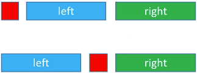  
2. 后序遍历 + 中序遍历：  
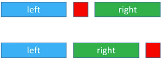

如：前序遍历：`4、2、1、3、6、5`，中序遍历：`1、2、3、4、5、6`。  
1. 先根据前序遍历可以找到这棵二叉树的根节点 `4`；  
2. 再结合中序遍历可以找到左子树的根节点 `2`，右子树的根节点 `6`；  
3. 最后根据中序遍历可以知道 `2` 的左子树是 `1`，右子树是 `3`；`6` 的左子树是 `5`。  
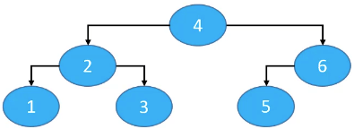

“前序遍历 + 后序遍历”这种情况比较特殊，存在两种情况：  
1. 如果是一棵真二叉树（Proper Binary Tree），结果是唯一的；
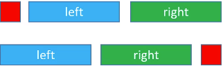  
重构方式同上👆。
2. 否则不唯一；  
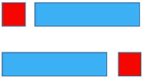  
因为只有一棵子树，所以从遍历结果不能确定子树究竟是左子树还是右子树。

# 前驱节点
前驱节点：中序遍历时的前一个节点。如果是二叉搜索树，前驱节点就是前一个比它小的节点。

查找方式：
1. `node.left != null`；  
`predecessor = node.left.right.right.right...` 终止条件：`right == null`。  
如：6、8、13
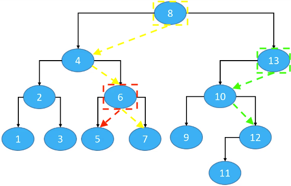  
2. `node.left == null && node.parent != null`;  
`predecessor = node.parent.parent.parent...` 终止条件：`node` 在 `parent` 的右子树中（`node == node.parent.right`）。  
如：7、11、9、1
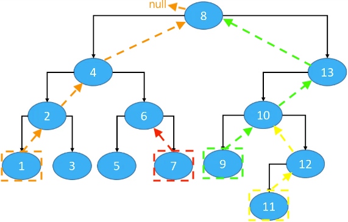 
3. `node.left == null && node.parent == null`，没有前驱节点（没有左子树的根节点）。

代码实现：
```
public Node<E> predecessor(Node<E> node) {
	if (node == null) return node;
	
	Node<E> p = node.left;
	if (p != null) {
		while (p.right != null) {
			p = p.right;
		}
		return p;
	}
	
	while (node.parent != null && node == node.parent.left) {
		node = node.parent;
	}
	return node.parent;
}
```

# 后继节点
后继节点：终须遍历时的后一个几点。如果是二叉搜索树，后继节点就是后一个比它大的节点。

1. `node.right != null`；  
`successor = node.right.left.left.left...` 终止条件：`left == null`。  
如：1、8、4
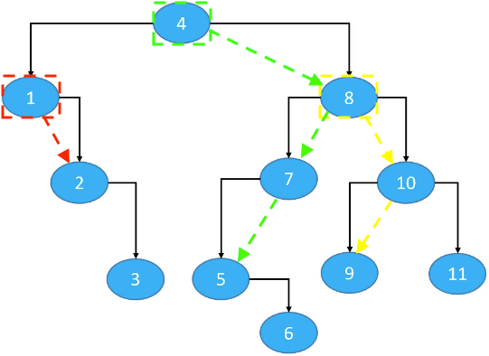 
2. `node.right == null && node.parent != null`；  
`successor = node.parent.parent.parent...` 终止条件：`node` 在 `parent` 的左子树中（`node == node.parent.left`）。  
如：7、6、3、11
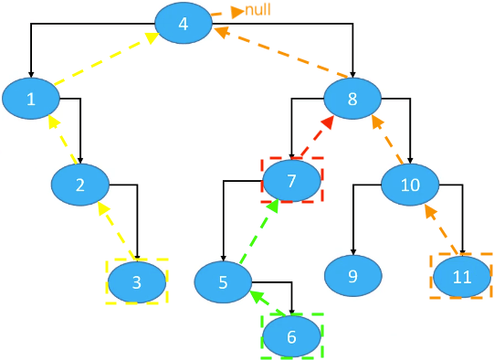 
3. `node.right == null && node.parent == null`，没有后继节点（没有右子树的根节点）。

代码实现：
```
public Node<E> successor(Node<E> node) {
	if (node == null) return node;
	
	Node<E> p = node.right;
	if (p != null) {
		while (p.left != null) {
			p = p.left;
		}
		return p;
	}
	
	while (node.parent != null && node == node.parent.right) {
		node = node.parent;
	}
	return node.parent;
}
```

# 删除

## 删除-叶子节点
```
//左子节点
if (node == node.parent.left) {
	node.parent.left = null;
}

//右子节点
if (node == node.parent.right) {
	node.parent.right = node;
}

//只有一个节点（root）
if (node.parent == null) {
	root = null;
}
```
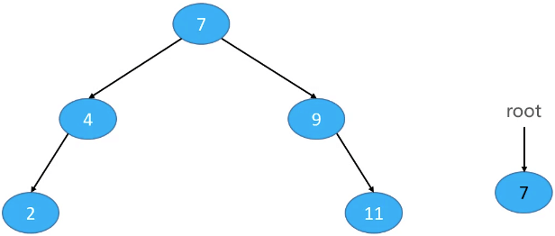

## 删除-度为1的节点
用子节点代替原节点的位置，child 是 node.left 或者 node.right：
```
//如果node是左子节点
if (node == node.parent.left) {
	child.parent = node.parent;
	node.parent.left = child;
}

//如果node是右子节点
if (node == node.parent.right) {
	child.parent = node.parent;
	node.parent.right = child;
}

//如果node是根节点
if (node.parent == null) {
	root = child;
	child.parent = null;
}
```
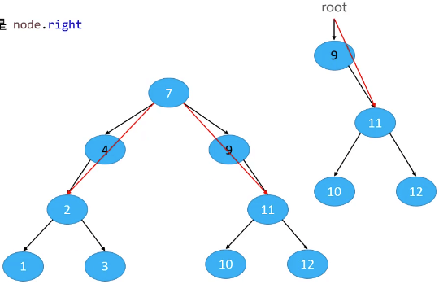

## 删除-度为2的节点
1. 先用前驱或后继节点的值覆盖原节点的值；
2. 再删除相应的前驱或后继节点；
3. 如果一个节点的度为2，那它的前驱、后继节点的度只能是1和0；  

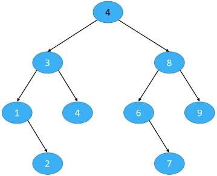

## 代码实现
```
public void remove(E element) {
	remove(node(element));
}

private void remove(Node<E> node) {
	
	//删除度为2的节点
	if (node.isHasTwoChildren()) {
		//找到后继节点
		Node<E> s = successor(node);
		//用后继节点的值覆盖度为2的节点的值
		node.element = s.element;
		//删除后继节点
		node = s;
	}
	
	//删除度为1或0的节点
	Node<E> replacement = node.left != null ? node.left : node.right;
	
	if (replacement != null) { // node是度为1的节点
		// 更改parent
		replacement.parent = node.parent;
		// 更改parent的left、right的指向
		if (node.parent == null) { //node是度为1的节点并且是根节点
			root = replacement;
		} else if (node.parent.left == node) {
			node.parent.left = replacement;
		} else {
			node.parent.right = replacement;
		}
	} else if (node.parent == null) { // node是叶子节点并且是根节点
		root = null;
	} else { // node是叶子节点，但不是根节点
		if (node.parent.left == node) {
			node.parent.left = null;
		} else {
			node.parent.right = null;
		}
	}
}

/*
 * 根据元素内容获取节点
 */
private Node<E> node(E element) {
	Node<E> node = root;
	while (node != null) {
		int cmp = compare(element, node.element);
		if (cmp == 0) return node;
		if (cmp > 0) {
			node = node.right;
		} else {
			node = node.left;
		}
	}
	return node;
}
```

# 练习 Ⅱ
## 二叉树的前序遍历
[144. 二叉树的前序遍历](https://leetcode-cn.com/problems/binary-tree-preorder-traversal/)

递归：
```
public List<Integer> preorderTraversal(TreeNode root) {
	List<Integer> res = new ArrayList<Integer>();
	preorderTraversalRecursive(root, res);
	return res;
}

public void preorderTraversalRecursive(TreeNode root, List<Integer> res) {
	if (root == null) return;

	res.add(root.val);
	preorderTraversalRecursive(root.left, res);
	preorderTraversalRecursive(root.right, res);
}
```

迭代：
```
public List<Integer> preorderTraversalIterative(TreeNode root) {
	List<Integer> res = new ArrayList<Integer>();
	if (root == null) return res;

	Deque<TreeNode> stack = new LinkedList<>();
	TreeNode node = root;
	while (!stack.isEmpty() || node != null) {
		while (node != null) {
			res.add(node.val);
			stack.push(node);
			node = node.left;
		}
		node = stack.pop();
		node = node.right;
	}
	return res;
}
```

## 二叉树的中序遍历
[94. 二叉树的中序遍历](https://leetcode-cn.com/problems/binary-tree-inorder-traversal/)

递归：
```
public List<Integer> inorderTraversal(TreeNode root) {
    List<Integer> res = new ArrayList<Integer>();
    inorderTraversalRecursive(root, res);
    return res;
}

public void inorderTraversalRecursive(TreeNode root, List<Integer> res) {
	if (root == null) return;
	
	inorderTraversalRecursive(root.left, res);
	res.add(root.val);
	inorderTraversalRecursive(root.right, res);
}
```

迭代：
```
public List<Integer> inorderTraversalIterative(TreeNode root) {
    List<Integer> res = new ArrayList<Integer>();
    
    Deque<TreeNode> stack = new LinkedList<>();
    TreeNode node = root;
    while (!stack.isEmpty() || node != null) {
    	while (node != null) {
        	stack.push(node);
			node = node.left;
		}
    	node = stack.pop();
    	res.add(node.val);
    	node = node.right;
	}
    return res;
}
```

## 二叉树的后序遍历
[45. 二叉树的后序遍历](https://leetcode-cn.com/problems/binary-tree-postorder-traversal/)
递归：
```
public List<Integer> postorderTraversal(TreeNode root) {
    List<Integer> res = new ArrayList<Integer>();
    postorderTraversalRecursive(root, res);
	return res; 
}

public void postorderTraversalRecursive(TreeNode root, List<Integer> res) {
    if (root == null) return;
    
	postorderTraversalRecursive(root.left, res);
	postorderTraversalRecursive(root.right, res);
	res.add(root.val);
}
```

迭代：
```
public List<Integer> postorderTraversalIterative(TreeNode root) {
	List<Integer> res = new ArrayList<Integer>();
    if (root == null) return null;
    
    Deque<TreeNode> stack = new LinkedList<>();
    TreeNode node = root;
    TreeNode prev = null;
    while (!stack.isEmpty() || node != null) {
    	while (node != null) {
        	stack.push(node);
			node = node.left;
		}
    	node = stack.pop();
    	if (node.right == null || node.right == prev) {
			res.add(node.val);
			prev = node;
			node = null;
		} else {
			stack.push(node);
			node = node.right;
		}
	}
    
    return res;
}
```

## 二叉树的层序遍历
[102. 二叉树的层序遍历](https://leetcode-cn.com/problems/binary-tree-level-order-traversal/)
迭代：
```
public List<List<Integer>> levelOrder(TreeNode root) {
	List<List<Integer>> res = new ArrayList<>();
	if (root == null) return res;
	
	Queue<TreeNode> queue = new LinkedList<>();
	queue.add(root);
	int levelSize = 1;
	List<Integer> list = new ArrayList<Integer>();
	while (!queue.isEmpty()) {
		TreeNode node = queue.poll();
		levelSize--;
		list.add(node.val);
		
		if (node.left != null) {
			queue.add(node.left);
		}
		
		if (node.right != null) {
			queue.add(node.right);
		}
		
		if (levelSize == 0) {
			res.add(list);
			levelSize = queue.size();
			list = new ArrayList<Integer>();
		}
	}
	return res;
}
```

## 二叉树的最大深度
[104. 二叉树的最大深度](https://leetcode-cn.com/problems/maximum-depth-of-binary-tree/)
递归：
```
/*
 * 递归
 */
public int maxDepth(TreeNode root) {
	if (root == null) return 0;
	return 1 + Math.max(maxDepth(root.left), maxDepth(root.right));
}
```

迭代：
```
lic int maxDepth(TreeNode root) {
	int height = 0;
	if (root == null) return height;
	
	Queue<TreeNode> queue = new LinkedList<>();
	queue.add(root);
	int levelSize = 1;
	while (!queue.isEmpty()) {
		TreeNode node = queue.poll();
		levelSize--;
			
		if (node.left != null) {
			queue.add(node.left);
		}
			
		if (node.right != null) {
			queue.add(node.right);
		}
			
		if (levelSize == 0) {
			levelSize = queue.size();
			height++;
		}
	}
	
	return height;
}
```

## 二叉树的层次遍历 II
[107. 二叉树的层次遍历 II](https://leetcode-cn.com/problems/binary-tree-level-order-traversal-ii/)
```
public List<List<Integer>> levelOrderBottom(TreeNode root) {
	List<List<Integer>> res = new ArrayList<>();
	if (root == null) return res;
	
	Queue<TreeNode> queue = new LinkedList<>();
	queue.offer(root);
	int levelSize = 1;
	List<Integer> list = new ArrayList<>();
	while (!queue.isEmpty()) {
		TreeNode node = queue.poll();
		levelSize--;
		list.add(node.val);
		
		if (node.left != null) {
			queue.add(node.left);
		}
		
		if (node.right != null) {
			queue.add(node.right);
		}
		
		if (levelSize == 0) {
			levelSize = queue.size();
			res.add(0, list);
			list = new ArrayList<>();
		}
	}
	
	return res;
}
```

## 二叉树最大宽度
[662. 二叉树最大宽度](https://leetcode-cn.com/problems/maximum-width-of-binary-tree/)
```
public class _662_二叉树最大宽度 {
    public int widthOfBinaryTree(TreeNode root) {
    	if (root == null) return 0;
    	
    	Node node = new Node(root, 0, 0);
    	Queue<Node> queue = new LinkedList<>();
    	queue.offer(node);
    	int curDepth = 0, left = 0, ans = 0;
    	while (!queue.isEmpty()) {
    		node = queue.poll();
    		
    		if (node.treeNode != null) {
				queue.offer(new Node(node.treeNode.left, node.depth + 1, node.pos * 2));
				queue.offer(new Node(node.treeNode.right, node.depth + 1, node.pos * 2 + 1));
				
				//每开始遍历新的一层，记录最左边的pos
				if (curDepth != node.depth) {
					curDepth = node.depth;
					left = node.pos;
				}
				
				ans = Math.max(ans, node.pos - left + 1);
			}
    	}

    	return ans;
    }
}

//因为左右子树存在null的情况，所以创建新的Node包装TreeNode，这样就可以存储TreeNode==null情况
class Node {
	TreeNode treeNode;
	int depth, pos;
	public Node(TreeNode treeNode, int depth, int pos) {
		this.treeNode = treeNode;
		this.depth = depth;
		this.pos = pos;
	}
}
```

## N叉树的前序遍历
[589. N叉树的前序遍历](https://leetcode-cn.com/problems/n-ary-tree-preorder-traversal/)
```
/*
// Definition for a Node.
class Node {
    public int val;
    public List<Node> children;

    public Node() {}

    public Node(int _val) {
        val = _val;
    }

    public Node(int _val, List<Node> _children) {
        val = _val;
        children = _children;
    }
};
*/

/*
 * 递归
 */
public List<Integer> preorder(Node root) {
    List<Integer> res = new LinkedList<>();
	preorderTraversal(root, res);
	return res;
}

public void preorderTraversal(Node root, List<Integer> res) {
	if (root == null) return;
	
	res.add(root.val);
	if (root.children != null) {
		for (Node c : root.children) {
			preorderTraversal(c, res);
		}
	}
	return;
}

/*
 * 迭代
 */
public List<Integer> preorderIterative(Node root) {
    List<Integer> res = new LinkedList<>();
    if (root == null) return res;
    
    Deque<Node> stack = new LinkedList<>();
    stack.push(root);
    while (!stack.isEmpty()) {
    	Node node = stack.pop();
    	res.add(node.val);
    	//反转一个 List（[v1, v2, v3] -> [v3, v2, v1]）
    	Collections.reverse(node.children);
    	for (Node c : node.children) {
			stack.push(c);
		}
	}
	return res;
}
```

## N叉树的后序遍历
[590. N叉树的后序遍历](https://leetcode-cn.com/problems/n-ary-tree-postorder-traversal/)
```
/*
// Definition for a Node.
class Node {
    public int val;
    public List<Node> children;

    public Node() {}

    public Node(int _val) {
        val = _val;
    }

    public Node(int _val, List<Node> _children) {
        val = _val;
        children = _children;
    }
};
*/

/*
 * 递归
 */
public List<Integer> postorder(Node root) {
	List<Integer> res = new LinkedList<>();
	postorderTraversal(root, res);
    return res;
}

public void postorderTraversal(Node root, List<Integer> res) {
	if (root == null) return;
	
	if (root.children != null) {
		for (Node c : root.children) {
			postorderTraversal(c, res);
		}
	}
	
	res.add(root.val);
    return;
}

/*
 * 迭代
 */
public List<Integer> postorderIterative(Node root) {
	List<Integer> res = new LinkedList<>();
	if (root == null) return res;
	
	Deque<Node> stack = new LinkedList<>();
	stack.push(root);
	while (!stack.isEmpty()) {
		Node node = stack.poll();
		res.add(0, node.val);
		for (Node c : node.children) {
			stack.push(c);
		}
	}
	
    return res;
}
```

## N叉树的最大深度
[559. N 叉树的最大深度](https://leetcode-cn.com/problems/maximum-depth-of-n-ary-tree/)
```
/*
 * 递归
 */
public int maxDepth(Node root) {
	if (root == null) return 0;
	
	int result = 1;
	for (Node c : root.children) {
		result = Math.max(result, 1 + maxDepth(c));
	}
	return result;
}

/*
 * 迭代
 */
public int maxDepthIterative(Node root) {
	int height = 0;
	if (root == null) return height;
    
	Queue<Node> queue = new LinkedList<>();
	queue.offer(root);
	int levelSize = 1;
	while (!queue.isEmpty()) {
		Node node = queue.poll();
		levelSize--;
		if (node.children != null) {
			for (Node c : node.children) {
				queue.offer(c);
			}
		}
		if (levelSize == 0) {
			levelSize = queue.size();
			height++;
		}
	}
	return height;
}
```

## 二叉树展开为链表
[114. 二叉树展开为链表](https://leetcode-cn.com/problems/flatten-binary-tree-to-linked-list/)
```
/*
 * 方法一：前序遍历-递归
 */
public void flatten(TreeNode root) {
    List<TreeNode> list = new LinkedList<>();
    preorderTraversal(root, list);
    for (int i = 1; i < list.size(); i++) {
		TreeNode node1 = list.get(i-1);
		TreeNode node2 = list.get(i);
		node1.right = node2;
		node1.left = null;
	}
}

public void preorderTraversal(TreeNode root, List<TreeNode> list) {
    if (root == null) return;
    
    list.add(root);
    preorderTraversal(root.left, list);
    preorderTraversal(root.right, list);
}

/*
 * 方法一：前序遍历-迭代
 */
public void flattenIterative(TreeNode root) {
    
	List<TreeNode> list = new LinkedList<>();
	
	Deque<TreeNode> stack = new LinkedList<>();
	TreeNode node = root;
	while (!stack.isEmpty() || node != null) {
		while (node != null) {
			list.add(node);
			stack.push(node);
			node = node.left;
		}
		node = stack.poll();
		node = node.right;
	}
	for (int i = 1; i < list.size(); i++) {
		TreeNode node1 = list.get(i - 1);
		TreeNode node2 = list.get(i);
		node1.right = node2;
		node1.left = null;
	}
}
/*
 * 方法一：前序遍历-迭代2
 */
public void flattenIterative2(TreeNode root) {
    if (root == null) return;
	List<TreeNode> list = new LinkedList<>();
	
	Deque<TreeNode> stack = new LinkedList<>();
	stack.push(root);
	while (!stack.isEmpty()) {
		TreeNode node = stack.poll();
		list.add(node);
		
		if (node.right != null) {
			stack.push(node.right);
		}
		
		if (node.left != null) {
			stack.push(node.left);
		}
	}
	for (int i = 1; i < list.size(); i++) {
		TreeNode node1 = list.get(i - 1);
		TreeNode node2 = list.get(i);
		node1.right = node2;
		node1.left = null;
	}
}

/*
 * 方法二：前序遍历和展开同步进行
 */
public void flattenIterative3(TreeNode root) {
	if (root == null) return;
	
	//前序遍历
	Deque<TreeNode> stack = new LinkedList<>();
	stack.push(root);
	TreeNode prev = null;
	while (!stack.isEmpty()) {
		TreeNode curr = stack.poll();
		if (curr.right != null) {
			stack.push(curr.right);
		}
		if (curr.left != null) {
			stack.push(curr.left);
		}
		
		//展开
		if (prev != null) {
			prev.right = curr;
			prev.left = null;	
		}
		prev = curr;
	}
}

/*
 * 方法三：寻找前驱节点
 */
public void flattenIteraltive4(TreeNode root) {
	if (root == null) return;
	
	TreeNode curr = root;
	while (curr != null) {
		if (curr.left != null) {
			TreeNode next = curr.left;
			
			//寻找前驱节点
			TreeNode predecessor = curr.left;
			while (predecessor.right != null) {
				predecessor = predecessor.right;
			}
			
			//展开
			predecessor.right = curr.right;
			curr.right = next;
			curr.left = null;
		}
		curr = curr.right; //next
	}
}
```

## 从中序与后序遍历序列构造二叉树
[106. 从中序与后序遍历序列构造二叉树](https://leetcode-cn.com/problems/construct-binary-tree-from-inorder-and-postorder-traversal/)
```
/*
 * 方法一：递归
 */
int post_idx;
int[] inorder;
int[] postorder;
Map<Integer, Integer> idx_map = new HashMap<Integer, Integer>();

public TreeNode helper(int in_left, int in_right) {
	//没有节点
	if (in_left > in_right) return null;
	
	//后序遍历结果中 post_idx 处的节点作为当前子树的根节点
	int root_val = postorder[post_idx];
	TreeNode root = new TreeNode(root_val);
	
	//根据 root 所在位置分成左右子树
	int index = idx_map.get(root_val);
	
	//下标减1（递归构建完右子树后，post_idx-- < index）
	post_idx--;
	
	//递归-构建右子树
	root.right = helper(index + 1, in_right);
	
	//递归-构建左子树
	root.left = helper(in_left, index - 1);
	
	return root;
}

public TreeNode buildTree(int[] inorder, int[] postorder) {
	this.inorder = inorder;
	this.postorder = postorder;
	
	post_idx = postorder.length - 1;
	
	int idx = 0;
	for (int val : inorder) {
		idx_map.put(val, idx++);
	}

	return helper(0, post_idx);
}

/*
 * 方法二：迭代
 * 
 * inorder = [15, 9, 10, 3, 20, 5, 7, 8, 4]
 * postorder = [15, 10, 9, 5, 4, 8, 7, 20, 3]
 */
public TreeNode buildTree2(int[] inorder, int[] postorder) {
	if (postorder == null || postorder.length == 0) {
		return null;
	}
	
	//后序遍历的最后一个节点就是 root 节点
	//这些节点的顺序和它们在反向中序遍历（反向遍历inorder）中出现的顺序一定是相反的
	TreeNode root = new TreeNode(postorder[postorder.length - 1]);
	//使用栈存放后序遍历中的节点
	Deque<TreeNode> stack = new LinkedList<>();
	stack.push(root);
	
	//用来记录子树里最右边的节点
	int inorderIndex = inorder.length - 1;
	//从后序遍历的倒数第二个几点开始，反向遍历 postorder
	for (int i = postorder.length - 2; i >= 0; i--) {
		int postorderVal = postorder[i];
		//栈顶节点
		TreeNode node = stack.peek();
		if (node.val != inorder[inorderIndex]) {
			//node 不是最右边的节点，那么 postorderVal 是 node 的右节点
			node.right = new TreeNode(postorderVal);
			stack.push(node.right);
		} else {
			//node 是最右边的节点，那么 postorderVal 是 node 的左节点
			//栈里的这些节点（右节点）的顺序和它们在反向中序遍历中出现的顺序一定是相反的
			while (!stack.isEmpty() && stack.peek().val == inorder[inorderIndex]) {
				node = stack.pop();
				inorderIndex--; //反向遍历 inorder
			}
			//因为 postorderVal 出现在了 node 与 node 在栈中的下一个节点的反向中序遍历之间，因此 postorderVal 就是 node 的左儿子。
			node.left = new TreeNode(postorderVal);
			stack.push(node.left);
		}
	}
	
	return root;
}
```

## 从前序与中序遍历序列构造二叉树
[105. 从前序与中序遍历序列构造二叉树](https://leetcode-cn.com/problems/construct-binary-tree-from-preorder-and-inorder-traversal/)
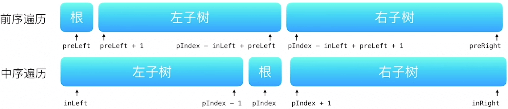
```
/*
 * 方法一：递归
 * 
 * preorder = [3, 9, 15, 10, 20, 7, 5, 8, 4]
 * inorder = [15, 9, 10, 3, 20, 5, 7, 8, 4]
 */
int preorderIndex;
int[] preorder;
int[] inorder;
Map<Integer, Integer> idx_map = new HashMap<Integer, Integer>();
public TreeNode helper(int in_left, int in_right) {
	
	if (in_left > in_right) {
		return null;
	}
	
	TreeNode root = new TreeNode(preorder[preorderIndex]);
	int index = idx_map.get(root.val);
	
	preorderIndex++;
	
	//遍历创建左子节点
	root.left = helper(in_left, index - 1);
	//遍历创建右子节点
	root.right = helper(index + 1, in_right);
	
	return root;
}

public TreeNode buildTree(int[] preorder, int[] inorder) {
	this.preorder = preorder;
	this.inorder = inorder;
	
	for (int i = 0; i < inorder.length; i++) {
		idx_map.put(inorder[i], i);
	}
	
	return helper(0, preorder.length);
}

/*
 * 方法二：迭代
 * 
 * preorder = [3, 9, 15, 10, 20, 7, 5, 8, 4]
 * inorder = [15, 9, 10, 3, 20, 5, 7, 8, 4]
 */
public TreeNode buildTree2(int[] preorder, int[] inorder) {
	if (preorder == null || preorder.length == 0) {
		return null;
	}
	//前序遍历的第一个节点就是root节点
	TreeNode root = new TreeNode(preorder[0]);
	//中序遍历的索引
	int inorderIndex = 0;

	Deque<TreeNode> stack = new LinkedList<>();
	stack.push(root);
	
	//正序遍历 preorder
	for (int i = 1; i < preorder.length; i++) {
		int preorderVal = preorder[i];
		TreeNode node = stack.peek();
		if (node.val != inorder[inorderIndex]) {
			// node 不是最左边的节点，那么 postorderVal 是 node 的左节点
			node.left = new TreeNode(preorderVal);
			stack.push(node.left);
		} else {
			// node 是最左边的节点，那么 postorderVal 是 node 的右节点
			while (!stack.isEmpty() && stack.peek().val == inorder[inorderIndex]) {
				node = stack.pop();
				inorderIndex++;
			}
			node.right = new TreeNode(preorderVal);
			stack.push(node.right);
		}
	}
	
	return root;
}
```

## 根据前序和后序遍历构造二叉树
[889. 根据前序和后序遍历构造二叉树](https://leetcode-cn.com/problems/construct-binary-tree-from-preorder-and-postorder-traversal/)
```
/*
 * 方法一：递归
 */
public TreeNode constructFromPrePost(int[] pre, int[] post) {
	int N = pre.length;
	if (N == 0) {
		return null;
	}
	TreeNode root = new TreeNode(pre[0]);
	if (N == 1) {
		return root;
	}
	
	//令左分支有 L 个节点
	int L = 0;
	for (int i = 0; i < N; i++) {
		if (post[i] == pre[1]) {
			L = i + 1; //L = post.indexOf(pre[1]) + 1
		}
	}
	
	//copyOfRange(int[] original, int from, int to)：包括下标from，不包括上标to
	//左分支由 pre[1 : L+1] 和 post[0 : L] 重新分支
	root.left = constructFromPrePost(Arrays.copyOfRange(pre, 1,	L + 1), Arrays.copyOfRange(post, 0, L));
	//右分支将由 pre[L+1 : N] 和 post[L : N-1] 重新分支
	root.right = constructFromPrePost(Arrays.copyOfRange(pre, L + 1, N), Arrays.copyOfRange(post, L, N - 1));
	
	return root;
}
```

## 对称二叉树
[101. 对称二叉树](https://leetcode-cn.com/problems/symmetric-tree/)
```
/*
 * 方法一：递归
 */
public boolean isSymmetric(TreeNode root) {
	return check(root, root);
}

public boolean check(TreeNode p, TreeNode q) {
	
	if (p == null && q == null) return true;
	
	if (p == null || q == null) return false;
	
	return (p.val == q.val && check(p.left, q.right) && check(p.right, q.left));
}

/*
 * 方法二：迭代
 */
public boolean isSymmetric2(TreeNode root) {
	Queue<TreeNode> queue = new LinkedList<>();
	queue.offer(root);
	queue.offer(root);
	
	while (!queue.isEmpty()) {
		TreeNode p = queue.poll();
		TreeNode q = queue.poll();
		if (p == null && q == null) {
			continue;
		}
		
		if (p == null || q == null || p.val != q.val) {
			return false;
		}
		
		queue.offer(p.left);
		queue.offer(q.right);
		
		queue.offer(p.right);
		queue.offer(q.left);
	}
	
	return true;
}
```

# 练习 Ⅲ
## 删除二叉搜索树中的节点
[450. 删除二叉搜索树中的节点](https://leetcode-cn.com/problems/delete-node-in-a-bst/)
```
public int successor(TreeNode root) {
	root = root.right;
	while (root.left != null) {
		root = root.left;
	}
	return root.val;
}

public int predecessor(TreeNode root) {
	root = root.left;
	while (root.right != null) {
		root = root.right;
	}
	return root.val;
}

public TreeNode deleteNode(TreeNode root, int key) {
	if (root == null) return null;
	
	if (key > root.val) {
		//向又查找
		root.right = deleteNode(root.right, key);
	} else if (key < root.val) {
		//向左查找
		root.left = deleteNode(root.left, key);
	} else {
		if (root.left == null && root.right == null) { //删除叶子节点
			root = null;
		} else if (root.right != null) { //删除度为1的节点
			root.val = successor(root);
			root.right = deleteNode(root.right, root.val);
		} else { //删除度为1的节点
			root.val = predecessor(root);
			root.left = deleteNode(root.left, root.val);
		}
	}
	return root;
}
```

## 二叉搜索树中的搜索
[700. 二叉搜索树中的搜索](https://leetcode-cn.com/problems/search-in-a-binary-search-tree/)
```
public TreeNode searchBST(TreeNode root, int val) {
	if (root == null) return null;
	while (root != null) {
		if (val > root.val) {
			root = root.right;
		} else if (val < root.val) {
			root = root.left;
		} else {
			return root;
		}
	}
	return root;
}
```

## 二叉搜索树中的插入操作
[701. 二叉搜索树中的插入操作](https://leetcode-cn.com/problems/insert-into-a-binary-search-tree/)
```
public TreeNode insertIntoBST(TreeNode root, int val) {
	if (root == null) return new TreeNode(val);
	
	TreeNode node = root;
	TreeNode parent = root;
	int cmp = 0;
	while (node != null) {
		parent = node;
		if (val > node.val) {
			cmp = 1;
			node = node.right;
		} else {
			cmp = -1;
			node = node.left;
		}
	}
	
	if (cmp > 0) {
		parent.right = new TreeNode(val);
	} else {
		parent.left = new TreeNode(val);
	}
	
	return root;
}
```

## 验证二叉搜索树
[98. 验证二叉搜索树](https://leetcode-cn.com/problems/validate-binary-search-tree/)
```
/*
 * 递归
 *
 * 左子树不为空，则左子树上所有节点的值均小于它的根节点的值；
 * 右子树不空，则右子树上所有节点的值均大于它的根节点的值；
 * 它的左右子树也为二叉搜索树。
 */
public boolean isValidBST(TreeNode root) {
	return preorder(root, null, null);
}

public boolean preorder(TreeNode root, Integer lower, Integer upper) {
	if (root == null) return true;
	
	if (lower != null && lower >= root.val) return false;
	
	if (upper != null && upper <= root.val) return false;
	
	if (!preorder(root.left, lower, root.val)) return false;
	
	if (!preorder(root.right, root.val, upper)) return false;
	
	return true;
}

/*
 * 迭代
 * 
 * 「中序遍历」得到的值构成的序列一定是升序的
 */
public boolean isValidBST2(TreeNode root) {
	return inorder(root);
}

public boolean inorder(TreeNode root) {
	Deque<TreeNode> stack = new LinkedList<>();
	TreeNode node = root;
	TreeNode prev = null;
	while (!stack.isEmpty() || node != null) {
		while (node != null) {
			stack.push(node);
			node = node.left;
		}
		node = stack.pop();
		if (prev != null && prev.val >= node.val) {
			return false;
		}
		prev = node;
		node = node.right;
	}
	return true;
}
```

## 二叉搜索树的最小绝对差
[530. 二叉搜索树的最小绝对差](https://leetcode-cn.com/problems/minimum-absolute-difference-in-bst/)
```
TreeNode prev;
int ans;

public int getMinimumDifference(TreeNode root) {
	ans = Integer.MAX_VALUE;
	inorder(root);
	return ans;
}

public void inorder(TreeNode root) {
	if (root == null) return;
	
	inorder(root.left);
	
	if (prev == null) {
		prev = root;
	} else {
		int cha = root.val - prev.val;
		ans = ans > cha ? cha : ans;
		prev = root;
	}
	
	inorder(root.right);
}
```

## 二叉搜索树节点最小距离
[783. 二叉搜索树节点最小距离](https://leetcode-cn.com/problems/minimum-distance-between-bst-nodes/)
```
public class _783_二叉搜索树节点最小距离 {
	int preVal;
	int ans;
    public int minDiffInBST(TreeNode root) {
    	preVal = -1;
    	ans = Integer.MAX_VALUE;
    	inorder(root);
    	return ans;
    }
    
    public void inorder(TreeNode root) {
    	if (root == null) return;
    	
    	inorder(root.left);
    	
    	if (preVal != -1) {
    		ans = Math.min(ans, root.val - preVal);
		}
    	preVal = root.val;
    	
    	inorder(root.right);
    }
}
```

## 将有序数组转换为二叉搜索树
[108. 将有序数组转换为二叉搜索树](https://leetcode-cn.com/problems/convert-sorted-array-to-binary-search-tree/)
```
public TreeNode sortedArrayToBST(int[] nums) {
	return helper(nums, 0, nums.length-1);
}

public TreeNode helper(int[] nums, int left, int right) {
	if (left > right) return null;
	
	int mid = (left + right) / 2;
	
	TreeNode root = new TreeNode(nums[mid]);
	root.left = helper(nums, left, mid-1);
	root.right = helper(nums, mid+1, right);
	
	return root;
}
```

## 二叉搜索树的范围和
[938. 二叉搜索树的范围和](https://leetcode-cn.com/problems/range-sum-of-bst/)
```
int sum;

public int rangeSumBST(TreeNode root, int low, int high) {
	inorder(root, low, high);
	return sum;
}

public void inorder(TreeNode root, int low, int high) {
	if (root == null) return;
	
	rangeSumBST(root.left, low, high);

	if (root.val >= low && root.val <= high) {
		sum += root.val;
	}
	rangeSumBST(root.right, low, high);
}
```

## 二叉搜索树的最近公共祖先
[235. 二叉搜索树的最近公共祖先](https://leetcode-cn.com/problems/lowest-common-ancestor-of-a-binary-search-tree/)
```
/*
 * 方法一：两次遍历
 */
public TreeNode lowestCommonAncestor(TreeNode root, TreeNode p, TreeNode q) {
	List<TreeNode> path_p = path(root, p);
	List<TreeNode> path_q = path(root, q);
	
	TreeNode node = null;
	for (int i = 0; i < path_p.size() && i < path_q.size(); i++) {
		if (path_p.get(i) == path_q.get(i)) {
			node = path_p.get(i);
		}
	}
	return node;
}

public List<TreeNode> path(TreeNode root, TreeNode target) {
	List<TreeNode> path = new LinkedList<>();
	TreeNode node = root;
	while (node != target) {
		path.add(node);
		if (node.val > target.val) {
			node = node.left;
		} else if (node.val < target.val) {
			node = node.right;
		}
	}
	path.add(node);
	return path;
}

/*
 * 方法一：一次遍历
 */
public TreeNode lowestCommonAncestor2(TreeNode root, TreeNode p, TreeNode q) {
	TreeNode node = root;
	
	while (node != null) {
		if (node.val > p.val && node.val > q.val) {
			node = node.left;
		} else if (node.val < p.val && node.val < q.val) {
			node = node.right;
		} else {
			break;
		}
	}
	
	return node;
}
```

## 二叉搜索树中第K小的元素
[230. 二叉搜索树中第K小的元素](https://leetcode-cn.com/problems/kth-smallest-element-in-a-bst/)
```
public class _230_二叉搜索树中第K小的元素 {
	TreeNode targeTreeNode = null;
	int index = 0;
	/*
	 * 迭代
	 */
	public int kthSmallest(TreeNode root, int k) {

		if (root == null) return root.val;
		
		///递归
		//return inorder(root, k);
		
		///迭代
		index = k;
		helper(root);
		return targeTreeNode.val;
    }
	
	public int inorder(TreeNode root, int k) {
		
		TreeNode targeTreeNode = root;
		Deque<TreeNode> stack = new LinkedList<>();
		TreeNode node = root;
		while (!stack.isEmpty() || node != null) {
			while (node != null) {
				stack.push(node);
				node = node.left;
			}
			node = stack.pop();
			k--;
			if (k == 0) {
				targeTreeNode = node;
				break;
			}
			node = node.right;
		}
		
		return targeTreeNode.val;
	}
	
	/*
	 * 递归
	 */
	public void helper(TreeNode root) {
		if (root == null || targeTreeNode != null) return;
		
		helper(root.left);
		index--;
		if (index == 0 && targeTreeNode == null) {
			targeTreeNode = root;
			return;
		}
		helper(root.right);
	}
}
```

## 二叉搜索树迭代器
[173. 二叉搜索树迭代器](https://leetcode-cn.com/problems/binary-search-tree-iterator/)
```
/*
 * 迭代
 */
class BSTIterator {
	Deque<TreeNode> stack;
	
    public BSTIterator(TreeNode root) {
    	stack = new LinkedList<>();
    	leftmostInorder(root);
    }
    
    public void leftmostInorder(TreeNode root) {
    	while (root != null) {
			stack.push(root);
			root = root.left;
		}
	}
    
    public int next() {
    	TreeNode node = stack.poll();
    	if (node.right != null) {
    		leftmostInorder(node.right);
		}
    	return node.val;
    }
    
    public boolean hasNext() {
    	return !stack.isEmpty();
    }
}
```

## 恢复二叉搜索树
[99. 恢复二叉搜索树](https://leetcode-cn.com/problems/recover-binary-search-tree/)
```
public class _99_恢复二叉搜索树 {

	/*
	 * 方法一：显示中序遍历
	 */
	public void recoverTree(TreeNode root) {
		List<Integer> res = new LinkedList<>();
		inorder(root, res);
		int[] swaped = findTwoSwaped(res);
		recover(root, 2, swaped[0], swaped[1]);
    }
	
	public void inorder(TreeNode root, List<Integer> res) {
		if (root == null) return;
		inorder(root.left, res);
		res.add(root.val);
		inorder(root.right, res);
	}
	
	public int[] findTwoSwaped(List<Integer> res) {
		int n = res.size();
		int x = -1, y = -1;
		for (int i = 0; i < n - 1; i++) {
			if (res.get(i) == res.get(i + 1)) { //找到异常节点（前面 > 后面）
				y = res.get(i + 1);//后
				if (x == -1) {
					x = res.get(i);//前
				} else {
					break;	
				}
			}
		}
		return new int[]{x, y};
	}
	
	public void recover(TreeNode root, int count, int x, int y) {
		if (root != null) {
			if (root.val == x || root.val == y) {
				root.val = root.val == x ? y : x;
				if (--count == 0) {
					return;
				}
			}
			recover(root.left, count, x, y);
			recover(root.right, count, x, y);
		}
	}
	
	/*
	 * 方法二：隐式中序遍历
	 */
	public void recoverTree1(TreeNode root) {
		Deque<TreeNode> stack = new LinkedList<>();
		TreeNode x = null, y = null, pred = null;
		while (!stack.isEmpty() || root != null) {
			while (root != null) {
				stack.push(root);
				root = root.left;
			}
			root = stack.pop();
			///保存两个被交换的数据
			if (pred != null && pred.val > root.val) { //找到异常节点（前面 > 后面）
				y = root;//后
				if (x == null) {
					x = pred;//前
				} else {
					break;
				}
			}
			pred = root;
			root = root.right;
		}
		
        swap(x, y);
	}
	
	public void swap(TreeNode x, TreeNode y) {
		int temp = x.val;
		x.val = y.val;
		y.val = temp;
	}
	
	/*
	 * 方法三：Morris 中序遍历
	 */
	public void recoverTree2(TreeNode root) {
		TreeNode x = null, y = null, pred = null;
		TreeNode cur = root;
		while (cur != null) {
			if (cur.left != null) {
				/*
				 * 步骤1（寻找前驱节点）
				 * 1>一直向右找到最右端的节点即为前驱节点，停止遍历
				 * 2>如果最右端的节点是 cur，表示上次循环经历过步骤2，停止遍历
				 */
				TreeNode precessoNode = cur.left;
				while (precessoNode.right != null && precessoNode.right != cur) {
					precessoNode = precessoNode.right;
				}
				
				if (precessoNode.right == null) {
					/*
					 * 步骤2
					 * 1>让前驱节点的 right 指向当前节点（实现步骤4 -> 步骤1 -> 步骤3）
					 * 2>继续遍历左子树
					 */
					precessoNode.right = cur;
					cur = cur.left;
				} else {
					/*
					 * 所有右子树的节点（包含 cur）
					 */
					if (pred != null && pred.val > cur.val) { //找到异常节点（前面 > 后面）
						y = cur; //后
						if (x == null) {
							x = pred; //前 
						}
					}
					pred = cur;
					/* 
					 * 步骤3（precessoNode.right == cur，上次循环步骤2处理的结果）
					 * 1>去掉前驱节点和 cur 的关联（right = null）
					 * 2>开始遍历 cur 的右子树
					 */
					precessoNode.right = null;
					cur = cur.right;
				}
			} else {
				/*
				 * 所有左子树的节点
				 */
				if (pred != null && pred.val > cur.val) { //找到异常节点（前面 > 后面）
					y = cur; //后
					if (x == null) {
						x = pred; //前 
					}
				}
				pred = cur;
				/*
				 * 步骤4遍历右子树
				 * 第一种情况：遍历右子树
				 * 第二种情况：回到父节点，去步骤3（呼应步骤2）
				 */
				cur = cur.right;
			}
		}
		
		swap(x, y);
	}	
}
```

ps：  
二叉树绘图网站  
[520it](http://520it.com/binarytrees/)  
[Binary Tree Visualiser](http://btv.melezinek.cz/binary-search-tree.html)  
[Data Structure Visualizations](https://www.cs.usfca.edu/~galles/visualization/Algorithms.html)  
[B-Tree](https://yangez.github.io/btree-js/)
