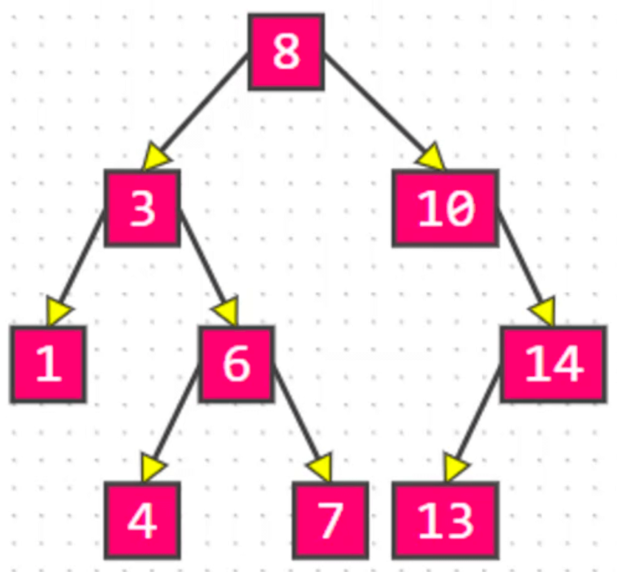

[二叉搜索树（Binary Search Tree）](https://baike.baidu.com/item/%E4%BA%8C%E5%8F%89%E6%90%9C%E7%B4%A2%E6%A0%91/7077855?fr=aladdin)作为一种经典的数据结构，它既有链表的快速插入与删除操作的特点，又有数组快速查找的优势；所以应用十分广泛，例如在文件系统和数据库系统一般会采用这种数据结构进行高效率的排序与检索操作。

<!-- more -->

# 二叉搜索树

## 思考：在 n 个动态的整数中搜索某个整数（查看其是否存在）？

1. 使用动态数组，从第 0 个位置开始遍历搜索，平均时间复杂度：O(n)；  

2. 使用有序的动态数组，使用二分搜索，最坏时间负载度：O(log(n))，但是添加和删除的平均时间复杂度是：O(n)；  

3. 使用二叉搜索树，添加、删除和搜索的最坏时间复杂度都是：O(log(n));

## 二叉搜索树特性
二叉搜索树是二叉树的一种，是应用非常广泛的一种二叉树，英文简称为 BST。又被称为：二叉查找树、二叉排序树。二叉搜索树可以大大提高搜索数据的效率。  
1. 若它的左子树不空，则左子树上所有结点的值均<u>小于</u>它的根结点的值；  
2. 若它的右子树不空，则右子树上所有结点的值均<u>大于</u>它的根结点的值；  
3. 它的左、右子树也分别为<u>二叉搜索树</u>。


使用二叉搜索树需要注意：  
1. 存储的元素必须具备比较性，比如 `int`、`double` 等。
2. 如果是自定义类型，需要指定比较方式。
3. 存储的元素不可以是 `null`。

## 接口设计
```
/*
 * 元素的数量
 */
public int size() {}
/*
 * 是否为空
 */
public boolean isEmpty() {}
/*
 * 清空所有元素
 */
public void clear() {}
/*
 * 添加元素
 */
public void add(E element) {}
/*
 * 删除元素
 */
public void remove(E element) {}
/*
 * 是否包含某元素
 */
public void contains(E element) {}
```

## 添加节点
1. 找到要添加到的位置，即找到该位置的父节点 `parent`；  
2. 创建新节点 `node`；  
3. 加入到树中：`parent.left = node` 或者 `parent.right = node`。

注意：遇到值相等的元素可以覆盖旧值。

如添加 `12`、`1`，先找到父节点 `11`、`2`：

创建新节点 `node`，加入到树中：


代码实现：
```
public void add(E element) {
	if (root == null) {
		root = new Node<>(element, null);
		return;
	}
	
	Node<E> node = root;
	Node<E> parent = root;
	int cmp = 0;
	while (node != null) {
		parent = node;
		cmp = compare(element, node.element); // 返回值等于0：e1 == e2，大于0：e1 > e2，小于0：e1 < e2
		if (cmp > 0) {
			node = node.right;
		} else if (cmp < 0) {
			node = node.left;
		} else {
			node.element = element; // 考虑到不同名字的 person，相等就覆盖
			return;
		}
	}
	
	Node<E> newNode = new Node<>(element, parent);
	if (cmp > 0) {
		parent.right = newNode;
	} else {
		parent.left = newNode;
	}
	
	size++;
}
```

## 元素的比较方案设计
### 方案一
强制元素实现 `Comparable` 接口：
```
public class BinarySearchTree<E extends Comparable> {
    ...
}
```

添加 `extends Comparable` 后，要加入到二叉搜索树的元素都必须实现 `Comparable` 接口。

定义 Person 实现 `Comparable` 接口：
```
public class Person implements Comparable<Person> {
	private int age;
	
	public int getAge() {
		return age;
	}
	
	public void setAge(int age) {
		this.age = age;
	}
	
	@Override
	public int compareTo(Person e) {
		return age - e.age;
	}

	@Override
	public String toString() {
		return age + "";
	}
}
```

### 方案二
1. 允许外界传入一个 `Comparator` 自定义比较方案；
2. 如果没有传入 `Comparator`，强制认定元素实现了 `Comparable` 接口。
```
public class BinarySearchTree<E> {

	private Comparator<E> comparator;

	public BinarySearchTree() {
		this(null);
	}
	
	public BinarySearchTree(Comparator<E> comparator) {
		this.comparator = comparator;
	}
    
	private int compare(E e1, E e2) {
		if (comparator != null) {
			return comparator.compare(e1, e2);
		}
		return ((Comparable<E>)e1).compareTo(e2);
	}
}
```

### 打印器
使用 [BinaryTrees](https://github.com/CoderMJLee/BinaryTrees) 打印二叉搜索树。

1、实现 `BinaryTreeInfo` 接口
```
public class BinarySearchTree<E> implements BinaryTreeInfo {
	...

	@Override
	public Object root() {
		return root;
	}

	@Override
	public Object left(Object node) {
		return ((Node<E>)node).left;
	}

	@Override
	public Object right(Object node) {
		return ((Node<E>)node).right;
	}

	@Override
	public Object string(Object node) {
		return ((Node<E>)node).element;
	}
}
```

2、调用打印API`BinaryTrees.println(bst)`。

#### Comparable
```
static void test() {
	Integer data[] = new Integer[] {
			7, 4, 9, 2, 5, 8, 11, 3, 12, 1
	};
	
	BinarySearchTree<Integer> bst = new BinarySearchTree<>();
	for (int i = 0; i < data.length; i++) {
		bst.add(data[i]);
	}
	
	BinaryTrees.println(bst);
}
```

打印结果：
```
    ┌──7──┐
    │     │
  ┌─4─┐ ┌─9─┐
  │   │ │   │
┌─2─┐ 5 8   11─┐
│   │          │
1   3          12
```

#### Comparator
```
public class Main {
	public static void main(String[] args) {
		Integer data[] = new Integer[] {
				7, 4, 9, 2, 5, 8, 11, 3, 12, 1
		};
		
		BinarySearchTree<Person> bst = new BinarySearchTree<>(new Comparator<Person>() {
			public int compare(Person o1, Person o2) {
				return o1.getAge() - o2.getAge();
			}
		});

		for (int i = 0; i < data.length; i++) {
			bst.add(new Person(data[i]));
		}
		
		BinaryTrees.println(bst);;
	}
}
```

修改 `BinarySearchTree` 的 `string` 方法，查看更详细的打印信息：
```
public Object string(Object node) {
	Node<E> myNode = (Node<E>)node;
	String parentString = "null";
	if (myNode.parent != null) {
		parentString = myNode.parent.element.toString();
	}
	return myNode.element + "_p(" + parentString + ")";
}
```

打印结果：
```
             ┌───7_p(null)───┐
             │               │
        ┌─4_p(7)─┐       ┌─9_p(7)─┐
        │        │       │        │
   ┌─2_p(4)─┐  5_p(4) 8_p(9)   11_p(9)─┐
   │        │                          │
1_p(2)    3_p(2)                    12_p(11)
```

### 二叉树图标网站
[520it](http://520it.com/binarytrees/)  
[Binary Tree Visualiser](http://btv.melezinek.cz/binary-search-tree.html)  
[Data Structure Visualizations](https://www.cs.usfca.edu/~galles/visualization/Algorithms.html)  
[B-Tree](https://yangez.github.io/btree-js/)


