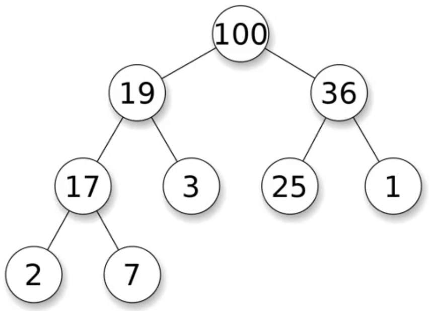
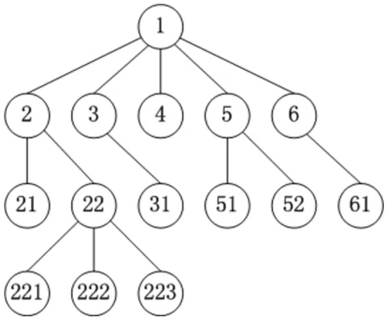

[二叉树（Binary tree）](https://baike.baidu.com/item/%E4%BA%8C%E5%8F%89%E6%A0%91/1602879?fr=aladdin)是树形结构的一个重要类型。许多实际问题抽象出来的数据结构往往是二叉树形式，即使是一般的树也能简单地转换为二叉树，而且二叉树的存储结构及其算法都较为简单，因此二叉树显得特别重要。二叉树特点是每个结点最多只能有两棵子树，且有左右之分。

<!-- more -->

# 树形结构
二叉树：

多叉树：

## 树的基本概念
 
* 节点  
每一个数字都代表一个节点。
* 根节点  
`1` 是整棵数的根节点，一棵树只有一个根节点。
* 父节点  
`1` 是 `2、3、4、5、6` 的父节点，`2` 是 `21、22` 的父节点，`22` 是 `221、222、223` 的父节点。
* 子节点  
`2、3、4、5、6` 是 `1` 的子节点，`21、22` 是 `2` 的子节点，`221、222、223` 是 `22` 的子节点。
* 兄弟节点  
同一个父节点下的子节点互为兄弟节点，如 `2、3、4、5、6` 互为兄弟节点，`21、22` 互为兄弟节点。

* 空树  
一课树可以没有任何节点，称为空树（一课树可以只有1个节点，也就是只有根节点）。
* 子树  
`2、21、22、221、222、223` 与 `3、31` 与 `4` 与 `5、51、52` 与 `6、61` 都是 `1` 的子树。
* 左子树  
`21` 称为 `2` 的左子树。
* 右子树  
`22、221、222、223` 称为 `2` 的右子树。

* 节点的度（degree）  
子树的个数，如 `1` 的度等于 5，`2` 的度等于 2，`6` 的度等于 1，`61` 的度等于 0。
* 树的度  
所有节点度中的最大值，如上面这棵多叉树的度就是 `1` 的度，等于 5。
* 叶子节点（leaf）  
度为 0 的节点，如 `21`、`221`、`222`、`223`、`31`、`4`、`51`、`52`、`61` 都是叶子节点。
* 非叶子节点  
度不为 0 的节点。

* 层数（level）  
根节点在第 1 层，根节点的子节点在第 2 层，以此类推 `221` 在第四层（有些教程也从第 0 层开始计算）。
* 节点的深度（depth）  
从根节点到当前节点的唯一路径上的节点总数，`2` 的深度等于2，`31` 的深度等于 3。
* 节点的高度（height）  
从当前节点到最远叶子节点的路径上的节点总数，`2` 的深度等于3，`31` 的深度等于 0。
* 树的深度  
所有节点深度中的最大值，这个树的深度就是 `221`、`222`、`223` 的深度，等于 4。
* 树的高度  
所有节点高度中的最大值，这棵树的高度就是 `1` 的高度，等于 4。树的深度等于树的高度。

## 有序树、无序树、森林

* 有序树  
树中的任意节点的子节点之间有顺序关系，如 `2、3、4、5、6` 按照大小关系从左至右排。  
* 无序树  
树中任意节点的子节点之间没有顺序关系，也成为“自由树”。
* 森林  
由 m（m >= 0）棵互不相交的树组成的集合。

# 二叉树
二叉树是有序树，二叉树的特点有：
1. 每个节点的度最大为 2（最多拥有 2 棵子树）；
2. 左子树和右子树是有顺序的，即使某节点只有一棵子树，也要区分左右子树。

## 二叉树的性质
1. 非空二叉树的第 i 层，最多有 $2^{i-1}$ 个节点（i >= 1）；
2. 在高度为 h 的二叉树上最多有 `2^h - 1` 个节点（h >= 1）;
3. 对于任何一棵非空二叉树，如果叶子节点个数为 n0，度为 2 的节点个数为 n2，则有：`n0 = n2 + 1`；  
假设度为1的节点个数为 n1，那么二叉树的节点总数 `n = n0 + n1 + n2`，  
二叉树的边数 `T = n1 + 2 * n2 = n - 1 = n0 + n1 + n2 - 1`，  
因此 n0 = n2 + 1。

# 真二叉树
真二叉树：所有的节点的度都要么为 0，要么为 2。

# 满二叉树
满二叉树：最后一层节点的度为 0，其它节点度都为 2。

在同样高度的二叉树中，满二叉树的叶子节点数量最多，总节点数量最多。

满二叉树一定是真二叉树，真二叉树不一定是满二叉树。

假设满二叉树的高度为 h（h >= 1），那么  
第 i 层的节点数量：2^(h-1)；  
叶子节点数量：2^(h-1)；  
总结点数量 n = 2^h - 1 = 2^0 + 2^1 + 2^2 + ... + 2^(h-1)；  
高度 h = log2

$$2^{i-1}$$

$$\begin{equation}
e=mc^2
\end{equation}$$

