[二叉树（Binary tree）](https://baike.baidu.com/item/%E4%BA%8C%E5%8F%89%E6%A0%91/1602879?fr=aladdin)是树形结构的一个重要类型。许多实际问题抽象出来的数据结构往往是二叉树形式，即使是一般的树也能简单地转换为二叉树，而且二叉树的存储结构及其算法都较为简单，因此二叉树显得特别重要。二叉树特点是每个结点最多只能有两棵子树，且有左右之分。

<!-- more -->

# 树形结构
二叉树：

多叉树：

## 树的基本概念
 
* 节点  
每一个数字都代表一个节点。
* 根节点  
`1` 是整棵数的根节点，一棵树只有一个根节点。
* 父节点  
`1` 是 `2、3、4、5、6` 的父节点，`2` 是 `21、22` 的父节点，`3` 是 `31` 的父节点，`5` 是 `51、52` 的父节点，`6` 是 `61` 的父节点，`22` 是 `221、222、223` 的父节点。
* 子节点  
`2、3、4、5、6` 是 `1` 的子节点，`21、22` 是 `2` 的子节点，`31` 是 `3` 的子节点，`51、52` 是 `5` 的子节点，`61` 是 `6` 的子节点，`221、222、223` 是 `22` 的子节点。
* 兄弟节点  
同一个父节点下的子节点互为兄弟节点，如 `2、3、4、5、6` 互为兄弟节点，`21、22` 互为兄弟节点，`51、52` 互为兄弟节点，`221、222、223` 互为兄弟节点。
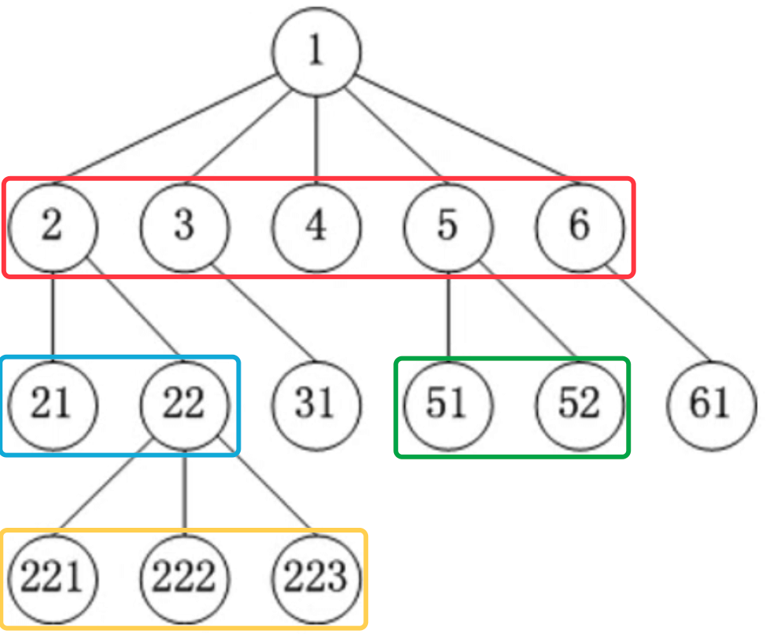

* 空树  
一课树可以没有任何节点，称为空树（一课树可以只有1个节点，也就是只有根节点）。
* 子树  
`2、21、22、221、222、223` 与 `3、31` 与 `4` 与 `5、51、52` 与 `6、61` 都是 `1` 的子树。
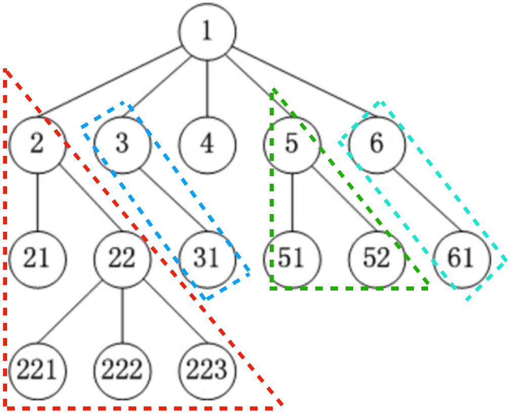
* 左子树  
`21` 称为 `2` 的左子树。
* 右子树  
`22、221、222、223` 称为 `2` 的右子树。

* 节点的度（degree）  
子树的个数，如 `1` 的度等于 5，`2` 的度等于 2，`3` 的度等于 1，`4` 的度等于 0，`5` 的度等于 2，`6` 的度等于 1，`22` 的度等于 3。

* 树的度  
所有节点度中的最大值，如上面这棵多叉树的度就是 `1` 的度，等于 5。
* 叶子节点（leaf）  
度为 0 的节点，如 `21`、`221`、`222`、`223`、`31`、`4`、`51`、`52`、`61` 都是叶子节点。
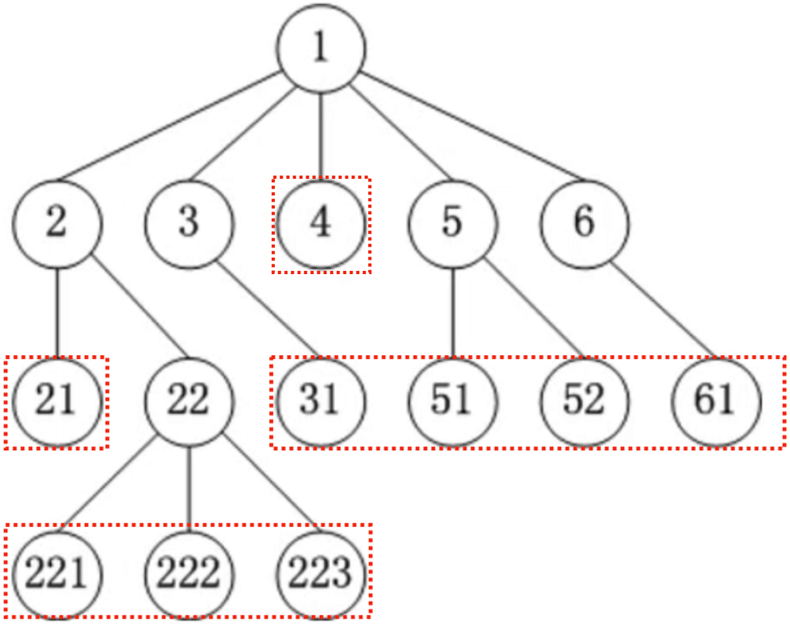
* 非叶子节点  
度不为 0 的节点。

* 层数（level）  
根节点在第 1 层，根节点的子节点在第 2 层，以此类推 `221` 在第四层（有些教程也从第 0 层开始计算）。
* 节点的深度（depth）  
从根节点到当前节点的唯一路径上的节点总数，`2` 的深度等于 2，`31` 的深度等于 3。
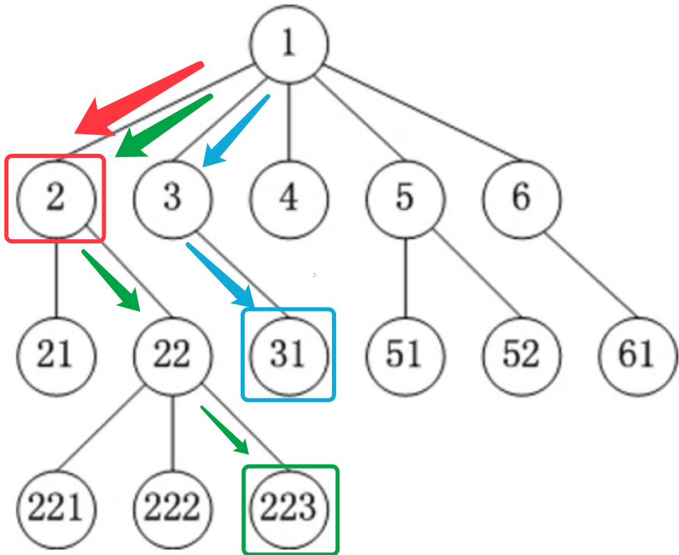
* 节点的高度（height）  
从当前节点到最远叶子节点的路径上的节点总数，`2` 的高度等于 3，`31` 的深度等于 0。
* 树的深度  
所有节点深度中的最大值，这个树的深度就是 `221`、`222`、`223` 的深度，等于 4。
* 树的高度  
所有节点高度中的最大值，这棵树的高度就是 `1` 的高度，等于 4。树的深度等于树的高度。

## 有序树、无序树、森林

* 有序树  
树中的任意节点的子节点之间有顺序关系，如 `2、3、4、5、6` 按照大小关系从左至右排。  
* 无序树  
树中任意节点的子节点之间没有顺序关系，也成为“自由树”。
* 森林  
由 `m`（`m >= 0`）棵互不相交的树组成的集合。

# 二叉树
二叉树是有序树，二叉树的特点有：
1. 每个节点的度最大为 2（最多拥有 2 棵子树，所以所有节点的度要么为 2，要么为 1，要么为 0）；
2. 左子树和右子树是有顺序的，即使某节点只有一棵子树，也要区分左右子树（`49` 在左，`56` 在右；`96` 在右）。
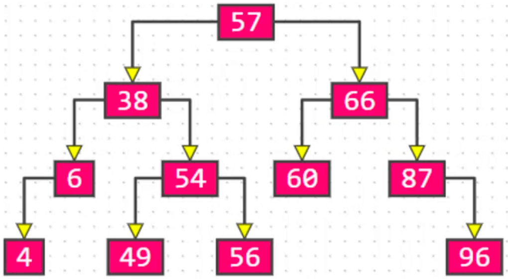
各种情况：
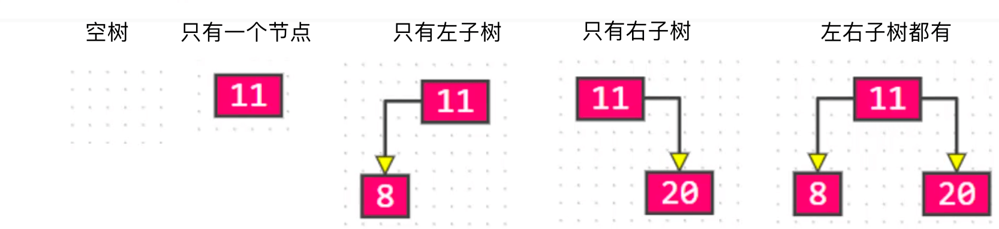
只有左子树或者只有右子树的二叉树，从结构上看跟链表相似：
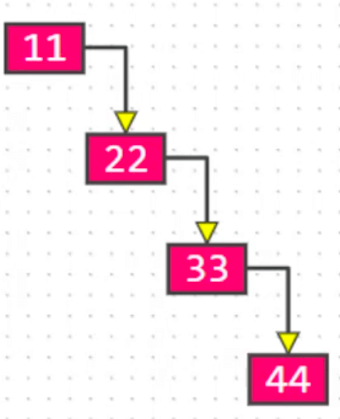

## 二叉树的性质
1. 非空二叉树的第 `i` 层，最多有 `2^(i-1)` 个节点（`i >= 1`）；
2. 在高度为 `h` 的二叉树上最多有 `2^h - 1` 个节点（`h >= 1`）;
3. 对于任何一棵非空二叉树，如果叶子节点个数为 `n0`，度为 2 的节点个数为 `n2`，则有：`n0 = n2 + 1`；  
假设度为1的节点个数为 `n1`，那么二叉树的节点总数 `n = n0 + n1 + n2`，  
二叉树的边数 `T = n1 + 2 * n2 = n - 1 = n0 + n1 + n2 - 1`，  
因此 `n0 = n2 + 1`。
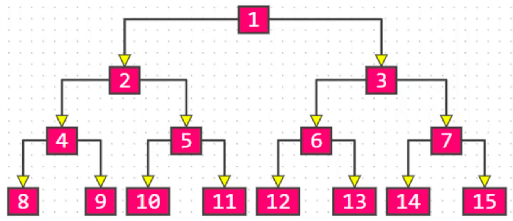

# 真二叉树
真二叉树：所有的节点的度都要么为 0，要么为 2。
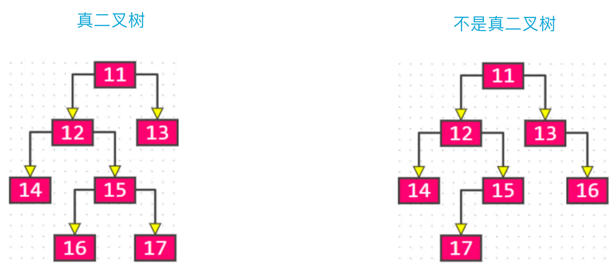

# 满二叉树
1. 满二叉树：最后一层节点的度为 0，其它节点度都为 2。
2. 在同样高度的二叉树中，满二叉树的叶子节点数量最多，总节点数量最多。
3. 满二叉树一定是真二叉树，真二叉树不一定是满二叉树。
4. 假设满二叉树的高度为 `h`（`h >= 1`），那么  
第 `i` 层的节点数量：`2^(i-1)`；  
叶子节点数量：`2^(h-1)`；  
总结点数量 `n = 2^h - 1 = 2^0 + 2^1 + 2^2 + ... + 2^(h-1)`；  
高度 `h = log(2)(n+1)`；

# 完全二叉树
完全二叉树：对节点从上至下、左至右开始编号，其所有编号都能与相同高度的满二叉树中的编号对应。
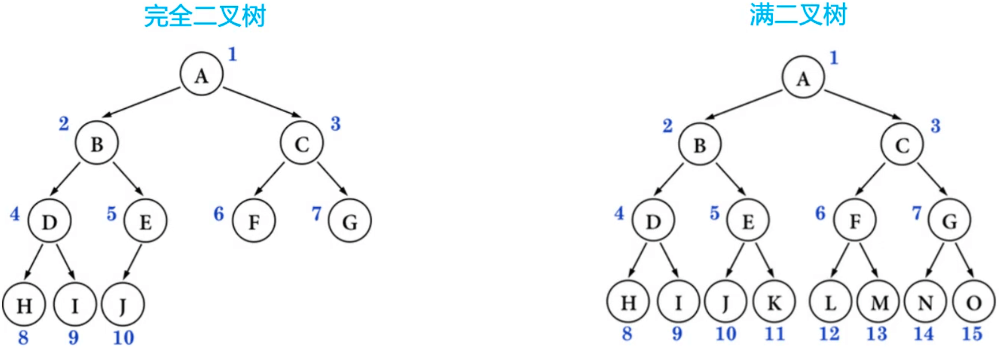

叶子节点只会出现在最后两层，最后一层的叶子节点都是靠左对齐。  
完全二叉树从根节点至倒数第二层是一棵满二叉树。  
满二叉树一定是完全二叉树，完全二叉树不一定是满二叉树。

## 完全二叉树的性质
1. 度为 1 的节点只有左子树。  
2. 度为 1 的节点要么是 1 个，要么是 0 个。  
3. 同样节点数量的二叉树，完全二叉树的高度最小。  
4. 假设完全二叉树的高度为 `h`（`h >= 1`），那么  
至少有 `2^(h-1)` 个节点（`2^0 + 2^1 + 2^2 + ... + 2^(h-2) + 1`）；  
最多有 `2^h - 1` 个节点（`2^0 + 2^1 + 2^2 + ... + 2^(h-2)`，即满二叉树）；  
5. 假设总结点数量为 `n`，那么  
`2^(h-1) <= n < 2^h`  ->  `h - 1 <= log(2)(n) < h`  ->  `h = floor(log(2)(n)) + 1`；  
6. 一棵有 `n` 个节点的完全二叉树（`n > 0`），从上到下、从左到右对节点从 1 开始进行编号，对任意第 `i` 个节点：  
如果 `i = 1`，它是根节点；  
如果 `i > 1`，它的父节点编号为 `floor(i/2)`；  
如果 `2i <= n`，它的左子节点编号为 `2i`；  
如果 `2i > n`，它无左子节点；  
如果 `2i + 1 <= n`，它的右子节点编号为 `2i + 1`；  
如果 `2i + 1 > n`，它无右子节点；  

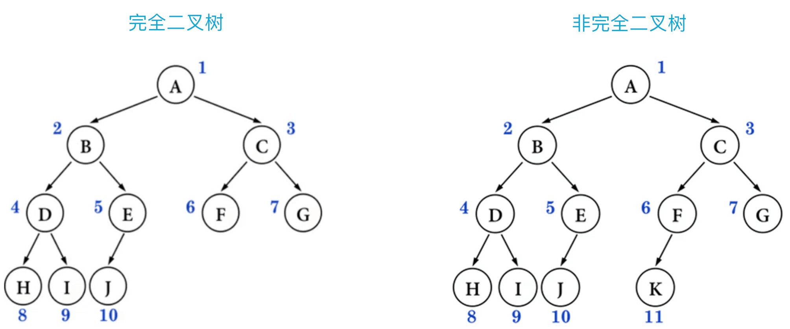

ps：`floor` 是向下取整；另外，`ceiling` 是向上取整；编程中的 `*`、`/` 都是向下取整。

# 练习
如果一个完全二叉树有 768 个节点，求叶子节点的个数？
叶子节点个数为 768/2 = 389。

解析：  
设叶子节点个数为 `n0`，度为 1 的节点个数为 `n1`，度为 2 的节点个数为 `n2 `， 
则总结点个数 `n = n0 + n1 + n2`，  
又 `n0 = n2 + 1`，所以 `n = 2 * n0 + n1 - 1`。

因为完全二叉树的度为 1 的节点个数 `n1` 要么等于 0，要么等于 1，则  
当 `n1 == 1` 时，`n = 2 * n0`，`n` 必然是偶数，所以叶子节点个数 `n0 = n/2`，非叶子节点个数 `n1 + n2 = n/2`；  
当 `n1 == 0` 时，`n = 2 * n0 - 1`，`n` 必然是奇数，所有叶子节点个数 `n0 = (n + 1)/2`，非叶子节点个数 `n1 + n2 = (n - 1)/2`。

（`n0 = (n + 1)/2` 可以写作 `n0 = n/2 + 1/2`，结合 `n1 == 1` 的情况（`n0 = n/2`），叶子节点个数可以总结为👇）

综上，叶子节点个数 `n0 = floor((n + 1)/2) = ceiling(n/2)`，非叶子节点个数 `n1 + n2 = floor(n/2) = ceiling((n-1)/2)`。

