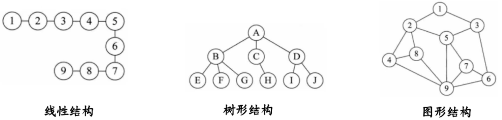
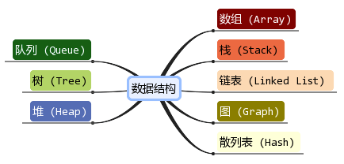
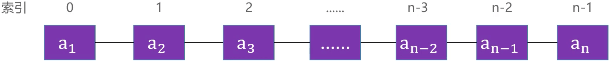
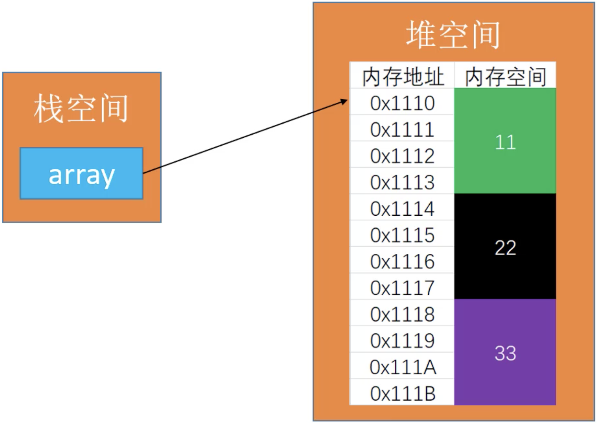
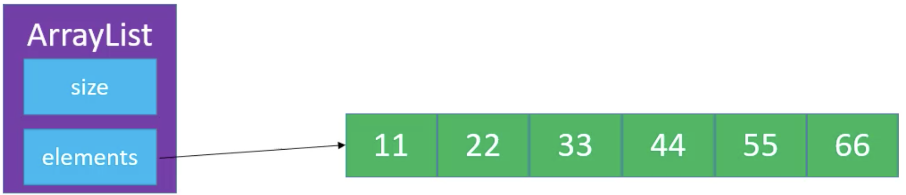
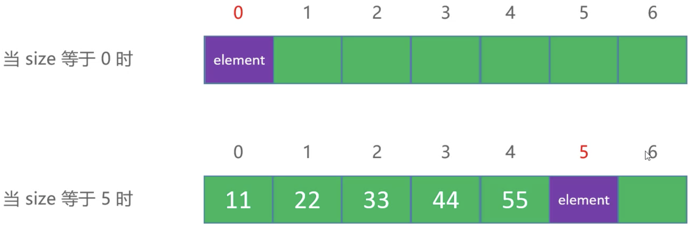
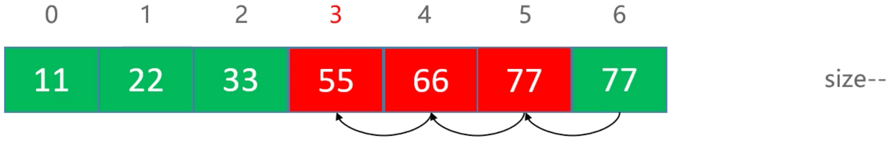
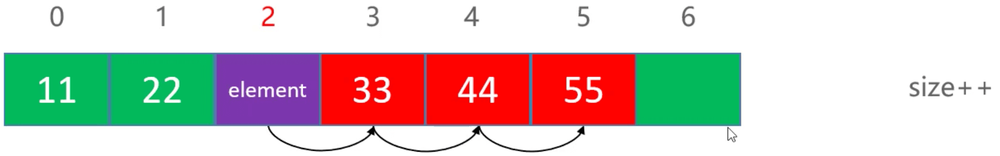
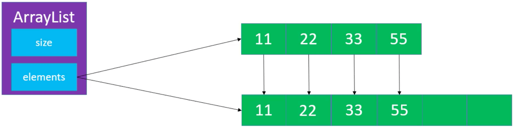
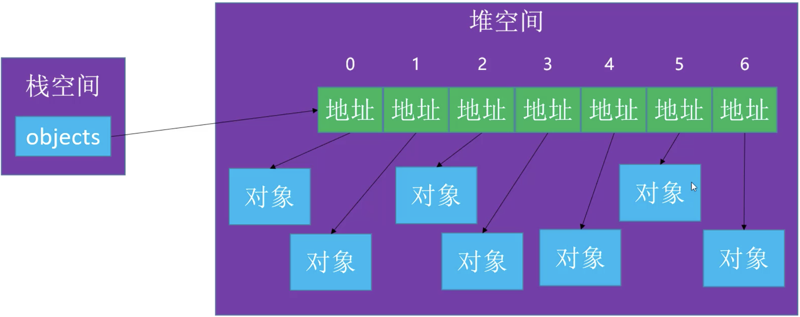

[动态数组](https://baike.baidu.com/item/%E5%8A%A8%E6%80%81%E6%95%B0%E7%BB%84/10997983?fr=aladdin)是指在声明时没有确定数组大小的数组，即忽略圆括号中的下标；当要用它时，可随时用ReDim语句重新指出数组的大小。使用动态数组的优点是可以根据用户需要，有效利用存储空间。

<!-- more -->

# 数据结构

[数据结构](https://baike.baidu.com/item/%E6%95%B0%E6%8D%AE%E7%BB%93%E6%9E%84/1450?fr=aladdin)是计算机存储、组织数据的方式。数据结构是指相互之间存在一种或多种特定关系的数据元素的集合。通常情况下，精心选择的数据结构可以带来更高的运行或者存储效率。数据结构往往同高效的检索算法和索引技术有关。

## 数据的逻辑结构
指反映数据元素之间的逻辑关系的数据结构，其中的逻辑关系是指数据元素之间的前后间关系，而与他们在计算机中的存储位置无关。逻辑结构包括：
1. 集合：数据结构中的元素之间除了“同属一个集合” 的相互关系外，别无其他关系；
2. 线性结构：数据结构中的元素存在一对一的相互关系；  
3. 树形结构：数据结构中的元素存在一对多的相互关系； 
4. 图形结构：数据结构中的元素存在多对多的相互关系。

线性结构包括：线性表、数组、链表、栈、队列和哈希表。  
树形结构包括：二叉树、AVL树、红黑树、B树、堆、Trie、哈夫曼树和并查集。  
图形结构包括：邻接矩阵和邻接表。

## 常用的数据结构：


## 线性表
[线性表](https://baike.baidu.com/item/%E7%BA%BF%E6%80%A7%E8%A1%A8/3228081?fr=aladdin)是最基本、最简单、也是最常用的一种数据结构。线性表（linear list）是数据结构的一种，一个线性表是n个具有相同特性的数据元素的有限序列。


a1 是首节点（首元素），an 是为节点（尾元素）。  
a1 是 a2 的前驱，a2 是 a1 的后继。

ps：[什么是线性表](http://data.biancheng.net/view/157.html)

## 数组
[数组](https://baike.baidu.com/item/%E6%95%B0%E7%BB%84/3794097?fr=aladdin)是一种顺序存储的线性表，所有元素的内存地址是连续的。一维数组是最简单的数组，其逻辑结构是线性表。
```
int[] array = new int[]{11, 22, 33};
```


在很多编程语言中，数组都有个致命的缺点，无法动态修改容量。怎么实现一个容量可以动态修改的数组呢？👇

ps：[什么是数组](http://data.biancheng.net/view/181.html)

# 动态数组

## 接口设计
```
public class ArrayList<E> {
	
	/**
	 * 清除所有元素
	 */
	public void clear() {}

	/**
	 * 元素的数量
	 * @return
	 */
	public int size() {}

	/**
	 * 是否为空
	 * @return
	 */
	public boolean isEmpty() {}

	/**
	 * 是否包含某个元素
	 * @param element
	 * @return
	 */
	public boolean contains(E element) {}

	/**
	 * 添加元素到尾部
	 * @param element
	 */
	public void add(E element) {} 

	/**
	 * 获取index位置的元素
	 * @param index
	 * @return
	 */
	public E get(int index) {}

	/**
	 * 设置index位置的元素
	 * @param index
	 * @param element
	 * @return 原来的元素ֵ
	 */
	public E set(int index, E element) {}

	/**
	 * 在index位置插入一个元素
	 * @param index
	 * @param element
	 */
	public void add(int index, E element) {}

	/**
	 * 删除index位置的元素
	 * @param index
	 * @return
	 */
	public E remove(int index) {}

	/**
	 * 查看元素的索引
	 * @param element
	 * @return
	 */
	public int indexOf(E element) {}
}
```

## 实现方案


定义 size 记录数组的大小，定义 elements 存储元素。
```
public class ArrayList<E> {

	/*
	 * 元素的数量
	 */
	private int size;
	
    /*
	 * 所有的元素
	 */
	private E[] elements;
	
    /*
	 * 默认容量
	 */
	private static final int DEFAULT_CAPACITY = 10;
	
    /*
	 * 构造方法
	 */
	public ArrayList(int capacity) {
		capacity = (capacity < DEFAULT_CAPACITY) ? DEFAULT_CAPACITY : capacity;
		elements = (E[]) new Object[capacity];
	}
	
    /*
	 * 构造方法
	 */
	public ArrayList() {
		this(DEFAULT_CAPACITY);
	}
}
```

## 添加元素

添加新元素，就是在 size 处添加新元素，代码实现：
```
public void add(int element) {
    elements[size++] = element;
}
```

## 删除元素
size 等于 7，index 等于 3：

从 `index + 1` 处开始依次向前移动，最后一个元素不做处理（因为执行了 `size--`，所以最后一个元素不会被外界访问到）：
```
public E remove(int index) {
	int old = elements[index];
	for (int i = index + 1; i < size; i++) {
		elements[i - 1] = elements[i];
	} 
	elements[--size] = null;
	return old;
}
```

## 插入元素
size 等于 5，index 等于 2：

从 `size - 1` 处开始依次向后移动，最后覆盖 index 处的元素：
```
public void add(int index, int element) {
	for (int i = size; i > index; i--) {
		elements[i] = elements[i - 1];
	}
	elements[index] = element;
	size++;
}
```

## 扩容

创建新的数组，新数组的容量为旧数组容量的1.5倍（iOS 1.6倍, java 1.5倍）。
```
private void ensureCapacity(int capacity) {
    int oldCapacity = elements.length;
    if (oldCapacity >= capacity) return;
    
    int newCapacity = oldCapacity + (oldCapacity >> 1); // >> 表示除以2
    int[] newElements = new int[newCapacity];
    for (int i = 0; i < size; i++) {
        newElements[i] = elements[i];
    }
    elements = newElements;
}
```

## 泛型
使用泛型技术可以让动态数组更加通用，可以存放任何数据类型。  
E 表示泛型：
```
public class ArrayList<E> {
	/*
	 * 元素的数量
	 */
	private int size;
	/*
	 * 所有的元素
	 */
	private E[] elements;
}
```

使用 Object 创建的数组可以存放所有对象类型，因为所有的类都继承自Object。
```
elements = (E[]) new Object[capacity];
```

示例：
```
ArrayList<Integer> ints = new ArrayList<>();
ints.add(10);

ArrayList<Object> objs = new ArrayList<>();
objs.add(10);
objs.add(new Person(10, "Tom"));
```

# 对象数组
数组中存放的是对象地址。


删除元素时，需要将数组对应的位置设为 null：
```
/**
* 清除所有元素
*/
public void clear() {
	for (int i = 0; i < size; i++) {
		elements[i] = null;
	}
	size = 0;
}
/**
* 删除index位置的元素
* @param index
* @return
*/
public E remove(int index) {
	rangeCheck(index);
	E old = elements[index];
	for (int i = index + 1; i < size; i++) {
		elements[i - 1] = elements[i];
	} 
	elements[--size] = null;
	return old;
}
```

如果数组支持 null，需要修改 `indexOf()` 方法：
```
public int indexOf(E element) {
	if (element == null) {
		for (int i = 0; i < size; i++) {
			if (elements[i] == null) return i;
		}
	} else {
		for (int i = 0; i < size; i++) {
			//if (elements[i] == element) return i; // == 比较内存地址
			if (elements[i].equals(element)) return i; // 重写 equals()。Integer 调用 equals()，内部比较的是数值
		}	
	}
	return ELEMENT_NOT_FOUND;
}
```


