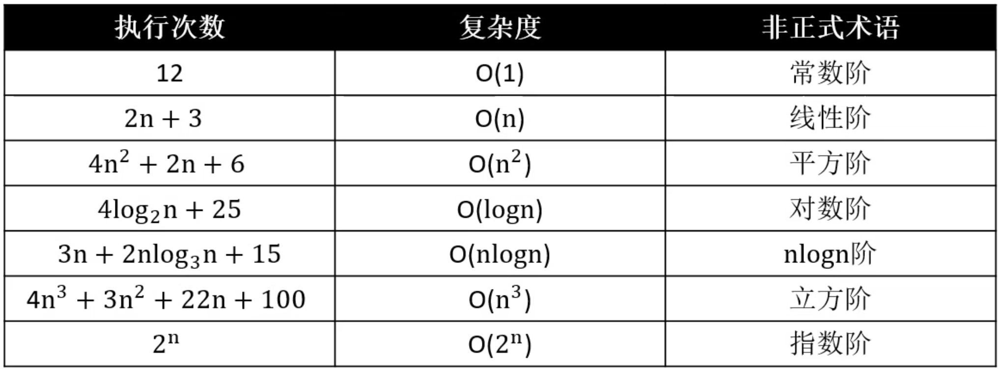
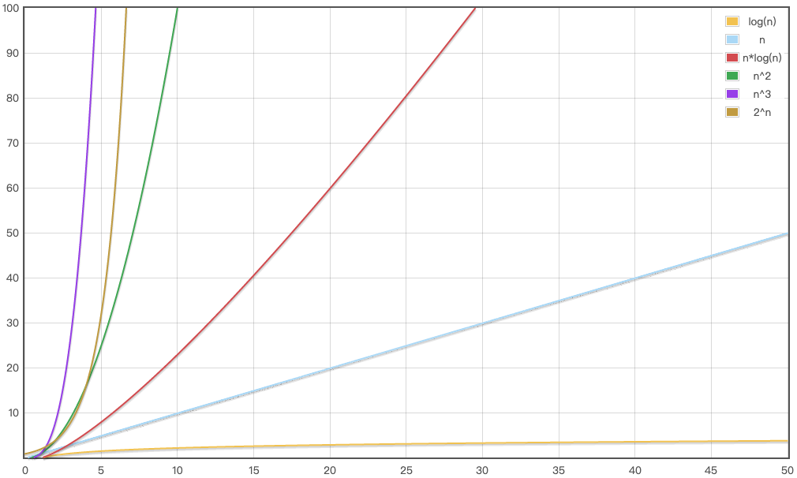
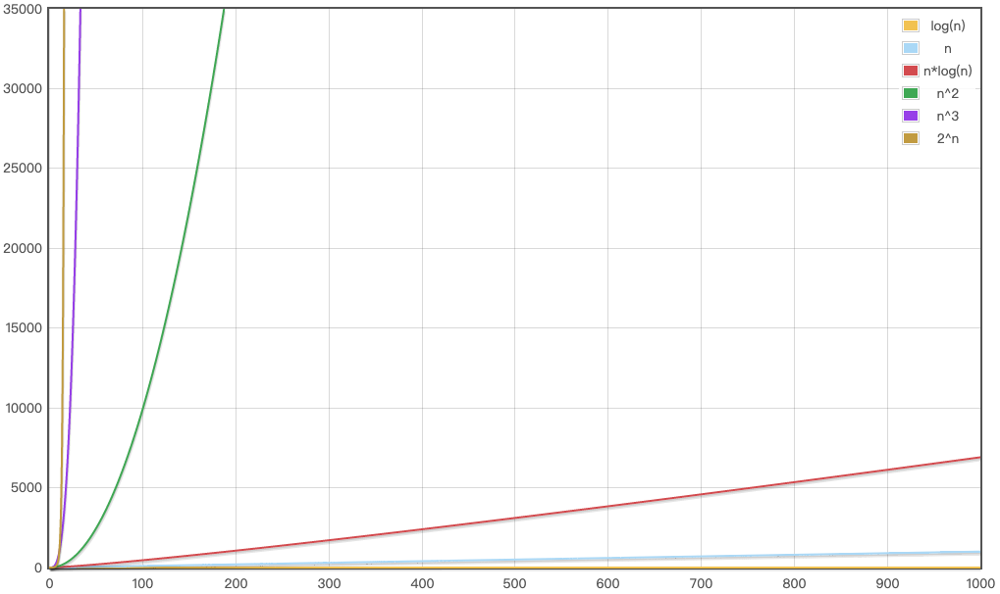
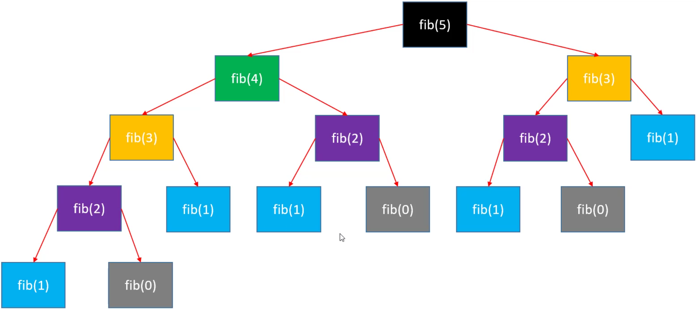
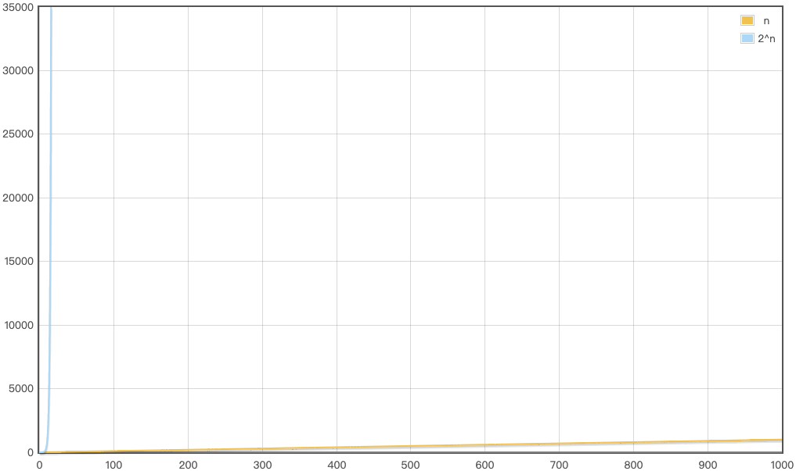
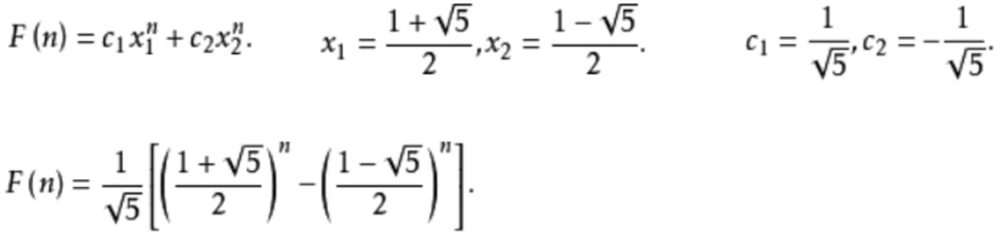

斐波那契数 & 算法的评估 & 时间复杂度的估算 & 大O表示法 & 斐波那契数复杂度分析
<!-- more -->

# 算法
[算法](https://baike.baidu.com/item/%E7%AE%97%E6%B3%95/209025?fr=aladdin)是用于解决特定问题的一系列的执行步骤。如：  
```
// 计算a跟b的和
public static int plus(int a, int b) {
    return a + b;
}

// 计算1+2+3+...+n的和
public static int sum(int n) {
    int result = 0;
    for (int i = 1; i <= n; i++) {
        result += i;
    }
    return result;
}
```

# 例一
使用不同的算法解决同一个问题，效率可能相差非常大。如：求第n个斐波那契数。

👉 斐波那契数列又称黄金分割数列，指的是这样一个数列：0、1、1、2、3、5、8、13、21、34、…… 在数学上，斐波那契数列以如下被以递推的方法定义：F(0)=0，F(1)=1, F(n)=F(n - 1)+F(n - 2)（n ≥ 3，n ∈ N*）。

方式一：
```
public static int fib1(int n) {
    if (n <= 1) return n;
    return fib1(n - 1) + fib1(n - 2);
}

public static void main(String[] args) {
    System.out.println(fib1(1));
    System.out.println(fib1(2));
    System.out.println(fib1(3));
    System.out.println(fib1(4));
    System.out.println(fib1(64));
}
```

打印结果：
```
1
1
2
3
```

从打印结果可以看到，第1、2、3、4个斐波那契数能够正常打印，而第64个斐波那契数却无法正常打印。

方式二：
```
/*
* 下标：0 1 2 3 4 5 6 7
* 数值：0 1 1 2 3 5 8 13 ...
*/
public static int fib2(int n) {
    if (n <= 1) return n;
    
    int first = 0;
    int second = 1;
    for (int i = 0; i < n - 1; i++) {
        int sum = first + second;
        first = second;
        second = sum;
    }
    return second;
}

public static void main(String[] args) {
    System.out.println(fib2(64));
}
```

打印结果：
```
695895453
```

# 算法的评估
## 事后统计法
如果单从执行效率上进行评估，可以比较不同算法对同一组输入的执行处理时间，这种方案也叫作：事后统计法。

* 优点：
  从执行处理时间可以直观的看出来算法的优劣；
* 缺点：
  执行时间严重依赖硬件以及运行时葛总不确定的环境因素；
  必须编写相应的测算代码（Times）；
  测试数据的选择比较难保证公正性；

使用自定义工具 Times 查看两种实现方式的执行时间：
```
public static void main(String[] args) {
    int n = 44;

    Times.test("fib1", new Task() {
        public void execute() {
            System.out.println(fib1(n));
        }
    });

    Times.test("fib2", new Task() {
        public void execute() {
            System.out.println(fib2(n));
        }
    });
}
```

打印结果：
```
695895453
【fib1】
开始：17:58:32.163
-298632863
结束：17:59:19.046
耗时：46.883秒
-------------------------------------
【fib2】
开始：17:59:19.047
-1109825406
结束：17:59:19.047
耗时：0.0秒
-------------------------------------
```

从打印结果可以看到，fib1 是非常耗时的，而 fib2 在同样的数据条件下，执行时间基本为0。

## 算法的优劣
一般从以下维度评估算法的优劣：  
* 正确性、可读性、健壮性（对不合理输入的反应能力和处理能力）。
* 时间复杂度（time complexity）：估算程序指令的执行次数（执行时间）。
* 空间复杂度（space complexity）：估算所需占用的存储空间。

# 时间复杂度
[时间复杂度](https://baike.baidu.com/item/%E6%97%B6%E9%97%B4%E5%A4%8D%E6%9D%82%E6%80%A7/5930669?fromtitle=%E6%97%B6%E9%97%B4%E5%A4%8D%E6%9D%82%E5%BA%A6&fromid=1894057&fr=aladdin)：在计算机科学中，时间复杂性，又称时间复杂度，算法的时间复杂度是一个函数，它定性描述该算法的运行时间。这是一个代表算法输入值的字符串的长度的函数。时间复杂度常用大O符号表述，不包括这个函数的低阶项和首项系数。使用这种方式时，时间复杂度可被称为是渐近的，亦即考察输入值大小趋近无穷时的情况。

## 大O表示法
一般用大O表示法来描述复杂度，它表示的是数据规模 n 对应的复杂度。  

[大O表示法](https://baike.baidu.com/item/%E5%A4%A7O%E8%A1%A8%E7%A4%BA%E6%B3%95/1851162?fr=aladdin)：算法的时间复杂度通常用大O符号表述，定义为T[n] = O(f(n))。称函数T(n)以f(n)为界或者称T(n)受限于f(n)。 如果一个问题的规模是n，解这一问题的某一算法所需要的时间为T(n)。T(n)称为这一算法的“时间复杂度”。当输入量n逐渐加大时，时间复杂度的极限情形称为算法的“渐近时间复杂度”。

使用大O表示法时会忽略常数、系数、低阶，如：
```
9 >> O(1)
2*n + 3 >> O(n)
n^2 + 2n + 6 >> O(n^2)
4*n^3 + 3*n^2 + 22*n + 100 >> O(n^3)
```

👉 注意：大O表示法仅仅是一种粗略的分析模型，是一种估算，能帮助我们短时间内了解一个算法的执行效率。

对数：`8 = 2^3  ->  3 = log2(8)`、`16 = 2^4  ->  4 = log2(16)`

对数阶的细节：  
对数阶一般省略底数，如：`log2(n) = log2(9) * log9(n)`，省略常数项后就是 `log2(n) = log9(n)`，所以 log2(n)、log9(n) 统称为 logn。

示例：
```
// O(1)
public static void test1(int n) {
    // 1
    if (n > 10) { 
        System.out.println("n > 10");
    } else if (n > 5) { // 2
        System.out.println("n > 5");
    } else {
        System.out.println("n <= 5"); 
    }
    
    // 1 + 4 + 4 + 4
    for (int i = 0; i < 4; i++) {
        System.out.println("test");
    }
}

// O(n)
public static void test2(int n) {
    // 1 + 3n
    for (int i = 0; i < n; i++) {
        System.out.println("test");
    }
}

// O(n)
public static void test3(int n) {
    // 1 + 2n + n * (1 + 3n)
    // 1 + 2n + n + 3n^2
    // 3n^2 + 3n + 1
    // O(n^2)
    for (int i = 0; i < n; i++) {
        for (int j = 0; j < n; j++) {
            System.out.println("test");
        }
    }
}

// O(n)
public static void test4(int n) {
    // 1 + 2n + n * (1 + 45)
    // 1 + 2n + 46n
    // 48n + 1
    for (int i = 0; i < n; i++) {
        for (int j = 0; j < 15; j++) {
            System.out.println("test");
        }
    }
}

/* 对数
 *  8 = 2^3  ->  3 = log2(8)
 * 16 = 2^4  ->  4 = log2(16)
 */

// O(logn)
public static void test5(int n) {
    // log2(n)
    while ((n = n / 2) > 0) {
        System.out.println("test");
    }
}

// O(logn + nlogn) -> O(logn)
public static void test6(int n) {
    // log5(n)
    while ((n = n / 5) > 0) {
        System.out.println("test");
    }
}

// O(nlogn)
public static void test7(int n) {
    // 1 + 2*log2(n) + log2(n) * (1 + 3n)
    // 1 + 3*log2(n) + 2 * nlog2(n)
    for (int i = 1; i < n; i = i * 2) {
        // 1 + 3n
        for (int j = 0; j < n; j++) {
            System.out.println("test");
        }
    }
}
```

## 常见的复杂度  
O(1) < O(logn) < O(n) < O(nlogn) < O(n^2) < O(n^3) < O(2^n) < O(n!) < O(n^n)


使用[函数图像绘制工具](https://zh.numberempire.com/graphingcalculator.php)绘制 `log(n),n,n*log(n),n^2,n^3,2^n`：

数据规模比较小时

数据规模比较大时


## 多个数据规模的情况
```
// O(n + k)
public static void test(int n, int k) {
    for (int i = 0; i < n; i++) {
        System.out.println("test");
    }
    
    for (int i = 0; i < k; i++) {
        System.out.println("test");
    }
}
```

# 空间复杂度
```
// O(1)
public static void test1(int n) {
    if (n > 10) { 
        System.out.println("n > 10");
    } else if (n > 5) { // 2
        System.out.println("n > 5");
    } else {
        System.out.println("n <= 5"); 
    }
    
    // 只初始化了一个 i
    for (int i = 0; i < 4; i++) {
        System.out.println("test");
    }
}

// O(1)
public static void test2(int n) {
    // 只初始化了一个 i
    for (int i = 0; i < n; i++) {
        System.out.println("test");
    }
}

// O(n)
public static void test10(int n) {
    int a = 10;
    int b = 20;
    int c = a + b;
    int[] array = new int[n]; // 申请大小为n的空间
    for (int i = 0; i < array.length; i++) {
        System.out.println(array[i] + c);
    }
}
```

# 例一的时间复杂度
```
// O(2^n)
public static int fib1(int n) {
    if (n <= 1) return n;
    return fib1(n - 1) + fib1(n - 2);
}

// O(n)
public static int fib2(int n) {
    if (n <= 1) return n;
    
    int first = 0;
    int second = 1;
    for (int i = 0; i < n - 1; i++) {
        int sum = first + second;
        first = second;
        second = sum;
    }
    return second;
}
```

在 fib1 中，如果 n = 5，那么结果就是：1 + 2 + 4 + 8 = 2^0 + 2^1 + 2^2 + 2^3 = 2^4 - 1，即 fib1(n) = 2^(n-1) - 1 = 0.5 * 2^n - 1，所以 fib1(n) 的复杂度为 O(2^n)。


使用[函数图像绘制工具](https://zh.numberempire.com/graphingcalculator.php)绘制 `n,2^n`：


可以看出 fib1(n) 和 fib2(n) 的差别很大，如果有一台1GHz的普通计算机，运算速度为10^9次每秒，让 n = 64，那么：  
O(n)大约耗时6.4 * 10^-8秒  
O(2^n)大约耗时584.94年

fib2 补充一：
```
// O(n)
public static int fib2(int N) {
    if (N <= 1) return N;

    int first = 0;
    int second = 1;
    while(N-- > 1) {
        second += first;
        first = second - first;
    }
    return second;
}
```

fib2 补充二：使用斐波那契公式

```
// O(1)
public static int fib2(int N) {
    double c = Math.sqrt(5); // 根号5
    return (int)((Math.pow((1 + c) / 2, N) - Math.pow((1 - c) / 2, N)) / c);
}
```

👉 注意：这里是假定 sqrt 和 pow 的时间复杂度都是 O(1) 的前提下，得出 fib3 的时间复杂度是 O(1)。实际情况还得根据使用的 sqrt 和 pow 的真实时间复杂度而定，比如有些 pow 实现的真实复杂度是 O(logn)。

# 算法的优化方向

* 用尽量稍等存储空间
* 用尽量少的执行步骤
* 空间换时间
* 时间换空间

ps：  
[leetcode](https://leetcode-cn.com/)
[斐波那契数](https://leetcode-cn.com/problems/fibonacci-number/)